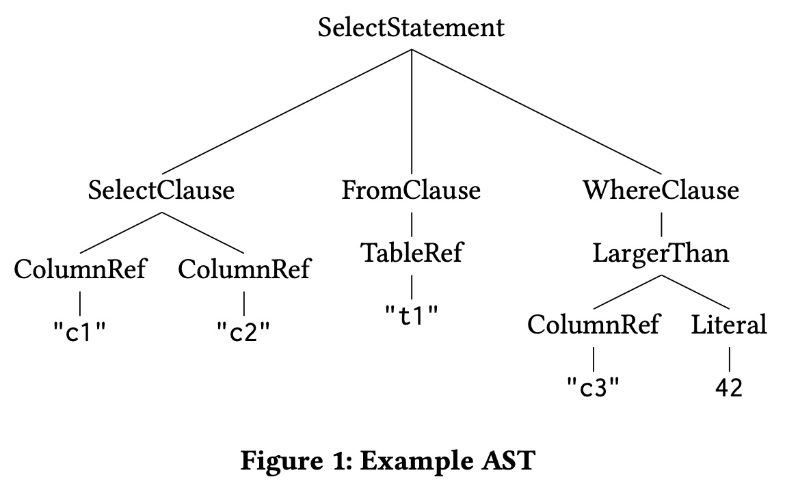
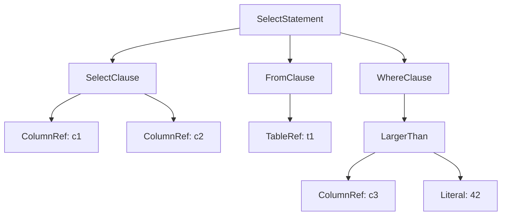

## AI论文解读 | Runtime-Extensible Parsers
        
### 作者        
digoal        
        
### 日期        
2025-11-24        
        
### 标签        
PostgreSQL , PolarDB , DuckDB , AI , 论文解读        
        
----        
        
## 背景  
      
https://vldb.org/cidrdb/papers/2025/p18-muhleisen.pdf        
  
提示:          
```          
读懂《Runtime-Extensible Parsers》这篇论文需要提前掌握哪些基础知识, 请使用中文通熟易懂的讲解这些基础知识, 可以引用论文中的图、表或使用Markdown支持的图形(text,mermaid等)增加解释性. 
  
使用中文通熟易懂的解读《Runtime-Extensible Parsers》这篇论文, 其中的关键内容请着重讲解, 可以引用论文中的图、表或使用Markdown支持的图形(text,mermaid等)增加解释性. 
  
提取《Runtime-Extensible Parsers》这篇论文中的重要术语, 使用中文对这些术语进行通熟易懂的讲解, 可以引用论文中的图、表或使用Markdown支持的图形(text,mermaid等)增加解释性. 
```     
  
## 1 前置知识 
  
阅读这篇名为《Runtime-Extensible Parsers》（运行时可扩展解析器）的论文，你需要理解数据库系统如何“读懂”代码，以及为什么传统的“读法”已经过时了。

为了让你能够轻松消化这篇论文，我整理了你需要掌握的**四大核心基础知识模块**。我会用通俗的语言配合图表来解释这些概念。

-----

### 1\. SQL 查询的生命周期 (The Life of a Query)

在深入解析器（Parser）之前，你需要知道解析器在数据库“消化”查询语句的过程中处于什么位置。

**通俗解释：**
想象你在餐厅点菜。

1.  **输入 (Input):** 你说了一句“我要一份宫保鸡丁，不要花生”。
2.  **词法分析 (Lexing):** 服务员把你这句话拆解成关键词：“宫保鸡丁”、“不要”、“花生”。
3.  **语法分析 (Parsing):** 厨师拿到单子，理解这就意味着“做一个主菜，包含特定的配菜指令”。这篇论文关注的就是**这一步**。
4.  **绑定 (Binding):** 确认厨房里真的有“鸡丁”和“花生”这些原料（检查表和列是否存在）。

**论文中的流程：**
论文指出，SQL 查询从字符串变成内部树状结构（AST），解析器是起点 。


  * **词法分析 (Lexing/Tokenization):** 把代码字符串切分成一个个有意义的单元（Token）。例如 `SELECT c1` 变成 `"SELECT", "c1"` 。
  * **语法分析 (Syntactic Analysis):** 检查这些 Token 连起来是否符合语法规则，并把它们组装成树 。

-----

### 2\. 抽象语法树 (AST - Abstract Syntax Tree)

**通俗解释：**
AST 是代码的“骨架”或“结构图”。它去掉了括号、分号等不影响语义的符号，只保留逻辑结构。

**论文中的例子：**
论文展示了一个简单的 SQL 查询 `SELECT c1, c2 FROM t1 WHERE c3 > 42` 如何变成一棵树。你可以看到 `SelectStatement` 是树根，下面分叉出 `SelectClause`（查什么）、`FromClause`（从哪查）和 `WhereClause`（什么条件）。

  

**[引用论文 Figure 1]**

> 这是一个典型的 AST 结构图，展示了 SQL 语句的层级关系 。

  * **根节点:** SelectStatement
  * **子节点:** SelectClause, FromClause, WhereClause
  * **叶子节点:** 具体的值，如 "c1", "t1", 42。

理解 AST 很重要，因为解析器的最终产出就是这个东西。

-----

### 3\. 传统解析技术：YACC 与 LALR(1) (The "Old Way")

这篇论文主要是在批判这种技术，所以你得知道它是什么，以及为什么作者觉得它不好。

**通俗解释：**

  * **YACC/Bison:** 这是最经典的“解析器生成器”。就像一个老式的工厂模具，你给它图纸（语法规则），它在**编译时**（工厂盖好前）就生成好了一台机器（解析器代码）。
  * **编译时 (Compile-time):** 这是关键词。因为解析规则被“烧录”进了数据库的二进制文件里，一旦数据库运行起来，你就不能改规则了 。
  * **自底向上 (Bottom-up):** 它看代码的方式是从细节看起，尝试把小碎片拼成大积木。
  * **LALR(1):** 这是一种算法，意思是“向左看，向右看一个词（Token）”。它的特点是快，但是很死板。

**为什么论文批评它？**

1.  **僵化：** 想要支持新语法（比如新的 SQL 标准或方言），必须修改源码并重新编译整个数据库软件 。
2.  **报错难看：** 著名的 MySQL 报错 "You have an error... near..." 就是这种解析器的锅。它要么全盘接受，要么全盘拒绝，很难告诉你具体怎么改 。
3.  **冲突噩梦：** 写规则时经常遇到“移进/归约冲突” (Shift-Reduce Conflict)，就像机器人不知道该把手里的砖头砌上去，还是再拿一块砖头，非常难调试 。

-----

### 4\. 现代解析技术：PEG (The "New Solution")

这是论文提倡的方案，用来实现“运行时可扩展”。

**通俗解释：**

  * **PEG (Parsing Expression Grammar):** 这是一个更现代的规则写法。
  * **自顶向下 (Top-down):** 它的思路是：“我先猜这是一条 SELECT 语句，然后去验证”。
  * **优先选择 (Ordered Choice):** 这是 PEG 的核心。它像一个走迷宫的机器人。遇到分叉路口时，它严格按照你给的顺序尝试：先试 A 路，通了就走；不通就回退（Backtrack）试 B 路。
      * *优点：* 永远不会有歧义，第一条路通了就不管第二条 。
      * *优点：* 不需要复杂的编译步骤，可以在程序运行时直接加载新规则 。
  * **Packrat Parsing:** 因为 PEG 需要回退（试错），可能会慢。Packrat 是一种“记性很好”的技术（记忆化），把试过的结果存起来，避免重复计算，用空间换时间 。

**对比图解：**

| 特性 | YACC / LALR (旧) | PEG (新) |
| :--- | :--- | :--- |
| **方向** | 自底向上 (拼积木)  | 自顶向下 (走迷宫)  |
| **歧义处理** | 容易冲突，需要复杂的预判 | **有序选择**：先匹配到的算数  |
| **扩展性** | **差**：必须重新编译数据库软件  | **强**：运行时加载新规则，无需重启  |
| **错误提示** | 往往只能报“语法错误” | 可以定制友好的错误建议  |

-----

### 总结：为什么这篇论文重要？

读这篇论文前，你只需要明白：
目前的数据库（如 PostgreSQL, MySQL）大多还在用 1970 年代的技术（YACC）来读 SQL 。这导致我们很难给数据库添加新功能（比如支持 Python 风格的查询或图查询），除非重写整个软件。

作者提出用 **PEG** 技术重写解析器，虽然速度可能会稍微慢一点（约 10 倍，但在微秒级别差距可接受），但换来的是极大的灵活性——你可以像装插件一样，随时教会数据库一种新的语言 。
  
## 2 解读论文 
  
这篇论文《Runtime-Extensible Parsers》（运行时可扩展解析器）由 DuckDB Labs 的团队（Hannes Mühleisen 和 Mark Raasveldt）撰写 。

它的核心观点非常直接： **现代数据库（DBMS）的“听力系统”（解析器）已经严重过时了，我们需要用新技术（PEG）来替换它，让数据库能够随时学会新的“方言”。**

以下是对这篇论文的通俗解读。

-----

### 1\. 核心问题：数据库还在用 60 年前的“助听器”

论文一开篇就指出，尽管数据库的其他部分（如执行引擎、存储）都在飞速进步，但**解析器（Parser）** —— 也就是负责把 SQL 语句翻译成机器能懂的代码的那个组件——却几乎没有任何创新 。

  * **现状：** 现有的主流数据库（PostgreSQL, MySQL, SQLite, Oracle 等）几乎都在使用 **YACC (Yet Another Compiler-Compiler)** 或其变体（Bison）。
  * **技术背景：** YACC 基于 1960 年代的 LALR(1) 技术 。
  * **坏处：**
    1.  **僵化（Monolithic）：** 解析规则是在**编译时**（软件出厂前）写死的。如果你想加一个新的语法（比如支持图查询），你必须修改源代码并重新编译整个数据库 。
    2.  **报错难看：** 著名的 "You have an error in your SQL syntax..." 就是这种技术的产物。它要么全盘接受，要么全盘拒绝，很难告诉你具体错在哪，怎么改 。
    3.  **扩展困难：** 随着数据库插件（Extensions）越来越流行（如 PostGIS, pgvector），插件想添加自定义语法变得非常困难，只能通过传字符串这种笨办法绕过 。

-----

### 2\. 解决方案：PEG (解析表达文法)

作者提出，应该用 **PEG (Parsing Expression Grammar)** 来重写数据库的解析器 。

#### 为什么 PEG 更好？

PEG 是一种更现代的解析技术（Python 最近也转用了 PEG ）。它主要有以下优势：

1.  **运行时可扩展 (Runtime Extensibility)：** 这是论文标题的核心。PEG 不需要复杂的预编译步骤。数据库启动后，插件可以动态地把“新语法规则”喂给解析器，解析器立刻就能听懂新指令，完全不需要重启或重新编译 。
2.  **没有歧义 (Ordered Choice)：** 传统的 YACC 经常会因为规则冲突（Shift/Reduce Conflict）而报错，开发者为了修冲突头发掉光。PEG 采用“有序选择”，也就是“先试第一条路，通了就不管第二条”，天生没有歧义 。
3.  **更智能的纠错：** PEG 允许开发者定义“错误恢复规则”。如果用户写错了，解析器可以不直接崩溃，而是匹配到这个错误，并给出这就好比“贴心建议” 。

#### YACC vs PEG 对比

| 特性 | 传统解析器 (YACC/Bison) | 新方案 (PEG) |
| :--- | :--- | :--- |
| **生成时机** | **编译时** (出厂定死) | **运行时** (随时加载) |
| **灵活性** | 极差，改语法需重编译 | 极强，插件可动态扩展语法 |
| **错误提示** | "Syntax Error" (冷漠) | 可定制具体的修改建议 (贴心) |
| **冲突处理** | 容易冲突，调试困难 | 只要排序正确，永无冲突 |

-----

### 3\. 实战演示：教数据库“新语言”

为了证明这套理论可行，作者实现了一个原型解析器，并做了三个有趣的实验。

#### 实验 A：添加 UNPIVOT 语句 

SQL 标准里没有 `UNPIVOT`（把列转成行），但很多用户想要。

  * **做法：** 在运行时，直接向 PEG 解析器注册一条新规则：如果遇到 `UNPIVOT` 关键字，就按新逻辑解析。
  * **结果：** 仅修改了几行规则，数据库立马就能跑 `UNPIVOT t1 ON ...` 了，无需重启 。

#### 实验 B：支持图查询语法 (SQL/PGQ) 

图查询（Graph Query）语法很复杂，通常需要专门的图数据库。

  * **做法：** 修改 `SELECT` 语句的规则，允许在 `FROM` 子句中识别 `GRAPH_TABLE` 和图匹配模式 `(a)-[e]->(b)` 。
  * **结果：** 成功解析了复杂的图查询语句 。

#### 实验 C：支持 R 语言风格 (dplyr) 

这是最酷的一个实验。R 语言的数据分析包 `dplyr` 使用管道符 `%>%` 来串联操作。

  * **代码示例：**
    ```sql
    -- 传统的 SQL
    SELECT ... FROM ...

    -- 新支持的 dplyr 风格
    df %>% 
      filter(n > 1) %>% 
      summarise(mean(mass))
    ```
  * **做法：** 在解析器里加个规则，允许“标识符 + `%>%` + 动词”的结构 。
  * **结果：** 数据库直接看懂了这种非 SQL 的语言！这让不同语言背景的开发者都能用自己舒服的方式查数据库 。

-----

### 4\. 性能与代价：稍微慢一点，但值得

天下没有免费的午餐，PEG 也有缺点。

  * **速度对比：**
      * PostgreSQL (YACC): 解析 TPC-H Q1 查询耗时 **0.03 ms** 。
      * 原型解析器 (PEG): 解析同样查询耗时 **0.3 ms** 。
  * **结论：** PEG 比 YACC 慢了大约 **10 倍** 。
  * **为什么没关系？**
      * 虽然慢了 10 倍，但单位是“微秒”级。对于一个可能要跑几秒甚至几分钟的分析型查询（OLAP）来说，0.3 毫秒的解析时间几乎可以忽略不计 。
      * 作为交换，我们获得了极大的灵活性和更好的用户体验。

-----

### 5\. 抽象语法树 (AST) 可视化

论文中展示了解析后的产物——抽象语法树（AST）。这是解析器把你的 SQL 变成树形结构的过程。

**[引用 Figure 1]** 简单的 SQL 解析树示例：    
`SELECT c1, c2 FROM t1 WHERE c3 > 42`




-----

### 6\. 总结与未来

这篇论文的核心贡献在于打破了数据库解析器必须是“静态、死板”的传统观念。

**关键结论：**

1.  **可扩展性是未来：** 数据库正变成生态系统，解析器必须支持插件动态扩展语法 。
2.  **用户体验提升：** 通过 PEG 的错误恢复机制，可以给出类似“你是不是想把 GROUP BY 放在 ORDER BY 前面？”这样的人性化提示 。
3.  **DuckDB 的计划：** 作者团队（DuckDB Labs）计划在未来将 DuckDB 的解析器从 fork 自 Postgres 的 YACC 版本迁移到 PEG 版本 。

简而言之，这就是要把数据库从一个“只懂一种死板方言的老学究”，变成一个“随时能学习新语言的现代翻译官”。
  
## 3 术语 
  
在这篇论文《Runtime-Extensible Parsers》中，作者讨论了如何让数据库“听得懂”更多样的语言。为了读懂这篇论文，我们需要理解以下几个核心术语。我将它们分为**基础概念**、**传统技术的痛点**和**现代技术的解决方案**三个部分来进行通俗解读。

-----

### 一、 基础概念：数据库是如何“听话”的？

#### 1\. Parser (解析器)

**定义：** 它是数据库管理系统（DBMS）的一个组件，负责把用户输入的 SQL 字符串（比如 `"SELECT * FROM t1"`）转换成计算机内部能处理的树状结构 。
**通俗解释：** 解析器就像是**翻译官**。你对数据库说了一句英语（SQL），解析器把它翻译成数据库内核能听懂的指令。它是查询语句“旅程的起点” 。

#### 2\. Lexical Analysis / Tokenization (词法分析)

**定义：** 解析的第一步。它把一整串字符切分成一个个有意义的单词，称为“Token” 。
**通俗解释：** 就像读句子时分词。

  * **例子：** 输入 `SELECT c1 FROM t1`
  * **词法分析结果：** `["SELECT", "c1", "FROM", "t1"]` 。
  * **特点：** 这一步很“傻”，它只管分词，不管意思。比如你写 `SELEXT 42`（拼写错误），它也会照样切分，不会报错，直到下一步才会发现问题 。

#### 3\. AST (Abstract Syntax Tree, 抽象语法树)

**定义：** 解析的最终产物。它是一个树状的数据结构，代表了查询语句的逻辑结构 。
**通俗解释：** 它是代码的**骨架图**。去掉了空格、括号等装饰，只保留核心逻辑。

**论文 Figure 1 的可视化复现：**    
这是 SQL 语句 `SELECT c1, c2 FROM t1 WHERE c3 > 42` 的“骨架”：


-----

### 二、 传统技术的痛点：为什么现在的解析器“不好用”？

#### 4\. YACC / Bison (老牌解析器生成器)

**定义：** 目前绝大多数主流数据库（如 PostgreSQL, MySQL, Oracle）都在使用的工具，基于 1970 年代的技术 。
**通俗解释：** 这是一个**老式的模具工厂**。

  * **Compile-time (编译时死板)：** 你必须在软件出厂前（编译时）就把规则定死。一旦生成了二进制文件，就不能改了。想加新功能？请重写代码并重新编译整个数据库 。
  * **Monolithic (铁板一块)：** 生成出来的解析器巨大且僵化，很难拆分或扩展 。

#### 5\. LALR(1) (Look-Ahead Left-to-Right)

**定义：** YACC 内部使用的算法。它是一种“自底向上”（Bottom-up）的分析方法 。
**通俗解释：** 这种算法像是在**拼积木**。它看着手里的碎片（Token），试图把它们拼成更大的组件（如表达式），最后拼成完整的语句。

  * **限制：** 它只能“向前看一个词”（Look-ahead 1）。如果这里有歧义，它就瞎了，不知道该拼成啥。

#### 6\. Shift-Reduce Conflict (移进-归约冲突)

**定义：** 使用 YACC 开发语法时最头疼的问题。当解析器面临两个选择：是继续读入下一个词（Shift），还是把手里的词合并成一个规则（Reduce），而它无法决定时，就会报这个错 。
**通俗解释：** **机器人卡壳了**。

  * 场景：你手里拿着一块砖。
  * 冲突：机器人不知道是该先把这块砖砌到墙上（归约），还是再去拿一块砖来看看（移进）。
  * 后果：因为这种冲突很难解决，开发者很难往现有数据库里加新语法 。

-----

### 三、 现代技术的解决方案：怎么让解析器“灵活”起来？

#### 7\. PEG (Parsing Expression Grammar, 解析表达文法)

**定义：** 论文提倡的替代方案。它是一种“自顶向下”（Top-down）的解析方法 。
**通俗解释：** 这种算法像是**走迷宫清单**。它从最高层（比如“这是一条 SQL 语句”）开始猜，然后一层层往下验证。

  * **最大优势：** 不需要预编译！可以在程序运行时（Runtime）动态加载新规则 。

#### 8\. Ordered Choice (有序选择)

**定义：** PEG 解决歧义的核心机制。在语法规则中，选项是有顺序的（使用 `/` 符号）。
**通俗解释：** **先到先得**。

  * 规则：`规则A / 规则B`
  * 逻辑：先试 `规则A`，如果通了，就绝对不看 `规则B`；只有 `A` 不通才试 `B`。
  * 好处：永远不会有歧义，开发者完全可控，不会像 YACC 那样产生莫名其妙的冲突 。

#### 9\. Packrat Parsing (Packrat 解析技术)

**定义：** 为了解决 PEG 可能存在的重复计算问题（因为要不断试错），采用的一种“记忆化”（Memoization）技术 。
**通俗解释：** **记性很好的解析器**。

  * 原理：解析器在试错过程中，会把试过的结果记在小本本上。下次再遇到同样的情况，直接查小本本，不用重新算。
  * 代价：用空间（内存）换时间，能保证解析速度是线性的（Linear Time），但更吃内存 。

#### 10\. Runtime-Extensible (运行时可扩展)

**定义：** 论文的最终目标。指解析器可以在数据库运行的过程中，动态接受并理解新的语法规则 。
**通俗解释：** 就像给游戏**装 MOD（模组）** 。

  * 以前（YACC）：想玩新地图必须重做整个游戏。
  * 现在（PEG）：游戏开着的时候，直接加载一个“图查询插件”或“Python 语法插件”，数据库立马就能听懂新指令了，不需要重启 。
  
## 参考        
         
https://vldb.org/cidrdb/papers/2025/p18-muhleisen.pdf    
        
<b> 以上内容基于DeepSeek、Qwen、Gemini及诸多AI生成, 轻微人工调整, 感谢杭州深度求索人工智能、阿里云、Google等公司. </b>        
        
<b> AI 生成的内容请自行辨别正确性, 当然也多了些许踩坑的乐趣, 毕竟冒险是每个男人的天性.  </b>        
    
#### [PolarDB 学习图谱](https://www.aliyun.com/database/openpolardb/activity "8642f60e04ed0c814bf9cb9677976bd4")
  
  
#### [PostgreSQL 解决方案集合](../201706/20170601_02.md "40cff096e9ed7122c512b35d8561d9c8")
  
  
#### [德哥 / digoal's Github - 公益是一辈子的事.](https://github.com/digoal/blog/blob/master/README.md "22709685feb7cab07d30f30387f0a9ae")
  
  
#### [About 德哥](https://github.com/digoal/blog/blob/master/me/readme.md "a37735981e7704886ffd590565582dd0")
  
  

  
