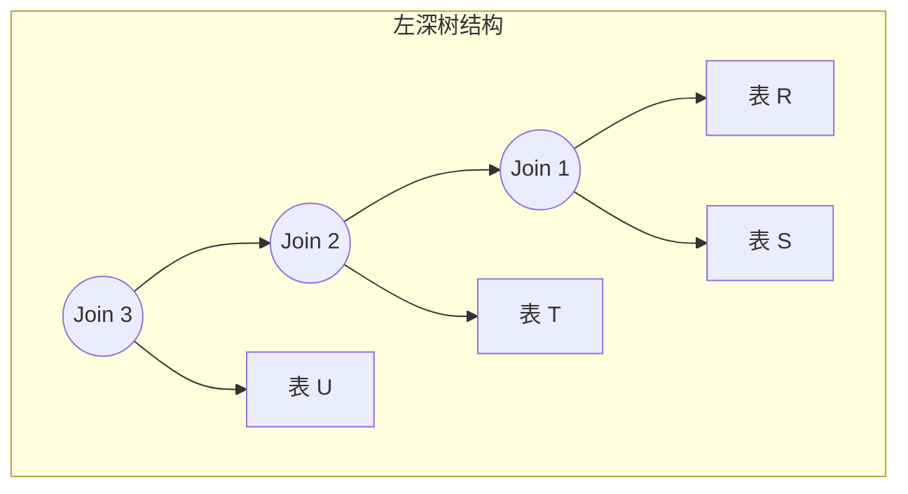
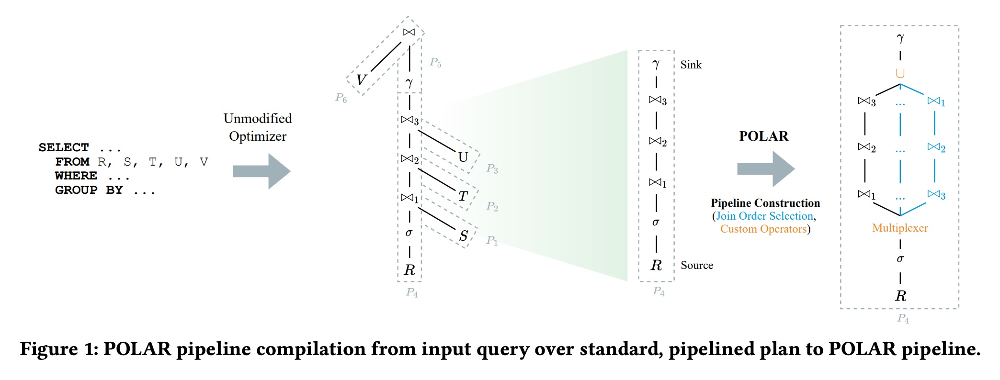
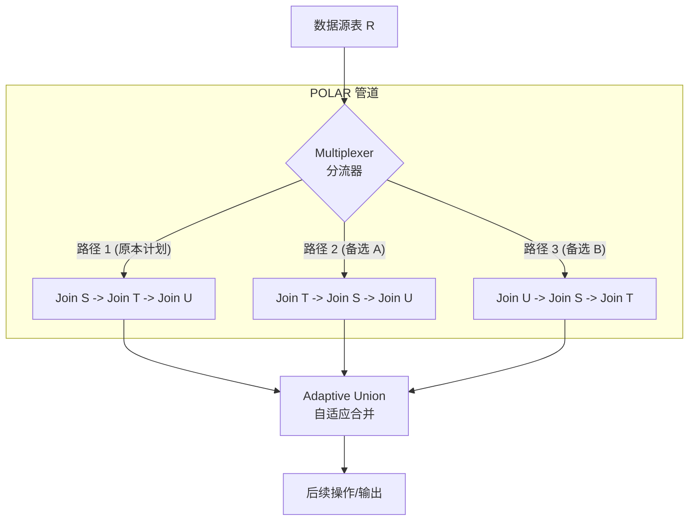

## AI论文解读 | POLAR: Adaptive and Non-invasive Join Order Selection via Plans of Least Resistance
        
### 作者        
digoal        
        
### 日期        
2025-11-24        
        
### 标签        
PostgreSQL , PolarDB , DuckDB , AI , 论文解读        
        
----        
        
## 背景  
      
https://www.vldb.org/pvldb/vol17/p1350-justen.pdf        
  
提示:          
```          
读懂《POLAR: Adaptive and Non-invasive Join Order Selection via Plans of Least Resistance》这篇论文需要提前掌握哪些基础知识, 请使用中文通熟易懂的讲解这些基础知识, 可以引用论文中的图、表或使用Markdown支持的图形(text,mermaid等)增加解释性. 
  
使用中文通熟易懂的解读《POLAR: Adaptive and Non-invasive Join Order Selection via Plans of Least Resistance》这篇论文, 其中的关键内容请着重讲解, 可以引用论文中的图、表或使用Markdown支持的图形(text,mermaid等)增加解释性. 
  
提取《POLAR: Adaptive and Non-invasive Join Order Selection via Plans of Least Resistance》这篇论文中的重要术语, 使用中文对这些术语进行通熟易懂的讲解, 可以引用论文中的图、表或使用Markdown支持的图形(text,mermaid等)增加解释性. 
```     
  
## 1 前置知识 
  
要深入理解《POLAR: Adaptive and Non-invasive Join Order Selection via Plans of Least Resistance》这篇论文，你需要掌握数据库内核开发中的几个核心概念。这篇论文提出了一种在查询执行过程中“自适应”地调整连接顺序的方法，旨在解决由于统计信息不准导致的性能问题。

以下是通俗易懂的基础知识讲解，结合了论文中的概念和图表辅助理解。

-----

### 1\. 核心痛点：连接顺序与基数估计 (Join Ordering & Cardinality Estimation)

**通俗解释：**
想象你要把三张表（R, S, T）的数据拼在一起。

  * **方案 A：** 先拼 R 和 S（结果很大），再把巨大的结果去拼 T。 -\> **慢**，内存爆炸。
  * **方案 B：** 先拼 S 和 T（结果很小），再用这个小结果去拼 R。 -\> **快**，省资源。

数据库优化器（Optimizer）的工作就是从无数种组合中选出“方案 B”。为了做出选择，它必须玩一个“猜谜游戏”： **基数估计**（猜一下 R 和 S 拼完有多少行数据）。

**论文背景：**
论文在引言中直击痛点：“由于复杂的查询中间结果特征未知或不断变化...精确估计基数仍然是一个极其困难的问题” 。

  * 如果猜错了（例如低估了中间结果），优化器可能会选出极差的执行计划 。
  * POLAR 的目标就是：既然猜不准，那就在**运行时**试错，哪条路好走走哪条（即“最小阻力计划” Plans of Least Resistance）。

-----

### 2\. 执行计划形状：左深树 (Left-Deep Trees)

**通俗解释：**
在数据库连接中，执行计划通常像一棵树。

  * **左深树 (Left-Deep Tree)：** 就像一条流水线。第一个表的结果查出来，立马喂给第二个表做连接，结果再喂给第三个... 数据像是在在一个管道（Pipeline）里流动。
  * **特点：** 这种结构非常适合**流水线执行 (Pipelining)** ，不需要把中间结果全部存下来再做下一步。

**图解 (Mermaid):**



**论文联系：**
POLAR 专门针对这种**左深树**进行改进。

  * 请看论文中的 **Figure 1** 。左侧展示了传统的左深树，数据（R, S, T, U...）依次连接。     
  * POLAR 做的事情是：在这个流水线的源头（Source R）安装一个“分流器”（Multiplexer），在运行时决定数据流向哪种连接顺序的管道 。

-----

### 3\. 自适应查询处理 (Adaptive Query Processing, AQP)

**通俗解释：**

  * **传统模式：** 像打印出来的地图。出发前规划好路线，路上遇到堵车（数据量比预期大）也没法换路，只能硬着头皮走。
  * **自适应模式 (AQP)：** 像 Google Maps/高德导航。出发前规划一条路，但开到一半发现堵车，立马计算新路线并切换。

**POLAR 的特殊之处：**
传统的 AQP 往往很复杂，需要修改很多底层代码（侵入性强）。POLAR 主打**非侵入式 (Non-invasive)** 。

  * 它不修改优化器核心，而是在生成好的计划上“外挂”一些备选路线 。
  * 它引入了一个概念叫 **Tuple Routing（元组路由）** ：把一部分数据丢给“路线 A”跑，另一部分丢给“路线 B”跑，看谁跑得快（产生的中间结果少），然后把剩下的大部分数据都路由到那条“阻力最小”的路上去 。

-----

### 4\. 向量化执行 (Vectorized Execution)

**通俗解释：**
早期的数据库是一行一行处理数据的（像在超市结账，一件一件扫码）。现代分析型数据库（如 DuckDB，本论文的原型基础）采用**向量化执行**。

  * **机制：** 一次处理一批数据（比如一次处理 1024 行，称为一个 Chunk 或 Vector）。这利用了 CPU 的缓存和指令集，速度极快。

**论文联系：**
理解这一点对于理解论文中的 **Routing Strategies (路由策略)** 至关重要。

  * 因为是批量处理，POLAR 的“分流器”不是针对每一行数据做决定，而是针对**每一个数据块 (Chunk)** 做决定 。
  * **挑战：** 频繁切换路线会破坏 CPU 缓存，降低向量化的效率。论文中提到的 `AdaptWindowSize` 策略就是为了在“灵敏度”和“缓存效率”之间找平衡 。

-----

### 5\. 论文核心图解汇总

为了读懂论文，请重点关注 **Figure 1**：    

| 组件 | 解释 |
| :--- | :--- |
| **Unmodified Optimizer** | 左边的图。这是没改过的 DuckDB 生成的计划，一条路走到黑 。 |
| **Multiplexer (多路复用器)** | POLAR 增加的核心组件。它接收数据源 R，决定把数据包发给右边众多的 Join Order 中的哪一个 。 |
| **Alternative Join Orders** | 图右侧的多个平行管道（蓝色线条）。例如一个管道是 R-\>S-\>T，另一个是 R-\>T-\>S。它们共享哈希表（Hash Tables），所以内存开销很小 。 |
| **Resistance Metric (阻力指标)** | POLAR 用来衡量好坏的标准。简单理解：中间结果行数越少，阻力越小，计划越好 。 |

### 总结：阅读路线图

当你阅读这篇论文时，带上这把“钥匙”：

1.  **问题：** 传统的“先猜后跑”经常猜错（基数估计不准）。
2.  **方法：** 我们不要只跑一条路，我们准备多条路（Alternative Join Orders）。
3.  **执行：** 数据像流水一样过来（Left-deep），我们在源头装个阀门（Multiplexer）。
4.  **策略：** 扔一点数据去试探各条路的拥堵情况（Exploration），然后把主力数据流切到最通畅的那条路（Exploitation），这个过程要利用向量化（Chunk-based）来保证高性能。

掌握了这些，你就可以顺畅地理解 POLAR 如何在 DuckDB 中实现高达 9 倍的性能提升了 。
  
## 2 解读论文 
  
这篇论文《POLAR: Adaptive and Non-invasive Join Order Selection via Plans of Least Resistance》提出了一种名为 **POLAR** 的新型查询处理技术。它的核心目标是解决数据库查询优化中因“猜不准数据量”（基数估计错误）而导致查询变慢的经典难题 。

简单来说，POLAR 不依赖优化器在运行前“赌”一条路，而是允许查询在运行时**自适应地尝试多条路径**，并自动把大部分数据引导到产生中间结果最少（阻力最小）的那条路径上去 。

以下是对该论文的通俗解读：

-----

### 1\. 核心背景：为什么要搞 POLAR？

在传统的数据库（如 DuckDB, PostgreSQL）中，查询优化器像是一个在那“纸上谈兵”的指挥官：

1.  **事前规划**：在查询开始前，优化器会根据统计信息猜测表与表连接（Join）后的行数（基数估计）。
2.  **一锤定音**：基于猜测，选定一个它认为最优的连接顺序（例如先连表A和表B，再连表C）。
3.  **无法回头**：一旦开始执行，就算发现猜错了（比如A和B连完产生了巨量数据），系统也只能硬着头皮跑完，导致性能极差 。

**POLAR 的思路**：既然猜不准，那就在**运行时（Runtime）** 边跑边看。它不仅准备了原本的计划，还准备了几条“备选路线”。

-----

### 2\. POLAR 的工作原理：像导航避开拥堵

POLAR 的核心机制可以用“多路复用”来理解。它不像传统执行那样只有一条流水线，而是构建了一个包含多条并行连接顺序的管道。

#### 2.1 架构图解

论文中的 **Figure 1** 展示了 POLAR 如何改造查询计划。我们可以用下面的图来理解其结构：    



  * **分流器 (Multiplexer)** ：这是 POLAR 的大脑。它负责接收源数据（以数据块/Batch的形式），并决定把当前这块数据扔给哪条路径去处理 。
  * **多条路径 (Alternative Join Orders)** ：这些路径共享哈希表（Build Side），所以内存开销很小。它们仅仅是探测（Probe）的顺序不同 。
  * **阻力最小 (Least Resistance)** ：POLAR 认为，中间产生的结果行数越少，执行就越快。这个“中间结果数量”就是“阻力” 。

#### 2.2 核心流程

1.  **探测阶段**：刚开始，分流器会往每条路径都送一点数据，看看哪条路产生的中间结果最少（即“阻力最小”）。
2.  **利用阶段**：发现某条路特别顺畅后，分流器会把绝大部分数据都路由到这条路上 。
3.  **再探索阶段**：为了防止数据分布发生变化（比如前一半数据适合路径A，后一半适合路径B），它会利用“后悔预算（Regret Budget）”偶尔给其他路径送点数据，持续监测路况 。

-----

### 3\. 关键技术点（着重讲解）

#### 3.1 怎么衡量哪条路好？（阻力指标）

POLAR 定义了一个简单的公式来计算某条路径的“阻力” $r$ ：

$$r = \frac{I}{T} + w$$

  * $I$ ：当前路径产生的中间结果行数。
  * $T$ ：输入到该路径的行数。
  * $w$ ：一个常数，代表处理开销。
    **解读**：如果一条路径吃进去 100 行，只吐出来 1 行中间结果，说明过滤性极好，阻力 $r$ 小，是优质路径 。

#### 3.2 怎么选路？（路由策略）

论文对比了多种策略，最终推荐 **AdaptWindowSize**。这是一个权衡了“灵敏度”和“执行效率”的策略。

  * **挑战**：现代数据库（如 DuckDB）是**向量化执行**的，一次处理一批数据。如果频繁切换路径（比如这行走路径A，下一行走路径B），会破坏 CPU 缓存，导致虽然路径选对了，但跑起来反而慢了 。
  * **AdaptWindowSize 策略**：它不是逐行切换，而是基于**窗口（Window）** 。它会计算一个窗口大小（例如接下来的 100 个数据块），在窗口期内只走最佳路径。窗口结束后，再重新快速评估一下其他路径。这样既保证了向量化的高效，又能适应数据变化 。

#### 3.3 非侵入式设计 (Non-invasive)

这是 POLAR 区别于以前类似技术（如 Eddies, SkinnerDB）的最大亮点。

  * **以前的痛点**：以前的自适应技术往往需要重写整个数据库内核，工程量巨大，且难以调试 。
  * **POLAR 的做法**：它不修改优化器核心逻辑。它只是在优化器生成计划后，识别出适合优化的部分（左深连接树），然后把这段管道“替换”成 POLAR 管道。这使得它很容易集成到现有的系统中 。

-----

### 4\. 实验效果：真的快了吗？

论文在 **DuckDB** 上实现了 POLAR，并引入了一个新的基准测试 **SSB-skew**（因为标准 SSB 数据太均匀，体现不出自适应的优势）。

  * **极端情况提升巨大**：在数据有倾斜（Skew）或相关性（Correlation）的场景下（SSB-skew），POLAR 比原始 DuckDB 快了 **1.94倍**，部分查询甚至快了 **9倍** 。
  * **极低的开销**：在不需要优化的场景下（由于有后悔预算控制），POLAR 的额外开销非常小，总执行时间仅增加不到 7% 。
  * **对比竞品**：性能优于现有的自适应系统（如 SkinnerDB），主要得益于它保留了向量化执行的优势 。

### 5\. 总结

**POLAR** 的核心思想可以总结为一句俗语：“**不要把鸡蛋放在一个篮子里，且要根据路况实时换车道**”。

它通过一种轻量级、非侵入的方式，让数据库在执行复杂的连接操作时，能够自动识别并切换到产生中间数据最少的路径。这不仅避免了因统计信息错误导致的“灾难级”慢查询，还保证了在正常情况下的高性能 。
  
## 3 术语 
  
以下是《POLAR: Adaptive and Non-invasive Join Order Selection via Plans of Least Resistance》论文中的核心术语解读。为了让你更轻松地理解，我将这些术语分为“核心理念”、“架构组件”和“策略机制”三个部分进行讲解。

-----

### 一、 核心理念：为什么要这么做？

#### 1\. POLAR (Plans of Least Resistance / 最小阻力计划)

  * **通俗解释**：
    想象你在开车回家，有三条路可选。通常导航软件会根据**历史数据**给你推荐一条路。但如果那条路突然发生了临时事故（数据倾斜或估算错误），你就堵死了。
    POLAR 的意思是：不要只盯着那条“理论上最快”的路。水流总是自然流向阻力最小的地方，数据库查询也应该如此。POLAR 会在运行时探测哪条路产生的中间数据（垃圾数据/无用数据）最少，那条路就是“阻力最小”的路，然后把大部分数据都往那条路上赶 。
  * **一句话定义**：一种自适应查询处理技术，通过实时路由数据到中间结果最少的连接顺序上，来避免性能灾难。

#### 2\. Adaptive Query Processing (AQP / 自适应查询处理)

  * **通俗解释**：
    传统数据库是“先计划，后执行”。就像旅行前定好攻略，如果这就景点关门了，你也只能傻站在那。
    AQP 是“边走边看”。如果发现当前计划执行得很慢（比如估算的数据量是 1 万，结果来了 1 亿），系统会自动调整策略 。
  * **POLAR 的不同点**：很多现有的 AQP 技术（如 Eddies）需要把数据库拆得“底朝天”（侵入性强），很难维护。POLAR 主打**非侵入式**，它不修改现有的优化器核心，只在生成好的计划上“打补丁”，更容易集成到商业数据库中 。

#### 3\. Cardinality Estimation (基数估计)

  * **通俗解释**：
    这是数据库优化器最头疼的问题——“猜行数”。
    比如：`SELECT * FROM 用户 WHERE 年龄 > 20 AND 城市 = '北京'`。
    优化器得先猜：符合条件的有多少人？如果猜只有 10 人，它可能选 A 方案；如果其实有 1000 万人，A 方案就会导致系统崩溃。
    论文指出，因为数据之间有**相关性**（Correlation，比如住北京的人可能大概率收入较高）和**倾斜**（Skew，比如大部分订单都集中在某几个热门商品），这一步经常猜错，导致选错路 。

-----

### 二、 架构组件：系统长什么样？

#### 4\. Multiplexer (多路复用器 / 分流器)

  * **通俗解释**：
    这是 POLAR 引入的一个新“交警”。它安装在数据源头和具体的连接操作之间。
    当一堆数据（Tuples）过来时，**Multiplexer** 负责决定：这批数据应该走“路线 A”还是“路线 B”？它根据各条路线反馈回来的路况（阻力值）来做决定 。

  * **示意图 (Mermaid)** ：

    ```mermaid
    graph TD
    Data[数据源 Source] --> Mux{Multiplexer 分流器}
    Mux -- 路由决策 --> Path1[路径1: 先连表S 再连表T]
    Mux -- 路由决策 --> Path2[路径2: 先连表T 再连表S]
    Path1 -- 反馈阻力值 --> Mux
    Path2 -- 反馈阻力值 --> Mux
    Path1 --> Union[自适应合并]
    Path2 --> Union
    ```

#### 5\. Amenable Pipelines (适用管道 / 左深连接树)

  * **通俗解释**：
    POLAR 并不是对所有查询都乱改一通。它专门针对一种形状的查询计划： **左深树 (Left-Deep Trees)** 。
    这就好比一条单向的流水线：`表A -> Join 表B -> Join 表C`。这种结构最容易产生中间结果爆炸的问题，也是 POLAR 最能发挥作用的地方。POLAR 会把这种原本“单行道”的管道，替换成内部包含多条并行路线的“超级管道” 。

-----

### 三、 策略机制：怎么变聪明？

#### 6\. Resistance Metric (阻力指标)

  * **通俗解释**：
    Multiplexer 怎么知道哪条路好走？它需要一个分数。
    POLAR 定义的“阻力”公式是： **阻力 = (中间产生的行数 / 输入的行数) + 基础开销**。

    $$r = \frac{I}{T} + w$$

      * 如果输入 100 行，产生 10000 行中间结果（比如遇到了一对多的恶性连接），阻力就很大。
      * 如果输入 100 行，经过过滤只剩 1 行，阻力就很小（这是好路）。

#### 7\. Exploration vs. Exploitation (探索与利用)

  * **通俗解释**：
      * **利用 (Exploitation)** ：我知道“路径 1”现在最快，所以我把 99% 的数据都发给它。
      * **探索 (Exploration)** ：虽然“路径 1”现在快，但也许后面数据分布变了呢？或者也许“路径 2”还没试过？所以我得留 1% 的数据（这就叫 **Regret Budget / 后悔预算**）去试探那些看起来不够好的路，万一发现新大陆呢？。

#### 8\. Routing Strategies (路由策略)

  * **通俗解释**：
    分流器具体怎么分发数据？论文对比了几种策略：
      * **InitOnce**：刚开始试一下，选定一条路就再也不变了（太死板）。
      * **Opportunistic**：谁现在快就切给谁，不做主动探索（容易陷入局部最优）。
      * **AdaptWindowSize (推荐)** ：这是论文认为最好的策略。它基于“窗口”来调整。如果一条路表现好，就让它连续跑很长一段时间（窗口变大），利用**向量化执行**（批量处理）的高效性；如果发现路况变差，就缩小窗口，频繁检查其他路线。这样既保证了速度，又保持了灵活性 。

#### 9\. SSB-skew Benchmark (SSB-skew 基准测试)

  * **通俗解释**：
    为了证明 POLAR 有用，作者不得不自己造了一套测试题。
    因为标准的测试集（SSB）数据分布太均匀了，根本不需要自适应（傻瓜都能猜对）。
    **SSB-skew** 在标准数据集里加入了“偏斜”（大部分订单来自少数几个国家）和“相关性”（特定的零件只由特定的供应商提供），专门用来模拟那些让传统数据库“翻车”的真实场景 。
  
## 参考        
         
https://www.vldb.org/pvldb/vol17/p1350-justen.pdf    
        
<b> 以上内容基于DeepSeek、Qwen、Gemini及诸多AI生成, 轻微人工调整, 感谢杭州深度求索人工智能、阿里云、Google等公司. </b>        
        
<b> AI 生成的内容请自行辨别正确性, 当然也多了些许踩坑的乐趣, 毕竟冒险是每个男人的天性.  </b>        
    
#### [PolarDB 学习图谱](https://www.aliyun.com/database/openpolardb/activity "8642f60e04ed0c814bf9cb9677976bd4")
  
  
#### [PostgreSQL 解决方案集合](../201706/20170601_02.md "40cff096e9ed7122c512b35d8561d9c8")
  
  
#### [德哥 / digoal's Github - 公益是一辈子的事.](https://github.com/digoal/blog/blob/master/README.md "22709685feb7cab07d30f30387f0a9ae")
  
  
#### [About 德哥](https://github.com/digoal/blog/blob/master/me/readme.md "a37735981e7704886ffd590565582dd0")
  
  

  
