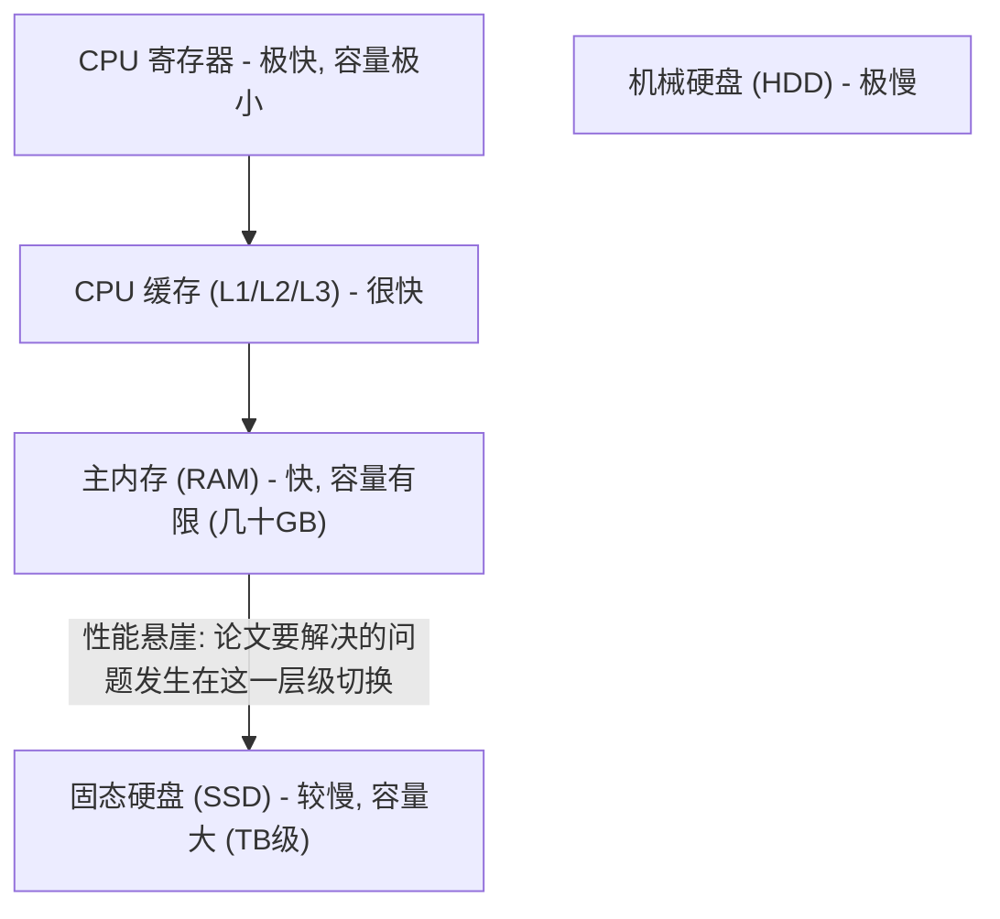
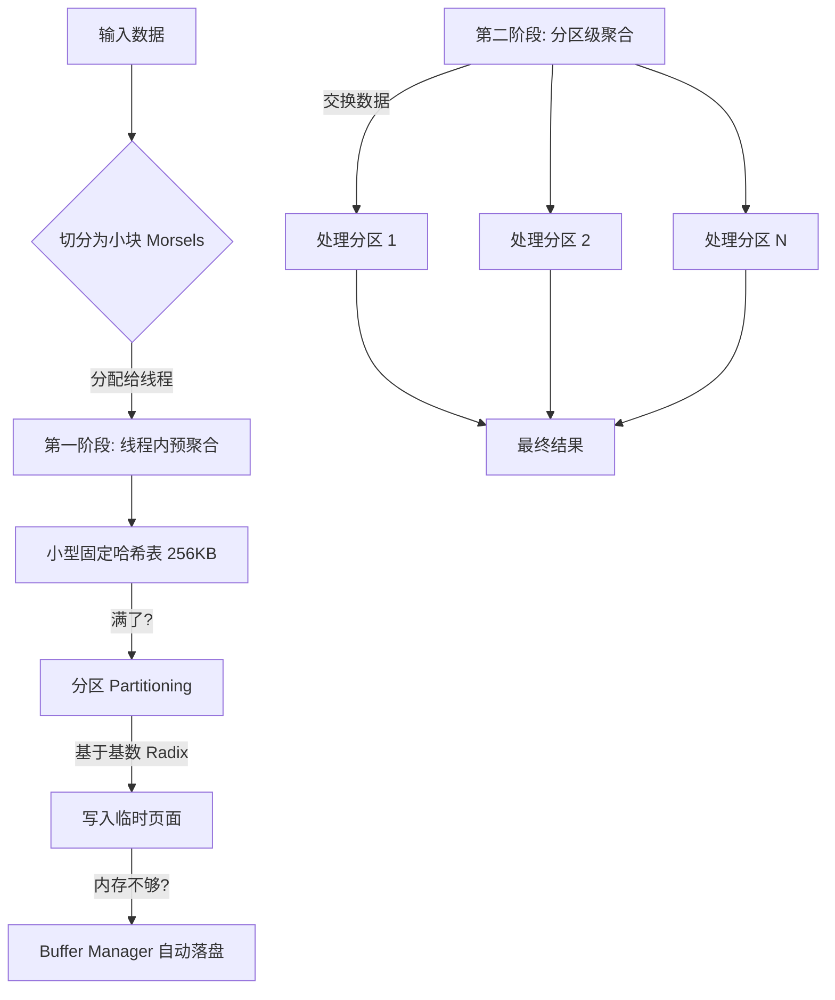
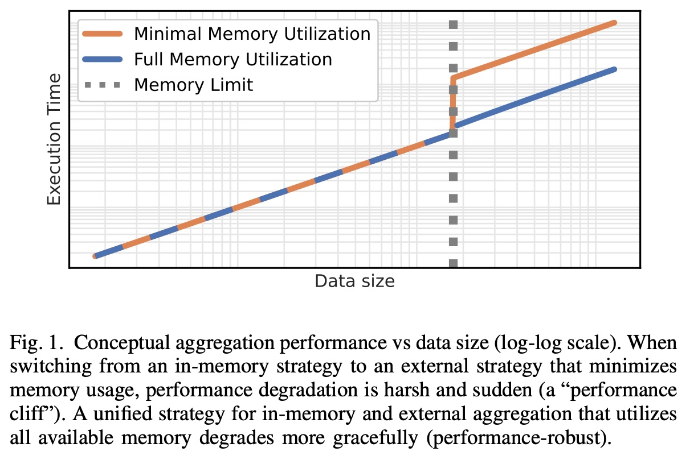
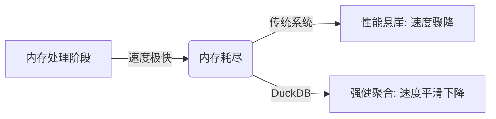
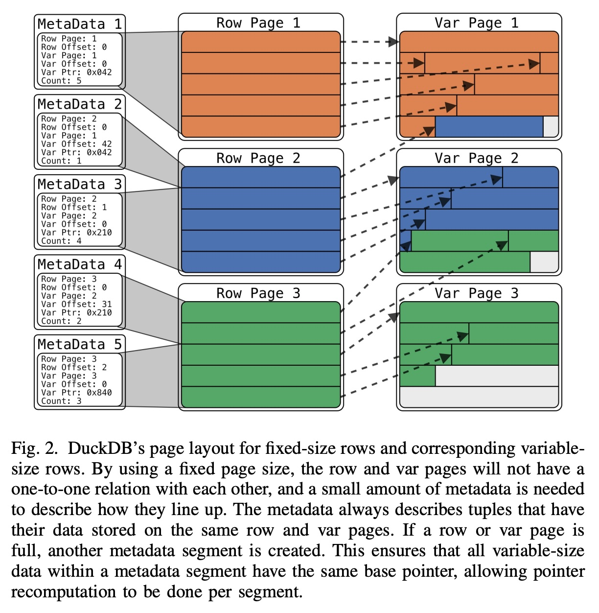

## AI论文解读 | Robust External Hash Aggregation in the Solid State Age
        
### 作者        
digoal        
        
### 日期        
2025-11-24        
        
### 标签        
PostgreSQL , PolarDB , DuckDB , AI , 论文解读        
        
----        
        
## 背景  
      
https://duckdb.org/pdf/ICDE2024-kuiper-boncz-muehleisen-out-of-core.pdf        
  
提示:          
```          
读懂《Robust External Hash Aggregation in the Solid State Age》这篇论文需要提前掌握哪些基础知识, 请使用中文通熟易懂的讲解这些基础知识, 可以引用论文中的图、表或使用Markdown支持的图形(text,mermaid等)增加解释性. 
  
使用中文通熟易懂的解读《Robust External Hash Aggregation in the Solid State Age》这篇论文, 其中的关键内容请着重讲解, 可以引用论文中的图、表或使用Markdown支持的图形(text,mermaid等)增加解释性. 
  
提取《Robust External Hash Aggregation in the Solid State Age》这篇论文中的重要术语, 使用中文对这些术语进行通熟易懂的讲解, 可以引用论文中的图、表或使用Markdown支持的图形(text,mermaid等)增加解释性. 
```     
  
## 1 前置知识 
  
要读懂《Robust External Hash Aggregation in the Solid State Age》（固态硬盘时代的鲁棒外部哈希聚合）这篇论文，你需要掌握数据库系统底层实现的一些核心概念。这篇论文主要解决的问题是： **当数据量太大，内存放不下时，如何利用SSD（固态硬盘）高效地完成“GROUP BY”聚合操作，避免性能断崖式下跌。**

以下是通俗易懂的基础知识讲解，结合了论文中的概念：

-----

### 1\. 内存层级与“性能悬崖” (Memory Hierarchy & Performance Cliff)

**基础概念：**
计算机存储数据的速度是不一样的。CPU寄存器最快，内存（RAM）次之，磁盘（Disk/SSD）最慢。

  * **内存 (RAM):** 速度快，但容量有限，价格贵。
  * **磁盘 (Storage/SSD):** 容量大，价格便宜，但速度（特别是随机读写）比内存慢几个数量级。

**论文背景：**
传统的OLAP（分析型）数据库通常假设数据都在内存里处理，这非常快。但当中间结果（Intermediate Results）太大，内存塞不下时，系统必须把数据写到磁盘上（这就叫 **Spilling** 或 **External Processing**）。

  * **性能悬崖 (Performance Cliff):** 许多系统在内存耗尽那一刻，因为算法切换（从内存算法切到磁盘算法）或者频繁的磁盘IO，性能会突然暴跌 。




**论文看点：** 作者希望设计一种机制，使得从内存过度到磁盘时，性能是“平滑下降”的，而不是“跳崖” 。

-----

### 2\. 哈希聚合 (Hash Aggregation)

**基础概念：**
数据库执行 `SELECT SUM(x) FROM table GROUP BY y` 时，通常有两种方法：

1.  **排序 (Sort):** 先把所有数据按 `y` 排序，相同的 `y` 就挨在一起了，然后遍历统计。复杂度 $O(n \log n)$ 。
2.  **哈希 (Hash):** 建一个哈希表（像字典一样）。读一条数据，算出 `y` 的哈希值，直接找到对应的位置进行累加。复杂度 $O(n)$ 。

**论文背景：**
现代分析型数据库更喜欢**哈希聚合**，因为它在内存中通常比排序更快 。

  * **冲突解决 (Collision Resolution):** 不同的键可能算出相同的哈希值。论文使用了 **线性探测 (Linear Probing)** ：如果算出的位置被占了，就往后找下一个空位 。
  * **盐 (Salt):** 论文提到为了减少比较开销，在哈希表中存储了哈希值的高16位（Salt）。只有Salt匹配了，才去对比真正的Key，这能大幅减少不必要的字符串比较 。

-----

### 3\. 行存储 vs 列存储 (NSM vs DSM)

**基础概念：**

  * **列存储 (DSM - Decomposition Storage Model):** 把同一列的数据存在一起。
      * *优点:* 分析查询（OLAP）时只读需要的列，极快。
      * *缺点:* 也就是构造哈希表时，需要把不同列的数据拼在一起，随机访问（Random Access）同一行的不同属性时这很不友好（Cache Miss）。
  * **行存储 (NSM - N-ary Storage Model):** 把同一行的所有属性存在一起。
      * *优点:* 也就是一旦找到某一行，访问该行的所有属性非常快（Cache Hit）。

**可视化对比：**

| 逻辑视图 | 行存储 (NSM) 物理布局 | 列存储 (DSM) 物理布局 |
| :--- | :--- | :--- |
| **ID, Name** | `[1, "Alice"]` | `[1, 2]` (ID列) |
| 1, "Alice" | `[2, "Bob"]` | `["Alice", "Bob"]` (Name列) |
| 2, "Bob" | ... | ... |

**论文背景：**
DuckDB 是一个列式数据库，但论文指出，在做**聚合哈希表**（中间结果）时，**行存储结构（Row-major）** 效率更高，因为聚合操作通常需要频繁访问同一行的Key和聚合值 。
因此，论文提出了一种特殊的页面布局： **输入是列式的，但在构建哈希表时转换成专门设计的行式布局** 。

-----

### 4\. 缓冲池管理 (Buffer Management)

**基础概念：**
数据库不能直接操作磁盘上的文件，必须把磁盘上的数据块（Page）读到内存的“缓冲池”里才能读写。

  * **定长页 (Fixed-size Pages):** 传统数据库（如PostgreSQL）通常把内存切成固定大小（如4KB或8KB）的页。
  * **问题:** 这种定长设计对**临时中间结果（Temporary Query Intermediates）** 不太友好，因为中间结果（如巨大的哈希表）大小不一，且动态变化 。

**论文核心创新：**
论文提出了 **统一内存管理 (Unified Memory Management)** 。

1.  **统一池子:** 不把内存区分为“用户数据区”和“临时计算区”，大家共用一个池子。
2.  **可溢出 (Spillable):** 当内存不够时，Buffer Manager 会自动把某些页（无论是原本的数据还是临时的哈希表部分）写到磁盘上，腾出空间 。

-----

### 5\. 指针与序列化 (Pointers & Serialization)

**基础概念：**

  * **指针 (Pointer):** 内存地址。比如 `0x42` 指向内存中某个位置。
  * **序列化 (Serialization):** 把内存中的复杂对象（包含指针）变成一串可以写入磁盘的字节流。

**难点：**
如果在内存中用指针（例如：哈希表指向变长字符串），当你把这个页面写到磁盘（Spill），再读回来时，数据可能被加载到内存的新位置。原来的指针地址（比如 `0x42`）就失效了，指向了错误的地方。

  * *传统做法:* 写磁盘前把指针转换成偏移量（序列化），读回来再转成指针（反序列化）。但这非常消耗CPU 。

**论文背景：**
论文设计了一种 **Swizzling (指针重计算)** 机制。

  * 数据保持“原始”格式写入磁盘（不完全序列化）。
  * 当读回来时，根据页面新的基地址，简单地修正指针（Pointer Recomputation）。
  * **公式:** $NewPointer = OldPointer - OldBase + NewBase$ 。

-----

### 6\. 什么是“Morsel-Driven Parallelism”？

**基础概念：**
这是现代CPU多核并行执行的一种模式。

  * **Morsel (小块):** 把数据切成一个个很小的块（Morsel）。
  * **机制:** 多个线程并行工作，谁干完了手头的活，就再去领一个 Morsel。这比固定分配任务更能平衡负载（Load Balancing）。

**论文背景：**
DuckDB 采用了这种并行模式 。但在聚合（Group By）时，每个线程会先在本地做一个小的哈希表（Pre-aggregation），满了之后再进行分区交换（Partitioning），最后合并结果 。

-----

### 总结：读这篇论文前你需要知道...

1.  **内存不够用时很痛苦：** 性能会因为频繁IO和算法切换而跳水。
2.  **哈希表是主力：** 它是做 GROUP BY 的核心数据结构。
3.  **指针失效问题：** 内存里的指针存到磁盘后再读回来就废了，需要特殊处理。
4.  **混合布局：** 虽然是列式数据库，但为了哈希表性能，中间过程会用到行式存储。

掌握了这些，你就能理解为什么作者要花大篇幅介绍 **"Unified Memory Management"（统一内存管理）** 和 **"Spillable Page Layout"（可溢出页面布局）** —— 这都是为了让哈希聚合在内存不足时，依然能顺滑地利用SSD运行。
  
## 2 解读论文 
  
这篇论文 **《Robust External Hash Aggregation in the Solid State Age》** (固态硬盘时代的强健外部哈希聚合) 由 CWI（荷兰国家数学计算机科学中心，也是 DuckDB 的诞生地）的研究人员发表在 ICDE 2024 上。

简单来说，这篇论文解决了数据库领域的一个经典痛点：**当你的内存（RAM）不够用时，如何优雅地处理大规模数据聚合（Group By），而不会导致系统崩溃或性能断崖式下跌。**

以下是对这篇论文核心内容的通俗解读：

-----

### 1\. 核心痛点：性能悬崖 (The Performance Cliff)

在现代数据分析（OLAP）中，内存是很快的，但也是昂贵的。

  * **理想情况**：所有数据都能塞进内存，查询飞快。
  * **现实情况**：当数据量（特别是“中间结果”）超过内存限制时，数据库必须把数据临时写到硬盘上（这个过程叫 Spilling）。

**问题在于**：大多数系统在从“纯内存模式”切换到“磁盘模式”时，表现非常糟糕。

  * 有的系统直接报错（Out of Memory）并终止查询（如 Umbra）。
  * 有的系统会切换到一种极慢的算法，导致查询时间突然暴涨 10 倍甚至更多，这就是所谓的 **“性能悬崖”** 。

这篇论文的目标就是：**让 DuckDB 在内存不足时，性能能够“平滑软着陆”，而不是“跳崖”。** 

-----

### 2\. 三大核心解决方案

为了实现这个目标，作者提出了三个关键技术：

#### A. 统一内存管理 (Unified Memory Management)

传统的数据库通常把内存分成两块：一块给**持久化数据**（比如表里的原始数据），一块给**临时数据**（比如排序或哈希表的中间结果）。这两块通常是固定大小，互不借用，非常死板 。

**DuckDB 的做法：**

  * **大一统池子**：不再区分对待。持久化数据和临时中间数据都在同一个内存池里 。
  * **灵活调度**：如果内存满了，系统会一视同仁地查看哪些页面最近没用（LRU策略），把它们踢到磁盘上 。这意味着，如果你的中间结果很大，系统会自动把原本缓存的表数据踢出去，腾出空间，最大化利用内存 。

#### B. “可落盘”的页面布局 (Spillable Page Layout)

这是论文最精彩的技术细节之一。

  * **难题**：在内存里，我们喜欢用**指针**（Pointer）来指路，因为快。但是指针是内存地址，一旦数据被写到磁盘再读回来，地址变了，指针就失效了。传统做法是写磁盘前要把数据“序列化”（打包），读回来再“反序列化”（解包），但这非常消耗 CPU 。
  * **DuckDB 的妙招**：设计了一种既能在内存里高效跑，又能直接写到磁盘的格式，**不需要序列化**。

**具体实现 (Swizzling Trick)** ：

  * 使用**固定大小的行**（Fixed-size rows）来存主要数据，这最适合聚合操作 。
  * 对于变长数据（如长字符串），存在单独的页面里 。
  * **指针黑科技**：当页面从磁盘读回内存时，地址变了。DuckDB 不会立刻去更新每一行里的指针（那太慢了）。它只记录一个“偏移量元数据”（Metadata）。当你真正需要读数据时，用`新地址 = 存储的指针 - 旧基地址 + 新基地址` 这种简单的加减法瞬间算出新位置 。

*(图解：固定长度行页面与变长数据页面分离，通过元数据进行关联，避免了落盘时的昂贵序列化操作)* 

#### C. 强健的并行哈希聚合算法 (Robust Parallel Hash Aggregation)

DuckDB 重新设计了聚合（Group By）的流程，让它天生适应“甚至连中间结果都放不下”的场景。

**流程图解：**



1.  **预聚合 (Pre-Aggregation)** ：每个线程拿一小块数据，先在一个**非常小**的哈希表（仅128K个条目）里尝试聚合 。
2.  **分区 (Partitioning)** ：如果那个小表满了，就把数据按哈希值扔到不同的“分区”里 。
3.  **RAM-Oblivious (内存无感)** ：算法本身不关心内存够不够。它只管往页面里写数据。如果内存满了，前面提到的“统一内存管理器”会自动把暂时不用的分区页面写到 SSD 上 。
4.  **最终聚合**：最后，不同的线程负责不同的分区，把散落在内存或磁盘上的数据读回来，完成最后的计算 。

-----

### 3\. 实验结果：真的很稳 (Evaluation)

作者在 AWS 上使用 32GB 内存的机器，对比了 **DuckDB**、**ClickHouse**、**HyPer** 和 **Umbra**。

测试场景是 TPC-H 的 `lineitem` 表聚合，随着数据量（Scale Factor）增加，观察各系统的表现。

**核心发现：**

1.  **纯内存场景**：DuckDB 和其他顶级系统一样快 。
2.  **内存不足场景 (Out-of-Core)** ：
      * **Umbra**：直接崩溃（Aborted），因为它还没有实现外部聚合 。
      * **HyPer**：虽然能跑，但一旦内存不够，它会切换算法，导致性能断崖式下跌，甚至超时 。
      * **ClickHouse**：在大规模数据下也撑不住，出现了内存不足的情况 。
      * **DuckDB**：表现最稳。随着数据量增加，时间线性增加，**没有突然的卡顿或崩溃**。即使需要处理比内存大得多的数据，它依然能利用 SSD 的高带宽顺利跑完 。

**图表证据**：
论文中的图 1 展示了这种概念上的对比：    

>   * **橙色线（即使最小内存模式）** ：一旦超过内存限制，时间直线上升。
>     * **蓝色线（DuckDB 模式）** ：利用所有可用内存，即使超过限制，也是平滑的线性增长。 

### 4\. 总结与下一步 (Conclusion)

这篇论文告诉我们，在 SSD 速度极快的今天，数据库完全可以设计成“内存无感”的。DuckDB 通过**统一内存管理**和**免序列化的页面设计**，证明了即使是在资源受限的设备（比如你的笔记本电脑）上，也能通过“借用”磁盘空间，跑出服务器级的稳定大数据分析性能。

**下一步行动建议：**
如果您对数据库内核开发感兴趣，可以深入研究 DuckDB 源码中关于 `BufferManager` 和 `PartitionedHashTable` 的实现。如果您是用户，这篇论文意味着您可以放心地在 DuckDB 中对远超内存大小的数据集执行 `GROUP BY` 操作，而不必担心它会挂掉。
  
## 3 术语 
  
这篇论文主要解决的是数据库在处理大规模聚合操作（如 `GROUP BY`）时，因内存不足导致的性能剧烈下降问题。以下是论文中的核心术语解读，按照**问题现象**、**内存架构**、**数据结构**和**算法策略**四个维度进行分类讲解。

-----

### 一、 核心现象与痛点

#### 1\. Performance Cliff (性能悬崖)

  * **通俗解释**：想象你在内存的高速公路上开车（处理数据），速度非常快。突然内存不够用了，数据库必须切换到磁盘（土路）上跑。很多系统在这个切换过程中处理得不好，车速会瞬间从 100km/h 降到 1km/h，这种骤降就像掉下悬崖一样。
  * **论文背景**：当内存中的哈希表放不下所有数据时，如果系统强制切换到传统的磁盘算法或因为内存不足频繁换页，性能会突然暴跌 。
  * **目标**：DuckDB 希望做到“平滑着陆”，即内存不够时，性能是线性缓慢下降，而不是断崖式下跌 。




#### 2\. Temporary Query Intermediates (临时查询中间结果)

  * **通俗解释**：当你做复杂的统计（比如计算每个国家的平均销售额）时，数据库还没算出最终结果前，手里捏着的那一堆“半成品”数据（比如正在构建的哈希表）。
  * **特点**：这些数据可能比原始表还要大。对于阻塞型操作（如聚合），必须把所有数据读完才能出结果，所以这些中间结果会越积越多，最终撑爆内存 。

-----

### 二、 内存管理创新

#### 3\. Unified Memory Management (统一内存管理)

  * **通俗解释**：传统的数据库像分家过日子，左边口袋装“永久数据（表数据）”，右边口袋装“临时数据（中间结果）”，互不通用。如果右边满了，哪怕左边是空的，也得报错。
    **统一内存管理**就是把两个口袋缝成一个大布袋。不管是表数据还是临时计算数据，都放在同一个池子里。
  * **机制**：
      * 允许**可变大小**的页面分配 。
      * 当需要更多内存算临时数据时，缓冲管理器（Buffer Manager）会自动把那些暂时不用的表数据（Persistent Data）踢出内存，腾出空间 。
      * 这比“协作式内存管理（Cooperative Memory Management）”更进一步，因为临时数据也被分页管理，可以随时被置换到磁盘 。

-----

### 三、 数据结构设计 (核心黑科技)

#### 4\. Spillable Page Layout (可落盘页面布局)

  * **通俗解释**：在内存里，我们喜欢用“指针”指路，因为快。但指针记录的是内存地址，一旦数据被写到磁盘再读回来，地址变了，指针就废了。为了解决这个问题，通常需要把数据“打包（序列化）”再写盘，很慢。
    DuckDB 设计了一种格式，**既能像内存数据一样快，又能直接写到磁盘而不需要打包**。
  * **实现细节**：
      * **固定行与变长数据分离**：把固定长度的数据（数字、短字符串）排排坐，变长的数据（长文章）另外找地方存 。
      * **无需序列化**：写盘时直接整页写入，不进行格式转换 。

#### 5\. Pointer Recomputation (指针重算/Swizzling)

  * **通俗解释**：这是配合上面页面布局的“导航修正”技术。
    当页面从磁盘读回内存时，旧的指针失效了。DuckDB 不会傻傻地去修改每一个数据的指针（太慢）。它利用一个简单的公式：`新指针 = 存储的旧指针 - 旧基地址 + 新基地址`。
  * **懒加载**：只有当你真正去读那一行数据，且发现页面真的被移动过时，才做这个加减法计算，平时完全不影响速度 。

**图解页面布局 (参考论文 Fig. 2):**     

```text
[ 元数据块 ]  <-- 记录页面偏移关系，用于修正指针
    |
    |-- [ 行数据页 (Row Page) ] 
    |     存储固定长度数据 (如整数, 短字符)
    |     包含指向变长数据的指针
    |
    |-- [ 变长数据页 (Var Page) ]
          存储长字符串等数据
          (与行数据页分离，避免空间浪费)
```


-----

### 四、 算法与执行策略

#### 6\. Morsel-Driven Parallelism (分块驱动并行)

  * **通俗解释**：把要处理的数据切成一小块一小块（Morsel，一口的量）。CPU 的线程就像一群工人，谁干完了手里的活，就去领下一块。
  * **优势**：避免了有的线程累死，有的线程闲死（负载不均衡）。但在聚合操作中，这种模式需要处理好线程间的数据合并问题 。

#### 7\. Salted Linear Probing Hash Table (加盐线性探测哈希表)

  * **通俗解释**：这是 DuckDB 使用的一种特殊哈希表。
      * **指针压缩**：64位的指针，实际只用了低48位存地址。
      * **加盐 (Salt)** ：剩下高16位用来存哈希值的一部分（称为“盐”）。
  * **作用**：在查找冲突时（两个数据哈希值撞车），不用每次都去读完整的原始数据来比对。先比对这16位的“盐”，如果盐都不一样，那肯定不是同一个数据，直接跳过。这大大减少了内存访问次数，提升速度 。

**结构示意图:**

```text
| High 16 bits (Salt) | Low 48 bits (Pointer) |
|---------------------|-----------------------|
|  哈希值的摘要       | 指向实际数据的内存地址  |
      ^
      |__ 发生冲突时，先比对这里，不匹配直接跳过! 
```

#### 8\. Radix Partitioning (基数分区)

  * **通俗解释**：一种“分而治之”的策略。当数据量太大，一个小哈希表装不下时，系统会根据哈希值的中间几位（Radix），把数据分发到几百个不同的“桶”（分区）里。
  * **流程**：
    1.  先在线程本地的小哈希表里聚合。
    2.  小表满了，就按基数把数据扔进对应的分区页面。
    3.  **内存无感 (RAM-Oblivious)** ：算法只管往分区里写数据。如果内存不够，统一内存管理器会自动把这些分区的页面写到磁盘上，算法本身不需要写复杂的逻辑来管理落盘 。
  
## 参考        
         
https://duckdb.org/pdf/ICDE2024-kuiper-boncz-muehleisen-out-of-core.pdf    
        
<b> 以上内容基于DeepSeek、Qwen、Gemini及诸多AI生成, 轻微人工调整, 感谢杭州深度求索人工智能、阿里云、Google等公司. </b>        
        
<b> AI 生成的内容请自行辨别正确性, 当然也多了些许踩坑的乐趣, 毕竟冒险是每个男人的天性.  </b>        
    
#### [PolarDB 学习图谱](https://www.aliyun.com/database/openpolardb/activity "8642f60e04ed0c814bf9cb9677976bd4")
  
  
#### [PostgreSQL 解决方案集合](../201706/20170601_02.md "40cff096e9ed7122c512b35d8561d9c8")
  
  
#### [德哥 / digoal's Github - 公益是一辈子的事.](https://github.com/digoal/blog/blob/master/README.md "22709685feb7cab07d30f30387f0a9ae")
  
  
#### [About 德哥](https://github.com/digoal/blog/blob/master/me/readme.md "a37735981e7704886ffd590565582dd0")
  
  

  
