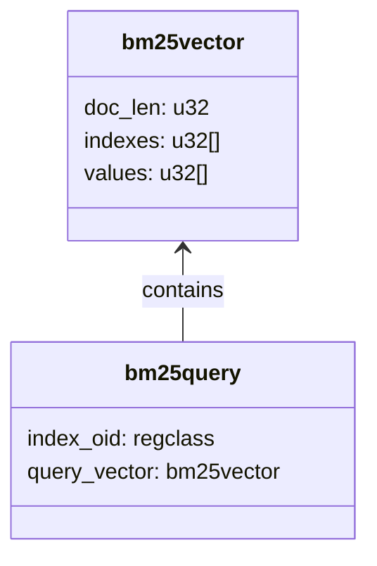
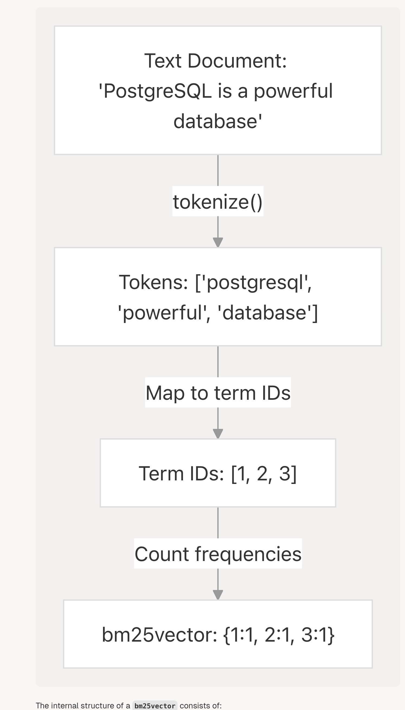
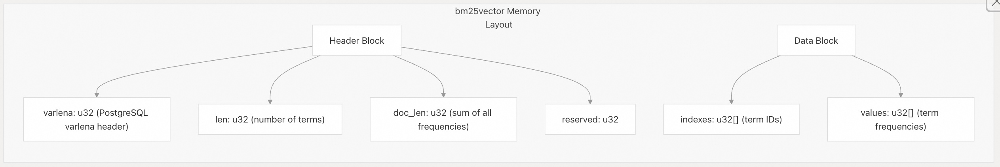
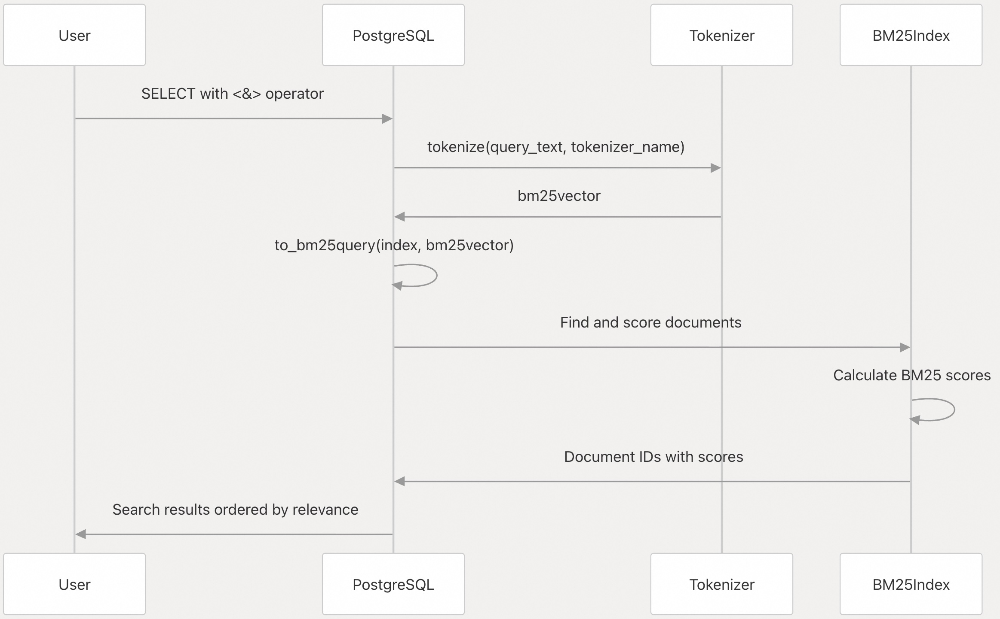

## VectorChord-bm25 源码学习: 2.1 数据类型 (`Data Types`)    
                                          
### 作者                                          
digoal                                          
                                          
### 日期                                          
2025-11-24                                          
                                          
### 标签                                          
VectorChord-bm25 , 源码学习 , 全文检索 , 关键词检索 , TF , IDF , 相关性排序 , ranking , Block-WeakAnd , Block-WAND , tsvector , ts_rank                                            
                                          
----                                          
                                          
## 背景                   
本文档描述了 **VectorChord-BM25** 系统中使用的核心**数据类型**（`data types`），这些类型使基于 **BM25** 的文本搜索功能能够在 **PostgreSQL** 中实现。它解释了 `bm25vector` 和 `bm25query` 两种**类型**（`types`），它们的内部结构，以及它们如何协同工作以支持带有 **BM25** **相关性排序**（`relevance ranking`）的高效**全文搜索**（`full-text search`）。    
    
## **核心数据类型** (`Core Data Types`)    
    
**VectorChord-BM25** 实现了两种**自定义 PostgreSQL 数据类型**（`custom PostgreSQL data types`），它们构成了其**文本搜索功能**（`text search functionality`）的基础：    
    

    
来源 (`Sources`):    
[`src/datatype/bm25vector.rs` 1-50](https://github.com/tensorchord/VectorChord-bm25/blob/da0908a6/src/datatype/bm25vector.rs#L1-L50)    
[`sql/install/vchord_bm25--0.1.1.sql` 207-210](https://github.com/tensorchord/VectorChord-bm25/blob/da0908a6/sql/install/vchord_bm25--0.1.1.sql#L207-L210)    
    
### `bm25vector` **类型** (`Type`)    
    
`bm25vector` **数据类型**（`data type`）将文本文档表示为**术语 ID**（`term IDs`）及其**频率**（`frequencies`）的**稀疏向量**（`sparse vectors`）。这是实现高效 **BM25 评分**（`BM25 scoring`）的核心**数据结构**（`data structure`）。    
    
    
    
`bm25vector` 的内部结构包括：    
    
    
    
来源:    
[`src/datatype/memory_bm25vector.rs` 14-54](https://github.com/tensorchord/VectorChord-bm25/blob/da0908a6/src/datatype/memory_bm25vector.rs#L14-L54)    
[`src/datatype/bm25vector.rs` 1-50](https://github.com/tensorchord/VectorChord-bm25/blob/da0908a6/src/datatype/bm25vector.rs#L1-L50)    
    
`bm25vector` 以内存**高效存储**（`stored efficiently`），为**术语 ID** 和它们的**频率**分别设置了两个独立的**数组**（`arrays`）。这种**布局**（`layout`）：    
    
1.  通过避免重复**术语 ID** 来**最小化存储空间**（`Minimizes storage space`）    
2.  允许**快速查找**（`fast lookup`）和**比较操作**（`comparison operations`）    
3.  促进高效的 **BM25 评分计算**（`BM25 scoring calculations`）    
    
在 **SQL** 中，`bm25vector` 使用文本表示形式显示，例如 `{1:2, 2:1, 3:4}`，其中每对都包含一个**术语 ID** 及其在文档中的**频率**。    
    
来源:    
[`src/datatype/text_bm25vector.rs`](https://github.com/tensorchord/VectorChord-bm25/blob/da0908a6/src/datatype/text_bm25vector.rs)    
[`src/datatype/memory_bm25vector.rs` 89-132](https://github.com/tensorchord/VectorChord-bm25/blob/da0908a6/src/datatype/memory_bm25vector.rs#L89-L132)    
    
#### **内部实现** (`Internal Implementation`)    
    
`bm25vector` **类型**（`type`）是使用以下关键**结构**（`structures`）实现的：    
    
  * `Bm25VectorBorrowed`：**向量**（`vector`）的轻量级**借用视图**（`borrowed view`），对其**组件**（`components`）具有**只读访问**（`read-only access`）权限    
  * `Bm25VectorHeader`：管理 **PostgreSQL** 的 **可变长度头结构**（`varlena header structure`）    
  * `Bm25VectorInput`：处理从 **PostgreSQL** 读取**向量数据**（`vector data`）    
  * `Bm25VectorOutput`：管理向 **PostgreSQL** 写入**向量数据**    
    
来源:    
[`src/datatype/bm25vector.rs` 1-50](https://github.com/tensorchord/VectorChord-bm25/blob/da0908a6/src/datatype/bm25vector.rs#L1-L50)    
[`src/datatype/memory_bm25vector.rs` 1-241](https://github.com/tensorchord/VectorChord-bm25/blob/da0908a6/src/datatype/memory_bm25vector.rs#L1-L241)    
    
### `bm25query` **类型** (`Type`)    
    
`bm25query` **类型**（`type`）是一个**复合结构**（`composite structure`），它结合了：    
    
1.  对 **BM25 索引**（`BM25 index`）的**引用**（`reference`）（`index_oid`）    
2.  表示为 `bm25vector` 的**查询**（`query`）    
    
与其他许多 **PostgreSQL 类型**不同，这是一个在 **SQL 层面**（`SQL level`）定义的**复合类型**：    
    
```sql    
CREATE TYPE bm25query AS (    
    index_oid regclass,    
    query_vector bm25vector    
);    
```    
    
来源:    
[`sql/install/vchord_bm25--0.1.1.sql` 207-210](https://github.com/tensorchord/VectorChord-bm25/blob/da0908a6/sql/install/vchord_bm25--0.1.1.sql#L207-L210)    
    
这种**设计**（`design`）允许**查询处理器**（`query processor`）同时访问：    
    
  * **分词后的查询术语**（`tokenized query terms`）（在 `query_vector` 中）    
  * 用于准确 **BM25 评分**所需的**索引元数据**（`index metadata`）（通过 `index_oid`）    
    
## **操作和函数** (`Operations and Functions`)    
    
### **创建 `bm25vector` 值** (`Creating bm25vector Values`)    
    
创建 `bm25vector` 最常见的方式是通过 `tokenize()` **函数**（`function`），它使用指定的**分词器**（`tokenizer`）处理文本：    
    
```sql    
SELECT tokenize('A quick brown fox jumps over the lazy dog.', 'bert')::bm25vector;    
-- Output: {1012:1, 1037:1, 1996:1, 2058:1, 2829:1, 3899:1, 4248:1, 4419:1, 13971:1, 14523:1}    
```    
    
来源:    
[`README.md` 58-60](https://github.com/tensorchord/VectorChord-bm25/blob/da0908a6/README.md#L58-L60)    
    
对于**测试**（`testing`）或处理**预分词数据**（`pre-tokenized data`），您也可以将**整数数组**（`integer array`） **转换**（`cast`）为 `bm25vector`：    
    
```sql    
SELECT '{1, 2, 1}'::int[]::bm25vector;    
-- Output: {1:2, 2:1}    
    
-- 将每个值进行聚合, 统计计数, 例如     
-- (100,100,200,101,1,1) 输出: 100:2, 200:1, 101:1, 1:2      
```    
    
这会**聚合重复的术语**（`aggregates duplicate terms`）并构造适当的**频率计数**（`frequency counts`）。    
    
来源:    
[`src/datatype/cast.rs` 1-10](https://github.com/tensorchord/VectorChord-bm25/blob/da0908a6/src/datatype/cast.rs#L1-L10)    
[`tests/sqllogictest/cast.slt` 1-4](https://github.com/tensorchord/VectorChord-bm25/blob/da0908a6/tests/sqllogictest/cast.slt#L1-L4)    
    
### **创建 `bm25query` 值** (`Creating bm25query Values`)    
    
要构建用于搜索的 `bm25query`，请使用 `to_bm25query()` **函数**，带三个**参数**（`parameters`）：    
    
1.  **BM25 索引名称**（`BM25 index name`）（类型为 `regclass`）    
2.  **查询文本**（`query text`）或一个 `bm25vector`    
3.  **分词器名称**（`tokenizer name`）（在使用查询文本时）    
    
```sql    
SELECT to_bm25query('documents_embedding_bm25', 'PostgreSQL', 'bert');    
```    
    
来源:    
[`sql/install/vchord_bm25--0.1.1.sql` 212-215](https://github.com/tensorchord/VectorChord-bm25/blob/da0908a6/sql/install/vchord_bm25--0.1.1.sql#L212-L215)    
[`README.md` 109-112](https://github.com/tensorchord/VectorChord-bm25/blob/da0908a6/README.md#L109-L112)    
    
### **比较运算符** (`Comparison Operators`)    
    
`bm25vector` **类型**（`type`）支持**相等运算符**（`equality operators`）：    
    
  * `=` - 测试两个**向量**（`vectors`）是否**完全相同**（`identical`）（相同的**术语**和相同的**频率**）    
  * `<>` - 测试两个**向量**是否存在任何**差异**（`differ`）    
    
来源:    
[`src/datatype/operator_bm25vector.rs` 1-11](https://github.com/tensorchord/VectorChord-bm25/blob/da0908a6/src/datatype/operator_bm25vector.rs#L1-L11)    
[`tests/sqllogictest/equality_operator.slt` 1-39](https://github.com/tensorchord/VectorChord-bm25/blob/da0908a6/tests/sqllogictest/equality_operator.slt#L1-L39)    
    
### **搜索运算符** (`Search Operator`)    
    
核心**搜索功能**（`search functionality`）由 `<&>` **运算符**（`operator`）提供，它计算文档和查询之间的 **BM25 评分**（`BM25 scores`）：    
    
```sql    
SELECT id, passage, embedding <&> to_bm25query('documents_embedding_bm25', 'PostgreSQL', 'bert') AS score    
FROM documents    
ORDER BY score    
LIMIT 10;    
```    
    
**评分**（`score`）被特意返回为**负值**（`negative value`），这允许在使用 **`ORDER BY`** 时，**最相关的结果**（`most relevant results`）首先出现。    
    
来源:    
[`README.md` 108-112](https://github.com/tensorchord/VectorChord-bm25/blob/da0908a6/README.md#L108-L112)    
[`sql/install/vchord_bm25--0.1.1.sql` 220-229](https://github.com/tensorchord/VectorChord-bm25/blob/da0908a6/sql/install/vchord_bm25--0.1.1.sql#L220-L229)    
    
## **BM25 搜索流程** (`BM25 Search Flow`)    
    
**VectorChord-BM25** 中的完整**搜索流程**（`search flow`）结合了所有这些**数据类型**：    
    
    
    
这图示了 `bm25vector` 和 `bm25query` **类型**如何协同工作，以在 **PostgreSQL** 中实现高效的**基于 BM25 的全文搜索**（`BM25-based full-text search`）。    
    
来源:    
[`README.md` 102-112](https://github.com/tensorchord/VectorChord-bm25/blob/da0908a6/README.md#L102-L112)    
    
## **类型转换摘要** (`Type Conversion Summary`)    
    
| **从** (`From`) | **到** (`To`) | **方法** (`Method`) | **示例** (`Example`) |    
| :--- | :--- | :--- | :--- |    
| Text (文本) | `bm25vector` | `tokenize(text, tokenizer)` | `tokenize('hello world', 'bert')` |    
| `int[]` (整数数组) | `bm25vector` | **类型转换运算符** (`Cast operator`) (`::`) | `ARRAY[1, 2, 1]::bm25vector` → `{1:2, 2:1}` |    
| Text (文本), index (索引) | `bm25query` | `to_bm25query(index, text, tokenizer)` | `to_bm25query('idx', 'query', 'bert')` |    
| `bm25vector`, index (索引) | `bm25query` | `to_bm25query(index, vector)` | `to_bm25query('idx', vector)` |    
    
来源:    
[`README.md` 58-60](https://github.com/tensorchord/VectorChord-bm25/blob/da0908a6/README.md#L58-L60)    
[`tests/sqllogictest/cast.slt` 1-4](https://github.com/tensorchord/VectorChord-bm25/blob/da0908a6/tests/sqllogictest/cast.slt#L1-L4)    
[`README.md` 102-112](https://github.com/tensorchord/VectorChord-bm25/blob/da0908a6/README.md#L102-L112)    
    
这些**数据类型**构成了 **VectorChord-BM25** **系统**（`system`）的基础，使 **PostgreSQL** 能够在**数据库内部**（`directly within the database`）执行高效且准确的**基于 BM25 的文本排序**（`BM25-based text ranking`）。    
    
-----    
    
# 附录1: 将整数数组 `'{1, 2, 1}'::int[]` 转换为 `bm25vector` 类型时的转换逻辑,输出结果是 `{1:2, 2:1}`    
    
## 转换逻辑    
    
这个转换通过 `_vchord_bm25_cast_array_to_bm25vector` 函数实现,该函数在 SQL 中被定义为隐式转换(IMPLICIT CAST)。      
    
转换的核心逻辑在 `Bm25VectorOutput::from_ids` 方法中:      
    
具体步骤如下:    
    
1. **使用 BTreeMap 统计频率**: 遍历输入的整数数组(term IDs),使用 `BTreeMap<u32, u32>` 来统计每个 term ID 出现的次数。      
    
2. **聚合重复项**: 对于数组 `{1, 2, 1}`,BTreeMap 会自动将重复的 term ID 聚合:    
   - term ID `1` 出现 2 次    
   - term ID `2` 出现 1 次    
    
3. **构建向量**: 从 BTreeMap 中提取排序后的 term IDs 和对应的频率,构建 `bm25vector`。      
    
4. **输出格式**: 最终输出为 `{1:2, 2:1}`,表示 term ID 1 出现 2 次,term ID 2 出现 1 次。    
    
## Notes    
    
这个转换忽略了 term ID 在原数组中的顺序,只关注每个 term ID 的出现频率。 这种设计符合 BM25 算法的需求,因为 BM25 只需要知道每个词项在文档中出现的次数,而不关心它们的位置顺序。 该转换在 README 中也有说明,强调了它会聚合重复项并忽略顺序。      
    
-----    
    
# 附录2: 性能与存储效率问题：`bm25vector` 的“稀疏向量”如何在面对大规模文本时保持高效？    
    
**背景与痛点：** 页面提到 `bm25vector` 使用“稀疏向量”（`sparse vectors`）和独立的**术语 ID**（`term IDs`）及**频率**（`frequencies`）数组来“最小化存储空间”和“促进高效 BM25 评分计算”。然而，在实际的**全文搜索**（`full-text search`）场景中，词汇表（`vocabulary`）可能非常大（数十万甚至数百万术语）。    
    
**关键问题：**    
    
* **数据结构细节：** `bm25vector` 内部是如何将稀疏向量高效地存储在 **PostgreSQL** 的 `varlena` 结构中的？它如何处理**高维稀疏数据**的内存对齐和访问效率？    
* **性能瓶颈：** 在面对包含极多唯一术语（即稀疏度高）的超大文档时，`bm25vector` 的读写（I/O）和 **BM25 评分**（`BM25 scoring`）计算速度相比于传统的倒排索引（`Inverted Index`）是否有明显的性能优势或劣势？    
* **术语 ID 管理：** 这些 **术语 ID** 是如何生成的和维护的？在进行**分词**（`tokenize()`）时，如何确保不同文档的相同术语对应相同的 ID？（这涉及到词汇表的全局管理机制，是 BM25 实施的关键）。    
    
## 问题重述    
    
您询问的是 VectorChord-BM25 扩展中 `bm25vector` 数据类型的三个核心问题:    
    
1. **内部存储结构**: `bm25vector` 如何在 PostgreSQL 的 `varlena` 结构中高效存储稀疏向量,以及如何处理内存对齐和访问效率    
2. **性能特征**: 与传统倒排索引相比,`bm25vector` 在处理高稀疏度文档时的 I/O 和 BM25 评分性能    
3. **术语 ID 管理**: 术语 ID 的生成和维护机制,以及如何确保跨文档的术语 ID 一致性    
    
## 答案    
    
### 1. 数据结构细节    
    
`bm25vector` 使用紧凑的内存布局存储在 PostgreSQL 的 `varlena` 结构中  :    
    
```rust    
#[repr(C, align(8))]    
pub struct Bm25VectorHeader {    
    varlena: u32,        // PostgreSQL varlena 头    
    len: u32,            // 术语数量    
    doc_len: u32,        // 所有频率之和    
    reserved: u32,    
    phantom: [u8; 0],    
}    
```    
    
**内存布局策略**:    
- 头部固定 16 字节(8 字节对齐)      
- 之后是 `indexes` 数组(术语 ID,`u32[]`)      
- 然后是 8 字节对齐的 `values` 数组(频率,`u32[]`)      
    
**内存对齐处理**: 在 `values` 数组前插入填充字节以确保 8 字节对齐  :    
```rust    
let ptr = self.phantom.as_ptr().cast::<u32>().add(len);    
let offset = ptr.align_offset(8);  // 计算对齐偏移    
let ptr = ptr.add(offset);    
```    
    
**访问效率**: 通过 `Bm25VectorBorrowed` 提供零拷贝访问  ,直接返回底层数组的切片引用  ,避免数据复制。    
    
### 2. 性能特征    
    
**与倒排索引的架构差异**:    
    
VectorChord-BM25 实际上**同时使用**了两种结构:    
- **文档级**: `bm25vector` 存储每个文档的“术语-频率”对      
- **索引级**: BM25 索引构建倒排列表(posting lists)      
    
**性能权衡**:    
    
1. **插入性能**: `bm25vector` 的插入非常高效  :    
   - 直接写入 growing segment(链表结构)      
   - 更新全局统计信息(文档频率)      
   - 当 growing segment 达到 4096 页时才封存为倒排索引      
    
2. **查询性能**: 使用 Block-WAND 算法在封存的倒排索引上执行  :    
   - 为每个查询术语创建 `SealedScorer`      
   - 利用 block-level skip lists 跳过不相关文档      
   - Growing segment 使用线性扫描      
    
**高稀疏度文档的影响**:     
- `bm25vector` 只存储非零术语,空间复杂度为 O(非零术语数)      
- 稀疏度越高,每个文档的存储越小,但不影响倒排索引的大小    
    
### 3. 术语 ID 管理    
    
**关键发现**: VectorChord-BM25 **不维护全局词汇表**。术语 ID 由外部分词器(tokenizer)生成。    
    
**分词流程**  :    
```sql    
SELECT tokenize('A quick brown fox...', 'bert')::bm25vector;    
-- 输出: {1012:1, 1037:1, 1996:1, ...}    
```    
    
术语 ID(如 1012, 1037)来自 `bert` 分词器的预训练词汇表  。这是由独立扩展 `pg_tokenizer.rs` 管理的  。    
    
**一致性保证**:    
- 使用相同分词器对不同文档分词,相同术语会得到相同 ID    
- 分词器的词汇表是固定的(如 BERT 的 30,522 个词汇)    
- VectorChord-BM25 只负责存储和索引这些 ID,不参与 ID 分配    
    
**索引中的术语统计**:    
- 索引维护 `term_stat` 数组记录每个术语的文档频率      
- 数组大小动态扩展以容纳新术语 ID      
- 这用于计算 IDF(逆文档频率)      
    
## Notes    
    
VectorChord-BM25 的设计将**术语 ID 生成**与**BM25 索引**解耦。分词器负责词汇表管理和 ID 分配,而 VectorChord-BM25 专注于高效的稀疏向量存储和 BM25 评分。这种架构允许用户选择不同的分词器(BERT、Jieba、Lindera 等)  ,而无需修改索引实现。    
    
对于超大词汇表场景,性能主要取决于:    
1. 分词器的效率(不在 VectorChord-BM25 范围内)    
2. 索引的 `term_stat` 数组大小(线性增长,但访问是 O(1))      
3. 倒排列表的压缩效率    
    
    
    
-----    
    
# 附录3: `bm25query` 的工作机制与维护问题：`index_oid` 如何确保评分的准确性和稳定性？    
    
**背景与痛点：** `bm25query` 是一个**复合类型**（`composite type`），它组合了查询向量和 `index_oid`（索引对象 ID）。**BM25 算法**的评分需要依赖**文档平均长度**（`avgdl`）和**文档频率**（`df`）等全局统计信息，这些信息都存储在索引中。    
    
**关键问题：**    
    
* **元数据依赖：** 当索引对应的表发生大量 **INSERT/UPDATE/DELETE** 操作时，**BM25 评分**所需的**索引元数据**（`index metadata`）何时会更新？用户需要执行哪些**维护动作**（例如，类似于 **PostgreSQL** 中的 `VACUUM` 或 `REINDEX`）来保证 `index_oid` 指向的统计信息是准确和最新的？    
* **跨索引查询：** 如果用户意外地使用一个查询向量去查询一个不相关的 **BM25 索引**（即错误的 `index_oid`），系统是否会抛出错误，还是会根据错误/旧的统计数据返回不准确的结果？    
* **使用便利性：** `to_bm25query()` 函数要求用户提供 `regclass` 类型的索引名称。在日常编程中，是否有一个更简单的方法（例如，绑定到特定的表列）来自动获取正确的 `index_oid`，从而提高开发便利性？    
    
## 回答    
    
您询问的是 VectorChord-BM25 中 `bm25query` 复合类型的索引元数据更新机制、跨索引查询的错误处理，以及使用便利性问题。    
    
### 元数据更新机制    
    
**INSERT 操作时的实时更新：**    
    
当执行 INSERT 操作时，`aminsert` 函数会立即更新索引元数据  。具体更新包括：    
    
1. **文档计数和总词频**：`doc_cnt`、`doc_term_cnt` 和 `current_doc_id` 会立即递增    
2. **词项统计**：每个词项的文档频率（df）会实时更新      
3. **字段范数**：新文档的长度信息会写入 field norm 存储      
    
这意味着 INSERT 操作后，`avgdl`（平均文档长度）和 `df`（文档频率）等统计信息会**立即反映**在索引中，无需额外维护操作。    
    
**DELETE 操作时的延迟更新：**  
    
DELETE 操作采用标记删除机制。`ambulkdelete` 函数会在删除位图中标记已删除的文档  ，并立即更新 `doc_cnt` 和 `doc_term_cnt`。    
    
**VACUUM 的作用：**    
    
执行 `VACUUM` 时，`amvacuumcleanup` 函数会重新计算所有词项的文档频率统计  。这确保了删除操作后，词项统计信息的准确性。因此，在大量 DELETE 操作后，建议运行 `VACUUM` 以更新统计信息。    
    
**UPDATE 操作：**    
    
PostgreSQL 中的 UPDATE 实际上是 DELETE + INSERT 的组合，因此会触发上述两种机制。    
    
**总结：**    
- INSERT：元数据实时更新，无需额外操作    
- DELETE：标记删除后需要 `VACUUM` 来更新词项统计    
- 不需要 `REINDEX`，除非索引损坏    
    
### 跨索引查询的错误处理    
    
当使用错误的 `index_oid` 查询时，系统**不会抛出错误**，而是会使用错误索引的统计信息计算 BM25 分数。    
    
在 `search_bm25query` 函数中，系统直接从 `bm25query` 中提取 `index_oid`  ，然后使用该索引的元数据进行评分  。没有验证 `index_oid` 是否与被查询的表列相匹配。    
    
这意味着如果使用错误的索引，会得到**不准确但不会报错**的结果。这是一个潜在的使用陷阱，用户需要自行确保 `index_oid` 的正确性。    
    
### 使用便利性改进    
    
目前 `to_bm25query()` 函数确实需要手动指定索引名称  。从代码来看，**没有自动绑定机制**来根据表列自动获取 `index_oid`。    
    
可能的改进方向（当前代码库中不存在）：    
1. 创建一个函数，根据表名和列名自动查找对应的 BM25 索引    
2. 使用 PostgreSQL 的系统目录（`pg_index`）来查询列上的索引    
    
但这些功能目前都不存在于代码库中。用户必须手动管理索引名称。    
    
## Notes    
    
- 索引元数据的更新是增量式的，INSERT 操作会立即反映在统计信息中    
- VACUUM 主要用于在 DELETE 操作后重新计算词项统计，这对 BM25 评分的准确性很重要    
- 系统不会验证 `index_oid` 的正确性，这是一个需要用户注意的设计限制    
- 查询时使用的索引元数据来自 `MetaPageData`，包括 `avgdl`（通过 `doc_cnt` 和 `doc_term_cnt` 计算）和词项统计      
    
    
-----    
    
# 附录4: 搜索与比较运算符的优先级问题：如何利用 `<&>` 和 `=` 运算符优化查询？    
    
    
**背景与日常使用：** 页面介绍了核心的**搜索运算符** `<&>` 和**相等运算符** `=`/`<>`。`<&>` 运算符返回**负值**评分并用于排序（`ORDER BY`）。    
    
**关键问题：**    
    
* **索引优化：** `bm25vector` 的 **相等运算符** (`=`) 是否可以利用索引（例如，哈希索引或 **GIN 索引**）来实现**快速的精确匹配**？这在需要快速去重或查找特定文档向量的场景中非常重要。    
* **查询优化器 (`Optimizer`) 集成：** **PostgreSQL** 的**查询优化器**在处理 `WHERE doc_vector <&> query_vector < 0` 这样的查询时，是否能有效地识别并利用 **BM25 索引**？是否有特定的 **SQL 语句模式** 或**提示**（`hints`）可以确保查询总是走索引路径，避免**全表扫描**（`full-table scan`）？    
* **负值评分的意义：** 评分返回**负值**（`negative value`）是为了方便 `ORDER BY` 排序。用户应如何解读和使用这个绝对值（例如，是否有最小或最大界限），以及是否存在一个函数可以将这个负值转换回标准的 **BM25 分数**？    
    
## 回答    
您的问题涉及 VectorChord-BM25 扩展中 `bm25vector` 类型的三个关键方面：相等运算符的索引支持、查询优化器集成以及负值评分的含义。      
    
## 索引优化：相等运算符    
    
`bm25vector` 的相等运算符（`=` 和 `<>`） **不能** 利用 BM25 索引进行快速精确匹配。      
    
这些运算符被定义为标准的相等比较，使用 `eqsel` 和 `eqjoinsel` 选择性估计函数，但它们**没有**与 BM25 索引访问方法关联。   BM25 索引的操作符类只注册了 `<&>` 运算符用于排序操作（`FOR ORDER BY float_ops`），不包括相等运算符。      
    
因此，使用 `=` 或 `<>` 进行精确匹配或去重操作将执行**全表扫描**，无法利用 BM25 索引加速。如果需要快速精确匹配，您需要考虑在 `bm25vector` 列上创建其他类型的索引（如 B-tree 或哈希索引），但这可能不适用于此数据类型的内部结构。    
    
## 查询优化器集成    
    
PostgreSQL 查询优化器**可以**识别并利用 BM25 索引，但仅限于特定的查询模式。      
    
**索引使用条件：**    
    
1. 查询必须使用 `ORDER BY` 子句配合 `<&>` 运算符      
2. `bm25_catalog.enable_index` GUC 参数必须为 `true`（默认值）      
    
**成本估算机制：**    
    
`amcostestimate` 函数控制索引选择：如果 `ENABLE_INDEX.get()` 返回 `false` 或查询没有使用 `ORDER BY` 子句，成本被设置为 `f64::MAX`，强制优化器避免使用索引。   否则，成本被设置为接近零，鼓励使用索引。      
    
**关于 `WHERE doc_vector <&> query_vector < 0` 的查询：**    
    
这种查询模式**不会**有效利用 BM25 索引。`<&>` 运算符在操作符类中被注册为 `FOR ORDER BY`，而不是作为搜索条件。   正确的使用模式是：    
    
```sql    
SELECT ... FROM documents    
ORDER BY embedding <&> to_bm25query('index_name', query_vector)    
LIMIT k;    
```      
    
**避免全表扫描的方法：**    
    
1. 使用 `SET enable_seqscan=off;` 禁用顺序扫描（测试用）      
2. 确保查询使用 `ORDER BY ... LIMIT` 模式    
3. 检查 `bm25_catalog.enable_index` 设置    
    
## 负值评分的意义    
    
BM25 评分返回**负值**是有意设计，以便与 PostgreSQL 的 `ORDER BY` 默认升序排序配合使用。      
    
**评分转换：**    
    
`search_bm25query` 函数计算 BM25 分数后，返回其负值：      
    
```rust    
let scores = bm25_score_batch(...);    
-scores  // 返回负值    
```    
    
**如何解读：**    
    
- 更负的值 = 更相关的文档    
- 评分范围：负无穷到 0（实际上，相关文档的分数通常在较小的负值范围内）    
- **没有**内置函数将负值转换回标准 BM25 分数    
    
**获取正值分数：**    
    
如果需要标准的正值 BM25 分数，您可以在查询中手动取反：    
    
```sql    
SELECT id, passage,     
       -(embedding <&> to_bm25query('index_name', query_vector)) AS positive_score    
FROM documents    
ORDER BY embedding <&> to_bm25query('index_name', query_vector)    
LIMIT 10;    
```    
    
## Notes    
    
- BM25 索引专门为 top-k 检索优化，通过 `bm25_catalog.bm25_limit` 参数控制返回结果数量（默认 100）      
- 索引不支持精确匹配或去重操作，这些场景需要其他解决方案    
- 查询优化器的成本估算相对简单，未来可能会有更详细的实现      
    
      
#### [PolarDB 学习图谱](https://www.aliyun.com/database/openpolardb/activity "8642f60e04ed0c814bf9cb9677976bd4")
  
  
#### [PostgreSQL 解决方案集合](../201706/20170601_02.md "40cff096e9ed7122c512b35d8561d9c8")
  
  
#### [德哥 / digoal's Github - 公益是一辈子的事.](https://github.com/digoal/blog/blob/master/README.md "22709685feb7cab07d30f30387f0a9ae")
  
  
#### [About 德哥](https://github.com/digoal/blog/blob/master/me/readme.md "a37735981e7704886ffd590565582dd0")
  
  

  
