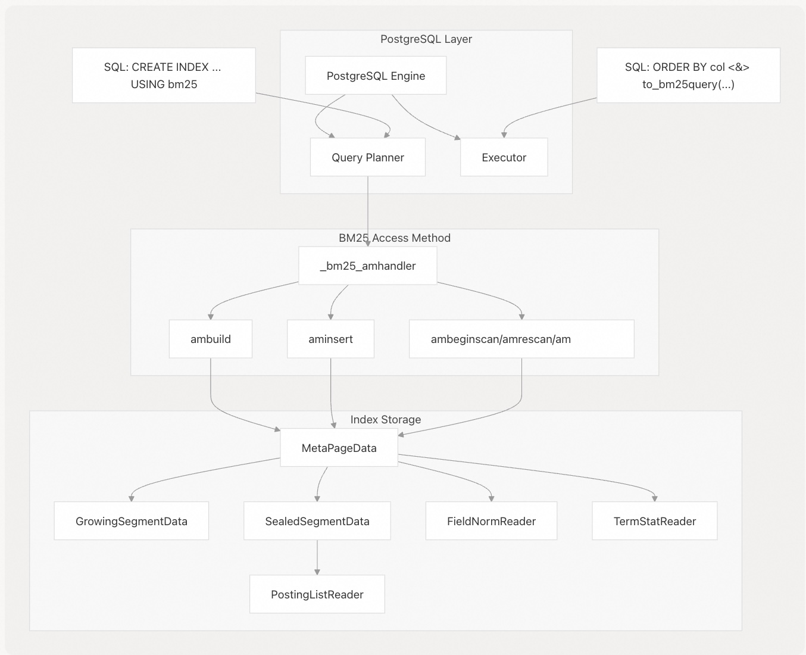
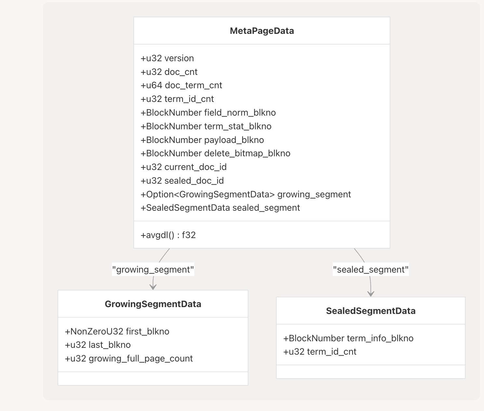
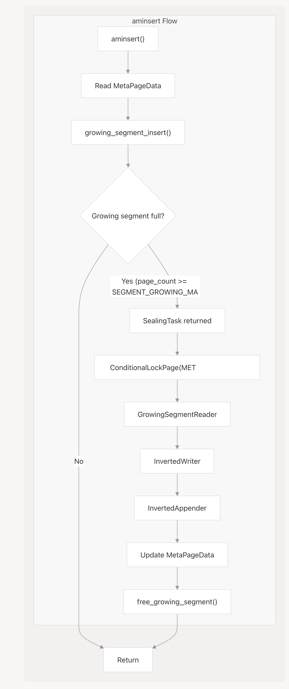
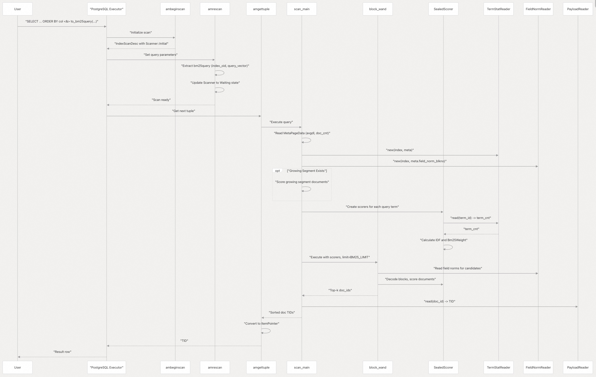

## VectorChord-bm25 源码学习: 2.2 BM25 索引 (BM25 Index)  
                                            
### 作者                                            
digoal                                            
                                            
### 日期                                            
2025-11-24                                            
                                            
### 标签                                            
VectorChord-bm25 , 源码学习 , 全文检索 , 关键词检索 , TF , IDF , 相关性排序 , ranking , Block-WeakAnd , Block-WAND , tsvector , ts_rank                                              
                                            
----                                            
                                            
## 背景                     
本文档解释了 VectorChord-BM25 中的 **BM25 索引 (BM25 Index)** 组件，它是一种专门的 **PostgreSQL 索引访问方法 (PostgreSQL index access method)** ，可有效支持文档的 **BM25 排序 (BM25 ranking)** 。BM25 索引收集并组织文档统计信息 (**document statistics**)，并使用 **Block-WeakAnd 算法 (Block-WeakAnd algorithm)** 提供快速查询处理。有关 BM25 算法本身和评分机制的信息，请参阅 Block-WeakAnd 算法 章节。  
  
## 概述 (Overview)  
  
**BM25 索引 (BM25 Index)** 是一个自定义的 **PostgreSQL 访问方法 (PostgreSQL access method)** ，可有效实现 **Okapi BM25 排序函数 (Okapi BM25 ranking function)** 。它存储 **文档向量 (document vectors)** ，计算 **词项统计信息 (term statistics)** ，并能够快速检索按查询相关性排序的 **文档 ID (document IDs)** 。该索引针对空间效率和查询性能进行了优化。  
  
  
  
来源:  
[`src/index/am.rs` 11-42](https://github.com/tensorchord/VectorChord-bm25/blob/da0908a6/src/index/am.rs#L11-L42) [`src/index/build.rs` 57-86](https://github.com/tensorchord/VectorChord-bm25/blob/da0908a6/src/index/build.rs#L57-L86) [`src/index/insert.rs` 24-56](https://github.com/tensorchord/VectorChord-bm25/blob/da0908a6/src/index/insert.rs#L24-L56) [`src/index/scan.rs` 55-103](https://github.com/tensorchord/VectorChord-bm25/blob/da0908a6/src/index/scan.rs#L55-L103)  
  
## 索引结构 (Index Structure)  
  
**BM25 索引 (BM25 index)** 使用多层结构来高效存储和检索用于 BM25 排序的文档数据。  
  
### 元数据页 (Meta Page)  
  
**元数据页 (meta page)** 是索引的中央控制点，存储关键的索引级统计信息和对索引其他部分的引用。它包括：  
  
  * 版本信息 (**Version information**)  
  * 文档总数 (**Total document count**)  
  * 平均文档长度 (**Average document length**)  
  * 对其他索引组件的引用 (**References to other index components**)  
  * 增长段和密封段信息 (**Growing and sealed segment information**)  
  
  
  
来源:  
[`src/segment/meta.rs`](https://github.com/tensorchord/VectorChord-bm25/blob/da0908a6/src/segment/meta.rs) (MetaPageData 定义) [`src/segment/growing.rs`](https://github.com/tensorchord/VectorChord-bm25/blob/da0908a6/src/segment/growing.rs) (GrowingSegmentData) [`src/index/build.rs` 27-43](https://github.com/tensorchord/VectorChord-bm25/blob/da0908a6/src/index/build.rs#L27-L43) [`src/index/scan.rs` 168-169](https://github.com/tensorchord/VectorChord-bm25/blob/da0908a6/src/index/scan.rs#L168-L169)  
  
### 段 (Segments)  
  
**BM25 索引 (BM25 index)** 将数据分为两种类型的段 (**segments**):  
  
1.  **增长段 (Growing Segment)** (`GrowingSegmentData`): 一个可变段 (**mutable segment**)，在插入期间接受新文档。它以**链式页 (linked pages)** 的形式存储，以实现快速顺序写入。当增长段达到 `SEGMENT_GROWING_MAX_PAGE_SIZE` 页（默认 4,096）时，`aminsert` 会将其转换为**密封段 (sealed segment)** 进行密封。  
2.  **密封段 (Sealed Segment)** (`SealedSegmentData`): 一个不可变、只读段 (**immutable, read-only segment**)，针对查询性能进行了优化。它包含压缩的**倒排列表 (posting lists)** ，以及用于 **Block-WAND 算法 (Block-WAND algorithm)** 的块级元数据 (**block-level metadata**)。查询期间的所有 BM25 评分都在密封段上进行。  
  
**段密封过程 (Segment Sealing Process)**  
  
当增长段达到容量时，`aminsert` 函数会执行以下操作：  
  
1.  获取**元数据页 (meta page)** 上的**排他锁 (exclusive lock)** [`src/index/insert.rs` 124-128](https://github.com/tensorchord/VectorChord-bm25/blob/da0908a6/src/index/insert.rs#L124-L128)  
2.  创建一个 `InvertedWriter` 并处理来自增长段的所有向量 [`src/index/insert.rs` 132-138](https://github.com/tensorchord/VectorChord-bm25/blob/da0908a6/src/index/insert.rs#L132-L138)  
3.  扩展密封段存储空间并附加**倒排索引 (inverted index)** [`src/index/insert.rs` 143-145](https://github.com/tensorchord/VectorChord-bm25/blob/da0908a6/src/index/insert.rs#L143-L145)  
4.  更新元数据：增加 `sealed_doc_id`，调整增长段指针 [`src/index/insert.rs` 147-150](https://github.com/tensorchord/VectorChord-bm25/blob/da0908a6/src/index/insert.rs#L147-L150)  
5.  释放旧增长段的页面 [`src/index/insert.rs` 155](https://github.com/tensorchord/VectorChord-bm25/blob/da0908a6/src/index/insert.rs#L155-L155)  
  
  
  
来源:  
[`src/index/insert.rs` 58-159](https://github.com/tensorchord/VectorChord-bm25/blob/da0908a6/src/index/insert.rs#L58-L159) [`src/segment/growing.rs`](https://github.com/tensorchord/VectorChord-bm25/blob/da0908a6/src/segment/growing.rs) (GrowingSegmentReader) [`src/segment/posting.rs`](https://github.com/tensorchord/VectorChord-bm25/blob/da0908a6/src/segment/posting.rs) (InvertedWriter, InvertedAppender)  
  
### 词项统计信息与字段范数 (Term Statistics and Field Norms)  
  
索引维护了两个对 **BM25 评分 (BM25 scoring)** 至关重要的信息：  
  
1.  **词项统计信息 (Term Statistics)** ：对于索引中的每个**词项 (term)** （或称 **token**），存储了包含该词项的文档数量。这用于计算 BM25 评分中的 **逆文档频率 (Inverse Document Frequency, IDF)** 组件。  
2.  **字段范数 (Field Norms)** ：**文档长度规范化值 (Document length normalization values)** ，用于 BM25 公式中，根据文档长度调整分数。  
  
来源:  
[`src/index/scan.rs` 137](https://github.com/tensorchord/VectorChord-bm25/blob/da0908a6/src/index/scan.rs#L137-L137) [`src/index/scan.rs` 145-147](https://github.com/tensorchord/VectorChord-bm25/blob/da0908a6/src/index/scan.rs#L145-L147) [`src/index/scan.rs` 152](https://github.com/tensorchord/VectorChord-bm25/blob/da0908a6/src/index/scan.rs#L152-L152) [`src/index/build.rs` 145-150](https://github.com/tensorchord/VectorChord-bm25/blob/da0908a6/src/index/build.rs#L145-L150)  
  
### 倒排列表 (Posting Lists)  
  
**倒排列表 (Posting Lists)** 存储了词项与包含这些词项的文档之间的映射关系。每个倒排列表条目包含：  
  
  * 文档 ID (**Document ID**)  
  * 词项频率 (**Term frequency**)（该词项在文档中出现的次数）  
  * **跳表 (Skip list)** 信息，用于快速遍历  
  
该索引使用带有**跳表 (skip lists)** 的复杂存储机制，以使 **Block-WeakAnd 算法 (Block-WeakAnd algorithm)** 能够高效地找到相关文档，而无需扫描整个倒排列表。  
  
来源:  
[`src/index/scan.rs` 155-169](https://github.com/tensorchord/VectorChord-bm25/blob/da0908a6/src/index/scan.rs#L155-L169) [`src/index/scan.rs` 242-259](https://github.com/tensorchord/VectorChord-bm25/blob/da0908a6/src/index/scan.rs#L242-L259)  
  
## 索引操作 (Index Operations)  
  
### 索引创建 (Index Creation)  
  
`ambuild` 函数实现了索引创建：  
  
1.  **初始化 (Initialization)** ：在 `METAPAGE_BLKNO`（块 0）处分配**元数据页 (meta page)** [`src/index/build.rs` 63-65](https://github.com/tensorchord/VectorChord-bm25/blob/da0908a6/src/index/build.rs#L63-L65)  
2.  **堆扫描 (Heap Scan)** ：调用 `IndexBuildHeapScan` 并附带 `build_callback` 以处理每个文档 [`src/index/build.rs` 76](https://github.com/tensorchord/VectorChord-bm25/blob/da0908a6/src/index/build.rs#L76-L76)  
3.  **构建 (Building)** ：`IndexBuilder` 累积**文档向量 (document vectors)** ，计算**词项统计信息 (term statistics)** 和**字段范数 (field norms)** [`src/index/build.rs` 105](https://github.com/tensorchord/VectorChord-bm25/blob/da0908a6/src/index/build.rs#L105-L105)  
4.  **终结 (Finalization)** ：扫描完成后，调用 `finalize_insert()` 和 `write_down()` [`src/index/build.rs` 78-79](https://github.com/tensorchord/VectorChord-bm25/blob/da0908a6/src/index/build.rs#L78-L79)  
5.  **序列化 (Serialization)** ：将所有索引结构写入磁盘 [`src/index/build.rs` 113-162](https://github.com/tensorchord/VectorChord-bm25/blob/da0908a6/src/index/build.rs#L113-L162)  
  
**构建过程详情 (Build Process Details)**  
  
`build_callback` 函数为每个 **堆元组 (heap tuple)** 调用：  
  
```rust  
// Extracts bm25vector from tuple  
let vector = Bm25VectorInput::from_datum(*datum, *is_null);  
// Passes to IndexBuilder  
state.builder.insert(id, vector.borrow());  
```  
  
`write_down` 函数将已完成的索引序列化：  
  
  * 为**删除位图 (delete bitmap)** 、**词项统计信息 (term statistics)** 创建 `VirtualPageWriter` 实例 [`src/index/build.rs` 142-153](https://github.com/tensorchord/VectorChord-bm25/blob/da0908a6/src/index/build.rs#L142-L153)  
  * 序列化 `IndexBuilder` 的**负载数据 (payload)** 、**字段范数 (field norms)** 和**倒排列表 (posting lists)** [`src/index/build.rs` 155](https://github.com/tensorchord/VectorChord-bm25/blob/da0908a6/src/index/build.rs#L155-L155)  
  * 使用所有**块号 (block numbers)** 和统计信息更新 `MetaPageData` [`src/index/build.rs` 157-161](https://github.com/tensorchord/VectorChord-bm25/blob/da0908a6/src/index/build.rs#L157-L161)  
  
该索引使用标准的 **PostgreSQL SQL 语法**创建：  
  
```sql  
CREATE INDEX index_name ON table_name USING bm25 (column_name bm25_ops);  
```  
  
其中 `column_name` 是 `bm25vector` 类型的一列。  
  
来源:  
[`src/index/build.rs` 57-162](https://github.com/tensorchord/VectorChord-bm25/blob/da0908a6/src/index/build.rs#L57-L162) [`src/index/am.rs` 27](https://github.com/tensorchord/VectorChord-bm25/blob/da0908a6/src/index/am.rs#L27-L27) [`README.md` 90-92](https://github.com/tensorchord/VectorChord-bm25/blob/da0908a6/README.md#L90-L92)  
  
### 文档插入 (Document Insertion)  
  
`aminsert` 函数处理新文档的插入 [`src/index/insert.rs` 24-159](https://github.com/tensorchord/VectorChord-bm25/blob/da0908a6/src/index/insert.rs#L24-L159)：  
  
1.  **提取向量 (Extract Vector)** ：从 **datum** 中获取 `Bm25VectorInput` [`src/index/insert.rs` 64-66](https://github.com/tensorchord/VectorChord-bm25/blob/da0908a6/src/index/insert.rs#L64-L66)  
2.  **更新元数据 (Update Metadata)** ：在 `MetaPageData` 中增加 `doc_cnt`（文档计数）、`doc_term_cnt`（文档词项计数）和 `current_doc_id`（当前文档 ID） [`src/index/insert.rs` 74-77](https://github.com/tensorchord/VectorChord-bm25/blob/da0908a6/src/index/insert.rs#L74-L77)  
3.  **增长段 (Growing Segment)** ：调用 `growing_segment_insert()`，它将文档附加到**增长段 (growing segment)** 并返回可选的 `SealingTask`（密封任务） [`src/index/insert.rs` 79](https://github.com/tensorchord/VectorChord-bm25/blob/da0908a6/src/index/insert.rs#L79-L79)  
4.  **写入辅助数据 (Write Auxiliary Data)** ：  
      * 通过 `VirtualPageWriter` 将 **heap TID** 写入**负载数据存储 (payload storage)** [`src/index/insert.rs` 85-89](https://github.com/tensorchord/VectorChord-bm25/blob/da0908a6/src/index/insert.rs#L85-L89)  
      * 将**量化后的文档长度 (quantized document length)** 写入**字段范数存储 (field norm storage)** [`src/index/insert.rs` 91-94](https://github.com/tensorchord/VectorChord-bm25/blob/da0908a6/src/index/insert.rs#L91-L94)  
5.  **更新词项统计信息 (Update Term Statistics)** ：如果需要，扩展**词项统计存储 (term stat storage)** ，并增加每个词项的**文档频率 (document frequency)** [`src/index/insert.rs` 97-111](https://github.com/tensorchord/VectorChord-bm25/blob/da0908a6/src/index/insert.rs#L97-L111)  
6.  **扩展删除位图 (Extend Delete Bitmap)** ：为新文档添加一个位 (**bit**) [`src/index/insert.rs` 113](https://github.com/tensorchord/VectorChord-bm25/blob/da0908a6/src/index/insert.rs#L113-L113)  
7.  **段密封 (Segment Sealing)** ：如果返回 `SealingTask`，则执行**段密封 (segment sealing)** ，如上文“段”部分所述 [`src/index/insert.rs` 119-156](https://github.com/tensorchord/VectorChord-bm25/blob/da0908a6/src/index/insert.rs#L119-L156)  
  
**关键函数 (Key Functions)** ：  
  
  * `aminsertinner`：核心插入逻辑，为兼容不同的 **PostgreSQL** 版本而提取 [`src/index/insert.rs` 58-159](https://github.com/tensorchord/VectorChord-bm25/blob/da0908a6/src/index/insert.rs#L58-L159)  
  * `growing_segment_insert`：将文档附加到**增长段 (growing segment)** ，在满时返回**密封任务 (sealing task)** [`src/segment/growing.rs`](https://github.com/tensorchord/VectorChord-bm25/blob/da0908a6/src/segment/growing.rs)  
  * `extend_term_id`：如果遇到新词项，则扩展**词项统计存储 (term statistics storage)** [`src/index/insert.rs` 103](https://github.com/tensorchord/VectorChord-bm25/blob/da0908a6/src/index/insert.rs#L103-L103)  
  * `free_growing_segment`：递归地释放已密封**增长段 (growing segment)** 的页面 [`src/index/insert.rs` 161-190](https://github.com/tensorchord/VectorChord-bm25/blob/da0908a6/src/index/insert.rs#L161-L190)  
  
来源:  
[`src/index/insert.rs` 24-191](https://github.com/tensorchord/VectorChord-bm25/blob/da0908a6/src/index/insert.rs#L24-L191) [`src/segment/growing.rs`](https://github.com/tensorchord/VectorChord-bm25/blob/da0908a6/src/segment/growing.rs) [`src/segment/term_stat.rs`](https://github.com/tensorchord/VectorChord-bm25/blob/da0908a6/src/segment/term_stat.rs)  
  
### Query Processing (查询处理)  
  
BM25 索引中的查询处理（Query processing）涉及：  
  
1.  将用户查询（query）转换为 `bm25query` 对象（object）  
2.  访问词项统计信息（term statistics）和字段范数（field norms）  
3.  使用 Block-WeakAnd 算法（algorithm）高效地查找（find）前 k 个匹配文档（top-k matching documents）  
4.  返回按相关性得分（relevance score）排序的文档 ID（document IDs）  
  
  
  
来源: [`src/index/scan.rs` 55-144](https://github.com/tensorchord/VectorChord-bm25/blob/da0908a6/src/index/scan.rs#L55-L144) [`src/index/scan.rs` 154-261](https://github.com/tensorchord/VectorChord-bm25/blob/da0908a6/src/index/scan.rs#L154-L261) [`src/algorithm/block_wand.rs`](https://github.com/tensorchord/VectorChord-bm25/blob/da0908a6/src/algorithm/block_wand.rs)  
  
## Integration with PostgreSQL (与 PostgreSQL 的集成)  
  
BM25 索引与 PostgreSQL 的可扩展性特性（extensibility features）深度集成：  
  
### Access Method Implementation (访问方法实现)  
  
BM25 索引通过 `_bm25_amhandler` 函数实现了 PostgreSQL 的访问方法 API（Access Method API），该函数返回一个填充了回调函数（callback functions）的 `IndexAmRoutine` 结构体。  
  
来源: [`src/index/am.rs` 11-42](https://github.com/tensorchord/VectorChord-bm25/blob/da0908a6/src/index/am.rs#L11-L42)  
  
**Core Callbacks** (核心回调函数)  
  
| 回调函数 (Callback) | 函数 (Function) | 目的 (Purpose) |  
| --- | --- | --- |  
| `ambuild` | [`src/index/build.rs` 57-86](https://github.com/tensorchord/VectorChord-bm25/blob/da0908a6/src/index/build.rs#L57-L86) | 通过扫描堆（heap）并构建所有索引结构来构建初始索引 (Builds the initial index by scanning heap and constructing all index structures) |  
| `ambuildempty` | [`src/index/build.rs` 17-46](https://github.com/tensorchord/VectorChord-bm25/blob/da0908a6/src/index/build.rs#L17-L46) | 创建带有初始化元页（meta page）的空索引 (Creates an empty index with initialized meta page) |  
| `aminsert` | [`src/index/insert.rs` 24-56](https://github.com/tensorchord/VectorChord-bm25/blob/da0908a6/src/index/insert.rs#L24-L56) | 将新文档插入到索引中 (Inserts a new document into the index) |  
| `ambulkdelete` | [`src/index/vacuum.rs`](https://github.com/tensorchord/VectorChord-bm25/blob/da0908a6/src/index/vacuum.rs) | 在删除位图（delete bitmap）中标记已删除的元组（tuples） (Marks deleted tuples in the delete bitmap) |  
| `amvacuumcleanup` | [`src/index/vacuum.rs`](https://github.com/tensorchord/VectorChord-bm25/blob/da0908a6/src/index/vacuum.rs) | 在清理（vacuum）后重新计算统计信息 (Recalculates statistics after vacuum) |  
| `ambeginscan` | [`src/index/scan.rs` 55-71](https://github.com/tensorchord/VectorChord-bm25/blob/da0908a6/src/index/scan.rs#L55-L71) | 初始化索引扫描，分配 `Scanner` 状态 (Initializes an index scan, allocates `Scanner` state) |  
| `amrescan` | [`src/index/scan.rs` 74-102](https://github.com/tensorchord/VectorChord-bm25/blob/da0908a6/src/index/scan.rs#L74-L102) | 设置查询参数，从扫描键（scan keys）中提取 `bm25query` (Sets query parameters, extracts `bm25query` from scan keys) |  
| `amgettuple` | [`src/index/scan.rs` 105-144](https://github.com/tensorchord/VectorChord-bm25/blob/da0908a6/src/index/scan.rs#L105-L144) | 返回下一个匹配的 TID，在首次调用时执行 `scan_main` (Returns next matching TID, executes `scan_main` on first call) |  
| `amendscan` | [`src/index/scan.rs` 147-151](https://github.com/tensorchord/VectorChord-bm25/blob/da0908a6/src/index/scan.rs#L147-L151) | 清理扫描状态 (Cleans up scan state) |  
  
### Access Method Properties (访问方法属性)  
  
处理程序（handler）设置了特定的访问方法属性（AM properties）：  
  
  * `amcanorderbyop = true`: 支持带有操作符（operators）的 `ORDER BY`  
  * `amoptionalkey = true`: 可以在没有扫描键的情况下操作  
  
来源: [`src/index/am.rs` 24-34](https://github.com/tensorchord/VectorChord-bm25/blob/da0908a6/src/index/am.rs#L24-L34)  
  
### Cost Estimation (成本估算)  
  
`amcostestimate` 回调函数：  
  
  * 如果 `ENABLE_INDEX.get()` 为 false，则返回无限成本  
  * 否则设置最小成本以优先使用索引  
  * 与 PostgreSQL 的查询规划器（query planner）集成，进行基于成本的优化（cost-based optimization）  
  
来源: [`src/index/am.rs` 52-76](https://github.com/tensorchord/VectorChord-bm25/blob/da0908a6/src/index/am.rs#L52-L76)  
  
### Property Reporting (属性报告)  
  
`amproperty` 回调函数：  
  
  * 报告属性 1（被索引的列）支持 `AMPROP_DISTANCE_ORDERABLE`  
  * 使 PostgreSQL 能够在 `ORDER BY` 子句中使用 `<&>` 操作符  
  
来源: [`src/index/am.rs` 79-93](https://github.com/tensorchord/VectorChord-bm25/blob/da0908a6/src/index/am.rs#L79-L93)  
  
来源: [`src/index/am.rs` 11-93](https://github.com/tensorchord/VectorChord-bm25/blob/da0908a6/src/index/am.rs#L11-L93) [`src/index/build.rs` 17-86](https://github.com/tensorchord/VectorChord-bm25/blob/da0908a6/src/index/build.rs#L17-L86) [`src/index/insert.rs` 24-56](https://github.com/tensorchord/VectorChord-bm25/blob/da0908a6/src/index/insert.rs#L24-L56) [`src/index/scan.rs` 55-151](https://github.com/tensorchord/VectorChord-bm25/blob/da0908a6/src/index/scan.rs#L55-L151)  
  
### SQL Interface (SQL 接口)  
  
BM25 索引通过操作符类（operator classes）和访问方法定义提供了 SQL 接口。  
  
来源: [`src/sql/finalize.sql` 44-57](https://github.com/tensorchord/VectorChord-bm25/blob/da0908a6/src/sql/finalize.sql#L44-L57)  
  
**Access Method Registration** (访问方法注册)  
  
```sql  
CREATE ACCESS METHOD bm25 TYPE INDEX HANDLER _bm25_amhandler;  
```  
  
**Operator Definition** (操作符定义)  
  
```sql  
CREATE OPERATOR pg_catalog.<&> (  
    PROCEDURE = search_bm25query,  
    LEFTARG = bm25vector,  
    RIGHTARG = bm25query  
);  
```  
  
`<&>` 操作符计算负 BM25 得分（负值越大，相关性越高），由 `search_bm25query` 函数实现。  
  
来源: [`src/datatype/functions.rs` 11](https://github.com/tensorchord/VectorChord-bm25/blob/da0908a6/src/datatype/functions.rs#L11-L11)  
  
**Operator Class** (操作符类)  
  
```sql  
CREATE OPERATOR CLASS bm25_ops FOR TYPE bm25vector USING bm25 FAMILY bm25_ops AS  
    OPERATOR 1 pg_catalog.<&>(bm25vector, bm25query) FOR ORDER BY float_ops;  
```  
  
这声明 `<&>` 操作符可用于 BM25 排序的 `ORDER BY` 子句。  
  
来源: [`src/sql/finalize.sql` 55-57](https://github.com/tensorchord/VectorChord-bm25/blob/da0908a6/src/sql/finalize.sql#L55-L57)  
  
**Usage Example** (使用示例)  
  
```sql  
-- Create a BM25 index  
CREATE INDEX documents_embedding_bm25 ON documents USING bm25 (embedding bm25_ops);  
  
-- Query using the index  
SELECT id, passage, embedding <&> to_bm25query('documents_embedding_bm25', tokenize('query text', 'tokenizer')) AS rank  
FROM documents  
ORDER BY rank  
LIMIT 10;  
```  
  
`to_bm25query` 函数构造一个包含索引 OID 和查询向量的 `bm25query` 复合类型（composite type）。  
  
来源: [`src/sql/finalize.sql` 39-42](https://github.com/tensorchord/VectorChord-bm25/blob/da0908a6/src/sql/finalize.sql#L39-L42)  
  
```sql  
CREATE FUNCTION to_bm25query(index_oid regclass, query_vector bm25vector) RETURNS bm25query  
    IMMUTABLE STRICT PARALLEL SAFE LANGUAGE sql AS $$  
        SELECT index_oid, query_vector;  
    $$;  
```  
  
来源: [`src/sql/finalize.sql` 34-57](https://github.com/tensorchord/VectorChord-bm25/blob/da0908a6/src/sql/finalize.sql#L34-L57) [`src/datatype/functions.rs` 11](https://github.com/tensorchord/VectorChord-bm25/blob/da0908a6/src/datatype/functions.rs#L11-L11) [`README.md` 96-108](https://github.com/tensorchord/VectorChord-bm25/blob/da0908a6/README.md#L96-L108)  
  
## Performance Considerations (性能考量)  
  
### Block-WeakAnd Algorithm (Block-WeakAnd 算法)  
  
BM25 索引使用 Block-WAND（Block-Weak AND）算法进行高效的查询处理。关于该算法的详细文档请参阅 Block-WeakAnd Algorithm 章节。  
  
来源: [`README.md` 11](https://github.com/tensorchord/VectorChord-bm25/blob/da0908a6/README.md#L11-L11)  
  
**Query Execution Flow** (查询执行流程)  
  
`scan_main` 函数协调查询执行：  
  
1.  **Check Limit** (检查限制): 如果 `BM25_LIMIT.get()` 为 0 则返回空；如果为 -1 则执行暴力搜索（brute force）  
2.  **Initialize Readers** (初始化读取器): 从元数据创建 `TermStatReader`、`FieldNormReader`、`DeleteBitmapReader`  
3.  **Process Growing Segment** (处理增长中的段): 线性地为增长中的段（growing segment）中的文档评分  
4.  **Build Scorers** (构建评分器): 为每个查询词项（query term）创建带有倒排列表读取器的 `SealedScorer` 实例  
5.  **Execute Block-WAND** (执行 Block-WAND): 使用评分器调用 `block_wand()` 或 `block_wand_single()`  
6.  **Map Results** (映射结果): 使用 `PayloadReader` 将 doc\_ids 转换为 TIDs  
  
来源: [`src/index/scan.rs` 154-261](https://github.com/tensorchord/VectorChord-bm25/blob/da0908a6/src/index/scan.rs#L154-L261)  
  
**Prefiltering Support** (预过滤支持)  
  
当 `ENABLE_PREFILTER.get()` 为 true 时，该算法在评分期间执行 MVCC 检查（多版本并发控制检查）：  
  
  * 调用 `check()` 函数验证元组可见性（tuple visibility）  
  * 提前跳过不可见的元组，减少不必要的评分计算  
  * 与 PostgreSQL 的快照隔离（snapshot isolation）集成  
  
来源: [`src/index/scan.rs` 211](https://github.com/tensorchord/VectorChord-bm25/blob/da0908a6/src/index/scan.rs#L211-L211) [`src/index/scan.rs` 422-433](https://github.com/tensorchord/VectorChord-bm25/blob/da0908a6/src/index/scan.rs#L422-L433)  
  
**Brute Force Mode** (暴力模式)  
  
`brute_force_scan` 函数处理 `BM25_LIMIT = -1` 的情况：  
  
  * 为所有文档评分，不进行基于阈值的修剪（pruning）  
  * 使用 `LoserTree` 合并多个倒排列表迭代器（posting list iterators）  
  * 返回所有具有正得分的文档，按相关性排序  
  
来源: [`src/index/scan.rs` 263-351](https://github.com/tensorchord/VectorChord-bm25/blob/da0908a6/src/index/scan.rs#L263-L351) [`src/algorithm/block_wand.rs`](https://github.com/tensorchord/VectorChord-bm25/blob/da0908a6/src/algorithm/block_wand.rs) [`README.md` 11](https://github.com/tensorchord/VectorChord-bm25/blob/da0908a6/README.md#L11-L11)  
  
### Memory Usage and Scaling (内存使用和扩展)  
  
BM25 索引通过多种架构选择平衡了内存使用和搜索性能：  
  
**Storage Efficiency** (存储效率)  
  
  * **Virtual Page System** (虚拟页系统): 管理跨越多个 PostgreSQL 页面的数据结构（请参阅 Virtual Page System 章节）  
  * **Segment Architecture** (段架构): 增长中的段（Growing segments）使用简单的链表页面；密封的段（sealed segments）使用压缩存储  
  * **Compression** (压缩): 倒排列表（Posting lists）使用增量编码（delta encoding）和位打包（bit-packing）  
  
来源: [`src/algorithm/compression.rs`](https://github.com/tensorchord/VectorChord-bm25/blob/da0908a6/src/algorithm/compression.rs)  
  
**Query Performance** (查询性能)  
  
  * **Block-Level Skip Lists** (块级跳表): 密封的倒排列表存储 `block_max_score` 用于跳过  
  * **Top-K Threshold** (Top-K 阈值): 维护动态得分阈值以提前修剪候选者  
  * **Single-Term Optimization** (单词项优化): 使用 `block_wand_single`  
  
来源: [`src/segment/posting.rs`](https://github.com/tensorchord/VectorChord-bm25/blob/da0908a6/src/segment/posting.rs)  
  
**配置参数 (Configuration Parameters)**  
  
配置通过 **GUC (Grand Unified Configuration)** 变量管理，这些变量在 [`src/guc.rs`](https://github.com/tensorchord/VectorChord-bm25/blob/da0908a6/src/guc.rs) 中定义：  
  
| 参数 (Parameter) | 类型 (Type) | 默认值 (Default) | 范围 (Range) | 目的 (Purpose) |  
| :--- | :--- | :--- | :--- | :--- |  
| `bm25_catalog.bm25_limit` | integer | 100 | -1 to 65535 | 返回的最大结果数。-1 启用**暴力模式 (brute force mode)** |  
| `bm25_catalog.enable_index` | boolean | true | - | **全局索引启用/禁用开关 (Global index enable/disable switch)** |  
| `bm25_catalog.segment_growing_max_page_size` | integer | 4096 | 1 to 1000000 | **密封增长段 (sealing growing segment)** 之前的页数 |  
| `bm25_catalog.enable_prefilter` | boolean | false | - | **Block-WAND** 期间是否启用 **MVCC 预过滤 (MVCC prefiltering)** |  
  
**限制行为 (Limit Behavior)**  
  
`BM25_LIMIT` 参数对查询行为有关键影响 [`src/index/scan.rs` 159-165](https://github.com/tensorchord/VectorChord-bm25/blob/da0908a6/src/index/scan.rs#L159-L165)：  
  
  * **正值 (Positive values)** ：使用 **Block-WAND** 有效返回 **top-k 结果 (top-k results)**  
  * **零 (Zero)** ：立即不返回任何结果  
  * **-1**：使用**暴力模式 (brute force)** 返回按分数排序的所有匹配文档  
  
**扩展性考量 (Scaling Considerations)**  
  
  * **增长段 (Growing segments)** 会累积写入；定期**密封 (sealing)** 可防止无限增长  
  * **密封段 (Sealed segments)** 针对读取性能进行了优化，但更新时需要完全重建  
  * **删除位图 (The delete bitmap)** 跟踪删除；`vacuum` 必须定期重建段以回收空间  
  
来源:  
[`src/guc.rs`](https://github.com/tensorchord/VectorChord-bm25/blob/da0908a6/src/guc.rs) [`src/index/scan.rs` 159-165](https://github.com/tensorchord/VectorChord-bm25/blob/da0908a6/src/index/scan.rs#L159-L165) [`README.md` 462-467](https://github.com/tensorchord/VectorChord-bm25/blob/da0908a6/README.md#L462-L467) [`src/index/insert.rs` 119-156](https://github.com/tensorchord/VectorChord-bm25/blob/da0908a6/src/index/insert.rs#L119-L156)  
  
## 限制 (Limitations)  
  
**BM25 索引 (BM25 index)** 有一些需要注意的限制：  
  
1.  索引将向 **PostgreSQL** 返回最多 `bm25_catalog.bm25_limit` 个结果。用户需要调整此参数以获得更大的结果集。  
2.  索引针对 **top-k 检索 (top-k retrieval)** 进行了优化，而不是**穷举搜索 (exhaustive search)** 。  
3.  性能取决于适当的**分词 (tokenization)** 和**索引配置 (index configuration)** 。  
  
来源:  
[`README.md` 442-444](https://github.com/tensorchord/VectorChord-bm25/blob/da0908a6/README.md#L442-L444)  
  
## 相关组件 (Related Components)  
  
**BM25 索引 (BM25 index)** 与 **VectorChord-BM25** 系统中的其他几个组件密切配合：  
  
  * 数据类型 (Data Types)：索引操作的 `bm25vector` 和 `bm25query` 类型  
  * 虚拟页系统 (Virtual Page System)：索引数据的底层存储机制  
  * Block-WeakAnd 算法 (Block-WeakAnd Algorithm)：索引使用的核心排序算法  
  
-----  
  
# 附录1: 写入性能与并发控制：段密封（Segment Sealing）的运维影响是什么？  
  
**背景痛点：** 文档中提到 `aminsert` 函数在增长段（Growing Segment）满时会执行**段密封（Segment Sealing）** ，且需要**获取元数据页（Meta Page）上的排他锁（exclusive lock）** 。这一过程涉及处理并写入**倒排索引 (inverted index)** 。  
  
**关键问题：**  
  
在写入并发量高（高 INSERT 频率）的环境中，**段密封**操作对事务的**写入延迟（write latency）会造成多大影响？特别是，当 `aminsert` 获取排他锁**时，是否会阻塞其他正在尝试插入文档的并发事务？以及，调整配置参数 `bm25_catalog.segment_growing_max_page_size`（增长段最大页大小）的**最佳实践**是什么？是应该调大以减少密封频率（但可能导致 Growing Segment 变慢），还是调小以更快地将数据转化为优化的密封段（Sealed Segment）？  
  
## 回答  
  
您询问的是 VectorChord-BM25 中 `aminsert` 函数在高并发写入场景下的段密封（Segment Sealing）对写入延迟的影响，以及 `bm25_catalog.segment_growing_max_page_size` 参数的调优策略。    
  
### 段密封对并发写入的影响  
  
**排他锁的阻塞行为：**  
  
段密封过程使用**条件锁（Conditional Lock）** 而非阻塞锁，这是关键设计：    
  
```rust  
if !pgrx::pg_sys::ConditionalLockPage(  
    index,  
    METAPAGE_BLKNO,  
    pgrx::pg_sys::ExclusiveLock as _,  
) {  
    return false;  
}  
```  
  
当 `aminsert` 检测到需要密封时，它会尝试获取元数据页的排他锁。  **如果锁已被其他进程持有，当前事务立即返回 `false` 而不是等待**，允许其他后端继续插入。  只有成功获取锁的进程会执行密封操作。    
  
**写入延迟影响：**  
  
1. **获得锁的进程**：需要执行完整的密封流程，包括：  
   - 读取 Growing Segment 所有向量    
   - 构建倒排索引（`InvertedWriter`）    
   - 压缩并写入 Sealed Segment    
   - 更新元数据并释放旧页面    
     
   这个过程的延迟与 Growing Segment 大小成正比（即 `segment_growing_max_page_size` 的值）。    
  
2. **未获得锁的进程**：立即返回，不会被阻塞，可以继续处理其他插入。    
  
3. **后续插入**：密封完成后，Growing Segment 从 `last_blkno` 继续增长，新插入可以立即追加。    
  
### `segment_growing_max_page_size` 调优策略  
  
该参数控制触发密封的阈值（默认 4096 页）：     
  
**调大参数（如 8192-100000）：**  
- ✅ 减少密封频率，降低写入放大  
- ✅ 减少单个事务遇到密封操作的概率  
- ❌ Growing Segment 变大，查询时需要线性扫描更多未优化数据    
- ❌ 单次密封操作耗时更长（处理更多数据）  
  
**调小参数（如 1024-2048）：**  
- ✅ 更快将数据转为优化的 Sealed Segment，查询性能更好  
- ✅ 单次密封操作更快（数据量小）  
- ❌ 密封频率增加，更多事务会触发密封  
- ❌ 写入放大增加（更频繁的压缩和索引构建）  
  
**最佳实践建议：**  
  
| 场景 | 推荐值 | 理由 |  
|------|--------|------|  
| **写多读少**（如日志摄入） | 50000-100000 | 最小化密封开销，批量处理 |  
| **读多写少**（如搜索服务） | 2048-4096 | 快速优化数据，提升查询性能 |  
| **批量导入后查询** | 100000+ | 导入时延迟密封，完成后一次性优化 |  
| **均衡负载** | 4096（默认） | 平衡写入和查询性能 |  
  
**高并发写入场景特别建议：**  
- 调大参数（如 10000-50000）以减少密封冲突概率  
- 监控密封操作频率和持续时间  
- 考虑在低峰期手动触发 VACUUM 来合并 Sealed Segments  
  
## Notes  
  
条件锁机制是避免并发阻塞的关键设计。  与传统的阻塞锁不同，失败的锁获取不会让其他事务等待，而是让它们继续执行。  这意味着在高并发场景下，只有一个后端会承担密封开销，其他后端几乎不受影响。  
  
Growing Segment 的插入操作本身不需要元数据页的排他锁，只在密封时才需要。  正常插入只需要写锁定 Growing Segment 的当前页面。    
  
参数可以在会话级别动态调整，无需重启数据库：    
```sql  
SET bm25_catalog.segment_growing_max_page_size = 10000;  
```  
  
-----  
  
附录2: BM25 索引中增长段(growing segment)密封(sealing)过程中的并发写入行为。  
  
## 密封未完成前, 其他会话能写入数据到增长段吗?  
  
**不能**。在密封过程中, 其他会话无法写入数据到增长段。    
  
代码使用 `ConditionalLockPage` 获取元数据页的排他锁。如果无法获取锁(说明其他进程正在密封), 当前插入操作会直接返回 `false`。    
  
这意味着在密封过程中:  
- 触发密封的会话持有排他锁, 执行密封操作  
- 其他尝试插入的会话无法获取锁, 插入失败并返回  
  
## 如果能写, 增长段新增的数据也会进入密封段吗?  
  
这个问题的前提不成立, 因为密封期间其他会话无法写入。但为了完整性说明: 密封过程会处理**密封开始时**增长段中的所有数据。    
  
密封过程:  
1. 记录当前增长段的 `prev_growing_segment` 和 `sealed_doc_id`    
2. 创建 `GrowingSegmentReader` 读取这个快照    
3. 将数据写入 `InvertedWriter` 并序列化到密封段    
4. 更新元数据,调整增长段指针    
  
## 如果能写,增长段有内存溢出风险吗?  
  
同样,前提不成立。但关于增长段的内存管理:增长段**不会**导致内存溢出,因为它使用基于磁盘的页面存储,而非内存缓冲。    
  
增长段的存储机制:  
- 数据写入 PostgreSQL 页面(磁盘存储)    
- 当页面满时,分配新页面并链接    
- 达到 `SEGMENT_GROWING_MAX_PAGE_SIZE` 页数时触发密封    
  
默认最大页数为 4096 页  ,可通过 `bm25_catalog.segment_growing_max_page_size` 配置  。  
  
## Notes  
  
密封机制通过排他锁保证了数据一致性, 避免了并发写入冲突。增长段使用 PostgreSQL 的页面管理系统, 内存占用受 PostgreSQL 缓冲池控制, 不会无限增长。  
  
## 为什么插入数据要获得元数据页的排他锁?  
  
实际上, **常规插入操作并不需要获取元数据页的排他锁**。  只需要通过 `page_write` 获取写锁来更新元数据即可。  
  
排他锁只在**密封(sealing)过程**中才需要获取。  具体来说,当增长段达到容量上限需要密封时,代码使用 `ConditionalLockPage` 尝试获取元数据页的排他锁。  
  
## 为什么密封过程需要排他锁?  
  
密封过程需要排他锁的原因是**防止并发密封冲突**:  
  
1. **保证单一密封进程**:当多个会话同时触发密封条件时,只有一个会话能获取排他锁并执行密封。  其他会话获取锁失败后直接返回 `false`,避免重复密封同一批数据。  
  
2. **保护元数据一致性**:密封过程需要执行多个复杂的元数据更新操作:  
   - 扩展密封段的 term_id 存储    
   - 序列化倒排索引到密封段    
   - 更新 `sealed_doc_id` 和增长段指针    
     
   这些操作必须原子性完成,排他锁确保在整个密封过程中没有其他会话修改元数据。  
  
3. **避免数据竞争**:如果允许并发插入,新插入的数据可能会与正在密封的数据产生冲突,导致文档 ID 分配混乱或数据丢失。  
  
## 锁的作用范围  
  
需要注意的是,`page_write` 本身也会获取页面级别的锁  ,但这是 PostgreSQL 的缓冲区锁(`BUFFER_LOCK_EXCLUSIVE`),用于保护单个页面的写入。而密封过程使用的 `ConditionalLockPage` 是更高级别的页面锁,用于协调多个会话之间的复杂操作。  
  
## Notes  
  
这种设计体现了两层锁机制:  
- **常规插入**:使用 `page_write` 的缓冲区锁,允许高并发  
- **密封操作**:使用条件排他锁,确保只有一个会话执行密封,避免资源浪费和数据冲突  
  
这种设计在保证数据一致性的同时,最大化了插入操作的并发性能。  
  
  
## 在密封(sealing)过程进行时, 其他会话是否能够写入数据到增长段。  
  
## 答案  
  
**不能**。在密封过程未结束前,其他会话无法写入数据。    
  
## 原因  
  
密封过程使用 `ConditionalLockPage` 获取元数据页的排他锁(`ExclusiveLock`)。  这个锁会阻止其他会话的插入操作:  
  
1. **触发密封的会话**:成功获取排他锁,执行密封操作(读取增长段、构建倒排索引、序列化到密封段、更新元数据)    
  
2. **其他会话的插入操作**:  
   - 常规插入需要通过 `page_write` 更新元数据页    
   - `page_write` 内部会尝试获取 `BUFFER_LOCK_EXCLUSIVE` 锁    
   - 由于密封会话持有排他锁,其他会话的 `page_write` 调用会被阻塞,等待锁释放  
  
3. **锁释放**:密封完成后调用 `UnlockPage` 释放排他锁  ,此时其他会话才能继续插入  
  
## Notes  
  
这个设计确保了密封过程的原子性和数据一致性。如果允许并发写入,可能导致:  
- 新插入的数据与正在密封的数据产生 doc_id 冲突  
- 元数据(如 `sealed_doc_id`、`current_doc_id`)状态不一致  
- 增长段指针更新时的竞态条件  
  
密封过程中的短暂阻塞是必要的代价,以保证索引的正确性。  
  
-----  
  
# 附录3: 查询性能陷阱：如何安全地使用 `bm25_limit` 参数？  
  
**背景痛点：** 索引针对 **top-k 检索（top-k retrieval）和 Block-WeakAnd 算法进行了优化。但配置参数 `bm25_catalog.bm25_limit` 如果设置为 `-1`，将启用暴力模式（brute force mode）** ，返回所有匹配文档并排序 。  
  
**关键问题：**  
  
在生产环境中，**暴力模式（即 `bm25_limit = -1`）和优化模式（即 `bm25_limit > 0`）的查询性能差异有多大？如果用户需要返回超过 65535 个结果（最大范围）或完整的未过滤结果集，启用暴力模式会对数据库的 CPU 和 I/O 资源造成什么样的影响？是否存在一个建议的阈值（如文档大小或词项复杂度），使得一旦超过该阈值就必须**避免使用暴力模式？  
  
您询问的是 VectorChord-BM25 中 `bm25_catalog.bm25_limit` 参数在暴力模式（`-1`）和优化模式（`> 0`）下的性能差异。    
  
## 性能差异分析  
  
### 优化模式 (`bm25_limit > 0`)  
  
当 `bm25_limit` 设置为正值时,系统使用 Block-WAND 算法进行 top-k 检索。   该算法通过以下机制优化性能:  
  
1. **动态阈值剪枝**: `TopKComputer` 维护第 k 个最佳分数作为阈值,当候选文档分数低于此阈值时直接跳过。    
  
2. **块级跳过**: 在 `block_wand_single` 中,当整个块的最大分数 (`block_max_score`) 低于阈值时,直接跳过整个块而不解码。    
  
3. **浅层定位**: 多词查询时使用 `shallow_seek` 快速定位到目标文档,避免逐个遍历。    
  
### 暴力模式 (`bm25_limit = -1`)  
  
暴力模式调用 `brute_force_scan`,对所有文档进行完整评分。   关键差异:  
  
1. **无阈值剪枝**: 所有文档都会被评分,无法提前终止。    
  
2. **完整遍历**: 使用 `LoserTree` 合并所有 posting list,必须遍历所有匹配的文档。    
  
3. **全局排序**: 最后对所有结果进行排序。    
  
## 资源影响  
  
### CPU 影响  
  
- **计算量**: 暴力模式需要计算所有匹配文档的 BM25 分数,而优化模式可能只计算很小一部分  
- **排序开销**: 暴力模式需要对所有结果排序,时间复杂度 O(n log n),其中 n 是匹配文档数  
  
### I/O 影响  
  
- **磁盘读取**: 暴力模式需要读取所有 posting list 的所有块,而优化模式可以跳过大量块  
- **缓存效率**: 优化模式的局部性更好,暴力模式可能导致缓存失效  
  
## 性能差异量化  
  
根据代码实现,性能差异取决于:  
  
1. **匹配文档数量**: 如果查询匹配 100 万个文档,暴力模式需要评分 100 万次,而 `bm25_limit=100` 的优化模式可能只需评分几千次  
2. **查询词数量**: 多词查询在优化模式下受益更大,因为可以利用 pivot 机制跳过更多文档  
3. **分数分布**: 如果高分文档集中在前面,优化模式的阈值会快速上升,剪枝效果更好  
  
## 建议阈值  
  
代码中没有明确的阈值建议,但可以推断:  
  
**避免暴力模式的场景**:  
- 匹配文档数 > 10 万时,性能差异会非常显著  
- 查询词为高频词(如 "the", "is")时,匹配文档数巨大  
- 生产环境高并发查询时,暴力模式会导致 CPU 饱和  
  
**可以使用暴力模式的场景**:  
- 匹配文档数 < 1000 时,差异不明显  
- 需要完整结果集用于分析或导出  
- 低频查询且对延迟不敏感  
  
## Notes  
  
如果您需要返回超过 65535 个结果,建议的替代方案是:  
1. 使用分页查询,多次调用优化模式  
2. 在应用层合并结果  
3. 考虑是否真的需要如此多的结果,通常 top-k 已足够  
  
暴力模式主要用于调试和特殊分析场景,不建议在生产环境的常规查询中使用。  
  
  
-----  
  
# 附录4: 维护与空间管理：如何通过 `VACUUM` 有效回收已删除文档的空间？  
  
**背景痛点：** 文档提到删除操作仅通过**删除位图（delete bitmap）进行跟踪，并且“`vacuum` 必须定期重建段以回收空间”** 。这意味着删除操作本身不会立即释放磁盘空间，可能导致索引**膨胀（bloat）** 。  
  
**关键问题：**  
  
在 PostgreSQL 中，具体需要执行哪种类型的维护操作（例如，普通的 `VACUUM`、`VACUUM FULL`，或扩展中特定的函数）才能触发段的**重建（rebuild segments）并有效回收被删除文档占用的空间？对于具有高更新/删除频率（高流失率/high-churn**）的表，推荐的**维护周期和策略**是什么，以确保索引性能和磁盘空间的有效利用？  
  
# Answer  
  
根据代码库的实现，VectorChord-BM25 的 BM25 索引**目前不支持通过 VACUUM 操作自动重建段来回收空间**。让我详细解释当前的实现情况：  
  
## 当前的 VACUUM 实现  
  
VectorChord-BM25 实现了 PostgreSQL 的标准 vacuum 接口，包括两个回调函数  ：  
  
1. **`ambulkdelete`** - 标记删除的文档并更新统计信息    
2. **`amvacuumcleanup`** - 重新计算词项统计信息    
  
### 删除操作的实际行为  
  
当执行 `VACUUM` 时，`ambulkdelete` 函数会：  
- 在删除位图中标记已删除的文档    
- 更新全局统计信息（`doc_cnt`、`doc_term_cnt`）    
- **但不会物理删除或重建任何段**  
  
`amvacuumcleanup` 函数会重新计算每个词项的文档频率  ，但同样**不会重建段或回收磁盘空间**。  
  
## 空间回收的唯一方式  
  
**目前回收被删除文档占用空间的唯一方法是重建整个索引**：  
  
```sql  
-- 删除并重建索引  
DROP INDEX index_name;  
CREATE INDEX index_name ON table_name USING bm25 (column_name bm25_ops);  
```  
  
或者使用 `REINDEX`：  
  
```sql  
REINDEX INDEX index_name;  
```  
  
这会触发 `ambuild` 函数  ，完全重建索引并排除已删除的文档。  
  
## 为什么没有自动段重建  
  
从代码实现来看：  
  
1. **段的不可变性**：sealed segment（密封段）是只读的，设计用于查询优化    
2. **段封存仅在插入时触发**：只有当 growing segment 达到 `SEGMENT_GROWING_MAX_PAGE_SIZE` 页时才会封存    
3. **vacuum 不修改段结构**：vacuum 操作只更新元数据和删除位图，不触发段重建    
  
## 高流失率场景的建议策略  
  
对于高更新/删除频率的表，建议：  
  
1. **定期重建索引**：根据删除比例（如超过 20-30%）定期执行 `REINDEX`  
2. **监控索引膨胀**：通过查询 `pg_relation_size()` 监控索引大小  
3. **调整 `bm25_catalog.segment_growing_max_page_size`**：较小的值（默认 4096）可以减少单个段的膨胀影响    
  
## Notes  
  
这是 VectorChord-BM25 当前实现的一个限制。与 PostgreSQL 的 B-tree 索引不同（B-tree 可以通过 VACUUM 回收空间），BM25 索引使用了不同的段架构，优先考虑查询性能而非空间回收的灵活性。未来版本可能会添加增量段合并或压缩功能，但目前代码库中没有这样的实现。  
  
如果您的使用场景涉及频繁的删除操作，建议在应用层面规划定期的索引重建维护窗口。  
  
-----  
  
# 附录5: 计算BM25得分需要哪些信息、这些信息存储在哪里,以及如何快速找到它们  
  
## BM25得分计算所需信息  
  
计算BM25得分需要以下关键信息:  
  
1. **文档总数 (doc_cnt)** : 索引中的文档总数    
2. **平均文档长度 (avgdl)** : 所有文档的平均长度    
3. **词项统计 (term statistics)** : 每个词项在多少文档中出现过,用于计算IDF    
4. **文档长度归一化值 (field norm)** : 每个文档的长度归一化值    
5. **词频 (term frequency)** : 查询词在文档中出现的次数    
6. **目标文档向量**: 文档的bm25vector表示    
7. **查询向量**: 查询的bm25vector表示    
  
## 信息存储位置  
  
这些信息存储在BM25索引的不同组件中:  
  
### 1. MetaPageData (元数据页)  
存储在索引的第0号块 (METAPAGE_BLKNO),包含:    
- `doc_cnt`: 文档总数    
- `doc_term_cnt`: 所有文档的词项总数    
- `avgdl()`: 通过 `doc_term_cnt / doc_cnt` 计算平均文档长度    
- 指向其他数据结构的块号引用    
  
### 2. TermStatReader (词项统计)  
存储每个词项的文档频率:    
- 块号存储在 `meta.term_stat_blkno`    
- 通过 `term_stat_reader.read(term_id)` 获取词项在多少文档中出现    
  
### 3. FieldNormReader (文档长度归一化)  
存储每个文档的量化长度值:    
- 块号存储在 `meta.field_norm_blkno`    
- 通过 `fieldnorm_reader.read(doc_id)` 获取文档的归一化长度ID    
  
### 4. PostingList (倒排列表)  
存储词项到文档的映射及词频:    
- 通过 `sealed_reader.get_postings(term_id)` 获取posting list    
- 包含 `docid` 和 `freq` (词频)    
  
## 快速查找信息的方法  
  
系统通过以下机制快速访问这些信息:  
  
### 1. 直接索引访问  
在 `search_bm25query` 函数中,通过索引OID直接访问元数据:    
  
### 2. Block-WAND算法优化  
在查询执行时 (`scan_main`),系统按顺序初始化所有reader:    
- 先读取MetaPageData获取全局统计信息  
- 创建TermStatReader、FieldNormReader等reader  
- 为每个查询词项创建SealedScorer,预先计算IDF和权重    
  
### 3. 跳表加速  
Posting list使用跳表结构存储block-level的元数据:    
- `block_max_score`: 每个块的最大可能得分  
- 允许Block-WAND算法跳过不相关的文档块    
  
### 4. 预计算权重  
在创建scorer时预先计算BM25权重:    
- IDF通过 `idf(doc_cnt, term_cnt)` 计算  
- 创建 `Bm25Weight` 对象存储预计算的权重和最大得分    
  
## Notes  
  
所有这些信息在索引创建时就被组织好并写入磁盘  ,查询时通过PostgreSQL的页面缓存机制快速访问。系统使用虚拟页面系统管理跨多个PostgreSQL页面的数据结构,实现高效的存储和检索。  
  
    
#### [PolarDB 学习图谱](https://www.aliyun.com/database/openpolardb/activity "8642f60e04ed0c814bf9cb9677976bd4")
  
  
#### [PostgreSQL 解决方案集合](../201706/20170601_02.md "40cff096e9ed7122c512b35d8561d9c8")
  
  
#### [德哥 / digoal's Github - 公益是一辈子的事.](https://github.com/digoal/blog/blob/master/README.md "22709685feb7cab07d30f30387f0a9ae")
  
  
#### [About 德哥](https://github.com/digoal/blog/blob/master/me/readme.md "a37735981e7704886ffd590565582dd0")
  
  

  
