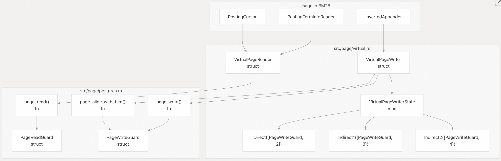
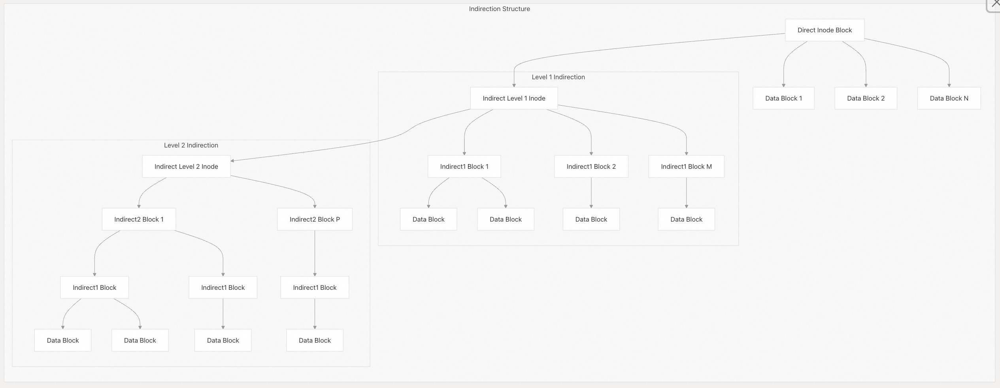
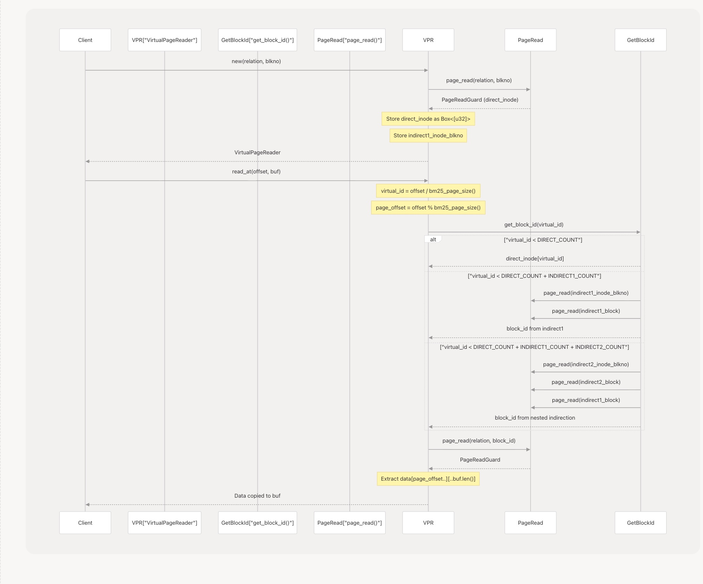
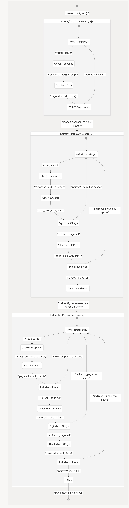
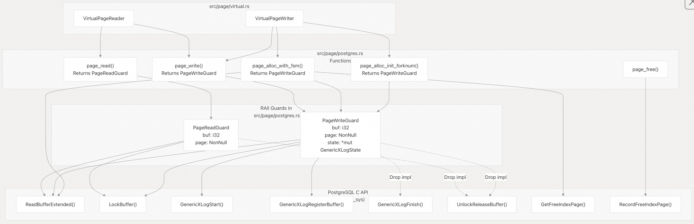
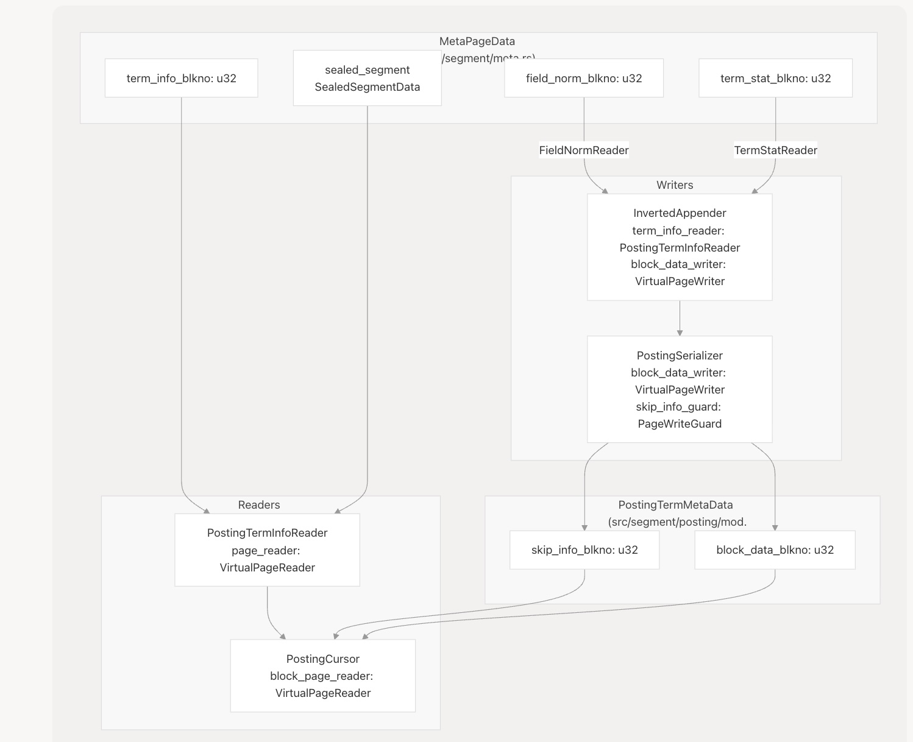

## VectorChord-bm25 源码学习: 2.3 虚拟页面系统 (Virtual Page System)  
                                              
### 作者                                              
digoal                                              
                                              
### 日期                                              
2025-11-24                                              
                                              
### 标签                                              
VectorChord-bm25 , 源码学习 , 全文检索 , 关键词检索 , TF , IDF , 相关性排序 , ranking , Block-WeakAnd , Block-WAND , tsvector , ts_rank                                                
                                              
----                                              
                                              
## 背景                       
VectorChord-BM25 中的**虚拟页面系统 (Virtual Page System)** 在 **PostgreSQL** 的**物理页面管理 (physical page management)** 之上提供了一个**抽象层 (abstraction layer)** ，允许 **BM25 索引 (BM25 Index)** 在一个跨越多个物理数据库页面的**逻辑、连续的地址空间 (logical, continuous address space)** 中操作。该系统对于高效管理超出单个 **PostgreSQL** 页面大小的大量数据至关重要。  
  
## 系统概览 (System Overview)  
  
**虚拟页面系统 (Virtual Page System)** 创建了一个**连续的逻辑地址空间 (contiguous logical address space)** ，它映射到 **PostgreSQL** 中**碎片化的物理页面 (fragmented physical pages)** ，类似于操作系统中**虚拟内存 (virtual memory)** 映射到**物理内存 (physical memory)** 的方式。这使得可能跨越多个物理页面的 **BM25 索引结构 (BM25 index structures)** 能够高效地存储和检索。  
  
**虚拟页面系统架构 (Virtual Page System Architecture)**  
  
  
  
来源:  
  
  * [`src/page/virtual.rs` 10-15](https://github.com/tensorchord/VectorChord-bm25/blob/da0908a6/src/page/virtual.rs#L10-L15)  
  * [`src/page/virtual.rs` 90-102](https://github.com/tensorchord/VectorChord-bm25/blob/da0908a6/src/page/virtual.rs#L90-L102)  
  * [`src/page/postgres.rs` 111-154](https://github.com/tensorchord/VectorChord-bm25/blob/da0908a6/src/page/postgres.rs#L111-L154)  
  * [`src/page/postgres.rs` 179-204](https://github.com/tensorchord/VectorChord-bm25/blob/da0908a6/src/page/postgres.rs#L179-L204)  
  * [`src/segment/posting/reader.rs` 12-24](https://github.com/tensorchord/VectorChord-bm25/blob/da0908a6/src/segment/posting/reader.rs#L12-L24)  
  * [`src/segment/posting/append.rs` 22-49](https://github.com/tensorchord/VectorChord-bm25/blob/da0908a6/src/segment/posting/append.rs#L22-L49)  
  
## 间接机制 (Indirection Mechanism)  
  
**虚拟页面系统 (Virtual Page System)** 实现了一种类似于文件系统 **inode** 的**多级间接机制 (multi-level indirection mechanism)** 。它使用一种**分层结构 (hierarchical structure)** 来将**虚拟页面 ID (virtual page IDs)** 映射到 **PostgreSQL** 物理块：  
  
  
  
来源:  
  
  * [`src/page/virtual.rs` 6-8](https://github.com/tensorchord/VectorChord-bm25/blob/da0908a6/src/page/virtual.rs#L6-L8)  
  * [`src/page/virtual.rs` 54-86](https://github.com/tensorchord/VectorChord-bm25/blob/da0908a6/src/page/virtual.rs#L54-L86)  
  * [`src/page/virtual.rs` 204-217](https://github.com/tensorchord/VectorChord-bm25/blob/da0908a6/src/page/virtual.rs#L204-L217)  
  
该系统有**三级间接 (three levels of indirection)** ，各自具有不同的容量：  
  
  * **直接块 (Direct blocks)** ：直接存储指向数据块的指针  
  * **一级间接 (Indirect level 1)** ：在直接块用尽时使用  
  * **二级间接 (Indirect level 2)** ：在需要更多容量时使用  
  
容量**常量 (constants)** 定义在 [`src/page/virtual.rs` 6-8](https://github.com/tensorchord/VectorChord-bm25/blob/da0908a6/src/page/virtual.rs#L6-L8) 中：  
  
```rust  
const DIRECT_COUNT: usize = bm25_page_size() / 4;  
const INDIRECT1_COUNT: usize = DIRECT_COUNT * DIRECT_COUNT;  
const INDIRECT2_COUNT: usize = INDIRECT1_COUNT * DIRECT_COUNT;  
```  
  
| 间接级别 (Indirection Level) | 容量常量 (Capacity Constant) | 描述 (Description) |  
| :--- | :--- | :--- |  
| 直接 (Direct) | `DIRECT_COUNT` | 适合单个页面的 4 字节块 ID 的数量 |  
| 一级间接 (Indirect Level 1) | `INDIRECT1_COUNT` | 通过一级间接可寻址的总页面数 |  
| 二级间接 (Indirect Level 2) | `INDIRECT2_COUNT` | 通过二级间接可寻址的总页面数 |  
  
来源:  
  
  * [`src/page/virtual.rs` 6-8](https://github.com/tensorchord/VectorChord-bm25/blob/da0908a6/src/page/virtual.rs#L6-L8)  
  * [`src/page/postgres.rs` 34-38](https://github.com/tensorchord/VectorChord-bm25/blob/da0908a6/src/page/postgres.rs#L34-L38)  
  
## 虚拟页面读取器 (Virtual Page Reader)  
  
在 [`src/page/virtual.rs` 11-15](https://github.com/tensorchord/VectorChord-bm25/blob/da0908a6/src/page/virtual.rs#L11-L15) 中定义的 `VirtualPageReader` **结构体 (struct)** 提供了在**虚拟地址空间 (virtual address space)** 内读取和更新数据的机制。它处理将**虚拟地址 (virtual addresses)** 转换为**物理块位置 (physical block locations)** 的复杂任务。  
  
**VirtualPageReader 数据流 (Data Flow)**  
  
  
  
来源:  
  
  * [`src/page/virtual.rs` 11-32](https://github.com/tensorchord/VectorChord-bm25/blob/da0908a6/src/page/virtual.rs#L11-L32)  
  * [`src/page/virtual.rs` 34-42](https://github.com/tensorchord/VectorChord-bm25/blob/da0908a6/src/page/virtual.rs#L34-L42)  
  * [`src/page/virtual.rs` 54-87](https://github.com/tensorchord/VectorChord-bm25/blob/da0908a6/src/page/virtual.rs#L54-L87)  
  
**关键方法 (Key Methods)**  
  
| 方法 (Method) | 签名 (Signature) | 描述 (Description) |  
| :--- | :--- | :--- |  
| `new()` | `fn(Relation, u32) -> Self` | 从直接 inode 块号创建读取器 |  
| `read_at()` | `fn(&self, u32, &mut [u8])` | 在虚拟偏移量处读取数据到缓冲区 |  
| `update_at()` | `fn(&self, u32, u32, impl FnOnce(&mut [u8]))` | 通过**闭包 (closure)** 在虚拟偏移量处更新数据 |  
| `get_block_id()` | `fn(&self, u32) -> u32` | 将**虚拟页面 ID (virtual page ID)** 转换为**物理块 ID (physical block ID)** |  
  
来源:  
  
  * [`src/page/virtual.rs` 18-87](https://github.com/tensorchord/VectorChord-bm25/blob/da0908a6/src/page/virtual.rs#L18-L87)  
  * [`src/segment/posting/reader.rs` 31-35](https://github.com/tensorchord/VectorChord-bm25/blob/da0908a6/src/segment/posting/reader.rs#L31-L35)  
  * [`src/segment/posting/reader.rs` 40-46](https://github.com/tensorchord/VectorChord-bm25/blob/da0908a6/src/segment/posting/reader.rs#L40-L46)  
  
## 虚拟页面写入器 (Virtual Page Writer)  
  
在 [`src/page/virtual.rs` 96-102](https://github.com/tensorchord/VectorChord-bm25/blob/da0908a6/src/page/virtual.rs#L96-L102) 中定义的 `VirtualPageWriter` **结构体 (struct)** 管理对虚拟地址空间的写入，包括在需要时通过**分配新的物理页面 (allocating new physical pages)** 来自动扩展可用空间。  
  
**VirtualPageWriter 状态转换 (State Transitions)**  
  
  
  
来源:  
  
  * [`src/page/virtual.rs` 90-102](https://github.com/tensorchord/VectorChord-bm25/blob/da0908a6/src/page/virtual.rs#L90-L102)  
  * [`src/page/virtual.rs` 271-385](https://github.com/tensorchord/VectorChord-bm25/blob/da0908a6/src/page/virtual.rs#L271-L385)  
  
**关键方法 (Key Methods)**  
  
| 方法 (Method) | 签名 (Signature) | 描述 (Description) |  
| :--- | :--- | :--- |  
| `init_fork()` | `fn(Relation, PageFlags) -> u32` | 在 **init fork** 上分配虚拟页面，返回第一个块号 |  
| `new()` | `fn(Relation, PageFlags, bool) -> Self` | 使用新页面创建新的写入器 |  
| `open()` | `fn(Relation, u32, bool) -> Self` | 打开现有的虚拟页面以进行**追加 (appending)** |  
| `write()` | `fn(&mut self, &[u8])` | 写入数据，根据需要分配页面 |  
| `write_vectorized_no_cross()` | `fn(&mut self, &[&[u8]]) -> bool` | 写入多个切片 (slice) 而不跨越页面边界，如果分配了新页面则返回 true |  
| `page_count()` | `fn(&self) -> usize` | 返回已分配的数据页面数量 |  
| `finalize()` | `fn(self) -> u32` | **消费 (Consumes)** 写入器，返回第一个块号 |  
  
`new_page()` 定义在 [`src/page/virtual.rs` 271-385](https://github.com/tensorchord/VectorChord-bm25/blob/da0908a6/src/page/virtual.rs#L271-L385) 处理状态转换并调用位于 [`src/page/postgres.rs` 394-408](https://github.com/tensorchord/VectorChord-bm25/blob/da0908a6/src/page/postgres.rs#L394-L408) 的 `page_alloc_with_fsm()`。  
  
来源:  
  
  * [`src/page/virtual.rs` 105-222](https://github.com/tensorchord/VectorChord-bm25/blob/da0908a6/src/page/virtual.rs#L105-L222)  
  * [`src/page/virtual.rs` 224-257](https://github.com/tensorchord/VectorChord-bm25/blob/da0908a6/src/page/virtual.rs#L224-L257)  
  * [`src/page/virtual.rs` 271-385](https://github.com/tensorchord/VectorChord-bm25/blob/da0908a6/src/page/virtual.rs#L271-L385)  
  * [`src/segment/posting/append.rs` 130-131](https://github.com/tensorchord/VectorChord-bm25/blob/da0908a6/src/segment/posting/append.rs#L130-L131)  
  
## 与 PostgreSQL 的集成 (Integration with PostgreSQL)  
  
**虚拟页面系统 (Virtual Page System)** 通过 [`src/page/postgres.rs`](https://github.com/tensorchord/VectorChord-bm25/blob/da0908a6/src/page/postgres.rs) 中定义的函数与 **PostgreSQL** 的**缓冲区管理 (buffer management)** 和**事务系统 (transaction system)** 进行接口。这确保了**数据一致性 (data consistency)** 和**持久性 (durability)** 。  
  
**PostgreSQL 集成层 (Integration Layer)**  
  
  
  
来源:  
  
  * [`src/page/postgres.rs` 111-154](https://github.com/tensorchord/VectorChord-bm25/blob/da0908a6/src/page/postgres.rs#L111-L154)  
  * [`src/page/postgres.rs` 179-230](https://github.com/tensorchord/VectorChord-bm25/blob/da0908a6/src/page/postgres.rs#L179-L230)  
  * [`src/page/postgres.rs` 233-256](https://github.com/tensorchord/VectorChord-bm25/blob/da0908a6/src/page/postgres.rs#L233-L256)  
  * [`src/page/postgres.rs` 394-414](https://github.com/tensorchord/VectorChord-bm25/blob/da0908a6/src/page/postgres.rs#L394-L414)  
  * [`src/page/virtual.rs` 2-4](https://github.com/tensorchord/VectorChord-bm25/blob/da0908a6/src/page/virtual.rs#L2-L4)  
  
**页面管理函数 (Page Management Functions)**  
  
[`src/page/postgres.rs`](https://github.com/tensorchord/VectorChord-bm25/blob/da0908a6/src/page/postgres.rs) 中的以下函数提供了与 **PostgreSQL** 页面系统的接口：  
  
| 函数 (Function) | 行号 (Lines) | 用途 (Purpose) |  
| :--- | :--- | :--- |  
| `page_read()` | 156-177 | 以**共享锁 (shared lock)** 读取页面，返回 `PageReadGuard` |  
| `page_write()` | 233-256 | 以**排他锁 (exclusive lock)** 打开页面进行写入，并进行 **XLog 注册 (XLog registration)** |  
| `page_alloc_with_fsm()` | 394-408 | 如果 **FSM (空闲空间映射)** 可用则使用 FSM 分配页面，否则**扩展关系 (extends relation)** |  
| `page_alloc()` | 259-327 | 通过**扩展关系 (extending relation)** 分配新页面 |  
| `page_alloc_init_forknum()` | 330-392 | 在索引构建期间在 **init fork** 上分配页面 |  
| `page_free()` | 410-414 | 在 FSM 中将页面记录为**空闲 (free)** |  
  
**RAII 保护结构体 (RAII guard structs)** `PageReadGuard` 和 `PageWriteGuard` 确保了适当的**清理 (cleanup)** ：  
  
  * `PageReadGuard::drop()` 调用 `UnlockReleaseBuffer()`  
  * `PageWriteGuard::drop()` 在**恐慌 (panic)** 时调用 `GenericXLogFinish()` 或 `GenericXLogAbort()`，然后调用 `UnlockReleaseBuffer()`  
  
来源:  
  
  * [`src/page/postgres.rs` 111-154](https://github.com/tensorchord/VectorChord-bm25/blob/da0908a6/src/page/postgres.rs#L111-L154)  
  * [`src/page/postgres.rs` 179-230](https://github.com/tensorchord/VectorChord-bm25/blob/da0908a6/src/page/postgres.rs#L179-L230)  
  * [`src/page/postgres.rs` 233-256](https://github.com/tensorchord/VectorChord-bm25/blob/da0908a6/src/page/postgres.rs#L233-L256)  
  * [`src/page/postgres.rs` 259-327](https://github.com/tensorchord/VectorChord-bm25/blob/da0908a6/src/page/postgres.rs#L259-L327)  
  * [`src/page/postgres.rs` 330-392](https://github.com/tensorchord/VectorChord-bm25/blob/da0908a6/src/page/postgres.rs#L330-L392)  
  * [`src/page/postgres.rs` 394-414](https://github.com/tensorchord/VectorChord-bm25/blob/da0908a6/src/page/postgres.rs#L394-L414)  
  
## 在 BM25 索引中的使用 (Usage in BM25 Indexing)  
  
**虚拟页面系统 (Virtual Page System)** 在整个 **BM25 索引 (BM25 Index)** 中用于存储各种类型的数据。不同的**组件 (components)** 使用 `VirtualPageReader` 和 `VirtualPageWriter` 来访问它们的数据。  
  
**使用虚拟页面的 BM25 组件 (BM25 Components Using Virtual Pages)**  
  
  
  
来源:  
  
  * [`src/segment/posting/reader.rs` 12-24](https://github.com/tensorchord/VectorChord-bm25/blob/da0908a6/src/segment/posting/reader.rs#L12-L24)  
  * [`src/segment/posting/reader.rs` 50-70](https://github.com/tensorchord/VectorChord-bm25/blob/da0908a6/src/segment/posting/reader.rs#L50-L70)  
  * [`src/segment/posting/append.rs` 22-49](https://github.com/tensorchord/VectorChord-bm25/blob/da0908a6/src/segment/posting/append.rs#L22-L49)  
  * [`src/segment/posting/serializer.rs` 13-40](https://github.com/tensorchord/VectorChord-bm25/blob/da0908a6/src/segment/posting/serializer.rs#L13-L40)  
  
**使用模式 (Usage Patterns)**  
  
主要的使用模式是：  
  
1.  **PostingTermInfoReader** ([`src/segment/posting/reader.rs` 12-48](https://github.com/tensorchord/VectorChord-bm25/blob/da0908a6/src/segment/posting/reader.rs#L12-L48))：使用 `VirtualPageReader` 通过**词项 ID (term ID)** 访问**词项信息 (term info)** 。调用 `read_at()` 来获取 `PostingTermInfo` **结构体 (structs)** 。  
2.  **PostingCursor** ([`src/segment/posting/reader.rs` 50-286](https://github.com/tensorchord/VectorChord-bm25/blob/da0908a6/src/segment/posting/reader.rs#L50-L286))：将 `VirtualPageReader` 用于块数据。在读取**压缩的倒排块 (compressed posting blocks)** 时，调用 `get_block_id()` 将**虚拟页面 ID (virtual page IDs)** 转换为**物理块 (physical blocks)** 。  
3.  **InvertedAppender** ([`src/segment/posting/append.rs` 22-216](https://github.com/tensorchord/VectorChord-bm25/blob/da0908a6/src/segment/posting/append.rs#L22-L216))：通过 `VirtualPageWriter::open()` 使用 `VirtualPageWriter` 将新数据**追加 (append)** 到现有的**倒排列表 (posting lists)** 。  
4.  **PostingSerializer** ([`src/segment/posting/serializer.rs` 13-195](https://github.com/tensorchord/VectorChord-bm25/blob/da0908a6/src/segment/posting/serializer.rs#L13-L195))：在**索引构建 (index build)** 期间使用 `VirtualPageWriter` 来写入**压缩块 (compressed blocks)** 和**跳过信息 (skip information)** 。  
  
来源:  
  
  * [`src/segment/posting/reader.rs` 18-35](https://github.com/tensorchord/VectorChord-bm25/blob/da0908a6/src/segment/posting/reader.rs#L18-L35)  
  * [`src/segment/posting/reader.rs` 73-87](https://github.com/tensorchord/VectorChord-bm25/blob/da0908a6/src/segment/posting/reader.rs#L73-L87)  
  * [`src/segment/posting/append.rs` 130-131](https://github.com/tensorchord/VectorChord-bm25/blob/da0908a6/src/segment/posting/append.rs#L130-L131)  
  * [`src/segment/posting/serializer.rs` 27-40](https://github.com/tensorchord/VectorChord-bm25/blob/da0908a6/src/segment/posting/serializer.rs#L27-L40)  
  
## 页面类型和标志 (Page Types and Flags)  
  
**虚拟页面系统 (Virtual Page System)** 使用一组**页面标志 (page flags)** 来识别 **BM25 索引 (BM25 Index)** 中的不同页面类型：  
  
| 标志 (Flag) | 用途 (Purpose) |  
| :--- | :--- |  
| `META` | 标识包含**索引范围信息 (index-wide information)** 的**元页面 (meta pages)** |  
| `PAYLOAD` | **通用负载数据页面 (Generic payload data pages)** |  
| `FIELD_NORM` | 存储**字段归一化值 (field normalization values)** 的页面 |  
| `TERM_STATISTIC` | 存储**词项统计信息 (term statistics)** 的页面 |  
| `TERM_INFO` | 包含**词项信息 (term information)** 的页面 |  
| `TERM_META` | 包含**词项元数据 (term metadata)** 的页面 |  
| `SKIP_INFO` | 包含用于高效导航的**跳过信息 (skip information)** 的页面 |  
| `BLOCK_DATA` | 包含**倒排列表 (posting lists)** 块数据的页面 |  
| `GROWING` | 标识**增长中段 (growing segments)** 中的页面 |  
| `DELETE` | 标记要**删除 (deletion)** 的页面 |  
| `GROWING_REDIRECT` | **增长中段 (growing segments)** 的**重定向 (Redirection)** |  
| `FREE` | 标记为**空闲 (free)** 的页面 |  
  
来源:  
  
  * [`src/page/postgres.rs` 16-31](https://github.com/tensorchord/VectorChord-bm25/blob/da0908a6/src/page/postgres.rs#L16-L31)  
  * [`src/page/postgres.rs` 41-45](https://github.com/tensorchord/VectorChord-bm25/blob/da0908a6/src/page/postgres.rs#L41-L45)  
  
## 性能考量 (Performance Considerations)  
  
**虚拟页面系统 (Virtual Page System)** 旨在平衡以下几个**性能考量 (performance considerations)** ：  
  
1.  **内存效率 (Memory Efficiency)** ：通过使用**间接机制 (indirection)** ，它避免了一次性将整个**索引结构 (index structure)** 加载到内存中。  
2.  **I/O 优化 (I/O Optimization)** ：页面仅在需要时读取和写入。  
3.  **可伸缩性 (Scalability)** ：**三级间接系统 (three-level indirection system)** 可以寻址非常多的页面。  
4.  **事务安全 (Transaction Safety)** ：与 **PostgreSQL** 的 **WAL (Write-Ahead Logging, 预写式日志)** 集成，确保了**持久性 (durability)** 和**崩溃恢复 (crash recovery)** 。  
  
来源:  
  
  * [`src/page/virtual.rs` 54-86](https://github.com/tensorchord/VectorChord-bm25/blob/da0908a6/src/page/virtual.rs#L54-L86)  
  * [`src/page/postgres.rs` 220-230](https://github.com/tensorchord/VectorChord-bm25/blob/da0908a6/src/page/postgres.rs#L220-L230)  
  * [`src/page/postgres.rs` 156-177](https://github.com/tensorchord/VectorChord-bm25/blob/da0908a6/src/page/postgres.rs#L156-L177)  
  * [`src/page/postgres.rs` 233-256](https://github.com/tensorchord/VectorChord-bm25/blob/da0908a6/src/page/postgres.rs#L233-L256)  
  
## 限制和约束 (Limitations and Constraints)  
  
### 地址空间限制 (Address Space Limits)  
  
**三级间接系统 (three-level indirection system)** 支持的最大页面数量基于 [`src/page/virtual.rs` 6-8](https://github.com/tensorchord/VectorChord-bm25/blob/da0908a6/src/page/virtual.rs#L6-L8) 中定义的**常量 (constants)** ：  
  
```  
Maximum addressable pages = DIRECT_COUNT + INDIRECT1_COUNT + INDIRECT2_COUNT  
```  
  
假设 `BLCKSZ = 8192` (**PostgreSQL** 默认值)：  
  
  * `bm25_page_size() ≈ 8100` 字节  
  * `DIRECT_COUNT = 8100 / 4 = 2025` 页面  
  * `INDIRECT1_COUNT = 2025 * 2025 ≈ 4.1M` 页面  
  * `INDIRECT2_COUNT = 4.1M * 2025 ≈ 8.3B` 页面  
  
如果 `Indirect2` **状态 (state)** 耗尽了所有 **indirect2 inode 空间**，系统将在 [`src/page/virtual.rs` 383](https://github.com/tensorchord/VectorChord-bm25/blob/da0908a6/src/page/virtual.rs#L383-L383) 处发生**恐慌 (panics)** ：  
  
```rust  
panic!("VirtualPageWriter: too many pages");  
```  
  
### 性能考量 (Performance Considerations)  
  
1.  **间接开销 (Indirection Overhead)** ：通过 **indirect2** 访问数据需要读取 4 个页面 (**indirect2 inode** → **indirect2 page** → **indirect1 page** → **data page**)，而**直接访问 (direct access)** 只需要 1 个页面。  
2.  **空间开销 (Space Overhead)** ：**Inode 页面 (Inode pages)** 仅存储块 ID 指针（每个 4 字节），占用了本可用于存储实际数据的页面。  
3.  **内存 (Memory)** ：`VirtualPageReader` 将整个**直接 inode (direct inode)** 作为 `Box<[u32]>` ([`src/page/virtual.rs` 13](https://github.com/tensorchord/VectorChord-bm25/blob/da0908a6/src/page/virtual.rs#L13-L13)) 存储在内存中，每个读取器使用约 8KB。  
4.  **写入放大 (Write Amplification)** ：`VirtualPageWriter` 根据状态持有多个 `PageWriteGuard` **实例 (instances)** ([`src/page/virtual.rs` 90-94](https://github.com/tensorchord/VectorChord-bm25/blob/da0908a6/src/page/virtual.rs#L90-L94))，每个实例都有 **GenericXLog 开销 (overhead)** 。  
  
来源:  
  
  * [`src/page/virtual.rs` 6-8](https://github.com/tensorchord/VectorChord-bm25/blob/da0908a6/src/page/virtual.rs#L6-L8)  
  * [`src/page/virtual.rs` 13](https://github.com/tensorchord/VectorChord-bm25/blob/da0908a6/src/page/virtual.rs#L13-L13)  
  * [`src/page/virtual.rs` 90-94](https://github.com/tensorchord/VectorChord-bm25/blob/da0908a6/src/page/virtual.rs#L90-L94)  
  * [`src/page/virtual.rs` 383](https://github.com/tensorchord/VectorChord-bm25/blob/da0908a6/src/page/virtual.rs#L383-L383)  
  * [`src/page/virtual.rs` 54-86](https://github.com/tensorchord/VectorChord-bm25/blob/da0908a6/src/page/virtual.rs#L54-L86)  
  
## 总结 (Summary)  
  
**虚拟页面系统 (Virtual Page System)** 在 **VectorChord-BM25** 中提供了一个关键的**抽象层 (abstraction layer)** ，实现了跨越多个 **PostgreSQL** 物理页面的索引结构的**高效存储和检索 (efficient storage and retrieval)** 。通过其**多级间接机制 (multi-level indirection mechanism)** ，它向更高级别的组件呈现了一个**连续的逻辑地址空间 (continuous logical address space)** ，同时管理了物理页面的**分配 (allocation)** 、**读取 (reading)** 和**写入 (writing)** 的复杂性。  
  
-----  
  
# 附录1: 性能与可扩展性的平衡及风险规避  
  
**痛点/背景：** 文档明确指出三级间接机制会造成性能开销（最坏情况下需要 4 次 I/O），同时给出了地址空间限制（约 8.3B 页面）和恐慌 (panic) 风险。  
  
**关键问题：**  
  
在实际生产环境中，**三级间接机制 (three-level indirection)** 导致的**访问开销 (Indirection Overhead)** 对读写性能的影响有多大？有没有**运行时监控 (runtime monitoring)** 或优化机制（例如预热或统计信息）来评估和减少**多达 4 个页面**的 I/O 操作（`Indirect2` 路径）？此外，如果达到 8.3B 页面的**地址空间限制 (Address Space Limits)** ，系统是优雅地报错还是会直接导致**恐慌 (panic)** ，用户应如何**提前规划**和**规避**这一限制？  
  
## 问题理解  
  
您询问的是 VectorChord-BM25 中**虚拟页面系统 (Virtual Page System)** 的三级间接机制的性能影响和限制处理。具体涉及   中定义的 `DIRECT_COUNT`、`INDIRECT1_COUNT` 和 `INDIRECT2_COUNT` 常量，以及   中 `VirtualPageReader::get_block_id()` 方法的多级 I/O 访问路径。  
  
## 性能开销分析  
  
### 间接访问的 I/O 成本  
  
三级间接机制的 I/O 开销取决于访问的虚拟页面 ID 范围:  
  
1. **Direct 访问** (virtual_id < DIRECT_COUNT ≈ 2025): 仅需 **1 次 I/O** 读取数据页    
2. **Indirect1 访问** (2025 ≤ virtual_id < 4.1M): 需要 **3 次 I/O** (indirect1_inode → indirect1_page → data_page)    
3. **Indirect2 访问** (4.1M ≤ virtual_id < 8.3B): 需要 **4 次 I/O** (indirect2_inode → indirect2_page → indirect1_page → data_page)    
  
**实际影响**:  
- 对于小型索引 (< 2025 页面 ≈ 16MB)，完全使用 Direct 访问，无额外开销  
- 中型索引主要使用 Indirect1，增加 2 次额外 I/O  
- 只有极大型索引 (> 33GB) 才会触发 Indirect2 的 4 次 I/O  
  
### 缓解机制  
  
**PostgreSQL 缓冲区缓存**:  
系统依赖 PostgreSQL 的 shared_buffers 来缓存 inode 页面。   中的 `page_read()` 使用 `ReadBufferExtended()` 访问页面，会自动利用 PostgreSQL 的缓冲区管理。  
  
**内存优化**:  
`VirtualPageReader` 在构造时将整个 direct_inode 加载到内存  ，避免重复读取第一级 inode。  
  
## 运行时监控  
  
**当前代码中没有内置的运行时监控或统计机制**。系统不跟踪:  
- 各级间接访问的频率  
- I/O 操作计数  
- 页面缓存命中率  
  
如需监控，您需要:  
1. 使用 PostgreSQL 的 `pg_stat_statements` 扩展监控整体查询性能  
2. 通过 `pg_buffercache` 查看缓冲区使用情况  
3. 在应用层添加自定义指标收集  
  
## 地址空间限制处理  
  
### Panic 行为  
  
当达到 8.3B 页面限制时，系统**直接 panic**，不会优雅降级:    
  
这发生在 `VirtualPageWriter::new_page()` 的 `Indirect2` 状态下，当 indirect2_inode 的空闲空间不足 4 字节时触发。    
  
### 提前规划建议  
  
**容量估算**:  
- 假设 `bm25_page_size() ≈ 8100` 字节  
- 最大可寻址: DIRECT_COUNT + INDIRECT1_COUNT + INDIRECT2_COUNT ≈ 8.3B 页面  
- 总容量: 8.3B × 8100 字节 ≈ **67 TB**  
  
**规避策略**:  
1. **监控页面使用**: 通过 `VirtualPageWriter::page_count()`   跟踪已分配页面数  
2. **分片索引**: 在接近限制前将数据分散到多个 BM25 索引  
3. **定期清理**: 使用 vacuum 回收已删除文档占用的页面  
4. **容量预警**: 当页面数超过 4.1M (进入 Indirect2) 时设置告警  
  
## Notes  
  
实际生产环境中，大多数 BM25 索引不太可能达到 Indirect2 级别 (需要 > 33GB 的压缩数据)。性能瓶颈更可能来自:  
- 压缩/解压缩开销    
- 磁盘 I/O 带宽而非 I/O 次数  
- PostgreSQL 缓冲区大小配置  
  
系统缺少优雅的容量限制处理是一个已知的设计权衡，假设在达到 67TB 限制前会采取其他扩展策略。  
  
  
  
-----  
  
# 附录2: 内存资源管理与高并发读取  
  
**痛点/背景：** 文档提到 `VirtualPageReader` 结构体需在内存中存储整个直接 inode（约 8KB），这在并发场景下可能成为内存消耗的瓶颈。  
  
**关键问题：**  
  
由于每个 `VirtualPageReader` **结构体 (struct)** 会在内存中存储整个直接 inode（约 8KB），对于**高并发 (high concurrency)** 的读取操作场景，这会如何影响 **PostgreSQL** 进程的整体**内存消耗 (memory consumption)** ？系统是否有针对**并发读取 (concurrent read)** 的优化，例如**共享**或**缓存** `VirtualPageReader` 实例，以减轻**内存开销 (memory overhead)** 和**写入放大 (Write Amplification)** ？  
  
  
## 回答  
您询问的是 `VirtualPageReader` 结构体在高并发场景下的内存消耗问题。    
  
## 内存消耗分析  
  
每个 `VirtualPageReader` 实例确实会在内存中存储整个 direct inode 作为 `Box<[u32]>`。   在构造函数中,它读取整个 direct inode 页面并将其转换为 `Vec<u32>`,然后存储为 `Box<[u32]>`。  
  
根据代码,direct inode 的大小约为 `bm25_page_size()`,即 `BLCKSZ - PageHeaderData - Bm25PageOpaqueData`,通常约 8KB。   因此每个 `VirtualPageReader` 实例会占用约 8KB 内存。  
  
在高并发场景下,如果有 N 个并发读取操作,理论上可能同时存在 N 个 `VirtualPageReader` 实例,总内存消耗为 N × 8KB。  
  
## 当前系统中的使用情况  
  
系统中 `VirtualPageReader` 的主要使用场景包括:  
  
1. **PostingTermInfoReader**: 每个实例持有一个 `VirtualPageReader` 用于读取 term info。    
  
2. **PostingCursor**: 每个实例持有一个 `VirtualPageReader` 用于读取 block data。   在查询执行时,每个查询词会创建一个 `PostingCursor`,因此会创建相应数量的 `VirtualPageReader`。    
  
3. **FieldNormReader**: 持有一个 `VirtualPageReader` 用于读取 field norm 数据。    
  
## 是否有共享或缓存优化?  
  
**目前代码中没有实现 `VirtualPageReader` 实例的共享或缓存机制。** 每次需要读取虚拟页面时,都会创建新的 `VirtualPageReader` 实例,这意味着:  
  
- 每个并发查询都会创建独立的 reader 实例  
- 没有跨查询的 reader 实例复用  
- 没有 direct inode 的共享缓存  
  
## 关于写入放大 (Write Amplification)  
  
需要澄清的是,`VirtualPageReader` 是只读结构,不涉及写入操作,因此不会直接导致写入放大。 写入放大主要与 `VirtualPageWriter` 相关,它在分配新页面时需要维护多个 `PageWriteGuard` 实例。    
  
## Notes  
  
虽然每个 `VirtualPageReader` 占用约 8KB 内存,但这个开销相对于 PostgreSQL 的整体内存使用(如 shared_buffers、work_mem 等)来说通常是可接受的。 在典型的查询场景中,并发查询数量和每个查询的词数都是有限的,因此总内存消耗通常不会成为瓶颈。   
  
如果确实需要优化,可以考虑实现 direct inode 的共享缓存机制,但这需要权衡缓存管理的复杂性和内存节省的收益。  
  
  
-----  
  
# 附录3: 与 PostgreSQL 维护和事务机制的集成  
  
**痛点/背景：** 虚拟页面系统深度集成了 PostgreSQL 的内部机制（FSM、XLog/WAL），日常维护操作必须确保数据一致性和系统稳定性。  
  
**关键问题：**  
  
**虚拟页面系统 (Virtual Page System)** 对 **PostgreSQL** 的**空闲空间映射 (FSM)** 和**事务日志 (XLog/WAL)** 机制的具体影响和**集成细节**是什么？日常的维护操作（如**清理 (VACUUM)** 或手动释放页面）是否会正确与 `page_free()` 和 **RAII 保护结构体 (RAII guard structs)** 协同工作，以确保**数据一致性 (data consistency)** ，并避免**页泄漏 (page leaks)** 或**事务阻塞 (transaction deadlock)** ？  
  
您询问的是虚拟页面系统与 PostgreSQL 的 FSM (Free Space Map) 和 XLog/WAL 机制的集成细节,以及维护操作的数据一致性保证。  
  
## FSM 集成  
  
虚拟页面系统通过 `page_alloc_with_fsm()` 函数与 PostgreSQL 的 FSM 集成。   该函数首先调用 `GetFreeIndexPage()` 尝试从 FSM 获取空闲页面,如果 FSM 返回 `InvalidBlockNumber`,则通过 `page_alloc()` 扩展关系来分配新页面。    
  
页面释放通过 `page_free()` 函数完成,它调用 PostgreSQL 的 `RecordFreeIndexPage()` 将页面标记为空闲并记录到 FSM 中。    
  
## XLog/WAL 集成  
  
虚拟页面系统通过 RAII 保护结构体 `PageWriteGuard` 确保所有写操作都被正确记录到 WAL。    
  
**WAL 记录流程:**  
  
1. **写操作开始**: `page_write()` 或 `page_alloc()` 创建 `PageWriteGuard` 时,调用 `GenericXLogStart()` 启动 WAL 记录。    
  
2. **注册缓冲区**: 调用 `GenericXLogRegisterBuffer()` 将页面注册到 WAL 状态中。    
  
3. **自动提交**: `PageWriteGuard::drop()` 实现确保在正常情况下调用 `GenericXLogFinish()` 提交 WAL 记录,在 panic 时调用 `GenericXLogAbort()` 回滚。    
  
这种 RAII 模式保证了即使发生异常,WAL 记录也会被正确处理,不会导致数据不一致。    
  
## VACUUM 操作的协同工作  
  
VACUUM 操作通过 `ambulkdelete()` 和 `amvacuumcleanup()` 函数实现。    
  
**数据一致性保证:**  
  
1. **删除标记**: `ambulkdelete()` 遍历所有文档,通过回调函数判断是否需要删除,并更新 delete bitmap。    
  
2. **统计更新**: `amvacuumcleanup()` 重新计算 term statistics,确保统计信息与实际数据一致。    
  
3. **WAL 保护**: 所有元数据更新都通过 `page_write()` 获取 `PageWriteGuard`,确保修改被记录到 WAL。    
  
## 页面释放与泄漏防护  
  
系统在多个场景下正确释放页面:  
  
**Growing Segment 释放**: `free_growing_segment()` 遍历 growing segment 的所有页面,包括 redirect 页面,并调用 `page_free()` 释放。    
  
**链式页面释放**: `free_page_list()` 遍历通过 `next_blkno` 链接的页面链,逐个释放。    
  
**RAII 保证**: 所有 `PageWriteGuard` 实例在作用域结束时自动释放缓冲区锁,避免死锁。    
  
## 事务阻塞防护  
  
系统通过以下机制避免死锁:  
  
1. **锁顺序一致性**: 页面分配时使用 `skip_lock_rel` 参数控制是否获取 relation extension lock,避免锁顺序冲突。    
  
2. **自动锁释放**: `PageReadGuard` 和 `PageWriteGuard` 的 `Drop` 实现确保缓冲区锁总是被释放。    
  
3. **锁升级/降级**: 提供 `upgrade()` 和 `degrade()` 方法在读锁和写锁之间转换,但注释明确指出这些操作不保证原子性。    
  
## VirtualPageWriter 的 WAL 集成  
  
`VirtualPageWriter` 在状态转换时分配新页面,所有分配都通过 `page_alloc_with_fsm()` 完成,确保 FSM 和 WAL 集成。   每个状态持有的 `PageWriteGuard` 数组确保所有修改都被 WAL 记录。    
  
## Notes  
  
系统设计确保了数据一致性和崩溃恢复能力。 所有写操作都通过 GenericXLog 机制记录到 WAL,RAII 模式保证了资源正确释放。 页面释放通过 `page_free()` 正确更新 FSM,避免页面泄漏。 然而,`upgrade()` 和 `degrade()` 方法的非原子性意味着在锁转换期间可能存在短暂的竞态条件,需要调用者注意。    
    
#### [PolarDB 学习图谱](https://www.aliyun.com/database/openpolardb/activity "8642f60e04ed0c814bf9cb9677976bd4")
  
  
#### [PostgreSQL 解决方案集合](../201706/20170601_02.md "40cff096e9ed7122c512b35d8561d9c8")
  
  
#### [德哥 / digoal's Github - 公益是一辈子的事.](https://github.com/digoal/blog/blob/master/README.md "22709685feb7cab07d30f30387f0a9ae")
  
  
#### [About 德哥](https://github.com/digoal/blog/blob/master/me/readme.md "a37735981e7704886ffd590565582dd0")
  
  

  
