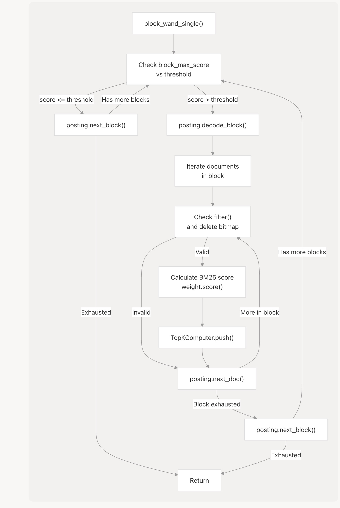
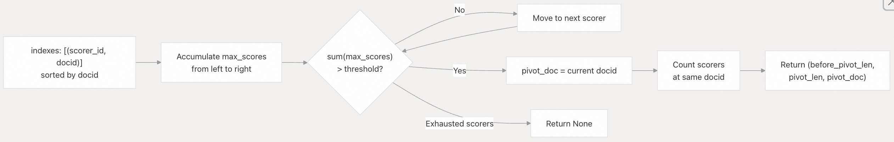
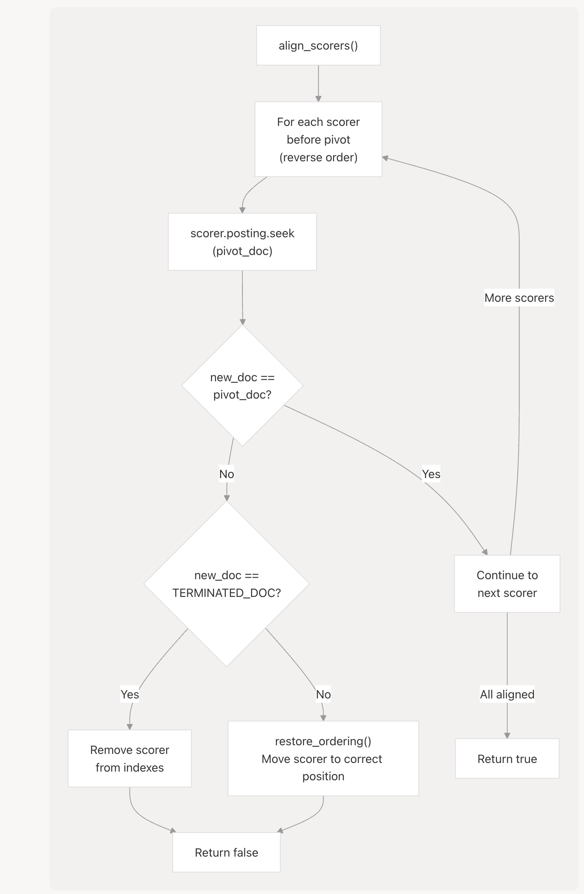
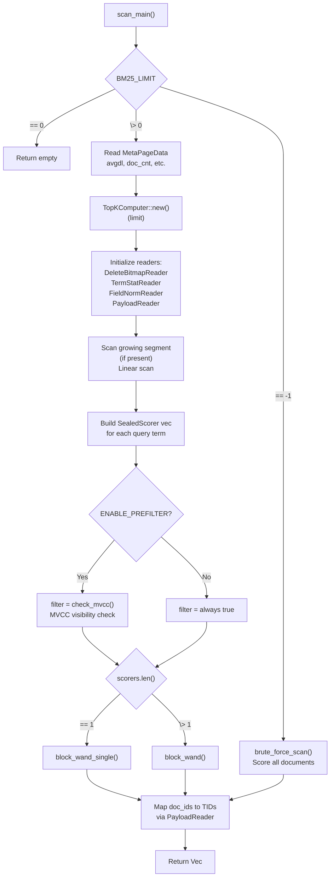
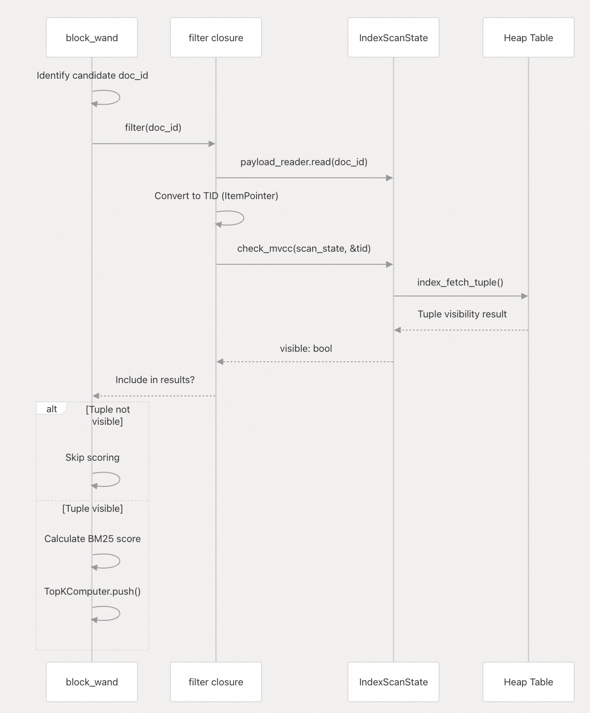
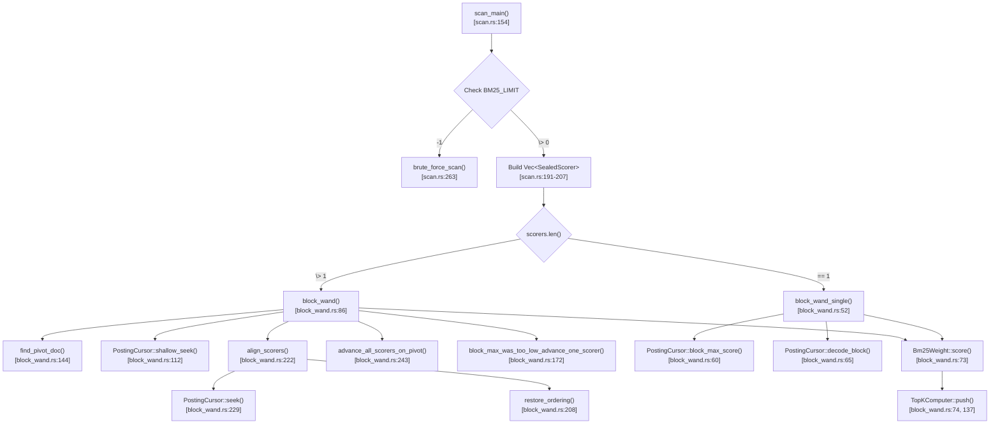
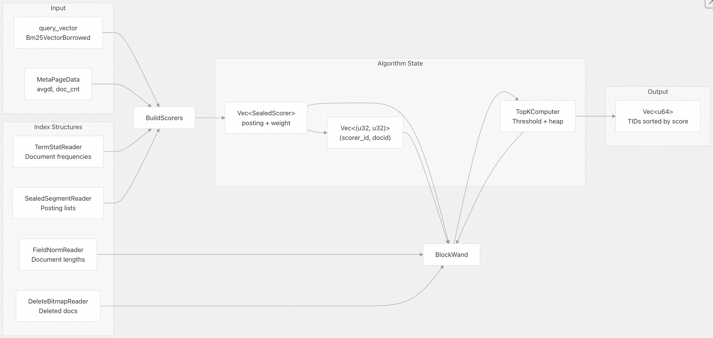

## VectorChord-bm25 源码学习: 2.4 Block-WeakAnd 算法  
                                                
### 作者                                                
digoal                                                
                                                
### 日期                                                
2025-11-24                                                
                                                
### 标签                                                
VectorChord-bm25 , 源码学习 , 全文检索 , 关键词检索 , TF , IDF , 相关性排序 , ranking , Block-WeakAnd , Block-WAND , tsvector , ts_rank                                                  
                                                
----                                                
                                                
## 背景                         
块级弱合取（Block-WeakAnd, Block-WAND）算法是 VectorChord-BM25 中用于高效 **top-k BM25 文档检索**（BM25 document retrieval）的核心查询执行引擎。它通过跳过那些**块**（blocks）——其最大可能分数（maximum possible score）无法超过当前第 k 高分数的文档块，从而最大限度地减少计算工作量，避免对索引中的每个文档进行评分。  
  
本文档涵盖了该算法的结构、执行流程和优化策略。  
  
## 核心概念（Core Concepts）  
  
### 块级跳跃（Block-Level Skipping）  
  
Block-WAND 对**倒排列表条目**（posting list entries）的**块**（blocks）进行操作，每个块最多包含 128 个文档。每个块预先计算并存储一个**块最大分数**（`block_max_score`），该分数表示该块中的任何文档对于给定词项（term）可以贡献的最大 BM25 分数。这使得算法能够跳过整个块，而无需解码或对单个文档进行评分。  
  
粗筛, 有点smlar索引在处理相似阈值时使用的思想, 例如搜索和A数组(共有C个元素)不同的元素少于4个的记录, 在表中每个block上可能存储了很多个元素, A数组中每个元素有一票, 在包含A的任意元素的block中, 如果票数不达A数组的C-4个, 这个block就不需要访问.    
- [《海量数据,海明(simhash)距离高效检索(smlar) - 阿里云RDS PosgreSQL最佳实践 - bit string 比特字符串 相似度搜索》](../201708/20170804_01.md)    
  
### 动态阈值管理（Dynamic Threshold Management）  
  
该算法通过一个 **Top-K 计算器**（`TopKComputer`）来维护一个动态分数阈值，该计算器跟踪当前的 top-k 结果。随着找到更好的匹配项，阈值会增加，从而实现更积极的块跳跃。当一个块的最大分数低于此阈值时，算法就知道该块中没有文档可以进入 top-k 结果。  
  
### 枢轴文档策略（Pivot Document Strategy）  
  
Block-WAND 按照查询词项（query terms）的当前文档位置进行排序，并识别出一个**枢轴文档**（pivot document）——即所有先前的词项的最大分数之和超过阈值的第一个文档位置。该枢轴文档成为评分的候选者，算法会根据块级检查来决定是对其进行评分还是跳过它。  
  
**来源:** [`src/algorithm/block_wand.rs` 1-265](https://github.com/tensorchord/VectorChord-bm25/blob/da0908a6/src/algorithm/block_wand.rs#L1-L265)  
  
## 关键数据结构（Key Data Structures）  
  
### 密封计分器（SealedScorer）  
  
`SealedScorer` 结构封装了单个词项的倒排列表（posting list）和评分信息：  
  
| 字段 | 类型 | 目的 |  
| :--- | :--- | :--- |  
| `posting` | `PostingCursor` | 遍历压缩的倒排列表块 |  
| `weight` | `Bm25Weight` | 存储预计算的 BM25 词项特定权重（**逆文档频率** IDF、**查询词频** query term frequency） |  
| `max_score` | `f32` | 该词项可以贡献给任何文档的最大可能 BM25 分数 |  
  
`max_score` 是通过 `weight.max_score()` 计算得出的，它假设在语料库（corpus）约束范围内，文档长度最小且词频（term frequency）最大。  
  
**来源:** [`src/algorithm/block_wand.rs` 13-17](https://github.com/tensorchord/VectorChord-bm25/blob/da0908a6/src/algorithm/block_wand.rs#L13-L17)  
  
### 倒排游标（PostingCursor）操作  
  
`PostingCursor` 提供了块级导航和评分功能：  
  
  * `decode_block()` - 解压缩当前块的文档 ID 和词频  
  * `shallow_seek(doc)` - **浅层查找**（`shallow_seek(doc)`）：定位到包含 `doc` 的块，但不进行解码  
  * `seek(doc)` - 定位到 `doc` 或其后的下一个文档  
  * `block_max_score(weight)` - 返回当前块中任何文档的最大 BM25 分数  
  * `last_doc_in_block()` - 返回当前块中的最后一个文档 ID  
  * `next_block()` - 前进到下一个块  
  * `next_doc()` - 在已解码的块内前进到下一个文档  
  
**来源:** [`src/algorithm/block_wand.rs` 1-265](https://github.com/tensorchord/VectorChord-bm25/blob/da0908a6/src/segment/posting.rs)  
  
## 算法执行流程（Algorithm Execution Flow）  
  
### 高级流程图（High-Level Flow Diagram）  
  
  
  
**来源:** [`src/algorithm/block_wand.rs` 86-142](https://github.com/tensorchord/VectorChord-bm25/blob/da0908a6/src/algorithm/block_wand.rs#L86-L142)  
  
### 单词项优化（Single-Term Optimization）  
  
当查询只包含一个词项时，VectorChord-BM25 使用 `block_wand_single()`，这是一个简化的算法，避免了枢轴选择和计分器对齐的复杂性：  
  
  
  
**来源:** [`src/algorithm/block_wand.rs` 52-84](https://github.com/tensorchord/VectorChord-bm25/blob/da0908a6/src/algorithm/block_wand.rs#L52-L84)  
  
## 算法详细组件（Detailed Algorithm Components）  
  
### 枢轴文档选择（Pivot Document Selection）  
  
`find_pivot_doc()` 函数实现了核心的 WAND 启发式（heuristic）算法：  
  
  
  
该函数返回三个值：  
  
  * `before_pivot_len`: 在枢轴文档之前的计分器数量  
  * `pivot_len`: 在枢轴文档处或之前的计分器数量（包括平局 ties）  
  * `pivot_doc`: 枢轴文档的文档 ID  
  
**来源:** [`src/algorithm/block_wand.rs` 144-170](https://github.com/tensorchord/VectorChord-bm25/blob/da0908a6/src/algorithm/block_wand.rs#L144-L170)  
  
### 块最大分数检查（Block Maximum Score Check）  
  
在识别出枢轴文档后，算法通过在不解码块的情况下计算上限（upper bound）来进行一项关键优化：  
  
1.  对于枢轴文档之前的每个计分器，调用 `shallow_seek(pivot_doc)` 以定位到正确的块  
2.  对这些计分器的 `block_max_score` 值求和  
3.  如果这个总和小于或等于阈值，则跳到后面的文档  
  
这避免了解压缩和评分文档的昂贵操作。  
  
**来源:** [`src/algorithm/block_wand.rs` 108-120](https://github.com/tensorchord/VectorChord-bm25/blob/da0908a6/src/algorithm/block_wand.rs#L108-L120)  
  
### 计分器对齐（Scorer Alignment）  
  
当块最大分数检查通过时，`align_scorers()` 尝试将所有计分器定位到枢轴文档：  
  
  
  
如果对齐失败（某个计分器超前于枢轴文档），函数返回 `false`，算法重新开始枢轴选择。  
  
**来源:** [`src/algorithm/block_wand.rs` 222-241](https://github.com/tensorchord/VectorChord-bm25/blob/da0908a6/src/algorithm/block_wand.rs#L222-L241)  
  
### 评分后前进（Advancing After Scoring）  
  
在成功对枢轴文档评分后，`advance_all_scorers_on_pivot()` 将所有参与的计分器向前移动：  
  
1.  对枢轴文档处的每个计分器调用 `next_with_auto_decode()`  
2.  使用新的文档位置更新 `indexes` 数组  
3.  按照文档 ID 重新排序 `indexes` 数组  
4.  移除任何达到**终止文档**（`TERMINATED_DOC`）的计分器  
  
这保持了 `indexes` 始终按文档 ID 排序的**不变性**（invariant），以便进行下一次枢轴选择。  
  
**来源:** [`src/algorithm/block_wand.rs` 243-264](https://github.com/tensorchord/VectorChord-bm25/blob/da0908a6/src/algorithm/block_wand.rs#L243-L264)  
  
## 与索引扫描集成（Integration with Index Scanning）  
  
### 扫描执行路径（Scan Execution Path）  
  
[`src/index/scan.rs` 154-261](https://github.com/tensorchord/VectorChord-bm25/blob/da0908a6/src/index/scan.rs#L154-L261) 中的 `scan_main()` 函数协调 Block-WAND 的执行：  
  

  
**来源:** [`src/index/scan.rs` 154-261](https://github.com/tensorchord/VectorChord-bm25/blob/da0908a6/src/index/scan.rs#L154-L261)  
  
### MVCC 预过滤（MVCC Prefiltering）  
  
当启用 `ENABLE_PREFILTER` 时，算法在对文档评分之前应用**多版本并发控制**（MVCC, Multi-Version Concurrency Control）检查：  
  
  
  
此优化可提前过滤掉不可见的元组（non-visible tuples），避免对不会出现在查询结果中的文档进行 BM25 计算，从而节省资源。  
  
如果并发 更新/删除 较少建议关闭预过滤, 大多数记录可见, 不需要回表判断可见性, 可提升性能.    
  
**来源:** [`src/index/scan.rs` 211-254](https://github.com/tensorchord/VectorChord-bm25/blob/da0908a6/src/index/scan.rs#L382-L420)  
  
## 代码实体映射（Code Entity Mapping）  
  
### 函数调用层级结构（Function Call Hierarchy）  
  

  
**来源:** [`src/index/scan.rs` 154-261](https://github.com/tensorchord/VectorChord-bm25/blob/da0908a6/src/algorithm/block_wand.rs#L1-L265)  
  
### 组件之间的数据流（Data Flow Through Components）  
  
  
  
**来源:** [`src/index/scan.rs` 154-261](https://github.com/tensorchord/VectorChord-bm25/blob/da0908a6/src/algorithm/block_wand.rs#L86-L142)  
  
## 性能特征（Performance Characteristics）  
  
### 复杂度分析（Complexity Analysis）  
  
| 操作 | 复杂度（Complexity） | 备注（Notes） |  
| :--- | :--- | :--- |  
| 枢轴选择（Pivot selection） | O(n) | 其中 n = 查询词项的数量 |  
| 块跳跃检查（Block skip check） | O(n) | 浅层查找（Shallow seek） + 块最大分数（block max score）求和 |  
| 计分器对齐（Scorer alignment） | O(n log n) | 查找操作 + 恢复顺序 |  
| 前进计分器（Advance scorers） | O(n log n) | 下一个文档（Next doc） + 排序索引（sort indexes）数组 |  
| 单文档评分（Per-document scoring） | O(n) | 对 n 个词项的分数求和 |  
  
该算法的效率来自于**跳过块**（skipping blocks）而不是文档。实际上，尤其当查询具有选择性（selective）且 k 值较小时，大多数块都会被跳过而无需解压缩。  
  
### 优化权衡（Optimization Trade-offs）  
  
**单词项优化**（Single-term optimization）（`block_wand_single()`）：避免了所有的枢轴选择、对齐和顺序维护开销（overhead）。当查询只包含一个词项时自动使用。  
  
**块跳跃 vs. 解码**：算法在倒排列表（posting lists）中进行查找（开销低 cheap）和解码块（开销高 expensive）之间保持平衡。`block_max_was_too_low_advance_one_scorer()` 函数有策略地推进具有最高最大分数的计分器，以最大限度地增加未来的跳跃机会。  
  
**MVCC 预过滤**：用 I/O 操作（**堆取回** heap fetch）换取计算工作（BM25 评分）。当许多文档在当前事务快照（transaction snapshot）中不可见时，这是有益的。  
  
**来源:** [`src/algorithm/block_wand.rs` 1-265](https://github.com/tensorchord/VectorChord-bm25/blob/da0908a6/src/index/scan.rs#L154-L261)  
  
## 配置（Configuration）  
  
Block-WAND 算法的行为由 **GUCs**（全局统一配置项）控制（详见 [配置](https://www.google.com/search?q=/tensorchord/VectorChord-bm25/3.2-configuration)）：  
  
  * `bm25_catalog.bm25_limit`: 控制 k 值（结果数量）。设置为 `-1` 以禁用 Block-WAND 并对所有文档进行评分。  
  * `bm25_catalog.enable_prefilter`: 启用 MVCC 预过滤，以跳过对不可见元组（non-visible tuples）的评分。  
  
**来源:** [`src/index/scan.rs` 159-165](https://github.com/tensorchord/VectorChord-bm25/blob/da0908a6/src/index/scan.rs#L211-L254)  
  
-----  
  
# 附录1: 性能优化与配置权衡（Optimization Trade-offs）  
  
针对高并发、查询延迟敏感的场景，用户应该如何根据查询的**稀疏性**（Sparsity）来合理配置 GUC 参数 `bm25_catalog.bm25_limit`（即 top-k 的 $k$ 值）？  
  
* **背景痛点：** $k$ 值设置不当可能导致算法在高效的 Block-WAND 模式和全量评分模式之间徘徊，影响性能稳定性。  
* **需要展开的细节：** **MVCC 预过滤**（MVCC Prefiltering）操作引入的 I/O（**堆取回** heap fetch）开销，与节省的 BM25 评分计算量之间的实际性能**权衡点**在哪里？用户何时应该启用（`enable_prefilter = true`）或禁用此功能？  
  
## 问题理解  
  
您询问的是在高并发、低延迟场景下，如何根据查询的**稀疏性**（Sparsity，即查询词项数量）来配置 `bm25_catalog.bm25_limit` 参数（top-k 的 k 值），以及 MVCC 预过滤功能（`bm25_catalog.enable_prefilter`）的性能权衡。  
  
这涉及 VectorChord-BM25 中的两个核心 GUC 参数：  
- `BM25_LIMIT`：控制 Block-WAND 算法返回的最大结果数    
- `ENABLE_PREFILTER`：控制是否在 Block-WAND 执行期间进行 MVCC 可见性检查    
  
## 根据查询稀疏性配置 `bm25_limit`  
  
### Block-WAND 算法的行为模式  
  
Block-WAND 算法的效率取决于能否快速提升阈值（threshold）来跳过不相关的文档块。   阈值由 `TopKComputer` 维护，当收集到 k 个结果后开始生效。    
  
**查询稀疏性的影响：**  
  
1. **稀疏查询（少量词项）** ：使用 `block_wand_single` 单词项优化路径  ，跳过块的条件更容易满足    
  
2. **密集查询（多个词项）** ：使用 `block_wand` 多词项路径  ，需要累加多个词项的 `block_max_score`    
  
### 配置建议  
  
**稀疏查询（1-3 个词项）：**  
- **推荐 k 值：50-100**  
- 原因：单词项查询的 block skipping 效率高，较小的 k 值即可快速建立有效阈值  
- 避免过大的 k 值导致阈值上升缓慢，失去 Block-WAND 优势  
  
**密集查询（4+ 个词项）：**  
- **推荐 k 值：100-200**  
- 原因：多词项需要更多候选文档才能找到所有词项都匹配的高分文档  
- 过小的 k 值可能导致频繁的 pivot 调整    
  
**性能临界点：**  
当 `bm25_limit = -1` 时，系统切换到暴力扫描模式  ，使用 `LoserTree` 合并所有 posting lists  ，完全失去 Block-WAND 的优化效果。  
  
## MVCC 预过滤的性能权衡  
  
### 预过滤机制  
  
当 `ENABLE_PREFILTER = true` 时，Block-WAND 在评分前对每个候选文档执行 MVCC 检查：    
  
检查流程包括：  
1. 读取 payload 获取 heap TID    
2. 调用 `check_mvcc` 执行 heap fetch    
3. 调用 `check_quals` 验证额外的 WHERE 条件    
  
### 性能权衡分析  
  
**预过滤的成本：**  
- **Heap fetch I/O**：每个候选文档需要一次随机 I/O 访问堆表    
- **MVCC 快照检查**：需要验证事务可见性  
- **额外的函数调用开销**  
  
**预过滤的收益：**  
- **避免无效评分**：跳过不可见文档的 BM25 计算    
- **更快的阈值提升**：只有可见文档进入 TopKComputer，阈值上升更快  
- **减少后续处理**：避免在最终结果集中再次过滤  
  
### 启用/禁用建议  
  
**应该启用预过滤（`enable_prefilter = true`）的场景：**  
  
1. **高更新/删除率表**：大量不可见元组时，预过滤避免大量无效评分  
2. **复杂 WHERE 条件**：有额外过滤条件时，早期过滤减少后续开销  
3. **小 k 值查询**：k 值较小时，heap fetch 的绝对次数可控  
4. **测试显示**：在有过滤条件的场景下，预过滤能返回更多有效结果   vs    
  
**应该禁用预过滤（`enable_prefilter = false`）的场景：**  
  
1. **只读/追加表**：几乎所有元组都可见，预过滤的 I/O 开销纯属浪费  
2. **大 k 值查询**：k 值很大时，heap fetch 次数过多，I/O 成为瓶颈  
3. **无额外过滤条件**：只有 BM25 排序时，延迟过滤更高效  
4. **SSD/高速存储**：当 heap fetch I/O 成本相对较低时，批量延迟过滤可能更优  
  
### 实际权衡点  
  
根据代码逻辑，权衡点取决于：  
  
**公式：** `heap_fetch_cost × k × (1 - visibility_ratio)` vs `bm25_score_cost × k × (1 - visibility_ratio)`  
  
- 当 `visibility_ratio` < 0.8（20%+ 不可见元组）且 `k` < 500 时，预过滤通常有利  
- 当 `visibility_ratio` > 0.95（5% 不可见元组）或 `k` > 1000 时，禁用预过滤可能更优  
  
## Notes  
  
配置这两个参数需要根据实际工作负载进行测试。建议使用 `EXPLAIN ANALYZE` 比较不同配置下的性能。 对于生产环境，可以在会话级别动态调整这些参数以适应不同的查询模式。    
  
Block-WAND 算法的核心优势在于通过 `block_max_score` 跳过不相关块  ，因此 k 值的设置应该在"足够大以获取所需结果"和"足够小以快速建立有效阈值"之间取得平衡。  
  
-----  
  
# 附录2: 预计算分数的维护与数据完整性（Data Integrity & Maintenance）  
  
Block-WAND 的高效性依赖于预计算的**块最大分数**（`block_max_score`）和 `SealedScorer` 中的 `max_score`。在日常使用或维护过程中，当索引发生大规模更新、增删数据或进行 PostgreSQL 的 `VACUUM` 操作时，这些预计算分数的**维护机制**（如重新计算/更新的频率和时机）是什么？  
  
* **背景痛点：** 如果这些预计算分数与实际文档统计信息发生**漂移**（Data Drift），将直接影响**块级跳跃**（Block-Level Skipping）的准确性，可能导致查询结果的准确性（召回率）降低，或错过最优文档。  
* **日常维护动作：** 用户是否需要手动触发任何操作来保证这些上限分数的准确性？  
  
## 回答  
  
关于 Block-WAND 预计算分数的维护机制  
  
您询问的是 VectorChord-BM25 中 Block-WAND 算法依赖的预计算分数（`block_max_score` 和 `max_score`）在索引更新、删除和 VACUUM 操作时的维护机制。    
  
## 核心发现  
  
**这些预计算分数在索引创建和段封存（segment sealing）时计算，之后不会自动更新。**   VACUUM 操作仅更新文档频率统计，不重新计算块级分数。    
  
## 预计算分数的生成时机  
  
### 1. `block_max_score` 的计算  
  
`block_max_score` 在**段封存时**计算，存储在每个 128 文档块的 `SkipBlock` 结构中：    
  
- 遍历每个块的 128 个文档  
- 计算每个文档的 BM25 分数  
- 记录最高分数对应的 `blockwand_tf` 和 `blockwand_fieldnorm_id`  
- 这些值写入 `SkipBlock` 并持久化    
  
### 2. `max_score` 的计算  
  
`SealedScorer` 的 `max_score` 在查询时根据当前统计信息计算：    
  
```rust  
let idf = idf(meta.doc_cnt, term_cnt);  
let weight = Bm25Weight::new(term_tf, idf, avgdl);  
SealedScorer {  
    posting: posting_reader,  
    weight,  
    max_score: weight.max_score(),  
}  
```  
  
这个 `max_score` 使用**当前的** `doc_cnt` 和 `term_cnt`，因此会反映 VACUUM 后的统计更新。    
  
## VACUUM 操作的影响  
  
### 更新的内容  
  
VACUUM 的 `amvacuumcleanup` 阶段会重新计算：    
  
1. **全局统计**：`doc_cnt`（活跃文档数）和 `doc_term_cnt`（总词项数）    
2. **词项统计**：每个词项的文档频率（`term_stats`）    
  
### 不更新的内容  
  
**`block_max_score` 中的 `blockwand_tf` 和 `blockwand_fieldnorm_id` 不会更新**。    
  
这些值在段封存时固化，即使文档被删除也保持不变。查询时使用这些固定值计算上界：  
  
```rust  
pub fn block_max_score(&self, weight: &Bm25Weight) -> f32 {  
    let len = id_to_fieldnorm(self.cur_skip_info.blockwand_fieldnorm_id);  
    weight.score(len, self.cur_skip_info.blockwand_tf)  
}  
```  
  
## 数据漂移的影响  
  
### 潜在问题  
  
1. **IDF 变化**：删除文档后，`doc_cnt` 减少，IDF 值增加，但 `block_max_score` 使用的是旧的 `blockwand_tf` 和 `blockwand_fieldnorm_id`  
2. **上界不准确**：由于 `weight` 参数在查询时使用新的 IDF，而块内存储的是旧的 TF/fieldnorm，计算出的上界可能偏高  
  
### 实际影响有限  
  
Block-WAND 算法的设计使得这种漂移影响较小：    
  
- **上界偏高是安全的**：只会导致更少的块被跳过，不会遗漏相关文档  
- **最终分数准确**：实际文档评分使用当前的 `fieldnorm_reader` 和更新后的统计信息    
- **删除文档被跳过**：查询时通过 `delete_bitmap_reader` 过滤已删除文档    
  
## 用户维护动作  
  
**无需手动操作**。系统设计为：  
  
1. **自动 VACUUM**：PostgreSQL 的 autovacuum 会自动更新统计信息  
2. **段重建**：只有在段封存时（新文档插入触发）才会重新计算 `block_max_score`    
3. **查询时补偿**：`max_score` 使用最新统计，部分补偿了块级分数的陈旧性  
  
如果需要完全刷新预计算分数，唯一方法是 **REINDEX**，这会重建整个索引。  
  
## Notes  
  
VectorChord-BM25 的设计权衡了性能和准确性：块级上界可能随时间变得不够紧致，但这只影响查询效率（跳过更少的块），不影响结果正确性。系统通过在查询时使用最新统计信息来计算实际分数，确保召回率不受影响。 如果您的工作负载涉及大量删除操作且查询性能下降明显，可以考虑定期 REINDEX。  
  
-----  
  
# 附录3: 为什么max_score始终是安全的呢? 插入新值和删除旧记录操作, 对上届的影响应该刚好相反, 肯定有一种操作是不安全的吧?  
  
## 回答  
关于 `max_score` 和 `block_max_score` 的安全性分析  
  
您提出了一个很好的问题：为什么说上界始终是安全的？插入和删除操作对上界的影响确实不同。让我详细解释这两种分数的行为。  
  
## 核心区别  
  
### 1. `max_score` 的动态性  
  
`max_score` 在**每次查询时**根据当前统计信息重新计算  ：  
  
```rust  
let idf = idf(meta.doc_cnt, term_cnt);  
let weight = Bm25Weight::new(term_tf, idf, avgdl);  
SealedScorer {  
    max_score: weight.max_score(),  
}  
```  
  
这意味着：  
- **删除文档**：`doc_cnt` 减少 → IDF 增加 → `max_score` 增加（上界变松）  
- **插入文档**：`doc_cnt` 增加 → IDF 减少 → `max_score` 减少（上界变紧）  
  
### 2. `block_max_score` 的静态性  
  
`block_max_score` 在**段封存时**固化，使用封存时的 `weight` 计算  。但在查询时，它使用**当前的 `weight`** 重新计算  ：  
  
```rust  
pub fn block_max_score(&self, weight: &Bm25Weight) -> f32 {  
    let len = id_to_fieldnorm(self.cur_skip_info.blockwand_fieldnorm_id);  
    weight.score(len, self.cur_skip_info.blockwand_tf)  // 使用当前 weight  
}  
```  
  
这里的关键是：**`blockwand_tf` 和 `blockwand_fieldnorm_id` 是固定的，但 `weight`（包含 IDF）是动态的**。  
  
## 为什么两者都是安全的  
  
### 删除操作的影响  
  
- **IDF 增加**：删除文档后，`doc_cnt` 减少，IDF 增加  
- **`block_max_score` 计算**：`weight.score(固定的len, 固定的tf)` 使用更大的 IDF，得到**更高的分数**  
- **结果**：上界变得**更松**（偏高），但这是**安全的**——只会导致更少的块被跳过，不会错过相关文档    
  
### 插入操作的影响  
  
您的担心在这里：插入新文档后，IDF 减少，`block_max_score` 会变小。这看起来可能导致上界**偏低**，从而错误地跳过本应检查的块。  
  
**但这也是安全的，原因如下**：  
  
1. **新文档在新段中**：插入的新文档会先进入 growing segment，然后在段封存时创建**新的块**，这些新块会使用**当前的统计信息**计算 `block_max_score`    
  
2. **旧块中的文档不受影响**：已封存的块中的文档的**实际分数**也会因为 IDF 减少而降低。当查询时计算实际分数时，使用的是相同的当前 `weight`  ：  
  
```rust  
let score = indexes[..pivot_len]  
    .iter()  
    .map(|(i, _)| {  
        let scorer = &scorers[*i as usize];  
        scorer.weight.score(len, scorer.posting.freq())  // 使用相同的 weight  
    })  
    .sum();  
```  
  
3. **上界和实际分数同步变化**：因为 `block_max_score` 和实际文档分数都使用**相同的当前 `weight`**，它们会**同步**受到 IDF 变化的影响。上界仍然是实际分数的上界。  
  
## 数学上的保证  
  
对于块中的任何文档 `d`：  
- 实际分数：`score(d) = weight.score(fieldnorm(d), tf(d))`  
- 块上界：`block_max_score = weight.score(blockwand_fieldnorm, blockwand_tf)`  
  
其中 `blockwand_tf` 和 `blockwand_fieldnorm` 是块中**最高分数文档**的值（在封存时确定）。    
  
因为 BM25 分数函数对于固定的 `weight` 是单调的，所以：  
```  
score(d) ≤ block_max_score  
```  
  
这个不等式在 IDF 变化后仍然成立，因为**两边都使用相同的 `weight`**。  
  
## Notes  
  
您的直觉是对的——插入和删除对 IDF 的影响相反。但关键在于：`block_max_score` 不是一个固定的数值，而是一个**公式**：`weight.score(blockwand_fieldnorm, blockwand_tf)`。这个公式在查询时使用**当前的 `weight`** 重新计算，因此它会随着统计信息的变化而自动调整，始终保持作为上界的有效性。  
  
唯一的性能影响是：删除操作会使上界变松（偏高），导致跳过更少的块，查询效率可能下降。但这不影响正确性。  
  
-----  
  
# 附录4: 复杂内部逻辑的鲁棒性与性能惩罚（Robustness and Penalty）  
  
算法核心的**枢轴文档策略**（Pivot Document Strategy）在计分器对齐（Scorer Alignment）失败时（例如，某个计分器超前于枢轴文档）需要“重新开始枢轴选择”。  
  
* **背景痛点：** 这种内部的“重启”机制是否会给高负载下的查询延迟和 CPU 资源带来显著的**性能惩罚**（Performance Penalty）？  
* **需要展开的细节：** 在实际生产环境中，导致对齐失败（`align_scorers()` 返回 `false`）的**常见边缘条件**（Edge Cases）或数据状态是什么？VectorChord-BM25 如何确保这种重启操作在高频次发生时仍能保持高效？  
  
## 回答  
您询问的是 Block-WAND 算法中**枢轴文档策略**（Pivot Document Strategy）在**计分器对齐失败**时的性能影响。    
  
具体来说，您关注的是 `align_scorers()` 函数返回 `false` 时触发的重启机制，以及这种重启在高负载下是否会造成显著的性能惩罚。    
  
## 对齐失败的常见边缘条件  
  
`align_scorers()` 返回 `false` 主要发生在两种情况：    
  
1. **计分器超前于枢轴文档**：当某个计分器调用 `seek(pivot_doc)` 后，其 `new_doc` 大于 `pivot_doc`，说明该计分器的 posting list 中不存在 `pivot_doc`，跳过了它。    
  
2. **计分器已耗尽**：当 `new_doc == TERMINATED_DOC` 时，该计分器的 posting list 已遍历完毕，会从 `indexes` 数组中移除。    
  
这些情况在以下数据状态下更常见：  
- **稀疏查询词**：某些查询词在文档集合中出现频率极低，导致其 posting list 很短，容易出现跳跃  
- **文档 ID 分布不均**：当不同查询词的 posting list 中文档 ID 分布差异很大时，对齐失败概率增加  
  
## 性能惩罚分析  
  
重启机制的性能开销主要来自：    
  
1. **重新选择枢轴**：需要再次调用 `find_pivot_doc()`，时间复杂度 O(n)，其中 n 是查询词数量。    
  
2. **重新排序 indexes 数组**：`restore_ordering()` 通过数组移位维护排序，最坏情况 O(n)。    
  
3. **重新计算 block_max_score**：需要对所有枢轴前的计分器调用 `shallow_seek()` 和 `block_max_score()`。    
  
**但是**，这些开销相对较小，因为：  
- 重启避免了**解码和评分**不相关文档的更大开销  
- `shallow_seek()` 只定位到块级别，不解码块内容，成本远低于 `decode_block()`  
- 对齐失败通常意味着当前枢轴文档不是所有查询词的交集，跳过它是正确的优化  
  
## VectorChord-BM25 的效率保证  
  
VectorChord-BM25 通过以下机制确保重启操作高效：    
  
1. **智能推进策略**：`block_max_was_too_low_advance_one_scorer()` 选择 `max_score` 最高的计分器推进，最大化下次枢轴选择成功的概率。    
  
2. **块级跳跃**：推进时跳到 `last_doc_in_block() + 1`，而不是逐个文档推进，减少迭代次数。    
  
3. **避免重复解码**：对齐失败时，已解码的块不会被重新解码，`block_decoded` 标志保持状态。    
  
4. **单词查询优化**：对于单个查询词，使用 `block_wand_single()` 完全避免对齐逻辑。     
  
## Notes  
  
实际生产环境中，对齐失败的频率取决于查询词的选择性和文档集合的特征。对于高频词组成的查询，对齐成功率通常很高；对于包含罕见词的查询，重启可能更频繁，但这些查询本身的候选文档就少，总体开销仍然可控。Block-WAND 的核心优势在于通过块级跳跃避免大量文档的评分，即使有重启开销，相比暴力扫描仍有数量级的性能提升。  
  
    
#### [PolarDB 学习图谱](https://www.aliyun.com/database/openpolardb/activity "8642f60e04ed0c814bf9cb9677976bd4")
  
  
#### [PostgreSQL 解决方案集合](../201706/20170601_02.md "40cff096e9ed7122c512b35d8561d9c8")
  
  
#### [德哥 / digoal's Github - 公益是一辈子的事.](https://github.com/digoal/blog/blob/master/README.md "22709685feb7cab07d30f30387f0a9ae")
  
  
#### [About 德哥](https://github.com/digoal/blog/blob/master/me/readme.md "a37735981e7704886ffd590565582dd0")
  
  

  
