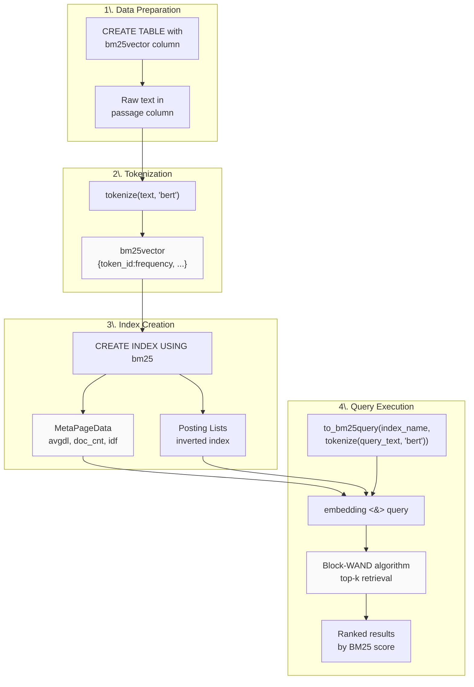
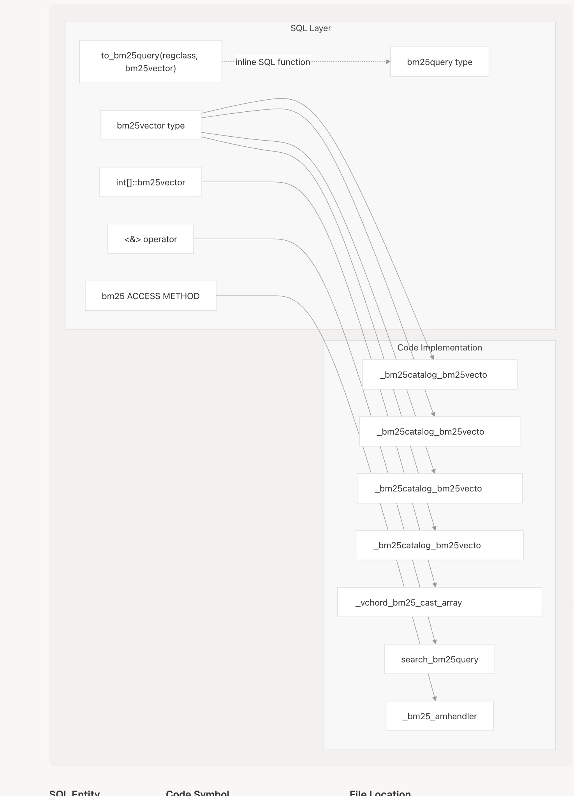
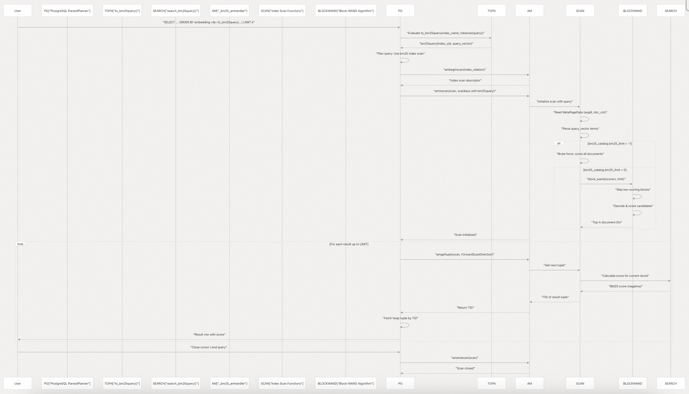

## VectorChord-bm25 源码学习: 3 用法 (Usage)    
                                                  
### 作者                                                  
digoal                                                  
                                                  
### 日期                                                  
2025-11-24                                                  
                                                  
### 标签                                                  
VectorChord-bm25 , 源码学习 , 全文检索 , 关键词检索 , TF , IDF , 相关性排序 , ranking , Block-WeakAnd , Block-WAND , tsvector , ts_rank                                                    
                                                  
----                                                  
                                                  
## 背景                           
本页面提供了在 **PostgreSQL** 数据库中使用 **VectorChord-BM25** 的全面指南。它涵盖了从安装到查询的基本**工作流程 (workflow)** ，包括文本**分词 (tokenization)** 、**索引创建 (index creation)** 和 **BM25 排序 (ranking)** 操作。  
  
-----  
  
## 安装和设置 (Installation and Setup)  
  
**VectorChord-BM25** 以 **PostgreSQL 扩展 (extension)** 的形式分发。推荐的方法是使用**预构建 (pre-built)** 的 **Docker 镜像 (image)** ，其中包含 **VectorChord-BM25** 和必需的 `pg_tokenizer.rs` 扩展。  
  
### 使用 Docker (Using Docker)  
  
启动预装了 **VectorChord-BM25** 的 **PostgreSQL** 实例：  
  
```  
docker run \
  --name vchord-suite \
  -e POSTGRES_PASSWORD=postgres \
  -p 5432:5432 \
  -d tensorchord/vchord-suite:pg18-latest  
```  
  
该镜像支持 **PostgreSQL 14-18 版本**。请使用特定版本**标签 (tags)** ，例如 `pg17-20250414`，以实现**可重现的部署 (reproducible deployments)** 。  
  
### 启用扩展 (Enabling Extensions)  
  
连接到数据库并启用所需的扩展：  
  
```sql  
CREATE EXTENSION IF NOT EXISTS pg_tokenizer CASCADE;  -- Required for tokenization  
CREATE EXTENSION IF NOT EXISTS vchord_bm25 CASCADE;   -- BM25 ranking  
```  
  
`pg_tokenizer` 扩展必须在 `vchord_bm25` 之前加载，因为 **BM25 向量 (vector)** 类型依赖于**分词功能 (tokenization functionality)** 。  
  
**来源:** [`README.md` 13-37](https://github.com/tensorchord/VectorChord-bm25/blob/da0908a6/README.md#L13-L37)  
  
-----  
  
## 基本工作流程 (Basic Workflow)  
  
典型的使用**模式 (pattern)** 涉及四个步骤：创建带有 `bm25vector` 列 (**columns**) 的表 (**table**)，分词文本，创建 **BM25 索引**，以及使用 **BM25 排序**进行查询 (**querying**)。  
  
### 工作流程图 (Workflow Diagram)  
  

  
**来源:** [`src/sql/finalize.sql` 1-57](https://github.com/tensorchord/VectorChord-bm25/blob/da0908a6/src/sql/finalize.sql#L1-L57)  
  
### 第 1 步：创建表 (Create Table)  
  
定义一个带有 `bm25vector` 列的表，用于存储分词后的文本：  
  
```sql  
CREATE TABLE documents (  
    id SERIAL PRIMARY KEY,  
    passage TEXT,  
    embedding bm25vector  
);  
```  
  
`bm25vector` 类型将分词后的文本存储为**稀疏向量 (sparse vector)** ，包含**词元 ID (token IDs)** 和**频率 (frequencies)** 。  
  
### 第 2 步：插入和分词数据 (Insert and Tokenize Data)  
  
插入**原始文本 (raw text)** 并使用 `pg_tokenizer.rs` 中的 `tokenize` 函数对其进行分词：  
  
```sql  
INSERT INTO documents (passage) VALUES  
('PostgreSQL is a powerful, open-source object-relational database system.'),  
('BM25 is a ranking function used by search engines to estimate relevance.'),  
('Full-text search is a technique for searching in plain-text documents.');  
  
-- Tokenize using a pre-trained model (e.g., 'bert')  
UPDATE documents SET embedding = tokenize(passage, 'bert');  
```  
  
`tokenize` 函数将文本转换为 `bm25vector`，后者在内部存储词元 ID 及其频率。例如：  
  
  * **输入 (Input)** ：`"A quick brown fox"`  
  * **输出 (Output)** ：`{1012:1, 1037:1, 2829:1, 4419:1}`（带有频率的词元 ID）  
  
### 第 3 步：创建 BM25 索引 (Create BM25 Index)  
  
使用 `bm25` **访问方法 (access method)** 创建索引：  
  
```sql  
CREATE INDEX documents_embedding_bm25   
ON documents   
USING bm25 (embedding bm25_ops);  
```  
  
该索引构建了**倒排发布列表 (inverted posting lists)** ，并计算了 **BM25 评分 (scoring)** 所需的**全局统计信息 (global statistics)** （ 文档计数、平均文档长度、**词项频率 (term frequencies)** ）。  
  
### 第 4 步：使用 BM25 排序进行查询 (Query with BM25 Ranking)  
  
使用 `<&>` 运算符执行 **BM25 评分查询**：  
  
```sql  
-- Basic query  
SELECT id, passage,   
       embedding <&> to_bm25query('documents_embedding_bm25',   
                                   tokenize('PostgreSQL', 'bert')) AS bm25_score  
FROM documents  
ORDER BY bm25_score  
LIMIT 10;  
```  
  
`to_bm25query` 函数创建了一个**查询对象 (query object)** ，该对象引用了索引并包含了分词后的**查询向量 (query vector)** 。`<&>` 运算符计算 **BM25 分数 (scores)** ，返回**负值 (negative values)** （ 分数越低表示**相关性越高 (higher relevance)** ）。  
  
**来源:** [`src/sql/finalize.sql` 34-56](https://github.com/tensorchord/VectorChord-bm25/blob/da0908a6/src/sql/finalize.sql#L34-L56)  
  
-----  
  
## SQL 实体映射 (SQL Entity Mapping)  
  
下表显示了 **SQL 类型 (SQL types)** 、函数和运算符如何映射到**底层代码实现 (underlying code implementation)** ：  
  
  
  
| SQL 实体 (SQL Entity) | 代码符号 (Code Symbol) | 文件位置 (File Location) |  
| :--- | :--- | :--- |  
| `bm25vector` 类型 | **输入/输出函数 (Input/output functions)** | [`src/datatype/text_bm25vector.rs` 136-145](https://github.com/tensorchord/VectorChord-bm25/blob/da0908a6/src/datatype/text_bm25vector.rs#L136-L145) |  
| `bm25vector` 类型 | **二进制发送/接收 (Binary send/receive)** | [`src/datatype/binary_bm25vector.rs` 12-30](https://github.com/tensorchord/VectorChord-bm25/blob/da0908a6/src/datatype/binary_bm25vector.rs#L12-L30) |  
| `int[]::bm25vector` **转换 (cast)** | `_vchord_bm25_cast_array_to_bm25vector` | [`src/datatype/cast.rs` 3](https://github.com/tensorchord/VectorChord-bm25/blob/da0908a6/src/datatype/cast.rs#L3-L3) |  
| `bm25query` 类型 | **复合类型定义 (Composite type definition)** | [`src/sql/finalize.sql` 34-37](https://github.com/tensorchord/VectorChord-bm25/blob/da0908a6/src/sql/finalize.sql#L34-L37) |  
| `to_bm25query` 函数 | **SQL 内联函数 (SQL inline function)** | [`src/sql/finalize.sql` 39-42](https://github.com/tensorchord/VectorChord-bm25/blob/da0908a6/src/sql/finalize.sql#L39-L42) |  
| `<&>` 运算符 | `search_bm25query` | [`src/datatype/functions.rs` 11](https://github.com/tensorchord/VectorChord-bm25/blob/da0908a6/src/datatype/functions.rs#L11-L11) |  
| `bm25` 访问方法 | `_bm25_amhandler` | [`src/index/am.rs` 11](https://github.com/tensorchord/VectorChord-bm25/blob/da0908a6/src/index/am.rs#L11-L11) |  
  
**来源:** [`sql/install/vchord_bm25--0.2.0.sql` 1-137](https://github.com/tensorchord/VectorChord-bm25/blob/da0908a6/sql/install/vchord_bm25--0.2.0.sql#L1-L137)  
  
-----  
  
## 数据类型 (Data Types)  
  
### bm25vector  
  
`bm25vector` 类型将分词文本存储为**词元 ID-频率对 (token ID-frequency pairs)** 的**稀疏向量**。它使用**自定义 (custom)** 的输入/输出和二进制**序列化函数 (serialization functions)** 进行定义。  
  
**结构 (Structure):** `{token_id:frequency, token_id:frequency, ...}`  
  
**示例:**  
  
```sql  
SELECT '{1012:1, 1037:1, 2829:1}'::bm25vector;  
```  
  
**从 int[] 转换 (Casting from int[]):**  
整数数组 (**Integer arrays**) 可以**隐式 (implicitly)** 转换为 `bm25vector`。该转换会**聚合 (aggregates)** 重复的词元 ID 并计算它们的频率：  
  
```sql  
SELECT ARRAY[1, 2, 1, 3, 2, 1]::bm25vector;  
-- Result: {1:3, 2:2, 3:1}  
```  
  
### bm25query  
  
`bm25query` 类型是一个**复合类型 (composite type)** ，包含：  
  
  * `index_oid` (`regclass`)：BM25 索引的 OID  
  * `query_vector` (`bm25vector`)：分词后的查询  
  
该类型将**查询向量**绑定到特定的索引，允许系统在评分期间访问**索引统计信息 (index statistics)** （ 如**逆文档频率 (IDF)** 、**平均文档长度 (average document length)** ） 。  
  
**来源:** [`src/sql/finalize.sql` 1-42](https://github.com/tensorchord/VectorChord-bm25/blob/da0908a6/src/sql/finalize.sql#L1-L42)  
  
-----  
  
## 操作 (Operations)  
  
### 相等性运算符 (Equality Operators)  
  
```sql  
-- Check equality  
SELECT '{1:2, 2:1}'::bm25vector = '{1:2, 2:1}'::bm25vector;  -- true  
  
-- Check inequality  
SELECT '{1:2, 2:1}'::bm25vector <> '{1:1, 2:2}'::bm25vector;  -- true  
```  
  
### BM25 排序运算符 (BM25 Ranking Operator)  
  
`<&>` 运算符计算**文档向量 (document vector)** 和查询之间的 **BM25 分数 (score)** ：  
  
```sql  
SELECT embedding <&> to_bm25query('index_name', query_vector) AS score  
FROM documents;  
```  
  
**重要提示 (Important):** **BM25 分数是负值 (negative values)** 。分数越低（负值越大）表示**相关性越高**。这种设计允许自然地使用**升序排序 (ascending order sorting)** 来检索最相关的文档。  
  
**来源:** [`src/sql/finalize.sql` 47-56](https://github.com/tensorchord/VectorChord-bm25/blob/da0908a6/src/sql/finalize.sql#L47-L56)  
  
-----  
  
## 索引创建和管理 (Index Creation and Management)  
  
### 创建 BM25 索引 (Creating a BM25 Index)  
  
```sql  
CREATE INDEX index_name   
ON table_name   
USING bm25 (column_name bm25_ops);  
```  
  
必须指定 `bm25_ops` **运算符类 (operator class)** 。在索引创建过程中，系统会：  
  
1.  扫描表中的所有**行 (rows)**  
2.  为每个**词项 (term)** 构建**倒排发布列表 (inverted posting lists)**  
3.  计算**全局统计信息**（文档计数、平均文档长度、词项频率）  
4.  将数据存储在**增长中 (growing) 和已密封 (sealed) 的段 (segments)** 组合中  
  
### 索引在查询中的使用 (Index Usage in Queries)  
  
**查询规划器 (query planner)** 会在以下情况下自动使用 **BM25 索引**：  
  
  * 查询包含带有 `<&>` 运算符的 `ORDER BY` **子句 (clause)**  
  * `bm25_catalog.enable_index` **GUC (Grand Unified Configuration)** 参数已启用（默认为 `true`）  
  * 存在 `LIMIT` 子句（ 推荐用于 **Block-WAND 优化 (optimization)** ）  
  
**示例:**  
  
```sql  
-- This query uses the index with Block-WAND optimization  
SELECT id, passage, embedding <&> to_bm25query('idx', tokenize('search', 'bert')) AS score  
FROM documents  
ORDER BY score  
LIMIT 10;  
```  
  
**来源:** [`README.md` 88-108](https://github.com/tensorchord/VectorChord-bm25/blob/da0908a6/README.md#L88-L108)  
  
-----  
  
## 使用模式 (Usage Patterns)  
  
### 模式 1：预训练分词器 (Pre-trained Tokenizer)  
  
对标准英文文本使用**预训练 (pre-trained)** 模型，例如 `bert`：  
  
```sql  
-- Create and populate table  
CREATE TABLE docs (id SERIAL PRIMARY KEY, text TEXT, embedding bm25vector);  
INSERT INTO docs (text) VALUES ('Sample document text');  
  
-- Tokenize with pre-trained model  
UPDATE docs SET embedding = tokenize(text, 'bert');  
  
-- Create index  
CREATE INDEX docs_bm25_idx ON docs USING bm25 (embedding bm25_ops);  
  
-- Query  
SELECT * FROM docs   
ORDER BY embedding <&> to_bm25query('docs_bm25_idx', tokenize('query', 'bert'))  
LIMIT 10;  
```  
  
### 模式 2：自定义分词器 (Custom Tokenizer)  
  
为**特定领域 (domain-specific)** 文本构建**自定义分词器 (custom tokenizer)** 。有关详细配置选项，请参阅 分词 (Tokenization) 章节。  
  
```sql  
-- Create text analyzer  
SELECT create_text_analyzer('my_analyzer', $$  
pre_tokenizer = "unicode_segmentation"  
[[character_filters]]  
to_lowercase = {}  
[[token_filters]]  
stopwords = "nltk_english"  
$$);  
  
-- Create custom model and tokenizer  
SELECT create_custom_model_tokenizer_and_trigger(  
    tokenizer_name => 'my_tokenizer',  
    model_name => 'my_model',  
    text_analyzer_name => 'my_analyzer',  
    table_name => 'docs',  
    source_column => 'text',  
    target_column => 'embedding'  
);  
  
-- Documents are automatically tokenized on insert via trigger  
INSERT INTO docs (text) VALUES ('Domain-specific terminology');  
  
CREATE INDEX docs_bm25_idx ON docs USING bm25 (embedding bm25_ops);  
```  
  
### 3：多列搜索 (Multi-column Search)  
  
通过在分词前**连接 (concatenating)** 多个文本列，实现跨多个文本列的搜索：  
  
```sql  
CREATE TABLE articles (  
    id SERIAL PRIMARY KEY,  
    title TEXT,  
    body TEXT,  
    embedding bm25vector  
);  
  
-- Combine columns for tokenization  
UPDATE articles   
SET embedding = tokenize(title || ' ' || body, 'bert');  
  
CREATE INDEX articles_bm25_idx ON articles USING bm25 (embedding bm25_ops);  
```  
  
**来源:** [`README.md` 39-170](https://github.com/tensorchord/VectorChord-bm25/blob/da0908a6/README.md#L39-L170)  
  
-----  
  
## 查询执行流程 (Query Execution Flow)  
  
以下**序列图 (sequence diagram)** 说明了使用 **BM25 索引**时的完整**查询执行流程 (query execution flow)** ：  
  
  
  
**关键点 (Key Points):**  
  
1.  `to_bm25query` 在**规划阶段 (planning)** 被评估一次，以创建**查询对象**。  
2.  **访问方法处理器** `_bm25_amhandler` 为**扫描操作 (scan operations)** 提供**回调函数 (callbacks)** 。  
3.  **Block-WAND 优化**（当 `bm25_catalog.bm25_limit > 0` 时）会跳过不相关的**文档块 (document blocks)** 。  
4.  结果以 **TIDs (Tuple Identifiers，元组标识符)** 的形式返回，供 **PostgreSQL** 从**堆 (heap)** 中获取。  
5.  **分数 (scores)** 在**元组检索 (tuple retrieval)** 期间由 `search_bm25query` 计算。  
  
**来源:**   
  
- [`src/index/am.rs` 11](https://github.com/tensorchord/VectorChord-bm25/blob/da0908a6/src/index/am.rs#L11-L11)  
- [`src/datatype/functions.rs` 11](https://github.com/tensorchord/VectorChord-bm25/blob/da0908a6/src/datatype/functions.rs#L11-L11)  
- [`README.md` 94-108](https://github.com/tensorchord/VectorChord-bm25/blob/da0908a6/README.md#L94-L108)  
  
-----  
  
## 配置和限制 (Configuration and Limits)  
  
几个 **GUC (Grand Unified Configuration，统一配置)** 参数控制 **BM25 索引**的行为 (**behavior**)。这些内容在 配置 (Configuration) 章节中有详细介绍。  
  
### 关键参数 (Key Parameters)  
  
| 参数 (Parameter) | 默认值 (Default) | 描述 (Description) |  
| :--- | :--- | :--- |  
| `bm25_catalog.bm25_limit` | 100 | **索引扫描 (index scan)** 返回的**最大结果数**。设置为 `-1` 进行**暴力搜索 (brute-force)** （返回所有结果）。 |  
| `bm25_catalog.enable_index` | `true` | 启用/禁用 **BM25 索引**的使用。 |  
| `bm25_catalog.segment_growing_max_page_size` | 4096 | 在**密封 (sealing)** **增长中段 (growing segment)** 之前的**页数 (pages)** 。 |  
  
**示例:**  
  
```sql  
-- Return more results from index scan  
SET bm25_catalog.bm25_limit = 1000;  
  
-- Disable index for testing  
SET bm25_catalog.enable_index = false;  
```  
  
**重要提示:** `bm25_limit` 参数决定了索引返回给 **PostgreSQL** 的结果数量。如果您的查询使用了 `LIMIT 1000`，但 `bm25_limit = 100`，您可能无法获得真正的 Top 1000 结果。请相应地调整 `bm25_limit`，或使用 `bm25_limit = -1` 进行**穷尽搜索 (exhaustive search)** （以牺牲**性能 (performance cost)** 为代价）。  
  
**来源:** [`README.md` 462-466](https://github.com/tensorchord/VectorChord-bm25/blob/da0908a6/README.md#L462-L466)  
  
-----  
  
## 分词集成 (Tokenization Integration)  
  
**VectorChord-BM25** 需要 `pg_tokenizer.rs` 扩展来实现**文本分词 (text tokenization)** 。**分词器 (Tokenizers)** 将**原始文本**转换为 `bm25vector` 格式。  
  
### 使用预训练模型 (Using Pre-trained Models)  
  
```sql  
-- Use BERT tokenizer  
SELECT tokenize('A quick brown fox', 'bert')::bm25vector;  
-- Output: {1012:1, 1037:1, 2829:1, 4419:1}  
```  
  
### 创建自定义文本分析器 (Creating Custom Text Analyzers)  
  
对于**专业领域 (specialized domains)** 或语言，创建**自定义分析器 (analyzers)** ：  
  
```sql  
SELECT create_text_analyzer('custom_analyzer', $$  
pre_tokenizer = "unicode_segmentation"  
[[character_filters]]  
to_lowercase = {}  
[[token_filters]]  
stopwords = "nltk_english"  
[[token_filters]]  
stemmer = "english_porter2"  
$$);  
```  
  
### 特定语言的分词 (Language-Specific Tokenization)  
  
**中文 (Jieba):**  
  
```sql  
SELECT create_text_analyzer('chinese_analyzer', $$  
[pre_tokenizer.jieba]  
$$);  
```  
  
**日文 (Lindera):**  
  
```sql  
SELECT create_lindera_model('japanese_model', $$  
[segmenter]  
mode = "normal"  
[segmenter.dictionary]  
kind = "ipadic"  
$$);  
```  
  
有关**全面 (comprehensive) 的分词文档 (tokenization documentation)** ，请参阅 分词 (Tokenization) 和 pg\_tokenizer.rs 项目.   
  
**来源:** [`README.md` 39-383](https://github.com/tensorchord/VectorChord-bm25/blob/da0908a6/README.md#L39-L383)  
  
-----  
  
## 完整示例 (Complete Example)  
  
此示例演示了从安装到查询的完整**工作流程**：  
  
```sql  
-- 1. Enable extensions  
CREATE EXTENSION IF NOT EXISTS pg_tokenizer CASCADE;  
CREATE EXTENSION IF NOT EXISTS vchord_bm25 CASCADE;  
  
-- 2. Create table  
CREATE TABLE articles (  
    id SERIAL PRIMARY KEY,  
    title TEXT,  
    content TEXT,  
    embedding bm25vector  
);  
  
-- 3. Insert data  
INSERT INTO articles (title, content) VALUES  
('PostgreSQL Full-Text Search', 'PostgreSQL supports advanced full-text search capabilities...'),  
('BM25 Ranking Algorithm', 'BM25 is a probabilistic ranking function used in information retrieval...'),  
('Database Indexing Techniques', 'Efficient indexing is crucial for query performance...');  
  
-- 4. Tokenize  
UPDATE articles SET embedding = tokenize(title || ' ' || content, 'bert');  
  
-- 5. Create index  
CREATE INDEX articles_embedding_idx ON articles USING bm25 (embedding bm25_ops);  
  
-- 6. Query with ranking  
SELECT   
    id,   
    title,  
    embedding <&> to_bm25query('articles_embedding_idx',   
                                tokenize('PostgreSQL search', 'bert')) AS relevance_score  
FROM articles  
ORDER BY relevance_score  
LIMIT 5;  
```  
  
**预期输出 (Expected Output):**  
  
```  
 id |            title             | relevance_score   
----+------------------------------+-----------------  
  1 | PostgreSQL Full-Text Search  |         -2.4563  
  3 | Database Indexing Techniques |         -1.2341  
  2 | BM25 Ranking Algorithm       |         -0.8912  
```  
  
分数越低（负值越大）越先出现，表明**相关性越高**。  
  
**来源:** [`README.md` 62-108](https://github.com/tensorchord/VectorChord-bm25/blob/da0908a6/README.md#L62-L108)  
  
-----  
  
## 故障排除 (Troubleshooting)  
  
### 查询返回结果太少 (Query Returns Too Few Results)  
  
如果您的 `LIMIT 1000` 查询返回的结果少于预期：  
  
```sql  
-- Increase the index scan limit  
SET bm25_catalog.bm25_limit = 2000;  
  
-- Or use brute-force for all results  
SET bm25_catalog.bm25_limit = -1;  
```  
  
### 索引未被使用 (Index Not Being Used)  
  
检查索引是否已启用：  
  
```sql  
SHOW bm25_catalog.enable_index;  -- Should be 'on'  
  
-- Force index usage  
SET bm25_catalog.enable_index = true;  
SET enable_seqscan = false;  -- Discourage sequential scans  
```  
  
### 未找到分词器 (Tokenizer Not Found)  
  
确保 `pg_tokenizer.rs` 已安装并且**分词器 (tokenizer)** 存在：  
  
```sql  
-- List available tokenizers  
SELECT * FROM list_tokenizers();  
  
-- Create missing tokenizer  
SELECT create_tokenizer('bert', $$model = "bert_base_uncased"$$);  
```  
  
**来源:** [`README.md` 437-439](https://github.com/tensorchord/VectorChord-bm25/blob/da0908a6/README.md#L437-L439)  
  
-----  
  
## 总结 (Summary)  
  
**VectorChord-BM25** 通过以下方式在 **PostgreSQL** 中提供了**原生 (native) 的 BM25 排序**：  
  
1.  **自定义类型 (Custom types)** ：`bm25vector` 用于**稀疏词元向量 (sparse token vectors)** ，`bm25query` 用于查询。  
2.  **索引访问方法**：`bm25` 用于构建和扫描**倒排索引 (inverted indexes)** 。  
3.  **运算符**：`<&>` 用于 **BM25 评分**，`=` 和 `<>` 用于**相等性 (equality)** 。  
4.  **集成 (Integration)** ：与 `pg_tokenizer.rs` **无缝集成 (seamless integration)** 以实现分词。  
  
该扩展实现了 **Block-WAND 算法**，用于**高效 (efficient)** 的 **top-k 检索 (retrieval)** ，使其适用于**大规模文档集合 (large-scale document collections)** 。配置可通过 **GUC 参数**获得，并且各种**分词策略 (tokenization strategies)** 支持多种语言和**领域 (domains)** 。  
  
**来源:** [`README.md` 1-477](https://github.com/tensorchord/VectorChord-bm25/blob/da0908a6/README.md#L1-L477)  
  
-----  
  
# 附录1: 性能与 Top-K 检索的平衡：`bm25_limit` 和 Block-WAND 的权衡  
  
**背景痛点与细节：** 文档提到 **BM25 索引**使用 **Block-WAND 优化算法**进行高效的 **top-k 检索**，并且结果受 `bm25_catalog.bm25_limit` GUC 参数限制。在处理**超大规模文档集 (large-scale document collections)** 时，这个限制值是性能和查询**准确性（召回率）** 的关键**痛点**。  
  
**关键问题：**  
请详细展开 **Block-WAND 算法**如何跳过**不相关的文档块 (irrelevant document blocks)** 来加速查询？在日常生产环境中，如果数据量很大，用户应如何科学地平衡 `bm25_limit` 的值与查询结果的**召回率/准确性**之间的关系？是否有一个**背景知识**模型或经验法则，来指导用户在不采用 `bm25_limit = -1` **穷尽搜索**的前提下，设置一个既高效又足够准确的限制值？  
  
## 回答  
您的问题涉及 **VectorChord-BM25** 中的 **Block-WAND 算法**如何通过跳过不相关文档块来加速查询，以及如何在生产环境中平衡 `bm25_catalog.bm25_limit` 参数与召回率的关系。    
  
## Block-WAND 算法的块跳过机制  
  
Block-WAND 算法通过以下机制跳过不相关的文档块：  
  
### 1. **BlockWand 上界计算**  
  
每个 128 文档的压缩块都预先计算并存储了 `block_max_score` 上界值。   在构建索引时，系统会追踪每个块中 BM25 分数最高的文档，并将其 `blockwand_tf`（词频）和 `blockwand_fieldnorm_id`（文档长度归一化 ID）存储在 `SkipBlock` 结构中。    
  
### 2. **Shallow Seek 跳过机制**  
  
在查询执行时，Block-WAND 使用 `shallow_seek()` 方法快速跳过整个块，而无需解压缩。   关键逻辑如下：  
  
- 算法计算所有查询词项在当前块的 `block_max_score` 之和  
- 如果这个上界和 ≤ 当前阈值（`computer.threshold()`），则该块中的所有文档都不可能进入 top-k 结果  
- 此时直接跳到下一个块，避免解压缩和逐文档评分的开销    
  
### 3. **动态阈值更新**  
  
`TopKComputer` 维护一个动态阈值，随着找到更高分数的文档而不断提升。   当缓冲区满时，系统会截断到 top-k 并更新阈值为第 k 个元素的分数，使后续的块跳过更加激进。  
  
### 4. **单词项优化**  
  
对于单词项查询，使用简化的 `block_wand_single()` 路径：   直接跳过 `block_max_score ≤ threshold` 的块，然后处理符合条件的块中的所有文档。  
  
## `bm25_limit` 参数的平衡策略  
  
### 当前实现的行为  
  
`bm25_limit` 参数控制返回结果的数量：    
  
- **正值**（默认 100）：使用 Block-WAND 返回 top-k 结果  
- **0**：立即返回空结果  
- **-1**：暴力搜索模式，返回所有分数 > 0 的文档    
  
### 召回率与性能的权衡  
  
**关键洞察**：Block-WAND 是一个**精确的 top-k 算法**，不是近似算法。 它保证返回真实的 top-k 结果，不会因为块跳过而遗漏高分文档。因此，`bm25_limit` 的设置**不影响召回率的准确性**，只影响返回结果的数量。  
  
### 生产环境设置建议  
  
1. **根据业务需求设置 k 值**：  
   - 如果您的应用只需要显示前 10 条结果，设置 `bm25_limit = 10` 即可  
   - 如果需要分页或后续过滤，可以设置为预期最大结果数（如 100-1000）  
  
2. **考虑后置过滤的影响**：  
   - 如果查询包含 WHERE 条件过滤，部分 top-k 结果可能被过滤掉  
   - 此时需要增大 `bm25_limit` 以确保过滤后仍有足够结果  
   - 文档建议："用户需要在使用更大的 limit 值或更严格的过滤条件时调整 `bm25_catalog.bm25_limit`"    
  
3. **性能监控**：  
   - 较小的 k 值（如 10-100）能让 Block-WAND 更早建立高阈值，跳过更多块  
   - 较大的 k 值（如 1000+）会降低块跳过效率，但仍比暴力搜索快得多  
  
4. **避免 `-1` 模式**：  
   - 暴力搜索会扫描所有文档，失去 Block-WAND 的优化效果  
   - 仅在确实需要所有匹配文档时使用    
  
## Notes  
  
VectorChord-BM25 的 Block-WAND 实现基于固定的 128 文档块大小（`COMPRESSION_BLOCK_SIZE`），这在压缩效率和访问粒度之间取得了平衡。 系统还支持 `enable_prefilter` 选项，可以在评分前进行 MVCC 可见性检查，进一步提升性能。    
  
与 PostgreSQL 原生的全文搜索（使用 `ts_rank` 重新排序所有匹配文档）相比，Block-WAND 通过块级跳过实现了真正的高效 top-k 检索。    
  
  
-----  
  
# 附录2: 分词准确性：定制化文本分析器的策略与监控  
  
**背景痛点与细节：** BM25 的**相关性 (relevance)** 评分完全依赖于**分词 (tokenization)** 的质量。文档提到了对中文 (Jieba) 和专业领域（自定义分析器）的支持。对于非通用 (non-general) 文本，例如特定行业术语、大量缩写或混合语言内容，默认的分词器往往不够准确。  
  
**关键问题：**  
**分词**是 BM25 **相关性**的基石，用户如何根据中文、日文或特定技术领域等**非通用文本的语言特点和背景痛点**，合理定制和优化 **`CREATE TEXT ANALYZER`**？在日常使用中，如何配置（例如添加**停用词 (stop words)** 、过滤器等）以提高 BM25 评分的**最大准确性**？是否有推荐的**日常维护动作**或工具，用于**监控**分词器在实际数据上的效果，并及时进行迭代优化？  
  
## 回答  
您的问题是关于如何在 VectorChord-BM25 中针对**非通用文本**（中文、日文、专业术语等）定制和优化分词器配置，以提高 BM25 相关性评分的准确性，以及如何进行日常监控和维护。  
  
## 分词器定制方法  
  
VectorChord-BM25 通过 `pg_tokenizer.rs` 扩展提供分词功能。   您可以通过以下方式定制分词器：  
  
### 1. 中文文本：使用 Jieba 分词器  
  
对于中文文本，使用 `jieba` 预分词器进行分词：    
  
```sql  
SELECT create_text_analyzer('text_analyzer1', $$  
[pre_tokenizer.jieba]  
$$);  
```    
  
然后基于此分析器创建自定义模型：    
  
### 2. 日文文本：使用 Lindera 分词器  
  
对于日文文本，使用 `lindera` 模型并配置停用词过滤器：    
  
配置示例包含了详细的停用词标签列表（如助词、助动词、记号等）：    
  
### 3. 专业领域文本：自定义文本分析器  
  
对于包含专业术语、缩写的文本，创建自定义 `text_analyzer` 并配置多层过滤器：    
  
关键配置选项包括：  
- **预分词器** (`pre_tokenizer`): 如 `unicode_segmentation` 用于按 Unicode 标准分词    
- **字符过滤器** (`character_filters`):   
  - `to_lowercase`: 转换为小写    
  - `unicode_normalization`: Unicode 规范化    
- **词元过滤器** (`token_filters`):  
  - `skip_non_alphanumeric`: 跳过非字母数字词元    
  - `stopwords`: 移除停用词（如 `nltk_english`）    
  - `stemmer`: 词干提取（如 `english_porter2`）    
  
然后使用 `create_custom_model_tokenizer_and_trigger` 函数基于您的语料库训练模型：    
  
## 配置建议  
  
### 语言特定配置  
  
1. **空格分隔语言**（英语、西班牙语等）：使用 `bert` 或 `unicode` 分词器    
2. **非空格分隔语言**（中文、日文）：需要专门的预分词算法    
3. **多语言数据**：使用 `gemma2b` 或 `llmlingua2` 等多语言分词器    
  
### 词汇复杂度配置  
  
- **标准语言**：预训练模型即可    
- **专业术语**：训练自定义模型以识别领域特定术语（如 "k8s" 代表 Kubernetes）    
  
## 日常维护  
  
### 性能优化：模型预加载  
  
使用 `add_preload_model` 函数在服务器启动时预加载模型，避免首次查询延迟：    
  
```sh  
psql -c "SELECT add_preload_model('model1')"  
# 重启 PostgreSQL 使其生效  
```    
  
注意预训练模型的内存占用（gemma2b 约 100MB，llmlingua2 约 200MB）。    
  
## Notes  
  
VectorChord-BM25 本身不提供内置的分词器效果监控工具。 分词器的配置和优化主要依赖于 `pg_tokenizer.rs` 扩展，更详细的配置文档可以在 [pg_tokenizer 文档](https://github.com/tensorchord/pg_tokenizer.rs/blob/main/docs/04-usage.md) 中找到。     
  
要监控分词效果，您需要：  
1. 使用 `tokenize()` 函数测试分词结果    
2. 通过实际查询的 BM25 评分来评估相关性  
3. 根据业务需求迭代调整分析器配置（停用词、过滤器等）  
  
分词器配置存储在 `bm25_catalog.tokenizers` 表中。    
  
  
-----  
  
# 附录3: 索引健康与维护：基于“段”结构的管理成本  
  
**背景痛点与细节：** 文档提到 BM25 索引存储数据于**增长中和已密封的段 (growing and sealed segments)** 中，这暗示了复杂的内部管理机制。对于运维人员而言，这种结构可能带来**索引碎片 (index fragmentation)** 和**数据不一致性**的风险。  
  
**关键问题：**  
BM25 索引的**增长和密封段**结构，会给日常**生产维护 (production maintenance)** 带来哪些挑战？我们是否需要执行类似于传统 **PostgreSQL** 的 `VACUUM FULL` 或 `REINDEX` 等动作来主动管理**索引碎片**或优化存储空间？是否存在特定的 **GUC** 参数（例如 `segment_growing_max_page_size`）可以调优**段的合并/密封流程**？在**背景知识**层面，如何理解段的生命周期，以及如何通过查询 `pg_catalog` 或扩展提供的函数，**监控**索引的**健康状态**和**碎片化程度**？  
  
## 回答  
您询问的是 VectorChord-BM25 扩展中 **growing segment（增长段）和 sealed segment（密封段）** 架构对生产维护的影响，以及是否需要类似 PostgreSQL 传统的 `VACUUM FULL` 或 `REINDEX` 操作来管理索引碎片和优化存储。  
  
## 段生命周期与管理机制  
  
### 段的自动密封流程  
  
BM25 索引使用两种段类型存储数据：  
  
1. **Growing Segment（增长段）** ：可变段，接受新文档插入，使用链表页结构实现快速写入    
2. **Sealed Segment（密封段）** ：不可变段，使用压缩的倒排列表和 Block-WAND 优化结构，专为查询性能设计  
  
当增长段达到 `SEGMENT_GROWING_MAX_PAGE_SIZE` 页数（默认 4096 页）时，`aminsert` 函数会自动触发密封操作  。密封过程包括：  
  
1. 获取元页独占锁    
2. 读取增长段所有向量并构建 `InvertedWriter`    
3. 将压缩后的倒排索引追加到密封段存储    
4. 更新元数据并释放旧增长段页面    
  
### 删除操作的处理  
  
与传统 PostgreSQL 索引不同，BM25 索引**不会立即物理删除**已删除的条目。相反，它使用 **delete bitmap（删除位图）** 跟踪逻辑删除的文档  ，查询时跳过这些文档。  
  
`VACUUM` 操作分两阶段执行：  
  
1. **`ambulkdelete`**：标记删除位图中的已删除文档，更新全局统计信息（`doc_cnt`、`doc_term_cnt`）    
2. **`amvacuumcleanup`**：重新计算每个词项的文档频率（term statistics），这对 BM25 的 IDF 计算至关重要    
  
## 生产维护挑战  
  
### 1. 索引碎片问题  
  
**当前架构不会产生传统意义的"碎片"**。原因如下：  
  
- 增长段使用链表结构，页面通过 `next_blkno` 连接  ，密封时会完全释放这些页面    
- 密封段是不可变的压缩结构，不存在页面内碎片  
- 删除操作仅更新位图，不修改倒排列表  
  
**但存在"空间浪费"问题**：大量删除后，密封段中的已删除文档仍占用存储空间，且 term statistics 需要重新计算  。  
  
### 2. 是否需要 VACUUM FULL 或 REINDEX  
  
**目前不支持类似 `VACUUM FULL` 的在线重建**。要回收已删除文档占用的空间，您需要：  
  
```sql  
REINDEX INDEX index_name;  
```  
  
`REINDEX` 会调用 `ambuild` 重新构建整个索引  ，扫描堆表并创建新的密封段  。这是**唯一**能物理回收空间的方式。  
  
**建议场景**：  
- 大量删除操作后（例如删除 >20% 文档）  
- 查询性能明显下降（因为需要跳过大量已删除文档）  
- 存储空间紧张  
  
## GUC 参数调优  
  
### `bm25_catalog.segment_growing_max_page_size`  
  
这是**唯一**直接影响段管理的 GUC 参数  ：  
  
| 场景 | 推荐值 | 理由 |  
|------|--------|------|  
| 写密集型 | 8192-100000 | 减少密封开销，降低写放大 |  
| 读密集型 | 1024-4096 | 更频繁密封，查询性能更好 |  
| 批量加载后查询 | 100000+ | 加载时延迟密封，完成后一次性密封 |  
  
**调优示例**：  
  
```sql  
-- 批量加载场景  
SET bm25_catalog.segment_growing_max_page_size = 100000;  
COPY documents FROM '/data/bulk.csv';  
  
-- 恢复默认值用于正常操作  
SET bm25_catalog.segment_growing_max_page_size = 4096;  
```  
  
### 其他相关参数  
  
- **`bm25_catalog.bm25_limit`**：控制返回结果数，不影响段管理    
- **`bm25_catalog.enable_prefilter`**：启用 MVCC 预过滤，可减少对已删除文档的评分计算    
  
## 监控索引健康状态  
  
### 当前限制  
  
**VectorChord-BM25 目前不提供内置的监控函数或视图**。`pg_catalog` 中的标准视图（如 `pg_stat_user_indexes`）仅显示基本统计信息（扫描次数、元组数），无法反映：  
  
- 增长段与密封段的大小比例  
- 删除文档的百分比  
- 段的数量和分布  
  
### 可用的间接指标  
  
1. **索引大小**：  
```sql  
SELECT pg_size_pretty(pg_relation_size('index_name'));  
```  
  
2. **表与索引大小比**：  
```sql  
SELECT   
    pg_size_pretty(pg_relation_size('table_name')) AS table_size,  
    pg_size_pretty(pg_relation_size('index_name')) AS index_size,  
    round(100.0 * pg_relation_size('index_name') /   
          NULLIF(pg_relation_size('table_name'), 0), 2) AS ratio;  
```  
  
3. **VACUUM 统计**：  
```sql  
SELECT * FROM pg_stat_user_indexes WHERE indexrelname = 'index_name';  
```  
  
### 建议的监控策略  
  
由于缺乏内置监控，建议：  
  
1. **定期记录索引大小**，监控增长趋势  
2. **在大量删除后执行 `REINDEX`**，比较前后大小差异  
3. **监控查询性能**（通过 `EXPLAIN ANALYZE`），如果扫描时间显著增加，可能需要重建索引  
  
## Notes  
  
VectorChord-BM25 的段架构设计优先考虑写入性能和查询效率，而非空间回收。与传统 B-tree 索引不同，它不支持增量空间回收，必须通过 `REINDEX` 完全重建。这是倒排索引的常见权衡，类似于 Elasticsearch 的 segment merge 机制。  
  
目前扩展不提供段级别的可观测性 API，这是一个潜在的改进方向。如果您需要更细粒度的监控，可能需要直接查询元页数据结构  ，但这需要深入了解内部实现且不保证跨版本兼容。  
  
    
#### [PolarDB 学习图谱](https://www.aliyun.com/database/openpolardb/activity "8642f60e04ed0c814bf9cb9677976bd4")
  
  
#### [PostgreSQL 解决方案集合](../201706/20170601_02.md "40cff096e9ed7122c512b35d8561d9c8")
  
  
#### [德哥 / digoal's Github - 公益是一辈子的事.](https://github.com/digoal/blog/blob/master/README.md "22709685feb7cab07d30f30387f0a9ae")
  
  
#### [About 德哥](https://github.com/digoal/blog/blob/master/me/readme.md "a37735981e7704886ffd590565582dd0")
  
  

  
