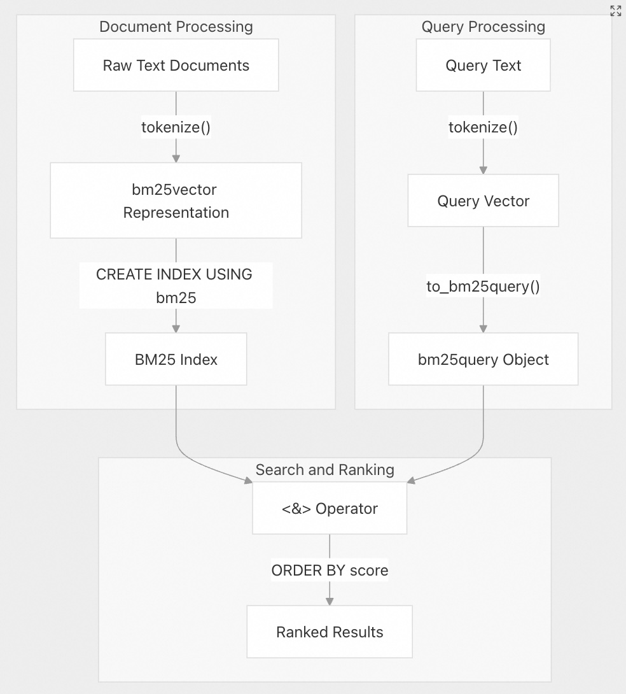
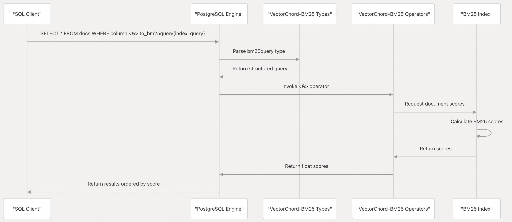
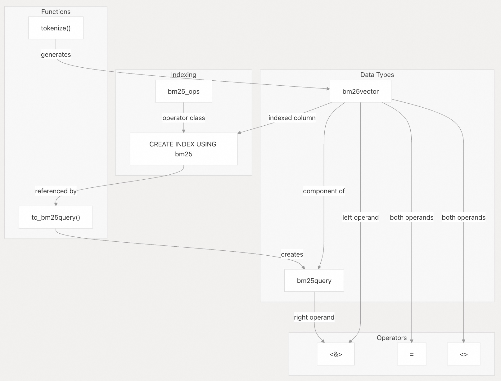

## VectorChord-bm25 源码学习: 3.1 SQL 接口 (SQL Interface)      
                                                    
### 作者                                                    
digoal                                                    
                                                    
### 日期                                                    
2025-11-24                                                    
                                                    
### 标签                                                    
VectorChord-bm25 , 源码学习 , 全文检索 , 关键词检索 , TF , IDF , 相关性排序 , ranking , Block-WeakAnd , Block-WAND , tsvector , ts_rank                                                      
                                                    
----                                                    
                                                    
## 背景                             
本文档详细介绍了 **VectorChord-BM25** 的 **SQL 接口 (SQL Interface)** ，它是一个在 **PostgreSQL** 中实现 **BM25 排序算法 (BM25 ranking algorithm)** 的 **PostgreSQL 扩展 (PostgreSQL extension)** 。它涵盖了 **数据类型 (data types)** 、**函数 (functions)** 、**运算符 (operators)** 和 **索引操作 (index operations)** ，使用户能够直接在 **SQL 查询 (SQL queries)** 中执行高效的 **基于 BM25 的文本搜索 (BM25-based text search)** 和排序。  
  
## 核心数据类型 (Core Data Types)  
  
**VectorChord-BM25** 引入了两种构成 **SQL 接口** 基础的主要数据类型：  
  
### bm25vector  
  
`bm25vector` 类型是 **分词文本 (tokenized text)** 的一种 **稀疏向量表示 (sparse vector representation)** 。它以 `{id1:freq1, id2:freq2, ...}` 的格式存储 **词元 ID (token ID)** 和 **频率 (frequency)** 对。这种表示形式可实现文本文档的高效 **存储 (storage)** 和 **比较操作 (comparison operations)** 。  
  
```sql  
-- bm25vector 表示示例  
{1012:1, 1037:1, 1996:1, 2058:1, 2829:1, 3899:1, 4248:1, 4419:1, 13971:1, 14523:1}  
```  
  
此示例显示一个文档，其中词元 ID **1012** 出现一次，词元 ID **1037** 出现一次，以此类推。  
  
### bm25query  
  
`bm25query` 类型是一种 **复合类型 (composite type)** ，包含：  
  
1.  要使用的 **BM25 索引 (BM25 index)** 的 **OID (对象标识符，object identifier)**  
2.  **查询向量 (query vector)** （作为 `bm25vector`）  
  
```sql  
CREATE TYPE bm25query AS (  
    index_oid regclass,  
    query_vector bm25vector  
);  
```  
  
这种组合将查询与索引关联起来，使得该 **扩展 (extension)** 能够访问 **文档集合 (document collection)** 的重要 **统计信息 (statistical information)** ，这些信息是进行 **BM25 分数计算 (BM25 score calculation)** 所必需的。  
  
来源:  
[`sql/install/vchord_bm25--0.1.0.sql` 207-210](https://github.com/tensorchord/VectorChord-bm25/blob/da0908a6/sql/install/vchord_bm25--0.1.0.sql#L207-L210)  
[`sql/install/vchord_bm25--0.1.1.sql` 207-210](https://github.com/tensorchord/VectorChord-bm25/blob/da0908a6/sql/install/vchord_bm25--0.1.1.sql#L207-L210)  
  
## SQL 函数 (SQL Functions)  
  
### to\_bm25query()  
  
`to_bm25query()` 函数用于创建 **BM25 搜索 (BM25 searches)** 的 **查询对象 (query objects)** 。该扩展提供了两个版本：  
  
1.  **带分词器 (tokenizer) 的版本 (0.2.0 之前)：**  
    ```sql  
    to_bm25query(index_oid regclass, query_str text, tokenizer_name text)  
    ```  
    此版本接受 **原始文本 (raw text)** 并使用指定的 **分词器 (tokenizer)** 对其进行 **分词 (tokenizes)** 。  
2.  **带预分词向量 (pre-tokenized vector) 的版本 (0.2.0+)：**  
    ```sql  
    to_bm25query(index_oid regclass, query_vector bm25vector)  
    ```  
    此版本接受一个 **预分词向量 (pre-tokenized vector)** ，提供了更大的灵活性。  
  
### tokenize()  
  
```sql  
tokenize(content text, tokenizer_name text) RETURNS bm25vector  
```  
  
使用指定的 **分词器 (tokenizer)** 将 **原始文本 (raw text)** 转换为 `bm25vector`。此函数处理 **文本处理管线 (text processing pipeline)** ，将 **纯文本 (plain text)** 转换为带有 **频率 (frequencies)** 的 **词元 ID (token IDs)** 。  
  
### 转换函数 (Cast Functions)  
  
**VectorChord-BM25** 支持从 **整数数组 (integer arrays)** 到 `bm25vector` 的 **转换 (casting)** ：  
  
```sql  
-- Cast an integer array to bm25vector  
SELECT ARRAY[1, 2, 1, 3]::bm25vector;  
-- Result: {1:2, 2:1, 3:1}  
```  
  
这种 **隐式转换 (implicit cast)** 对于拥有 **词元 ID (token IDs)** 并想直接构造 `bm25vector` 的情况很有用。  
  
来源:  
[`sql/install/vchord_bm25--0.1.0.sql` 212-215](https://github.com/tensorchord/VectorChord-bm25/blob/da0908a6/sql/install/vchord_bm25--0.1.0.sql#L212-L215)  
[`sql/install/vchord_bm25--0.1.1.sql` 212-215](https://github.com/tensorchord/VectorChord-bm25/blob/da0908a6/sql/install/vchord_bm25--0.1.1.sql#L212-L215)  
[`sql/vchord_bm25--0.1.1--0.2.0.sql` 20-39](https://github.com/tensorchord/VectorChord-bm25/blob/da0908a6/sql/vchord_bm25--0.1.1--0.2.0.sql#L20-L39)  
  
## 运算符 (Operators)  
  
### BM25 排序运算符 (BM25 Ranking Operator) (`<&>`)  
  
`<&>` 运算符计算一个 `bm25vector` 和一个 `bm25query` 之间的 **BM25 分数 (BM25 score)** ：  
  
```sql  
-- BM25 排序运算符  
SELECT embedding <&> to_bm25query('index_name', query_vector) AS score FROM documents;  
```  
  
此运算符返回一个 **负浮点值 (negative float value)** ，其中负值越小（绝对值越大）表示 **相关性越高 (higher relevance)** 。这种 **负值 (negative value)** 设计允许 **PostgreSQL 原生排序 (native PostgreSQL ordering) (ORDER BY score)** 能够直观地工作，而无需额外的 **DESC 指定符 (DESC specifiers)** 。  
  
### 比较运算符 (Comparison Operators)  
  
**VectorChord-BM25** 还提供了用于 `bm25vector` 比较的 **相等运算符 (equality operators)** ：  
  
  * `=`: 测试两个 `bm25vector` 值是否相等  
  * `<>`: 测试两个 `bm25vector` 值是否不相等  
  
这些运算符允许对向量进行 **相等性比较 (equality comparisons)** ，这在 **重复数据删除 (deduplication)** 或简单的 **相等性检查 (equality checks)** 等各种上下文中非常有用。  
  
来源:  
[`sql/install/vchord_bm25--0.1.0.sql` 220-224](https://github.com/tensorchord/VectorChord-bm25/blob/da0908a6/sql/install/vchord_bm25--0.1.0.sql#L220-L224)  
[`sql/vchord_bm25--0.2.0--0.2.1.sql` 9-48](https://github.com/tensorchord/VectorChord-bm25/blob/da0908a6/sql/vchord_bm25--0.2.0--0.2.1.sql#L9-L48)  
  
## 索引 (Indexing)  
  
### 创建 BM25 索引 (Creating a BM25 Index)  
  
为了实现 **高效的 BM25 搜索 (efficient BM25 search)** ，您需要使用 `bm25` **访问方法 (access method)** 在 `bm25vector` 列上创建一个 **索引 (index)** ：  
  
```sql  
-- 创建 BM25 索引  
CREATE INDEX index_name ON table_name USING bm25 (column_name bm25_ops);  
```  
  
该 **索引 (index)** 存储了准确进行 **BM25 评分 (BM25 scoring)** 所需的关于 **文档集合 (document collection)** 的 **统计信息 (statistical information)** ，例如：  
  
  * 每个词元的 **文档频率 (Document frequency)**  
  * **平均文档长度 (Average document length)**  
  * **总文档数 (Total document count)**  
  
### 索引在查询中的使用 (Index Usage in Queries)  
  
将 `<&>` **运算符 (operator)** 与 `to_bm25query()` 结合使用时，**查询规划器 (query planner)** 可以利用 **BM25 索引 (BM25 index)** 来 **加速搜索 (accelerate searches)** ：  
  
```sql  
-- 带有索引的 BM25 查询  
SELECT id, passage, embedding <&> to_bm25query('index_name', query_vector) AS rank  
FROM documents  
ORDER BY rank  
LIMIT 10;  
```  
  
在此 **查询模式 (query pattern)** 中，**索引 (index)** 用于 **高效地计算 BM25 分数 (efficiently compute BM25 scores)** 并仅检索 **最相关的文档 (most relevant documents)** 。  
  
来源:  
[`sql/install/vchord_bm25--0.1.0.sql` 217-218](https://github.com/tensorchord/VectorChord-bm25/blob/da0908a6/sql/install/vchord_bm25--0.1.0.sql#L217-L218)  
[`sql/install/vchord_bm25--0.1.0.sql` 226-229](https://github.com/tensorchord/VectorChord-bm25/blob/da0908a6/sql/install/vchord_bm25--0.1.0.sql#L226-L229)  
  
## SQL 接口工作流程 (SQL Interface Workflow)  
  
以下 **图表 (diagram)** 说明了使用 **VectorChord-BM25 SQL 接口 (SQL interface)** 时的典型 **工作流程 (workflow)** ：  
  
  
  
来源:  
[`README.md` 44-113](https://github.com/tensorchord/VectorChord-bm25/blob/da0908a6/README.md#L44-L113)  
  
## 搜索操作中的数据流 (Data Flow in Search Operation)  
  
此 **图表 (diagram)** 显示了 **SQL 组件 (SQL components)** 在 **搜索操作 (search operation)** 期间如何相互作用：  
  
  
  
来源:  
[`sql/install/vchord_bm25--0.1.0.sql` 74-81](https://github.com/tensorchord/VectorChord-bm25/blob/da0908a6/sql/install/vchord_bm25--0.1.0.sql#L74-L81)  
[`sql/install/vchord_bm25--0.1.1.sql` 74-81](https://github.com/tensorchord/VectorChord-bm25/blob/da0908a6/sql/install/vchord_bm25--0.1.1.sql#L74-L81)  
  
## 完整使用示例 (Complete Usage Example)  
  
这是一个展示典型 **使用模式 (usage pattern)** 的 **完整示例 (complete example)** ：  
  
```sql  
-- Create a table with a text column and a bm25vector column  
CREATE TABLE documents (  
    id SERIAL PRIMARY KEY,  
    passage TEXT,  
    embedding bm25vector  
);  
  
-- Insert sample documents  
INSERT INTO documents (passage) VALUES  
('PostgreSQL is a powerful, open-source object-relational database system.'),  
('Full-text search is a technique for searching in plain-text documents.'),  
('BM25 is a ranking function used by search engines to estimate relevance.');  
  
-- Tokenize the documents using a tokenizer (e.g., 'bert')  
UPDATE documents SET embedding = tokenize(passage, 'bert');  
  
-- Create a BM25 index on the embedding column  
CREATE INDEX documents_embedding_bm25 ON documents USING bm25 (embedding bm25_ops);  
  
-- Perform a search with ranking  
SELECT id, passage,   
       embedding <&> to_bm25query('documents_embedding_bm25', tokenize('PostgreSQL', 'bert')) AS score  
FROM documents  
ORDER BY score  
LIMIT 10;  
```  
  
此示例演示了从 **文档准备 (document preparation)** 到 **搜索 (search)** 和 **排序 (ranking)** 的 **完整工作流程 (complete workflow)** 。  
  
来源:  
[`README.md` 68-112](https://github.com/tensorchord/VectorChord-bm25/blob/da0908a6/README.md#L68-L112)  
  
## 配置参数 (Configuration Parameters)  
  
**VectorChord-BM25** 提供了几个可以调整以调整 **性能 (performance)** 的 **配置参数 (configuration parameters)** ：  
  
| Parameter (参数) | Type (类型) | Default (默认值) | Description (描述) |  
| :--- | :--- | :--- | :--- |  
| `bm25_catalog.bm25_limit` | integer (整数) | 100 | **搜索**中返回的最大文档数。设置为 **-1** 表示返回所有匹配的文档。 |  
| `bm25_catalog.enable_index` | boolean (布尔值) | true (真) | 控制是否使用 **BM25 索引**。 |  
| `bm25_catalog.segment_growing_max_page_size` | integer (整数) | 4,096 | 在段（segment）封闭之前，增长中段的最大页面数。 |  
  
可以使用标准的 **PostgreSQL 方法 (PostgreSQL methods)** 设置这些参数：  
  
```sql  
-- Set for the current session  
SET bm25_catalog.bm25_limit = 200;  
  
-- Set globally (requires reload)  
ALTER SYSTEM SET bm25_catalog.bm25_limit = 200;  
SELECT pg_reload_conf();  
```  
  
来源:  
[`README.md` 469-472](https://github.com/tensorchord/VectorChord-bm25/blob/da0908a6/README.md#L469-L472)  
  
## SQL 接口组件关系 (SQL Interface Component Relationships)  
  
此 **图表 (diagram)** 显示了各种 **SQL 接口组件 (SQL interface components)** 之间如何相互关联：  
  
  
  
来源:  
[`sql/install/vchord_bm25--0.1.0.sql` 197-229](https://github.com/tensorchord/VectorChord-bm25/blob/da0908a6/sql/install/vchord_bm25--0.1.0.sql#L197-L229)  
[`sql/vchord_bm25--0.2.0--0.2.1.sql` 9-48](https://github.com/tensorchord/VectorChord-bm25/blob/da0908a6/sql/vchord_bm25--0.2.0--0.2.1.sql#L9-L48)  
  
## 与其他扩展的兼容性 (Compatibility with Other Extensions)  
  
**VectorChord-BM25** 旨在与 pg\_tokenizer.rs 插件无缝协作，以实现 **高级分词功能 (advanced tokenization capabilities)** 。要将这两个 **扩展 (extensions)** 一起使用：  
  
```sql  
-- Enable both extensions  
CREATE EXTENSION IF NOT EXISTS pg_tokenizer CASCADE;  
CREATE EXTENSION IF NOT EXISTS vchord_bm25 CASCADE;  
  
-- Add schemas to search path  
ALTER SYSTEM SET search_path TO "$user", public, tokenizer_catalog, bm25_catalog;  
SELECT pg_reload_conf();  
```  
  
这种 **组合 (combination)** 为各种 **语言 (languages)** 和 **专业用例 (specialized use cases)** 提供了 **强大的分词选项 (powerful tokenization options)** 。  
  
来源:  
[`README.md` 33-42](https://github.com/tensorchord/VectorChord-bm25/blob/da0908a6/README.md#L33-L42)  
  
-----  
  
# 附录1: 索引统计信息维护与实时性影响  
  
针对 **BM25 索引** 依赖的统计信息（如文档频率、平均文档长度、总文档数），当我们在 **PostgreSQL** 中执行大批量 **插入、删除或更新** 操作时，**VectorChord-BM25** 如何确保这些统计数据能够**及时且高效地更新**？  
  
* **背景痛点:** 任何基于统计的搜索索引（如 BM25）都会因为数据变化导致统计信息过时，影响搜索准确性。  
* **细节展开:** 这是否会像传统全文检索一样，要求用户执行特定的 **维护动作（如 `VACUUM`/`ANALYZE` 或自定义维护函数）** ？这些维护操作对 **生产环境下的实时查询性能** 会造成多大的影响和锁竞争？  
  
## 回答  
您询问的是 **VectorChord-BM25** 在执行大批量插入、删除或更新操作时，如何确保 BM25 索引依赖的统计信息（文档频率、平均文档长度、总文档数）能够及时且高效地更新。  
  
## 统计信息更新机制  
  
VectorChord-BM25 采用**增量更新**和**延迟重计算**相结合的策略：  
  
### 插入操作的实时更新  
  
在 `aminsert` 函数中，每次插入新文档时会**立即更新**全局统计信息：    
  
- `doc_cnt`（总文档数）递增  
- `doc_term_cnt`（总词项数）增加文档长度  
- `current_doc_id` 递增  
  
同时，词项统计（term statistics）也会**实时更新**：    
  
每个词项的文档频率（document frequency）在插入时立即递增，无需额外维护操作。  
  
### 删除操作的两阶段处理  
  
删除操作采用**标记删除**而非物理删除，通过两阶段 VACUUM 过程更新统计：  
  
**第一阶段（`ambulkdelete`）** ：标记删除并更新全局统计    
  
- 在 delete bitmap 中标记文档为已删除  
- 立即更新 `doc_cnt` 和 `doc_term_cnt`  
- 无需重建索引结构  
  
**第二阶段（`amvacuumcleanup`）** ：重新计算词项统计    
  
只有当 `tuples_removed > 0` 时才执行词项统计重计算，避免不必要的开销。    
  
## 维护操作要求  
  
**是的，需要执行 VACUUM**，但这是 PostgreSQL 标准流程：  
  
1. **手动 VACUUM**：`VACUUM table_name;` 会触发统计更新  
2. **自动 VACUUM**：PostgreSQL 的 autovacuum 会自动处理  
3. **无需自定义维护函数**：完全集成到 PostgreSQL 的标准 VACUUM 机制中    
  
## 性能影响与锁竞争  
  
### 插入操作的锁影响  
  
插入时需要获取 metapage 的写锁，但持有时间很短：    
  
当 growing segment 需要 seal 时，会尝试获取排他锁，但使用 `ConditionalLockPage` 避免阻塞：    
  
如果无法获取锁，操作会立即返回，由其他进程完成 sealing。  
  
### VACUUM 操作的性能控制  
  
VACUUM 通过 `vacuum_delay_point()` 实现节流，避免占用过多系统资源：    
  
每处理 `bm25_page_size()` 个文档就会调用一次，允许 PostgreSQL 根据系统负载动态调整。  
  
### 查询性能影响  
  
- **插入期间**：查询可以正常进行，只有短暂的 metapage 锁竞争  
- **VACUUM 期间**：  
  - `ambulkdelete` 阶段：只标记删除，对查询影响极小  
  - `amvacuumcleanup` 阶段：重计算词项统计时需要扫描所有 posting lists，但使用读锁，不阻塞查询    
  
## Notes  
  
VectorChord-BM25 的设计避免了传统全文检索的重建开销：  
  
1. **插入**：统计信息实时更新，无延迟  
2. **删除**：使用 delete bitmap 标记，避免重写 posting lists  
3. **VACUUM**：只重计算词项频率，不重建索引结构  
4. **锁策略**：使用条件锁和短暂持锁时间，最小化竞争  
  
与传统 GIN 索引相比，VectorChord-BM25 的统计更新更加轻量，因为它不需要维护复杂的 B-tree 结构，只需更新简单的计数器和 bitmap。  
  
-----  
  
# 附录2: BM25 算法调优与性能考量  
  
文档提到了 **BM25 评分运算符** (`<&>`) 返回 **负浮点值** 以便利用 PostgreSQL 的原生 `ORDER BY` 进行排序，这虽然方便，但这种设计背后是否有特殊的 **性能或精度考量**？  
  
* **背景知识:** 标准 BM25 算法依赖于 **$k_1$**（词频饱和度）和 **$b$**（文档长度归一化）两个关键参数。  
* **细节展开:** 在 **VectorChord-BM25** 中，用户应该如何配置和调优 **$k_1$ 和 $b$** 等核心 BM25 参数？如果这些参数通过配置未暴露，用户应如何针对特定的 **文档集合 (document collection)** 和 **查询场景**（例如需要精细调整相关性的 RAG 应用）来优化 **BM25 评分** 的结果和排名？  
  
## 回答  
  
您询问的是 VectorChord-BM25 中 `<&>` 运算符返回负值的设计考量，以及如何配置 BM25 的核心参数 $k_1$ 和 $b$。  
  
### 负值设计的考量  
  
`<&>` 运算符返回负 BM25 分数是为了方便使用 PostgreSQL 的 `ORDER BY` 默认升序排序。   在 `search_bm25query` 函数的实现中，计算出的正分数被取反后返回：    
  
这种设计**主要是为了用户体验的便利性**，而非性能或精度考量：  
- **性能方面**：取反操作（`-scores`）是 O(1) 的简单运算，对性能影响可忽略不计  
- **精度方面**：浮点数取反不会损失精度，因为只是改变符号位  
- **便利性**：用户可以直接使用 `ORDER BY rank` 而不需要 `ORDER BY rank DESC`，使查询更直观    
  
### BM25 参数配置  
  
**关键发现：VectorChord-BM25 目前不支持用户配置 $k_1$ 和 $b$ 参数。**  
  
从代码分析来看：  
  
1. **参数硬编码**：BM25 权重计算在 `Bm25Weight` 结构中实现，但代码库中没有暴露 $k_1$ 和 $b$ 的配置接口    
  
2. **索引选项**：虽然存在 `amoptions` 函数用于处理索引选项  ，但它只接受 TOML 格式的 `options` 字符串  ，且没有文档说明如何配置 BM25 参数  
  
3. **可用的配置参数**：目前只有以下 GUC 参数可配置  ：  
   - `bm25_catalog.bm25_limit`：返回结果数量上限  
   - `bm25_catalog.enable_index`：是否启用索引  
   - `bm25_catalog.segment_growing_max_page_size`：段封存阈值  
   - `bm25_catalog.enable_prefilter`：是否启用预过滤  
  
### 优化建议  
  
由于无法直接调整 $k_1$ 和 $b$，您可以通过以下方式优化 BM25 评分：  
  
1. **分词器调优**：选择或训练适合您文档集合的分词器    
   - 对于专业术语，使用自定义模型    
   - 对于多语言场景，选择 `gemma2b` 或 `llmlingua2`    
  
2. **文档预处理**：通过文本分析器配置来影响分词结果  ，间接影响 BM25 评分  
  
3. **查询策略**：调整 `bm25_catalog.bm25_limit` 参数来控制返回结果数量    
  
## Notes  
  
如果您需要精细调整 $k_1$ 和 $b$ 参数，目前的 VectorChord-BM25 实现不支持此功能。 您可能需要：  
- 向项目提交功能请求，要求暴露这些参数  
- 或者 fork 代码库并修改 `Bm25Weight` 的实现来使用自定义参数值  
  
索引选项系统（`amoptions`）理论上可以用于传递这些参数  ，但需要开发团队实现相应的解析和应用逻辑。  
  
  
  
-----  
  
# 附录3: 高效数据入库与原子化分词  
  
完整的用法示例展示了数据入库需要两步手动操作：先 `INSERT` 原始文本，再 `UPDATE` 调用 `tokenize()` 函数填充 `bm25vector` 列。对于 **高并发** 或 **大规模数据批量导入 (Bulk Loading)** 的生产环境，这种两阶段的工作流程是低效且有风险的（存在数据不一致窗口）。  
  
* **日常使用:** 是否有推荐的 **SQL 接口/扩展功能**（例如利用 PostgreSQL 的触发器、生成列 (Generated Columns) 或针对 `COPY` 命令的优化）来实现 **原子化** 的数据导入？  
* **细节展开:** 如何在单次 `INSERT` 时就自动完成 **分词** 并填充 `bm25vector`，以确保数据**完整性**和最高的**写入性能**？  
  
## 回答  
  
您询问的是 VectorChord-BM25 扩展中,如何避免两阶段数据导入流程(先 `INSERT` 再 `UPDATE` 调用 `tokenize()`)的低效性和数据不一致风险。您希望了解是否有 SQL 接口或扩展功能(如触发器、生成列)来实现原子化的数据导入,在单次 `INSERT` 时自动完成分词并填充 `bm25vector` 列。  
  
## 现有的触发器支持  
  
VectorChord-BM25 **已经提供了触发器机制**来实现您需要的原子化数据导入  。  
  
### 使用 `unicode_tokenizer_set_target_column_trigger`  
  
扩展提供了 `unicode_tokenizer_set_target_column_trigger()` 触发器函数,可以在 `INSERT` 或 `UPDATE` 时自动调用 `tokenize()` 填充 `bm25vector` 列  。  
  
### 便捷的设置函数  
  
扩展提供了 `create_unicode_tokenizer_and_trigger()` 函数来一键配置触发器  :  
  
```sql  
CREATE FUNCTION create_unicode_tokenizer_and_trigger(  
    tokenizer_name TEXT,   
    table_name TEXT,   
    source_column TEXT,   
    target_column TEXT  
)  
```  
  
该函数会:  
1. 创建 tokenizer  
2. 初始化现有数据的 `bm25vector` 列  
3. **创建 `BEFORE INSERT OR UPDATE` 触发器**,自动在插入/更新时填充目标列    
  
## 使用示例  
  
```sql  
-- 创建表  
CREATE TABLE documents (  
    id SERIAL PRIMARY KEY,  
    passage TEXT,  
    embedding bm25vector  
);  
  
-- 一键设置 tokenizer 和触发器  
SELECT create_unicode_tokenizer_and_trigger(  
    'my_tokenizer',  
    'documents',   
    'passage',      -- 源文本列  
    'embedding'     -- 目标 bm25vector 列  
);  
  
-- 现在可以直接 INSERT,触发器会自动填充 embedding  
INSERT INTO documents (passage) VALUES   
('PostgreSQL is powerful'),  
('BM25 ranking algorithm');  
-- embedding 列会自动被填充,无需手动 UPDATE  
```    
  
## 性能和完整性保证  
  
- **原子性**: 触发器在同一事务中执行,确保数据完整性  
- **自动化**: `INSERT` 时自动分词,无需两阶段操作  
- **批量导入**: 对于 `COPY` 命令,触发器同样会对每行自动执行  
  
## 高并发场景的注意事项  
  
虽然触发器解决了原子性问题,但在**极高并发**场景下,分词操作仍会在每次 `INSERT` 时同步执行。如果这成为瓶颈,可以考虑:  
  
1. 使用批量 `INSERT` 减少往返次数  
2. 在应用层预先调用 `tokenize()` 并直接插入 `bm25vector` 值  
3. 使用异步队列处理分词(但会牺牲即时一致性)  
  
## Notes  
  
- 代码示例中的两阶段流程(`INSERT` 后 `UPDATE`)主要用于演示目的     
- 生产环境应使用触发器方案实现原子化操作  
- PostgreSQL 的生成列(Generated Columns)目前不支持调用自定义函数,因此无法用于此场景  
- 对于自定义模型,也有类似的 `create_custom_model_tokenizer_and_trigger()` 函数    
  
          
#### [PolarDB 学习图谱](https://www.aliyun.com/database/openpolardb/activity "8642f60e04ed0c814bf9cb9677976bd4")
  
  
#### [PostgreSQL 解决方案集合](../201706/20170601_02.md "40cff096e9ed7122c512b35d8561d9c8")
  
  
#### [德哥 / digoal's Github - 公益是一辈子的事.](https://github.com/digoal/blog/blob/master/README.md "22709685feb7cab07d30f30387f0a9ae")
  
  
#### [About 德哥](https://github.com/digoal/blog/blob/master/me/readme.md "a37735981e7704886ffd590565582dd0")
  
  

  
