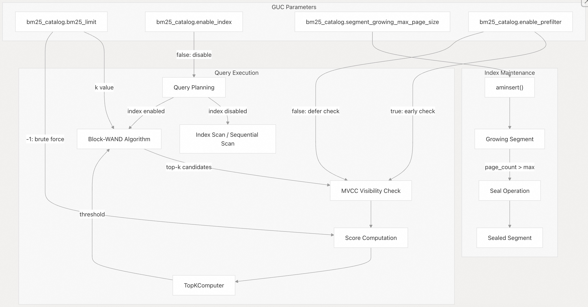

## VectorChord-bm25 源码学习: 3.2 配置 (Configuration)  
                                                      
### 作者                                                      
digoal                                                      
                                                      
### 日期                                                      
2025-11-24                                                      
                                                      
### 标签                                                      
VectorChord-bm25 , 源码学习 , 全文检索 , 关键词检索 , TF , IDF , 相关性排序 , ranking , Block-WeakAnd , Block-WAND , tsvector , ts_rank                                                        
                                                      
----                                                      
                                                      
## 背景                               
本文档描述了 **VectorChord-BM25 (向量弦-BM25)** 中可用的**配置参数 (GUCs，Grand Unified Configuration)** ，用于控制**索引行为 (Index Behavior)** 、**查询优化 (Query Optimization)** 和**性能调优 (Performance Tuning)** 。这些参数允许用户在运行时自定义 **BM25 索引 (BM25 Index)** 的操作方式。  
  
## GUC 参数概览 (GUC Parameters Overview)  
  
**VectorChord-BM25** 使用 **PostgreSQL 的 Grand Unified Configuration (GUC，大统一配置) 系统**来公开运行时参数。所有参数都命名在 `bm25_catalog.*` 命名空间下，并使用 `GucContext::Userset` 定义，这意味着它们可以按**会话级别 (Session Level)** 修改，而无需超级用户权限或服务器重启。  
  
参数可以在多个级别设置：  
  
**会话级别 (Session Level):**  
  
```sql  
SET bm25_catalog.bm25_limit = 200;  
```  
  
**事务级别 (Transaction Level):**  
  
```sql  
BEGIN;  
SET LOCAL bm25_catalog.bm25_limit = 50;  
-- ... queries ...  
COMMIT;  
```  
  
**用户/数据库级别 (User/Database Level):**  
  
```sql  
ALTER DATABASE mydb SET bm25_catalog.segment_growing_max_page_size = 8192;  
ALTER ROLE myuser SET bm25_catalog.enable_prefilter = false;  
```  
  
**当前值查询 (Current Value Query):**  
  
```sql  
SHOW bm25_catalog.bm25_limit;  
```  
  
**来源:**  
[`src/guc.rs` 1-45](https://github.com/tensorchord/VectorChord-bm25/blob/da0908a6/src/guc.rs#L1-L45)  
[`README.md` 462-466](https://github.com/tensorchord/VectorChord-bm25/blob/da0908a6/README.md#L462-L466)  
  
-----  
  
## 参数参考 (Parameter Reference)  
  
### `bm25_catalog.bm25_limit`  
  
**类型 (Type):** `integer`  
**默认值 (Default):** `100`  
**范围 (Range):** `-1` to `65535`  
**上下文 (Context):** `Userset`  
  
控制 **Block-WAND (块-WAND) 算法**在**索引扫描 (index scans)** 期间返回的**得分最高文档 (top-scoring documents)** 的最大数量。此参数直接影响**查询执行策略 (query execution strategy)** ：  
  
| 值 (Value) | 行为 (Behavior) |  
| :--- | :--- |  
| `-1` | **暴力扫描 (Brute force scan)** ：对所有文档评分，返回所有得分 \> 0 的结果 |  
| `1` 到 `65535` | **Top-k (前 k) 检索**：使用 **Block-WAND 优化 (optimization)** 来高效查找前 k 个结果 |  
  
**何时调整 (When to Adjust):**  
  
  * **增加 (Increase)** ：当您的查询使用大于 100 的 `LIMIT` 值，或应用了额外的过滤器 (filters) 可能会淘汰许多 **Top-k 候选 (Top-k candidates)** 时。  
  * **减少 (Decrease)** ：对于只需要少量结果的查询，以减少内存使用。  
  * **设置为 -1**：当您需要**完整的结 果集 (complete result sets)** 或正在调试**评分行为 (scoring behavior)** 时。  
  
**性能影响 (Performance Impact):**  
**Block-WAND 算法**根据第 k 个最佳分数维护一个**动态阈值 (dynamic threshold)** 。当 `bm25_limit` 较小时，阈值会迅速上升，从而允许更积极的**块跳过 (block skipping)** 。较大的限制需要对更多文档进行评分，但与暴力扫描 (`-1`) 相比，仍然受益于**块跳过**。  
  
**示例 (Example):**  
  
```sql  
-- Query with large LIMIT and additional filters  
SET bm25_catalog.bm25_limit = 500;  
SELECT id, passage   
FROM documents   
WHERE category = 'tech'  
ORDER BY embedding <&> to_bm25query('documents_embedding_bm25', tokenize('database', 'bert'))  
LIMIT 100;  -- May need 500 candidates before filtering to get 100 results  
```  
  
**来源:**  
[`src/guc.rs` 3-18](https://github.com/tensorchord/VectorChord-bm25/blob/da0908a6/src/guc.rs#L3-L18)  
[`README.md` 464](https://github.com/tensorchord/VectorChord-bm25/blob/da0908a6/README.md#L464-L464)  
  
-----  
  
### `bm25_catalog.enable_index`  
  
**类型 (Type):** `boolean`  
**默认值 (Default):** `true`  
**上下文 (Context):** `Userset`  
  
全局启用或禁用 **BM25 索引 (BM25 indexes)** 用于查询执行。禁用时，查询将退回到**顺序扫描 (sequential scans)** 。  
  
**何时调整 (When to Adjust):**  
  
  * **禁用 (Disable)** ：强制使用**顺序扫描**进行调试或比较索引与非索引性能。  
  * **暂时禁用 (Disable temporarily)** ：在**批量加载 (bulk loading)** 数据时，以避免索引开销。  
  * 在生产环境中通常保持 `true`。  
  
**性能影响 (Performance Impact):**  
禁用索引会强制对每个查询进行**全表扫描 (full table scans)** ，并进行**内存中 BM25 评分 (in-memory BM25 scoring)** 。除了测试或故障排除场景外，通常不希望这样做。  
  
**示例 (Example):**  
  
```sql  
-- Compare index vs. sequential scan performance  
SET bm25_catalog.enable_index = false;  
EXPLAIN ANALYZE   
SELECT * FROM documents   
ORDER BY embedding <&> to_bm25query('documents_embedding_bm25', tokenize('search', 'bert'))  
LIMIT 10;  
```  
  
**来源:**  
[`src/guc.rs` 4-26](https://github.com/tensorchord/VectorChord-bm25/blob/da0908a6/src/guc.rs#L4-L26)  
[`README.md` 465](https://github.com/tensorchord/VectorChord-bm25/blob/da0908a6/README.md#L465-L465)  
  
-----  
  
### `bm25_catalog.segment_growing_max_page_size`  
  
**类型 (Type):** `integer`  
**默认值 (Default):** `4096`  
**范围 (Range):** `1` to `1,000,000`  
**上下文 (Context):** `Userset`  
  
定义一个**增长中的段 (Growing Segment)** 在被密封为**只读密封段 (read-only Sealed Segment)** 之前，可以占用的 **PostgreSQL 页面 (PostgreSQL pages)** 的最大数量。此参数控制**写入性能 (write performance)** 和**读取优化 (read optimization)** 之间的权衡。  
  
**段架构 (Segment Architecture):**  
  
  * **增长中的段 (Growing Segments)** ：使用简单的**链表页面结构 (linked-list page structure)** 以实现快速插入。  
  * **密封段 (Sealed Segments)** ：使用**压缩的倒排列表 (compressed posting lists)** 和 **Block-WAND 优化 (optimization)** 以实现高效查询。  
  
**密封过程 (sealing process)** 会压缩**倒排索引 (inverted index)** ，为**块最大分数 (block-max scores)** 构建**跳过信息 (skip information)** ，并优化数据结构以提高**读取性能 (read performance)** 。有关实现细节，请参阅 [段管理 (Segment Management)](https://www.google.com/search?q=/tensorchord/VectorChord-bm25/4.2-segment-management)。  
  
**何时调整 (When to Adjust):**  
  
| 场景 (Scenario) | 建议值 (Recommended Value) | 理由 (Rationale) |  
| :--- | :--- | :--- |  
| **写入密集型工作负载 (Write-heavy workload)** | `8192` - `100000` | 减少密封开销，减少密封段数量 |  
| **读取密集型工作负载 (Read-heavy workload)** | `1024` - `4096` | 更频繁的密封，更好的查询性能 |  
| **批量加载后查询 (Bulk load then query)** | `100000+` | 在加载期间最小化密封，在结束时密封一次 |  
| **均衡的工作负载 (Balanced workload)** | `4096` (默认) | 在写入和读取性能之间取得良好平衡 |  
  
**性能影响 (Performance Impact):**  
  
  * **值越大 (Larger values)** ：密封操作越少（密封操作是昂贵的），但查询必须在**增长中的段**中扫描更多数据（ **增长中的段**缺乏压缩和**跳过结构 (skip structures)** ）。  
  * **值越小 (Smaller values)** ：密封越频繁（**写入放大 (write amplification)** 越高），但查询会更快地受益于**优化的密封段 (optimized sealed segments)** 。  
  
**示例 (Example):**  
  
```sql  
-- Bulk loading scenario: delay sealing  
SET bm25_catalog.segment_growing_max_page_size = 100000;  
COPY documents FROM '/data/large_dataset.csv';  
  
-- Manually trigger sealing by creating many small growing segments  
SET bm25_catalog.segment_growing_max_page_size = 100;  
-- Subsequent inserts will cause more frequent sealing  
```  
  
**来源:**  
[`src/guc.rs` 5-36](https://github.com/tensorchord/VectorChord-bm25/blob/da0908a6/src/guc.rs#L5-L36)  
[`README.md` 466](https://github.com/tensorchord/VectorChord-bm25/blob/da0908a6/README.md#L466-L466)  
  
-----  
  
### `bm25_catalog.enable_prefilter`  
  
**类型 (Type):** `boolean`  
**默认值 (Default):** `true`  
**上下文 (Context):** `Userset`  
  
控制在 **Block-WAND** 执行期间，以及在**完整文档评分 (full document scoring)** 之前，是否执行 **MVCC (Multi-Version Concurrency Control，多版本并发控制) 可见性检查 (Visibility checks)** 。此功能被称为 **“预过滤 (prefiltering)”** ，因为它在查询管道的早期就过滤掉了 **不可见元组 (non-visible tuples)** 。  
  
**启用时 (`true`):**  
扫描在通过 **Block-WAND 算法**识别候选文档后，会立即检查**元组可见性 (tuple visibility)** （使用 **PostgreSQL 的 MVCC 规则**），然后才计算其 **BM25 分数**。这可以防止在对当前事务不可见的元组上浪费**评分计算 (scoring computation)** 。  
  
**禁用时 (`false`):**  
**可见性检查**被推迟到最终结果集返回给执行器时。所有候选文档都会被评分，无论可见性如何，**不可见元组 (non-visible tuples)** 稍后才会被过滤掉。  
  
**何时调整 (When to Adjust):**  
  
  * **保持启用 (默认)** ：对于具有频繁更新/删除的表，其中可能存在许多**不可见元组 (non-visible tuples)** 。  
  * **禁用 (Disable)** ：对于**只读 (read-only)** 或**仅追加 (append-only)** 的表，其中几乎所有元组都是可见的，以避免早期**可见性检查**的开销。  
  
**性能影响 (Performance Impact):**  
**预过滤 (Prefiltering)** 在以下情况下最有利：  
  
1.  表具有大量的**死元组 (dead tuples)** 或最近的更新。  
2.  `bm25_limit` 相对较小。  
3.  **可见性检查**比 **BM25 分数计算**便宜。  
  
**可见性检查**的开销很小，因此默认值 (`true`) 适用于大多数工作负载。  
  
**来源:**  
[`src/guc.rs` 6-44](https://github.com/tensorchord/VectorChord-bm25/blob/da0908a6/src/guc.rs#L6-L44)  
  
-----  
  
## 配置影响图 (Configuration Impact Diagram)  
  
下图显示了 **GUC 参数**如何影响 **VectorChord-BM25 系统**的不同组件：  
  
  
  
**来源:**  
[`src/guc.rs` 1-45](https://github.com/tensorchord/VectorChord-bm25/blob/da0908a6/src/guc.rs#L1-L45)  
  
-----  
  
## GUC 注册与实现 (GUC Registration and Implementation)  
  
下表将每个 **GUC 参数**映射到其在代码库中的实现：  
  
| 参数 (Parameter) | 静态变量 (Static Variable) | 注册函数 (Registration Function) | 在扫描中有效 (Valid in Scan) | 在插入中有效 (Valid in Insert) |  
| :--- | :--- | :--- | :--- | :--- |  
| `bm25_catalog.bm25_limit` | `BM25_LIMIT` | `GucRegistry::define_int_guc` at line 9-18 | ✓ | ✗ |  
| `bm25_catalog.enable_index` | `ENABLE_INDEX` | `GucRegistry::define_bool_guc` at line 19-26 | ✓ | ✗ |  
| `bm25_catalog.segment_growing_max_page_size` | `SEGMENT_GROWING_MAX_PAGE_SIZE` | `GucRegistry::define_int_guc` at line 27-36 | ✗ | ✓ |  
| `bm25_catalog.enable_prefilter` | `ENABLE_PREFILTER` | `GucRegistry::define_bool_guc` at line 37-44 | ✓ | ✗ |  
  
所有 **GUC** 均通过在 [`src/guc.rs` 3-6](https://github.com/tensorchord/VectorChord-bm25/blob/da0908a6/src/guc.rs#L3-L6) 定义的静态 `GucSetting<T>` 变量访问。`.get()` 方法在执行期间检索当前值。  
  
**来源:**  
[`src/guc.rs` 1-45](https://github.com/tensorchord/VectorChord-bm25/blob/da0908a6/src/guc.rs#L1-L45)  
  
-----  
  
## 常见配置场景 (Common Configuration Scenarios)  
  
### 高吞吐量写入工作负载 (High-Throughput Write Workload)  
  
**目标 (Goal):** 最小化**写入延迟 (write latency)** 并最大化**插入吞吐量 (insertion throughput)**  
  
```sql  
-- Delay segment sealing to reduce write amplification  
SET bm25_catalog.segment_growing_max_page_size = 50000;  
  
-- During bulk loading, optionally disable index temporarily  
BEGIN;  
SET LOCAL bm25_catalog.enable_index = false;  
COPY documents FROM '/data/bulk_load.csv';  
COMMIT;  
  
-- Re-enable index for subsequent operations  
SET bm25_catalog.enable_index = true;  
```  
  
| 参数 (Parameter) | 值 (Value) | 理由 (Rationale) |  
| :--- | :--- | :--- |  
| `bm25_catalog.segment_growing_max_page_size` | `65536` | 减少昂贵的**密封 (sealing)** 操作。 |  
| `bm25_catalog.enable_index` | `true` | 通常保持启用，但可以在**批量加载 (Bulk load)** 期间设置为 `false`。 |  
  
-----  
  
### 低延迟查询工作负载 (Low-Latency Query Workload)  
  
**目标 (Goal):** 优化以实现快速**查询响应时间 (query response times)**  
  
```sql  
-- Seal segments frequently for better query performance  
SET bm25_catalog.segment_growing_max_page_size = 2048;  
  
-- Reduce top-k limit to increase block skipping  
SET bm25_catalog.bm25_limit = 50;  
  
-- Enable prefilter to skip non-visible tuples early  
SET bm25_catalog.enable_prefilter = true;  
```  
  
| 参数 (Parameter) | 值 (Value) | 理由 (Rationale) |  
| :--- | :--- | :--- |  
| `bm25_catalog.segment_growing_max_page_size` | `1024` | 更频繁地**密封段 (seal segments)** ，以更快地将**倒排列表 (posting lists)** 转换为优化的 **Block-WAND 结构**。 |  
| `bm25_catalog.bm25_limit` | `50` | 如果只需要少量结果，请减小限制以提高 **Block-WAND** 效率。 |  
  
-----  
  
### 完整结果集查询 (Complete Result Set Queries)  
  
**目标 (Goal):** 返回所有匹配文档，不受 **Top-k 限制 (top-k limitation)**  
  
```sql  
-- Use brute force to score all documents  
SET bm25_catalog.bm25_limit = -1;  
  
-- Example: Find all documents with any relevance to query  
SELECT id, passage,   
       embedding <&> to_bm25query('documents_embedding_bm25', tokenize('search', 'bert')) AS score  
FROM documents  
WHERE embedding <&> to_bm25query('documents_embedding_bm25', tokenize('search', 'bert')) > -1.0  
ORDER BY score;  
```  
  
| 参数 (Parameter) | 值 (Value) | 理由 (Rationale) |  
| :--- | :--- | :--- |  
| `bm25_catalog.bm25_limit` | `-1` | 强制使用**暴力扫描 (Brute force scan)** 模式。 |  
| `bm25_catalog.enable_prefilter` | `false` | 对于**暴力扫描**，**预过滤 (prefilter)** 的收益较小，可以禁用以减少开销。 |  
  
-----  
  
### 调试和性能分析 (Debugging and Performance Analysis)  
  
**目标 (Goal):** 比较不同的**执行策略 (execution strategies)**  
  
```sql  
-- Baseline: with index  
EXPLAIN (ANALYZE, BUFFERS)   
SELECT * FROM documents   
ORDER BY embedding <&> to_bm25query('documents_embedding_bm25', tokenize('query', 'bert'))  
LIMIT 10;  
  
-- Compare: without index  
SET bm25_catalog.enable_index = false;  
EXPLAIN (ANALYZE, BUFFERS)   
SELECT * FROM documents   
ORDER BY embedding <&> to_bm25query('documents_embedding_bm25', tokenize('query', 'bert'))  
LIMIT 10;  
  
-- Compare: brute force with index  
SET bm25_catalog.enable_index = true;  
SET bm25_catalog.bm25_limit = -1;  
EXPLAIN (ANALYZE, BUFFERS)   
SELECT * FROM documents   
ORDER BY embedding <&> to_bm25query('documents_embedding_bm25', tokenize('query', 'bert'))  
LIMIT 10;  
```  
  
| 参数 (Parameter) | 值 (Value) | 理由 (Rationale) |  
| :--- | :--- | :--- |  
| `bm25_catalog.enable_index` | `false` | 强制**顺序扫描 (sequential scan)** 以基准测试没有索引时的 **BM25 评分**。 |  
| `bm25_catalog.bm25_limit` | `1` | 严格限制结果，测试 **Block-WAND** 在小 k 值时的最大效率。 |  
  
-----  
  
## 配置持久化 (Configuration Persistence)  
  
使用 `SET` 设置的 **GUC 值**是**会话特定 (session-specific)** 的，并在会话结束时丢失。要使配置更改**持久化 (persistent)** ：  
  
**数据库级别 (Database Level):**  
  
```sql  
ALTER DATABASE mydb SET bm25_catalog.bm25_limit = 200;  
-- All new connections to mydb will inherit this value  
```  
  
**用户级别 (User Level):**  
  
```sql  
ALTER ROLE analytics_user SET bm25_catalog.enable_prefilter = false;  
-- All sessions by analytics_user will use this value  
```  
  
**系统级别 (postgresql.conf):**  
  
```  
# 不推荐 - 请改用数据库/角色级别  
# Not recommended - use database/role level instead  
bm25_catalog.bm25_limit = 200  
```  
  
设置**数据库级别**或**角色级别默认值**后，现有会话必须**重新连接 (reconnect)** 才能获取新值。  
  
**来源:**  
[`src/guc.rs` 8-45](https://github.com/tensorchord/VectorChord-bm25/blob/da0908a6/src/guc.rs#L8-L45)  
  
-----  
  
## 参数交互矩阵 (Parameter Interaction Matrix)  
  
此矩阵显示了不同的 **GUC 参数组合**如何影响**系统行为 (system behavior)** ：  
  
| `enable_index` | `bm25_limit` | 执行路径 (Execution Path) | 用例 (Use Case) |  
| :--- | :--- | :--- | :--- |  
| `true` | `> 0` | **Block-WAND** with **Top-k** | 正常查询 (默认) |  
| `true` | `-1` | **Brute force** with index structures | 完整结果集 |  
| `false` | any | **Sequential scan** + **scoring** | 调试，小表 |  
  
| `segment_growing_max_page_size` | 插入模式 (Insertion Pattern) | 结果 (Result) |  
| :--- | :--- | :--- |  
| Small (`< 4096`) | Frequent small batches | Many small sealed segments |  
| Large (`> 10000`) | **Bulk loading** | Few large sealed segments |  
| Default (`4096`) | Mixed workload | Balanced performance |  
  
**来源:**  
[`src/guc.rs` 1-45](https://github.com/tensorchord/VectorChord-bm25/blob/da0908a6/src/guc.rs#L1-L45)  
[`README.md` 462-466](https://github.com/tensorchord/VectorChord-bm25/blob/da0908a6/README.md#L462-L466)  
    
-----  
  
# 附录1: 写入放大与查询效率的平衡点在哪里？（Segment 密封策略）  
  
这个核心问题针对的是日常维护和**写入放大 (Write Amplification)** 的痛点。  
  
* **痛点背景：** 配置文档介绍了 `bm25_catalog.segment_growing_max_page_size` 参数，它决定了**增长中的段 (Growing Segment)** 何时被密封成**密封段 (Sealed Segment)** 。密封操作虽然能提高查询效率（因为**密封段**包含优化的 **Block-WAND 结构**），但它本身是一个昂贵的写操作，会导致**写入放大**。  
* **需要展开的细节：**  
    * 对于常见的混合型或周期性批量加载 (Bulk Load) 的工作负载，如何量化和判断当前的 `segment_growing_max_page_size` (默认 4096) 是否合适？  
    * 在什么情况下（例如，插入速度 / 查询频率的比例达到多少），我们应该倾向于使用更大的值（优化写入），在什么情况下应该使用更小的值（优化查询）？  
    * 是否存在监控指标（例如，每日密封段的数量、平均写入延迟、查询耗时）可以帮助用户找到这个最佳平衡点？  
  
## 回答  
  
您的问题是关于 `bm25_catalog.segment_growing_max_page_size` 参数的调优,该参数控制增长段(Growing Segment)何时被密封成密封段(Sealed Segment)。    
  
## 写入放大的机制  
  
当增长段达到 `segment_growing_max_page_size` 页数时,`aminsert` 函数会触发密封操作:    
  
密封过程包括:    
  
1. 读取整个增长段的所有文档  
2. 构建 `InvertedWriter` 并重新处理所有向量  
3. 压缩成 Block-WAND 优化的密封段  
4. 释放旧的增长段页面  
  
这个过程确实会产生写入放大,因为需要重写所有数据。  
  
## 如何判断参数是否合适  
  
**目前代码中没有内置的监控指标**来帮助判断该参数是否合适。代码中只定义了参数本身:    
  
要量化判断,您需要从外部监控:  
  
1. **密封频率**: 通过 PostgreSQL 日志或自定义触发器跟踪密封操作的频率  
2. **写入延迟**: 监控 INSERT 操作的延迟,密封时会有明显的延迟峰值  
3. **查询性能**: 测量查询响应时间,增长段越大查询越慢(因为需要线性扫描)    
  
## 参数调优建议  
  
**使用更大值(优化写入)的场景:**  
- 批量加载为主,查询频率低  
- 可以容忍较长的查询延迟  
- 写入吞吐量是瓶颈  
  
**使用更小值(优化查询)的场景:**  
- 混合工作负载,查询频繁  
- 需要稳定的查询性能  
- 可以容忍写入时的偶发延迟峰值  
  
**权衡点:**  
- 默认 4096 页约为 32MB (假设 8KB 页大小)  
- 更大的值减少密封频率但增加查询时增长段扫描成本  
- 更小的值增加密封频率但保持查询性能稳定  
  
## Notes  
  
代码中没有提供自动调优或监控功能。您需要根据实际工作负载进行实验性调优。建议从默认值开始,通过外部监控工具(如 pg_stat_statements)观察写入和查询性能,然后逐步调整。  
  
vacuum 操作会重新计算统计信息但不会触发段重组:    
  
  
  
-----  
  
# 附录2: 在 Top-k 限制和查询准确性之间如何取舍？（`bm25_limit` 与 Block-WAND）  
  
这个问题针对的是**查询性能优化 (Query Performance Tuning)** 的核心机制。  
  
* **背景知识：** `bm25_catalog.bm25_limit` (默认 100) 控制了 **Block-WAND 算法**检索的文档上限（即 k 值）。Block-WAND 是一种**剪枝优化 (pruning optimization)** 技术，限制 k 值能显著提高性能，但可能牺牲召回率和准确性。  
* **需要展开的细节：**  
    * 如果用户在 SQL 查询中使用了 `LIMIT 50`，那么是否将 `bm25_limit` 设置为 50 就足够？文档提到“当查询使用大于 100 的 `LIMIT` 值或应用了额外的过滤器时，应增加此值”，如何预估“额外的过滤器”对 Top-k 候选的影响？  
    * 当需要高召回率时（即需要结果集完整），除了直接设置为 `-1` (暴力扫描) 之外，是否有其他推荐的**日常使用或维护动作**（例如，提高到远超预期的值，如 10000）来在保证性能的同时提高召回率？  
    * “当 `bm25_limit` 很小时，动态阈值会迅速上升”，这个机制具体是如何工作的？用户如何监控查询的“动态阈值”或**块跳过 (Block Skipping)** 效率？  
  
## 回答  
  
您的问题聚焦于 VectorChord-BM25 中 `bm25_catalog.bm25_limit` 参数与 Block-WAND 算法的性能权衡机制。    
  
## `bm25_limit` 与 SQL `LIMIT` 的关系  
  
**当 SQL 查询使用 `LIMIT 50` 时，设置 `bm25_limit = 50` 通常不够。**    
  
原因在于 Block-WAND 算法在索引扫描阶段返回 top-k 候选文档给 PostgreSQL 执行器，但这些候选文档可能在后续的过滤条件（`WHERE` 子句）中被过滤掉。    
  
**预估过滤器影响的经验法则：**  
- 如果有 `WHERE` 条件预计过滤掉 50% 的结果，应设置 `bm25_limit = SQL_LIMIT * 2`  
- 对于多个过滤条件，需要估算联合选择率（selectivity）  
- 保守策略：设置为 SQL `LIMIT` 的 3-5 倍  
  
例如，在测试文件中，`bm25_limit=3` 配合 `WHERE condition = TRUE` 过滤条件，最终只返回 2-3 条结果。    
  
## 高召回率场景的推荐策略  
  
**除了 `bm25_limit = -1` 暴力扫描外，推荐的中间策略：**  
  
1. **设置较大的 k 值（如 10000）** ：这是平衡性能和召回率的实用方法。Block-WAND 仍会进行块跳过优化，但阈值上升较慢，减少误剪枝。    
  
2. **启用 prefilter**：`bm25_catalog.enable_prefilter = true`（默认值）可以在 Block-WAND 执行期间提前进行 MVCC 可见性检查，避免对不可见元组进行无效评分。    
  
3. **调整段封存参数**：增大 `segment_growing_max_page_size` 可以减少封存频率，但会降低查询性能。对于读多写少的场景，保持默认值 4096 或更小值（如 2048）以优化查询。    
  
**性能对比：**  
- `bm25_limit = -1`：扫描所有文档，返回所有得分 > 0 的结果，无块跳过优化    
- `bm25_limit = 10000`：仍使用 Block-WAND，但阈值上升缓慢，保留更多候选  
  
## 动态阈值机制详解  
  
**阈值如何工作：**  
  
`TopKComputer` 维护一个大小为 2k 的缓冲区，当缓冲区满时，通过快速选择算法找到第 k 大的分数作为新阈值。    
  
**阈值上升过程：**  
1. 初始阈值为 0.0    
2. 每次 `push()` 新文档时，如果缓冲区满（达到 2k），执行 `truncate_top_k()` 更新阈值为第 k 大分数    
3. 当 k 值小时，缓冲区快速填满，阈值快速上升  
  
**块跳过决策：**  
  
在 Block-WAND 中，对于每个块，算法计算 `block_max_score`（该块中任何文档的最大可能得分）。如果 `block_max_score <= threshold`，则跳过整个块。    
  
对于多词查询，算法还会计算所有参与词项的 `block_max_score` 总和，如果总和仍低于阈值，则通过 `block_max_was_too_low_advance_one_scorer()` 策略性地推进得分最高的词项。    
  
## 监控块跳过效率  
  
**目前代码中没有内置的监控机制**，但您可以通过以下方式间接评估：  
  
1. **使用 `EXPLAIN ANALYZE`**：比较不同 `bm25_limit` 值下的查询执行时间  
2. **对比暴力扫描**：设置 `bm25_limit = -1` 作为基准，测量块跳过带来的加速比  
3. **测试不同 k 值**：观察 k 值从 10 → 100 → 1000 → 10000 的性能变化曲线  
  
**示例测试：**  
```sql  
-- 基准：暴力扫描  
SET bm25_catalog.bm25_limit = -1;  
EXPLAIN (ANALYZE, BUFFERS) SELECT ... ORDER BY ... LIMIT 10;  
  
-- 测试：不同 k 值  
SET bm25_catalog.bm25_limit = 100;  
EXPLAIN (ANALYZE, BUFFERS) SELECT ... ORDER BY ... LIMIT 10;  
```  
  
## Notes  
  
- Block-WAND 的块大小固定为 128 个文档，这是在 `PostingCursor` 实现中硬编码的  
- `enable_prefilter` 参数在有大量死元组或频繁更新的表上特别有效，可以避免对不可见元组进行 BM25 评分    
- 单词查询会自动使用优化的 `block_wand_single()` 函数，避免 pivot 选择和对齐开销    
  
  
-----  
  
# 附录3: MVCC 预过滤 (`enable_prefilter`) 的实际开销有多大？  
  
这个问题涉及高并发/高更新场景下的**细节优化 (Detail Optimization)** 和**事务可见性**。  
  
* **背景痛点：** 文档提到 `bm25_catalog.enable_prefilter` (默认 `true`) 可以避免对**不可见元组 (non-visible tuples)** 进行浪费的 BM25 评分。但同时又提到对于“只读或仅追加的表，可以禁用以避免开销”。  
* **需要展开的细节：**  
    * 在更新/删除频繁的场景下，**可见性检查 (Visibility checks)** 相比于**BM25 分数计算**，其性能开销的量级对比如何？用户如何判断自己的工作负载是否属于“可见性检查比 BM25 分数计算便宜”的情况？  
    * 对于并发事务较多的场景，如果禁用**预过滤** (`false`)，是否会增加查询在最终结果集过滤阶段的延迟，以及是否可能导致**死锁 (deadlock)** 或其他并发问题？  
    * 对于那些包含大量**死元组 (dead tuples)** 的表，除了依赖 **Prefilter** 之外，是否有配套的**维护动作**（例如，更频繁地运行 `VACUUM`）来更有效地管理 MVCC 负担？  
  
## 回答  
  
您的问题涉及 VectorChord-BM25 中 `bm25_catalog.enable_prefilter` 参数在高并发/高更新场景下的性能权衡。    
  
## 可见性检查 vs BM25 分数计算的性能开销对比  
  
### 可见性检查的实现  
  
当 `enable_prefilter` 为 `true` 时,在 Block-WAND 算法执行期间会调用 `check()` 函数进行 MVCC 可见性检查  。该函数包含两个主要步骤:  
  
1. **MVCC 检查** (`check_mvcc`): 调用 PostgreSQL 的 `index_fetch_tuple` 来验证元组对当前快照的可见性    
2. **谓词检查** (`check_quals`): 执行额外的 WHERE 条件过滤    
  
### BM25 分数计算的实现  
  
BM25 评分涉及:  
- 读取 field norm (文档长度归一化)    
- 计算 TF-IDF 权重和最终分数    
  
### 性能开销量级判断  
  
**可见性检查更便宜的场景:**  
- 表有大量死元组(dead tuples)或最近更新的行  
- `bm25_limit` 较小(如默认的 100)  
- 查询词项(terms)较多,BM25 计算复杂度高  
  
**BM25 计算更便宜的场景:**  
- 只读或仅追加表,几乎所有元组都可见  
- 简单的单词项查询  
- 可见性检查需要访问堆页面(heap page),可能导致额外 I/O  
  
您可以通过测试来判断:禁用 prefilter 后如果查询性能提升,说明可见性检查开销较大  。  
  
## 禁用预过滤的并发影响  
  
### 延迟影响  
  
禁用 prefilter (`false`) 时,所有候选文档都会被评分,不可见元组的过滤延迟到最终结果返回阶段  。这会导致:  
  
1. **浪费的计算**: 对不可见元组进行无用的 BM25 评分  
2. **可能的结果不足**: 如果 top-k 候选中有很多不可见元组,最终返回的结果可能少于 `LIMIT` 要求的数量    
  
### 死锁风险  
  
**不会导致死锁**。VectorChord-BM25 的查询路径只持有 `AccessShareLock`  ,这是读锁,不会与其他读操作冲突。可见性检查通过 PostgreSQL 的快照隔离机制实现,不涉及额外的锁获取。  
  
## 死元组管理的维护动作  
  
### VACUUM 操作  
  
VectorChord-BM25 实现了 `ambulkdelete` 和 `amvacuumcleanup` 回调来支持 VACUUM  :  
  
1. **ambulkdelete**: 标记删除的元组,更新 delete bitmap    
2. **amvacuumcleanup**: 重新计算词项统计(term statistics),排除已删除的文档    
  
### 维护建议  
  
对于高更新场景:  
  
1. **定期 VACUUM**: 更频繁地运行 `VACUUM` 来更新 delete bitmap 和词项统计  
2. **调整 segment 参数**: 考虑减小 `segment_growing_max_page_size` 以更频繁地封存(seal)段,使死元组信息更快反映到优化的 sealed segment 中    
3. **监控 delete bitmap**: 当删除率高时,VACUUM 的效果更明显  
  
**注意**: 当前实现中,VACUUM 只更新 delete bitmap 和统计信息,不会物理重建索引段来回收空间。对于大量死元组的情况,可能需要 `REINDEX` 来完全重建索引。  
  
## Notes  
  
测试文件 `prefilter.slt` 展示了 prefilter 的实际效果:启用时返回 3 个结果,禁用时只返回 2 个结果  ,说明禁用 prefilter 会因为不可见元组占用 top-k 位置而导致最终结果不足。  
    
#### [PolarDB 学习图谱](https://www.aliyun.com/database/openpolardb/activity "8642f60e04ed0c814bf9cb9677976bd4")
  
  
#### [PostgreSQL 解决方案集合](../201706/20170601_02.md "40cff096e9ed7122c512b35d8561d9c8")
  
  
#### [德哥 / digoal's Github - 公益是一辈子的事.](https://github.com/digoal/blog/blob/master/README.md "22709685feb7cab07d30f30387f0a9ae")
  
  
#### [About 德哥](https://github.com/digoal/blog/blob/master/me/readme.md "a37735981e7704886ffd590565582dd0")
  
  

  
