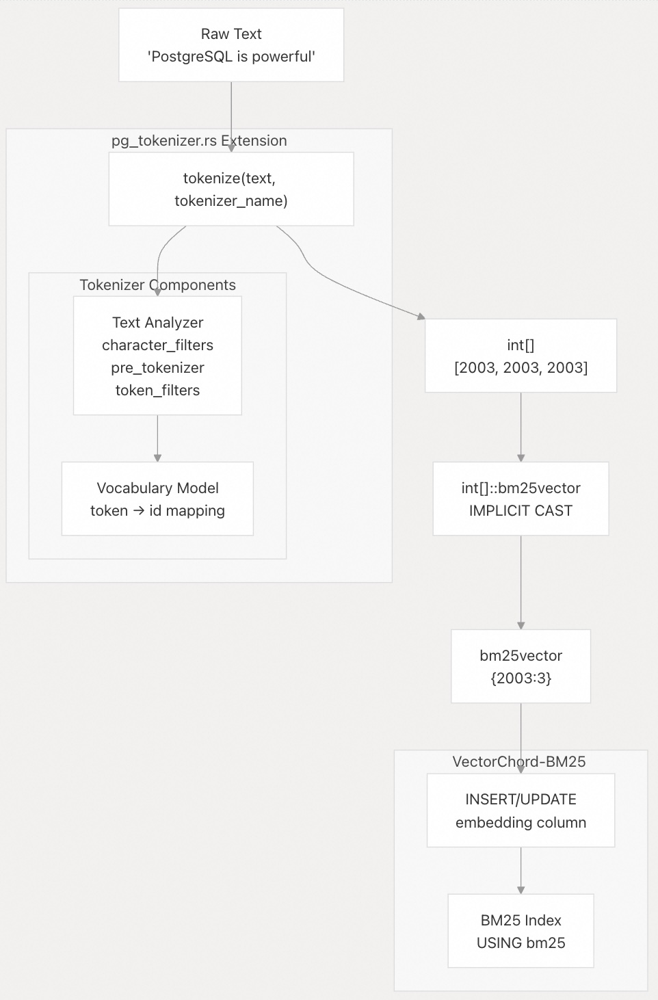
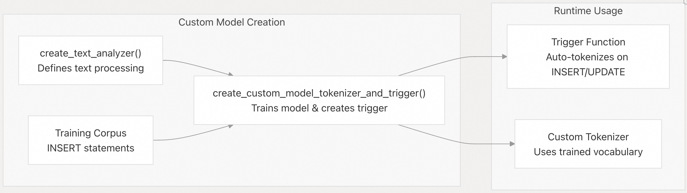
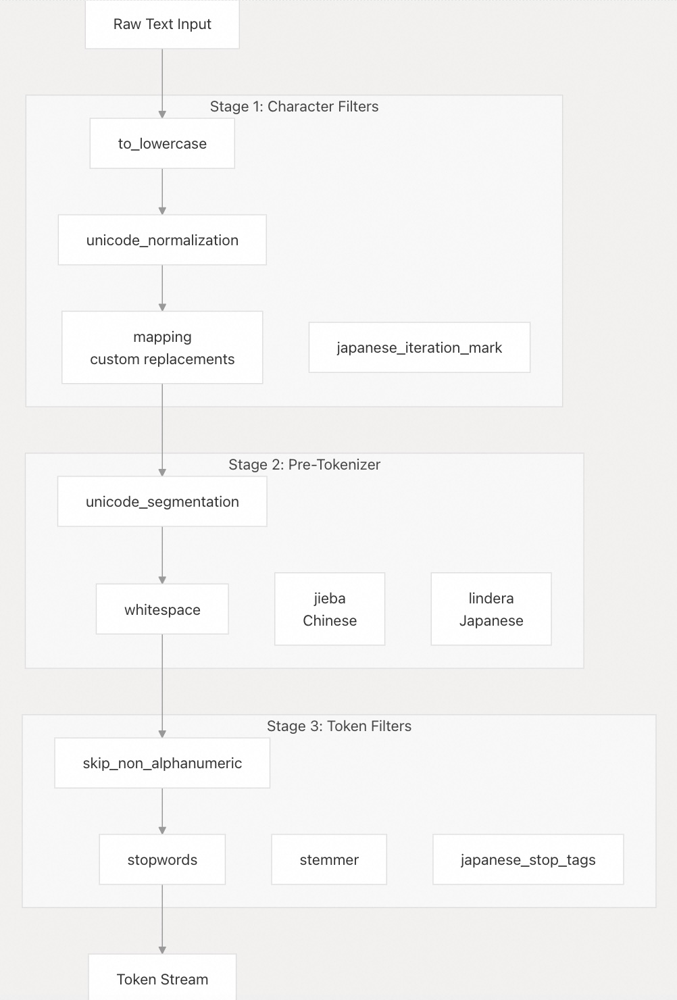
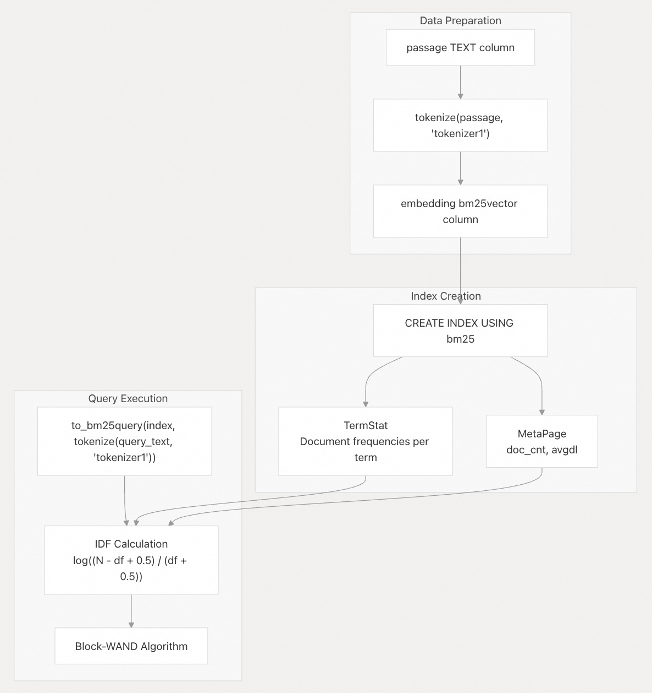

## VectorChord-bm25 源码学习: 3.3 分词 (Tokenization)  
                                                        
### 作者                                                        
digoal                                                        
                                                        
### 日期                                                        
2025-11-24                                                        
                                                        
### 标签                                                        
VectorChord-bm25 , 源码学习 , 全文检索 , 关键词检索 , TF , IDF , 相关性排序 , ranking , Block-WeakAnd , Block-WAND , tsvector , ts_rank                                                          
                                                        
----                                                        
                                                        
## 背景                                 
本文档描述了文本如何转换为 VectorChord-BM25 索引所使用的 `bm25vector` 格式。**分词 (Tokenization)** 由外部 **`pg_tokenizer.rs` 扩展 (extension)** 执行，该扩展提供了**预训练模型 (pre-trained models)** 和**自定义模型训练 (custom model training)** 功能。  
  
## 概述 (Overview)  
  
**分词 (Tokenization)** 是将**纯文本 (plain text)** 转换为 **BM25 索引 (BM25 index)** 可用于排名的**结构化表示 (structured representation)** 的过程。在 VectorChord-BM25 中，文本被转换为一个 `bm25vector`，这是一个包含**词元 ID (token ID)** 和**频率对 (frequency pairs)** 的**稀疏向量 (sparse vector)** 。例如，文本 "the quick brown fox" 可能会被分词为 `{1012:1, 2829:1, 3899:1, 4419:1}`，其中冒号前的每个数字是来自模型**词汇表 (vocabulary)** 的**词元 ID (token ID)** ，冒号后的数字是该词元在文本中的**频率 (frequency)** 。  
  
分词过程完全由 `pg_tokenizer.rs` 扩展处理，该扩展必须在使用 VectorChord-BM25 之前单独安装和启用。  
  
来源: [`README.md 11`](https://github.com/tensorchord/VectorChord-bm25/blob/da0908a6/README.md#L11-L11) [`README.md 35-37`](https://github.com/tensorchord/VectorChord-bm25/blob/da0908a6/README.md#L35-L37) [`README.md 41-56`](https://github.com/tensorchord/VectorChord-bm25/blob/da0908a6/README.md#L41-L56)  
  
## 分词流程 (Tokenization Pipeline)  
  
下图展示了从**原始文本 (raw text)** 到存储在 **BM25 索引 (BM25 index)** 中的可查询 `bm25vector` 的完整流程：  
  
    
  
**分词到 bm25vector 的转换流程图**  
  
该过程涉及几个关键步骤：  
  
1.  **分词 (Tokenization)** ：来自 `pg_tokenizer.rs` 的 `tokenize()` 函数通过配置的**文本分析器 (text analyzer)** 和模型处理文本，生成一个**词元 ID (token ID)** 数组。  
2.  **数组到向量的转换 (Array to Vector Conversion)** ：整数数组使用 [src/sql/finalize.sql 31-32](https://github.com/tensorchord/VectorChord-bm25/blob/da0908a6/src/sql/finalize.sql#L31-L32) 中定义的**转换 (cast)** 隐式转换为 `bm25vector`。这个转换函数 `_vchord_bm25_cast_array_to_bm25vector` 将重复的**词元 ID (token ID)** 聚合成**频率计数 (frequency counts)** ，并忽略词元顺序。  
3.  **存储 (Storage)** ：生成的 `bm25vector` 存储在一个表列中，通常命名为 `embedding`。  
4.  **索引 (Indexing)** ：当在 `embedding` 列上创建 **BM25 索引 (BM25 index)** 时，索引会收集 **BM25 评分 (BM25 scoring)** 所需的**全局术语统计信息 (global term statistics)** 。  
  
来源: [`README.md 48-56`](https://github.com/tensorchord/VectorChord-bm25/blob/da0908a6/README.md#L48-L56) [`src/sql/finalize.sql 31-32`](https://github.com/tensorchord/VectorChord-bm25/blob/da0908a6/src/sql/finalize.sql#L31-L32) [`README.md 84-92`](https://github.com/tensorchord/VectorChord-bm25/blob/da0908a6/README.md#L84-L92)  
  
## 分词器类型 (Tokenizer Types)  
  
VectorChord-BM25 支持两种主要的分词方法，均由 `pg_tokenizer.rs` 提供：  
  
### 预训练模型 (Pre-Trained Models)  
  
**预训练模型 (Pre-trained models)** 使用现有的**词汇表 (vocabularies)** ，适用于**通用文本处理 (general-purpose text processing)** 。常见的预训练模型包括：  
  
| 模型名称 (Model Name) | 用例 (Use Case) | 词汇表大小 (Vocabulary Size) | 内存占用 (Memory Usage) |  
| :--- | :--- | :--- | :--- |  
| `bert_base_uncased` | 英文文本，**不区分大小写 (case-insensitive)** | 约 30,000 个**词元 (tokens)** | 约 50MB |  
| `gemma2b` | **多语言支持 (Multilingual support)** | 可变 (Variable) | 约 100MB |  
| `llmlingua2` | 多语言（默认预加载） | 可变 (Variable) | 约 200MB |  
  
创建和使用预训练分词器：  
  
```sql  
-- Create tokenizer with pre-trained model  
SELECT create_tokenizer('bert', $$  
model = "bert_base_uncased"  
$$);  
  
-- Tokenize text  
SELECT tokenize('A quick brown fox jumps over the lazy dog.', 'bert')::bm25vector;  
-- Output: {1012:1, 1037:1, 1996:1, 2058:1, 2829:1, 3899:1, 4248:1, 4419:1, 13971:1, 14523:1}  
```  
  
来源: [`README.md 48-56`](https://github.com/tensorchord/VectorChord-bm25/blob/da0908a6/README.md#L48-L56) [`README.md 354-356`](https://github.com/tensorchord/VectorChord-bm25/blob/da0908a6/README.md#L354-L356) [`README.md 383`](https://github.com/tensorchord/VectorChord-bm25/blob/da0908a6/README.md#L383-L383)  
  
### 自定义模型 (Custom Models)  
  
**自定义模型 (Custom models)** 在**领域特定语料库 (domain-specific corpora)** 上进行训练，为**专业词汇 (specialized vocabulary)** 提供更好的准确性。该过程涉及三个主要组件：  
  
    
  
**自定义模型的创建和使用流程图**  
  
自定义模型配置示例：  
  
```sql  
-- Step 1: Create text analyzer  
SELECT create_text_analyzer('text_analyzer1', $$  
pre_tokenizer = "unicode_segmentation"  
[[character_filters]]  
to_lowercase = {}  
[[character_filters]]  
unicode_normalization = "nfkd"  
[[token_filters]]  
skip_non_alphanumeric = {}  
[[token_filters]]  
stopwords = "nltk_english"  
[[token_filters]]  
stemmer = "english_porter2"  
$$);  
  
-- Step 2: Create model, tokenizer, and trigger  
SELECT create_custom_model_tokenizer_and_trigger(  
    tokenizer_name => 'tokenizer1',  
    model_name => 'model1',  
    text_analyzer_name => 'text_analyzer1',  
    table_name => 'documents',  
    source_column => 'passage',  
    target_column => 'embedding'  
);  
  
-- Step 3: Insert data (trigger auto-tokenizes)  
INSERT INTO documents (passage) VALUES   
('Your domain-specific text here...');  
```  
  
`create_custom_model_tokenizer_and_trigger()` 函数从指定的**语料库 (corpus)** 训练**词汇模型 (vocabulary model)** ，并创建一个**数据库触发器 (database trigger)** ，用于在插入或更新操作时自动对文本进行分词。   
  
来源: [`README.md 119-170`](https://github.com/tensorchord/VectorChord-bm25/blob/da0908a6/README.md#L119-L170) [`README.md 367-368`](https://github.com/tensorchord/VectorChord-bm25/blob/da0908a6/README.md#L367-L368)  
  
## 文本分析器配置 (Text Analyzer Configuration)  
  
**文本分析器 (Text analyzers)** 定义了**原始文本 (raw text)** 在转换为**词元 ID (token IDs)** 之前是如何被处理的。一个文本分析器由三个**连续阶段 (sequential stages)** 组成：  
  
    
  
**文本分析器处理阶段图**  
  
### 字符过滤器 (Character Filters)  
  
在**分词 (tokenization)** 之前应用，用于**规范化 (normalize)** 文本：  
  
  * **`to_lowercase`**：将所有字符转换为**小写 (lowercase)**  
  * **`unicode_normalization`**：规范化 **Unicode 形式 (Unicode forms)** （例如："nfkd", "nfkc"）  
  * **`mapping`**：自定义**字符替换 (character replacements)**  
  * **`japanese_iteration_mark`**：处理**日文叠字符 (Japanese iteration marks)** （々, ゝ, ゞ 等）  
  
### 预分词器 (Pre-Tokenizers)  
  
确定文本如何被分割成初始**词元 (tokens)** ：  
  
  * **`unicode_segmentation`**：根据 **Unicode 标准附件 \#29 (Unicode Standard Annex \#29)** 进行分割  
  * **`whitespace`**：简单的基于**空白符 (whitespace-based)** 的分割  
  * **`jieba`**：**中文分词 (Chinese word segmentation)**  
  * **`lindera`**：**日文形态分析 (Japanese morphological analysis)**  
  
### 词元过滤器 (Token Filters)  
  
在分词之后应用，用于**精炼 (refine)** **词元流 (token stream)** ：  
  
  * **`skip_non_alphanumeric`**：移除不含**字母数字字符 (alphanumeric characters)** 的词元  
  * **`stopwords`**：移除**常用词 (common words)** （支持多个词典）  
  * **`stemmer`**：将单词还原为**词根形式 (root form)** （Porter2, Snowball 等）  
  * **`japanese_stop_tags`**：通过**词性标签 (part-of-speech tags)** 移除日文词元  
  * **`japanese_compound_word`**：组合**日文复合词 (Japanese compound words)**  
  * **`japanese_number`**：规范化**日文数字 (Japanese numbers)**  
  * **`japanese_katakana_stem`**：对**日文片假名 (Japanese katakana)** 词进行**词干提取 (stems)**  
  
来源: [`README.md 126-139`](https://github.com/tensorchord/VectorChord-bm25/blob/da0908a6/README.md#L126-L139) [`README.md 244-311`](https://github.com/tensorchord/VectorChord-bm25/blob/da0908a6/README.md#L244-L311)  
  
## 语言特定的分词 (Language-Specific Tokenization)  
  
不同的语言需要不同的**分词策略 (tokenization strategies)** 。VectorChord-BM25 通过 `pg_tokenizer.rs` 支持多种语系：  
  
### 空格分隔的语言 (Space-Separated Languages)  
  
对于英语、西班牙语和德语等语言，简单的**分词器 (tokenizers)** 就足够了：  
  
```sql  
SELECT create_tokenizer('bert', $$  
model = "bert_base_uncased"  
$$);  
  
SELECT tokenize('The quick brown fox', 'bert')::bm25vector;  
```  
  
来源: [`README.md 362`](https://github.com/tensorchord/VectorChord-bm25/blob/da0908a6/README.md#L362-L362)  
  
### 中文文本 (Chinese Text) (Jieba)  
  
中文需要**分词 (word segmentation)** ，因为字符之间没有空格分隔：  
  
```sql  
-- Create analyzer with jieba pre-tokenizer  
SELECT create_text_analyzer('text_analyzer1', $$  
[pre_tokenizer.jieba]  
$$);  
  
SELECT create_custom_model_tokenizer_and_trigger(  
    tokenizer_name => 'tokenizer1',  
    model_name => 'model1',  
    text_analyzer_name => 'text_analyzer1',  
    table_name => 'documents',  
    source_column => 'passage',  
    target_column => 'embedding'  
);  
  
-- Example Chinese text tokenization  
INSERT INTO documents (passage) VALUES   
('红海早过了，船在印度洋面上开驶着');  
```  
  
来源: [`README.md 175-224`](https://github.com/tensorchord/VectorChord-bm25/blob/da0908a6/README.md#L175-L224) [`README.md 363`](https://github.com/tensorchord/VectorChord-bm25/blob/da0908a6/README.md#L363-L363)  
  
### 日文文本 (Japanese Text) (Lindera)  
  
日文需要**形态分析 (morphological analysis)** 和**词性过滤 (part-of-speech filtering)** ：  
  
```sql  
-- Create lindera model with configuration  
SELECT create_lindera_model('lindera_ipadic', $$  
[segmenter]  
mode = "normal"  
  [segmenter.dictionary]  
  kind = "ipadic"  
[[character_filters]]  
kind = "unicode_normalize"  
  [character_filters.args]  
  kind = "nfkc"  
[[token_filters]]  
kind = "japanese_stop_tags"  
  [token_filters.args]  
  tags = ["接続詞", "助詞", "助動詞", "記号"]  
$$);  
  
SELECT create_tokenizer('lindera_ipadic', $$  
model = "lindera_ipadic"  
$$);  
```  
  
**注意 (Note)** ：**Lindera 支持 (Lindera support)** 需要额外的**编译标志 (compile flags)** ，并且在标准构建中默认不启用。  
  
来源: [`README.md 228-342`](https://github.com/tensorchord/VectorChord-bm25/blob/da0908a6/README.md#L228-L342) [`README.md 363`](https://github.com/tensorchord/VectorChord-bm25/blob/da0908a6/README.md#L363-L363)  
  
### 多语言数据 (Multilingual Data)  
  
对于包含多种语言的**索引 (indexes)** ，请使用**多语言模型 (multilingual models)** ：  
  
```sql  
SELECT create_tokenizer('multilang', $$  
model = "gemma2b"  -- or "llmlingua2"  
$$);  
```  
  
来源: [`README.md 364`](https://github.com/tensorchord/VectorChord-bm25/blob/da0908a6/README.md#L364-L364)  
  
## 性能优化 (Performance Optimization)  
  
### 模型预加载 (Model Preloading)  
  
默认情况下，模型在每个**数据库连接 (database connection)** 首次使用时加载，这可能会导致**首次查询 (first query)** 出现**延迟 (latency)** 。为了提高**性能 (performance)** ，可以在**服务器启动 (server startup)** 时**预加载 (preloaded)** 模型：  
  
```sql  
-- Add model to preload list  
SELECT add_preload_model('model1');  
  
-- View current preload configuration  
-- (stored in bm25_catalog schema)  
  
-- Remove model from preload list  
SELECT remove_preload_model('model1');  
```  
  
修改预加载列表后，请**重启 (restart)** PostgreSQL 以使更改生效：  
  
```bash  
# For Docker deployments  
sudo docker restart container_name  
  
# For systemd deployments  
sudo systemctl restart postgresql.service  
```  
  
默认的**预加载模型 (preload model)** 是 `llmlingua2`。请注意，预训练模型可能会消耗大量**内存 (memory)** （`gemma2b` 占用 100MB，`llmlingua2` 占用 200MB），因此在预加载多个模型时，请仔细考虑**内存使用情况 (memory usage)** 。  
  
来源: [`README.md 370-383`](https://github.com/tensorchord/VectorChord-bm25/blob/da0908a6/README.md#L370-L383)  
  
## 与 BM25 索引的集成 (Integration with BM25 Index)  
  
**分词 (tokenization)** 与 **BM25 索引 (BM25 index)** 之间的关系：  
  
    
  
**分词与 BM25 索引生命周期的集成图**  
  
关键**集成点 (integration points)** ：  
  
1.  **索引构建 (Index Build)** ：当在 `bm25vector` 列上执行 `CREATE INDEX USING bm25` 时，索引会扫描所有现有的向量来计算：  
      * **文档总数 (Total document count)** (`doc_cnt`)  
      * **平均文档长度 (Average document length)** (`avgdl`)  
      * **每个术语的文档频率 (Per-term document frequencies)** （存储在 `TermStat` 中）  
2.  **查询准备 (Query Preparation)** ：`to_bm25query()` 函数接受一个**索引名称 (index name)** 和一个 `bm25vector`（通常由 `tokenize()` 生成），然后将**查询向量 (query vector)** 与索引的**全局统计信息 (global statistics)** 相关联。  
3.  **分数计算 (Score Calculation)** ：在**查询执行 (query execution)** 期间，**BM25 评分公式 (BM25 scoring formula)** 使用**查询向量 (query vector)** 的**词元 ID (token IDs)** 和索引的**全局统计信息 (global statistics)** 来计算**相关性分数 (relevance scores)** 。  
  
**关键考量 (Critical Consideration)** ：用于**索引 (indexing)** 的**分词器 (tokenizer)** 和用于**查询 (querying)** 的分词器**必须生成兼容的词元 ID (compatible token IDs)** 。使用不同的分词器将导致结果不正确或缺失，因为**查询 (query)** 和**索引文档 (indexed documents)** 之间的**词元 ID (token IDs)** 不匹配。  
  
来源: [`README.md 84-92`](https://github.com/tensorchord/VectorChord-bm25/blob/da0908a6/README.md#L84-L92) [`README.md 96-108`](https://github.com/tensorchord/VectorChord-bm25/blob/da0908a6/README.md#L96-L108)  
  
## 常见模式 (Common Patterns)  
  
### 模式 1: 简单预训练模型使用 (Simple Pre-Trained Model Usage)  
  
```sql  
-- 1. Enable extensions  
CREATE EXTENSION IF NOT EXISTS pg_tokenizer CASCADE;  
CREATE EXTENSION IF NOT EXISTS vchord_bm25 CASCADE;  
  
-- 2. Create table  
CREATE TABLE documents (  
    id SERIAL PRIMARY KEY,  
    passage TEXT,  
    embedding bm25vector  
);  
  
-- 3. Create tokenizer  
SELECT create_tokenizer('bert', $$  
model = "bert_base_uncased"  
$$);  
  
-- 4. Insert and tokenize  
INSERT INTO documents (passage, embedding)   
VALUES ('Your text here', tokenize('Your text here', 'bert'));  
  
-- 5. Create index  
CREATE INDEX documents_embedding_bm25 ON documents   
USING bm25 (embedding bm25_ops);  
  
-- 6. Query  
SELECT id, passage   
FROM documents   
ORDER BY embedding <&> to_bm25query('documents_embedding_bm25',   
                                     tokenize('search query', 'bert'))  
LIMIT 10;  
```  
  
来源: [`README.md 32-108`](https://github.com/tensorchord/VectorChord-bm25/blob/da0908a6/README.md#L32-L108)  
  
### 模式 2: 带有自动分词的自定义模型 (Custom Model with Auto-Tokenization)  
  
```sql  
-- 1. Create text analyzer  
SELECT create_text_analyzer('analyzer1', $$  
pre_tokenizer = "unicode_segmentation"  
[[character_filters]]  
to_lowercase = {}  
[[token_filters]]  
stopwords = "nltk_english"  
$$);  
  
-- 2. Create table  
CREATE TABLE documents (  
    id SERIAL PRIMARY KEY,  
    passage TEXT,  
    embedding bm25vector  
);  
  
-- 3. Create model with trigger  
SELECT create_custom_model_tokenizer_and_trigger(  
    tokenizer_name => 'tokenizer1',  
    model_name => 'model1',  
    text_analyzer_name => 'analyzer1',  
    table_name => 'documents',  
    source_column => 'passage',  
    target_column => 'embedding'  
);  
  
-- 4. Insert (automatic tokenization via trigger)  
INSERT INTO documents (passage) VALUES ('Your text here');  
  
-- 5. Create index  
CREATE INDEX documents_embedding_bm25 ON documents   
USING bm25 (embedding bm25_ops);  
  
-- 6. Query  
SELECT id, passage   
FROM documents   
ORDER BY embedding <&> to_bm25query('documents_embedding_bm25',   
                                     tokenize('search query', 'tokenizer1'))  
LIMIT 10;  
```  
  
来源: [`README.md 119-170`](https://github.com/tensorchord/VectorChord-bm25/blob/da0908a6/README.md#L119-L170)  
  
## 外部文档 (External Documentation)  
  
有关**文本分析器 (text analyzers)** 、**字符过滤器 (character filters)** 、**词元过滤器 (token filters)** 和**预分词器 (pre-tokenizers)** 的详细信息，请参阅 `pg_tokenizer.rs` 开源项目.    
  
来源: [`README.md 357`](https://github.com/tensorchord/VectorChord-bm25/blob/da0908a6/README.md#L357-L357)  
  
-----  
  
# 附录1: 关键风险：如何确保分词器 ID 兼容性，避免索引失效？  
  
文档明确指出：“用于**索引 (indexing)** 的**分词器 (tokenizer)** 和用于**查询 (querying)** 的分词器**必须生成兼容的词元 ID (compatible token IDs)** 。”这是生产环境中最大的潜在风险点。  
  
**提问细节：**    
    
> 如果我在不同时间点使用**自动分词（触发器）** 进行数据插入（索引构建），并使用手动的 `tokenize()`   函数进行查询，我如何保证它们在运行环境中使用的**模型版本**、**自定义词汇表**和**文本分析器配置**是**完全一致**的？    
>      
> 尤其在 PostgreSQL **服务器升级**、**数据迁移**或**负载均衡**到新节点时，有没有机制（如配置版本校验或强制绑定）来防止由于配置漂移导致的**词元 ID 不匹配 (token ID mismatch)** ，从而避免查询结果错误或缺失？    
  
## 回答    
  
您的问题涉及 VectorChord-BM25 中**分词器配置一致性**的保证机制,特别是在使用触发器自动分词和手动 `tokenize()` 查询时,如何确保词元 ID 的兼容性。  
  
## 当前的配置存储机制  
  
VectorChord-BM25 将分词器配置存储在 `bm25_catalog.tokenizers` 表中  。当您使用 `create_tokenizer()` 创建分词器时,配置会被序列化为 `BYTEA` 格式并持久化到数据库中  。  
  
无论是触发器自动分词还是手动调用 `tokenize()` 函数,都会从同一个 `bm25_catalog.tokenizers` 表中读取配置  。这意味着**只要使用相同的 tokenizer_name,就会使用相同的配置**。  
  
## 配置一致性的保证  
  
1. **单一配置源**: 所有分词操作都从数据库中的 `bm25_catalog.tokenizers` 表读取配置,而不是从外部文件或环境变量。这确保了在同一个数据库实例中,相同名称的分词器始终使用相同的配置。  
  
2. **配置随数据迁移**: 当您进行数据迁移时,`bm25_catalog.tokenizers` 表会随着数据库一起迁移,保持配置的一致性。  
  
## 当前缺失的机制  
  
根据代码库,**目前没有以下机制**:  
  
1. **配置版本校验**: 没有内置的版本号或校验和来验证分词器配置是否发生变化。  
  
2. **索引-分词器绑定**: BM25 索引不会记录创建时使用的分词器名称或配置。`bm25query` 类型只包含 `index_oid` 和 `query_vector`,不包含分词器信息  。  
  
3. **配置漂移检测**: 没有机制来检测或警告分词器配置的修改。  
  
## 潜在风险场景  
  
1. **分词器配置被修改**: 如果有人使用相同的 tokenizer_name 但不同的配置调用 `create_tokenizer()`,会覆盖原有配置,导致新查询使用新配置而索引使用旧配置。  
  
2. **跨节点配置不一致**: 在负载均衡场景中,如果不同节点的 `bm25_catalog.tokenizers` 表内容不同步,会导致词元 ID 不匹配。  
  
3. **预训练模型版本差异**: 对于使用预训练模型(如 `bert_base_uncased`)的分词器,如果底层模型文件在不同节点上版本不同,即使配置相同也可能产生不同的词元 ID  。  
  
## 建议的最佳实践  
  
1. **避免修改现有分词器**: 一旦创建分词器并用于索引,不要修改其配置。如需更改,应创建新的分词器名称并重建索引。  
  
2. **使用自定义模型**: 对于生产环境,建议使用 `create_custom_model_tokenizer_and_trigger()` 创建基于特定语料库的自定义模型,这样词汇表会固定在数据库中  。  
  
3. **数据库级别的一致性**: 确保所有节点使用相同的数据库副本或主从复制,使 `bm25_catalog.tokenizers` 表保持同步。  
  
4. **预加载模型**: 使用 `add_preload_model()` 在服务器启动时预加载模型,确保所有连接使用相同的模型实例  。  
  
## Notes  
  
当前 VectorChord-BM25 的设计依赖于数据库级别的配置一致性,但缺乏主动的版本校验或配置绑定机制。这是一个已知的限制,在生产环境中需要通过运维流程来保证配置的一致性。如果您需要更强的保证,可能需要在应用层实现额外的校验逻辑,或者向项目提出功能请求以添加配置版本管理机制。  
  
  
-----  
  
# 附录2: 维护痛点：自定义模型（Custom Models）的重训练和索引生命周期管理是怎样的？  
  
使用**自定义模型 (Custom Models)** 是为了提高**领域特定 (domain-specific)** 的准确性。但语料库是动态变化的，模型需要维护。  
  
**提问细节：**  
  
> 如果我的**领域特定语料库 (domain-specific corpora)** 发生变化，我需要对自定义模型进行**重训练 (re-training)** 。请问：    
>    
> 1.  重训练模型（通过 `create_custom_model_tokenizer_and_trigger()`）是否会**改变现有文档的词元 ID**？    
> 2.  如果词元 ID 改变，我是否需要执行**全量索引重建 (full index rebuild)** （即 `REINDEX`）以确保现有数据的 `bm25vector` 仍然准确？    
> 3.  **重训练过程**对生产环境的**性能**和**可用性 (availability)** 有何影响？有没有**蓝/绿部署 (Blue/Green deployment)** 策略来平滑过渡？    
  
## 回答    
  
您的问题涉及在 VectorChord-BM25 中重训练自定义模型时的影响。让我根据代码库来回答您的三个问题。  
  
## 关键发现  
  
根据代码库的实现,我需要明确指出:**当前代码库中并不存在 `create_custom_model_tokenizer_and_trigger()` 函数**。   您在 README 中看到的这个函数实际上是 `pg_tokenizer.rs` 扩展提供的,而不是 VectorChord-BM25 本身的功能。  
  
VectorChord-BM25 提供的相关函数是 `create_unicode_tokenizer_and_trigger()`,它用于创建 Unicode 分词器和触发器。    
  
## 回答您的问题  
  
### 1. 重训练是否会改变词元 ID?  
  
**是的,重训练自定义模型会改变词元 ID。** 原因如下:  
  
- 自定义模型通过 `pg_tokenizer.rs` 基于您的语料库训练词汇表  
- 每次重新训练时,词汇表会根据新的语料库重新构建,词元到 ID 的映射关系会发生变化  
- `bm25vector` 存储的是词元 ID 和频率(例如 `{1:2, 2:1}`),这些 ID 直接依赖于训练时的词汇表    
  
### 2. 是否需要全量索引重建?  
  
**是的,您必须执行全量重建。** 具体步骤:  
  
1. **重新生成所有 `bm25vector`**: 使用新模型对所有文档重新分词  
   ```sql  
   UPDATE documents SET embedding = tokenize(passage, 'new_tokenizer');  
   ```    
  
2. **重建 BM25 索引**: 因为索引存储了全局文档频率统计,这些统计基于旧的词元 ID  
   ```sql  
   REINDEX INDEX documents_embedding_bm25;  
   ```  
     
  
BM25 评分依赖于全局文档频率(IDF),索引中存储了这些统计信息。   如果词元 ID 改变但不重建索引,评分将完全不准确。  
  
### 3. 对生产环境的影响  
  
**当前代码库不支持蓝/绿部署策略。** 影响包括:  
  
- **性能影响**:   
  - `UPDATE` 所有文档的 `embedding` 列会锁定表并消耗大量 CPU  
  - `REINDEX` 操作会阻塞对该索引的并发访问  
    
- **可用性影响**:  
  - 在重建期间,查询可能返回不准确的结果或失败  
  - 没有内置机制支持平滑过渡  
  
**建议的缓解策略**(需要手动实现):  
  
1. 创建新表和新索引,而不是原地更新  
2. 在新表上完成所有重建工作  
3. 使用数据库视图或应用层切换来实现蓝/绿部署  
4. 验证新索引后,删除旧表  
  
## Notes  
  
VectorChord-BM25 专注于 BM25 排名算法的实现,而分词器的训练和管理由独立的 `pg_tokenizer.rs` 扩展负责。   如果您需要更详细的模型重训练流程,应该查阅 `pg_tokenizer.rs` 的文档。 当前代码库没有显示任何关于模型版本管理或平滑迁移的内置支持。  
  
  
-----  
  
# 附录3: 性能/资源：如何在模型预加载和 PostgreSQL 内存消耗之间找到最佳平衡？  
  
文档提到**预加载模型 (Model Preloading)** 可以减少**首次查询延迟 (latency)** ，但也警告了每个模型会消耗 100MB 至 200MB 的**高内存 (memory)** 。  
  
**提问细节：**    
    
> 鉴于预训练模型（如 `llmlingua2` 和 `gemma2b`）会消耗大量**内存**，从**系统维护**角度来看，我们应该如何进行优化？    
>    
> 1.  除了调整 `postgresql.conf` 中的 `pg_tokenizer.models_preload` 列表，有没有建议的 **PostgreSQL 内存参数**（如 `shared_buffers` 或连接数限制）来协同调整，以防止**内存溢出 (OOM)** ？    
> 2.  对于不常用的模型，有什么方法可以实现**按需加载 (load-on-demand)** ，同时避免在每次连接时都重新加载，从而平衡**启动性能**和**运行时内存占用**？    
  
## 回答    
  
您的问题涉及 VectorChord-BM25 代码库中关于**模型预加载**的内存优化策略。    
  
然而,我需要澄清一个重要的事实:**您提到的模型预加载功能实际上属于 `pg_tokenizer.rs` 扩展,而不是 VectorChord-BM25 本身**。  
  
从代码库来看,VectorChord-BM25 依赖 `pg_tokenizer.rs` 来进行文本分词。   在设置脚本中,`pg_tokenizer.so` 被配置为 PostgreSQL 的共享预加载库。    
  
## 关于您的具体问题  
  
**我无法直接回答您的问题**,因为:  
  
1. **`pg_tokenizer.models_preload` 参数不在 VectorChord-BM25 代码库中** - 这个配置属于 `pg_tokenizer.rs` 项目  
  
2. **模型加载机制的实现细节不在此代码库** - VectorChord-BM25 只是调用 `tokenize()` 函数,具体的模型加载逻辑在 `pg_tokenizer.rs` 中实现    
  
3. **内存管理策略** - 关于如何协调 PostgreSQL 内存参数(如 `shared_buffers`)与模型预加载的具体建议,需要查看 `pg_tokenizer.rs` 的文档和实现  
  
## 建议  
  
要获得关于模型预加载内存优化的准确答案,您应该:  
  
1. 查阅 [pg_tokenizer.rs 仓库](https://github.com/tensorchord/pg_tokenizer.rs) 的文档  
2. 特别关注其关于模型预加载和内存管理的章节  
3. 该项目可能有专门的配置指南来处理您提到的按需加载和内存优化问题  
  
## Notes  
  
VectorChord-BM25 文档中确实提到了模型预加载的性能影响和内存消耗警告  ,但这只是对 `pg_tokenizer.rs` 功能的使用说明,而非 VectorChord-BM25 自身的实现。两个扩展虽然协同工作,但模型管理的核心逻辑在 `pg_tokenizer.rs` 中。  
  
    
#### [PolarDB 学习图谱](https://www.aliyun.com/database/openpolardb/activity "8642f60e04ed0c814bf9cb9677976bd4")
  
  
#### [PostgreSQL 解决方案集合](../201706/20170601_02.md "40cff096e9ed7122c512b35d8561d9c8")
  
  
#### [德哥 / digoal's Github - 公益是一辈子的事.](https://github.com/digoal/blog/blob/master/README.md "22709685feb7cab07d30f30387f0a9ae")
  
  
#### [About 德哥](https://github.com/digoal/blog/blob/master/me/readme.md "a37735981e7704886ffd590565582dd0")
  
  

  
