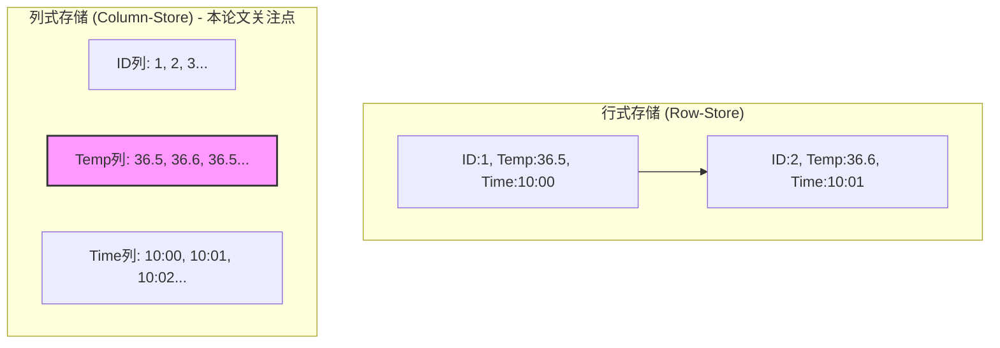
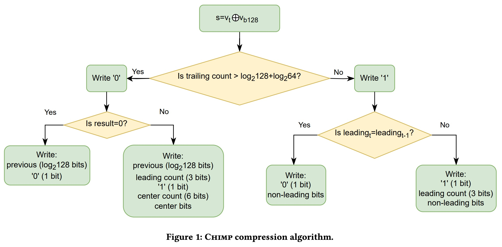
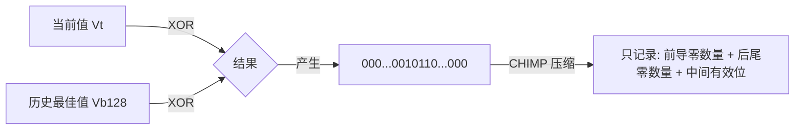
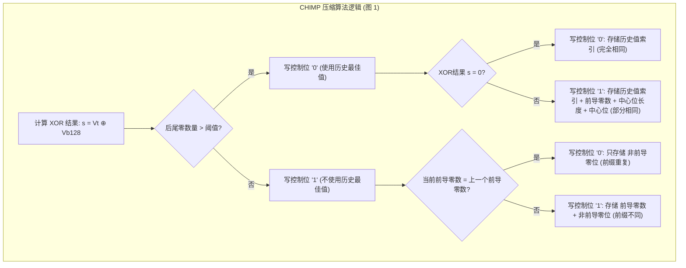
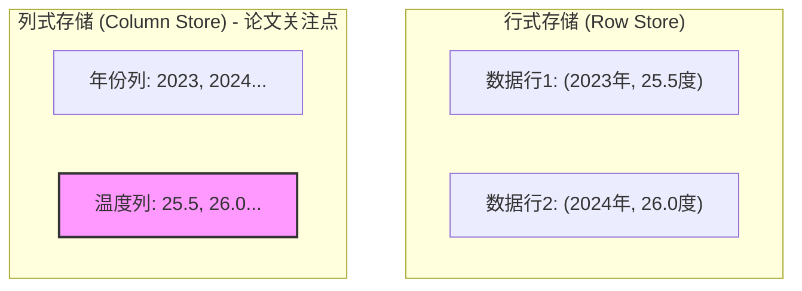
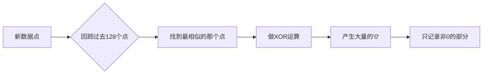

## AI论文解读 | How to Make your Duck Fly: Advanced Floating Point Compression to the Rescue
        
### 作者        
digoal        
        
### 日期        
2025-11-25        
        
### 标签        
PostgreSQL , PolarDB , DuckDB , AI , 论文解读        
        
----        
        
## 背景  
      
https://openproceedings.org/2024/conf/edbt/paper-248.pdf        
  
提示:          
```          
读懂《How to Make your Duck Fly: Advanced Floating Point Compression to the Rescue》这篇论文需要提前掌握哪些基础知识, 请使用中文通熟易懂的讲解这些基础知识, 可以引用论文中的图、表或使用Markdown支持的图形(text,mermaid等)增加解释性. 
  
使用中文通熟易懂的解读《How to Make your Duck Fly: Advanced Floating Point Compression to the Rescue》这篇论文, 其中的关键内容请着重讲解, 可以引用论文中的图、表或使用Markdown支持的图形(text,mermaid等)增加解释性. 
  
提取《How to Make your Duck Fly: Advanced Floating Point Compression to the Rescue》这篇论文中的重要术语, 使用中文对这些术语进行通熟易懂的讲解, 可以引用论文中的图、表或使用Markdown支持的图形(text,mermaid等)增加解释性. 
```     
  
## 1 前置知识 
  
阅读这就篇名为《How to Make your Duck Fly: Advanced Floating Point Compression to the Rescue》的论文，主要涉及**数据库内部原理**和**底层数据压缩算法**。

为了让你能够轻松理解这篇论文的核心创新（即 CHIMP 和 PATAS 算法），你需要掌握以下几个基础知识概念。我将用通俗易懂的语言为你拆解，并配合图表说明。

-----

### 1\. 列式数据库 (Column-Oriented DBMS)

**概念：** 传统的数据库（如 MySQL）通常是按“行”存储数据的，一行数据包含姓名、年龄、薪资等。而 DuckDB（论文中的主角）是**列式存储** 。

**通俗解释：**
想象一个Excel表格。

  * **行存储**：把第一行读完，再存第二行。
  * **列存储**：先把“薪资”这一列的所有数字存完，再存“年龄”这一列。

**为什么这篇论文需要这个知识？**
因为**数据压缩**在列式数据库中特别有效。同一列的数据通常非常相似（比如“温度”这一列都是浮点数，“状态”这一列都是整数）。这篇论文专门解决的是 **浮点数（Floating Point）** 这一列的压缩问题 。



-----

### 2\. 浮点数表示与 XOR 异或运算 (Floating Point & XOR)

**概念：** 计算机存储小数（浮点数）的方式与整数不同，通常遵循 IEEE 754 标准。压缩浮点数的经典方法是利用 **XOR（异或）** 操作 。

**通俗解释：**

  * **浮点数难压缩：** 很多通用压缩算法（如 GZIP）对文本很有效，但对浮点数效果不好，因为浮点数的二进制表示非常复杂，哪怕数值只差一点点（如 1.001 和 1.002），其底层的二进制位可能变化很大，显得像“随机噪声” 。
  * **XOR 是什么：** XOR 是一种逻辑运算，“**相同为0，不同为1**”。
      * 比如：`1100` XOR `1101` = `0001`。
  * **核心思想：** 如果两个相邻的浮点数很接近（比如温度传感器每秒读一次数），它们的二进制位大部分是相同的。如果我们把“当前值”和“前一个值”做 XOR 运算，结果就会包含**大量的 0**，只有少数代表差异的位是 **1** 。

**论文中的应用：**
论文中的 **CHIMP** 算法就是基于这个原理，它通过 XOR 运算生成很多 0，然后只记录那些不为 0 的部分，从而节省空间 。

-----

### 3\. 前导零与后尾零 (Leading & Trailing Zeros)

**概念：** 在做完 XOR 运算后，结果通常是一串包含少量 1 的长串 0。

**通俗解释：**
假设 XOR 的结果是 64 位的二进制数：
`000000...00000101100000...000`

  * **前导零 (Leading Zeros)：** 左边那一长串连续的 0。
  * **后尾零 (Trailing Zeros)：** 右边那一长串连续的 0。
  * **中间有效位 (Center Bits / Meaningful Bits)：** 中间那段包含 1 的部分。

**论文的核心创新点：**
传统的算法（如 Gorilla 算法）只关注前导零。但这篇论文的 CHIMP 算法发现，利用**后尾零**也能极大地压缩数据 。
CHIMP 算法会不仅看“前一个值”，还会看“过去 128 个值中哪一个能产生最多的后尾零”，从而让 XOR 结果中的 0 更多，压缩率更高 。

**论文图 1 简化示意：**    



*(参考论文原文 Figure 1 的逻辑 )*

-----

### 4\. 压缩率 vs. 解压速度 (Compression Ratio vs. Decompression Speed)

**概念：** 数据压缩存在一个永恒的权衡（Trade-off）。压缩得越小（压缩率高），通常解压起来越费劲（速度慢），因为算法逻辑更复杂。

**通俗解释：**

  * **CHIMP 算法：** 追求**极致的空间节省**。它用复杂的位操作（Bit manipulation）把数据压得很小，但读取时需要 CPU 进行较多的计算 。
  * **PATAS 算法：** 追求**极快的读取速度**。它是 CHIMP 的简化版。它不进行复杂的“按位”压缩，而是通过“按字节（Byte-aligned）”对齐来处理。虽然压缩后的体积比 CHIMP 稍微大一点，但解压速度几乎和直接读取未压缩数据一样快 。

**论文结论预览：**
DuckDB 允许用户选择：想要省硬盘（用 CHIMP），还是想要速度快（用 PATAS），或者不压缩 。

-----

### 总结：阅读路线图

当你阅读这篇论文时，带上这把钥匙：

1.  **场景：** 这是一个列式数据库（DuckDB），里面存了大量的浮点数（如传感器数据）。
2.  **问题：** 浮点数太占空间，普通压缩不管用。
3.  **方法 1 (CHIMP)：** 利用 XOR 找规律，不仅利用前导零，还拼命挖掘**后尾零**（Trailing Zeros）来极致压缩 。
4.  **方法 2 (PATAS)：** 嫌 CHIMP 解压太慢？那就用 PATAS，牺牲一点点压缩率，换取**字节对齐**的超高解压速度 。

掌握了以上知识，你就能轻松看懂文中关于 `log2`、`XOR`、`Leading Zeros` 以及 Figure 1 的流程图了。    
  
## 2 解读论文 
  
好的，这是一份对论文《How to Make your Duck Fly: Advanced Floating Point Compression to the Rescue》的通俗易懂的解读，重点讲解了其核心创新 CHIMP 和 PATAS 算法 。

-----

## 🚀 论文解读：如何让你的 Duck 飞起来？

### 💡 核心问题：浮点数压缩的困境

这篇论文主要解决一个在**大数据分析**中常见但棘手的技术问题： **如何高效压缩数据库中的浮点数（小数）** 。

#### 1\. 为什么压缩很重要？

在科学计算、金融、环境监测等领域，数据量巨大，这带来了两个挑战 ：

  * **存储与成本：** 存储和传输（Egress）成本高昂 。
  * **性能：** 数据加载和查询速度慢 。
    压缩能减少 I/O，让更多数据适应内存缓冲区（提高缓存命中率），从而提升数据库性能 。

#### 2\. 为什么浮点数难压缩？

对于**列式数据库**（如论文中使用的 DuckDB ），压缩整数和文本通常能轻松压缩两倍或更多 。但浮点数（例如温度、压力读数）在底层二进制表示中，即使数值只相差一点点，其 **尾数（Mantissa）** 的二进制位也会变化很大，看起来像“噪声” 。因此，传统的压缩方法效果通常很一般 。

### 🦆 解决方案：CHIMP 与 PATAS 算法

论文提出了两种**无损**浮点数压缩算法： **CHIMP** 和 **PATAS** 。它们通过利用相邻数据点的相似性来大幅提高压缩率，并被集成到了 DuckDB 数据库中 。

-----

## 🔬 关键算法一：CHIMP (高压缩率优先)

CHIMP（CHIMP128 变体）是一种先进的**无损流式压缩算法**，其主要目标是实现**最大的空间节省** 。

### 1\. 核心机制：异或（XOR）与最佳选择

CHIMP 的核心是 **XOR 异或操作** ：

  * **操作：** 将当前的浮点值 $v_t$  与一个“前值”进行异或运算 。
  * **目标：** 异或运算的结果 $(s = v_t \oplus v_{best})$ 包含尽可能多的**零** 。
  * **CHIMP 的创新点（“最佳选择”）：** 传统的流式压缩算法只会与紧邻的上一个值 $v_{t-1}$ 进行 XOR。CHIMP 算法会聪明地在**历史 128 个值**中，选择一个能产生**最多后尾零**（Trailing Zeros）的值 $v_{b_{128}}$ 来进行异或 。
      * **为什么选后尾零？** 这样能最大化异或结果中的零位数，便于压缩 。

### 2\. 复杂的编码逻辑（图 1 详解）

CHIMP 的压缩率高，是因为它使用了**变长编码**和复杂的控制逻辑（使用 2 个控制位区分 4 种编码格式 ），从而精确地只存储那些非零的“有意义的位”（Meaningful bits）。

以下是论文中图 1 所示的 CHIMP 压缩流程（已简化和通俗化）：    



**关键总结：** CHIMP 像个“精打细算”的裁缝，用最复杂的逻辑，把数据精确地裁剪到最小 。

-----

## ⚡ 关键算法二：PATAS (解压速度优先)

PATAS 是 CHIMP 的一个变体，它在**空间节省**与**解压速度**之间做出了取舍 。

### 1\. 牺牲空间换取速度

  * **CHIMP 的缺点：** CHIMP 复杂的位级处理和多个控制位导致解压时需要大量的**分支判断**和**数据依赖**，这阻碍了现代 CPU 上的高效流水线执行，导致解压速度相对较慢（比读取未压缩数据慢约 5 倍） 。
  * **PATAS 的对策：**
      * **专业化（Specialization）：** PATAS 专注于 CHIMP 中最常见的单一模式（即控制位为 `'01'` 的模式） 。通过放弃处理其他不常用模式，**避免了解压时的分支和数据依赖**，大幅加快了解压速度 。
      * **字节对齐（Byte-Aligning）：** PATAS 不像 CHIMP 那样进行复杂的**位对齐**，而是对结果进行 **零填充（Zero-padding）** ，形成 1 字节对齐的表示 。这消除了 CHIMP 中必需的“位级处理”，进一步提速 。

### 2\. 性能对比

| 特性 | 未压缩数据 (Uncompressed) | PATAS | CHIMP |
| :--- | :--- | :--- | :--- |
| **压缩率** | 最差 (0%)  | 较好 (略低于 CHIMP)  | 最佳  |
| **解压速度** | 最快 (基准)  | 极快 (约慢 2 倍)  | 较慢 (约慢 5 倍)  |
| **适用场景** | 追求极致速度  | 兼顾节省空间和高性能查询  | 追求最小存储空间  |

**关键总结：** PATAS 像个“效率优先”的工人，用更简单、更直接的**字节对齐**方法（`'01'`模式），换取 CPU **极速解压** 。

-----

## 💻 演示环节：用户如何体验？

论文的演示部分展示了一个用户友好的 Web 应用程序，让用户亲身体验这两种算法的优势 。

### 1\. 数据加载演示

用户选择数据文件后，Web 应用会同时将数据加载到三个独立的 DuckDB 实例中 ：

1.  未压缩模式 (Uncompressed) 。
2.  CHIMP 压缩模式 。
3.  PATAS 压缩模式 。

系统会实时展示： **加载时间**、**最终数据库的存储大小**，以及实时的 **CPU 和内存占用** 。用户可以直观地看到 CHIMP/PATAS 如何通过缩小数据体积，从而加快数据加载速度 。

### 2\. 查询演示

用户可以：

  * 执行**预定义的查询**（聚合、分组、连接等） 。
  * 使用 **SQL 编辑器**提交**自定义查询** 。

系统会实时监测和可视化： **查询执行时间**、**CPU 和内存占用** 。通过对比，用户可以清晰地理解压缩如何通过改善 I/O 和内存利用率，从而加速查询处理 。

**配置命令示例（用于演示）：**

| 模式 | DuckDB 配置命令 |
| :--- | :--- |
| 未压缩 | `PRAGMA force_compression=uncompressed`  |
| CHIMP | `PRAGMA force_compression=chimp`  |
| PATAS | `PRAGMA force_compression=patas`  |
  
## 3 术语 
  
基于论文《How to Make your Duck Fly: Advanced Floating Point Compression to the Rescue》，我为你提取了其中的关键术语，并结合图表进行通俗易懂的中文讲解。

-----

### 1\. 列式数据库 (Column-Oriented DBMS)

  * **通俗解读：**
    传统的数据库（如 MySQL）通常是按“行”把一个人的姓名、年龄、薪水存在一起。而列式数据库（如论文中的 DuckDB）则是把所有人的“姓名”存一起，所有人的“薪水”存一起 。

      * **为什么这对压缩很重要？** 因为同一列的数据类型是一样的（比如全是数字），而且数值往往很接近，这让压缩算法更容易找到规律，从而大幅节省空间 。

  * **图解对比：**




-----

### 2\. 按位异或 (Bitwise XOR)

  * **通俗解读：**
    这是压缩浮点数的核心数学魔法。XOR 的规则是： **两个数相同则为 0，不同则为 1** 。

      * **原理：** 如果我们把“现在的数值”和“之前的数值”做 XOR 运算，因为相邻的数值通常变化不大（比如温度从 25.5 变到 25.6），它们的二进制位大部分是相同的。
      * **结果：** 运算结果会产生大量的 **0**，只有少数代表差异的位是 **1**。这些大量的 0 非常容易压缩 。

  * **简单算术示例：**

    ```text
      11011000 (当前值)
    ⊕ 11011001 (前一个值)
    -------------------
      00000001 (结果全是0，极易压缩)
    ```

-----

### 3\. CHIMP 算法

  * **通俗解读：**
    这是论文提出的旗舰压缩算法。它的名字来源于它比之前的“大猩猩（Gorilla）”算法更进化 。

      * **核心创新：** 以前的算法只敢跟“紧邻的上一个值”做比较。CHIMP 算法很聪明，它会往回看 **128 个值**，从中挑出一个能产生最多“后尾零”的朋友来做 XOR 运算 。
      * **目的：** 追求极致的**空间节省**，让数据占用的硬盘越少越好 。

  * **流程示意图 (基于论文图1)：**

  



-----

### 4\. PATAS 算法

  * **通俗解读：**
    这是 CHIMP 的“极速版”变体 。
      * **痛点：** CHIMP 压缩得很小，但解压时需要像绣花一样处理每一个“位（Bit）”，这让 CPU 很累，速度慢 。
      * **改进：** PATAS 牺牲了一点点压缩率，不再进行复杂的位处理，而是把数据对齐到“字节（Byte）”（比如补齐 0 凑够 8 位）。这就好比把货物打包成标准的箱子，虽然箱子里有点空隙（浪费空间），但搬运起来（解压）非常快 。
      * **特点：** 解压速度几乎和直接读取未压缩数据一样快 。

-----

### 5\. 前导零 (Leading Zeros) 与 后尾零 (Trailing Zeros)

  * **通俗解读：**
    在进行 XOR 运算后，产生的那串二进制数字中：

      * **前导零：** 开头那一连串的 0。
      * **后尾零：** 结尾那一连串的 0。
      * **中间有效位 (Meaningful Bits)：** 中间夹杂着 1 的部分 。

  * **论文的突破点：**
    以前的算法（如 Gorilla）主要利用**前导零**来压缩。但这篇论文发现，利用**后尾零**其实更有效。CHIMP 算法的设计初衷就是尽可能最大化后尾零的数量 。

    ```text
    00000...0001011000...00000
    |________| |___| |_______|
      前导零   有效位   后尾零
      (Old)           (CHIMP重点优化)
    ```

-----

### 6\. 字节对齐 (Byte-aligned)

  * **通俗解读：**
    这是 PATAS 算法为了提速而采用的技术。
      * **位对齐 (Bit-aligned)：** 像 CHIMP 一样，数据挤在一起，前一个数的结尾紧挨着后一个数的开头，不管是不是凑整了。这很省空间，但 CPU 读取慢。
      * **字节对齐 (Byte-aligned)：** 像 PATAS 一样，强制让数据按照 8 位（1字节）的倍数存放。哪怕多存几个 0，也要保证 CPU 能一口吃掉一个完整的块，从而避免了复杂的位运算 。

-----

### 总结：如何选择？

论文在 DuckDB 中给出了三种选择 ：

1.  **Uncompressed (不压缩)：** 速度最快，但最占空间。
2.  **CHIMP：** 最省空间，适合存储压力大的场景。
3.  **PATAS：** 速度极快（接近不压缩），同时也能省下不少空间，是**性能与存储的最佳平衡点**。
  
## 参考        
         
https://openproceedings.org/2024/conf/edbt/paper-248.pdf    
        
<b> 以上内容基于DeepSeek、Qwen、Gemini及诸多AI生成, 轻微人工调整, 感谢杭州深度求索人工智能、阿里云、Google等公司. </b>        
        
<b> AI 生成的内容请自行辨别正确性, 当然也多了些许踩坑的乐趣, 毕竟冒险是每个男人的天性.  </b>        
    
#### [PolarDB 学习图谱](https://www.aliyun.com/database/openpolardb/activity "8642f60e04ed0c814bf9cb9677976bd4")
  
  
#### [PostgreSQL 解决方案集合](../201706/20170601_02.md "40cff096e9ed7122c512b35d8561d9c8")
  
  
#### [德哥 / digoal's Github - 公益是一辈子的事.](https://github.com/digoal/blog/blob/master/README.md "22709685feb7cab07d30f30387f0a9ae")
  
  
#### [About 德哥](https://github.com/digoal/blog/blob/master/me/readme.md "a37735981e7704886ffd590565582dd0")
  
  

  
