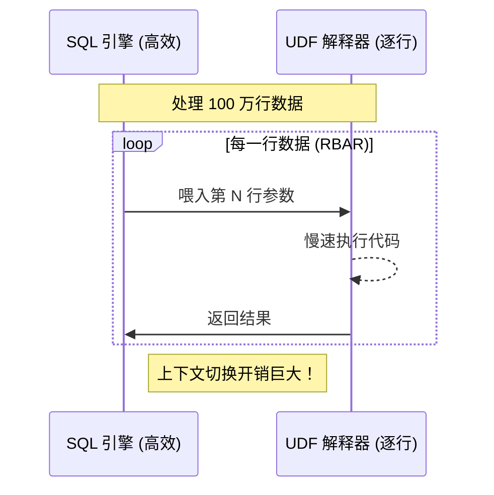
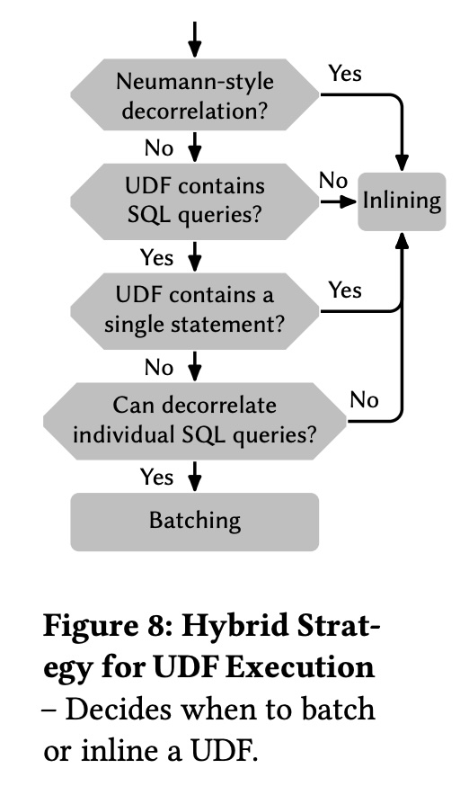
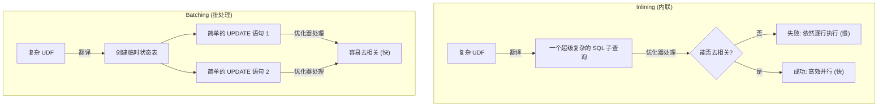
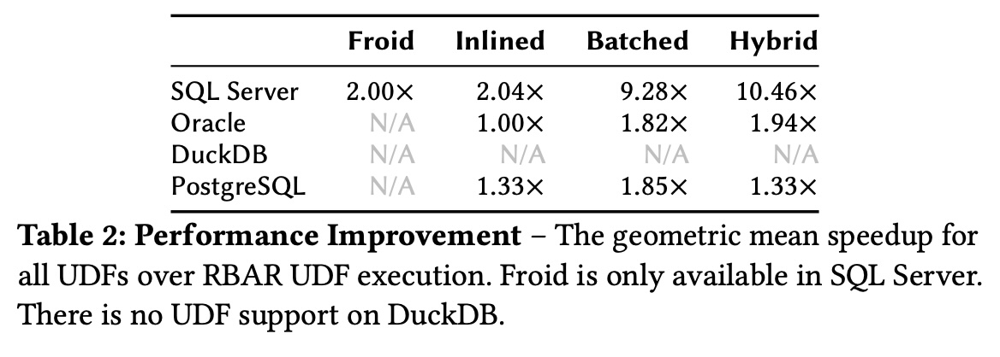
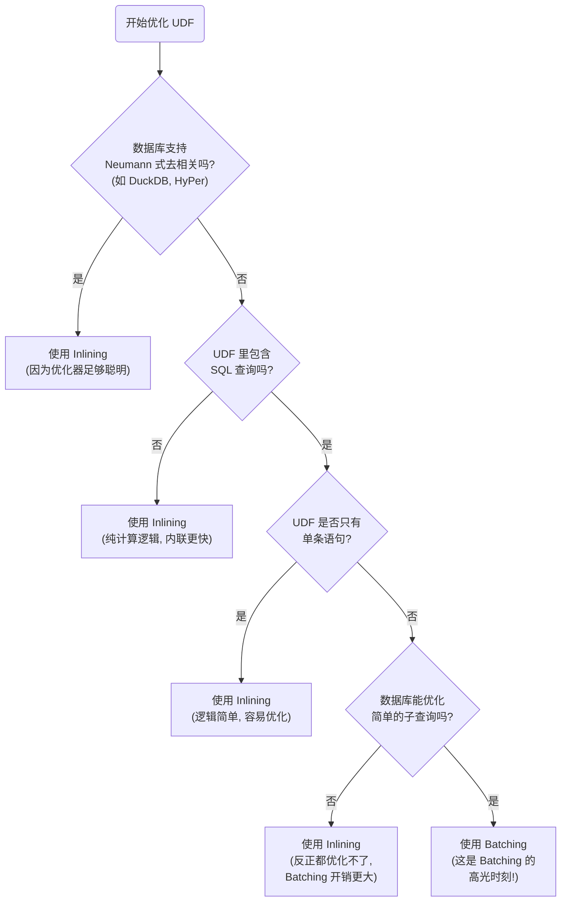
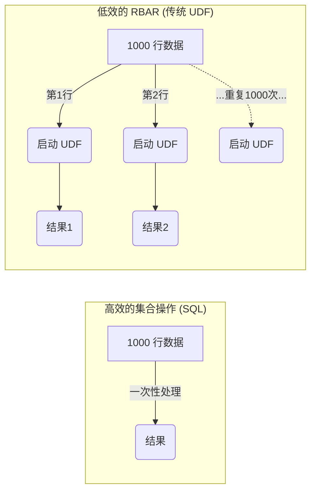

## AI论文解读 | Dear User-Defined Functions, Inlining isn’t working out so great for us. Let’s try batching to make our relationship work. Sincerely, SQL
        
### 作者        
digoal        
        
### 日期        
2025-11-25        
        
### 标签        
PostgreSQL , PolarDB , DuckDB , AI , 论文解读        
        
----        
        
## 背景  
      
https://www.cidrdb.org/cidr2024/papers/p13-franz.pdf        
  
提示:          
```          
读懂《Dear User-Defined Functions, Inlining isn’t working out so great for us. Let’s try batching to make our relationship work. Sincerely, SQL》这篇论文需要提前掌握哪些基础知识, 请使用中文通熟易懂的讲解这些基础知识, 可以引用论文中的图、表或使用Markdown支持的图形(text,mermaid等)增加解释性. 
  
使用中文通熟易懂的解读《Dear User-Defined Functions, Inlining isn’t working out so great for us. Let’s try batching to make our relationship work. Sincerely, SQL》这篇论文, 其中的关键内容请着重讲解, 可以引用论文中的图、表或使用Markdown支持的图形(text,mermaid等)增加解释性. 
  
提取《Dear User-Defined Functions, Inlining isn’t working out so great for us. Let’s try batching to make our relationship work. Sincerely, SQL》这篇论文中的重要术语, 使用中文对这些术语进行通熟易懂的讲解, 可以引用论文中的图、表或使用Markdown支持的图形(text,mermaid等)增加解释性. 
```     
  
## 1 前置知识 
  
要读懂这篇题为《Dear User-Defined Functions...》（亲爱的用户自定义函数……）的论文，你需要掌握数据库领域的几个核心概念。这篇论文主要探讨的是如何让数据库中的**用户自定义函数（UDF）** 跑得更快，比较了两种主要技术： **内联（Inlining）** 和 **批处理（Batching）** 。

以下是阅读本文前需要了解的基础知识，我会用通俗的语言配合图表来解释：

### 1\. 什么是 UDF (用户自定义函数) 与 "阻抗失配"

  * **概念**：SQL 是一种**声明式**语言（你告诉数据库“我要什么数据”，不关心“怎么查”）。但在处理复杂逻辑（比如复杂的数学计算、字符串解析）时，SQL 不够用。于是数据库允许用户用**过程式**代码（如 PL/SQL, Python, Java 等，类似写脚本一样一步步执行）来编写函数，这就是 UDF 。
  * **问题（阻抗失配）** ：数据库引擎擅长处理集合（一次处理一堆数据），而 UDF 通常是过程式的（一次处理一行）。当你把这两个东西混在一起时，数据库优化器（也就是数据库的“大脑”）就懵了，因为它看不懂 UDF 里的代码，无法优化它 。

### 2\. RBAR (Row-By-Agonizing-Row) 现象

这是 UDF 慢的罪魁祸首。

  * **通俗解释**：想象你在超市结账。
      * **理想情况（集合操作）** ：你把一车商品推过去，收银员一次性扫描完。
      * **RBAR（逐行操作）** ：UDF 的执行方式是，你没买一件商品，就要重新排队、重新结账一次。
  * **技术原理**：当 SQL 查询调用 UDF 时，数据库引擎必须在“SQL 执行器”和“UDF 解释器”之间频繁切换上下文。每一行数据都要切换一次，这种开销非常巨大 。




### 3\. 两种优化方案：Inlining (内联) vs. Batching (批处理)

这是论文争论的核心。

#### A. Inlining (内联) —— "把代码拆了融入查询"

  * **原理**：既然 UDF 是个黑盒子，那我就把盒子拆了。把 UDF 里面的逻辑翻译成纯 SQL 语句，然后直接塞进主查询里，变成一个**子查询** 。
  * **好处**：没有函数调用了，优化器能看到所有逻辑，可以进行整体优化 。
  * **坏处**：如果 UDF 逻辑太复杂（比如很多 IF/ELSE），翻译出来的 SQL 子查询会变得极其复杂，导致优化器处理不了 。

#### B. Batching (批处理) —— "囤一波再算"

  * **原理**：不再来一行算一行。而是先创建一个临时表，把要处理的数据一次性全写进去。然后用 SQL 的 `UPDATE` 语句，一次性更新这批数据的所有结果 。
  * **好处**：利用了数据库擅长的“集合操作”能力，减少了上下文切换。
  * **论文的发现**：Batching 生成的 SQL 语句通常比 Inlining 更简单，更容易被数据库优化 。

### 4\. 关键难点：相关子查询 (Correlated Subquery) 与去相关 (Decorrelation)

这是理解论文为什么说 "Batching 赢了" 的关键知识点。

  * **相关子查询**：子查询内部引用了外部查询的变量。这意味着，**外部每有一行数据，子查询就必须执行一次**。这本质上还是 RBAR，非常慢 。
  * **去相关 (Decorrelation)** ：数据库优化器的终极目标。它试图把“相关子查询”变成**Join（连接）** 操作。Join 是数据库最擅长的操作，效率极高 。

**核心逻辑链：**

1.  无论是 Inlining 还是 Batching，最后都会把 UDF 变成 SQL **子查询** 。
2.  如果这个子查询太复杂，数据库就**无法去相关**（Cannot Decorrelate），只能傻傻地逐行执行 。
3.  **论文结论**：Inlining 产生的子查询往往太复杂（一大坨嵌套），导致数据库放弃治疗（无法去相关）；而 Batching 产生的子查询结构简单，数据库更容易把它优化成高效的 Join 。

### 5\. LATERAL Join

论文中多次提到 `LATERAL` 关键字 。

  * **基础**：普通的 SQL Join，右边的表是不能引用左边表的字段的。
  * **LATERAL**：允许右边的子查询引用左边表的当前行。这在转换 UDF 中的循环或一步步的逻辑时非常有用（前一步的结果作为下一步的输入）。
  * **在论文中**：作者用 `LATERAL` 来模拟过程式代码中的“顺序执行” 。

### 总结：阅读路径建议

1.  **理解痛点**：UDF 很方便但很慢（因为 RBAR）。
2.  **理解解法**：
      * **Inlining (Froid)** ：试图把函数逻辑“平铺”进 SQL，但在复杂逻辑下会生成极其复杂的 SQL，导致优化器**无法去相关**（Decorrelation fail）。
      * **Batching (本文提倡)** ：把数据存入临时表，用简单的 `UPDATE` 语句批量计算。生成的 SQL 结构简单，优化器容易**去相关**（Decorrelation success）。
3.  **看图表**：重点看论文中的 **Figure 8 (Hybrid Strategy)** ，它总结了何时该用哪种技术，这实际上就是整篇论文的结论浓缩。    
  
## 2 解读论文 
  
这篇论文的标题非常有意思——《亲爱的用户自定义函数（UDF），内联（Inlining）咱们不太合适，为了让我们的关系维持下去，试着搞搞批处理（Batching）吧。真诚的，SQL》。

这实际上是一封 SQL 写给 UDF 的“分手信兼复合建议书”。论文的核心观点是： **虽然业界推崇“内联”技术，但在处理复杂逻辑时，“批处理”其实比“内联”快得多（最高达 93.4 倍）** 。

以下是这篇论文的通俗解读：

-----

### 1\. 核心矛盾：为什么 SQL 和 UDF 关系不好？

在数据库中，SQL 是“声明式”的（告诉数据库**要什么**），而 UDF（用户自定义函数）是“过程式”的（告诉数据库**怎么做**，一步步写代码）。

当你把 SQL 和 UDF 混在一起用时，会发生 **RBAR (Row-By-Agonizing-Row)** 现象，即“令人痛苦的逐行执行”：

  * 数据库必须对每一行数据启动一次 UDF 解释器。
  * 这种上下文切换极慢，且阻碍了数据库优化器的工作 。

### 2\. 两位“救星”：Inlining vs. Batching

为了拯救这种糟糕的性能，学术界提出了两种主要技术：

#### 选手 A：Inlining (内联) —— 目前的业界宠儿

这是微软 SQL Server (Froid) 等数据库采用的主流技术 。

  * **原理**：把 UDF 的代码“拆”了，翻译成纯 SQL 的子查询，然后直接塞进主查询里。
  * **比喻**：相当于把“外部外包团队（UDF）”撤了，把他们的活儿直接写进“公司内部手册（SQL）”里。
  * **优点**：消除了函数调用，能利用并行的优势 。

#### 选手 B：Batching (批处理) —— 本文力推的黑马

  * **原理**：不再一行行调函数。而是先把数据“攒”起来，放到一个临时表里。然后用 SQL 的 `UPDATE` 语句一次性计算所有数据的中间状态 。
  * **比喻**：本来是来一个顾客结一次账，现在改成让所有顾客先把商品放桌上，收银员一次性扫完所有商品，再统一收钱。
  * **优点**：把复杂的逻辑变成了简单的集合操作（Set-oriented）。

-----

### 3\. 关键发现：为什么 Inlining 经常“翻车”？

论文发现了一个反直觉的现象： **Inlining 只有在 UDF 很简单时才好用；一旦 UDF 变复杂，Batching 就会吊打 Inlining** 。

原因在于数据库优化器的一个核心痛点： **去相关（Decorrelation）** 。

  * **Inlining 的问题**：当你把复杂的 UDF（包含 IF/ELSE, 多个查询）硬塞进 SQL 时，会生成一个巨大且复杂的**相关子查询**。很多数据库（如 SQL Server, Oracle）的优化器看不懂这么复杂的结构，没法把它转化成高效的 JOIN 操作，结果还是只能被迫逐行执行 。
  * **Batching 的优势**：Batching 把大逻辑拆成了几个独立的 `UPDATE` 语句。每个语句只包含一个简单的子查询。数据库优化器看到这些“小而美”的查询时，很容易就能搞定“去相关”，从而生成高效的执行计划 。

我们可以用下面的图来理解两者的区别：



### 4\. 实验结果：各大数据库的表现

作者在四个主流数据库上进行了测试，结果非常有意思（见表 2 ）：

| 数据库系统 | Inlining 表现 | Batching 表现 | 结论 |
| :--- | :--- | :--- | :--- |
| **SQL Server** | 提升 2.04 倍 | **提升 9.28 倍** | **Batching 大胜**。Inlining 生成的查询太复杂，优化器搞不定 。 |
| **Oracle** | 没啥变化 (1.00 倍) | **提升 1.82 倍** | **Batching 小胜**。Oracle 也很难优化复杂的内联查询 。 |
| **PostgreSQL** | 提升 1.33 倍 | **提升 1.85 倍** | **菜鸡互啄**。PG 的优化器太弱，两种方法都很难去相关，效果都不明显 。 |
| **DuckDB** | **极快** | 快，但不如 Inlining | **Inlining 胜**。DuckDB 拥有最先进的去相关技术，它能完美处理 Inlining 的复杂查询，所以不需要 Batching 的额外开销 。 |


  


### 5\. 最终方案：混合策略 (The Hybrid Strategy)

既然没有一种方法在所有情况下都最好，论文提出了一个**混合策略**。根据数据库的能力和 UDF 的复杂度来动态选择使用哪种技术。

这是论文核心贡献之一，我将其总结为下方的决策树 ：



### 总结

这篇论文告诉我们：

1.  **UDF 很慢**，主要是因为数据库引擎和代码引擎之间的“阻抗失配” 。
2.  **Inlining 不一定是万能药**。虽然它把代码变成了 SQL，但如果变成的 SQL 太丑太复杂，数据库优化器依然会“拒收” 。
3.  **Batching 是处理复杂 UDF 的利器**。通过把复杂的嵌套逻辑拆解成简单的批量更新操作，它“通过简化问题”来帮助愚笨的优化器找到出路 。
4.  **根据场景选工具**。如果是 DuckDB 这种现代数据库，无脑用 Inlining；如果是 SQL Server 或 Oracle 处理复杂逻辑，Batching 才是王道 。
  
## 3 术语 
  
这篇论文探讨了如何解决数据库中长期存在的一个性能痛点：用户自定义函数（UDF）运行缓慢的问题。为了读懂这篇论文，我们需要拆解其中的核心术语。

以下是该论文中关键术语的通俗解读：

### 1\. UDF (User-Defined Function / 用户自定义函数)

  * **学术定义**：UDF 允许开发者使用过程式编程语言（如 PL/SQL, Python 等）编写复杂的计算逻辑，并在 SQL 查询中像调用普通函数一样调用它 。
  * **通俗解释**：
      * SQL 就像是“点菜”，你只管告诉服务员你要什么菜（数据），不用管厨师怎么做。
      * 但在处理复杂逻辑时（比如复杂的数学公式或逻辑判断），SQL 这种“点菜”模式不够用了。
      * 于是数据库允许你自己写一段代码（UDF）来处理这些逻辑。这就好比你不仅点了菜，还亲自进厨房手把手教厨师怎么切菜、怎么放盐。
  * **痛点**：虽然方便了开发者，但对数据库引擎来说是个噩梦，因为数据库看不懂你的代码逻辑，无法优化它 。

### 2\. Impedance Mismatch (阻抗失配)

  * **学术定义**：指声明式语言（SQL）与过程式语言（UDF）在编程范式上的根本冲突 。
  * **通俗解释**：
      * **SQL (声明式)** ：擅长处理**集合**，比如“把这 100 个人里所有穿红衣服的找出来”。
      * **UDF (过程式)** ：擅长处理**步骤**，比如“先看第一个人是不是穿红衣服，如果是就记下来；再看第二个人……”。
      * 当这两种截然不同的思维方式强行结合时，就会产生“语言不通”的隔阂，导致效率极低。

### 3\. RBAR (Row-By-Agonizing-Row / 令人痛苦的逐行执行)

  * **学术定义**：指数据库在执行 UDF 时，被迫对每一行数据单独启动解释器上下文进行处理的低效模式 。
  * **通俗解释**：
      * 想象你在超市结账。
      * **集合操作（Set-oriented）** ：你把一整车的商品推过去，收银员一次性扫完。
      * **RBAR**：你每拿出一件商品，收银员就要先关机，再重启收银机，扫一件商品，结一次账，然后再关机……这就是“令人痛苦的逐行执行”。




### 4\. Batching (批处理) —— *论文的主角*

  * **学术定义**：一种优化技术。它不是逐行调用 UDF，而是为所有输入创建一个临时状态表，然后通过一系列 SQL `UPDATE` 语句一次性更新所有行的状态 。
  * **通俗解释**：
      * 不再是一个个处理。而是先把所有要处理的数据（参数）都倒进一张**临时表**里。
      * 原来的代码里写着 `x = x + 1`，现在就变成一句 SQL：`UPDATE 临时表 SET x = x + 1`。
      * 这样，本来要在代码里跑 1000 次的加法，现在变成了一句 SQL 指令，一次性给 1000 行数据都加上了 1。
  * **优势**：把“逐行代码”变成了数据库最擅长的“批量 SQL 操作”.

### 5\. Inlining (内联) —— *当前的行业标准*

  * **学术定义**：将 UDF 中的过程式语句翻译成关系代数或 SQL 子查询，并将其直接嵌入（内联）到调用它的主查询中 。
  * **通俗解释**：
      * 把 UDF 当作一个“黑盒子”，内联就是把盒子拆了。
      * 把函数里面的逻辑直接翻译成 SQL 语句，塞到外面的查询里。
      * 这样表面上看就没有“函数调用”了，全都是 SQL。
  * **缺点**：如果函数逻辑太复杂（比如有很多 IF/ELSE 嵌套），翻译出来的 SQL 会变得超级长、超级复杂，导致数据库看晕了，根本没法优化 。

### 6\. Subquery Decorrelation (子查询去相关) —— *胜负的关键*

  * **学术定义**：数据库优化器将相关子查询（每行执行一次）转换为 Join 操作（集合执行）的过程 。
  * **通俗解释**：
      * 无论是 **Batching** 还是 **Inlining**，最终生成的都是 SQL **子查询** 。
      * 如果这个子查询还依赖外部的数据（相关子查询），那本质上还是“逐行执行”，并没有变快 。
      * **去相关**就是优化器试图把这些子查询变成 **Join（连接）** 操作。
      * **论文的核心发现**： **Batching** 生成的 SQL 比较简单，优化器容易“去相关”；而 **Inlining** 生成的 SQL 太复杂，优化器经常放弃治疗（无法去相关）。

### 7\. Hybrid Strategy (混合策略)

  * **学术定义**：论文提出的一种自适应策略，根据 UDF 的结构和数据库的能力，动态选择使用 Batching 还是 Inlining 。
  * **决策逻辑** (基于 Figure 8 )：    
    1.  如果数据库超级聪明（如 DuckDB），能搞定任何子查询 -\> 用 **Inlining**。
    2.  如果 UDF 逻辑很简单 -\> 用 **Inlining**。
    3.  如果 UDF 很复杂且数据库不够聪明（如 SQL Server/Oracle） -\> 用 **Batching**。

| 术语 | 角色 | 关键特征 |
| :--- | :--- | :--- |
| **UDF** | 问题源头 | 方便但慢 (RBAR) |
| **Inlining** | 现有解法 | 生成复杂的 SQL，优化器难消化 |
| **Batching** | 论文推荐 | 生成简单的 UPDATE 语句，优化器易消化 |
| **Decorrelation** | 裁判 | 能否把子查询变成 Join，决定了快不快 |
  
## 参考        
         
https://www.cidrdb.org/cidr2024/papers/p13-franz.pdf    
        
<b> 以上内容基于DeepSeek、Qwen、Gemini及诸多AI生成, 轻微人工调整, 感谢杭州深度求索人工智能、阿里云、Google等公司. </b>        
        
<b> AI 生成的内容请自行辨别正确性, 当然也多了些许踩坑的乐趣, 毕竟冒险是每个男人的天性.  </b>        
    
#### [PolarDB 学习图谱](https://www.aliyun.com/database/openpolardb/activity "8642f60e04ed0c814bf9cb9677976bd4")
  
  
#### [PostgreSQL 解决方案集合](../201706/20170601_02.md "40cff096e9ed7122c512b35d8561d9c8")
  
  
#### [德哥 / digoal's Github - 公益是一辈子的事.](https://github.com/digoal/blog/blob/master/README.md "22709685feb7cab07d30f30387f0a9ae")
  
  
#### [About 德哥](https://github.com/digoal/blog/blob/master/me/readme.md "a37735981e7704886ffd590565582dd0")
  
  

  
