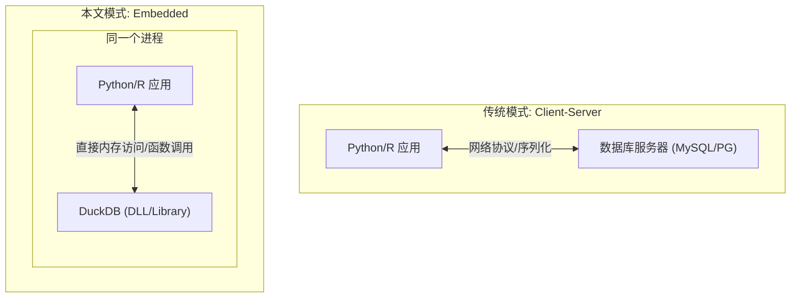
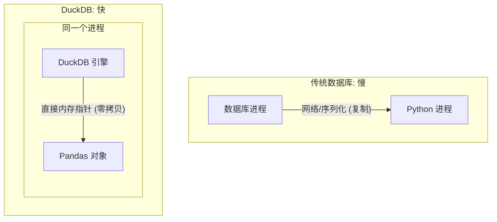
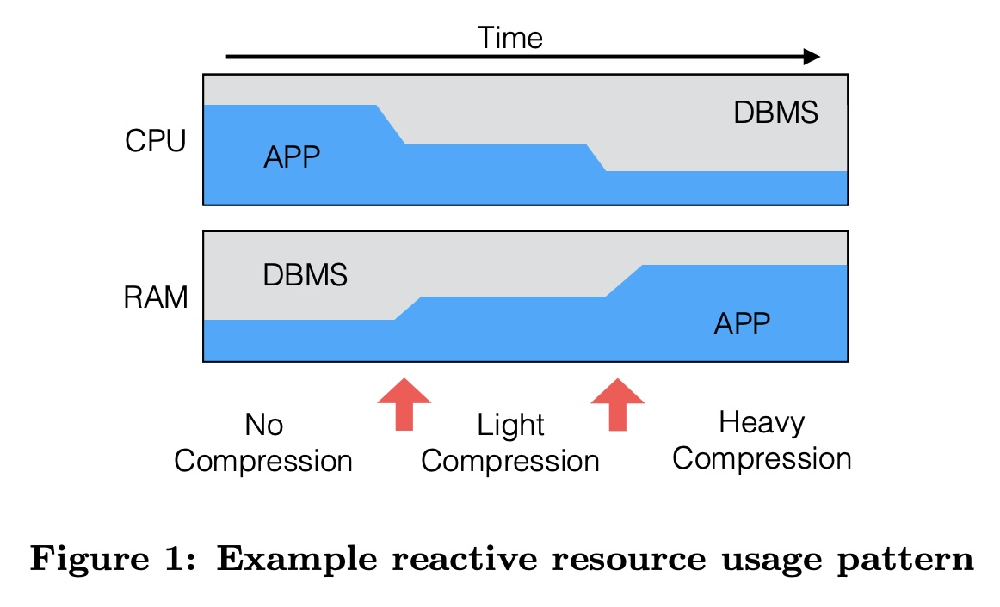
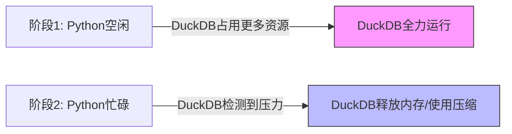
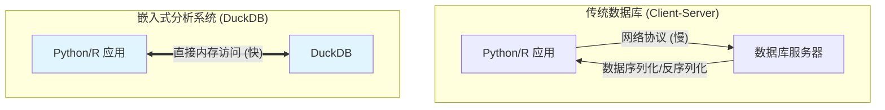

## AI论文解读 | Data Management for Data Science Towards Embedded Analytics
        
### 作者        
digoal        
        
### 日期        
2025-11-25        
        
### 标签        
PostgreSQL , PolarDB , DuckDB , AI , 论文解读        
        
----        
        
## 背景  
      
https://hannes.muehleisen.org/publications/CIDR2020-raasveldt-muehleisen-duckdb.pdf        
  
提示:          
```          
读懂《Data Management for Data Science Towards Embedded Analytics》这篇论文需要提前掌握哪些基础知识, 请使用中文通熟易懂的讲解这些基础知识, 可以引用论文中的图、表或使用Markdown支持的图形(text,mermaid等)增加解释性. 
  
使用中文通熟易懂的解读《Data Management for Data Science Towards Embedded Analytics》这篇论文, 其中的关键内容请着重讲解, 可以引用论文中的图、表或使用Markdown支持的图形(text,mermaid等)增加解释性. 
  
提取《Data Management for Data Science Towards Embedded Analytics》这篇论文中的重要术语, 使用中文对这些术语进行通熟易懂的讲解, 可以引用论文中的图、表或使用Markdown支持的图形(text,mermaid等)增加解释性. 
```     
  
## 1 前置知识 
  
要深入读懂《Data Management for Data Science Towards Embedded Analytics》这就介绍 DuckDB 的开山之作，你需要掌握以下几个核心的计算机与数据库基础知识。我会用通俗易懂的语言为你解释，并配合图表帮助理解。

### 1\. 嵌入式数据库 vs. 客户端-服务器架构 (Embedded vs. Client-Server)

这是理解这篇论文最核心的背景。

  * **客户端-服务器 (Client-Server, CS模式):** 传统的数据库（如 MySQL, PostgreSQL）像是一个**独立的“餐厅”** 。你的代码（Python/R）是**顾客**。你需要通过网络（Socket）发送订单（SQL），餐厅做好后再打包（序列化）送回给你。这中间有网络开销和数据打包拆包的开销。
  * **嵌入式 (Embedded):** DuckDB 提出的模式像是**私人厨师**。数据库并不是一个独立的程序，而是以**库 (Library)** 的形式直接运行在你的 Python/R 进程内部。数据就在“自家厨房”（共享内存空间），不需要打包传输，拿来就能用。

**论文背景：** 论文提到数据科学家现在经常在个人电脑上用脚本语言（Python/R）处理数据，传统的 CS 架构数据库通过网络协议传输数据太慢且麻烦 。



### 2\. OLAP vs. OLTP vs. ETL (工作负载类型)

数据库根据用途不同，设计理念完全不同。

  * **OLTP (联机事务处理):** 就像**记账**。关注的是“快进快出”，比如银行转账、电商下单。特点是高并发、操作数据量小（一行行读写）。
  * **OLAP (联机分析处理):** 就像**做报表**。关注的是“海量统计”，比如计算过去十年的平均销售额。特点是读多写少、操作涉及大量数据（整列整列读）。
  * **ETL (抽取-转换-加载):** 数据搬运工。把数据从 CSV 文件里读出来，清洗一下（比如把 -999 变成 NULL），然后存进数据库。

**论文背景：** 数据科学的场景非常特殊，它既需要 OLAP 的分析能力（跑复杂查询），又需要高效的 ETL 能力（大量数据清洗和导入）。DuckDB 就是为了这种混合场景设计的。

### 3\. 列式存储与向量化执行 (Columnar Storage & Vectorized Execution)

为了让分析（OLAP）变快，数据库引擎的内部运作方式很重要。

  * **行式存储 (Row-Oriented):** 数据像写日记一样，一行接一行存。适合查某一个人的详细信息。
  * **列式存储 (Column-Oriented):** 数据按“属性”存。比如把所有人的“年龄”存在一起。当你计算“平均年龄”时，只需要读“年龄”这一块数据，速度极快。
  * **向量化执行 (Vectorized Execution):** 传统的处理方式是一次处理一行数据（像流水线工人一个个拧螺丝）。向量化是一次处理一批数据（比如一次拧紧1024个螺丝）。利用现代 CPU 的 SIMD 指令，效率极高。

**论文背景：** DuckDB 采用了向量化解释执行引擎 ，专门优化 OLAP 查询。

### 4\. 零拷贝数据传输 (Zero-Copy Data Transfer)

这是嵌入式数据库的一大杀手锏。

  * **通俗解释：** 在传统数据库中，把查询结果给 Python 用，需要先把数据从数据库格式“复制”并“转换”成 Python 对象，这很慢。
  * **零拷贝：** 因为 DuckDB 和 Python 在同一个进程里，DuckDB 处理完数据后，不需要复制，直接把内存地址（指针）指给 Python/Pandas 看：“呐，数据就在这，你自己读”。

**论文背景：** 论文提到，因为数据库和分析工具在同一个地址空间，存在独特的“高效数据传输”机会 ，这可以消除传输瓶颈。

### 5\. 硬件与位翻转 (Hardware Reliability & Bit Flips)

你需要了解服务器硬件和个人电脑硬件的区别。

  * **服务器硬件：** 有 ECC 内存（自动纠错）、RAID 磁盘阵列（坏了一块盘数据不丢）。就像穿了防弹衣。
  * **消费级硬件 (Consumer Hardware):** 我们用的笔记本电脑。没有 ECC。宇宙射线或电压不稳可能导致内存里的一个 `0` 变成了 `1`（位翻转, Bit Flip）。这种错误如果是“静默”的（系统没报错），数据就偷偷坏了。

**论文背景：** DuckDB 运行在数据科学家的笔记本上，环境不可靠 。所以 DuckDB 需要自己软件层面去检测这些硬件错误，防止数据静默损坏 。

| 特性 | 服务器环境 (Server) | 嵌入式/个人电脑环境 (Edge/Laptop) |
| :--- | :--- | :--- |
| **内存** | ECC (自动纠错) | 无 ECC (容易发生位翻转) |
| **磁盘** | RAID (冗余备份) | 单硬盘 (容易损坏) |
| **维护者** | 专业管理员 | 数据科学家自己 (往往不监控硬件) |

### 6\. MVCC (多版本并发控制)

  * **通俗解释：** 想象一个共享文档。如果没有 MVCC，我在写的时候你不能读，必须等我写完。有了 MVCC，我在修改时，系统保留了一个“旧版本”给你读。这样写操作不会阻塞读操作，大家都能并发工作。
  * **ACID:** 数据库事务的四个特性（原子性、一致性、隔离性、持久性），保证数据不乱套。

**论文背景：** DuckDB 使用 MVCC 来实现 ACID ，特别适合这种一边在清洗导入数据（写），一边在做可视化分析（读）的场景 。

-----

### 总结：读这篇论文的心智模型

当你阅读这篇论文时，请时刻带入这样一个**场景**：

> “我是一个数据科学家，我在自己的 MacBook 上用 Pandas 处理 10GB 的 CSV 文件。内存经常爆掉，处理速度很慢，而且我不懂怎么维护一个庞大的 MySQL 服务器。
>
> 现在的痛点是： **数据怎么存？怎么算得快？怎么保证电脑死机了数据不丢？** ”

论文中的每一章（Workload, Resilience, Cooperation）都是在回答这个场景下的具体问题。
  
## 2 解读论文 
  
这篇论文《Data Management for Data Science: Towards Embedded Analytics》是 DuckDB 数据库的“开山之作”。它详细阐述了为什么要为数据科学专门造一个新的数据库，以及这个数据库（DuckDB）是如何设计的。

以下是对这篇论文通俗易懂的解读。

-----

### 1\. 核心背景：数据科学家的“痛点”

**现状：**
数据科学家（使用 Python/R）通常需要处理中等规模的数据。他们不喜欢用传统的数据库（如 MySQL、PostgreSQL），原因如下：

  * **太重了：** 需要安装服务器、配置权限、管理连接，非常麻烦 。
  * **太慢了：** 从数据库把数据读到 Python/Pandas 里进行分析，传输过程非常慢 。

**结果：**
大家宁愿用“胶水代码”把各种 CSV 文件和脚本粘在一起。但这导致了管理混乱、数据容易损坏、且没有事务保护（ACID） 。

**解决方案：**
作者提出了一种新的数据库类别——**嵌入式分析数据库 (Embedded Analytical Systems)** 。

  * **代表作：** DuckDB。
  * **定位：** 它是数据分析界的 SQLite。它不是一个独立的服务器，而是一个可以直接嵌入到 Python/R 进程中的库 。

-----

### 2\. 四大核心挑战与设计理念

论文指出，要在一个普通的笔记本电脑上做好“嵌入式分析”，必须解决四个独特的问题：

#### ① 混合负载 (Combined OLAP & ETL)

**问题：** 传统观念里，分析型数据库（OLAP）只负责“读”，写入通常发生在晚上的批量导入。但在数据科学流程中，用户经常一边做复杂的分析查询，一边做大量的数据清洗（ETL） 。

  * **场景：** 把数据中的 `-999` 全部替换成 `NULL`，这需要更新整列数据 。

**DuckDB 的对策：**

  * **向量化执行引擎：** 为了快，采用向量化（一次处理一批数据）而不是一行行处理 。
  * **MVCC (多版本并发控制)：** 支持 ACID 事务。当你正在清洗数据（写）时，不影响你同时进行可视化展示（读），互不阻塞 。

#### ② 传输效率 (Transfer Efficiency)

**问题：** 数据库存的数据和 Python 用的数据格式不一样。传统数据库通过网络协议传输（Socket），需要序列化（打包）和反序列化（解包），这成为了瓶颈 。

**DuckDB 的对策：**

  * **同进程架构：** 因为 DuckDB 和 Python 运行在同一个进程（Process）里，它们共享同一块内存地址空间 。
  * **零拷贝 (Zero-Copy)：** 数据库查出来的结果，不需要复制一份给 Python，直接把内存地址“指”给 Python 看就行了 。




#### ③ 韧性 (Resilience)

**问题：**

  * **服务器**有昂贵的 ECC 内存（自动纠错）和 RAID 磁盘阵列。
  * **笔记本电脑**（数据科学家的环境）用的是廉价硬件。内存可能会因为宇宙射线发生“位翻转”（Bit Flip，即 0 变成 1），硬盘也容易坏 。
  * **没有管理员：** 笔记本上没有专业的 DBA 盯着，硬件坏了可能没人知道，导致“静默数据损坏” 。

**DuckDB 的对策：**

  * **不仅是崩溃恢复：** 普通数据库只防断电（靠 WAL 日志），DuckDB 还要防硬件错误。
  * **校验和 (Checksums)：** 对存入磁盘的每一个数据块都计算校验和，读出来时如果不匹配，说明硬件坏了，立刻报错，防止算出错误的结果 。

#### ④ 协作性 (Cooperation)

**问题：**

  * 传统数据库是一个霸道的“独占者”，启动时会想方设法占满所有的 CPU 和内存，因为它默认机器上只有它一个重要程序 。
  * 在嵌入式场景下，DuckDB 和 Python 运行在一起。如果 DuckDB 把内存占光了，Python 就会崩溃（OOM） 。

**DuckDB 的对策：**

  * **礼貌让路：** DuckDB 会监控资源使用情况。如果发现 Python 应用需要大量内存，DuckDB 会自动缩减自己的缓冲区，或者改变算法（比如从这就吃内存的 Hash Join 切换到省内存但慢一点的 Merge Join） 。

**图解资源自适应 (参考论文 Figure 1):**    



*当应用层内存压力变大时，DuckDB 会主动进行数据压缩或释放内存.*

-----

### 3\. DuckDB 的具体技术实现

论文在第 6 节介绍了 DuckDB 的具体架构选择：

  * **执行引擎：** 选择了**向量化解释执行 (Vectorized Interpreted Execution)** 。
      * *为什么不用 JIT (即时编译)?* 虽然 JIT 很快，但它依赖庞大的编译器库（如 LLVM），这会破坏 DuckDB “安装包小、无依赖、便携” 的目标 。
  * **存储格式：** **单文件存储** 。
      * 这就和 SQLite 一样，一个数据库就是一个文件，方便用户复制、分享、管理。
      * 文件内部按 256KB 分块，支持列式扫描 。
  * **并发控制：** 实现了基于 HyPer 论文的 **MVCC** 变体 。
      * 数据就地更新，旧数据存入 Undo Buffer。这就好比写文档时直接改原稿，把“撤销记录”记在小本子上 。

### 4\. 总结与展望

这篇论文的核心论点是： **并没有一个现成的数据库适合当下的数据科学工作流**。

  * 数据仓库太重。
  * SQLite 是行式存储，做分析太慢。
  * CSV/Pandas 组合管理太混乱。

**DuckDB 的出现是为了填补这个空白**：一个拥有高性能列式计算引擎、能处理甚至超过内存大小的数据量、且使用起来像 SQLite 一样简单的嵌入式数据库 。

**未来挑战：** 论文最后也提到，还需要研究如何更智能地处理资源争抢，以及如何在不可靠的硬件上进一步提高数据安全性 。
  
## 3 术语 
  
这篇论文《Data Management for Data Science Towards Embedded Analytics》主要阐述了数据科学（Data Science）领域对数据管理的新需求，并提出了**DuckDB**的设计理念——一种专门为嵌入式分析场景打造的数据库系统。

以下是从论文中提取的核心术语，我将用通俗易懂的语言为你解读，并配合图表说明。

-----

### 1\. 嵌入式分析系统 (Embedded Analytical Systems)

> **通俗解释：**
> 传统的数据库（如MySQL, PostgreSQL）通常像是一个独立的**服务器**（Server），你需要通过网络连接去访问它，就像你去餐厅点餐，厨房（数据库）和你的座位（应用程序）是分开的。
>
> 而**嵌入式分析系统**（如DuckDB）则像是一个**插件**或**库**，它直接运行在你的应用程序（如Python或R脚本）内部。就像是你自带了便当，吃饭和工作都在同一个桌子上完成，没有网络传输的开销，且共享同一个内存空间。

  * **核心特征：**
      * **本地运行：** 不在服务器上，而是在用户的个人电脑上运行 。
      * **紧密集成：** 与分析工具（Python/R）住在同一个进程里，共享内存地址 。
      * **主要解决痛点：** 传统数据库的SQL接口不够用，且数据传输太慢；而纯脚本（Pandas）管理大量文件又容易乱且不安全 。




### 2\. OLAP 与 ETL 的融合 (Combined OLAP & ETL)

> **通俗解释：**
>
>   * **OLAP (联机分析处理)：** 主要是“查”，做复杂的统计、聚合（比如算平均值、找最大值）。
>   * **ETL (抽取-转换-加载)：** 主要是“改”和“搬”，把脏数据洗干净。
>
> 以前这两个是分开的：先用工具洗数据（ETL），再存进仓库分析（OLAP）。但在数据科学中，科学家经常一边写代码清洗数据（比如把所有的 `-999` 替换成空值），一边做分析。DuckDB 认为必须在一个系统中同时高效支持这两件事 。

  * **挑战：** 传统分析型数据库（数据仓库）不擅长处理大量的数据修改（Update），但在数据清洗（Data Wrangling）场景下，批量修改非常常见 。

### 3\. 向量化执行 (Vectorized Execution / Vector Volcano)

> **通俗解释：**
> 想象你在搬砖。
>
>   * **传统模式（火山模型）：** 每次只搬一块砖。处理一行数据，调用一次函数。函数调用的开销很大。
>   * **向量化执行：** 每次用独轮车搬一车砖（比如一次 1024 行）。处理一批数据，才调用一次函数。
>
> DuckDB 使用一种叫“向量火山模型”的引擎。数据被切分成一个个“块”（Chunk），这些块在查询计划树中流动，极大提高了CPU利用率 。

### 4\. 零拷贝集成 (Zero-Copy Integration) / 传输效率

> **通俗解释：**
> 当你用 Python 的 Pandas 库去查传统数据库时，数据库需要把结果打包（序列化），通过网络发给你，Python 再拆包（反序列化），复制到自己的内存里。这不仅慢，还浪费了一倍的内存。
>
> **零拷贝**意味着：因为 DuckDB 和 Python 在同一个房间（进程）里，DuckDB 算好结果后，直接把数据的内存地址告诉 Python ：“东西就在这，你自己拿去用”。完全不需要复制数据 。

### 5\. 韧性与静默数据损坏 (Resilience & Silent Data Corruption)

> **通俗解释：**
> 服务器硬件通常很高级（有ECC内存纠错，RAID磁盘阵列），有专人维护。但数据科学家用的普通笔记本电脑（消费级硬件）其实很“不可靠”。
>
> \* **静默错误 (Silent Errors)：** 比如内存里的一个 `0` 突然因为宇宙射线变成了 `1`，或者磁盘写入错了一个字节，但系统**不会报错**，只是当你读出来的时候数据是错的 。
>
> DuckDB 假设硬件是不可信的，它会主动计算和校验数据的“指纹”（Checksums），防止这种悄无声息的数据损坏毁掉你的分析结果 。

### 6\. 协作式资源管理 (Cooperative Resource Management)

> **通俗解释：**  
> 传统的数据库像是一个霸道的室友，它启动时会检测你的电脑有多少内存和CPU，然后试图占满它们以达到最高性能 。  
>  
> 但在嵌入式场景下，Python 脚本也需要吃内存（比如画图、跑机器学习模型）。如果数据库占满了资源，Python 就会卡死。DuckDB 懂得“礼让”，它会观察系统的压力，如果发现 Python 需要更多内存，它就主动减少自己的内存占用（比如开启更高的数据压缩率，或者把哈希连接换成归并连接），从而保证整个电脑不卡顿 。  

**论文中的资源自适应示意图 (Figure 1 简化版):**    

| 时间阶段 | 应用程序 (APP) 状态 | 数据库 (DBMS) 反应 | 结果 |
| :--- | :--- | :--- | :--- |
| **阶段 1** | 内存占用低 | 正常运行，无额外压缩 | 性能最优 |
| **阶段 2** | 内存占用**升高** | 开启**轻量级压缩** | 牺牲一点CPU换取内存空间 |
| **阶段 3** | 内存占用**极高** | 开启**重量级压缩** | 深度节省内存，防止崩溃  |

### 7\. MVCC (多版本并发控制)

> **通俗解释：**
> 当你在读一个表格做分析时，另一个线程可能正在往里面写新数据。
>
>   * **没有 MVCC：** 必须加锁，你要么等他写完，要么他等你读完，效率低。
>     \* **有 MVCC：** 数据库会保留数据的“旧版本”。你读的是你开始查询那一刻的数据快照，他写的是新版本。大家各看各的，互不干扰 。
>
> DuckDB 使用了一种专门为混合负载优化的 MVCC 变体，特别适合一边做分析（读），一边做数据清洗（写）的场景 。

-----

### 总结 (Next Step)

这篇论文本质上是在解释 **DuckDB 为什么要存在**：因为现有的数据库都是给服务器设计的，而数据科学家需要一个能跑在笔记本上、能跟 Python 无缝配合、还能在烂硬件上保证数据安全的“随身数据库”。

**您是否需要我针对其中的某个具体技术点（例如 DuckDB 如何实现向量化执行或具体的存储格式）进行更深入的解析？**
  
## 参考        
         
https://hannes.muehleisen.org/publications/CIDR2020-raasveldt-muehleisen-duckdb.pdf    
        
<b> 以上内容基于DeepSeek、Qwen、Gemini及诸多AI生成, 轻微人工调整, 感谢杭州深度求索人工智能、阿里云、Google等公司. </b>        
        
<b> AI 生成的内容请自行辨别正确性, 当然也多了些许踩坑的乐趣, 毕竟冒险是每个男人的天性.  </b>        
    
#### [PolarDB 学习图谱](https://www.aliyun.com/database/openpolardb/activity "8642f60e04ed0c814bf9cb9677976bd4")
  
  
#### [PostgreSQL 解决方案集合](../201706/20170601_02.md "40cff096e9ed7122c512b35d8561d9c8")
  
  
#### [德哥 / digoal's Github - 公益是一辈子的事.](https://github.com/digoal/blog/blob/master/README.md "22709685feb7cab07d30f30387f0a9ae")
  
  
#### [About 德哥](https://github.com/digoal/blog/blob/master/me/readme.md "a37735981e7704886ffd590565582dd0")
  
  

  
