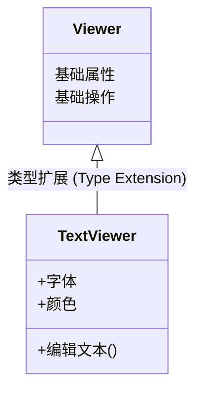
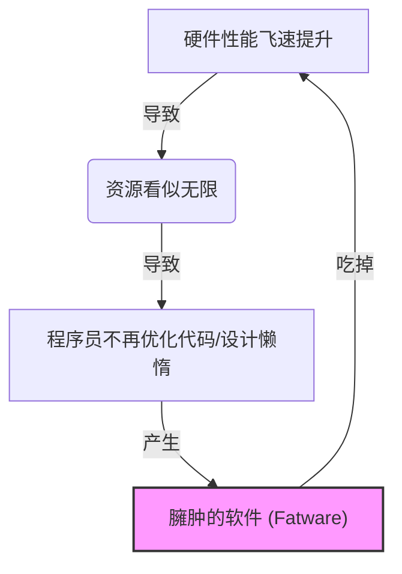
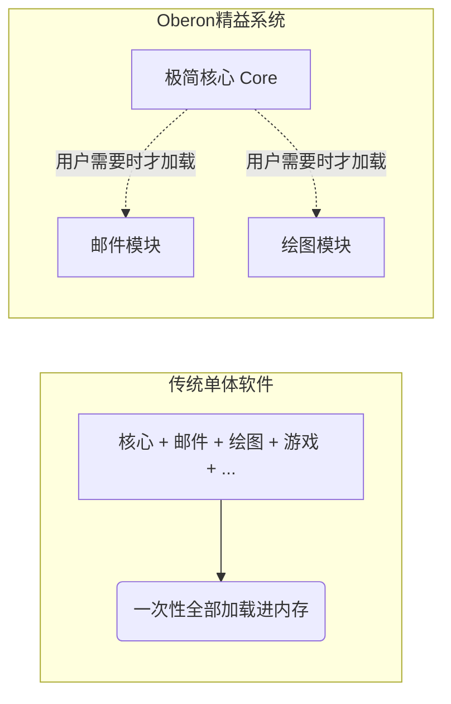
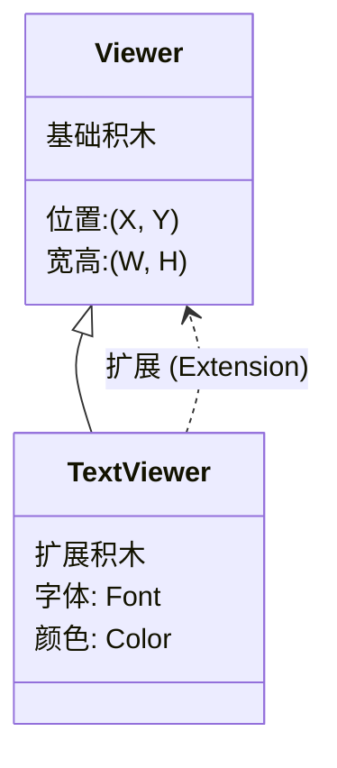

## AI论文解读 | A Plea for Lean Software
        
### 作者        
digoal        
        
### 日期        
2025-11-25        
        
### 标签        
PostgreSQL , PolarDB , DuckDB , AI , 论文解读        
        
----        
        
## 背景  
      
https://cr.yp.to/bib/1995/wirth.pdf        
  
提示:          
```          
读懂《A Plea for Lean Software》这篇论文需要提前掌握哪些基础知识, 请使用中文通熟易懂的讲解这些基础知识, 可以引用论文中的图、表或使用Markdown支持的图形(text,mermaid等)增加解释性. 
  
使用中文通熟易懂的解读《A Plea for Lean Software》这篇论文, 其中的关键内容请着重讲解, 可以引用论文中的图、表或使用Markdown支持的图形(text,mermaid等)增加解释性. 
  
提取《A Plea for Lean Software》这篇论文中的重要术语, 使用中文对这些术语进行通熟易懂的讲解, 可以引用论文中的图、表或使用Markdown支持的图形(text,mermaid等)增加解释性. 
```     
  
## 1 前置知识 
  
要读懂 Niklaus Wirth（尼克劳斯·维尔特，Pascal 之父）的这篇《A Plea for Lean Software》（精益软件的呼吁），你需要掌握以下几个核心领域的计算机基础知识。这篇文章虽然不长，但它是这位计算机科学泰斗对当时（1995年）软件工程发展方向的深刻批判，涉及了硬件、编程语言理论和系统架构。

以下是为你整理的必读基础知识，配合图解帮助理解：

### 1\. 摩尔定律与“软件膨胀” (Moore's Law vs. Software Bloat)

**核心概念：**
你需要理解硬件性能（CPU速度、内存容量）是如何飞速增长的，以及软件是如何“吃掉”这些性能的。

  * **背景：** 文章提到 Intel 80x86 系列处理器在1978到1993年间性能提升了335倍，晶体管密度提升了100多倍 。
  * **Wirth 的观点：** 硬件变快了，但软件变慢了。Wirth 引用了 Reiser 定律：“软件变慢的速度比硬件变快的速度还要快” 。这就是所谓的“Fat Software”（肥胖软件）。
  * **你需要懂：** 什么是 RAM（内存）以及为什么它是有限资源。Wirth 抱怨现在的文本编辑器需要几兆字节，而以前只要 8,000 字节 。


### 2\. 静态类型 vs. 动态类型 (Static vs. Dynamic Typing)

**核心概念：**
这是 Wirth 攻击 C 和 C++ 语言的核心论据。你需要理解编程语言是如何处理“数据类型”的。

  * **强类型/静态类型 (Strong/Static Typing)：**
      * **定义：** 变量在编译时必须明确类型（如整数、字符），且不能随意混用。
      * **Wirth 的观点：** 抽象只能在严格静态类型的语言中生效 。静态类型允许编译器在程序运行前就发现错误 。
  * **弱类型/“什么都行” (Weak Typing / "Everything goes")：**
      * **定义：** 允许隐式转换，或者像汇编语言一样直接操作内存。
      * **Wirth 的观点：** C 语言就像汇编代码，缺乏类型检查，这导致了概念错误难以被发现 。

**图解比喻：**

  * **静态类型（Wirth 提倡）：** 就像儿童形状分类玩具。圆形的积木只能放进圆孔。如果试图把方形积木放进圆孔，**在出厂前（编译时）** 就会被拦住。
  * **弱类型（C 语言）：** 只要你能把积木锤进去，或者把孔凿大，它就让你放。问题只有在**玩具送到孩子手上（运行时）** 才会爆炸。

### 3\. 模块化与接口 (Modularity and Interfaces)

**核心概念：**
如何将一个巨大的软件拆分成小的、可管理的部分。

  * **单体设计 (Monolithic Design)：** 所有功能都塞在一个大系统里。Wirth 批评这种设计让用户为他们不用的功能买单 。
  * **模块化 (Modularity)：**
      * **定义：** 系统由独立的“模块”组成，通过预定义的“接口”通信。
      * **Wirth 的 Oberon 系统：** 这是一个极其精简的系统，核心不足 200KB 。如果你需要收发邮件，系统才会加载邮件模块，不需要时就不加载 。

**你需要懂的术语：**

  * **Import/Export (导入/导出)：** 模块向外提供什么功能（Export），以及它需要什么功能（Import）。

### 4\. 面向对象编程 (OOP) 与类型扩展 (Type Extension)

**核心概念：**
Wirth 对 OOP 有独特的见解，他更喜欢用“类型扩展”这个词。

  * **传统 OOP 术语：** Class (类), Instance (实例), Method (方法), Inheritance (继承)。
  * **Wirth 的术语：**
      * 他避免使用 "Class"，坚持使用 "Type" (类型) 。
      * 他避免使用 "Method"，坚持使用 "Procedure" (过程) 。
      * **关键概念 - 类型扩展 (Type Extension)：** 比如你定义了一个基本的 `Viewer`（视图），然后你可以定义一个 `TextViewer`（文本视图）来扩展它。所有对 `Viewer` 有效的操作，对 `TextViewer` 也有效 。这保证了系统的可扩展性。




### 5\. 编译、链接与加载 (Compilation, Linking, and Loading)

**核心概念：**
你需要了解代码是如何变成可执行程序的，才能理解 Wirth 为什么说他的 Oberon 系统很高效。

  * **传统流程：**
    1.  编译 (Source -\> Object Code)
    2.  **链接 (Linking)** ：把所有模块拼死在一起，生成一个巨大的可执行文件（Core Image）。Wirth 指出这很慢且复杂 。
    3.  加载 (Loading)：把大文件读入内存。
  * **Oberon 的流程：**
      * **按需加载 (Load on demand)：** 没有巨大的链接步骤。当你点击一个命令时，如果那个模块不在内存里，系统立刻找到它并加载 。链接和加载是同时发生的，非常快。

### 总结：阅读此文的心态准备

当你阅读这篇文章时，想象你正在听一位极简主义建筑师（Wirth）批评现在的摩天大楼（现代软件）：

  * 他认为现在的楼盖得太浮夸，那是**因为水泥和砖块（硬件）变得太便宜了** 。
  * 他认为真正的工程师应该用最少的材料造出最坚固的房子（精益软件）。
  * 他非常讨厌 C++，认为它是披着羊皮的狼（没有真正的强类型支持）。

掌握以上 5 点，你就能轻松理解为什么 Wirth 会发出“A Plea for Lean Software”的呼吁了。
  
## 2 解读论文 
  
这篇论文《A Plea for Lean Software》（精益软件的呼吁）是计算机科学泰斗 Niklaus Wirth（Pascal 之父）在 1995 年写的一篇经典檄文。

虽然文章写于 30 年前，但它指出的问题在今天不仅没有消失，反而愈演愈烈。Wirth 在文中痛斥了软件行业的“肥胖症”，并给出了他的解药——**Oberon 系统**。

以下是这篇论文的通俗解读：

### 核心论点：软件为什么变“胖”了？

Wirth 开篇就扔出了一个核心观察： **软件体积的增长速度，远远超过了它功能的增长速度。** 

他引用了两条半开玩笑但极其真实的定律来描述这个现状：

1.  **帕金森定律 (Parkinson's Law)：** 软件会自动膨胀，直到填满所有可用的内存 。
2.  **雷瑟定律 (Reiser's Law)：** 软件变慢的速度，比硬件变快的速度还要快 。

#### 1\. 硬件进步成了“帮凶”

Wirth 认为，正是因为硬件（CPU、内存）发展得太快太便宜，才惯坏了软件工程师 。

  * **以前：** 只有 8KB 内存，程序员必须精打细算，写出极简的代码 。
  * **现在：** 内存动辄几兆（这是1995年的标准，现在是几G），程序员不再关心效率，甚至认为“反正硬件会变快，软件写烂点没关系” 。




#### 2\. 错误的“功能主义”与营销

  * **功能堆砌：** 软件商为了卖新版本，必须不断加新功能，哪怕用户根本用不到 。Wirth 批评这种“单体设计”（Monolithic Design），即把所有可能用到的功能都塞进一个系统里，让所有用户为此买单 。
  * **复杂 = 强大？** 人们产生了一种错觉，觉得软件越复杂、说明书越厚（几百页），就越“专业” 。Wirth 说这简直荒谬，这只能说明设计得烂，或者厂商想通过复杂性“绑架”用户，让他们依赖售后服务 。

#### 3\. 赶工期 (Time Pressure)

为了抢占市场，没人愿意花时间仔细打磨设计。大家都是先通过粗制滥造抢第一，然后再通过打补丁来修补问题，导致软件越来越肿 。

-----

### Wirth 的解药：Oberon 项目

Wirth 不仅仅是在抱怨，他和同事 Jurg Gutknecht 两两个人，花了三年时间，从零开始（包括编译器、操作系统、编辑器）做了一个名为 **Oberon** 的系统，来证明“精益软件”是可行的 。

Oberon 的核心仅占不到 **200KB** ，却能完成文档处理、编程、绘图等工作。他是怎么做到的？

#### 1\. 只保留“必需品” (Essentials Only)

Oberon 砍掉了所有“花哨但不必要”的功能。比如基础系统里没有复杂的图标和弹出菜单，只有文本交互 。

#### 2\. 真正的模块化与“按需加载”

这是 Oberon 最精髓的地方。

  * **传统软件（单体）：** 像一把巨型瑞士军刀，带了100种工具，你只想削个苹果，却得把整把刀（包括锯子、剪刀、甚至激光笔）都背在身上。
  * **Oberon（模块化）：** 你手里只有一个刀柄（核心系统）。你想削苹果？系统自动插上刀片（加载模块）。你想剪纸？系统拔下刀片，插上剪刀。
  * **技术实现：** Oberon 没有传统的“链接”（Linking）阶段。当你在文档里点击一个命令时，如果那个模块不在内存里，系统立刻加载它 。




#### 3\. 强类型与类型扩展 (Strong Typing & Type Extension)

Wirth 极其强调编程语言的作用。他认为 **C 语言是灾难**，因为它允许程序员乱来（弱类型），像汇编语言一样不安全 。
Oberon 语言不仅是**强类型**（编译器能帮你抓错），还引入了**类型扩展**：

  * 你不需要修改旧的代码，就能在旧的数据类型上“长”出新的功能 。
  * 比如：核心系统定义了“文本”，邮件模块不需要重写文本处理功能，直接继承并扩展“文本”变成“邮件消息”，就能直接用核心系统的编辑器来编辑邮件 。

-----

### 给软件工程师的 9 条教训

在论文结尾，Wirth 总结了从 Oberon 项目中学到的 9 条经验，这也是他对所有开发者的建议 ：

1.  **强类型语言是关键：** 它是设计复杂系统最有效的工具，能把错误消灭在萌芽阶段 。
2.  **模块拆分最难：** 设计系统最难的部分是决定如何拆分模块，以减少重复代码 。
3.  **可扩展性是精益的前提：** 只有系统易于扩展，你才敢在开始时把核心做得足够小 。
4.  **选对原语：** 找到那些最灵活的基础积木 。
5.  **人多没用：** 复杂的系统不需要一支大军来开发。如果一个系统复杂到无法被一个人完全理解，那它就不应该被造出来 。
6.  **沟通成本：** 团队越大，沟通越难，最后变成灾难 。
7.  **甚至每一行代码都要精简：** 程序员的能力应该看他能用多简单的方案解决问题，而不是看他每天写了多少行代码 。
8.  **亲力亲为：** 经理和设计师必须自己写代码，也必须自己使用产品。这是消除冗余和错误的最好办法 。
9.  **把代码当文章写：** 代码应该写得像出版物一样优美，不仅给机器读，也要给人读 。

### 总结

Wirth 最后的呼吁非常感人： **软件膨胀并不是“自然规律”，它是可以避免的。**  即使在今天，如果我们愿意像 Oberon 那样专注于本质、严谨设计，我们依然可以造出小巧、飞快且强大的软件。
  
## 3 术语 
  
这篇论文充满了尼克劳斯·维尔特（Niklaus Wirth）对于软件工程的深刻见解。为了让你更轻松地理解，我提取了文中的核心术语，并用通俗的语言配合图解进行解释。

### 1\. 肥胖软件 (Fat Software / Software Explosion)

**原文提及：** 

**通俗解释：**
这是维尔特对现代软件现状的讽刺。指的是软件体积（占用的内存和磁盘空间）疯狂增长，但其实际提供的功能并没有同比例增加 。
维尔特认为，软件之所以变“胖”，是因为硬件发展太快（摩尔定律让内存变得太便宜），导致程序员变得懒惰，不再精心设计代码，而是依赖硬件升级来掩盖软件的低效 。

**维尔特引用的两条“定律”来描述这个现象 ：**

  * **帕金森定律 (Parkinson's Law)：** 软件会自动膨胀，直到填满所有可用的内存 。
  * **雷瑟定律 (Reiser's Law)：** 软件变慢的速度，比硬件变快的速度还要快 。


### 2\. 单体设计 (Monolithic Design)

**原文提及：** 

**通俗解释：**
想象你去买一把瑞士军刀，但厂商卖给你的是一个像砖头一样重的大铁块，里面塞满了锯子、锤子、甚至还有吹风机。不管你用不用，你都得背着它，而且必须为所有功能买单。
这就是“单体设计”。所有可能的功能都被死死地焊接在系统里 。用户不仅要为这些不需要的功能付费，还要忍受系统因此变得庞大和迟钝 。

**维尔特的方案：**
他提倡**模块化**。只提供一个极简的核心（刀柄），当你需要写文档时，再插上“文本编辑”模块；需要发邮件时，再插上“邮件”模块 。

### 3\. 静态类型 (Static Typing)

**原文提及：** 

**通俗解释：**
维尔特非常看重编程语言的严谨性。

  * **“什么都行”的语言 (如 C 语言)：** 就像去自助餐厅，你想把冰淇淋倒在牛排上也没人管你。这种自由很危险，因为很多逻辑错误只有在吃坏肚子（程序崩溃）时才会被发现 。
  * **静态类型语言 (如 Oberon)：** 就像严格的安检。在程序运行之前（编译阶段），编译器就会检查所有数据是否匹配。如果你试图把“文字”塞进“数字”的格子里，安检员当场就会把你拦下来，不让你通过 。

维尔特认为，静态类型是快速开发复杂且稳定系统的关键，因为它能帮程序员提前发现大量错误 。

### 4\. 类型扩展 (Type Extension)

**原文提及：** 

**通俗解释：**
这是维尔特对“面向对象编程”的一种更务实、更简洁的叫法。
他不喜欢“类（Class）”、“继承（Inheritance）”这些花哨的词，他更喜欢说“类型扩展” 。

**原理：**
你有一个基础的积木叫 `Viewer`（视图）。你不想修改这个积木，但你想在它的基础上增加显示文字的功能。于是你定义了一个新积木叫 `TextViewer`，它包含了 `Viewer` 的所有特性，但又增加了新的能力。
最关键的是，旧的系统代码依然能认出 `TextViewer` 是 `Viewer` 的一种，不需要重新编译就能兼容 。



### 5\. 按需加载 (Load on Demand)

**原文提及：** 

**通俗解释：**
在传统系统中，启动一个大型软件（如 Word）需要漫长的等待，因为它要把所有功能一次性搬进内存（这就叫 Linked Load Files / Core Images） 。

**Oberon 的做法：**
Oberon 系统启动飞快，因为它一开始几乎什么都不加载。
当你点击“编辑”命令时，系统发现内存里没有编辑器，这才瞬间去硬盘里把编辑器模块抓取过来。当你点击“画图”时，再去抓取画图模块。
这对用户来说是透明的，感觉就像所有功能一直都在，但实际上极其节省内存 。

### 6\. 命令激活 (Command Activation)

**原文提及：** 

**通俗解释：**
在 Oberon 系统中，没有我们要去“运行”的程序，只有等待被调用的“过程”（Procedures） 。
**操作方式：**
只要屏幕上出现了 `Module.Procedure`（模块名.过程名）这样的文字（比如 `M.P`），你用鼠标中键点击这行字，系统就会立刻执行它 。
这使得任何一段普通的文本都可以变成操作菜单，不需要专门编写复杂的图形界面按钮 。

### 7\. Oberon 系统 (The Oberon System)

**原文提及：** 

**通俗解释：**
这是维尔特为了证明他的理论而实际造出来的软件系统。

  * **开发人员：** 只有维尔特和 Jurg Gutknecht 两个人 。
  * **包含内容：** 整个操作系统、编译器、编辑器、文件系统、网络系统等 。
  * **体积：** 核心部分不到 **200 KB**（即使在那个年代也小得惊人） 。
  * **目的：** 证明只要设计得当（专注于本质、使用强类型语言），软件可以既小巧、又灵活、还功能强大 。
  
## 参考        
         
https://cr.yp.to/bib/1995/wirth.pdf    
        
<b> 以上内容基于DeepSeek、Qwen、Gemini及诸多AI生成, 轻微人工调整, 感谢杭州深度求索人工智能、阿里云、Google等公司. </b>        
        
<b> AI 生成的内容请自行辨别正确性, 当然也多了些许踩坑的乐趣, 毕竟冒险是每个男人的天性.  </b>        
    
#### [PolarDB 学习图谱](https://www.aliyun.com/database/openpolardb/activity "8642f60e04ed0c814bf9cb9677976bd4")
  
  
#### [PostgreSQL 解决方案集合](../201706/20170601_02.md "40cff096e9ed7122c512b35d8561d9c8")
  
  
#### [德哥 / digoal's Github - 公益是一辈子的事.](https://github.com/digoal/blog/blob/master/README.md "22709685feb7cab07d30f30387f0a9ae")
  
  
#### [About 德哥](https://github.com/digoal/blog/blob/master/me/readme.md "a37735981e7704886ffd590565582dd0")
  
  

  
