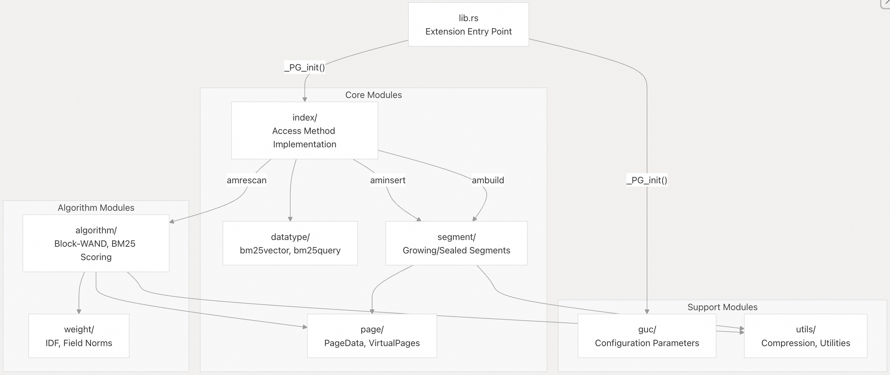
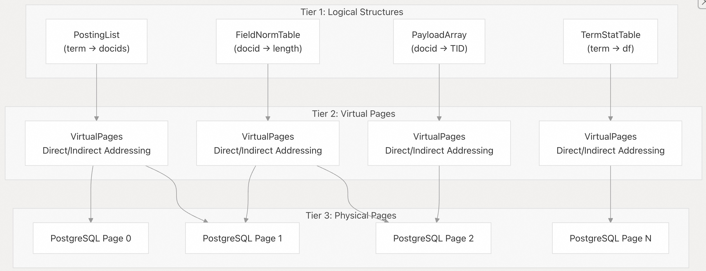
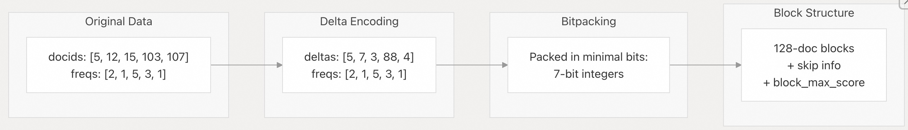
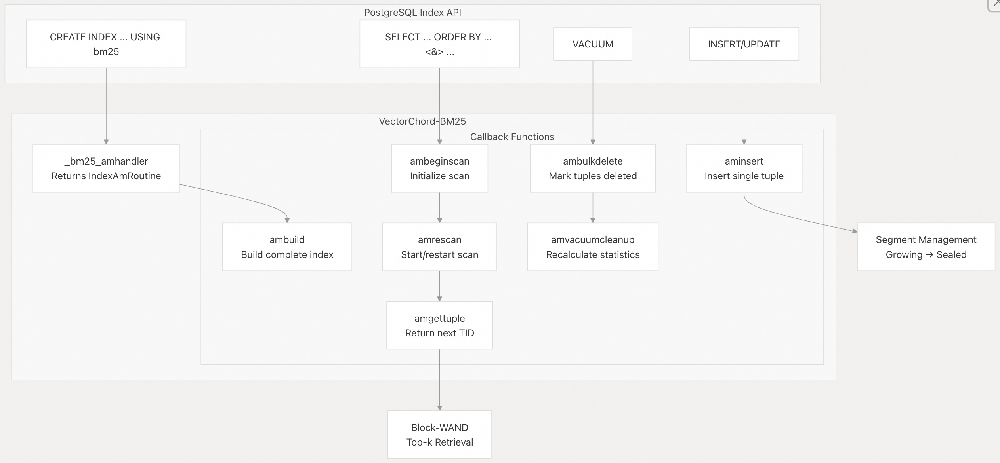

## VectorChord-bm25 源码学习: 4 实施细节（Implementation Details）   
                                                          
### 作者                                                          
digoal                                                          
                                                          
### 日期                                                          
2025-11-25                                                          
                                                          
### 标签                                                          
VectorChord-bm25 , 源码学习 , 全文检索 , 关键词检索 , TF , IDF , 相关性排序 , ranking , Block-WeakAnd , Block-WAND , tsvector , ts_rank                                                            
                                                          
----                                                          
                                                          
## 背景                                   
本节深入探讨了 `VectorChord-BM25` (向量弦-BM25) 的内部实现，旨在帮助开发人员进行系统开发或扩展。它涵盖了数据结构设计（data structure design）、内存管理模式（memory management patterns）、压缩算法（compression algorithms），以及与 `PostgreSQL` 内部 API 的集成（integration）。  
  
## 范围与组织（Scope and Organization）  
  
实现细节分为五个关键子部分：  
  
| 章节（Section） | 焦点（Focus） | 关键关注点（Key Concerns） |  
| :--- | :--- | :--- |  
| [倒排列表（Posting Lists）]() | 倒排索引结构（Inverted index structure） | `Delta-bitpack` 压缩（compression）、游标遍历（cursor traversal）、块编码（block encoding） |  
| [段管理（Segment Management）]() | 增长中/密封段（Growing/sealed segments） | 写入优化（Write optimization）、密封触发器（sealing triggers）、段转换（segment transitions） |  
| [清理与维护（Vacuuming & Maintenance）]() | 索引清理（Index cleanup） | 批量删除（Bulk deletion）、统计信息重新计算（statistics recalculation）、位图管理（bitmap management） |  
| [字段范数处理（Field Norm Handling）]() | 文档长度归一化（Document length normalization） | 量化（Quantization）、查找表（lookup tables）、`BM25` 参数集成（parameter integration） |  
| [页面管理（Page Management）]() | `PostgreSQL` 页面操作（page operations） | `RAII` 模式（patterns）、`XLog` 集成、页面拆分（page splitting） |  
  
## 模块结构（Module Structure）  
  
代码库被组织成不同的模块（modules），每个模块负责 `BM25` 索引实现的一个特定方面：  
  
  
  
**模块职责（Module Responsibilities）：**  
  
  * **`datatype/`**：定义了带有序列化（serialization）的 `bm25vector`（分词后的文档）和 `bm25query`（搜索查询）类型。  
  * **`index/`**：实现了 `PostgreSQL` 的索引访问方法 API（Index Access Method API），例如 `ambuild`、`aminsert`、`amrescan` 等。  
  * **`page/`**：为多块结构提供了 `PageData` 抽象和虚拟页面系统（virtual page system）。  
  * **`segment/`**：管理增长段（growing segments，为写入优化）和密封段（sealed segments，为读取优化）。  
  * **`algorithm/`**：实现了 `Block-WAND` `top-k` 检索（retrieval）和 `BM25` 评分逻辑（scoring logic）。  
  * **`weight/`**：处理 `IDF`（逆文档频率）计算（calculation）、字段范数量化（field norm quantization）和术语统计信息（term statistics）。  
  * **`guc/`**：注册和管理配置参数（configuration parameters）（`bm25_catalog.*` 设置）。  
  * **`utils/`**：提供压缩工具（`delta-bitpack`）和辅助函数（helper functions）。  
  
来源:  
[`src/lib.rs` 1-65](https://github.com/tensorchord/VectorChord-bm25/blob/da0908a6/src/lib.rs#L1-L65)  
  
## 实现模式（Implementation Patterns）  
  
### 使用 pgrx 进行内存管理（Memory Management with pgrx）  
  
该扩展使用 `pgrx` 框架（framework）来安全地与 `PostgreSQL` 的 C API 进行接口。关键模式包括：  
  
**受保护函数（Guarded Functions）** ：所有 `PostgreSQL` 回调（callbacks）都使用 `#[pg_guard]` 来处理 `panic`（程序崩溃）和内存上下文（memory contexts）。  
  
  
  
**内存上下文（Memory Contexts）** ：`PostgreSQL` 的内存上下文用于自动清理（automatic cleanup）。短寿命的分配（allocations）使用 `CurrentMemoryContext`，而索引生命周期数据使用专用的上下文（dedicated contexts）。  
  
**RAII 守卫（RAII Guards）** ：`PageData` 结构体（struct）实现了 `RAII`（Resource Acquisition Is Initialization，资源获取即初始化）模式，以确保页面被正确锁定和解锁：  
  
  * 页面在创建时被锁定（locked on creation）。  
  * 在 `drop` 时自动解锁（Automatically unlocked on drop）。  
  * 即使在 `panic` 期间也能防止内存泄漏（leaks）。  
  
### 数据结构分层（Data Structure Layering）  
  
该实现使用了三层存储层次结构（three-tier storage hierarchy）：  
  
  
  
这种分层允许：  
  
  * **逻辑结构（Logical structures）** 可以任意大，无需担心页面边界（page boundaries）。  
  * **虚拟页面（Virtual pages）** 提供跨多个物理页面的连续寻址（continuous addressing）。  
  * **物理页面（Physical pages）** 遵循 `PostgreSQL` 固定的 8KB 页面格式（page format）。  
  
来源:  
[`src/lib.rs` 3-10](https://github.com/tensorchord/VectorChord-bm25/blob/da0908a6/src/lib.rs#L3-L10)  
  
## 压缩与编码（Compression and Encoding）  
  
### Delta-Bitpack 压缩（Delta-Bitpack Compression）  
  
倒排列表（Posting lists）使用 `delta-bitpack` 压缩来最小化存储空间：  
  
  
  
**关键特性（Key Features）：**  
  
  * `Docid`（文档 ID）经过排序，允许进行增量编码（delta encoding）。  
  * 每个 128 文档块使用其增量所需的最小位数。  
  * 块头（Block headers）存储元数据（metadata）以便快速跳过（fast skipping）。  
  * `block_max_score` 启用 `Block-WAND` 剪枝（pruning）。  
  
### 字段范数量化（Field Norm Quantization）  
  
文档长度（Document lengths）使用一个 256 条目的查找表（lookup table）量化为 8 位值：  
  
| 原始长度范围（Original Length Range） | 量化值（Quantized Value） | 近似 `BM25` 因子（Approximate BM25 Factor） |  
| :--- | :--- | :--- |  
| 0-10 | 0-50 | 对短文档有高提升（High boost for short docs） |  
| 10-100 | 50-150 | 线性缩放（Linear scaling） |  
| 100-1000 | 150-230 | 收益递减（Diminishing returns） |  
| 1000+ | 230-255 | 最小惩罚（Minimal penalty） |  
  
这使得每个文档的内存使用从 4 字节减少到 1 字节，同时保持了 `BM25` 排名质量。  
  
来源:  
[`src/lib.rs` 1-11](https://github.com/tensorchord/VectorChord-bm25/blob/da0908a6/src/lib.rs#L1-L11)  
  
## 访问方法集成（Access Method Integration）  
  
该扩展通过索引访问方法 API（Index Access Method API）与 `PostgreSQL` 集成：  
  
  
  
**初始化（Initialization）** ：位于 [`src/lib.rs` 32-36](https://github.com/tensorchord/VectorChord-bm25/blob/da0908a6/src/lib.rs#L32-L36) 的 `_PG_init()` 函数调用了：  
  
  * `index::init()` - 注册访问方法处理器（access method handler）。  
  * `guc::init()` - 注册配置参数（configuration parameters）。  
  
**处理器注册（Handler Registration）** ：`_bm25_amhandler` 返回一个 `IndexAmRoutine` 结构体（struct），其中包含指向所有回调实现（callback implementations）的函数指针（function pointers）。  
  
来源:  
[`src/lib.rs` 32-36](https://github.com/tensorchord/VectorChord-bm25/blob/da0908a6/src/lib.rs#L32-L36)  
  
## 配置与调优（Configuration and Tuning）  
  
全局统一配置（Global Unified Configuration, `GUC`）参数控制实现行为：  
  
| 参数（Parameter） | 模块（Module） | 影响（Effect） |  
| :--- | :--- | :--- |  
| `bm25_catalog.enable_prefilter` | `algorithm/` | 在 `Block-WAND` 期间启用 `MVCC` 预过滤（prefiltering） |  
| `bm25_catalog.segment_growing_max_page_size` | `segment/` | 在密封增长段（sealing growing segment）前的页数 |  
| `bm25_catalog.bm25_limit` | `algorithm/` | `Top-k` 限制（-1 表示暴力搜索，brute force） |  
| `bm25_catalog.bm25_k1` | `weight/` | `BM25` 词频饱和度（term frequency saturation） |  
| `bm25_catalog.bm25_b` | `weight/` | `BM25` 长度归一化因子（length normalization factor） |  
  
这些参数在 `guc::init()` 期间注册，并在整个实现过程中被访问，以控制算法行为。  
  
来源:  
[`src/lib.rs` 35-35](https://github.com/tensorchord/VectorChord-bm25/blob/da0908a6/src/lib.rs#L35-L35)  
  
## 线程安全与并发（Thread Safety and Concurrency）  
  
该实现处理 `PostgreSQL` 的并发模型（concurrency model）：  
  
**读取并发（Read Concurrency）** ：多个索引扫描（index scans）可以并发进行：  
  
  * 读取者（Readers）对索引页面获取 `AccessShareLock`。  
  * 虚拟页面（Virtual pages）一旦写入即不可变（immutable）。  
  * 密封段（Sealed segments）永不修改，从而实现无锁读取（lock-free reads）。  
  
**写入序列化（Write Serialization）** ：索引插入（Index inserts）在关系（relation）级别进行序列化：  
  
  * 增长段（Growing segments）在修改期间使用排他锁（exclusive locks）。  
  * 段密封（Segment sealing）原子地（atomically）创建新的密封段。  
  * 删除位图（Delete bitmap）在可能的情况下使用原子位操作（atomic bit operations）。  
  
**MVCC 集成（MVCC Integration）** ：索引遵循 `PostgreSQL` 的快照隔离（snapshot isolation）：  
  
  * 倒排列表中的 `TID`（元组 ID）可能指向不可见的元组（non-visible tuples）。  
  * `check_mvcc()` 在扫描期间过滤结果。  
  * `Vacuum` 清理操作删除真正已删除元组的条目。  
  
## 平台要求（Platform Requirements）  
  
该扩展在编译时强制执行平台约束（platform constraints）：  
  
```rust
// From src/lib.rs:19-20
#[cfg(not(all(target_endian = "little", target_pointer_width = "64")))]
compile_error!("Target is not supported.");
```
  
**要求（Requirements）：**  
  
  * **小端序（Little-endian）** ：确保一致的二进制序列化（binary serialization）。  
  * **64 位指针（64-bit pointers）** ：大型索引结构和 `PostgreSQL` 集成所需。  
  * **PostgreSQL 13-18**：在 [`src/lib.rs` 22-30](https://github.com/tensorchord/VectorChord-bm25/blob/da0908a6/src/lib.rs#L22-L30) 处检查。  
  
这些约束通过避免字节序（byte-order）转换和指针大小（pointer size）变化来简化实现。  
  
来源:  
[`src/lib.rs` 19-30](https://github.com/tensorchord/VectorChord-bm25/blob/da0908a6/src/lib.rs#L19-L30)  
  
## 子章节概述（Subsection Overview）  
  
以下子章节提供了特定实现领域的详细介绍：  
  
  * **[倒排列表（Posting Lists）]()** ：带有 `delta-bitpack` 压缩、块编码（block encoding）、基于游标（cursor-based）的遍历和跳过信息（skip information）的倒排索引结构。  
  * **[段管理（Segment Management）]()** ：用于快速写入的增长段（growing segment）架构、用于优化读取的密封段（sealed segment）格式以及段转换逻辑（segment transition logic）。  
  * **[清理与维护（Vacuuming & Maintenance）]()** ：批量删除协议（bulk deletion protocol）、删除位图（delete bitmap）管理、术语统计信息重新计算以及索引健康维护。  
  * **[字段范数处理（Field Norm Handling）]()** ：文档长度量化、256 条目查找表生成以及与 `BM25` 评分的集成。  
  * **[页面管理（Page Management）]()** ：`PageData` `RAII` 包装器、虚拟页面寻址（直接/间接）、用于持久性的 `XLog` 集成以及项级操作（item-level operations）。  
  
每个子章节都将高层设计概念（high-level design concepts）与具体的代码实现（code implementations）联系起来，提供了理解、修改或扩展系统所需的细节。  
  
来源:  
[`src/lib.rs` 1-65](https://github.com/tensorchord/VectorChord-bm25/blob/da0908a6/src/lib.rs#L1-L65)  
  
-----  
  
# 附录1: 性能调优与相关性：如何配置 BM25 参数以优化我的搜索结果？  
  
* **背景痛点：** 不同的数据集（文档长度、词汇分布）需要不同的 `BM25` 权重才能获得最佳搜索相关性。  
* **实施细节：** 文档提到了 `bm25_k1`（词频饱和度）、`bm25_b`（长度归一化因子）和 `bm25_limit`（`top-k` 限制）是 **GUC 参数**，它们直接控制算法行为。  
* **关键问题：**  
    > **`BM25` 评分算法中的 `k1` 和 `b` 等参数以及 `top-k` 限制 (`bm25_limit`) 是可配置的。作为用户，我应该如何根据我的文档集合特性（例如，文档长度分布）和查询需求（例如，侧重相关性还是查询速度），来调整这些 **GUC 参数**以达到最佳的搜索性能与准确性平衡？**  
  
## 回答  
  
根据代码库的分析,我需要澄清一个重要的事实:**VectorChord-BM25 目前并不支持配置 `k1` 和 `b` 参数**。  
  
## 当前可配置的参数  
  
VectorChord-BM25 只提供了以下 GUC 参数:    
  
1. **`bm25_catalog.bm25_limit`** - 控制返回的最大文档数量  
2. **`bm25_catalog.enable_index`** - 是否启用 BM25 索引  
3. **`bm25_catalog.segment_growing_max_page_size`** - 段增长的最大页面大小  
4. **`bm25_catalog.enable_prefilter`** - 是否启用预过滤  
  
**没有 `bm25_k1` 或 `bm25_b` 参数**。  
  
## BM25 权重参数的实际情况  
  
查看 BM25 评分的实现,权重计算在 `Bm25Weight` 结构中完成,但 `k1` 和 `b` 参数是**硬编码**的,不可配置。    
  
在评分计算中使用这些权重:    
  
## 如何优化搜索性能  
  
虽然不能调整 `k1` 和 `b`,但你可以通过调整 `bm25_limit` 来平衡性能和准确性:  
  
### 1. 侧重查询速度  
```sql  
-- 减小 top-k 限制以提高 Block-WAND 的跳过效率  
SET bm25_catalog.bm25_limit = 50;  
```    
  
较小的 `bm25_limit` 值会让 Block-WAND 算法更快地提高阈值,从而跳过更多不相关的文档块。    
  
### 2. 侧重相关性/完整性  
```sql  
-- 使用暴力扫描返回所有相关文档  
SET bm25_catalog.bm25_limit = -1;  
```    
  
当设置为 `-1` 时,系统会对所有文档进行评分,返回所有得分大于 0 的文档。  
  
### 3. 有过滤条件的查询  
```sql  
-- 增加限制以确保过滤后仍有足够结果  
SET bm25_catalog.bm25_limit = 500;  
```    
  
如果查询包含 WHERE 条件,可能需要更大的 `bm25_limit` 以确保过滤后仍有足够的结果。  
  
## Notes  
  
如果你确实需要调整 BM25 的 `k1` 和 `b` 参数来适应特定的文档集合特性,目前需要修改源代码并重新编译扩展。这些参数在 `src/weight.rs` 中定义(虽然该文件未在提供的代码片段中显示)。  
  
文档长度归一化和词频饱和度的调整对于不同类型的文档集合(如短文本 vs 长文档)确实很重要,但这不是当前版本通过配置即可实现的功能。  
  
  
  
-----  
  
# 附录2: 索引维护与效率：我需要多久执行一次 VACUUM 操作来保持索引健康？  
  
* **背景痛点：** 索引的碎片化和过期数据（特别是高写入负载下）会降低查询速度和浪费磁盘空间，用户需要知道何时进行维护。  
* **实施细节：** 提到了“段管理”（Growing/Sealed Segments）和专门的“清理与维护”（Vacuuming & Maintenance）机制来处理批量删除和 `MVCC` 集成。  
* **关键问题：**  
    > **索引的实现涉及“增长段”（Growing Segments）和“密封段”（Sealed Segments），以及专门的“清理与维护”（Vacuuming & Maintenance）机制来处理批量删除和过期数据。作为一个日常用户，我需要多久或在什么条件下执行 **`VACUUM`** 命令？如果索引长期不清理，会对查询性能和磁盘空间造成什么负面影响？**  
  
## 回答  
  
关于 VectorChord-BM25 索引的 VACUUM 维护  
  
您询问的是 VectorChord-BM25 索引中何时需要执行 `VACUUM` 命令，以及长期不清理的影响。  
  
## VACUUM 的触发时机  
  
VectorChord-BM25 使用 PostgreSQL 标准的 VACUUM 机制，通过两个阶段处理删除操作：    
  
### 自动触发场景  
  
1. **PostgreSQL 自动 VACUUM**：当表中的死元组（dead tuples）达到阈值时自动触发  
2. **手动 VACUUM**：执行 `VACUUM table_name;` 命令  
3. **VACUUM FULL**：执行 `VACUUM FULL` 会完全重建索引  
  
### 何时需要手动执行  
  
您应该在以下情况考虑手动执行 VACUUM：  
  
- **高频删除/更新操作后**：大量 DELETE 或 UPDATE 操作会在删除位图中标记文档为已删除    
- **查询性能下降时**：如果发现查询变慢，可能是因为删除位图中有大量已删除文档  
- **磁盘空间异常时**：虽然 BM25 索引使用删除位图而不是立即物理删除，但 term statistics 需要重新计算  
  
## 长期不清理的负面影响  
  
### 1. 查询性能下降  
  
**原因**：删除位图会持续增长，每次查询都需要检查更多的已删除文档    
  
在扫描过程中，系统会检查每个文档是否被删除：    
  
### 2. BM25 评分不准确  
  
**关键问题**：Term statistics（词频统计）不会自动更新，导致 IDF 计算错误  
  
`ambulkdelete` 只标记删除，不更新 term statistics：    
  
只有 `amvacuumcleanup` 才会重新计算每个词的文档频率：    
  
这意味着 BM25 的 IDF 分数会基于过时的文档计数，影响排序准确性。  
  
### 3. 磁盘空间浪费  
  
虽然 BM25 索引使用删除位图而非物理删除，但以下数据仍会占用空间：  
  
- **Payload 数据**：已删除文档的 TID 仍存储在 payload 中    
- **Field norm 数据**：文档长度归一化值仍占用空间    
- **Posting lists**：密封段中的倒排列表包含已删除文档的条目  
  
## 维护建议  
  
### 推荐的 VACUUM 策略  
  
```sql  
-- 常规维护（删除操作后）  
VACUUM your_table;  
  
-- 查看 autovacuum 设置  
SHOW autovacuum_vacuum_scale_factor;  
SHOW autovacuum_vacuum_threshold;  
```  
  
  
  
### 配置优化  
  
如果您有高写入负载，可以调整段管理参数：    
  
```sql  
-- 增大 growing segment 大小，减少密封频率  
SET bm25_catalog.segment_growing_max_page_size = 8192;  
```  
  
## Notes  
  
- VectorChord-BM25 的 VACUUM 机制与 PostgreSQL 标准集成，不需要特殊的维护命令    
- 删除位图是关键数据结构，在 index build 时初始化为全 0（所有文档存活）    
- Term statistics 重新计算是 cleanup 阶段最昂贵的操作，需要扫描所有 posting lists    
- 与传统索引不同，BM25 索引不会立即物理删除条目，而是依赖删除位图进行逻辑删除，这是为了避免昂贵的 posting list 重写  
  
-----  
  
# 附录3: 数据处理与精度：字段范数量化对搜索准确度的实际影响是什么？  
  
* **背景痛点：** 用户关心系统对数据的内部处理是否会牺牲搜索结果的质量。  
* **实施细节：** 提到了 **字段范数量化**（Field Norm Quantization），将文档长度压缩为 8 位值（256 个条目），旨在节省内存（从 4 字节降至 1 字节）并保持排名质量。  
* **关键问题：**  
    > **索引使用了 **字段范数量化**（Field Norm Quantization）将文档长度信息压缩为 8 位值。这种有损压缩在实际应用中，对长度极长或极短的文档的 **`BM25` 评分精度**（ranking quality）有何具体影响？用户如何验证或监控这种量化是否影响了他们业务场景下的搜索准确度？**  
  
  
## 回答  
      
您询问的是 VectorChord-BM25 系统中的**字段范数量化**（Field Norm Quantization）机制。    
  
## 量化机制概述  
  
系统使用 `FIELD_NORMS_TABLE` 将文档长度从 32 位整数压缩为 8 位索引（256 个条目）。   量化函数 `fieldnorm_to_id()` 通过二分查找找到最接近的量化值。    
  
## 对 BM25 评分精度的具体影响  
  
### 1. **极短文档（< 40 tokens）**  
量化表在前 40 个值保持 1:1 映射（每个整数都有对应条目）。   因此，**极短文档的评分精度不受影响**。  
  
### 2. **中等长度文档（40-1000 tokens）**  
量化间隔逐渐增大（如 40→42→44，后续为 60→64→68）。   例如，长度为 43 的文档会被量化为 42，相对误差约 2.3%。  
  
### 3. **极长文档（> 1M tokens）**  
量化间隔显著增大。最后几个条目间隔达到 ~134M。   例如，长度为 1.5B 的文档会被量化为 `MAX_FIELD_NORM = 2_013_265_944`，相对误差可达 25%。    
  
### 4. **BM25 评分中的使用**  
在 Block-WAND 算法中，量化后的 `fieldnorm_id` 被转换回近似长度用于评分：    
  
```rust  
let fieldnorm = id_to_fieldnorm(fieldnorm_id);  
let score = scorer.weight.score(fieldnorm, tf);  
```  
  
由于 BM25 公式中文档长度在分母中（通过 `len/avgdl` 归一化），量化误差会直接影响评分。  
  
## 如何验证和监控量化影响  
  
### 方法 1：对比真实长度与量化长度  
您可以查询索引中存储的量化值并与原始文档长度对比：  
  
```sql  
-- 获取文档的量化 field norm ID（需要访问内部存储）  
-- 然后使用 FIELD_NORMS_TABLE 反向查找近似长度  
```  
  
系统在插入时执行量化：    
  
### 方法 2：分析 BlockWand 上界  
系统为每个 128 文档块存储 `blockwand_fieldnorm_id`，用于计算评分上界。   您可以检查这些上界值与实际评分的差异。    
  
### 方法 3：A/B 测试  
- 使用当前量化索引运行查询，记录 top-k 结果  
- 实现一个使用完整 32 位长度的评分函数（在应用层）  
- 对比两组结果的排序差异（如 NDCG、MRR 等指标）  
  
### 方法 4：监控极端文档  
重点关注：  
- **超短文档**（< 10 tokens）：虽然精确量化，但 BM25 可能过度惩罚  
- **超长文档**（> 100K tokens）：量化误差 > 10%，可能导致排序不稳定  
  
您可以在 vacuum 操作时统计文档长度分布：    
  
## Notes  
  
量化设计采用**对数间隔**策略，在常见文档长度范围（40-10K tokens）内保持 < 5% 的相对误差。 这是 BM25 实现中的常见权衡，类似于 Lucene 的 `SmallFloat` 编码。   
  
如果您的业务场景包含大量极长文档（> 1M tokens），建议：  
1. 考虑文档分块策略  
2. 评估是否需要修改 `FIELD_NORMS_TABLE` 以增加高值区间的精度  
3. 使用 `bm25_catalog.bm25_limit = -1` 的暴力模式进行基准测试，对比量化影响  
  
系统不提供内置的量化影响监控工具，需要您在应用层实现上述验证方法。  
  
    
#### [PolarDB 学习图谱](https://www.aliyun.com/database/openpolardb/activity "8642f60e04ed0c814bf9cb9677976bd4")
  
  
#### [PostgreSQL 解决方案集合](../201706/20170601_02.md "40cff096e9ed7122c512b35d8561d9c8")
  
  
#### [德哥 / digoal's Github - 公益是一辈子的事.](https://github.com/digoal/blog/blob/master/README.md "22709685feb7cab07d30f30387f0a9ae")
  
  
#### [About 德哥](https://github.com/digoal/blog/blob/master/me/readme.md "a37735981e7704886ffd590565582dd0")
  
  

  
