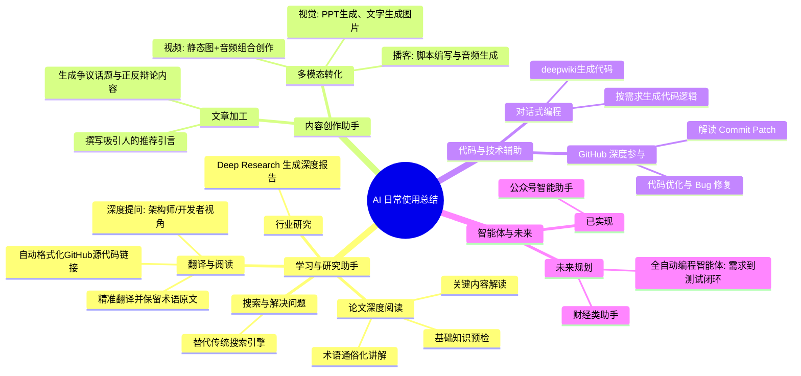

## 德说-第365期, AI 日常使用总结    
                                                            
### 作者                                                            
digoal                                                            
                                                            
### 日期                                                            
2025-11-25                                                            
                                                            
### 标签                                                            
AI , 新质生产力                                                               
                                                            
----                                                            
                                                            
## 背景    
AI 使用已经越来越顺手, 本文是一些日常使用总结.   
  

  
### 搜索解决日常问题
  
0、替代传统搜索引擎, 解决日常问题.  

### 学习助手
  
1、读论文 (gemini pro/Qwen)  
  
常规 prompt  
  
```  
读懂《xxx》这篇论文需要提前掌握哪些基础知识, 请使用中文通熟易懂的讲解这些基础知识, 可以引用论文中的图、表或使用Markdown支持的图形(text,mermaid等)增加解释性.   
使用中文通熟易懂的解读《xxx》这篇论文, 其中的关键内容请着重讲解, 可以引用论文中的图、表或使用Markdown支持的图形(text,mermaid等)增加解释性.   
提取《xxx》这篇论文中的重要术语, 使用中文对这些术语进行通熟易懂的讲解, 可以引用论文中的图、表或使用Markdown支持的图形(text,mermaid等)增加解释性.   
```  
  
2、读代码(deepwiki)  
  
以及回答下面翻译完后提出的问题.  
  
2\.1、读代码, 解读patch; 代码优化给思路, 给代码示例等. 
- github copilot.
  
3、翻译(gemini flash/Qwen)  
  
翻译 deepwiki 的常规 prompt  
````  
你是万能且优秀的助理! 请求你的帮助!   
我不懂英语, 请帮忙翻译这个网页: https://deepwiki.com/tensorchord/VectorChord-bm25/4-implementation-details   
1、要求术语准确, 需同时保留关键术语的原文和译文;   
2、链接要求:   
中括号`[]`引用说明里面的代码路径加上反引号、与行号之间使用空格隔开, 圆括号`()`里面填充URL, 例子:   
```  
Sources:   
[src/page/virtual.rs 10-15]()  
```  
修改为   
```  
来源:   
[`src/page/virtual.rs` 10-15](https://github.com/tensorchord/VectorChord-bm25/blob/da0908a6/src/page/virtual.rs#L10-L15)  
```  
````  
  
翻译 deepwiki 会话中提出问题:  
  
请从用户或开发者或架构师角度, 基于上面翻译的内容, 结合需要展开的细节、背景知识、背景痛点、日常使用或维护动作等, 提3个以内有价值的关键问题. 
  
请从用户或开发者或架构师角度, 基于上面翻译的内容, 提出3个循序渐进的问题, 帮助加深对以上知识的理解和运用!  
  
翻译其他 blog 的常规 prompt: (gemini flash/Qwen)  
```  
你是万能且优秀的助理! 请求你的帮助!   
我不懂英语, 请帮忙翻译这个网页: https://www.crunchydata.com/blog/postgis-performance-improve-bounding-boxes-with-decompose-and-subdivide   
要求:   
1、保持内容原汁原味;  
2、术语准确;  
3、关键术语请同时保留原文和译文;   
```  
  
4、解读 github 项目 patch(gemini flash/Qwen)  
```  
解读这个patch: https://github.com/postgres/postgres/commit/4b203d499c610160e9867e6add2366780429344c   
```  
  
5、总结文章内容(gemini flash/Qwen)  
  
6、行业深度研究报告(gemini flash deep research)  

### 内容创作助手
7、给文章写推荐引言, 吸引用户读完文章(gemini flash/Qwen)  
  
8、基于文章, 生成争议话题和辩论内容.   
  
```
基于 xxx 这篇文章的内容, 以辩论赛的风格, 提炼一个具有争议的话题, 并从正反方的视角, 以激进、活泼且严谨的口语化的方式分别输出一段辩论内容. 
```
  
9、内容创作  
  
根据文章内容, 编写播客脚本(gemini flash/Qwen)  
  
输入文章链接, 直接生成播客音频(豆包)  
  
生成PPT(Google NotebookLM)  
  
文字生成图片, 例如配图、海报背景等 (Google Banana PRO)  
  
静态图片+音频的视频创作(B站上很多这样的创作, 类似小人书/漫画 + 语音解读, 图片专场+解说音频)  
   
10、生成大学生数据库课程教程  
- [《大学生数据库实践课: 大纲 及 教程入口 (容器、大模型、dify、AI搜索、向量搜索、混合搜索、图数据库、优化、竞赛) 》](../202512/20251202_10.md)

### 代码创作助手
   
11、coding, 例如在某个开源项目对应的deepwiki中通过对话, 给出代码逻辑, 并生成代码、修复bug、优化代码等.   
- 例子: [《大学生数据库实践课: 7.5 AI Coding Agent 的使用》](../202601/20260105_01.md)  
   
### 智能体  
12、[公众号智能AI助手](../202502/20250222_02.md)   
  
### 未来想尝试的
1、解放更多劳动力的智能体. 例如编程类, 可以自己按需求进行编程、测试、debug、bugfix、优化的智能体.  
  
2、财经类助手.  
  
  
      
#### [PolarDB 学习图谱](https://www.aliyun.com/database/openpolardb/activity "8642f60e04ed0c814bf9cb9677976bd4")
  
  
#### [PostgreSQL 解决方案集合](../201706/20170601_02.md "40cff096e9ed7122c512b35d8561d9c8")
  
  
#### [德哥 / digoal's Github - 公益是一辈子的事.](https://github.com/digoal/blog/blob/master/README.md "22709685feb7cab07d30f30387f0a9ae")
  
  
#### [About 德哥](https://github.com/digoal/blog/blob/master/me/readme.md "a37735981e7704886ffd590565582dd0")
  
  

  
