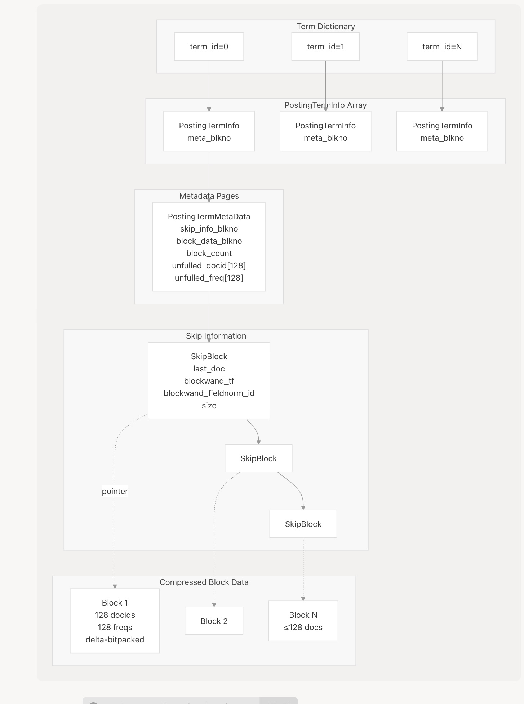
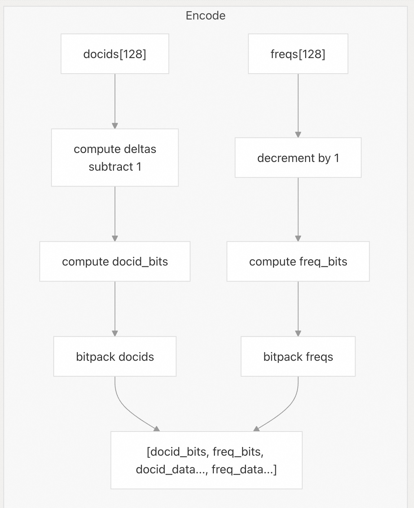
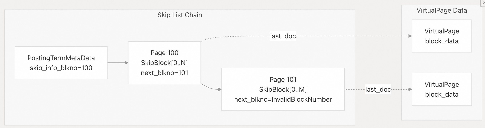
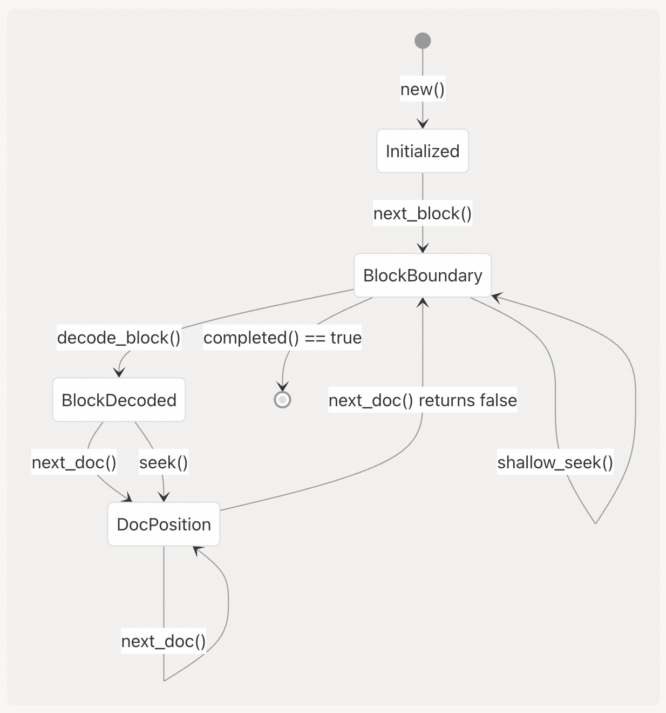
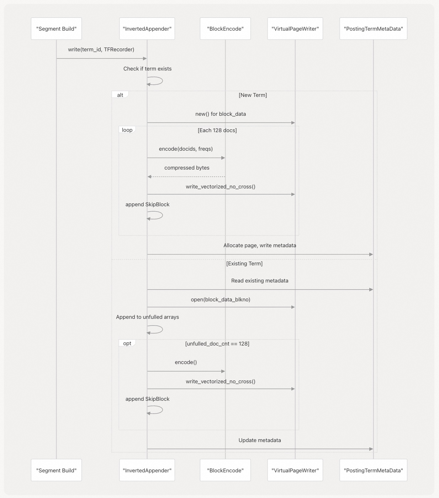
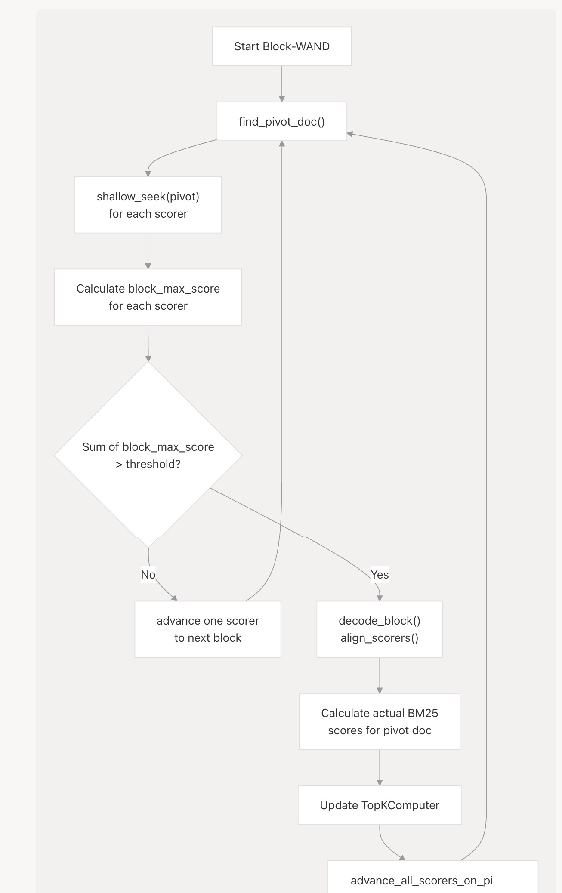

## VectorChord-bm25 源码学习: 4.1 Posting Lists (倒排列表)  
  
### 作者  
digoal  
  
### 日期  
2025-11-25  
  
### 标签  
VectorChord-bm25 , 源码学习 , 全文检索 , 关键词检索 , TF , IDF , 相关性排序 , ranking , Block-WeakAnd , Block-WAND , tsvector , ts_rank  
  
----  
  
## 背景  
本文档描述了 `VectorChord-BM25` 扩展中**倒排列表**（Posting Lists）的实现。倒排列表是**倒排索引**（inverted index）中的核心数据结构，它存储了每个**词条**（term）的**文档引用**（document references），从而能够在 PostgreSQL 中实现高效的基于 **BM25** 的**全文搜索**（full-text search）。本页涵盖了倒排列表的**数据结构设计**（data structure design）、**压缩技术**（compression techniques）和**访问模式**（access patterns）。  
  
## Overview (概述)  
  
**倒排列表**（Posting Lists）构成了将**词条**（terms）映射到**文档**（documents）的**倒排索引**（inverted index）结构。每个词条的倒排列表包含**文档ID**（Document IDs）和**词频**（term frequencies），它们使用 **Delta-位压缩**（delta-bitpacking compression）被压缩成固定大小的**块**（blocks），每个块包含 128 个文档。**跳过信息**（Skip information）支持高效的遍历，而 **Block-WAND 算法**（Block-WAND algorithm）则允许跳过那些无法对 Top-K 结果做出贡献的块。  
  
倒排列表的实现包括三个层次：  
  
1.  **`PostingTermInfo`**：入口点，包含指向**元数据页**（metadata page）的 `meta_blkno` **指针**（pointer）。  
2.  **`PostingTermMetaData`**：元数据，包括**跳过列表**（skip list）位置、**块数据**（block data）位置和**未刷新文档**（unflushed documents）。  
3.  **Compressed Blocks**（压缩块）：经过 **Delta-位压缩**（Delta-bitpacked）的**文档ID**（Document IDs）和**词频**（term frequencies），通过 **VirtualPageWriter**（虚拟页写入器）存储。  
  
### Posting List Architecture (倒排列表架构)  
  
    
  
来源:  
[`src/segment/posting/reader.rs` 12-48](https://github.com/tensorchord/VectorChord-bm25/blob/da0908a6/src/segment/posting/reader.rs#L12-L48)  
[`src/segment/posting/append.rs` 98-119](https://github.com/tensorchord/VectorChord-bm25/blob/da0908a6/src/segment/posting/append.rs#L98-L119)  
  
## Data Structure (数据结构)  
  
### PostingTermInfo and PostingTermMetaData (`PostingTermInfo` 和 `PostingTermMetaData`)  
  
`PostingTermInfoReader` 提供了对存储在 **VirtualPage**（虚拟页）数组中的 `PostingTermInfo` 结构的访问，该数组以 `term_id` 为索引。每个 `PostingTermInfo` 包含一个字段：  
  
  * `meta_blkno`：`PostingTermMetaData` 页的**块号**（Block number）。  
  
`PostingTermMetaData` 结构占据一个完整的 PostgreSQL **页**（page），并包含：  
  
| 字段（Field） | 类型（Type） | 描述（Description） |  
| :--- | :--- | :--- |  
| `skip_info_blkno` | `u32` | **跳过列表链**（skip list chain）的第一个块 |  
| `skip_info_last_blkno` | `u32` | **跳过列表链**的最后一个块（用于追加） |  
| `block_data_blkno` | `u32` | **压缩数据**（compressed data）的 **VirtualPage**（虚拟页）起始块 |  
| `block_count` | `u32` | 块总数（包括未填满的块） |  
| `unfulled_doc_cnt` | `u32` | **未填满块**（unfilled block）中的文档数 |  
| `unfulled_docid[128]` | `u32[128]` | **未填满块**中的**文档ID**（Document IDs） |  
| `unfulled_freq[128]` | `u32[128]` | **未填满块**中的**词频**（Term frequencies） |  
| `last_full_block_last_docid` | `Option<NonZeroU32>` | 上一个**已填满块**（full block）的最后一个 docid（用于 **Delta 编码**（delta encoding）） |  
  
**未填满块**（unfilled block）存储了尚未达到 128 个文档**压缩阈值**（compression threshold）的文档。当累积到 128 个文档时，它们将被压缩并作为**已填满块**写入。  
  
来源:  
[`src/segment/posting/reader.rs` 12-48](https://github.com/tensorchord/VectorChord-bm25/blob/da0908a6/src/segment/posting/reader.rs#L12-L48)  
[`src/segment/posting/append.rs` 98-119](https://github.com/tensorchord/VectorChord-bm25/blob/da0908a6/src/segment/posting/append.rs#L98-L119)  
  
### SkipBlock Structure (SkipBlock 结构)  
  
**跳过信息**（Skip information）存储在一个**页链**（chain of pages）中，每页包含多个 `SkipBlock` 结构：  
  
```rust  
struct SkipBlock {  
    last_doc: u32,                    // Last document ID in this block  
    blockwand_tf: u32,                // TF for BlockWand upper bound  
    doc_cnt: u32,                     // Number of documents (usually 128)  
    size: u32,                        // Compressed block size in bytes  
    blockwand_fieldnorm_id: u16,      // Field norm for BlockWand upper bound  
    flag: SkipBlockFlags,             // PAGE_CHANGED, UNFULLED flags  
}  
```  
  
| 字段（Field） | 类型（Type） | 描述（Description） |  
| :--- | :--- | :--- |  
| `last_docid` | `u32` | 块中最大的 **docid**（文档ID） |  
| `offset` | `u32` | 块数据在 **VirtualPage** 中的**起始字节偏移量**（starting byte offset） |  
| `size` | `u32` | **压缩块**（compressed block）的大小（字节） |  
| `blockwand_tf` | `u32` | 块中最大 BM25 **词频**（term frequency） |  
| `blockwand_fieldnorm_id` | `u32` | 块中最大 BM25 评分的文档的 **field norm ID**（字段范数ID） |  
| `flag` | `u8` | 块标志 |  
  
`flag` 字段使用 **位标志**（bitflags）：  
  
  * `PAGE_CHANGED`：指示下一个块位于不同的 **VirtualPage**（虚拟页）上。  
  * `UNFULLED`：指示这是**未填满块**（`doc_cnt < 128`, `size = 0`）。  
  
来源:  
[`src/segment/posting/append.rs` 183-192](https://github.com/tensorchord/VectorChord-bm25/blob/da0908a6/src/segment/posting/append.rs#L183-L192)  
[`src/segment/posting/reader.rs` 105-134](https://github.com/tensorchord/VectorChord-bm25/blob/da0908a6/src/segment/posting/reader.rs#L105-L134)  
  
### Block Structure and COMPRESSION\_BLOCK\_SIZE (块结构和 COMPRESSION\_BLOCK\_SIZE)  
  
**倒排列表**（Posting lists）使用固定的**块大小**（block size），即 128 个文档（`COMPRESSION_BLOCK_SIZE = 128`）。每个**压缩块**（compressed block）包含：  
  
1.  **Header**（标头）（2 字节）：  
      * `docid_bits`：每个 **delta 编码**（delta-encoded） **docid** 的位数（1 字节）  
      * `freq_bits`：每个**词频**（frequency）的位数（1 字节）  
2.  **Delta-encoded Document IDs**（Delta 编码的文档 ID）：使用 `docid_bits` 进行**位压缩**（bitpacking）  
3.  **Term Frequencies**（词频）：使用 `freq_bits` 进行**位压缩**（词频存储为 `freq-1`）  
  
128 个文档的**块大小**（block size）在**压缩效率**（compression efficiency）和**访问粒度**（access granularity）之间取得了平衡。  
  
来源:  
[`src/algorithm/block_encode/delta_bitpack.rs` 10-50](https://github.com/tensorchord/VectorChord-bm25/blob/da0908a6/src/algorithm/block_encode/delta_bitpack.rs#L10-L50)  
[`src/segment/posting/append.rs` 89-95](https://github.com/tensorchord/VectorChord-bm25/blob/da0908a6/src/segment/posting/append.rs#L89-L95)  
  
## Delta-Bitpacking Compression (Delta-位压缩)  
  
**压缩算法**（compression algorithm）在 `DeltaBitpackEncode` 中实现，并使用 `bitpacking` **crate** 的 `BitPacker4x` 实现进行 **SIMD 加速压缩**（SIMD-accelerated compression）。  
  
### Delta Encoding (Delta 编码)  
  
**文档ID**（Document IDs）相对于上一个文档 ID（或第一个文档的**偏移量**（offset））以**严格排序的 Delta**（strictly sorted deltas）形式存储。对于偏移量为 100，文档 ID 为 `[105, 106, 110, 115]` 的块：  
  
```  
Deltas: [105-100-1, 106-105-1, 110-106-1, 115-110-1] = [4, 0, 3, 4]  
```  
  
请注意 `-1` 的调整：**严格排序的值**（strictly sorted values）保证每个 Delta 都 $≥0$，因此减去 1 可以提高压缩效果。`BitPacker4x::compress_strictly_sorted()` 方法处理这种编码。  
  
### Bitpacking (位压缩)  
  
在计算块中的**最大值**（maximum value）后，算法确定所需的**最小位宽**（minimum bit width）：  
  
```  
let docid_bits = bit_packer.num_bits_strictly_sorted(offset, docids);  
let freq_bits = bit_packer.num_bits(freqs);  
```  
  
然后，所有值都使用恰好这个**位宽**进行打包，值之间没有**字节对齐**（byte alignment）。例如，如果 `docid_bits = 5`，那么 128 个文档 ID 占用 $⌈(5 \times 128) / 8⌉ = 80$ 字节。  
  
**词频**（Term frequencies）在压缩前减去 1（因为词频 $≥ 1$），提高了词条只出现一次的文档的压缩效果。  
  
### Compression Pipeline (压缩流程)  
  
    
  
来源:  
[`src/algorithm/block_encode/delta_bitpack.rs` 22-50](https://github.com/tensorchord/VectorChord-bm25/blob/da0908a6/src/algorithm/block_encode/delta_bitpack.rs#L22-L50)  
[`src/algorithm/block_encode/delta_bitpack.rs` 162-164](https://github.com/tensorchord/VectorChord-bm25/blob/da0908a6/src/algorithm/block_encode/delta_bitpack.rs#L162-L164)  
  
### Decompression (解压缩)  
  
`DeltaBitpackDecode` 结构**反转**了此过程：  
  
1.  读取 2 字节**标头**（header）以获取 `docid_bits` 和 `freq_bits`  
2.  使用 `BitPacker4x::decompress_strictly_sorted()` 将**文档ID**（Document IDs） **解压缩**（decompress）到内部的 `docids[128]` 数组  
3.  使用 `BitPacker4x::decompress()` 将**词频**（frequencies） **解压缩**到内部的 `freqs[128]` 数组  
4.  将词频增加 1 以恢复**原始值**（original values）  
  
**解码器**（decoder）维护一个 `offset` 字段，用于**顺序访问**（sequential access）和**查找**（seeking）时，跟踪 128 文档块内的当前位置。  
  
来源:  
[`src/algorithm/block_encode/delta_bitpack.rs` 105-144](https://github.com/tensorchord/VectorChord-bm25/blob/da0908a6/src/algorithm/block_encode/delta_bitpack.rs#L105-L144)  
  
## Skip Information and BlockWand Optimization (跳过信息和 BlockWand 优化)  
  
### Skip List Structure (跳过列表结构)  
  
**跳过信息**（Skip information）存储在一个**页的链表**（linked list of pages）中，每页包含多个 `SkipBlock` 结构。`PostingTermMetaData` 维护着 `skip_info_blkno`（第一页）和 `skip_info_last_blkno`（用于追加的最后一页）。  
  
    
  
在**遍历**（traversal）过程中，`PostingCursor` 跟踪：  
  
  * `skip_info_page_id`：当前的**跳过列表页**（skip list page）  
  * `skip_info_offset`：该页内的**字节偏移量**（Byte offset）  
  * `cur_skip_info`：当前正在处理的 `SkipBlock`  
  
当 `skip_info_offset` 到达页的末尾时，**游标**（cursor）会跟随 `opaque.next_blkno` 到**链**（chain）中的下一个页。  
  
来源:  
[`src/segment/posting/reader.rs` 105-122](https://github.com/tensorchord/VectorChord-bm25/blob/da0908a6/src/segment/posting/reader.rs#L105-L122)  
[`src/segment/posting/append.rs` 218-232](https://github.com/tensorchord/VectorChord-bm25/blob/da0908a6/src/segment/posting/append.rs#L218-L232)  
  
### BlockWand Upper Bound Calculation (BlockWand 上界计算)  
  
在**块创建**（block creation）期间，系统跟踪每个 128 文档块中具有**最大 BM25 评分**（maximum BM25 score）的文档：  
  
```  
for (i, (docid, freq)) in recorder.iter().enumerate() {  
    let fieldnorm_id = fieldnorm_reader.read(docid);  
    let len = id_to_fieldnorm(fieldnorm_id);  
    let score = weight.score(len, freq);  
    if score > blockwand_score {  
        blockwand_tf = freq;  
        blockwand_fieldnorm_id = fieldnorm_id;  
        blockwand_score = score;  
    }  
      
    if (i + 1) % COMPRESSION_BLOCK_SIZE == 0 {  
        // Flush block with blockwand_tf and blockwand_fieldnorm_id  
    }  
}  
```  
  
`blockwand_tf` 和 `blockwand_fieldnorm_id` 存储在 `SkipBlock` 中。在**查询执行**（query execution）期间，`PostingCursor::block_max_score()` 使用这些值来计算**上界**（upper bound）：  
  
```  
pub fn block_max_score(&self, weight: &Bm25Weight) -> f32 {  
    let len = id_to_fieldnorm(self.cur_skip_info.blockwand_fieldnorm_id);  
    weight.score(len, self.cur_skip_info.blockwand_tf)  
}  
```  
  
这个**上界**使 **Block-WAND** 能够跳过整个块（当 `block_max_score <= threshold` 时），避免对无法对 **Top-K 结果**做出贡献的文档进行**解压缩**（decompression）和**评分**（scoring）。  
  
来源:  
[`src/segment/posting/append.rs` 77-90](https://github.com/tensorchord/VectorChord-bm25/blob/da0908a6/src/segment/posting/append.rs#L77-L90)  
[`src/segment/posting/reader.rs` 252-258](https://github.com/tensorchord/VectorChord-bm25/blob/da0908a6/src/segment/posting/reader.rs#L252-L258)  
[`src/algorithm/block_wand.rs` 60-64](https://github.com/tensorchord/VectorChord-bm25/blob/da0908a6/src/algorithm/block_wand.rs#L60-L64)  
  
## Cursor-Based Traversal (基于游标的遍历)  
  
### PostingCursor Interface (PostingCursor 接口)  
  
`PostingCursor` 结构提供基于**游标**（cursor-based）的**倒排列表**（posting list） **迭代**（iteration）。关键方法：  
  
| 方法（Method） | 描述（Description） |  
| :--- | :--- |  
| `new(index, term_info)` | 从 `PostingTermInfo` 初始化游标，读取**元数据**（metadata）和第一个**跳过块**（skip block） |  
| `next_block()` | 推进到下一个 128 文档块，更新**跳过信息**（skip info） |  
| `decode_block()` | 将当前块**解压缩**（Decompress）到内部数组 |  
| `next_doc()` | 移动到**已解码块**（decoded block）内的下一个文档 |  
| `next_with_auto_decode()` | 结合了 `next_doc()` + 自动 `next_block()` + `decode_block()` |  
| `seek(docid)` | **跳转**（Jump）到第一个 $≥$ `docid` 的文档，返回实际 `docid` 或 `TERMINATED_DOC` |  
| `shallow_seek(docid)` | **跳过**（Skip）块直到 `last_doc_in_block() >= docid`，不进行**解码**（decode） |  
| `docid()` | 获取当前**文档 ID** |  
| `freq()` | 获取当前**词频**（term frequency） |  
| `block_max_score(weight)` | 计算当前块的 **BlockWand 上界**（upper bound） |  
| `completed()` | 检查是否已**消耗**（consumed）所有块 |  
  
### Cursor State Machine (游标状态机)  
  
    
  
**游标**（cursor）维护内部状态：  
  
  * `block_decode`：包含**解压缩**（decompressed）的 `docids[128]` 和 `freqs[128]` 数组的 `BlockDecode`  
  * `decode_offset`：上一个块的最后一个 `docid`（用于 **delta 解码**（delta decoding））  
  * `cur_skip_info`：当前的 `SkipBlock` **元数据**（metadata）  
  * `remain_block_cnt`：**未处理块**（unprocessed blocks）的数量  
  * `block_decoded`：当前块是否已**解压缩**（decompressed）  
  
来源:  
[`src/segment/posting/reader.rs` 50-286](https://github.com/tensorchord/VectorChord-bm25/blob/da0908a6/src/segment/posting/reader.rs#L50-L286)  
  
### Unfilled Block Handling (未填满块处理)  
  
**倒排列表**（posting list）中的最后一个块可能包含少于 128 个文档（即“**未填满块**”（unfilled block））。**游标**（cursor）会特别处理这种情况：  
  
  * **未填满文档**（Unfilled documents）存储在 `PostingTermMetaData.unfulled_docid` 和 `unfulled_freq` 数组中。  
  * **游标**检查 `is_in_unfulled_block()`，当 `!unfulled_docid.is_empty() && remain_block_cnt <= 1` 时返回 `true`。  
  * 当处于**未填满块**中时，`docid()` 和 `freq()` 返回这些数组中的值，而不是 `block_decode` 中的值。  
  * **未填满块**的 `SkipBlock` 具有 `flag = UNFULLED` 和 `size = 0`。  
  
来源:  
[`src/segment/posting/reader.rs` 232-286](https://github.com/tensorchord/VectorChord-bm25/blob/da0908a6/src/segment/posting/reader.rs#L232-L286)  
  
### Writing via InvertedAppender (通过 InvertedAppender 写入)  
  
`InvertedAppender` 处理两种情况：  
  
**New Term (新词条)** (没有现有的 `PostingTermInfo`):  
  
1.  创建 `PostingSerializer` 以**缓冲**（buffer）文档。  
2.  **累积**（Accumulate）文档，将 128 个文档的块**刷新**（flushing）到 `VirtualPageWriter`。  
3.  跟踪每个块的 **BlockWand 最大评分**（BlockWand max score）。  
4.  **分配**（Allocate）`PostingTermMetaData` 页，写入**未填满文档**（unfilled documents）和**元数据**（metadata）。  
5.  更新 `PostingTermInfo.meta_blkno`。  
  
**Existing Term (现有词条)** (追加到现有的倒排列表):  
  
1.  在现有的 `block_data_blkno` 处打开 `VirtualPageWriter`。  
2.  加载最后一个 `SkipBlock`；如果为 `UNFULLED`，则将其移除并恢复 **BlockWand 状态**。  
3.  将新文档追加到**元数据**中的 `unfulled_docid`/`unfulled_freq` 数组。  
4.  当计数达到 128 时，使用 `BlockEncode` **压缩**（compress），写入 `VirtualPageWriter`。  
5.  创建新的 `SkipBlock` 并追加到**跳过列表链**（skip list chain）。  
6.  使用新的计数和最后一个块信息更新 `PostingTermMetaData`。  
  
    
  
来源:  
[`src/segment/posting/append.rs` 52-216](https://github.com/tensorchord/VectorChord-bm25/blob/da0908a6/src/segment/posting/append.rs#L52-L216)  
  
## Storage Layout (存储布局)  
  
### Virtual Page System Integration (虚拟页系统集成)  
  
**倒排列表**（Posting lists）使用 `VirtualPageWriter` 和 `VirtualPageReader`（参见 [Virtual Page System](https://www.google.com/search?q=/tensorchord/VectorChord-bm25/2.3-virtual-page-system)）来存储**压缩块**（compressed blocks）和**跳过信息**（skip information）。关键集成点：  
  
**Block Data Storage (块数据存储)** :  
  
  * `PostingTermMetaData.block_data_blkno` 指向 **VirtualPage** 的第一个 **inode** 页。  
  * **压缩块**使用 `VirtualPageWriter::write_vectorized_no_cross()` **顺序写入**（written sequentially）。  
  * 此方法确保每个 128 文档块不会**跨越物理页边界**（span physical page boundaries）。  
  * `SkipBlock` 中的 `page_changed` 标志指示下一个块是否在不同的 **VirtualPage** 上。  
  
**Skip List Storage (跳过列表存储)** :  
  
  * **跳过块**存储在**常规 PostgreSQL 页**（regular PostgreSQL pages）（非 VirtualPages）的**链式链表**（linked chain）中。  
  * 每个页存储多个 `SkipBlock` 结构（通常每页数百个）。  
  * 当页填满时，`append_skip_info()` **分配**（allocates）一个新页，并通过 `opaque.next_blkno` 将其链接起来。  
  * 元数据中的 `skip_info_last_blkno` 字段支持高效的**追加**（appending）。  
  
**PostingTermInfo Array (PostingTermInfo 数组)** :  
  
  * 存储在以 `term_id` 为索引的 **VirtualPage** 数组中。  
  * 每个条目的大小为 `sizeof(PostingTermInfo) = 4` 字节。  
  * `PostingTermInfoReader::read(term_id)` 将**偏移量**（offset）计算为 `term_id * 4`，并从 `VirtualPageReader` 读取。  
  
来源:  
[`src/segment/posting/append.rs` 130-132](https://github.com/tensorchord/VectorChord-bm25/blob/da0908a6/src/segment/posting/append.rs#L130-L132)  
[`src/segment/posting/append.rs` 218-232](https://github.com/tensorchord/VectorChord-bm25/blob/da0908a6/src/segment/posting/append.rs#L218-L232)  
[`src/segment/posting/reader.rs` 26-48](https://github.com/tensorchord/VectorChord-bm25/blob/da0908a6/src/segment/posting/reader.rs#L26-L48)  
  
### Page Type Classification (页类型分类)  
  
**倒排列表存储**（Posting list storage）使用几种 PostgreSQL **页类型**（page types）（由 `PageFlags` 标识）：  
  
| 页类型（Page Type） | 标志（Flag） | 内容（Contents） |  
| :--- | :--- | :--- |  
| Term Info（词条信息） | `PageFlags::*` | 包含 `PostingTermInfo` 数组的 VirtualPage |  
| Term Metadata（词条元数据） | `PageFlags::TERM_META` | `PostingTermMetaData` 结构（每页一个） |  
| Skip Info（跳过信息） | `PageFlags::SKIP_INFO` | `SkipBlock` 数组的链式页 |  
| Block Data（块数据） | `PageFlags::*` | 包含**压缩文档块**（compressed document blocks）的 VirtualPage |  
  
`PageFlags` **枚举**（enum）有助于 PostgreSQL 的**缓冲区管理器**（buffer manager）和扩展的**清理逻辑**（vacuum logic）识别页类型以进行正确处理。  
  
来源:  
[`src/segment/posting/append.rs` 98-99](https://github.com/tensorchord/VectorChord-bm25/blob/da0908a6/src/segment/posting/append.rs#L98-L99)  
[`src/segment/posting/append.rs` 225](https://github.com/tensorchord/VectorChord-bm25/blob/da0908a6/src/segment/posting/append.rs#L225-L225)  
  
## Integration with Block-WAND Algorithm (与 Block-WAND 算法集成)  
  
### Scorer Interface (评分器接口)  
  
**Block-WAND 算法**（参见 Block-WeakAnd Algorithm 章节）使用 `SealedScorer` 来**封装**（wrap） **倒排列表**（posting lists）：  
  
```rust  
pub struct SealedScorer {  
    pub posting: PostingCursor,  
    pub weight: Bm25Weight,  
    pub max_score: f32,  
}  
```  
  
**Block-WAND** 的关键方法：  
  
  * `posting.shallow_seek(pivot)`：跳过（Skip）到包含 $≥$ `pivot` 文档的块。  
  * `posting.block_max_score(&weight)`：获取当前块的**评分上界**（upper bound score）。  
  * `posting.decode_block()`：在需要时**解压缩**（Decompress）块。  
  * `posting.docid()` / `posting.freq()`：访问文档数据以进行**评分**（scoring）。  
  
### Block Skipping Strategy (块跳过策略)  
  
    
  
关键的**优化**（optimization）在于“No”分支：当 `block_max_score` 值的总和低于**阈值**（threshold）时，**Block-WAND** 将一个**评分器**（scorer）推进到它的下一个块而**不进行解码**，从而避免对无法进入 Top-K 结果的文档进行昂贵的**解压缩**（decompression）和**评分计算**（score computation）。  
  
来源:  
[`src/algorithm/block_wand.rs` 86-142](https://github.com/tensorchord/VectorChord-bm25/blob/da0908a6/src/algorithm/block_wand.rs#L86-L142)  
[`src/algorithm/block_wand.rs` 108-120](https://github.com/tensorchord/VectorChord-bm25/blob/da0908a6/src/algorithm/block_wand.rs#L108-L120)  
  
### Usage in Single-Term Queries (在单词条查询中的使用)  
  
对于**单词条查询**（single-term queries），`block_wand_single()` 提供了一个简化的路径：  
  
```rust  
'outer: loop {  
    while scorer.posting.block_max_score(&scorer.weight) <= computer.threshold() {  
        if !scorer.posting.next_block() {  
            break 'outer;  
        }  
    }  
    scorer.posting.decode_block();  
    // Process all documents in block  
}  
```  
  
这会跳过**最大评分**（maximum score）无法超过当前**阈值**（threshold）的块，然后处理合格块中的所有文档。  
  
来源:  
[`src/algorithm/block_wand.rs` 52-84](https://github.com/tensorchord/VectorChord-bm25/blob/da0908a6/src/algorithm/block_wand.rs#L52-L84)  
  
## Performance Considerations (性能考量)  
  
**倒排列表**（posting list）实现中的几项**优化**（optimizations）有助于 `VectorChord-BM25` 的性能：  
  
1.  **Compact Storage (紧凑存储)** ：**Delta 编码**（Delta encoding）和**位压缩**（bitpacking）最大限度地减少了**存储需求**（storage requirements）。  
2.  **Efficient Traversal (高效遍历)** ：**跳过列表**（Skip lists）实现了**倒排列表**内的快速**查找**（seeking）。  
3.  **Early Termination (提前终止)** ：**BlockWand 优化**允许跳过无法对 Top 结果做出贡献的块。  
4.  **Block-based Processing (基于块的处理)** ：固定大小的块（128 个文档）平衡了**压缩效率**和**访问速度**。  
5.  **Vectorized Operations (矢量化操作)** ：在可能的情况下，系统使用**矢量化处理**（vectorized processing）以提高 CPU 利用率。  
  
这些**优化**（optimizations）共同使得在 PostgreSQL 内部直接实现快速的**全文搜索**（full-text search）成为可能，而无需外部**搜索引擎**（search engines）。  
  
来源:  
[`src/segment/posting/append.rs` 89-95](https://github.com/tensorchord/VectorChord-bm25/blob/da0908a6/src/segment/posting/append.rs#L89-L95)  
[`src/algorithm/block_encode/delta_bitpack.rs` 22-50](https://github.com/tensorchord/VectorChord-bm25/blob/da0908a6/src/algorithm/block_encode/delta_bitpack.rs#L22-L50)  
  
-----  
  
# 附录1: 压缩块大小 (`COMPRESSION_BLOCK_SIZE`) 的权衡与调优  
  
**背景痛点：** 倒排列表的核心性能在于 I/O 效率和 CPU 解码速度的平衡。固定的块大小可能不是所有数据集的最佳选择。  
  
**关键问题：**  
  
> 文档提到倒排列表使用固定的 **128 文档块大小**（`COMPRESSION_BLOCK_SIZE = 128`）来平衡**压缩效率**和**访问粒度**。从用户角度，我们如何评估这个固定的块大小是否适合我们的数据（例如，如果我们的词频分布极度倾斜，有大量短小的倒排列表）？`VectorChord-BM25` 是否提供了**运行时配置**或**编译参数**来调整这个块大小，以便我们针对特定的数据集进行 I/O、压缩率和 CPU 解码开销的性能调优？  
  
## 回答  
  
您询问的是 `VectorChord-BM25` 中倒排列表的 `COMPRESSION_BLOCK_SIZE = 128` 这个固定块大小是否可以配置或调整。  
  
## 当前实现状态  
  
`COMPRESSION_BLOCK_SIZE` 在代码中被定义为**硬编码常量 128**,用于倒排列表的压缩块大小。   这个常量在多处被使用:  
  
1. **编码时**: 在 `DeltaBitpackEncode::encode()` 中强制要求输入数组长度必须为 128    
2. **写入时**: 在 `InvertedAppender::write()` 中,每累积 128 个文档就触发一次块刷新    
3. **解码时**: `DeltaBitpackDecodeInner` 内部数组固定为 `[u32; 128]`    
  
## 配置能力评估  
  
**目前 `VectorChord-BM25` 不提供任何运行时或编译时配置来调整块大小**。  
  
检查了所有配置相关的代码:  
- **GUC 参数**: 只有 `bm25_limit`、`enable_index`、`segment_growing_max_page_size` 和 `enable_prefilter`,没有块大小相关配置    
- **索引选项**: `Reloption` 结构只支持通用的 `options` 字符串,没有专门的块大小参数    
- **README 文档**: 未提及任何块大小调优选项    
  
## 为什么难以调整  
  
块大小 128 深度嵌入在实现中:  
1. 使用了 `bitpacking` crate 的 `BitPacker4x`,其针对 128 的倍数优化(SIMD 处理)    
2. 内部数据结构(如 `PostingTermMetaData` 的 `unfulled_docid[128]` 和 `unfulled_freq[128]`)硬编码了数组大小    
3. BlockWand 算法的跳跃逻辑依赖于固定块边界    
  
## 评估建议  
  
虽然无法直接调整块大小,您可以通过以下方式评估 128 是否适合您的数据:  
  
1. **监控压缩率**: 观察实际存储大小与原始数据的比率  
2. **查询性能**: 使用 `EXPLAIN ANALYZE` 测量不同查询模式的性能  
3. **块跳过效率**: 在 Block-WAND 执行中,观察有多少块被跳过而不需要解码  
  
如果需要不同的块大小,目前只能通过修改源代码并重新编译来实现。  
  
## Notes  
  
这个 128 的选择是一个工程权衡:足够大以获得良好的压缩率,又足够小以保持细粒度的跳跃能力。对于极度倾斜的词频分布(大量短倒排列表),当前实现会在 `PostingTermMetaData` 中保留未满的块(`unfulled_doc_cnt < 128`),避免了强制填充的开销。    
  
  
  
-----  
  
# 附录2: Block-WAND 元数据与全局统计信息同步  
  
**背景痛点：** Block-WAND 依赖预先计算的**上界评分**（upper bound score）来跳过块，这些评分基于 `blockwand_tf` 和 **全局统计信息**（如文档平均长度）。全局统计信息的任何变化（例如，通过 `VACUUM` 或 `ANALYZE` 动作）都可能使已密封段中的 `SkipBlock` 存储的**上界元数据**过时。  
  
**关键问题：**  
  
> **Block-WAND 优化**依赖存储在 `SkipBlock` 中的 `blockwand_tf` 和 `blockwand_fieldnorm_id` 来计算**上界**。当用户执行数据库维护操作，特别是当**全局统计信息**（如平均文档长度）发生变化时，系统如何确保这些已写入磁盘的**元数据**（metadata）仍然能准确地反映当前的 BM25 评分逻辑？是否需要特殊的**索引重建**或**段更新**操作来刷新这些 Block-WAND 相关的上界信息，以避免查询时**评分估算失准**？  
  
## 回答  
  
## 问题理解  
  
您询问的是 VectorChord-BM25 中 Block-WAND 优化的一个关键设计问题:  
  
当 `VACUUM` 等数据库维护操作改变**全局统计信息**（如平均文档长度 `avgdl`）时,已密封段中 `SkipBlock` 存储的 `blockwand_tf` 和 `blockwand_fieldnorm_id` 元数据是否会过时,以及系统如何处理这个问题。  
  
## 核心发现  
  
**系统不会自动更新已密封段中的 Block-WAND 元数据。** 这些元数据在段密封时计算并永久存储,即使全局统计信息发生变化也不会刷新。  
  
### Block-WAND 上界计算的两个阶段  
  
1. **段密封时**:计算并存储 `blockwand_tf` 和 `blockwand_fieldnorm_id`    
  
2. **查询时**:使用**当前的** `avgdl` 和 `Bm25Weight` 重新计算上界评分    
  
### 为什么这样设计是安全的  
  
关键在于 `block_max_score()` 的实现:    
  
```rust  
pub fn block_max_score(&self, weight: &Bm25Weight) -> f32 {  
    let len = id_to_fieldnorm(self.cur_skip_info.blockwand_fieldnorm_id);  
    weight.score(len, self.cur_skip_info.blockwand_tf)  
}  
```  
  
这个方法使用**查询时传入的最新 `Bm25Weight`**（包含最新的 `avgdl`）来计算上界,而不是使用段密封时的旧权重。  
  
### 查询流程验证  
  
在 `scan_main` 中,系统每次查询都会:    
  
1. 从元数据页读取**最新的** `avgdl = meta.avgdl()`  
2. 为每个查询词创建新的 `Bm25Weight::new(term_tf, idf, avgdl)`  
3. 将这个最新的 `weight` 传递给 `block_max_score(&weight)`  
  
因此,即使 `blockwand_fieldnorm_id` 是旧的,上界计算使用的是**当前的 BM25 参数**。  
  
## VACUUM 的实际影响  
  
`VACUUM` 操作通过 `amvacuumcleanup` 更新全局统计信息:    
  
- 重新计算 `doc_cnt` 和 `doc_term_cnt`    
- 更新每个词的文档频率统计    
  
这些更新会影响 `avgdl` 和 `idf` 的计算,但**不会**修改已密封段中的 `SkipBlock` 元数据。  
  
## 是否需要索引重建?  
  
**不需要。** 系统设计确保了:  
  
1. **上界仍然有效**:存储的 `blockwand_tf` 和 `blockwand_fieldnorm_id` 代表块内的最大评分文档,这个事实不会因为全局统计变化而改变  
  
2. **评分使用最新参数**:查询时使用最新的 `avgdl` 和 `idf` 重新计算,保证评分准确性  
  
3. **上界的保守性**:即使 `avgdl` 变化导致上界估算略有偏差,Block-WAND 算法的正确性依赖于上界是**真实最大值的上界**,而不是精确值  
  
## Notes  
  
这个设计体现了一个重要的权衡:牺牲上界的精确性以换取避免昂贵的段重建操作。 由于 Block-WAND 只需要上界而非精确值,这种设计在实践中是安全且高效的。 如果全局统计变化非常剧烈(如删除大量文档),上界可能变得不够紧致,但不会导致错误结果,只是可能略微降低跳过效率。  
  
  
  
-----  
  
# 附录3: 未填满文档区的并发写入与 WAL 开销  
  
**背景痛点：** `PostingTermMetaData` 结构直接在 PostgreSQL 页上维护了一个 **128 文档的缓冲区**（**未填满文档**）。在高并发写入场景中，如果许多事务尝试向*同一个词条*的倒排列表追加新文档，它们将频繁地争用和修改这个**元数据页**。  
  
**关键问题：**  
  
> **未填满文档**（unfilled documents）直接存储在 `PostingTermMetaData` 页中，直到累积满 128 个文档才被压缩和刷新。在高并发写入和追加操作下，**多个事务**同时修改同一个词条的 `PostingTermMetaData` 页时，这对 **PostgreSQL 的锁机制**、**WAL (Write-Ahead Logging) 开销**以及整体的**写入吞吐量**会造成什么具体影响？是否有设计上的机制来缓解这种对单个**元数据页**的热点争用（Hot Spot Contention）？  
  
## 回答  
  
## 问题理解  
  
您询问的是 VectorChord-BM25 中 `PostingTermMetaData` 结构的并发写入问题。具体来说，该结构在 PostgreSQL 页面上维护了一个 128 文档的缓冲区（`unfulled_docid` 和 `unfulled_freq` 数组），用于存储未压缩的文档  。  
  
## 并发写入的具体影响  
  
### 1. PostgreSQL 锁机制的影响  
  
当多个事务同时向同一词条追加文档时，它们都需要修改同一个 `PostingTermMetaData` 页面。代码中使用 `page_write()` 获取页面的排他锁  ：  
  
```rust  
let mut term_meta_guard = page_write(self.index, term_info.meta_blkno);  
```  
  
`page_write()` 函数会调用 `LockBuffer(buf, BUFFER_LOCK_EXCLUSIVE)` 获取排他锁  。这意味着：  
  
- **串行化写入**：同一时刻只有一个事务能修改该元数据页，其他事务必须等待  
- **锁等待时间**：在高并发场景下，大量事务会在锁队列中等待，导致延迟增加  
  
### 2. WAL 开销  
  
每次修改 `PostingTermMetaData` 页面都会产生 WAL 记录。代码使用 `GenericXLogStart()` 和 `GenericXLogFinish()` 来记录页面修改  ：  
  
- **频繁的 WAL 写入**：每个追加操作都会修改 `unfulled_docid` 和 `unfulled_freq` 数组  ，即使只添加一个文档也需要完整的 WAL 记录  
- **WAL 缓冲区压力**：高并发下会产生大量 WAL 记录，增加 WAL 缓冲区和磁盘 I/O 压力  
  
### 3. 写入吞吐量影响  
  
由于排他锁和 WAL 开销，写入吞吐量会受到显著限制：  
  
- **热点争用**：热门词条的元数据页成为瓶颈，限制了整体并发度  
- **事务冲突**：多个事务竞争同一页面，导致大量锁等待和重试  
  
## 当前设计中的缓解机制  
  
### 1. 批量刷新机制  
  
代码实现了批量刷新策略：只有当 `unfulled_doc_cnt` 达到 128 时才压缩并写入  。这减少了压缩操作的频率，但**并未解决元数据页的热点争用问题**。  
  
### 2. 段级别的隔离  
  
在索引构建阶段，系统使用 `growing_segment` 来缓冲新文档  。当 growing segment 满时，会触发 sealing 操作  ，使用 `ConditionalLockPage()` 来避免多个进程同时 seal  。  
  
但这个机制主要用于**新文档的插入**，而不是针对已存在词条的追加操作。  
  
## 设计局限性  
  
**当前代码中没有专门的机制来缓解对单个 `PostingTermMetaData` 页的热点争用**。主要问题包括：  
  
1. **缺乏分片机制**：所有对同一词条的追加都必须修改同一个元数据页  
2. **无缓冲层**：没有事务级别或会话级别的缓冲来合并多个追加操作  
3. **无乐观并发控制**：完全依赖 PostgreSQL 的排他锁，没有实现乐观锁或版本控制  
  
## Notes  
  
这是 VectorChord-BM25 设计中的一个已知限制。在高并发写入场景下，热门词条的元数据页确实会成为性能瓶颈。可能的优化方向包括：实现事务级缓冲、使用更细粒度的锁、或者采用类似 LSM-tree 的写入优化策略。但这些优化在当前代码库中尚未实现。  
  
  
-----  
  
# 附录4: 跳表跳哪里去? 什么时候跳?   
  
## 回答  
  
您在询问 VectorChord-BM25 中的跳表(skip list)跳到哪里以及什么时候跳。  
  
## 跳表跳到哪里  
  
跳表通过 `SkipBlock` 结构存储跳跃信息,每个 `SkipBlock` 对应一个128文档的压缩块  。跳表跳到的目标是:  
  
1. **跳过整个块**: `shallow_seek(docid)` 方法通过检查 `last_doc_in_block()` 来跳过所有 `last_doc < docid` 的块    
  
2. **跳到下一个块**: `next_block()` 方法移动到下一个 `SkipBlock`,更新 `decode_offset` 为当前块的 `last_doc`,并增加 `page_offset` 以指向下一个压缩数据块    
  
3. **跳到不同的 VirtualPage**: 当 `SkipBlock.flag` 包含 `PAGE_CHANGED` 标志时,表示下一个块在不同的 VirtualPage 上,此时 `block_page_id` 会递增    
  
## 什么时候跳  
  
跳表在以下场景中被使用:  
  
### 1. Block-WAND 算法中的块跳过  
在单词项查询中,当块的最大分数 `block_max_score` 小于等于当前阈值时跳过该块  :  
  
```rust  
while scorer.posting.block_max_score(&scorer.weight) <= computer.threshold() {  
    if !scorer.posting.next_block() {  
        break 'outer;  
    }  
}  
```  
  
### 2. 多词项查询中的 shallow_seek  
在 Block-WAND 算法中,找到 pivot 文档后,所有 scorer 都会执行 `shallow_seek(pivot)` 跳到包含该文档的块  :  
  
```rust  
let block_max_score_upperbound: f32 = indexes[..pivot_len]  
    .iter()  
    .map(|(i, _)| {  
        let scorer = &mut scorers[*i as usize];  
        scorer.posting.shallow_seek(pivot_doc);  
        scorer.posting.block_max_score(&scorer.weight)  
    })  
    .sum();  
```  
  
### 3. 块最大分数不足时的优化跳跃  
当所有 scorer 的 `block_max_score` 总和仍然低于阈值时,`block_max_was_too_low_advance_one_scorer` 会选择一个 scorer 跳到下一个块  。  
  
### 4. seek 操作  
`seek(docid)` 方法首先调用 `shallow_seek` 跳过块,然后在目标块内进行精确定位  。  
  
## Notes  
  
跳表的核心优化在于避免解压缩和评分那些不可能进入 top-k 结果的文档块。每个 `SkipBlock` 存储的 `blockwand_tf` 和 `blockwand_fieldnorm_id` 用于计算该块的 BM25 分数上界  ,这使得 Block-WAND 算法能够高效地跳过低分块。  
  
    
#### [PolarDB 学习图谱](https://www.aliyun.com/database/openpolardb/activity "8642f60e04ed0c814bf9cb9677976bd4")
  
  
#### [PostgreSQL 解决方案集合](../201706/20170601_02.md "40cff096e9ed7122c512b35d8561d9c8")
  
  
#### [德哥 / digoal's Github - 公益是一辈子的事.](https://github.com/digoal/blog/blob/master/README.md "22709685feb7cab07d30f30387f0a9ae")
  
  
#### [About 德哥](https://github.com/digoal/blog/blob/master/me/readme.md "a37735981e7704886ffd590565582dd0")
  
  

  
