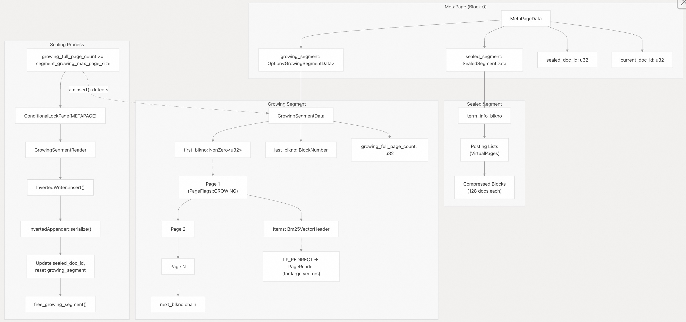
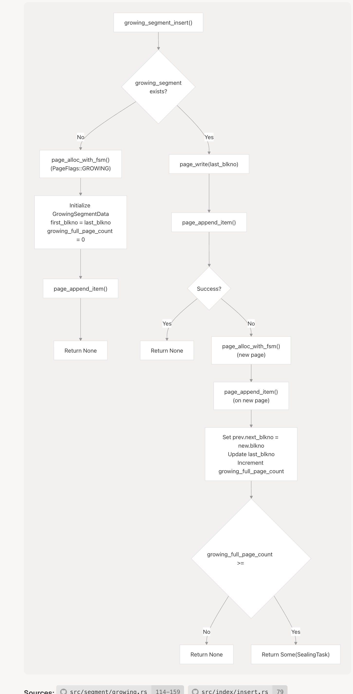
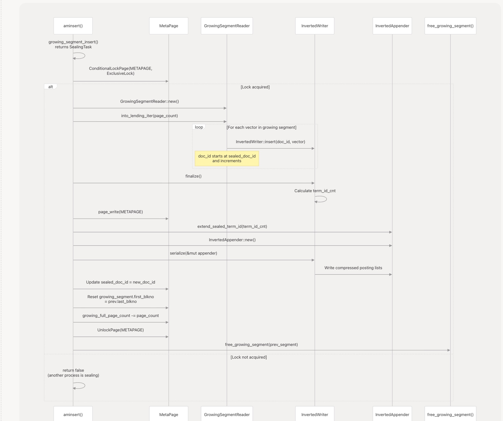
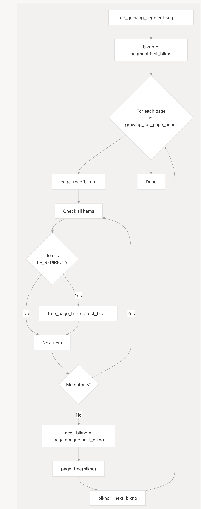

## VectorChord-bm25 源码学习: 4.2 段管理 (Segment Management)  
    
### 作者    
digoal    
    
### 日期    
2025-11-25    
    
### 标签    
VectorChord-bm25 , 源码学习 , 全文检索 , 关键词检索 , TF , IDF , 相关性排序 , ranking , Block-WeakAnd , Block-WAND , tsvector , ts_rank    
    
----    
    
## 背景    
本文档描述了 VectorChord-BM25 中的**段管理 (segment management)** 架构，该架构将索引划分为**增长段 (growing segments)** 和**封闭段 (sealed segments)** ，以优化写入和读取性能。增长段使用简单的只追加 (append-only) 结构来实现快速插入，而封闭段使用压缩的**倒排列表 (posting lists)** 来实现高效的查询处理。当达到尺寸阈值时，**封闭 (sealing)** 过程会将数据从增长格式转换为封闭格式。  
  
-----  
  
## 架构概览 (Architecture Overview)  
  
索引同时维护两种类型的段：  
  
  * **增长段 (Growing Segment)** ：一个可变的**段 (segment)** ，用于插入新文档。它使用简单的链表页结构来实现快速写入。  
  * **封闭段 (Sealed Segments)** ：不可变的段，包含经过压缩、块编码 (block-encoded) 的**倒排列表 (posting lists)** ，专为 **Block-WAND** 遍历优化。  
  
当增长段达到可配置的尺寸阈值时，它会被“ **封闭 (sealed)** ”——转换为优化的封闭段格式。这种混合方法平衡了写入吞吐量和查询性能。  
  
### 段架构图 (Segment Architecture Diagram)  
  
    
  
**来源 (Sources):**  
[`src/segment/growing.rs` 18-23](https://github.com/tensorchord/VectorChord-bm25/blob/da0908a6/src/segment/growing.rs#L18-L23)  
[`src/index/insert.rs` 119-156](https://github.com/tensorchord/VectorChord-bm25/blob/da0908a6/src/index/insert.rs#L119-L156)  
[`src/segment/meta.rs`](https://github.com/tensorchord/Vectorchord-bm25/blob/da0908a6/src/segment/meta.rs)  
  
-----  
  
## 增长段 (Growing Segments)  
  
增长段通过使用 **PostgreSQL 页 (PostgreSQL pages)** 的简单链表结构来提供快速插入。每个页包含可直接追加的序列化 `bm25vector` 项。  
  
### 数据结构 (Data Structure)  
  
`GrowingSegmentData` 结构体跟踪增长段的边界和大小：  
  
| 字段 (Field) | 目的 (Purpose) |  
| :--- | :--- |  
| `first_blkno` | 段中第一页的块号 (非零) |  
| `last_blkno` | 追加新插入项的最后一页的块号 |  
| `growing_full_page_count` | 满页的数量；当其达到 `segment_growing_max_page_size` 时，触发**封闭 (sealing)** |  
  
**来源 (Sources):**  
[`src/segment/growing.rs` 18-23](https://github.com/tensorchord/VectorChord-bm25/blob/da0908a6/src/segment/growing.rs#L18-L23)  
  
### 插入过程 (Insertion Process)  
  
`growing_segment_insert()` 函数处理向增长段的插入：  
  
    
  
**来源 (Sources):**  
[`src/segment/growing.rs` 114-159](https://github.com/tensorchord/VectorChord-bm25/blob/da0908a6/src/segment/growing.rs#L114-L159)  
[`src/index/insert.rs` 79](https://github.com/tensorchord/VectorChord-bm25/blob/da0908a6/src/index/insert.rs#L79-L79)  
  
### 大型向量处理 (Large Vector Handling)  
  
当一个 `bm25vector` 太大，无法放入单个页项中（超过页大小减去 `ItemIdData` 开销）时，它将使用重定向机制进行存储：  
  
1.  向量数据使用 `PageWriter` 和 `PageFlags::GROWING_REDIRECT` 写入到一系列页链中。  
2.  第一个块号存储在增长段页中，项标志 (item flags) 设置为 `LP_REDIRECT`。  
3.  在读取期间，`GrowingSegmentReader` 检测到重定向标志，并使用 `PageReader` 读取完整数据。  
  
**来源 (Sources):**  
[`src/segment/growing.rs` 122-130](https://github.com/tensorchord/VectorChord-bm25/blob/da0908a6/src/segment/growing.rs#L122-L130)  
[`src/segment/growing.rs` 90-97](https://github.com/tensorchord/VectorChord-bm25/blob/da0908a6/src/segment/growing.rs#L90-L97)  
  
-----  
  
## 封闭段 (Sealed Segments)  
  
封闭段存储具有从 `sealed_doc_id` 开始的连续文档 ID 的文档。该段使用压缩的**倒排列表 (posting lists)** （参见 倒排列表 (Posting Lists) 章节），从而实现高效的 **Block-WAND** 查询。  
  
### 结构 (Structure)  
  
封闭段由以下部分组成：  
  
  * **术语信息 (Term Information)** ：一个 `term_info_blkno`，指向包含每个术语的**倒排列表 (posting lists)** 的虚拟页。  
  * **块编码倒排列表 (Block-Encoded Posting Lists)** ：每个**倒排列表 (posting list)** 被划分为 128 个文档的块，并带有跳过信息 (skip information)。  
  * **块最大分数 (Block Max Scores)** ：预先计算的每个块的最大 BM25 分数，用于查询优化。  
  
封闭段中的文档具有范围为 `[sealed_doc_id, ...)` 的不可变文档 ID (doc ID)。  
  
**来源 (Sources):**  
[`src/segment/posting.rs`](https://github.com/tensorchord/VectorChord-bm25/blob/da0908a6/src/segment/posting.rs)  
  
### 封闭触发 (Sealing Trigger)  
  
当 `growing_full_page_count >= segment_growing_max_page_size` 时，触发**封闭 (Sealing)** 。该阈值可通过 `bm25_catalog.segment_growing_max_page_size` **GUC 参数 (GUC parameter)** 进行配置。  
  
默认值允许增长段在承担构建压缩**倒排列表 (posting lists)** 的成本之前，累积合理批次的文档。  
  
**来源 (Sources):**  
[`src/segment/growing.rs` 152-156](https://github.com/tensorchord/VectorChord-bm25/blob/da0908a6/src/segment/growing.rs#L152-L156)  
[`src/guc.rs`](https://github.com/tensorchord/VectorChord-bm25/blob/da0908a6/src/guc.rs)  
[`tests/sqllogictest/append_big_vector.slt` 26](https://github.com/tensorchord/VectorChord-bm25/blob/da0908a6/tests/sqllogictest/append_big_vector.slt#L26-L26)  
  
-----  
  
## 封闭过程 (Sealing Process)  
  
当 `aminsert()` 检测到需要**封闭 (sealing)** 时，它会启动一个多步骤过程，将增长段转换为封闭段。  
  
### 封闭流程 (Sealing Flow)  
  
    
  
**来源 (Sources):**  
[`src/index/insert.rs` 119-159](https://github.com/tensorchord/VectorChord-bm25/blob/da0908a6/src/index/insert.rs#L119-L159)  
  
### 锁定机制 (Locking Mechanism)  
  
**封闭 (sealing)** 过程使用 `ConditionalLockPage()` 来获取元页 (metapage) 上的排他锁 (exclusive lock)。这可以防止多个后端进程并发尝试**封闭 (sealing)** ：  
  
  * 如果锁被获取，**封闭 (sealing)** 继续进行。  
  * 如果锁无法被获取（另一个进程正在**封闭**），`aminsert()` 会立即返回，允许其他进程完成**封闭**。  
  * 只有一个后端执行**封闭**工作，避免了冗余计算。  
  
**来源 (Sources):**  
[`src/index/insert.rs` 124-129](https://github.com/tensorchord/VectorChord-bm25/blob/da0908a6/src/index/insert.rs#L124-L129)  
  
### 构建倒排索引 (Building the Inverted Index)  
  
**封闭 (sealing)** 的核心是从增长段构建一个压缩的**倒排索引 (inverted index)** ：  
  
1.  **读取增长段 (Reading Growing Segment)** ：`GrowingSegmentReader::into_lending_iter()` 通过一个借用迭代器 (lending iterator) 提供向量，处理内联 (inline) 和重定向 (redirected) 向量。  
2.  **构建倒排索引 (Building Inverted Index)** ：`InvertedWriter::insert()` 累积文档-术语对 (document-term pairs) 和频率 (frequencies)。  
3.  **最终确定 (Finalizing)** ：`InvertedWriter::finalize()` 计算术语统计信息 (term statistics)。  
4.  **序列化 (Serialization)** ：`InvertedAppender` 使用 **delta-bitpacking** 将压缩的**倒排列表 (posting lists)** 写入虚拟页。  
  
**来源 (Sources):**  
[`src/index/insert.rs` 132-145](https://github.com/tensorchord/VectorChord-bm25/blob/da0908a6/src/index/insert.rs#L132-L145)  
[`src/segment/growing.rs` 38-102](https://github.com/tensorchord/VectorChord-bm25/blob/da0908a6/src/segment/growing.rs#L38-L102)  
[`src/segment/posting.rs`](https://github.com/tensorchord/VectorChord-bm25/blob/da0908a6/src/segment/posting.rs)  
  
### 元数据更新 (Metadata Updates)  
  
序列化后，元页 (metapage) 会更新：  
  
  * `sealed_doc_id` 会前进到新**封闭 (sealed)** 文档之后的下一个文档 ID。  
  * `growing_segment.first_blkno` 设置为旧的 `last_blkno`，有效地启动了一个新的增长段。  
  * `growing_full_page_count` 递减已**封闭**的页数。  
  
这允许新的插入继续追加到增长段的尾部，而无需完全重置。  
  
**来源 (Sources):**  
[`src/index/insert.rs` 147-151](https://github.com/tensorchord/VectorChord-bm25/blob/da0908a6/src/index/insert.rs#L147-L151)  
  
### 清理 (Cleanup)  
  
`free_growing_segment()` 函数回收已转换为封闭格式的页：  
  
    
  
该函数遍历增长段的页链并执行以下操作：  
  
1.  释放所有重定向页链（针对大型向量）。  
2.  释放增长段页本身。  
3.  通过 `opaque.next_blkno` 继续到下一页。  
  
**来源 (Sources):**  
[`src/index/insert.rs` 161-190](https://github.com/tensorchord/VectorChord-bm25/blob/da0908a6/src/index/insert.rs#L161-L190)  
  
-----  
  
## 配置 (Configuration)  
  
`bm25_catalog.segment_growing_max_page_size` **GUC 参数 (GUC parameter)** 控制**封闭 (sealing)** 阈值：  
  
| 参数 (Parameter) | 类型 (Type) | 默认值 (Default) | 描述 (Description) |  
| :--- | :--- | :--- | :--- |  
| `segment_growing_max_page_size` | `int` | (由实现定义) | 触发**封闭 (sealing)** 前，增长段中的满页数量 |  
  
将此值设置得较低会导致更频繁的**封闭 (sealing)** （更多的封闭段，更快的查询，更慢的写入）。将此值设置得较高则允许更大的增长段（更快的写入，对新数据查询可能变慢）。  
  
**示例 (Example):**  
  
**来源 (Sources):**  
[`src/guc.rs`](https://github.com/tensorchord/VectorChord-bm25/blob/da0908a6/src/guc.rs)  
[`tests/sqllogictest/append_big_vector.slt` 26](https://github.com/tensorchord/VectorChord-bm25/blob/da0908a6/tests/sqllogictest/append_big_vector.slt#L26-L26)  
  
-----  
  
## 设计原理 (Design Rationale)  
  
双段架构提供了以下几个优点：  
  
1.  **写入优化 (Write Optimization)** ：增长段使用简单的页追加，避免了在每次插入时维护压缩**倒排列表 (posting lists)** 的成本。  
2.  **读取优化 (Read Optimization)** ：封闭段使用针对 **Block-WAND** 优化的**倒排列表 (posting lists)** 和**块最大分数 (block max scores)** ，实现高效的 **top-k** 查询。  
3.  **批量转换 (Batched Conversion)** ：**封闭 (Sealing)** 一次转换一批文档，摊销了构建压缩索引的成本。  
4.  **并发安全 (Concurrent Safety)** ：条件锁定 (Conditional locking) 可防止多个后端同时插入时出现冗余的**封闭**工作。  
5.  **增量增长 (Incremental Growth)** ：**封闭**后，增长段从其尾部继续，而不是完全重置，从而保持写入吞吐量。  
  
这种设计类似于现代存储系统中使用的 **LSM 树 (LSM-tree)** 结构，牺牲了部分最新数据的读取性能来换取更高的写入吞吐量。  
  
**来源 (Sources):**  
[`src/index/insert.rs` 58-159](https://github.com/tensorchord/VectorChord-bm25/blob/da0908a6/src/index/insert.rs#L58-L159)  
[`src/segment/growing.rs` 114-159](https://github.com/tensorchord/VectorChord-bm25/blob/da0908a6/src/segment/growing.rs#L114-L159)  
  
-----  
  
# 附录1: 性能调优与权衡 (Performance Tuning & Trade-off)  
  
该架构的核心是**写入吞吐量**（Growing Segment）和**查询性能**（Sealed Segment）之间的权衡，而 `bm25_catalog.segment_growing_max_page_size` 是控制这一权衡的关键参数。  
  
* **问题：** 鉴于写入段的容量阈值 `segment_growing_max_page_size` 直接决定了数据**新鲜度**和**查询性能**（新数据在封闭前可能查询较慢），如何选择最优值？在生产环境中，是否有推荐的**基准测试**或**监控指标**（例如：写入延迟、平均查询延迟、段平均查询时间、密封频率）来指导用户进行精确调优，以确保在**写入延迟**与**查询准确性/速度**之间找到最佳平衡点？  
  
## 回答  
  
您的问题是关于 VectorChord-BM25 中 `bm25_catalog.segment_growing_max_page_size` 参数的调优策略。这个参数控制着 Growing Segment（写入段）在被封闭（sealed）为 Sealed Segment（只读段）之前可以增长到的最大页数。    
  
## 核心权衡机制  
  
该参数的核心权衡体现在两个方面:  
  
**Growing Segment（写入优化）** :  
- 使用简单的链表页结构，支持快速插入    
- 查询时需要线性扫描，缺少压缩和跳表优化    
  
**Sealed Segment（查询优化）** :  
- 使用压缩的倒排列表和 Block-WAND 算法优化    
- 封闭过程需要重建整个倒排索引，有较高的写入放大  
  
## 参数选择指导  
  
根据代码中的配置定义  ，该参数:  
- **默认值**: 4096 页  
- **范围**: 1 到 1,000,000  
- **触发条件**: 当 `growing_full_page_count >= SEGMENT_GROWING_MAX_PAGE_SIZE` 时触发封闭    
  
**推荐配置场景**:  
  
| 工作负载类型 | 推荐值 | 原因 |  
|------------|--------|------|  
| 写入密集型 | 8192-100000 | 减少封闭开销，降低写入延迟 |  
| 查询密集型 | 1024-4096 | 更频繁封闭，提升查询性能 |  
| 批量导入后查询 | 100000+ | 导入时延迟封闭，完成后一次性优化 |  
| 混合负载 | 4096（默认） | 平衡写入和查询性能 |  
  
## 监控指标建议  
  
虽然代码中**没有内置的性能监控指标**，但您可以通过以下方式进行监控:  
  
**1. 写入性能指标**:  
- 监控 `aminsert` 函数的执行时间  
- 跟踪封闭操作的频率（通过日志或自定义计数器）  
- 观察 Growing Segment 的页数增长速度  
  
**2. 查询性能指标**:  
- 使用 `EXPLAIN ANALYZE` 测量查询延迟  
- 对比 Growing Segment 和 Sealed Segment 的扫描时间  
- 监控 `scan_main` 函数中两个段的处理时间    
  
**3. 段状态指标**:  
- 查询 `MetaPageData` 获取当前段信息:  
  - `sealed_doc_id`: 已封闭的文档数  
  - `current_doc_id`: 总文档数  
  - `growing_segment.growing_full_page_count`: 当前 Growing Segment 的页数  
  
## 基准测试方法  
  
**测试不同参数值的影响**:  
  
```sql  
-- 设置较小值（查询优化）  
SET bm25_catalog.segment_growing_max_page_size = 2048;  
-- 执行写入和查询测试  
-- 记录写入延迟和查询延迟  
  
-- 设置较大值（写入优化）  
SET bm25_catalog.segment_growing_max_page_size = 50000;  
-- 重复相同测试  
```  
  
**关键测试场景**:  
1. **写入吞吐量测试**: 批量插入文档，测量总时间和封闭次数  
2. **查询延迟测试**: 在不同 Growing Segment 大小下执行相同查询  
3. **混合负载测试**: 同时进行写入和查询，观察相互影响  
  
## Notes  
  
当前代码库中没有提供开箱即用的性能监控工具或基准测试框架。封闭操作是同步的且会阻塞写入  ，因此在高并发写入场景下，较小的 `segment_growing_max_page_size` 可能导致更频繁的写入阻塞。  
  
您可以通过 PostgreSQL 的 `pg_stat_statements` 扩展来监控 SQL 层面的性能，或者在应用层实现自定义的性能追踪。对于生产环境，建议从默认值 4096 开始，根据实际的写入/查询比例和延迟要求进行调整。  
  
  
  
  
-----  
  
# 附录2: 封闭过程对并发操作的影响 (Impact of Sealing on Concurrency)  
  
封闭（Sealing）过程是一个 CPU/IO 密集型操作，它涉及读取整个增长段，构建、计算并压缩倒排索引。  
  
* **问题：** 封闭过程需要获取元页（metapage）上的排他锁（exclusive lock），并执行大量的**计算和写入**。这个过程是否会引入显著且可感知的**写入延迟尖峰（latency spikes）** ，或在**锁竞争**（Locking Mechanism）中对其他并发的**读取/查询**操作造成阻塞或性能下降？是否有机制限制封闭操作的资源消耗（例如：CPU、IO 带宽），以避免对前台业务造成影响？  
  
## 回答  
  
您询问的是 VectorChord-BM25 中**段封闭（Sealing）过程**的性能影响，特别是关于写入延迟尖峰和锁竞争问题。    
  
## 封闭过程的锁机制  
  
封闭过程确实需要获取元页的排他锁，但使用了**条件锁（Conditional Lock）** 来避免阻塞：    
  
关键点：  
1. **非阻塞锁获取**：使用 `ConditionalLockPage` 而非 `LockPage`，如果无法立即获取锁，直接返回 `false` 而不等待    
2. **快速失败**：如果其他进程正在封闭段，当前插入操作会放弃封闭，直接返回    
3. **单进程封闭**：同一时刻只有一个进程执行封闭，避免重复工作  
  
## 对并发操作的影响  
  
**读取/查询操作**：  
- 查询操作使用**共享锁**读取元页    
- 封闭过程持有排他锁期间，查询会被阻塞，但时间窗口很短  
- 封闭的主要计算（构建倒排索引）在**获取锁之前**完成    
  
**写入操作**：  
- 其他插入操作在封闭期间会被阻塞在元页锁上  
- 封闭完成后立即释放锁    
  
## 资源消耗控制机制  
  
**1. 段大小限制**：  
通过 `bm25_catalog.segment_growing_max_page_size` 参数控制触发封闭的阈值（默认 4096 页）     
  
**2. 封闭触发条件**：  
只有当增长段达到配置的页数上限时才触发封闭    
  
**3. 计算优化**：  
- 封闭过程使用 `InvertedWriter` 批量处理文档    
- 压缩使用 delta-bitpacking 算法，计算效率高  
- 写入使用 `VirtualPageWriter` 批量分配页面，减少 I/O 次数  
  
## 潜在的延迟尖峰  
  
**会产生延迟的场景**：  
1. **持有排他锁期间**：更新元数据、写入倒排索引到磁盘    
2. **页面分配**：扩展 sealed segment 存储可能触发文件系统操作    
  
**缓解措施**：  
- 大部分计算在锁外完成  
- 使用 GenericXLog 批量提交，减少 WAL 写入次数    
  
## Notes  
  
当前实现**没有显式的资源限流机制**（如 CPU 或 I/O 带宽限制）。封闭操作是同步执行的，会占用执行插入的后端进程的全部资源。如果需要避免对前台业务的影响，可以考虑：  
1. 调整 `segment_growing_max_page_size` 参数，使封闭更频繁但每次处理的数据量更小  
2. 在应用层控制写入速率  
3. 使用 PostgreSQL 的 vacuum delay 机制（但当前代码中仅在 vacuum 操作中使用  ）  
  
  
  
  
-----  
  
# 附录3: 数据生命周期管理与维护 (Data Lifecycle & Maintenance)  
  
文档提到封闭段是**不可变的**，但实际应用中必然涉及文档的删除或更新。文档目录中也暗示了存在“Vacuuming & Maintenance”（段 4.3）。  
  
* **问题：** 对于**不可变的封闭段 (Sealed Segments)** ，当其中的文档被删除或更新时，系统如何管理这些“**废弃数据**”？这些被标记删除的数据是否会无限期地累积在封闭段中？VectorChord-BM25 是否具备**后台维护/合并（compaction）** 机制，来定期重构、清理这些段、回收存储空间、并最终提升长期查询效率？  
    
## 回答  
  
您的问题是关于 VectorChord-BM25 中**封闭段（Sealed Segments）的不可变性**与**删除/更新操作**之间的矛盾，以及系统是否具备**后台维护机制**来清理废弃数据和回收存储空间。  
  
## 删除标记机制  
  
VectorChord-BM25 使用**删除位图（Delete Bitmap）** 来标记已删除的文档，而不是物理删除封闭段中的数据。    
  
在 `ambulkdelete` 函数中，当文档被删除时：  
1. 系统遍历所有文档 ID（0 到 `current_doc_id`）    
2. 通过回调函数检查每个文档的 TID 是否应该被删除    
3. 如果需要删除，调用 `delete_bitmap_reader.delete(i)` 在位图中标记该文档    
4. 更新元数据中的 `doc_cnt` 和 `doc_term_cnt`    
  
**关键点：封闭段中的实际数据保持不变，只是在删除位图中标记。**  
  
## 查询时的删除过滤  
  
在查询执行时，系统会跳过已标记删除的文档：  
  
- 在 `scan_main` 中，`DeleteBitmapReader` 被用来过滤删除的文档    
- 在 Block-WAND 算法中，每次评分前都会检查 `delete_bitmap_reader.is_delete(docid)`    
- 对于 growing segment，也会进行相同的检查    
  
## 统计信息维护  
  
`amvacuumcleanup` 函数负责在 vacuum 后重新计算词项统计信息：    
  
该函数会：  
1. 遍历所有段（growing 和 sealed）    
2. 跳过已删除的文档    
3. 重新计算每个词项的文档频率（term statistics）    
  
这确保了 BM25 评分使用的 IDF 值反映实际未删除的文档数量。  
  
## 关键问题：没有 Compaction 机制  
  
**根据代码分析，VectorChord-BM25 目前没有实现段合并（compaction）或重建机制。**  
  
存在的问题：  
1. **废弃数据累积**：被标记删除的文档数据会永久保留在封闭段中，占用存储空间  
2. **查询效率下降**：虽然删除位图可以跳过已删除文档，但封闭段的物理大小不会减少，posting lists 仍然包含已删除文档的条目  
3. **无自动清理**：vacuum 操作只更新删除位图和统计信息，不会重构或压缩段  
  
## 当前的缓解措施  
  
唯一的"清理"发生在段封闭（sealing）过程中：  
  
当 growing segment 达到 `SEGMENT_GROWING_MAX_PAGE_SIZE` 时，会被封闭成 sealed segment  。在这个过程中：  
1. 旧的 growing segment 页面会被释放    
2. 数据被重新写入压缩的 sealed segment 格式    
  
但这**只适用于新插入的数据**，不会清理已存在的 sealed segments 中的废弃数据。  
  
## Notes  
  
VectorChord-BM25 的设计优先考虑了写入性能和查询效率，但缺少长期维护机制。如果您的应用场景涉及大量删除或更新操作，废弃数据会无限期累积，可能需要：  
- 定期重建索引（`REINDEX`）来回收空间  
- 或者等待未来版本实现 compaction 功能  
  
这是一个已知的架构限制，类似于许多 LSM-tree 风格的索引系统在实现初期的状态。  
  
  
  
  
-----  
  
# 附录4: 同一个token可能同时存在增长段以及所有的封闭段里吗? 为什么有可能? 如果可能, 那么怎么保证搜索性能?   
  
## 回答  
  
您的问题是关于 VectorChord-BM25 索引中的段管理：**同一个 token 是否可能同时存在于增长段（growing segment）和封闭段（sealed segment）中？为什么？如果可能，如何保证搜索性能？**    
  
  
**是的，同一个 token 可以同时存在于增长段和所有封闭段中。**    
  
### 为什么会出现这种情况？  
  
这是由索引的插入流程决定的：  
  
1. **新文档总是先插入增长段**：当调用 `aminsert` 时，新文档首先通过 `growing_segment_insert()` 写入增长段    
  
2. **封闭段保持不变**：已经存在的封闭段是只读的，包含之前插入的文档    
  
3. **增长段达到阈值时才封闭**：只有当增长段的页数达到 `SEGMENT_GROWING_MAX_PAGE_SIZE`（默认 4096 页）时，才会触发封闭操作    
  
因此，如果一个 token 在旧文档中出现过（已在封闭段中），又在新文档中出现（写入增长段），该 token 就会同时存在于两个段中。  
  
### 如何保证搜索性能？  
  
系统通过以下机制保证搜索性能：  
  
1. **分别扫描两个段**：查询时，`scan_main` 函数会分别处理增长段和封闭段    
  
2. **增长段使用线性扫描**：增长段中的文档数量相对较少，使用简单的线性扫描并计算 BM25 分数    
  
3. **封闭段使用 Block-WAND 优化**：封闭段使用压缩的 posting lists 和 Block-WAND 算法，通过 `block_max_score` 跳过不可能进入 top-k 的文档块    
  
4. **统一的 TopKComputer**：两个段的结果都推入同一个 `TopKComputer`，自动维护全局的 top-k 结果    
  
5. **定期封闭增长段**：通过配置参数 `bm25_catalog.segment_growing_max_page_size` 控制增长段大小，防止线性扫描部分过大影响性能    
  
## Notes  
  
在 vacuum 操作中，系统也会分别遍历增长段和封闭段来重新计算 term statistics  。这确保了即使 token 分布在两个段中，统计信息仍然是准确的。  
  
  
  
-----  
  
# 附录5: 有没有可能采用token hash分区的方式将不同的token写入不同的封闭段? 整理后性能是不是会更好?   
  
## 回答  
  
您的问题是关于 VectorChord-BM25 索引的优化方案：**是否可以采用 token hash 分区的方式将不同的 token 写入不同的封闭段，以及这样做是否会提升性能？**  
  
  
**当前架构不支持按 token hash 分区的封闭段设计。**  封闭段是按**文档插入的时间顺序**组织的，而不是按 token 分区的。  
  
### 当前架构的工作方式  
  
1. **增长段按文档顺序追加**：`growing_segment_insert()` 将新文档依次追加到增长段的链表页中    
  
2. **封闭时整体转换**：当增长段达到阈值时，`aminsert()` 会将整个增长段转换为一个封闭段  ，使用 `InvertedWriter` 构建倒排索引    
  
3. **封闭段存储完整的倒排索引**：每个封闭段包含该段内所有文档的所有 token 的 posting lists    
  
### 为什么当前设计不按 token 分区？  
  
从代码可以看出几个关键设计决策：  
  
1. **文档 ID 的连续性**：封闭段中的文档 ID 是连续的（从 `sealed_doc_id` 开始）  ，这对于 Block-WAND 算法的效率至关重要    
  
2. **统一的 term statistics**：系统维护全局的 term statistics（每个 token 在多少文档中出现）  ，这对 BM25 的 IDF 计算是必需的    
  
3. **查询时需要合并所有段**：`scan_main` 必须扫描所有包含查询 token 的段    
  
### Token hash 分区的潜在问题  
  
如果采用 token hash 分区：  
  
1. **查询复杂度增加**：对于多 token 查询，需要访问多个不同的分区段，无法利用 Block-WAND 的联合遍历优化  
  
2. **文档 ID 分散**：同一文档的不同 token 会分散在不同段中，破坏了文档 ID 的局部性  
  
3. **Term statistics 维护困难**：需要跨段聚合统计信息，增加复杂度    
  
### 当前设计的性能保证  
  
当前架构通过以下方式保证性能：  
  
1. **Block-WAND 算法**：在封闭段中使用 block max scores 跳过不相关的文档块    
  
2. **压缩的 posting lists**：封闭段使用压缩存储减少 I/O    
  
3. **增长段大小控制**：通过 `segment_growing_max_page_size` 参数平衡写入和查询性能    
  
## Notes  
  
VectorChord-BM25 的设计更接近 LSM-tree 架构，优先考虑写入吞吐量和 top-k 查询效率。Token hash 分区更适合需要精确匹配或单 token 查询的场景，但对于 BM25 这种需要联合评分多个 token 的算法，当前的时间顺序分段设计更为合适。  
  
如果您需要优化特定查询模式，可以考虑调整 `segment_growing_max_page_size` 参数来控制段的大小  ，或者在应用层面进行查询优化。  
  
    
#### [PolarDB 学习图谱](https://www.aliyun.com/database/openpolardb/activity "8642f60e04ed0c814bf9cb9677976bd4")
  
  
#### [PostgreSQL 解决方案集合](../201706/20170601_02.md "40cff096e9ed7122c512b35d8561d9c8")
  
  
#### [德哥 / digoal's Github - 公益是一辈子的事.](https://github.com/digoal/blog/blob/master/README.md "22709685feb7cab07d30f30387f0a9ae")
  
  
#### [About 德哥](https://github.com/digoal/blog/blob/master/me/readme.md "a37735981e7704886ffd590565582dd0")
  
  

  
