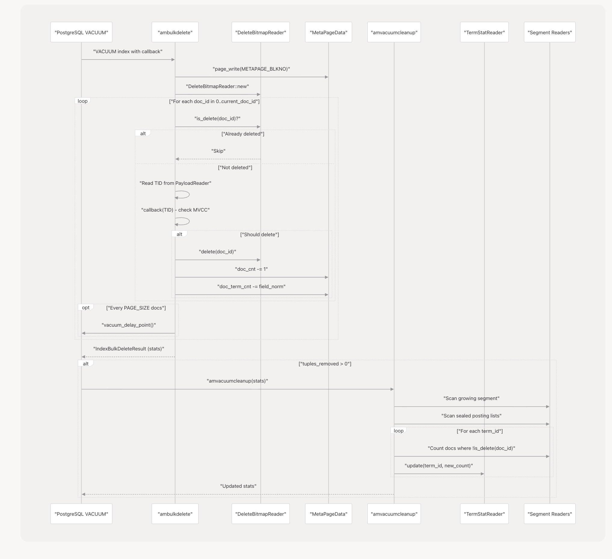
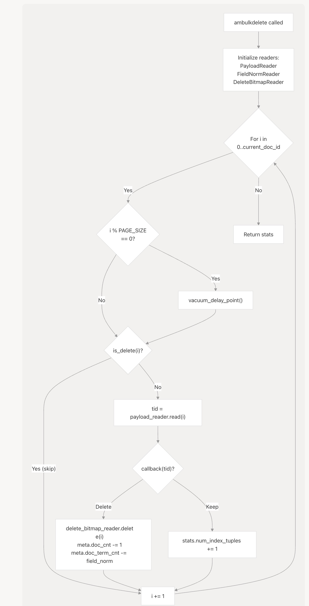
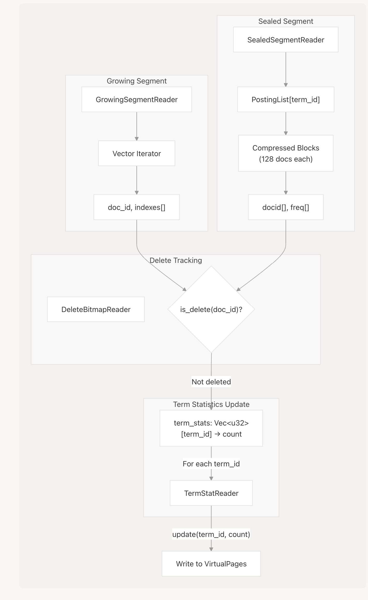
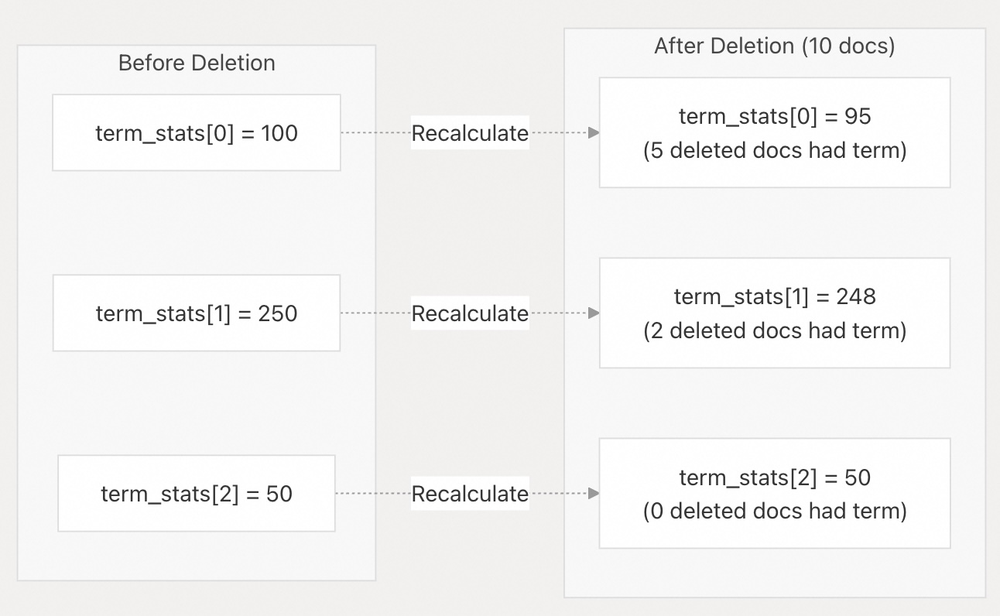

## VectorChord-bm25 源码学习: 4.3 清理和维护 (`Vacuuming & Maintenance`)    
        
### 作者        
digoal        
        
### 日期        
2025-11-25        
        
### 标签        
VectorChord-bm25 , 源码学习 , 全文检索 , 关键词检索 , TF , IDF , 相关性排序 , ranking , Block-WeakAnd , Block-WAND , tsvector , ts_rank        
        
----        
        
## 背景        
本文介绍 VectorChord-BM25 如何处理 PostgreSQL 的 **VACUUM 操作 (VACUUM operations)** ，包括 **元组 (tuples)** 的 **批量删除 (bulk deletion)** 、**删除位图 (delete bitmap)** 管理以及 **词项统计信息重新计算 (term statistics recalculation)** 。这些操作对于在基础表 (base table) 上的 `DELETE` 或 `UPDATE` 操作后保持索引一致性至关重要。    
    
本文涵盖了双阶段 **清理 (vacuum)** 过程（`ambulkdelete` 和 `amvacuumcleanup`）、**删除位图 (delete bitmap)** 跟踪以及 **词频 (term frequency)** 重新计算。    
    
-----    
    
## 概览 (Overview)    
    
VectorChord-BM25 通过两个协同工作的回调函数实现了 PostgreSQL 的标准 **清理接口 (vacuum interface)** ，以保持索引一致性。当 **元组 (tuples)** 从基础表中删除时，索引必须：    
    
1.  在 **删除位图 (delete bitmap)** 中将相应的文档标记为已删除    
2.  更新全局统计信息（文档计数、词项计数）    
3.  重新计算每个词项的文档频率（ **词项统计信息 (term statistics)** ）    
    
与其他一些索引类型不同，BM25 索引不会立即物理删除已删除的条目。相反，它们使用一个 **删除位图 (delete bitmap)** 来跟踪哪些文档在逻辑上被删除，并且查询会在扫描期间跳过这些文档。这种方法避免了昂贵的 **倒排列表 (posting list)** 重写，同时保持了正确的 BM25 分数。    
    
**来源 (Sources)** ：    
[`src/index/vacuum.rs` 1-143](https://github.com/tensorchord/VectorChord-bm25/blob/da0908a6/src/index/vacuum.rs#L1-L143)    
[`src/index/am.rs` 30-31](https://github.com/tensorchord/VectorChord-bm25/blob/da0908a6/src/index/am.rs#L30-L31)    
    
-----    
    
## 双阶段清理过程 (Two-Phase Vacuum Process)    
    
**清理 (vacuum)** 操作由 PostgreSQL 依次调用的两个不同阶段组成，它们共同作用于维护索引一致性：    
    
| 阶段 (Phase) | 函数 (Function) | 目的 (Purpose) |    
| :--- | :--- | :--- |    
| **批量删除 (Bulk Delete)** | `ambulkdelete` | 在**删除位图 (delete bitmap)** 中标记已删除的**元组 (tuples)** ，更新全局统计信息 |    
| **清理 (Cleanup)** | `amvacuumcleanup` | 重新计算**词项统计信息 (term statistics)** 以反映删除操作 |    
    
这种分离允许 PostgreSQL 在触发昂贵的**词项统计信息重新计算 (term statistics recalculation)** 之前，批量处理多个删除事件。    
    
    
    
**图表 (Diagram)** ：完整的清理工作流程，显示了双阶段过程以及与索引组件的交互。    
    
**来源 (Sources)** ：    
[`src/index/vacuum.rs` 17-69](https://github.com/tensorchord/VectorChord-bm25/blob/da0908a6/src/index/vacuum.rs#L17-L69)    
[`src/index/vacuum.rs` 72-143](https://github.com/tensorchord/VectorChord-bm25/blob/da0908a6/src/index/vacuum.rs#L72-L143)    
    
-----    
    
## 批量删除阶段 (Bulk Delete Phase)    
    
### 入口点和回调 (Entry Point and Callback)    
    
`ambulkdelete` 函数是**批量删除 (bulk deletion)** 的入口点。PostgreSQL 提供了一个回调函数，用于根据 **MVCC** 可见性规则确定哪些 **元组 (tuples)** 应该被删除。    
    
**函数签名 (Function signature)** ：    
[`src/index/vacuum.rs` 17-22](https://github.com/tensorchord/VectorChord-bm25/blob/da0908a6/src/index/vacuum.rs#L17-L22)    
    
```    
pub unsafe extern "C-unwind" fn ambulkdelete(    
    info: *mut IndexVacuumInfo,    
    stats: *mut IndexBulkDeleteResult,    
    callback: IndexBulkDeleteCallback,    
    callback_state: *mut c_void,    
) -> *mut IndexBulkDeleteResult    
```    
    
该回调函数被封装在一个 Rust 闭包 (closure) 中，该闭包在内部 `u64` **TID** 表示和 PostgreSQL 的 `ItemPointerData` 格式之间进行转换：    
    
**来源 (Sources)** ：    
[`src/index/vacuum.rs` 23-30](https://github.com/tensorchord/VectorChord-bm25/blob/da0908a6/src/index/vacuum.rs#L23-L30)    
    
### 文档迭代 (Document Iteration)    
    
该函数迭代从 `0` 到 `meta.current_doc_id` 的所有文档，针对每个文档检查 **删除位图 (delete bitmap)** 和回调：    
    
    
  
**图表 (Diagram)** ：批量删除算法，显示文档迭代、回调检查和统计信息更新。    
    
**来源 (Sources)** ：    
[`src/index/vacuum.rs` 40-68](https://github.com/tensorchord/VectorChord-bm25/blob/da0908a6/src/index/vacuum.rs#L40-L68)    
    
### 性能限制 (Performance Throttling)    
    
为了避免在长时间的 **清理 (vacuum)** 操作中垄断系统资源，该函数会周期性地（每 `bm25_page_size()` 个文档）调用 `vacuum_delay_point()`。这允许 PostgreSQL 根据系统负载来限制清理操作：    
    
**实现 (Implementation)** ：    
[`src/index/vacuum.rs` 48-52](https://github.com/tensorchord/VectorChord-bm25/blob/da0908a6/src/index/vacuum.rs#L48-L52)    
    
请注意，针对 PostgreSQL 18 的条件编译 (conditional compilation)，该版本更改了 `vacuum_delay_point` 的签名。    
    
### 统计信息跟踪 (Statistics Tracking)    
    
该函数维护两个关键统计信息：    
    
| 统计信息 (Statistic) | 含义 (Meaning) | 更新时机 (Updated When) |    
| :--- | :--- | :--- |    
| `tuples_removed` | 标记为已删除的文档数量 | 回调返回 true 时 |    
| `num_index_tuples` | 剩余的活动文档数量 | 回调返回 false 时 |    
    
这些统计信息将返回给 PostgreSQL 用于监控和日志记录目的。    
    
**来源 (Sources)** ：    
[`src/index/vacuum.rs` 32-68](https://github.com/tensorchord/VectorChord-bm25/blob/da0908a6/src/index/vacuum.rs#L32-L68)    
    
-----    
    
## 清理阶段 (Cleanup Phase)    
    
### 入口点和防护 (Entry Point and Guards)    
    
`amvacuumcleanup` 函数在**批量删除 (bulk deletion)** 完成后被调用。它有两个重要的提前退出条件：    
    
1.  **Null 统计信息 (Null stats)** ：如果没有发生批量删除，则立即返回。    
2.  **没有删除 (No deletions)** ：如果 `tuples_removed == 0.0`，则跳过**词项统计信息重新计算 (term statistics recalculation)** 。    
    
**入口逻辑 (Entry logic)** ：    
[`src/index/vacuum.rs` 72-87](https://github.com/tensorchord/VectorChord-bm25/blob/da0908a6/src/index/vacuum.rs#L72-L87)    
    
该函数还会更新 `num_pages` 统计信息，以反映当前的索引大小：    
    
```    
(*stats).num_pages = RelationGetNumberOfBlocksInFork(  
    (*info).index,  
    ForkNumber::MAIN_FORKNUM  
)  
```    
    
**来源 (Sources)** ：    
[`src/index/vacuum.rs` 80-83](https://github.com/tensorchord/VectorChord-bm25/blob/da0908a6/src/index/vacuum.rs#L80-L83)    
    
### 词项统计信息重新计算 (Term Statistics Recalculation)    
    
如果发生了删除，该函数必须重新计算所有**词项 (terms)** 的文档频率 (document frequencies)。这是必要的，因为 BM25 评分使用了 **逆文档频率 (Inverse Document Frequency, IDF)** ，它取决于包含每个词项的文档数量。    
    
    
    
**图表 (Diagram)** ：**词项统计信息重新计算 (Term statistics recalculation)** 算法，显示了对 **增长段 (growing segment)** 和 **密封段 (sealed segments)** 的扫描。    
    
**来源 (Sources)** ：    
[`src/index/vacuum.rs` 88-143](https://github.com/tensorchord/VectorChord-bm25/blob/da0908a6/src/index/vacuum.rs#L88-L143)    
    
### 增长段处理 (Growing Segment Processing)    
    
如果存在 **增长段 (growing segment)** ，函数首先扫描它：    
    
1.  创建一个从 `sealed_doc_id` 开始的 `GrowingSegmentReader`    
2.  使用借用迭代器 (lending iterator) 迭代所有向量    
3.  对于每个向量，如果文档未被删除，则增加该向量中所有词项的计数    
    
**实现 (Implementation)** ：    
[`src/index/vacuum.rs` 97-109](https://github.com/tensorchord/VectorChord-bm25/blob/da0908a6/src/index/vacuum.rs#L97-L109)    
    
### 密封段处理 (Sealed Segment Processing)    
    
**密封段 (sealed segment)** 使用压缩的 **倒排列表 (posting lists)** ，需要不同的遍历方法：    
    
1.  创建一个 `SealedSegmentReader`    
2.  对于每个**词项 ID (term ID)** （从 0 到 `term_id_cnt`）：    
      * 获取 **倒排列表 (posting list)**    
      * 迭代所有**块 (blocks)**    
      * 对于每个块中的每个文档：    
          + 检查是否已删除    
          + 如果未删除，则增加该词项的计数    
    
**块式迭代 (Block-wise iteration)** ：    
[`src/index/vacuum.rs` 111-131](https://github.com/tensorchord/VectorChord-bm25/blob/da0908a6/src/index/vacuum.rs#L111-L131)    
    
    
    
**图表 (Diagram)** ：**词项统计信息重新计算 (term statistics recalculation)** 的数据流，显示了两种段类型如何为更新后的计数做出贡献。    
    
**来源 (Sources)** ：    
[`src/index/vacuum.rs` 94-140](https://github.com/tensorchord/VectorChord-bm25/blob/da0908a6/src/index/vacuum.rs#L94-L140)    
    
-----    
    
## 删除位图管理 (Delete Bitmap Management)    
    
**删除位图 (delete bitmap)** 是一个关键数据结构，用于跟踪哪些文档已被逻辑删除。它被实现为一个位向量 (bit vector)，其中每个位代表一个文档。    
    
### 结构和存储 (Structure and Storage)    
    
**删除位图 (delete bitmap)** 存储在 **虚拟页 (virtual pages)** 中，并通过 `DeleteBitmapReader` 接口进行管理：    
    
  * **初始化 (Initialization)** ：    
    [`src/index/vacuum.rs` 45](https://github.com/tensorchord/VectorChord-bm25/blob/da0908a6/src/index/vacuum.rs#L45-L45)    
  * **大小 (Size)** ：每个文档一个位，向上舍入到字节边界    
  * **位置 (Location)** ：在 **元页 (metapage)** 中通过 `meta.delete_bitmap_blkno` 跟踪    
    
在索引构建期间，**删除位图 (delete bitmap)** 用零初始化（所有文档都是活动的）：    
    
**构建初始化 (Build initialization)** ：    
[`src/index/build.rs` 142-146](https://github.com/tensorchord/VectorChord-bm25/blob/da0908a6/src/index/build.rs#L142-L146)    
    
### 操作 (Operations)    
    
| 操作 (Operation) | 方法 (Method) | 用法 (Usage) |    
| :--- | :--- | :--- |    
| 检查是否已删除 | `is_delete(doc_id)` | 用于扫描和清理 (vacuum cleanup) |    
| 标记为已删除 | `delete(doc_id)` | 在批量删除期间调用 |    
| 初始化 | `VirtualPageWriter` | 在索引构建期间 |    
    
**批量删除标记 (Bulk delete marking)** ：    
[`src/index/vacuum.rs` 59](https://github.com/tensorchord/VectorChord-bm25/blob/da0908a6/src/index/vacuum.rs#L59-L59)    
    
### 查询集成 (Query Integration)    
    
在索引扫描期间，会检查 **删除位图 (delete bitmap)** 以跳过已删除的文档：    
    
  * **Block-WAND** 在计算 **top-k** 结果时使用它来跳过文档    
  * **暴力扫描 (Brute force scans)** 会检查每个文档    
  * 有关扫描集成的详细信息，请参阅 Block-WeakAnd 算法 (Block-WeakAnd Algorithm) 章节     
    
**来源 (Sources)** ：    
[`src/index/vacuum.rs` 45](https://github.com/tensorchord/VectorChord-bm25/blob/da0908a6/src/index/vacuum.rs#L45-L45)    
[`src/index/vacuum.rs` 54-59](https://github.com/tensorchord/VectorChord-bm25/blob/da0908a6/src/index/vacuum.rs#L54-L59)    
[`src/index/build.rs` 142-146](https://github.com/tensorchord/VectorChord-bm25/blob/da0908a6/src/index/build.rs#L142-L146)    
    
-----    
    
## 统计信息维护 (Statistics Maintenance)    
    
### 全局统计信息 (Global Statistics)    
    
**元页 (metapage)** 维护在 **清理 (vacuum)** 期间更新的全局统计信息：    
    
| 字段 (Field) | 类型 (Type) | 更新者 (Updated By) | 目的 (Purpose) |    
| :--- | :--- | :--- | :--- |    
| `doc_cnt` | `u32` | `ambulkdelete` | 活动文档数量 |    
| `doc_term_cnt` | `u64` | `ambulkdelete` | 所有活动文档中的总词项数 |    
| `current_doc_id` | `u32` | 插入操作 (Insert operations) | 要分配的下一个文档 ID |    
| `term_id_cnt` | `u32` | 索引构建 (Index build) | 唯一词项的总数 |    
    
**删除期间的递减 (Decrement during deletion)** ：    
[`src/index/vacuum.rs` 60-61](https://github.com/tensorchord/VectorChord-bm25/blob/da0908a6/src/index/vacuum.rs#L60-L61)    
    
### 每个词项的统计信息 (Per-Term Statistics)    
    
每个词项跟踪包含它的文档数量（文档频率），这在清理期间会被重新计算：    
    
    
    
**图表 (Diagram)** ：示例显示了清理操作后词项统计信息如何变化。    
    
**词项统计信息 (Term statistics)** 存储在 **虚拟页 (virtual pages)** 中，并通过 `TermStatReader` 进行访问：    
    
**更新逻辑 (Update logic)** ：    
[`src/index/vacuum.rs` 135-140](https://github.com/tensorchord/VectorChord-bm25/blob/da0908a6/src/index/vacuum.rs#L135-L140)    
    
这些统计信息对于 BM25 **IDF (Inverse Document Frequency)** 计算至关重要：`idf = log((N - n + 0.5) / (n + 0.5))`，其中 `N` 是 `doc_cnt`，`n` 是词项频率。    
    
**来源 (Sources)** ：    
[`src/index/vacuum.rs` 60-61](https://github.com/tensorchord/VectorChord-bm25/blob/da0908a6/src/index/vacuum.rs#L60-L61)    
[`src/index/vacuum.rs` 94-140](https://github.com/tensorchord/VectorChord-bm25/blob/da0908a6/src/index/vacuum.rs#L94-L140)    
    
-----    
    
## 性能考量 (Performance Considerations)    
    
### 清理限制 (Vacuum Throttling)    
    
每 `bm25_page_size()` 个文档调用一次 `vacuum_delay_point()` 允许 PostgreSQL 通过这些 **GUC 参数 (GUC parameters)** 控制清理资源使用：    
    
  * `vacuum_cost_delay` - 限制点之间的延迟    
  * `vacuum_cost_limit` - 延迟前的工作阈值    
  * 各种页面操作的成本参数    
    
**实现 (Implementation)** ：    
[`src/index/vacuum.rs` 48-52](https://github.com/tensorchord/VectorChord-bm25/blob/da0908a6/src/index/vacuum.rs#L48-L52)    
    
### 词项统计信息成本 (Term Statistics Cost)    
    
重新计算**词项统计信息 (term statistics)** 是清理阶段中最昂贵的部分：    
    
**复杂度 (Complexity)** ：    
    
  * **增长段 (Growing segment)** ：O(文档数 × 平均每文档词项数)    
  * **密封段 (Sealed segment)** ：O(词项数 × 平均每词项文档数)    
    
对于大型索引，这可能涉及：    
    
1.  从磁盘读取所有 **倒排列表 (posting lists)**    
2.  解码所有块    
3.  检查每个文档的 **删除位图 (delete bitmap)**    
    
**优化 (Optimization)** ：该函数仅在 `tuples_removed > 0` 时重新计算，从而避免了在没有操作的清理后进行不必要的工作。    
    
**提前退出 (Early exit)** ：    
[`src/index/vacuum.rs` 85-87](https://github.com/tensorchord/VectorChord-bm25/blob/da0908a6/src/index/vacuum.rs#L85-L87)    
    
### 预写式日志 (Write-Ahead Logging, WAL)    
    
两个清理阶段都会修改索引，触发 **WAL (Write-Ahead Logging)** 写入：    
    
  * `ambulkdelete` 写入修改后的 **元页 (metapage)** (`doc_cnt`, `doc_term_cnt`)    
  * `ambulkdelete` 写入修改后的 **删除位图 (delete bitmap)** 页面    
  * `amvacuumcleanup` 写入修改后的**词项统计信息 (term statistics)** 页面    
    
这些由 `page_write()` 基础设施自动处理，该基础设施将页面标记为脏页 (dirty) 以进行 WAL 日志记录。有关详细信息，请参阅 页面管理 (Page Management) 章节)。    
    
**来源 (Sources)** ：    
[`src/index/vacuum.rs` 41](https://github.com/tensorchord/VectorChord-bm25/blob/da0908a6/src/index/vacuum.rs#L41-L41)    
[`src/index/vacuum.rs` 133](https://github.com/tensorchord/VectorChord-bm25/blob/da0908a6/src/index/vacuum.rs#L133-L133)    
    
-----    
    
## 与 PostgreSQL 的集成 (Integration with PostgreSQL)    
    
### 访问方法处理程序 (Access Method Handler)    
    
清理函数通过 `IndexAmRoutine` 结构体在 PostgreSQL 中注册：    
    
**注册 (Registration)** ：    
[`src/index/am.rs` 30-31](https://github.com/tensorchord/VectorChord-bm25/blob/da0908a6/src/index/am.rs#L30-L31)    
    
```    
amroutine.ambulkdelete = Some(ambulkdelete);    
amroutine.amvacuumcleanup = Some(amvacuumcleanup);    
```    
    
### 调用场景 (Invocation Scenarios)    
    
PostgreSQL 在以下几种场景中调用这些函数：    
    
| 场景 (Scenario) | 触发器 (Trigger) | 行为 (Behavior) |    
| :--- | :--- | :--- |    
| 手动 VACUUM | `VACUUM table;` | 调用两个阶段 |    
| 自动清理 (Autovacuum) | 基于死 **元组 (dead tuples)** 自动触发 | 调用两个阶段 |    
| VACUUM FULL | `VACUUM FULL table;` | 而是重建整个索引 |    
| **元组 (Tuple)** 更新 | 后台清理 | 可能只调用批量删除 |    
    
### MVCC 集成 (MVCC Integration)    
    
提供给 `ambulkdelete` 的回调函数使用 PostgreSQL 的 **MVCC (Multi-Version Concurrency Control)** 系统检查 **元组 (tuple)** 可见性。这确保了：    
    
1.  对活动事务可见的 **元组 (tuples)** 不会被删除    
2.  清理尊重事务隔离级别 (transaction isolation levels)    
3.  只有真正的死 **元组 (dead tuples)** 才从索引中移除    
    
**回调调用 (Callback invocation)** ：    
[`src/index/vacuum.rs` 58](https://github.com/tensorchord/VectorChord-bm25/blob://github.com/tensorchord/VectorChord-bm25/blob/da0908a6/src/index/vacuum.rs#L58-L58)    
    
**来源 (Sources)** ：    
[`src/index/am.rs` 30-31](https://github.com/tensorchord/VectorChord-bm25/blob/da0908a6/src/index/am.rs#L30-L31)    
[`src/index/vacuum.rs` 23-30](https://github.com/tensorchord/VectorChord-bm25/blob/da0908a6/src/index/vacuum.rs#L23-L30)    
    
-----    
    
# 附录1: 索引膨胀与空间回收机制    
    
**背景痛点：** PostgreSQL 用户普遍关注 `VACUUM` 只是标记删除而不会立即释放空间，可能导致**索引膨胀 (Index Bloat)** 。    
    
**关键问题：**    
    
文档提到 BM25 索引采用**删除位图 (delete bitmap)** 进行**逻辑删除 (logical deletion)** ，以避免昂贵的**倒排列表 (posting list)** 重写。那么，在什么条件下，这些逻辑上已删除的数据会被**物理移除 (physically removed)** 从而实现磁盘空间的回收？是需要执行 `VACUUM FULL`、`REINDEX`，还是 VectorChord-BM25 内部有特定的段合并或清理机制来解决索引膨胀问题？    
    
## 回答    
    
您的问题是关于 VectorChord-BM25 索引中**逻辑删除的数据何时会被物理移除以回收磁盘空间**。    
    
**VectorChord-BM25 目前不会自动物理移除逻辑删除的数据。** 要回收磁盘空间，您需要执行 `REINDEX` 来重建整个索引。    
    
### 当前的删除机制    
    
VectorChord-BM25 使用删除位图进行逻辑删除：    
    
1. **`VACUUM` 期间**：`ambulkdelete` 函数在删除位图中标记已删除的文档  ，并更新全局统计信息（`doc_cnt`、`doc_term_cnt`）      
    
2. **查询时跳过**：在 Block-WAND 算法执行期间，通过 `DeleteBitmapReader` 检查并跳过已删除的文档      
    
3. **统计重新计算**：`amvacuumcleanup` 重新计算每个词项的文档频率，排除已删除的文档      
    
### 为什么不会自动物理移除    
    
代码中没有实现段合并或压缩机制：    
    
- **Growing Segment**：新文档追加到 growing segment，当达到 `segment_growing_max_page_size` 时会被封存（sealed）  ，但这只是将新数据转换为只读格式，不涉及删除旧数据    
    
- **Sealed Segment**：一旦封存就是不可变的  ，倒排列表（posting lists）不会被重写或压缩    
    
- **页面回收**：虽然有 `page_free` 函数  ，但它仅在 growing segment 封存时释放旧的 growing pages  ，不会清理 sealed segment 中的已删除数据    
    
### 回收空间的方法    
    
要物理移除已删除的数据并回收磁盘空间，您需要：    
    
1. **`REINDEX`**：重建整个索引，这会调用 `ambuild`  ，从头扫描堆表并只索引当前存活的元组    
    
2. **`VACUUM FULL`**：虽然会触发索引重建，但主要用于压缩堆表，对索引的效果与 `REINDEX` 类似    
    
## Notes    
    
VectorChord-BM25 的设计优先考虑写入性能和查询效率，通过删除位图避免昂贵的倒排列表重写。 这与 Lucene 等系统不同，后者有段合并机制来定期清理已删除的文档。 如果您的工作负载涉及大量删除操作，建议定期执行 `REINDEX` 来控制索引膨胀。    
    
    
    
-----    
    
# 附录2: 昂贵操作的性能调优与资源限制    
    
**背景痛点：** 文档明确指出**词项统计信息重新计算 (Term Statistics Recalculation)** 是 `amvacuumcleanup` 阶段中**最昂贵 (most expensive)** 的操作。在生产环境中，该操作可能导致资源竞争。    
    
**关键问题：**    
    
为了防止昂贵的**词项统计信息重新计算**操作垄断系统资源，除了调用 `vacuum_delay_point()`，DBA 如何具体利用 PostgreSQL 的 **GUC 参数 (GUC parameters)** （例如 `vacuum_cost_delay` 和 `vacuum_cost_limit`）来**精确调优** VectorChord-BM25 的清理行为？是否有推荐的经验值或监控指标，以平衡清理速度与生产环境的 I/O 压力？    
    
## 回答    
    
您的问题是关于如何利用 PostgreSQL 的 GUC 参数（如 `vacuum_cost_delay` 和 `vacuum_cost_limit`）来调优 VectorChord-BM25 在 `amvacuumcleanup` 阶段的词项统计信息重新计算操作，以平衡清理速度与生产环境的 I/O 压力。    
    
## 当前实现的节流机制    
    
VectorChord-BM25 在 `ambulkdelete` 阶段已经实现了基本的节流机制。 在 `ambulkdelete` 函数中，每处理 `bm25_page_size()` 个文档后会调用 `vacuum_delay_point()`：      
    
这个调用允许 PostgreSQL 根据以下 GUC 参数来控制 vacuum 的资源使用：    
- `vacuum_cost_delay`：每次达到成本限制后的延迟时间    
- `vacuum_cost_limit`：触发延迟前的工作量阈值    
- `vacuum_cost_page_hit`、`vacuum_cost_page_miss`、`vacuum_cost_page_dirty`：不同页面操作的成本权重    
    
    
    
## 关键问题：`amvacuumcleanup` 缺少节流    
    
**然而，最昂贵的词项统计信息重新计算操作发生在 `amvacuumcleanup` 阶段，而该阶段目前没有调用 `vacuum_delay_point()`。**    
    
查看 `amvacuumcleanup` 的实现  ，可以看到：    
    
1. **Growing Segment 扫描**（第 97-109 行）：遍历所有未封存的文档向量，没有节流点      
    
2. **Sealed Segment 扫描**（第 111-131 行）：遍历所有词项的 posting lists，解码所有块，也没有节流点      
    
这意味着 **PostgreSQL 的 `vacuum_cost_delay` 和 `vacuum_cost_limit` 参数对 `amvacuumcleanup` 阶段的词项统计重新计算操作没有直接影响**，因为代码中没有调用 `vacuum_delay_point()` 来触发节流机制。    
    
## 具体调优建议    
    
### 1. 代码层面的改进（需要修改源码）    
    
要让 PostgreSQL 的 vacuum 成本控制参数生效，需要在 `amvacuumcleanup` 中添加 `vacuum_delay_point()` 调用。建议在以下位置添加：    
    
- **Growing segment 循环中**：每处理一定数量的文档后调用（类似 `ambulkdelete` 的做法）    
- **Sealed segment 循环中**：每处理一定数量的词项或块后调用    
    
参考 `ambulkdelete` 的实现模式  ，可以在词项统计重新计算的循环中添加类似的节流点。    
    
### 2. 当前可用的调优方法    
    
在代码未修改的情况下，您可以通过以下方式间接控制：    
    
**a) 调整 autovacuum 触发频率**    
- `autovacuum_vacuum_threshold`：增加此值可减少 vacuum 频率    
- `autovacuum_vacuum_scale_factor`：调整触发 vacuum 的死元组比例    
- `autovacuum_naptime`：增加 autovacuum 检查间隔    
    
    
    
**b) 使用手动 VACUUM 并控制时机**    
- 在业务低峰期手动执行 `VACUUM` 命令    
- 避免在高负载时段触发 autovacuum    
    
    
    
**c) 调整 `vacuum_cost_delay` 和 `vacuum_cost_limit`**    
    
虽然这些参数对 `amvacuumcleanup` 的词项统计重新计算无直接影响，但它们会影响 `ambulkdelete` 阶段和其他 vacuum 操作：    
    
- **增加 `vacuum_cost_delay`**（默认 0ms）：例如设置为 10-20ms，让 vacuum 更温和    
- **降低 `vacuum_cost_limit`**（默认 200）：例如设置为 100-150，更频繁地触发延迟    
- **调整页面成本参数**：根据您的存储类型（SSD vs HDD）调整 `vacuum_cost_page_miss` 等参数    
    
    
    
### 3. 监控指标    
    
建议监控以下指标来评估 vacuum 对生产环境的影响：    
    
- **I/O 指标**：    
  - `pg_stat_bgwriter` 中的 `buffers_backend`、`buffers_alloc`    
  - 系统级别的磁盘 I/O 使用率（iostat）    
      
- **Vacuum 进度**：    
  - `pg_stat_progress_vacuum` 视图（PostgreSQL 9.6+）    
  - 查看 `phase`、`heap_blks_scanned`、`heap_blks_vacuumed`    
    
- **索引统计**：    
  - `pg_stat_user_indexes` 中的 `idx_scan`、`idx_tup_read`    
  - 查询性能是否因 vacuum 而下降    
    
    
    
## 推荐经验值    
    
由于 `amvacuumcleanup` 缺少节流机制，目前没有直接的 GUC 参数可以精确控制其行为。建议的权宜之计：    
    
1. **保守的 autovacuum 设置**：    
   ```sql    
   ALTER TABLE your_table SET (    
     autovacuum_vacuum_scale_factor = 0.2,  -- 默认 0.1    
     autovacuum_vacuum_threshold = 100      -- 默认 50    
   );    
   ```    
    
2. **全局 vacuum 成本控制**（影响 `ambulkdelete` 阶段）：    
   ```sql    
   SET vacuum_cost_delay = 10;      -- 10ms 延迟    
   SET vacuum_cost_limit = 150;     -- 降低工作量阈值    
   ```    
    
    
    
## Notes    
    
VectorChord-BM25 的 vacuum 实现在 `ambulkdelete` 阶段有节流机制，但在最昂贵的 `amvacuumcleanup` 词项统计重新计算阶段缺少 `vacuum_delay_point()` 调用。 这是一个潜在的改进点，建议向项目提交 issue 或 PR 来添加节流支持。 在此之前，只能通过调整 autovacuum 触发条件和手动控制 vacuum 时机来间接管理资源使用。    
    
    
    
-----    
    
# 附录3: 双阶段清理过程中的查询准确性    
    
**背景痛点：** 清理操作被拆分为 `ambulkdelete`（标记删除并更新全局 `doc_cnt`）和 `amvacuumcleanup`（重新计算 IDF 所需的**词项统计信息**）。    
    
**关键问题：**    
    
如果一个搜索查询在 `ambulkdelete` 阶段完成**元组 (tuples)** 标记，但尚未执行**词项统计信息重新计算**的 `amvacuumcleanup` 阶段，此时查询的 BM25 评分将使用**更新的文档总数**（来自 `doc_cnt`）但**过时的词项频率**。这种**数据不一致**的中间状态，对搜索结果的**相关性 (relevance)** （即 BM25 分数准确性）会产生多大影响？用户是否应考虑在该阶段禁止高敏感查询？    
    
## 回答    
    
您的问题涉及 VectorChord-BM25 中 vacuum 两阶段操作之间的数据一致性问题。    
    
## 问题重述    
    
您询问的是在 `ambulkdelete` 完成后但 `amvacuumcleanup` 尚未执行时，查询会使用更新后的 `doc_cnt`（文档总数）但过时的词项频率（term statistics），这种不一致对 BM25 评分准确性的影响程度。    
    
## 影响分析    
    
### BM25 评分的两个关键组件    
    
BM25 评分依赖两个统计信息：    
    
1. **文档总数 (`doc_cnt`)** : 在 `ambulkdelete` 中立即更新      
2. **词项文档频率 (term statistics)** : 仅在 `amvacuumcleanup` 中重新计算      
    
### IDF 计算公式    
    
IDF 的计算使用这两个值：      
    
```    
idf = log((N - n + 0.5) / (n + 0.5))    
```    
其中 `N` 是 `doc_cnt`，`n` 是词项频率。    
    
### 不一致的具体影响    
    
在中间状态下：    
- `N` (doc_cnt) **已减少**（反映删除）    
- `n` (term_cnt) **未减少**（仍为旧值）    
    
这导致 IDF 值**被低估**，因为分子 `(N - n + 0.5)` 变小但分母 `(n + 0.5)` 保持不变。    
    
**影响程度取决于**：    
1. **删除文档的比例**: 删除越多，`N` 下降越大，IDF 偏差越大    
2. **词项的普遍性**:     
   - 常见词（高 `n`）: 相对影响较小，因为 `n` 在分母中占主导    
   - 罕见词（低 `n`）: 相对影响较大，IDF 可能显著偏低    
    
### 查询执行路径    
    
查询通过 `scan_main` 执行，它会：    
1. 读取 `MetaPageData` 获取 `doc_cnt` 和 `avgdl`      
2. 使用 `TermStatReader` 读取词项频率      
3. 计算 IDF 和 BM25 权重      
    
在中间状态，这些值来自不同的更新时间点。    
    
## 实际影响评估    
    
### 量化示例    
    
假设：    
- 删除前: `N=10000`, 某词项 `n=100`    
- 删除 10% 文档，其中 10 个包含该词项    
- 删除后但未清理: `N=9000`, `n=100` (应为 90)    
    
IDF 偏差：    
- 正确 IDF: `log((9000-90+0.5)/(90+0.5)) ≈ 4.59`    
- 错误 IDF: `log((9000-100+0.5)/(100+0.5)) ≈ 4.48`    
- 偏差: ~2.4%    
    
### 相关性影响    
    
这种偏差会导致：    
1. **排序轻微变化**: 所有包含该词项的文档得分都被低估相同比例，相对排序可能保持稳定    
2. **跨词项不平衡**: 不同词项的偏差程度不同，可能改变多词查询的相对权重    
3. **阈值敏感性**: 在 Block-WAND 算法中，如果得分接近阈值，可能影响 top-k 结果      
    
## 建议    
    
### 是否需要禁止查询？    
    
**通常不需要**，原因：    
    
1. **PostgreSQL 保证原子性**: `ambulkdelete` 和 `amvacuumcleanup` 在同一个 VACUUM 操作中顺序执行      
2. **影响有限**: 对于大多数场景，2-5% 的 IDF 偏差不会显著改变搜索结果    
3. **短暂性**: 不一致状态仅存在于 VACUUM 执行期间    
    
### 高敏感场景的考虑    
    
如果您的应用对排序准确性极其敏感：    
- 可以在 VACUUM 期间暂停查询（通过应用层控制）    
- 或者使用 `VACUUM FULL` 重建整个索引（但代价高昂）    
- 监控 `tuples_removed` 统计量，仅在大量删除时采取措施      
    
## Notes    
    
这个问题反映了 BM25 索引维护的固有权衡：立即更新全局统计（`doc_cnt`）以保持索引一致性，但延迟更新词项统计以避免昂贵的全索引扫描。 在实践中，这种设计是合理的，因为 PostgreSQL 的 VACUUM 机制确保两个阶段快速连续执行，不一致窗口很小。 如果您观察到实际的相关性问题，可能需要调整 autovacuum 参数以更频繁地触发清理，而不是禁止查询。    
    
    
    
-----    
    
# 附录4: 这个不是由数据库MVCC机制保障的吗? 为什么会出现不一致的情况呢?    
    
    
## 回答    
    
您的问题很好，涉及到 PostgreSQL MVCC 机制与索引维护的关系。让我解释为什么 MVCC 无法完全避免这种不一致。    
    
## MVCC 的作用范围    
    
MVCC（多版本并发控制）主要保护**堆表（heap table）** 的数据一致性，而不是索引内部的统计信息。具体来说：    
    
### MVCC 保护的内容    
    
1. **堆表元组的可见性**：确保不同事务看到正确版本的数据行    
2. **事务隔离**：防止脏读、不可重复读等问题    
    
### MVCC 不保护的内容    
    
**索引内部的统计信息**（如 `doc_cnt`、`term_stats`）不受 MVCC 保护，因为它们是索引的**元数据**而非用户数据。    
    
## 为什么会出现不一致    
    
### 根本原因    
    
在 `ambulkdelete` 中，`doc_cnt` 的更新是**直接写入元页面**的：      
    
这个更新是**立即可见**的，因为：    
1. 元页面的修改通过 `page_write()` 直接写入      
2. 后续查询读取元页面时会立即看到新的 `doc_cnt`      
    
但 `term_stats` 的更新要等到 `amvacuumcleanup` 执行：      
    
### 查询读取路径    
    
当查询执行时，`scan_main` 函数会：    
    
1. **读取 `doc_cnt`**（已更新）：      
    
2. **读取 `term_stats`**（未更新）：      
    
3. **计算 IDF**：      
    
这三个步骤**没有事务隔离**，因为它们读取的是索引元数据，而非堆表数据。    
    
## MVCC 在这里的实际作用    
    
MVCC 在 vacuum 过程中的作用是：    
    
1. **决定哪些元组应该被删除**：通过 callback 检查元组的 MVCC 可见性      
    
2. **在查询中过滤已删除文档**：通过 `check_mvcc` 验证元组可见性      
    
但 MVCC **不能阻止**查询读取到部分更新的索引统计信息。    
    
## 为什么这样设计    
    
这是 PostgreSQL 索引访问方法的**固有限制**：    
    
1. **性能考虑**：如果每次更新统计信息都需要事务隔离，开销会非常大    
2. **两阶段设计**：PostgreSQL 的 vacuum 接口本身就是两阶段的      
3. **短暂窗口**：两个阶段在同一个 VACUUM 操作中连续执行，不一致窗口很小    
    
## Notes    
    
MVCC 主要保护**用户数据的事务一致性**，而索引的**内部统计信息**（如 BM25 的 `doc_cnt` 和 `term_stats`）属于索引维护的范畴，不在 MVCC 的保护范围内。这种设计在 PostgreSQL 的所有索引类型中都是类似的——索引统计信息的更新通常是"最终一致"而非"事务一致"。    
    
如果需要完全避免这种不一致，唯一的方法是在应用层协调，例如在 VACUUM 期间暂停查询，但这通常是不必要的，因为影响很小且持续时间很短。    
    
      
#### [PolarDB 学习图谱](https://www.aliyun.com/database/openpolardb/activity "8642f60e04ed0c814bf9cb9677976bd4")
  
  
#### [PostgreSQL 解决方案集合](../201706/20170601_02.md "40cff096e9ed7122c512b35d8561d9c8")
  
  
#### [德哥 / digoal's Github - 公益是一辈子的事.](https://github.com/digoal/blog/blob/master/README.md "22709685feb7cab07d30f30387f0a9ae")
  
  
#### [About 德哥](https://github.com/digoal/blog/blob/master/me/readme.md "a37735981e7704886ffd590565582dd0")
  
  

  
