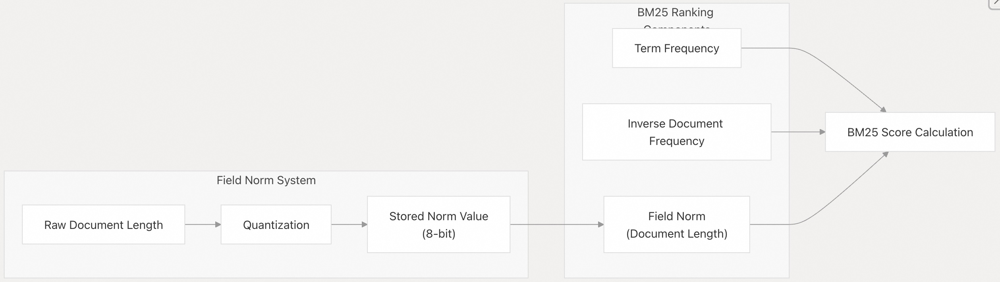
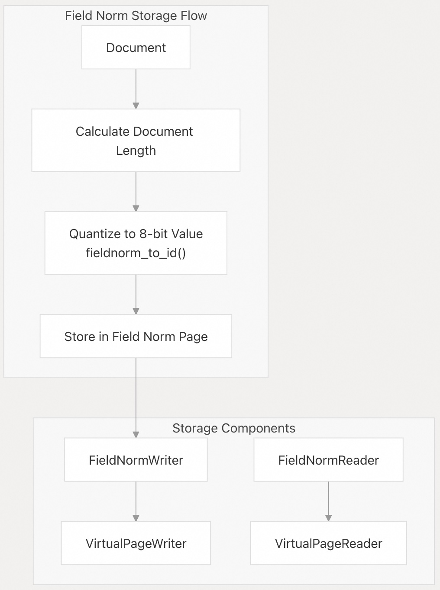
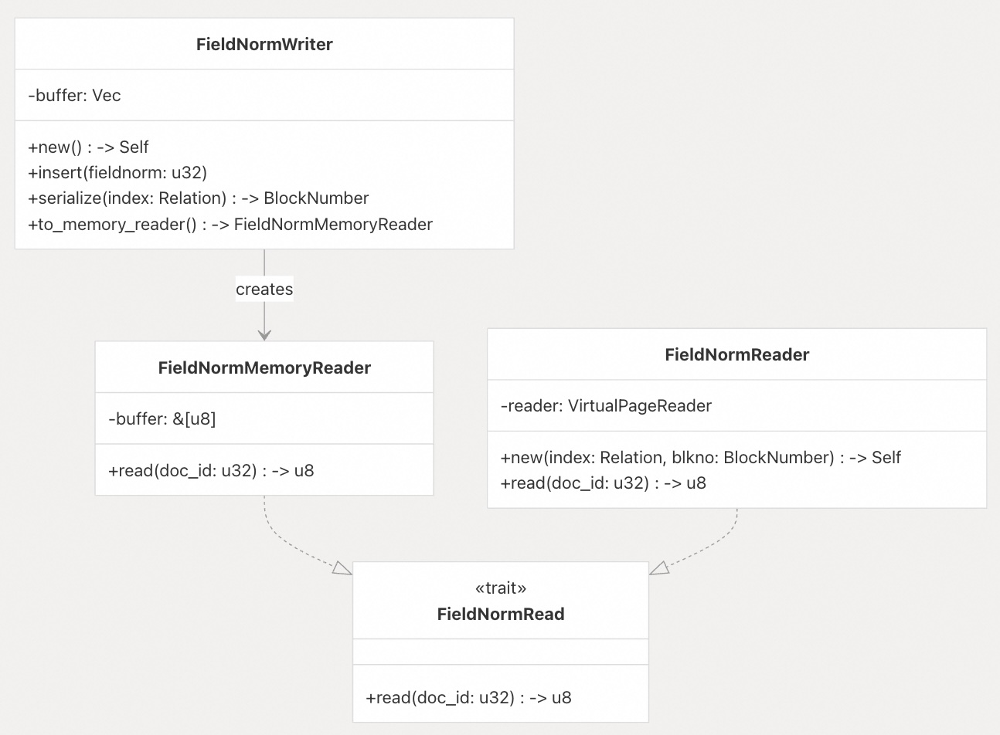

## VectorChord-bm25 源码学习: 4.4 字段规范化处理 (Field Norm Handling)    
          
### 作者          
digoal          
          
### 日期          
2025-11-25          
          
### 标签          
VectorChord-bm25 , 源码学习 , 全文检索 , 关键词检索 , TF , IDF , 相关性排序 , ranking , Block-WeakAnd , Block-WAND , tsvector , ts_rank          
          
----          
          
## 背景          
本文档解释了 **VectorChord-BM25** 如何通过**字段规范化处理** (**field norm handling**) 来实现文档长度归一化（**document length normalization**），这是 **BM25** 排名算法的关键组成部分。**字段规范** (**Field norms**) 代表文档长度，对于 **BM25** 公式中的长度归一化组件至关重要。  
  
## BM25 中的字段规范概述 (Overview of Field Norms in BM25)  
  
在 **BM25** 排名算法中，文档长度是一个关键因素。该算法基于文档长度对词频 (**term frequencies**) 进行归一化 (**normalize**)，以避免偏向更长的文档。**VectorChord-BM25** 中的**字段规范** (**Field norms**) 是用于高效存储和检索文档长度信息的机制。  
  
    
  
来源:  
[`src/segment/field_norm.rs` 55-65](https://github.com/tensorchord/VectorChord-bm25/blob/da0908a6/src/segment/field_norm.rs#L55-L65)  
  
## 字段规范存储架构 (Field Norm Storage Architecture)  
  
**字段规范** (**Field norms**) 采用**量化** (**quantization**) 方法进行高效存储，该方法将潜在的大文档长度值映射到更紧凑的 **8 位** (**8-bit**) 表示。这种压缩策略平衡了存储效率和排名准确性。  
  
    
  
来源:  
[`src/segment/field_norm.rs` 1-53](https://github.com/tensorchord/VectorChord-bm25/blob/da0908a6/src/segment/field_norm.rs#L1-L53)  
  
## 量化机制 (Quantization Mechanism)  
  
为了减少存储需求，**VectorChord-BM25** 使用一个预定义的包含 **256** 个条目的表对文档长度进行**量化** (**quantizes**)。这允许使用每个文档的单个字节来表示文档长度。  
  
### 量化表 (Quantization Table)  
  
系统使用一个包含 **256** 个条目的非线性**量化表**（`FIELD_NORMS_TABLE`）。该表的设计提供了：  
  
1.  对较短文档（更常见）的细粒度表示。  
2.  对较长文档（不太常见）的逐步粗粒度表示。  
3.  最大可表示文档长度为 **2,013,265,944 tokens**（词元）。  
  
    
  
该**量化表**对于小文档长度以小增量（0、1、2、3...）开始，并逐渐增加较大文档长度的步长，在保持 **BM25** 计算足够精度的同时，提供了高效的表示。  
  
来源:  
[`src/segment/field_norm.rs` 67-326](https://github.com/tensorchord/VectorChord-bm25/blob/da0908a6/src/segment/field_norm.rs#L67-L326)  
  
## 字段规范组件 (Field Norm Components)  
  
**VectorChord-BM25** 实现了几个用于处理**字段规范**的组件：  
  
### FieldNormWriter  
  
`FieldNormWriter` 负责在索引过程中收集和存储**字段规范** (**field norms**)。它提供：  
  
  * 一个在文档处理期间收集**字段规范**值的缓冲区。  
  * 插入新**字段规范**的方法 (`insert`)。  
  * 使用**虚拟页系统** (**virtual page system**) 序列化 (**serialize**) 到磁盘。  
  * 能够创建用于测试或优化目的的内存中读取器。  
  
### 字段规范读取器 (Field Norm Readers)  
  
系统提供了两种读取器实现：  
  
1.  `FieldNormMemoryReader`：提供对存储在内存中的**字段规范**的直接访问。  
2.  `FieldNormReader`：使用**虚拟页系统** (**virtual page system**) 从磁盘访问**字段规范**。  
  
两者都实现了 `FieldNormRead trait`，它定义了一个一致的接口，用于通过文档 **ID** 检索**字段规范**值。  
  
    
  
来源:  
[`src/segment/field_norm.rs` 3-53](https://github.com/tensorchord/VectorChord-bm25/blob/da0908a6/src/segment/field_norm.rs#L3-L53)  
  
## 字段规范在 BM25 计算中的使用 (Field Norm Usage in BM25 Calculation)  
  
在计算 **BM25** 分数时，系统会执行以下操作：  
  
1.  检索文档的**量化字段规范 ID** (**quantized field norm ID**)。  
2.  使用 `id_to_fieldnorm` 将其转换回近似文档长度。  
3.  在 **BM25** 公式中使用该值来归一化词频。  
  
**BM25** 分数计算使用**字段规范**来实现公式中的文档长度归一化组件：  
  
```  
BM25 Score = IDF * (term_freq * (k1 + 1)) / (term_freq + k1 * (1 - b + b * (doc_length / avg_doc_length)))  
```  
  
其中 `doc_length` 是通过**字段规范系统**获得的，而 `k1` 和 `b` 是可调参数，用于控制词频和文档长度归一化的影响。  
  
## 性能考量 (Performance Considerations)  
  
**字段规范**处理系统平衡了以下几个性能考量：  
  
1.  **存储效率** (**Storage Efficiency**): 使用 **8 位** (**8-bit**) 量化值比存储完整的 **32 位** 文档长度节省了大量空间。  
2.  **随机访问性能** (**Random Access Performance**): 简单的基于数组的存储格式支持按文档 **ID** 进行 **O(1)** 随机访问。  
3.  **计算开销** (**Calculation Overhead**): 量化/反量化过程在评分期间仅增加最小的开销。  
4.  **内存使用** (**Memory Usage**): 紧凑的表示允许在内存缓存中保留更多的**字段规范**。  
  
## 与存储子系统的集成 (Integration with Storage Subsystem)  
  
**字段规范**存储在索引的物理存储中的专用页面中：  
  
1.  在索引构建期间，`FieldNormWriter` 累积**字段规范**。  
2.  它们使用特殊的页面标志（`PageFlags::FIELD_NORM`）写入磁盘。  
3.  `VirtualPageWriter` 处理物理写入过程。  
4.  在查询期间，`FieldNormReader` 使用**虚拟页系统** (**virtual page system**) 获取这些值。  
  
这种集成确保了**字段规范**能够与其他索引组件一起高效地持久化和访问。  
  
来源:  
[`src/segment/field_norm.rs` 1-20](https://github.com/tensorchord/VectorChord-bm25/blob/da0908a6/src/segment/field_norm.rs#L1-L20)  
  
## 总结 (Summary)  
  
**VectorChord-BM25** 中的**字段规范**处理为 **BM25** 算法中的文档长度归一化提供了一种高效且有效的解决方案。通过**量化** (**quantization**)、专用存储和清晰的组件架构，该系统在保持排名质量的同时实现了存储效率和计算性能。  
  
-----  
  
# 附录1: 量化精度损失对 BM25 排名准确性的实际影响是什么？  
  
**问题背景与痛点：** 文档提到，系统为了存储效率，将文档长度（`Field norms`）从可能很大的值压缩成了 **8 位**（**8-bit**）表示，并采用了非线性**量化** (**quantization**) 策略（对长文档的表示会**逐步变粗**）。  
  
**关键问题：**  
  
> 这种 **8 位量化**导致的精度损失，在实际的 **BM25 排名**中会产生多大影响？特别是对于**极长文档**或**长度分布密集**的文档集合，这种精度损失是否会显著影响相关性排序结果（例如，导致两个实际长度略有不同的文档被量化为相同的 `doc_length`，从而影响它们的得分差异）？  
  
## 回答  
  
您的问题是关于 VectorChord-BM25 中 **field norm（文档长度）的 8 位量化**对 **BM25 排名精度**的影响。    
  
## 量化策略分析  
  
系统使用 `FIELD_NORMS_TABLE` 将文档长度映射到 256 个离散值（8-bit）。    
  
量化策略特点：  
- **短文档（0-40）** ：线性映射，每个值都有独立表示  
- **中等文档（40-168）** ：步长为 2-8，精度开始下降  
- **长文档（168+）** ：步长呈指数增长（最大步长达 67,108,888）  
  
`fieldnorm_to_id()` 使用二分查找找到最接近的量化值。    
  
## 对 BM25 排名的实际影响  
  
### 1. BlockWand 上界计算中的使用  
  
在 Block-WAND 算法中，`blockwand_fieldnorm_id` 用于计算块的最大得分上界：    
  
这里的影响是**间接的**：量化误差会影响块跳过决策，但不会直接影响最终得分计算。    
  
### 2. 实际得分计算  
  
在对文档进行实际评分时，系统从 `FieldNormReader` 读取量化后的 ID，然后转换回文档长度：    
  
**关键点**：所有得分计算都使用量化后的长度值，因此：  
- 两个实际长度分别为 100,663,320 和 109,051,928 的文档会被量化为相同的值（100,663,320）  
- 它们在 BM25 计算中会得到**完全相同**的长度归一化因子  
  
## 精度损失的量化评估  
  
### 极长文档的影响  
  
对于极长文档（> 1 亿 tokens），相对误差可达：  
- 文档长度 100,663,320 → 下一个量化点 109,051,928  
- **相对误差：8.3%**  
- 文档长度 1,073,741,848 → 下一个量化点 1,207,959,576    
- **相对误差：12.5%**  
  
### 对排序的实际影响  
  
**影响较小的场景**：  
- 查询词在文档中出现频率差异较大时，TF 项主导得分  
- 文档长度差异跨越多个量化区间时，排序仍然正确  
  
**影响较大的场景**：  
- 长度分布密集在某个量化区间内（如都在 100M-109M 之间）  
- 查询词频率相似，得分主要由长度归一化决定  
- 此时多个文档可能被错误地赋予相同排名  
  
## Notes  
  
量化表的设计采用了类似对数刻度的策略，这在信息检索中是常见做法（如 Lucene 也使用类似方案）。对于大多数实际应用场景，这种精度损失是可接受的权衡，因为：  
  
1. **存储效率**：每个文档只需 1 字节而非 4 字节（75% 空间节省）    
  
2. **BM25 的鲁棒性**：BM25 公式中的长度归一化项使用饱和函数（通过 k1 和 b 参数），对长度的敏感度本身就是非线性的  
  
3. **实际文档分布**：真实场景中，文档长度通常呈长尾分布，极长文档占比很小  
  
如果您的应用场景确实对极长文档的排序精度有严格要求，可能需要考虑修改量化表或使用更高精度的表示。  
  
  
  
-----  
  
# 附录2: BM25 参数调优 (`k1` 和 `b`) 如何与字段规范的量化机制配合？  
  
**问题背景与细节：** **BM25** 公式使用 **文档长度** (`doc_length`，由字段规范系统提供) 和 **可调参数** (`k1` 和 `b`) 进行归一化。  
  
**关键问题：**  
  
> 既然 `doc_length` 是从量化后的 **8 位 ID** 转换回来的近似值，那么我们在调整 **BM25 参数** **`k1`**（词频饱和度）和 **`b`**（长度归一化程度）时，是否需要采取特殊策略来应对这个近似值？是否存在某种 `k1/b` 组合，会放大**字段规范**量化误差的影响？  
  
## 回答  
  
您的问题是关于 VectorChord-BM25 中**字段规范（field norm）量化系统**对 BM25 参数调优的影响。    
  
具体来说，您想了解：由于文档长度通过 8 位 ID 量化存储（`fieldnorm_to_id` 和 `id_to_fieldnorm` 转换），这种近似是否会在调整 BM25 的 `k1` 和 `b` 参数时产生特殊影响。  
  
## 量化系统的工作原理  
  
VectorChord-BM25 使用一个 256 项的查找表 `FIELD_NORMS_TABLE` 将文档长度压缩为 8 位 ID。   该表采用**非线性间隔**：  
  
- 0-40: 每个整数一个条目（精确）  
- 40-1048: 间隔逐渐增大（2, 4, 8...）  
- 更大值: 指数级增长的间隔  
  
最大可表示长度为 `MAX_FIELD_NORM = 2_013_265_944`。    
  
量化过程使用二分查找找到最接近的较小值：    
  
```rust  
pub fn fieldnorm_to_id(fieldnorm: u32) -> u8 {  
    FIELD_NORMS_TABLE  
        .binary_search(&fieldnorm)  
        .unwrap_or_else(|idx| idx - 1) as u8  
}  
```  
  
## BM25 评分中的使用  
  
在 Block-WAND 算法中，量化后的字段规范被用于计算 BM25 分数：    
  
```rust  
let len = id_to_fieldnorm(fieldnorm_reader.read(pivot_doc));  
let score = indexes[..pivot_len]  
    .iter()  
    .map(|(i, _)| {  
        let scorer = &scorers[*i as usize];  
        scorer.weight.score(len, scorer.posting.freq())  
    })  
    .sum();  
```  
  
这里的 `len` 是从 8 位 ID 反量化得到的近似文档长度，直接传入 `Bm25Weight::score()` 方法。  
  
## 对 k1/b 参数调优的影响  
  
### 理论分析  
  
**BM25 公式中的长度归一化项**：  
```  
score = IDF * (tf * (k1 + 1)) / (tf + k1 * (1 - b + b * (doc_len / avgdl)))  
```  
  
**关键观察**：  
  
1. **`b` 参数的敏感性**：当 `b` 接近 1 时，长度归一化效果最强，量化误差对分数的影响也最大。  
  
2. **误差放大的条件**：  
   - 对于**短文档**（0-40 tokens）：量化是精确的，无误差  
   - 对于**中等长度文档**（40-1000 tokens）：相对误差约 2-10%  
   - 对于**长文档**（>10000 tokens）：相对误差可达 10-20%  
  
3. **`k1` 的缓冲作用**：较大的 `k1` 值会降低词频项的影响，间接减少长度归一化误差的相对重要性。  
  
### 实际影响  
  
在 posting list 构建时，系统使用量化后的字段规范计算 `block_max_score`：    
  
```rust  
let fieldnorm_id = self.fieldnorm_reader.read(docid);  
let len = id_to_fieldnorm(fieldnorm_id);  
let score = weight.score(len, freq);  
if score > blockwand_score {  
    blockwand_tf = freq;  
    blockwand_fieldnorm_id = fieldnorm_id;  
    blockwand_score = score;  
}  
```  
  
这意味着量化误差会影响：  
1. **Block-WAND 的跳过决策**：可能导致本应跳过的块被解码，或反之  
2. **最终排序**：相似分数的文档可能因量化误差而排序颠倒  
  
## 建议策略  
  
**目前代码中没有针对量化误差的特殊参数调整机制**。 但基于量化表的设计，您可以考虑：  
  
1. **避免极端 `b` 值**：`b = 1.0` 会最大化量化误差的影响；建议使用 `b ∈ [0.5, 0.8]` 的中等值  
2. **适度增大 `k1`**：较大的 `k1`（如 1.5-2.0）可以降低长度归一化的相对重要性  
3. **注意文档长度分布**：如果您的文档主要是长文档（>1000 tokens），量化误差会更显著  
  
## Notes  
  
当前实现中，BM25 参数 `k1` 和 `b` 是硬编码在 `Bm25Weight` 结构中的，没有暴露为可配置的 GUC 参数。 如果需要调整这些参数，您需要修改源代码中的常量定义。  
  
量化表的设计（非线性间隔）实际上是一种权衡：它为常见的短文档提供高精度，同时仍能表示极长的文档。这种设计在大多数实际场景中应该是合理的，除非您的应用有特殊的文档长度分布。  
  
  
  
-----  
  
# 附录3: 如何定制或扩展字段规范量化表 (`FIELD_NORMS_TABLE`) 以适应特定数据？  
  
**问题背景与维护：** 文档提到**量化表** (`FIELD_NORMS_TABLE`) 是预定义的，且最大可表示长度为 20 亿 tokens 左右。该表是根据通用语料库设计，以实现**细粒度**和**粗粒度**的平衡。  
  
**关键问题：**  
  
> 如果我的语料库包含大量长度超过当前上限的文档，或者我的文档长度分布与默认设计**严重不符**（例如，我需要对长文档保持更高的精度），作为用户，我是否有办法**配置**、**修改**或**替换**这个默认的 `FIELD_NORMS_TABLE`？如果不能，我该如何处理超出量化范围的文档？  
  
  
## 回答  
  
您的问题是关于 VectorChord-BM25 中的 `FIELD_NORMS_TABLE` 量化表的配置和修改能力。    
  
  
**目前无法配置或修改 `FIELD_NORMS_TABLE`**。  
  
该量化表是硬编码在源代码中的 **常量数组** ，包含 256 个预定义值，最大值为 `MAX_FIELD_NORM = 2_013_265_944`（约 20 亿 tokens）。    
  
见 `field_norm.rs:67-326`    
  
### 量化机制  
  
文档长度通过 `fieldnorm_to_id()` 函数量化为 0-255 的 ID：    
  
- 使用二分查找找到最接近的量化值  
- 如果文档长度超过表中最大值，会被量化为 ID 255（对应 2,013,265,944）  
  
### 超长文档的处理  
  
对于超过 20 亿 tokens 的文档：  
  
1. **自动截断到最大值**：`fieldnorm_to_id()` 的 `unwrap_or_else(|idx| idx - 1)` 逻辑会将超出范围的值映射到最后一个 ID（255）    
  
2. **BM25 评分影响**：所有超过 20 亿 tokens 的文档在 BM25 计算中会被视为相同长度，这会影响长度归一化的准确性    
  
3. **BlockWand 优化**：在查询时，系统使用量化后的 `fieldnorm_id` 计算 block_max_score 上界    
  
### 修改方案（需要重新编译）  
  
如果您需要自定义量化表，唯一的方法是：  
  
1. **修改源代码**：编辑 `src/segment/field_norm.rs` 中的 `FIELD_NORMS_TABLE` 常量    
2. **重新编译扩展**：使用 `cargo pgrx` 重新构建  
3. **重建索引**：所有现有的 BM25 索引需要重建，因为量化 ID 的含义已改变  
  
## Notes  
  
该设计选择（硬编码量化表）是为了性能优化：每个文档的长度只需存储 1 字节（u8 类型），而不是 4 字节（u32）。   这在大规模索引中可以显著减少存储空间。  
  
如果您的语料库确实包含大量超长文档或需要更高精度，建议考虑：  
- 在索引前对文档进行分块处理  
- 或者提交 issue/PR 到项目，建议添加可配置的量化表支持  
  
-----  
  
# 附录4: 量化表每个区间的误差  
  
您询问的是**量化表每个区间的误差**,这涉及到 VectorChord-BM25 中的 Field Norm 量化机制。  
  
## Field Norm 量化机制  
  
在 BM25 索引中,文档长度(field norm)被量化存储以节省空间。系统使用一个预定义的 256 个值的查找表 `FIELD_NORMS_TABLE` 来实现量化  。  
  
### 量化过程  
  
文档长度通过 `fieldnorm_to_id()` 函数映射到 0-255 的 ID  :  
  
```rust  
pub fn fieldnorm_to_id(fieldnorm: u32) -> u8 {  
    FIELD_NORMS_TABLE  
        .binary_search(&fieldnorm)  
        .unwrap_or_else(|idx| idx - 1) as u8  
}  
```  
  
该函数使用二分查找在量化表中找到最接近的值。如果精确匹配则返回对应索引;否则返回小于该值的最大索引(`idx - 1`)  。  
  
### 量化表区间分布  
  
`FIELD_NORMS_TABLE` 包含 256 个递增的值,从 0 到 2,013,265,944  :  
  
- **前 40 个值** (ID 0-39): 线性增长,每个值递增 1,覆盖 0-40 的范围    
- **中间区间**: 间隔逐渐增大,采用指数级增长策略  
- **最大值**: `MAX_FIELD_NORM = 2_013_265_944`    
  
### 每个区间的误差  
  
量化误差取决于相邻两个量化值之间的差距:  
  
1. **小文档长度区间** (0-40): 误差最多为 ±0.5,因为每个整数都有对应的量化值    
  
2. **中等文档长度区间** (例如 40-1000): 误差逐渐增大。例如:  
   - ID 40-47 区间,值为 42, 44, 46, 48, 50, 52, 54, 56,间隔为 2,最大误差约 ±1    
   - ID 48-55 区间,值为 60, 64, 68, 72, 76, 80, 84, 88,间隔为 4,最大误差约 ±2    
  
3. **大文档长度区间** (>100万): 误差可达数百万。例如最后几个区间的间隔超过 1.3 亿    
  
### 使用场景  
  
量化后的 field norm ID 在以下场景中使用:  
  
- **存储**: 每个文档只需 1 字节存储长度信息    
- **BM25 评分**: 通过 `id_to_fieldnorm()` 还原为近似长度值用于计算    
- **BlockWand 优化**: 存储在 posting list 的 skip block 中用于上界计算    
  
## Notes  
  
量化表的设计权衡了存储效率和精度。对于短文档(常见情况),误差很小;对于极长文档,较大的相对误差对 BM25 评分影响有限,因为 BM25 算法本身对文档长度的敏感度会随长度增加而降低。  
  
    
#### [PolarDB 学习图谱](https://www.aliyun.com/database/openpolardb/activity "8642f60e04ed0c814bf9cb9677976bd4")
  
  
#### [PostgreSQL 解决方案集合](../201706/20170601_02.md "40cff096e9ed7122c512b35d8561d9c8")
  
  
#### [德哥 / digoal's Github - 公益是一辈子的事.](https://github.com/digoal/blog/blob/master/README.md "22709685feb7cab07d30f30387f0a9ae")
  
  
#### [About 德哥](https://github.com/digoal/blog/blob/master/me/readme.md "a37735981e7704886ffd590565582dd0")
  
  

  
