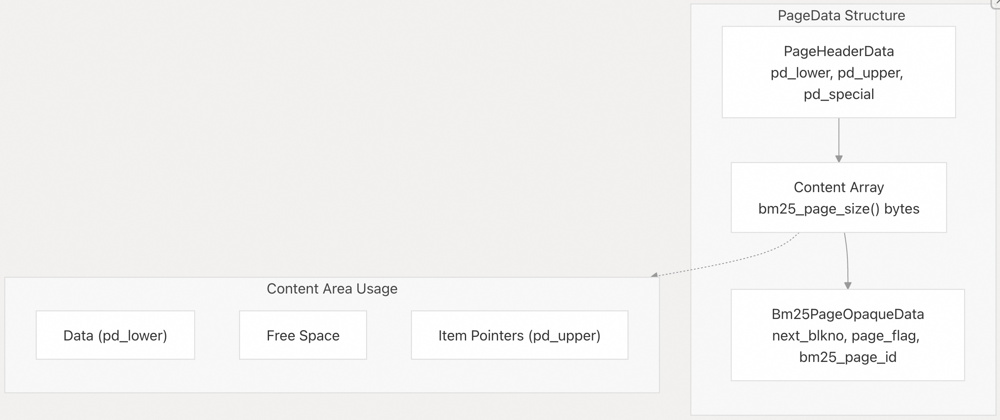
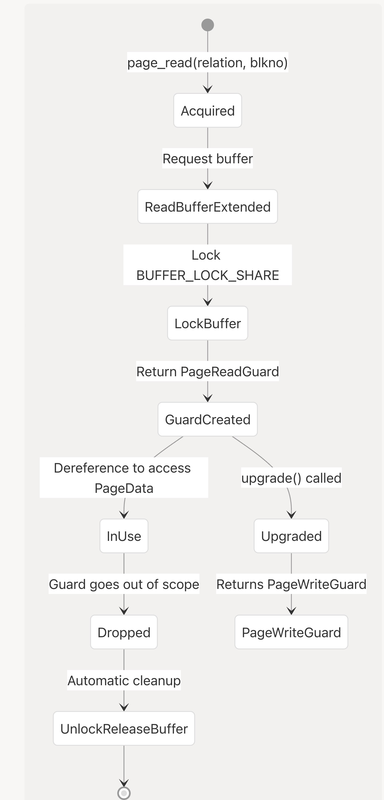
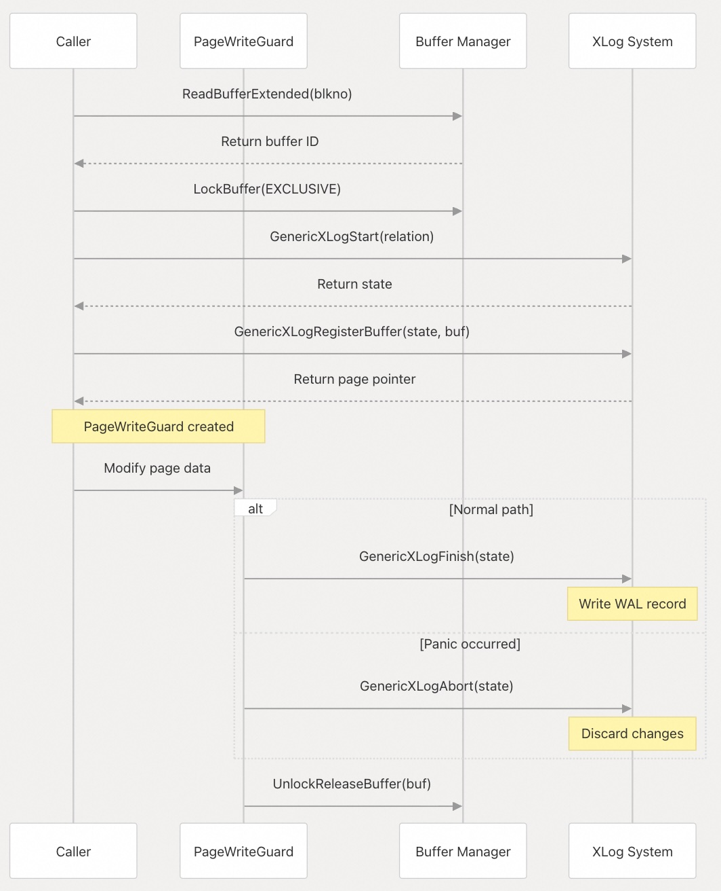
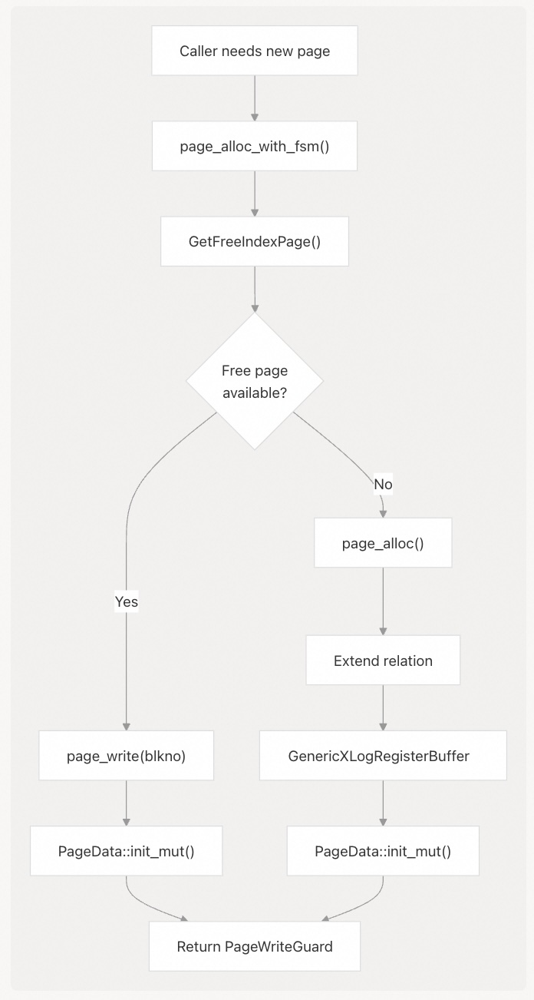
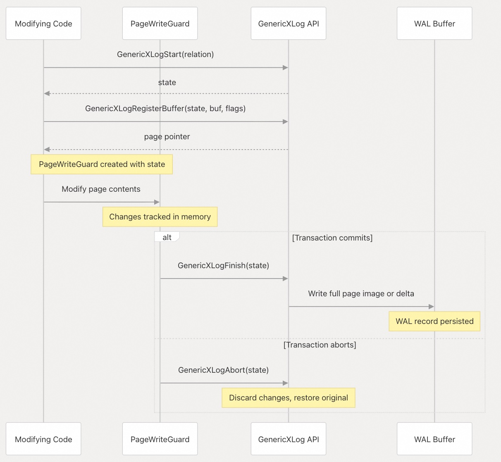
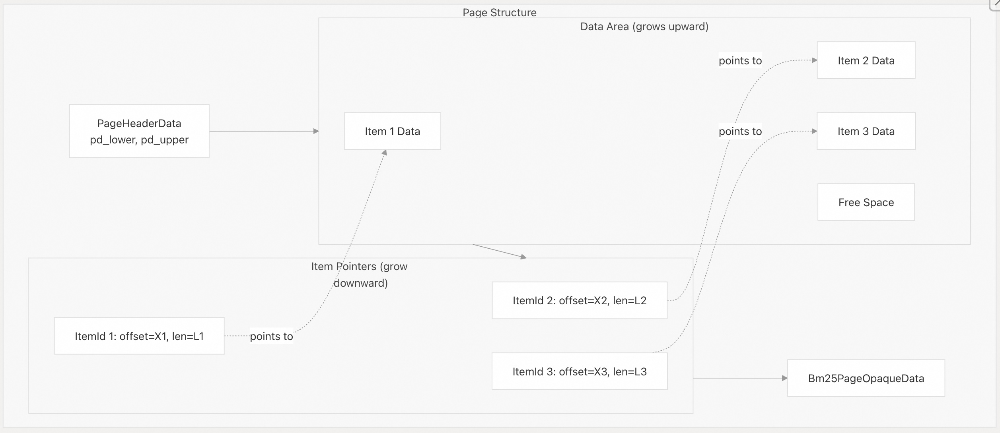

## VectorChord-bm25 源码学习: 4.5 页面管理 (Page Management)    
            
### 作者            
digoal            
            
### 日期            
2025-11-25            
            
### 标签            
VectorChord-bm25 , 源码学习 , 全文检索 , 关键词检索 , TF , IDF , 相关性排序 , ranking , Block-WeakAnd , Block-WAND , tsvector , ts_rank            
            
----            
            
## 背景            
本文档描述了 `VectorChord-BM25` 如何在底层管理 `PostgreSQL` 的**页面 (pages)** ，包括页面结构、用于安全访问的 **RAII 守卫 (RAII guards)** 、用于**持久性 (durability)** 的 **XLog 集成 (XLog integration)** ，以及**项管理操作 (item management operations)** 。页面管理是所有更高层级**索引结构 (index structures)** 建立的基础层。  
  
有关页面如何用于构建更大的**虚拟页面结构 (virtual page structures)** 的信息，请参阅 虚拟页面系统 (Virtual Page System) 章节。  
  
## 概述 (Overview)  
  
`VectorChord-BM25` 使用 `PostgreSQL` 的**固定大小页面架构 (fixed-size page architecture)** （通常为 8KB）来管理存储。每个页面都有一个标准化的结构，包含：  
  
1.  **PostgreSQL 头部 (PostgreSQL Header)** ：标准页面元数据 (`PageHeaderData`)  
2.  **内容区域 (Content Area)** ：用于索引数据的灵活存储空间  
3.  **BM25 不透明数据 (BM25 Opaque Data)** ：特定于 BM25 索引页面的自定义元数据 (`metadata`)  
  
页面管理层提供：  
  
  * **类型安全 (Type-safe)** 的 **RAII 守卫 (RAII guards)** （`PageReadGuard`、`PageWriteGuard`），用于**控制页面访问 (controlled page access)**  
  * **自动 XLog 集成 (Automatic XLog integration)** ，用于**崩溃恢复 (crash recovery)** 和**复制 (replication)**  
  * **基于项的存储 (Item-based storage)** ，用于**可变长度数据 (variable-length data)**  
  * 支持**空闲空间映射 (Free Space Map, FSM)** 的页面**分配 (allocation)** 和**释放 (deallocation)**  
  
所有页面操作都通过 `PostgreSQL` 的**缓冲区管理器 (buffer manager)** 和**预写式日志 (write-ahead logging, WAL)** 系统确保 **ACID 属性 (ACID properties)** 。  
  
来源:  
[`src/page/postgres.rs` 1-494](https://github.com/tensorchord/VectorChord-bm25/blob/da0908a6/src/page/postgres.rs#L1-L494)  
  
## 页面结构 (Page Structure)  
  
### PageData 布局 (Layout)  
  
定义在 [`src/page/postgres.rs` 47-91](https://github.com/tensorchord/VectorChord-bm25/blob/da0908a6/src/page/postgres.rs#L47-L91) 中的 `PageData` 结构体表示一个单独的 `PostgreSQL` 页面：  
  
**图表: PageData 内存布局 (Memory Layout)**  
  
    
  
来源:  
[`src/page/postgres.rs` 47-91](https://github.com/tensorchord/VectorChord-bm25/blob/da0908a6/src/page/postgres.rs#L47-L91)  
  
| 字段 (Field) | 类型 (Type) | 用途 (Purpose) |  
| :--- | :--- | :--- |  
| `header` | `PageHeaderData` | PostgreSQL 标准页面头部，包含 `pd_lower`（数据结束位置）、`pd_upper`（项指针开始位置）、`pd_special`（特殊空间偏移量）|  
| `content` | `[u8; bm25_page_size()]` | 灵活存储区域（通常为 8KB 减去头部大小）|  
| `opaque` | `Bm25PageOpaqueData` | 位于特殊空间中的 BM25 特定**元数据 (metadata)** |  
  
`bm25_page_size()` **常量 (constant)** [`src/page/postgres.rs` 34-38](https://github.com/tensorchord/VectorChord-bm25/blob/da0908a6/src/page/postgres.rs#L34-L38) 计算可用内容空间为 `BLCKSZ - sizeof(PageHeaderData) - sizeof(Bm25PageOpaqueData)`。  
  
来源:  
[`src/page/postgres.rs` 34-91](https://github.com/tensorchord/VectorChord-bm25/blob/da0908a6/src/page/postgres.rs#L34-L91)  
  
### Bm25PageOpaqueData (BM25 页面不透明数据)  
  
**不透明数据结构 (opaque data structure)** [`src/page/postgres.rs` 40-45](https://github.com/tensorchord/VectorChord-bm25/blob/da0908a6/src/page/postgres.rs#L40-L45) 存储了 BM25 特定的页面**元数据 (metadata)** ：  
  
```rust  
pub struct Bm25PageOpaqueData {  
    pub next_blkno: BlockNumber,      // Linked list pointer for chained pages  
    pub page_flag: PageFlags,          // Page type identifier  
    bm25_page_id: u16,                // Magic number 0xFF88 for validation  
}  
```  
  
`page_flag` 字段使用**位标志 (bitflags)** [`src/page/postgres.rs` 16-32](https://github.com/tensorchord/VectorChord-bm25/blob/da0908a6/src/page/postgres.rs#L16-L32) 来识别页面类型：  
  
| 标志 (Flag) | 值 (Value) | 用途 (Purpose) |  
| :--- | :--- | :--- |  
| `META` | `1 << 0` | **元页面 (Metapage)** (块 0) |  
| `PAYLOAD` | `1 << 1` | 存储 **TID** (tuple identifiers, **元组标识符**) |  
| `FIELD_NORM` | `1 << 2` | **文档长度规范化数据 (Document length normalization data)** |  
| `TERM_STATISTIC` | `1 << 3` | **术语统计信息 (Term statistics)** ( **文档频率 (document frequencies)** ) |  
| `TERM_INFO` | `1 << 4` | **倒排列表 (Posting list)** 术语信息 |  
| `TERM_META` | `1 << 5` | 倒排列表元数据 |  
| `SKIP_INFO` | `1 << 6` | **Block-WAND 跳过信息 (skip information)** |  
| `BLOCK_DATA` | `1 << 7` | **压缩倒排列表块 (Compressed posting list blocks)** |  
| `GROWING` | `1 << 8` | **增长中的段页面 (Growing segment pages)** |  
| `DELETE` | `1 << 9` | **删除位图页面 (Delete bitmap pages)** |  
| `GROWING_REDIRECT` | `1 << 10` | 增长中段中的**重定向条目 (Redirect entries)** |  
| `FREE` | `1 << 15` | 页面位于**空闲空间映射 (free space map)** 中 |  
  
来源:  
[`src/page/postgres.rs` 16-45](https://github.com/tensorchord/VectorChord-bm25/blob/da0908a6/src/page/postgres.rs#L16-L45)  
  
### 页面初始化 (Page Initialization)  
  
页面通过 `PageData::init_mut()` [`src/page/postgres.rs` 55-68](https://github.com/tensorchord/VectorChord-bm25/blob/da0908a6/src/page/postgres.rs#L55-L68) 进行初始化：  
  
1.  调用 `PageInit()` 设置标准的 `PostgreSQL` 页面结构  
2.  将 `Bm25PageOpaqueData` 写入**特殊空间 (special space)**  
3.  设置**初始标志 (initial flag)** 以识别页面类型  
4.  将 `next_blkno` 初始化为 `InvalidBlockNumber` (0xFFFFFFFF)  
  
来源:  
[`src/page/postgres.rs` 55-68](https://github.com/tensorchord/VectorChord-bm25/blob/da0908a6/src/page/postgres.rs#L55-L68)  
  
## RAII 守卫 (RAII Guards)  
  
`VectorChord-BM25` 使用 **RAII (Resource Acquisition Is Initialization，资源获取即初始化)** 守卫来确保页面访问安全，并实现自动**资源清理 (resource cleanup)** 。这种模式可以防止**缓冲区泄漏 (buffer leaks)** ，并确保即使发生错误也能正确**加锁 (locking)** 。  
  
### PageReadGuard (页面读取守卫)  
  
    
  
**图表: PageReadGuard 生命周期 (Lifecycle)**  
  
来源:  
[`src/page/postgres.rs` 111-177](https://github.com/tensorchord/VectorChord-bm25/blob/da0908a6/src/page/postgres.rs#L111-L177)  
  
`PageReadGuard` [`src/page/postgres.rs` 111-154](https://github.com/tensorchord/VectorChord-bm25/blob/da0908a6/src/page/postgres.rs#L111-L154) 提供对页面的**共享读取访问 (shared read access)** ：  
  
```rust  
pub struct PageReadGuard {  
    buf: i32,                    // PostgreSQL buffer ID  
    page: NonNull<PageData>,     // Pointer to page data  
}  
```  
  
关键操作：  
  
  * `page_read(relation, blkno)` [`src/page/postgres.rs` 156-177](https://github.com/tensorchord/VectorChord-bm25/blob/da0908a6/src/page/postgres.rs#L156-L177)：获取**共享锁 (shared lock)** 并返回守卫  
  * `Deref` 实现 [`src/page/postgres.rs` 140-146](https://github.com/tensorchord/VectorChord-bm25/blob/da0908a6/src/page/postgres.rs#L140-L146)：提供对 `PageData` 的**不可变访问 (immutable access)**  
  * `Drop` 实现 [`src/page/postgres.rs` 148-154](https://github.com/tensorchord/VectorChord-bm25/blob/da0908a6/src/page/postgres.rs#L148-L154)：在清理时自动调用 `UnlockReleaseBuffer()`  
  * `upgrade()` [`src/page/postgres.rs` 122-137](https://github.com/tensorchord/VectorChord-bm25/blob/da0908a6/src/page/postgres.rs#L122-L137)：转换为 `PageWriteGuard`（**非原子操作 (not atomic)** - 首先释放共享锁）  
  
来源:  
[`src/page/postgres.rs` 111-177](https://github.com/tensorchord/VectorChord-bm25/blob/da0908a6/src/page/postgres.rs#L111-L177)  
  
### PageWriteGuard (页面写入守卫)  
  
**图表: 带有 XLog 集成的 PageWriteGuard**  
  
    
  
来源:  
[`src/page/postgres.rs` 179-256](https://github.com/tensorchord/VectorChord-bm25/blob/da0908a6/src/page/postgres.rs#L179-L256)  
  
`PageWriteGuard` [`src/page/postgres.rs` 179-231](https://github.com/tensorchord/VectorChord-bm25/blob/da0908a6/src/page/postgres.rs#L179-L231) 提供**独占写入访问 (exclusive write access)** 和自动 **XLog 集成 (XLog integration)** ：  
  
```rust  
pub struct PageWriteGuard {  
    buf: i32,                           // PostgreSQL buffer ID  
    page: NonNull<PageData>,            // Pointer to page data  
    state: *mut GenericXLogState,       // XLog state for WAL  
}  
```  
  
关键操作：  
  
  * `page_write(relation, blkno)` [`src/page/postgres.rs` 233-256](https://github.com/tensorchord/VectorChord-bm25/blob/da0908a6/src/page/postgres.rs#L233-L256)：获取**独占锁 (exclusive lock)** 并在 XLog 中注册页面  
  * `DerefMut` 实现 [`src/page/postgres.rs` 214-218](https://github.com/tensorchord/VectorChord-bm25/blob/da0908a6/src/page/postgres.rs#L214-L218)：提供对 `PageData` 的**可变访问 (mutable access)**  
  * `Drop` 实现 [`src/page/postgres.rs` 220-231](https://github.com/tensorchord/VectorChord-bm25/blob/da0908a6/src/page/postgres.rs#L220-L231)：  
      + 在正常退出时调用 `GenericXLogFinish()`（写入 WAL 记录）  
      + 在发生**恐慌 (panicking)** 时调用 `GenericXLogAbort()`（丢弃更改）  
      + 始终调用 `UnlockReleaseBuffer()`  
  * `degrade()` [`src/page/postgres.rs` 191-203](https://github.com/tensorchord/VectorChord-bm25/blob/da0908a6/src/page/postgres.rs#L191-L203)：在完成 XLog 后转换为 `PageReadGuard`  
  
XLog 集成确保了**持久性 (durability)** —— 所有页面修改在应用于磁盘之前都会自动记录在**预写式日志 (write-ahead log)** 中。  
  
来源:  
[`src/page/postgres.rs` 179-256](https://github.com/tensorchord/VectorChord-bm25/blob/da0908a6/src/page/postgres.rs#L179-L256)  
  
### 锁升级安全性 (Lock Upgrade Safety)  
  
`upgrade()` 和 `degrade()` 操作被标记为 " **不保证是原子操作 (not guaranteed to be atomic)** " [`src/page/postgres.rs` 121](https://github.com/tensorchord/VectorChord-bm25/blob/da0908a6/src/page/postgres.rs#L121-L121) 和 [`src/page/postgres.rs` 190](https://github.com/tensorchord/VectorChord-bm25/blob/da0908a6/src/page/postgres.rs#L190-L190)。这意味着：  
  
1.  存在一个短暂的时刻未持有锁  
2.  另一个**事务 (transaction)** 可能会在两次加锁之间修改页面  
3.  调用者必须处理升级/降级后可能出现的**不一致性 (inconsistencies)**  
  
这种设计牺牲了**原子性 (atomicity)** ，以换取与 `PostgreSQL` **缓冲区管理器 (buffer manager)** 的兼容性，后者不支持**原子锁升级 (atomic lock upgrades)** 。  
  
来源:  
[`src/page/postgres.rs` 121-137](https://github.com/tensorchord/VectorChord-bm25/blob/da0908a6/src/page/postgres.rs#L121-L137)  
[`src/page/postgres.rs` 190-203](https://github.com/tensorchord/VectorChord-bm25/blob/da0908a6/src/page/postgres.rs#L190-L203)  
  
## 页面操作 (Page Operations)  
  
### 页面分配 (Page Allocation)  
  
`VectorChord-BM25` 根据 `PostgreSQL` 版本和**用例 (use case)** 提供了多种**分配策略 (allocation strategies)** ：  
  
**图表: 页面分配流程 (Flow)**  
  
    
  
来源:  
[`src/page/postgres.rs` 259-414](https://github.com/tensorchord/VectorChord-bm25/blob/da0908a6/src/page/postgres.rs#L259-L414)  
  
#### page\_alloc() (页面分配)  
  
`page_alloc()` 函数 [`src/page/postgres.rs` 259-327](https://github.com/tensorchord/VectorChord-bm25/blob/da0908a6/src/page/postgres.rs#L259-L327) 通过一个新页面来**扩展关系 (extends the relation)** 。实现方式因 `PostgreSQL` 版本而异：  
  
**PostgreSQL 16+ 实现** [`src/page/postgres.rs` 258-295](https://github.com/tensorchord/VectorChord-bm25/blob/da0908a6/src/page/postgres.rs#L258-L295)：  
  
```rust  
pub fn page_alloc(relation, flag, skip_lock_rel) -> PageWriteGuard {  
    // Uses ExtendBufferedRel() with EB_LOCK_FIRST flag  
    // Optionally skips EB_SKIP_EXTENSION_LOCK for bulk operations  
    // Registers with GenericXLog with GENERIC_XLOG_FULL_IMAGE  
    // Initializes page with PageData::init_mut()  
}  
```  
  
**PostgreSQL 13-15 实现** [`src/page/postgres.rs` 297-327](https://github.com/tensorchord/VectorChord-bm25/blob/da0908a6/src/page/postgres.rs#L297-L327)：  
  
```rust  
pub fn page_alloc(relation, flag, skip_lock_rel) -> PageWriteGuard {  
    // Manually locks with LockRelationForExtension() if needed  
    // Uses ReadBuffer(relation, P_NEW) to extend  
    // Unlocks with UnlockRelationForExtension()  
    // Same XLog and initialization as PG16+  
}  
```  
  
`skip_lock_rel` 参数优化了调用者已持有适当锁的**批量操作 (bulk operations)** 。  
  
来源:  
[`src/page/postgres.rs` 258-327](https://github.com/tensorchord/VectorChord-bm25/blob/da0908a6/src/page/postgres.rs#L258-L327)  
  
#### page\_alloc\_with\_fsm() (带有 FSM 的页面分配)  
  
`page_alloc_with_fsm()` 函数 [`src/page/postgres.rs` 394-408](https://github.com/tensorchord/VectorChord-bm25/blob/da0908a6/src/page/postgres.rs#L394-L408) 尝试在**扩展关系 (extending)** 之前**重用 (reuse)** 空闲页面：  
  
1.  调用 `GetFreeIndexPage()` 检查**空闲空间映射 (Free Space Map)**  
2.  如果存在空闲页面，则调用 `page_write()` 并重新初始化它  
3.  否则，**回退 (falls back)** 到 `page_alloc()` 来扩展关系  
  
这通过重用由 **vacuum 操作 (vacuum operations)** 释放的页面来减少**关系膨胀 (relation bloat)** 。  
  
来源:  
[`src/page/postgres.rs` 394-408](https://github.com/tensorchord/VectorChord-bm25/blob/da0908a6/src/page/postgres.rs#L394-L408)  
  
#### page\_alloc\_init\_forknum() (初始化分支的页面分配)  
  
`page_alloc_init_forknum()` 函数 [`src/page/postgres.rs` 329-392](https://github.com/tensorchord/VectorChord-bm25/blob/da0908a6/src/page/postgres.rs#L329-L392) 在 `INIT_FORKNUM` **分支 (fork)** 中分配页面，该分支用于**索引构建 (index builds)** 。此分支中的页面在**事务提交 (transaction commits)** 后会被复制到**主分支 (main fork)** ，从而避免在**批量加载 (bulk loads)** 期间进行 **WAL 日志记录 (WAL logging)** 。  
  
来源:  
[`src/page/postgres.rs` 329-392](https://github.com/tensorchord/VectorChord-bm25/blob/da0908a6/src/page/postgres.rs#L329-L392)  
  
### 页面释放 (Page Deallocation)  
  
`page_free()` 函数 [`src/page/postgres.rs` 410-414](https://github.com/tensorchord/VectorChord-bm25/blob/da0908a6/src/page/postgres.rs#L410-L414) 将页面标记为可供重用：  
  
```rust  
pub fn page_free(index: Relation, blkno: BlockNumber) {  
    RecordFreeIndexPage(index, blkno);  
}  
```  
  
这将页面添加到 `PostgreSQL` 的**空闲空间映射 (Free Space Map, FSM)** 中，使其可用于未来的 `page_alloc_with_fsm()` 调用。页面内容会保留在磁盘上，直到被覆盖。  
  
来源:  
[`src/page/postgres.rs` 410-414](https://github.com/tensorchord/VectorChord-bm25/blob/da0908a6/src/page/postgres.rs#L410-L414)  
  
## XLog 集成 (XLog Integration)  
  
`VectorChord-BM25` 通过 **通用 XLog API (Generic XLog API)** 与 `PostgreSQL` 的**预写式日志 (Write-Ahead Logging, WAL)** 系统集成，以确保**崩溃恢复 (crash recovery)** 和**复制 (replication)** 支持。  
  
### 通用 XLog 工作流程 (Generic XLog Workflow)  
  
**图表: XLog 记录过程 (Recording Process)**  
  
    
  
来源:  
[`src/page/postgres.rs` 122-137](https://github.com/tensorchord/VectorChord-bm25/blob/da0908a6/src/page/postgres.rs#L122-L137)  
[`src/page/postgres.rs` 220-231](https://github.com/tensorchord/VectorChord-bm25/blob/da0908a6/src/page/postgres.rs#L220-L231)  
[`src/page/postgres.rs` 233-256](https://github.com/tensorchord/VectorChord-bm25/blob/da0908a6/src/page/postgres.rs#L233-L256)  
  
### XLog 标志 (XLog Flags)  
  
在 `GenericXLog` 中注册页面时，`VectorChord-BM25` 使用**标志 (flags)** 来控制日志记录行为：  
  
| 标志 (Flag) | 用法 (Usage) | 用途 (Purpose) |  
| :--- | :--- | :--- |  
| `GENERIC_XLOG_FULL_IMAGE` | 新页面、主要更新 [`src/page/postgres.rs` 126](https://github.com/tensorchord/VectorChord-bm25/blob/da0908a6/src/page/postgres.rs#L126-L126) | **强制将完整页面镜像 (full page image)** 写入 WAL |  
| `0` (无标志) | 次要更新 [`src/page/postgres.rs` 252](https://github.com/tensorchord/VectorChord-bm25/blob/da0908a6/src/page/postgres.rs#L252-L252) | 如果可能，使用**增量压缩 (delta compression)** |  
  
**完整页面镜像 (Full page images)** 用于：  
  
  * 新分配的页面 (`page_alloc`、`page_alloc_init_forknum`)  
  * 从读取到写入的页面升级 (`PageReadGuard::upgrade()`)  
  
**增量压缩 (Delta compression)** 用于：  
  
  * 正常的页面修改 (`page_write()`)  
  
这平衡了 **WAL 文件大小 (WAL size)** 和**恢复速度 (recovery speed)** 。  
  
来源:  
[`src/page/postgres.rs` 126](https://github.com/tensorchord/VectorChord-bm25/blob/da0908a6/src/page/postgres.rs#L126-L126)  
[`src/page/postgres.rs` 252](https://github.com/tensorchord/VectorChord-bm25/blob/da0908a6/src/page/postgres.rs#L252-L252)  
[`src/page/postgres.rs` 269](https://github.com/tensorchord/VectorChord-bm25/blob/da0908a6/src/page/postgres.rs#L269-L269)  
[`src/page/postgres.rs` 286](https://github.com/tensorchord/VectorChord-bm25/blob/da0908a6/src/page/postgres.rs#L286-L286)  
[`src/page/postgres.rs` 318](https://github.com/tensorchord/VectorChord-bm25/blob/da0908a6/src/page/postgres.rs#L318-L318)  
[`src/page/postgres.rs` 339](https://github.com/tensorchord/VectorChord-bm25/blob/da0908a6/src/page/postgres.rs#L339-L339)  
[`src/page/postgres.rs` 353](https://github.com/tensorchord/VectorChord-bm25/blob/da0908a6/src/page/postgres.rs#L353-L353)  
[`src/page/postgres.rs` 383](https://github.com/tensorchord/VectorChord-bm25/blob/da0908a6/src/page/postgres.rs#L383-L383)  
  
### 崩溃恢复 (Crash Recovery)  
  
在**崩溃恢复 (crash recovery)** 期间，`PostgreSQL` 会**重放 (replays)** WAL 记录(和PG常规的增量备份恢复机制一样)：  
  
1.  **通用 XLog 记录 (Generic XLog records)** 包含**关系 OID (relation OID)** 和**缓冲区标识符 (buffer identifier)**  
2.  对于**完整页面镜像 (full page images)** ，会恢复整个页面  
3.  对于**增量记录 (delta records)** ，会将更改应用于现有页面  
4.  通过 `PageWriteGuard` 进行的所有修改都会自动**可恢复 (recoverable)**  
  
这种集成确保了 `VectorChord-BM25` 在不实现自定义 WAL 记录类型的情况下，也能维护 **ACID 属性 (ACID properties)** 。  
  
来源:  
[`src/page/postgres.rs` 220-231](https://github.com/tensorchord/VectorChord-bm25/blob/da0908a6/src/page/postgres.rs#L220-L231)  
  
## 项管理 (Item Management)  
  
`PostgreSQL` 页面通过**项指针数组 (item pointer array)** 支持**可变长度项 (variable-length items)** 。`VectorChord-BM25` 使用此机制在页面内存储**结构化数据 (structured data)** 。  
  
### 项结构 (Item Structure)  
  
**图表: 页面项布局 (Layout)**  
  
    
  
来源:  
[`src/page/postgres.rs` 416-493](https://github.com/tensorchord/VectorChord-bm25/blob/da0908a6/src/page/postgres.rs#L416-L493)  
  
**项指针数组**（`PageHeaderData` 中的 `pd_linp`）从页面末尾向下增长，而数据从开头向上增长。**空闲空间 (free space)** 位于 `pd_lower` 和 `pd_upper` 之间。  
  
### 项操作 (Item Operations)  
  
#### page\_append\_item() (页面追加项)  
  
`page_append_item()` 函数 [`src/page/postgres.rs` 474-493](https://github.com/tensorchord/VectorChord-bm25/blob/da0908a6/src/page/postgres.rs#L474-L493) 向页面添加一个新项：  
  
```rust  
pub fn page_append_item(page: &mut PageData, item: &[u8], redirect: bool) -> bool  
```  
  
1.  验证项是否适合 `bm25_page_size()`  
2.  调用 `PostgreSQL` 的 `PageAddItemExtended()` 来**分配空间 (allocate space)**  
3.  可选地将该项标记为 `LP_REDIRECT`（ 用于**超大项 (oversized items)** ）  
4.  如果页面已满，则返回 `false`  
  
`redirect` 标志 [`src/page/postgres.rs` 469](https://github.com/tensorchord/VectorChord-bm25/blob/da0908a6/src/page/postgres.rs#L469-L469) **重新利用 (repurposes)** 了 `PostgreSQL` 的 `LP_REDIRECT` 项标志，用于标记**超出正常页面大小 (exceed normal page size)** 的项，表明它们应该被特殊处理。  
  
来源:  
[`src/page/postgres.rs` 474-493](https://github.com/tensorchord/VectorChord-bm25/blob/da0908a6/src/page/postgres.rs#L474-L493)  
  
#### page\_get\_item() (获取页面项)  
  
`page_get_item()` 函数 [`src/page/postgres.rs` 450-462](https://github.com/tensorchord/VectorChord-bm25/blob/da0908a6/src/page/postgres.rs#L450-L462) 通过其**偏移量 (offset number)** 检索一个项：  
  
```rust  
pub fn page_get_item<T>(page: &PageData, item_id: ItemIdData) -> &T  
```  
  
1.  从 `ItemIdData` 中提取**偏移量 (offset)** 和**长度 (length)**  
2.  验证 `sizeof::<T>()` 是否在项长度范围内  
3.  将**原始指针 (raw pointer)** 转换为类型 `T`  
4.  返回指向**类型化数据 (typed data)** 的**引用 (reference)**  
  
这为存储在项中的**结构化数据 (structured data)** 提供了**类型安全访问 (type-safe access)** 。  
  
来源:  
[`src/page/postgres.rs` 450-462](https://github.com/tensorchord/VectorChord-bm25/blob/da0908a6/src/page/postgres.rs#L450-L462)  
  
#### 页面元数据辅助函数 (Page Metadata Helpers)  
  
有几个**辅助函数 (helper functions)** 用于访问页面**元数据 (metadata)** ：  
  
| 函数 (Function) | 用途 (Purpose) | 来源 (Source) |  
| :--- | :--- | :--- |  
| `page_get_max_offset_number()` | 返回页面中的项数 | [`src/page/postgres.rs` 416-420](https://github.com/tensorchord/VectorChord-bm25/blob/da0908a6/src/page/postgres.rs#L416-L420) |  
| `page_get_item_id()` | 返回给定偏移量的 `ItemIdData` | [`src/page/postgres.rs` 422-433](https://github.com/tensorchord/VectorChord-bm25/blob/da0908a6/src/page/postgres.rs#L422-L433) |  
| `page_set_item_id_flag()` | 更新项标志（例如 `LP_DEAD`、`LP_REDIRECT`） | [`src/page/postgres.rs` 435-448](https://github.com/tensorchord/VectorChord-bm25/blob/da0908a6/src/page/postgres.rs#L435-L448) |  
  
这些函数将 `PostgreSQL` 的**内部项管理 API (internal item management APIs)** 封装在**类型安全的 Rust 接口 (type-safe Rust interfaces)** 中。  
  
来源:  
[`src/page/postgres.rs` 416-462](https://github.com/tensorchord/VectorChord-bm25/blob/da0908a6/src/page/postgres.rs#L416-L462)  
  
### ItemIdFlags (项 ID 标志)  
  
`ItemIdFlags` **位标志 (bitflags)** [`src/page/postgres.rs` 464-472](https://github.com/tensorchord/VectorChord-bm25/blob/da0908a6/src/page/postgres.rs#L464-L472) 表示**项状态 (item states)** ：  
  
| 标志 (Flag) | 值 (Value) | 含义 (Meaning) |  
| :--- | :--- | :--- |  
| `LP_UNUSED` | 0 | 项槽位**未使用 (unused)** |  
| `LP_NORMAL` | 1 | **正常项 (Normal item)** |  
| `LP_REDIRECT` | 2 | **重定向指针 (Redirect pointer)** （被**重新利用 (repurposed)** 于超大项） |  
| `LP_DEAD` | 3 | 项已**失效 (dead)** （ 已删除但未**回收 (reclaimed)** ） |  
  
`VectorChord-BM25` **重新利用 (repurposes)** 了 `LP_REDIRECT` 来标记超出**页面大小限制 (page size limit)** 的项，表明它们需要**高级别代码 (higher-level code)** 进行特殊处理。  
  
来源:  
[`src/page/postgres.rs` 464-472](https://github.com/tensorchord/VectorChord-bm25/blob/da0908a6/src/page/postgres.rs#L464-L472)  
  
## 总结 (Summary)  
  
`VectorChord-BM25` 中的**实用结构 (utility structures)** 为文本搜索和排名中的常见操作提供了**高效的算法 (efficient algorithms)** ：  
  
| 实用结构 (Utility Structure) | 用途 (Purpose) | 关键优势 (Key Benefits) |  
| :--- | :--- | :--- |  
| `TopKComputer` | 查找得分最高的 Top-k 文档 | **带阈值的有效过滤 (Efficient filtering with threshold)** ，**使用 quickselect 进行部分排序 (partial sorting with quickselect)** |  
| `LoserTree` | 合并多个**排序序列 (sorted sequences)** | 每个元素的比较次数为 O(log k)，**高效的迭代器实现 (efficient iterator implementation)** |  
  
这些结构是**基本构建块 (fundamental building blocks)** ，它们使 `VectorChord-BM25` 扩展能够在 `PostgreSQL` 中直接执行高效的**文本搜索 (text search)** 和**排名 (ranking)** ，从而避免了对**外部搜索引擎 (external search engines)** 的需求，同时保持了**竞争力 (competitive performance)** 。  
  
来源:  
[`src/utils/mod.rs`](https://github.com/tensorchord/VectorChord-bm25/blob/da0908a6/src/utils/mod.rs)  
[`src/utils/topk_computer.rs`](https://github.com/tensorchord/VectorChord-bm25/blob/da0908a6/src/utils/topk_computer.rs)  
[`src/utils/loser_tree.rs`](https://github.com/tensorchord/VectorChord-bm25/blob/da0908a6/src/utils/loser_tree.rs)  
  
-----  
  
# 附录1: 并发性与锁机制的实际影响和应对措施  
  
**关键背景：** 文中明确指出 `PageReadGuard::upgrade()` 和 `PageWriteGuard::degrade()` 操作“不保证是原子操作”，意味着在锁升级/降级过程中会存在一个短暂的无锁窗口，要求调用者必须“处理潜在的不一致性”。  
  
**关键问题：**  
  
在高并发的写入和索引更新场景中，这种**非原子性的锁操作**对 `VectorChord-BM25` 索引的**读写性能**和**数据一致性**可能带来哪些实际影响或潜在风险？作为使用者，我们需要在**应用程序层面**或**配置层面**采取哪些具体的措施（例如更高的隔离级别、更精细的事务控制等）来确保**数据完整性**和**并发效率**？  
  
## 回答  
  
您的问题涉及 `PageReadGuard::upgrade()` 和 `PageWriteGuard::degrade()` 的非原子性锁操作对 VectorChord-BM25 索引的影响。  
  
## 非原子性锁操作的实现  
  
在 `src/page/postgres.rs` 中,这两个操作的实现确实存在短暂的无锁窗口:    
  
`upgrade()` 操作流程:  
1. 释放共享锁 (`BUFFER_LOCK_UNLOCK`)  
2. 获取排他锁 (`BUFFER_LOCK_EXCLUSIVE`)  
3. 启动 GenericXLog  
  
`degrade()` 操作类似:    
  
在步骤1和2之间,页面处于无锁状态,其他事务可能修改该页面。  
  
## 实际影响分析  
  
### 1. **当前代码库中的使用情况**  
  
查看代码库,这两个方法的实际使用非常有限:  
  
- `upgrade()` 仅在 `src/index/vacuum.rs` 中使用一次:    
  
- `degrade()` 在代码库中**没有任何调用**  
  
### 2. **vacuum 场景的风险评估**  
  
在 vacuum 操作中,`upgrade()` 用于将元数据页从读锁升级到写锁以更新 term statistics:    
  
**潜在风险**:在锁升级的无锁窗口期间,如果有并发的 INSERT 操作修改了元数据页(例如添加新的 growing segment),升级后的写操作可能覆盖这些更改。  
  
### 3. **写入路径的保护机制**  
  
VectorChord-BM25 的主要写入路径使用 `page_write()` 直接获取排他锁,不涉及锁升级:    
  
关键写入操作如 `VirtualPageWriter`、`InvertedAppender` 等都使用 `page_write()` 或 `page_alloc_with_fsm()`,这些函数直接获取排他锁,避免了锁升级问题。    
  
## 建议措施  
  
### **应用层面**  
  
1. **避免使用锁升级/降级**: 当前代码库已经遵循这一原则,仅在 vacuum 中使用一次 `upgrade()`  
  
2. **vacuum 操作隔离**: 确保 VACUUM 操作在低并发时段执行,或使用 PostgreSQL 的 `VACUUM` 锁机制自然序列化  
  
### **配置层面**  
  
**无需特殊配置**。VectorChord-BM25 依赖 PostgreSQL 的事务和 WAL 机制保证一致性:  
  
- 所有写操作通过 `GenericXLogStart/Finish` 记录 WAL    
- PostgreSQL 的 MVCC 和锁机制已提供足够的并发控制  
- 标准的 `READ COMMITTED` 隔离级别即可满足需求  
  
## Notes  
  
当前实现中,非原子性锁操作的实际风险**极低**,因为:  
  
1. `upgrade()` 仅在 vacuum 中使用,vacuum 本身就是低频操作  
2. `degrade()` 完全未被使用  
3. 所有高频写入路径都避免了锁升级,直接使用排他锁  
4. PostgreSQL 的 WAL 和崩溃恢复机制提供了底层数据完整性保证  
  
如果未来需要在热路径中使用锁升级,建议重新设计为使用乐观锁或版本号机制来检测并发修改。  
  
  
  
-----  
  
# 附录2: 索引维护（VACUUM）的必要性与频率  
  
**关键背景：** 扩展利用 `PostgreSQL` 的**空闲空间映射（FSM）** 和 `page_alloc_with_fsm()` 来重用页面，旨在减少**关系膨胀（relation bloat）** 。同时，`page_free()` 操作依赖 `VACUUM` 来使页面真正可重用。  
  
**关键问题：**  
  
为了保持 `VectorChord-BM25` 索引的高效性和减少磁盘空间占用，用户是否需要像处理标准 `PostgreSQL` 表一样，**定期对 BM25 索引执行 `VACUUM` 或 `REINDEX`？** 如果是，**`VACUUM` 的行为与标准表相比有何不同？** 最佳的**维护频率或触发条件**（例如 FSM 满载度、页面碎片率）是什么？  
  
## 回答  
  
### 问题理解  
  
您询问的是 VectorChord-BM25 索引是否需要定期执行 `VACUUM` 或 `REINDEX` 维护操作。 具体来说，您关注的是扩展如何使用 PostgreSQL 的空闲空间映射（FSM）通过 `page_alloc_with_fsm()` 和 `page_free()` 来管理页面重用，以及这对维护策略的影响。  
  
### 答案  
  
**是的，VectorChord-BM25 索引需要定期执行 `VACUUM`，但不需要 `REINDEX`。**  个人认为膨胀很厉害的话还是建议reindex.    
  
### VACUUM 的必要性  
  
VectorChord-BM25 实现了完整的 VACUUM 支持，通过 `ambulkdelete` 和 `amvacuumcleanup` 两个函数处理删除操作：    
  
1. **`ambulkdelete`** 标记已删除的文档：遍历所有文档，通过回调函数检查每个文档是否应该删除，并更新删除位图（delete bitmap）。    
  
2. **`amvacuumcleanup`** 重新计算统计信息：在删除操作后，重新统计每个词项（term）的文档频率，确保 BM25 评分的准确性。    
  
### FSM 与页面重用机制  
  
扩展通过 `page_alloc_with_fsm()` 尝试从 FSM 获取空闲页面，如果没有可用页面则扩展关系：    
  
`page_free()` 函数调用 PostgreSQL 的 `RecordFreeIndexPage()` 将页面标记为空闲，但**这些页面只有在 VACUUM 运行后才能被 FSM 识别并重用**：    
  
在索引构建过程中，当 growing segment 被封存（sealed）时，旧的 growing segment 页面会通过 `page_free()` 释放：    
  
### VACUUM 与标准表的区别  
  
VectorChord-BM25 的 VACUUM 行为与标准表有以下不同：  
  
1. **不回收磁盘空间**：删除的文档仅在删除位图中标记，实际的倒排索引数据（posting lists）和压缩块不会被物理删除。    
  
2. **更新统计信息**：VACUUM 会重新遍历所有 posting lists 和 growing segment，重新计算每个词项的文档频率（term statistics）。    
  
3. **FSM 更新**：VACUUM 使得之前通过 `page_free()` 释放的页面（如旧的 growing segment 页面）能够被 FSM 识别并在后续的 `page_alloc_with_fsm()` 调用中重用。  
  
### 不需要 REINDEX  
  
**不需要定期 REINDEX**，因为：  
  
1. 删除的文档通过删除位图管理，查询时会自动跳过这些文档。    
  
2. 索引结构（Virtual Page System、posting lists）不会因删除操作而产生碎片，因为数据是以压缩块形式存储的。  
  
3. REINDEX 的成本远高于 VACUUM，且不会带来额外的性能提升。  
  
### 维护频率建议  
  
**触发条件**：  
  
1. **删除操作后**：在执行大量 DELETE 或 UPDATE 操作后运行 VACUUM，以更新统计信息并回收页面。  
  
2. **定期维护**：建议配置 PostgreSQL 的 autovacuum，让其自动处理 BM25 索引。  
  
3. **FSM 压力**：如果观察到索引持续增长但删除操作频繁，说明 FSM 未能有效重用页面，需要运行 VACUUM。  
  
**频率**：  
- 对于高删除率的工作负载（>10% 文档删除），建议每天运行一次 VACUUM。  
- 对于低删除率的工作负载，依赖 autovacuum 的默认配置即可。  
  
## Notes  
  
VectorChord-BM25 的 VACUUM 实现遵循 PostgreSQL 的索引访问方法（AM）接口，通过 `ambulkdelete` 和 `amvacuumcleanup` 注册到索引处理器中。   扩展使用 Virtual Page System 管理大型数据结构，这些页面的分配和释放都通过 FSM 进行，因此 VACUUM 对于页面重用至关重要。 与标准 B-tree 索引不同，BM25 索引不会在 VACUUM 期间压缩或重组数据，而是专注于更新元数据和启用页面重用。  
  
  
-----  
  
# 附录3: 如果大量的数据被删除, 是不是会导致文件膨胀, 是不是建议reindex?  
  
## 回答  
  
### 问题理解  
  
您询问的是：当 VectorChord-BM25 索引中大量数据被删除后，是否会导致文件膨胀（bloat），以及是否应该执行 `REINDEX` 操作。  
  
### 答案  
  
**是的，大量删除会导致文件膨胀，但不建议使用 `REINDEX`，而应该使用 `VACUUM`。**  
  
### 文件膨胀的原因  
  
当大量文档被删除时，VectorChord-BM25 索引确实会出现文件膨胀：  
  
1. **删除位图标记**：`ambulkdelete` 只在删除位图中标记文档为已删除，不会物理删除倒排索引数据（posting lists）和压缩块。    
  
2. **磁盘空间未回收**：已删除文档占用的 posting list 空间、field norm 数据、payload 数据仍然保留在磁盘上。  
  
3. **Growing segment 页面**：当 growing segment 被封存（sealed）时，旧页面通过 `page_free()` 释放，但这些页面只有在 VACUUM 后才能被 FSM 识别并重用。    
  
### 为什么不建议 REINDEX  
  
**不建议使用 `REINDEX` 来解决膨胀问题**，原因如下：  
  
1. **VACUUM 已足够**：`VACUUM` 会更新删除位图和词项统计信息，查询时会自动跳过已删除文档。    
  
2. **REINDEX 成本极高**：`REINDEX` 需要重建整个索引，包括重新扫描堆表、重新构建所有 posting lists 和压缩块，这比 `VACUUM` 的成本高得多。    
  
3. **无额外性能提升**：由于 Block-WAND 算法在查询时会通过删除位图跳过已删除文档，`REINDEX` 不会带来显著的查询性能提升。    
  
4. **索引结构特性**：BM25 索引使用压缩块存储，不会像 B-tree 那样产生页面碎片。删除操作不会破坏索引的物理结构。  
  
### 正确的维护策略  
  
**推荐的做法是定期运行 `VACUUM`**：  
  
1. **更新统计信息**：`amvacuumcleanup` 会重新计算每个词项的文档频率，确保 BM25 评分（IDF 计算）的准确性。    
  
2. **启用页面重用**：`VACUUM` 使得之前通过 `page_free()` 释放的页面能够被 FSM 识别，在后续的 `page_alloc_with_fsm()` 调用中重用。    
  
3. **维护频率**：  
   - 大量删除后（>10% 文档）：立即运行 `VACUUM`  
   - 日常维护：依赖 PostgreSQL 的 autovacuum 自动处理  
   - 如果观察到索引文件持续增长但删除频繁，说明需要更频繁的 `VACUUM`  
  
### 极端情况下的 REINDEX  
  
**只有在以下极端情况下才考虑 `REINDEX`**：  
  
1. 删除了超过 50% 的文档，且希望立即回收磁盘空间  
2. 索引损坏或统计信息严重不准确  
3. 需要改变索引的物理布局（例如更改 `segment_growing_max_page_size` 参数）  
  
在这些情况下，`REINDEX` 会完全重建索引，回收所有已删除文档占用的空间。    
  
## Notes  
  
VectorChord-BM25 的设计理念是通过删除位图和 `VACUUM` 来处理删除操作，避免昂贵的索引重建。 测试用例 `delete.slt` 展示了删除所有文档后运行 `VACUUM` 的正确用法。   与标准 B-tree 索引不同，BM25 索引的查询性能主要取决于 Block-WAND 算法的效率，而不是物理存储的紧凑性，因此 `VACUUM` 更新统计信息比 `REINDEX` 回收空间更重要。  
  
  
-----  
  
# 附录4: XLog 集成对耐久性的保证力度  
  
**关键背景：** `VectorChord-BM25` 通过 **通用 XLog API（Generic XLog API）** 实现**预写式日志（WAL）** 集成，确保**崩溃恢复（Crash Recovery）** 。它在日志记录时会根据情况选择写入**完整页面镜像**或**增量记录（Delta compression）** 。  
  
**关键问题：**  
  
利用通用 XLog API 集成的方式，能否保证 `VectorChord-BM25` 索引页在**系统崩溃或断电后的耐久性（Durability）** 严格等同于 `PostgreSQL` 核心数据页的耐久性？如果仅记录**增量记录**（而非完整镜像），在极端情况下（例如页面校验和错误） **恢复过程是否会因为依赖现有页面状态而引入更高的失败风险？**  
  
## 回答  
  
您的问题涉及 `VectorChord-BM25` 使用 PostgreSQL **Generic XLog API** 实现 WAL 集成时的耐久性保证，特别是关于增量记录（delta compression）与完整页面镜像（full page image）的选择对崩溃恢复的影响。  
  
### 耐久性保证等同于 PostgreSQL 核心  
  
**是的，VectorChord-BM25 的耐久性严格等同于 PostgreSQL 核心数据页。**   Generic XLog API 通过 `GenericXLogFinish()` 确保所有修改都被正确记录到 WAL 中，在 `PageWriteGuard::drop()` 实现中，系统会在释放缓冲区前调用此函数。  
  
### 完整镜像 vs 增量记录的选择机制  
  
代码中有两种 WAL 记录模式：  
  
1. **完整页面镜像模式**：在 `page_alloc()` 和 `page_alloc_init_forknum()` 中使用 `GENERIC_XLOG_FULL_IMAGE` 标志  ，强制记录整个页面。  
  
2. **增量记录模式**：在 `page_write()` 中使用标志 `0`  ，由 PostgreSQL 自动决定是记录完整镜像还是增量。  
  
### 增量记录的安全性  
  
**增量记录不会引入额外的失败风险。**原因如下：  
  
1. **PostgreSQL 的自动保护**：当使用标志 `0` 时，PostgreSQL 的 Generic XLog 机制会自动检测页面是否需要完整镜像（例如在 checkpoint 后首次修改时）。  
  
2. **页面校验和保护**：如果页面校验和错误，PostgreSQL 会在恢复时检测到并使用 WAL 中的完整镜像重建页面，而不是依赖损坏的页面状态。  
  
3. **RAII 保证**：`PageWriteGuard` 的 Drop 实现确保即使发生 panic，也会调用 `GenericXLogAbort()`  ，避免部分写入。  
  
### VirtualPageWriter 的 WAL 集成  
  
虚拟页系统通过底层的 `page_write()` 和 `page_alloc_with_fsm()` 继承了相同的 WAL 保护  。每个物理页面修改都会独立记录 WAL，确保多级间接结构的一致性。  
  
## Notes  
  
VectorChord-BM25 完全依赖 PostgreSQL 的 Generic XLog API，没有实现自定义的 WAL 记录格式。 这意味着其耐久性保证与 PostgreSQL 核心完全一致，不存在因使用增量记录而导致的额外风险。 Generic XLog API 本身就是为扩展设计的标准化 WAL 接口，已在多个 PostgreSQL 扩展中验证其可靠性。  
    
#### [PolarDB 学习图谱](https://www.aliyun.com/database/openpolardb/activity "8642f60e04ed0c814bf9cb9677976bd4")
  
  
#### [PostgreSQL 解决方案集合](../201706/20170601_02.md "40cff096e9ed7122c512b35d8561d9c8")
  
  
#### [德哥 / digoal's Github - 公益是一辈子的事.](https://github.com/digoal/blog/blob/master/README.md "22709685feb7cab07d30f30387f0a9ae")
  
  
#### [About 德哥](https://github.com/digoal/blog/blob/master/me/readme.md "a37735981e7704886ffd590565582dd0")
  
  

  
