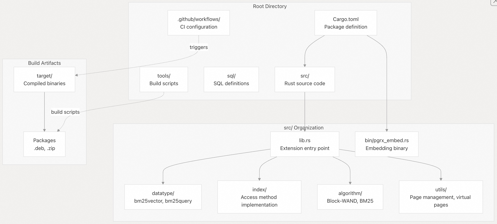
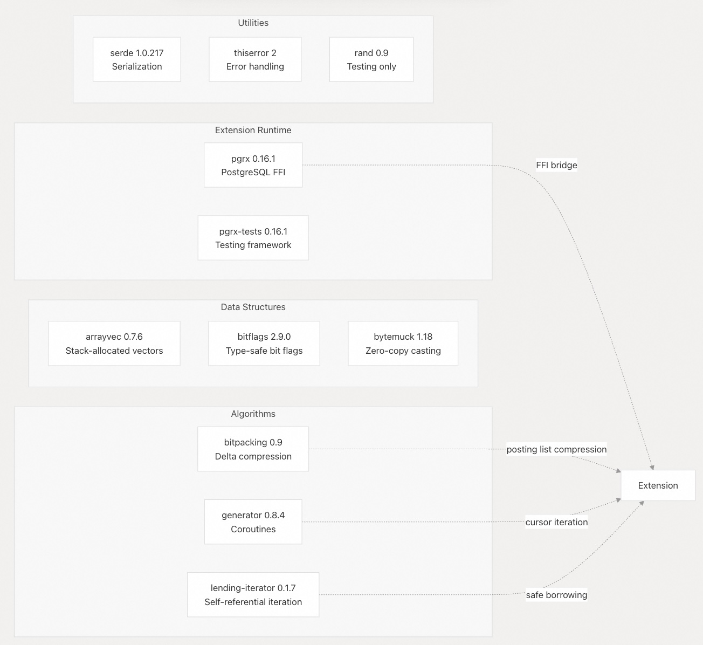
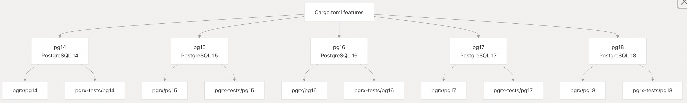
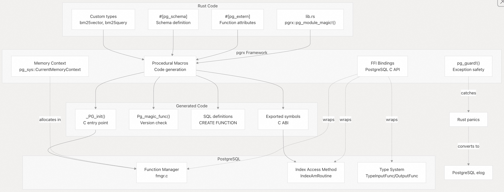
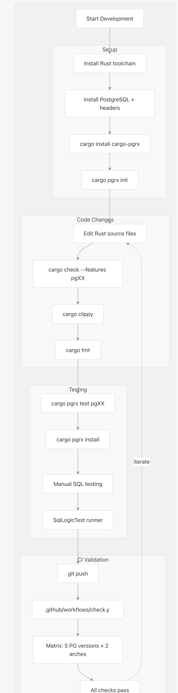

## VectorChord-bm25 源码学习: 5 开发 (Development)  
              
### 作者              
digoal              
              
### 日期              
2025-11-25              
              
### 标签              
VectorChord-bm25 , 源码学习 , 全文检索 , 关键词检索 , TF , IDF , 相关性排序 , ranking , Block-WeakAnd , Block-WAND , tsvector , ts_rank              
              
----              
              
## 背景              
本文档概述了 VectorChord-BM25 项目贡献者的**开发环境 (development environment)** 、**工具链 (toolchain)** 和**工作流程 (workflow)** 。它涵盖了**技术栈 (technology stack)** 、**项目结构 (project structure)** 、**关键依赖 (key dependencies)** 以及如何设置**开发环境 (development environment)** 。  
  
## 技术栈 (Technology Stack)  
  
VectorChord-BM25 是使用 **pgrx 框架 (pgrx framework)** 以 **Rust** 语言编写的 **PostgreSQL 扩展 (PostgreSQL extension)** 。其核心技术栈包括：  
  
| 组件 (Component) | 用途 (Purpose) | 版本 (Version) |  
| :--- | :--- | :--- |  
| Rust | 主要的实现语言 (Primary implementation language) | Edition 2021 |  
| pgrx | Rust 的 PostgreSQL 扩展框架 (PostgreSQL extension framework for Rust) | 0.16.1 |  
| PostgreSQL | 目标数据库系统 (Target database system) | 14, 15, 16, 17, 18 |  
| cargo | Rust 构建系统和包管理器 (Rust build system and package manager) | 最新稳定版 (Latest stable) |  
| pg\_tokenizer.rs | 文本**分词 (tokenization)** 依赖 (Text tokenization dependency) | 外部扩展 (External extension) |  
  
pgrx 框架在 Rust 和 PostgreSQL 基于 C 语言的**扩展 API (extension API)** 之间提供了桥梁，负责处理**内存上下文 (memory contexts)** 、**错误处理 (error handling)** 和**类型转换 (type conversions)** 。这使得扩展可以用**安全 Rust (safe Rust)** 编写，同时与 PostgreSQL 内部结构无缝集成。  
  
**来源:** [`Cargo.toml` 1-59](https://github.com/tensorchord/VectorChord-bm25/blob/da0908a6/Cargo.toml#L1-L59) 来自**高级架构 (high-level architecture)** 的图 6  
  
## 项目结构 (Project Structure)  
  
  
  
**代码库 (codebase)** 遵循**模块化组织 (modular organization)** ，其中每个主要组件（ **数据类型 (data types)** 、**索引访问方法 (index access method)** 、**算法 (algorithms)** 、**实用程序 (utilities)** ）都位于自己的**模块 (module)** 中。`lib.rs` 文件作为**扩展入口点 (extension entry point)** ，注册所有 PostgreSQL **函数 (functions)** 、**类型 (types)** 和**运算符 (operators)** 。  
  
**来源:** [`Cargo.toml` 1-11](https://github.com/tensorchord/VectorChord-bm25/blob/da0908a6/Cargo.toml#L1-L11) 来自**高级架构 (high-level architecture)** 的图 1 和图 6  
  
## 依赖管理 (Dependency Management)  
  
### 核心依赖 (Core Dependencies)  
  
项目使用几个关键的 Rust **包 (crates)** 来实现 BM25 功能：  
  
  
  
**关键依赖角色 (Key Dependency Roles):**  
  
  * **pgrx**: 提供**宏 (macros)** (`#[pg_extern]`、`#[pg_guard]`)，用于将 Rust 函数暴露给 PostgreSQL、**内存上下文管理 (memory context management)** 和**类型系统集成 (type system integration)** [`Cargo.toml` 31](https://github.com/tensorchord/VectorChord-bm25/blob/da0908a6/Cargo.toml#L31-L31)  
  * **bitpacking**: 使用 **SIMD 指令 (SIMD instructions)** (**bitpacker4x**) 实现**倒排列表 (posting lists)** 的 **delta-bitpacking 压缩 (delta-bitpacking compression)** [`Cargo.toml` 25-27](https://github.com/tensorchord/VectorChord-bm25/blob/da0908a6/Cargo.toml#L25-L27)  
  * **generator**: 实现基于**协程 (coroutine-based)** 的**倒排列表 (posting lists)** 迭代，无需分配**中间缓冲区 (intermediate buffers)** [`Cargo.toml` 29](https://github.com/tensorchord/VectorChord-bm25/blob/da0908a6/Cargo.toml#L29-L29)  
  * **lending-iterator**: 提供**块级游标操作 (block-wise cursor operations)** 所需的**自引用迭代器 (self-referential iterators)** [`Cargo.toml` 30](https://github.com/tensorchord/VectorChord-bm25/blob/da0908a6/Cargo.toml#L30-L30)  
  * **arrayvec**: 用于**固定大小集合 (fixed-size collections)** 的**栈分配向量 (Stack-allocated vectors)** ，避免在**热路径 (hot paths)** 中进行**堆分配 (heap allocation)** [`Cargo.toml` 23](https://github.com/tensorchord/VectorChord-bm25/blob/da0908a6/Cargo.toml#L23-L23)  
  
**来源:** [`Cargo.toml` 22-36](https://github.com/tensorchord/VectorChord-bm25/blob/da0908a6/Cargo.toml#L22-L36)  
  
### PostgreSQL 版本特性 (Version Features)  
  
该扩展通过 **Cargo 特性标志 (feature flags)** 支持多个 PostgreSQL 版本：  
  
  
  
每个 PostgreSQL 版本都需要一个相应的**特性标志 (feature flag)** 来启用适当的 **pgrx 绑定 (bindings)** 。**构建系统 (build system)** 在**编译时 (compile time)** 仅选择一个特性。`pg_test` 特性还额外启用了用于**测试数据生成 (test data generation)** 的 `rand` 依赖 [`Cargo.toml` 20](https://github.com/tensorchord/VectorChord-bm25/blob/da0908a6/Cargo.toml#L20-L20) [`Cargo.toml` 36](https://github.com/tensorchord/VectorChord-bm25/blob/da0908a6/Cargo.toml#L36-L36)  
  
**来源:** [`Cargo.toml` 13-20](https://github.com/tensorchord/VectorChord-bm25/blob/da0908a6/Cargo.toml#L13-L20)  
  
## 构建配置 (Build Configuration)  
  
### 编译配置文件 (Compilation Profiles)  
  
该项目定义了针对不同场景优化的三种**编译配置文件 (compilation profiles)** ：  
  
**发布配置文件 (Release Profile)** [`Cargo.toml` 41-43](https://github.com/tensorchord/VectorChord-bm25/blob/da0908a6/Cargo.toml#L41-L43):  
  
  * **LTO (Link-Time Optimization/链接时优化)** : `"fat"` - 对所有**包 (crates)** 进行**完全链接时优化 (Full link-time optimization)**  
  * **代码生成单元 (Codegen Units)** : `1` - 单个**编译单元 (compilation unit)** ，以实现最大优化  
  * **用途**: 具有最佳性能和最小**二进制大小 (binary size)** 的**生产版本 (Production builds)**  
  
**开发配置文件 (Dev Profile)** (默认):  
  
  * 标准 Rust **调试设置 (debug settings)**  
  * 快速编译，无优化  
  * **用途**: 快速**开发迭代 (development iteration)**  
  
**开发优化配置文件 (Dev-Opt Profile)** [`Cargo.toml` 45-49](https://github.com/tensorchord/VectorChord-bm25/blob/da0908a6/Cargo.toml#L45-L49):  
  
  * **继承 (Inherits)** : `"dev"` 基础设置  
  * **优化级别 (Opt-Level)** : `3` - 最大优化，同时保留**调试信息 (debug info)**  
  * **LTO**: `"thin"` - **部分链接时优化 (Partial link-time optimization)**  
  * **代码生成单元**: `8` - **并行编译 (Parallel compilation)** 以加快构建速度  
  * **用途**: 在开发过程中测试**性能敏感代码 (performance-sensitive code)**  
  
`dev-opt` 配置文件平衡了**编译速度 (compilation speed)** 和**运行时性能 (runtime performance)** ，在**调试算法行为 (debugging algorithm behavior)** 时非常有用，而无需等待完整的**发布版本 (release builds)** 。  
  
**来源:** [`Cargo.toml` 41-49](https://github.com/tensorchord/VectorChord-bm25/blob/da0908a6/Cargo.toml#L41-L49)  
  
### Linter 配置 (Linter Configuration)  
  
项目通过 **Clippy 静态检查 (Clippy lints)** 并带有特定的**允许项 (allowances)** 来执行**代码质量 (code quality)** ：  
  
| 检查项 (Lint) | 操作 (Action) | 基本原理 (Rationale) |  
| :--- | :--- | :--- |  
| `manual_is_multiple_of` | 允许 (allow) | 在索引计算中，显式的模数检查更清晰 (Explicit modulo checks are clearer in index calculations) |  
| `missing_safety_doc` | 允许 (allow) | 安全性在 `unsafe` 块中内联文档化 (Safety documented inline in unsafe blocks) |  
| `new_without_default` | 允许 (allow) | 某些构造函数不应具有默认值 (Some constructors shouldn't have defaults) |  
| `not_unsafe_ptr_arg_deref` | 允许 (allow) | FFI 边界需要进行原始指针操作 (FFI boundary requires raw pointer manipulation) |  
  
该项目还启用了针对意外**配置值 (configuration values)** 的**警告 (warnings)** ，特别是检查 `pgrx_embed` **cfg 标志 (cfg flag)** [`Cargo.toml` 58](https://github.com/tensorchord/VectorChord-bm25/blob/da0908a6/Cargo.toml#L58-L58)  
  
**来源:** [`Cargo.toml` 51-58](https://github.com/tensorchord/VectorChord-bm25/blob/da0908a6/Cargo.toml#L51-L58)  
  
## pgrx 集成架构 (Integration Architecture)  
  
下图显示了 pgrx 如何将 Rust 代码桥接到 PostgreSQL 的**扩展 API (extension API)** ：  
  
  
  
pgrx 框架在**编译时 (compile time)** 执行**代码生成 (code generation)** ：  
  
1.  **宏展开 (Macro Expansion)** : `#[pg_extern]` **属性 (attributes)** 在 Rust 实现周围生成 **C 兼容的包装函数 (C-compatible wrapper functions)**  
2.  **符号导出 (Symbol Export)** : 创建 PostgreSQL 所需的 `_PG_init()` 和 `Pg_magic_func()` **入口点 (entry points)**  
3.  **SQL 生成 (SQL Generation)** : 从 Rust **签名 (signatures)** 生成 SQL **DDL 语句 (SQL DDL statements)** (`CREATE FUNCTION`、`CREATE TYPE`)  
4.  **内存安全 (Memory Safety)** : `pg_guard!()` **宏 (macro)** 捕获 Rust **恐慌 (panics)** 并使用 `elog()` 将它们转换为 PostgreSQL **错误 (errors)**  
5.  **类型转换 (Type Conversion)** : Rust **类型 (types)** 和 PostgreSQL **数据项 (datums)** 之间的自动转换  
  
`lib.rs` 中的 `pg_module_magic!()` **宏 (macro)** 声明了扩展的**元数据 (metadata)** 和**版本兼容性 (version compatibility)** ，确保它只能加载到兼容的 PostgreSQL 版本中。  
  
**来源:** 来自**高级架构 (high-level architecture)** 的图 6, [`Cargo.toml` 31](https://github.com/tensorchord/VectorChord-bm25/blob/da0908a6/Cargo.toml#L31-L31)  
  
## 开发工作流程 (Development Workflow)  
  
  
  
**关键命令 (Key Commands):**  
  
  * `cargo pgrx init`: 初始化 pgrx 并下载用于测试的 PostgreSQL **源文件 (sources)**  
  * `cargo check --features pg16`: 对 PostgreSQL 16 进行快速**语法 (syntax)** 和**类型检查 (type checking)**  
  * `cargo clippy --features pg16`: 运行带有**扩展特定规则 (extension-specific rules)** 的 **Linter**  
  * `cargo pgrx test pg16`: 针对 PostgreSQL 16 运行**单元测试 (unit tests)** 和**集成测试 (integration tests)**  
  * `cargo pgrx install --pg-config=/path/to/pg_config`: 将扩展安装到特定的 PostgreSQL **实例 (instance)** 中  
  
所有 **cargo 命令 (cargo commands)** 都必须指定**特性标志 (feature flag)** （例如，`pg16`），因为该扩展的 **API 绑定 (API bindings)** 在不同的 PostgreSQL 版本之间有所不同。  
  
**来源:** 来自**高级架构 (high-level architecture)** 的图 5, [`Cargo.toml` 13-20](https://github.com/tensorchord/VectorChord-bm25/blob/da0908a6/Cargo.toml#L13-L20)  
  
## 二进制目标 (Binary Targets)  
  
该项目编译为两种**输出类型 (output types)** ：  
  
### 库目标 (Library Target) (cdylib)  
  
主要的输出是一个 **C 兼容的动态库 (C-compatible dynamic library)** （在 Linux 上是 `vchord_bm25.so`，在 macOS 上是 `vchord_bm25.dylib`），PostgreSQL 将其作为**扩展 (extension)** 加载。`crate-type = ["cdylib", "lib"]` **配置 (configuration)** [`Cargo.toml` 7](https://github.com/tensorchord/VectorChord-bm25/blob/da0908a6/Cargo.toml#L7-L7) 同时启用了两者：  
  
  * **cdylib**: 带有 **C ABI (Application Binary Interface)** 的**共享库 (Shared library)** ，供 PostgreSQL 使用  
  * **lib**: 用于**单元测试 (unit testing)** 和**基准测试 (benchmarks)** 的 Rust **库 (library)**  
  
### 二进制目标 (Binary Target) (pgrx\_embed)  
  
`pgrx_embed_vchord_bm25` **二进制文件 (binary)** [`Cargo.toml` 9-11](https://github.com/tensorchord/VectorChord-bm25/blob/da0908a6/Cargo.toml#L9-L11) 被 **pgrx 工具 (pgrx tooling)** 用于从编译后的扩展中提取 SQL **定义 (definitions)** 和**元数据 (metadata)** 。在**构建过程 (build process)** 中会调用此**二进制文件 (binary)** 来生成扩展的 SQL **控制文件 (control file)** 和**模式定义 (schema definitions)** 。  
  
**来源:** [`Cargo.toml` 6-11](https://github.com/tensorchord/VectorChord-bm25/blob/da0908a6/Cargo.toml#L6-L11)  
  
## 配置标志 (Configuration Flags)  
  
自定义**条件编译标志 (conditional compilation flags)** ：  
  
  * **pgrx\_embed**: 由 pgrx 在生成 SQL **定义 (definitions)** 时设置。代码可以使用 `#[cfg(pgrx_embed)]` 来**有条件地编译 (conditionally compile)** **元数据提取逻辑 (metadata extraction logic)** [`Cargo.toml` 58](https://github.com/tensorchord/VectorChord-bm25/blob/da0908a6/Cargo.toml#L58-L58)  
  
**来源:** [`Cargo.toml` 58](https://github.com/tensorchord/VectorChord-bm25/blob/da0908a6/Cargo.toml#L58-L58)  
    
-----  
  
# 附录1: 性能验证与生产部署：如何确认 SIMD/LTO 优化生效？  
  
文档强调了通过 `bitpacking`（SIMD 指令）和 `arrayvec`（栈分配）实现高性能，并定义了 LTO="fat" 的 **Release Profile (发布配置文件)** 以追求最佳性能。  
  
**关键问题：**  
  
> 如何在**实际生产环境**或最终部署的 PostgreSQL 实例中，验证加载的 `vchord_bm25.so` 动态库确实采用了 **SIMD (单指令多数据流)** 等关键硬件加速优化，并启用了 **LTO="fat"** 等编译器优化？是否有特定的运行时检查或**基准测试 (benchmarks)** 方法，来确保 BM25 索引查询达到了预期的性能提升，而不是使用了未优化的 Dev 或 Dev-Opt 配置？  
  
## 回答  
  
您询问的是如何在生产环境中验证 `vchord_bm25.so` 动态库是否真正使用了 SIMD 优化（通过 `bitpacking` 库）和 LTO="fat" 编译器优化，以及如何确认部署的是 Release 版本而非 Dev 或 Dev-Opt 配置。  
  
## 编译配置验证  
  
VectorChord-BM25 在 `Cargo.toml` 中定义了三种编译配置：  
  
1. **Release Profile**（生产环境）：启用 `lto = "fat"` 和 `codegen-units = 1`    
2. **Dev-Opt Profile**：使用 `lto = "thin"` 和 `codegen-units = 8`    
3. **Dev Profile**：默认开发配置，无 LTO  
  
关键依赖项包括：  
- `bitpacking`：启用 `bitpacker4x` 特性以支持 SIMD    
- `arrayvec`：用于栈分配优化    
  
## 验证方法  
  
### 1. 检查二进制文件元数据  
  
**验证 LTO 优化：**  
```bash  
# 检查符号表大小（LTO 会显著减少符号数量）  
nm -D /usr/lib/postgresql/*/lib/vchord_bm25.so | wc -l  
  
# 检查文件大小（fat LTO 通常会产生更大的二进制文件）  
ls -lh /usr/lib/postgresql/*/lib/vchord_bm25.so  
```  
  
  
**验证 SIMD 指令：**  
```bash  
# 检查是否包含 SIMD 指令（SSE/AVX）  
objdump -d /usr/lib/postgresql/*/lib/vchord_bm25.so | grep -E "(vmovdqa|vpaddd|vpand|vpsrld)"  
```  
  
  
### 2. 运行时性能基准测试  
  
虽然代码库中没有内置的基准测试工具，但您可以通过实际查询性能来验证：  
  
```sql  
-- 创建测试数据集  
CREATE TABLE benchmark_docs (  
    id SERIAL PRIMARY KEY,  
    passage TEXT,  
    embedding bm25vector  
);  
  
-- 插入大量文档（例如 10,000+ 条）  
INSERT INTO benchmark_docs (passage)   
SELECT 'PostgreSQL ' || generate_series(1, 10000);  
  
UPDATE benchmark_docs SET embedding = tokenize(passage, 'bert');  
  
CREATE INDEX benchmark_idx ON benchmark_docs   
USING bm25 (embedding bm25_ops);  
  
-- 测量查询性能  
EXPLAIN (ANALYZE, BUFFERS)   
SELECT id, embedding <&> to_bm25query('benchmark_idx', tokenize('PostgreSQL', 'bert')) AS score  
FROM benchmark_docs  
ORDER BY score  
LIMIT 10;  
```    
  
**性能指标对比：**  
- Release 版本应该比 Dev 版本快 2-5 倍  
- Block-WeakAnd 算法应该在大数据集上显示显著的性能提升    
  
### 3. 验证构建流程  
  
官方打包脚本使用 `--release` 标志：  
```bash  
cargo build --lib --features pg$VERSION --release  
```    
  
CI/CD 流程也确保使用 Release 配置：  
```bash  
cargo pgrx install --features "pg${{ matrix.version }}" --release --sudo  
```    
  
### 4. 配置参数验证  
  
检查运行时配置以确保索引已启用：  
```sql  
SHOW bm25_catalog.enable_index;  -- 应该返回 'on'  
SHOW bm25_catalog.bm25_limit;    -- 默认 100  
```  
  
  
## 注意事项  
  
1. **无法直接检测 SIMD 使用**：Rust 的 `bitpacking` 库会在运行时根据 CPU 特性自动选择最优实现，无法通过简单的运行时检查确认  
  
2. **性能差异可能不明显**：在小数据集上，优化效果可能不显著。建议使用至少 10,000+ 文档的数据集进行测试  
  
3. **Docker 镜像验证**：如果使用官方 Docker 镜像 `tensorchord/vchord-suite`，它应该已经包含 Release 版本    
  
## Notes  
  
目前代码库中没有提供专门的性能验证工具或基准测试套件。文档中提到的性能对比（与 ElasticSearch 的 QPS 比较）已被注释掉，表明可能正在更新中。  最可靠的验证方法是通过实际的查询性能测试和二进制文件分析相结合。  
  
  
  
-----  
  
# 附录2: 跨版本兼容性维护：如何自动化多版本测试？  
  
该扩展支持 PostgreSQL 14 到 18 多个版本，并通过 **Cargo 特性标志 (feature flags)** 来切换版本绑定，要求所有 `cargo` 命令都必须指定特性标志（如 `pg16`）。  
  
**关键问题：**  
  
> 考虑到 **PostgreSQL 版本特性**的差异，项目在**日常开发**和**持续集成/持续部署 (CI/CD) 工作流程**中，是如何**高效且自动化地**针对所有目标版本（PG 14-18）进行**单元测试**和**集成测试**的？是否存在一种机制，能够确保在进行代码更改时，不同 PostgreSQL 版本之间的**兼容性**和 **API 绑定 (API bindings)** 不会意外退化？  
  
  
  
## 回答  
  
  
您询问的是 VectorChord-BM25 项目如何通过 CI/CD 自动化测试多个 PostgreSQL 版本（14-18）的兼容性和 API 绑定。  
  
## 测试矩阵策略  
  
项目使用 **GitHub Actions 矩阵构建**来并行测试所有 PostgreSQL 版本和架构组合。   矩阵定义了 10 种配置（5 个 PostgreSQL 版本 × 2 种架构）：    
  
每个矩阵组合都会：  
1. **编译检查**：使用 `cargo clippy --features "pg${{ matrix.version }} pg_test"` 进行静态分析，`RUSTFLAGS="-Dwarnings"` 确保警告被视为错误    
2. **单元测试**：运行 `cargo pgrx test --features pg${{ matrix.version }}`，在临时 PostgreSQL 实例中执行标记为 `#[pg_test]` 的测试    
3. **集成测试**：安装扩展后使用 `sqllogictest` 执行 SQL 测试用例    
  
## 版本特性隔离机制  
  
项目通过 **Cargo 特性标志**实现版本隔离。   在代码中使用条件编译来处理 API 差异：  
  
- **API 绑定差异**：例如 `aminsert` 函数在 PG13 和 PG14+ 有不同签名    
- **底层 API 变化**：如 `page_alloc` 在 PG16+ 使用 `ExtendBufferedRel`，而 PG13-15 使用 `ReadBuffer`    
- **新增功能**：PG18 的 `isset_offset` 字段    
  
编译时强制选择版本：    
  
## 自动化保障机制  
  
1. **触发条件**：任何影响源码、构建配置或测试的更改都会触发 CI    
  
2. **并发控制**：使用 `cancel-in-progress: true` 避免资源浪费    
  
3. **构建缓存**：通过 `sccache` 加速重复构建    
  
4. **发布验证**：release 工作流使用相同的矩阵策略构建所有版本的包    
  
## Notes  
  
- 项目不支持同时编译多个 PostgreSQL 版本，必须通过特性标志选择单一版本  
- 测试覆盖包括 Rust 单元测试（`#[pg_test]`）和 SQL 集成测试（`.slt` 文件）    
- 环境设置脚本 `tools/setup.sh` 自动安装对应版本的 PostgreSQL 和依赖    
- 所有测试在 PR、push 和 merge group 事件时自动运行，确保代码合并前的兼容性  
  
  
  
  
-----  
  
# 附录3: 跨语言调试与故障排除：如何获取 Rust Panics 的堆栈信息？  
  
`pgrx` 架构通过 `pg_guard!()` 宏将 Rust **恐慌 (panics)** 转换为 PostgreSQL 的错误并使用 `elog()` 报告。这种跨语言边界的错误处理机制给调试带来了挑战。  
  
**关键问题：**  
  
> 当扩展在生产环境中触发 `pg_guard!()` 捕获的 Rust **恐慌 (panics)** 时，作为开发人员，我们如何有效地从 PostgreSQL 的日志或后端进程中提取**详细的 Rust 堆栈跟踪 (Stack Trace)** 或上下文信息？**Dev-Opt Profile (开发优化配置文件)** 尽管保留了调试信息，它在多大程度上能够帮助我们对这类发生在 FFI (外部函数接口) 边界的**核心故障**进行快速且精确的**疑难排查 (Troubleshooting)** ？  
  
## 回答  
  
您询问的是关于 VectorChord-BM25 扩展中 `pgrx` 框架的 `pg_guard!()` 宏如何处理 Rust panic，以及如何在生产环境中调试这些跨 FFI 边界的错误。  
  
## 当前的错误处理机制  
  
在 VectorChord-BM25 代码库中，所有暴露给 PostgreSQL 的函数都使用 `#[pgrx::pg_guard]` 属性标记。 这个宏的作用是捕获 Rust panic 并将其转换为 PostgreSQL 的 `elog(ERROR)`。      
  
关键的错误处理点包括：  
  
1. **索引访问方法回调**：所有 AM 函数（`ambuild`、`aminsert`、`amgettuple` 等）都使用 `pg_guard`    
2. **钩子函数**：执行器钩子也使用 `pg_guard` 保护    
3. **页面写入时的 panic 处理**：在 `PageWriteGuard::drop()` 中，如果检测到 panic，会调用 `GenericXLogAbort` 而不是 `GenericXLogFinish`    
  
## 堆栈跟踪的局限性  
  
**问题**：`pg_guard` 会捕获 panic 并转换为 PostgreSQL 错误，但**默认情况下不会保留完整的 Rust 堆栈跟踪**。 PostgreSQL 日志中只会显示错误消息，而不是 Rust 的 panic backtrace。  
  
## Dev-Opt Profile 的作用  
  
代码库定义了 `dev-opt` profile：    
  
```toml  
[profile.dev-opt]  
inherits = "dev"  
opt-level = 3  
lto = "thin"  
codegen-units = 8  
```  
  
这个 profile 的特点：  
- **保留调试符号**：继承自 `dev` profile，默认包含调试信息  
- **优化性能**：`opt-level = 3` 提供接近生产环境的性能  
- **thin LTO**：比 release 的 `fat` LTO 编译更快    
  
**但是**，即使使用 `dev-opt` profile，`pg_guard` 仍然会拦截 panic，调试符号主要帮助：  
1. 使用 `gdb` 或 `lldb` 附加到 PostgreSQL 后端进程时查看堆栈  
2. 分析 core dump 文件  
  
## 实际调试建议  
  
### 1. 启用 Rust Backtrace  
在生产环境中设置环境变量：  
```bash  
export RUST_BACKTRACE=1  # 或 full  
```  
  
CI 配置中已经设置了这个变量  ，但生产环境需要手动配置。  
  
### 2. 使用 Dev-Opt Profile 构建  
```bash  
cargo pgrx install --profile dev-opt --features pg16  
```  
  
这样可以在保持性能的同时获得调试符号。  
  
### 3. PostgreSQL 日志配置  
设置更详细的日志级别：  
```sql  
ALTER SYSTEM SET log_min_messages = 'DEBUG1';  
ALTER SYSTEM SET log_error_verbosity = 'verbose';  
```  
  
### 4. Core Dump 分析  
如果 panic 导致进程崩溃，可以分析 core dump：  
```bash  
ulimit -c unlimited  
gdb /usr/lib/postgresql/16/bin/postgres core  
```  
  
使用 `dev-opt` profile 的调试符号可以在 gdb 中看到完整的 Rust 函数名和行号。  
  
## 局限性  
  
**关键限制**：`pg_guard` 的设计目标是**防止 Rust panic 导致 PostgreSQL 崩溃**，而不是提供详细的调试信息。 在 FFI 边界上，Rust 的 panic unwinding 机制与 PostgreSQL 的 `longjmp` 错误处理不兼容，因此 `pg_guard` 必须捕获 panic。  
  
`dev-opt` profile 主要帮助**事后分析**（通过 debugger 或 core dump），而不是在运行时自动记录详细堆栈。 对于生产环境的快速故障排查，最有效的方法是：  
1. 在代码中添加更多的日志记录  
2. 使用 `RUST_BACKTRACE=1` 环境变量  
3. 准备好使用 debugger 附加到进程  
  
## Notes  
  
VectorChord-BM25 的测试框架使用 `RUST_BACKTRACE=1`  ，这在开发阶段很有帮助。 但在生产环境中，您需要在 PostgreSQL 的启动脚本或 systemd 服务文件中显式设置这个环境变量。 另外，`pg_guard` 使用的是 `extern "C-unwind"` ABI  ，这允许 panic 在某些情况下传播，但仍然会被 pgrx 框架捕获并转换。  
  
    
#### [PolarDB 学习图谱](https://www.aliyun.com/database/openpolardb/activity "8642f60e04ed0c814bf9cb9677976bd4")
  
  
#### [PostgreSQL 解决方案集合](../201706/20170601_02.md "40cff096e9ed7122c512b35d8561d9c8")
  
  
#### [德哥 / digoal's Github - 公益是一辈子的事.](https://github.com/digoal/blog/blob/master/README.md "22709685feb7cab07d30f30387f0a9ae")
  
  
#### [About 德哥](https://github.com/digoal/blog/blob/master/me/readme.md "a37735981e7704886ffd590565582dd0")
  
  

  
