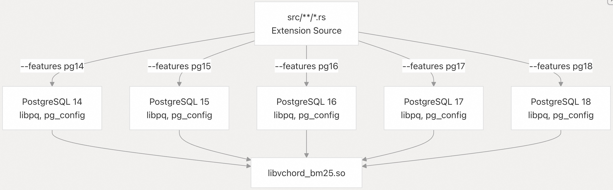
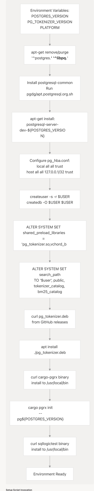
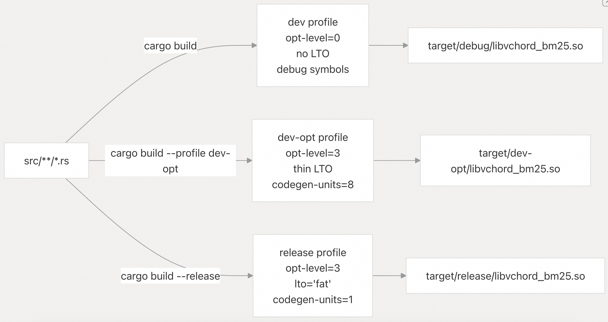
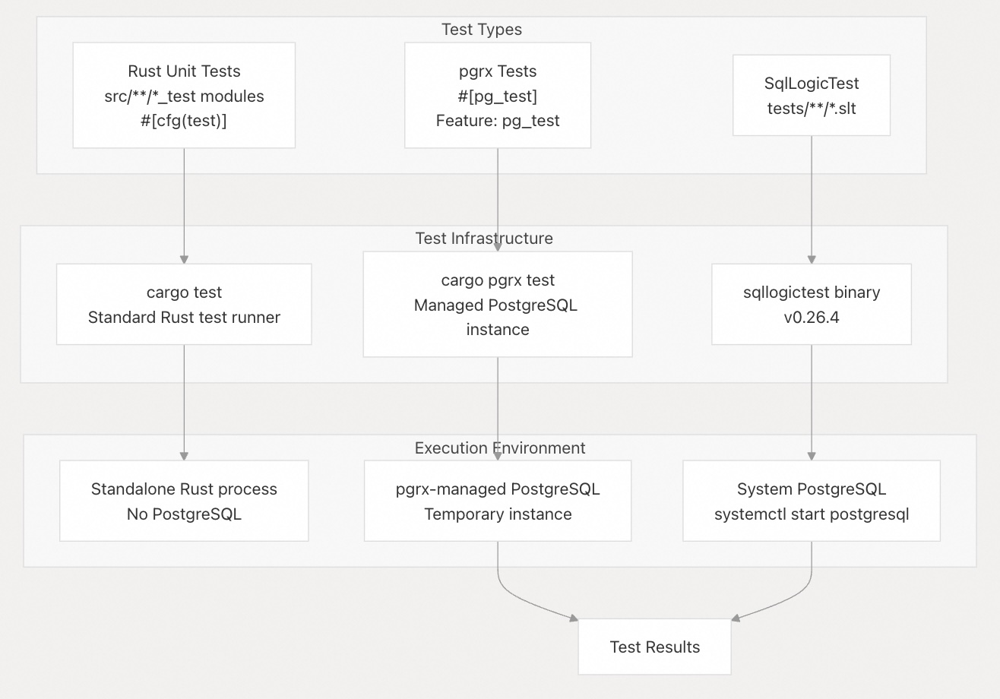
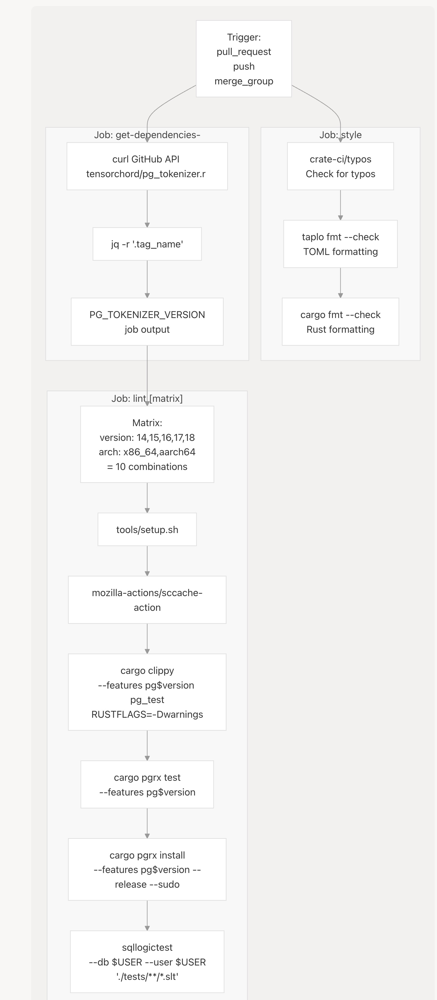

## VectorChord-bm25 源码学习: 5.1 构建与测试 (`Building & Testing`)  
                
### 作者                
digoal                
                
### 日期                
2025-11-25                
                
### 标签                
VectorChord-bm25 , 源码学习 , 全文检索 , 关键词检索 , TF , IDF , 相关性排序 , ranking , Block-WeakAnd , Block-WAND , tsvector , ts_rank                
                
----                
                
## 背景                
本章节记录了 `VectorChord-BM25` 的**开发工作流程/Development Workflow**、**构建配置/Build Configuration**、**测试框架/Testing Frameworks**和**持续集成/Continuous Integration (CI)** 管道。有关**打包/Packaging**和**分发/Distribution**，请参阅 5.2 章。  
  
## **前提条件/Prerequisites**  
  
`VectorChord-BM25` 需要以下组件：  
  
| 组件/Component | 版本/详情 (Version/Details) | 用途/Purpose |  
|---|---|---|  
| **Rust 工具链/Rust Toolchain** | 最新**稳定版/Latest Stable** | **扩展/Extension**的**源语言/Source Language** |  
| **PostgreSQL** | 14, 15, 16, 17, 18 | **目标数据库系统/Target Database System** |  
| `postgresql-server-dev-*` | 匹配的 PG 版本 | **扩展编译/Extension Compilation**所需的 C **头文件/Header Files** |  
| `pg_tokenizer.rs` | 最新**发布版/Latest Release** | **文本分词/Text Tokenization**的**依赖项/Dependency** |  
| `cargo-pgrx` | v0.16.1 | 用于构建 **PostgreSQL 扩展/PostgreSQL Extensions** 的 `pgrx` **框架/Framework** |  
  
### PostgreSQL 版本**功能标志/Feature Flags**  
  
**代码库/Codebase**使用 **Cargo 功能标志/Cargo Feature Flags**来针对不同的 PostgreSQL 版本进行**编译/Compile**。每个版本都是**互斥/Mutually Exclusive**的：  
  
**图表: 功能标志到 PostgreSQL 版本的映射**  
  
  
  
**来源/Sources**:  
  
  * [`Cargo.toml` 13-19](https://github.com/tensorchord/VectorChord-bm25/blob/da0908a6/Cargo.toml#L13-L19)  
  * [`.github/workflows/check.yml` 78](https://github.com/tensorchord/VectorChord-bm25/blob/da0908a6/.github/workflows/check.yml#L78-L78)  
  
## **开发环境/Development Environment**设置  
  
[`tools/setup.sh` 1-33](https://github.com/tensorchord/VectorChord-bm25/blob/da0908a6/tools/setup.sh#L1-L33) **脚本/Script**自动执行**开发/Development**和 **CI** 的**环境配置/Environment Configuration**。它执行**系统包管理/System Package Management**、PostgreSQL **安装/Installation**、**依赖项解析/Dependency Resolution** 和 `pgrx` **初始化/Initialization**。  
  
**图表: 设置脚本执行流程**  
  
  
  
### 设置脚本**调用/Invocation**  
  
```bash  
export POSTGRES_VERSION=14  
export PG_TOKENIZER_VERSION=v0.1.0  # Fetched dynamically in CI  
export PLATFORM=amd64  # or arm64  
  
./tools/setup.sh  
```  
  
该脚本执行以下操作：  
  
1.  **清理/Cleanup**：使用 `apt-get remove/purge` 删除现有的 PostgreSQL 安装  
2.  **安装/Installation**：从 PGDG **存储库/Repository** 安装 PostgreSQL **服务器/Server**和**开发包/Development Packages**  
3.  **配置/Configuration**：设置 `pg_hba.conf` 以**信任认证/Trust Authentication**，创建**用户/User**和**数据库/Database**  
4.  **扩展/Extensions**：配置 `shared_preload_libraries` 以加载 `pg_tokenizer.so` 和 `vchord_bm25.so`  
5.  **搜索路径/Search Path**：设置默认的 `search_path`，使其包含 `tokenizer_catalog` 和 `bm25_catalog` **模式/Schemas**  
6.  **依赖项/Dependencies**：从 GitHub **发布/Releases**下载并安装 `pg_tokenizer`  
7.  **工具/Tools**：安装 `cargo-pgrx` v0.16.1 和 `sqllogictest` v0.26.4 **二进制文件/Binaries**  
  
**来源/Sources**:  
  
  * [`tools/setup.sh` 1-33](https://github.com/tensorchord/VectorChord-bm25/blob/da0908a6/tools/setup.sh#L1-L33)  
  * [`.github/workflows/check.yml` 90-91](https://github.com/tensorchord/VectorChord-bm25/blob/da0908a6/.github/workflows/check.yml#L90-L91)  
  
## **构建系统/Build System**  
  
该**扩展/Extension**使用 `pgrx` **框架/Framework**，并以 **Cargo** 作为**构建系统/Build System**。[`Cargo.toml` 1-59](https://github.com/tensorchord/VectorChord-bm25/blob/da0908a6/Cargo.toml#L1-L59) 定义了**包元数据/Package Metadata**、**依赖项/Dependencies**和**构建配置文件/Build Profiles**。  
  
  
### **Crate 结构/Crate Structure**  
  
| 组件/Component | 类型/Type | 用途/Purpose |  
|---|---|---|  
| `vchord_bm25` | `cdylib` (**动态库/Dynamic Library**) | 由 PostgreSQL 加载的**共享库/Shared Library** |  
| `vchord_bm25` | `lib` (**库/Library**) | 用于**测试/Testing**的 **Rust 库/Rust Library** |  
| `pgrx_embed_vchord_bm25` | `bin` (**二进制文件/Binary**) | **嵌入式实用程序二进制文件/Embedding Utility Binary** |  
  
**来源/Sources**:  
  
  * [`Cargo.toml` 6-11](https://github.com/tensorchord/VectorChord-bm25/blob/da0908a6/Cargo.toml#L6-L11)  
  
### **构建配置文件/Build Profiles**  
  
**图表: 构建配置文件的配置**  
  
  
  
| 配置文件/Profile | `opt-level` (**优化级别**) | **LTO** (**链接时优化**) | `codegen-units` (**代码生成单元**) | 用例/Use Case |  
|---|---|---|---|---|  
| `dev` (**开发**) | 0 | `none` (**无**) | `default` (**默认**) | **快速编译/Fast Compilation**，**调试/Debugging** |  
| `dev-opt` (**开发优化**) | 3 | `thin` (**精简**) | 8 | **迭代速度/Iteration Speed**与**性能/Performance**的平衡 |  
| `release` (**发布**) | 3 | `fat` (**完整**) | 1 | **生产部署/Production Deployment** |  
  
**来源/Sources**:  
  
  * [`Cargo.toml` 41-49](https://github.com/tensorchord/VectorChord-bm25/blob/da0908a6/Cargo.toml#L41-L49)  
  
### **依赖项配置/Dependency Configuration**  
  
主要的**依赖项/Dependencies**包括：  
  
  * `pgrx` v0.16.1: PostgreSQL **扩展框架/Extension Framework**  
  * `bitpacking` v0.9: 用于**倒排列表/Posting Lists**的 **Delta-bitpack 压缩/Compression**  
  * `arrayvec` v0.7.6: **堆栈/Stack**上的**固定大小数组/Fixed-size Arrays**  
  * `bytemuck` v1.18: 用于**二进制数据/Binary Data**的**安全类型转换/Safe Type Casting**  
  * `generator` v0.8.4: 用于**迭代器/Iterators**的**协程支持/Coroutine Support**  
  
**来源/Sources**:  
  
  * [`Cargo.toml` 22-33](https://github.com/tensorchord/VectorChord-bm25/blob/da0908a6/Cargo.toml#L22-L33)  
  
### **构建命令/Building Commands**  
  
```bash  
# Debug build for PostgreSQL 14  
cargo pgrx build --features pg14  
  
# Optimized development build  
cargo build --profile dev-opt --features pg15  
  
# Release build  
cargo pgrx build --release --features pg16  
  
# Install to PostgreSQL extension directory  
cargo pgrx install --features pg14 --release --sudo  
```  
  
`cargo pgrx install` **命令/Command**：  
  
1.  使用指定的**功能/Features**和**配置文件/Profile**编译**扩展/Extension**  
2.  从 `pgrx` **宏/Macros**生成 **SQL 包装文件/SQL Wrapper Files**  
3.  将 `libvchord_bm25.so` 安装到 `$pg_config --pkglibdir`  
4.  将 `vchord_bm25.control` 和 `vchord_bm25--*.sql` 安装到 `$pg_config --sharedir/extension`  
  
**来源/Sources**:  
  
  * [`.github/workflows/check.yml` 109](https://github.com/tensorchord/VectorChord-bm25/blob/da0908a6/.github/workflows/check.yml#L109-L109)  
  
## **测试框架/Testing Framework**  
  
`VectorChord-BM25` 采用两种**测试策略/Testing Strategies**：`pgrx` **集成/Integrated**的 **Rust 测试/Rust Tests** 和用于 **SQL 接口验证/SQL Interface Validation** 的 **SqlLogicTest**。  
  
**图表: 测试执行架构**  
  
  
  
### pgrx **测试框架/Test Framework**  
  
`cargo pgrx test` **命令/Command**执行带有 `#[pg_test]` **属性/Attributes**标记的**测试/Tests**。这些**测试/Tests**在加载了**扩展/Extension**的**托管/Managed** PostgreSQL **实例/Instance**中运行。  
  
**测试执行工作流程/Test Execution Workflow:**  
  
1.  `pgrx` 启动一个**临时/Temporary** PostgreSQL **实例/Instance**  
2.  将**扩展/Extension**编译并安装到**临时实例/Temporary Instance**  
3.  执行带有 `#[pg_test]` 标记的**测试函数/Test Functions**  
4.  捕获 PostgreSQL **日志/Logs**和**测试输出/Test Output**  
5.  关闭**临时实例/Temporary Instance**  
  
```bash  
# Run pgrx tests for PostgreSQL 14  
cargo pgrx test --features pg14  
  
# Run tests in release mode  
cargo pgrx test --features pg15 --release  
```  
  
  
`pg_test` **功能/Feature**启用 `rand` **依赖项/Dependency**以生成**测试数据/Test Data** [`Cargo.toml` 20](https://github.com/tensorchord/VectorChord-bm25/blob/da0908a6/Cargo.toml#L20-L20)  
  
**来源/Sources**:  
  
  * [`Cargo.toml` 20](https://github.20/tensorchord/VectorChord-bm25/blob/da0908a6/Cargo.toml#L20-L20)  
  * [`Cargo.toml` 35-36](https://github.com/tensorchord/VectorChord-bm25/blob/da0908a6/Cargo.toml#L35-L36)  
  * [`.github/workflows/check.yml` 96-107](https://github.com/tensorchord/VectorChord-bm25/blob/da0908a6/.github/workflows/check.yml#L96-L107)  
  
### SqlLogicTest **集成/Integration**  
  
**SqlLogicTest (SLT)** 通过将**查询结果/Query Results**与**预期输出/Expected Outputs**进行比较来**验证/Validates** **SQL 语义/SQL Semantics**。**测试文件/Test Files**使用 `.slt` **扩展名/Extension**，包含**语句/Statements**和**查询/Queries**。  
  
**SLT 文件结构/File Structure:**  
  
```  
statement ok          -- 期望语句成功 (Expect statement to succeed)  
CREATE EXTENSION ...  
  
query I              -- 查询返回 Integer 列 (Query returning Integer column)  
SELECT count(*) FROM table  
  
query ITT            -- 查询返回 Integer, Text, Text  
SELECT id, name, value FROM data  
----  
1  name1  value1     -- 预期结果 (Expected results)  
2  name2  value2  
```  
  
**执行 SqlLogicTests/Executing SqlLogicTests:**  
  
```bash  
# Start PostgreSQL  
sudo systemctl start postgresql  
  
# Install dependencies  
psql -c 'CREATE EXTENSION IF NOT EXISTS pg_tokenizer CASCADE;'  
psql -c 'CREATE EXTENSION IF NOT EXISTS vchord_bm25 CASCADE;'  
  
# Run all .slt files  
sqllogictest --db $USER --user $USER './tests/**/*.slt'  
  
# Run specific test file  
sqllogictest --db $USER --user $USER './tests/sqllogictest/index.slt'  
```  
  
**CI 管道/CI Pipeline**使用 **glob 模式/Glob Patterns**来执行 `tests/` **目录树/Directory Tree**中的所有 `.slt` 文件。  
  
**来源/Sources**:  
  
  * [`.github/workflows/check.yml` 110-115](https://github.com/tensorchord/VectorChord-bm25/blob/da0908a6/.github/workflows/check.yml#L110-L115)  
  * [`tools/setup.sh` 32](https://github.com/tensorchord/VectorChord-bm25/blob/da0908a6/tools/setup.sh#L32-L32)  
  
### **测试组织/Test Organization**  
  
| **目录/Directory** | **内容/Contents** | **测试类型/Test Type** |  
|---|---|---|  
| `src/**/` | 带有 `#[cfg(test)]` 和 `#[pg_test]` 的**单元测试/Unit Tests** | **Rust 单元/Unit**，`pgrx` **集成/Integration** |  
| `tests/sqllogictest/` | 用于 **SQL 接口测试/SQL Interface Testing** 的 `.slt` 文件 | **SQL 语义/SQL Semantics** |  
| `tests/init.sql` | **扩展重新加载脚本/Extension Reload Script** | **测试设置/Test Setup** |  
  
### CI 中的**权限处理/Permission Handling**  
  
**CI 工作流程/CI Workflow**临时修改**权限/Permissions**以允许 `pgrx` **写入/Write** PostgreSQL **目录/Directories**：  
  
```bash  
# Save ACLs  
tmp_file=$(mktemp)  
getfacl -R /usr/share/postgresql > $tmp_file  
getfacl -R /usr/lib/postgresql >> $tmp_file  
  
# Grant write permissions  
sudo chmod -R 777 /usr/share/postgresql  
sudo chmod -R 777 /usr/lib/postgresql  
  
# Run tests  
cargo pgrx test --features pg14  
  
# Restore ACLs  
sudo setfacl --restore=$tmp_file  
```  
  
这种**变通方法/Workaround**允许 `pgrx` 在**测试执行/Test Execution**期间安装**扩展/Extension**，而无需 **root 权限/Root Privileges**。  
  
**来源/Sources**:  
  
  * [`.github/workflows/check.yml` 98-107](https://github.com/tensorchord/VectorChord-bm25/blob/da0908a6/.github/workflows/check.yml#L98-L107)  
  
## **持续集成管道/Continuous Integration Pipeline**  
  
[`/.github/workflows/check.yml` 1-116](https://github.com/tensorchord/VectorChord-bm25/blob/da0908a6/.github/workflows/check.yml#L1-L116) **工作流程/Workflow**在**拉取请求/Pull Requests**、**推送/Pushes**和**合并组/Merge Groups**上执行。它**验证/Validates** **代码质量/Code Quality**，跨多个 PostgreSQL **版本/Versions**和**架构/Architectures**进行**构建/Builds**，并运行**综合测试/Comprehensive Tests**。  
  
**图表: CI 工作流程** **作业依赖项/Job Dependencies**  
  
  
  
### **作业分解/Job Breakdown**  
  
#### 1\. **风格作业/Style Job**  
  
在 `ubuntu-latest` 上运行，包含三项**检查/Checks**：  
  
  * `Typos` (**拼写错误检查**)：使用 `crate-ci/typos@master` **检测/Detect** **拼写错误/Spelling Errors**  
  * `Taplo`：根据 `.taplo.toml` **配置/Configuration** **验证/Validates** **TOML 格式/Formatting**  
  * `Rustfmt`：使用 `cargo fmt --check` **检查/Checks** **Rust 代码格式/Code Formatting**  
  
**来源/Sources**:  
  
  * [`.github/workflows/check.yml` 43-56](https://github.com/tensorchord/VectorChord-bm25/blob/da0908a6/.github/workflows/check.yml#L43-L56)  
  
#### 2\. **依赖项版本作业/Dependency Version Job**  
  
从 **GitHub API** **动态获取/Dynamically Fetches** 最新 `pg_tokenizer.rs` **发布版本/Release Version**：  
  
```bash  
PG_TOKENIZER_VERSION=$(curl -sSL https://api.github.com/repos/tensorchord/pg_tokenizer.rs/releases/latest | jq -r '.tag_name')  
```  
  
该版本通过 **GitHub Actions** **输出/Outputs**传递给**下游作业/Downstream Jobs**。  
  
**来源/Sources**:  
  
  * [`.github/workflows/check.yml` 58-72](https://github.com/tensorchord/VectorChord-bm25/blob/da0908a6/.github/workflows/check.yml#L58-L72)  
  
#### 3\. **Lint/静态代码分析 作业** (**矩阵构建/Matrix Build**)  
  
跨 10 种配置的**矩阵/Matrix**执行 (**5 个 PostgreSQL 版本** × **2 个架构/Architectures**)：  
  
| **矩阵维度/Matrix Dimension** | **值/Values** |  
|---|---|  
| `version` (**版本**) | 14, 15, 16, 17, 18 |  
| `arch` (**架构**) | `x86_64`, `aarch64` |  
| `runner` (**运行器**) | `ubuntu-24.04` (`x86_64`)，`ubuntu-24.04-arm` (`aarch64`) |  
  
**每个配置的步骤/Per-Configuration Steps:**  
  
1.  **环境设置/Environment Setup** (`tools/setup.sh`)：安装 PostgreSQL、`pg_tokenizer`、`cargo-pgrx`  
2.  `Sccache`：使用 `mozilla-actions/sccache-action` **启用/Enables** **构建缓存/Build Caching**  
3.  `Clippy` (**静态分析工具**)：使用 `RUSTFLAGS="-Dwarnings"` 进行 **Lint/静态代码分析**，将**警告/Warnings**视为**错误/Errors**  
4.  `pgrx Test`：使用**临时/Temporary** PostgreSQL **实例/Instance**运行 `cargo pgrx test`  
5.  **安装/Install**：使用 `--sudo` 将**扩展/Extension**安装到**系统/System** PostgreSQL  
6.  `SqlLogicTest`：使用 `sqllogictest` **二进制文件/Binary** **验证/Validates** **SQL 接口/SQL Interface**  
  
**来源/Sources**:  
  
  * [`.github/workflows/check.yml` 74-116](https://github.com/tensorchord/VectorChord-bm25/blob/da0908a6/.github/workflows/check.yml#L74-L116)  
  
### **环境变量/Environment Variables**  
  
**工作流程/Workflow**为所有**作业/Jobs**设置**全局环境变量/Global Environment Variables**：  
  
```  
env:  
  CARGO_TERM_COLOR: always          # Colored cargo output  
  RUST_BACKTRACE: 1                 # Enable backtraces on panic  
  SCCACHE_GHA_ENABLED: true         # Enable sccache in GitHub Actions  
  RUSTC_WRAPPER: sccache            # Use sccache for compilation caching  
  RUSTFLAGS: "-Dwarnings"           # Treat warnings as errors  
```  
  
**来源/Sources**:  
  
  * [`.github/workflows/check.yml` 35-40](https://github.com/tensorchord/VectorChord-bm25/blob/da0908a6/.github/workflows/check.yml#L35-L40)  
  
### **并发控制/Concurrency Control**  
  
**工作流程/Workflow**使用**并发组/Concurrency Groups**在推送新 **Commit/提交**时**取消/Cancel** **正在进行的运行/In-progress Runs**：  
  
```  
concurrency:  
  group: ${{ github.ref }}-${{ github.workflow }}  
  cancel-in-progress: true  
```  
  
这可以防止在**过时代码/Outdated Code**上**浪费/Wasted** **CI 资源/CI Resources**。  
  
**来源/Sources**:  
  
  * [`.github/workflows/check.yml` 31-33](https://github.com/tensorchord/VectorChord-bm25/blob/da0908a6/.github/workflows/check.yml#L31-L33)  
  
### **基于路径的触发/Path-Based Triggering**  
  
**工作流程/Workflow**仅在**相关文件/Relevant Files**更改时运行：  
  
  * **源代码/Source Code**：`src/**`，`tests/**`  
  * **构建配置/Build Configuration**：`Cargo.toml`，`Cargo.lock`，`.cargo`  
  * **工具/Tools**：`tools/**`，**配置文件/Configuration Files**  
  * **控制文件/Control Files**：`*.control`  
  
**来源/Sources**:  
  
  * [`.github/workflows/check.yml` 3-27](https://github.com/tensorchord/VectorChord-bm25/blob/da0908a6/.github/workflows/check.yml#L3-L27)  
  
## **示例测试用例/Example Test Case**  
  
以下是 **sqllogictest 格式/Format**中**测试/Tests**的组织方式示例：  
  
```  
statement ok  
CREATE TABLE documents (  
    id SERIAL PRIMARY KEY,  
    passage TEXT,  
    embedding bm25vector  
);  
  
statement ok  
INSERT INTO documents (passage) VALUES   
('PostgreSQL is a powerful, open-source object-relational database system.');  
  
statement ok  
SELECT create_tokenizer('tokenizer_bert', $$  
model = "bert_base_uncased"  
$$);  
  
statement ok  
UPDATE documents SET embedding = tokenize(passage, 'tokenizer_bert');  
  
statement ok  
CREATE INDEX documents_embedding_bm25 ON documents USING bm25 (embedding bm25_ops);  
  
statement ok  
SELECT id, passage, embedding <&> to_bm25query('documents_embedding_bm25',   
                           tokenize('Post', 'tokenizer_bert')) AS rank  
FROM documents  
ORDER BY rank  
LIMIT 10;  
```  
  
该**测试/Test**执行以下操作：  
  
1.  创建一个包含 **text 列/Column**和 `bm25vector` **列/Column**的**表/Table**  
2.  **插入/Inserts** **测试数据/Test Data**  
3.  创建一个**分词器/Tokenizer**  
4.  使用**分词文本/Tokenized Text** **更新/Updates** **表/Table**  
5.  创建一个 **BM25 索引/Index**  
6.  使用 **BM25 运算符/Operator**执行**搜索查询/Search Query**  
  
**来源/Sources**:  
  
  * [`tests/sqllogictest/index.slt` 1-36](https://github.com/tensorchord/VectorChord-bm25/blob/da0908a6/tests/sqllogictest/index.slt#L1-L36)  
  * [`tests/sqllogictest/temp.slt` 1-39](https://github.com/tensorchord/VectorChord-bm25/blob/da0908a6/tests/sqllogictest/temp.slt#L1-L39)  
  
## **调试/Debugging**和**开发技巧/Development Tips**  
  
在**开发/Developing**和**调试/Debugging** **扩展/Extension**时，请考虑这些有用的**技巧/Techniques**：  
  
1.  使用 `dev-opt` **配置文件/Profile**以在保持良好**性能/Performance**的同时加快**迭代/Iteration**速度  
2.  在每次**测试运行/Test Run**前**重置/Reset** **数据库状态/Database State**，以便在**干净的环境/Clean Environment**中运行**测试/Tests**  
3.  修改**扩展/Extension**时，请务必在**测试/Testing**前重新安装  
4.  使用 PostgreSQL 的**日志输出/Log Output**来**调试问题/Debug Issues**（将 `log_min_messages` 设置为 `DEBUG`）  
5.  **测试框架/Test Framework**依赖于 `pg_tokenizer.rs`，因此请确保已正确**安装/Installed**  
  
从**源代码/Source**构建 `VectorChord-BM25` 可以让您：  
  
  * 为**特定环境/Specific Environments** **自定义/Customize** **扩展/Extension**  
  * **开发新功能/Develop New Features**和**修复错误/Fix Bugs**  
  * 在不同的 PostgreSQL **版本/Versions**中**测试更改/Test Changes**  
  
**来源/Sources**:  
  
  * [`Cargo.toml` 45-49](https://github.com/tensorchord/VectorChord-bm25/blob/da0908a6/Cargo.toml#L45-L49)  
  * [`tests/README.md` 10-15](https://github.com/tensorchord/VectorChord-bm25/blob/da0908a6/tests/README.md#L10-L15)  
  
-----  
  
# 附录1: 生产环境的兼容性和优化策略是什么？  
  
考虑到 `VectorChord-BM25` 使用 **Cargo 功能标志/Feature Flags** 来支持 PostgreSQL v14 到 v18 的**矩阵构建/Matrix Build**，同时存在 **`dev-opt`** 和 **`release` 构建配置文件/Build Profiles**。  
  
* **问题核心 (痛点: 版本管理与性能优化):** 对于**生产环境部署/Production Deployment**，除了使用优化到极致的 **`release`** 配置文件外，**用户/User**应如何有效管理和验证针对**特定 PostgreSQL 版本/Specific PostgreSQL Version**的兼容性（例如，在升级 PG 版本时）？是否有针对不同 PG 版本的**性能/Performance**差异基准？  
  
## 回答  
  
您的问题涉及 VectorChord-BM25 在生产环境部署时，如何管理和验证针对特定 PostgreSQL 版本（v14-v18）的兼容性，以及是否存在不同 PG 版本间的性能基准。  
  
## 版本兼容性管理  
  
VectorChord-BM25 通过 Cargo feature flags 支持 PostgreSQL 14-18 的矩阵构建  。对于生产环境部署，您应该：  
  
### 1. 构建特定版本  
  
使用 `release` 配置文件构建特定 PostgreSQL 版本：    
  
```bash  
cargo pgrx build --release --features pg16  # 针对 PostgreSQL 16  
cargo pgrx install --features pg16 --release --sudo  
```  
  
### 2. CI/CD 验证流程  
  
项目的 CI 流程提供了完整的版本验证矩阵  。每个 PostgreSQL 版本都会执行：  
  
- **Clippy 静态检查**：确保代码质量    
- **pgrx 集成测试**：在临时 PostgreSQL 实例中运行测试    
- **SqlLogicTest**：验证 SQL 接口语义    
  
### 3. 版本升级验证策略  
  
在升级 PostgreSQL 版本时，您应该：  
  
1. **使用 setup.sh 脚本**配置新版本环境    
2. **运行完整测试套件**：  
   ```bash  
   cargo pgrx test --features pg17  # 新版本  
   sqllogictest --db $USER --user $USER './tests/**/*.slt'  
   ```  
3. **验证版本特定的 API 差异**：代码中存在条件编译来处理不同 PostgreSQL 版本的 API 差异  和    
  
### 4. 发布包验证  
  
项目提供针对每个 PostgreSQL 版本的预构建包  ，包括 `.deb` 和 `.zip` 格式  。  
  
## 性能基准  
  
**目前代码库中没有针对不同 PostgreSQL 版本的性能差异基准。**  
  
项目仅提供了：  
- **构建配置文件性能差异**：`dev`（opt-level=0）、`dev-opt`（opt-level=3, thin LTO）、`release`（opt-level=3, fat LTO）    
- **GUC 参数调优**：如 `bm25_catalog.bm25_limit`、`bm25_catalog.segment_growing_max_page_size` 等    
  
## Notes  
  
不同 PostgreSQL 版本间的性能差异主要来自 PostgreSQL 内核本身的优化（如缓冲区管理、查询优化器改进），而非扩展代码。VectorChord-BM25 通过条件编译适配不同版本的 API，但核心算法（Block-WAND）在所有版本中保持一致。  
  
如果您需要建立性能基准，建议：  
1. 使用相同数据集在不同 PostgreSQL 版本上运行 SqlLogicTest  
2. 监控查询响应时间和资源使用  
3. 关注 PostgreSQL 版本特定的配置参数（如 `shared_buffers`、`work_mem`）对扩展性能的影响  
  
  
  
-----  
  
# 附录2: 核心外部依赖项的维护和升级工作流程如何？  
  
文档强调 `VectorChord-BM25` 深度依赖于外部组件 **`pg_tokenizer.rs`** 进行**文本分词/Text Tokenization**，并且 **CI 管道/CI Pipeline** 会**动态获取/Dynamically Fetches**其最新版本。  
  
* **问题核心 (痛点: 依赖项更新与维护开销):** 作为日常**维护/Maintenance**人员，如果我需要手动**安装/Installation**或**更新/Update**这个**依赖项/Dependency**，确保它与当前扩展版本的 ABI/API 完全匹配的**日常使用/Usage**动作或检查步骤有哪些？如果 **`pg_tokenizer.rs`** 发生重大更新，**升级/Upgrading** `VectorChord-BM25` 的**推荐工作流程/Recommended Workflow**是什么？  
  
## 回答  
  
  
您询问的是作为维护人员如何手动安装/更新 `pg_tokenizer.rs` 依赖项，以及当该依赖发生重大更新时如何升级 `VectorChord-BM25` 的推荐工作流程。  
  
## 手动安装/更新 `pg_tokenizer.rs` 的步骤  
  
### 1. 获取最新版本号  
  
CI 管道通过 GitHub API 动态获取 `pg_tokenizer.rs` 的最新版本  ：  
  
```bash  
PG_TOKENIZER_VERSION=$(curl -sSL https://api.github.com/repos/tensorchord/pg_tokenizer.rs/releases/latest | jq -r '.tag_name')  
```  
  
### 2. 下载并安装依赖包  
  
安装脚本会根据 PostgreSQL 版本和平台架构下载对应的 `.deb` 包  ：  
  
```bash  
curl -fsSL https://github.com/tensorchord/pg_tokenizer.rs/releases/download/${PG_TOKENIZER_VERSION}/postgresql-${POSTGRES_VERSION}-pg-tokenizer_${PG_TOKENIZER_VERSION}-1_${PLATFORM}.deb -o pg_tokenizer.deb  
sudo apt install -y ./pg_tokenizer.deb  
```  
  
### 3. 配置 PostgreSQL  
  
需要将 `pg_tokenizer.so` 添加到 `shared_preload_libraries` 并设置 `search_path`  ：  
  
```bash  
sudo -iu postgres psql -c 'ALTER SYSTEM SET shared_preload_libraries = "pg_tokenizer.so","vchord_bm25.so"'  
sudo -iu postgres psql -c 'ALTER SYSTEM SET search_path TO "\$user", public, tokenizer_catalog, bm25_catalog;'  
```  
  
### 4. 重启 PostgreSQL  
  
配置更改后需要重启 PostgreSQL 服务使其生效  。  
  
### 5. 验证安装  
  
连接数据库后创建扩展以验证安装  ：  
  
```sql  
CREATE EXTENSION IF NOT EXISTS pg_tokenizer CASCADE;  
CREATE EXTENSION IF NOT EXISTS vchord_bm25 CASCADE;  
```  
  
## 升级工作流程  
  
### 当 `pg_tokenizer.rs` 发生重大更新时  
  
1. **检查兼容性**：查看 `pg_tokenizer.rs` 的 release notes，确认 API/ABI 变更  
  
2. **更新依赖版本**：  
   - CI 会自动获取最新版本    
   - 手动安装时，更新 `PG_TOKENIZER_VERSION` 环境变量    
  
3. **重新构建和测试**：  
   - 运行完整的测试套件  ：  
     ```bash  
     cargo pgrx test --features pg${POSTGRES_VERSION}  
     ```  
   - 执行 SqlLogicTest  ：  
     ```bash  
     sqllogictest --db $USER --user $USER './tests/**/*.slt'  
     ```  
  
4. **重新安装扩展**  ：  
   ```bash  
   cargo pgrx install --features "pg${POSTGRES_VERSION}" --release --sudo  
   ```  
  
### 推荐的完整工作流程  
  
对于生产环境升级，建议按以下顺序操作：  
  
1. **在测试环境验证**：使用 `tools/setup.sh` 脚本在测试环境完整部署    
2. **运行完整测试**：确保所有测试通过    
3. **备份生产数据**：在升级前备份 PostgreSQL 数据  
4. **执行升级**：按照上述安装步骤更新依赖  
5. **验证功能**：测试 tokenization 和 BM25 查询功能    
  
## Notes  
  
- CI 管道在每次构建时都会动态获取 `pg_tokenizer.rs` 的最新版本  ，这确保了持续集成环境始终使用最新的依赖版本  
- Release 工作流同样会获取最新的依赖版本用于打包    
- 扩展使用 pgrx v0.16.1 框架  ，需要确保 `cargo-pgrx` 工具版本匹配    
- 支持 PostgreSQL 14-18 多个版本  ，每个版本需要单独测试兼容性  
  
  
  
  
-----  
  
# 附录3: 实时调试的性能开销和精细化控制如何平衡？  
  
文档在**调试技巧/Debugging Tips**中建议使用 **`dev-opt` 配置文件/Profile**来平衡性能和迭代速度，并建议设置 `log_min_messages` 为 `DEBUG` 以查看更多日志。  
  
* **问题核心 (痛点: 实时故障排除与性能损耗):** 在实际**生产环境/Production Environment**中，如果遇到**偶发性/Intermittent**或**性能敏感/Performance-Sensitive**的问题，**如何以最小的开销/Minimal Overhead**利用 **`dev-opt`** 构建和 **`DEBUG`** 日志进行**实时调试/Live Debugging**？例如，`dev-opt` 构建和 `DEBUG` 日志（特别是涉及到 **Posting Lists** 操作的日志）的**实际性能/Performance**损耗大致是多少，以及是否有更**精细化/Granular**的**日志输出/Log Output**控制（例如，仅针对特定模块开启 `DEBUG` 级别）？  
  
## 回答  
  
您的问题涉及在生产环境中使用 `dev-opt` 构建配置和 `DEBUG` 日志级别进行实时调试时的性能开销，特别是关于 Posting Lists 操作的日志输出控制。  
  
## 关于 `dev-opt` 构建配置  
  
VectorChord-BM25 定义了 `dev-opt` profile 来平衡性能和编译速度  。该配置使用 `opt-level = 3`（完全优化）、`lto = "thin"`（轻量级链接时优化）和 `codegen-units = 8`（并行代码生成）。  
  
**性能开销估算：**  
- `dev-opt` 与 `release` 的主要区别在于 LTO 策略（thin vs fat）和 codegen-units（8 vs 1）    
- 预期性能损耗约为 5-15%，主要来自较少的跨编译单元优化  
- 对于 Posting Lists 的核心操作（delta-bitpacking 解压缩、block traversal），由于都在单个编译单元内，性能差异应该较小  
  
## 关于 PostgreSQL 日志级别  
  
您提到的 `log_min_messages = DEBUG` 是 PostgreSQL 的全局配置参数，不是 VectorChord-BM25 扩展特定的设置。  
  
**当前代码库的日志情况：**  
在提供的代码片段中，我没有看到任何显式的日志输出语句（如 `pgrx::log!()` 或 `pgrx::debug!()` 调用）。 核心的 Posting Lists 操作代码（`PostingCursor`、`InvertedAppender`、`BlockDecode` 等）都没有包含调试日志   。  
  
## 精细化日志控制  
  
**当前不支持模块级日志控制：**  
代码库中定义了一些 GUC（Grand Unified Configuration）参数  ，但这些都是功能开关（如 `ENABLE_INDEX`、`ENABLE_PREFILTER`），而不是日志级别控制。  
  
**建议的调试方法：**  
1. **使用 `debug_assert!` 宏**：代码中已经使用了 `debug_assert!` 进行运行时检查   ，这些只在 debug/dev-opt 构建中启用，不会影响 release 性能  
  
2. **PostgreSQL 的 EXPLAIN ANALYZE**：可以查看查询执行计划和时间统计，但不会显示 Posting Lists 内部操作的详细信息  
  
3. **自定义日志**：如果需要针对 Posting Lists 的详细日志，需要修改源代码添加 `pgrx::log!()` 或 `pgrx::debug!()` 调用，并通过条件编译或 GUC 参数控制  
  
## Notes  
  
VectorChord-BM25 目前没有内置的细粒度日志系统用于 Posting Lists 操作的调试。 如果您需要在生产环境中进行实时调试，建议：  
- 使用 `dev-opt` 构建可以获得接近生产级别的性能（预计 5-15% 开销）  
- PostgreSQL 的 `log_min_messages` 只会影响 PostgreSQL 核心和扩展中显式调用日志函数的部分  
- 考虑添加自定义的 GUC 参数来控制特定模块的日志输出，类似于现有的 `ENABLE_INDEX` 和 `ENABLE_PREFILTER` 参数    
  
Block-WAND 算法的执行路径  会调用 Posting Lists 的核心方法，但这些调用本身也没有日志输出。  
  
    
#### [PolarDB 学习图谱](https://www.aliyun.com/database/openpolardb/activity "8642f60e04ed0c814bf9cb9677976bd4")
  
  
#### [PostgreSQL 解决方案集合](../201706/20170601_02.md "40cff096e9ed7122c512b35d8561d9c8")
  
  
#### [德哥 / digoal's Github - 公益是一辈子的事.](https://github.com/digoal/blog/blob/master/README.md "22709685feb7cab07d30f30387f0a9ae")
  
  
#### [About 德哥](https://github.com/digoal/blog/blob/master/me/readme.md "a37735981e7704886ffd590565582dd0")
  
  

  
