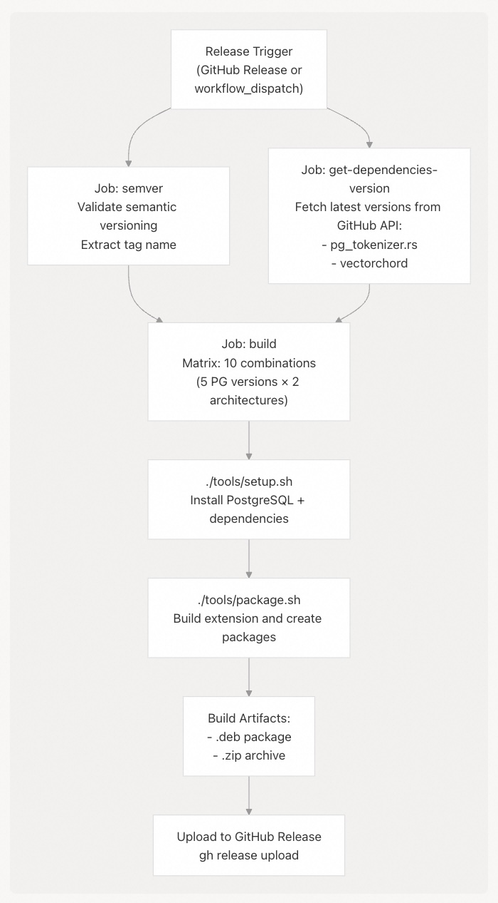
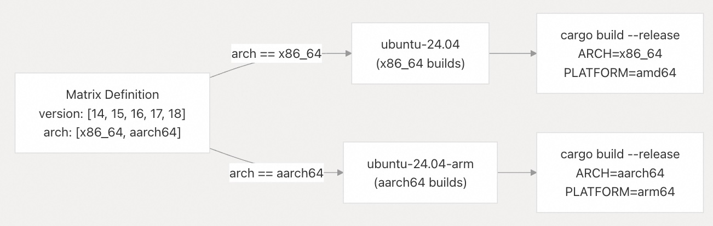
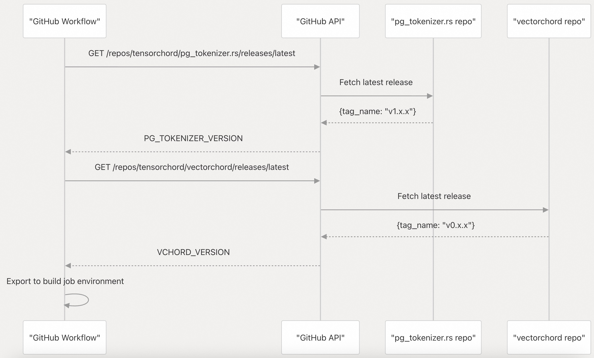
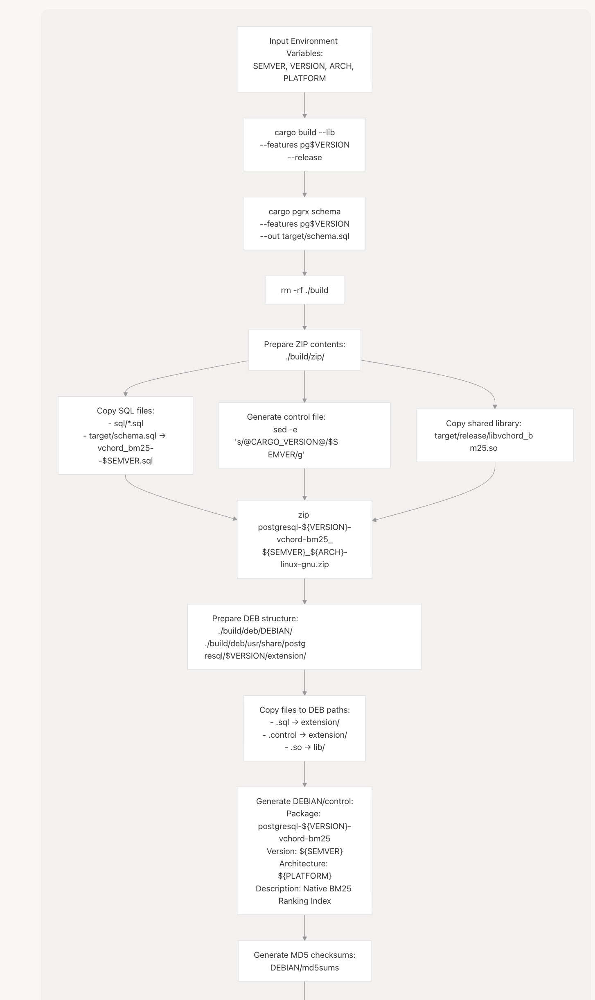
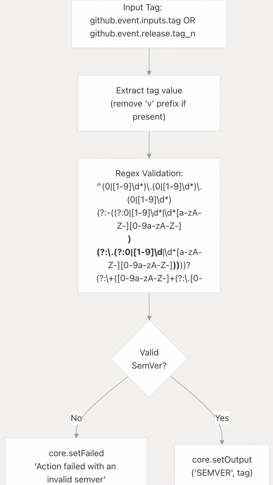
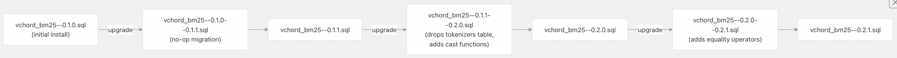

## VectorChord-bm25 源码学习: 5.2 打包与部署 (`Packaging & Deployment`)  
                  
### 作者                  
digoal                  
                  
### 日期                  
2025-11-25                  
                  
### 标签                  
VectorChord-bm25 , 源码学习 , 全文检索 , 关键词检索 , TF , IDF , 相关性排序 , ranking , Block-WeakAnd , Block-WAND , tsvector , ts_rank                  
                  
----                  
                  
## 背景                  
本文档描述了 VectorChord-BM25 的打包与部署基础设施（`packaging and deployment infrastructure`），包括自动化发布流程（`automated release process`）、多平台构建矩阵（`multi-platform build matrix`）、软件包生成（`package generation`）和分发格式（`distribution formats`）。它涵盖了如何触发发布、如何为多个 **PostgreSQL** 版本和架构（`architectures`）构建软件包，以及最终生成制品（`artifacts`）的结构。  
  
-----  
  
## 发布工作流概述 (`Release Workflow Overview`)  
  
VectorChord-BM25 使用 **GitHub Actions** 来自动化整个发布流程（`release process`）。发布可以通过创建 **GitHub Release** 或通过工作流调度（`workflow dispatch`）手动触发。系统会验证语义版本控制（`semantic versioning`），动态解析依赖项版本（`dependency versions`），为所有支持的平台构建软件包，并将制品（`artifacts`）上传到 **GitHub Release**。  
  
该工作流（`workflow`）由三个按顺序执行的主要作业（`jobs`）组成：  
  
  
  
**来源:** [`.github/workflows/release.yml` 1-91](https://github.com/tensorchord/VectorChord-bm25/blob/da0908a6/.github/workflows/release.yml#L1-L91)  
  
-----  
  
## 构建矩阵与支持平台 (`Build Matrix and Supported Platforms`)  
  
发布流程会为 **PostgreSQL** 版本和 **CPU** 架构（`architectures`）的综合矩阵（`matrix`）构建软件包。这确保了在不同部署环境中的广泛兼容性（`broad compatibility`）。  
  
### 支持的配置 (`Supported Configurations`)  
  
| PostgreSQL 版本 (`Version`) | x86\_64 (amd64) | aarch64 (arm64) |  
| :--- | :--- | :--- |  
| PostgreSQL 14 | ✓ | ✓ |  
| PostgreSQL 15 | ✓ | ✓ |  
| PostgreSQL 16 | ✓ | ✓ |  
| PostgreSQL 17 | ✓ | ✓ |  
| PostgreSQL 18 | ✓ | ✓ |  
  
**总组合数（Total Combinations）:** 10 个平台/版本对  
  
### 构建环境 (`Build Environment`)  
  
构建矩阵（`build matrix`）根据架构（`architecture`）使用不同的 **GitHub** 托管运行器（`GitHub-hosted runners`）：  
  
  
  
`PLATFORM` 变量将架构名称映射到 **Debian** 软件包架构约定（`Debian package architecture conventions`）（`amd64` 对应 x86\_64，`arm64` 对应 aarch64）。  
  
**来源:** [`.github/workflows/release.yml` 62-76](https://github.com/tensorchord/VectorChord-bm25/blob/da0908a6/.github/workflows/release.yml#L62-L76)  
  
-----  
  
## 依赖项版本解析 (`Dependency Version Resolution`)  
  
在构建之前，工作流（`workflow`）会从所需的依赖项（`dependencies`）各自的 **GitHub** 仓库动态获取最新版本。这确保了发布始终使用兼容版本，无需手动更新工作流文件。  
  
### 依赖项获取流程 (`Dependency Fetch Process`)  
  
  
  
`get-dependencies-version` 作业（`job`）使用 `curl` 和 `jq` 来解析 **GitHub API** 响应并提取标签名称（`tag names`）：  
  
```  
PG_TOKENIZER_VERSION=$(curl -sSL https://api.github.com/repos/tensorchord/pg_tokenizer.rs/releases/latest | jq -r '.tag_name')  
```  
  
  
然后，这些版本作为环境变量（`environment variables`）传递给构建作业。  
  
**来源:** [`.github/workflows/release.yml` 35-58](https://github.com/tensorchord/VectorChord-bm25/blob/da0908a6/.github/workflows/release.yml#L35-L58)  
  
-----  
  
## 软件包构建流程 (`Package Building Process`)  
  
`package.sh` 脚本协调（`orchestrates`）完整的软件包构建过程，包括编译（`compilation`）、模式生成（`schema generation`）以及创建 `.deb` 和 `.zip` 两种分发格式（`distribution formats`）。  
  
### 构建阶段 (`Build Stages`)  
  
  
  
**来源:** [`tools/package.sh` 1-46](https://github.com/tensorchord/VectorChord-bm25/blob/da0908a6/tools/package.sh#L1-L46)  
  
-----  
  
## 分发格式 (`Distribution Formats`)  
  
VectorChord-BM25 以两种格式分发，每种格式都针对不同的安装方法进行了优化。  
  
### ZIP 归档格式 (`ZIP Archive Format`)  
  
**ZIP** 归档文件（`archive`）包含原始扩展文件，适用于手动安装或集成到自定义部署流水线（`custom deployment pipelines`）。  
  
**文件结构（File Structure）:**  
  
```  
postgresql-${VERSION}-vchord-bm25_${SEMVER}_${ARCH}-linux-gnu.zip  
├── vchord_bm25.control              (带有版本元数据的控制文件 control file with version metadata)  
├── vchord_bm25--${SEMVER}.sql       (安装 SQL 模式 installation SQL schema)  
├── vchord_bm25--X.Y.Z--X.Y.Z.sql    (迁移脚本 migration scripts)  
└── vchord_bm25.so                   (编译后的共享库 compiled shared library)  
```  
  
控制文件（`control file`）是通过用实际的语义版本（`semantic version`）替换 `@CARGO_VERSION@` 占位符（`placeholder`）生成的。  
  
**来源:** [`tools/package.sh` 14-19](https://github.com/tensorchord/VectorChord-bm25/blob/da0908a6/tools/package.sh#L14-L19)  
  
### Debian 软件包格式 (`Debian Package Format`)  
  
`.deb` 软件包遵循 **Debian** 软件包约定（`Debian package conventions`），可以使用标准软件包管理器（`apt`、`dpkg`）安装。  
  
**软件包结构（Package Structure）:**  
  
```  
./build/deb/  
├── DEBIAN/  
│   ├── control       (软件包元数据 package metadata)  
│   └── md5sums       (文件完整性校验和 file integrity checksums)  
├── usr/  
│   ├── share/postgresql/${VERSION}/extension/  
│   │   ├── vchord_bm25.control  
│   │   ├── vchord_bm25--${SEMVER}.sql  
│   │   └── vchord_bm25--*.sql (迁移脚本 migration scripts)  
│   └── lib/postgresql/${VERSION}/lib/  
│       └── vchord_bm25.so  
```  
  
**软件包元数据（Package Metadata）:**  
  
| 字段 (`Field`) | 值 (`Value`) |  
| :--- | :--- |  
| Package (软件包) | `postgresql-${VERSION}-vchord-bm25` |  
| Version (版本) | `${SEMVER}` |  
| Section (分区) | `database` |  
| Priority (优先级) | `optional` |  
| Architecture (架构) | `${PLATFORM}` (amd64 or arm64) |  
| Maintainer (维护者) | `Tensorchord <support@tensorchord.ai>` |  
| Description (描述) | `Native BM25 Ranking Index in PostgreSQL` (PostgreSQL 中的原生 BM25 排名索引) |  
| Homepage (主页) | `https://github.com/tensorchord/VectorChord-bm25/` |  
| License (许可证) | `AGPL-3.0-only or Elastic-2.0` |  
  
**来源:** [`tools/package.sh` 21-45](https://github.com/tensorchord/VectorChord-bm25/blob/da0908a6/tools/package.sh#L21-L45)  
  
-----  
  
## 语义版本控制验证 (`Semantic Versioning Validation`)  
  
发布工作流（`release workflow`）包含一个验证步骤，确保提供的标签遵循严格的语义版本控制（`Semantic Versioning`, **SemVer**）约定。  
  
### 验证流程 (`Validation Process`)  
  
  
  
有效示例：`0.1.0`、`1.2.3`、`2.0.0-beta.1`、`1.0.0+build.123`  
  
无效示例：`v1.0.0`（未去除前缀 `prefix not stripped`）、`1.0`（缺少修订号 `missing patch`）、`1.0.0.0`（段位过多 `too many segments`）  
  
**来源:** [`.github/workflows/release.yml` 18-33](https://github.com/tensorchord/VectorChord-bm25/blob/da0908a6/.github/workflows/release.yml#L18-L33)  
  
-----  
  
## 版本迁移脚本 (`Version Migration Scripts`)  
  
该扩展包括 **SQL** 迁移脚本（`migration scripts`），允许用户在版本升级时不会丢失数据（`without data loss`）。这些脚本包含在两种分发格式中。  
  
### 迁移脚本结构 (`Migration Script Structure`)  
  
  
  
### 迁移脚本示例 (`Migration Script Examples`)  
  
**0.1.0 → 0.1.1**（空操作迁移 `No-op migration`）：  
  
  * 文件（File）：[`sql/vchord_bm25--0.1.0--0.1.1.sql` 1](https://github.com/tensorchord/VectorChord-bm25/blob/da0908a6/sql/vchord_bm25--0.1.0--0.1.1.sql#L1-L1)  
  * 内容（Content）：带有注释的空迁移  
  
**0.1.1 → 0.2.0**（重大重构 `Major refactoring`）：  
  
  * 文件（File）：[`sql/vchord_bm25--0.1.1--0.2.0.sql` 1-40](https://github.com/tensorchord/VectorChord-bm25/blob/da0908a6/sql/vchord_bm25--0.1.1--0.2.0.sql#L1-L40)  
  * 删除了 `bm25_catalog.tokenizers` 表（`table`）  
  * 移除了旧的词元化函数（`tokenization functions`）  
  * 添加了 `_vchord_bm25_cast_array_to_bm25vector` 函数  
  * 创建了 `int[] AS bm25vector` 类型转换（`cast`）  
  * 更新了 `to_bm25query` 函数签名（`signature`）  
  
**0.2.0 → 0.2.1**（操作符添加 `Operator additions`）：  
  
  * 文件（File）：[`sql/vchord_bm25--0.2.0--0.2.1.sql` 1-48](https://github.com/tensorchord/VectorChord-bm25/blob/da0908a6/sql/vchord_bm25--0.2.0--0.2.1.sql#L1-L48)  
  * 添加了 `_bm25catalog_bm25vector_operator_eq` 函数  
  * 添加了 `_bm25catalog_bm25vector_operator_neq` 函数  
  * 为 `bm25vector` 类型创建了 `=` 和 `<>` 操作符（`operators`）  
  
**来源:** [`sql/vchord_bm25--0.1.0--0.1.1.sql` 1](https://github.com/tensorchord/VectorChord-bm25/blob/da0908a6/sql/vchord_bm25--0.1.0--0.1.1.sql#L1-L1) [`sql/vchord_bm25--0.1.1--0.2.0.sql` 1-40](https://github.com/tensorchord/VectorChord-bm25/blob/da0908a6/sql/vchord_bm25--0.1.1--0.2.0.sql#L1-L40) [`sql/vchord_bm25--0.2.0--0.2.1.sql` 1-48](https://github.com/tensorchord/VectorChord-bm25/blob/da0908a6/sql/vchord_bm25--0.2.0--0.2.1.sql#L1-L48)  
  
-----  
  
## 制品上传与分发 (`Artifact Upload and Distribution`)  
  
成功构建后，工作流（`workflow`）使用 `gh CLI` 工具将制品（`artifacts`）上传到 **GitHub Release**。  
  
### 上传流程 (`Upload Process`)  
  
  
  
### 命名约定 (`Naming Convention`)  
  
**Debian 软件包（Debian Packages）:**  
  
```  
postgresql-{VERSION}-vchord-bm25_{SEMVER}-1_{PLATFORM}.deb  
```  
  
示例 (`Examples`)：  
  
  * `postgresql-16-vchord-bm25_0.2.1-1_amd64.deb`  
  * `postgresql-17-vchord-bm25_0.2.1-1_arm64.deb`  
  
**ZIP 归档（ZIP Archives）:**  
  
```  
postgresql-{VERSION}-vchord-bm25_{SEMVER}_{ARCH}-linux-gnu.zip  
```  
  
示例 (`Examples`)：  
  
  * `postgresql-16-vchord-bm25_0.2.1_x86_64-linux-gnu.zip`  
  * `postgresql-17-vchord-bm25_0.2.1_aarch64-linux-gnu.zip`  
  
**来源:** [`.github/workflows/release.yml` 86-90](https://github.com/tensorchord/VectorChord-bm25/blob/da0908a6/.github/workflows/release.yml#L86-L90)  
  
-----  
  
## 环境变量参考 (`Environment Variables Reference`)  
  
| 变量 (`Variable`) | 来源 (`Source`) | 目的 (`Purpose`) |  
| :--- | :--- | :--- |  
| `SEMVER` | `semver` 作业输出 | 语义版本（`Semantic version`）（例如 `0.2.1`） |  
| `VERSION` | 矩阵策略 (`Matrix strategy`) | PostgreSQL 主版本（`major version`）(14-18) |  
| `POSTGRES_VERSION` | `VERSION` 的别名 (`Alias`) | 供构建脚本使用 |  
| `ARCH` | 矩阵策略 (`Matrix strategy`) | CPU 架构（`architecture`）（`x86_64`、`aarch64`） |  
| `PLATFORM` | 由 `ARCH` 计算得出 | Debian 架构（`arch`）（`amd64`、`arm64`） |  
| `PG_TOKENIZER_VERSION` | `get-dependencies-version` 作业 | 最新的 `pg_tokenizer.rs` 发布标签（`release tag`） |  
| `VCHORD_VERSION` | `get-dependencies-version` 作业 | 最新的 `vectorchord` 发布标签（`release tag`） |  
| `GH_TOKEN` | GitHub Actions 密钥 (`secret`) | 用于 `gh CLI` 的身份验证 |  
| `CARGO_TERM_COLOR` | 设置为 `always` | 启用彩色输出（`colored output`） |  
| `RUST_BACKTRACE` | 设置为 `1` | 启用详细错误回溯（`error backtraces`） |  
| `RUSTFLAGS` | 设置为 `-Dwarnings` | 将警告视为错误（`Treat warnings as errors`） |  
  
**来源:** [`.github/workflows/release.yml` 68-77](https://github.com/tensorchord/VectorChord-bm25/blob/da0908a6/.github/workflows/release.yml#L68-L77) [`.github/workflows/release.yml` 86-90](https://github.com/tensorchord/VectorChord-bm25/blob/da0908a6/.github/workflows/release.yml#L86-L90)  
  
-----  
  
## 发布触发机制 (`Release Trigger Mechanisms`)  
  
该工作流（`workflow`）支持两种触发机制（`trigger mechanisms`），以适应不同的发布工作流：  
  
### 1\. GitHub Release 创建 (`GitHub Release Creation`)  
  
当通过 **GitHub UI** 或 **API** 创建发布时：  
  
```  
on:  
  release:  
    types: [created]  
```      
  
标签名称（`tag name`）是从 `github.event.release.tag_name` 中提取的。  
  
### 2\. 手动工作流调度 (`Manual Workflow Dispatch`)  
  
用于手动发布或测试：  
  
```  
on:  
  workflow_dispatch:  
    inputs:  
      tag:  
        description: 'tag name (semver without v-prefix)'  
        required: true  
        type: string  
```  
  
标签（`tag`）是通过 `github.event.inputs.tag` 提供的。  
  
这两种机制都在 `semver` 作业（`job`）处汇合，该作业规范化了标签值。  
  
**来源:** [`.github/workflows/release.yml` 3-11](https://github.com/tensorchord/VectorChord-bm25/blob/da0908a6/.github/workflows/release.yml#L3-L11)  
  
-----  
  
# 附录1: 软件包分发与部署便捷性  
  
**痛点/背景：** 文档显示项目为 5 个 PostgreSQL 版本和 2 个架构共构建了 10 种组合的软件包（`.deb` 和 `.zip` 格式）。用户必须手动选择正确的 `postgresql-{VERSION}-vchord-bm25...` 文件。  
  
**关键问题：**  
  
> **官方是否有提供集中化的软件仓库（如 Debian/Ubuntu 的 Apt 仓库、RHEL 的 Yum/Dnf 仓库）？** 面对多版本、多架构的软件包，终端用户或管理员应如何以**最便捷、最可靠**的方式（例如，通过一行命令使用标准的软件包管理器）来查找、安装和更新与其环境精确匹配的 VectorChord-BM25 扩展，而不是依赖于手动下载 GitHub Release 中的 `.deb` 或 `.zip` 文件？  
  
## 回答  
  
您询问的是 VectorChord-BM25 项目是否提供集中化的软件包仓库（如 Apt 或 Yum 仓库），以便用户能够通过标准包管理器自动安装和更新扩展，而不需要手动从 GitHub Releases 下载特定版本和架构的 `.deb` 或 `.zip` 文件。  
  
  
**目前官方没有提供集中化的软件包仓库。**    
  
根据发布工作流，所有构建的软件包（10 种组合：5 个 PostgreSQL 版本 × 2 个架构）都直接上传到 GitHub Releases。   用户需要：  
  
1. **手动访问 GitHub Releases 页面**  
2. **识别并下载正确的文件**，例如 `postgresql-16-vchord-bm25_0.2.1-1_amd64.deb`  
3. **使用 `dpkg` 或 `apt install` 手动安装** `.deb` 文件  
  
## 当前推荐的安装方式  
  
官方推荐使用 Docker 镜像 `tensorchord/vchord-suite`，这是最便捷的方式：    
  
```bash  
docker run \
  --name vchord-suite \
  -e POSTGRES_PASSWORD=postgres \
  -p 5432:5432 \
  -d tensorchord/vchord-suite:pg18-latest  
```  
  
这个镜像已经预装了 VectorChord-BM25 和所有依赖项。    
  
## 手动安装 `.deb` 包的流程  
  
如果您需要在现有系统上安装，当前的流程是：  
  
1. 从 [GitHub Releases](https://github.com/tensorchord/VectorChord-bm25/releases) 下载对应的 `.deb` 文件  
2. 安装：`sudo apt install ./postgresql-{VERSION}-vchord-bm25_{SEMVER}-1_{PLATFORM}.deb`  
3. 在 PostgreSQL 中启用扩展：`CREATE EXTENSION vchord_bm25 CASCADE;`    
  
## Notes  
  
项目的打包脚本   生成符合 Debian 标准的 `.deb` 包，包含正确的元数据（Package、Version、Architecture 等），理论上可以托管在 Apt 仓库中。但目前发布流程   仅将包上传到 GitHub Releases，没有配置 Apt 仓库服务器。  
  
如果您需要集中化的包管理，可以考虑：  
- 向项目提交 feature request，建议设置官方 Apt 仓库  
- 在内部环境搭建私有 Apt 仓库来托管这些 `.deb` 包  
- 继续使用官方推荐的 Docker 镜像方案  
  
  
  
-----  
  
# 附录2: 版本升级的流程和风险控制  
  
**痛点/背景：** 文档提到了版本迁移脚本（`Version Migration Scripts`），例如 `0.1.1 -> 0.2.0` 涉及删除旧表和函数（`Drops table`、`Removes functions`），这是重大的结构变更。用户最担心的是升级导致运行中的数据库中断或数据丢失。  
  
**关键问题：**  
  
> **针对包含重大重构（`Major refactoring`）的升级，用户在 **PostgreSQL** 中执行扩展升级的**完整操作步骤**是什么？** 特别是，用户如何在使用 `ALTER EXTENSION UPDATE` 命令之前，预估升级风险？如果升级过程中（例如，迁移脚本执行期间）发生错误，是否有推荐的**回滚机制**和**数据校验**方法，以确保数据完整性？  
  
## 回答  
  
  
根据代码库上下文,您询问的是 VectorChord-BM25 PostgreSQL 扩展的版本升级流程,特别是涉及重大结构变更时的操作步骤、风险评估和回滚机制。  
  
## 当前代码库的升级机制  
  
VectorChord-BM25 使用 PostgreSQL 标准的扩展升级脚本机制。 代码库中包含版本安装脚本(如 `vchord_bm25--0.1.0.sql`, `vchord_bm25--0.1.1.sql`)和迁移脚本(如 `vchord_bm25--0.1.0--0.1.1.sql`, `vchord_bm25--0.1.1--0.2.0.sql`)。    
  
## 重要发现:缺少明确的升级文档  
  
**代码库中没有提供完整的升级操作步骤、风险评估方法或回滚机制的文档。** 这正是您担心的核心问题。  
  
## PostgreSQL 扩展升级的标准流程  
  
基于 PostgreSQL 扩展机制,标准升级步骤应该是:  
  
1. **备份数据库**(在执行任何升级前)  
2. 安装新版本的扩展文件到 PostgreSQL 扩展目录  
3. 执行 `ALTER EXTENSION vchord_bm25 UPDATE TO '新版本';`    
  
## 风险评估建议  
  
由于代码库未提供风险评估工具,建议:  
  
1. **检查迁移脚本内容**:在升级前查看对应版本的迁移脚本(如 `sql/vchord_bm25--0.1.1--0.2.0.sql`)了解具体变更  
2. **在测试环境先执行**:使用生产数据的副本进行测试升级  
3. **检查依赖的数据对象**:查询使用了 `bm25vector` 类型和 `bm25` 索引的表  
  
## 回滚机制  
  
**PostgreSQL 不提供扩展的自动回滚功能。** 推荐的回滚方法:  
  
1. **事务包装**(如果可能):  
   ```sql  
   BEGIN;  
   ALTER EXTENSION vchord_bm25 UPDATE TO '新版本';  
   -- 验证数据  
   -- 如果有问题: ROLLBACK;  
   -- 如果正常: COMMIT;  
   ```  
   但注意:某些 DDL 操作在 PostgreSQL 中无法回滚  
  
2. **数据库备份恢复**:这是最可靠的回滚方法  
3. **降级脚本**:需要手动创建反向迁移脚本(代码库未提供)  
  
## 数据校验方法  
  
建议的验证步骤:  
  
1. 验证扩展版本:`SELECT * FROM pg_extension WHERE extname = 'vchord_bm25';`  
2. 验证索引完整性:`REINDEX INDEX 索引名;`  
3. 执行测试查询验证 BM25 搜索功能  
4. 检查表结构:`\d+ 表名`    
  
## Notes  
  
代码库显示这是一个使用 pgrx 框架开发的 Rust PostgreSQL 扩展。   打包脚本显示扩展通过 `.deb` 包和 `.zip` 文件分发。    
  
**关键缺失**:代码库没有提供版本迁移脚本的实际内容(如 `sql/vchord_bm25--0.1.1--0.2.0.sql` 文件未在提供的代码片段中),因此无法确认具体的"删除表"和"删除函数"操作。建议直接查看这些迁移脚本文件以了解具体风险。  
  
对于生产环境的重大升级,强烈建议:  
1. 完整的数据库备份  
2. 在隔离的测试环境中完整测试升级流程  
3. 准备降级计划(可能需要从备份恢复)  
4. 在维护窗口期执行升级  
  
  
  
在 PostgreSQL 中哪些 DDL(数据定义语言)操作无法在事务中回滚。 这个问题与 VectorChord-BM25 扩展升级的回滚机制直接相关。  
  
## PostgreSQL 中可以回滚的 DDL  
  
PostgreSQL 的一个重要特性是**大多数 DDL 操作都是事务性的**,可以回滚。 这包括:  
  
- `CREATE TABLE`、`DROP TABLE`、`ALTER TABLE`  
- `CREATE INDEX`、`DROP INDEX`  
- `CREATE FUNCTION`、`DROP FUNCTION`  
- `CREATE TYPE`、`DROP TYPE`  
- `CREATE OPERATOR`、`DROP OPERATOR`  
  
## 无法回滚的 DDL 操作  
  
以下 DDL 操作在 PostgreSQL 中**无法回滚**:  
  
### 1. 数据库级别操作  
- `CREATE DATABASE`  
- `DROP DATABASE`  
- `ALTER DATABASE` (某些操作)  
  
### 2. 表空间操作  
- `CREATE TABLESPACE`  
- `DROP TABLESPACE`  
  
### 3. 复制相关操作  
- `CREATE SUBSCRIPTION`  
- `DROP SUBSCRIPTION`  
- `ALTER SUBSCRIPTION`  
  
### 4. 某些 ALTER 操作  
- `ALTER SYSTEM` - 修改配置文件,不在事务控制范围内  
  
## 对 VectorChord-BM25 升级的影响  
  
查看 VectorChord-BM25 的迁移脚本 `vchord_bm25--0.1.1--0.2.0.sql`,其中的操作包括:    
  
这些操作都是**可以回滚的**:  
- `DROP TABLE` - 可回滚  
- `DROP FUNCTION` - 可回滚  
- `CREATE FUNCTION` - 可回滚  
- `CREATE CAST` - 可回滚  
  
因此,VectorChord-BM25 的升级脚本中的 DDL 操作理论上都可以在事务中回滚。  
  
## 实际限制  
  
虽然这些 DDL 可以回滚,但在实际操作中仍需注意:  
  
1. **长时间运行的事务**:如果升级涉及大量数据,事务可能持续很长时间,期间会持有锁  
2. **依赖对象**:如果有其他对象依赖被删除的函数或表,可能导致级联删除  
3. **并发访问**:升级期间其他会话可能无法访问相关对象  
  
## Notes  
  
VectorChord-BM25 扩展的 DDL 操作主要涉及类型、函数、操作符和索引访问方法的创建和删除。   这些都是标准的可回滚 DDL 操作。  
  
建议在升级前使用 `BEGIN` 开启事务,升级后验证结果,确认无误后再 `COMMIT`。 如果发现问题,可以立即 `ROLLBACK` 恢复到升级前的状态。  
  
  
-----  
  
# 附录3: 动态依赖项的隔离与管理  
  
**痛点/背景：** 文档指出依赖项（如 `pg_tokenizer.rs` 和 `vectorchord`）的版本是在构建时动态解析的。作为 PostgreSQL 扩展，用户通常不希望手动处理依赖。  
  
**关键问题：**  
  
> VectorChord-BM25 扩展如何确保其内部动态获取的依赖项（例如 `pg_tokenizer.rs`）在 PostgreSQL 扩展生态系统中实现**隔离性**？ 如果用户安装了其他也依赖这些库但版本不同的扩展，是否会引发命名冲突（Symbol Collision）或版本兼容性（ABI Compatibility）问题？用户是否需要针对这些底层依赖执行任何**手动安装或管理**操作？  
  
## 回答  
  
  
您询问的是 VectorChord-BM25 扩展如何处理其依赖项（特别是 `pg_tokenizer.rs`）的隔离性、版本冲突和用户管理问题。  
  
## 依赖项的动态解析机制  
  
VectorChord-BM25 在 CI/CD 流程中动态获取依赖版本。 在构建和发布流程中，通过 GitHub API 获取 `pg_tokenizer.rs` 的最新版本：    
  
同样的机制也用于 CI 测试流程：    
  
## 依赖安装方式：独立的 .deb 包  
  
**关键发现：`pg_tokenizer.rs` 作为独立的 PostgreSQL 扩展安装，而非嵌入到 VectorChord-BM25 中。**  
  
在环境设置脚本中，`pg_tokenizer` 通过独立的 `.deb` 包安装：    
  
这意味着 `pg_tokenizer` 是一个**独立的共享库**（`pg_tokenizer.so`），需要在 PostgreSQL 的 `shared_preload_libraries` 中加载：    
  
## 隔离性分析  
  
### 1. **符号冲突（Symbol Collision）风险**  
  
**存在潜在风险。** 由于两个扩展都是独立的共享库（`.so` 文件），它们在同一个 PostgreSQL 进程空间中加载。如果：  
  
- 两个不同的扩展依赖 `pg_tokenizer` 的不同版本  
- 这些版本导出了相同名称但 ABI 不兼容的符号  
  
则可能发生符号冲突。  
  
### 2. **版本兼容性（ABI Compatibility）问题**  
  
**PostgreSQL 扩展生态系统没有内置的版本隔离机制。** 从代码可以看出：  
  
- VectorChord-BM25 通过 SQL 函数调用 `pg_tokenizer` 的功能（如 `tokenize()` 函数）    
- 这些函数在 SQL 层面定义，依赖于 `pg_tokenizer` 扩展已经加载    
  
如果系统中有另一个扩展依赖不同版本的 `pg_tokenizer`，**只能有一个版本的 `pg_tokenizer.so` 被加载**，因为 PostgreSQL 的 `shared_preload_libraries` 不支持同一扩展的多版本共存。  
  
### 3. **实际隔离机制：无**  
  
代码显示 VectorChord-BM25 **没有实现任何隔离机制**：  
  
- 它依赖系统级安装的 `pg_tokenizer`  
- 通过 SQL 函数名称进行松耦合调用  
- 没有版本检查或兼容性验证代码  
  
## 用户需要的手动操作  
  
**是的，用户需要手动管理依赖。** 根据文档和安装流程：  
  
### 必需的手动步骤：  
  
1. **安装 `pg_tokenizer` 扩展**：    
  
2. **配置 `shared_preload_libraries`**：    
  
3. **配置 `search_path`** 以包含 `tokenizer_catalog` 和 `bm25_catalog` 模式：    
  
4. **重启 PostgreSQL** 以加载共享库  
  
### 版本管理责任  
  
用户需要：  
- 确保安装的 `pg_tokenizer` 版本与 VectorChord-BM25 兼容  
- 在升级任一扩展时检查版本兼容性  
- 避免安装依赖不兼容 `pg_tokenizer` 版本的其他扩展  
  
## Notes  
  
**关键限制**：PostgreSQL 扩展生态系统缺乏类似 Python 虚拟环境或 Node.js `node_modules` 的依赖隔离机制。 所有扩展共享同一个进程空间和符号表。  
  
**推荐的 Docker 镜像方案**：文档推荐使用 `tensorchord/vchord-suite` Docker 镜像  ，这个镜像预装了兼容版本的所有依赖，避免了版本冲突问题。  
  
**Rust/pgrx 的编译时依赖**：虽然 `Cargo.toml` 中定义了 Rust 依赖  ，但这些是编译时依赖，最终编译成单一的 `vchord_bm25.so` 文件。运行时的 `pg_tokenizer` 依赖是通过 SQL 层面的函数调用，而非 Rust 代码链接。  
  
    
#### [PolarDB 学习图谱](https://www.aliyun.com/database/openpolardb/activity "8642f60e04ed0c814bf9cb9677976bd4")
  
  
#### [PostgreSQL 解决方案集合](../201706/20170601_02.md "40cff096e9ed7122c512b35d8561d9c8")
  
  
#### [德哥 / digoal's Github - 公益是一辈子的事.](https://github.com/digoal/blog/blob/master/README.md "22709685feb7cab07d30f30387f0a9ae")
  
  
#### [About 德哥](https://github.com/digoal/blog/blob/master/me/readme.md "a37735981e7704886ffd590565582dd0")
  
  

  
