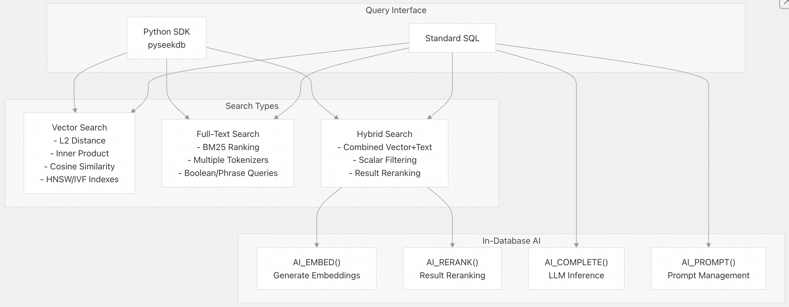
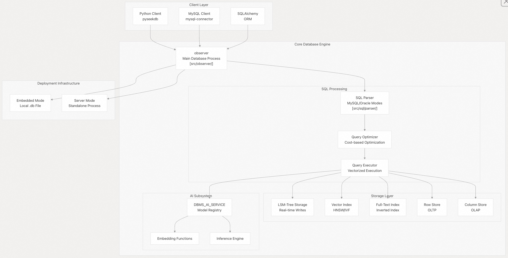
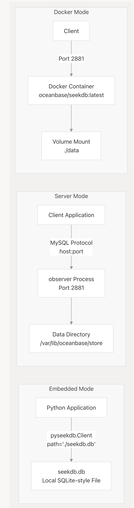
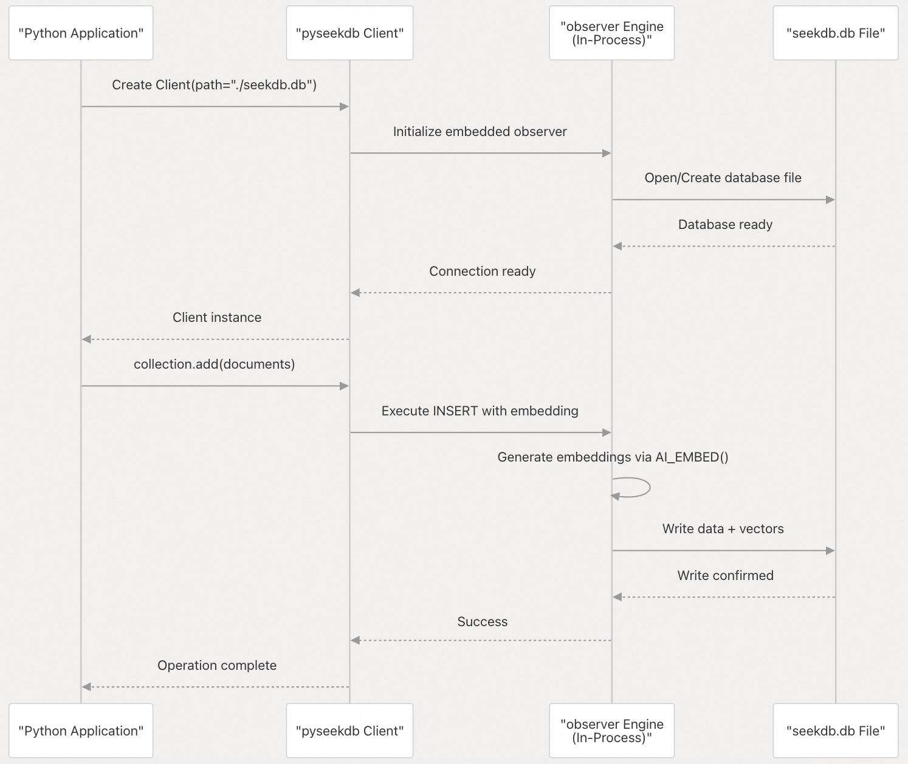
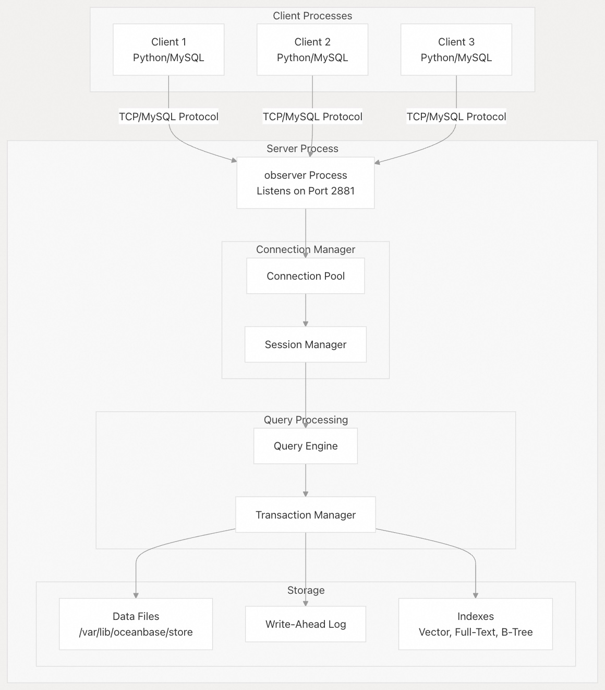
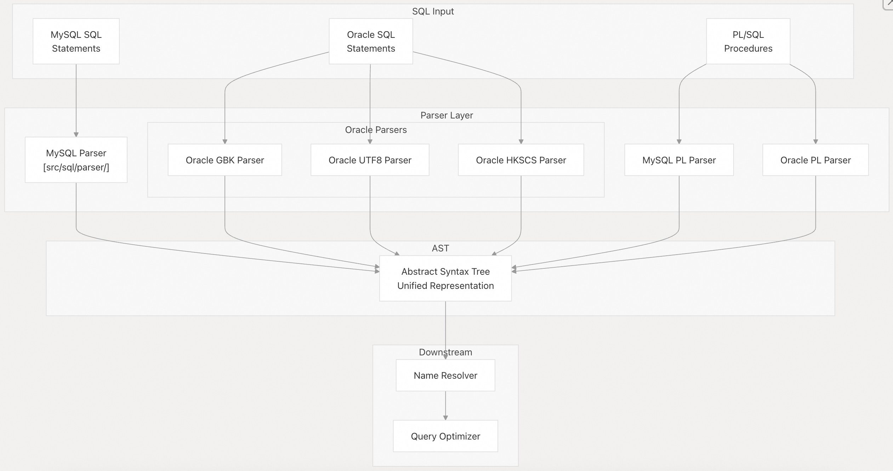
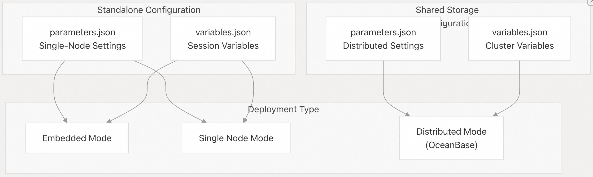
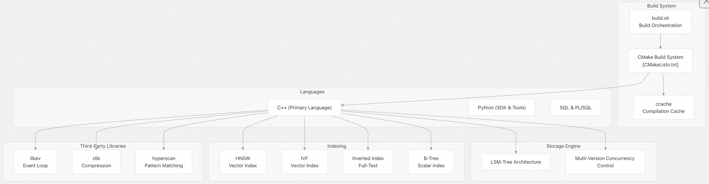
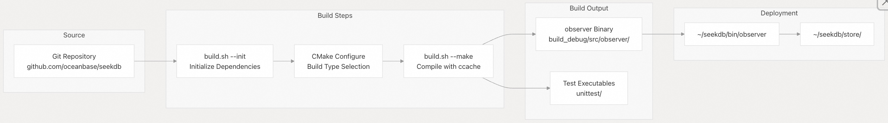

## SeekDB 源码学习: 1 概述 (Overview)  
                    
### 作者                    
digoal                    
                    
### 日期                    
2025-11-25                    
                    
### 标签                    
SeekDB , OceanBase , AI Native 数据库 , 向量搜索 , 语义搜索 , 关键词搜索 , 全文检索 , 标量搜索 , 混合搜索 , AI 搜索 , AI in Database , 源码学习                     
                    
----                    
                    
## 背景                    
本文档全面概述了 **OceanBase SeekDB**，这是一个 **AI原生搜索数据库 (AI-native search database)** ，它在单个引擎中统一了 **向量 (vector)** 、**文本 (text)** 、**结构化 (structured)** 和 **半结构化数据 (semi-structured data)** 。本文涵盖了系统的目的、**架构 (architecture)** 、**核心能力 (core capabilities)** 和 **部署模式 (deployment modes)** 。  
  
-----  
  
### 什么是 OceanBase SeekDB?  
  
OceanBase SeekDB 是一个 **AI原生搜索数据库 (AI-native search database)** ，旨在通过在单个引擎中统一多个数据模型和搜索能力来支持现代 **AI 应用 (AI applications)** 。该系统提供 **混合搜索能力 (hybrid search capabilities)** ，结合了 **向量搜索 (vector search)** 、**全文搜索 (full-text search)** 和传统的 **关系型查询 (relational queries)** ，从而支持 **检索增强生成 (Retrieval-Augmented Generation, RAG)** 、**语义搜索 (semantic search)** 和 **Agentic AI 应用 (agentic AI applications)** 等高级 AI 工作流。  
  
SeekDB 构建于成熟的 **OceanBase 存储引擎 (OceanBase storage engine)** 之上，但针对 **单节点 (single-node)** 和 **嵌入式部署场景 (embedded deployment scenarios)** 进行了优化，使其适用于 **AI/ML 开发 (AI/ML development)** 、**边缘计算 (edge computing)** 以及需要 **低延迟 (low-latency)** 混合搜索能力的应用程序。  
  
**来源:**  
[`README.md` 1-86](https://github.com/oceanbase/seekdb/blob/8c4654f1/README.md#L1-L86)  
  
-----  
  
## 关键能力 (Key Capabilities)  
  
### 数据模型支持 (Data Model Support)  
  
SeekDB 在单个引擎内支持多种数据模型：  
  
| 数据模型 (Data Model) | 能力 (Capability) | 用例 (Use Case) |  
| :--- | :--- | :--- |  
| **向量 (Vector)** | 存储高达 16,000 维度的向量，并进行 **相似性搜索 (similarity search)** | **语义搜索 (Semantic search)** , **嵌入存储 (embedding storage)** , **RAG 应用 (RAG applications)** |  
| **文本 (Text)** | 带有 **BM25 排名 (BM25 ranking)** 的 **全文索引 (Full-text indexing)** | **关键词搜索 (Keyword search)** , **文档检索 (document retrieval)** |  
| **关系型 (Relational)** | 带有 **ACID 事务 (ACID transactions)** 的传统 **SQL 表 (SQL tables)** | **结构化数据 (Structured data)** , **元数据管理 (metadata management)** |  
| **JSON** | 带有 **动态 Schema (dynamic schema)** 的 **半结构化数据 (Semi-structured data)** | **文档元数据 (Document metadata)** , **灵活属性存储 (flexible attribute storage)** |  
| **GIS** | **地理空间数据类型 (Geospatial data types)** 和 **查询 (queries)** | **基于位置的服务 (Location-based services)** |  
  
### 搜索能力 (Search Capabilities)  
  
    
  
**来源:**  
[`README.md` 49-86](https://github.com/oceanbase/seekdb/blob/8c4654f1/README.md#L49-L86)  
[`README.md` 263-307](https://github.com/oceanbase/seekdb/blob/8c4654f1/README.md#L263-L307)  
  
### MySQL 兼容性与 HTAP 支持 (MySQL Compatibility and HTAP Support)  
  
SeekDB 提供了深度 **MySQL 兼容性 (MySQL compatibility)** ，同时扩展了传统 MySQL 之外的能力：  
  
  * **协议兼容性 (Protocol Compatibility)** ：通过 `observer` **进程 (process)** 支持 **MySQL 线协议 (MySQL wire protocol)**  
  * **SQL 兼容性 (SQL Compatibility)** ：MySQL 8.0 语法和语义  
  * **生态系统集成 (Ecosystem Integration)** ：与 **MySQL 客户端库 (MySQL client libraries)** 和工具配合使用  
  * **HTAP 工作负载 (HTAP Workloads)** ：**混合行-列存储 (Hybrid row-column storage)** ，支持 **OLTP (Online Transaction Processing)** 和 **OLAP (Online Analytical Processing)** 查询  
  * **ACID 合规性 (ACID Compliance)** ：完整的 **事务保证 (transactional guarantees)**  
  
**来源:**  
[`README.md` 52-63](https://github.com/oceanbase/seekdb/blob/8c4654f1/README.md#L52-L63)  
  
-----  
  
## 系统架构 (System Architecture)  
  
### 高级组件概览 (High-Level Component Overview)  
  
    
  
**来源:**  
[`README.md` 43-86](https://github.com/oceanbase/seekdb/blob/8c4654f1/README.md#L43-L86) (高级架构图在上下文中提供)  
  
### 核心二进制组件 (Core Binary Components)  
  
系统由两个主要的 **二进制可执行文件 (binary executables)** 组成：  
  
1.  **`observer`**：主要的 **数据库服务器进程 (database server process)**  
      * 位置：[`src/observer/`](https://github.com/oceanbase/seekdb/blob/8c4654f1/src/observer/)  
      * 构建自：[`build_debug/src/observer/observer`](https://github.com/oceanbase/seekdb/blob/8c4654f1/build_debug/src/observer/observer) 或 [`build_release/src/observer/observer`](https://github.com/oceanbase/seekdb/blob/8c4654f1/build_release/src/observer/observer)  
      * 目的：处理所有数据库操作，包括 **查询处理 (query processing)** 、**存储管理 (storage management)** 和 **事务处理 (transaction processing)**  
2.  **`obproxy`**：**SQL 代理层 (SQL proxy layer)** (用于分布式部署，不在标准 SeekDB 中使用)  
      * 位置：在架构中提及，但在单节点 SeekDB 部署中并未实际使用  
      * 目的：为分布式 OceanBase 部署提供 **路由 (routing)** 和 **负载均衡 (load balancing)**  
  
**来源:** (高级架构图)  
[`README.md` 460-469](https://github.com/oceanbase/seekdb/blob/8c4654f1/README.md#L460-L469)  
  
-----  
  
## 部署模式 (Deployment Modes)  
  
SeekDB 支持针对不同用例优化的多种部署模式：  
  
### 部署模式比较 (Deployment Mode Comparison)  
  
    
  
**来源:**  
[`README.md` 89-125](https://github.com/oceanbase/seekdb/blob/8c4654f1/README.md#L89-L125)  
[`README.md` 156-181](https://github.com/oceanbase/seekdb/blob/8c4654f1/README.md#L156-L181)  
  
### 部署模式详情 (Deployment Mode Details)  
  
| 模式 (Mode) | 资源要求 (Resource Requirements) | 用例 (Use Case) | 配置 (Configuration) |  
| :--- | :--- | :--- | :--- |  
| **嵌入式 (Embedded)** | 最低（在**进程内 (in-process)** 运行） | **本地开发 (Local development)** , **笔记本 (notebooks)** , **边缘设备 (edge devices)** | `pyseekdb.Client(path="./seekdb.db")` |  
| **服务器（独立式） (Server (Standalone))** | 1C2G 最低 | **开发服务器 (Development servers)** , **单节点生产环境 (single-node production)** | `observer` 进程带数据目录 |  
| **Docker** | 1C2G 最低 | **快速测试 (Quick testing)** , **容器化部署 (containerized deployments)** | `docker run oceanbase/seekdb:latest` |  
  
### 嵌入式模式架构 (Embedded Mode Architecture)  
  
    
  
**来源:**  
[`README.md` 156-181](https://github.com/oceanbase/seekdb/blob/8c4654f1/README.md#L156-L181)  
  
### 服务器模式架构 (Server Mode Architecture)  
  
    
  
**来源:**  
[`README.md` 106-124](https://github.com/oceanbase/seekdb/blob/8c4654f1/README.md#L106-L124)  
  
-----  
  
## 多模式解析器系统 (Multi-Mode Parser System)  
  
SeekDB 继承了 OceanBase 的 **多方言 SQL 解析器系统 (multi-dialect SQL parser system)** ，支持 **MySQL** 和 **Oracle SQL 语法 (SQL syntax)** 以及多种**字符编码 (character encodings)** ：  
  
    
  
-----  
  
## 配置系统 (Configuration System)  
  
SeekDB 使用基于 **JSON 的配置系统 (JSON-based configuration system)** 来管理 **数据库参数 (database parameters)** 和 **系统变量 (system variables)** ：  
  
### 配置文件 (Configuration Files)  
  
| 文件 (File) | 目的 (Purpose) | 位置 (Location) |  
| :--- | :--- | :--- |  
| `parameters.json` | **服务器配置参数 (Server configuration parameters)** | **配置目录 (Configuration directory)** |  
| `variables.json` | **系统变量 (System variables)** | 配置目录 |  
  
### 配置模式 (Configuration Modes)  
  
    
  
-----  
  
## 技术栈 (Technology Stack)  
  
### 核心技术 (Core Technologies)  
  
    
  
**来源:**  
[`README.md` 457-477](https://github.com/oceanbase/seekdb/blob/8c4654f1/README.md#L457-L477) (高级架构图在上下文中提供)  
  
### 关键架构模式 (Key Architectural Patterns)  
  
1.  **LSM-Tree 存储 (LSM-Tree Storage)** ：针对**高吞吐量写入 (high-throughput writes)** 和**实时读取可见性 (real-time read visibility)** 进行了优化  
2.  **混合行-列存储 (Hybrid Row-Column Storage)** ：高效支持 **OLTP** 和 **OLAP 工作负载 (workloads)**  
3.  **向量化执行 (Vectorized Execution)** ：针对**分析工作负载 (analytical workloads)** 的**并行查询执行 (Parallel query execution)**  
4.  **嵌入式引擎 (Embedded Engine)** ：可在**进程内 (in-process)** 运行，实现最小化**部署开销 (deployment overhead)**  
5.  **MySQL 协议兼容性 (MySQL Protocol Compatibility)** ：标准 **MySQL 线协议 (MySQL wire protocol)** ，支持广泛的**生态系统 (ecosystem)**  
  
**来源:**  
[`README.md` 71-98](https://github.com/oceanbase/seekdb/blob/8c4654f1/README.md#L71-L98)  
  
-----  
  
## 构建和安装概览 (Build and Installation Overview)  
  
### 构建流程 (Build Process Flow)  
  
    
  
**来源:**  
[`README.md` 457-472](https://github.com/oceanbase/seekdb/blob/8c4654f1/README.md#L457-L472)  
  
### 安装方法 (Installation Methods)  
  
1.  **Python SDK**：`pip install -U pyseekdb` - 推荐用于 **AI/ML 应用 (AI/ML applications)**  
2.  **Docker**：`docker run oceanbase/seekdb:latest` - 快速测试和**容器化部署 (containerized deployment)**  
3.  **RPM 包 (RPM Package)** ：`rpm -ivh seekdb-*.rpm` - **Linux** 上的**系统级安装 (System-wide installation)**  
4.  **从源码构建 (Build from Source)** ：`build.sh debug --init --make` - **开发 (Development)** 和**定制 (customization)**  
  
**来源:**  
[`README.md` 89-125](https://github.com/oceanbase/seekdb/blob/8c4654f1/README.md#L89-L125)  
  
-----  
  
## 与 OceanBase 的比较 (Comparison with OceanBase)  
  
SeekDB 源自 OceanBase，但针对不同的用例进行了优化：  
  
| 方面 (Aspect) | OceanBase SeekDB | OceanBase |  
| :--- | :--- | :--- |  
| **架构 (Architecture)** | **单节点优化 (Single-node optimized)** | **分布式架构 (Distributed architecture)** |  
| **许可证 (License)** | **Apache 2.0** | **MulanPubL 2.0 (木兰宽松许可证 2.0)** |  
| **部署 (Deployment)** | **嵌入式 (Embedded)** + **单节点 (Single-Node)** | **分布式集群 (Distributed clusters)** |  
| **目标用例 (Target Use Case)** | **AI/ML 应用 (AI/ML applications)** , **边缘计算 (edge computing)** , **开发 (development)** | **企业级分布式数据库 (Enterprise-scale distributed database)** |  
| **资源要求 (Resource Requirements)** | 1C2G 最低 | **多节点集群 (Multi-node cluster)** |  
| **AI 特性 (AI Features)** | **原生向量搜索 (Native vector search)** , **混合搜索 (hybrid search)** , **In-DB AI 函数 (in-DB AI functions)** | **向量搜索 (Vector search)** (需要附加组件) |  
| **Python 集成 (Python Integration)** | 通过 `pyseekdb` 的**原生嵌入模式 (Native embedded mode)** | **仅客户端-服务器 (Client-server only)** |  
  
**来源:**  
[`README.md` 52-64](https://github.com/oceanbase/seekdb/blob/8c4654f1/README.md#L52-L64)  
  
-----  
  
## 生态系统与集成 (Ecosystem and Integration)  
  
SeekDB 与主流的 **AI/ML 框架 (AI/ML frameworks)** 和工具集成：  
  
### 支持的框架 (Supported Frameworks)  
  
  * **LangChain & LangGraph**：**RAG 链构建 (RAG chain building)** 和 **Agent 工作流 (agent workflows)**  
  * **LlamaIndex**：**文档索引 (Document indexing)** 和 **检索 (retrieval)**  
  * **Dify & Coze**：**低代码 AI 应用平台 (Low-code AI application platforms)**  
  * **HuggingFace**：**模型集成 (Model integration)** 和 **嵌入 (embeddings)**  
  * **FastGPT & DB-GPT**：**AI 应用开发平台 (AI application development platforms)**  
  
### 访问方法 (Access Methods)  
  
1.  **Python SDK** (`pyseekdb`)：具有**自动嵌入支持 (automatic embedding support)** 的**原生 Python API (Native Python API)**  
2.  **SQL 接口 (SQL Interface)** ：用于 **SQL 访问 (SQL-based access)** 的标准 **MySQL 协议 (MySQL protocol)**  
3.  **SQLAlchemy ORM**：用于传统 **DB 工作流 (DB workflows)** 的 **Python ORM 集成 (Python ORM integration)**  
  
**来源:**  
[`README.md` 370-431](https://github.com/oceanbase/seekdb/blob/8c4654f1/README.md#L370-L431)  
  
-----  
  
## 后续步骤 (Next Steps)  
  
要开始使用 SeekDB：  
  
1.  **对于用户 (For Users)** ：从 入门 (Getting Started) 章节开始安装并运行您的第一个查询  
2.  **对于开发者 (For Developers)** ：查看 开发环境设置 (Development Environment Setup) 章节 和 从源码构建 (Building from Source) 章节  
3.  **对于贡献者 (For Contributors)** ：请参阅 贡献给 SeekDB (Contributing to SeekDB) 章节以了解工作流程和标准  
4.  **对于架构深度探究 (For Architecture Deep Dive)** ：浏览 架构概览 (Architecture Overview) 章节以获取详细的组件文档  
  
**来源:**  
[`README.md` 1-486](https://github.com/oceanbase/seekdb/blob/8c4654f1/README.md#L1-L486)  
  
-----  
  
# 附录1: 关于生产环境的限制与迁移 (Deployment, Scalability, and HA)  
  
SeekDB 强调其针对**单节点 (Single-Node)** 和**嵌入式 (Embedded)** 部署场景进行了优化。对于计划在生产环境中运行关键 **AI/ML 工作负载**的用户：  
  
> **核心问题：** SeekDB 的单节点架构在面对高并发写入、超大规模数据集（例如存储数百万个 16,000 维的向量）或需要**高可用性 (High Availability, HA)** 时，其**性能瓶颈**和**数据可靠性**限制分别是什么？从轻量的 `pyseekdb` **嵌入模式 (Embedded Mode)** 迁移到 **独立服务器模式 (Standalone Server Mode)** 时，日常运维和数据备份/恢复的操作流程有何不同，是否存在数据迁移的复杂性？  
  
## 回答  
  
SeekDB 的单节点架构确实存在一些固有限制, 我将基于代码库中的信息为您分析:  
  
### 性能瓶颈和数据可靠性限制  
  
**架构限制:**  
SeekDB 明确定位为单节点优化的数据库,**不支持分布式部署**  。这意味着:  
  
1. **高并发写入瓶颈**: SeekDB 基于 LSM-Tree 存储架构支持高频实时写入  ,但单节点架构下,所有写入请求都由单个 `observer` 进程处理  ,无法通过水平扩展来提升并发能力。  
  
2. **超大规模数据集限制**: 虽然 SeekDB 支持高达 16,000 维的向量存储  ,但数百万向量的存储和索引构建都受限于单节点的内存和存储容量。  
  
3. **高可用性缺失**: 代码库中没有显示任何 HA 机制(如主从复制、故障转移)的实现。单节点故障将导致服务完全不可用。  
  
**对比分布式版本:**  
文档明确指出,如果需要分布式能力和更高的可用性,应该使用 OceanBase 而非 SeekDB  。  
  
### 嵌入模式到服务器模式的迁移  
  
**部署模式差异:**  
  
1. **嵌入模式 (Embedded Mode)** :  
   - 数据存储在本地文件 `./seekdb.db`    
   - `observer` 引擎作为进程内组件运行    
   - 无需独立的数据库服务进程  
  
2. **服务器模式 (Server Mode)** :  
   - 需要独立运行 `observer` 进程    
   - 通过 MySQL 协议(端口 2881)进行网络连接    
   - 数据存储在 `/var/lib/oceanbase/store` 目录    
  
**运维和备份差异:**  
  
从代码库来看,**没有提供明确的数据迁移工具或文档**。两种模式的底层数据格式应该相同(都使用 `observer` 引擎),但迁移过程可能需要:  
  
1. **手动数据导出/导入**: 使用 SQL 导出数据,然后在新模式下重新导入  
2. **文件系统级别的迁移**: 直接复制数据文件,但需要确保路径和权限配置正确  
  
**备份恢复流程:**  
代码库中**没有显示专门的备份恢复机制**。用户可能需要依赖:  
- 文件系统级别的备份(嵌入模式下备份 `.db` 文件)  
- SQL 导出工具进行逻辑备份  
- 底层 OceanBase 引擎可能支持的备份功能(但未在 SeekDB 文档中说明)  
  
## Notes  
  
SeekDB 的设计目标是"从原型到生产只需几分钟"和"在 1C2G 上运行"  ,这表明它更适合开发、测试和中小规模的生产场景,而非企业级的高可用部署。  
  
对于关键的 AI/ML 生产工作负载,如果需要高可用性和分布式能力,文档建议使用完整的 OceanBase 而非 SeekDB  。  
  
代码库中缺少详细的运维文档、备份恢复指南和数据迁移工具,这可能会给生产环境的部署和维护带来挑战。建议在生产环境使用前,先在测试环境中充分验证备份恢复流程。  
  
  
  
  
-----  
  
# 附录2: 关于混合查询的性能与一致性 (Hybrid Query, Performance, and ACID)  
  
SeekDB 的核心价值在于统一了**向量搜索 (Vector Search)** 、**全文搜索 (Full-Text Search)** 和**关系型查询 (Relational Queries)** ，以支持 RAG 等复杂 AI 工作流。  
  
> **核心问题：** 在执行复杂的 **RAG/语义搜索**任务时，系统如何高效地在一次**混合查询 (Hybrid Query)** 中结合**向量相似性搜索**的结果、**全文 BM25 排名**的结果，以及结构化 **SQL 过滤**？**向量化执行 (Vectorized Execution)** 模式能否保证混合操作的**低延迟 (low-latency)** ，同时严格维持 **ACID 事务**的**数据一致性**，尤其是在数据频繁更新的情况下？  
  
## 回答  
  
您的问题是关于 SeekDB 如何在**混合查询 (Hybrid Query)** 中高效结合**向量相似性搜索**、**全文 BM25 排名**和**结构化 SQL 过滤**,同时保证**向量化执行**的低延迟和 **ACID 事务**的数据一致性。  
  
## 混合查询的实现机制  
  
SeekDB 通过 `hybrid_search` 功能统一处理向量搜索、全文搜索和 SQL 过滤。    
  
### 1. 查询接口设计  
  
混合搜索支持三个核心组件的组合:  
  
- **`query`**: 全文搜索部分,使用 `where_document` 进行 BM25 排名    
- **`knn`**: 向量相似性搜索部分,使用 `query_texts` 或 `query_embeddings`    
- **`rank`**: 结果重排序策略 (如 RRF - Reciprocal Rank Fusion)    
  
两个部分都可以使用 `where` 进行结构化 SQL 过滤。    
  
### 2. SQL 层面的混合查询  
  
在 SQL 层面,混合查询通过 `HYBRID_SEARCH` 表达式实现。   解析器将混合搜索参数转换为标准 SQL 子查询:    
  
系统使用 `ObHybridSearchExecutor` 将 JSON 格式的搜索参数转换为可执行的 SQL。    
  
### 3. 执行层的优化  
  
混合查询的执行涉及多个专门的迭代器和工具类:  
  
- **向量扫描工具**: `ObDasVecScanUtils` 处理向量距离计算和语义搜索    
- **稀疏向量合并**: `ObDASSPIVMergeIter` 支持多种检索算法 (DAAT, WAND, Block-Max-WAND 等)    
  
系统支持语义距离表达式的自动向量嵌入,在查询时动态生成向量。    
  
## 向量化执行与低延迟保证  
  
SeekDB 继承了 OceanBase 的**向量化执行引擎**,支持 HTAP 混合负载。   向量化执行通过批量处理数据减少函数调用开销,提高 CPU 缓存命中率。  
  
混合搜索的低延迟通过以下机制保证:  
  
1. **高性能索引**: HNSW/IVF 向量索引和 BM25 全文索引    
2. **LSM-Tree 存储**: 支持高频实时写入,数据入库后立即可查    
3. **行列混存**: 同时优化 OLTP 和 OLAP 查询性能    
  
## ACID 事务与数据一致性  
  
SeekDB 提供完整的 **ACID 事务保证**。   在数据频繁更新的场景下:  
  
1. **实时索引构建**: DML 操作时同步构建全文、向量、标量索引    
2. **MVCC 并发控制**: 通过多版本并发控制保证读写一致性  
3. **事务隔离**: 混合查询在事务隔离级别下执行,保证读取数据的一致性快照  
  
混合查询标记在查询上下文中, 确保执行计划正确处理事务语义。    
  
## Notes  
  
SeekDB 的混合搜索架构在 `src/share/hybrid_search/` 目录下实现,包括查询解析、请求处理和执行器。   向量索引相关功能在 `src/share/vector_index/` 中实现。    
  
系统通过 Python SDK 提供了简化的混合搜索接口,自动处理向量嵌入和结果重排序,降低了开发复杂度。   在 SQL 模式下,开发者可以直接使用 `DBMS_HYBRID_SEARCH.SEARCH()` 函数执行混合查询。    
  
  
  
-----  
  
# 附录3: 关于技术栈拆分的长期兼容性与维护 (Compatibility and Maintenance)  
  
SeekDB 继承了 OceanBase 的存储引擎和 MySQL 兼容性，但采用了不同的架构和许可证。  
  
> **核心问题：** 作为运维人员，我们需要了解，SeekDB 对 **MySQL 8.0 语法和语义**的兼容性是否是长期的？未来 **OceanBase 存储引擎**或其内部 **LSM-Tree 存储**的升级和维护，是否会为 SeekDB 带来**版本滞后**、**兼容性风险**或额外的**维护开销**？其 **Apache 2.0** 许可证与 OceanBase 的 **MulanPubL 2.0** 许可证之间的差异，对基于 SeekDB 的**二次开发**和**商业化**有何实际影响？  
  
## 回答  
  
您的问题涉及 SeekDB 与 OceanBase 之间的关系，特别关注三个核心方面:  
  
1. **MySQL 8.0 兼容性的长期性**  
2. **OceanBase 存储引擎升级对 SeekDB 的影响**  
3. **Apache 2.0 与 MulanPubL 2.0 许可证差异的实际影响**  
  
## MySQL 8.0 兼容性  
  
SeekDB 确实提供 MySQL 8.0 语法和语义兼容性  。代码中有专门的兼容性控制机制来处理 MySQL 不同版本间的行为差异  。  
  
**但需要注意的关键点:**  
  
从代码库来看，SeekDB 是 OceanBase 的一个**独立分支**，而非简单的封装。这意味着:  
  
- SeekDB 的 MySQL 兼容性**依赖于其自身的开发维护**，而非自动继承 OceanBase 的更新  
- 兼容性特性通过 `ob_compatibility_control_feature_def.h` 中的特性开关管理    
- 长期兼容性取决于 SeekDB 团队是否持续跟进 MySQL 新版本特性  
  
  
  
## 存储引擎升级风险  
  
SeekDB 确实基于 OceanBase 的存储引擎和 LSM-Tree 架构   。  
  
**潜在风险:**  
  
由于 SeekDB 是独立的代码库  ，它与 OceanBase 的关系类似于"fork"而非"依赖"。这意味着:  
  
- **版本滞后**: SeekDB 不会自动获得 OceanBase 存储引擎的更新，需要手动合并  
- **兼容性风险**: 如果 OceanBase 修改了核心存储接口，SeekDB 需要额外工作来适配  
- **维护开销**: 需要独立团队维护存储层代码，无法直接复用 OceanBase 的 bug 修复  
  
从构建系统来看  ，SeekDB 是完全独立编译的，这进一步证实了它是独立维护的代码库。  
  
  
  
## 许可证差异影响  
  
SeekDB 使用 **Apache 2.0** 许可证   ，而 OceanBase 使用 **MulanPubL 2.0**  。  
  
**实际影响:**  
  
1. **二次开发**:  
   - Apache 2.0 是国际广泛认可的宽松许可证，允许商业使用、修改和分发  
   - 您可以基于 SeekDB 进行闭源商业开发，只需保留版权声明  
   - MulanPubL 2.0 是中国开源许可证，虽然也是宽松许可，但国际认可度较低  
  
2. **商业化**:  
   - SeekDB (Apache 2.0) 对商业化更友好，无需担心许可证兼容性问题  
   - 可以将 SeekDB 集成到专有软件中而不必开源  
   - 如果您的产品需要出口或国际化，Apache 2.0 更有优势  
  
  
  
## Notes  
  
**关键结论**: 作为运维人员，您需要意识到 SeekDB 是一个**独立维护的项目**，而非 OceanBase 的简单衍生品。虽然它继承了 OceanBase 的核心技术，但:  
  
- MySQL 兼容性的长期性取决于 SeekDB 团队的投入  
- 存储引擎升级需要手动同步，存在滞后风险  
- Apache 2.0 许可证对商业化更友好，但也意味着您无法直接依赖 OceanBase 社区的更新  
  
建议关注 SeekDB 的 GitHub 活跃度和发布节奏，以评估其长期维护能力。从代码结构看，SeekDB 专注于单节点和嵌入式场景  ，这是与 OceanBase 分布式架构的核心差异。  
  
    
#### [PolarDB 学习图谱](https://www.aliyun.com/database/openpolardb/activity "8642f60e04ed0c814bf9cb9677976bd4")
  
  
#### [PostgreSQL 解决方案集合](../201706/20170601_02.md "40cff096e9ed7122c512b35d8561d9c8")
  
  
#### [德哥 / digoal's Github - 公益是一辈子的事.](https://github.com/digoal/blog/blob/master/README.md "22709685feb7cab07d30f30387f0a9ae")
  
  
#### [About 德哥](https://github.com/digoal/blog/blob/master/me/readme.md "a37735981e7704886ffd590565582dd0")
  
  

  
