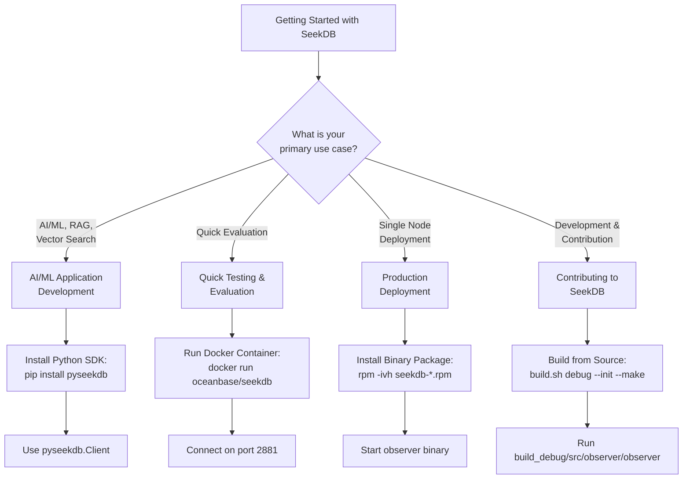
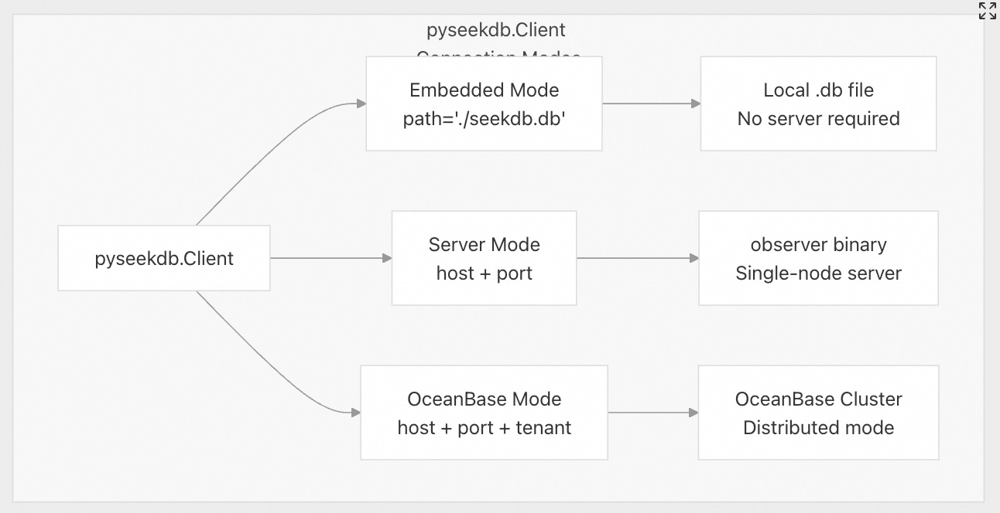
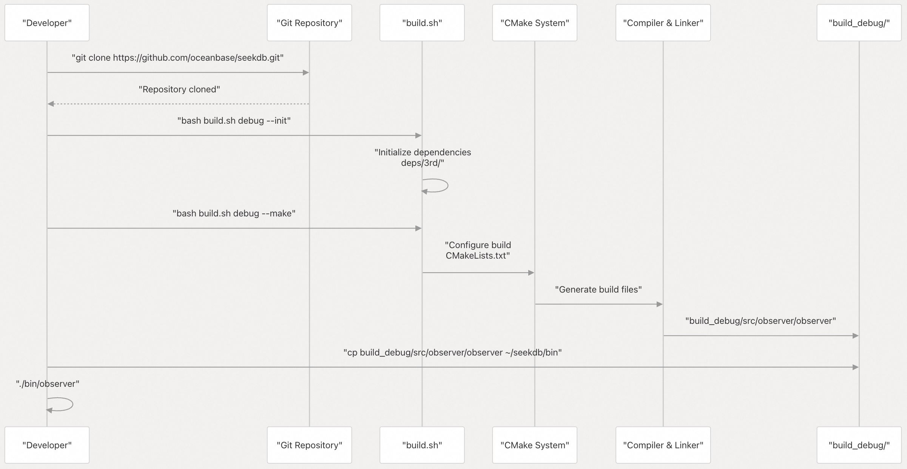
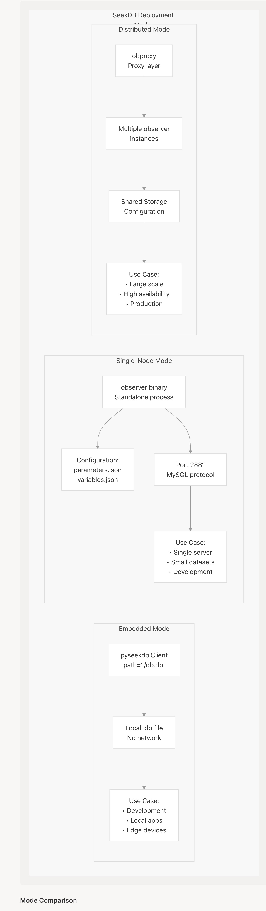
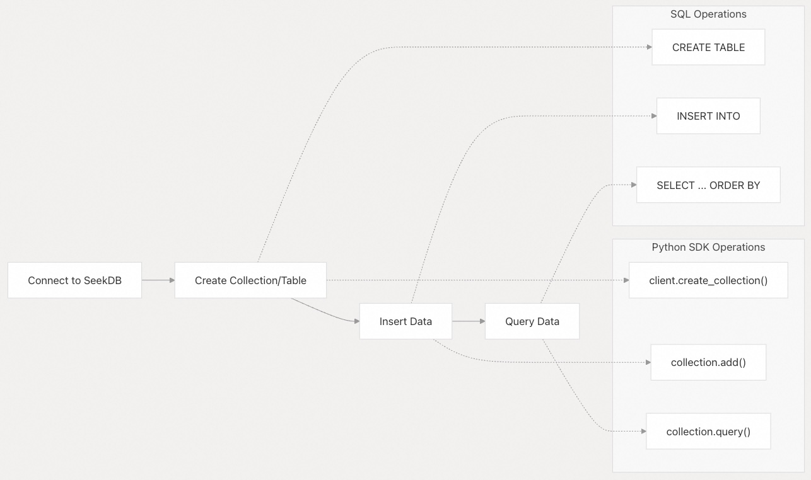
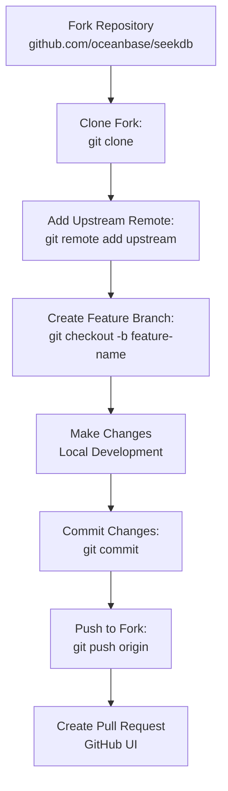
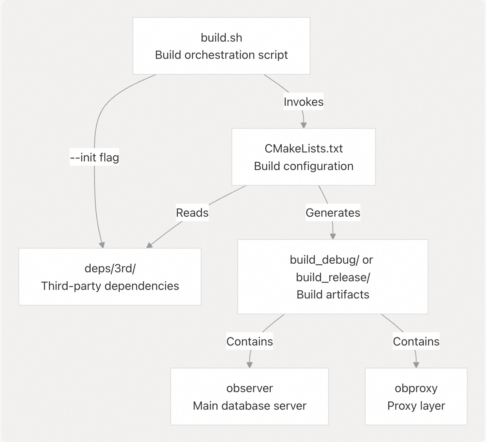

## SeekDB 源码学习: 2 快速入门 (Getting Started)  
                      
### 作者                      
digoal                      
                      
### 日期                      
2025-11-25                      
                      
### 标签                      
SeekDB , OceanBase , AI Native 数据库 , 向量搜索 , 语义搜索 , 关键词搜索 , 全文检索 , 标量搜索 , 混合搜索 , AI 搜索 , AI in Database , 多模态 , 源码学习                       
                      
----                      
                      
## 背景                      
本文为新的开发者和用户提供了开始使用 OceanBase SeekDB 的全面指南。它涵盖了在不同部署场景下安装、配置和开始使用 SeekDB 所需的基本步骤。  
  
## 安装方法概述 (Installation Methods Overview)  
  
SeekDB 支持多种安装方法，以适应不同的用例和部署要求。下表总结了可用的选项：  
  
| 方法 | 用例 (Use Case) | 安装时间 (Installation Time) | 资源要求 (Resource Requirements) | 最佳适用对象 (Best For) |  
| :--- | :--- | :--- | :--- | :--- |  
| **Python SDK** | AI/ML 应用, 原型开发 (prototyping) | \< 1 分钟 | 最低 (Minimal) | 数据科学家 (Data scientists), AI 开发者 (AI developers) |  
| **Docker** | 快速测试, 开发 (development) | 2-3 分钟 | 适中 (Moderate) | 评估, 隔离测试 (isolated testing) |  
| **二进制包 (Binary) (RPM/DEB)** | 独立部署 (Standalone deployment) | 5 分钟 | 适中 (Moderate) | 生产单节点 (Production single-node) |  
| **源码构建 (Source Build)** | 开发 (Development), 定制 (customization) | 15-30 分钟 | 高 (High) | 贡献者 (Contributors), 定制构建 |  
  
**来源:**  
[`README.md` 88-124](https://github.com/oceanbase/seekdb/blob/8c4654f1/README.md#L88-L124)  
  
-----  
  
## 安装路径决策流程 (Installation Path Decision Flow)  
  
下图展示了如何根据您的要求选择合适的安装方法：  
  

  
**来源:**  
[`README.md` 88-124](https://github.com/oceanbase/seekdb/blob/8c4654f1/README.md#L88-L124) [`README.md` 457-472](https://github.com/oceanbase/seekdb/blob/8c4654f1/README.md#L457-L472)  
  
-----  
  
## 快速入门：Python SDK (推荐用于 AI/ML)  
  
Python SDK (`pyseekdb`) 提供了使用 SeekDB 构建 AI 应用的最快路径。它包括嵌入式数据库能力 (embedded database capabilities)，并支持所有部署模式 (deployment modes)。  
  
### 安装 (Installation)  
```bash  
pip install -U pyseekdb  
```  
  
### Python SDK 的部署模式 (Deployment Modes)  
  
Python SDK 通过 `pyseekdb.Client` 类支持三种部署模式：  
  
  
  
**来源:**  
[`README.md` 154-180](https://github.com/oceanbase/seekdb/blob/8c4654f1/README.md#L154-L180)  
  
### 基本用法示例 (Basic Usage Example)  
  
以下示例演示了 AI 驱动的语义搜索 (semantic search) 的核心工作流程：  
  
```python  
import pyseekdb  
  
# Connect to embedded database (no server required)  
client = pyseekdb.Client(  
    path="./seekdb.db",  
    database="test"  
)  
  
# Create collection with automatic embedding  
collection = client.create_collection(  
    name="my_collection"  
)  
  
# Add documents (embeddings auto-generated)  
collection.add(  
    ids=["id1", "id2", "id3"],  
    documents=[  
        "Machine learning is a subset of artificial intelligence",  
        "Vector databases enable semantic search",  
        "Neural networks are inspired by the human brain"  
    ]  
)  
  
# Query using natural language  
results = collection.query(  
    query_texts="artificial intelligence",  
    n_results=2  
)  
```  
  
**来源:**  
[`README.md` 139-256](https://github.com/oceanbase/seekdb/blob/8c4654f1/README.md#L139-L256)  
  
-----  
  
## 快速入门：Docker (快速测试)  
  
Docker 提供了一个隔离环境，用于测试 SeekDB，而无需进行系统范围的安装。  
  
### 运行 SeekDB 容器 (Running SeekDB Container)  
  
```bash  
docker run -d \
  --name seekdb \
  -p 2881:2881 \
  -v ./data:/var/lib/oceanbase/store \
  oceanbase/seekdb:latest  
```  
  
### 连接详情 (Connection Details)  
  
| 参数 (Parameter) | 值 (Value) | 描述 (Description) |  
| :--- | :--- | :--- |  
| **端口 (Port)** | `2881` | 兼容 MySQL 协议的端口 (MySQL protocol compatible port) |  
| **默认用户 (Default User)** | `root` | 管理用户 (Administrative user) |  
| **默认密码 (Default Password)** | (空) | 默认无密码 |  
| **数据卷 (Data Volume)** | `/var/lib/oceanbase/store` | 持久化存储位置 (Persistent storage location) |  
  
### 连接到 Docker 实例 (Connecting to Docker Instance)  
  
启动容器后，使用标准的 MySQL 客户端或 Python SDK 进行连接：  
  
```python  
import pyseekdb  
  
client = pyseekdb.Client(  
    host="127.0.0.1",  
    port=2881,  
    database="test",  
    user="root",  
    password=""  
)  
```  
  
**来源:**  
[`README.md` 103-111](https://github.com/oceanbase/seekdb/blob/8c4654f1/README.md#L103-L111) [`README.md` 163-170](https://github.com/oceanbase/seekdb/blob/8c4654f1/README.md#L163-L170)  
  
-----  
  
## 快速入门：二进制包安装 (Binary Installation)  
  
二进制包 (Binary packages) 为支持的 Linux 发行版上的生产环境提供了独立部署 (standalone deployment)。  
  
### 安装命令 (Installation Command)  
  
```bash  
# Install RPM package (CentOS/RHEL)  
rpm -ivh seekdb-1.x.x.x-xxxxxxx.el8.x86_64.rpm  
```  
  
### 启动 Observer  
  
安装后，`observer` 二进制文件是主要的数据库服务器进程：  
  
```bash  
# Start observer in working directory  
mkdir ~/seekdb  
cd ~/seekdb  
observer  
```  
  
**来源:**  
[`README.md` 116-123](https://github.com/oceanbase/seekdb/blob/8c4654f1/README.md#L116-L123)  
  
-----  
  
## 快速入门：从源代码构建 (Building from Source)  
  
从源代码构建对于需要定制 (customize) SeekDB 的贡献者 (contributors) 和开发者至关重要。  
  
### 构建工作流 (Build Workflow)  
  
  
  
### 构建命令 (Build Commands)  
  
```bash  
# Clone repository  
git clone https://github.com/oceanbase/seekdb.git  
cd seekdb  
  
# Initialize dependencies and build  
bash build.sh debug --init --make  
  
# Copy binary to working directory  
mkdir -p ~/seekdb/bin  
cp build_debug/src/observer/observer ~/seekdb/bin  
  
# Run observer  
cd ~/seekdb  
./bin/observer  
```  
  
**重要注意事项 (Important Notes)：**  
  
  * 使用一个全新的目录作为工作目录（例如，`~/seekdb`）  
  * `--init` 标志用于下载和初始化 `deps/3rd/` 中的第三方依赖 (third-party dependencies)  
  * `--make` 标志用于编译源代码  
  * 调试构建 (Debug builds) 包含用于开发的符号；生产环境请使用 `build.sh release`  
  
**来源:**  
[`README.md` 457-472](https://github.com/oceanbase/seekdb/blob/8c4654f1/README.md#L457-L472) [`CONTRIBUTING.md` 164-177](https://github.com/oceanbase/seekdb/blob/8c4654f1/CONTRIBUTING.md#L164-L177)  
  
-----  
  
## 部署模式 (Deployment Modes)  
  
SeekDB 支持三种部署模式，每种模式都有不同的配置要求：  
  
  
  
### 模式对比 (Mode Comparison)  
  
| 模式 (Mode) | 组件 (Components) | 配置 (Configuration) | 可扩展性 (Scalability) | 复杂性 (Complexity) |  
| :--- | :--- | :--- | :--- | :--- |  
| **嵌入式 (Embedded)** | 仅 Python SDK | `.db` 文件路径 | 仅限于单个进程 (single process) | 最低 (Minimal) |  
| **单节点 (Single-Node)** | `observer` 二进制文件 | `parameters.json`, `variables.json` | 仅垂直扩展 (Vertical scaling only) | 低 (Low) |  
| **分布式 (Distributed)** | `observer` + `obproxy` | 共享存储配置 (Shared storage config) | 水平扩展 (Horizontal scaling) | 高 (High) |  
  
**来源:**  
[`README.md` 154-180](https://github.com/oceanbase/seekdb/blob/8c4654f1/README.md#L154-L180) High-Level Architecture Diagram 4  
  
-----  
  
## 基本操作 (Basic Operations)  
  
### 创建和访问数据 (Creating and Accessing Data)  
  
连接到 SeekDB 后，基本工作流程包括创建集合 (`COLLECTION`)（Python SDK）或表 (`TABLE`)（SQL），插入数据和查询。  
  
  
  
### SQL 示例 (SQL Example)  
  
SeekDB 支持标准 SQL (Structured Query Language)，并扩展了向量操作 (vector operations)：  
  
```sql  
-- Create table with vector column  
CREATE TABLE articles (  
    id INT PRIMARY KEY,  
    title TEXT,  
    content TEXT,  
    embedding VECTOR(384)  
);  
  
-- Create vector index  
CREATE INDEX idx_vector ON articles USING VECTOR (embedding);  
  
-- Hybrid search query  
SELECT title,   
       embedding <-> '[query_vector]' AS distance,  
       MATCH(content) AGAINST('keywords') AS text_score  
FROM articles  
WHERE MATCH(content) AGAINST('keywords')  
ORDER BY distance ASC  
LIMIT 10;  
```  
  
**来源:**  
[`README.md` 263-295](https://github.com/oceanbase/seekdb/blob/8c4654f1/README.md#L263-L295)  
  
-----  
  
## 贡献者的 GitHub 工作流 (GitHub Workflow for Contributors)  
  
如果您计划为 SeekDB 贡献代码，请遵循 fork-and-pull 工作流：  
  

  
### 设置命令 (Setup Commands)  
  
```bash  
# Fork repository on GitHub, then clone  
git clone https://github.com/<your-username>/seekdb.git  
cd seekdb  
  
# Add upstream remote  
git remote add upstream https://github.com/oceanbase/seekdb.git  
  
# Create feature branch  
git fetch upstream  
git checkout upstream/develop -b my-feature-branch  
  
# Make changes, then commit and push  
git add .  
git commit -m "Description of changes"  
git push origin my-feature-branch  
```  
  
**来源:**  
[`CONTRIBUTING.md` 74-123](https://github.com/oceanbase/seekdb/blob/8c4654f1/CONTRIBUTING.md#L74-L123)  
  
-----  
  
## 配置文件 (Configuration Files)  
  
SeekDB 使用 JSON 配置文件用于独立部署 (standalone) 和共享存储部署 (shared storage deployments)：  
  
| 配置类型 (Configuration Type) | 文件位置 (File Locations) | 目的 (Purpose) |  
| :--- | :--- | :--- |  
| **独立参数 (Standalone Parameters)** | `standalone/parameters.json` | 单节点系统参数 (System parameters for single-node) |  
| **独立变量 (Standalone Variables)** | `standalone/variables.json` | 单节点会话变量 (Session variables for single-node) |  
| **共享存储参数 (Shared Storage Parameters)** | `shared_storage/parameters.json` | 分布式系统参数 (System parameters for distributed) |  
| **共享存储变量 (Shared Storage Variables)** | `shared_storage/variables.json` | 分布式会话变量 (Session variables for distributed) |  
  
  
  
-----  
  
## 测试您的安装 (Testing Your Installation)  
  
安装后，验证 SeekDB 是否正常工作：  
  
### 使用 Python SDK (Using Python SDK)  
  
```python  
import pyseekdb  
  
# Test connection  
client = pyseekdb.Client(path="./test.db", database="test")  
  
# Create test collection  
collection = client.create_collection(name="test_collection")  
  
# Verify collection creation  
collections = client.list_collections()  
print(f"Created collections: {collections}")  
  
# Cleanup  
client.delete_collection("test_collection")  
```  
  
### 使用 SQL (Using SQL)  
  
```bash  
# Connect using MySQL client  
mysql -h 127.0.0.1 -P 2881 -u root  
  
# Test basic operations  
CREATE DATABASE test;  
USE test;  
CREATE TABLE test_table (id INT PRIMARY KEY, data TEXT);  
INSERT INTO test_table VALUES (1, 'test data');  
SELECT * FROM test_table;  
```  
  
**来源:**  
[`README.md` 139-256](https://github.com/oceanbase/seekdb/blob/8c4654f1/README.md#L139-L256)  
  
-----  
  
## 构建系统组件 (Build System Components)  
  
下图显示了构建系统组件之间的关系：  
  
  
  
**来源:**  
[`README.md` 457-472](https://github.com/oceanbase/seekdb/blob/8c4654f1/README.md#L457-L472) [`CONTRIBUTING.md` 164-177](https://github.com/oceanbase/seekdb/blob/8c4654f1/CONTRIBUTING.md#L164-L177)  
  
-----  
  
## 后续步骤 (Next Steps)  
  
完成初始设置后，请阅读后续文档：  
  
1.  **开发环境 (Development Environment)** - 使用 Dev Containers 设置一个完整的容器化开发环境。  
2.  **从源代码构建 (Building from Source)** - 了解构建选项、编译器标志和高级配置。  
3.  **部署策略 (Deployment Strategies)** - 了解生产部署、扩展和配置管理。  
4.  **贡献 (Contributing)** - 学习如何贡献代码、报告问题和参与社区。  
5.  **架构 (Architecture)** - 了解 SeekDB 组件的内部架构。  
6.  **测试 (Testing)** - 为您的更改编写和运行测试。  
  
**来源:**  
[`README.md` 1-486](https://github.com/oceanbase/seekdb/blob/8c4654f1/README.md#L1-L486) [`CONTRIBUTING.md` 1-252](https://github.com/oceanbase/seekdb/blob/8c4654f1/CONTRIBUTING.md#L1-L252)  
  
-----  
  
# 附录1: 部署模式的未来扩展与数据迁移问题 (Scaling & Migration)  
  
SeekDB 提供了**嵌入式**、**单节点**和**分布式**三种模式，其中嵌入式和单节点模式入门快，但分布式模式才支持**水平扩展**。  
  
**❓ 关键问题：**  
  
如何安全、平滑地将基于 **Python SDK 嵌入式模式** 或 **二进制包单节点模式** 部署的数据和业务，迁移到支持 **水平扩展**（Horizontal Scaling）的 **分布式模式** 中？是否存在官方推荐的迁移工具或操作步骤，以保证在业务增长时，能够以最小的停机时间和数据风险完成模式升级？  
  
> *（背景痛点：用户总是从易到难开始，但业务增长后必须考虑扩展性。从 SQLite 嵌入式或单机模式到分布式集群的迁移，往往是最大的运维挑战。）*  
  
## 回答  
  
  
您询问的是如何将 SeekDB 从**嵌入式模式**或**单节点模式**迁移到**分布式模式**以支持水平扩展。  
  
## 核心发现  
  
根据代码库分析,**SeekDB 本身不支持分布式模式**。  这是一个关键限制。  
  
从功能对比表可以看到:  
- **SeekDB**: ✅ 嵌入式, ✅ 单节点, ❌ 分布式  
- **OceanBase**: ❌ 嵌入式, ✅ 单节点, ✅ 分布式    
  
## 迁移路径  
  
要实现水平扩展,您需要从 **SeekDB 迁移到 OceanBase**,而不是在 SeekDB 内部升级模式。  
  
### 技术原因  
  
SeekDB 是 OceanBase 的轻量化版本,专门优化用于单节点和嵌入式场景。  它继承了 OceanBase 的核心引擎,但移除了分布式能力以降低复杂度。  
  
### 连接兼容性  
  
好消息是两者之间有良好的兼容性:  
  
**Python SDK 支持三种连接模式:**  
  
1. **嵌入式模式** (SeekDB):  
```python  
client = pyseekdb.Client(path="./seekdb.db", database="test")  
```    
  
2. **服务器模式** (SeekDB 单节点):  
```python  
client = pyseekdb.Client(host="127.0.0.1", port=2881, database="test", user="root", password="")  
```    
  
3. **OceanBase 模式** (分布式):  
```python  
client = pyseekdb.Client(host="127.0.0.1", port=2881, tenant="test", database="test", user="root", password="")  
```    
  
关键区别是 OceanBase 模式需要指定 `tenant` 参数。    
  
## 迁移建议  
  
### 数据迁移  
  
由于 SeekDB 和 OceanBase 都支持 MySQL 协议,您可以使用标准的 MySQL 数据迁移工具:  
  
1. **mysqldump** 导出 SeekDB 数据  
2. 导入到 OceanBase 集群  
3. 修改应用连接参数,添加 `tenant` 参数  
  
  
  
### 应用层改动  
  
应用代码改动最小化 - 只需修改 `pyseekdb.Client` 的连接参数,从嵌入式/服务器模式切换到 OceanBase 模式。  
  
## Notes  
  
**重要限制**: 代码库中没有找到官方的自动化迁移工具或详细的迁移文档。这个迁移过程需要手动规划和执行。  
  
SeekDB 的设计定位就是轻量级单节点场景,如果业务增长需要水平扩展,架构设计上就需要切换到 OceanBase 分布式版本。这不是一个简单的"模式升级",而是产品切换。  
  
建议在业务规划初期就考虑未来的扩展需求,如果预期会需要分布式能力,可以直接从 OceanBase 单节点开始,避免后期迁移成本。  
  
  
  
-----  
  
# 附录2: 生产环境关键配置项与动态调整问题 (Production Configuration & Maintenance)  
  
对于使用**二进制包**或**源码构建**的生产单节点部署，需要配置 `parameters.json` 和 `variables.json`。生产环境的稳定性和性能依赖于正确的配置。  
  
**❓ 关键问题：**  
  
对于一套高可用的 **单节点生产环境**，`parameters.json` 和 `variables.json` 中哪些 **关键配置项**（例如，内存限制、并发连接数、存储路径、日志/监控级别）是保障系统性能和稳定性的**必调项**？这些配置项是否支持像 OceanBase 那样在 `observer` 进程运行时进行 **动态修改**？  
  
> *（背景痛点：配置错误是导致生产系统不稳定的主要原因。了解哪些参数是核心，以及它们是否支持热更新，是运维人员日常维护的关键动作。）*  
  
## 回答  
  
您询问的是 SeekDB (OceanBase 的一个分支) 中用于生产单节点部署的关键配置参数，特别是 `parameters.json` 中的必调项以及它们是否支持动态修改。  
  
## 关键配置项  
  
根据代码中的参数定义，以下是生产环境的核心配置项：  
  
### 1. 内存相关配置  
  
- **`memory_limit`**: 内部使用的内存大小，0 表示使用 `memory_limit_percentage`    
- **`memory_limit_percentage`**: 内存使用百分比，范围 [10, 95]，默认 80%    
- **`system_memory`**: 系统保留内存，不能分配给租户    
  
### 2. 存储路径配置  
  
- **`data_dir`**: 数据文件目录，默认 "store"    
- **`redo_dir`**: redo/clog 文件目录    
- **`datafile_size`**: 数据文件大小，默认 2G    
- **`datafile_maxsize`**: 数据文件最大大小，默认 1T    
  
### 3. 网络与并发配置  
  
- **`rpc_port`**: RPC 端口，默认 2882    
- **`mysql_port`**: MySQL 连接端口，默认 2881    
- **`net_thread_count`**: RPC/MySQL I/O 线程数，0 表示 max(6, CPU_NUM/8)    
- **`cpu_count`**: CPU 数量，0 表示自动检测    
  
### 4. 日志与监控配置  
  
- **`syslog_level`**: 日志级别，默认 "WDIAG"，可选 DEBUG/TRACE/WDIAG/EDIAG/INFO/WARN/ERROR    
- **`max_syslog_file_count`**: 最大日志文件数，默认 4    
- **`enable_sql_audit`**: 是否开启 SQL 审计，默认 true    
  
### 5. 性能调优配置  
  
- **`workers_per_cpu_quota`**: 每 CPU 配额的工作线程比例，范围 [2,20]，默认 10    
- **`cache_wash_threshold`**: 触发缓存淘汰的剩余内存阈值，默认 64M    
  
## 动态修改支持  
  
**是的，大部分参数支持动态修改**。从代码中可以看到，几乎所有关键参数都标记为 `EditLevel::DYNAMIC_EFFECTIVE`，这意味着它们可以在运行时动态修改并立即生效。  
  
例如：  
- 内存配置：`memory_limit`、`memory_limit_percentage` 都是 `DYNAMIC_EFFECTIVE`    
- 日志级别：`syslog_level` 是 `DYNAMIC_EFFECTIVE`    
- 并发配置：`workers_per_cpu_quota` 是 `DYNAMIC_EFFECTIVE`    
  
**只读参数**（`EditLevel::READONLY`）包括：  
- `data_dir`、`redo_dir`：存储路径必须在启动前配置    
- `devname`：网络适配器名称    
  
## 配置方式  
  
从命令行解析器可以看到，参数可以通过以下方式配置：    
  
```  
--parameter <key=value>  # 可多次指定  
```  
  
## Notes  
  
- `variables.json` 对应的是系统变量（system variables），主要用于 SQL 层面的配置，与 `parameters.json`（系统参数）是两个不同的配置体系  
- 静态参数（`STATIC_EFFECTIVE`）如 `net_thread_count` 需要重启才能生效    
- 生产环境建议根据实际硬件资源调整 `memory_limit_percentage`、`datafile_maxsize`、`cpu_count` 等核心参数  
  
  
  
  
-----  
  
# 附录3: 核心功能：向量索引的 SQL 语法与性能调优 (Vector Indexing & Usage)  
  
SeekDB 的核心价值在于其对 AI/ML 的支持以及**向量操作**，但《快速入门》只提供了创建 `COLLECTION` 或 `TABLE` 的基本流程。  
  
**❓ 关键问题：**  
  
SeekDB 如何在 SQL 层面支持 **高性能的语义搜索**？具体来说，如何定义和创建用于加速 **向量相似度查询**（Vector Similarity Query）的 **向量索引**（Vector Index，例如 HNSW、IVFFlat 等索引类型），以及执行这些查询的 **具体 SQL 扩展语法** 是什么？  
  
> *（背景痛点：用户使用 SeekDB 的目的就是为了高效的向量搜索。了解如何在数据库中创建和使用向量索引，是开发者使用 SeekDB 核心功能的**日常操作**和性能调优的基础。）*  
  
  
## 回答  
  
您询问的是 SeekDB 如何在 SQL 层面支持**向量索引的创建**和**向量相似度查询**的具体语法。  
  
## 向量索引创建语法  
  
SeekDB 支持在 `CREATE TABLE` 语句中直接定义向量索引。 语法格式如下:  
  
```sql  
CREATE TABLE table_name (  
    id INT PRIMARY KEY,  
    embedding VECTOR(dimension),  
    VECTOR INDEX index_name (column_name) WITH(  
        DISTANCE=distance_type,  
        TYPE=index_type,  
        LIB=library  
    )  
) ORGANIZATION = HEAP;  
```    
  
### 关键参数说明  
  
- **`VECTOR(dimension)`**: 定义向量列,指定维度(最高支持 16,000 维)    
- **`DISTANCE`**: 距离计算方式,支持 `l2`(L2距离)、`inner_product`(内积)、`cosine`(余弦相似度)    
- **`TYPE`**: 索引类型,支持 `hnsw`(HNSW索引)、`ivf`(IVF索引)    
- **`LIB`**: 向量库实现,如 `vsag`    
  
### 完整示例    
  
这个示例创建了一个包含向量列和 HNSW 索引的表,使用 L2 距离计算。  
  
## 向量相似度查询语法  
  
SeekDB 提供了距离函数来执行向量相似度查询:  
  
```sql  
SELECT   
    title,  
    content,  
    l2_distance(embedding, '[query_vector]') AS vector_distance  
FROM articles  
ORDER BY vector_distance APPROXIMATE  
LIMIT 10;  
```    
  
### 关键语法特性  
  
1. **距离函数**: `l2_distance(vector_column, query_vector)` 计算 L2 距离    
2. **`APPROXIMATE` 关键字**: 在 `ORDER BY` 子句中使用,启用近似最近邻搜索以提升性能    
3. **查询向量格式**: 使用字符串格式 `'[0.1, 0.2, ...]'` 表示向量    
  
## 混合搜索示例  
  
SeekDB 支持向量搜索与全文搜索的混合查询:    
  
这个查询同时使用了:  
- 全文搜索过滤 (`MATCH ... AGAINST`)    
- 向量相似度排序 (`ORDER BY vector_distance APPROXIMATE`)    
  
## Python SDK 中的向量索引  
  
在 Python SDK (`pyseekdb`) 中,向量索引会自动创建。 Collection 的底层表结构包含:    
  
SDK 会自动为 `embedding` 列创建 `VECTOR INDEX`,无需手动指定索引参数。    
  
## 代码层实现  
  
在代码层面,SeekDB 支持多种向量索引类型的准备和扫描:  
  
- **HNSW 索引**: `prepare_hnsw_vector_index_scan()`    
- **IVF 索引**: `prepare_ivf_vector_index_scan()`    
- **SPIV 索引**: `prepare_spiv_vector_index_scan()`    
  
向量查询条件通过 `set_vector_query_condition()` 设置,包括查询向量、限制数量、HNSW 的 `ef_search` 参数等。    
  
## Notes  
  
- SeekDB 的向量索引创建语法是 MySQL 的扩展,使用 `VECTOR INDEX ... WITH(...)` 子句  
- 支持精确最近邻和近似最近邻搜索(通过 `APPROXIMATE` 关键字控制)    
- 向量数据实时写入后立即可查,基于 LSM-Tree 存储架构    
- 完整的测试示例可参考 `package/wheel/seekdb_test.py`,展示了如何创建包含向量索引的表并执行混合搜索    
  
  
  
-----  
  
# 附录4: 索引的哪些参数将影响搜索性能? 这些参数的最佳实践是什么?  
  
## 回答  
您询问的是 SeekDB 向量索引中哪些参数会影响搜索性能，以及这些参数的最佳实践。  
  
## 影响搜索性能的关键参数  
  
根据代码实现，SeekDB 支持的向量索引参数主要分为 **HNSW 索引参数**和 **IVF 索引参数**两类。    
  
### HNSW 索引参数  
  
#### 1. **M** (图连接度)  
- **作用**: 控制 HNSW 图中每个节点的最大连接数    
- **取值范围**: 5-128    
- **默认值**: 16    
- **性能影响**:   
  - 更大的 M 值提高召回率但增加内存占用和构建时间  
  - 更小的 M 值减少内存但可能降低查询质量  
  
#### 2. **EF_CONSTRUCTION** (构建时搜索深度)  
- **作用**: 索引构建时的搜索候选列表大小    
- **取值范围**: 5-1000    
- **默认值**: 200    
- **约束条件**: 必须大于 M 值    
- **性能影响**:   
  - 更大的值提高索引质量但增加构建时间  
  - 只影响构建阶段，不影响查询性能  
  
#### 3. **EF_SEARCH** (查询时搜索深度)  
- **作用**: 查询时的搜索候选列表大小    
- **取值范围**: 1-1000    
- **默认值**: 64    
- **性能影响**:   
  - **这是影响查询性能最关键的参数**  
  - 更大的值提高召回率但增加查询延迟  
  - 可以在查询时动态调整    
  
### IVF 索引参数  
  
#### 1. **NLIST** (聚类中心数量)  
- **作用**: IVF 索引的聚类中心（倒排列表）数量    
- **取值范围**: 1-65536    
- **默认值**: 128    
- **性能影响**:   
  - 更多的聚类中心提高查询精度但增加内存和构建时间  
  - 推荐值约为 `sqrt(数据量)`  
  
#### 2. **SAMPLE_PER_NLIST** (每个聚类的采样数)  
- **作用**: 训练聚类中心时每个聚类的采样向量数    
- **取值范围**: 1-INT64_MAX    
- **默认值**: 256    
- **性能影响**: 影响聚类质量，进而影响查询召回率  
  
#### 3. **M** (IVF_PQ 的子向量数)  
- **作用**: 对于 IVF_PQ 索引，将向量分割成 M 个子向量    
- **取值范围**: 1-65536，且必须能被向量维度整除    
- **性能影响**:   
  - 更多的子向量提高精度但增加计算开销  
  - 更少的子向量减少内存占用但降低精度  
  
## 查询时动态参数  
  
### **EF_SEARCH** (查询时可调)  
可以在查询时通过 SQL 动态指定，覆盖索引默认值:    
  
```sql  
SELECT * FROM table   
ORDER BY l2_distance(embedding, '[...]') APPROXIMATE   
WITH (EF_SEARCH=100)  
LIMIT 10;  
```  
  
### **REFINE_K** (结果精炼倍数)  
用于 HNSW_BQ 和 IPIVF 索引，控制精炼阶段的候选数量:    
- **取值范围**: 1.0-1000.0  
- **作用**: 先检索 `k * refine_k` 个候选，再精炼到 k 个结果  
  
### **DROP_RATIO_SEARCH** (稀疏向量剪枝比例)  
用于稀疏向量索引，控制查询时的维度剪枝:    
- **取值范围**: 0.0-0.9  
- **作用**: 丢弃权重较小的维度以加速查询  
  
## 最佳实践建议  
  
### HNSW 索引调优  
  
1. **构建阶段**:  
   - `M=16-32`: 平衡内存和召回率的推荐范围  
   - `EF_CONSTRUCTION=200-400`: 更大的数据集使用更大的值  
   - 确保 `EF_CONSTRUCTION > M`    
  
2. **查询阶段**:  
   - 从 `EF_SEARCH=64` 开始测试  
   - 如果召回率不足，逐步增加到 100-200  
   - 监控查询延迟，找到延迟和召回率的平衡点  
  
3. **内存优化**:  
   - 使用 `HNSW_SQ` (标量量化) 或 `HNSW_BQ` (二值量化) 减少内存占用    
  
### IVF 索引调优  
  
1. **NLIST 选择**:  
   - 小数据集 (< 100万): `NLIST=128-512`  
   - 中等数据集 (100万-1000万): `NLIST=1024-4096`  
   - 大数据集 (> 1000万): `NLIST=8192-65536`  
  
2. **量化策略**:  
   - `IVF_FLAT`: 无压缩，最高精度，最大内存  
   - `IVF_SQ8`: 8位标量量化，4倍压缩  
   - `IVF_PQ`: 乘积量化，更高压缩比    
  
3. **训练数据**:  
   - 确保 `NLIST * SAMPLE_PER_NLIST` 不超过总数据量  
   - 验证不会溢出: `NLIST * SAMPLE_PER_NLIST < INT64_MAX`    
  
### 通用建议  
  
1. **距离度量选择**:    
   - `L2`: 欧氏距离，适用于大多数场景  
   - `COSINE`: 余弦相似度，适用于归一化向量  
   - `INNER_PRODUCT`: 内积，适用于已归一化的向量  
  
2. **索引类型选择**:  
   - 数据量 < 100万 且对延迟敏感: 使用 HNSW  
   - 数据量 > 100万 且内存受限: 使用 IVF_SQ8 或 IVF_PQ  
   - 需要实时更新: HNSW 更适合增量写入  
  
3. **性能监控**:  
   - 使用 `ob_hnsw_ef_search` 会话变量查看当前 EF_SEARCH 值    
   - 通过 `APPROXIMATE` 关键字启用近似搜索以提升性能    
  
## Notes  
  
- 所有参数的默认值都经过优化，适用于大多数场景    
- 查询时参数 (`EF_SEARCH`, `REFINE_K`, `DROP_RATIO_SEARCH`) 可以动态调整，无需重建索引    
- HNSW_BQ 索引仅支持 L2 距离    
- 完整的参数验证逻辑在 `check_index_param()` 函数中实现    
  
    
#### [PolarDB 学习图谱](https://www.aliyun.com/database/openpolardb/activity "8642f60e04ed0c814bf9cb9677976bd4")
  
  
#### [PostgreSQL 解决方案集合](../201706/20170601_02.md "40cff096e9ed7122c512b35d8561d9c8")
  
  
#### [德哥 / digoal's Github - 公益是一辈子的事.](https://github.com/digoal/blog/blob/master/README.md "22709685feb7cab07d30f30387f0a9ae")
  
  
#### [About 德哥](https://github.com/digoal/blog/blob/master/me/readme.md "a37735981e7704886ffd590565582dd0")
  
  

  
