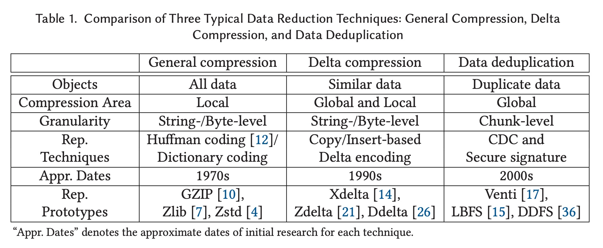
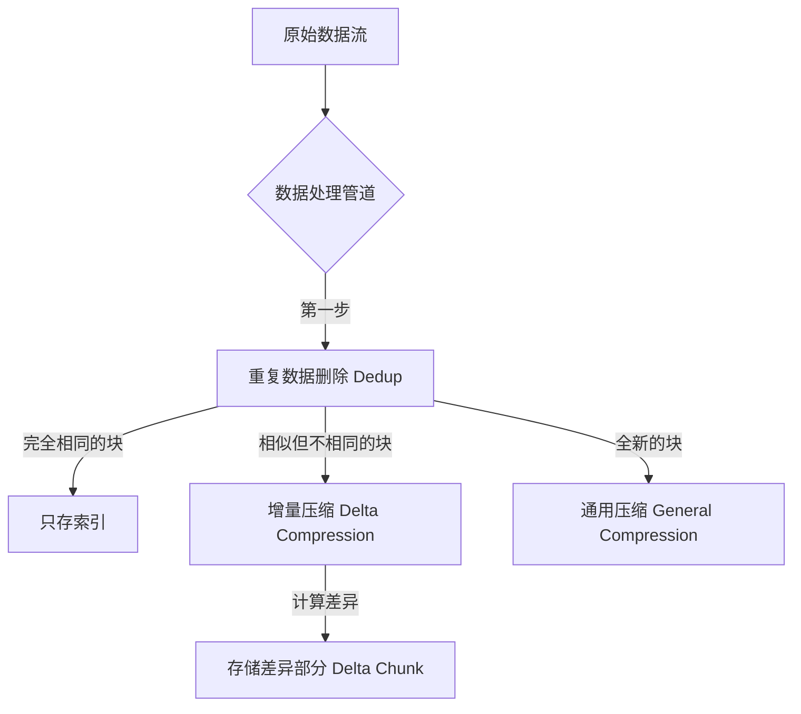
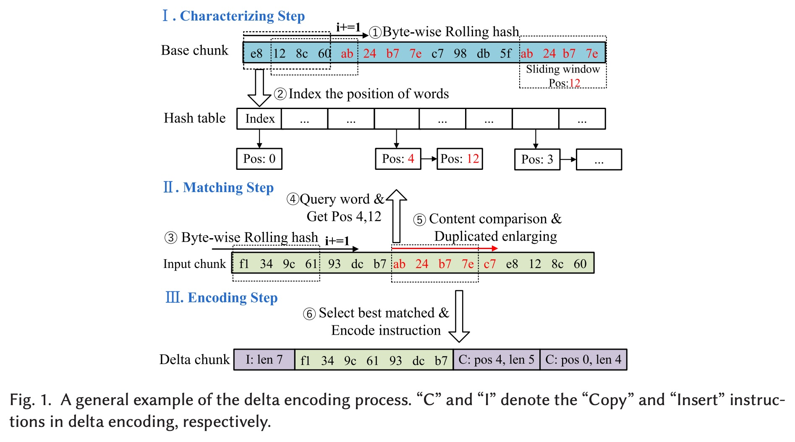
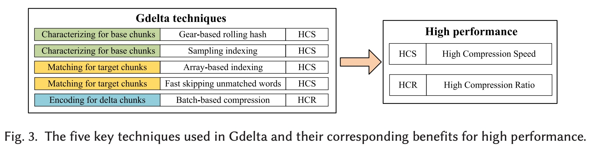
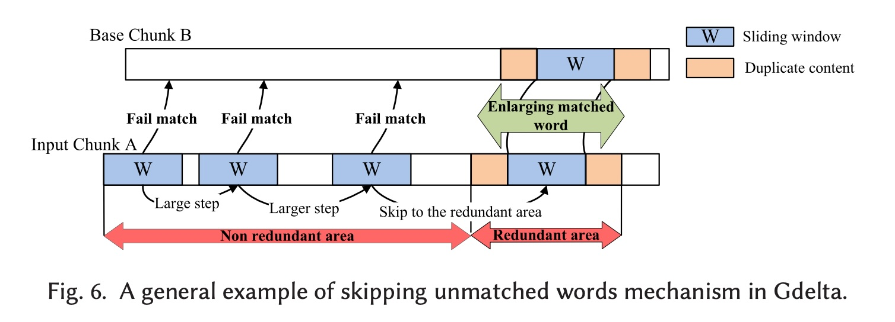
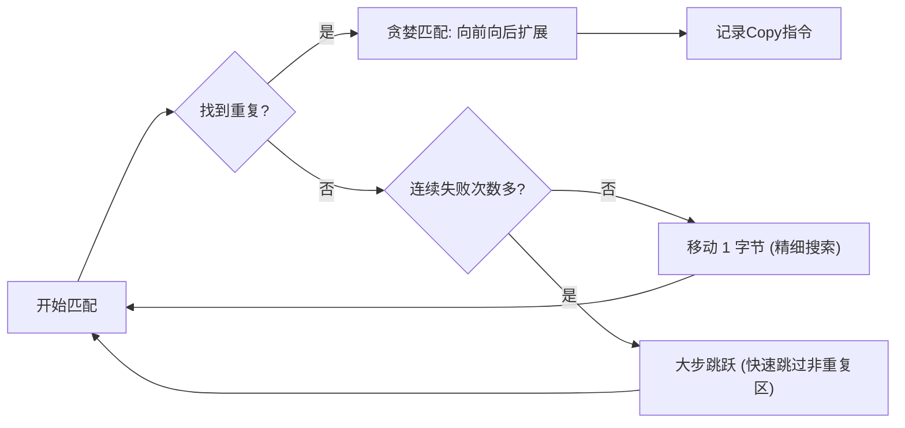
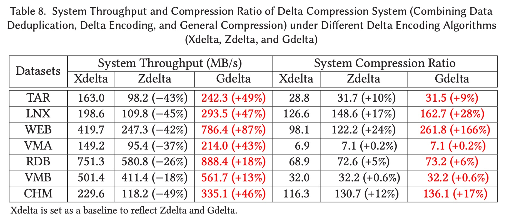
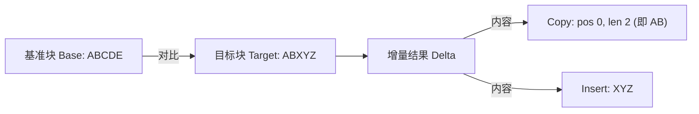

## AI论文解读 | The Design of Fast Delta Encoding for Delta Compression Based Storage Systems
        
### 作者        
digoal        
        
### 日期        
2025-11-26        
        
### 标签        
PostgreSQL , PolarDB , DuckDB , AI , 论文解读        
        
----        
        
## 背景  
      
https://dl.acm.org/doi/pdf/10.1145/3664817        
  
提示:          
```          
读懂《The Design of Fast Delta Encoding for Delta Compression Based Storage Systems》这篇论文需要提前掌握哪些基础知识, 请使用中文通熟易懂的讲解这些基础知识, 可以引用论文中的图、表或使用Markdown支持的图形(text,mermaid等)增加解释性. 
  
使用中文通熟易懂的解读《The Design of Fast Delta Encoding for Delta Compression Based Storage Systems》这篇论文, 其中的关键内容请着重讲解, 可以引用论文中的图、表或使用Markdown支持的图形(text,mermaid等)增加解释性. 
  
提取《The Design of Fast Delta Encoding for Delta Compression Based Storage Systems》这篇论文中的重要术语, 使用中文对这些术语进行通熟易懂的讲解, 可以引用论文中的图、表或使用Markdown支持的图形(text,mermaid等)增加解释性. 
```     
  
## 1 前置知识 
  
这篇论文《The Design of Fast Delta Encoding for Delta Compression Based Storage Systems》讨论的是存储系统中一个非常核心且底层的技术——**增量编码（Delta Encoding）** 。

要读懂这篇文章，你需要理解存储系统如何“瘦身”（数据缩减），以及计算机如何快速找出两个文件之间的“不同之处”。

以下是为你整理的通俗易懂的基础知识指南，结合了论文中的图表概念：

-----

### 1\. 数据缩减的“三驾马车”

首先，你需要搞清楚 **增量压缩（Delta Compression）** 在整个数据缩减技术栈中的位置。论文的 `Table 1` 对此做了非常清晰的分类 。    

你可以把存储系统的“瘦身”过程想象成三个层级：

1.  **通用压缩 (General Compression):**

      * **通俗理解:** 像 `WinRAR` 或 `Zip`。它只盯着当前文件看，把文件内部重复的字符串（比如连续的“AAAA”）变短。
      * **特点:** 粒度非常细（字节级），压缩率高，但通常只在单个文件内有效 。
      * *常见算法:* Huffman, LZ77, Zstd (论文后面会用到 Zstd)。

2.  **重复数据删除 (Data Deduplication, Dedup):**

      * **通俗理解:** 像网盘的“秒传”功能。系统把大文件切成很多**数据块 (Chunks)** （比如 8KB 一个块）。如果两个文件有完全相同的块，系统只存一份，大家共享引用 。
      * **特点:** 粒度较粗（块级），速度快，适合全局去重。

3.  **增量压缩 (Delta Compression):**

      * **通俗理解:** 这是本文的主角。如果 Dedup 发现两个块**非常相似但又不完全一样**（比如你修改了 Word 文档里的几个字），Dedup 就没法去重了。这时增量压缩登场，它以一个块为**基准 (Base)** ，只记录另一个块 **(Target)** 相对于基准的**差异 (Delta)** 。
      * **特点:** 填补了通用压缩和 Dedup 之间的空白。

**基础概念图解：**



-----

### 2\. 增量编码的核心流程：Copy 与 Insert

读懂论文的核心逻辑，必须理解“如何描述差异”。这主要依赖于两个指令： **Copy（复制）** 和 **Insert（插入）** 。

  * **场景:** 假设基准块 A 内容是 `ABCDEFG`，目标块 B 内容是 `ABCXYZFG`。
  * **处理:**
    1.  机器扫描 B，发现 `ABC` 在 A 里有 -\> **指令: Copy (位置0, 长度3)** 。
    2.  机器发现 `XYZ` 在 A 里没有 -\> **指令: Insert (内容"XYZ")** 。
    3.  机器发现 `FG` 在 A 里有 -\> **指令: Copy (位置5, 长度2)** 。

**论文图解辅助 (Figure 1):**    
请看论文的 **Figure 1** 。

  * **Base chunk:** 基准数据。
  * **Input chunk (Target):** 待压缩数据。
  * **Delta chunk:** 结果。你可以看到 `C: pos 4, len 5` 这样的指令，这就是在告诉解码器：“去基准块的第4个位置，复制5个字节过来” 。

-----

### 3\. 滑动窗口与滚动哈希 (Rolling Hash)

这是论文中最硬核的算法基础。机器怎么知道 `ABC` 在基准块里出现过？它不能像人眼一样一扫就看出来，它需要**比对**。

#### 什么是滑动窗口 (Sliding Window)？

为了找到重复部分，计算机会在这个文件上放一个固定大小的“框”（窗口），比如 64 字节宽。它把框里的内容算出一个指纹（Hash），然后拿去比对。如果没匹配上，框就向右移动 1 个字节，继续算，继续比。

#### 为什么需要滚动哈希 (Rolling Hash)？

  * **笨办法 (普通 Hash):** 每次窗口移动 1 个字节，都要把窗口里所有 64 个字节重新读一遍算出 Hash。这太慢了！
  * **聪明办法 (滚动 Hash):** 窗口向右移一格时，其实只有**最左边的一个字节出去了**，**最右边的一个新字节进来了**，中间的 63 个字节没变。
      * *原理:* `新Hash = 旧Hash - 移出的字节 + 移进的字节` (简化版逻辑)。这样计算量极小 。

**文中对比了两种滚动哈希：**

1.  **Adler32:** 经典的，但计算量相对较大（乘法、加法较多）。
2.  **Gear Hash:** 论文推崇的。它用一个预先生成好的随机数表（Gear array）来映射字节，计算非常快（主要是位移和加法），就像齿轮咬合一样简单 。

> **阅读提示:** 当你在论文中看到 `Gear-based rolling hash` 时，只要知道它是一个**极速计算窗口指纹**的算法即可。

-----

### 4\. 索引结构：哈希表 (Hash Table) vs. 数组 (Array)

算出了指纹，要去哪里查“有没有重复”呢？这需要一个索引。

  * **哈希表 (Hash Table):**
      * **类似:** 字典。
      * **优点:** 精确，能处理冲突（如果两个不同的词指纹一样，它会拉个链表都存下来，叫链地址法）。
      * **缺点:** 慢。需要申请内存、要在链表里一个个找 。文中提到 Zdelta 就用这个。
  * **数组 (Array):**
      * **类似:** 一个巨大的置物架，每个格子有编号。
      * **优点:** 极快。直接跳到某个编号的格子里看。
      * **缺点:** 如果两个指纹算出同一个位置（冲突），新的直接覆盖旧的，可能会漏掉一些匹配机会 。
      * **论文观点:** 论文提出的 Gdelta 选择用**数组**，因为虽然可能漏掉一点点匹配，但速度快太多了，整体划算 。

-----

### 5\. 所有的“Delta”家族简谱

论文中会反复对比几个算法，你需要知道它们的人设：

| 算法名称 | 核心特点 | 优缺点 (论文观点) |
| :--- | :--- | :--- |
| **Xdelta** | 经典老牌 | 压缩率高，但用 Adler32 哈希，速度慢 。 |
| **Zdelta** | 压缩率之王 | 用哈希表找得最细，还用了 Huffman 再次压缩，但最慢 。 |
| **Ddelta / Edelta** | 急脾气 | 为了快，不用逐字节滑动窗口，而是切成大块比对。速度极快，但压缩率惨不忍睹 。 |
| **Gdelta (本文)** | 平衡大师 | 用 Gear 哈希(快) + 数组索引(快) + 智能跳过(快) + Zstd 后期压缩(高压缩率) 。 |

-----

### 6\. 熵编码 (Entropy Encoding)

论文提到在 `Encoding Step`（编码步骤）之后，还会进行 "batch compressing"（批量压缩），用到了 **Zstd** 或 **FSE** 。

  * **基础知识:** 在算出 Copy/Insert 指令后，生成的结果文件可能还有冗余（比如指令本身有很多重复）。
  * **熵编码:** 这就是最后一道工序的“通用压缩”。
      * **Huffman:** 传统的编码方式，常用的字符用短编码，不常用的用长编码。
      * **FSE (Finite State Entropy):** 较新的技术，比 Huffman 更快更精准 。
      * **Zstd:** Facebook 开源的压缩算法，是目前的业界顶流，兼顾了高压缩率和极快解压速度 。

-----

### 总结：读这篇论文的心理预设

当你阅读时，脑海中要时刻保持这个**处理流水线**的画面：

1.  **特征化 (Characterizing):** 用 **Gear Hash** 快速扫描基准文件，把指纹记在 **数组** 里（而不是慢吞吞的哈希表）。*注：论文还提到了采样索引，就是不全记，隔几个记一个，更省事。*
2.  **匹配 (Matching):** 扫描目标文件，去数组里查。如果发现一大段都不匹配，就**大步跳过 (Skipping)** ，别一小步一小步挪了。
3.  **编码 (Encoding):** 算出 Copy/Insert 指令后，把一堆结果打包，用 **Zstd** 再压榨一次水分。

掌握了这些，你就可以顺畅地理解论文中 Gdelta 是如何在每一个环节“偷时间”同时“保质量”的了。
  
## 2 解读论文 
  
这篇论文《The Design of Fast Delta Encoding for Delta Compression Based Storage Systems》主要解决了一个存储领域的经典难题： **如何在“压缩得更小”和“压缩得更快”之间找到完美的平衡点**。

作者团队（来自哈尔滨工业大学深圳校区和鹏城实验室）提出了一种名为 **Gdelta** 的新算法 。

以下是对这篇论文的通俗解读：

-----

### 1\. 背景：为什么需要 Gdelta？

在云存储或备份系统中，我们经常遇到“相似但不完全相同”的文件（比如你改了几个字的文档）。为了省空间，我们使用**增量压缩 (Delta Compression)** ，只存储修改过的部分。

目前的现状是“两极分化” ：

  * **高压缩率派 (如 Xdelta, Zdelta):** 干活非常细致（逐字节对比），压缩得狠，但**速度太慢**，像是用显微镜找不同。
  * **高速度派 (如 Ddelta, Edelta):** 干活粗糙（切成大块对比），速度快，但**压缩率低**，容易漏掉重复内容，像是用放大镜找不同。

**Gdelta 的目标：** 既要有高速度派的快，又要有高压缩率派的准 。

-----

### 2\. 核心原理：Gdelta 的五大“秘密武器”

Gdelta 并没有发明一种全新的魔法，而是巧妙地结合了五种技术，把每一步的性能都压榨到了极致。我们可以通过论文中的 `Figure 3` 逻辑来拆解这五大武器 。    

#### 武器一：Gear-based Rolling Hash (齿轮滚动哈希) —— “换个更快的算盘”

  * **痛点:** 以前的 Xdelta 使用 Adler32 算法来计算数据指纹，虽然经典，但计算复杂（CPU 指令多）。
  * **Gdelta 做法:** 采用 **Gear Hash**。这种算法利用预先生成的随机数表，就像齿轮咬合一样，只需要简单的加法和位移操作就能算出指纹。
  * **效果:** 速度比 Adler32 快 3.4 倍，而且通过特殊设计（反向对比去除后缀）解决了哈希冲突问题 。

#### 武器二：Sampling Indexing (采样索引) —— “不用每页都做书签”

  * **痛点:** 以前为了不错过任何重复，算法会把基准文件里的每一个“词”（滑动窗口）都记录在索引里。这导致内存访问非常频繁且随机 。
  * **Gdelta 做法:** 既然我们在找连续的重复段落，只要找到了开头或中间的一点，就能顺藤摸瓜把整段找出来。所以，Gdelta **只对一部分词建立索引**（比如每隔几个词记一次）。
  * **效果:** 大幅减少了索引构建时间和内存占用，而压缩率几乎不受影响 。

#### 武器三：Array-based Indexing (数组索引) —— “用书架代替复杂的目录”

  * **痛点:** Zdelta 使用哈希表（Hash Table）来存索引，虽然精准，但需要复杂的内存分配和链表跳转，很慢 。
  * **Gdelta 做法:** 直接使用**数组 (Array)** 。计算出哈希值后，直接对应到数组的一个位置。
  * **权衡:** 虽然数组可能会覆盖掉哈希冲突的旧数据（不像哈希表那样挂链表保留），但对于寻找“最长匹配”来说，这种极速的查表方式更划算 。

#### 武器四：Skipping Unmatched Words (跳过不匹配区域) —— “找不到就大步走”

  * **痛点:** Xdelta 如果发现当前不匹配，会只向后挪动 1 个字节再试，这在完全没有重复的区域非常浪费时间 。
  * **Gdelta 做法:** 采用**自适应步长**。
    1.  开始时小步走。
    2.  如果连续多次找不到匹配，说明这一块可能全是新的，Gdelta 就会**加大步长跳过**（Fast Skipping）。
    <!-- end list -->
      * *这与 Ddelta 的区别：* Ddelta 一直用大步长导致压缩率低，而 Gdelta 是“该细则细，该快则快” 。

**流程图解 (基于 Figure 6):**    



#### 武器五：Batch-based Compression (批量二次压缩) —— “最后再挤一次水”

  * **痛点:** 经过上面的步骤，生成了包含 Copy/Insert 指令的 Delta 文件。但这些指令本身还有压缩空间。
  * **Gdelta 做法:**
    1.  把多个 Delta 文件打包（Batch）。
    2.  使用现代超强压缩算法 **Zstd** 和 **FSE (有限状态熵编码)** 对结果进行二次压缩 。
  * **效果:** 这一步极大地提升了最终的压缩率，甚至超过了以高压缩率著称的 Zdelta 。

-----

### 3\. 性能表现：Gdelta 到底有多强？

论文在 7 个真实数据集（包括代码库、虚拟机镜像、数据库备份等）上进行了测试，结果非常显著 ：

  * **对比 Xdelta 和 Zdelta (传统强者):**

      * **速度:** 编码速度提升了 **3.5倍 到 25倍** 。
      * **压缩率:** 反而还提高了 **10% 到 240%** 。这主要归功于最后的 Zstd 二次压缩。

  * **对比 Ddelta 和 Edelta (速度强者):**

      * Gdelta 在绝大多数测试集中保持了最快的速度，同时压缩率远超它们（Ddelta/Edelta 的压缩率通常很低）。

**数据概览 (参考 Table 8):**    

| 算法 | 吞吐量 (MB/s) | 压缩效果 | 评价 |
| :--- | :--- | :--- | :--- |
| **Xdelta** | \~163 (基准) | 基准 | 慢，压缩率一般 |
| **Zdelta** | \~98 (更慢) | 比 Xdelta 好 | 为了压缩率牺牲了太多速度 |
| **Gdelta** | **\~242 (极快)** | **比 Xdelta 好 9%** | **又快又小** |

*(注：以上数据取自 TAR 数据集的测试结果示例 )*

### 4\. 总结

这篇论文的精髓在于 **“组合拳”** 。它没有为了速度而无底线地牺牲压缩率（像 Ddelta 那样），也没有为了压缩率而死磕每一个字节（像 Zdelta 那样）。

**一句话总结 Gdelta 的设计哲学：**
用最轻量的哈希算法（Gear）和最简单的索引结构（Array），配合智能的跳跃策略（Skipping）来换取极致的速度；省下来的时间，再用现代最强的通用压缩算法（Zstd）把数据压得更小。
  
## 3 术语 
  
这篇论文《The Design of Fast Delta Encoding for Delta Compression Based Storage Systems》主要探讨如何让存储系统“瘦身”得更快、更有效。

以下是论文中的核心术语解读，我将它们分为 **基础概念** 和 **Gdelta 的核心技术** 两部分进行讲解。

-----

### 一、 基础概念术语

#### 1\. Delta Encoding (增量编码) / Delta Compression (增量压缩)

  * **通俗解释：**
    想象你有一个文件（比如 Word 文档），你修改了其中的一段话保存为新版本。
      * **全量存储**：把新旧两个文件都完整存下来（浪费空间）。
      * **增量压缩**：只存储新文件相对于旧文件的**差异（Delta）** 。
        在论文中，旧文件被称为 **Base Chunk（基准块）** ，新文件被称为 **Target/Input Chunk（目标块）** 。
  * **核心指令：**
    增量编码通过两种指令来描述新文件：
      * **Copy (复制)：** “去基准块的第 X 个位置，复制长度为 Y 的数据过来” 。
      * **Insert (插入)：** “这是基准块里没有的新数据，直接插入这里” 。




#### 2\. Sliding Window (滑动窗口)

  * **通俗解释：**
    计算机不能像人眼一样一眼看出两个文件哪里像，它需要用一个“框”（窗口）在文件上移动，每次只看框里的那一小段数据（比如 64 字节） 。
  * **运作方式：**
    这个窗口在数据上 **逐字节（byte-by-byte）** 向右滑动。每滑动一次，就计算窗口内数据的特征（哈希值），用来和基准块进行比对 。

#### 3\. Rolling Hash (滚动哈希)

  * **通俗解释：**
    当滑动窗口向右移动 1 个字节时，窗口里的数据大部分（比如前 63 个字节）其实没变，只有“最左边出去了一个，最右边进来了一个”。
    **滚动哈希**是一种聪明的算法，它利用这一特点，不需要重新计算整个窗口的哈希值，而是通过简单的数学运算快速更新哈希值 。
  * **论文中的对比：**
      * **Adler32：** 传统的滚动哈希算法，计算量较大（比较慢） 。
      * **Gear Hash：** 论文采用的改进算法，像齿轮咬合一样简单，通过查表和移位操作极速计算指纹 。

-----

### 二、 Gdelta 算法的核心技术术语

#### 4\. Array-based Indexing (基于数组的索引)

  * **通俗解释：**
    为了快速找到“这段数据在基准块里出现过吗？”，需要建立一个索引。
      * **哈希表 (Hash Table)：** 以前的方法（如 Zdelta）像查字典，虽然准，但因为要处理冲突（两个词指纹一样），需要复杂的内存操作，速度慢 。
      * **数组索引 (Array-based)：** Gdelta 直接用一个大数组。算出指纹后，直接跳到数组的对应位置看一眼。虽然可能会发生覆盖（冲突），但速度极快，且在处理高相似数据时效果足够好 。

#### 5\. Sampling Indexing (采样索引)

  * **通俗解释：**
    以前的方法恨不得把基准块里的每一个位置都记在索引里（全量索引），生怕漏掉。
    Gdelta 发现，如果两段数据是重复的，只要记录其中**一部分**位置（比如每隔几个字节记一次），也能顺藤摸瓜找到整个重复段 。
  * **好处：**
    就像书的目录不需要给每一个字都标页码一样，采样索引大大减少了计算量和内存占用 。

#### 6\. Skipping Unmatched Words (跳过不匹配词)

  * **通俗解释：**
    这是一个“自适应”的加速策略。
      * **精细模式：** 开始时，窗口每次只滑 1 个字节，仔细找重复 。
      * **快速跳过：** 如果连续找了好几次都发现“这里完全不一样”，Gdelta 就会判断进入了非重复区，然后开始**大步跳跃**（比如一次跳几十个字节），而不是慢慢挪 。
  * **图解：**

<!-- end list -->

```text
数据流:  [ 找 ] [ 找 ] (失败多次...) -> [   大步跳跃   ] -> [ 找 ] (成功!)
状态:    精细搜索                      快速跳过非重复区      恢复精细搜索
```

#### 7\. Batch-based Compression (基于批量的压缩)

  * **通俗解释：**
    这是 Gdelta 的最后一步“绝招”。
    经过上面的计算，虽然已经得出了差异数据（Delta Chunk），但这些数据里可能还有啰嗦的地方。Gdelta 不会一个个处理这些小块，而是把它们 **打包（Batch）** 成一大块（比如 4MB） 。
  * **后续处理：**
    打包后，使用通用的强力压缩工具（如 **Zstd** 和 **FSE**）再压榨一次水分 。因为数据量大了，压缩算法能工作得更好，从而获得极高的压缩率 。

#### 8\. Inter-Match vs. Inner-Match

  * **通俗解释：**
      * **Inter-Match (块间匹配)：** 找 **A文件** 和 **B文件** 之间的重复内容（这是 Delta Encoding 的主要工作） 。
      * **Inner-Match (块内匹配)：** 找 **B文件自己内部** 的重复内容。Gdelta 通过最后一步的 Zstd 压缩来完成这一步 。

通过结合这些技术，Gdelta 实现了比传统方法（Xdelta/Zdelta）快 **3.5\~25倍** 的速度，同时压缩率还提高了 **10%\~240%** 。
  
## 参考        
         
https://dl.acm.org/doi/pdf/10.1145/3664817    
        
<b> 以上内容基于DeepSeek、Qwen、Gemini及诸多AI生成, 轻微人工调整, 感谢杭州深度求索人工智能、阿里云、Google等公司. </b>        
        
<b> AI 生成的内容请自行辨别正确性, 当然也多了些许踩坑的乐趣, 毕竟冒险是每个男人的天性.  </b>        
    
#### [PolarDB 学习图谱](https://www.aliyun.com/database/openpolardb/activity "8642f60e04ed0c814bf9cb9677976bd4")
  
  
#### [PostgreSQL 解决方案集合](../201706/20170601_02.md "40cff096e9ed7122c512b35d8561d9c8")
  
  
#### [德哥 / digoal's Github - 公益是一辈子的事.](https://github.com/digoal/blog/blob/master/README.md "22709685feb7cab07d30f30387f0a9ae")
  
  
#### [About 德哥](https://github.com/digoal/blog/blob/master/me/readme.md "a37735981e7704886ffd590565582dd0")
  
  

  
