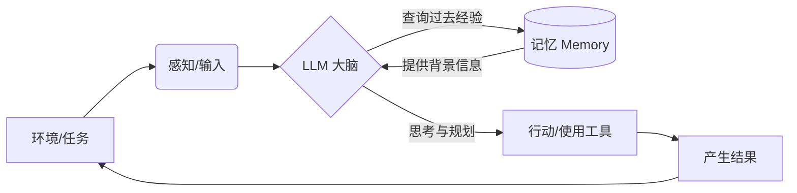
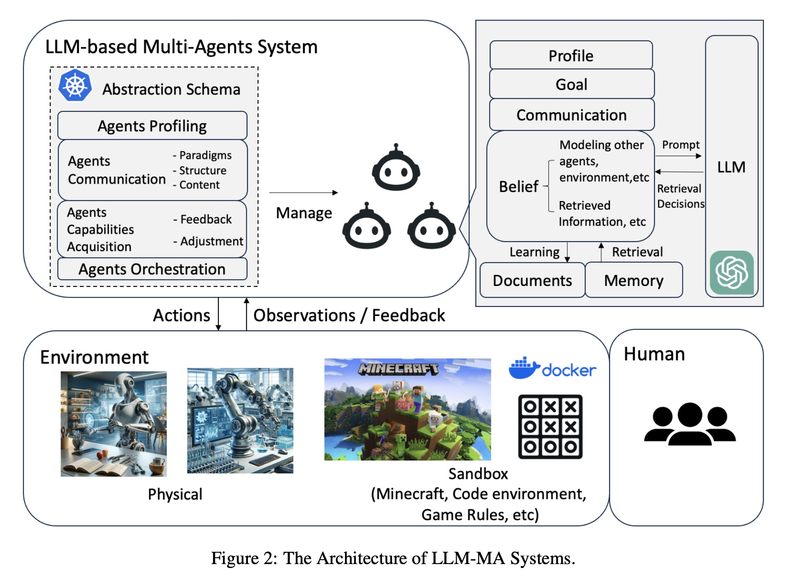
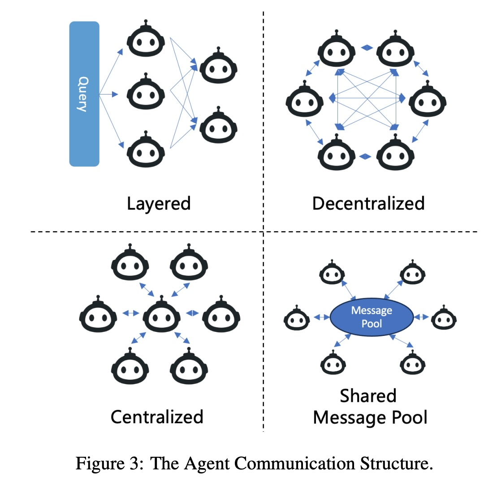
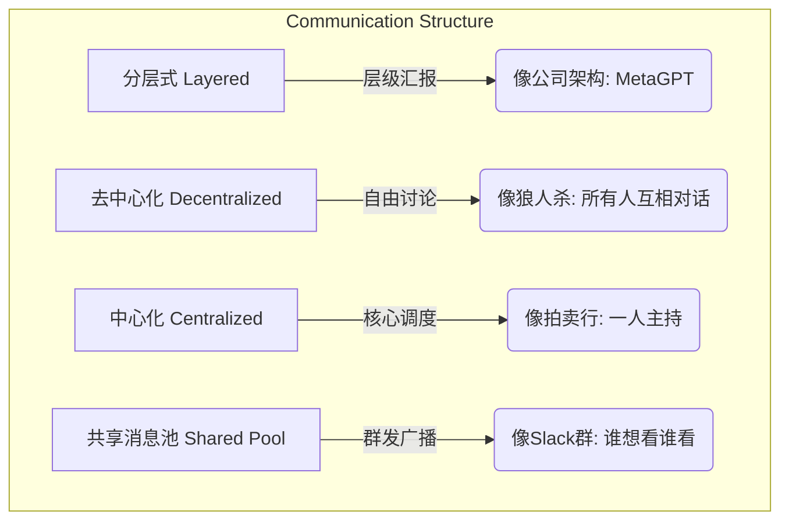
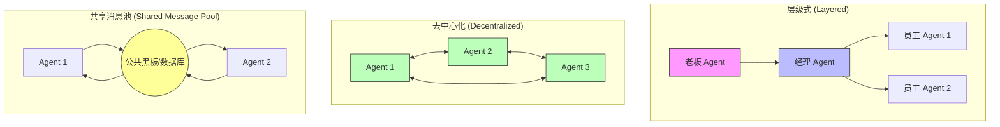

## AI论文解读 | Large Language Model based Multi-Agents: A Survey of Progress and Challenges
        
### 作者        
digoal        
        
### 日期        
2025-11-26        
        
### 标签        
PostgreSQL , PolarDB , DuckDB , AI , 论文解读        
        
----        
        
## 背景  
      
https://arxiv.org/pdf/2402.01680        
  
提示:          
```          
读懂《Large Language Model based Multi-Agents: A Survey of Progress and Challenges》这篇论文需要提前掌握哪些基础知识, 请使用中文通熟易懂的讲解这些基础知识, 可以引用论文中的图、表或使用Markdown支持的图形(text,mermaid等)增加解释性. 
  
使用中文通熟易懂的解读《Large Language Model based Multi-Agents: A Survey of Progress and Challenges》这篇论文, 其中的关键内容请着重讲解, 可以引用论文中的图、表或使用Markdown支持的图形(text,mermaid等)增加解释性. 
  
提取《Large Language Model based Multi-Agents: A Survey of Progress and Challenges》这篇论文中的重要术语, 使用中文对这些术语进行通熟易懂的讲解, 可以引用论文中的图、表或使用Markdown支持的图形(text,mermaid等)增加解释性. 
```     
  
## 1 前置知识 
  
要读懂这篇关于 **基于大语言模型的多智能体系统（LLM-based Multi-Agents）** 的综述论文，你需要先建立几个核心概念的认知。这篇论文实际上是在讨论： **当我们把多个ChatGPT这样的大脑放在一起工作时，会发生什么？**

为了让你轻松上手，我们将基础知识分为三个层级，并结合论文中的图表进行讲解。

-----

### 第一层级：核心引擎 —— 什么是 LLM（大语言模型）？

在进入“智能体”之前，你需要理解它们的“大脑”是如何运作的。

  * **基础概念**：LLM（Large Language Model）本质上是一个超级强大的“文字接龙”机器。它读了很多书，能根据上文预测下文。
  * **Prompt（提示词）** ：这是人类指挥LLM的指令。在多智能体系统中，提示词不仅仅是“写首诗”，而是变成了复杂的**角色设定**（比如：“你现在是一个严格的代码审查员”）。
  * **幻觉（Hallucination）** ：论文在挑战部分专门提到了这一点 。这是指模型一本正经地胡说八道。在多智能体系统中，如果一个“人”瞎说，可能会带偏整个团队，这是一个关键痛点。

-----

### 第二层级：从“模型”到“智能体” —— 单体智能体 (Single-Agent)

这是理解这篇论文最关键的基石。论文的 **2.1章节** 专门回顾了单体智能体 。
你可以把 **LLM** 看作只有“大脑”的人，而 **Agent（智能体）** 则是给这个大脑装上了“手”、“眼”和“记事本”。

论文主要提到了单体智能体的三个关键能力，你需要理解它们：

1.  **规划与思考 (Planning/Decision-making)** ：

      * **通俗解释**：遇到复杂问题（比如“把大象装冰箱”），智能体不会直接傻眼，而是懂得拆解步骤：①打开门 ②放进去 ③关门。
      * **关键术语**： **CoT (Chain-of-Thought，思维链)** 。指让AI把思考过程写出来，比如“因为A所以B”，这样能极大提高准确率。

2.  **工具使用 (Tool-use)** ：

      * **通俗解释**：LLM数学不好或不知道今天天气，它懂得“调用计算器”或“上网搜索”。这就是智能体的“手”。

3.  **记忆 (Memory)** ：

      * **通俗解释**：LLM原本是聊完就忘的（像金鱼）。智能体通过引入数据库（向量数据库）作为长期记忆，能记住几天前的交互或学到的经验。

**可以用一个简单的 Mermaid 图来理解单体智能体的循环：**



-----

### 第三层级：从“独行侠”到“团队” —— 多智能体系统 (Multi-Agents)

这正是这篇论文的主题。你需要理解为什么有了超级厉害的单个AI，我们还需要一群AI？

#### 1\. 为什么要组队？ (Single vs. Multi)

论文 **2.2章节**  解释了区别。

  * **单体局限**：一个AI再强，它的角色是单一的。
  * **多体优势**：就像一家软件公司，不能只有程序员，还需要产品经理、测试员。多智能体系统通过 **分工（Specialization）** 和**协作（Collaboration）** 来解决更复杂的任务 。

#### 2\. 它们怎么协作？ (论文核心框架图解)

论文中的 **Figure 2**  展示了多智能体系统的解剖图。你需要理解图中这四个关键词（也是论文第3章的重点）：    

  * **A. 智能体画像 (Profiling)** ：

      * **含义**：给每个AI发“身份证”和“职位描述”。
      * **例子**：在这个系统中，Agent A被设定为“激进的辩论者”，Agent B被设定为“和事佬”。

  * **B. 沟通 (Communication)** ：

      * 这是多智能体的灵魂。你需要了解几种基本的沟通模式（论文Figure 3  展示了这些结构）：    
          * **合作 (Cooperative)** ：大家齐心协力写代码。
          * **辩论 (Debate)** ：针对一个数学题，两个AI互相找茬，最后得出真理。
          * **竞争 (Competitive)** ：像玩《狼人杀》游戏，通过欺骗和推理获胜。

  * **C. 环境 (Environment)** ：

      * AI们在哪“活”着？
      * **Sandbox (沙盒)** ：虚拟世界，比如Minecraft游戏或者代码编译器 。
      * **Physical (物理世界)** ：控制真实的机器人手臂 。
      * **None (纯对话)** ：比如纯粹的圆桌会议讨论 。

  * **D. 能力获取 (Capabilities Acquisition/Feedback)** ：

      * 团队如何变强？通过**反馈循环**。
      * 比如Agent A写了代码，Environment（编译器）报错了，或者Agent B（测试员）骂它写得烂，Agent A就会根据这个**Feedback**进行自我修正 。

-----

### 总结：读这篇论文前，你脑海里应该有这样一个画面

想象一个**虚拟的会议室**：

1.  **入场 (Profiling)** ：进来了三个AI，一个是懂历史的教授，一个是懂数据的分析师，一个是主持人。
2.  **任务 (Goal)** ：你要他们预测未来经济走势。
3.  **单体能力 (Single Agent)** ：每个AI都有自己的记事本（Memory）和上网工具（Tool）。
4.  **协作 (Multi-Agent)** ：教授提出观点，分析师用数据反驳（Communication: Debate），主持人总结。
5.  **进化 (Learning)** ：如果预测错了，系统会给他们反馈，他们把这个教训写在记事本里，下次不再犯（Feedback & Adjustment）。

带着这个“虚拟会议室”的画面去读这篇论文的各个章节（比如应用在软件开发、游戏、社会模拟中），你会发现它变得非常容易理解。
  
## 2 解读论文 
  
这是一篇非常详尽的综述文章，题为《基于大语言模型的多智能体系统：进展与挑战》（Large Language Model based Multi-Agents: A Survey of Progress and Challenges）。

简单来说，这篇论文研究的是： **既然单个 ChatGPT 已经很强了，如果把一群 ChatGPT 放在一起（扮演不同角色）互相协作，能碰撞出什么火花？**

以下是为您整理的通俗易懂的深度解读，分为核心架构、关键应用、常用工具和未来挑战四个部分。

-----

### 一、 核心概念：为什么需要“多智能体”？

**1. 从“单打独斗”到“团队协作”**

  * **单体智能体 (Single-Agent)** ：就像一个全能型人才，它有大脑（LLM）、会用工具、有记忆。但它的能力有限，只能扮演一个角色 。
  * **多智能体 (Multi-Agents)** ：就像一个公司。它把复杂的任务拆解，分配给不同的“专才”。比如软件开发，不再是一个AI自己闷头写，而是分为“产品经理”、“程序员”、“测试员”三个AI互相讨论、协作 。

**2. 核心优势**
多智能体系统不仅能利用 LLM 的沟通能力，还能通过**分工**（每个AI只做自己擅长的）和**协作**（互相纠错、讨论）来解决比单个AI更复杂的问题 。

-----

### 二、 庖丁解牛：多智能体系统长什么样？

论文在**第3章**通过一张非常清晰的架构图（Figure 2）剖析了系统的四个关键组件。我们可以将其比作组建一个“虚拟团队”的四个步骤：    

#### 1\. 也是最关键的：给AI“发身份证” (Agent Profiling)

每个AI进场前，必须设定人设。论文总结了三种设定方式 ：

  * **预定义 (Pre-defined)** ：人类直接写好“你是一个严格的数学老师”。
  * **模型生成 (Model-Generated)** ：让LLM自己生成适合任务的角色。
  * **数据驱动 (Data-Derived)** ：根据真实数据集（如用户行为数据）来设定角色。

#### 2\. 给AI“找工位” (Agents-Environment Interface)

AI 在哪里工作？论文归纳了三种环境 ：

  * **沙盒 (Sandbox)** ：最常见。比如代码编译器、游戏环境（Minecraft）、或者像《狼人杀》那样的规则世界。AI可以自由尝试，错了也不怕 。
  * **物理世界 (Physical)** ：控制真实的机器人手臂或吸尘器 。
  * **无环境 (None)** ：纯粹的聊天室，大家坐下来开会辩论，不涉及外部操作 。

#### 3\. 决定“怎么沟通” (Agents Communication)

这是论文的**重点**。一群AI在一起如果不管理，就会吵成一锅粥。论文用 **Figure 3** 展示了沟通结构，我用简图为您还原：    



  * **沟通模式**主要有三种： **合作**（大家齐心协力）、**辩论**（正方反方互喷以求真理）、**竞争**（由于利益冲突互相欺骗，如游戏） 。

#### 4\. 让团队“变强” (Capabilities Acquisition)

AI 怎么进步？靠**反馈 (Feedback)** 。

  * 如果代码运行报错（环境反馈），或者被别的AI骂写得烂（同伴反馈），它就会通过**记忆**或**自我进化**来调整策略 。

-----

### 三、 实战演练：它们能干什么？

论文在**第4章**将应用分为两大类： **干活的（解决问题）** 和 **演戏的（世界模拟）** 。

#### 1\. 解决问题 (Problem Solving) —— 追求效率

这里利用的是“三个臭皮匠顶个诸葛亮”的原理。

  * **软件开发**：这是最成功的领域。比如 **MetaGPT** ，它把软件开发流程标准化（SOP），让AI分别扮演产品经理、架构师、工程师，通过流水线协作写代码，比单个AI写得更好、幻觉更少。
  * **科学辩论**：针对数学题或医疗诊断，让多个AI像医生会诊一样讨论，往往能得出更准确的结论 。
  * **具身智能**：指挥一群机器人协作搬运东西 。

#### 2\. 世界模拟 (World Simulation) —— 追求真实

这里利用的是LLM极强的“角色扮演”能力，用来推演现实世界。

  * **社会模拟**：比如斯坦福的“虚拟小镇”（Generative Agents），25个AI在一个像《模拟人生》的游戏里生活，会聚会、谈恋爱、传播八卦 。
  * **游戏**：玩《狼人杀》或《阿瓦隆》。AI学会了隐藏身份、欺骗和推理 。
  * **经济与政策**：模拟经济危机时人们会怎么做，或者模拟病毒传播时人们会不会戴口罩 。

-----

### 四、 工具与资源

如果您想自己动手玩，论文在**第5章**推荐了三个最主流的开源框架 ：

| 框架名称 | 特点 | 适合场景 |
| :--- | :--- | :--- |
| **MetaGPT** | 引入了标准化流程（SOP），像工厂流水线。 | 软件开发、复杂项目管理  |
| **AutoGen** | 微软开发，高度可定制，支持代码执行。 | 技术任务、代码生成  |
| **CAMEL** | 这里的特色是“引导式”对话，让两个AI互相聊出结果。 | 角色扮演对话、数据生成  |

-----

### 五、 还有哪些坑？（挑战）

虽然听起来很美好，但论文在**第6章**非常诚实地列出了目前的问题：

1.  **集体幻觉 (Hallucination)** ：一个AI胡说八道（幻觉）已经很麻烦了，在多智能体系统中，如果一个AI撒谎，可能会传染给其他AI，导致“三人成虎” 。
2.  **多模态的缺失 (Multi-Modal)** ：目前的协作主要靠打字（文本），还不太擅长处理图片、视频或声音的交互 。
3.  **甚至更贵了 (Scaling)** ：多几个智能体意味着要消耗成倍的算力（Token）。怎么在智能体数量增加的同时，不让成本爆炸，是一个难题 。
4.  **很难评分 (Evaluation)** ：单个AI做题可以打分，但一群AI模拟社会演变，怎么判断它们演得好不好？目前非常缺乏好的评估标准 。

-----

### 总结

这篇论文告诉我们，**LLM-based Multi-Agents (LLM-MA)** 正处于爆发期。它通过**角色分工**和**交互反馈**，让AI从“个人天才”进化为了“高效团队”。无论是想让AI哪怕是写出更好的代码（MetaGPT），还是推演复杂的社会现象（虚拟小镇），多智能体系统都是目前最有前景的方向之一。
  
## 3 术语 
  
这是一份基于论文《Large Language Model based Multi-Agents: A Survey of Progress and Challenges》的关键术语解读。

这篇论文综述了**基于大语言模型的多智能体系统（LLM-MA）** 。简单来说，就是如果不只用一个“ChatGPT”，而是让好几个“ChatGPT”组成一个团队，每个人扮演不同角色（比如一个做经理，一个做程序员，一个做测试员），它们会如何协作完成更复杂的任务？

以下是论文中的核心术语解读，配合通俗解释和图表说明：

-----

### 1\. 核心概念与架构 (Core Concepts & Architecture)

#### **LLM-based Multi-Agent Systems (LLM-MA)**

  * **术语翻译**：基于大语言模型的多智能体系统
  * **通俗解释**：这就像是一个“全由AI组成的虚拟公司”或“虚拟社会”。在这个系统中，每一个“员工”或“市民”都是一个大语言模型（LLM） 。
  * **为什么要用它**：单个AI虽然厉害，但在处理特别复杂的任务时容易出错。多智能体系统通过让AI分工合作（比如有的负责规划，有的负责执行），或者通过互相辩论来纠正错误，从而发挥出“集体智慧” 。

#### **Agents-Environment Interface (智能体-环境接口)**

  * **术语翻译**：智能体与环境的交互接口
  * **通俗解释**：这是指AI在哪儿“工作”以及它能感知到什么。AI不仅仅是在对话框里聊天，它需要通过这个接口感知外部世界并获得反馈 。
  * **分类**：
      * **Sandbox (沙盒)** ：像玩电子游戏一样的虚拟环境（例如Minecraft、代码解释器）。AI可以在这里自由实验，输了也没关系 。
      * **Physical (物理环境)** ：真实的物理世界。比如控制机器人去扫地或拿快递，需要遵守物理定律 。
      * **None (无环境)** ：纯聊天环境。比如几个AI在一起辩论一个数学题，不需要外部工具 。

#### **Agent Profiling (智能体画像/人设)**

  * **术语翻译**：智能体画像
  * **通俗解释**：给AI发一张“角色卡”。不仅仅是告诉它“你是一个AI”，而是详细定义它的**性格、技能、目标和行为准则** 。
  * **例子**：
      * 在软件开发中，一个AI的角色卡是“产品经理”，另一个是“程序员” 。
      * 在游戏狼人杀中，一个AI是“狼人”，另一个是“预言家” 。
  * **生成方式**：可以是人类预先写好的（Pre-defined），也可以是模型自己生成的（Model-Generated） 。

-----

### 2\. 智能体怎么交流？ (Communication)

论文中详细描述了AI之间是如何沟通的，这是多智能体系统的核心。

#### **Communication Paradigms (沟通范式)**

  * **通俗解释**：AI之间互动的“基调”是什么？
    1.  **Cooperative (合作型)** ：大家是队友，为了同一个目标（如写代码）互通有无 。
    2.  **Debate (辩论型)** ：像打辩论赛。针对一个问题，正方反方互相找茬，目的是为了去伪存真，得到更准确的答案 。
    3.  **Competitive (竞争型)** ：像下棋或打仗。智能体之间利益冲突，我要赢过你（例如谈判或博弈游戏） 。

#### **Communication Structure (沟通结构)**

  * **通俗解释**：团队的组织架构图。谁有权跟谁说话？
  * 为了更直观地理解，我们可以用下图表示论文中提到的几种结构 ：




  * **Layered (层级式)** ：像传统公司，一级管一级，效率高 。
  * **Decentralized (去中心化)** ：像朋友聚会，大家随意互相聊，适合模拟社会交互 。
  * **Centralized (中心化)** ：所有人都只跟一个“中枢”汇报 。
  * **Shared Message Pool (共享消息池)** ：像一个微信群或公共黑板，谁发消息大家都看得到，这能提高沟通效率（例如MetaGPT框架） 。

-----

### 3\. 智能体怎么变强？ (Capabilities Acquisition)

#### **Feedback Mechanism (反馈机制)**

  * **通俗解释**：AI怎么知道自己做对了没？
  * **来源**：
      * **Environment (环境反馈)** ：比如代码运行报错了，或者游戏里角色死掉了 。
      * **Agent Interaction (同行评审)** ：别的AI告诉你“你这个逻辑不对” 。
      * **Human (人类反馈)** ：人类直接介入指导，这叫“Human-in-the-loop” 。

#### **Self-Evolution (自我进化)**

  * **通俗解释**：AI不仅仅是记住了（Memory），而是根据反馈**修改了自己的行动策略**甚至**修改了自己的目标** 。比如一个AI销售员发现硬推销不行，于是自己决定改变策略为“先和客户交朋友”。

-----

### 4\. 两大应用方向 (Applications)

论文将应用分为两大类： **解决问题**和**模拟世界** 。

| 应用方向 | **Problem Solving (解决问题)** | **World Simulation (世界模拟)** |
| :--- | :--- | :--- |
| **核心目标** | 把活儿干好。利用集体智慧解决复杂难题。 | 看看会发生什么。模拟真实的人类社会行为。 |
| **典型案例** | **软件开发**：产品经理、架构师、工程师AI一起写软件 。<br>**科学辩论**：多个AI医生会诊，提高诊断准确率 。 | **狼人杀/阿瓦隆**：模拟欺骗与推理 。<br>**社会模拟**：模拟1000个居民的小镇，看八卦怎么传播 。<br>**经济模拟**：模拟宏观经济政策对居民的影响 。 |
| **关注点** | 结果的准确性、代码的可运行性。 | 行为的逼真度、社会现象的涌现。 |

-----

### 5\. 挑战 (Challenges)

#### **Hallucination in Multi-Agent (多智能体幻觉)**

  * **通俗解释**：单个AI会一本正经胡说八道（幻觉），在多智能体里这更可怕。
  * **连锁反应**：因为AI之间会交流，一个AI撒了谎（产生了幻觉），其他AI可能会信以为真，导致谣言在整个系统里传播，产生“级联效应” 。

#### **Agents Orchestration (智能体编排)**

  * **通俗解释**：当团队里的AI越来越多，如何管理它们成了一个大难题。
  * **挑战**：就像管理几百人的大公司，如果流程（SOP）设计得不好，AI们就会互相打架、由于沟通不畅导致效率低下。如何设计最优的“工作流”是目前的挑战 。

希望这些解释能帮助你更好地理解这篇综述论文！
  
## 参考        
         
https://arxiv.org/pdf/2402.01680    
        
<b> 以上内容基于DeepSeek、Qwen、Gemini及诸多AI生成, 轻微人工调整, 感谢杭州深度求索人工智能、阿里云、Google等公司. </b>        
        
<b> AI 生成的内容请自行辨别正确性, 当然也多了些许踩坑的乐趣, 毕竟冒险是每个男人的天性.  </b>        
    
#### [PolarDB 学习图谱](https://www.aliyun.com/database/openpolardb/activity "8642f60e04ed0c814bf9cb9677976bd4")
  
  
#### [PostgreSQL 解决方案集合](../201706/20170601_02.md "40cff096e9ed7122c512b35d8561d9c8")
  
  
#### [德哥 / digoal's Github - 公益是一辈子的事.](https://github.com/digoal/blog/blob/master/README.md "22709685feb7cab07d30f30387f0a9ae")
  
  
#### [About 德哥](https://github.com/digoal/blog/blob/master/me/readme.md "a37735981e7704886ffd590565582dd0")
  
  

  
