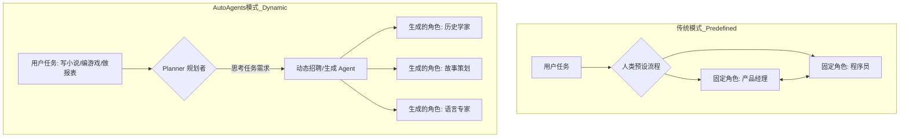
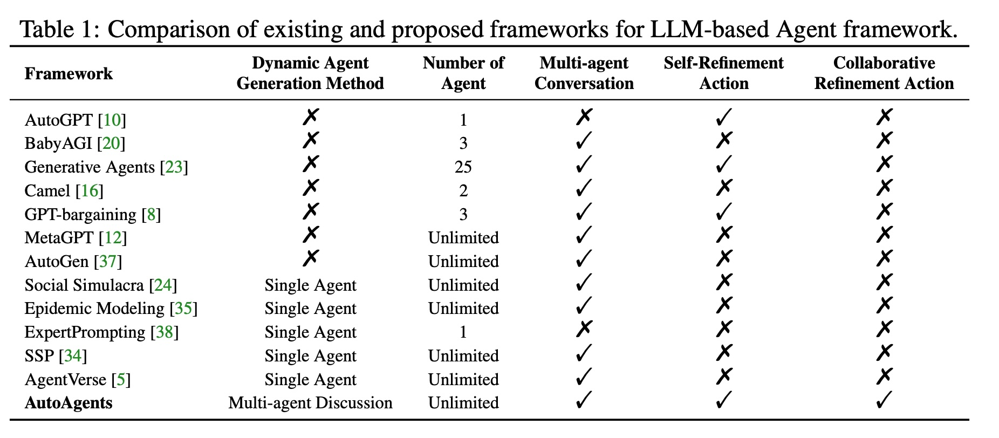
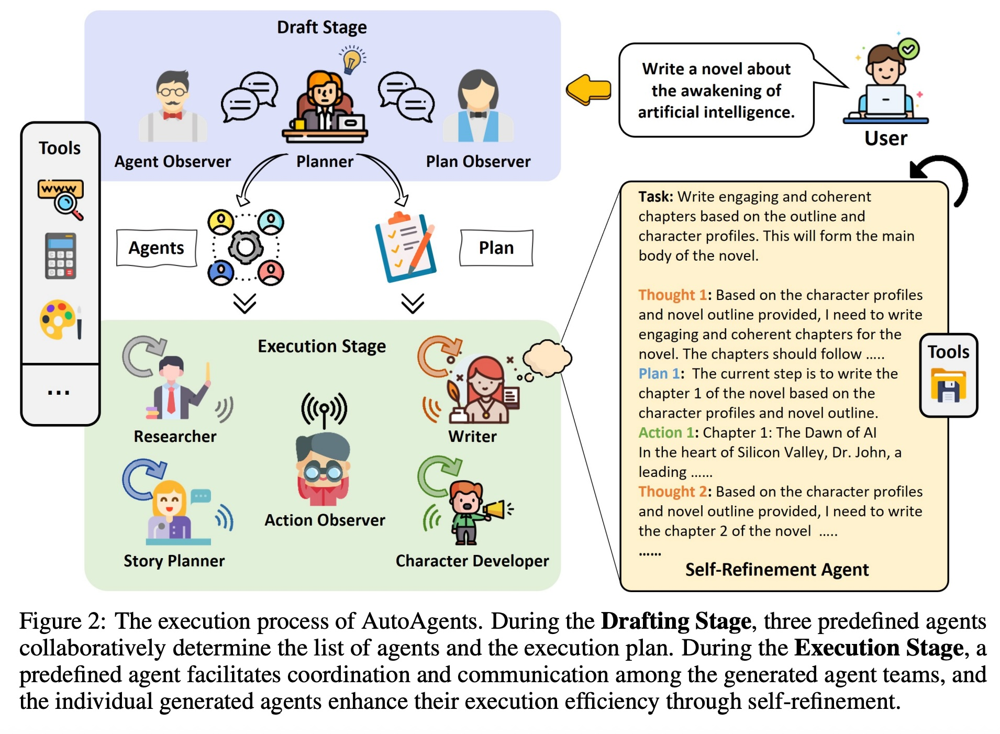
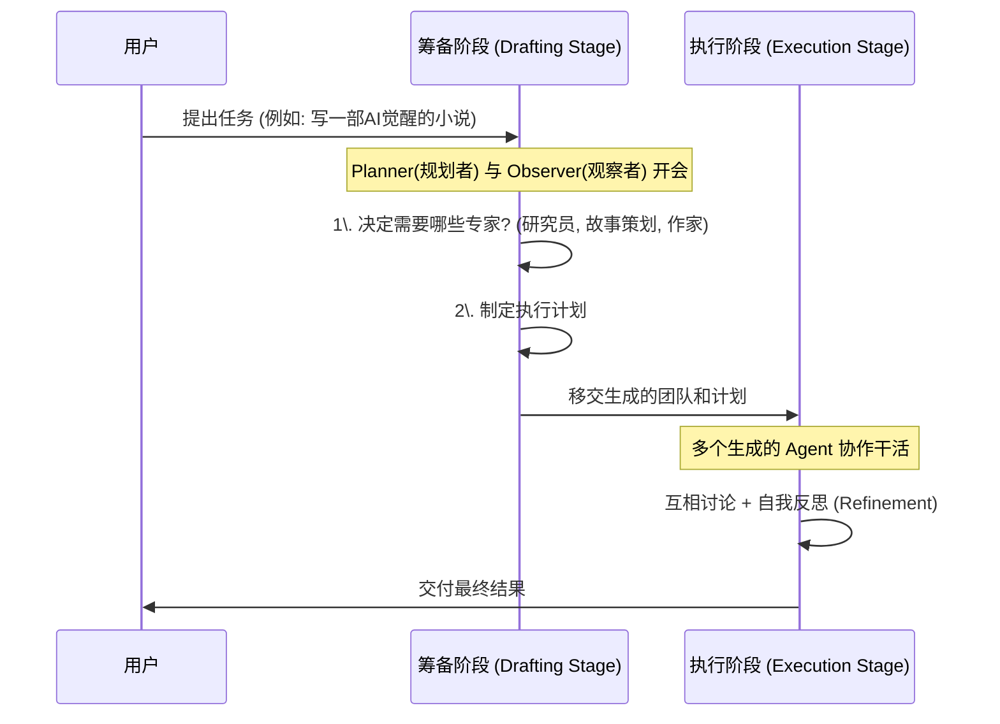
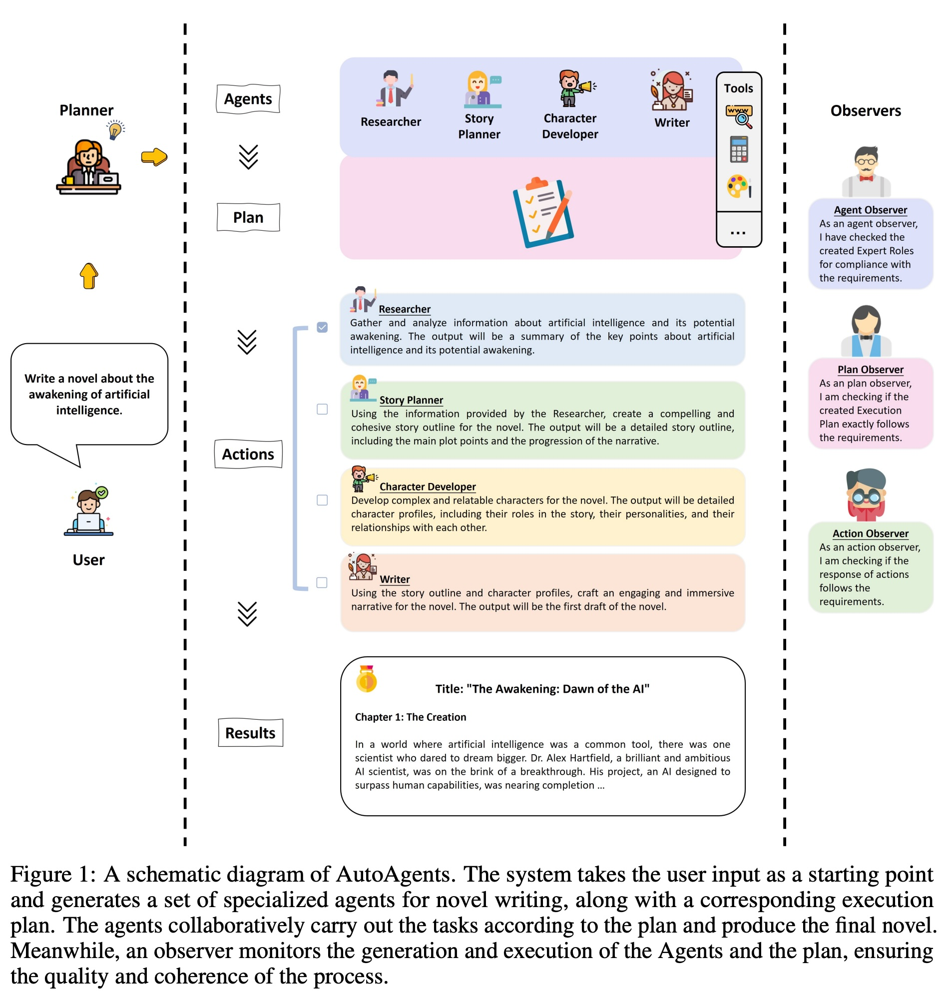
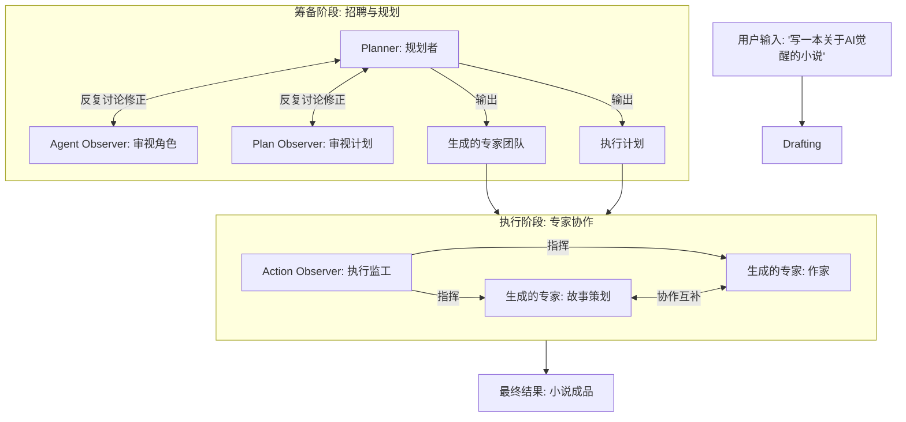
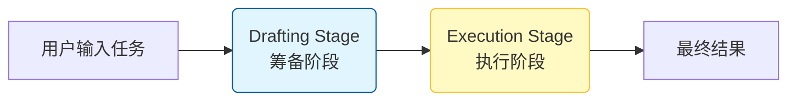

## AI论文解读 | AutoAgents: A Framework for Automatic Agent Generation
        
### 作者        
digoal        
        
### 日期        
2025-11-26        
        
### 标签        
PostgreSQL , PolarDB , DuckDB , AI , 论文解读        
        
----        
        
## 背景  
      
https://arxiv.org/pdf/2309.17288        
  
提示:          
```          
读懂《AutoAgents: A Framework for Automatic Agent Generation》这篇论文需要提前掌握哪些基础知识, 请使用中文通熟易懂的讲解这些基础知识, 可以引用论文中的图、表或使用Markdown支持的图形(text,mermaid等)增加解释性. 
  
使用中文通熟易懂的解读《AutoAgents: A Framework for Automatic Agent Generation》这篇论文, 其中的关键内容请着重讲解, 可以引用论文中的图、表或使用Markdown支持的图形(text,mermaid等)增加解释性. 
  
提取《AutoAgents: A Framework for Automatic Agent Generation》这篇论文中的重要术语, 使用中文对这些术语进行通熟易懂的讲解, 可以引用论文中的图、表或使用Markdown支持的图形(text,mermaid等)增加解释性. 
```     
  
## 1 前置知识 
  
要读懂《AutoAgents: A Framework for Automatic Agent Generation》这篇论文，你需要理解从“大语言模型”到“自主智能体（Agent）”再到“多智能体协作（Multi-Agent Collaboration）”的演进过程。

这篇论文的核心创新在于 **“动态生成（Automatic Generation）”** ——即不再是由人死板地规定谁干什么，而是由AI自己根据任务组建团队。

以下是阅读本文前需要掌握的 5 个基础知识点，配合论文内容进行通俗讲解：

### 1\. 什么是 AI Agent（人工智能体）？

**基础概念**：
普通的大语言模型（LLM）像一个“缸中之脑”，它只能回答问题。而 **Agent（智能体）** 是给这个大脑装上了“手脚”（Tools/工具）和“记事本”（Memory/记忆），让它能够自主地去完成任务。

**在论文中的体现**：
论文中提到，AutoAgents 的基础是把 LLM 作为核心控制器 。一个典型的 Agent 包含以下几个部分：

  * **角色（Profile）** ：我是谁？（例如：程序员、作家）
  * **目标（Goal）** ：我要干什么？
  * **工具（Tools）** ：我能用什么？（例如：搜索引型、代码解释器）

**通俗理解**：
如果 LLM 是一个博学的大学毕业生，Agent 就是给他发了工牌（角色）、配了电脑（工具）并安排了KPI（目标）的正式员工。

### 2\. 现有的多智能体协作模式（Multi-Agent Frameworks）

**基础概念**：
单个 Agent 能力有限，所以需要多个 Agent 像人类团队一样合作。在你阅读这篇论文前，需要知道即使是“多智能体”，也是分段位的：

  * **静态/预定义模式（Predefined）** ：大多数现有框架（如 MetaGPT, Camel）是“死板”的。人类需要提前写好代码，规定“我们需要一个产品经理和一个程序员，先A说话，后B说话” 。
  * **动态模式（Dynamic）** ：这正是 AutoAgents 解决的问题。根据任务不同，现场决定招什么人。

**图解对比**：



论文在 **Table 1** 中明确对比了 AutoAgents 和 AutoGPT、MetaGPT 等框架的区别，指出其他框架大多依赖预定义或单智能体，而 AutoAgents 支持动态多智能体讨论 。    

### 3\. 提示工程中的“角色扮演”（Role-Playing Prompting）

**基础概念**：
怎么让一个通用的 GPT-4 变成专业的“历史学家”或“Python专家”？这就需要提示工程（Prompt Engineering）。通过输入特定的指令（Prompt），让模型进入特定角色。

**在论文中的体现**：
AutoAgents 的核心黑科技在于它有一套标准化的“模版”来生成这些角色。论文中提到，Planner（规划者）会为每个生成的 Agent 生成详细的 Prompt，包含：

  * **Description（描述）** ：建立更全面的角色设定 。
  * **Constraints（约束）** ：限制角色不能做什么（防止胡言乱语）。
  * **Suggestions（建议）** ：指导具体的执行步骤 。

**通俗理解**：
这就好比 AutoAgents 是一个“导演”，它手里有无数个剧本（Prompt Templates）。当任务来了，它立刻给 GPT-4 发放不同的剧本，让它一人分饰多角，组建成一个专业的剧组。

### 4\. 思考链（Chain of Thought, CoT）与 ReAct 模式

**基础概念**：

  * **CoT**：让 AI 像人一样“把思考过程写出来”，比如“第一步我先算X，因为Y，所以第二步算Z”。
  * **ReAct (Reason + Act)** ：结合“推理”和“行动”。AI 思考 -\> 执行动作（用工具） -\> 观察结果 -\> 再思考。

**在论文中的体现**：
论文中的 **Figure 2** 展示了 Agent 如何工作：    

> "Thought 1: 基于角色档案... 我需要写第一章" -\> "Plan 1: 当前步骤是..." -\> "Action 1: 具体写内容..." 。

并且，论文强调了 **Self-Refinement（自我反思/修正）** 。如果没有 CoT 和 ReAct 的基础，你可能看不懂为什么 Agent 要在那“自言自语”而不直接给出结果。

### 5\. 观察者模式与反馈回路（Observer & Feedback Loop）

**基础概念**：
在自动化系统中，如果没人监管，AI 很容易“跑偏”或“死循环”。因此需要引入“观察者”或“评审”角色，通过反馈来修正输出。

**在论文中的体现**：
AutoAgents 设计了三个特殊的“监工”角色来确保质量 ：

1.  **Agent Observer（人事总监）** ：看招的人对不对，合不合理 。
2.  **Plan Observer（项目经理）** ：看制定的计划行不行 。
3.  **Action Observer（执行监工）** ：在干活时负责协调和检查结果 。

**论文流程图解析 (基于 Figure 2)** ：



### 总结

读这篇论文前，请在脑海中建立这样一个场景：
你不再是自己在用 ChatGPT（单智能体），你也不是在运行一个死板的程序（传统软件）。你是在经营一家**AI 外包公司**。

  * 客户扔进来一个任务。
  * 你的 **CEO (Planner)** 先分析任务。
  * 你的 **HR (Agent Observer)** 现场从人才库（LLM）里“捏”出几个专家。
  * 你的 **PM (Plan Observer)** 制定时间表。
  * 最后大家在 **工头 (Action Observer)** 的带领下干活。

理解了这个“公司运营”的隐喻，AutoAgents 的架构图（Figure 1 和 Figure 2）就会变得非常容易理解。      
  
## 2 解读论文 
  
这就为您解读这篇论文。为了让您轻松理解，我们可以把 **AutoAgents** 想象成一家 **“超级外包公司”** 。

普通的 AI 就像一个全能但很累的自由职业者，什么都得自己干。而 **AutoAgents** 则是一个能够**自动根据任务招募团队、制定计划并监工**的智能系统。

以下是《AutoAgents: A Framework for Automatic Agent Generation》的核心解读：

-----

### 1\. 核心痛点与解决方案

  * **痛点**：目前市面上大多数多智能体（Multi-Agent）框架（如 MetaGPT, AutoGPT）都是 **“预定义”** 的。也就是人类必须提前写死：“解决这个问题需要一个产品经理和一个程序员”。但任务千变万化，死板的配置无法应对复杂的新场景 。
  * **解决方案 (AutoAgents)** ：提出了 **“自动代理生成”** 框架。它不预设角色，而是根据用户的任务（比如“写小说”或“编贪吃蛇游戏”），现场动态生成最适合的专家团队和执行计划 。

-----

### 2\. AutoAgents 是如何工作的？（核心架构）

整个工作流程分为两个阶段： **筹备阶段（Drafting Stage）** 和 **执行阶段（Execution Stage）** 。我们可以将其看作是“组建剧组”和“正式拍戏”的过程 。

#### 阶段一：筹备阶段 (Drafting Stage) —— 组建梦之队

在这个阶段，系统里有三个**预设的**核心高管在开会讨论 ：

1.  **Planner (规划者/CEO)** ：负责分析用户任务，起草需要招聘哪些专家（Agent）以及具体的执行计划 。
2.  **Agent Observer (人事总监)** ：专门负责审核“招聘名单”。它会检查生成的专家角色是否合理、是否缺人、描述是否清晰。如果觉得不行，会打回给 Planner 修改 。
3.  **Plan Observer (项目经理)** ：专门负责审核“执行计划”。它会检查步骤是否连贯、能否完成任务。如果有漏洞，也会打回给 Planner 修改 。

> **图解流程**：
> 这三个角色会进行多轮对话，直到达成一致，生成一份**定制化的专家列表**和**执行方案**。

#### 阶段二：执行阶段 (Execution Stage) —— 协同干活

队伍组建好后，就进入干活阶段。这时会引入第四个核心管理角色 ：

  * **Action Observer (执行监工/工头)** ：它像一个交响乐指挥家。它根据计划，指挥生成的专家们干活，促进由于专家之间的沟通，并检查结果是否达标 。




*(基于论文 Figure 1 和 Figure 2 的逻辑重构 )*

-----

### 3\. 关键技术点（亮点详解）

#### A. 动态生成专家 (Dynamic Agent Generation)

这是本文最大的亮点。AutoAgents 不仅仅是给个名字，它会为每个生成的 Agent 生成详细的“人设档案”，包括：

  * **Profile（人设）** ：例如“你是一个资深科幻小说家” 。
  * **Goal（目标）** ：例如“你需要构思反转剧情” 。
  * **Constraints（约束）** ：例如“内容不能违反伦理” 。
  * **Tools（工具）** ：例如“Google搜索”、“代码解释器” 。

#### B. 双重修正机制 (Refinement Actions)

为了保证质量，论文设计了两种修正机制，让 AI 不只是“做完”，而是“做好” ：

1.  **自我修正 (Self-Refinement)** ：单个专家在提交结果前，自己先反思一遍：“我写的这一章够不够吸引人？逻辑通不通？” 。
2.  **协作修正 (Collaborative Refinement)** ：多个专家互相检查。比如“历史学家”写完背景后，“语言专家”会来检查文笔和语法 。

#### C. 知识共享与记忆 (Memory Sharing)

因为专家很多，大家需要信息同步。AutoAgents 设计了三种记忆机制 ：

  * **短期记忆**：记录当前正在处理的动作细节 。
  * **长期记忆**：记录整个项目的历史轨迹和已完成的任务结果 。
  * **动态记忆**：由执行监工（Action Observer）根据当前需要，从长期记忆中提取关键信息给当前的干活专家，防止信息过载 。

-----

### 4\. 案例演示：写一本小说

为了证明效果，论文展示了一个 **“写关于人工智能觉醒的小说”** 的案例（见论文 Figure 1）：   

1.  **用户输入**：“写一本关于AI觉醒的小说。”
2.  **筹备阶段**：系统经过讨论，认为需要生成以下角色：
      * *Researcher（研究员）*：负责搜集AI资料。
      * *Story Planner（故事策划）*：负责写大纲。
      * *Character Developer（角色开发）*：负责设计主角性格。
      * *Writer（作家）*：负责具体写正文。
3.  **执行阶段**：
      * 研究员先搜集资料，交给故事策划。
      * 故事策划写出大纲，交给角色开发。
      * 最后作家统合所有信息写出第一章。
      * **Action Observer** 全程监控，确保大家没跑题。

结果显示，AutoAgents 写出的小说比普通 GPT-4 更连贯、内容更丰富 。

-----

### 5\. 实验结论

论文在“开放式问答”和“创意写作”等任务上进行了测试：

  * **战胜对手**：在创意写作任务中，AutoAgents 的得分（85.3%）不仅超过了单打独斗的 CoT（思维链），也超过了其他的多智能体框架（如 SPP）。
  * **观察者的重要性**：实验表明，如果去掉了“观察者（Observer）”角色，整体性能会下降 3% 左右，证明了有个“监工”在多智能体协作中非常重要 。
  * **动态的胜利**：对比显示，动态生成的团队比固定角色的团队更能适应复杂任务 。

### 总结

**AutoAgents** 的核心思想是 **“因地制宜”** 。它不试图用一套固定的班子解决所有问题，而是利用大语言模型的智慧，先规划、再招人、后执行。这种 **“规划-生成-执行-反馈”** 的闭环，是其处理复杂任务能力强于传统方法的关键。
  
## 3 术语 
  
这是一份基于论文《AutoAgents: A Framework for Automatic Agent Generation》的核心术语通俗解释。

这就好比组建一个“特种部队”去完成任务：AutoAgents 框架不使用固定的队伍，而是根据每个具体的任务（比如写一本小说或开发一个软件），现场招募最适合的专家，并制定专属计划。

以下是核心术语的详细解读：

-----

### 1\. 核心框架概念

#### **AutoAgents (自动化代理框架)**

  * **通俗解释**：它是整个系统的总指挥。不同于其他使用固定角色的AI系统（比如只有固定的程序员和测试员），AutoAgents 会根据你的任务内容，"动态地" 生成所需的 AI 专家角色，并指挥他们协作。
  * **核心能力**：自适应生成专家团队、自动规划协作方案。
  * **引用**：

#### **Two Stages (两个关键阶段)**

AutoAgents 的工作流程分为两个截然不同的阶段，就像电影制作中的“前期筹备”和“正式拍摄”。



  * **Drafting Stage (筹备阶段)** ：由三个预设的“高层”AI 开会讨论，决定需要招聘哪些专家（Agent），以及具体的执行步骤是什么 。
  * **Execution Stage (执行阶段)** ：被招聘来的专家团队开始干活，通过协作和反馈来完善计划并产出结果 。

-----

### 2\. “筹备阶段”的关键角色 (The Drafting Team)

在正式干活前，有三个“诸葛亮”负责制定战略：

#### **Planner (规划者/总设计师)**

  * **通俗解释**：它是项目经理。它阅读你的任务，然后起草两份文件：一份是“招聘名单”（我们需要哪些专家），另一份是“行动计划”（第一步做什么，第二步做什么）。
  * **职责**：生成初始的专家列表和执行计划，并根据观察员的反馈进行修改。
  * **引用**：

#### **Agent Observer (人才猎头/观察员)**

  * **通俗解释**：它是负责审核简历的 HR。它会检查 Planner 提出的专家名单是否合理。比如，如果你要写程序，但 Planner 招了一个厨师，Agent Observer 就会提出反对意见，要求更换或增加合适的专家。
  * **职责**：评估专家团队的合理性，建议增加或删除角色。
  * **引用**：

#### **Plan Observer (战略顾问/观察员)**

  * **通俗解释**：它是负责审核方案的顾问。它会检查 Planner 制定的步骤是否行得通，逻辑是否连贯，是不是漏了什么关键步骤。
  * **职责**：验证执行计划的可行性，确保计划能完成任务。
  * **引用**：

> **图解：筹备阶段的“三角会议”**
> Planner 提出方案，两个 Observer 分别挑刺（人才和计划），直到大家都满意为止。这被称为 **Collaborative Discussion (协作讨论)** 。

-----

### 3\. “执行阶段”的关键机制 (The Execution Mechanics)

当计划定好后，就进入实操阶段，这里有几个核心术语：

#### **Action Observer (现场工头)**

  * **通俗解释**：它是执行阶段的队长。虽然它不亲自写代码或写文章，但它负责指挥生成的专家们干活。它手里拿着“长时记忆”和“动态记忆”，确保每个专家都能拿到正确的信息去干活。
  * **职责**：分配任务、协调行动、确立共识 。

#### **Self-Refinement (自我反思/自我精进)**

  * **通俗解释**：这是指单个 AI 专家在干活时的“自我纠错”。它不是写完就交差，而是先思考（Thought），再计划（Plan），执行（Action），然后看结果对不对，不对就自己改。
  * **例子**：程序员 AI 写了一段代码，自己运行一下发现报错，然后自己修改代码，直到跑通为止。
  * **引用**：

#### **Collaborative Refinement (协作精进)**

  * **通俗解释**：这是指多个 AI 专家坐在一起“头脑风暴”。当一个任务太难，单靠一个专家搞不定时，几个专家会轮流发言，互相补充信息，直到达成共识。
  * **例子**：写小说时，“剧情策划”和“历史专家”一起讨论，确保故事背景符合历史事实。
  * **引用**：

-----

### 4\. 记忆管理 (Knowledge Sharing)

为了防止 AI 记不住太长的上下文，AutoAgents 设计了三种记忆：

| 术语 | 通俗解释 | 作用 | 引用 |
| :--- | :--- | :--- | :--- |
| **Short-term Memory**<br>(短期记忆) | **工作台上的草稿纸** | 记录当前正在进行的单步操作的思考过程和中间结果。 |  |
| **Long-term Memory**<br>(长期记忆) | **项目档案库** | 记录整个项目从开始到现在所有步骤的历史轨迹和最终结果。 |  |
| **Dynamic Memory**<br>(动态记忆) | **智能摘要卡** | 因为档案库太大，AI 一次看不完。Action Observer 会从档案库里“提炼”出当前这一步最需要的关键信息给专家看。 |  |

-----

### 总结图示 (基于论文 Figure 1 & 2)

我们可以把 AutoAgents 想象成一个自动化的**猎头+项目管理公司**：

1.  **接单**：用户提出复杂需求（如“开发一个俄罗斯方块游戏”）。
2.  **高层会议 (Drafting)** ：
      * **Planner** 提议：“我们需要一个游戏设计师、一个Python程序员和一个测试员。”
      * **Agent Observer** 补充：“还得加个 UI 设计师。”
      * **Plan Observer** 补充：“测试步骤要放在编码步骤之后。”
3.  **组队出发 (Execution)** ：
      * 系统自动生成了上述 4 个专家。
      * **Action Observer** 拿着喇叭喊：“设计师先出图，程序员根据图写代码。”
4.  **干活与纠错 (Refinement)** ：
      * 程序员写代码时自己检查 Bug (**Self-Refinement**)。
      * 程序员和设计师吵架讨论界面实现细节 (**Collaborative Refinement**)。
5.  **交付**：提交最终软件。
  
## 参考        
         
https://arxiv.org/pdf/2309.17288    
        
<b> 以上内容基于DeepSeek、Qwen、Gemini及诸多AI生成, 轻微人工调整, 感谢杭州深度求索人工智能、阿里云、Google等公司. </b>        
        
<b> AI 生成的内容请自行辨别正确性, 当然也多了些许踩坑的乐趣, 毕竟冒险是每个男人的天性.  </b>        
    
#### [PolarDB 学习图谱](https://www.aliyun.com/database/openpolardb/activity "8642f60e04ed0c814bf9cb9677976bd4")
  
  
#### [PostgreSQL 解决方案集合](../201706/20170601_02.md "40cff096e9ed7122c512b35d8561d9c8")
  
  
#### [德哥 / digoal's Github - 公益是一辈子的事.](https://github.com/digoal/blog/blob/master/README.md "22709685feb7cab07d30f30387f0a9ae")
  
  
#### [About 德哥](https://github.com/digoal/blog/blob/master/me/readme.md "a37735981e7704886ffd590565582dd0")
  
  

  
