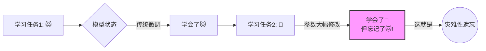
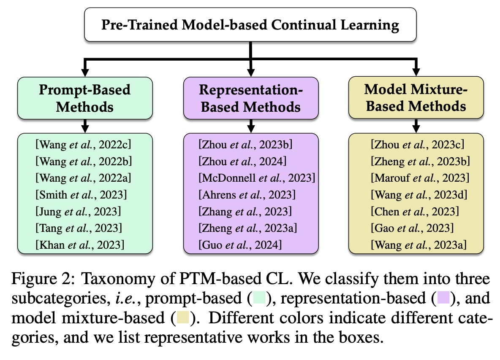
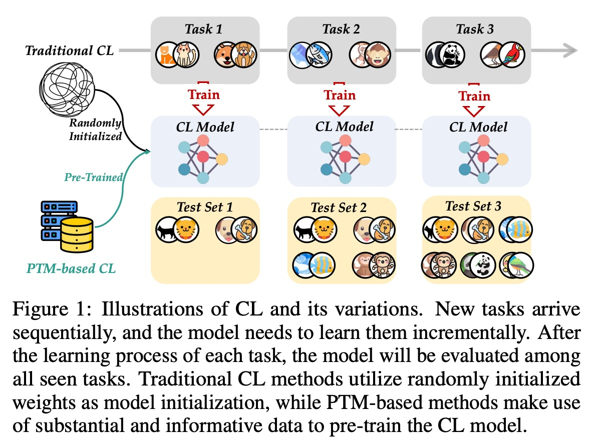
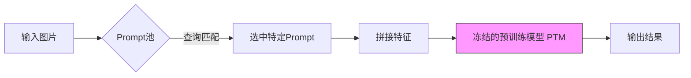
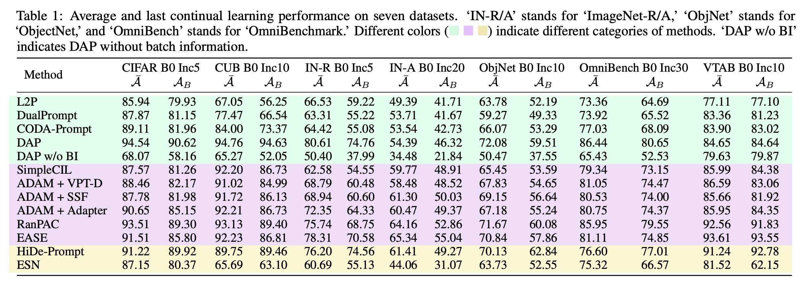
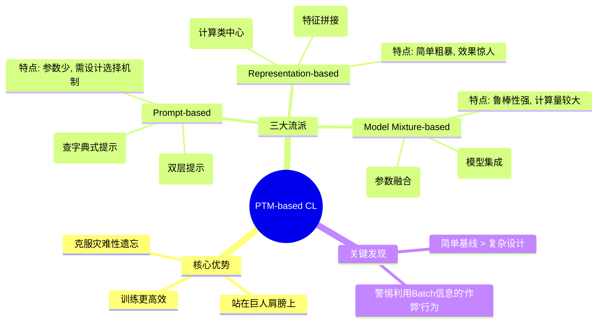
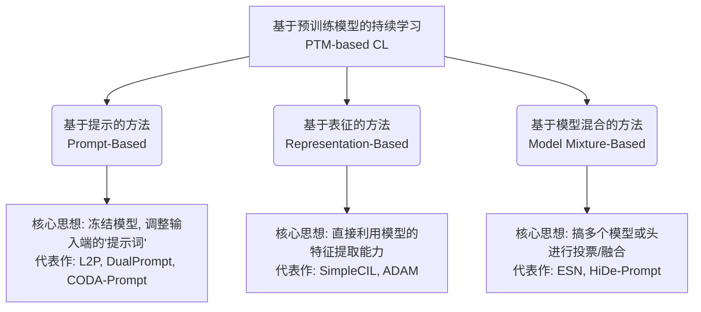

## AI论文解读 | Continual Learning with Pre-Trained Models: A Survey
        
### 作者        
digoal        
        
### 日期        
2025-11-26        
        
### 标签        
PostgreSQL , PolarDB , DuckDB , AI , 论文解读        
        
----        
        
## 背景  
      
https://arxiv.org/pdf/2401.16386        
  
提示:          
```          
读懂《Continual Learning with Pre-Trained Models: A Survey》这篇论文需要提前掌握哪些基础知识, 请使用中文通熟易懂的讲解这些基础知识, 可以引用论文中的图、表或使用Markdown支持的图形(text,mermaid等)增加解释性. 
  
使用中文通熟易懂的解读《Continual Learning with Pre-Trained Models: A Survey》这篇论文, 其中的关键内容请着重讲解, 可以引用论文中的图、表或使用Markdown支持的图形(text,mermaid等)增加解释性. 
  
提取《Continual Learning with Pre-Trained Models: A Survey》这篇论文中的重要术语, 使用中文对这些术语进行通熟易懂的讲解, 可以引用论文中的图、表或使用Markdown支持的图形(text,mermaid等)增加解释性. 
```     
  
## 1 前置知识 
  
阅读这篇综述论文《Continual Learning with Pre-Trained Models: A Survey》，就像是在看“旧瓶装新酒”的故事——**传统的持续学习问题（旧瓶）遇到了强大的预训练模型（新酒）** 。

为了让你轻松读懂这篇论文，你需要掌握以下三个核心领域的背景知识。我将通过通俗的比喻、图表以及论文中的概念来为你拆解。

-----

### 1\. 核心痛点：什么是“持续学习”与“灾难性遗忘”？

首先，你需要理解这篇论文试图解决的根本问题是什么。

  * **概念讲解**：
    传统的深度学习模型通常是一次性在所有数据上训练完的。但在现实世界中，数据是像流水一样分批次到来的（Streaming Data）。
    **持续学习 (Continual Learning, CL)** 就是希望模型能像人一样，今天学会了“识别猫”，明天学会“识别狗”，后天学会“识别熊猫”，而且在学会新知识的同时，**不要忘记**以前学过的东西。

  * **拦路虎——灾难性遗忘 (Catastrophic Forgetting)** ：
    神经网络有一个致命弱点：当你教它新任务（识别狗）并调整参数时，它为了迎合新任务，会大幅度修改之前的参数，导致它“变傻了”，完全忘记了旧任务（识别猫）怎么做 。

  * **论文中的分类 (CL Variations)** ：
    论文提到了几种场景，你只需要懂最难的一种： **类增量学习 (Class-Incremental Learning, CIL)** 。

      * *简单理解*：考试时不告诉你这道题属于哪一章（Task ID未知），模型必须自己判断这是以前学的“猫”还是刚学的“狗”，这非常容易搞混。




-----

### 2\. 救世主：什么是“预训练模型 (PTM)”与“ViT”？

这篇论文的核心观点是：因为有了**预训练模型 (Pre-Trained Models, PTMs)** ，持续学习的游戏规则变了 。

  * **概念讲解**：

      * **从零训练 (Train from scratch)** ：以前的持续学习像是在教一个**婴儿**。给他看几张图，他什么都不懂，脑子（参数）是一片空白（随机初始化）。
      * **预训练模型 (PTM)** ：现在的持续学习像是请了一个**博学的成年人**。这个模型已经在海量数据（如 ImageNet-21K）上看过几千万张图，它虽然没见过你现在的特定任务，但它已经“懂了”什么是轮廓、眼睛、毛发。它具有强大的**通用特征提取能力 (Generalizability)** 。

  * **关键架构：Vision Transformer (ViT)** ：
    论文中几乎所有方法都基于 **ViT**，而不是以前常用的 ResNet。你需要了解 ViT 的两个基本术语，因为论文里的方法（如 Prompt-based）都建立在此之上：

    1.  **Patches (切片)** ：ViT 不像人眼扫视整张图，而是把图切成一个个小方块（Patches），比如 $16 \times 16$ 像素的小块。
    2.  **[CLS] Token**：ViT 会在这些小方块序列前加一个特殊的标志叫 `[CLS]`。经过网络处理后，这个 `[CLS]` 对应的向量就代表了**整张图片的特征**。

    

      * *应用*：论文中提到的 **Representation-based 方法**，就是直接拿这个 `[CLS]` 向量来计算分类中心（Prototype）。

-----

### 3\. 新玩法：微调 (Fine-tuning) vs. 提示 (Prompting)

理解了上面两点，你就能看懂论文图 2 中的分类体系了 。传统的做法是改动整个模型，而 PTM 时代有了更聪明的做法。   

#### A. 为什么不能直接全量微调？

如果你拿到一个 PTM，为了学新任务把它的参数全部重新训练一遍，会发生两件事：

1.  **破坏通用性**：它原本“博学”的大脑被新任务洗脑了，失去了通用的特征提取能力 。
2.  **存储昂贵**：如果每个任务都存一个大模型，内存早就爆了。

#### B. 核心技术：Prompt Tuning (提示微调) 

这是论文中 **Prompt-based Methods** 的基础。

  * **通俗解释**：
    不要动那个“博学的大脑”（冻结 PTM 参数），而是给它递一张“小纸条”（Prompt）。
    比如，任务是识别鸟，我们在输入数据里加几个**可学习的向量**（就是那张小纸条）。模型看到这些向量，就被“提示”去调用关于鸟的知识。
  * **好处**：你只需要存储这些极小的“纸条”参数，大大减少了遗忘，也节省了空间 。

#### C. 核心技术：Prototypes (原型/中心) 

这是论文中 **Representation-based Methods** 的基础。

  * **通俗解释**：
    既然 PTM 已经很强了，我们甚至不需要训练网络。
    把所有的“猫”图片扔进 PTM，算出它们的特征平均值，这叫“猫的原型” ( $c_{cat}$ )。
    把所有的“狗”图片扔进去，算出“狗的原型” ( $c_{dog}$ )。
    **测试时**：来了一张新图，算出它的特征，看它离“猫原型”近还是“狗原型”近 。
  * **论文的发现**：这种看似简单的方法（SimpleCIL），竟然比很多复杂的 Prompt 方法还要好！。

-----

### 总结：读论文时的思维导图

当你阅读这篇论文时，请时刻把下面这张对比表放在脑海中，这对应了论文中的 **Figure 1** ：   

| 维度 | **传统持续学习 (Traditional CL)** | **基于 PTM 的持续学习 (PTM-based CL)** |
| :--- | :--- | :--- |
| **初始状态** | **婴儿** (随机权重)  | **成年专家** (预训练权重)  |
| **主要挑战** | 如何从零学知识且不忘旧的 | 如何利用旧知识适应新任务且不破坏它 |
| **核心手段** | 记忆回放 (Replay)、正则化 | **提示 (Prompt)** 、**特征适配 (Adapter)** 、**原型 (Prototype)** |
| **性能上限** | 较低 | 极高 (接近上限)  |

掌握了这些，你就可以顺畅地阅读关于 L2P、DualPrompt、SimpleCIL 等具体算法的对比分析了。
  
## 2 解读论文 
  
这也是一篇非常有意思的综述，它揭示了深度学习领域的一个重大范式转变： **持续学习（Continual Learning, CL）正在从“从零训练”走向“预训练模型（PTM）”时代**。

简单来说，以前的研究像是在**教婴儿**（随机初始化的模型），每学一个新任务都容易忘掉旧的；现在的研究像是在**教专家**（预训练模型），利用已有的广博知识来快速适应新任务，且尽量不遗忘。

以下是对这篇论文《Continual Learning with Pre-Trained Models: A Survey》的深度解读。

-----

### 1\. 核心背景：从“婴儿”到“成年人”的跨越

论文开篇用了一个非常形象的比喻来区分传统持续学习与基于 PTM 的持续学习：

  * **传统持续学习 (Traditional CL)** ：模型权重随机初始化，像训练婴儿成长。目的是边学新知识边克服“灾难性遗忘”（学了狗忘了猫）。
  * **基于 PTM 的持续学习 (PTM-based CL)** ：模型已经在海量数据（如 ImageNet21K）上预训练过，像利用成年人的专业知识。目的是利用其强大的**泛化能力**和**特征提取能力**，只做少量调整来适应新任务 。

> **核心优势**：研究发现，基于 PTM 的方法其性能正在接近持续学习的“天花板”，远超传统方法 。

-----

### 2\. 三大流派：如何让“老专家”学新技能？

论文将现有的方法归纳为三大类，这是全篇的核心骨架（对应论文 Figure 2）。   

#### 2.1 第一类：提示基方法 (Prompt-Based Methods)

**核心思想**：不动“大脑”（冻结预训练模型参数），只给“提示小纸条”（学习轻量级的 Prompt）。

  * **原理**：在输入图像的特征前加上一组可学习的向量（Prompt）。模型通过调整这些 Prompt 来适应新任务，而不破坏预训练的主干网络，从而减少遗忘 。
  * **关键难点 - 提示选择 (Prompt Selection)** ：如果有多个任务，该用哪张“纸条”？
      * **L2P (Learning to Prompt)** ：设计了一个“键-值”查询机制。输入图片作为查询（Query），去匹配最相似的键（Key），然后取出对应的 Prompt 。
      * **DualPrompt**：把 Prompt 分为“通用提示”（大家都用）和“专家提示”（特定任务专用）。
  * **优缺点**：参数极少，适合存储受限场景；但 Prompt 的选择机制可能导致新的遗忘 。




#### 2.2 第二类：表征基方法 (Representation-Based Methods)

**核心思想**：相信“直觉”。PTM 已经看多识广，它的特征提取能力直接拿来用就好。

  * **SimpleCIL (极简基线)** ：这是一个让很多复杂算法“汗流浃背”的简单方法。
      * 直接冻结 PTM。
      * 计算每个类别的特征平均值（原型，Prototypes）。
      * 测试时，看新图片离哪个原型近就归哪类 。
      * **震惊发现**：这个简单方法竟然比复杂的 Prompt 方法（如 L2P）效果还要好！这说明 PTM 本身的特征质量极高 。
  * **ADAM**：在 SimpleCIL 基础上，拼接了微调后的特征，既保留了通用性又增加了任务适应性 。

#### 2.3 第三类：模型混合基方法 (Model Mixture-Based Methods)

**核心思想**：三个臭皮匠顶个诸葛亮。在学习过程中保留多个模型或模块，最后融合它们。

  * **模型集成 (Ensemble)** ：针对不同任务训练不同分类头，最后投票 。
  * **模型融合 (Model Merge)** ：将新旧模型的参数（如 Prompt 参数）进行数学上的合并（如加权平均），合并成一个模型，不增加推理成本 。

-----

### 3\. 实验中的“反转”与“打假”

这篇综述不仅总结了方法，还通过详实的实验揭露了两个重要现象（见论文 Table 1）：   

#### 3.1 “大道至简”的胜利

实验对比了 7 个数据集，发现 **SimpleCIL**（表征基方法）在很多情况下优于 **L2P** 和 **DualPrompt**（提示基方法）。

  * **启示**：有时候复杂的模块设计反而引入了噪声，预训练模型本身的强大表征才是关键。

#### 3.2 关于 DAP 方法的“公平性”争议

论文特别点名了一个名为 **DAP** 的方法，指出其不仅效果好，但存在**不公平对比**嫌疑：

  * **问题**：DAP 在测试时利用了**Batch信息**（一批数据里的统计规律），这相当于变相知道了任务的上下文信息（作弊）。
  * **验证**：当作者去除 Batch 信息（DAP w/o BI）后，DAP 的性能瞬间崩塌，甚至不如 L2P 。
  * **呼吁**：未来的比较必须是 Instance-specific（单样本独立预测）的，不能依赖 Batch 信息 。

-----

### 4\. 未来的四个风向标

论文最后指出了该领域未来的四个潜力方向：

1.  **大语言模型 (LLMs) 的持续学习**：像 GPT 这样的模型更新成本极高。如何让 LLM 持续学会新知识（如“现在的美国总统是谁”）而不必完全重训，是巨大的需求 。
2.  **多模态持续学习**：不仅是看图，还要结合文本（如 CLIP 模型）。如何利用文本提示来辅助视觉的持续学习 。
3.  **边缘设备上的学习**：在手机、眼镜等资源受限设备上，利用 PTM 进行低能耗的持续学习 。
4.  **挑战新基准**：ImageNet 已经太简单了（因为 PTM 见过）。需要构建与 ImageNet 差异巨大的新数据集（域差距大的数据）来真正测试 PTM 的持续学习能力 。

-----

### 总结图表

为了方便记忆，我为你总结了这篇论文的核心架构图：



这篇论文最大的贡献在于它不仅整理了方法，还通过扎实的实验告诉大家： **在预训练模型时代，不要为了创新而创新，有时候利用好模型本身的特征（SimpleCIL）比设计复杂的结构更有效。**
  
## 3 术语 
  
这是一份关于**基于预训练模型（Pre-Trained Models, PTMs）的持续学习（Continual Learning, CL）** 的综述论文 。

为了帮助你快速理解这篇论文的核心内容，我提取了其中的关键术语，并用通俗易懂的中文进行了解读。为了更直观，我结合了论文中的分类逻辑制作了图表。

-----

### 1\. 核心概念：基础篇

#### **Continual Learning (CL) | 持续学习**

  * **通俗解释**：这就好比人类的学习过程。我们从小到大不断学习新技能（比如先学走路，再学骑车，再学开车），在学习新技能的同时，我们不会忘记以前学过的技能。
  * **学术定义**：处理流式数据（Streaming Data），在适应新任务的同时，克服**灾难性遗忘** 。
  * **论文中的比喻**：
      * **传统 CL**：像训练婴儿，一切从零开始（随机初始化权重）。
      * **基于 PTM 的 CL**：像训练成年人，利用已有的丰富知识（预训练模型）来快速适应新任务 。

#### **Catastrophic Forgetting | 灾难性遗忘**

  * **通俗解释**：俗称“由其二忘其一”。当模型学习新知识（比如识别“熊猫”）时，它的参数发生了变化，导致它突然不认识以前学过的东西（比如识别“猫”）了 。
  * **目标**：持续学习的核心目标就是尽量减少这种遗忘。

#### **Pre-Trained Models (PTMs) | 预训练模型**

  * **通俗解释**：这是一个已经“读万卷书”的超级学霸模型（通常在大规模数据集如 ImageNet-21K 上训练过）。它已经具备了很强的通用特征提取能力（Generalizability）。
  * **在本领域的作用**：我们不需要重新训练它，而是利用它冻结的参数（Frozen weights）作为基础，只进行微调或外挂小模块，就能很好地完成持续学习任务 。

-----

### 2\. 核心分类：三大流派 (Taxonomy)

论文将基于预训练模型的持续学习方法分为三大类 。我们可以通过下面的思维导图来理解：



#### **第一类：Prompt-Based Methods | 基于提示的方法**

  * **核心逻辑**：保持预训练的大模型参数不动（冻结），只在输入层或中间层加入一些可学习的微小参数，这些参数被称为“Prompt” 。
  * **关键术语详解**：
      * **Visual Prompt Tuning (VPT)** ：在图像切片序列前加上一些可训练的向量。让模型觉得“哦，加上这个标记，我是要处理这类任务” 。
      * **Prompt Pool (提示池)** ：相当于一个外挂的“知识库”。里面存了很多针对不同任务的提示（Prompt）。
      * **Query-Key Matching (键值匹配)** ：这是 **L2P** 方法的核心。当一张新图片进来时，模型会先计算它的特征（Query），去提示池里找最匹配的那个 Key，然后取出对应的 Prompt 来辅助推理 。
      * *图解逻辑：*
        ```text
        输入图片 (x) -> 预训练模型提取特征 -> 在Prompt Pool中检索 -> 选出最佳Prompt -> 组合后重新输入模型 -> 得到结果
        ```

#### **第二类：Representation-Based Methods | 基于表征的方法**

  * **核心逻辑**：相信预训练模型本身已经足够强大。我们不需要花里胡哨的微调，直接利用它提取出的高质量特征（Representation）来做分类 。
  * **关键术语详解**：
      * **Prototypes (原型/类中心)** ：对于某一类图片（比如“狗”），我们把所有狗的图片特征取平均值，得到一个中心点，这个点就是“原型”。
      * **SimpleCIL**：这是论文推崇的一个极简基准。它不训练模型主干，只计算每个类的原型。测试时，看新图片离哪个原型最近，就是哪一类 。
          * *令人惊讶的结论*：这么简单的方法，效果竟然比很多复杂的 Prompt 方法还要好 。
      * **ADAM**：在 SimpleCIL 基础上，把“原始预训练特征”和“微调后的特征”拼接起来，既保留通用性，又增加适应性 。

#### **第三类：Model Mixture-Based Methods | 基于模型混合的方法**

  * **核心逻辑**：既然一个模型容易忘，那就用多个模型，或者把不同阶段学到的模型融合起来 。
  * **关键术语详解**：
      * **Model Ensemble (模型集成)** ：训练多个分类头（Head）或模型，大家一起投票决定结果 。
      * **Model Merge (模型融合)** ：把在旧任务上训练的模型参数和新任务上的参数，通过加权平均（如 EMA）的方式融合，变成一个新模型 。

-----

### 3\. 重要评估与反思

#### **Batch Information (BI) | 批次信息（评估中的“作弊”嫌疑）**

  * **背景**：论文发现 **DAP** 方法的效果出奇的好，但深入研究发现它利用了“Batch Information” 。
  * **解释**：在测试阶段，DAP 假设同一个 Batch（批次）进来的数据属于同一个任务，并利用这个信息来投票生成 Prompt。这相当于在考试时偷看了试卷的分类标签。
  * **论文验证**：如果把 Batch Size 设为 1（去除批次信息，即 **DAP w/o BI**），DAP 的性能直接断崖式下跌，甚至不如基础方法 。
  * **启示**：评估持续学习模型时，必须确保测试是独立的，不能依赖上下文信息（Fairness in comparisons）。

#### **Benchmark Datasets | 基准数据集**

  * **为什么不用 ImageNet？** 因为预训练模型通常已经看过 ImageNet 了，再测它没有意义。
  * **常用数据集**：论文推荐使用与预训练数据差异大（Domain Gap）的数据集，例如：
      * **ImageNet-R/A**：ImageNet 的变种（手绘图、对抗样本），风格差异大 。
      * **ObjectNet**：真实世界中各种奇怪角度拍摄的物体 。
      * **VTAB**：视觉任务适应性基准 。

-----

### 总结与建议 (Next Step)

这篇综述的核心观点是： **在预训练模型时代，我们可能不再需要复杂的持续学习技巧。**

1.  **SimpleCIL (基于原型)** 的表现优于许多复杂的 **Prompt (提示)** 方法，说明好的特征提取比防止遗忘的机制更关键。
2.  未来的方向在于如何更高效地利用 **LLMs (大语言模型)** 进行持续学习  以及 **多模态 (Multi-modal)** 的扩展 。

**我可以为您做的下一步：**
如果您对其中的某个具体算法（比如 **L2P 的数学公式** 或 **SimpleCIL 的代码实现逻辑**）感兴趣，我可以为您详细拆解它的推导过程或提供伪代码。您想深入了解哪一部分？
  
## 参考        
         
https://arxiv.org/pdf/2401.16386    
        
<b> 以上内容基于DeepSeek、Qwen、Gemini及诸多AI生成, 轻微人工调整, 感谢杭州深度求索人工智能、阿里云、Google等公司. </b>        
        
<b> AI 生成的内容请自行辨别正确性, 当然也多了些许踩坑的乐趣, 毕竟冒险是每个男人的天性.  </b>        
    
#### [PolarDB 学习图谱](https://www.aliyun.com/database/openpolardb/activity "8642f60e04ed0c814bf9cb9677976bd4")
  
  
#### [PostgreSQL 解决方案集合](../201706/20170601_02.md "40cff096e9ed7122c512b35d8561d9c8")
  
  
#### [德哥 / digoal's Github - 公益是一辈子的事.](https://github.com/digoal/blog/blob/master/README.md "22709685feb7cab07d30f30387f0a9ae")
  
  
#### [About 德哥](https://github.com/digoal/blog/blob/master/me/readme.md "a37735981e7704886ffd590565582dd0")
  
  

  
