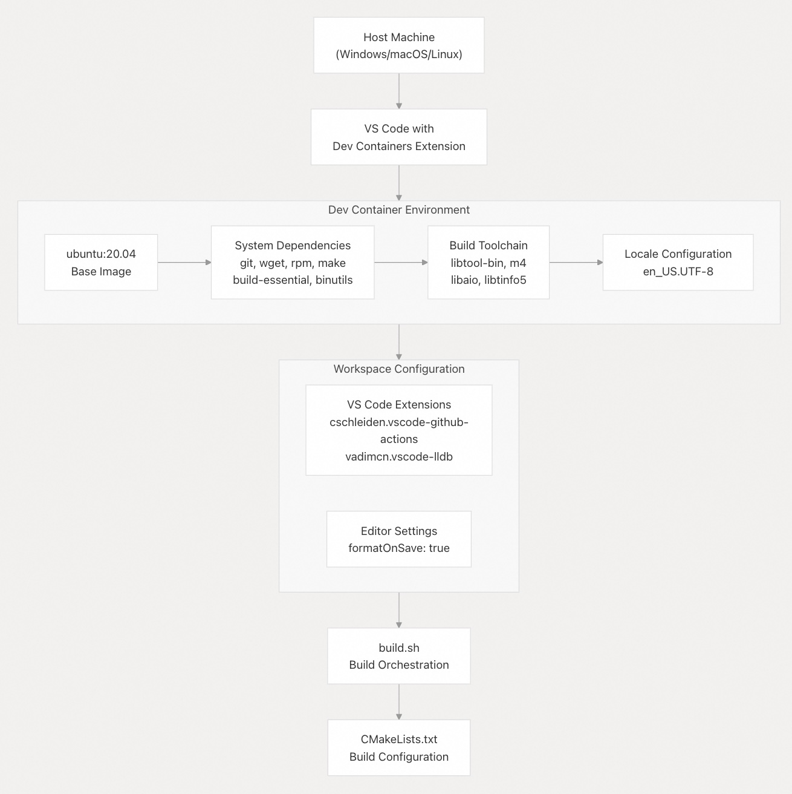
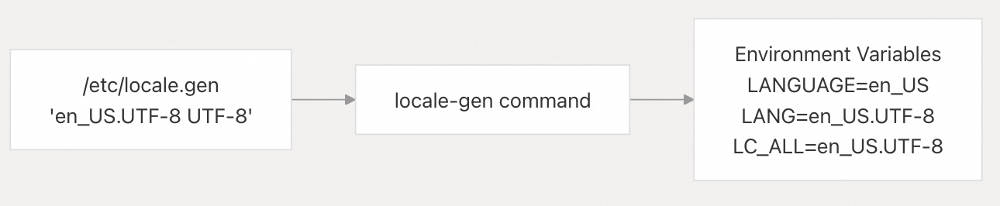
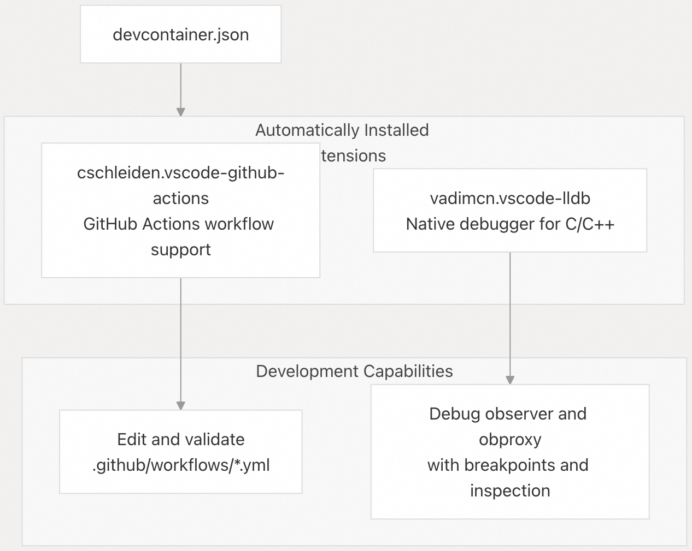
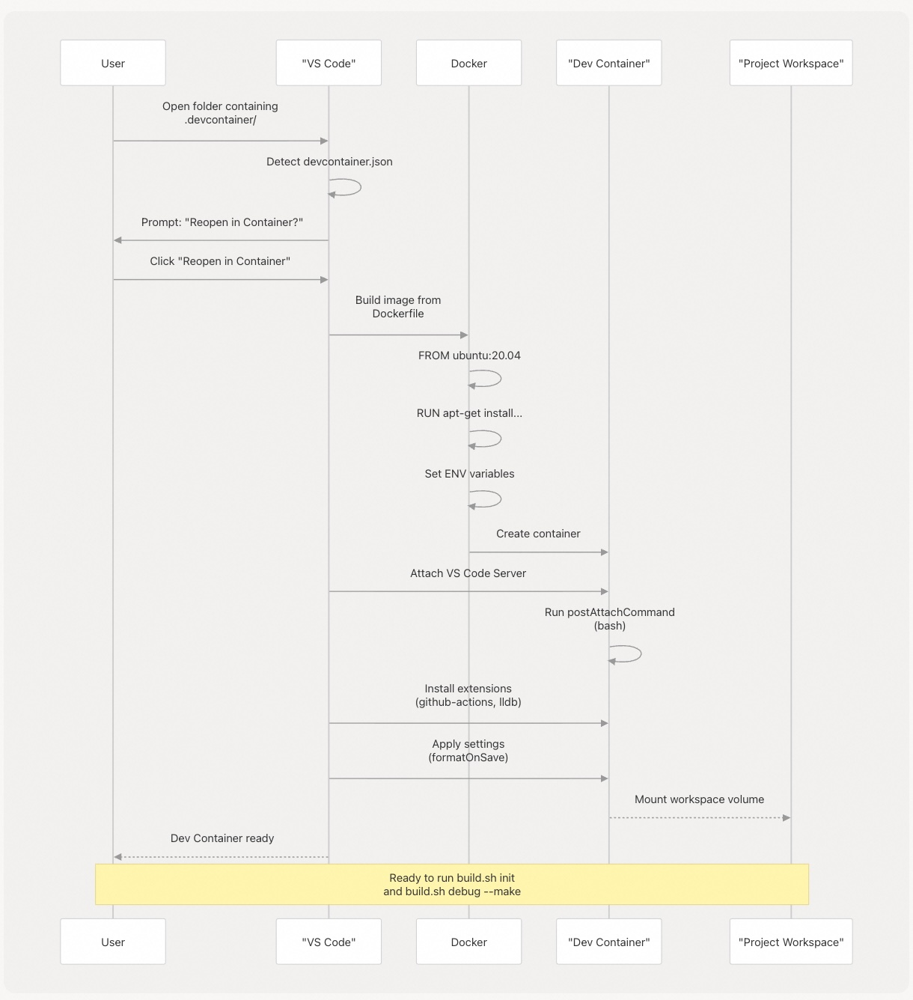
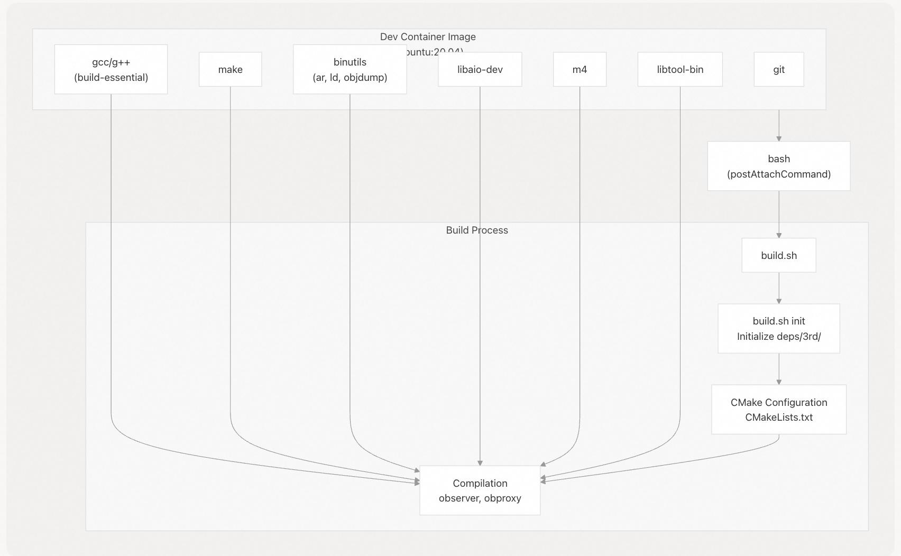

## SeekDB 源码学习: 2.1 开发环境设置 (`Development Environment Setup`)  
                        
### 作者                        
digoal                        
                        
### 日期                        
2025-11-26                        
                        
### 标签                        
SeekDB , OceanBase , AI Native 数据库 , 向量搜索 , 语义搜索 , 关键词搜索 , 全文检索 , 标量搜索 , 混合搜索 , AI 搜索 , AI in Database , 多模态 , 源码学习                         
                        
----                        
                        
## 背景                        
本文描述了如何使用开发容器 (`Dev Containers`) 为 OceanBase SeekDB 设置容器化 (`containerized`) 开发环境。开发容器提供了一个一致 (`consistent`)、可复现 (`reproducible`) 的开发环境，其中预装了所有必需的依赖项 (`dependencies`)。  
  
## 概述 (`Overview`)  
  
OceanBase SeekDB 采用开发容器 (`Dev Container`) 方法，以确保所有开发人员无论使用何种宿主操作系统 (`host operating system`)，都能在一致的环境中工作。开发容器由两个主要的配置 (`configuration`) 文件定义：  
  
  * `.devcontainer/Dockerfile` - 定义了包含所需系统依赖项的容器镜像 (`container image`)。  
  * `.devcontainer/devcontainer.json` - 配置集成开发环境 (`IDE`) 的集成和工作区 (`workspace`) 设置。  
  
这种方法消除了“在我的机器上能跑”的问题，并提供了对正确工具链 (`toolchain`) 版本的即时访问。  
  
## 开发容器架构 (`Dev Container Architecture`)  
  
下图显示了开发容器如何融入开发工作流程 (`development workflow`)：  
  
  
  
来源:  
[`.devcontainer/Dockerfile` 1-15](https://github.com/oceanbase/seekdb/blob/8c4654f1/.devcontainer/Dockerfile#L1-L15)  
[`.devcontainer/devcontainer.json` 1-16](https://github.com/oceanbase/seekdb/blob/8c4654f1/.devcontainer/devcontainer.json#L1-L16)  
  
## 容器镜像配置 (`Container Image Configuration`)  
  
### 基础镜像和软件包安装 (`Base Image and Package Installation`)  
  
开发容器使用 Ubuntu 20.04 LTS 作为其基础镜像 (`base image`)，提供了一个稳定且支持良好的 Linux 环境。`Dockerfile` 在单个层中安装了基本的开发工具，以最小化镜像大小 (`image size`)：  
  
| 软件包类别 (`Package Category`) | 软件包 (`Packages`) | 目的 (`Purpose`) |  
| :--- | :--- | :--- |  
| 版本控制 (`Version Control`) | `git` | 源代码管理 (`Source code management`) |  
| 软件包工具 (`Package Tools`) | `wget`, `rpm`, `rpm2cpio`, `cpio` | 下载和提取依赖项 (`Downloading and extracting dependencies`) |  
| 构建系统 (`Build System`) | `make`, `build-essential`, `binutils` | 核心编译工具链 (`Core compilation toolchain`) |  
| 构建实用程序 (`Build Utilities`) | `libtool-bin`, `m4` | 构建自动化 (`Build automation`) 和宏处理 (`macro processing`) |  
| 运行时库 (`Runtime Libraries`) | `libaio1`, `libaio-dev`, `libtinfo5` | 异步 I/O (`Async I/O`) 和终端信息支持 (`terminal info support`) |  
  
软件包安装使用 `-yq` 标志进行非交互式、静默的操作。  
来源:  
[`.devcontainer/Dockerfile` 6-7](https://github.com/oceanbase/seekdb/blob/8c4654f1/.devcontainer/Dockerfile#L6-L7)  
  
### 区域设置配置 (`Locale Configuration`)  
  
容器明确配置了 `en_US.UTF-8` 区域设置 (`locale`)，以确保字符编码 (`character encoding`) 和文本处理的一致性：  
  
  
  
区域设置确保了：  
  
  * 文本文件以 UTF-8 编码处理  
  * 字符串比较 (`String comparisons`) 和排序 (`sorting`) 保持一致  
  * 数据库字符编码测试 (`Database character encoding tests`) 的行为可预测  
  
来源:  
[`.devcontainer/Dockerfile` 8-14](https://github.com/oceanbase/seekdb/blob/8c4654f1/.devcontainer/Dockerfile#L8-L14)  
  
### 环境变量 (`Environment Variables`)  
  
容器设置了以下环境变量 (`environment variables`)：  
  
| 变量 (`Variable`) | 值 (`Value`) | 目的 (`Purpose`) |  
| :--- | :--- | :--- |  
| `TERM` | `xterm-256color` | 启用终端 (`terminal`) 的全彩支持 (`full color support`) |  
| `DEBIAN_FRONTEND` | `noninteractive` | 防止软件包安装期间出现交互式提示 (`interactive prompts`) |  
| `LANGUAGE` | `en_US` | 消息 (`messages`) 的默认语言 |  
| `LANG` | `en_US.UTF-8` | 系统区域设置 (`System locale`) |  
| `LC_ALL` | `en_US.UTF-8` | 覆盖所有区域设置类别 (`locale categories`) |  
  
来源:  
[`.devcontainer/Dockerfile` 3-4](https://github.com/oceanbase/seekdb/blob/8c4654f1/.devcontainer/Dockerfile#L3-L4)  
[`.devcontainer/Dockerfile` 12-14](https://github.com/oceanbase/seekdb/blob/8c4654f1/.devcontainer/Dockerfile#L12-L14)  
  
## IDE 集成配置 (`IDE Integration Configuration`)  
  
### VS Code 扩展 (`VS Code Extensions`)  
  
`devcontainer.json` 文件配置了两个扩展 (`extensions`)，它们在容器启动时会自动安装：  
  
  
  
**扩展详情 (`Extension Details`)：**  
  
1.  **`cschleiden.vscode-github-actions`** - 为 GitHub Actions 工作流文件 (`workflow files`) 提供语法高亮 (`syntax highlighting`)、验证 (`validation`) 和智能提示 (`IntelliSense`)。这对于处理 CI/CD 流水线 (`CI/CD pipeline`) 至关重要。  
2.  **`vadimcn.vscode-lldb`** - 使用 LLDB 为 C++ 代码提供调试功能 (`debugging capabilities`)。这允许开发人员对 `observer` 和 `obproxy` 二进制文件 (`binaries`) 进行调试，并具有完整的断点 (`breakpoint`)、变量检查 (`variable inspection`) 和堆栈跟踪 (`stack trace`) 功能。  
  
来源:  
[`.devcontainer/devcontainer.json` 7-9](https://github.com/oceanbase/seekdb/blob/8c4654f1/.devcontainer/devcontainer.json#L7-L9)  
  
### 编辑器设置 (`Editor Settings`)  
  
开发容器配置了编辑器以在保存时自动格式化代码：  
  
```  
"settings": {  
    "editor.formatOnSave": true  
}  
```  
  
这确保了所有代码贡献都保持一致的格式，无需手动干预，支持代码质量标准 (`code quality standards`)。  
  
来源:  
[`.devcontainer/devcontainer.json` 11-13](https://github.com/oceanbase/seekdb/blob/8c4654f1/.devcontainer/devcontainer.json#L11-L13)  
  
## 使用开发容器 (`Using the Dev Container`)  
  
### 先决条件 (`Prerequisites`)  
  
要使用开发容器，你需要：  
  
1.  **Docker** - 容器运行时 (`Container runtime`) (Windows/macOS 上的 Docker Desktop，Linux 上的 Docker Engine)  
2.  **Visual Studio Code** - 集成开发环境 (`IDE`)，并安装了 Dev Containers 扩展  
3.  **Dev Containers 扩展** - 从 VS Code 市场 (`marketplace`) 安装 (`ms-vscode-remote.remote-containers`)  
  
### 打开开发容器 (`Opening the Dev Container`)  
  
以下序列图 (`sequence diagram`) 显示了初始化过程 (`initialization process`)：  
  
  
  
来源:  
[`.devcontainer/devcontainer.json` 4](https://github.com/oceanbase/seekdb/blob/8c4654f1/.devcontainer/devcontainer.json#L4-L4)  
  
### 附加后行为 (`Post-Attach Behavior`)  
  
容器启动且 VS Code 附加 (`attaches`) 后，`postAttachCommand` 会执行 `bash`，提供一个交互式 `shell`。通过这个 `shell`，开发人员可以：  
  
1.  初始化依赖项：`./build.sh init`  
2.  构建项目：`./build.sh debug --make`  
3.  运行测试：`./build.sh test`  
  
有关详细的构建说明，请参阅 Building from Source。  
  
## 与构建系统的集成 (`Integration with Build System`)  
  
下图显示了开发容器环境如何连接到构建过程 (`build process`)：  
  
  
  
开发容器提供了构建系统所需的所有系统级依赖项 (`system-level dependencies`)：  
  
  * **编译器工具链 (`Compiler toolchain`)** - 用于 C++ 编译的 `build-essential` 中的 GCC/G++  
  * **构建自动化 (`Build automation`)** - 用于执行构建配方 (`build recipes`) 的 GNU Make  
  * **二进制实用程序 (`Binary utilities`)** - 用于链接 (`linking`)、归档 (`archiving`) 和对象文件操作 (`object file manipulation`) 的 `binutils`  
  * **异步 I/O (`Async I/O`)** - 用于数据库中异步 I/O 操作的 `libaio-dev`  
  * **宏处理 (`Macro processing`)** - 用于构建时宏扩展 (`build-time macro expansion`) 的 `m4`  
  * **Libtool** - 跨平台库构建支持 (`Cross-platform library building support`)  
  
来源:  
[`.devcontainer/Dockerfile` 6-7](https://github.com/oceanbase/seekdb/blob/8c4654f1/.devcontainer/Dockerfile#L6-L7)  
  
## 开发容器命名 (`Dev Container Naming`)  
  
开发容器在配置中被命名为 "OceanBase"  
[`.devcontainer/devcontainer.json` 2](https://github.com/oceanbase/seekdb/blob/8c4654f1/.devcontainer/devcontainer.json#L2-L2)。此名称出现在：  
  
  * VS Code 的“远程资源管理器” (`Remote Explorer`) 面板  
  * 连接到容器时的 VS Code 窗口标题 (`window title`)  
  * Docker 容器列表 (`docker ps`)  
  
## 文件结构参考 (`File Structure Reference`)  
  
完整的开发容器配置包含：  
  
```  
.devcontainer/  
├── Dockerfile            # 容器镜像定义  
└── devcontainer.json     # VS Code 集成配置  
```  
  
这两个文件都必须存在于仓库根目录 (`repository root`) 的 `.devcontainer/` 目录中，VS Code 才能检测和使用该开发容器。  
  
来源:  
[`.devcontainer/Dockerfile` 1-15](https://github.com/oceanbase/seekdb/blob/8c4654f1/.devcontainer/Dockerfile#L1-L15)  
[`.devcontainer/devcontainer.json` 1-16](https://github.com/oceanbase/seekdb/blob/8c4654f1/.devcontainer/devcontainer.json#L1-L16)  
  
-----  
  
# 附录1: 构建脚本的细节与依赖项初始化  
  
* **痛点/需展开细节：** 文档提到容器启动后需执行 `./build.sh init`、`./build.sh debug --make` 等命令。一个新用户需要知道这些核心操作的细节。  
* **问题：** 关于 `postAttachCommand` 后执行的日常开发操作，能否详细展开 `./build.sh` 脚本的具体功能？特别是，`./build.sh init` 命令除了安装系统依赖外（已在 `Dockerfile` 中完成），**具体初始化了哪些非系统依赖项（例如第三方库、子模块、或特定配置）** ？这些步骤对于项目首次成功构建的重要性是什么？  
  
## 回答  
  
您询问的是 `./build.sh init` 命令的具体功能,特别是它初始化了哪些非系统依赖项。  
  
## `./build.sh init` 的核心功能  
  
`./build.sh init` 命令实际上调用 `do_init()` 函数,该函数执行 `deps/init/dep_create.sh` 脚本来初始化项目依赖。    
  
### 初始化的非系统依赖项  
  
`dep_create.sh` 脚本会下载和安装以下类型的依赖:  
  
1. **第三方开发库** (`[deps]` 部分):  
   - 测试框架: `devdeps-gtest-1.8.0`  
   - 网络库: `devdeps-libcurl-static`, `devdeps-mariadb-connector-c`  
   - 压缩库: `devdeps-zlib-static`, `devdeps-xz`  
   - 加密库: `devdeps-openssl-static`  
   - 数据处理: `devdeps-apache-arrow`, `devdeps-apache-orc`, `devdeps-protobuf-c`  
   - 向量搜索: `devdeps-vsag-1.1.0` (SeekDB 的核心 AI 功能依赖)  
   - 其他: `devdeps-boost`, `devdeps-abseil-cpp`, `devdeps-s2geometry` 等    
  
2. **开发工具链** (`[tools]` 部分):  
   - 编译器: `obdevtools-gcc-12.3.0`, `obdevtools-llvm-17.0.6`  
   - 构建工具: `obdevtools-cmake-3.30.3`, `obdevtools-ccache-3.7.12`  
   - 解析工具: `obdevtools-bison`, `obdevtools-flex`    
  
3. **测试工具** (`[test-utils]` 部分):  
   - 部署工具: `ob-deploy`  
   - 客户端: `obclient`, `libobclient`    
  
### 依赖安装位置  
  
所有依赖被安装到以下目录结构:  
- **开发库**: `deps/3rd/usr/local/oceanbase/deps/devel/`  
- **开发工具**: `deps/3rd/usr/local/oceanbase/devtools/`    
  
### 依赖缓存机制  
  
`dep_create.sh` 实现了智能缓存机制:  
- 通过 MD5 哈希检查依赖是否已初始化  
- 支持共享依赖缓存 (通过 `DEP_CACHE_DIR` 环境变量)  
- 如果缓存存在且有效,会创建符号链接而不是重新下载    
  
## 对首次构建的重要性  
  
这些依赖对项目构建至关重要,因为:  
  
1. **CMake 依赖**: 构建系统需要特定版本的 CMake (`deps/3rd/usr/local/oceanbase/devtools/bin/cmake`),如果未初始化会导致构建失败。    
  
2. **编译器工具链**: 项目需要 GCC 12.3.0 和 LLVM 17.0.6 等特定版本的编译器。  
  
3. **核心功能依赖**: 例如 `devdeps-vsag` 是 SeekDB 向量搜索功能的核心依赖,没有它无法构建 AI 相关功能。  
  
4. **避免系统污染**: 所有依赖安装在项目本地目录,不会污染系统环境,确保构建的可重复性。  
  
## Notes  
  
`./build.sh init` 与 `./build.sh debug --init --make` 的区别在于后者会在初始化依赖后继续执行 CMake 配置和编译。   如果只需要初始化依赖而不立即构建,可以单独运行 `./build.sh init`。  
  
  
  
-----  
  
# 附录2: 开发环境配置文件的版本管理与升级策略  
  
* **背景知识/维护动作：** 文档强调环境一致性并依赖于 `Dockerfile` 和 `devcontainer.json`，且链接指向了特定的提交哈希 (`8c4654f1`)。项目会持续迭代。  
* **问题：** 随着 SeekDB 项目的不断发展，开发人员应如何管理和更新 `Dockerfile` 和 `devcontainer.json` 等容器配置文件？例如，当需要切换到新的主分支、升级容器内的系统环境（如从 Ubuntu 20.04 升级到新版本），或适配新的工具链时，**官方推荐的容器版本同步与更新策略**是什么？  
  
## 回答  
  
根据您提供的代码库上下文,我需要澄清一个重要的事实:**SeekDB 项目目前并不使用 `Dockerfile` 或 `devcontainer.json` 进行开发环境配置**。  
  
## 当前的开发环境管理方式  
  
SeekDB 项目采用的是**基于依赖包管理的方式**,而非容器化开发环境:  
  
1. **依赖包系统**: 项目通过 `deps/init/` 目录下的 `.deps` 文件管理不同操作系统的依赖包,例如 `oceanbase.el9.x86_64.deps`、`oceanbase.al8.x86_64.deps` 等    
  
2. **CI/CD 环境**: GitHub Actions 工作流使用 `ubuntu-22.04` 运行器,直接在虚拟机上安装依赖并编译    
  
3. **依赖缓存机制**: 通过 GitHub Actions 的缓存功能缓存 `deps/3rd` 目录,缓存键基于依赖文件的哈希值    
  
## 实际的版本管理策略  
  
基于现有代码,SeekDB 的环境同步策略是:  
  
### 1. 依赖包版本管理  
- 每个操作系统和架构组合都有独立的 `.deps` 文件  
- 依赖包通过 RPM 包管理,包含版本号和构建时间戳    
  
### 2. 工具链版本控制  
- 编译工具链(gcc、llvm、cmake等)也通过 RPM 包管理  
- 例如: `obdevtools-gcc-12.3.0-32024122017.al8.x86_64.rpm`    
  
### 3. CI 环境更新  
- CI 工作流中的 Ubuntu 版本在 `runs-on` 字段指定    
- 系统依赖通过 `apt-get install` 命令安装    
  
## Notes  
  
您提到的 `Dockerfile` 和 `devcontainer.json` 以及提交哈希 `8c4654f1` 在当前提供的代码库上下文中**并不存在**。 这可能意味着:  
  
1. 这些文件可能在其他分支或历史版本中存在  
2. 您可能在参考其他项目或文档  
3. 这可能是计划中但尚未实现的功能  
  
如果您确实需要了解容器化开发环境的管理策略,建议检查项目仓库的根目录是否存在这些文件,或者查看项目的官方文档以获取最新的开发环境配置指南。  
  
  
-----  
  
# 附录3: 容器环境下的性能开销与优化  
  
* **背景痛点/日常使用：** 数据库项目对性能敏感，文档中提到了异步 I/O 库 (`libaio-dev`) 和 C++ 编译 (`build-essential`)。容器化环境可能会引入 I/O 和 CPU 性能开销。  
* **问题：** 使用 Dev Container 进行日常编译和调试时，**预期的性能损失（相对于直接在宿主机上编译）是多少**？考虑到 I/O 操作对数据库的重要性，是否有推荐的 Docker 或 VS Code 配置（例如卷挂载选项、资源限制等），可以帮助**优化编译速度和运行时 I/O 性能**，以提高日常开发效率？  
  
## 回答  
  
# 关于 Dev Container 性能的说明  
  
根据提供的代码库上下文,我需要说明一个重要的事实:**SeekDB 项目目前并没有提供 Dev Container 配置**。  
  
## 当前的开发环境设置  
  
SeekDB 项目推荐的开发方式是:  
  
1. **直接在 Linux 服务器上开发** - 项目不支持 Windows 和 Mac OS X    
  
2. **使用 VSCode Remote SSH** - 通过 Remote SSH 插件连接到远程 Linux 服务器进行开发    
  
3. **支持的操作系统** - Ubuntu 20.04/22.04/24.04, CentOS 7/8/9, Debian 等 Linux 发行版    
  
## CI 环境的性能优化实践  
  
虽然没有 Dev Container 配置,但从 CI 流程可以看到一些性能优化措施:  
  
1. **ccache 编译缓存** - CI 使用 ccache 加速编译,缓存大小限制为 800MB    
  
2. **并行编译** - 使用 `make -j4` 进行 4 线程并行编译    
  
3. **依赖缓存** - 缓存 `deps/3rd` 目录避免重复下载依赖    
  
## 建议  
  
如果您想使用容器化开发环境,您需要:  
  
1. **自行创建 Dev Container 配置** - 项目目前没有提供官方的 `.devcontainer` 配置  
  
2. **参考 CI 配置** - 可以参考 `.github/workflows/compile.yml` 中的环境设置和依赖安装步骤    
  
3. **考虑使用 Remote SSH** - 这是项目推荐的方式,避免了容器化带来的性能开销  
  
## Notes  
  
关于容器性能损失的一般性建议(非 SeekDB 特定):  
- Docker 容器的 I/O 性能损失通常在 5-15%,取决于存储驱动和卷挂载方式  
- 使用 bind mount 而非 volume 可能会有更好的 I/O 性能  
- 避免使用 overlay2 存储驱动进行频繁的小文件写入  
  
但这些都是通用建议,SeekDB 项目本身没有提供 Dev Container 相关的配置或文档。如果您需要容器化开发环境,建议先在 GitHub 仓库提出 issue 或 PR 来讨论和贡献相关配置。  
    
#### [PolarDB 学习图谱](https://www.aliyun.com/database/openpolardb/activity "8642f60e04ed0c814bf9cb9677976bd4")
  
  
#### [PostgreSQL 解决方案集合](../201706/20170601_02.md "40cff096e9ed7122c512b35d8561d9c8")
  
  
#### [德哥 / digoal's Github - 公益是一辈子的事.](https://github.com/digoal/blog/blob/master/README.md "22709685feb7cab07d30f30387f0a9ae")
  
  
#### [About 德哥](https://github.com/digoal/blog/blob/master/me/readme.md "a37735981e7704886ffd590565582dd0")
  
  

  
