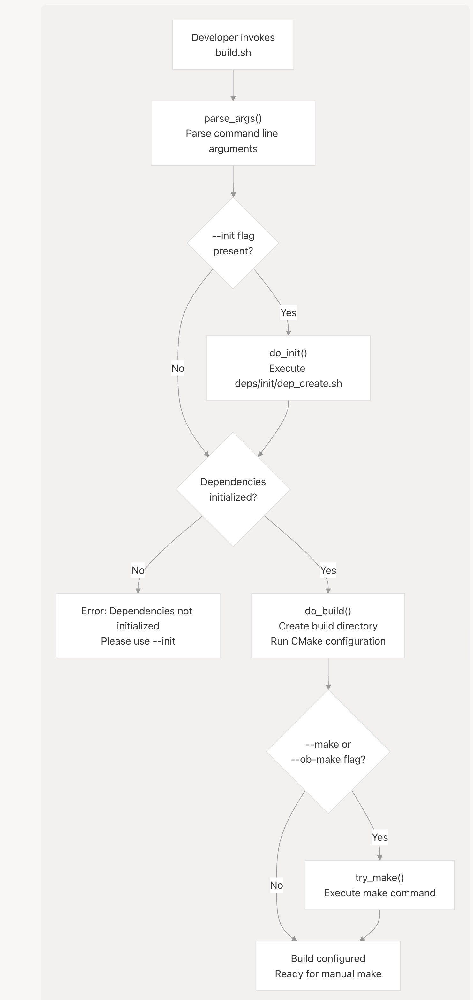
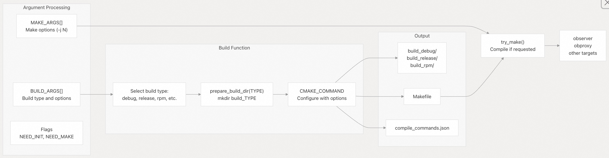
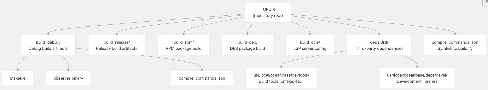
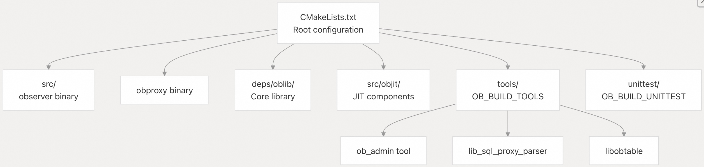
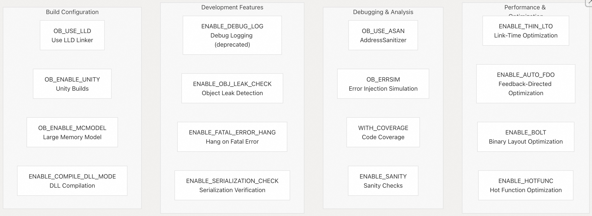

## SeekDB 源码学习: 2.2 从源代码构建 (Building from Source)  
                          
### 作者                          
digoal                          
                          
### 日期                          
2025-11-26                          
                          
### 标签                          
SeekDB , OceanBase , AI Native 数据库 , 向量搜索 , 语义搜索 , 关键词搜索 , 全文检索 , 标量搜索 , 混合搜索 , AI 搜索 , AI in Database , 多模态 , 源码学习                           
                          
----                          
                          
## 背景                          
本页面提供了使用 `build.sh` 脚本（构建脚本）从源代码构建 `OceanBase SeekDB` 的实用说明。涵盖了构建工作流程（Build Workflow）、可用的构建类型（Build Types）以及常见的构建场景（Build Scenarios）。  
  
关于使用开发容器（Dev Containers）设置开发环境，请参阅 开发环境设置 (Development Environment Setup) 章节。关于安装预构建的软件包或部署编译后的二进制文件，请参阅 安装和部署 (Installation and Deployment) 章节。有关所有 `build.sh` 命令和 `CMake` 选项的完整参考文档，请参阅 构建脚本参考 (Build Script Reference) 章节 和 CMake 配置 (CMake Configuration) 章节。  
  
-----  
  
## 前置条件 (Prerequisites)  
  
从源代码构建之前，您必须初始化项目依赖项（Dependencies）。构建系统（Build System）需要：  
  
  * **CMake**：位于 `deps/3rd/usr/local/oceanbase/devtools/bin/cmake`（在初始化期间安装）。  
  * **第三方依赖项 (Third-party dependencies)** ：位于 `deps/3rd/usr/local/oceanbase/deps/devel`（在初始化期间安装）。  
  * **系统要求 (System requirements)** ：Linux 系统，带有 GCC/Clang 编译器，以及足够的磁盘空间（至少 6GB+ 空闲）。  
  
初始化步骤会使用 [`deps/init/dep_create.sh`](https://github.com/oceanbase/seekdb/blob/8c4654f1/deps/init/dep_create.sh) 下载并配置所有必需的依赖项。  
  
**来源 (Sources):**  
[`build.sh` 6-8](https://github.com/oceanbase/seekdb/blob/8c4654f1/build.sh#L6-L8)  
[`build.sh` 135-138](https://github.com/oceanbase/seekdb/blob/8c4654f1/build.sh#L135-L138)  
  
-----  
  
## 基本构建工作流程 (Basic Build Workflow)  
  
从源代码构建 `SeekDB` 的标准工作流程包括三个主要阶段：初始化（Initialization）、配置（Configuration）和编译（Compilation）。  
  
### 构建流程图 (Build Process Flow)  
  
    
  
**来源 (Sources):**  
[`build.sh` 225-247](https://github.com/oceanbase/seekdb/blob/8c4654f1/build.sh#L225-L247)  
[`build.sh` 99-105](https://github.com/oceanbase/seekdb/blob/8c4654f1/build.sh#L99-L105)  
[`build.sh` 132-147](https://github.com/oceanbase/seekdb/blob/8c4654f1/build.sh#L132-L147)  
  
### 构建脚本执行流程 (Build Script Execution Flow)  
  
    
  
**来源 (Sources):**  
[`build.sh` 58-87](https://github.com/oceanbase/seekdb/blob/8c4654f1/build.sh#L58-L87)  
[`build.sh` 107-112](https://github.com/oceanbase/seekdb/blob/8c4654f1/build.sh#L107-L112)  
[`build.sh` 132-147](https://github.com/oceanbase/seekdb/blob/8c4654f1/build.sh#L132-L147)  
[`build.sh` 164-223](https://github.com/oceanbase/seekdb/blob/8c4654f1/build.sh#L164-L223)  
  
-----  
  
## 构建类型 (Build Types)  
  
`build.sh` 脚本支持多种构建类型，每种类型都使用不同的 `CMake` 选项进行配置。构建类型作为 `build.sh` 的第一个参数指定。  
  
### 构建类型参考 (Build Type Reference)  
  
| 构建类型 (Build Type) | CMake 构建类型 (CMake Build Type) | 关键选项 (Key Options) | 用例 (Use Case) |  
| :--- | :--- | :--- | :--- |  
| `debug` (默认) | `Debug` (调试) | `-DOB_USE_LLD=$LLD_OPTION` | 用于调试符号（Debug Symbols）的开发 |  
| `debug_no_unity` | `Debug` (调试) | `-DOB_USE_LLD=$LLD_OPTION -DOB_ENABLE_UNITY=OFF` | 不使用统一构建（Unity Builds）的调试版本 |  
| `release` | `RelWithDebInfo` (包含调试信息的发行版) | `-DOB_USE_LLD=$LLD_OPTION` | 经过优化的、包含调试信息的版本 |  
| `release_no_unity` | `RelWithDebInfo` | `-DOB_USE_LLD=$LLD_OPTION -DOB_ENABLE_UNITY=OFF` | 不使用统一构建的发行版 |  
| `release_asan` | `RelWithDebInfo` | `-DOB_USE_ASAN=$ASAN_OPTION -DOB_ENABLE_MCMODEL=OFF` | 包含地址清理器（AddressSanitizer, ASan）的发行版 |  
| `release_coverage` | `RelWithDebInfo` | `-DWITH_COVERAGE=ON` | 包含覆盖率插桩（Coverage Instrumentation）的发行版 |  
| `errsim` | `RelWithDebInfo` | `-DOB_ERRSIM=ON` | 错误注入模拟模式 (Error Injection Simulation Mode) |  
| `rpm` | `RelWithDebInfo` | `-DCMAKE_BUILD_RPM=ON -DOB_BUILD_PACKAGE=ON` + LTO/PGO | RPM 软件包构建 |  
| `deb` | `RelWithDebInfo` | `-DCMAKE_BUILD_DEB=ON -DOB_BUILD_PACKAGE=ON` + LTO/PGO | DEB 软件包构建 |  
| `package` | `RelWithDebInfo` | `-DOB_BUILD_PACKAGE=ON` + 自动检测打包 | 自动检测 RPM 或 DEB 软件包 |  
| `perf` | `RelWithDebInfo` | `-DENABLE_AUTO_FDO=ON -DENABLE_THIN_LTO=ON -DENABLE_BOLT_AUTO=ON` | 性能优化构建 |  
| `coverage` | `Debug` (调试) | `-DWITH_COVERAGE=ON` | 包含覆盖率插桩的调试版本 |  
| `sanity` | `RelWithDebInfo` | `-DENABLE_SANITY=ON -DOB_ENABLE_MCMODEL=ON` | 启用完整性检查 (Sanity Checks) |  
| `ccls` | `Debug` (调试) | `-DOB_BUILD_CCLS=ON` | 为 `ccls` 生成 `compile_commands.json` |  
| `clangd` | `Debug` (调试) | `-DOB_ENABLE_UNITY=OFF` | 为 `clangd` 生成 `compile_commands.json` |  
  
**来源 (Sources):**  
[`build.sh` 164-223](https://github.com/oceanbase/seekdb/blob/8c4654f1/build.sh#L164-L223)  
[`build.sh` 156-161](https://github.com/oceanbase/seekdb/blob/8c4654f1/build.sh#L156-L161)  
  
### 软件包构建配置 (Package Build Configuration)  
  
`rpm`、`deb` 和 `package` 构建类型使用 `build_package` 函数，该函数应用了高级优化标志：  
  
```  
-DOB_BUILD_PACKAGE=ON  
-DCMAKE_BUILD_TYPE=RelWithDebInfo  
-DOB_USE_LLD=$LLD_OPTION  
-DENABLE_FATAL_ERROR_HANG=OFF  
-DENABLE_AUTO_FDO=ON          # 自动反馈导向优化 (Automatic Feedback-Directed Optimization)  
-DENABLE_THIN_LTO=ON          # 精简链接时优化 (Thin Link-Time Optimization)  
-DENABLE_HOTFUNC=ON           # 热点函数优化 (Hot function optimization)  
-DENABLE_BOLT=$ENABLE_BOLT_OPTION  # 二进制优化和布局工具 (Binary Optimization and Layout Tool)  
-DOB_STATIC_LINK_LGPL_DEPS=$STATIC_LINK_LGPL_DEPS_OPTION  
```  
  
**来源 (Sources):**  
[`build.sh` 156-161](https://github.com/oceanbase/seekdb/blob/8c4654f1/build.sh#L156-L161)  
[`build.sh` 202-211](https://github.com/oceanbase/seekdb/blob/8c4654f1/build.sh#L202-L211)  
  
-----  
  
## 构建选项和参数 (Build Options and Arguments)  
  
### 命令语法 (Command Syntax)  
  
```bash  
./build.sh [BuildType] [--init] [--make [MakeOptions]]  
./build.sh [BuildType] [--init] [--ob-make [MakeOptions]]  
```  
  
### 选项标志 (Option Flags)  
  
| 选项 (Option) | 描述 (Description) | 调用的函数 (Function Called) |  
| :--- | :--- | :--- |  
| `--init` | 在构建前初始化依赖项 | `do_init()` → `dep_create.sh` |  
| `--make [options]` | 配置后运行 `make`，并带上指定的选项 | `try_make()` → `make` |  
| `--ob-make [options]` | 配置后运行 `ob-make` 包装器 | `try_make()` → `ob-make` |  
  
**默认行为 (Default behavior):** 如果未提供 `--make` 或 `--ob-make` 标志，构建将在 `CMake` 配置后停止，允许手动编译。  
  
**来源 (Sources):**  
[`build.sh` 58-87](https://github.com/oceanbase/seekdb/blob/8c4654f1/build.sh#L58-L87)  
[`build.sh` 90-105](https://github.com/oceanbase/seekdb/blob/8c4654f1/build.sh#L90-L105)  
  
### 构建参数 (Build Arguments)  
  
额外的 `CMake` 参数可以直接传递给构建命令。某些特殊参数会影响构建配置：  
  
  * `-DBUILD_CDC_ONLY=ON` - 禁用 `BOLT` 优化（`ENABLE_BOLT_OPTION=OFF`）  
  * 任何其他 `CMake` 的 `-D` 选项都会直接传递给 `CMake` 命令  
  
**来源 (Sources):**  
[`build.sh` 71-74](https://github.com/oceanbase/seekdb/blob/8c4654f1/build.sh#L71-L74)  
  
### 自动特性检测 (Automatic Feature Detection)  
  
构建脚本会根据系统自动检测和调整某些特性：  
  
```  
Kernel Release 6 Detection:  
  - If running on kernel release 6, LLD is automatically disabled  
  - Detection: grep -Po 'release [0-9]{1}' /etc/issue  
  - Effect: LLD_OPTION set to "OFF"  
```  
  
**来源 (Sources):**  
[`build.sh` 83-86](https://github.com/oceanbase/seekdb/blob/8c4654f1/build.sh#L83-L86)  
  
-----  
  
## 构建目录结构 (Build Directory Structure)  
  
每种构建类型都会创建一个独立的构建目录，以允许多种构建配置并存：  
  
    
  
**来源 (Sources):**  
[`build.sh` 3-8](https://github.com/oceanbase/seekdb/blob/8c4654f1/build.sh#L3-L8)  
[`build.sh` 107-112](https://github.com/oceanbase/seekdb/blob/8c4654f1/build.sh#L107-L112)  
[`build.sh` 152-154](https://github.com/oceanbase/seekdb/blob/8c4654f1/build.sh#L152-L154)  
  
-----  
  
## 常见构建场景 (Common Build Scenarios)  
  
### 场景 1: 首次构建 (调试模式) (First-Time Build: Debug Mode)  
  
```bash  
# Initialize dependencies and build with debug configuration  
./build.sh debug --init --make -j24  
```  
  
此命令会执行以下操作：  
  
1.  调用 `do_init()` 运行 [`deps/init/dep_create.sh`](https://github.com/oceanbase/seekdb/blob/8c4654f1/deps/init/dep_create.sh)  
2.  创建 `build_debug/` 目录  
3.  使用 `-DCMAKE_BUILD_TYPE=Debug -DOB_USE_LLD=ON` 运行 `CMake`  
4.  使用 `make -j24` 进行编译  
  
**来源 (Sources):**  
[`build.sh` 180-181](https://github.com/oceanbase/seekdb/blob/8c4654f1/build.sh#L180-L181)  
[`build.sh` 115-130](https://github.com/oceanbase/seekdb/blob/8c4654f1/build.sh#L115-L130)  
  
### 场景 2: 发行版构建，但不编译 (Release Build Without Compilation)  
  
```bash  
# Configure for release but don't compile yet  
./build.sh release --init  
```  
  
此命令会执行以下操作：  
  
1.  如果需要，初始化依赖项  
2.  在 `build_release/` 中配置构建  
3.  在 `CMake` 配置后停止  
4.  用户后续可以在 `build_release/` 中手动运行 `make`  
  
**来源 (Sources):**  
[`build.sh` 168-169](https://github.com/oceanbase/seekdb/blob/8c4654f1/build.sh#L168-L169)  
  
### 场景 3: 构建 RPM 软件包 (Building RPM Package)  
  
```bash  
# Build production RPM package  
./build.sh rpm --make  
```  
  
此命令会执行以下操作：  
  
1.  创建 `build_rpm/` 目录  
2.  使用软件包优化的标志进行配置（LTO、PGO、BOLT）  
3.  设置 `-DCMAKE_BUILD_RPM=ON -DOB_BUILD_PACKAGE=ON`  
4.  编译软件包  
  
**来源 (Sources):**  
[`build.sh` 202-203](https://github.com/oceanbase/seekdb/blob/8c4654f1/build.sh#L202-L203)  
[`build.sh` 156-161](https://github.com/oceanbase/seekdb/blob/8c4654f1/build.sh#L156-L161)  
  
### 场景 4: 使用 AddressSanitizer 进行开发 (Development with AddressSanitizer)  
  
```bash  
# Build with memory error detection  
./build.sh release_asan --make  
```  
  
此命令会执行以下操作：  
  
1.  创建 `build_release_asan/` 目录  
2.  启用 ASan：`-DOB_USE_ASAN=ON`  
3.  禁用 mcmodel：`-DOB_ENABLE_MCMODEL=OFF`  
4.  编译插桩（Instrumented）后的二进制文件  
  
**来源 (Sources):**  
[`build.sh` 174-175](https://github.com/oceanbase/seekdb/blob/8c4654f1/build.sh#L174-L175)  
  
### 场景 5: IDE 集成（LSP 设置） (IDE Integration: LSP Setup)  
  
```bash  
# Generate compile_commands.json for clangd  
./build.sh clangd --init  
  
# Or for ccls  
./build.sh ccls --init  
```  
  
这些命令会执行以下操作：  
  
1.  配置构建，禁用统一构建（Unity Builds）（针对 `clangd`）或启用（针对 `ccls`）  
2.  在构建目录中生成 `compile_commands.json`  
3.  从仓库根目录创建指向编译数据库（Compile Database）的符号链接（Symlink）  
  
**来源 (Sources):**  
[`build.sh` 186-194](https://github.com/oceanbase/seekdb/blob/8c4654f1/build.sh#L186-L194)  
  
-----  
  
## 构建产物和目标 (Build Artifacts and Targets)  
  
### 主要构建目标 (Primary Build Targets)  
  
构建系统根据 `CMake` 配置生成几个关键的构建产物（Artifacts）：  
  
    
  
**来源 (Sources):**  
[`CMakeLists.txt` 110-164](https://github.com/oceanbase/seekdb/blob/8c4654f1/CMakeLists.txt#L110-L164)  
  
### 条件构建选项 (Conditional Build Options)  
  
以下 `CMake` 选项控制构建哪些组件：  
  
| CMake 选项 (CMake Option) | 默认值（软件包） (Default: Package) | 默认值（开发） (Default: Dev) | 控制范围 (Controls) |  
| :--- | :--- | :--- | :--- |  
| `OB_BUILD_PACKAGE` | ON | OFF | 软件包构建模式 |  
| `OB_INCLUDE_TOOLS` | ON | ON | 包含 `tools` 目录 |  
| `OB_BUILD_TOOLS` | ON (如果是软件包) | OFF | 构建工具二进制文件 |  
| `OB_INCLUDE_UNITTEST` | OFF (如果是软件包) | ON | 包含 `unittest` 目录 |  
| `OB_BUILD_UNITTEST` | OFF | OFF | 构建单元测试 |  
| `OB_INCLUDE_TEST` | OFF (如果是软件包) | ON | 包含 `test` 目录 |  
| `OB_BUILD_TEST` | OFF | OFF | 构建测试目标 |  
| `OB_BUILD_LIBOB_SQL_PROXY_PARSER` | ON (如果是软件包) | OFF | 构建 SQL 代理解析器 (SQL Proxy Parser) |  
| `OB_BUILD_LIBOBTABLE` | ON (如果是软件包) | OFF | 构建 `obtable` 库 |  
| `OB_BUILD_OBADMIN` | ON (如果是软件包) | OFF | 构建 `ob_admin` 工具 |  
  
**来源 (Sources):**  
[`CMakeLists.txt` 114-151](https://github.com/oceanbase/seekdb/blob/8c4654f1/CMakeLists.txt#L114-L151)  
  
-----  
  
## CMake 配置标志 (CMake Configuration Flags)  
  
### 编译特性标志 (Compilation Feature Flags)  
  
`build.sh` 脚本和 `CMakeLists.txt` 支持许多修改编译行为的特性标志：  
  
    
  
**来源 (Sources):**  
[`CMakeLists.txt` 13-89](https://github.com/oceanbase/seekdb/blob/8c4654f1/CMakeLists.txt#L13-L89)  
  
### 标志传播 (Flag Propagation)  
  
在 `build.sh` 中设置的构建标志会传递给 `CMake`，然后 `CMake` 将其作为预处理器定义 (Preprocessor Definitions) 进行传播：  
  
1.  `build.sh` 设置 `CMake` 变量（例如，`-DOB_USE_ASAN=ON`）  
2.  `CMakeLists.txt` 将它们转换为编译器标志（例如，`CMAKE_C_FLAGS += "-DOB_USE_ASAN"`）  
3.  代码可以根据这些定义进行条件编译（例如，`#ifdef OB_USE_ASAN`）  
  
**来源 (Sources):**  
[`CMakeLists.txt` 69-72](https://github.com/oceanbase/seekdb/blob/8c4654f1/CMakeLists.txt#L69-L72)  
[`build.sh` 174-175](https://github.com/oceanbase/seekdb/blob/8c4654f1/build.sh#L174-L175)  
  
-----  
  
## 清理构建产物 (Cleaning Build Artifacts)  
  
要移除所有构建目录并重新开始：  
  
```bash  
./build.sh clean  
```  
  
此命令会移除所有 `build_*` 目录（除了为 `IDE` 集成保留的 `build_ccls`）。  
  
**实现 (Implementation):** `do_clean()` 函数使用 `find` 查找构建目录，并使用 `rm -rf` 将其移除。  
  
**来源 (Sources):**  
[`build.sh` 150-154](https://github.com/oceanbase/seekdb/blob/8c4654f1/build.sh#L150-L154)  
  
-----  
  
## 故障排除 (Troubleshooting)  
  
### 依赖项未初始化 (Dependencies Not Initialized)  
  
**错误信息 (Error Message):**  
  
```  
[build.sh][NOTICE] Your workspace has not initialized dependencies, please append '--init' args to initialize dependencies  
```  
  
**解决方案 (Solution):** 使用 `--init` 标志运行，或手动执行：  
  
```bash  
./build.sh --init  
```  
  
**来源 (Sources):**  
[`build.sh` 135-138](https://github.com/oceanbase/seekdb/blob/8c4654f1/build.sh#L135-L138)  
  
### CMake 生成失败 (CMake Generation Failed)  
  
**错误信息 (Error Message):**  
  
```  
[build.sh][ERROR] Failed to generate Makefile  
```  
  
**可能原因 (Possible Causes):**  
  
  * 无效的 `CMake` 参数  
  * 缺少依赖项  
  * 构建目录损坏  
  
**解决方案 (Solution):** 清理并重建：  
  
```bash  
./build.sh clean  
./build.sh [build-type] --init --make  
```  
  
**来源 (Sources):**  
[`build.sh` 143-146](https://github.com/oceanbase/seekdb/blob/8c4654f1/build.sh#L143-L146)  
  
### LLD 禁用警告 (LLD Disabled Warning)  
  
**警告信息 (Warning Message):**  
  
```  
[build.sh][NOTICE] lld is disabled in kernel release 6  
```  
  
**解释 (Explanation):** 由于兼容性问题，`LLD` 链接器（Linker）会在内核发行版 6 系统上自动禁用。这是预期行为，不表示错误。  
  
**来源 (Sources):**  
[`build.sh` 83-86](https://github.com/oceanbase/seekdb/blob/8c4654f1/build.sh#L83-L86)  
  
### 构建目录冲突 (Build Directory Conflicts)  
  
如果您遇到现有构建目录的问题，可以：  
  
1.  移除特定的构建目录：`rm -rf build_<type>`  
2.  使用 `./build.sh clean` 移除所有构建目录  
3.  使用 `--init` 重新开始  
  
  
**来源 (Sources):**  
[`build.sh`](https://github.com/oceanbase/seekdb/blob/8c4654f1/build.sh)  
[`CMakeLists.txt`](https://github.com/oceanbase/seekdb/blob/8c4654f1/CMakeLists.txt)  
  
-----  
  
# 附录1: 构建目标和优化策略的权衡（架构师/开发者视角）  
  
文档列出了多种高级优化构建（如 `perf`、`package` 使用 LTO/PGO/BOLT）和内存安全构建（如 `release_asan`、`sanity`）。  
  
**关键问题：**  
  
在日常持续集成/持续部署（CI/CD）流程中，我们应该选择哪种构建类型作为**最终的生产环境交付基线**？使用 LTO (链接时优化)、PGO (配置文件引导优化) 和 BOLT (二进制优化和布局工具) 的性能优势有多大，是否需要额外的资源投入（例如 PGO 需要运行训练工作负载）？在发布前，是否**必须**运行 `sanity` 或 `release_asan` 构建来作为质量关卡，这个额外的构建和测试成本如何与交付速度进行权衡？  
  
## 回答  
  
您的问题涉及 SeekDB 项目中不同构建类型的选择，特别是针对生产环境 CI/CD 流程的构建策略。让我基于代码库中的配置来回答您的问题。  
  
## 构建类型概述  
  
根据代码库的配置,SeekDB 支持以下构建选项:    
  
### 高级优化构建  
  
1. **LTO (链接时优化)** : 通过 `ENABLE_THIN_LTO` 启用,使用 `-flto=thin` 编译选项    
  
2. **PGO (配置文件引导优化)** : 通过 `ENABLE_AUTO_FDO` 启用,需要预先生成的性能配置文件 (`profile/observer-x86_64.prof` 或 `profile/observer-aarch64.prof`)    
  
3. **BOLT**: 代码中定义了 `BOLT_OPT` 变量但未实际配置    
  
4. **热函数优化**: 通过 `ENABLE_HOTFUNC` 启用,使用符号排序文件优化二进制布局    
  
### 内存安全构建  
  
**ASAN (AddressSanitizer)** : 通过 `OB_USE_ASAN` 启用,提供内存错误检测    
  
代码中还支持在运行时动态启用 ASAN 用于内存上下文    
  
## 生产环境构建建议  
  
### 推荐的生产构建配置  
  
基于代码库的实际配置,**标准的 Release 模式**应该是生产环境的基线:    
  
```bash  
bash build.sh release --init --make  
```  
  
### 性能优化的权衡  
  
**LTO/PGO/BOLT 的性能优势**:  
- 代码库已经配置了这些优化选项,但它们**不是默认启用的**  
- PGO 需要额外的训练工作负载来生成配置文件,这增加了构建复杂度  
- 从配置来看,这些优化更适合用于特定的性能基准测试构建 (`perf` 模式),而非日常 CI/CD  
  
**资源投入考虑**:  
- LTO 会显著增加链接时间,配置中使用了缓存机制来缓解这个问题    
- PGO 需要两阶段构建:先构建用于收集性能数据的版本,然后使用收集的数据重新构建  
  
### 质量关卡策略  
  
**ASAN/Sanity 构建的必要性**:  
  
从 CI 配置来看,项目的持续集成流程主要关注**编译检查**和**功能测试**    
  
代码库中的 ASAN 支持表明它是一个重要的调试工具,但从配置来看:    
  
**建议的质量关卡策略**:  
1. **日常 CI**: 使用标准 Debug 构建进行快速反馈  
2. **夜间构建**: 运行 ASAN 构建进行深度内存检查  
3. **发布前**: 运行完整的测试套件,包括 ASAN 构建  
4. **生产交付**: 使用标准 Release 构建  
  
### 交付速度权衡  
  
根据贡献指南,CI 检查包括编译检查和功能测试    
  
**权衡建议**:  
- **不要**在每次 CI 运行中都执行 ASAN 构建,因为它会显著增加构建时间  
- **应该**在合并到主分支前或定期(如每日)运行 ASAN 构建  
- **可以**使用并行 CI 流水线:快速路径(标准构建)用于快速反馈,慢速路径(ASAN/优化构建)用于深度验证  
  
## Notes  
  
SeekDB 的构建系统设计得相当灵活,支持多种优化和调试选项。但从实际配置来看,项目采用的是**渐进式优化策略**:标准 Release 构建作为基线,高级优化(LTO/PGO)作为可选项用于特定场景。  
  
对于 CI/CD 流程,建议采用**分层验证策略**:快速的标准构建用于日常开发反馈,ASAN 等内存安全检查作为定期或发布前的质量关卡,而不是每次提交都运行。这样可以在保证代码质量的同时,维持合理的交付速度。  
  
  
  
-----  
  
# 附录2: 依赖项初始化与维护的稳定性（开发者/运维视角）  
  
初始化步骤 (`./build.sh --init`) 是所有构建操作的前提，需要下载大量依赖（约 6GB+）并依赖 `dep_create.sh`。  
  
**关键问题：**  
  
对于新加入的开发者或 CI/CD 环境，如果初始化步骤失败（例如，网络中断或磁盘空间不足导致），如何有效诊断 **`deps/init/dep_create.sh`** 脚本的内部错误？更关键的是，这些第三方依赖项的**版本如何锁定、审计和升级**？是否有机制（如 Hash 校验、Vendoring 或 Package Lock File）确保不同开发人员或 CI/CD 机器上依赖版本的**绝对一致性**，以避免"在我机器上能跑"的问题？  
  
## 回答  
  
## 依赖初始化诊断与版本管理机制  
  
您询问的是 `deps/init/dep_create.sh` 脚本的错误诊断方法，以及依赖版本锁定机制。  
  
### 诊断机制  
  
`dep_create.sh` 脚本提供了详细的日志输出来帮助诊断问题：  
  
1. **下载失败诊断**：脚本在下载依赖包时会将错误信息输出到 `${TARGET_DIR_3RD}/pkg/error.log`，如果 wget 失败会显示完整的错误日志和失败的 URL    
  
2. **解压失败诊断**：每个包解压时都会输出 "SUCCESS" 或 "FAILED" 状态，失败时会显示明确的错误信息    
  
3. **初始化状态标记**：脚本使用两个标记文件来跟踪初始化状态：  
   - `${WORKSAPCE_DEPS_3RD_MD5}`：标记依赖文件的 MD5 值  
   - `${WORKSAPCE_DEPS_3RD_DONE}`：标记初始化完成状态  
     
   如果这些文件存在，脚本会跳过重新下载    
  
### 版本锁定机制  
  
SeekDB 使用了一套基于 MD5 哈希的版本锁定机制：  
  
1. **依赖清单文件**：每个操作系统和架构组合都有独立的 `.deps` 文件（如 `oceanbase.el9.x86_64.deps`），其中列出了所有依赖包的**精确版本号**    
  
2. **MD5 哈希校验**：脚本计算依赖清单文件的 MD5 值作为缓存键  。这确保了：  
   - 依赖清单文件内容改变时，MD5 值会变化  
   - 不同机器上使用相同的依赖清单文件会得到相同的 MD5 值  
   - 缓存目录以 MD5 命名，保证版本一致性    
  
3. **CI/CD 缓存策略**：GitHub Actions 工作流使用依赖清单文件的哈希值作为缓存键  。这意味着：  
   - 只要 `oceanbase.el9.x86_64.deps` 文件内容不变，所有 CI 构建都会使用相同的缓存  
   - 文件内容改变时，缓存会自动失效并重新下载  
  
### 版本一致性保证  
  
该机制通过以下方式确保绝对一致性：  
  
1. **精确的包名和版本**：每个依赖包都包含完整的版本号和构建时间戳（如 `devdeps-gtest-1.8.0-132022101316.el8.x86_64.rpm`）    
  
2. **固定的下载源**：依赖包从 OceanBase 官方镜像站下载，URL 在 `.deps` 文件中明确指定    
  
3. **共享缓存机制**：脚本支持通过 `DEP_CACHE_DIR` 环境变量设置共享缓存目录，多个开发者可以共享同一份依赖缓存    
  
4. **锁文件机制**：使用锁文件防止并发下载冲突，超过 1 分钟的锁会自动失效    
  
### 依赖升级流程  
  
要升级依赖版本，需要：  
1. 修改对应的 `.deps` 文件，更新包名和版本号  
2. MD5 值会自动变化，触发缓存失效  
3. 所有开发者和 CI 环境会自动下载新版本  
  
## Notes  
  
该系统**没有实现**传统意义上的 Hash 校验（如 SHA256 验证下载文件完整性），而是依赖于：  
- 包名中的版本号和时间戳  
- 依赖清单文件的 MD5 作为整体版本标识  
- OceanBase 官方镜像站的可信度  
  
如果需要更强的安全保证，可以考虑在 `.deps` 文件中为每个包添加 SHA256 校验和。  
  
脚本支持通过 `DISABLE_SHARE_DEP_CACHE=1` 环境变量禁用共享缓存，这在调试时很有用  。  
  
  
  
-----  
  
# 附录3: 开发工具链（LSP）的配置标准与效率（开发者视角）  
  
文档提供了 `ccls` 和 `clangd` 两种 LSP（语言服务器协议）的构建类型，其主要区别在于对**统一构建 (Unity Builds)** 的启用或禁用。  
  
**关键问题：**  
  
在大型 C++ 项目中，启用统一构建的 `ccls` 和禁用统一构建的 `clangd`，对日常 C++ 开发体验（如代码跳转、语义高亮、自动补全）的**性能和准确性**有何具体影响？对于追求高效开发体验的开发者，团队官方推荐或默认的 **LSP 集成方案**是哪一种，以确保快速的索引生成和准确的代码分析？  
  
  
## 回答  
  
  
团队官方推荐使用 **`ccls`** 作为 LSP 集成方案，因为它支持 Unity Builds 且在索引构建完成后提供更快的代码导航体验  。  
  
## 性能与准确性对比  
  
### 索引构建性能  
- **ccls**：构建索引速度较慢，但支持 Unity Builds 模式    
- **clangd**：构建索引速度较快，但需要禁用 Unity Builds    
  
### 日常开发体验  
- **ccls**：索引构建完成后，代码跳转、语义高亮、自动补全的响应速度更快    
- **clangd**：由于不支持 Unity Builds，无法正确处理 SeekDB 的 compile_commands.json，导致索引构建失败    
  
## 技术实现差异  
  
### Unity Builds 配置  
- **ccls 构建**：保持 Unity Builds 启用（默认状态），并设置更大的批处理大小（200）以优化索引构建    
- **clangd 构建**：显式禁用 Unity Builds（`-DOB_ENABLE_UNITY=OFF`）    
  
### 编译命令生成  
两种构建类型都会生成 `compile_commands.json` 并在项目根目录创建软链接  。  
  
## 官方推荐方案  
  
团队明确推荐使用 **`VSCode + ccls`** 组合：  
1. 安装 ccls（支持 CentOS 和 Ubuntu）    
2. 使用 `./build.sh ccls --init` 生成编译数据库    
3. 配置 VSCode 的 ccls 插件，建议调整线程数以避免内存不足    
  
## Notes  
  
- ccls 在 Unity Builds 模式下会使用懒加载机制（`-DCCLS_LASY_ENABLE`），首次访问时进行检索    
- 对于低配置系统（如 8C16G），需要适当降低 ccls 索引线程数以避免系统挂起    
- 项目默认启用 Unity Builds（`OB_ENABLE_UNITY=ON`），批处理大小默认为 30    
  
    
#### [PolarDB 学习图谱](https://www.aliyun.com/database/openpolardb/activity "8642f60e04ed0c814bf9cb9677976bd4")
  
  
#### [PostgreSQL 解决方案集合](../201706/20170601_02.md "40cff096e9ed7122c512b35d8561d9c8")
  
  
#### [德哥 / digoal's Github - 公益是一辈子的事.](https://github.com/digoal/blog/blob/master/README.md "22709685feb7cab07d30f30387f0a9ae")
  
  
#### [About 德哥](https://github.com/digoal/blog/blob/master/me/readme.md "a37735981e7704886ffd590565582dd0")
  
  

  
