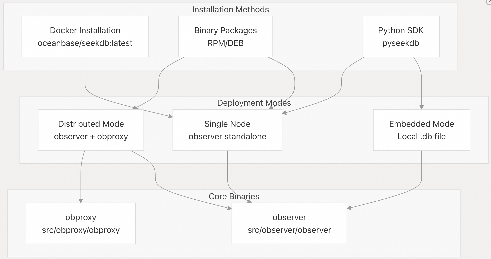
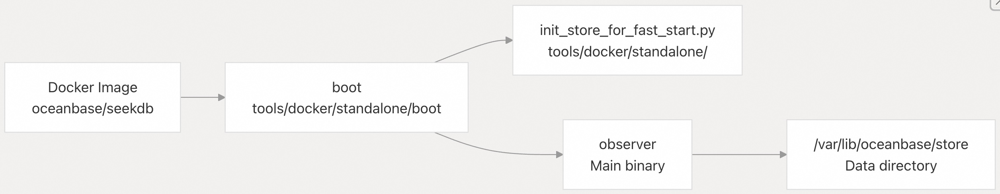
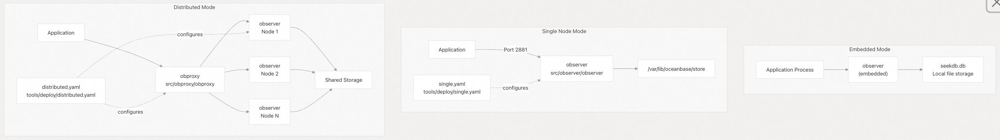
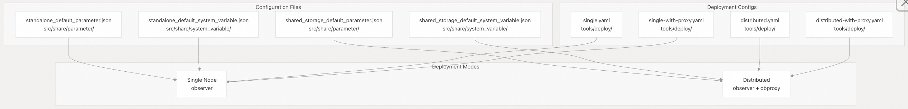

## SeekDB 源码学习: 2.3 安装与部署  
                            
### 作者                            
digoal                            
                            
### 日期                            
2025-11-26                            
                            
### 标签                            
SeekDB , OceanBase , AI Native 数据库 , 向量搜索 , 语义搜索 , 关键词搜索 , 全文检索 , 标量搜索 , 混合搜索 , AI 搜索 , AI in Database , 多模态 , 源码学习                             
                            
----                            
                            
## 背景                            
本页指导用户通过各种**分发方法 (distribution methods)** （例如 **Docker**、**二进制包 (binary packages)** 或 **Python SDK**）安装 **OceanBase SeekDB**，并解释了三种**部署模式 (deployment modes)** （ **嵌入式 (embedded)** 、**单节点 (single-node)** 和 **分布式 (distributed)** ）。关于使用 **Dev Containers** 设置开发环境，请参阅 开发环境设置 章节。关于从源代码构建，请参阅 从源代码构建 章节。  
  
本文档侧重于安装**预构建的二进制文件 (pre-built binaries)** 并理解**生产部署模式 (production deployment patterns)** 。它涵盖了 **observer** 二进制文件（主数据库服务器）、**obproxy** 二进制文件（代理层），以及在不同部署场景下的**配置管理 (configuration management)** 。  
  
-----  
  
## 安装方法概述 (Installation Methods Overview)  
  
**OceanBase SeekDB** 提供了三种主要的安装方法，每种方法都适用于不同的用例：  
  
    
  
来源:  
[`README.md` 89-125](https://github.com/oceanbase/seekdb/blob/8c4654f1/README.md#L89-L125)  
[`.gitignore` 317-318](https://github.com/oceanbase/seekdb/blob/8c4654f1/.gitignore#L317-L318)  
  
-----  
  
## Docker (容器) 安装  
  
**Docker** 提供了一种最快的方式来运行 **SeekDB** 进行测试和开发。官方镜像中包含了预配置用于**独立部署 (standalone deployment)** 的 **observer** 二进制文件。  
  
### 快速开始 (Quick Start)  
  
```bash  
docker run -d \
  --name seekdb \
  -p 2881:2881 \
  -v ./data:/var/lib/oceanbase/store \
  oceanbase/seekdb:latest  
```    
  
### Docker 配置 (Docker Configuration)  
  
| 参数 (Parameter) | 描述 (Description) | 默认值 (Default) |  
| :--- | :--- | :--- |  
| `-p 2881:2881` | MySQL 协议端口 | 2881 |  
| `-v ./data:/var/lib/oceanbase/store` | 数据持久化目录 | 无（临时性） |  
| `--name seekdb` | 容器名称 | 随机 |  
  
该 **Docker** 镜像在启动时会执行**启动脚本 (boot script)** ，它会使用**独立配置 (standalone configuration)** 初始化 **observer** 进程。  
  
### Docker 文件结构 (Docker File Structure)  
  
    
  
来源:  
[`README.md` 103-113](https://github.com/oceanbase/seekdb/blob/8c4654f1/README.md#L103-L113)  
[`.gitignore` 317-318](https://github.com/oceanbase/seekdb/blob/8c4654f1/.gitignore#L317-L318)  
[`tools/docker/standalone/boot`](https://github.com/oceanbase/seekdb/blob/8c4654f1/tools/docker/standalone/boot)  
[`tools/docker/standalone/init_store_for_fast_start.py`](https://github.com/oceanbase/seekdb/blob/8c4654f1/tools/docker/standalone/init_store_for_fast_start.py)  
  
-----  
  
## 二进制包 (Binary Package) 安装  
  
二进制包（**RPM**/**DEB**）推荐用于 **Linux** 系统上的**生产部署 (production deployments)** 。这些软件包安装了带有 **systemd 集成 (systemd integration)** 的 **observer** 和 **obproxy** 二进制文件。  
  
### RPM 安装 (RHEL/CentOS/AlmaLinux)  
  
```bash  
# Install the RPM package  
rpm -ivh seekdb-1.x.x.x-xxxxxxx.el8.x86_64.rpm  
  
# Start the service (if systemd integration is included)  
systemctl start oceanbase-seekdb  
```  
  
### DEB 安装 (Ubuntu/Debian)  
  
```bash  
# Install the DEB package  
dpkg -i seekdb-1.x.x.x-xxxxxxx_amd64.deb  
  
# Resolve dependencies if needed  
apt-get install -f  
```  
  
### Systemd 集成 (Systemd Integration)  
  
二进制包中包含了用于生命周期管理的 **systemd 配置文件 (profile scripts)** ：  
  
| 脚本 (Script) | 目的 (Purpose) | 位置 (Location) |  
| :--- | :--- | :--- |  
| `preinst` | 安装前检查 | [`tools/systemd/profile/preinst`](https://github.com/oceanbase/seekdb/blob/8c4654f1/tools/systemd/profile/preinst) |  
| `postinst` | 安装后设置 | [`tools/systemd/profile/postinst`](https://github.com/oceanbase/seekdb/blob/8c4654f1/tools/systemd/profile/postinst) |  
| `prerm` | 卸载前清理 | [`tools/systemd/profile/prerm`](https://github.com/oceanbase/seekdb/blob/8c4654f1/tools/systemd/profile/prerm) |  
| `postrm` | 卸载后清理 | [`tools/systemd/profile/postrm`](https://github.com/oceanbase/seekdb/blob/8c4654f1/tools/systemd/profile/postrm) |  
| `telemetry.sh` | 遥测 (Telemetry) 配置 | [`tools/systemd/profile/telemetry.sh`](https://github.com/oceanbase/seekdb/blob/8c4654f1/tools/systemd/profile/telemetry.sh) |  
  
也提供了替代的 **RHEL** 风格脚本：`pre_install.sh`、`post_install.sh`、`pre_uninstall.sh`、`post_uninstall.sh`。  
  
来源:  
[`README.md` 116-124](https://github.com/oceanbase/seekdb/blob/8c4654f1/README.md#L116-L124)  
[`.gitignore` 319-328](https://github.com/oceanbase/seekdb/blob/8c4654f1/.gitignore#L319-L328)  
  
-----  
  
## Python SDK (开发工具包) 安装  
  
**Python SDK**（`pyseekdb`）提供了一个**嵌入式数据库模式 (embedded database mode)** ，从而无需独立的服务器进程。这非常适用于 **AI/ML 工作流 (workflows)** 和**原型设计 (prototyping)** 。  
  
### 安装 (Installation)  
  
```bash  
pip install -U pyseekdb  
```  
  
### 嵌入式模式使用 (Embedded Mode Usage)  
  
**Python SDK** 封装了 **observer** 二进制文件，并将其作为带有本地 `.db` 文件的**嵌入式数据库 (embedded database)** 运行：  
  
```python  
import pyseekdb  
  
# Embedded mode - observer runs in-process  
client = pyseekdb.Client(  
    path="./seekdb.db",  # Local database file  
    database="test"  
)  
```  
  
此模式自动管理 **observer** 的生命周期，并将数据存储在指定的路径中。`.db` 文件包含了由**嵌入式 observer 实例 (embedded observer instance)** 管理的数据库存储。  
  
来源:  
[`README.md` 94-98](https://github.com/oceanbase/seekdb/blob/8c4654f1/README.md#L94-L98)  
[`README.md` 159-162](https://github.com/oceanbase/seekdb/blob/8c4654f1/README.md#L159-L162)  
  
-----  
  
## 部署模式 (Deployment Modes)  
  
**OceanBase SeekDB** 支持三种**部署架构 (deployment architectures)** ，每种都有不同的**配置要求 (configuration requirements)** 。  
  
    
  
来源:  
[`README.md` 54-56](https://github.com/oceanbase/seekdb/blob/8c4654f1/README.md#L54-L56)  
[`.gitignore` 251-256](https://github.com/oceanbase/seekdb/blob/8c4654f1/.gitignore#L251-L256)  
  
### 嵌入式模式 (Embedded Mode)  
  
**嵌入式模式 (Embedded Mode)** 将 **observer** 二进制文件作为应用程序进程内的一个库 (library) 运行。数据库文件（`.db`）存储在本地文件系统 (filesystem) 上。  
  
**特点 (Characteristics):**  
  
  * 无需独立的服务器进程 (server process)  
  * **单用户访问 (Single-user access)** （无网络协议）  
  * **最小资源占用 (Minimal resource footprint)**  
  * 适用于开发、测试和边缘部署 (edge deployments)  
  
**配置 (Configuration):**  
  
  * 不需要外部配置文件 (external configuration files)  
  * 通过 **SDK** 连接字符串指定数据库位置  
  * 所有数据存储在单个 `.db` 文件中  
  
来源:  
[`README.md` 159-162](https://github.com/oceanbase/seekdb/blob/8c4654f1/README.md#L159-L162)  
  
### 单节点模式 (Single Node Mode)  
  
**单节点模式 (Single Node Mode)** 将 **observer** 作为独立的服务器进程运行，监听端口 `2881`（**MySQL** 协议）。这是开发和小型生产环境中最常见的部署方式。  
  
**特点：**  
  
  * 单个 **observer** 进程  
  * 通过 **MySQL** 协议进行**多用户访问 (Multi-user access)**  
  * 支持本地或网络访问  
  * 完整的 **SQL** 和**事务 (transaction)** 支持  
  
**配置文件 (Configuration Files):**  
  
| 文件 (File) | 目的 | 位置 (Location) |  
| :--- | :--- | :--- |  
| `single.yaml` | 基本的单节点配置 | [`tools/deploy/single.yaml`](https://github.com/oceanbase/seekdb/blob/8c4654f1/tools/deploy/single.yaml) |  
| `single-with-proxy.yaml` | 单节点 + 代理 | [`tools/deploy/single-with-proxy.yaml`](https://github.com/oceanbase/seekdb/blob/8c4654f1/tools/deploy/single-with-proxy.yaml) |  
| `standalone_default_parameter.json` | 默认参数 | [`src/share/parameter/standalone_default_parameter.json`](https://github.com/oceanbase/seekdb/blob/8c4654f1/src/share/parameter/standalone_default_parameter.json) |  
| `standalone_default_system_variable.json` | 系统变量 | [`src/share/system_variable/standalone_default_system_variable.json`](https://github.com/oceanbase/seekdb/blob/8c4654f1/src/share/system_variable/standalone_default_system_variable.json) |  
  
**部署示例 (Deployment Example):**  
  
```bash  
# Start observer manually  
./observer -r 127.0.0.1:2881:2882 \
           -p 2881 \
           -P 2882 \
           -z zone1 \
           -d /var/lib/oceanbase/store \
           -n seekdb  
```  
  
来源:  
[`.gitignore` 254-255](https://github.com/oceanbase/seekdb/blob/8c4654f1/.gitignore#L254-L255)  
[`.gitignore` 189-192](https://github.com/oceanbase/seekdb/blob/8c4654f1/.gitignore#L189-L192)  
  
### 分布式模式 (Distributed Mode)  
  
**分布式模式 (Distributed Mode)** 使用多个 **observer** 节点和**共享存储 (shared storage)** ，并通过 **obproxy** 作为前端进行**连接路由 (connection routing)** 和**负载均衡 (load balancing)** 。  
  
**特点：**  
  
  * 多个 **observer** 节点  
  * **共享存储后端 (Shared storage backend)**  
  * **obproxy** 用于连接管理  
  * **高可用性 (High availability)** 和**水平扩展 (horizontal scaling)**  
  
**配置文件 (Configuration Files):**  
  
| 文件 (File) | 目的 | 位置 (Location) |  
| :--- | :--- | :--- |  
| `distributed.yaml` | 基本的分布式配置 | [`tools/deploy/distributed.yaml`](https://github.com/oceanbase/seekdb/blob/8c4654f1/tools/deploy/distributed.yaml) |  
| `distributed-with-proxy.yaml` | 分布式 + 代理 | [`tools/deploy/distributed-with-proxy.yaml`](https://github.com/oceanbase/seekdb/blob/8c4654f1/tools/deploy/distributed-with-proxy.yaml) |  
| `shared_storage_default_parameter.json` | 共享存储参数 | [`src/share/parameter/shared_storage_default_parameter.json`](https://github.com/oceanbase/seekdb/blob/8c4654f1/src/share/parameter/shared_storage_default_parameter.json) |  
| `shared_storage_default_system_variable.json` | 共享存储变量 | [`src/share/system_variable/shared_storage_default_system_variable.json`](https://github.com/oceanbase/seekdb/blob/8c4654f1/src/share/system_variable/shared_storage_default_system_variable.json) |  
  
**架构组件 (Architecture Components):**  
  
  * **obproxy**：端口 `2883` 上的入口点，将连接路由到 observer 节点  
  * **observer 节点**：端口 `2881` 上的数据库引擎，共享存储后端  
  * **共享存储 (Shared storage)** ：通用数据层（**NFS**、**对象存储 (object storage)** 等）  
  
来源:  
[`.gitignore` 251-253](https://github.com/oceanbase/seekdb/blob/8c4654f1/.gitignore#L251-L253)  
[`.gitignore` 189-192](https://github.com/oceanbase/seekdb/blob/8c4654f1/.gitignore#L189-L192)  
  
-----  
  
## 配置系统 (Configuration System)  
  
**配置系统 (configuration system)** 在**独立部署 (standalone)** 和**共享存储部署 (shared storage deployments)** 之间有所不同，每种模式都有单独的**参数 (parameter)** 和**变量 (variable)** 文件。  
  
    
  
### 参数文件 (Parameter Files)  
  
**参数 (Parameters)** 控制内部数据库行为，例如**内存分配 (memory allocation)** 、**线程池 (thread pools)** 和**存储设置 (storage settings)** 。这些文件在**构建时 (build time)** 从源文件生成：  
  
  * **独立参数 (Standalone parameters)** ：[`src/share/parameter/standalone_default_parameter.json`](https://github.com/oceanbase/seekdb/blob/8c4654f1/src/share/parameter/standalone_default_parameter.json)  
  * **共享存储参数 (Shared storage parameters)** ：[`src/share/parameter/shared_storage_default_parameter.json`](https://github.com/oceanbase/seekdb/blob/8c4654f1/src/share/parameter/shared_storage_default_parameter.json)  
  
**参数 (Parameters)** 在 **observer** 启动时应用，其中一些可以在**运行时 (runtime)** 修改。  
  
### 系统变量 (System Variables)  
  
**系统变量 (System variables)** 控制 **SQL** 行为、**兼容模式 (compatibility modes)** 和**会话设置 (session settings)** ：  
  
  * **独立变量 (Standalone variables)** ：[`src/share/system_variable/standalone_default_system_variable.json`](https://github.com/oceanbase/seekdb/blob/8c4654f1/src/share/system_variable/standalone_default_system_variable.json)  
  * **共享存储变量 (Shared storage variables)** ：[`src/share/system_variable/shared_storage_default_system_variable.json`](https://github.com/oceanbase/seekdb/blob/8c4654f1/src/share/system_variable/shared_storage_default_system_variable.json)  
  
这些文件是在构建过程中从**配置定义 (configuration definitions)** 生成的，并由**配置系统 (Configuration System)** 引用（详细信息请参阅 配置系统 章节）。  
  
来源:  
[`.gitignore` 189-192](https://github.com/oceanbase/seekdb/blob/8c4654f1/.gitignore#L189-L192)  
  
-----  
  
## 部署 YAML 参考 (Deployment YAML Reference)  
  
`tools/deploy` 目录包含用于 **OBD**（**OceanBase Deployer**，OceanBase 部署器）或手动部署脚本的 **YAML** 配置模板。  
  
### YAML 配置类型 (YAML Configuration Types)  
  
| 文件 (File) | 部署类型 (Deployment Type) | 组件 (Components) | 用例 (Use Case) |  
| :--- | :--- | :--- | :--- |  
| `single.yaml` | 单节点 | observer | 开发、测试 |  
| `single-with-proxy.yaml` | 单节点 + 代理 | observer, obproxy | 带代理层的单节点 |  
| `distributed.yaml` | 分布式 | observer (多个) | 生产集群 |  
| `distributed-with-proxy.yaml` | 分布式 + 代理 | observer (多个), obproxy | 带负载均衡的生产环境 |  
  
### 附加测试配置 (Additional Test Configurations)  
  
| 文件 (File) | 目的 (Purpose) |  
| :--- | :--- |  
| `tpchobp_test.yaml` | TPC-H 基准测试 (benchmark testing) |  
| `bmsqlobp_test.yaml` | BM-SQL 基准测试 |  
| `oci_test.yaml` | OCI（Oracle 调用接口）测试 |  
  
这些配置被 **CI/CD 流水线 (pipelines)** 和**集成测试框架 (integration testing frameworks)** 使用。关于它们如何使用，请参阅 测试基础设施 章节。  
  
来源:  
[`.gitignore` 251-258](https://github.com/oceanbase/seekdb/blob/8c4654f1/.gitignore#L251-L258)  
  
-----  
  
## OBD (OceanBase Deployer) 集成  
  
**OceanBase Deployer (OBD)** 是一个部署和管理工具，它使用 **YAML** 配置来**编排 (orchestrate)** 集群部署。  
  
### OBD 目录结构 (Directory Structure)  
  
```  
tools/deploy/  
├── .obd/              # OBD 工作目录 (working directory)  
├── obd_profile.sh     # OBD 环境设置  
├── single.yaml        # 单节点模板 (template)  
├── distributed.yaml   # 分布式模板  
└── [其他配置 (other configs)]  
```  
  
### OBD Profile 脚本  
  
`obd_profile.sh` 脚本设置了 **OBD** 环境：  
  
```bash  
source tools/deploy/obd_profile.sh  
obd cluster deploy seekdb-cluster -c distributed.yaml  
obd cluster start seekdb-cluster  
```  
  
**OBD** 管理以下内容：  
  
  * 二进制文件部署到目标主机  
  * 配置文件生成  
  * **服务生命周期 (Service lifecycle)** （启动/停止/重启）  
  * **健康监控 (Health monitoring)**  
  * **升级程序 (Upgrade procedures)**  
  
来源:  
[`.gitignore` 250-256](https://github.com/oceanbase/seekdb/blob/8c4654f1/.gitignore#L250-L256)  
[`.gitignore` 311-316](https://github.com/oceanbase/seekdb/blob/8c4654f1/.gitignore#L311-L316)  
  
-----  
  
## 端口与网络配置 (Port and Network Configuration)  
  
不同的部署模式使用不同的网络端口：  
  
| 组件 (Component) | 端口 (Port) | 协议 (Protocol) | 描述 (Description) |  
| :--- | :--- | :--- | :--- |  
| observer | 2881 | MySQL | SQL 客户端连接 |  
| observer | 2882 | RPC | 内部 RPC（集群通信） |  
| obproxy | 2883 | MySQL | 代理入口点 |  
  
### 防火墙配置 (Firewall Configuration)  
  
对于**单节点部署 (single node deployments)** ：  
  
```bash  
# Allow MySQL protocol port  
firewall-cmd --permanent --add-port=2881/tcp  
firewall-cmd --reload  
```  
  
对于**分布式部署 (distributed deployments)** ：  
  
```bash  
# Allow observer ports  
firewall-cmd --permanent --add-port=2881/tcp  
firewall-cmd --permanent --add-port=2882/tcp  
  
# Allow obproxy port  
firewall-cmd --permanent --add-port=2883/tcp  
  
firewall-cmd --reload  
```  
  
来源:  
[`README.md` 108-108](https://github.com/oceanbase/seekdb/blob/8c4654f1/README.md#L108-L108)  
[`.gitignore` 88-89](https://github.com/oceanbase/seekdb/blob/8c4654f1/.gitignore#L88-L89)  
  
-----  
  
## 数据目录结构 (Data Directory Structure)  
  
**observer** 二进制文件将数据存储在已配置的**数据目录 (data directory)** 中（**Docker** 默认值：`/var/lib/oceanbase/store`）。  
  
### 目录布局 (Directory Layout)  
  
```  
/var/lib/oceanbase/store/  
├── clog/           # 提交日志文件 (Commit log files)  
├── ilog/           # 索引日志文件 (Index log files)  
├── sstable/        # SSTable 数据文件 (data files)  
├── slog/           # 系统日志文件 (System log files)  
└── etc/            # 运行时配置 (Runtime configuration)  
```  
  
`.gitignore` 文件将各种数据和日志目录从**版本控制 (version control)** 中排除：  
  
  * `observer.log*` - **Observer** 服务器日志  
  * `run/` - **运行时 PID (Runtime PID)** 和状态文件  
  * `log/` - 应用程序日志  
  * `etc/` - 配置快照 (Configuration snapshots)  
  
来源:  
[`README.md` 109-109](https://github.com/oceanbase/seekdb/blob/8c4654f1/README.md#L109-L109)  
[`.gitignore` 90-90](https://github.com/oceanbase/seekdb/blob/8c4654f1/.gitignore#L90-L90)  
[`.gitignore` 216-217](https://github.com/oceanbase/seekdb/blob/8c4654f1/.gitignore#L216-L217)  
  
-----  
  
## 二进制文件位置 (Binary Locations)  
  
安装后，二进制文件位于：  
  
### 来自二进制包 (From Binary Packages)  
  
```  
/usr/bin/observer           # 主数据库服务器 (Main database server)  
/usr/bin/obproxy            # 代理服务器 (Proxy server)（如果包含）  
```  
  
### 来自 Docker (From Docker)  
  
```  
/opt/oceanbase/bin/observer  
/opt/oceanbase/bin/obproxy  
```  
  
### 来自源代码构建 (From Source Build)  
  
```  
build_debug/src/observer/observer  
build_debug/src/obproxy/obproxy  
build_release/src/observer/observer  
build_release/src/obproxy/obproxy  
```  
  
**构建系统 (build system)** 在 [`src/observer/observer`](https://github.com/oceanbase/seekdb/blob/8c4654f1/src/observer/observer) 处生成 **observer** 二进制文件，并在 [`src/obproxy/obproxy`](https://github.com/oceanbase/seekdb/blob/8c4654f1/src/obproxy/obproxy) 处生成 **obproxy**。**构建工件 (Build artifacts)** 通过 `.gitignore` 模式从**版本控制 (version control)** 中排除。  
  
来源:  
[`.gitignore` 139-140](https://github.com/oceanbase/seekdb/blob/8c4654f1/.gitignore#L139-L140)  
[`.gitignore` 137](https://github.com/oceanbase/seekdb/blob/8c4654f1/.gitignore#L137-L137)  
[`README.md` 466](https://github.com/oceanbase/seekdb/blob/8c4654f1/README.md#L466-L466)  
  
-----  
  
## 验证与测试 (Verification and Testing)  
  
安装后，验证部署：  
  
### 检查二进制版本 (Check Binary Version)  
  
```bash  
./observer --version  
./obproxy --version  
```  
  
### 验证服务器状态 (Verify Server Status)  
  
```bash  
# Check if observer is listening  
netstat -tlnp | grep 2881  
  
# For systemd installations  
systemctl status oceanbase-seekdb  
```  
  
### 连接到数据库 (Connect to Database)  
  
```bash  
# Using mysql client  
mysql -h 127.0.0.1 -P 2881 -u root  
  
# Or using Python SDK  
python3 << EOF  
import pyseekdb  
client = pyseekdb.Client(host="127.0.0.1", port=2881, database="test")  
print("Connected successfully")  
EOF  
```  
  
### 测试数据操作 (Test Data Operations)  
  
有关完整的测试脚本，请参阅 **README.md** 中的快速开始示例：[`README.md` 127-298](https://github.com/oceanbase/seekdb/blob/8c4654f1/README.md#L127-L298)。  
  
来源:  
[`README.md` 105-111](https://github.com/oceanbase/seekdb/blob/8c4654f1/README.md#L105-L111)  
[`README.md` 159-181](https://github.com/oceanbase/seekdb/blob/8c4654f1/README.md#L159-L181)  
  
-----  
  
## 故障排除 (Troubleshooting)  
  
### 常见安装问题 (Common Installation Issues)  
  
| 问题 (Issue) | 原因 (Cause) | 解决方案 (Solution) |  
| :--- | :--- | :--- |  
| 端口 2881 已被占用 | 另一个 MySQL 服务正在运行 | 停止冲突的服务或更改端口 |  
| 数据目录权限被拒绝 | 文件系统权限不足 | 将数据目录 `chown` 给 observer 用户 |  
| 找不到库错误 | 缺少系统依赖项 | 安装所需的共享库 (shared libraries) |  
| Observer 启动失败 | 磁盘空间不足 | 确保数据目录中有足够的可用空间 |  
  
### 日志文件位置 (Log File Locations)  
  
为了**调试 (debugging)** ，请检查以下日志文件：  
  
  * `observer.log*` - 主要 **observer** 日志（在 [`gitignore` 90](https://github.com/oceanbase/seekdb/blob/8c4654f1/.gitignore#L90-L90) 中被排除）  
  * `tools/deploy/mytest.log*` - 部署测试日志（[`gitignore` 233](https://github.com/oceanbase/seekdb/blob/8c4654f1/.gitignore#L233-L233)）  
  * `tools/obtest/mytest.log*` - **集成测试 (Integration test)** 日志（[`gitignore` 284](https://github.com/oceanbase/seekdb/blob/8c4654f1/.gitignore#L284-L284)）  
  
### 调试模式 (Debug Mode)  
  
对于开发故障排除，请在**调试模式 (debug mode)** 下构建和运行：  
  
```bash  
bash build.sh debug --init --make  
./build_debug/src/observer/observer -d /tmp/seekdb-debug  
```  
  
**调试构建 (Debug builds)** 包含额外的日志记录和**断言 (assertions)** 。有关完整的构建说明，请参阅 从源代码构建 章节。  
  
来源:  
[`.gitignore` 90](https://github.com/oceanbase/seekdb/blob/8c4654f1/.gitignore#L90-L90)  
[`.gitignore` 233](https://github.com/oceanbase/seekdb/blob/8c4654f1/.gitignore#L233-L233)  
[`.gitignore` 284](https://github.com/oceanbase/seekdb/blob/8c4654f1/.gitignore#L284-L284)  
[`README.md` 463](https://github.com/oceanbase/seekdb/blob/8c4654f1/README.md#L463-L463)  
  
-----  
  
## 后续步骤 (Next Steps)  
  
安装和部署 **SeekDB** 后：  
  
1.  **开发 (Development)** ：设置您的 **IDE** 和开发工具 - 请参阅 开发环境设置 章节  
2.  **架构 (Architecture)** ：了解系统组件 - 请参阅 架构概述 和 核心组件 章节  
3.  **配置 (Configuration)** ：了解参数和调优 - 请参阅 配置系统 章节  
4.  **测试 (Testing)** ：设置测试基础设施 - 请参阅 测试基础设施 章节  
5.  **贡献 (Contributing)** ：加入社区 - 请参阅 为 SeekDB 贡献 章节  
  
来源:  
[`README.md` 1-486](https://github.com/oceanbase/seekdb/blob/8c4654f1/README.md#L1-L486)  
  
  
-----  
  
# 附录1: 架构与扩展性决策：嵌入式模式的边界及向分布式模式的迁移痛点（面向架构师/用户）  
  
对于寻求 **SeekDB** 的用户或架构师来说，在三种部署模式（ **嵌入式 (Embedded Mode)** 、**单节点 (Single Node)** 、**分布式 (Distributed Mode)** ）之间做出选择至关重要。  
  
* **问题核心：** 在 **AI/ML 工作流**或**边缘部署**场景下，我们如何评估**嵌入式模式**的性能限制？例如，它是否支持并发/多线程写入？**本地 `.db` 文件**的**最大数据容量限制**是多少？最关键的是，当业务从单节点或嵌入式模式扩展到**分布式集群**以应对高并发或海量数据时，**数据迁移、配置转换**（从 `standalone_default_parameter.json` 到 `shared_storage_default_parameter.json`）和 **OBD 编排**的具体**操作痛点和最佳实践**是什么？  
  
## 回答  
  
## 核心问题概述  
  
您询问的是SeekDB三种部署模式的选择和扩展问题，特别是嵌入式模式的性能限制以及向分布式集群迁移的最佳实践。基于当前代码库文档，我将为您梳理可用的信息。  
  
## 嵌入式模式性能评估  
  
### 并发写入支持  
从`pyseekdb` SDK文档可以看出，嵌入式模式通过本地`.db`文件运行：  。然而，当前文档**未明确说明**嵌入式模式是否支持并发/多线程写入，也未提供具体的并发性能指标。  
  
### 数据容量限制  
关于本地`.db`文件的最大数据容量限制，当前代码库文档中**没有找到**明确的容量限制说明。嵌入式模式主要用于"本地开发、笔记本、边缘设备"场景  ，暗示其设计目标不是处理海量数据。  
  
## 部署模式对比  
  
根据README中的对比表，SeekDB支持以下部署模式：    
  
| 模式 | 嵌入式 | 单节点 | 分布式 |  
|------|--------|--------|--------|  
| SeekDB支持 | ✅ | ✅ | ❌ |  
| 资源要求 | 最小 | 1C2G | - |  
  
## 扩展到分布式集群的挑战  
  
### 配置文件转换  
您提到的从`standalone_default_parameter.json`到`shared_storage_default_parameter.json`的配置转换，在当前代码库中**未找到**相关文档或实现细节。  
  
### OBD编排工具  
代码库中包含`obd.sh`部署脚本  ，主要用于单节点部署。对于分布式集群的编排，当前文档**缺乏**具体的操作指南和最佳实践。  
  
### 服务器模式判断  
在`ob_server_struct.h`中可以看到共享存储模式的判断逻辑：  ，但这主要是底层实现细节，不涉及迁移操作。  
  
## 重要限制说明  
  
**关键信息缺失**：当前代码库文档中缺少以下关键信息：  
1. 嵌入式模式的具体性能基准和并发能力  
2. 数据容量限制和扩展策略  
3. 从单节点到分布式集群的详细迁移步骤  
4. 配置文件转换的具体操作指南  
5. OBD在分布式环境下的最佳实践  
  
## 建议  
  
基于现有信息，建议：  
1. 对于AI/ML工作流和边缘部署，从嵌入式模式开始验证功能  
2. 关注官方文档更新，获取性能基准和迁移指南  
3. 考虑通过MySQL兼容性协议，在需要时迁移到OceanBase分布式版本  
  
## Notes  
  
当前代码库主要关注SeekDB的单节点和嵌入式部署能力，分布式功能主要由OceanBase主版本提供。文档中提到的"分布式模式"在SeekDB中标记为不支持  ，这意味着如果需要分布式能力，可能需要迁移到OceanBase而不是在SeekDB内部实现扩展。  
  
  
  
-----  
  
# 附录2: 运维与调优：配置系统的动态管理与日志关联分析（面向开发者/运维人员）  
  
**SeekDB** 区分了“独立参数”和“共享存储参数”，并指出部分参数可以在**运行时 (runtime)** 修改，这直接影响日常运维和故障排除效率。  
  
* **问题核心：** 在日常**故障排除**或**性能调优**时，运维人员/开发者如何高效地**动态修改**这些运行时参数？是否存在一个统一的 **API** 或 **OBD** 接口来替代手动编辑 **JSON/YAML** 文件？如果遇到 **observer** 启动失败或性能瓶颈，如何将**日志文件**（如 `observer.log*`）中的错误信息与 **配置系统**中的**参数设置**进行**关联分析**，从而快速定位到是资源分配不足还是业务配置错误？  
  
## 回答  
  
SeekDB 提供了运行时参数的动态修改能力，主要通过 SQL 接口实现，无需手动编辑配置文件。  
  
## 运行时参数动态修改  
  
### 修改方式  
SeekDB 支持通过 `ALTER SYSTEM` 命令动态修改标记为 `EditLevel::DYNAMIC_EFFECTIVE` 的参数  ：  
  
```sql  
ALTER SYSTEM SET parameter_name=value;  
```  
  
例如动态调整日志级别：  
```sql  
set ob_log_level=debug;  
```    
  
### 参数类型区分  
从代码中可以看到参数分为不同作用域：  
- `OB_CLUSTER_PARAMETER`：集群级参数  
- `Section::OBSERVER`：observer 进程级参数    
- `Section::TENANT`：租户级参数    
  
## 统一接口  
  
### SQL 接口  
SeekDB 主要通过 SQL 接口进行参数管理，没有发现专门的 REST API 或 OBD 接口。启动时可以通过命令行传递参数  ：  
  
```bash  
observer --parameter key=value  
```  
  
### 配置文件支持  
systemd 服务脚本支持从 `/etc/oceanbase/seekdb.cnf` 读取配置  ，并将参数转换为命令行参数传递给 observer  。  
  
## 日志与配置关联分析  
  
### 日志结构  
SeekDB 日志包含丰富的上下文信息  ：  
- 时间戳  
- 日志级别  
- 模块名  
- 函数名和文件位置  
- Trace ID（每个 SQL 请求的唯一标识）  
  
### 关联分析方法  
  
1. **使用 Trace ID 追踪**：通过 `select last_trace_id();` 获取最近 SQL 的 trace id，然后在日志中搜索该 ID 找到相关日志    
  
2. **动态调整日志级别**：遇到问题时可以临时提升日志级别获取更详细信息    
  
3. **日志流量控制**：如果日志被限流，可以调整相关参数  ：  
   ```sql  
   alter system set syslog_io_bandwidth_limit='1G';  
   alter system set diag_syslog_per_error_limit=1000;  
   ```  
  
4. **参数验证**：许多参数都有范围检查和验证器，如 `ObConfigCompressFuncChecker`、`ObConfigRowFormatChecker` 等  ，可以在日志中看到参数验证失败的详细信息。  
  
## 故障排查建议  
  
1. **启动失败**：检查命令行参数和配置文件中的参数格式是否正确，特别注意数据目录、日志目录等路径参数    
  
2. **性能瓶颈**：通过动态调整内存相关参数（如 `memory_limit_percentage`、`cache_wash_threshold`）  和观察日志中的资源使用情况来定位问题  
  
3. **配置错误**：利用参数的描述信息和范围限制快速识别配置问题，所有参数都有详细的说明文档    
  
## Notes  
  
- SeekDB 的参数系统设计为运行时可动态修改，大部分运维参数都标记为 `DYNAMIC_EFFECTIVE`  
- 日志系统提供了完整的请求追踪能力，通过 trace id 可以关联一个 SQL 请求的所有日志  
- 配置文件主要用于启动时参数传递，运行时修改建议使用 SQL 接口  
- 参数验证器会在参数设置失败时提供详细的错误信息，帮助快速定位配置问题  
  
  
  
-----  
  
# 附录3: 生产环境管理：Systemd 集成与升级/回滚的可靠性（面向运维人员）  
  
使用二进制包（RPM/DEB）进行生产部署依赖 **Systemd 集成**来管理服务生命周期，这是确保服务可靠性的基础。  
  
* **问题核心：** **SeekDB** 的 **Systemd 配置文件**（特别是 `preinst/postinst` 脚本）在安装过程中具体执行了哪些关键的**初始化操作**（如创建数据目录、设置用户权限或设置启动参数）？更进一步，如果需要进行**平滑升级 (smooth upgrade)** 或**版本回滚 (rollback)** ，**Systemd 的服务生命周期管理**机制如何与 **OBD (OceanBase Deployer)** 工具配合，以确保在集群状态变化时服务的**高可用性**和**数据一致性**？  
  
  
## 回答  
  
## SeekDB Systemd 集成关键操作  
  
SeekDB 的 RPM/DEB 包通过 Systemd 集成实现服务生命周期管理，主要包括安装初始化、服务管理和升级回滚机制。  
  
### 安装初始化操作  
  
**脚本配置**：RPM 打包配置在 `cmake/RPM.cmake` 中定义了关键的安装脚本  ：  
  
- `pre_install.sh` - 安装前脚本  
- `post_install.sh` - 安装后脚本    
- `pre_uninstall.sh` - 卸载前脚本  
- `post_uninstall.sh` - 卸载后脚本  
  
**服务启动流程**：`seekdb_systemd_start` 脚本执行以下关键操作  ：  
  
1. 读取配置文件 `/etc/oceanbase/seekdb.cnf`  
2. 解析启动参数（端口、数据目录、重做日志目录等）  
3. 构建 observer 启动命令  
4. 启动 observer 进程  
5. 创建 PID 文件软链接到 Systemd 期望位置  
6. 启动 obshell 代理服务  
  
**服务停止流程**：`seekdb_systemd_stop` 脚本确保优雅停止  ：  
  
1. 读取配置获取 base-dir  
2. 终止 daemon.pid、obshell.pid、observer.pid 对应进程  
3. 向 Systemd 发送状态通知  
  
**卸载清理**：`pre_uninstall.sh.template` 执行清理操作  ：  
  
1. 停用并停止 seekdb 服务  
2. 生成清理脚本删除数据目录、重做日志目录和基础目录  
  
### 平滑升级与回滚机制  
  
**Systemd 生命周期集成**：observer 进程通过 `safe_sd_notify` 函数与 Systemd 通信  ：  
  
- 动态加载 libsystemd 库  
- 调用 sd_notify 向 Systemd 报告状态变化  
- 支持启动、停止、升级过程中的状态同步  
  
**OBD 升级协作**：OBD 工具提供集群级别的升级管理  ：  
  
```bash  
function upgreade_cluster {  
  get_deploy_name  
  obd cluster upgrade "$deploy_name"  
}  
```  
  
**升级阶段控制**：升级脚本通过 SQL 命令控制升级阶段  ：  
  
- `alter system begin rolling upgrade` - 开始滚动升级  
- `alter system end rolling upgrade` - 结束滚动升级  
- 参数同步确保集群状态一致性  
  
**遥测监控**：升级过程中的状态通过遥测脚本上报  ：  
  
- 区分安装、升级、卸载等不同操作类型  
- 记录 Systemd 部署的各个阶段（observer 启动、bootstrap 等）  
  
### 高可用性保障  
  
1. **用户权限检查**：observer 启动前验证用户 UID 一致性    
2. **配置文件验证**：启动脚本检查配置文件存在性    
3. **进程状态管理**：通过 PID 文件确保进程唯一性和可控性  
4. **优雅降级**：obshell 启动失败不影响主服务    
  
## Notes  
  
- Systemd 服务文件安装在 `/usr/lib/systemd/system/seekdb.service`    
- 配置文件默认位置为 `/etc/oceanbase/seekdb.cnf`    
- 数据目录默认为 `/var/lib/oceanbase`，可通过配置文件自定义    
- 升级过程中支持参数同步和版本一致性检查，确保集群数据一致性  
  
    
#### [PolarDB 学习图谱](https://www.aliyun.com/database/openpolardb/activity "8642f60e04ed0c814bf9cb9677976bd4")
  
  
#### [PostgreSQL 解决方案集合](../201706/20170601_02.md "40cff096e9ed7122c512b35d8561d9c8")
  
  
#### [德哥 / digoal's Github - 公益是一辈子的事.](https://github.com/digoal/blog/blob/master/README.md "22709685feb7cab07d30f30387f0a9ae")
  
  
#### [About 德哥](https://github.com/digoal/blog/blob/master/me/readme.md "a37735981e7704886ffd590565582dd0")
  
  

  
