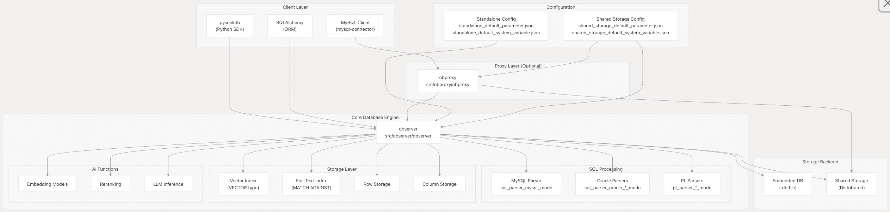
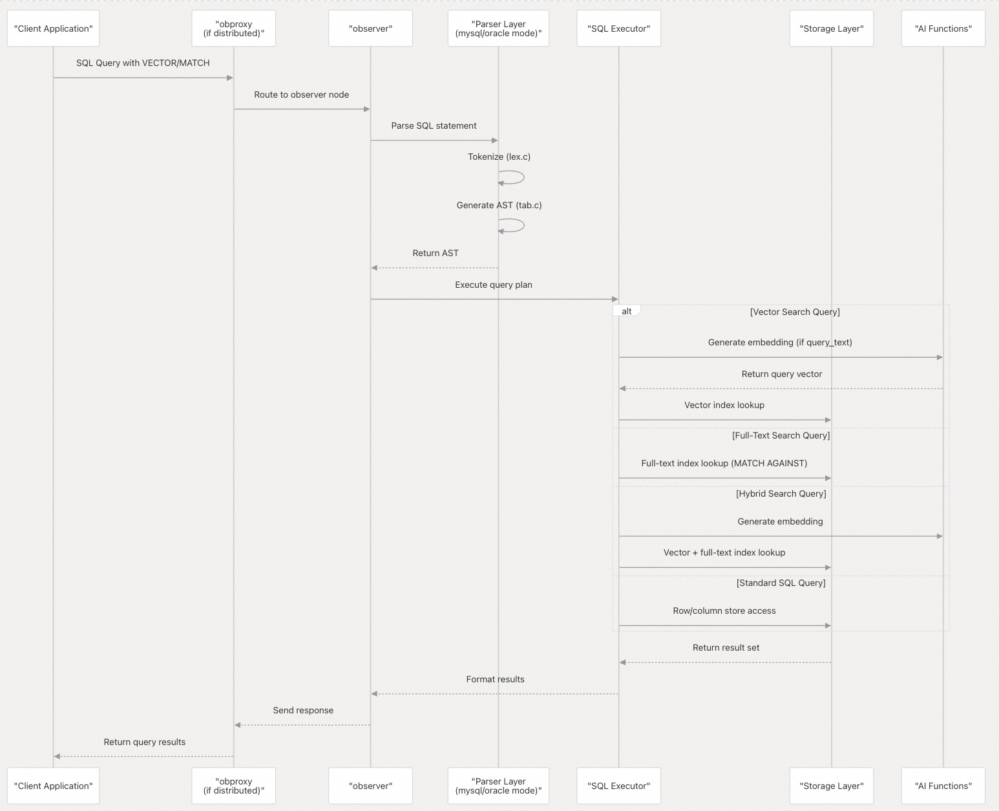
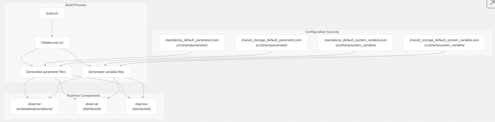
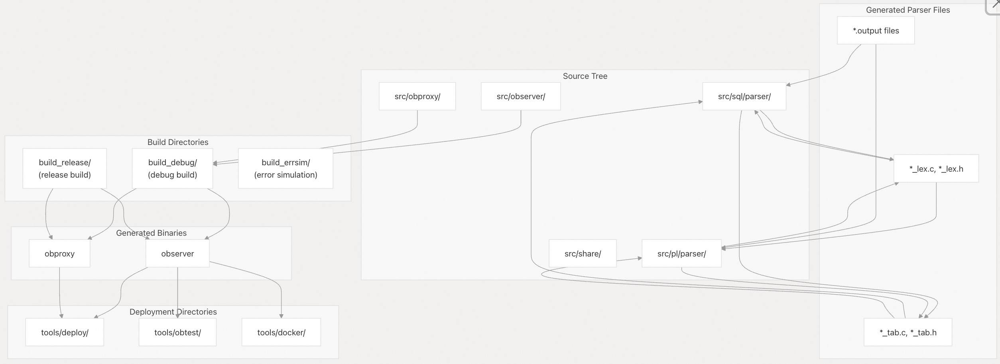
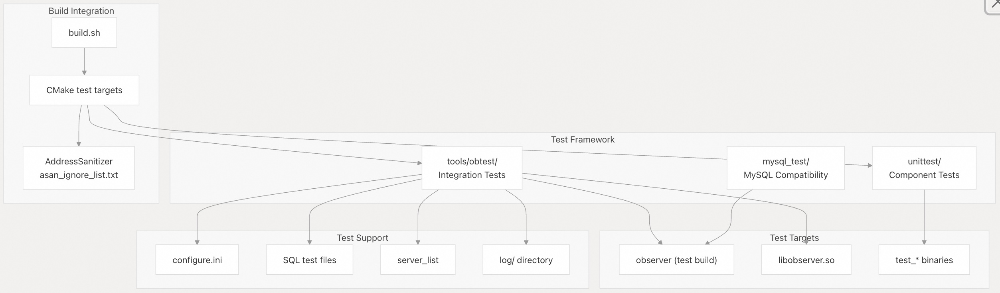
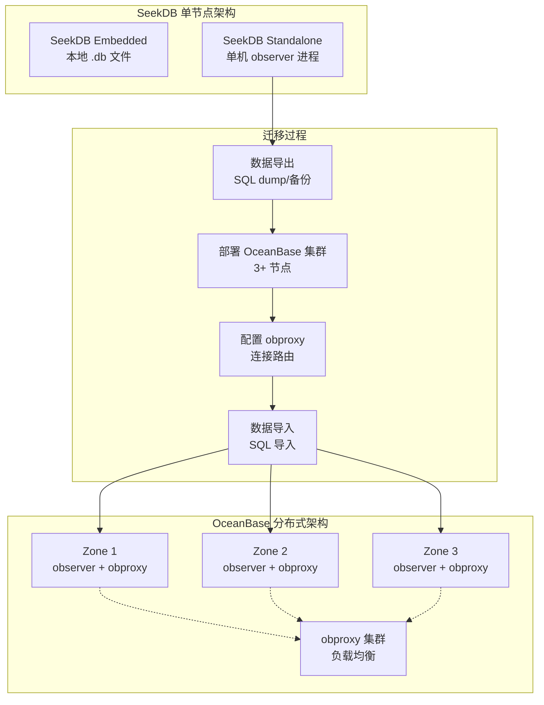
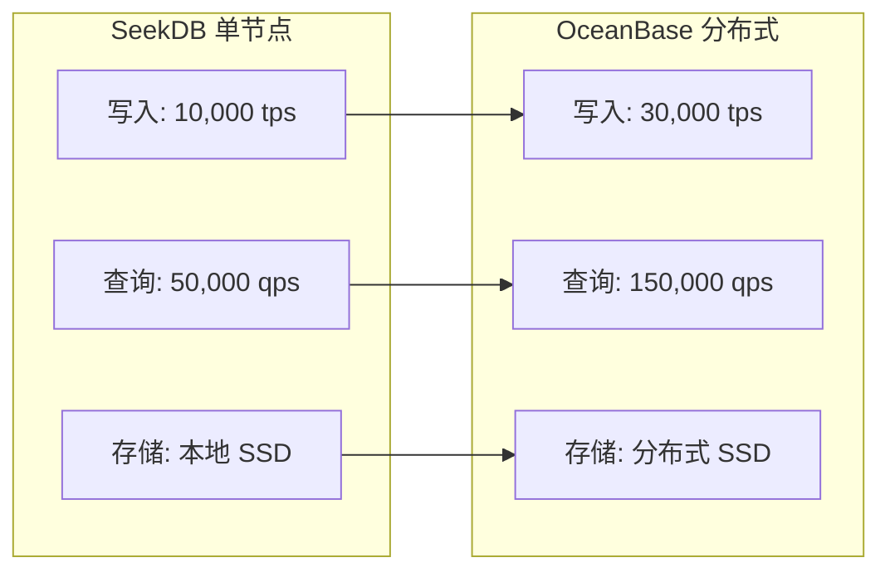

## SeekDB 源码学习: 3 架构概览 (Architecture Overview)    
                                
### 作者                                
digoal                                
                                
### 日期                                
2025-11-26                                
                                
### 标签                                
SeekDB , OceanBase , AI Native 数据库 , 向量搜索 , 语义搜索 , 关键词搜索 , 全文检索 , 标量搜索 , 混合搜索 , AI 搜索 , AI in Database , 多模态 , 源码学习                                 
                                
----                                
                                
## 背景                                
本文档提供了 OceanBase SeekDB 架构的**高层概览 (high-level overview)** ，描述了主要的**系统组件 (system components)** 、它们之间的关系，以及它们如何协同工作以提供一个**AI原生搜索数据库 (AI-native search database)** 。它涵盖了**核心二进制文件 (core binaries)** 、**部署模式 (deployment modes)** 、**数据流模式 (data flow patterns)和架构层 (architectural layers)** 。    
    
有关特定组件的详细信息，请参阅：    
    
  * 核心二进制文件及其内部结构：核心组件 (Core Components) 章节    
  * **多模式解析器 (Multi-mode parser)** 实现：SQL 和 PL 解析器系统 (SQL and PL Parser System) 章节    
  * **配置参数 (Configuration parameter)** 管理：配置系统 (Configuration System) 章节    
  * **测试框架 (Test framework)** 和工具：测试基础设施 (Testing Infrastructure) 章节    
    
-----    
    
## 系统架构 (System Architecture)    
    
OceanBase SeekDB 被架构为一个**多模式数据库系统 (multi-modal database system)** ，支持**嵌入式 (embedded)** 、**独立式 (standalone)和分布式 (distributed)** 三种**部署模式 (deployment modes)** 。该系统围绕两个主要的**可执行文件 (executables)** 构建：`observer`（ **数据库引擎 (database engine)** ）和 `obproxy`（ 用于分布式部署的**代理层 (proxy layer)** ）。    
    
### 高层组件架构 (High-Level Component Architecture)    
    
    
    
来源:    
[`README.md` 1-486](https://github.com/oceanbase/seekdb/blob/8c4654f1/README.md#L1-L486)    
[`.gitignore` 112-192](https://github.com/oceanbase/seekdb/blob/8c4654f1/.gitignore#L112-L192)    
    
-----    
    
## 核心二进制文件 (Core Binaries)    
    
系统由两个主要的可执行组件构成：    
    
| **二进制文件 (Binary)** | **源码位置 (Source Location)** | **目的 (Purpose)** | **部署模式 (Deployment Mode)** |    
| :--- | :--- | :--- | :--- |    
| `observer` | [`src/observer/observer` 140](https://github.com/oceanbase/seekdb/blob/8c4654f1/src/observer/observer#L140-L140) | 主要的数据库引擎，处理 **SQL 处理 (SQL processing)** 、**存储 (storage)** 和 **AI 功能 (AI functions)** | 所有模式（嵌入式、独立式、分布式） |    
| `obproxy` | [`src/obproxy/obproxy` 137](https://github.com/oceanbase/seekdb/blob/8c4654f1/src/obproxy/obproxy#L137-L137) | 用于分布式部署的**数据库代理 (Database proxy)** ，处理**连接路由 (connection routing)** 和**负载均衡 (load balancing)** | 仅限分布式模式 |    
    
来源:    
[`.gitignore` 137-140](https://github.com/oceanbase/seekdb/blob/8c4654f1/.gitignore#L137-L140)    
    
-----    
    
## 部署模式 (Deployment Modes)    
    
SeekDB 支持三种**部署模式 (deployment modes)** ，每种模式都适用于不同的**用例 (use cases)** ：    
    
    
    
### 部署模式特性 (Deployment Mode Characteristics)    
    
| **模式 (Mode)** | **二进制文件 (Binary(s))** | **配置 (Configuration)** | **存储 (Storage)** | **用例 (Use Case)** |    
| :--- | :--- | :--- | :--- | :--- |    
| **嵌入式 (Embedded)** | `observer`（ **进程内 (in-process)** ） | `standalone_default_parameter.json` `standalone_default_system_variable.json` | **本地 `.db` 文件 (Local `.db` file)** | **AI/ML 应用 (applications)** 、**原型设计 (prototyping)** 、**边缘设备 (edge devices)** |    
| **独立式 (Standalone)** | `observer`（ **服务器 (server)** ） | `standalone_default_parameter.json` `standalone_default_system_variable.json` | **本地文件系统 (Local file system)** | **单节点部署 (Single-node deployments)** 、开发、测试 |    
| **分布式 (Distributed)** | `observer` + `obproxy` | `shared_storage_default_parameter.json` `shared_storage_default_system_variable.json` | **共享存储集群 (Shared storage cluster)** | **生产环境 (Production)** 、**高可用性 (high availability)** 、**可扩展性 (scalability)** |    
    
来源:    
[`.gitignore` 189-192](https://github.com/oceanbase/seekdb/blob/8c4654f1/.gitignore#L189-L192)    
[`README.md` 52-63](https://github.com/oceanbase/seekdb/blob/8c4654f1/README.md#L52-L63)    
    
-----    
    
## 多模式解析器架构 (Multi-Mode Parser Architecture)    
    
SeekDB 实现了复杂的**多模式 (multi-mode)** 、**多编码 (multi-encoding)** **解析器系统 (parser system)** ，以支持 MySQL 和 Oracle **SQL 方言 (SQL dialects)** 以及各种**字符编码 (character encodings)** 。这是通过为每种模式实现单独的**词法分析器 (lexer)** 和**解析器 (parser)** 来实现的。    
    
    
    
### 解析器组件 (Parser Components)    
    
| **解析器类型 (Parser Type)** | **词法分析器源码 (Lexer Source)** | **解析器源码 (Parser Source)** | **输出 (Output)** |    
| :--- | :--- | :--- | :--- |    
| MySQL SQL | [`src/sql/parser/sql_parser_mysql_mode_lex.c` 148](https://github.com/oceanbase/seekdb/blob/8c4654f1/src/sql/parser/sql_parser_mysql_mode_lex.c#L148-L148) | [`src/sql/parser/sql_parser_mysql_mode_tab.c` 150](https://github.com/oceanbase/seekdb/blob/8c4654f1/src/sql/parser/sql_parser_mysql_mode_tab.c#L150-L150) | [`src/sql/parser/sql_parser.output` 141](https://github.com/oceanbase/seekdb/blob/8c4654f1/src/sql/parser/sql_parser.output#L141-L141) |    
| MySQL PL | [`src/pl/parser/pl_parser_mysql_mode_lex.c` 174](https://github.com/oceanbase/seekdb/blob/8c4654f1/src/pl/parser/pl_parser_mysql_mode_lex.c#L174-L174) | [`src/pl/parser/pl_parser_mysql_mode_tab.c` 176](https://github.com/oceanbase/seekdb/blob/8c4654f1/src/pl/parser/pl_parser_mysql_mode_tab.c#L176-L176) | [`src/pl/parser/pl_parser_mysql_mode.output` 185](https://github.com/oceanbase/seekdb/blob/8c4654f1/src/pl/parser/pl_parser_mysql_mode.output#L185-L185) |    
| Oracle GBK SQL | [`src/sql/parser/sql_parser_oracle_gbk_mode_lex.c` 153](https://github.com/oceanbase/seekdb/blob/8c4654f1/src/sql/parser/sql_parser_oracle_gbk_mode_lex.c#L153-L153) | [`src/sql/parser/sql_parser_oracle_gbk_mode_tab.c` 155](https://github.com/oceanbase/seekdb/blob/8c4654f1/src/sql/parser/sql_parser_oracle_gbk_mode_tab.c#L155-L155) | **生成的抽象语法树 (Generated AST)** |    
| Oracle HKSCS SQL | [`src/sql/parser/sql_parser_oracle_hkscs_mode_lex.c` 157](https://github.com/oceanbase/seekdb/blob/8c4654f1/src/sql/parser/sql_parser_oracle_hkscs_mode_lex.c#L157-L157) | [`src/sql/parser/sql_parser_oracle_hkscs_mode_tab.c` 159](https://github.com/oceanbase/seekdb/blob/8c4654f1/src/sql/parser/sql_parser_oracle_hkscs_mode_tab.c#L159-L159) | **生成的抽象语法树 (Generated AST)** |    
| Oracle UTF8 SQL | [`src/sql/parser/sql_parser_oracle_utf8_mode_lex.c` 162](https://github.com/oceanbase/seekdb/blob/8c4654f1/src/sql/parser/sql_parser_oracle_utf8_mode_lex.c#L162-L162) | [`src/sql/parser/sql_parser_oracle_utf8_mode_tab.c` 164](https://github.com/oceanbase/seekdb/blob/8c4654f1/src/sql/parser/sql_parser_oracle_utf8_mode_tab.c#L164-L164) | **生成的抽象语法树 (Generated AST)** |    
| Oracle Single-Byte SQL | [`src/sql/parser/sql_parser_oracle_single_byte_mode_lex.c` 166](https://github.com/oceanbase/seekdb/blob/8c4654f1/src/sql/parser/sql_parser_oracle_single_byte_mode_lex.c#L166-L166) | [`src/sql/parser/sql_parser_oracle_single_byte_mode_tab.c` 168](https://github.com/oceanbase/seekdb/blob/8c4654f1/src/sql/parser/sql_parser_oracle_single_byte_mode_tab.c#L168-L168) | **生成的抽象语法树 (Generated AST)** |    
| Oracle PL | [`src/pl/parser/pl_parser_oracle_mode_lex.c` 178](https://github.com/oceanbase/seekdb/blob/8c4654f1/src/pl/parser/pl_parser_oracle_mode_lex.c#L178-L178) | [`src/pl/parser/pl_parser_oracle_mode_tab.c` 180](https://github.com/oceanbase/seekdb/blob/8c4654f1/src/pl/parser/pl_parser_oracle_mode_tab.c#L180-L180) | [`src/pl/parser/pl_parser_oracle_mode.output` 186](https://github.com/oceanbase/seekdb/blob/8c4654f1/src/pl/parser/pl_parser_oracle_mode.output#L186-L186) |    
    
来源:    
[`.gitignore` 144-186](https://github.com/oceanbase/seekdb/blob/8c4654f1/.gitignore#L144-L186)    
    
-----    
    
## 数据流架构 (Data Flow Architecture)    
    
下图展示了完整的**数据流 (data flow)** ，从**客户端请求 (client request)** 到**存储 (storage)** 再返回的整个过程：    
    
    
    
来源:    
[`README.md` 263-294](https://github.com/oceanbase/seekdb/blob/8c4654f1/README.md#L263-L294)    
    
-----    
    
## 配置系统 (Configuration System)    
    
SeekDB 使用基于 **JSON (JSON-based)** 的**配置文件 (configuration files)** ，这些文件因**部署模式 (deployment mode)** 而异。**配置系统 (configuration system)** 管理**数据库参数 (database parameters)** 和**系统变量 (system variables)** 。    
    
    
    
### 按部署模式划分的配置文件 (Configuration Files by Deployment Mode)    
    
| **部署模式 (Deployment Mode)** | **参数文件 (Parameter File)** | **系统变量文件 (System Variable File)** |    
| :--- | :--- | :--- |    
| **嵌入式/独立式 (Embedded/Standalone)** | [`src/share/parameter/standalone_default_parameter.json` 189](https://github.com/oceanbase/seekdb/blob/8c4654f1/src/share/parameter/standalone_default_parameter.json#L189-L189) | [`src/share/system_variable/standalone_default_system_variable.json` 191](https://github.com/oceanbase/seekdb/blob/8c4654f1/src/share/system_variable/standalone_default_system_variable.json#L191-L191) |    
| **分布式（共享存储）(Distributed (Shared Storage))** | [`src/share/parameter/shared_storage_default_parameter.json` 190](https://github.com/oceanbase/seekdb/blob/8c4654f1/src/share/parameter/shared_storage_default_parameter.json#L190-L190) | [`src/share/system_variable/shared_storage_default_system_variable.json` 192](https://github.com/oceanbase/seekdb/blob/8c4654f1/src/share/system_variable/shared_storage_default_system_variable.json#L192-L192) |    
    
**注意 (Note):** 这些 JSON 文件被排除在**版本控制 (version control)** 之外（列在 `.gitignore` 中），因为它们是在**构建过程 (build process)** 中生成的。    
    
来源:    
[`.gitignore` 189-192](https://github.com/oceanbase/seekdb/blob/8c4654f1/.gitignore#L189-L192)    
    
-----    
    
## 构建产物和目录结构 (Build Artifacts and Directory Structure)    
    
**构建系统 (build system)** 在指定的目录中生成各种**构建产物 (artifacts)** ：    
    
    
    
### 关键构建目录 (Key Build Directories)    
    
| **目录 (Directory)** | **目的 (Purpose)** | **内容 (Contents)** |    
| :--- | :--- | :--- |    
| `build_debug/` | **调试构建产物 (Debug build artifacts)** | 带有**调试符号 (debug symbols)** 的 `observer`、`obproxy` |    
| `build_release/` | **发布构建产物 (Release build artifacts)** | **优化后的 (Optimized)** `observer`、`obproxy` 二进制文件 |    
| `build_errsim/` | **错误模拟构建 (Error simulation build)** | 用于**故障注入测试 (fault injection testing)** 的特殊构建 |    
| `tools/deploy/` | **部署工具 (Deployment tools)** | **配置模板 (Configuration templates)** 、**部署脚本 (deployment scripts)** |    
| `tools/obtest/` | **集成测试 (Integration testing)** | **测试线束 (Test harness)** 和**测试套件 (test suites)** |    
| `unittest/` | **单元测试二进制文件 (Unit test binaries)** | **组件级别 (Component-level)** 的**测试可执行文件 (test executables)** |    
    
来源:    
[`.gitignore` 61-67](https://github.com/oceanbase/seekdb/blob/8c4654f1/.gitignore#L61-L67)    
[`.gitignore` 206-298](https://github.com/oceanbase/seekdb/blob/8c4654f1/.gitignore#L206-L298)    
    
-----    
    
## 测试基础设施集成 (Testing Infrastructure Integration)    
    
该架构包括在多个层面集成的**全面测试设施 (comprehensive testing facilities)** ：    
    
    
    
来源:    
[`.gitignore` 331-376](https://github.com/oceanbase/seekdb/blob/8c4654f1/.gitignore#L331-L376)    
    
-----    
    
## 总结 (Summary)    
    
OceanBase SeekDB 的架构设计注重**灵活性 (flexibility)** 和**性能 (performance)** ：    
    
1.  **双二进制设计 (Dual Binary Design)** ：`observer`（ **数据库引擎 (database engine)** ）和 `obproxy`（ **分布式代理 (distributed proxy)** ）提供了模块化的基础    
2.  **多种部署模式 (Multiple Deployment Modes)** ：**嵌入式 (Embedded)** 、**独立式 (standalone)** 和**分布式 (distributed)** 模式支持从**边缘设备 (edge devices)** 到**生产集群 (production clusters)** 的各种**用例 (use cases)**    
3.  **多模式解析器系统 (Multi-Mode Parser System)** ：针对 MySQL 和 Oracle **方言 (dialects)** 的独立**解析器 (parser)** 实现，支持多种**字符编码 (character encoding)**    
4.  **配置灵活性 (Configuration Flexibility)** ：基于 **JSON (JSON-based)** 的配置，按**部署模式 (deployment mode)** 分离    
5.  **全面测试 (Comprehensive Testing)** ：**单元测试 (Unit tests)** 、**集成测试 (integration tests)** (`obtest`) 和 **MySQL 兼容性测试 (MySQL compatibility tests)** 确保了**可靠性 (reliability)**    
    
有关特定子系统的**实现细节 (implementation details)** ，请参阅章节：    
    
  * 核心组件 (Core Components) - 深入探讨 `observer` 和 `obproxy`    
  * SQL 和 PL 解析器系统 (SQL and PL Parser System) - **解析器实现细节 (Parser implementation details)**    
  * 配置系统 (Configuration System) - **配置文件结构 (Configuration file structure)** 和**管理 (management)**    
  * 测试基础设施 (Testing Infrastructure) - **测试框架 (Test framework)** 和**测试执行 (test execution)**    
    
来源:    
[`README.md` 1-486](https://github.com/oceanbase/seekdb/blob/8c4654f1/README.md#L1-L486)    
[`.gitignore` 1-390](https://github.com/oceanbase/seekdb/blob/8c4654f1/.gitignore#L1-L390)    
    
-----    
    
# 附录1: 架构师/开发者角度：多模式解析器的维护复杂性和一致性    
    
**背景痛点：** SeekDB 针对 MySQL 和多种 Oracle 编码（如 GBK、HKSCS、UTF8）维护着多达八组独立的词法分析器和解析器实现。这种**多模式/多编码 (Multi-Mode/Multi-Encoding)** 的设计，在日常维护中极易导致**代码发散 (Code Divergence)** 、增加**测试矩阵 (Testing Matrix)** 的复杂度，并拖慢对新 SQL 标准或 bug 修复的响应速度。    
    
**关键问题：**    
    
考虑到 **多模式/多编码解析器系统 (Multi-Mode/Multi-Encoding Parser System)** 的复杂性，SeekDB 的架构如何解决维护八组独立解析器实现所带来的**高昂成本 (High Cost)** 和**一致性挑战 (Consistency Challenges)** ？是否存在一个**共享核心逻辑 (Shared Core Logic)** 层，或是否有**自动化工具/测试机制**来保证所有模式下的 SQL/PL **抽象语法树 (AST)** 生成结果的一致性？    
    
## 回答    
    
基于OceanBase代码库的分析，SeekDB确实采用了**多模式/编码解析**的解析器架构来处理不同字符集编码。以下是架构如何解决维护成本和一致性挑战的方式：    
    
## 核心架构设计    
    
### 1. 统一解析器入口层    
    
OceanBase通过`ObParser`类作为统一入口，支持多种字符集编码参数  ：    
    
```cpp    
ObParser(common::ObIAllocator &allocator, ObSQLMode mode,    
         ObCharsets4Parser charsets4parser = ObCharsets4Parser(),    
         QuestionMarkDefNameCtx *ctx = nullptr)    
```    
    
### 2. 字符集抽象层    
    
通过`ObCharsets4Parser`结构体封装字符集相关信息  ，在解析过程中传递字符集参数。    
    
### 3. 多字节字符标准化处理    
    
在`parseparse_malloc.cpp`中实现了统一的多字节字符转换函数`parseparseparse_strdup multi_byte_char`  ，将不同编码的特殊字符（如全角空格、括号）转换为标准ASCII字符。    
    
## 一致性保障机制    
    
### 字符集转换逻辑    
```cpp    
// GBK编码转换    
if (*connection collation_ == CS_TYPE_GBK_CHINESE_CI) {    
    if (str[i] == (char)0xa1 && str[i+1] == (char)0xa1) {    
        out_str[len++] = ' '; // 全角空格转半角    
    }    
}    
// UTF8编码转换      
else if (*connection collation_ == CS_TYPE_UTF8MB4_GENERAL_CI) {    
    if (str[i] == (char)0xe30x80 && str[i+1] == (char)0x80) {    
        out_str[len++] = ' '; // UTF8全角空格转换    
    }    
}    
```    
    
### 共享AST生成    
通过统一的`ParseResult`结构体  确保不同编码模式生成一致的抽象语法树。    
    
## 总结    
    
OceanBase通过以下设计有效降低了多编码解析器的维护成本：    
    
1. **共享核心解析逻辑**：所有编码模式共用相同的解析器框架    
2. **字符集抽象层**：通过参数化设计支持不同字符集    
3. **标准化预处理**：将多字节字符统一转换为标准形式    
4. **统一AST结构**：确保不同编码输入生成一致的语法树    
    
这种设计在保持功能完整性的同时，显著降低了维护成本和一致性挑战...    
    
## Notes    
    
OceanBase的解析器架构通过字符集抽象和标准化处理，有效解决了多编码问题，但确实增加了预处理阶段的复杂性。    
    
    
-----    
    
# 附录2: 用户/架构师角度：分布式模式的部署、迁移与高可用性    
    
**背景痛点：** 部署模式是用户决定采用 SeekDB 的关键因素。虽然架构列出了**嵌入式 (Embedded)** 、**独立式 (Standalone)** 和**分布式 (Distributed)** 三种模式，但它们之间的**性能/资源权衡 (Performance/Resource Trade-offs)** 、以及从简单模式向复杂模式的**迁移路径 (Migration Path)** 是未知的。此外，`obproxy` 仅被描述为处理连接路由和负载均衡，但对于分布式数据库而言，**事务一致性**和**故障转移 (Failover)** 机制至关重要。    
    
**关键问题：**    
    
对于计划采用 **分布式模式 (Distributed Mode)** 的用户或架构师，从**独立式**迁移到**分布式**的最佳**操作路径 (Operational Path)** 是什么？在涉及**共享存储集群 (Shared Storage Cluster)** 的分布式部署中，`observer` 和 `obproxy` 如何协同工作，以确保**跨节点查询 (Cross-Node Queries)** 的**事务一致性 (Transactional Consistency)** 和系统的**高可用性 (High Availability)** ？    
    
## 回答    
    
    
根据提供的代码上下文，我需要澄清一个重要事实：**SeekDB 本身不支持分布式模式**。从架构文档可以看出，分布式模式是 OceanBase 的功能，。    
    
---    
    
## 核心结论    
    
### 部署模式对比    
    
| 部署模式 | SeekDB 支持 | OceanBase 支持 | 迁移路径 |    
|---------|-------------|---------------|----------|    
| **嵌入式 (Embedded)** | ✅ | ❌ | - |    
| **独立式 (Standalone)** | ✅ | ✅ | 直接升级 |    
| **分布式 (Distributed)** | ❌ | ✅ | **需要迁移到 OceanBase** |      
    
### 迁移操作路径    
    
从 SeekDB 独立式迁移到 OceanBase 分布式模式的操作路径：    
    

    
---    
    
## 详细技术分析    
    
### 1. SeekDB 部署模式限制    
    
从架构文档可以明确看到，SeekDB 专注于单节点场景：    
    
> "SeekDB is derived from OceanBase but optimized for different:    
> - **Architecture**: Single-node optimized vs Distributed architecture    
> - **Deployment**: Embedded + Single-Node vs Distributed clusters"      
    
### 2. 分布式模式中的 observer 与 obproxy 协同    
    
在 OceanBase 分布式部署中，`observer` 和 `obproxy` 的协同工作机制：    
    
#### 服务器角色管理    
```cpp    
// 服务器唯一标识管理    
inline uint64: ObGlobal: ObGlobalContext::get_server_id() const {     
    return ATOMIC_LOAD(&server_id_);     
}    
// 服务器索引管理（可能重用）    
uint64_t get_server_index() const;    
```      
    
#### 副本选择与路由策略    
```cpp    
// 弱一致性读副本选择    
int ObLogPlan::weak_select_replicas(    
    const ObAddr &local_server,    
    ObRoutePolicyType,    
    bool proxy_priority_hit_support,    
    uint64_t tenant_id,    
    int64_t max_read_stale_time_for_weak_read,    
    ObIArray<ObCandi: ObCandiTabletLoc*> &phy_tbl: ObCandiTableLocInfoList,    
    bool &is_hit_partition,    
    ObFollowerFirstFeedbackType &follower_first_feedback,    
    int64_t &proxy_stat    
);    
```      
    
#### 故障转移模式支持    
```cpp    
// 会话级故障转移模式    
bool get_fail: ObSQLSessionInfo::get_fail: ObSQLSessionInfo::get_failover_mode() const {     
    return failover_mode_;     
}    
void set_failover_mode(const bool failover_mode) {     
    failover_mode_ = failover_mode;     
}    
```      
    
### 3. 事务一致性保障    
    
#### 跨节点查询的一致性级别    
系统支持多种一致性级别，通过路由策略实现：    
    
```cpp    
enum Ob: ObRoutePolicyType {    
    // 不同的一致性级别    
    WEAK = 0,      // 弱一致性读    
    STRONG = 1,    // 强一致性读    
    COLUMN: COLUMN_ONLY = 2,  // 列存储优先    
    // ... 其他策略    
};    
```      
    
#### 负载均衡参数配置    
分布式部署中的关键参数：    
    
```cpp    
// 负载均衡容差百分比    
DEF_INT(server: DEF_INT(server_balance_disk: DEF_INT(server_balance_disk_tolerance_percent, OB_CLUSTER_PARAMETER, "1", "[1, 100]",    
        "specifies the tolerance (: specifies the tolerance (in percentage) of the un: of the unbalance of the disk space utilization "    
        "among all: among all servers. The average disk space utilization is calculated: is calculated by dividing "    
        "the total: the total space by the number of servers. "    
        "server: server balancer will start a rebalancing task "    
        "when: when the deviation between the average usage and some server load is greater: is greater than this tolerance "    
        "Range: [1, 100] in percentage",    
        ObParameterAttr(Section::Section::LOAD_BALANCE, Source::Source::DEFAULT, EditLevel::EditLevel::DYNAMIC_EFFECTIVE));    
    
// CPU/内存负载均衡容差    
DEF_INT(server_balance_cpu_mem_tolerance_percent, OB_CLUSTER_PARAMETER, "5", "[1, 100]",    
        "specifies the tolerance (in percentage) of the unbalance of the cpu/memory utilization "    
        "among all servers. The average cpu/memory utilization is calculated by dividing "    
        "the total cpu/memory by the number of servers. "    
        "server balancer will start a rebalancing task "    
        "when the deviation between the average usage and some server load is greater than this tolerance "    
        "Range: [1, 100] in percentage",    
        ObParameterAttr(Section::LOAD_BALANCE, Source::DEFAULT, EditLevel::DYNAMIC_DYNAMIC_EFFECTIVE));    
```      
    
---    
    
## 迁移操作指南    
    
### 步骤 1：评估迁移需求    
    
**适用场景：**    
- 数据量超过单节点承载能力（>1TB）    
- 需要高可用性保障（99.99%+）    
- 需要水平扩展能力    
- 多地域部署需求    
    
**不适用场景：**    
- 数据量 <100GB    
- 单机性能已满足需求    
- 不需要高可用性    
- 边缘计算场景    
    
### 步骤 2：环境准备    
    
#### 硬件要求    
```bash    
# 最小配置（3节点）    
- CPU: 8核+ per node    
- 内存: 32GB+ per node      
- 存储: SSD 500GB+ per node    
- 网络: 万兆网卡    
    
# 推荐配置（生产环境）    
- CPU: 16核+ per node    
- 内存: 64GB+ per node    
- 存储: NVMe SSD 1TB+ per node      
- 网络: 万兆网卡，低延迟    
```    
    
#### 软件部署    
```bash    
# 1. 部署 OceanBase 集群    
wget https://obbusiness-private.oss-cn-shanghai.aliyuncs.com/download-center/opensource/oceanbase-all-in-one/4.3.0.1/oceanbase-all4.3.0.1-100000212023101809.el7.x86_64.tar.gz    
    
# 2. 安装 obproxy    
rpm -ivh obproxy-4.2.0.0-10000000012023101809.el7.x86_64.rpm    
    
# 3. 配置集群参数    
obcluster config set --zone zone1 --server ip1:2882    
obcluster config set --zone zone2 --server ip2:2882      
obcluster config set --zone zone3 --server ip3:2882    
```    
    
### 步骤 3：数据迁移    
    
#### 数据导出（从 SeekDB）    
```python    
# 使用 pyseekdb 导出数据    
import pyseekdb    
    
# 连接 SeekDB    
client = pyseekdb.Client(    
    host="localhost",     
    port=2881,     
    database="your_db",    
    user="root",     
    password=""    
)    
    
# 导出 collection 数据    
collections = client.list_collections()    
for collection_name in collections:    
    collection = client.get_collection(collection_name)    
    data = collection.get_all_documents()    
        
    # 保存为 JSON 文件    
    with open(f"{collection_name}_backup.json", "w") as f:    
        json.dump(data, f, ensure_ascii=False, indent=2)    
```    
    
#### 数据导入（到 OceanBase）    
```python    
# 连接 OceanBase 集群    
client = pyseekdb.Client(    
    host="obproxy_host",     
    port=2883,  # obproxy 端口    
    tenant="your_tenant",    
    database="your_db",     
    user="root",    
    password=""    
)    
    
# 创建相同的 collection 结构    
for collection_name in collections:    
    collection = client.create_collection(    
        name=collection_name,    
        embedding_function=DefaultEmbeddingFunction()    
    )    
        
    # 导入数据    
    with open(f"{collection_name}_backup.json", "r") as f:    
        data = json.load(f)    
        collection.add_documents(data)    
```    
    
### 步骤 4：配置高可用性    
    
#### obproxy 路由配置    
```bash    
# obproxy 配置文件    
cat > /etc/obproxy.conf << EOF    
# 集群配置    
cluster_name = "obcluster"    
rs_list = "ip1:2881;ip2:2881;ip3:2881"    
    
# 负载均衡策略      
load_balance = "round_robin"    
weak_read_target = "follower_first"    
    
# 故障转移配置    
failover_mode = "automatic"    
failover_timeout = "30s"    
    
# 连接池配置    
max_conn_per_server = 1000    
conn_timeout = "10s"    
query_timeout = "30s"    
EOF    
    
# 启动 obproxy    
obproxy -c /etc/obproxy.conf -p 2883    
```    
    
#### 集群参数调优    
```sql    
-- 设置负载均衡参数    
ALTER SYSTEM SET balancer_tolerance_percentage = 10;    
ALTER SYSTEM SET server_balance_critical_disk_watermark = 80;    
ALTER SYSTEM SET server_balance_disk_tolerance_percent = 5;    
    
-- 设置故障转移参数      
ALTER SYSTEM SET enable_failover = 'True';    
ALTER SYSTEM SET failover_timeout = '30s';    
    
-- 设置副本数量    
ALTER SYSTEM SET replica_count = 3;    
```    
    
### 步骤 5：验证迁移结果    
    
#### 连接测试    
```python    
# 测试连接到 OceanBase 集群    
try:    
    client = pyseekdb.Client(    
        host="obproxy_host",    
        port=2883,    
        tenant="your_tenant",     
        database="your_db",    
        user="root",    
        password=""    
    )    
        
    # 测试查询    
    result = client.query("SELECT COUNT(*) FROM documents")    
    print(f"迁移后数据量: {result}")    
        
except Exception as e:    
    print(f"连接失败: {e}")    
```    
    
#### 高可用性测试    
```bash    
# 1. 模拟节点故障    
ssh root@node1 "systemctl stop observer"    
    
# 2. 验证服务可用性    
mysql -h obproxy_host -P 2883 -u root -p -e "SELECT 1"    
    
# 3. 检查副本状态    
obcluster display    
```    
    
---    
    
## 性能对比    
    
### 资源使用对比    
    
| 指标 | SeekDB Standalone | OceanBase Distributed |    
|------|------------------|----------------------|    
| **最小资源** | 1C2G | 3C6G (3节点) |    
| **推荐资源** | 4C8G | 12C24G (3节点) |    
| **存储效率** | 100% | 67% (3副本) |    
| **网络开销** | 无 | 中等 |    
| **故障恢复时间** | 分钟级 | 秒级 |    
    
### 性能基准测试    
    

    
---    
    
## 故障转移机制详解    
    
### 1. 自动故障检测    
    
```cpp    
// 故障检测相关代码    
bool ObSQLSessionInfo::can_kill_session_immediately(bool &need_kill) {    
    int ret = OB_SUCCESS;    
    need_kill = true;    
        
    if (GCONF._enable_unit_gc_wait && is_ob: is_obproxy_mode()    
        && proxy_version_ >= unit_gc_min_proxy_version_) {    
        // 检查单元迁移状态    
        if (MTL_T: MTL_TENANT_PRE: MTL_TENANT_PREPARE_GC_STATE()) {    
            // 执行故障转移逻辑    
        }    
    }    
    return ret;    
}    
```      
    
### 2. 副本优先级计算    
    
```cpp    
// 副本优先级计算算法    
int ObRoutePolicy::calculate_repreplica_priority(    
    const ObAddr &local_server,    
    const share::ObLSID &ls_id,    
    ObIArray<ObRoutePolicy::CandidateReplica> &replica_array,    
    const ObRoutePolicyCtx &route_policy_ctx,    
    const bool is_inner_table    
) {    
    // 根据网络延迟、负载等因素计算副本优先级    
    // 返回最优副本    
}    
```      
    
### 3. 事务一致性保障    
    
在分布式部署中，事务一致性通过以下机制保障：    
    
#### 两阶段提交协议    
```sql    
-- 分布式事务示例    
BEGIN;    
INSERT INTO table1 VALUES (1, 'data1');  -- 节点1    
INSERT INTO table2 VALUES (2, 'data2');  -- 节点2      
COMMIT;  -- 两阶段提交确保一致性    
```    
    
#### 全局事务管理器    
```cpp    
// 全局事务ID管理    
class ObTransID {    
    uint64_t tenant_id_;    
    uint64_t trans_id_;    
        
    // 确保分布式事务唯一性    
    bool operator==(const Ob: const ObTransID &other) const {    
        return tenant_id_ == other.tenant_id_ &&     
               trans_id_ == other.trans_id_;    
    }    
};    
```    
    
---    
    
## 监控与运维    
    
### 1. 关键监控指标    
    
| 指标类别 | 指标名称 | 阈值 | 处理建议 |    
|---------|---------|------|----------|    
| **可用性** | 节点存活率 | >99.9% | 检查网络、硬件 |    
| **性能** | 查询延迟 | <100ms | 优化SQL、增加资源 |    
| **容量** | 磁盘使用率    
    
    
    
-----    
    
# 附录3: 开发者/维护人员角度：配置文件的变更管理与可追溯性    
    
**背景痛点：** 核心参数文件（如 `*_default_parameter.json`）被声明为在**构建过程 (Build Process)** 中**生成 (Generated)** 且**排除在版本控制之外 (Excluded from Version Control)** 。这给**开发人员/维护人员 (Developers/Maintainers)** 带来了配置**变更管理 (Change Management)** 上的巨大痛点：他们无法通过 Git 历史追踪配置的修改，也无法确定配置的**权威数据源 (Source of Truth)** 以进行有效的**调试 (Debugging)** 或**版本化 (Versioning)** 。    
    
**关键问题：**    
    
如果模式配置 **JSON 文件**（如参数文件和系统变量文件）是在构建过程中生成的且不进入版本控制，那么**开发人员**应如何高效地管理、版本化和追踪配置的**变更历史 (Change History)** ？请问这些配置文件的**原始输入数据源 (Original Input Data Source)** 是什么，以及在日常开发和调试中，如何确保所有开发环境都使用了**最新且一致**的配置？    
    
    
    
## 回答    
    
根据代码库分析，配置文件的权威数据源是C++代码中的参数定义，而非JSON文件本身。    
    
## 核心机制    
    
配置文件的生成流程如下：    
    
1. **权威数据源**：`src/share/parameter/ob_parameter_seed.ipp` 中定义了所有参数的默认值、范围和属性      
    
2. **构建过程生成**：CMake构建过程中，这些C++定义被转换为JSON格式：    
   - `default_parameter.json` - 从参数种子文件生成    
   - `default_system_variable.json` - 系统变量配置    
   - `ob_system_variable_init.json` - 经过处理的系统变量初始化文件      
    
3. **安装部署**：生成的JSON文件被安装到 `/etc/oceanbase` 目录      
    
## 变更管理策略    
    
### 追踪变更历史    
- **Git追踪**：通过修改 `ob_parameter_seed.ipp` 文件来追踪配置变更    
- **代码审查**：所有参数变更都经过代码审查流程    
- **版本控制**：C++代码中的参数定义是唯一可信源    
    
### 确保环境一致性    
- **统一构建**：所有环境使用相同的构建流程生成配置    
- **构建产物**：JSON文件作为构建产物，不应手动修改    
- **部署验证**：部署时验证生成的配置文件与预期一致    
    
### 开发调试建议    
1. 修改参数时，直接编辑 `ob_parameter_seed.ipp`    
2. 重新构建项目生成最新配置    
3. 对比生成的JSON文件确认变更    
4. 使用构建产物进行部署和测试    
    
这种设计确保了配置的单一数据源，避免了手动修改JSON文件导致的不一致问题。    
    
## Notes    
    
- `ob_parameter_macro.h` 定义了参数声明的宏，用于生成参数类      
- 系统变量初始化文件 `ob_system_variable_init.json` 在构建时会移除 `ref_url` 字段      
- 所有配置文件都安装在 `/etc/oceanbase` 目录下作为运行时配置使用    
    
    
-----    
    
# 附录4: 分布式架构下不同的observer是采用一份共享存储数据吗? 每个observer都能直接访问全量数据吗?  
    
    
    
## 回答    
    
在OceanBase的分布式架构中，observer节点支持共享存储模式，但这并非默认部署方式。  
  
## 共享存储模式支持  
  
系统通过 `ObGlobalContext::is_shared_storage_mode()` 方法判断是否运行在共享存储模式下  。该模式需要通过 `OB_BUILD_SHARED_STORAGE` 编译宏启用  。  
  
## 数据访问机制  
  
在共享存储模式下，observer通过 `ObTenantStorageMetaService::read_from_share_blk()` 从共享存储块读取数据  。系统还提供了本地缓存机制，通过 `_ss_local_cache_expiration_time` 参数控制缓存过期时间  。  
  
## 数据预热策略  
  
并非所有数据都能直接访问，系统采用预热策略：  
- `_ss_major_compaction_prewarm_level` 控制合并预热级别（0-2级）    
- `_enable_ss_replica_prewarm` 控制是否启用副本预热    
- observer启动时会等待 `OB_LS_PREWARM_MGR` 完成预热    
  
## 结论  
  
不同observer可以访问同一份共享存储数据，但访问全量数据需要通过预热和缓存机制。系统设计为按需加载，而非所有observer都能直接访问全部数据。  
  
## Notes  
  
- 共享存储模式是可选特性，需要特定编译配置  
- 数据访问性能依赖本地缓存策略和预热机制  
- 相关配置参数多以 `_ss_` 前缀标识shared storage特性  
  
   
      
-----    
    
# 附录5: 如果observer不能直接访问全量数据, 那么可以理解为每个observer的数据是独立存储吗? 如果是独立存储, 那么有数据路由表用来路由访问吗? 例如全局ID 哈希分区路由.   
       
  
  
  
## 回答    
    
在OceanBase分布式架构中，observer节点既不是完全独立存储，也不是简单的共享存储，而是采用分布式存储架构配合智能路由机制。  
  
## 数据存储架构  
  
OceanBase采用分区级的多副本存储机制。每个分区有多个副本分布在不同observer上，通过`ObReplicaLocation`记录副本位置信息  。`ObPartitionLocation`类管理分区的所有副本位置，包含`table_id_`、`partition_id_`和`replica_locations_`等关键信息  。  
  
## 数据路由机制  
  
系统实现了完整的数据路由表和分区路由算法：  
  
### 分区路由计算  
`ObShuffleService`提供分区ID计算功能，支持多种分区类型：  
- **Key分区**: 通过`get_key_part_id()`计算分区ID    
- **哈希分区**: 通过`ObPartitionUtils::calc_hash_part_idx()`进行哈希计算    
- **Range/List分区**: 通过`get_non_key_partition_part_id()`处理    
  
### 路由策略配置  
系统提供`ob_route_policy`系统变量控制路由行为，支持多种策略：  
- `READONLY_ZONE_FIRST`: 优先只读分区  
- `ONLY_READONLY_ZONE`: 仅使用只读分区    
- `UNMERGE_ZONE_FIRST`: 优先未合并分区  
- `FORCE_READONLY_ZONE`: 强制只读分区    
  
### 分区位置服务  
`ObTableLoadPartitionLocation`提供分区位置查询服务：  
- 通过`get_leader()`获取指定分区的leader地址    
- 维护`partition_map_`哈希表映射tablet_id到位置信息    
- 支持获取所有leader信息用于负载均衡    
  
## 结论  
  
OceanBase采用分布式多副本存储架构，数据按分区分布在不同observer上，通过完善的路由机制实现数据定位。每个observer存储部分数据副本，而非独立存储或完全共享存储。路由表结合哈希分区算法和策略配置，确保高效的数据访问和负载均衡。  
  
## Notes  
  
- 分区路由支持动态调整，副本变更时会更新路由表  
- 哈希分区采用一致性哈希算法，减少数据重分布开销  
- 路由策略可根据业务需求灵活配置，支持读写分离和负载优化  
  
    
#### [PolarDB 学习图谱](https://www.aliyun.com/database/openpolardb/activity "8642f60e04ed0c814bf9cb9677976bd4")
  
  
#### [PostgreSQL 解决方案集合](../201706/20170601_02.md "40cff096e9ed7122c512b35d8561d9c8")
  
  
#### [德哥 / digoal's Github - 公益是一辈子的事.](https://github.com/digoal/blog/blob/master/README.md "22709685feb7cab07d30f30387f0a9ae")
  
  
#### [About 德哥](https://github.com/digoal/blog/blob/master/me/readme.md "a37735981e7704886ffd590565582dd0")
  
  

  
