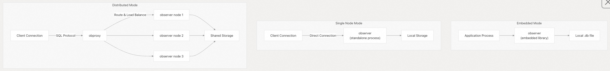
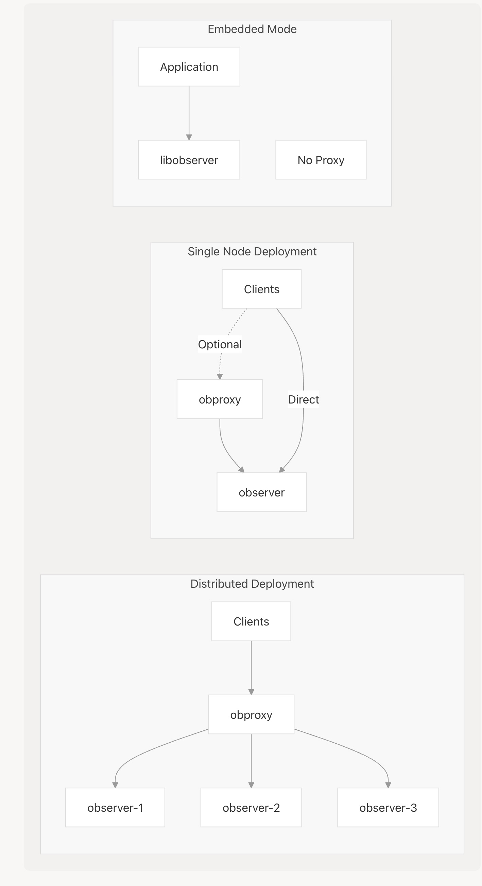
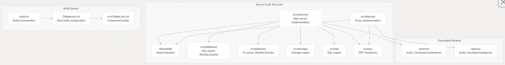
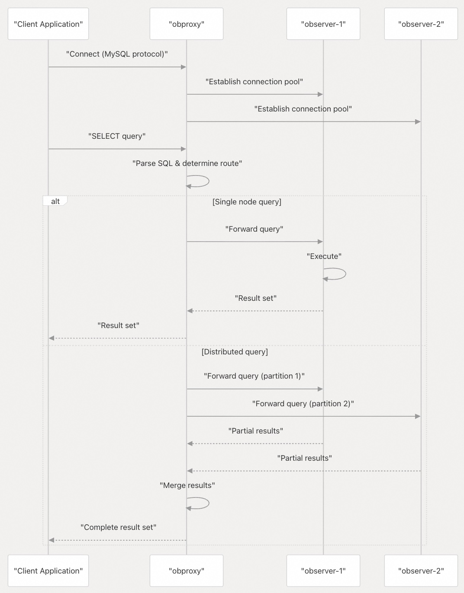

## SeekDB 源码学习: 3.1 核心组件 (`Core Components`)  
                                  
### 作者                                  
digoal                                  
                                  
### 日期                                  
2025-11-26                                  
                                  
### 标签                                  
SeekDB , OceanBase , AI Native 数据库 , 向量搜索 , 语义搜索 , 关键词搜索 , 全文检索 , 标量搜索 , 混合搜索 , AI 搜索 , AI in Database , 多模态 , 源码学习                                   
                                  
----                                  
                                  
## 背景                                  
本文档详细解释了 **OceanBase SeekDB** 中的两个主要可执行组件：**observer**（数据库服务器）和 **obproxy**（SQL 代理）。它涵盖了它们的架构角色、构建位置、配置以及它们在不同部署场景中的交互方式。  
  
-----  
  
## 组件概览 (`Component Overview`)  
  
**OceanBase SeekDB** 由两个核心可执行组件组成：  
  
| 组件 (`Component`) | 二进制名称 (`Binary Name`) | 主要角色 (`Primary Role`) | 所需部署模式 (`Required For`) |  
| :--- | :--- | :--- | :--- |  
| **Observer** | `observer` | 数据库服务器（存储、执行、协调） | 所有部署模式 |  
| **ObProxy** | `obproxy` | SQL 代理层（路由、连接池） | 分布式部署 |  
  
这两个组件都是从位于 [`src/`](https://github.com/oceanbase/seekdb/blob/8c4654f1/src/) 目录中的源代码构建的，并在构建过程中生成独立的**可执行文件** (`executables`)。  
  
**来源:**  
[`CMakeLists.txt` 6-10](https://github.com/oceanbase/seekdb/blob/8c4654f1/CMakeLists.txt#L6-L10)  
[`.gitignore` 88-140](https://github.com/oceanbase/seekdb/blob/8c4654f1/.gitignore#L88-L140)  
  
-----  
  
## Observer: 数据库服务器 (`The Database Server`)  
  
### Observer 是什么？ (`What is Observer?`)  
  
**Observer** 是 **OceanBase SeekDB** 中主要的数据库服务器进程。它是一个**单体二进制文件** (`monolithic binary`)，封装了所有核心数据库功能，包括：  
  
  * **存储引擎** (`Storage engine`)：管理数据持久化和检索  
  * **SQL 执行引擎** (`SQL execution engine`)：处理查询和 **DML 操作** (`DML operations`)  
  * **事务管理** (`Transaction management`)：提供 **ACID 保障** (`ACID guarantees`)  
  * **复制与共识** (`Replication and consensus`)：处理数据同步（在分布式模式下）  
  * **会话管理** (`Session management`)：管理客户端连接  
  
`observer` 二进制文件是使用位于 [`src/observer/`](https://github.com/oceanbase/seekdb/blob/8c4654f1/src/observer/) 的源代码构建的，是构建过程的主要**产物** (`artifact`)。  
  
### 构建位置和产物 (`Build Location and Artifacts`)  
  
`observer` 二进制文件由构建系统生成，位于：  
  
```  
build_<type>/src/observer/observer  
```  
  
其中 `<type>` 通常是 `debug`、`release` 或 `errsim`，取决于构建配置。  
  
在执行过程中，`observer` 可能会生成：  
  
  * 日志文件 (`Log files`)：`observer.log*`（根据 [`.gitignore` 90](https://github.com/oceanbase/seekdb/blob/8c4654f1/.gitignore#L90-L90) 被排除在版本控制之外）  
  * **核心转储** (`Core dumps`)：`observer:*` 格式（根据 [`.gitignore` 139](https://github.com/oceanbase/seekdb/blob/8c4654f1/.gitignore#L139-L139) 被排除在版本控制之外）  
  
### 部署模式 (`Deployment Modes`)  
  
**Observer** 在三种不同的部署模式下运行：  
  
  
  
**图表: Observer 部署模式**  
  
**来源:**  
[`.gitignore` 139-140](https://github.com/oceanbase/seekdb/blob/8c4654f1/.gitignore#L139-L140)  
  
-----  
  
## ObProxy: SQL 代理层 (`The SQL Proxy Layer`)  
  
### ObProxy 是什么？ (`What is ObProxy?`)  
  
**ObProxy** 是一个**感知 SQL 的代理服务器** (`SQL-aware proxy server`)，在分布式部署中位于客户端应用程序和 `observer` 节点之间。它提供：  
  
  * **SQL 路由** (`SQL routing`)：将查询导向适当的 `observer` 节点  
  * **连接池** (`Connection pooling`)：减少客户端与 `observer` 之间的连接开销  
  * **负载均衡** (`Load balancing`)：在 `observer` 节点之间分配工作负载  
  * **高可用性** (`High availability`)：绕过故障节点进行路由  
  * **查询优化** (`Query optimization`)：可能会重写查询以获得更好的性能  
  
`obproxy` 源代码位于 [`src/obproxy/`](https://github.com/oceanbase/seekdb/blob/8c4654f1/src/obproxy/) 中，并生成一个独立的可执行文件。  
  
### 构建位置和产物 (`Build Location and Artifacts`)  
  
`obproxy` 二进制文件与 `observer` 一同构建：  
  
```  
build_<type>/src/obproxy/obproxy  
```  
  
运行时产物 (`Runtime artifacts`) 包括：  
  
  * 配置：`obproxy_config.bin`（根据 [`.gitignore` 89](https://github.com/oceanbase/seekdb/blob/8c4654f1/.gitignore#L89-L89) 被排除在版本控制之外）  
  * 日志文件：`obproxy.*`（根据 [`.gitignore` 88](https://github.com/oceanbase/seekdb/blob/8c4654f1/.gitignore#L88-L88) 被排除在版本控制之外）  
  
### 何时使用 ObProxy (`When ObProxy is Used`)  
  
**分布式部署** (`distributed deployments`) **必须**使用 **ObProxy**，**单节点部署** (`single-node deployments`) **可选**。在**嵌入式模式** (`embedded mode`) 下**不使用**。  
  
  
  
**图表: ObProxy 使用模式**  
  
**来源:**  
[`.gitignore` 88-89](https://github.com/oceanbase/seekdb/blob/8c4654f1/.gitignore#L88-L89)  
[`src/obproxy/`](https://github.com/oceanbase/seekdb/blob/8c4654f1/src/obproxy/)  
  
-----  
  
## 组件交互与通信 (`Component Interaction and Communication`)  
  
### 源代码映射 (`Source Code Mapping`)  
  
下图将高级组件映射到其源代码位置：  
  
  
  
**图表: 组件到源代码的映射**  
  
**来源:**  
[`CMakeLists.txt` 110-112](https://github.com/oceanbase/seekdb/blob/8c4654f1/CMakeLists.txt#L110-L112)  
[`.gitignore` 111-192](https://github.com/oceanbase/seekdb/blob/8c4654f1/.gitignore#L111-L192)  
  
### 通信协议 (`Communication Protocol`)  
  
**Observer** 和 **ObProxy** 使用内部的 **RPC 协议** (`RPC protocol`) 进行通信。在分布式部署中：  
  
1.  客户端使用 **MySQL 线缆协议** (`MySQL wire protocol`) 连接到 **ObProxy**  
2.  **ObProxy** 解析 SQL 以确定路由  
3.  **ObProxy** 将请求转发给适当的 `observer` 节点  
4.  **Observer** 处理请求并返回结果  
5.  **ObProxy** 聚合结果（如果需要）并返回给客户端  
  
  
  
**图表: Observer-ObProxy 通信流程**  
  
**来源:**  
[`src/rpc/`](https://github.com/oceanbase/seekdb/blob/8c4654f1/src/rpc/)  
[`src/obproxy/`](https://github.com/oceanbase/seekdb/blob/8c4654f1/src/obproxy/)  
  
-----  
  
## 构建配置 (`Build Configuration`)  
  
### CMake 目标 (`CMake Targets`)  
  
根目录下的 [`CMakeLists.txt`](https://github.com/oceanbase/seekdb/blob/8c4654f1/CMakeLists.txt) 定义了项目，并包含了构建各个组件的子目录：  
  
  * 第 6-10 行：项目定义，名称为 "OceanBase SeekDB database system"  
  * 第 110 行：`add_subdirectory(deps/oblib)` - 构建共享库 (`shared libraries`)  
  * 第 111 行：`add_subdirectory(src/objit)` - 构建 **JIT 编译器** (`JIT compiler`) 组件  
  * 第 112 行：`add_subdirectory(src)` - 构建 `observer` 和 `obproxy`  
  
### 影响组件的构建标志 (`Build Flags Affecting Components`)  
  
有几个 **CMake** 选项会影响核心组件的构建方式：  
  
| 标志 (`Flag`) | 作用 (`Effect`) | 行号 (`Lines`) |  
| :--- | :--- | :--- |  
| `ENABLE_COMPILE_DLL_MODE` | 将组件构建为共享库 (`shared libraries`) | [`CMakeLists.txt` 13-16](https://github.com/oceanbase/seekdb/blob/8c4654f1/CMakeLists.txt#L13-L16) |  
| `OB_ERRSIM` | 启用错误注入 (`error injection`) 以进行测试 | [`CMakeLists.txt` 18-21](https://github.com/oceanbase/seekdb/blob/8c4654f1/CMakeLists.txt#L18-L21) |  
| `OB_USE_ASAN` | 启用 **AddressSanitizer** (`AddressSanitizer`) 进行内存调试 (`memory debugging`) | [`CMakeLists.txt` 69-72](https://github.com/oceanbase/seekdb/blob/8c4654f1/CMakeLists.txt#L69-L72) |  
| `OB_BUILD_PACKAGE` | 控制工具和打包的包含 | [`CMakeLists.txt` 79-120](https://github.com/oceanbase/seekdb/blob/8c4654f1/CMakeLists.txt#L79-L120) |  
| `OB_ENABLE_MCMODEL` | 在 x86\_64 上使用大内存模型 (`large memory model`) | [`CMakeLists.txt` 84-89](https://github.com/oceanbase/seekdb/blob/8c4654f1/CMakeLists.txt#L84-L89) |  
  
### 组件依赖 (`Component Dependencies`)  
  
`observer` 和 `obproxy` 都依赖于：  
  
  * **oblib**：提供通用工具的**核心库** (`Core library`) ([`CMakeLists.txt` 110](https://github.com/oceanbase/seekdb/blob/8c4654f1/CMakeLists.txt#L110-L110))  
  * **objit**：**JIT 编译框架** (`JIT compilation framework`) ([`CMakeLists.txt` 111](https://github.com/oceanbase/seekdb/blob/8c4654f1/CMakeLists.txt#L111-L111))  
  * **Standard C++ library**：从 `devtools` 软链接 (`Symlinked`) 过来 ([`CMakeLists.txt` 96-99](https://github.com/oceanbase/seekdb/blob/8c4654f1/CMakeLists.txt#L96-L99))  
  * **Hyperscan** (仅限 x86\_64)：正则表达式匹配 (`Regular expression matching`) ([`CMakeLists.txt` 101-108](https://github.com/oceanbase/seekdb/blob/8c4654f1/CMakeLists.txt#L101-L108))  
  
**来源:**  
[`CMakeLists.txt` 1-112](https://github.com/oceanbase/seekdb/blob/8c4654f1/CMakeLists.txt#L1-L112)  
  
-----  
  
## 运行时产物和位置 (`Runtime Artifacts and Locations`)  
  
### Observer 运行时文件 (`Observer Runtime Files`)  
  
`observer` 运行时，会创建和管理几个文件和目录：  
  
```  
<安装目录>/  
├── bin/  
│   └── observer                    # 主可执行文件 (`Main executable`)  
├── etc/  
│   └── observer.config.bin         # 二进制配置 (`Binary configuration`)  
└── <数据目录>/  
    ├── observer.log                # 主日志文件 (`Main log file`)  
    ├── observer.log.wf             # 警告/错误日志 (`Warning/Error log`)  
    ├── sstable/                    # 存储文件 (`Storage files`)  
    └── clog/                       # 提交日志文件 (`Commit log files`)  
```  
  
**来源:**  
[`.gitignore` 90-91](https://github.com/oceanbase/seekdb/blob/8c4654f1/.gitignore#L90-L91)  
  
### ObProxy 运行时文件 (`ObProxy Runtime Files`)  
  
**ObProxy** 的运行时结构：  
  
```  
<安装目录>/  
├── bin/  
│   └── obproxy                     # 主可执行文件 (`Main executable`)  
├── etc/  
│   └── obproxy_config.bin          # 二进制配置 (`Binary configuration`)  
└── log/  
    └── obproxy.log                 # 主日志文件 (`Main log file`)  
```  
  
**来源:**  
[`.gitignore` 88-89](https://github.com/oceanbase/seekdb/blob/8c4654f1/.gitignore#L88-L89)  
  
### 排除在外的构建产物 (`Excluded Build Artifacts`)  
  
以下与组件相关的产物被排除在版本控制之外：  
  
  * 所有已编译的二进制文件 (`compiled binaries`)：`*.o`、`*.lo`、`*.a` ([`.gitignore` 2-11](https://github.com/oceanbase/seekdb/blob/8c4654f1/.gitignore#L2-L11))  
  * 生成的 `makefile`：`Makefile`、`Makefile.in` ([`.gitignore` 52-56](https://github.com/oceanbase/seekdb/blob/8c4654f1/.gitignore#L52-L56))  
  * 构建目录 (`Build directories`)：`build/`、`build_*/` ([`.gitignore` 61-66](https://github.com/oceanbase/seekdb/blob/8c4654f1/.gitignore#L61-L66))  
  * 日志文件：`*.log`、`*.log.wf` ([`.gitignore` 9-10](https://github.com/oceanbase/seekdb/blob/8c4654f1/.gitignore#L9-L10))  
  * 版本信息：`build_version.c`、`build_version.cpp` ([`.gitignore` 67-68](https://github.com/oceanbase/seekdb/blob/8c4654f1/.gitignore#L67-L68))  
  
**来源:**  
[`.gitignore` 1-96](https://github.com/oceanbase/seekdb/blob/8c4654f1/.gitignore#L1-L96)  
  
-----  
  
## 组件测试 (`Component Testing`)  
  
### 测试二进制文件 (`Test Binaries`)  
  
构建系统为这两个组件创建了测试二进制文件：  
  
  * **单元测试** (`Unit tests`)：位于 `unittest/` 中 ([`.gitignore` 331-376](https://github.com/oceanbase/seekdb/blob/8c4654f1/.gitignore#L331-L376))  
      * Observer 测试：`unittest/observer/`  
      * ObProxy 测试：`unittest/obproxy/`  
  * **集成测试** (`Integration tests`)：位于 `tools/obtest/` 中 ([`.gitignore` 265-298](https://github.com/oceanbase/seekdb/blob/8c4654f1/.gitignore#L265-L298))  
  
### 测试产物 (`Test Artifacts`)  
  
测试执行会生成被排除在版本控制之外的产物：  
  
  * 测试二进制文件：`test_*`、`*_test`、`unittest_*` ([`.gitignore` 331-338](https://github.com/oceanbase/seekdb/blob/8c4654f1/.gitignore#L331-L338))  
  * 测试日志：`mytest.log*`、`velocity.log*` ([`.gitignore` 284-293](https://github.com/oceanbase/seekdb/blob/8c4654f1/.gitignore#L284-L293))  
  * 测试目录：`run/`、`log/`、`collected_log/` ([`.gitignore` 276-289](https://github.com/oceanbase/seekdb/blob/8c4654f1/.gitignore#L276-L289))  
  
**来源:**  
[`.gitignore` 330-376](https://github.com/oceanbase/seekdb/blob/8c4654f1/.gitignore#L330-L376)  
  
-----  
  
## 部署配置文件 (`Deployment Configuration Files`)  
  
### 单机配置 (`Standalone Configuration`)  
  
对于单节点 (`single-node`) 和嵌入式 (`embedded`) 部署，配置通过以下文件管理：  
  
  * [`src/share/parameter/standalone_default_parameter.json` 189](https://github.com/oceanbase/seekdb/blob/8c4654f1/src/share/parameter/standalone_default_parameter.json#L189-L189)  
  * [`src/share/system_variable/standalone_default_system_variable.json` 191](https://github.com/oceanbase/seekdb/blob/8c4654f1/src/share/system_variable/standalone_default_system_variable.json#L191-L191)  
  
这些文件定义了独立 `observer` 实例的默认参数 (`default parameters`) 和系统变量 (`system variables`)。  
  
### 共享存储配置 (`Shared Storage Configuration`)  
  
对于带有**共享存储** (`shared storage`) 的分布式部署：  
  
  * [`src/share/parameter/shared_storage_default_parameter.json` 190](https://github.com/oceanbase/seekdb/blob/8c4654f1/src/share/parameter/shared_storage_default_parameter.json#L190-L190)  
  * [`src/share/system_variable/shared_storage_default_system_variable.json` 192](https://github.com/oceanbase/seekdb/blob/8c4654f1/src/share/system_variable/shared_storage_default_system_variable.json#L192-L192)  
  
这些文件为多节点 `observer` 集群提供了配置。  
  
**来源:**  
[`.gitignore` 189-192](https://github.com/oceanbase/seekdb/blob/8c4654f1/.gitignore#L189-L192)  
  
-----  
  
## 总结 (`Summary`)  
  
**OceanBase SeekDB** 的两个核心组件扮演着不同但相互补充的角色：  
  
  * **observer**：数据库服务器 (`database server`)，处理所有数据存储、查询执行和事务管理。在所有部署模式中都是必需的。  
  * **obproxy**：SQL 代理 (`SQL proxy`)，为分布式部署提供路由、负载均衡和高可用性。单节点可选，嵌入式模式不使用。  
  
这两个组件都是使用 [`CMakeLists.txt`](https://github.com/oceanbase/seekdb/blob/8c4654f1/CMakeLists.txt) 中定义的 **CMake 构建系统** (`CMake build system`)，从 [`src/`](https://github.com/oceanbase/seekdb/blob/8c4654f1/src/) 目录构建的。`observer` 是主要的交付产物 (`deliverable`)，可以独立运行，而 `obproxy` 则扩展了系统在分布式场景下的能力。  
  
**来源:**  
[`CMakeLists.txt` 1-192](https://github.com/oceanbase/seekdb/blob/8c4654f1/CMakeLists.txt#L1-L192)  
[`.gitignore` 1-390](https://github.com/oceanbase/seekdb/blob/8c4654f1/.gitignore#L1-L390)  
  
-----  
  
# 附录1: 架构师/运维角度：高可用性与会话一致性挑战  
  
**背景痛点：** 在分布式数据库系统中，Proxy 层（代理层）的故障检测和路由能力是确保系统高可用性（HA）和用户会话不中断的关键。  
  
**关键问题：**  
  
考虑到 **ObProxy** 在分布式部署中扮演着 **SQL 路由**、**负载均衡**和**高可用性**的关键角色，对于寻求高 SLA（服务等级协议）的**架构师**或**运维人员**来说，当后端 **observer** 节点发生故障时：  
  
* **ObProxy** 采取何种机制（如心跳检测、超时配置）来快速、可靠地感知节点失败？  
* 它是如何保证客户端使用 **MySQL 线缆协议**建立的**长连接会话**的**一致性**和**透明故障转移**？  
* 在实际运行中，**ObProxy** 的**路由决策逻辑**是否允许自定义，以应对复杂的跨区或跨租户负载均衡需求？  
  
## 回答  
  
  
基于提供的代码上下文，我将从observer端的角度解释ObProxy的故障检测、会话管理和路由机制。  
  
## ObProxy故障检测与路由机制概览  
  
### 1. 节点故障感知机制  
  
ObProxy通过以下机制感知后端observer节点故障：  
  
**服务器状态检查**：在路由策略中，observer会检查副本的服务器状态，过滤掉不活跃或停止服务的节点  ：  
  
```cpp  
|| cur_replica.attr_.server_status_ != ObServerStatus::OB_SERVER_ACTIVE  
|| cur_replica.attr_.start_service_time_ == 0  
|| cur_replica.attr_.server_stop_time_ != 0  
```  
  
**可读性验证**：通过`ObSqlTransControl::check_ls_readable`检查LS的可读性  ，确保节点能够正常提供服务。  
  
**超时配置**：系统变量`ob_query_timeout`控制查询超时时间  ，默认值为10秒。  
  
### 2. 长连接会话一致性保障  
  
**会话标识管理**：observer维护多个会话标识来确保连接一致性  ：  
- `proxy_sessid_`：代理会话ID  
- `client_sessid_`：客户端会话ID    
- `client_addr_port_`：客户端地址端口  
- `sess_create_time_`：会话创建时间  
  
**协议支持**：通过能力协商确保支持代理重路由和会话同步  ：  
```cpp  
server_proxy_cap_flag.cap_flags_.OB_CAP_PROXY_REROUTE = 1;  
server_proxy_cap_flag.cap_flags_.OB_CAP_PROXY_SESSIOIN_SYNC = 1;  
```  
  
**重路由机制**：当检测到`OB_ERR_PROXY_REROUTE`错误时，会返回错误包指示需要进行二次路由  。  
  
### 3. 路由决策逻辑自定义  
  
**路由策略类型**：系统支持多种路由策略，可通过`ob_route_policy`系统变量配置  ：  
  
| 策略类型 | 值 | 说明 |  
|---------|---|------|  
| READONLY_ZONE_FIRST | 1 | 优先只读区域 |  
| ONLY_READONLY_ZONE | 2 | 仅只读区域 |  
| UNMERGE_ZONE_FIRST | 3 | 优先未合并区域 |  
| UNMERGE_FOLLOWER_FIRST | 4 | 优先未合并跟随者 |  
| FORCE_READONLY_ZONE | 6 | 强制只读区域 |  
  
**副本选择优先级**：路由选择遵循本地优先原则  ：  
1. 本地副本  
2. 同IDC副本    
3. 同区域副本  
4. 其他区域副本  
  
**弱读路由优化**：对于弱读请求，使用专门的弱读副本选择逻辑  ，支持跨区负载均衡。  
  
## Notes  
  
- 提供的代码主要来自observer端，展示了与ObProxy交互的服务端逻辑  
- ObProxy本身的故障检测机制（如心跳检测）未在这些代码中体现  
- 路由策略的实际配置和使用需要结合ObProxy的配置文件  
- 会话一致性保障依赖于observer和ObProxy之间的协议协商能力  
  
  
-----  
  
# 附录2: 会话变量中包含了哪些信息? 发生故障转移时, 如何将这些变量信息在新建的连接中进行迁移和设置?  
  
  
## 回答  
  
## 会话变量内容与故障转移迁移机制  
  
### 会话变量包含的信息  
  
会话变量通过多个编码器管理不同类型的信息  ：  
  
| 编码器类型 | 说明 |  
|-----------|------|  
| `app_info_encoder_` | 应用信息 |  
| `app_ctx_info_encoder_` | 应用上下文信息 |  
| `client_id_info_encoder_` | 客户端ID信息 |  
| `control_info_encoder_` | 控制信息 |  
| `sys_var_encoder_` | 系统变量 |  
| `sequence_currval_encoder_` | 序列当前值 |  
| `error_sync_sys_var_encoder_` | 错误同步系统变量 |  
| `query_info_encoder_` | 查询信息 |  
  
### 故障转移时的变量迁移机制  
  
#### 1. 会话信息验证流程  
  
当发生故障转移时，系统通过`ObSessInfoVerify::verify_session_info`进行会话验证  ：  
  
- 设置会话ID和代理会话ID用于验证  
- 通过RPC调用原服务器获取验证信息  
- 比较当前会话信息与验证信息的一致性  
  
#### 2. 会话信息同步机制  
  
会话同步通过`ObMPUtils::sync_session_info`实现  ：  
  
```cpp  
// 解码会话信息类型和长度  
if (OB_FAIL(ObProtoTransUtil::resolve_type_and_len(buf, len, pos, info_type, info_len))) {  
  LOG_WARN("failed to resolve type and len", K(ret), K(len), K(pos));  
} else if (OB_FAIL(sess.update_sess_sync_info(  
                              (oceanbase::sql::SessionSyncInfoType)(info_type),  
                              buf, (int64_t)info_len + pos0, pos0))) {  
  LOG_WARN("failed to update session sync info", K(ret), K(info_type));  
}  
```  
  
#### 3. 连接建立时的变量设置  
  
在新连接建立时，通过`ObMPConnect::process`设置会话相关变量  ：  
  
- 设置代理能力标志  
- 配置会话变量同步支持  
- 设置客户端会话ID支持  
- 配置会话同步支持  
  
#### 4. 系统变量管理  
  
系统变量通过专门的机制管理，包括代理相关的特殊变量  ：  
  
- `ob_proxy_global_variables_version`: 全局变量版本控制  
- `ob_proxy_user_privilege`: 用户权限信息  
- `ob_proxy_set_trx_executed`: 事务执行状态  
  
### 迁移流程总结  
  
1. **故障检测**: ObProxy检测到后端节点故障  
2. **会话验证**: 通过RPC验证原会话信息  
3. **信息同步**: 将会话变量信息同步到新节点  
4. **变量恢复**: 在新连接中恢复所有会话状态  
5. **一致性保证**: 通过版本控制和验证确保数据一致性  
  
## Notes  
  
- 会话变量迁移依赖于ObProxy和observer之间的协议协商能力  
- 系统变量中包含特殊的代理相关变量用于故障转移场景  
- 会话同步信息采用类型-长度-值的编码格式进行传输  
- 故障转移过程中的会话验证是可选的，取决于版本兼容性  
  
  
  
  
-----  
  
# 附录3: 开发者角度：单体结构与调试效率的平衡  
  
**背景痛点：** **Observer** 被描述为**单体二进制文件**（Monolithic Binary），它封装了数据库所有核心功能（存储、执行、事务）。维护和调试复杂的单体应用是一项巨大的挑战。  
  
**关键问题：**  
  
对于负责 **observer** 模块的**核心开发者**而言，在日常维护和迭代大型单体代码库时，如何有效利用文档中提及的 **CMake 构建标志**和**测试基础设施**来提高效率？  
  
* 具体来说，**`OB_USE_ASAN`**（AddressSanitizer）和 **`OB_ERRSIM`**（错误注入）这两个构建选项是如何集成到 CI/CD 流程中的，它们在快速定位和调试**内存安全**问题及**复杂分布式事务失败**等场景中的实际**价值和局限性**是什么？  
  
## 回答  
  
## 核心答案  
  
对于observer模块的核心开发者，`OB_USE_ASAN`和`OB_ERRSIM`是两个关键的调试构建选项，它们通过不同的机制帮助定位内存安全问题和分布式事务失败。  
  
### OB_USE_ASAN（AddressSanitizer）  
  
**集成方式：**  
- 在`cmake/Env.cmake`中配置编译标志，当启用时添加`-fsanitize=address`等选项    
- 在`src/observer/main.cpp`中实现`__asan_default_options()`函数配置ASAN运行时选项    
  
**价值：**  
- 自动检测内存越界、use-after-free、内存泄漏等问题  
- 提供详细的调用栈信息，快速定位内存错误源头  
  
**局限性：**  
- 显著增加运行时开销（通常2-3倍性能损失）  
- 可能影响某些时序相关的bug复现  
  
### OB_ERRSIM（错误注入）  
  
**集成方式：**  
- 通过`OB_ERRSIM`宏控制编译，在`src/share/CMakeLists.txt`中条件编译错误注入模块    
- 在`src/share/rc/ob_tenant_base.h`中定义相关MTL成员    
- 在`src/share/parameter/ob_parameter_seed.ipp`中定义大量可配置的错误注入参数    
  
**价值：**  
- 可动态注入各种错误场景（磁盘错误、网络超时、事务失败等）  
- 支持按模块、百分比、特定条件进行错误注入  
- 特别适合测试分布式系统的容错能力  
  
**局限性：**  
- 需要预先在代码中插入错误注入点  
- 可能影响正常业务逻辑，主要在测试环境使用  
  
## 详细说明  
  
### 构建和使用方式  
  
**启用ASAN构建：**  
```bash  
bash build.sh --init --make -DOB_USE_ASAN=ON  
```  
  
**启用ERRSIM构建：**  
```bash  
bash build.sh --init --make -DOB_ERRSIM=ON  
```  
  
### 在CI/CD中的应用  
  
从代码结构看，这两个工具主要通过以下方式集成到开发流程：  
  
1. **单元测试支持**：在`mittest/simple_server/CMakeLists.txt`中提供了`errsim_ha_unittest_observer`函数专门用于错误注入测试    
  
2. **动态配置**：ERRSIM参数支持运行时动态修改，可通过SQL命令调整错误注入行为  
  
3. **日志集成**：结合`docs/developer-guide/en/debug.md`中的日志系统，可以详细记录错误发生时的上下文    
  
### 实际调试场景  
  
**内存安全问题：**  
- 使用ASAN构建版本运行压力测试  
- 通过ASAN报告直接定位内存错误代码行  
- 结合日志中的trace id追踪问题SQL  
  
**分布式事务失败：**  
- 配置ERRSIM参数模拟特定错误（如`errsim_transfer_ls_id`模拟传输错误）  
- 观察系统在错误注入下的恢复行为  
- 验证事务一致性和容错机制  
  
### 最佳实践建议  
  
1. **开发阶段**：常规使用ASAN构建进行开发测试  
2. **集成测试**：启用ERRSIM进行故障注入测试  
3. **生产环境**：禁用这两个选项以获得最佳性能  
4. **问题定位**：根据问题类型选择合适的工具组合使用  
  
## Notes  
  
- ASAN和ERRSIM可以同时启用，但会显著影响性能  
- ERRSIM参数众多，需要根据具体测试场景选择合适的参数  
- 建议在专门的测试环境中使用这些调试工具  
- 单元测试框架在`docs/developer-guide/en/unittest.md`中有详细说明   
  
  
  
  
-----  
  
# 附录4: DBA/用户角度：核心存储产物的日常运维  
  
**背景痛点：** 数据库的持久性、恢复能力和性能最终取决于其核心存储文件和日志文件的管理。  
  
**关键问题：**  
  
对于管理 **observer** 实例的**数据库管理员（DBA）** 或**高级用户**，文档中提到的两个关键运行时产物——**`sstable/`**（存储文件）和 **`clog/`**（提交日志文件）在系统数据流中扮演了怎样的**角色关系**？  
  
* 基于这种关系，在日常的容量规划、备份与恢复（PITR）以及性能调优（如**Compaction**策略）等维护动作中，针对 `sstable/` 和 `clog/` 采取的**具体运维操作**和**配置参数**（可参考配置系统）有哪些？  
  
  
## 回答  
  
## 核心答案  
  
`sstable/`和`clog/`在observer的数据流中形成**写入-提交-合并**的闭环关系：clog记录所有事务操作保证持久性，sstable存储经过compaction合并后的最终数据。    
  
### 角色关系  
  
**数据流向：**  
1. **写入阶段**：事务操作首先记录到clog中，确保故障恢复能力    
2. **内存缓存**：数据在memtable中缓存，定期触发freeze  
3. **合并阶段**：通过compaction将memtable数据合并到sstable中    
  
**关键特性：**  
- clog：顺序写入，支持事务回放，保证ACID特性  
- sstable：只读文件，支持高效范围扫描，通过compaction优化存储空间  
  
## 运维操作和配置参数  
  
### 容量规划  
  
**日志磁盘配置：**  
```sql  
-- 设置日志磁盘大小  
ALTER SYSTEM SET log_disk_size = '100G';  
  
-- 设置日志磁盘占用百分比  
ALTER SYSTEM SET log_disk_percentage = '30';  
```    
  
**存储目录规划：**  
- `data_dir/`：主要数据存储目录  
- `sstable_dir/`：sstable文件专用目录    
- `clog_dir/`：提交日志专用目录    
  
### 备份与恢复（PITR）  
  
**归档配置：**  
```sql  
-- 日志归档并发度  
ALTER SYSTEM SET log_archive_concurrency = '4';  
  
-- 日志恢复并发度    
ALTER SYSTEM SET log_restore_concurrency = '4';  
```    
  
**备份策略：**  
- 基于时间片的归档管理，默认按天分割    
- 支持增量备份和全量备份组合  
  
### Compaction性能调优  
  
**合并策略参数：**  
```sql  
-- Major compaction触发间隔  
ALTER SYSTEM SET major_compact_trigger = '5';  
  
-- Minor compaction写放大系数  
ALTER SYSTEM SET _minor_compaction_amplification_factor = '25';  
  
-- Compaction调度间隔  
ALTER SYSTEM SET ob_compaction_schedule_interval = '120s';  
```    
  
**性能优化参数：**  
```sql  
-- 启用快速冻结  
ALTER SYSTEM SET _ob_enable_fast_freeze = 'True';  
  
-- 自适应合并调度  
ALTER SYSTEM SET _enable_adaptive_merge_schedule = 'True';  
  
-- 预热数据百分比  
ALTER SYSTEM SET _compaction_prewarm_percentage = '10';  
```    
  
## 具体运维操作  
  
### 日常监控  
```sql  
-- 查看磁盘使用情况  
SELECT * FROM oceanbase.__all_virtual_disk_stat;  
  
-- 查看compaction状态  
SELECT * FROM oceanbase.__all_virtual_compaction_status;  
```  
  
### 故障恢复  
1. **基于clog回放**：使用`ob_storage_clog_recorder`进行日志回放    
2. **sstable校验**：检查宏块完整性和数据一致性  
  
### 性能调优实践  
1. **调整compaction策略**：根据业务负载调整合并频率和写放大系数  
2. **优化磁盘布局**：将clog和sstable分离到不同磁盘减少I/O竞争  
3. **监控资源使用**：定期检查`log_disk_size`使用率，避免日志磁盘满  
  
## Notes  
  
- clog和sstable的磁盘规划应考虑业务写入量和保留周期  
- compaction策略需要平衡空间利用率和写入性能  
- 备份恢复时需要同时保证clog连续性和sstable完整性  
- 建议在低峰期执行major compaction以减少业务影响  
    
#### [PolarDB 学习图谱](https://www.aliyun.com/database/openpolardb/activity "8642f60e04ed0c814bf9cb9677976bd4")
  
  
#### [PostgreSQL 解决方案集合](../201706/20170601_02.md "40cff096e9ed7122c512b35d8561d9c8")
  
  
#### [德哥 / digoal's Github - 公益是一辈子的事.](https://github.com/digoal/blog/blob/master/README.md "22709685feb7cab07d30f30387f0a9ae")
  
  
#### [About 德哥](https://github.com/digoal/blog/blob/master/me/readme.md "a37735981e7704886ffd590565582dd0")
  
  

  
