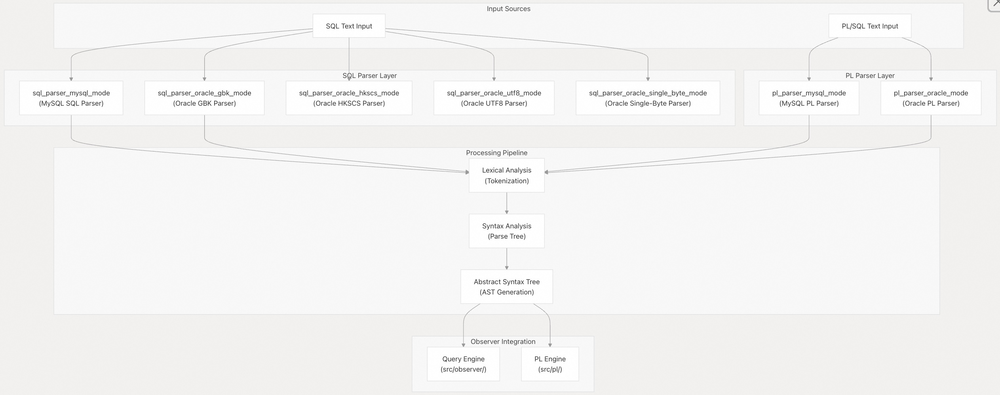
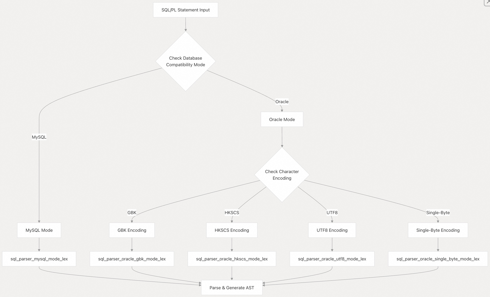
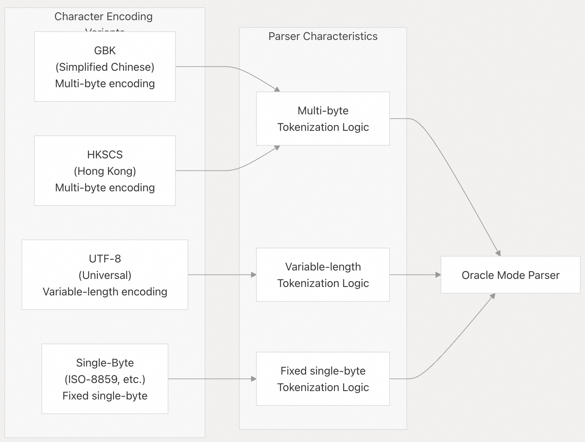
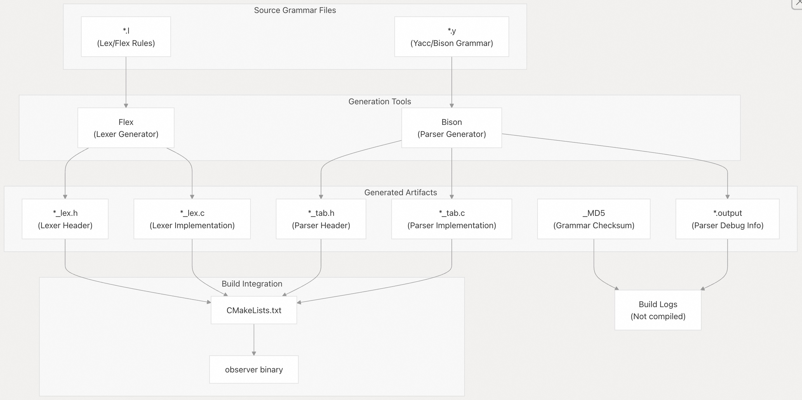
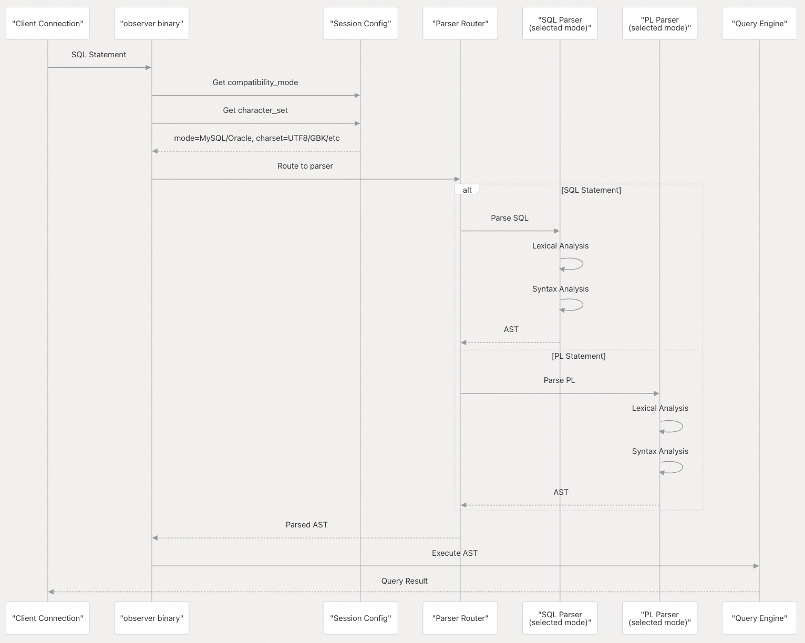
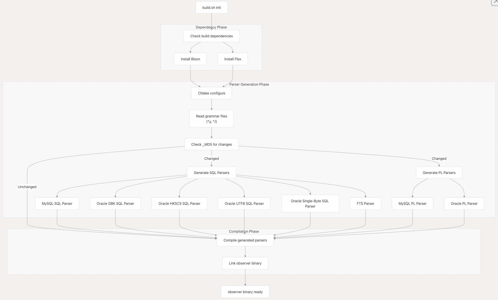
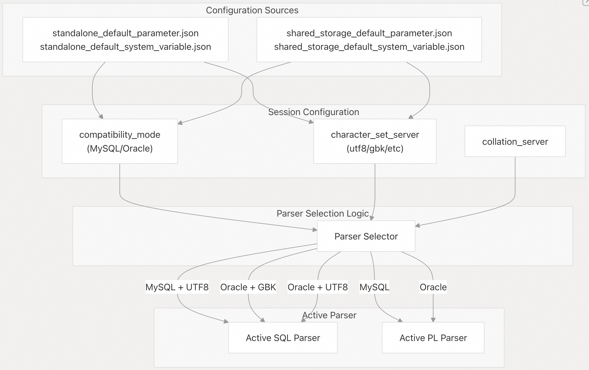
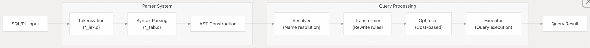

## SeekDB 源码学习: 3.2 SQL和PL解析器系统 (SQL and PL Parser System)  
                                    
### 作者                                    
digoal                                    
                                    
### 日期                                    
2025-11-26                                    
                                    
### 标签                                    
SeekDB , OceanBase , AI Native 数据库 , 向量搜索 , 语义搜索 , 关键词搜索 , 全文检索 , 标量搜索 , 混合搜索 , AI 搜索 , AI in Database , 多模态 , 源码学习                                     
                                    
----                                    
                                    
## 背景     
SQL和PL解析器系统（SQL and PL Parser System）负责解析OceanBase SeekDB中的SQL语句和PL（过程语言，Procedural Language）代码。该系统支持多种**数据库兼容模式**（Database Compatibility Modes）（MySQL和Oracle）和多种**字符编码**（Character Encodings），以处理不同的SQL方言和国际字符集。解析器将基于文本的SQL/PL语句转换为可供查询引擎（Query Engine）处理的**抽象语法树**（Abstract Syntax Trees, AST）。  
  
本文档涵盖了**解析器架构**（Parser Architecture）、支持的模式和编码、生成的工件（Artifacts）以及构建过程（Build Process）。有关总体架构的信息，请参阅 架构概览 章节。有关**Observer组件**（Observer Component）如何使用这些解析器的详细信息，请参阅 核心组件 章节。  
  
## 解析器架构概览 (Parser Architecture Overview)  
  
SeekDB采用一种**多模式、多编码解析器架构**（Multi-mode, Multi-encoding Parser Architecture），针对数据库兼容模式和字符编码的每种组合生成独立的解析器实现。这种设计能够精确处理MySQL和Oracle方言之间的语法差异和字符集要求。  
  
### 高层解析器结构 (High-Level Parser Structure)  
  
  
  
**来源:**  
[`.gitignore` 141-186](https://github.com/oceanbase/seekdb/blob/8c4654f1/.gitignore#L141-L186)  
[`README.md` 1-486](https://github.com/oceanbase/seekdb/blob/8c4654f1/README.md#L1-L486)  
  
### 解析器模式选择 (Parser Mode Selection)  
  
系统根据**数据库兼容模式**和**字符编码配置**来选择适当的解析器。此选择在Observer组件内部于运行时（runtime）进行。  
  
  
  
**来源:**  
[`.gitignore` 141-186](https://github.com/oceanbase/seekdb/blob/8c4654f1/.gitignore#L141-L186)  
  
## 解析器模式和编码 (Parser Modes and Encodings)  
  
### SQL解析器变体 (SQL Parser Variants)  
  
SQL解析器系统生成六个不同的解析器实现，以处理不同的兼容模式和字符编码：  
  
| 解析器变体 (Parser Variant) | 基本名称 (Base Name) | 兼容模式 (Compatibility Mode) | 字符编码 (Character Encoding) | 生成文件位置 (Generated Files Location) |  
| :--- | :--- | :--- | :--- | :--- |  
| MySQL SQL | `sql_parser_mysql_mode` | MySQL | UTF-8 (default) | `src/sql/parser/` |  
| Oracle GBK SQL | `sql_parser_oracle_gbk_mode` | Oracle | GBK (Chinese) | `src/sql/parser/` |  
| Oracle HKSCS SQL | `sql_parser_oracle_hkscs_mode` | Oracle | HKSCS (Hong Kong) | `src/sql/parser/` |  
| Oracle UTF8 SQL | `sql_parser_oracle_utf8_mode` | Oracle | UTF-8 | `src/sql/parser/` |  
| Oracle Single-Byte SQL | `sql_parser_oracle_single_byte_mode` | Oracle | 单字节编码 (Single-byte encodings) | `src/sql/parser/` |  
| FTS 解析器 (FTS Parser) | `ftsparser` | **全文搜索** (Full-Text Search) | N/A | `src/sql/parser/` |  
  
每个解析器变体（Parser Variant）生成四个主要的**工件文件**（Artifact Files）：  
  
  * `*_lex.c` - **词法分析器**（Lexical analyzer）实现  
  * `*_lex.h` - 词法分析器头文件  
  * `*_tab.c` - **解析器表**（Parser table）实现  
  * `*_tab.h` - 解析器表头文件  
  
**来源:**  
[`.gitignore` 144-170](https://github.com/oceanbase/seekdb/blob/8c4654f1/.gitignore#L144-L170)  
  
### PL解析器变体 (PL Parser Variants)  
  
PL（过程语言）解析器系统为MySQL和Oracle兼容性生成了两个不同的实现：  
  
| 解析器变体 (Parser Variant) | 基本名称 (Base Name) | 兼容模式 (Compatibility Mode) | 位置 (Location) |  
| :--- | :--- | :--- | :--- |  
| MySQL PL | `pl_parser_mysql_mode` | MySQL | `src/pl/parser/` |  
| Oracle PL | `pl_parser_oracle_mode` | Oracle | `src/pl/parser/` 和 `close_modules/oracle_pl/pl/parser/` |  
  
Oracle PL解析器在**闭源模块**（closed modules）目录中包含用于专有Oracle特定功能的额外组件。  
  
**来源:**  
[`.gitignore` 174-186](https://github.com/oceanbase/seekdb/blob/8c4654f1/.gitignore#L174-L186)  
[`.gitignore` 195-203](https://github.com/oceanbase/seekdb/blob/8c4654f1/.gitignore#L195-L203)  
  
### 字符编码支持 (Character Encoding Support)  
  
存在多个Oracle解析器变体是为了高效处理不同的**字符编码**（Character Encodings）：  
  
  
  
**来源:**  
[`.gitignore` 153-170](https://github.com/oceanbase/seekdb/blob/8c4654f1/.gitignore#L153-L170)  
  
## 生成的解析器工件 (Generated Parser Artifacts)  
  
解析器构建过程（Parser Build Process）生成多种工件类型。这些工件被排除在版本控制之外，因为它们在构建过程中会自动重新生成。  
  
### SQL解析器生成文件 (SQL Parser Generated Files)  
  
对于每种SQL解析器模式，会生成以下文件：  
  
  
  
**来源:**  
[`.gitignore` 141-173](https://github.com/oceanbase/seekdb/blob/8c4654f1/.gitignore#L141-L173)  
  
### 特定生成文件示例 (Specific Generated File Examples)  
  
以下文件是生成的，并被排除在版本控制之外：  
  
**MySQL 模式 (MySQL Mode):**  
  
  * `src/sql/parser/sql_parser_mysql_mode_lex.c`  
  * `src/sql/parser/sql_parser_mysql_mode_lex.h`  
  * `src/sql/parser/sql_parser_mysql_mode_tab.c`  
  * `src/sql/parser/sql_parser_mysql_mode_tab.h`  
  
**Oracle GBK 模式 (Oracle GBK Mode):**  
  
  * `src/sql/parser/sql_parser_oracle_gbk_mode_lex.c`  
  * `src/sql/parser/sql_parser_oracle_gbk_mode_lex.h`  
  * `src/sql/parser/sql_parser_oracle_gbk_mode_tab.c`  
  * `src/sql/parser/sql_parser_oracle_gbk_mode_tab.h`  
  
**Oracle HKSCS 模式 (Oracle HKSCS Mode):**  
  
  * `src/sql/parser/sql_parser_oracle_hkscs_mode_lex.c`  
  * `src/sql/parser/sql_parser_oracle_hkscs_mode_lex.h`  
  * `src/sql/parser/sql_parser_oracle_hkscs_mode_tab.c`  
  * `src/sql/parser/sql_parser_oracle_hkscs_mode_tab.h`  
  * `src/sql/parser/non_reserved_keywords_oracle_hkscs_mode.c`  
  
**Oracle UTF8 模式 (Oracle UTF8 Mode):**  
  
  * `src/sql/parser/sql_parser_oracle_utf8_mode_lex.c`  
  * `src/sql/parser/sql_parser_oracle_utf8_mode_lex.h`  
  * `src/sql/parser/sql_parser_oracle_utf8_mode_tab.c`  
  * `src/sql/parser/sql_parser_oracle_utf8_mode_tab.h`  
  
**Oracle 单字节模式 (Oracle Single-Byte Mode):**  
  
  * `src/sql/parser/sql_parser_oracle_single_byte_mode_lex.c`  
  * `src/sql/parser/sql_parser_oracle_single_byte_mode_lex.h`  
  * `src/sql/parser/sql_parser_oracle_single_byte_mode_tab.c`  
  * `src/sql/parser/sql_parser_oracle_single_byte_mode_tab.h`  
  * `src/sql/parser/non_reserved_keywords_oracle_single_byte_mode.c`  
  
**全文搜索解析器 (Full-Text Search Parser):**  
  
  * `src/sql/parser/ftsblex_lex.c`  
  * `src/sql/parser/ftsblex_lex.h`  
  * `src/sql/parser/ftsparser_tab.c`  
  * `src/sql/parser/ftsparser_tab.h`  
  
**来源:**  
[`.gitignore` 144-170](https://github.com/oceanbase/seekdb/blob/8c4654f1/.gitignore#L144-L170)  
  
### PL解析器生成文件 (PL Parser Generated Files)  
  
对于PL解析器，会生成类似的工件：  
  
**MySQL PL 模式 (MySQL PL Mode):**  
  
  * `src/pl/parser/pl_parser_mysql_mode_lex.c`  
  * `src/pl/parser/pl_parser_mysql_mode_lex.h`  
  * `src/pl/parser/pl_parser_mysql_mode_tab.c`  
  * `src/pl/parser/pl_parser_mysql_mode_tab.h`  
  * `src/pl/parser/pl_parser_mysql_mode.output`  
  
**Oracle PL 模式 (Oracle PL Mode):**  
  
  * `src/pl/parser/pl_parser_oracle_mode_lex.c`  
  * `src/pl/parser/pl_parser_oracle_mode_lex.h`  
  * `src/pl/parser/pl_parser_oracle_mode_tab.c`  
  * `src/pl/parser/pl_parser_oracle_mode_tab.h`  
  * `src/pl/parser/pl_parser_oracle_mode.output`  
  
**附加的 Oracle PL（闭源模块，Closed Module）:**  
  
  * `close_modules/oracle_pl/pl/parser/pl_parser_oracle_mode_lex.c`  
  * `close_modules/oracle_pl/pl/parser/pl_parser_oracle_mode_tab.c`  
  * `close_modules/oracle_pl/pl/parser/pl_parser_oracle_mode_tab.h`  
  * `close_modules/oracle_pl/pl/wrap/pl_wrap_scanner.c`  
  * `close_modules/oracle_pl/pl/wrap/pl_wrap_scanner.h`  
  * `close_modules/oracle_pl/pl/wrap/pl_wrap_parser.c`  
  * `close_modules/oracle_pl/pl/wrap/pl_wrap_parser.h`  
  
**来源:**  
[`.gitignore` 174-186](https://github.com/oceanbase/seekdb/blob/8c4654f1/.gitignore#L174-L186)  
[`.gitignore` 195-203](https://github.com/oceanbase/seekdb/blob/8c4654f1/.gitignore#L195-L203)  
  
### 调试和构建工件 (Debug and Build Artifacts)  
  
在解析器构建过程中生成的其他工件：  
  
| 文件模式 (File Pattern) | 目的 (Purpose) | 位置 (Location) |  
| :--- | :--- | :--- |  
| `*.output` | **解析器冲突报告**和调试信息 | `src/sql/parser/`, `src/pl/parser/` |  
| `_gen_parser.output` | 一般解析器生成日志 | `src/sql/parser/` |  
| `_gen_parser.error` | 解析器生成错误 | `src/sql/parser/` |  
| `_gen_pl_parser.output` | PL 解析器生成日志 | `src/pl/parser/` |  
| `_MD5` | 增量构建的**语法文件校验和** (Grammar file checksum) | `src/sql/parser/`, `src/pl/parser/` |  
| `type_name.c` | 生成的类型名称映射 (Generated type name mappings) | `src/sql/parser/` |  
  
**来源:**  
[`.gitignore` 142-143](https://github.com/oceanbase/seekdb/blob/8c4654f1/.gitignore#L142-L143)  
[`.gitignore` 171-186](https://github.com/oceanbase/seekdb/blob/8c4654f1/.gitignore#L171-L186)  
  
## 解析器与Observer的集成 (Parser Integration with Observer)  
  
### Observer中的解析器使用 (Parser Usage in Observer)  
  
Observer二进制文件（observer binary）集成了所有解析器变体，并根据运行时配置选择合适的解析器：  
  
  
  
**来源:**  
[`.gitignore` 139-140](https://github.com/oceanbase/seekdb/blob/8c4654f1/.gitignore#L139-L140)  
[`README.md` 43-45](https://github.com/oceanbase/seekdb/blob/8c4654f1/README.md#L43-L45)  
  
### 解析器在源代码树中的位置 (Parser Location in Source Tree)  
  
解析器组件在源代码树中的组织方式如下：  
  
```  
src/  
├── sql/  
│   └── parser/               # SQL 解析器源文件 (SQL parser sources)  
│       ├── *.y              # 语法定义 (Grammar definitions) (受版本控制, versioned)  
│       ├── *.l              # 词法规则 (Lexer rules) (受版本控制, versioned)  
│       ├── *_lex.c          # 生成的词法分析器 (Generated lexer) (不受版本控制, not versioned)  
│       ├── *_lex.h          # 生成的词法分析器头文件 (Generated lexer header) (不受版本控制, not versioned)  
│       ├── *_tab.c          # 生成的解析器 (Generated parser) (不受版本控制, not versioned)  
│       ├── *_tab.h          # 生成的解析器头文件 (Generated parser header) (不受版本控制, not versioned)  
│       └── *.output         # 解析器调试输出 (Parser debug output) (不受版本控制, not versioned)  
│  
├── pl/  
│   └── parser/               # PL 解析器源文件 (PL parser sources)  
│       ├── *.y              # 语法定义 (Grammar definitions) (受版本控制, versioned)  
│       ├── *.l              # 词法规则 (Lexer rules) (受版本控制, versioned)  
│       ├── *_lex.c          # 生成的词法分析器 (Generated lexer) (不受版本控制, not versioned)  
│       ├── *_tab.c          # 生成的解析器 (Generated parser) (不受版本控制, not versioned)  
│       └── *.output         # 解析器调试输出 (Parser debug output) (不受版本控制, not versioned)  
│  
└── observer/  
    └── observer             # 包含所有解析器的二进制文件 (Binary including all parsers) (不受版本控制, not versioned)  
```  
  
**来源:**  
[`.gitignore` 139-186](https://github.com/oceanbase/seekdb/blob/8c4654f1/.gitignore#L139-L186)  
  
## 构建过程 (Build Process)  
  
### 构建过程中的解析器生成 (Parser Generation During Build)  
  
解析器生成集成在**构建系统**（Build System）中，并自动发生：  
  
  
  
**来源:**  
[`.gitignore` 141-186](https://github.com/oceanbase/seekdb/blob/8c4654f1/.gitignore#L141-L186)  
[`README.md` 459-469](https://github.com/oceanbase/seekdb/blob/8c4654f1/README.md#L459-L469)  
  
### 构建命令集成 (Build Command Integration)  
  
当构建项目时，解析器生成会自动触发：  
  
```bash  
# Initialize dependencies and build  
bash build.sh debug --init --make  
  
# The build process automatically:  
# 1. Generates all parser variants  
# 2. Compiles generated C files  
# 3. Links them into observer binary  
```  
  
生成的解析器工件在构建过程中放置在 `build_debug/src/sql/parser/` 和 `build_debug/src/pl/parser/` 中，最终的Observer二进制文件（observer binary）生成在 `build_debug/src/observer/observer` 中。  
  
**来源:**  
[`README.md` 459-469](https://github.com/oceanbase/seekdb/blob/8c4654f1/README.md#L459-L469)  
  
## 解析器系统集成点 (Parser System Integration Points)  
  
### 配置系统集成 (Configuration System Integration)  
  
解析器系统与配置系统集成，以确定使用哪个解析器变体：  
  
  
  
**来源:**  
[`.gitignore` 189-192](https://github.com/oceanbase/seekdb/blob/8c4654f1/.gitignore#L189-L192)  
  
### 解析器到查询引擎的流程 (Parser to Query Engine Flow)  
  
一旦语句被解析，**抽象语法树**（AST）就会流经查询处理管道（query processing pipeline）：  
  
  
  
**来源:**  
[`.gitignore` 139-140](https://github.com/oceanbase/seekdb/blob/8c4654f1/.gitignore#L139-L140)  
  
## 总结 (Summary)  
  
OceanBase SeekDB中的SQL和PL解析器系统实现了一个复杂精巧的**多模式、多编码架构**（multi-mode, multi-encoding architecture），它具备以下功能：  
  
1.  **支持多种数据库方言**（Supports Multiple Database Dialects）：为MySQL和Oracle兼容模式提供独立的解析器。  
2.  **处理国际字符集**（Handles International Character Sets）：提供五种Oracle解析器变体，分别用于GBK、HKSCS、UTF-8和单字节编码。  
3.  **自动生成解析器**（Generates Parsers Automatically）：在构建过程中使用 Bison 和 Flex 从**语法定义**（grammar definitions）生成解析器。  
4.  **与配置集成**（Integrates with Configuration）：基于会话兼容模式和字符编码进行运行时解析器选择。  
5.  **生成干净的工件**（Produces Clean Artifacts）：所有生成的文件都被排除在版本控制之外，并在构建过程中重新生成。  
  
解析器系统充当所有SQL和PL语句的入口点，将文本输入转换为**抽象语法树**，供数据库引擎的其余部分处理。  
  
**来源:**  
[`.gitignore` 141-203](https://github.com/oceanbase/seekdb/blob/8c4654f1/.gitignore#L141-L203)  
[`README.md` 1-486](https://github.com/oceanbase/seekdb/blob/8c4654f1/README.md#L1-L486)  
  
-----  
  
# 附录1: 架构师/开发者视角：多模式解析器的高成本维护与同步机制  
  
**背景痛点：**  
文档显示，SeekDB为了支持MySQL和Oracle兼容性及多种字符编码（UTF-8, GBK, HKSCS等），生成了至少**六种SQL解析器变体**和**多套PL解析器**。在复杂的数据库系统中，解析器文法是核心逻辑，任何一个兼容模式的语法变更都可能需要同步到其他所有变体中。  
  
**关键问题：**  
面对**6种SQL解析器变体**和**多套PL解析器变体**（如Oracle/GBK、Oracle/UTF8等）的架构，**开发者**如何确保语法规则在所有模式下保持**高度一致性**？日常维护中，SeekDB是否有一套通过构建系统或工具链（如Bison/Flex的宏或预处理）实现的**自动化跨模式同步和验证机制**，以避免由于多套文法文件导致的**维护成本激增**和**潜在的兼容性回归**？  
  
## 回答  
  
SeekDB通过运行时参数传递和手动代码维护来确保多套解析器变体的一致性，而非构建时的自动化同步机制   。  
  
## 核心一致性机制  
  
### 1. 统一解析上下文传递  
所有解析器变体通过`ParseResult`和`ObParseCtx`结构体接收统一的模式参数：  
- `sql_mode_`：区分MySQL/Oracle模式    
- `charset_info_`：字符编码信息    
- `is_not_utf8_connection_`：非UTF8连接标识    
  
### 2. 词法分析层面的条件处理  
在`sql_parser_mysql_mode.l`中，通过条件判断实现不同编码的兼容：  
```c  
if (p->is_not_utf8_connection_) {  
  dup_value = parse_str_convert_utf8(p->charset_info_, yytext, p->malloc_pool_, &out_len, &(p->extra_errno_));  
} else {  
  dup_value = parse_strdup(yytext, p->malloc_pool_, &out_len);  
}  
```    
  
### 3. 手动维护一致性  
代码中存在明确的手动对齐注释，如：  
```c  
malloc_non_terminal_node($$, parse_ctx->mem_pool_, T_SP_DECL_CURSOR, 4, $2, NULL, NULL, $5); //4参数和Oracle模式保持一致  
```    
  
## 构建系统现状  
  
从现有代码看，SeekDB使用标准的Bison/Flex构建流程：  
- SQL解析器：`obsql_mysql_`前缀    
- PL解析器：`obpl_mysql_`前缀    
  
**未发现**跨文法的宏定义、预处理指令或自动化同步工具。一致性主要依赖：  
1. 运行时参数化处理  
2. 开发者手动对齐（如代码注释所示）  
3. 统一的字符集处理函数库  
  
## 潜在风险与建议  
  
当前架构存在维护成本激增的风险，特别是：  
- 语法规则变更需要手动同步到多个`.y/.l`文件  
- 字符编码兼容性逻辑分散在词法分析器中  
- 缺乏构建时验证机制确保变体间一致性  
  
建议考虑引入：  
1. 共享语法规则片段的include机制  
2. 自动化测试覆盖所有模式组合  
3. 构建时交叉验证工具  
  
## Notes  
  
从代码分析看，SeekDB的解析器架构主要通过运行时参数化实现多模式支持，而非构建时代码生成。这种设计提供了灵活性，但确实存在您提到的维护成本问题。字符编码处理逻辑在词法分析器层面有较好的统一抽象，但语法规则层面仍依赖手动维护。  
  
  
  
  
-----  
  
# 附录2: 开发者视角：解析器构建效率与工具链依赖  
  
**背景痛点：**  
解析器工件（`*_lex.c`、`*_tab.c`等数十个文件）是使用Flex/Bison从文法定义（`*.y`、`*.l`）自动生成的，且被版本控制系统忽略。虽然文档提及使用 `_MD5` 文件支持**增量构建**，但首次构建或环境变更时仍需要全量生成。  
  
**关键问题：**  
对于频繁迭代的**开发者**而言，全量生成全部数十个解析器工件（`*_lex.c/h`, `*_tab.c/h`）的**平均耗时**是多少？**SeekDB是否对Flex/Bison的特定版本有严格的兼容性要求？** 以及在没有安装相应版本工具链的开发环境中，如何实现**快速配置或使用预生成的工件**，以最大化**新开发者的入门效率**和**持续集成（CI）的构建速度**？  
  
## 回答  
  
根据SeekDB代码库的分析，我可以部分回答您的问题，但某些关键信息需要从其他文档或实际测试中获取。  
  
## 解析器工件生成机制  
  
SeekDB使用Flex/Bison从`.l`和`.y`文件生成解析器工件，包括：  
- 词法分析器：`*_lex.c`、`*_lex.h`（如`sql_parser_mysql_mode_lex.h`  ）  
- 语法分析器：`*_tab.c`、`*_tab.h`（如`htable_filter_tab.cxx`  ）  
  
构建系统通过`gen_parser.sh`脚本生成这些工件  。  
  
## 无法从代码中确定的信息  
  
**构建耗时**：当前代码片段中没有包含构建性能数据或基准测试结果。  
  
**Flex/Bison版本要求**：虽然生成的文件显示使用了GNU Bison 2.4.1  和Flex 2.5.35  ，但代码中没有明确的版本兼容性检查或要求声明。  
  
**预生成工件使用**：代码中没有展示如何在开发环境中使用预生成的解析器工件来跳过生成步骤。  
  
## 建议获取完整答案的方法  
  
1. **构建耗时**：在实际开发环境中运行`bash build.sh debug --init --make`  并测量时间  
  
2. **版本要求**：检查：  
   - `build.sh`脚本中的工具链检查逻辑  
   - `toolchain.md`文档（在build-and-run.md中被引用  ）  
   - CI配置文件中的工具版本定义  
  
3. **预生成工件**：查看：  
   - CI构建配置中是否有缓存策略  
   - 是否存在分发预生成工件的机制  
  
## Notes  
  
当前代码库显示SeekDB使用标准的Flex/Bison工作流，包含多个解析器模块（SQL、PL、HTable过滤器等）。要获得您需要的具体性能和兼容性数据，需要查看构建脚本、CI配置和工具链文档，这些在提供的代码片段中未完全包含。  
  
  
  
  
  
-----  
  
# 附录3: 架构师/战略视角：闭源模块与核心架构的解耦边界  
  
**背景痛点：**  
SeekDB项目基于**Apache 2.0许可证**，但在PL解析器部分，明确提到了`close_modules/oracle_pl/pl/parser/` 目录中包含用于**专有Oracle特定功能**的额外组件。这引发了对核心开源能力的边界和未来社区贡献的疑问。  
  
**关键问题：**  
**架构师**如何界定**核心解析能力**与**专有Oracle功能**（如`pl_wrap_parser.c`）的**代码边界**？**Observer组件**在运行时是如何**动态链接或条件编译**这些闭源模块的？对于希望贡献PL功能的**社区开发者**而言，需要面对哪些**集成障碍**或**功能空白**，才能确保**纯开源版本**的构建和运行不受闭源部分的影响？  
  
  
## 回答  
  
## 核心发现  
  
基于对SeekDB代码库的分析，PL解析器系统采用模块化设计，核心解析能力完全开源，专有功能通过条件编译和系统包混淆实现隔离。    
  
## 代码边界界定  
  
### 核心解析能力  
核心PL解析器位于`src/pl/parser/`目录，包含：  
- `ob_pl_parser.h/cpp` - 主解析器类定义和实现    
- `pl_parser_base.c/h` - 解析器基础功能    
- `pl_parser_mysql_mode.l/y` - MySQL模式词法/语法分析器    
  
### 专有功能隔离  
专有Oracle功能通过以下机制隔离：  
1. **条件编译标志** - `OB_BUILD_ORACLE_PL`环境变量控制Oracle特定组件编译    
2. **系统包混淆** - `syspack_codegen.py`脚本处理专有系统包的加密和嵌入    
  
## Observer组件集成机制  
  
### 构建时集成  
PL解析器通过CMake构建系统集成到observer：  
```cmake  
ob_set_subtarget(ob_pl ALONE  
  parser/ob_pl_parser.cpp  
  parser/pl_non_reserved_keywords_mysql_mode.c  
  # ... 其他解析器文件  
)  
```    
  
### 运行时解析流程  
解析器在`ObPLCompiler::analyze_package`中被调用，通过`ObPLParser`类处理PL代码  。  
  
## 社区开发者集成指南  
  
### 构建要求  
1. **标准构建** - 使用`make debug`或`make`即可构建完整开源版本    
2. **依赖管理** - 通过`build.sh --init`自动处理第三方依赖    
  
### 功能边界  
- **完全开源** - MySQL模式PL解析、基础编译和解析功能  
- **条件编译** - Oracle特定语法和系统包需要`OB_BUILD_ORACLE_PL`环境  
- **无闭源依赖** - 核心解析器不依赖任何闭源模块，可独立构建运行  
  
### 贡献注意事项  
1. 遵循Apache 2.0许可证要求  
2. 新增PL功能应优先支持MySQL模式  
3. Oracle特定功能需要通过条件编译隔离  
4. 系统包修改需要更新`syspack_config`配置    
  
## Notes  
  
- 代码中未找到用户提到的`close_modules/oracle_pl/pl/parser/`目录或`pl_wrap_parser.c`文件，可能这些是计划中的功能或存在于其他分支  
- 当前开源版本已包含完整的PL解析器实现，支持存储过程、函数、触发器等核心功能  
- 专有功能主要通过系统包混淆和条件编译实现，不影响核心解析器的开源性质  
  
-----  
  
  
# 附录4: 详细介绍一下fts解析模块  
  
## 回答  
  
# FTS解析模块详细介绍  
  
FTS(Full Text Search)解析模块是OceanBase数据库中用于处理全文搜索查询的核心组件，主要负责解析布尔模式的全文搜索查询语句，构建抽象语法树(AST)并生成可执行的查询计划。  
  
## 模块架构  
  
### 核心组件  
  
FTS解析模块由以下几个核心部分组成：  
  
1. **词法分析器** (`ftsblex.l`): 使用Flex生成，负责将输入文本分解为token    
2. **语法分析器** (`ftsparser.y`): 使用Bison生成，定义语法规则并构建AST    
3. **基础数据结构** (`fts_base.h/c`): 定义节点类型、错误码和核心操作函数    
4. **解析入口** (`fts_parse.h/c`): 提供C接口封装解析功能    
5. **评估节点** (`ob_das_text_retrieval_eval_node.h/cpp`): 将AST转换为可执行的评估树    
  
## 数据结构  
  
### 节点类型  
  
解析器支持四种主要的节点类型  ：  
  
```c  
enum FtsNodeType {  
  FTS_NODE_OPER,        // 操作符节点  
  FTS_NODE_TERM,        // 词项节点    
  FTS_NODE_LIST,        // 表达式列表  
  FTS_NODE_SUBEXP_LIST  // 子表达式列表  
};  
```  
  
### 操作符类型  
  
支持的操作符包括  ：  
  
```c  
enum FtsOperType {  
  FTS_NONE,   // 无操作符  
  FTS_IGNORE, // 忽略包含此词的行 (-)  
  FTS_EXIST   // 必须包含此词的行 (+)  
};  
```  
  
### AST节点结构  
  
每个AST节点包含类型、词项、操作符、子节点列表等信息  。  
  
## 解析流程  
  
### 1. 初始化阶段  
  
解析过程通过`fts_parse_docment`函数启动  ：  
  
1. 初始化解析器结果结构  
2. 创建词法分析器scanner  
3. 设置输入缓冲区  
4. 调用语法分析器  
  
### 2. 词法分析  
  
词法分析器识别以下token  ：  
  
- 操作符：`[()+\-<>~@*]`  
- 词项：`[^" \n*()+\-<>~@]*`  
- 忽略空白字符  
  
### 3. 语法分析  
  
语法规则定义了查询的结构  ：  
  
```  
query → expr_lst  
expr_lst → expr_lst expr | expr_lst sub_expr | ε  
sub_expr → '(' expr_lst ')' | prefix '(' expr_lst ')'  
expr → term | prefix term  
term → FTS_TERM  
prefix → '+' | '-' | 其他不支持的符号  
```  
  
### 4. AST构建  
  
在解析过程中，通过以下函数构建AST节点  ：  
  
- `fts_node_create`: 创建新节点  
- `fts_create_node_term`: 创建词项节点  
- `fts_create_node_oper`: 创建操作符节点  
- `fts_create_node_list`: 创建列表节点  
- `fts_add_node`: 添加子节点  
  
## 使用场景  
  
### 布尔模式查询  
  
FTS解析器主要用于布尔模式的全文搜索查询，支持：  
  
- `+word`: 必须包含word  
- `-word`: 不能包含word    
- `word`: 默认包含word（OR逻辑）  
- `(word1 word2)`: 子表达式分组  
  
### 查询执行  
  
解析后的AST会被转换为评估树用于查询执行  ：  
  
1. 解析查询文本  
2. 构建token映射  
3. 创建评估节点树  
4. 执行布尔逻辑计算  
  
## 插件化支持  
  
FTS解析模块还支持插件化的分词器  ，包括：  
  
- 空格分词器  
- ngram分词器    
- 基础英文分词器  
- IK中文分词器  
  
这些分词器通过插件系统注册  ，为不同的语言和场景提供灵活的文本处理能力。  
  
## Notes  
  
- FTS解析器目前不支持`~`、`<`、`>`、`@`、`*`、`%`等操作符    
- 解析器使用自定义的内存管理，通过`parse_malloc`等函数分配内存    
- 错误处理包括内存错误、语法错误和其他错误类型   
  
-----  
  
  
# 附录5: FTS解析模块使用方法  
  
## 基本解析接口使用  
  
### 1. 核心解析函数  
  
使用`fts_parse_docment`函数进行全文搜索查询解析  ：  
  
```c  
void fts_parse_docment(const char *input, const int length, void *pool, FtsParserResult *ss)  
```  
  
参数说明：  
- `input`: 要解析的查询字符串  
- `length`: 查询字符串长度  
- `pool`: 内存分配器  
- `ss`: 解析结果结构体  
  
### 2. 解析结果结构  
  
解析结果存储在`FtsParserResult`结构中  ：  
  
```c  
typedef struct {  
  int     ret_;           // 返回码  
  FtsString err_info_;    // 错误信息  
  void    *yyscanner_;    // 词法分析器  
  void    *malloc_pool_;  // 内存池  
  void    *charset_info_; // 字符集信息  
  FtsNode *root_;         // AST根节点  
  FtsNodeList list_;      // 节点列表  
} FtsParserResult;  
```  
  
## 分词器使用方法  
  
### 1. 内置分词器类型  
  
系统支持5种内置分词器  ：  
  
```c  
#define FTS_BUILD_IN_PARSER_LIST \  
  FT_PARSER_TYPE(FTP_SPACE, space) \  
  FT_PARSER_TYPE(FTP_NGRAM, ngram) \  
  FT_PARSER_TYPE(FTP_BENG, beng) \  
  FT_PARSER_TYPE(FTP_IK, ik) \  
  FT_PARSER_TYPE(FTP_NGRAM2, ngram2)  
```  
  
### 2. 分词器初始化  
  
使用`ObFTParseHelper`类进行分词器初始化  ：  
  
```cpp  
int init(  
    common::ObIAllocator *allocator,  
    const common::ObString &plugin_name,  
    const common::ObString &plugin_properties);  
```  
  
### 3. 文档分词  
  
调用`segment`方法对文档进行分词处理  ：  
  
```cpp  
int segment(  
    const common::ObObjMeta &meta,  
    const char *fulltext,  
    const int64_t fulltext_len,  
    int64_t &doc_length,  
    ObFTWordMap &words) const;  
```  
  
## 具体分词器使用示例  
  
### 1. 空格分词器  
  
适用于英文等以空格分隔的语言  。  
  
### 2. N-gram分词器  
  
适用于中文等无明确分隔符的语言  。  
  
### 3. N-gram2分词器  
  
支持范围N-gram的分词器  。  
  
## 插件化使用  
  
### 1. 分词器注册  
  
内置分词器通过`ObFTParsePluginData`进行注册  。  
  
### 2. 插件查找  
  
使用`ObPluginHelper`查找分词器插件  。  
  
### 3. 插件接口  
  
实现`ObPluginFTParser`接口开发自定义分词器  。  
  
## 配置属性  
  
分词器支持JSON格式的配置属性  ：  
  
```json  
{  
  "min_token_size":2,  
  "max_token_size":84,  
  "ngram_token_size":2,  
  "stopword_table":"default",  
  "dict_table":"none",  
  "quanitfier_table":"none"  
}  
```  
  
## Notes  
  
- 解析器使用自定义内存管理，需要提供内存池  
- 分词器名称格式为"name.version"，如"ngram.1"  
- 支持字符集检查，确保分词器与文本字符集兼容  
- 错误处理包括内存错误、语法错误等类型  
  
  
  
  
-----  
  
  
# 附录6: 详细介绍oracle pl闭源解析模块和使用方法  
  
## 回答  
  
# Oracle PL解析模块详细介绍  
  
Oracle PL解析模块是OceanBase数据库中用于解析PL/SQL语句的核心组件，支持存储过程、函数、包、触发器等PL对象的语法分析和AST构建。  
  
## 模块架构  
  
### 核心组件  
  
PL解析模块由以下核心部分组成：  
  
1. **PL解析器主类** (`ObPLParser`): 提供PL解析的高级接口    
2. **解析器基础实现** (`pl_parser_base.c`): 包含词法分析器初始化和解析入口    
3. **语法规则定义** (`pl_parser_mysql_mode.y`): 使用Bison定义PL语法规则    
4. **解析上下文** (`ObParseCtx`): 存储解析过程中的状态信息    
  
### 数据结构  
  
#### 解析上下文结构  
  
`ObParseCtx`是解析过程的核心数据结构，包含内存池、字符集信息、错误处理等  ：  
  
```c  
typedef struct _ObParseCtx {  
  void *mem_pool_;                    // 内存分配器  
  ObStmtNodeTree *stmt_tree_;         // 语法树  
  ObScannerCtx scanner_ctx_;          // 扫描器上下文  
  jmp_buf jmp_buf_;                   // 错误跳转缓冲  
  const char *stmt_str_;              // 输入语句  
  int stmt_len_;                      // 语句长度  
  const struct ObCharsetInfo *charset_info_; // 字符集信息  
  // ... 其他字段  
} ObParseCtx;  
```  
  
## 解析流程  
  
### 1. 解析器初始化  
  
通过`obpl_parser_init`函数初始化词法分析器  ：  
  
```c  
int obpl_parser_init(ObParseCtx *parse_ctx) {  
  int ret = 0;  
  if (NULL_PTR(parse_ctx) || NULL_PTR(parse_ctx->mem_pool_)) {  
    ret = -1;  
  } else {  
    ret = obpl_mysql_yylex_init_extra(parse_ctx, &(parse_ctx->scanner_ctx_.yyscan_info_));  
  }  
  return ret;  
}  
```  
  
### 2. 主要解析接口  
  
`ObPLParser`类提供多个解析方法  ：  
  
- `fast_parse()`: 快速解析模式  
- `parse()`: 标准解析接口  
- `parse_routine_body()`: 解析存储过程/函数体  
- `parse_package()`: 解析包定义  
  
### 3. 解析执行流程  
  
通过`obpl_parser_parse`函数执行实际解析  ：  
  
1. 设置错误处理跳转点  
2. 创建输入缓冲区  
3. 调用Bison生成的语法分析器  
4. 清理缓冲区资源  
  
## 使用方法  
  
### 1. 基本解析调用  
  
```cpp  
// 创建解析器  
ObPLParser pl_parser(allocator, charsets4parser, sql_mode);  
  
// 解析PL语句  
ParseResult parse_result;  
int ret = pl_parser.parse(stmt_block, orig_stmt_block, parse_result, is_inner_parse);  
```  
  
### 2. 存储过程体解析  
  
用于解析存储过程或函数的执行体  ：  
  
```cpp  
int parse_routine_body(const ObString &routine_body,  
                       ObStmtNodeTree *&routine_stmt,  
                       bool is_for_trigger,  
                       bool need_unwrap);  
```  
  
### 3. 包解析  
  
用于解析包规范或包体  ：  
  
```cpp  
int parse_package(const ObString &package,  
                  ObStmtNodeTree *&package_stmt,  
                  const ObDataTypeCastParams &dtc_params,  
                  share::schema::ObSchemaGetterGuard *schema_guard,  
                  bool is_for_trigger,  
                  const ObTriggerInfo *trg_info,  
                  bool need_unwrap);  
```  
  
## 集成使用场景  
  
### 1. 主解析器调度  
  
在`ObParser::parse`中，系统会判断语句类型并选择PL解析器：  
  
```cpp  
ObPLParser pl_parser(*(ObIAllocator*)(parse_result.malloc_pool_), charsets4parser_, sql_mode_);  
if (OB_FAIL(pl_parser.parse(stmt, stmt, parse_result, is_pl_inner_parse))) {  
  // 错误处理  
}  
```  
  
### 2. 编译器集成  
  
PL编译器使用解析器生成AST：  
  
```cpp  
ObPLParser parser(allocator_, session_info_.get_charsets4parser(), session_info_.get_sql_mode());  
OZ (parser.parse_routine_body(body, parse_tree, session_info_.is_for_trigger_package()));  
```  
  
### 3. 匿名块处理  
  
匿名PL块的解析和编译：  
  
```cpp  
ObParser parser(compile_alloc, ctx.get_my_session()->get_sql_mode(), ctx.get_my_session()->get_charsets4parser());  
OZ (parser.parse(anonymouse_sql, parse_result, parse_mode));  
```  
  
## Oracle模式特性  
  
### 1. 字符集支持  
  
解析器支持Oracle数据库字符集：  
  
```cpp  
parse_result.charset_info_oracle_db_ = ObCharset::is_valid_collation(charsets4parser_.nls_collation_) ?  
        ObCharset::get_charset(charsets4parser_.nls_collation_) : NULL;  
```  
  
### 2. 触发器支持  
  
支持Oracle模式的触发器语法，包括`:old`和`:new`引用。  
  
### 3. 包访问控制  
  
支持Oracle模式的`ACCESSIBLE BY`子句。  
  
## Notes  
  
- PL解析器使用自定义内存管理，需要提供`ObIAllocator`内存池  
- 支持MySQL和Oracle两种兼容模式  
- 解析器通过`setjmp/longjmp`机制处理致命错误  
- 生成的AST树由`ParseNode`结构组成，与SQL解析器共享节点类型  
- 支持动态SQL和嵌套SQL语句的解析  
  
    
#### [PolarDB 学习图谱](https://www.aliyun.com/database/openpolardb/activity "8642f60e04ed0c814bf9cb9677976bd4")
  
  
#### [PostgreSQL 解决方案集合](../201706/20170601_02.md "40cff096e9ed7122c512b35d8561d9c8")
  
  
#### [德哥 / digoal's Github - 公益是一辈子的事.](https://github.com/digoal/blog/blob/master/README.md "22709685feb7cab07d30f30387f0a9ae")
  
  
#### [About 德哥](https://github.com/digoal/blog/blob/master/me/readme.md "a37735981e7704886ffd590565582dd0")
  
  

  
