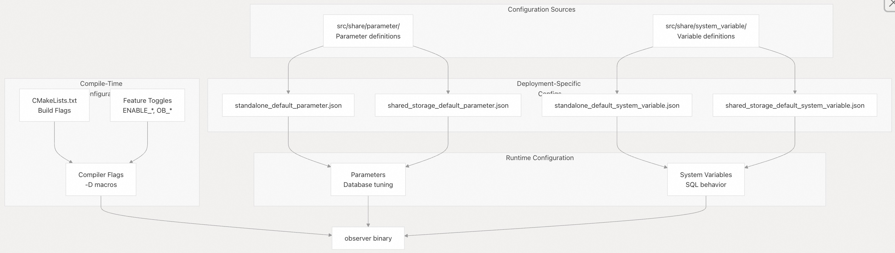
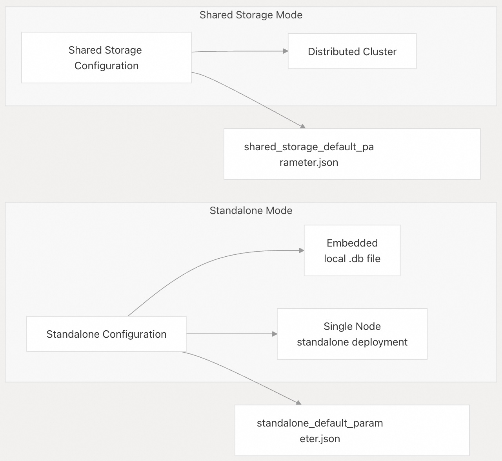
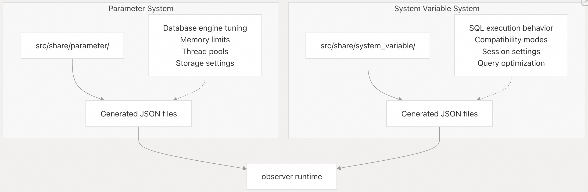
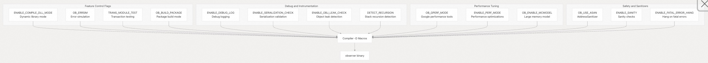
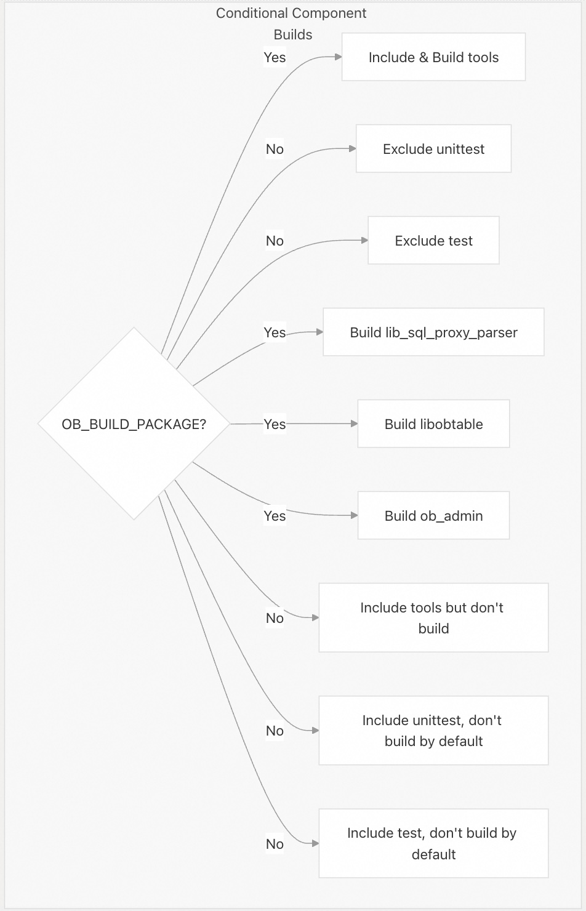
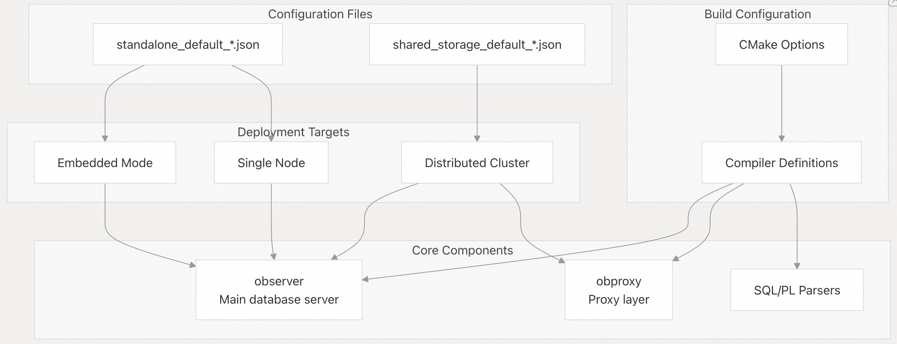
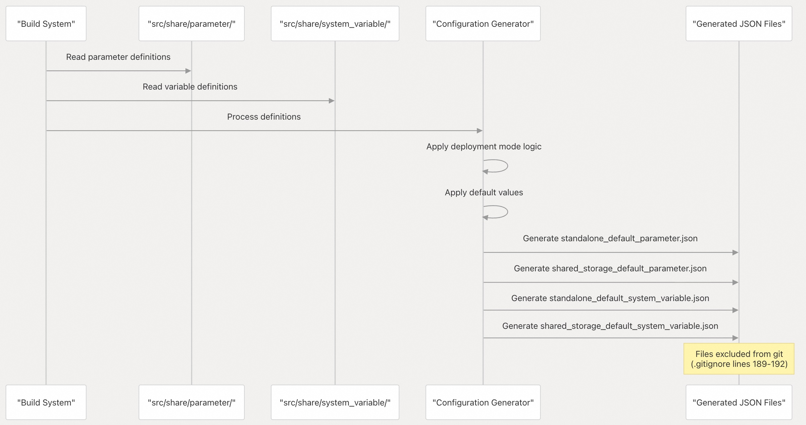
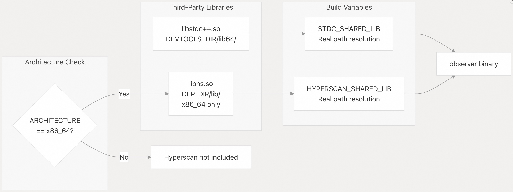
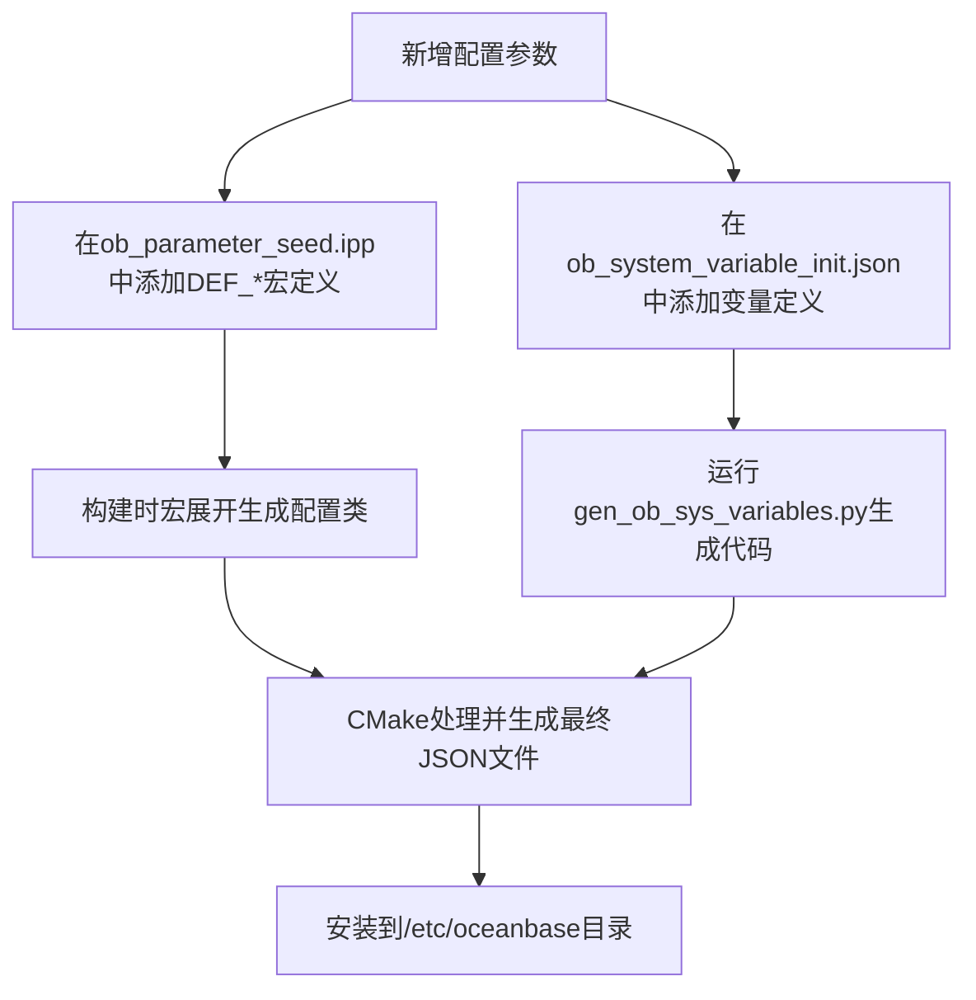

## SeekDB 源码学习: 3.3 配置系统 (Configuration System)  
                                      
### 作者                                      
digoal                                      
                                      
### 日期                                      
2025-11-26                                      
                                      
### 标签                                      
SeekDB , OceanBase , AI Native 数据库 , 向量搜索 , 语义搜索 , 关键词搜索 , 全文检索 , 标量搜索 , 混合搜索 , AI 搜索 , AI in Database , 多模态 , 源码学习                                       
                                      
----                                      
                                      
## 背景       
OceanBase SeekDB 中的**配置系统 (Configuration System)** 管理**运行时 (runtime)** 和**编译时 (compile-time)** 设置，这些设置控制着数据库的行为 (behavior)、性能特征 (performance characteristics) 和功能可用性 (feature availability)。本文档介绍了双层**配置架构 (two-tier configuration architecture)** ：**运行时配置**（参数 (parameters) 和系统变量 (system variables)）以及**编译时配置**（ **CMake 构建标志 (CMake build flags)** ）。  
  
-----  
  
## 配置架构 (Configuration Architecture)  
  
配置系统在两个不同的层面运行：通过 **CMake 标志 (CMake flags)** 进行的**编译时配置 (compile-time configuration)** 和通过基于 JSON 的**参数 (parameters)** 与**系统变量 (system variables)** 进行的**运行时配置 (runtime configuration)** 。  
  
### 配置层 (Configuration Layers)  
  
  
  
**图表：配置系统架构 (Configuration System Architecture)**  
  
该系统区分**不可变的编译时设置 (immutable compile-time settings)** 和**可变的运行时设置 (mutable runtime settings)** ，并为独立 (standalone) 和共享存储 (shared storage) 模式生成特定于部署 (deployment-specific) 的配置文件。  
  
来源:  
[`CMakeLists.txt` 1-192](https://github.com/oceanbase/seekdb/blob/8c4654f1/CMakeLists.txt#L1-L192) [`.gitignore` 189-192](https://github.com/oceanbase/seekdb/blob/8c4654f1/.gitignore#L189-L192)  
  
-----  
  
## 部署模式配置 (Deployment Mode Configuration)  
  
SeekDB 支持两种主要的部署模式 (deployment modes)，每种模式都有不同的配置要求 (configuration requirements) 和文件集 (file sets)。  
  
### 部署模式映射 (Deployment Mode Mapping)  
  
  
  
**图表：部署模式配置映射 (Deployment Mode Configuration Mapping)**  
  
来源:  
[`.gitignore` 189-192](https://github.com/oceanbase/seekdb/blob/8c4654f1/.gitignore#L189-L192)  
  
### 配置文件结构 (Configuration File Structure)  
  
| 部署模式 (Deployment Mode) | 参数文件 (Parameter File) | 系统变量文件 (System Variable File) | 用例 (Use Case) |  
| :--- | :--- | :--- | :--- |  
| **独立模式 (Standalone)** | `standalone_default_parameter.json` | `standalone_default_system_variable.json` | 嵌入式模式 (Embedded mode)，单节点部署 (Single-node deployment) |  
| **共享存储 (Shared Storage)** | `shared_storage_default_parameter.json` | `shared_storage_default_system_variable.json` | 分布式集群部署 (Distributed cluster deployment) |  
  
这些配置文件是在**构建过程 (build process)** 中生成的，并根据 [`.gitignore` 189-192](https://github.com/oceanbase/seekdb/blob/8c4654f1/.gitignore#L189-L192) 中的指示被排除在**版本控制 (version control)** 之外。  
  
来源:  
[`.gitignore` 189-192](https://github.com/oceanbase/seekdb/blob/8c4654f1/.gitignore#L189-L192)  
  
-----  
  
## 运行时配置 (Runtime Configuration)  
  
**运行时配置 (Runtime configuration)** 由两个主要类别组成：**参数 (parameters)** 和**系统变量 (system variables)** 。两者都通过在 `observer` 进程 (process) 启动时加载的 JSON **配置文件 (configuration files)** 进行管理。  
  
### 参数 (Parameters) 与系统变量 (System Variables) 对比  
  
  
  
**图表：参数 (Parameter) 和系统变量 (System Variable) 流程**  
  
  * **参数 (Parameters)** ：控制底层数据库引擎行为 (low-level database engine behavior)、资源分配 (resource allocation) 和存储管理 (storage management)。  
  * **系统变量 (System Variables)** ：控制 SQL 执行行为 (SQL execution behavior)、兼容性设置 (compatibility settings) 和查询处理 (query processing)。  
  
来源:  
[`.gitignore` 189-192](https://github.com/oceanbase/seekdb/blob/8c4654f1/.gitignore#L189-L192)  
  
### 配置文件位置 (Configuration File Locations)  
  
配置**源定义 (configuration source definitions)** 位于：  
  
  * **参数定义 (Parameter definitions)** : `src/share/parameter/`  
  * **系统变量定义 (System variable definitions)** : `src/share/system_variable/`  
  
生成的配置文件 (Generated configuration files) 在**构建过程 (build process)** 中放置在相同的目录中，并且是**特定于部署模式 (deployment-mode-specific)** 的。  
  
来源:  
[`.gitignore` 189-192](https://github.com/oceanbase/seekdb/blob/8c4654f1/.gitignore#L189-L192)  
  
-----  
  
## 编译时配置 (Compile-Time Configuration)  
  
**编译时配置 (Compile-time configuration)** 控制**二进制文件 (binary)** 中启用的**功能 (features)** 、**调试检测 (debug instrumentation)** 、**性能调优 (performance tuning)** 和**安全性检查 (safety checks)** 。这些设置在**编译 (compilation)** 后是**不可变的 (immutable)** 。  
  
### 构建配置标志 (Build Configuration Flags)  
  
  
  
**图表：编译时配置标志 (Compile-Time Configuration Flags)**  
  
来源:  
[`CMakeLists.txt` 13-89](https://github.com/oceanbase/seekdb/blob/8c4654f1/CMakeLists.txt#L13-L89)  
  
### 配置标志参考 (Configuration Flag Reference)  
  
| 标志类别 (Flag Category) | CMake 选项 (CMake Option) | 定义的宏 (Macro Defined) | 目的 (Purpose) |  
| :--- | :--- | :--- | :--- |  
| **功能控制 (Feature Control)** | | | |  
| | `ENABLE_COMPILE_DLL_MODE` | `COMPILE_DLL_MODE` | 启用**动态库编译模式 (dynamic library compilation mode)** |  
| | `OB_ERRSIM` | `ERRSIM` | 启用**错误模拟 (error simulation)** 以进行测试 |  
| | `TRANS_MODULE_TEST` | `TRANS_MODULE_TEST` | 启用**事务模块测试功能 (transaction module testing features)** |  
| | `OB_BUILD_PACKAGE` | `OB_BUILD_PACKAGE` | 启用**包构建模式 (package build mode)** |  
| **调试与检测 (Debug & Instrumentation)** | | | |  
| | `ENABLE_DEBUG_LOG` | `ENABLE_DEBUG_LOG` | 启用**详细调试日志记录 (verbose debug logging)** （已弃用）|  
| | `ENABLE_SERIALIZATION_CHECK` | `ENABLE_SERIALIZATION_CHECK` | 验证**序列化/反序列化 (serialization/deserialization)** |  
| | `ENABLE_OBJ_LEAK_CHECK` | `ENABLE_OBJ_LEAK_CHECK=1` | 检测**对象内存泄漏 (object memory leaks)** |  
| | `DETECT_RECURSION` | `DETECT_RECURSION` | 检测**堆栈递归问题 (stack recursion issues)** |  
| **性能 (Performance)** | | | |  
| | `OB_GPERF_MODE` | `__NEED_PERF__` | 启用 **Google 性能分析 (Google performance profiling)** |  
| | `ENABLE_PERF_MODE` | `PERF_MODE` | 启用**性能优化模式 (performance optimization mode)** |  
| | `OB_ENABLE_MCMODEL` | `-mcmodel=large` | 使用**大内存模型 (large memory model)** （仅限 x86\_64）|  
| **安全性 (Safety)** | | | |  
| | `OB_USE_ASAN` | `OB_USE_ASAN` | 启用 **AddressSanitizer** |  
| | `ENABLE_SANITY` | `ENABLE_SANITY` | 启用**附加的完整性检查 (additional sanity checks)** |  
| | `ENABLE_FATAL_ERROR_HANG` | `FATAL_ERROR_HANG` , `ENABLE_500_MEMORY_LIMIT` | 在**致命错误 (fatal errors)** 上挂起 (hang) 以进行调试 |  
  
来源:  
[`CMakeLists.txt` 13-89](https://github.com/oceanbase/seekdb/blob/8c4654f1/CMakeLists.txt#L13-L89)  
  
### 条件构建选项 (Conditional Build Options)  
  
  
  
**图表：条件构建配置 (Conditional Build Configuration)**  
  
`OB_BUILD_PACKAGE` 标志控制**构建 (build)** 是用于**发行打包 (distribution packaging)** （包含工具 (tools)，排除测试 (tests)）还是用于**开发 (development)** （包含测试，工具可选）。  
  
来源:  
[`CMakeLists.txt` 114-151](https://github.com/oceanbase/seekdb/blob/8c4654f1/CMakeLists.txt#L114-L151)  
  
-----  
  
## 架构集成 (Architecture Integration)  
  
配置系统 (configuration system) 与 SeekDB 的**核心组件 (core components)** 集成，以在**编译时 (compile-time)** 和**运行时 (runtime)** 控制它们的行为。  
  
### 配置到组件的映射 (Configuration to Component Mapping)  
  
  
  
**图表：配置与核心组件的集成 (Configuration Integration with Core Components)**  
  
配置系统提供了一个**统一的接口 (unified interface)** ，用于控制跨不同**部署模式 (deployment modes)** 的**系统行为 (system behavior)** ，同时保持编译时 (compile-time) 和运行时 (runtime) 关注点之间的**分离 (separation)** 。  
  
来源:  
[`CMakeLists.txt` 1-192](https://github.com/oceanbase/seekdb/blob/8c4654f1/CMakeLists.txt#L1-L192) [`.gitignore` 189-192](https://github.com/oceanbase/seekdb/blob/8c4654f1/.gitignore#L189-L192)  
  
-----  
  
## 配置文件生成 (Configuration File Generation)  
  
**配置文件 (Configuration files)** 是在**构建过程 (build process)** 中，从位于源代码树 (source tree) 中的**源定义 (source definitions)** 生成的。生成的文件被排除在**版本控制 (version control)** 之外。  
  
### 生成过程 (Generation Process)  
  
  
  
**图表：配置文件生成序列 (Configuration File Generation Sequence)**  
  
**构建系统 (build system)** 处理源定义 (source definitions) 并生成**特定于部署 (deployment-specific)** 的配置文件。这些文件包含适用于每种部署模式的**默认值 (default values)** 。  
  
来源:  
[`.gitignore` 189-192](https://github.com/oceanbase/seekdb/blob/8c4654f1/.gitignore#L189-L192)  
  
### 生成文件位置 (Generated File Location)  
  
所有生成的配置文件都放置在各自的**源目录 (source directories)** 中：  
  
  * `src/share/parameter/standalone_default_parameter.json`  
  * `src/share/parameter/shared_storage_default_parameter.json`  
  * `src/share/system_variable/standalone_default_system_variable.json`  
  * `src/share/system_variable/shared_storage_default_system_variable.json`  
  
这些文件在 [`.gitignore` 189-192](https://github.com/oceanbase/seekdb/blob/8c4654f1/.gitignore#L189-L192) 中被标记为**排除 (exclusion)** ，以防止生成的内容被提交到**版本控制 (version control)** 中。  
  
来源:  
[`.gitignore` 189-192](https://github.com/oceanbase/seekdb/blob/8c4654f1/.gitignore#L189-L192)  
  
-----  
  
## 二进制配置 (Binary Configuration)  
  
**构建系统 (build system)** 还管理 SeekDB 组件使用的**第三方库 (third-party libraries)** 和**共享对象 (shared objects)** 的配置。  
  
### 共享库配置 (Shared Library Configuration)  
  
  
  
**图表：共享库配置 (Shared Library Configuration)**  
  
构建系统 (build system) 解析**共享库 (shared libraries)** 的**实际路径 (real paths)** ，并有条件地包含**特定于架构 (architecture-specific)** 的库，例如 Hyperscan（仅限 x86\_64）。  
  
来源:  
[`CMakeLists.txt` 96-108](https://github.com/oceanbase/seekdb/blob/8c4654f1/CMakeLists.txt#L96-L108)  
  
### 库路径解析 (Library Path Resolution)  
  
构建系统 (build system) 将**符号链接 (symbolic links)** 解析为**实际的库文件 (actual library files)** ：  
  
  * `libstdc++`：位于 `DEVTOOLS_DIR/lib64/libstdc++.so`，解析为**实际路径 (real path)** 。  
  * `Hyperscan`：位于 `DEP_DIR/lib/libhs.so`（仅限 x86\_64），解析为**实际路径 (real path)** 。  
  
这确保了**构建 (build)** 引用实际的**库文件 (library files)** 而非**符号链接 (symlinks)** ，从而防止在**运行时 (runtime)** 出现**库加载 (library loading)** 问题。  
  
来源:  
[`CMakeLists.txt` 96-108](https://github.com/oceanbase/seekdb/blob/8c4654f1/CMakeLists.txt#L96-L108)  
  
-----  
  
## 总结 (Summary)  
  
OceanBase SeekDB 中的**配置系统 (Configuration System)** 提供了**双层架构 (two-tier architecture)** ：  
  
1.  **编译时配置 (Compile-Time Configuration)** ：通过 CMake 设置的**不可变功能标志 (Immutable feature flags)** 、**调试检测 (debug instrumentation)** 、**性能调优 (performance tuning)** 和**安全性检查 (safety checks)** 。  
2.  **运行时配置 (Runtime Configuration)** ：从特定于部署的 JSON 文件中加载的**可变参数 (Mutable parameters)** 和**系统变量 (system variables)** 。  
  
该系统支持两种**部署模式 (deployment modes)** （独立模式 (Standalone) 和共享存储 (Shared Storage)），每种模式都有在**构建过程 (build process)** 中生成的**专用配置文件 (dedicated configuration files)** 。**编译时标志 (Compile-time flags)** 控制**二进制文件 (binary)** 中包含哪些**功能 (features)** ，而**运行时配置 (runtime configuration)** 允许在无需**重新编译 (recompilation)** 的情况下调整**数据库行为 (database behavior)** 。  
  
来源:  
[`CMakeLists.txt` 1-192](https://github.com/oceanbase/seekdb/blob/8c4654f1/CMakeLists.txt#L1-L192) [`.gitignore` 189-192](https://github.com/oceanbase/seekdb/blob/8c4654f1/.gitignore#L189-L192)  
  
-----  
  
# 附录1: 架构/设计角度：两层配置（编译时 vs 运行时）的交互与约束机制？  
  
文档明确了配置分为**不可变的编译时设置**（CMake 标志/宏）和**可变的运行时设置**（参数/系统变量）。  
  
* **痛点背景：** 架构师需要确保系统在不同配置组合下的稳定性。一个核心痛点是编译时禁用某功能后，运行时配置中是否仍存在相关的可变参数，以及系统如何处理这种冲突。  
* **关键问题：**  
    编译时配置（如 `OB_ERRSIM`、`TRANS_MODULE_TEST` 宏）与运行时配置（参数/系统变量）之间存在何种具体的**约束**或**依赖关系**？例如，如果通过编译时标志禁用了某个核心功能，SeekDB 的配置系统在运行时**如何优雅地处理**用户或运维人员尝试修改与该禁用功能相关的系统变量的操作？这种约束是在编译阶段就通过代码检查强制执行，还是在运行时通过 `observer` 进程的加载逻辑进行运行时检查？  
  
## 回答  
  
SeekDB的配置系统通过编译时宏和运行时检查相结合的方式来处理编译时配置与运行时配置的约束关系。  
  
## 核心约束机制  
  
### 1. 编译时宏控制参数定义  
  
编译时宏如 `OB_ERRSIM` 控制相关运行时参数是否被编译进系统：    
  
```cmake  
ob_define(OB_ERRSIM OFF)  
```  
  
当 `OB_ERRSIM` 为 OFF 时，相关的错误模拟参数不会被定义。而在 `ob_parameter_seed.ipp` 中，ERRSIM 相关参数使用 `ERRSIM_DEF_*` 宏定义：  
  
### 2. 运行时支持性检查  
  
在变量设置执行时，系统通过 `is_support()` 函数检查参数是否支持：    
  
```cpp  
if(OB_SUCC(ret) && OB_FAIL(is_support(set_var))) {  
  if(ret == OB_NOT_SUPPORTED) {  
    ret = OB_SUCCESS;  
    LOG_USER_WARN(OB_NOT_SUPPORTED, "This system variable now is mock");  
  }  
}  
```  
  
### 3. 条件编译的参数定义  
  
ERRSIM 相关参数的定义示例：    
  
```cpp  
ERRSIM_DEF_INT_LIST(errsim_ddl_sim_point_random_control, OB_CLUSTER_PARAMETER, "",  
    "the ddl sim point param in errsim mode, once set successfully, no more modifications"  
    "format like: seed; point_count_per_task",  
    ObParameterAttr(Section::OBSERVER, Source::DEFAULT, EditLevel::DYNAMIC_EFFECTIVE));  
```  
  
## 处理机制  
  
### 编译阶段约束  
- 通过 CMake 宏控制功能模块的编译包含  
- 未启用的功能相关参数根本不会被编译到二进制中  
  
### 运行时检查  
- `observer` 进程启动时加载可用参数列表  
- 变量设置时通过 `is_support()` 进行运行时验证  
- 不支持的参数会返回 `OB_NOT_SUPPORTED` 并给出警告  
  
### 优雅降级  
系统对不支持的参数采用优雅处理：    
  
```cpp  
if(ret == OB_NOT_SUPPORTED) {  
  ret = OB_SUCCESS;  
  LOG_USER_WARN(OB_NOT_SUPPORTED, "This system variable now is mock");  
}  
```  
  
## 实际应用示例  
  
以 `OB_ERRSIM` 为例：  
1. 编译时设置 `OB_ERRSIM=OFF`，错误模拟功能被禁用  
2. 相关的 `errsim_*` 参数不会被定义  
3. 运行时尝试设置这些参数时，`is_support()` 检查失败  
4. 系统返回成功但记录警告，避免影响正常操作  
  
这种设计确保了编译时配置与运行时配置的一致性，同时提供了良好的用户体验和系统稳定性。  
  
## Notes  
  
- 约束主要通过条件编译和运行时检查双重机制实现  
- `ERRSIM_DEF_*` 宏的具体定义未在提供代码中显示，但使用模式表明它们受编译时宏控制  
- 系统变量和配置参数的处理机制类似，都遵循相同的约束原则  
  
  
  
-----  
  
# 附录2: 开发者角度：如何安全且标准地扩展配置项？  
  
文档指出配置文件 (`*.json`) 是在构建过程中**生成**的，而**源定义**位于代码目录（如 `src/share/parameter/`），且生成文件被排除在版本控制之外。  
  
* **痛点背景：** 开发者在迭代中需要新增、修改或弃用配置项。由于配置文件的生成过程不透明，直接修改生成文件会导致下次构建时被覆盖，而修改源定义文件需要知道**生成机制**。  
* **关键问题：**  
    一个开发者从代码层面**新增**一个参数或系统变量的完整流程（即文档提及的“生成过程”）涉及哪些关键的**脚本、工具或代码层面的定义**？考虑到配置系统需要支持**独立模式 (Standalone)** 和**共享存储 (Shared Storage)** 两种模式，开发者如何确保其新增的配置项的默认值能正确地体现在两种模式的**生成 JSON 文件**中，以保证系统的可扩展性和维护性？  
  
## 回答  
  
## 配置参数和系统变量新增流程  
  
### 核心生成机制概述  
  
配置系统通过**源定义文件**在构建时生成JSON配置文件，主要涉及参数定义（`src/share/parameter/`）和系统变量定义（`src/share/system_variable/`）两个独立但相关的机制。  
  
### 1. 配置参数新增流程  
  
#### 定义位置和宏机制  
配置参数使用宏定义在 `src/share/parameter/ob_parameter_seed.ipp` 中  。核心宏定义在 `ob_parameter_macro.h`  。  
  
#### 参数类型和作用域  
支持多种参数类型（`DEF_CAP`、`DEF_INT`、`DEF_BOOL`等）和作用域（`OB_CLUSTER_PARAMETER`、`OB_TENANT_PARAMETER`）  。  
  
### 2. 系统变量新增流程  
  
#### JSON源定义  
系统变量在 `ob_system_variable_init.json` 中定义  ，包含ID、名称、默认值、数据类型、标志位等属性。  
  
#### 代码生成脚本  
`gen_ob_sys_variables.py` 脚本负责从JSON生成C++代码  ，生成头文件和实现文件  。  
  
#### 构建时处理  
CMake构建过程处理配置文件，包括清理ref_url字段并安装到目标目录  。  
  
### 3. 确保两种模式兼容性  
  
#### 共享存储相关参数  
系统包含专门的共享存储模式参数，如 `_ss_new_leader_overwrite_delay`   和 `_ss_deleted_tablet_gc_time`  。  
  
#### 参数作用域控制  
通过 `OB_CLUSTER_PARAMETER` 和 `OB_TENANT_PARAMETER` 宏确保参数在正确的作用域生效  。  
  
### 4. 完整新增流程  
  

  
### 关键文件和工具  
  
| 组件类型 | 文件/工具 | 作用 |  
|---------|-----------|------|  
| 参数定义宏 | `ob_parameter_macro.h` | 提供参数定义的基础宏 |  
| 参数源定义 | `ob_parameter_seed.ipp` | 包含所有配置参数定义 |  
| 系统变量源定义 | `ob_system_variable_init.json` | 系统变量的JSON格式定义 |  
| 代码生成工具 | `gen_ob_sys_variables.py` | 从JSON生成C++代码 |  
| 构建处理 | `cmake/Pack.cmake` | 构建时处理配置文件 |  
  
## Notes  
  
- 配置参数和系统变量是两个独立的系统，参数主要用于服务器配置，系统变量主要用于会话级配置  
- 生成的JSON文件被排除在版本控制之外，只保留源定义文件  
- 共享存储模式的特殊参数需要明确标识和处理  
- 所有配置项的默认值在源定义中指定，构建时自动生成到最终配置文件中  
  
  
  
-----  
  
# 附录3: 用户/运维角度：运行时配置修改的持久化机制是什么？  
  
文档提到运行时参数和系统变量是可变的，并且由 `observer` 进程加载。默认配置文件 (`*_default_*.json`) 是构建时生成的**默认值**。  
  
* **痛点背景：** 运维人员通常通过 SQL 命令或 API 动态修改运行时参数（如调整缓存大小或并发数）。如果这些动态修改没有被持久化到正确的位置，进程一旦重启，就会加载构建时生成的默认 JSON 文件，导致配置漂移。  
* **关键问题：**  
    在日常维护中，用户通过动态命令对运行时参数或系统变量进行的**修改**（例如，调整 `max_connections`）是如何实现**持久化**的？这些修改是否写入了**另一个非生成**的配置文件？如果写入了，该文件位于何处，以及 `observer` 进程在启动时，是如何协调**构建时生成的默认 JSON 文件**与**用户持久化修改文件**之间的优先级的？  
  
## 回答  
  
## 配置持久化机制分析  
  
基于提供的代码上下文，我可以部分回答您的问题，但持久化的完整实现细节在当前代码片段中并不完全可见。  
  
### 默认配置文件位置  
  
构建时生成的默认配置文件位于：  
- `src/share/parameter/default_parameter.json` - 运行时参数默认值    
- `src/share/system_variable/default_system_variable.json` - 系统变量默认值    
  
这些文件在安装时被复制到 `/etc/oceanbase/` 目录  。  
  
### 动态参数定义  
  
运行时参数在 `ob_parameter_seed.ipp` 中定义，使用 `DEF_*` 宏，并标记为 `EditLevel::DYNAMIC_EFFECTIVE`，表明它们支持动态修改。例如 `max_connections` 在系统变量初始化文件中定义  。  
  
### 启动配置加载  
  
observer 进程启动时通过 `seekdb_systemd_start` 脚本加载配置：  
1. 首先读取 `/etc/oceanbase/seekdb.cnf` 配置文件    
2. 将配置参数转换为命令行参数传递给 observer    
  
### 持久化机制限制  
  
**重要说明**：基于当前提供的代码片段，我无法确定动态修改的具体持久化实现。代码中显示了参数定义和默认配置，但没有显示：  
- 动态修改后写入哪个文件  
- 持久化存储的具体位置  
- 启动时优先级协调的完整逻辑  
  
要完整回答您的问题，需要查看更多关于配置持久化实现的代码，特别是处理 `ALTER SYSTEM` 或类似命令的代码部分。  
  
## Notes  
  
当前代码上下文主要展示了配置系统的定义和默认值生成，但缺少持久化机制的核心实现。建议查看处理动态配置修改的相关代码文件来获得完整的持久化流程信息。  
  
-----  
  
# 附录4: ALTER SYSTEM 设置的参数持久化到哪个文件中了?  
  
## 回答  
ALTER SYSTEM 设置的参数持久化到内部系统表中，而不是外部配置文件。  
  
## 持久化存储位置  
  
ALTER SYSTEM 命令设置的参数主要持久化到以下内部系统表：  
  
- **`oceanbase.__all_sys_parameter`** - 存储系统参数的主要表  
- **`oceanbase.__all_virtual_sys_parameter_stat`** - 用于查看参数同步状态的虚拟表  
  
## 参数设置和同步流程  
  
1. **参数设置**：通过 `ALTER SYSTEM SET` 命令设置参数  
  
2. **全局变量更新**：在 `ObVariableSetExecutor::update_global_variables` 中处理全局变量的更新逻辑  
  
3. **同步检查**：通过查询 `__all_virtual_sys_parameter_stat` 表检查参数是否在所有节点上同步完成  
  
## 重要说明  
  
**ALTER SYSTEM 设置的参数不会写入外部 JSON 配置文件**，而是存储在 OceanBase 的内部系统表中。这意味着：  
  
- 参数持久化是通过数据库内部机制实现的  
- 重启后参数从内部系统表加载，而不是从默认的 JSON 文件  
- 默认 JSON 文件（如 `default_system_variable.json`）仅提供构建时的默认值  
  
这种设计确保了动态修改的参数能够在集群重启后保持持久化，避免了配置漂移问题。  
  
## Notes  
  
从代码分析来看，OceanBase 使用内部系统表而非外部文件来持久化 ALTER SYSTEM 设置的参数。这是一个分布式数据库的典型设计模式，通过内部元数据管理确保配置的一致性和持久性。  
  
-----  
  
# 附录5: 同一个配置项可以在哪些层面进行配置? 这些配置的优先级如何? 如果多个地方配置了同一个参数, 运行数据库后最终生效的是哪个?   
  
## 回答  
  
在OceanBase配置系统中，配置项可以在多个层级进行设置，具有明确的优先级规则    
  
### 配置层级（从高到低优先级）  
  
1. **命令行参数** (`--parameter key=value`)  
2. **ALTER SYSTEM动态修改**   
3. **配置文件** (`observer.configconfig.bin`)  
4. **编译时默认值** (代码中硬编码)  
  
  
### 配置层级和优先级  
  
OceanBase配置系统支持多层级配置，按优先级从高到低依次为：  
  
| 层级 | 优先级 | 说明 |  
|------||------|  
| **命令行参数** | 最高 | 启动时通过 `--parameter` 指定 |  
| **ALTER SYSTEM** | 高 | 运行时动态修改 |  
| **配置文件** | 中 | observer.config.bin 文件 |  
| **编译时默认值** | 最低 | 代码中硬编码的默认值 |  
  
    
#### [PolarDB 学习图谱](https://www.aliyun.com/database/openpolardb/activity "8642f60e04ed0c814bf9cb9677976bd4")
  
  
#### [PostgreSQL 解决方案集合](../201706/20170601_02.md "40cff096e9ed7122c512b35d8561d9c8")
  
  
#### [德哥 / digoal's Github - 公益是一辈子的事.](https://github.com/digoal/blog/blob/master/README.md "22709685feb7cab07d30f30387f0a9ae")
  
  
#### [About 德哥](https://github.com/digoal/blog/blob/master/me/readme.md "a37735981e7704886ffd590565582dd0")
  
  

  
