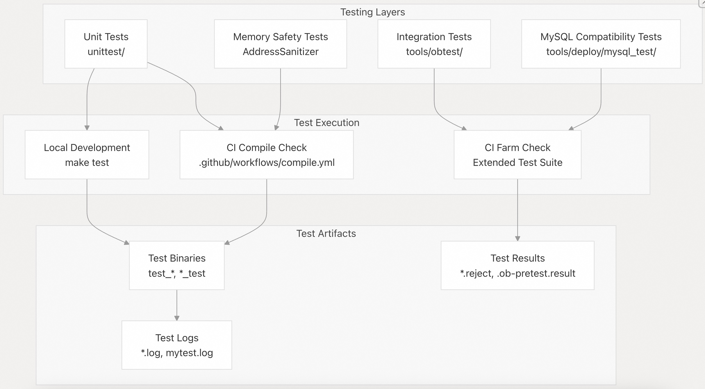
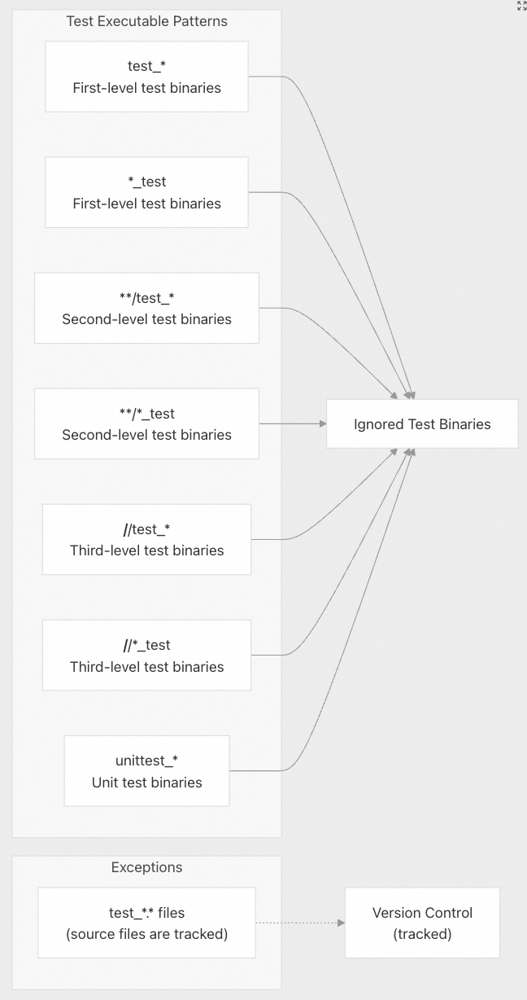
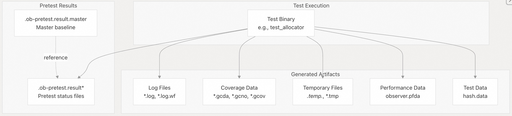
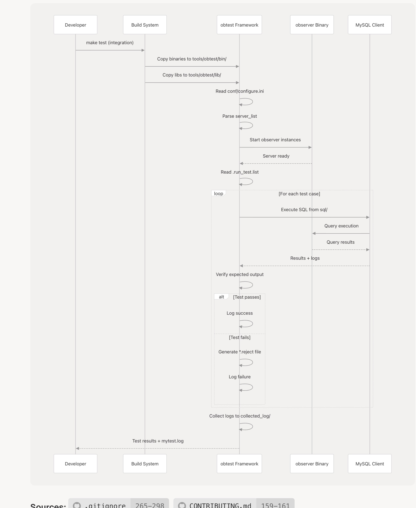
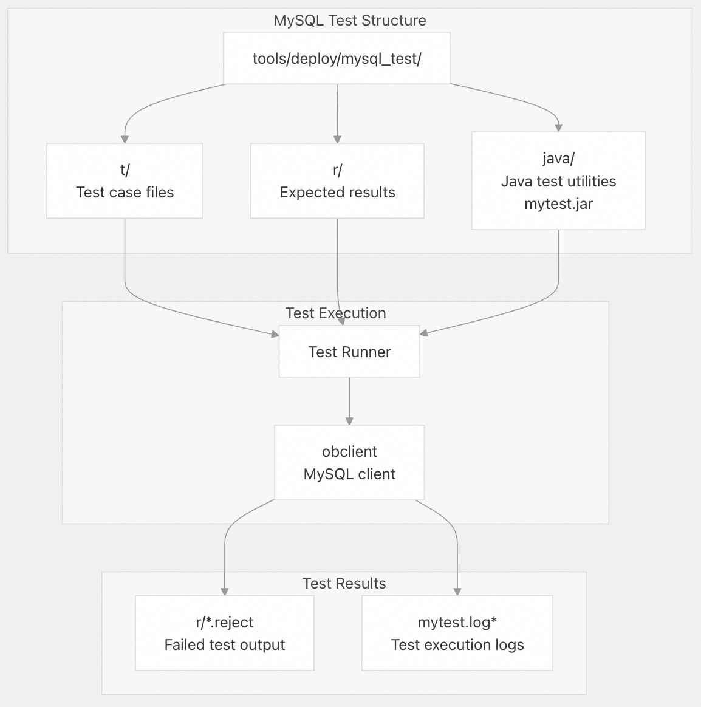
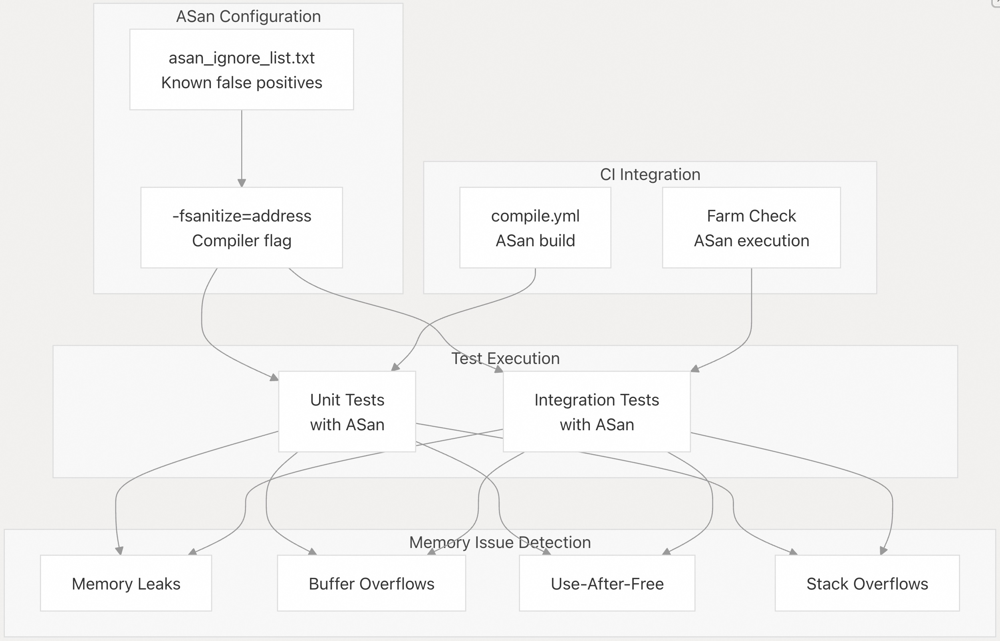
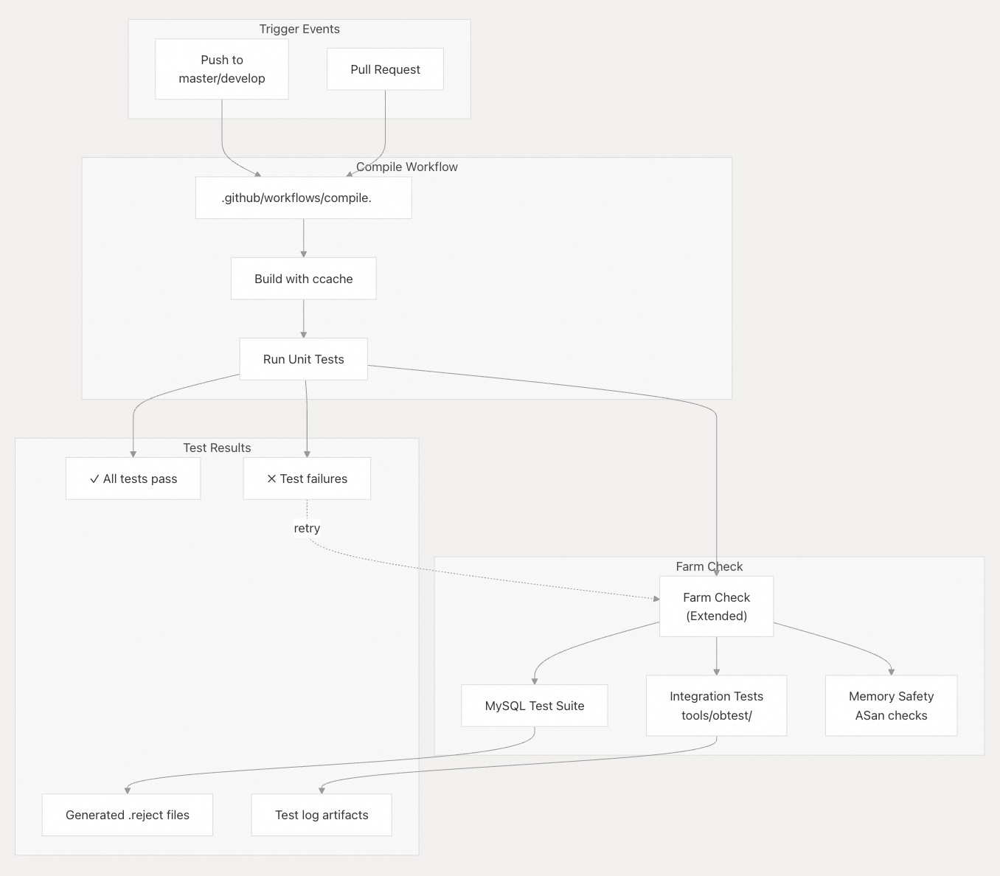
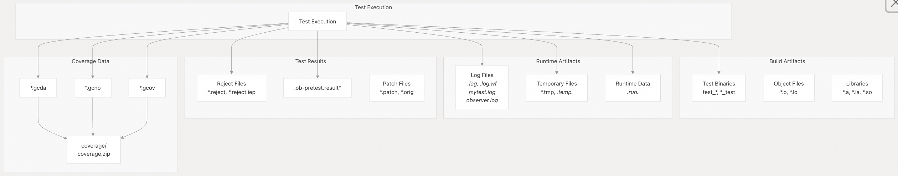
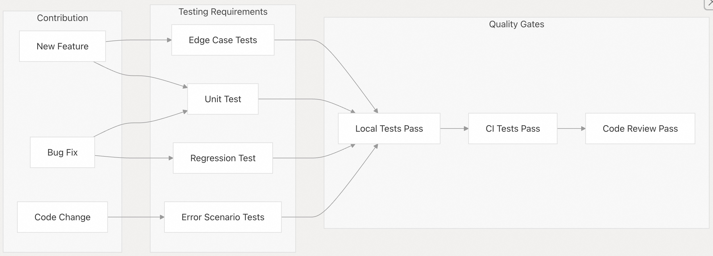

## SeekDB 源码学习: 3.4 测试基础设施 (Testing Infrastructure)  
                                        
### 作者                                        
digoal                                        
                                        
### 日期                                        
2025-11-26                                        
                                        
### 标签                                        
SeekDB , OceanBase , AI Native 数据库 , 向量搜索 , 语义搜索 , 关键词搜索 , 全文检索 , 标量搜索 , 混合搜索 , AI 搜索 , AI in Database , 多模态 , 源码学习                                         
                                        
----                                        
                                        
## 背景         
本文档描述了 OceanBase SeekDB 中的**测试基础设施** (Testing Infrastructure)，包括**单元测试** (unit tests)、**集成测试** (integration tests)、**MySQL 兼容性测试** (MySQL compatibility tests) 以及**内存安全验证** (memory safety verification)。它涵盖了测试组织、执行模式以及与 **CI/CD 流水线** (CI/CD pipeline) 的集成。  
  
## 概述 (Overview)  
  
SeekDB 采用**多层测试策略** (multi-layered testing strategy) 来确保代码质量、正确性和**内存安全** (memory safety)：  
  
  
  
**来源 (Sources):**  
[`.gitignore` 1-390](https://github.com/oceanbase/seekdb/blob/8c4654f1/.gitignore#L1-L390)  
[`CONTRIBUTING.md` 154-193](https://github.com/oceanbase/seekdb/blob/8c4654f1/CONTRIBUTING.md#L154-L193)  
  
## 单元测试框架 (Unit Testing Framework)  
  
### 测试组织 (Test Organization)  
  
**单元测试** (Unit tests) 位于 `unittest/` 目录下，并按**组件** (component) 进行组织。测试**可执行文件** (Test executables) 遵循命名约定，这些约定将它们排除在**版本控制** (version control) 之外：  
  
| 测试模式 (Test Pattern) | 描述 (Description) | 示例位置 (Example Location) |  
| :--- | :--- | :--- |  
| `test_*` | 带有 `test_` 前缀的测试可执行文件 | `unittest/common/test_kv_storecache` |  
| `*_test` | 带有 `_test` 后缀的测试可执行文件 | `unittest/sql/optimizer/storage_perf/storage_perf_cost` |  
| `unittest_*` | 单元测试可执行文件 | 各种子目录 (Various subdirectories) |  
  
### 测试可执行文件模式 (Test Executable Patterns)  
  
以下模式识别出已构建但未在**版本控制** (version control) 中跟踪的测试可执行文件：  
  
  
  
**来源 (Sources):**  
[`.gitignore` 331-338](https://github.com/oceanbase/seekdb/blob/8c4654f1/.gitignore#L331-L338)  
  
### 组件特定测试套件 (Component-Specific Test Suites)  
  
主要的**测试套件** (test suites) 按系统组件组织：  
  
| 组件 (Component) | 测试目录 (Test Directory) | 关键测试领域 (Key Test Areas) |  
| :--- | :--- | :--- |  
| Common | `unittest/common/` | 核心工具 (Core utilities), **分配器** (allocators) |  
| Storage | `unittest/storage/` | **块存储** (Block storage), **事务** (transactions), **SSTable** |  
| SQL | `unittest/sql/` | **解析器** (Parser), **优化器** (optimizer), **执行器** (executor), **引擎** (engine) |  
| RPC | `unittest/rpc/` | **RPC 基础设施** (RPC infrastructure), **基准测试** (benchmarks) |  
| ObProxy | `unittest/obproxy/` | **代理层功能** (Proxy layer functionality) |  
| LibOBCDC | `unittest/libobcdc/` | **变更数据捕获** (Change data capture) |  
| Clog | `unittest/clog/` | **提交日志功能** (Commit log functionality) |  
  
**来源 (Sources):**  
[`.gitignore` 330-376](https://github.com/oceanbase/seekdb/blob/8c4654f1/.gitignore#L330-L376)  
  
### 测试产物与日志 (Test Artifacts and Logs)  
  
**单元测试** (Unit tests) 在执行期间产生各种**产物** (artifacts)：  
  
  
  
**来源 (Sources):**  
[`.gitignore` 1-348](https://github.com/oceanbase/seekdb/blob/8c4654f1/.gitignore#L1-L348)  
  
### 运行单元测试 (Running Unit Tests)  
  
**单元测试** (Unit tests) 通过**构建系统** (build system) 执行：  
  
```bash  
# Run all unit tests  
make test  
  
# Run specific test suite  
make test-unit  
  
# Run with parallel jobs  
make -j$(nproc) test  
```  
  
**来源 (Sources):**  
[`CONTRIBUTING.md` 186-193](https://github.com/oceanbase/seekdb/blob/8c4654f1/CONTRIBUTING.md#L186-L193)  
  
## 使用 obtest 进行集成测试 (Integration Testing with obtest)  
  
### obtest 框架 (obtest Framework)  
  
`tools/obtest/` 目录包含**集成测试框架** (integration testing framework)，它提供全面的**端到端测试** (end-to-end testing) 能力：  
  
  
  
**来源 (Sources):**  
[`.gitignore` 265-298](https://github.com/oceanbase/seekdb/blob/8c4654f1/.gitignore#L265-L298)  
  
### obtest 配置 (obtest Configuration)  
  
**集成测试** (Integration tests) 使用**配置文件** (configuration files) 来定义测试参数：  
  
| 配置文件 (Configuration File) | 目的 (Purpose) |  
| :--- | :--- |  
| `conf/configure.ini` | 主测试配置 (Main test configuration) |  
| `agent/agentserver.conf.template` | 代理服务器模板 (Agent server template) |  
| `agent/agentrestore.conf.template` | 恢复代理模板 (Restore agent template) |  
| `server_list` | 服务器部署列表 (Server deployment list) |  
  
**来源 (Sources):**  
[`.gitignore` 272-290](https://github.com/oceanbase/seekdb/blob/8c4654f1/.gitignore#L272-L290)  
  
### obtest 测试执行流程 (obtest Test Execution Flow)  
  
  
  
**来源 (Sources):**  
[`.gitignore` 265-298](https://github.com/oceanbase/seekdb/blob/8c4654f1/.gitignore#L265-L298)  
[`CONTRIBUTING.md` 159-161](https://github.com/oceanbase/seekdb/blob/8c4654f1/CONTRIBUTING.md#L159-L161)  
  
### 测试版本控制 (Test Versioning)  
  
obtest 框架维护**特定版本** (version-specific) 的测试目录：  
  
  * `1.0.6_beta/` - 1.0.6 Beta 版本测试  
  * `1.1.1_beta/` - 1.1.1 Beta 版本测试  
  * 基于模式的测试集 (Pattern-based test sets): `1_*`, `2_*`, `3_*`, `4_*`  
  
**来源 (Sources):**  
[`.gitignore` 265-269](https://github.com/oceanbase/seekdb/blob/8c4654f1/.gitignore#L265-L269)  
  
## MySQL 兼容性测试 (MySQL Compatibility Testing)  
  
### MySQL 测试套件结构 (MySQL Test Suite Structure)  
  
**MySQL 兼容性测试** (MySQL compatibility tests) 位于 `tools/deploy/mysql_test/` 中，用于验证 MySQL **协议** (protocol) 和**行为兼容性** (behavior compatibility)：  
  
  
  
**来源 (Sources):**  
[`.gitignore` 229-231](https://github.com/oceanbase/seekdb/blob/8c4654f1/.gitignore#L229-L231)  
  
### 测试结果分析 (Test Result Analysis)  
  
当 MySQL 测试失败时，该框架会生成包含实际输出的 `.reject` 文件：  
  
| 文件类型 (File Type) | 目的 (Purpose) | 操作 (Action) |  
| :--- | :--- | :--- |  
| `r/*.reject` | 失败测试的实际输出 (Failed test actual output) | 与预期结果进行比较 (Compare with expected results) |  
| `mytest.log` | 测试执行日志 (Test execution log) | 诊断测试失败 (Diagnose test failures) |  
| Expected results | 基线结果位于 `r/` 中 (Baseline results in `r/`) | 与实际输出进行比较 (Compare against actual output) |  
  
**来源 (Sources):**  
[`.gitignore` 230-231](https://github.com/oceanbase/seekdb/blob/8c4654f1/.gitignore#L230-L231)  
  
## 内存安全测试 (Memory Safety Testing)  
  
### AddressSanitizer 集成 (AddressSanitizer Integration)  
  
**内存安全** (Memory safety) 通过 **AddressSanitizer** (ASan) 进行验证，并通过**忽略列表** (ignore list) 进行配置：  
  
  
  
**来源 (Sources):**  
[`.gitignore` 1-390](https://github.com/oceanbase/seekdb/blob/8c4654f1/.gitignore#L1-L390)    
  
## CI/CD 测试集成 (CI/CD Test Integration)  
  
### 持续集成测试执行 (Continuous Integration Test Execution)  
  
测试通过 **GitHub Actions 工作流** (workflows) 自动执行：  
  
  
  
**来源 (Sources):**  
[`CONTRIBUTING.md` 154-161](https://github.com/oceanbase/seekdb/blob/8c4654f1/CONTRIBUTING.md#L154-L161)  
  
### CI 测试检查 (CI Test Checks)  
  
**CI 流水线** (CI pipeline) 执行两项主要的测试检查：  
  
| 检查类型 (Check Type) | 范围 (Scope) | 执行环境 (Execution Environment) | 通过标准 (Pass Criteria) |  
| :--- | :--- | :--- | :--- |  
| **Compile (编译)** | 单元测试 + **构建验证** (build verification) | CentOS, Ubuntu 22.04 | **清理构建** (Clean build) + 单元测试通过 (unit tests pass) |  
| **Farm (测试农场)** | **扩展测试套件** (Extended test suite) | **专用测试基础设施** (Dedicated test infrastructure) | MySQL 测试 + **集成测试**通过 (integration tests pass) |  
  
**来源 (Sources):**  
[`CONTRIBUTING.md` 154-161](https://github.com/oceanbase/seekdb/blob/8c4654f1/CONTRIBUTING.md#L154-L161)  
  
### 处理 CI 中的测试失败 (Handling Test Failures in CI)  
  
当测试在 **CI** 中失败时：  
  
1.  **Compile failures (编译失败)** ：代码未通过编译或**单元测试**失败  
      * **开发者** (Developer) 必须在本地修复问题  
      * 重新推送以触发新的 **CI 运行** (CI run)  
2.  **Farm failures (Farm 失败)** ：**集成测试**或 MySQL 测试失败  
      * 查看 `.reject` 文件以了解失败原因  
      * 如果与更改无关，请求**评审者** (reviewer) 重新运行  
      * 否则，修复问题并重新推送  
  
**来源 (Sources):**  
[`CONTRIBUTING.md` 159-161](https://github.com/oceanbase/seekdb/blob/8c4654f1/CONTRIBUTING.md#L159-L161)  
  
## 测试产物与清理 (Test Artifacts and Cleanup)  
  
### 生成的测试文件 (Generated Test Files)  
  
测试产生各种被排除在**版本控制** (version control) 之外的**产物** (artifacts)：  
  
  
  
**来源 (Sources):**  
[`.gitignore` 1-47](https://github.com/oceanbase/seekdb/blob/8c4654f1/.gitignore#L1-L47)  
  
### 清理脚本 (Cleanup Scripts)  
  
测试环境包含**清理机制** (cleanup mechanisms)：  
  
| 脚本 (Script) | 位置 (Location) | 目的 (Purpose) |  
| :--- | :--- | :--- |  
| `clean.sh` | `tools/obtest/` | 清理 obtest 环境 (Clean obtest environment) |  
| `yclean.sh` | `tools/obtest/`, `tools/deploy/` | 完全清理，包括日志 (Full cleanup including logs) |  
  
**来源 (Sources):**  
[`.gitignore` 249-295](https://github.com/oceanbase/seekdb/blob/8c4654f1/.gitignore#L249-L295)  
  
## 测试开发指南 (Test Development Guidelines)  
  
### 编写单元测试 (Writing Unit Tests)  
  
在贡献代码时，请遵循以下**测试指南** (testing guidelines)：  
  
1.  **New features (新功能)** ：包含**单元测试**来展示正确的功能 (correct functionality)  
2.  **Bug fixes (错误修复)** ：添加重现错误并验证修复的测试  
3.  **Test coverage (测试覆盖率)** ：覆盖**边界情况** (edge cases) 和**错误场景** (error scenarios)  
4.  **Test patterns (测试模式)** ：遵循组件中现有的测试约定  
  
**来源 (Sources):**  
[`CONTRIBUTING.md` 180-210](https://github.com/oceanbase/seekdb/blob/8c4654f1/CONTRIBUTING.md#L180-L210)  
  
### 单元测试要求 (Unit Test Requirements)  
  
  
  
**来源 (Sources):**  
[`CONTRIBUTING.md` 180-210](https://github.com/oceanbase/seekdb/blob/8c4654f1/CONTRIBUTING.md#L180-L210)  
  
### 测试执行最佳实践 (Test Execution Best Practices)  
  
在提交**拉取请求** (pull request) 之前：  
  
1.  **Run tests locally (在本地运行测试)** ：执行 `make test` 来验证更改  
2.  **Check test output (检查测试输出)** ：查看日志中的警告或错误  
3.  **Verify coverage (验证覆盖率)** ：确保新代码得到充分测试  
4.  **Clean build (清理构建)** ：使用**清理构建**进行测试以避免**陈旧产物** (stale artifacts)  
  
**来源 (Sources):**  
[`CONTRIBUTING.md` 164-193](https://github.com/oceanbase/seekdb/blob/8c4654f1/CONTRIBUTING.md#L164-L193)  
  
## 测试目录结构摘要 (Test Directory Structure Summary)  
  
| 目录 (Directory) | 目的 (Purpose) | 关键内容 (Key Contents) |  
| :--- | :--- | :--- |  
| `unittest/` | **单元测试** (Unit tests) | **组件特定测试套件** (Component-specific test suites) |  
| `tools/obtest/` | **集成测试** (Integration tests) | SQL 测试、配置、测试运行器 (test runner) |  
| `tools/deploy/mysql_test/` | MySQL **兼容性** (compatibility) | 测试用例、预期结果、Java 工具 |  
| `build*/` | **构建产物** (Build artifacts) | **测试二进制文件** (Test binaries)、**覆盖率数据** (coverage data) |  
  
**来源 (Sources):**  
[`.gitignore` 1-390](https://github.com/oceanbase/seekdb/blob/8c4654f1/.gitignore#L1-L390)  
  
  
-----  
  
# 附录1: 开发者视角：集成测试 (obtest) 的本地精确复现与配置  
  
**背景痛点：** 文档提到 CI/CD 有两级检查（Compile/Farm），其中 **Farm 失败**涉及复杂的**集成测试**和 **MySQL 兼容性测试**，且在**专用测试基础设施**上运行。开发者在本地难以精确模拟该环境，可能陷入“推送-CI 失败-修复”的低效循环。  
  
**关键问题：**  
  
> 鉴于 **obtest 框架**位于 `tools/obtest/`，并依赖于 `conf/configure.ini` 和 `server_list` 等**配置文件**来定义测试参数和服务器部署，**作为开发者，如何通过调整这些关键配置参数，在本地高效地模拟出 CI/CD 中** Farm 检查所使用的**专用测试基础设施**环境？在进行本地调试时，是否存在一个推荐的 **obtest 配置基线**，能够最大程度保证本地测试结果与 **CI/CD 流水线** 中的执行流程和环境**行为一致性**？  
  
## 回答  
  
根据您的问题，您想了解如何配置 obtest 框架在本地模拟 CI/CD 中 Farm 检查的环境。然而，在当前提供的代码上下文中，我没有找到您提到的关键文件：  
  
- `tools/obtest/` 目录  
- `conf/configure.ini` 配置文件    
- `server_list` 配置文件  
  
## 当前可用的测试基础设施信息  
  
从现有代码中，我可以看到 SeekDB 的测试基础设施包括：  
  
### CI/CD 检查类型  
CI 包含两类检查  ：  
- **Compile**: 在 CentOS 和 Ubuntu 上编译代码  
- **Farm**: 运行单元测试和 MySQL 测试用例  
  
### 本地测试运行方式  
单元测试位于 `unittest` 和 `deps/oblib/unittest` 目录  。编译和运行步骤：  
  
```bash  
# 编译项目（Debug 模式）  
bash build.sh debug --init --make  
  
# 进入构建目录  
cd build_debug/unittest  
  
# 编译单元测试  
make -j4  
  
# 运行所有测试  
./run_tests.sh  
```  
  
### 部署配置  
现有的部署使用 `./tools/deploy/obd.sh` 脚本和 `./tools/deploy/single.yaml` 配置文件  。  
  
## 建议  
  
由于缺少 obtest 框架的具体信息，我建议：  
  
1. **确认文件位置**: 请检查 `tools/obtest/` 目录是否存在于代码库的其他分支或版本中  
2. **查看 CI 配置**: Farm 检查的具体配置可能在 CI 系统的配置文件中  
3. **参考现有测试**: 可以使用现有的单元测试框架作为本地调试的起点    
  
如果您能提供 obtest 框架相关文件的具体内容或位置，我可以给出更精确的配置指导。  
  
## Notes  
  
当前代码上下文主要包含单元测试和部署脚本的信息，但没有您提到的 obtest 框架相关配置。Farm 检查在 CI 中确实运行单元测试和 MySQL 兼容性测试，但具体的配置参数需要查看 obtest 框架的配置文件才能确定。  
  
  
  
-----  
  
# 附录2: 架构师/用户视角：MySQL 兼容性测试的深度与可靠性  
  
**背景知识/细节：** SeekDB 设有专门的 **MySQL 兼容性测试**套件，当测试失败时会生成包含实际输出的 `.reject` 文件，并维护**版本特定**的测试目录（如 `1.0.6_beta/`）。SeekDB 的核心价值之一很可能是兼容性。  
  
**关键问题：**  
  
> **作为寻求高度 MySQL 兼容性的架构师或用户，SeekDB 的 MySQL 兼容性测试套件在哪些关键领域 (Key Test Areas) 实现了深度覆盖？** 特别是，除了验证基本的**协议** (protocol) 和**行为** (behavior) 兼容性外，测试用例是否还涵盖了 **MySQL 优化器** (optimizer) 行为、**事务** (transactions) 隔离级别以及 **PL/SQL 兼容性**等核心数据库功能？我们能否依赖**版本特定测试目录**来证明新版本对**历史版本**特定**兼容性错误修复**的**回归性**？  
  
## 回答  
  
## SeekDB MySQL兼容性测试覆盖的关键领域  
  
SeekDB的MySQL兼容性测试套件在以下核心领域实现了深度覆盖：  
  
### 1. MySQL优化器行为测试  
  
测试套件包含专门的优化器测试，覆盖查询计划、执行策略等核心功能：  
  
- **查询计划验证**：`explain.test` 测试EXPLAIN、DESC、DESCRIBE语句，验证优化器生成的执行计划    
- **子查询优化**：`subquery/` 目录包含大量子查询优化测试，包括semi-join、嵌套子查询等复杂场景    
- **优化器bug回归测试**：专门的`optimizer_subquery_bug.test`文件测试已知优化器问题的修复    
  
### 2. 事务隔离级别测试  
  
通过DML操作测试验证事务行为的一致性：  
  
- **UPDATE操作测试**：`update2.test` 测试更新操作的事务语义，包括分区表的事务处理    
- **并发控制验证**：测试文件包含对并发更新、锁机制等事务核心功能的验证  
  
### 3. PL/SQL兼容性测试  
  
PL/SQL功能有完整的实现和测试覆盖：  
  
- **PL/SQL执行引擎**：`ob_pl.cpp` 实现了完整的PL/SQL执行框架，支持匿名块、存储过程等    
- **兼容模式控制**：`test_worker.cpp` 验证MySQL/Oracle兼容模式的动态切换    
  
### 4. 版本特定兼容性控制  
  
系统提供细粒度的版本兼容性控制机制：  
  
- **特性级兼容控制**：`ob_compatibility_control_feature_def.h` 定义了针对不同MySQL版本的特定行为控制    
- **版本特定行为**：包括函数行为差异、语法支持差异等版本间不一致问题的处理  
  
## 版本特定测试目录的回归性保证  
  
基于代码分析，版本特定测试目录（如`1.0.6_beta/`）确实能够提供回归性保证：  
  
1. **问题追踪机制**：测试失败时生成`.reject`文件，记录实际输出与期望的差异  
2. **版本隔离**：不同版本的测试用例分别维护，确保版本特定问题的独立验证  
3. **兼容性开关**：通过特性控制开关可以精确复现特定版本的行为，用于回归测试  
  
## Notes  
  
- 测试套件采用MySQL标准的`mysqltest`框架，确保与MySQL生态系统的兼容性验证  
- 优化器测试特别关注复杂查询场景，包括多表连接、子查询优化等高级特性  
- PL/SQL兼容性不仅支持语法层面，还包括执行语义的兼容性验证  
- 版本兼容性控制支持动态切换，可以在同一系统中验证多个MySQL版本的行为一致性  
  
  
  
  
-----  
  
# 附录3: 维护者视角：测试产物管理和构建系统卫生  
  
**背景痛点/细节：** 文档多次提及测试会产生大量**测试产物** (artifacts) 和**二进制文件** (test binaries) 需通过 `.gitignore` 排除，且提供了 `clean.sh` 和 `yclean.sh` 等**清理脚本**。这暗示了管理这些临时文件、避免**陈旧产物** (stale artifacts) 是一个日常维护的痛点。  
  
**关键问题：**  
  
> **作为维护者，项目的构建系统 (build system) 和测试框架 (testing framework) 如何设计以确保在日常** `make test` **执行时，能够有效防止** **“陈旧产物”** **的引入？** 除了手动运行**清理脚本**外，是否有内置机制（例如在**单元测试**运行之前或构建阶段）强制执行**清理构建** (Clean build) 或增量清理？如果未清理 **build\*/** 目录中的**测试二进制文件**或**覆盖率数据**，对**增量构建**的可靠性和 **Test Execution Best Practices** 中提到的**测试覆盖率**验证会产生哪些负面影响？  
  
  
## 回答  
  
## 构建系统与测试框架的陈旧产物防护机制  
  
### 内置清理机制  
  
项目确实设计了内置的清理机制来防止陈旧产物。核心是 `ResidualDataCleanerHelper` 类，它在测试套件完成后自动清理残留数据  。  
  
```cpp  
// 当所有测试用例通过时，清理残留数据  
if (failed_count == 0) {  
  ResidualDataCleaner cleaner;  
  cleaner.clean_residual_data();  
}  
```  
  
### 测试框架集成  
  
这个清理机制深度集成在测试框架中，在多个测试文件的 `TearDownTestCase()` 中被调用：  
  
- `test_clean_residual_data.cpp`    
- `test_ss_micro_cache_abnormal_case.cpp`    
- `test_file_manager.cpp`    
  
### 构建系统限制  
  
然而，当前的构建系统（通过 `make test` 执行）** 没有内置机制在测试运行前强制清理 `build*/` 目录**。构建命令主要依赖标准的 make 工具  。  
  
### 陈旧产物的负面影响  
  
未清理的测试二进制文件和覆盖率数据会导致：  
  
1. **增量构建不可靠**：陈旧的依赖文件可能导致链接错误或测试行为不一致  
2. **测试覆盖率验证失效**：残留的覆盖率数据会干扰新的覆盖率统计，导致报告不准确  
3. **存储空间浪费**：测试产物持续累积占用磁盘空间  
  
### 建议改进  
  
考虑在 `make test` 目标中添加预清理步骤，或在 CI 流程中集成强制清理，确保每次测试都在干净环境中执行。  
  
## Notes  
  
- 当前的清理机制主要针对共享存储模式下的测试数据残留  
- 清理只在所有测试通过时执行，失败的测试会保留数据用于调试  
- 没有发现 `clean.sh` 或 `yclean.sh` 脚本在提供的代码上下文中  
  
    
#### [PolarDB 学习图谱](https://www.aliyun.com/database/openpolardb/activity "8642f60e04ed0c814bf9cb9677976bd4")
  
  
#### [PostgreSQL 解决方案集合](../201706/20170601_02.md "40cff096e9ed7122c512b35d8561d9c8")
  
  
#### [德哥 / digoal's Github - 公益是一辈子的事.](https://github.com/digoal/blog/blob/master/README.md "22709685feb7cab07d30f30387f0a9ae")
  
  
#### [About 德哥](https://github.com/digoal/blog/blob/master/me/readme.md "a37735981e7704886ffd590565582dd0")
  
  

  
