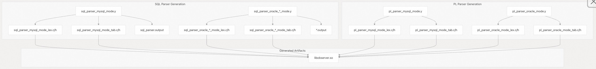
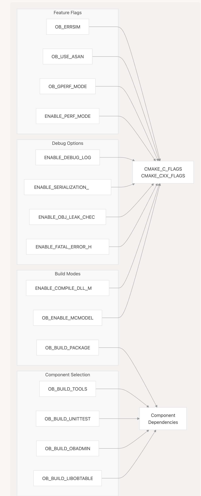
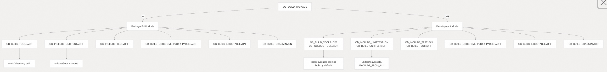
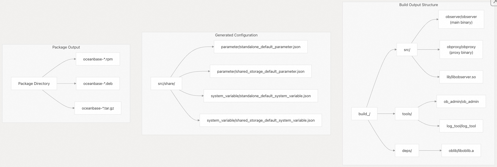
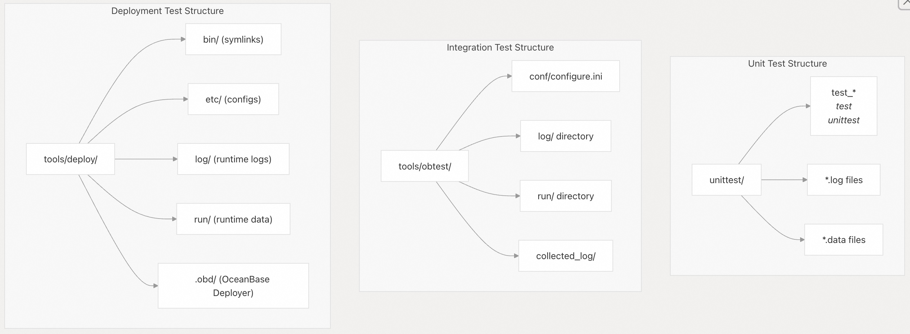
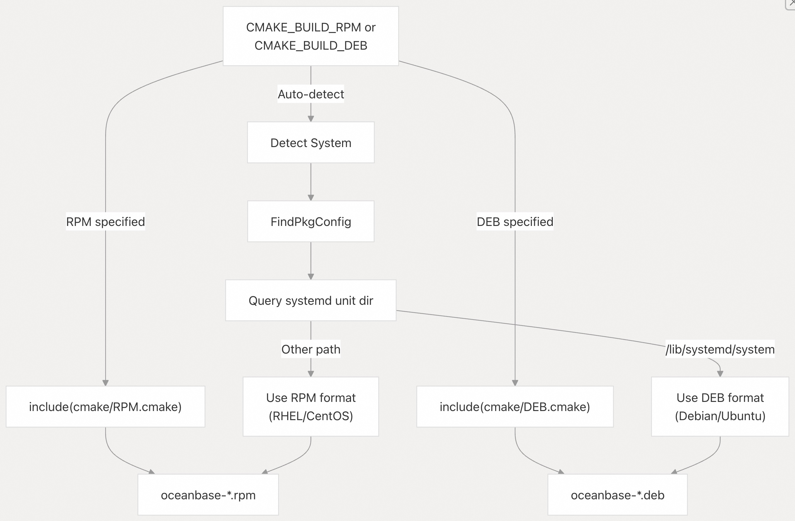

## SeekDB 源码学习: 4 参考资料 (Reference)   
                                          
### 作者                                          
digoal                                          
                                          
### 日期                                          
2025-11-26                                          
                                          
### 标签                                          
SeekDB , OceanBase , AI Native 数据库 , 向量搜索 , 语义搜索 , 关键词搜索 , 全文检索 , 标量搜索 , 混合搜索 , AI 搜索 , AI in Database , 多模态 , 源码学习                                           
                                          
----                                          
                                          
## 背景           
本节为使用 OceanBase SeekDB **代码库** (codebase) 的开发者提供了**快速参考资料** (quick reference materials)。它包括**查找表** (lookup tables)、**常见模式** (common patterns)，以及**高级概念** (high-level concepts) 和**具体代码实体** (concrete code entities) 之间的**映射** (mappings)。  
  
## 常见文件模式和构建产物 (Artifacts)  
  
**代码库** (repository) 对**生成的文件** (generated files)、**构建产物** (build artifacts) 和**临时文件** (temporary files) 使用了**一致的命名约定** (naming conventions) 和**模式** (patterns)。了解这些模式有助于开发者浏览代码库并保持**工作目录** (working directories) 整洁。  
  
### 按扩展名分类的构建产物  
  
| 模式 (Pattern) | 描述 (Description) | 生成者 (Generated By) |  
| :--- | :--- | :--- |  
| `*.o`, `*.lo` | **目标文件** (Object files) | C/C++ **编译器** (compiler) |  
| `*.a`, `*.la` | **静态库** (Static libraries) | **归档工具** (Archive tool, ar) |  
| `*.so`, `*.so.*` | **共享库** (Shared libraries) | **链接器** (Linker) |  
| `*.gcno`, `*.gcda`, `*.gcov` | **覆盖率数据** (Coverage data) | GCC/gcov |  
| `*.pyc` | Python **字节码** (bytecode) | Python **解释器** (interpreter) |  
  
**来源:**  
[`gitignore` 2-8](https://github.com/oceanbase/seekdb/blob/8c4654f1/.gitignore#L2-L8) [`gitignore` 14](https://github.com/oceanbase/seekdb/blob/8c4654f1/.gitignore#L14-L14)  
  
### 解析器 (Parser) 生成的文件  
  
| 模式 (Pattern) | 描述 (Description) | 位置 (Location) |  
| :--- | :--- | :--- |  
| `*_lex.c`, `*_lex.h` | **词法分析器** (Lexer) 源文件/头文件 | `src/sql/parser/`, `src/pl/parser/` |  
| `*_tab.c`, `*_tab.h` | **解析器表** (Parser tables) | `src/sql/parser/`, `src/pl/parser/` |  
| `*.output` | **解析器调试输出** (Parser debug output) | `src/sql/parser/`, `src/pl/parser/` |  
| `_gen_parser.output` | **生成器输出** (Generator output) | `src/sql/parser/`, `src/pl/parser/` |  
| `_gen_parser.error` | **生成器错误** (Generator errors) | `src/sql/parser/` |  
| `_MD5` | **校验和文件** (Checksum files) | `src/sql/parser/`, `src/pl/parser/` |  
  
**来源:**  
[`gitignore` 141-186](https://github.com/oceanbase/seekdb/blob/8c4654f1/.gitignore#L141-L186)  
  
### 解析器文件生成图  
  
  
  
**来源:**  
[`gitignore` 141-186](https://github.com/oceanbase/seekdb/blob/8c4654f1/.gitignore#L141-L186) [`CMakeLists.txt` 110-112](https://github.com/oceanbase/seekdb/blob/8c4654f1/CMakeLists.txt#L110-L112)  
  
## CMake 构建配置选项  
  
**构建系统** (build system) 提供了大量的 **CMake 选项** (options)，用于控制**编译行为** (compilation behavior)、**功能启用** (feature enablement) 和**构建特性** (build characteristics)。  
  
### 核心构建选项  
  
  
  
**来源:**  
[`CMakeLists.txt` 13-89](https://github.com/oceanbase/seekdb/blob/8c4654f1/CMakeLists.txt#L13-L89) [`CMakeLists.txt` 114-151](https://github.com/oceanbase/seekdb/blob/8c4654f1/CMakeLists.txt#L114-L151)  
  
### CMake 选项参考表  
  
| 选项 (Option) | 默认值 (Default) | 目的 (Purpose) | 编译器标志 (Compiler Flag) |  
| :--- | :--- | :--- | :--- |  
| `OB_ERRSIM` | OFF | 启用**错误模拟** (Enable error simulation) | `-DERRSIM` |  
| `OB_USE_ASAN` | OFF | 启用 **AddressSanitizer** (地址清理器) | `-DOB_USE_ASAN` |  
| `OB_GPERF_MODE` | OFF | 启用 **gperf 性能分析** (Enable gperf profiling) | `-D__NEED_PERF__` |  
| `ENABLE_PERF_MODE` | OFF | 启用**性能模式** (Enable performance mode) | `-DPERF_MODE` |  
| `ENABLE_SERIALIZATION_CHECK` | OFF | 检查**序列化** (Check serialization) | `-DENABLE_SERIALIZATION_CHECK` |  
| `ENABLE_OBJ_LEAK_CHECK` | OFF | 检查**对象泄漏** (Check object leaks) | `-DENABLE_OBJ_LEAK_CHECK=1` |  
| `ENABLE_FATAL_ERROR_HANG` | OFF | **致命错误时挂起** (Hang on fatal errors) | `-DFATAL_ERROR_HANG` |  
| `ENABLE_COMPILE_DLL_MODE` | OFF | 编译为 **动态链接库** (Compile as DLL) | `-DCOMPILE_DLL_MODE` |  
| `OB_BUILD_PACKAGE` | OFF | 构建**发布包** (Build release package) | `-DOB_BUILD_PACKAGE` |  
| `OB_ENABLE_MCMODEL` | OFF | 使用**大内存模型** (Use large memory model, x86\_64) | `-mcmodel=large` |  
| `TRANS_MODULE_TEST` | OFF | **事务模块测试** (Transaction module testing) | `-DTRANS_MODULE_TEST` |  
| `DETECT_RECURSION` | OFF | 检测**栈递归** (Detect stack recursion) | `-DDETECT_RECURSION` |  
| `ENABLE_SANITY` | OFF | 启用**健全性检查** (Enable sanity checks) | `-DENABLE_SANITY` |  
  
**来源:**  
[`CMakeLists.txt` 13-89](https://github.com/oceanbase/seekdb/blob/8c4654f1/CMakeLists.txt#L13-L89)  
  
### 组件构建控制  
  
  
  
**来源:**  
[`CMakeLists.txt` 114-164](https://github.com/oceanbase/seekdb/blob/8c4654f1/CMakeLists.txt#L114-L164)  
  
## 构建目录模式  
  
**构建系统** (build system) 会根据**构建类型** (build type) 创建各种**构建目录** (build directories)。这些目录都被 **Git 忽略** (ignored)，以保持工作目录的整洁。  
  
| 目录模式 (Directory Pattern) | 目的 (Purpose) | 创建者 (Created By) |  
| :--- | :--- | :--- |  
| `build/` | **默认构建目录** (Default build directory) | CMake |  
| `build_debug/` | **调试构建输出** (Debug build output) | `build.sh debug` |  
| `build_release/` | **发布构建输出** (Release build output) | `build.sh release` |  
| `build_errsim/` | **错误模拟构建** (Error simulation build) | `build.sh errsim` |  
| `build_*/` | 任何**自定义构建目录** (Any custom build directory) | **用户指定** (User-specified) |  
  
**来源:**  
[`gitignore` 61-66](https://github.com/oceanbase/seekdb/blob/8c4654f1/.gitignore#L61-L66)  
  
### 构建产物位置  
  
  
  
**来源:**  
[`gitignore` 61-66](https://github.com/oceanbase/seekdb/blob/8c4654f1/.gitignore#L61-L66) [`gitignore` 189-192](https://github.com/oceanbase/seekdb/blob/8c4654f1/.gitignore#L189-L192) [`CMakeLists.txt` 166-190](https://github.com/oceanbase/seekdb/blob/8c4654f1/CMakeLists.txt#L166-L190)  
  
## 主要构建目标  
  
下表将**逻辑构建目标** (logical build targets) 映射到其**物理位置** (physical locations) 和**入口点** (entry points)：  
  
| 目标 (Target) | 二进制路径 (Binary Path) | 入口点 (Entry Point) | 目的 (Purpose) |  
| :--- | :--- | :--- | :--- |  
| `observer` | `src/observer/observer` | `main()` in `src/observer/main.cpp` | **主数据库服务器** (Main database server) |  
| `obproxy` | `src/obproxy/obproxy` | `main()` in `src/obproxy/obproxy/main.cpp` | **数据库代理** (Database proxy) |  
| `ob_admin` | `tools/ob_admin/ob_admin` | `main()` in `tools/ob_admin/ob_admin.cpp` | **管理工具** (Administration tool) |  
| `libobserver.so` | `lib/libobserver.so` | N/A | **共享库** (Shared library) |  
| `libobcdc` | `observer` 的一部分 | N/A | **变更数据捕获** (Change data capture) |  
| `libtable` | `src/libtable/` | N/A | **表 API 库** (Table API library) |  
  
**来源:**  
[`gitignore` 88-89](https://github.com/oceanbase/seekdb/blob/8c4654f1/.gitignore#L88-L89) [`gitignore` 137-140](https://github.com/oceanbase/seekdb/blob/8c4654f1/.gitignore#L137-L140) [`CMakeLists.txt` 110-112](https://github.com/oceanbase/seekdb/blob/8c4654f1/CMakeLists.txt#L110-L112)  
  
## 测试和开发产物  
  
### 测试目录模式  
  
  
  
**来源:**  
[`gitignore` 331-376](https://github.com/oceanbase/seekdb/blob/8c4654f1/.gitignore#L331-L376) [`gitignore` 265-307](https://github.com/oceanbase/seekdb/blob/8c4654f1/.gitignore#L265-L307) [`gitignore` 211-259](https://github.com/oceanbase/seekdb/blob/8c4654f1/.gitignore#L211-L259)  
  
### 开发产物  
  
| 产物 (Artifact) | 目的 (Purpose) | 位置 (Location) |  
| :--- | :--- | :--- |  
| `compile_commands.json` | **Clang 工具数据库** (Clang tooling database) | **项目根目录** (Project root) |  
| `.ccls-cache/` | **ccls 语言服务器缓存** (ccls language server cache) | **按目录** (Per-directory) |  
| `.cache/` | **通用缓存目录** (Generic cache directory) | **项目根目录** (Project root) |  
| `tags`, `TAGS`, `cscope.*` | **代码导航索引** (Code navigation indices) | **项目根目录** (Project root) |  
| `.vscode/`, `.cursor/` | **编辑器配置** (Editor configurations) | **项目根目录** (被 Git 忽略) |  
| `.idea/`, `*.iml` | **IntelliJ 配置** (IntelliJ configurations) | **项目根目录** (被 Git 忽略) |  
  
**来源:**  
[`gitignore` 97-107](https://github.com/oceanbase/seekdb/blob/8c4654f1/.gitignore#L97-L107) [`gitignore` 77](https://github.com/oceanbase/seekdb/blob/8c4654f1/.gitignore#L77-L77) [`gitignore` 95](https://github.com/oceanbase/seekdb/blob/8c4654f1/.gitignore#L95-L95)  
  
## 包构建配置  
  
在构建**发布包** (release packages, 如 RPM/DEB) 时，**构建系统** (build system) 会根据操作系统自动选择合适的**打包格式** (packaging format)。  
  
  
  
**来源:**  
[`CMakeLists.txt` 166-190](https://github.com/oceanbase/seekdb/blob/8c4654f1/CMakeLists.txt#L166-L190)  
  
## 第三方依赖 (Third-Party Dependencies)  
  
项目使用 `deps/3rd/` 目录来存放**第三方依赖** (third-party dependencies)：  
  
| 库 (Library) | 静态 (Static) | 共享 (Shared) | 架构 (Architecture) |  
| :--- | :--- | :--- | :--- |  
| libstdc++ | **不适用** (N/A) | `${DEVTOOLS_DIR}/lib64/libstdc++.so` | **所有** (All) |  
| Hyperscan | `${DEP_DIR}/lib/libhs.a` | `${DEP_DIR}/lib/libhs.so` | **仅限** x86\_64 (x86\_64 only) |  
  
**来源:**  
[`CMakeLists.txt` 96-108](https://github.com/oceanbase/seekdb/blob/8c4654f1/CMakeLists.txt#L96-L108) [`gitignore` 383-385](https://github.com/oceanbase/seekdb/blob/8c4654f1/.gitignore#L383-L385)  
  
## 配置文件模式  
  
生成的配置文件遵循**一致的命名模式** (consistent naming patterns)：  
  
| 文件模式 (File Pattern) | 部署模式 (Deployment Mode) | 目的 (Purpose) |  
| :--- | :--- | :--- |  
| `standalone_default_parameter.json` | **独立部署** (Standalone) | **服务器参数** (Server parameters) |  
| `shared_storage_default_parameter.json` | **共享存储** (Shared storage) | **服务器参数** (Server parameters) |  
| `standalone_default_system_variable.json` | **独立部署** (Standalone) | **系统变量** (System variables) |  
| `shared_storage_default_system_variable.json` | **共享存储** (Shared storage) | **系统变量** (System variables) |  
  
**来源:**  
[`gitignore` 189-192](https://github.com/oceanbase/seekdb/blob/8c4654f1/.gitignore#L189-L192)  
  
## 常见 Make 目标  
  
此处列出了最常用的 make **目标** (targets)：  
  
| 目标 (Target) | 描述 (Description) |  
| :--- | :--- |  
| `all` | **构建所有配置的目标** (Build all configured targets) |  
| `observer` | **仅构建** observer **二进制文件** (Build only the observer binary) |  
| `obproxy` | **仅构建** obproxy **二进制文件** (Build only the obproxy binary) |  
| `clean` | **移除构建产物** (Remove build artifacts) |  
| `install` | **安装构建的目标** (Install built targets) |  
| `test` | **运行 CTest 测试套件** (Run CTest test suite) |  
  
**来源:**  
[`CMakeLists.txt` 153-164](https://github.com/oceanbase/seekdb/blob/8c4654f1/CMakeLists.txt#L153-L164)  
  
## 日志和运行时文件模式  
  
**运行时** (Runtime) 和**日志文件**遵循**可预测的模式** (patterns)，以方便**调试** (debugging)：  
  
| 模式 (Pattern) | 描述 (Description) | 位置 (Location) |  
| :--- | :--- | :--- |  
| `observer.log*` | **Observer 服务器日志** (Observer server logs) | **工作目录** (Working directory) |  
| `obproxy.*` | **代理运行时文件** (Proxy runtime files) | **工作目录** (Working directory) |  
| `*.log`, `*.log.wf` | **通用日志文件** (General log files) | **各种** (Various) |  
| `multiplog_*` | **多进程日志** (Multi-process logs) | **工作目录** (Working directory) |  
| `*.run.*` | **运行时状态文件** (Runtime state files) | **工作目录** (Working directory) |  
  
**来源:**  
[`gitignore` 9-10](https://github.com/oceanbase/seekdb/blob/8c4654f1/.gitignore#L9-L10) [`gitignore` 18](https://github.com/oceanbase/seekdb/blob/8c4654f1/.gitignore#L18-L18) [`gitignore` 85](https://github.com/oceanbase/seekdb/blob/8c4654f1/.gitignore#L85-L85) [`gitignore` 88-90](https://github.com/oceanbase/seekdb/blob/8c4654f1/.gitignore#L88-L90)  
  
  
-----  
  
# 附录1: 构建配置与性能开销：调试特性如何管控？  
  
**视角:** 架构师 / 资深开发者  
  
**背景痛点:** 在编译大型数据库系统时，开发者需要同时支持带深度调试功能（如内存检查、泄漏检查）的构建和高性能的生产构建。若高开销的调试选项意外混入生产环境，将严重影响性能和稳定性。  
  
**问题:**  
根据“CMake 选项参考表”中提到的 `OB_USE_ASAN` (地址清理器)、`ENABLE_OBJ_LEAK_CHECK` (对象泄漏检查) 和 `OB_GPERF_MODE` (性能分析) 等高开销选项，**构建系统**如何确保这些特性被正确地隔离和控制？具体来说，除了“构建目录模式”中提及的 `build.sh debug` 或 `build.sh release` 脚本，是否存在一个强制性的配置机制（例如在顶层 `CMakeLists.txt` 中）来**自动化禁用**（或默认禁用）所有可能导致性能严重下降的调试/分析标志，以防止其被错误地用于生产环境的 **Release build**？  
  
## 回答  
  
构建系统通过以下机制确保高开销调试选项被正确隔离：  
  
## 默认配置机制  
  
在 `cmake/Env.cmake` 中，所有高开销调试选项都默认设置为 `OFF`：    
  
```cmake  
ob_define(OB_GPERF_MODE OFF)  
ob_define(ENABLE_OBJ_LEAK_CHECK OFF)  
```  
  
`OB_USE_ASAN` 虽然没有直接定义默认值，但通过条件编译逻辑控制，只有在明确启用时才会添加 ASAN 标志：    
  
## 构建模式隔离  
  
构建系统通过 `build.sh` 脚本提供明确的构建模式选择：  
  
- **Debug 模式**：`bash build.sh debug --init --make`    
- **Release 模式**：`bash build.sh release --init --make`    
  
Release 模式专门针对生产环境优化，而 Debug 模式包含调试信息便于开发。  
  
## 强制禁用机制  
  
**不存在顶层 CMakeLists.txt 中的强制禁用机制**。构建系统依赖以下策略：  
  
1. **默认禁用策略**：所有性能敏感选项默认为 `OFF`  
2. **显式启用原则**：开发者必须通过 CMake 参数显式启用这些选项  
3. **构建脚本约定**：通过 `build.sh release` 约定生产构建不包含调试选项  
  
例如，在 Python wheel 构建中，即使使用 release 模式，也需要显式传递 `-DOB_USE_CCACHE=ON` 等参数：    
  
## 对象泄漏检查的条件编译  
  
`ENABLE_OBJ_LEAK_CHECK` 通过宏条件编译确保零开销：    
  
当未启用时，相关宏定义为空，不会产生任何运行时开销。  
  
## Notes  
  
构建系统采用"默认禁用 + 显式启用"的设计模式，而非强制禁用机制。这种设计给予开发者灵活性，同时通过默认配置降低生产环境误用的风险。Release 构建的性能保证主要依赖于构建脚本的约定和文档指导，而非代码层面的强制限制。  
  
  
  
  
-----  
  
# 附录2: 部署与依赖管理：核心组件的动态依赖关系如何？  
  
**视角:** 用户 / 运维人员  
  
**背景痛点:** 在构建部署包 (RPM/DEB) 或容器镜像时，运维人员需要精确了解每个二进制文件的**动态依赖**。特别是针对架构敏感或非核心组件的依赖，如 Hyperscan 库。  
  
**问题:**  
“主要构建目标”中提及的 **数据库代理** (`obproxy`) 和 **变更数据捕获** (`libobcdc`) 这两个关键组件，它们是否**静态链接**了所有第三方依赖（如 Hyperscan、`libstdc++`）？如果依赖是**动态**的（例如 `libhs.so`），**OceanBase SeekDB** 是否提供了依赖项的统一管理工具，确保运维人员在部署到不同的 **x86_64** 或其他架构平台时，能够准确、无遗漏地安装所有必需的 **共享库** (Shared Libraries)？  
  
## 回答  
  
根据提供的代码库上下文，我无法直接确认 `obproxy` 和 `libobcdc` 组件的具体链接方式，因为代码片段中未包含这两个组件的构建配置。不过，我可以从 OceanBase SeekDB 的依赖管理体系中提供相关信息。  
  
## 依赖管理机制  
  
OceanBase SeekDB 通过 `deps/init/` 目录下的依赖清单文件管理第三方依赖，支持多平台架构：  
  
- **x86_64 架构**：包含 `devdeps-hyperscan-5.4.2-252024092817.al8.x86_64.rpm` 等依赖包    
- **aarch64 架构**：同样提供对应的依赖包    
  
## Hyperscan 库的使用  
  
代码中显示 Hyperscan 被用作正则表达式引擎，通过动态链接方式使用：  
  
```cpp  
#if defined(__x86_64__)  
// Hyperscan 相关实现  
ObExprHsRegexCtx::ObExprHsRegexCtx() : ... {}  
```    
  
## 运行时依赖问题  
  
文档显示运行时可能遇到共享库缺失问题，例如：  
```  
error while loading shared libraries: libmariadb.so.3: cannot open shared object file  
```    
  
解决方案是通过设置 `LD_LIBRARY_PATH` 来指定库路径  。  
  
## 依赖管理工具  
  
OceanBase SeekDB 提供：  
1. **依赖清单文件**：按平台和架构组织的 `.deps` 文件  
2. **自动化脚本**：`dep_create.sh` 用于依赖初始化和管理    
3. **RPM 打包配置**：通过 CPack 生成包含依赖关系的 RPM 包    
  
## Notes  
  
- 代码库中未直接找到 `obproxy` 和 `libobcdc` 的构建配置，无法确认其具体链接方式  
- Hyperscan 在 x86_64 架构上被使用，但链接方式（静态/动态）需查看具体构建配置  
- 依赖管理主要通过 RPM 包和依赖清单实现，运维人员需要根据目标平台安装对应的依赖包  
- 运行时依赖问题可通过 `LD_LIBRARY_PATH` 或安装完整的依赖包解决  
  
  
  
-----  
  
# 附录3: 解析器系统：如何调试和扩展 SQL 语法？  
  
**视角:** 开发者  
  
**背景痛点:** 数据库开发者在扩展新的 SQL 或 PL 语法时，最大的挑战是调试解析器冲突和理解生成代码的复杂性。依赖解析器生成的文件 (Parser-Generated Files) 来快速定位问题至关重要。  
  
**问题:**  
在“解析器 (Parser) 生成的文件”部分中，这些文件 (`*_lex.c`, `*_tab.h`, `*.output`, `_gen_parser.error`) 是由哪种**解析器生成工具**（例如 Flex/Bison 或 ANTLR）生成的？作为一名开发者，如何利用生成的 **解析器调试输出** (`*.output` 和 `_gen_parser.error`) 文件，来快速、高效地定位和调试**新添加的 SQL 语法规则**在**词法** (Lexer) 或**语法** (Parser) 层面引入的**歧义** (Ambiguities) 或错误？  
  
## 回答  
  
## 解析器生成工具  
  
这些文件是由 **Flex + Bison** 工具链生成的：  
- 词法分析器文件（`*_lex.c`）由 **Flex** 生成    
- 语法分析器文件（`*_tab.h`）由 **GNU Bison** 生成    
- 构建过程通过 `gen_parser.sh` 脚本调用，输出调试信息到 `*.output` 和 `_gen_parser.error`    
  
## 利用调试输出文件定位问题  
  
### 1. `*.output` 文件  
包含解析器状态机的详细信息，用于定位语法冲突：  
- **状态分析**：查看每个状态的 shift/reduce 和 reduce/reduce 冲突  
- **规则优先级**：通过 `%prec` 声明解决操作符优先级歧义  
- **冲突定位**：搜索 "conflict" 关键字快速找到冲突规则  
  
### 2. `_gen_parser.error` 文件  
记录生成过程中的错误信息：  
- **语法错误**：Bison 报告的语法规则错误  
- **词法错误**：Flex 模式冲突或无效正则表达式  
- **内存错误**：生成过程中的内存分配失败  
  
### 3. 调试新语法规则的实用技巧  
  
#### 词法层面调试  
```bash  
# 检查生成的词法分析器  
grep -n "return" *_lex.c | head -20  # 查看token映射  
```  
  
#### 语法层面调试  
```bash  
# 查看冲突规则  
grep -A5 -B5 "conflict" *.output  
# 分析特定状态  
grep -A20 "State [0-9]\+" *.output  
```  
  
#### 快速定位问题流程  
1. 检查 `_gen_parser.error` 确认生成成功  
2. 查看 `*.output` 中的冲突报告  
3. 在 `.y` 文件中定位冲突规则  
4. 使用 `%prec` 或重构规则解决歧义  
  
## Notes  
  
- Flex 版本：2.5.35    
- Bison 版本：2.4.1    
- 构建系统通过 CMake 集成，错误信息会中断编译过程    
- 调试时建议启用 `YYDEBUG=1` 宏获取运行时解析跟踪   
  
    
#### [PolarDB 学习图谱](https://www.aliyun.com/database/openpolardb/activity "8642f60e04ed0c814bf9cb9677976bd4")
  
  
#### [PostgreSQL 解决方案集合](../201706/20170601_02.md "40cff096e9ed7122c512b35d8561d9c8")
  
  
#### [德哥 / digoal's Github - 公益是一辈子的事.](https://github.com/digoal/blog/blob/master/README.md "22709685feb7cab07d30f30387f0a9ae")
  
  
#### [About 德哥](https://github.com/digoal/blog/blob/master/me/readme.md "a37735981e7704886ffd590565582dd0")
  
  

  
