## SeekDB 源码学习: 4.1 项目文件结构 (Project File Structure)   
                                            
### 作者                                            
digoal                                            
                                            
### 日期                                            
2025-11-26                                            
                                            
### 标签                                            
SeekDB , OceanBase , AI Native 数据库 , 向量搜索 , 语义搜索 , 关键词搜索 , 全文检索 , 标量搜索 , 混合搜索 , AI 搜索 , AI in Database , 多模态 , 源码学习                                             
                                            
----                                            
                                            
## 背景             
本页面全面概述了 OceanBase SeekDB 仓库 (repository) 的文件结构 (file structure)，旨在帮助开发人员理解不同组件 (components)、构建产物 (build artifacts) 和配置文件 (configuration files) 的位置。了解仓库布局 (repository layout) 对于浏览代码库 (codebase)、构建项目和有效贡献 (contributing) 至关重要。  
  
-----  
  
## 仓库布局概览 (Overview of Repository Layout)  
  
该仓库遵循模块化结构 (modular structure)，清晰地分离了源代码 (source code)、构建产物 (build artifacts)、工具 (tooling) 和测试基础设施 (testing infrastructure)。`.gitignore` 文件提供了源代码结构和开发人员在开发过程中会遇到的生成产物 (generated artifacts) 的相关信息。  
  
**顶级目录结构 (Top-Level Directory Structure)**  
  
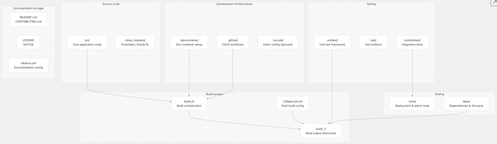  
  
来源: [`.gitignore` 1-390](https://github.com/oceanbase/seekdb/blob/8c4654f1/.gitignore#L1-L390)  
  
-----  
  
## 源代码组织 (`src/`) (Source Code Organization)  
  
`src/` 目录 (directory) 包含核心应用程序 (core application) 源代码 (source code)，按组件功能 (component functionality) 进行组织。本节描述了主要的子目录 (subdirectories) 及其用途 (purposes)。  
  
**主要源代码组件 (Main Source Components)**  
  
| 目录 (Directory) | 用途 (Purpose) | 主要产物 (Key Outputs) |  
| :--- | :--- | :--- |  
| `src/observer/` | 主数据库服务器实现 (Main database server implementation) | `observer` 二进制文件 (binary) |  
| `src/obproxy/` | 用于分布式部署 (distributed deployments) 的代理层 (Proxy layer) | `obproxy` 二进制文件 (binary) |  
| `src/sql/parser/` | 多模式 (Multi-mode) SQL 解析系统 (parser system) | 生成的解析器代码 (Generated parser code) |  
| `src/pl/parser/` | PL (过程语言, Procedural Language) 解析器 (parser) | 生成的 PL 解析器代码 (Generated PL parser code) |  
| `src/share/parameter/` | 系统参数 (System parameter) 定义 | JSON 配置文件 (configuration files) |  
| `src/share/system_variable/` | 系统变量 (System variable) 定义 | JSON 配置文件 (configuration files) |  
| `src/share/inner_table/sys_package/` | 系统包 (System package) 实现 | 生成的 C++ 源代码 (Generated C++ source) |  
| `src/election/` | 分布式选举子系统 (Distributed election subsystem) | `election`, `election_admin` 二进制文件 (binaries) |  
| `src/libtable/` | 表 API (Table API) 和示例 (examples) | 示例二进制文件 (Example binaries) |  
| `src/logservice/libobcdc/` | 变更数据捕获 (Change Data Capture, CDC) 库 (library) | 测试二进制文件 (Test binaries) |  
  
来源: [`.gitignore` 111-193](https://github.com/oceanbase/seekdb/blob/8c4654f1/.gitignore#L111-L193)  
  
**SQL 解析器结构 (SQL Parser Structure)**  
  
SQL 解析器支持多种 SQL 方言 (dialects) 和字符编码 (character encodings)，从而为每种模式 (mode) 生成单独的解析器实现 (parser implementations)。  
  
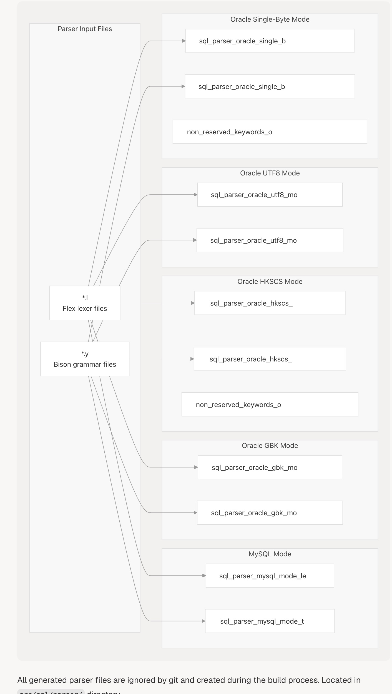  
  
所有生成的解析器文件都被 Git 忽略 (ignored) 并在构建过程 (build process) 中创建。位于 `src/sql/parser/` 目录中。  
  
来源: [`.gitignore` 141-173](https://github.com/oceanbase/seekdb/blob/8c4654f1/.gitignore#L141-L173)  
  
**PL 解析器结构 (PL Parser Structure)**  
  
类似地，PL (过程语言, Procedural Language) 解析器支持 MySQL 和 Oracle 模式。  
  
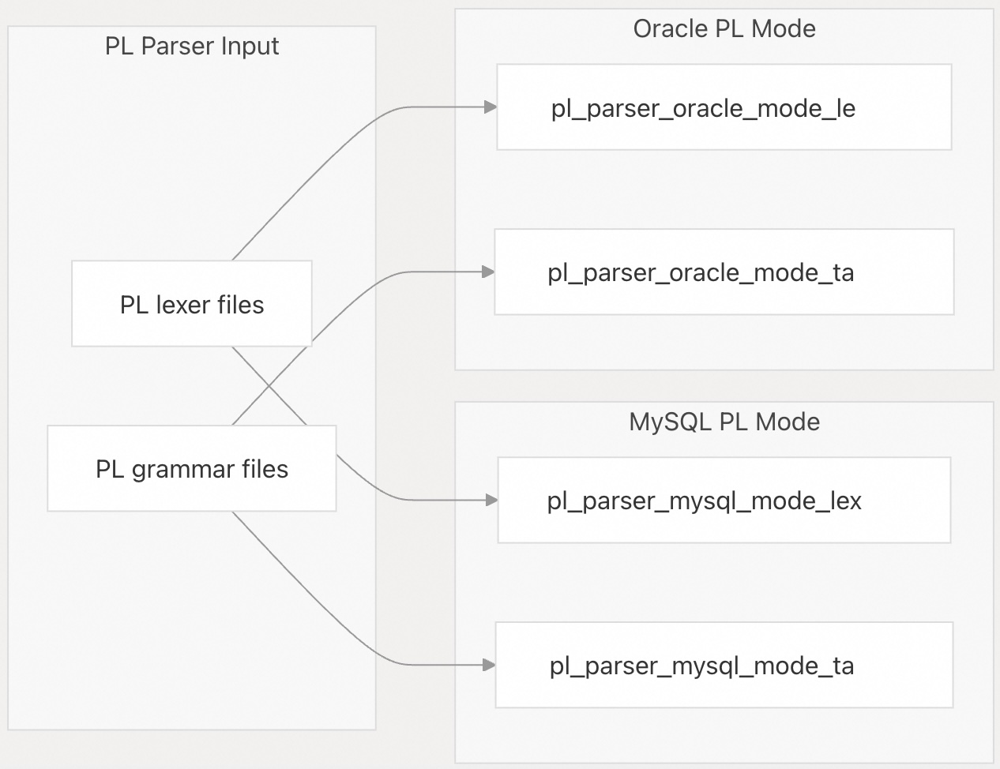  
  
位于 `src/pl/parser/` 目录中。额外的 Oracle PL 组件存在于 `close_modules/oracle_pl/pl/parser/` 和 `close_modules/oracle_pl/pl/wrap/` 中。  
  
来源: [`.gitignore` 174-186](https://github.com/oceanbase/seekdb/blob/8c4654f1/.gitignore#L174-L186) [`.gitignore` 195-203](https://github.com/oceanbase/seekdb/blob/8c4654f1/.gitignore#L195-L203)  
  
**配置文件 (Configuration Files)**  
  
配置按部署模式 (deployment mode) 分离：  
  
| 文件 (File) | 用途 (Purpose) | 位置 (Location) |  
| :--- | :--- | :--- |  
| `standalone_default_parameter.json` | 用于独立部署 (standalone deployments) 的参数 (Parameters) | `src/share/parameter/` |  
| `shared_storage_default_parameter.json` | 用于共享存储部署 (shared storage deployments) 的参数 (Parameters) | `src/share/parameter/` |  
| `standalone_default_system_variable.json` | 用于独立部署 (standalone) 的系统变量 (System variables) | `src/share/system_variable/` |  
| `shared_storage_default_system_variable.json` | 用于共享存储 (shared storage) 的系统变量 (System variables) | `src/share/system_variable/` |  
  
这些 JSON 文件是在构建过程 (build process) 中生成的，并定义了运行时配置模式 (runtime configuration schemas)。  
  
来源: [`.gitignore` 189-192](https://github.com/oceanbase/seekdb/blob/8c4654f1/.gitignore#L189-L192)  
  
-----  
  
## 构建产物和输出目录 (Build Artifacts and Output Directories)  
  
构建系统 (build system) 会生成大量不包含在版本控制 (version control) 中的产物 (artifacts)。了解这些模式 (patterns) 有助于开发人员识别哪些文件是源代码 (source) 哪些是生成的。  
  
**构建目录模式 (Build Directory Patterns)**  
  
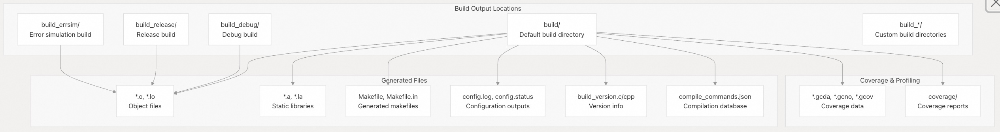  
  
来源: [`.gitignore` 1-99](https://github.com/oceanbase/seekdb/blob/8c4654f1/.gitignore#L1-L99)  
  
**核心二进制文件产物 (Core Binary Outputs)**  
  
以下二进制文件 (binaries) 是构建过程 (build process) 的主要交付物 (primary deliverables)：  
  
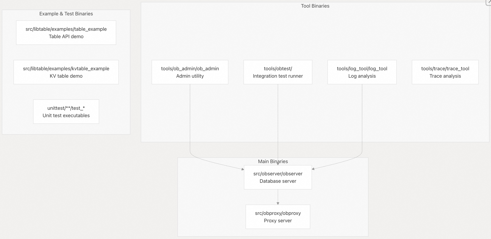  
  
来源: [`.gitignore` 137-140](https://github.com/oceanbase/seekdb/blob/8c4654f1/.gitignore#L137-L140) [`.gitignore` 261-264](https://github.com/oceanbase/seekdb/blob/8c4654f1/.gitignore#L261-L264) [`.gitignore` 130-134](https://github.com/oceanbase/seekdb/blob/8c4654f1/.gitignore#L130-L134) [`.gitignore` 331-338](https://github.com/oceanbase/seekdb/blob/8c4654f1/.gitignore#L331-L338)  
  
**临时文件和缓存文件 (Temporary and Cache Files)**  
  
| 模式 (Pattern) | 描述 (Description) | 用途 (Purpose) |  
| :--- | :--- | :--- |  
| `*.swp`, `*.swn` | Vim 交换文件 (swap files) | 编辑器临时文件 (Editor temporary files) |  
| `*.bak`, `*.orig`, `*.reject` | 备份和补丁文件 (Backup and patch files) | 合并/补丁产物 (Merge/patch artifacts) |  
| `*.tmp`, `*.temp.*` | 临时文件 (Temporary files) | 各种临时输出 (Various temporary outputs) |  
| `*.log`, `*.log.wf` | 日志文件 (Log files) | 运行时日志记录 (Runtime logging) |  
| `.libs/`, `.deps*` | Autotools 产物 (artifacts) | 构建系统内部文件 (Build system internals) |  
| `*.pyc`, `__pycache__/` | Python 字节码 (bytecode) | Python 编译缓存 (compilation cache) |  
| `tags`, `TAGS`, `cscope.*` | 代码索引 (Code indexing) | 编辑器/IDE 导航文件 (navigation files) |  
| `.ccls-cache/`, `.cache/` | 语言服务器缓存 (Language server cache) | 代码智能缓存 (Code intelligence cache) |  
  
来源: [`.gitignore` 1-102](https://github.com/oceanbase/seekdb/blob/8c4654f1/.gitignore#L1-L102)  
  
-----  
  
## 工具目录 (`tools/`) (Tools Directory)  
  
`tools/` 目录包含用于部署 (deployment)、测试 (testing)、管理 (administration) 和开发工作流 (development workflows) 的实用工具 (utilities)。  
  
**工具目录结构 (Tools Directory Structure)**  
  
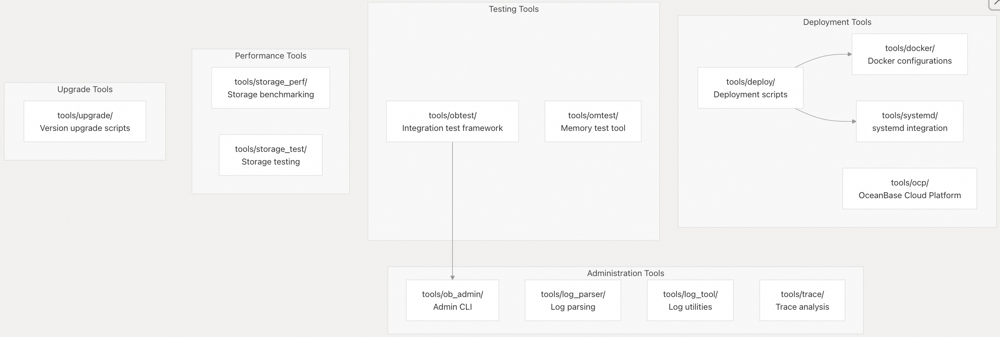  
  
来源: [`.gitignore` 205-328](https://github.com/oceanbase/seekdb/blob/8c4654f1/.gitignore#L205-L328)  
  
**部署产物 (被忽略) (Deployment Artifacts (Ignored))**  
  
部署目录生成了大量的运行时产物 (runtime artifacts)：  
  
| 模式 (Pattern) | 描述 (Description) |  
| :--- | :--- |  
| `tools/deploy/bin/` | 部署二进制文件 (Deployment binaries) |  
| `tools/deploy/etc/` | 配置文件 (Configuration files) |  
| `tools/deploy/lib/` | 运行时库 (Runtime libraries) |  
| `tools/deploy/run/` | 运行时状态 (Runtime state) |  
| `tools/deploy/log/` | 部署日志 (Deployment logs) |  
| `tools/deploy/usr/` | 用户特定数据 (User-specific data) |  
| `tools/deploy/.obd/` | OceanBase Deployer 状态 |  
| `tools/deploy/*.yaml` | 生成的部署配置 (Generated deployment configs) |  
| `tools/deploy/config*.py` | 生成的 Python 配置 (Generated Python configs) |  
  
来源: [`.gitignore` 211-258](https://github.com/oceanbase/seekdb/blob/8c4654f1/.gitignore#L211-L258)  
  
**集成测试 (`tools/obtest/`) (Integration Testing)**  
  
obtest 框架创建了大量的运行时产物 (runtime artifacts)：  
  
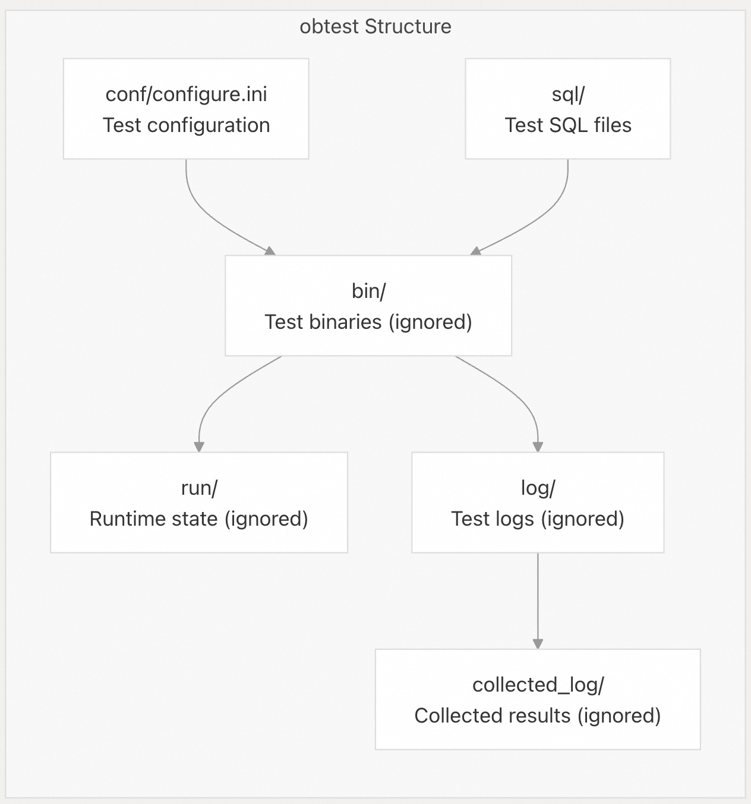  
  
来源: [`.gitignore` 265-298](https://github.com/oceanbase/seekdb/blob/8c4654f1/.gitignore#L265-L298)  
  
**Docker 部署文件 (Docker Deployment Files)**  
  
Docker 特定产物 (artifacts)：  
  
  * `tools/docker/standalone/boot` - 独立容器启动脚本 (Standalone container boot script) (被忽略)  
  * `tools/docker/standalone/init_store_for_fast_start.py` - 快速启动初始化 (Fast start initialization) (被忽略)  
  
来源: [`.gitignore` 317-318](https://github.com/oceanbase/seekdb/blob/8c4654f1/.gitignore#L317-L318)  
  
**systemd 集成 (systemd Integration)**  
  
系统集成脚本 (全部被 Git 忽略)：  
  
  * `tools/systemd/profile/pre_install.sh`, `post_install.sh` - 安装钩子 (Installation hooks)  
  * `tools/systemd/profile/pre_uninstall.sh`, `post_uninstall.sh` - 卸载钩子 (Uninstallation hooks)  
  * `tools/systemd/profile/preinst`, `postinst`, `prerm`, `postrm` - Debian 包钩子 (Debian package hooks)  
  * `tools/systemd/profile/telemetry.sh` - 遥测数据收集 (Telemetry collection)  
  
来源: [`.gitignore` 319-327](https://github.com/oceanbase/seekdb/blob/8c4654f1/.gitignore#L319-L327)  
  
-----  
  
## 测试基础设施 (Testing Infrastructure)  
  
测试产物 (Testing artifacts) 分为单元测试 (unit tests) 和集成测试 (integration tests)，并具有用于识别测试二进制文件 (test binaries) 的特定模式 (patterns)。  
  
**单元测试结构 (Unit Test Structure)**  
  
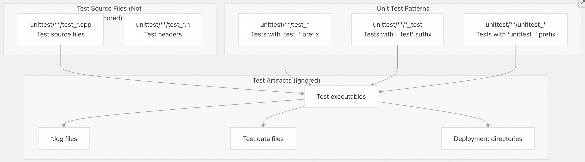  
  
`.gitignore` 使用 `test_*` 等模式来忽略可执行文件 (executables)，但通过 `!unittest/**/test_*.*` 明确保留源文件，以确保测试源代码 (test source code) 得到跟踪 (tracked)。  
  
来源: [`.gitignore` 331-376](https://github.com/oceanbase/seekdb/blob/8c4654f1/.gitignore#L331-L376)  
  
**测试组件组织 (Test Component Organization)**  
  
| 目录 (Directory) | 用途 (Purpose) | 主要产物 (Key Artifacts) |  
| :--- | :--- | :--- |  
| `unittest/common/` | 通用工具测试 (Common utility tests) | `kv_storecache`, `small_allocator` |  
| `unittest/sql/` | SQL 引擎测试 (SQL engine tests) | 解析器测试 (Parser tests), 优化器测试 (optimizer tests) |  
| `unittest/storage/` | 存储引擎测试 (Storage engine tests) | Blocksstable 测试, 事务测试 (transaction tests) |  
| `unittest/clog/` | 提交日志测试 (Commit log tests) | 部署目录 (Deploy directory), 日志工具 (log tools) |  
| `unittest/rpc/` | RPC 框架测试 (RPC framework tests) | `rpc_bench` |  
| `unittest/libobcdc/` | CDC 库测试 (CDC library tests) | `nopretest_test*` |  
| `unittest/obproxy/` | 代理测试 (Proxy tests) | 配置目录 (Configuration directories) |  
| `unittest/lib/` | 库测试 (Library tests) | 散列数据 (Hash data), 性能分析数据 (profiling data) |  
  
来源: [`.gitignore` 340-376](https://github.com/oceanbase/seekdb/blob/8c4654f1/.gitignore#L340-L376)  
  
**测试运行时产物 (Test Runtime Artifacts)**  
  
测试目录中常见的被忽略模式：  
  
  * `deploy/` - 测试部署目录 (Test deployment directories)  
  * `etc/` - 测试配置 (Test configuration)  
  * `.conf/` - 配置缓存 (Configuration cache)  
  * `*.log*` - 测试日志 (Test logs)  
  * `failed.result`, `failed.sql` - 失败的测试输出 (Failed test outputs)  
  * `redo_log_test/`, `scanner/`, `clog/` - 特定于测试的数据目录 (Test-specific data directories)  
  
来源: [`.gitignore` 340-376](https://github.com/oceanbase/seekdb/blob/8c4654f1/.gitignore#L340-L376)  
  
-----  
  
## 依赖项 (`deps/`) (Dependencies)  
  
依赖项目录 (dependencies directory) 包含第三方库 (third-party libraries) 和 OceanBase 库层 (library layer)。  
  
**依赖项结构 (Dependency Structure)**  
  
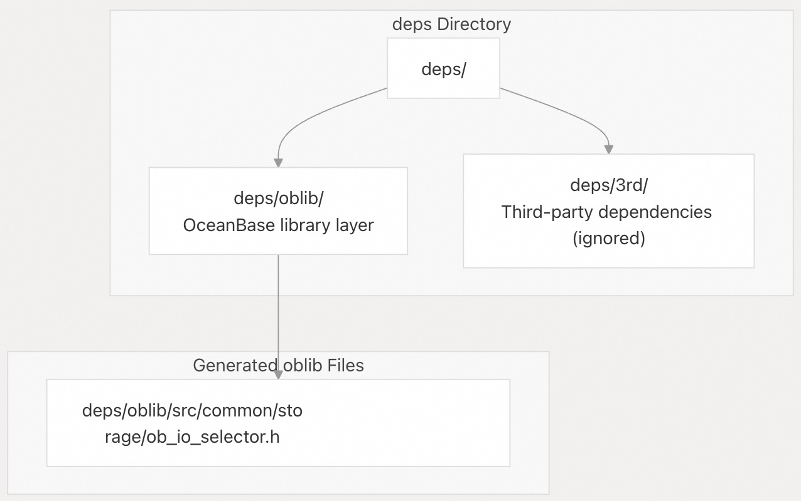  
  
`deps/3rd/` 目录被完全忽略 (ignored)，因为它包含下载/构建的第三方库 (third-party libraries)。`ob_io_selector.h` 文件是在构建过程 (build process) 中生成的。  
  
来源: [`.gitignore` 383-385](https://github.com/oceanbase/seekdb/blob/8c4654f1/.gitignore#L383-L385)  
  
-----  
  
## 开发环境文件 (Development Environment Files)  
  
各种开发环境配置文件 (development environment configuration files) 存在于仓库根目录 (repository root)，其中大部分被版本控制 (version control) 忽略 (ignored)，以允许每个开发人员进行自定义 (customization)。  
  
**IDE 和编辑器配置 (IDE and Editor Configurations)**  
  
| 路径 (Path) | 用途 (Purpose) | 是否被跟踪 (Tracked)? |  
| :--- | :--- | :--- |  
| `.devcontainer/` | VS Code 开发容器配置 (Dev Container config) | ✓ 是 (Yes) |  
| `.vscode/` | VS Code 设置 (settings) | ✗ 否 (ignored) |  
| `.cursor/` | Cursor IDE 设置 (settings) | ✗ 否 (ignored) |  
| `.idea/` | IntelliJ IDEA 设置 (settings) | ✗ 否 (ignored) |  
| `.cproject`, `.project` | Eclipse CDT 项目 (project) | ✗ 否 (ignored) |  
| `.dir-locals.el` | Emacs 目录局部变量 (directory locals) | ✓ 是 (Yes) |  
| `compile_commands.json` | 编译数据库 (Compilation database) | ✗ 否 (generated) |  
  
来源: [`.gitignore` 40-43](https://github.com/oceanbase/seekdb/blob/8c4654f1/.gitignore#L40-L43) [`.gitignore` 97-107](https://github.com/oceanbase/seekdb/blob/8c4654f1/.gitignore#L97-L107)  
  
**版本控制和代码导航 (Version Control and Code Navigation)**  
  
| 模式 (Pattern) | 用途 (Purpose) | 是否被跟踪 (Tracked)? |  
| :--- | :--- | :--- |  
| `.review/` | 代码审查元数据 (Code review metadata) | ✗ 否 (ignored) |  
| `tags`, `TAGS` | ctags/etags 索引 (indices) | ✗ 否 (generated) |  
| `cscope.*` | cscope 数据库 (database) | ✗ 否 (generated) |  
| `GTAGS`, `GRTAGS`, `GPATH` | GNU Global 标签 (tags) | ✗ 否 (generated) |  
| `.ccls-cache/` | ccls 语言服务器缓存 (language server cache) | ✗ 否 (ignored) |  
| `.cache/` | 通用缓存目录 (Generic cache directory) | ✗ 否 (ignored) |  
  
来源: [`.gitignore` 41-41](https://github.com/oceanbase/seekdb/blob/8c4654f1/.gitignore#L41-L41) [`.gitignore` 95-95](https://github.com/oceanbase/seekdb/blob/8c4654f1/.gitignore#L95-L95) [`.gitignore` 77-78](https://github.com/oceanbase/seekdb/blob/8c4654f1/.gitignore#L77-L78) [`.gitignore` 46-51](https://github.com/oceanbase/seekdb/blob/8c4654f1/.gitignore#L46-L51) [`.gitignore` 99-101](https://github.com/oceanbase/seekdb/blob/8c4654f1/.gitignore#L99-L101)  
  
**构建配置文件 (Build Configuration Files)**  
  
这些 autotools 和 CMake 文件可能在配置期间生成：  
  
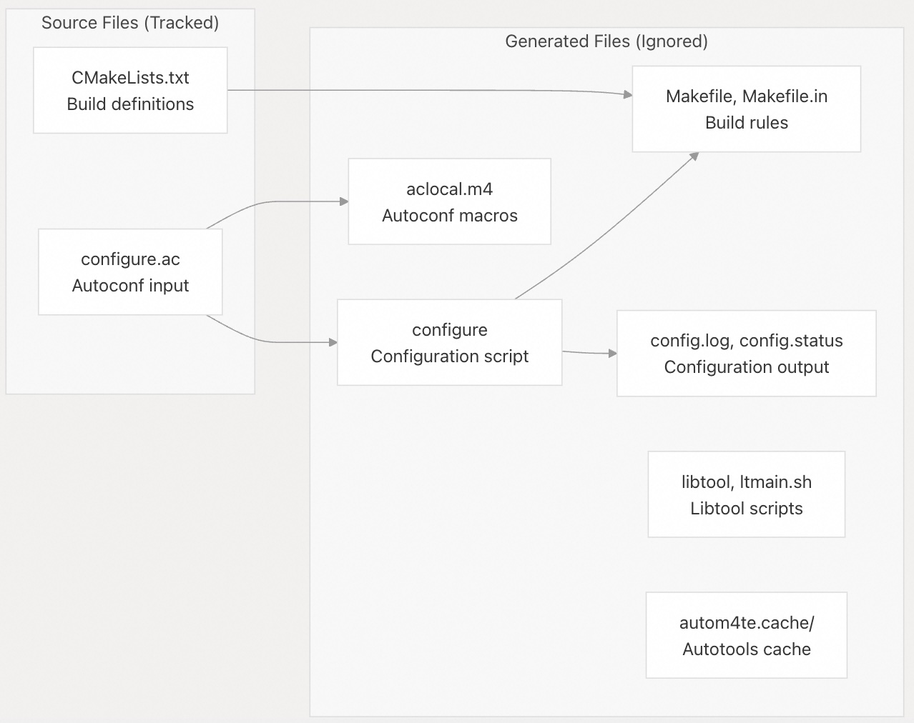  
  
来源: [`.gitignore` 52-84](https://github.com/oceanbase/seekdb/blob/8c4654f1/.gitignore#L52-L84)  
  
-----  
  
## 特殊文件和模式 (Special Files and Patterns)  
  
在开发过程中，有几个仓库范围的模式 (patterns) 和特殊文件需要注意。  
  
**日志文件和运行时产物 (Log Files and Runtime Artifacts)**  
  
| 模式 (Pattern) | 描述 (Description) | 位置 (Location) |  
| :--- | :--- | :--- |  
| `*.log`, `*.log.wf` | 通用日志文件 (General log files) | 整个仓库中 (Throughout repository) |  
| `observer.log*` | 数据库服务器日志 (Database server logs) | 运行时目录 (Runtime directory) |  
| `obproxy.log*` | 代理服务器日志 (Proxy server logs) | 运行时目录 (Runtime directory) |  
| `obproxy_config.bin` | 代理配置缓存 (Proxy configuration cache) | 运行时目录 (Runtime directory) |  
| `app.info` | 应用程序信息 (Application information) | 运行时目录 (Runtime directory) |  
| `multiplog_*` | 多个日志文件 (Multiple log files) | 运行时目录 (Runtime directory) |  
  
来源: [`.gitignore` 9-10](https://github.com/oceanbase/seekdb/blob/8c4654f1/.gitignore#L9-L10) [`.gitignore` 90-92](https://github.com/oceanbase/seekdb/blob/8c4654f1/.gitignore#L90-L92) [`.gitignore` 88-89](https://github.com/oceanbase/seekdb/blob/8c4654f1/.gitignore#L88-L89) [`.gitignore` 59](https://github.com/oceanbase/seekdb/blob/8c4654f1/.gitignore#L59-L59) [`.gitignore` 85](https://github.com/oceanbase/seekdb/blob/8c4654f1/.gitignore#L85-L85)  
  
**操作系统和编辑器产物 (OS and Editor Artifacts)**  
  
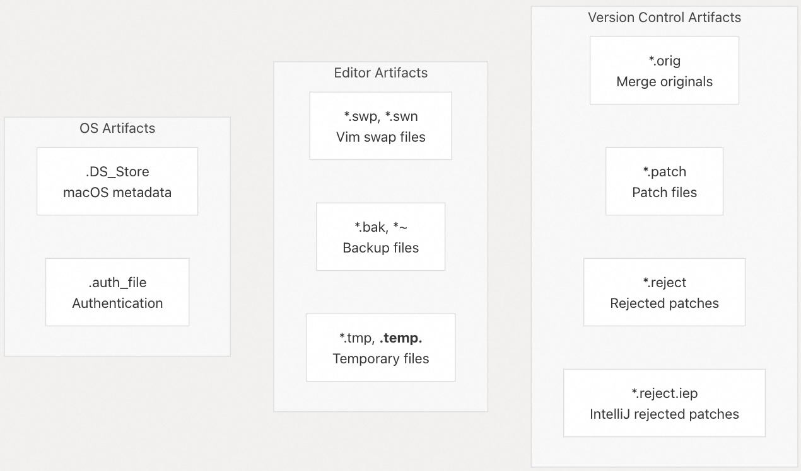  
  
来源: [`.gitignore` 11-24](https://github.com/oceanbase/seekdb/blob/8c4654f1/.gitignore#L11-L24) [`.gitignore` 25-26](https://github.com/oceanbase/seekdb/blob/8c4654f1/.gitignore#L25-L26) [`.gitignore` 109](https://github.com/oceanbase/seekdb/blob/8c4654f1/.gitignore#L109-L109)  
  
**配置状态文件 (Configuration State Files)**  
  
有几个点文件 (dotfiles) 跟踪配置状态并被忽略：  
  
  * `.configured` - 构建配置完成标记 (Build configuration complete marker)  
  * `.dep_create` - 依赖项创建标记 (Dependency creation marker)  
  * `.dirstamp` - 目录时间戳标记 (Directory timestamp marker)  
  * `.obdev` - 开发环境标记 (Development environment marker)  
  * `.settings/` - 各种工具设置目录 (Various tool settings directories)  
  
来源: [`.gitignore` 29-30](https://github.com/oceanbase/seekdb/blob/8c4654f1/.gitignore#L29-L30) [`.gitignore` 32](https://github.com/oceanbase/seekdb/blob/8c4654f1/.gitignore#L32-L32) [`.gitignore` 34](https://github.com/oceanbase/seekdb/blob/8c4654f1/.gitignore#L34-L34) [`.gitignore` 44-45](https://github.com/oceanbase/seekdb/blob/8c4654f1/.gitignore#L44-L45)  
  
-----  
  
## 文件结构最佳实践 (File Structure Best Practices)  
  
在使用 SeekDB 仓库时，请遵循以下指南 (guidelines)：  
  
**1. 构建目录隔离 (Build Directory Isolation)**  
  
始终在单独的目录 (`build_debug/`, `build_release/` 等) 中进行构建 (build)，以避免污染源代码树 (source tree)。`.gitignore` 确保这些目录永远不会被提交 (committed)。  
  
```bash  
# Good: Use separate build directories  
./build.sh debug --make  
./build.sh release --make  
  
# Creates: build_debug/, build_release/  
```  
  
**2. 生成文件 (Generated Files)**  
  
切勿手动编辑生成的文件。以下文件始终在构建期间生成：  
  
  * 解析器文件 (Parser files)：`src/sql/parser/` 和 `src/pl/parser/` 中的 `*_lex.c`、`*_tab.c`  
  * 配置文件 (Configuration files)：`*_parameter.json`、`*_system_variable.json`  
  * 构建元数据 (Build metadata)：`build_version.c`、`build_version.cpp`  
  * Makefiles：`Makefile`、`Makefile.in`  
  
**3. IDE 配置 (IDE Configuration)**  
  
`.vscode/`、`.idea/` 等中的 IDE 设置 (settings) 会被忽略 (ignored)。如果您需要在团队间共享 IDE 配置 (configurations)，则应将其记录在维基 (wiki) 中或添加到 `.devcontainer/`。  
  
**4. 测试产物 (Test Artifacts)**  
  
测试可执行文件 (Test executables) 遵循特定的命名模式 (`test_*`、`*_test`、`unittest_*`)。确保测试源文件使用正确的扩展名 (`.cpp`、`.h`)，以免被忽略。  
  
**5. 部署配置 (Deployment Configuration)**  
  
`tools/deploy/` 和 `tools/obtest/` 中生成的部署配置会被忽略。只提交模板文件 (template files) 和源脚本 (source scripts)。  
  
-----  
  
## 快速参考：查找组件 (Quick Reference: Finding Components)  
  
| 组件 (Component) | 源代码位置 (Source Location) | 二进制文件位置 (Binary Location) | 配置位置 (Config Location) |  
| :--- | :--- | :--- | :--- |  
| 数据库服务器 (Database Server) | `src/observer/` | `build_*/src/observer/observer` | `tools/deploy/` |  
| 代理服务器 (Proxy Server) | `src/obproxy/` | `build_*/src/obproxy/obproxy` | `tools/deploy/` |  
| SQL 解析器 (SQL Parser) | `src/sql/parser/*.y` | `build_*/src/sql/parser/` | N/A |  
| PL 解析器 (PL Parser) | `src/pl/parser/*.y` | `build_*/src/pl/parser/` | N/A |  
| 管理工具 (Admin Tools) | `tools/ob_admin/` | `build_*/tools/ob_admin/ob_admin` | N/A |  
| 单元测试 (Unit Tests) | `unittest/` | `build_*/unittest/` | `unittest/` |  
| 集成测试 (Integration Tests) | `tools/obtest/sql/` | `tools/obtest/bin/` | `tools/obtest/conf/` |  
| 参数 (Parameters) | 源代码定义 (Source definitions) | `src/share/parameter/*.json` | `tools/deploy/` |  
| 系统变量 (System Variables) | 源代码定义 (Source definitions) | `src/share/system_variable/*.json` | `tools/deploy/` |  
  
来源: [`.gitignore` 111-193](https://github.com/oceanbase/seekdb/blob/8c4654f1/.gitignore#L111-L193) [`.gitignore` 205-328](https://github.com/oceanbase/seekdb/blob/8c4654f1/.gitignore#L205-L328) [`.gitignore` 330-376](https://github.com/oceanbase/seekdb/blob/8c4654f1/.gitignore#L330-L376)  
  
-----  
  
这份文件结构文档源自 `.gitignore` 文件，代表了规范的仓库布局 (canonical repository layout)。随着项目的演进 (eveloves)，此结构可能会发生变化，但源代码 (source)、构建产物 (build artifacts)、工具 (tooling) 和测试 (testing) 分离的基本组织原则将保持不变。  
  
  
-----  
  
# 附录1: 架构师/开发者角度：核心组件的依赖隔离与版本控制风险  
  
**背景痛点：**  
SeekDB 仓库将核心数据库 (`src/observer`) 和代理层 (`src/obproxy`) 分离，并明确将第三方依赖 (`deps/3rd/`) 目录完全忽略（不进行版本控制）。这种结构可能导致构建过程复杂化。  
  
**关键问题：**  
SeekDB 如何在构建时严格管理和确保核心组件（如 `observer` 和 `obproxy`）之间的**依赖隔离性**？此外，鉴于所有第三方库位于 Git 忽略的目录 (`deps/3rd/`) 中，项目如何**可信地追踪、验证和初始化**这些关键的外部依赖项？是否有专门的构建脚本或机制（例如 Submodule/Git LFS 或自定义下载/构建系统）来确保不同环境下的依赖版本一致性和完整性？  
  
## 回答  
  
SeekDB 通过专门的依赖管理系统确保核心组件的隔离性和第三方依赖的可信追踪。  
  
## 依赖隔离机制  
  
SeekDB 将核心数据库 (`src/observer`) 和代理层 (`src/obproxy`) 分离构建，通过 CMake 的独立组件定义实现隔离  。构建系统为不同组件设置独立的安装目标和依赖链，确保 `observer` 和 `obproxy` 在编译时不会产生交叉依赖。  
  
## 第三方依赖管理  
  
### 版本定义与追踪  
项目使用平台特定的依赖清单文件（如 `oceanbase.el7.x86_64.deps`）精确定义每个第三方库的版本  。这些文件包含：  
- 目标仓库地址（development-kit/community）  
- 具体的 RPM 包版本号  
- 平台架构标识  
  
### 依赖初始化流程  
`deps/init/dep_create.sh` 脚本实现完整的依赖管理流程  ：  
  
1. **MD5 校验**：计算依赖清单的 MD5 哈希值用于版本验证  
2. **缓存检查**：通过 `${MD5}` 和 `DONE` 文件判断依赖是否已初始化  
3. **共享缓存**：支持 `DEP_CACHE_DIR` 环境变量配置的共享缓存机制  
4. **下载与解压**：使用 wget 下载 RPM 包并通过 rpm2cpio 解压  
  
### 构建系统集成  
构建脚本 `build.sh` 通过 `--init` 参数集成依赖初始化  ：  
```bash  
bash build.sh debug --init --make  
```  
  
Python wheel 构建也使用相同的依赖管理机制  。  
  
## 依赖隔离性保证  
  
### 目录结构隔离  
- 第三方依赖统一安装在 `deps/3rd/` 目录  
- 通过软链接机制实现工作空间与缓存目录的隔离    
- 每个平台使用独立的依赖目录结构  
  
### 版本一致性机制  
- **MD5 验证**：通过依赖清单的 MD5 值确保版本一致性    
- **锁定文件**：使用 `DONE` 文件标记依赖初始化完成状态    
- **原子操作**：通过锁文件防止并发初始化冲突    
  
## Notes  
  
- SeekDB 不使用 Git Submodule 或 Git LFS，而是采用自定义的 RPM 包管理系统  
- 依赖缓存机制支持团队内共享，减少重复下载  
- 所有依赖清单文件都纳入版本控制，确保构建环境可重现  
- 构建系统支持 Debug 和 Release 两种模式，依赖管理逻辑相同  
  
  
  
-----  
  
# 附录2: 开发者角度：集成环境下的代码生成与调试效率  
  
**背景痛点：**  
文档指出 SQL/PL 解析器文件、配置 JSON 文件 (`*_parameter.json`) 和编译数据库 (`compile_commands.json`) 都是在构建过程中**自动生成且被 Git 忽略**的。在涉及解析逻辑或配置模式的复杂功能开发中，开发者需要调试这些生成的代码。  
  
**关键问题：**  
面对像 SQL/PL 解析器这种高度依赖**生成代码**的模块，开发者如何建立一个**高效的调试工作流**？具体而言，如何确保 IDE/编辑器（例如使用 `compile_commands.json`）能够准确索引和导航到**生成的源文件**，以便开发者在不修改生成文件（最佳实践要求）的前提下，在运行时对解析逻辑进行断点调试？  
  
## 回答  
  
## 高效调试生成代码的工作流  
  
### 核心解决方案  
  
对于 SQL/PL 解析器等生成代码的调试，SeekDB 提供了完整的工作流支持。关键是通过 `compile_commands.json` 让 IDE 正确索引所有生成的源文件，然后结合 GDB 或日志进行调试。  
  
### 1. 生成编译数据库  
  
首先需要生成包含生成代码路径的 `compile_commands.json`：  
  
```bash  
bash build.sh ccls --init  
```  
  
这个命令会生成完整的编译数据库，包含所有生成文件（如 PL 解析器）的编译信息  。  
  
### 2. 配置 VSCode + ccls  
  
推荐使用 VSCode + ccls 而不是 clangd，因为：  
- ccls 支持 SeekDB 的 unity 编译模式  
- ccls 对大型代码库的索引访问性能更好    
  
安装和配置步骤：  
1. 安装 ccls（CentOS/Ubuntu）  
2. 在 VSCode 中安装 ccls 插件  
3. 配置 `ccls.index.threads` 参数以避免内存不足    
  
### 3. 生成代码的构建过程  
  
PL 解析器在构建时自动生成：  
```cmake  
execute_process(  
  COMMAND env NEED_PARSER_CACHE=${NEED_PARSER_CACHE} bash gen_parser.sh  
  WORKING_DIRECTORY ${PROJECT_SOURCE_DIR}/src/pl/parser  
)  
```  
  
生成的文件包括：  
- `pl_parser_mysql_mode_lex.c`  
- `pl_parser_mysql_mode_tab.c`  
- `ob_pl_parser.cpp` 等    
  
这些文件会被包含在 `ob_pl` 目标中，因此会出现在 `compile_commands.json` 里。  
  
### 4. 调试方法  
  
#### GDB 调试  
1. 找到 observer 进程 ID：  
```bash  
ps -ef | grep observer  
```  
  
2. attach 到进程：  
```bash  
gdb observer <pid>  
```  
  
3. 在生成的解析器代码中设置断点（如 `ob_pl_parser.cpp` 中的函数）    
  
#### 日志调试（推荐）  
在生成代码的调用路径中添加日志：  
```cpp  
LOG_DEBUG("parser generated", K(parse_result));  
```  
  
使用 `K()` 宏打印变量名和值，通过 trace id 追踪执行流程  。  
  
### 5. 调试 PL 编译流程示例  
  
PL 编译流程的关键调用路径：  
1. `ObPL::generate_pl_function()` 解析 SQL    
2. `ObPLCompiler::compile()` 编译生成代码    
3. `ObPLCodeGenerator::generate()` 生成最终代码    
  
可以在这些函数中设置断点或添加日志来调试生成代码的执行过程。  
  
### 6. 最佳实践  
  
- **不要修改生成文件**：所有修改应该在生成脚本或模板中进行  
- **使用 Debug 模式编译**：包含完整的调试信息    
- **优先使用日志调试**：比 GDB 更适合分布式系统    
- **利用 trace id**：通过 `select last_trace_id()` 获取完整执行路径  
  
## Notes  
  
- 生成的解析器文件位于 `src/pl/parser/` 目录下，构建时通过 `gen_parser.sh` 脚本生成  
- `compile_commands.json` 文件生成在项目根目录，ccls 会自动读取  
- 对于内存受限的环境，适当调低 `ccls.index.threads` 值  
- Debug Sync 机制可用于在特定点暂停执行，便于 attach GDB 调试   
  
  
-----  
  
# 附录3: 换个问法吧, 测试SQL/PL这类解释性语言, 怎么达到高的代码覆盖率?  
  
## 回答  
  
## SQL/PL解释性语言高代码覆盖率测试策略  
  
### 核心方法  
  
SeekDB使用Google Test框架进行单元测试，通过多层次的测试策略来确保SQL/PL解释执行的高覆盖率  。  
  
### 1. 单元测试覆盖  
  
**基础结构**：  
```cpp  
#include <gtest/gtest.h>  
  
int main(int argc, char **argv)  
{  
  testing::InitGoogleTest(&argc, argv);  
  return RUN_ALL_TESTS();  
}  
```    
  
**测试PL代码生成器路径**：  
- 测试`ObPLCodeGenerator::generate_normal()`和`generate_simple()`两个主要分支    
- 覆盖SQL语句生成：`generate_sql()`处理不同SQL类型    
  
### 2. 分支覆盖策略  
  
**PL语句类型全覆盖**：  
测试所有PL语句类型的解析和执行：  
- 条件语句、循环语句、异常处理  
- SQL嵌入语句的不同执行路径    
  
**SQL特性标记测试**：  
确保覆盖所有SQL特性标记：  
```cpp  
func.set_no_sql() / func.set_reads_sql_data() /   
func.set_modifies_sql_data() / func.set_contains_sql()  
```    
  
### 3. 边界和错误条件测试  
  
**异常处理覆盖**：  
测试SQLCODE/SQLERRM函数的完整错误路径    
  
**SPI接口测试**：  
覆盖所有SPI服务调用点，包括：  
- `spi_query_into_expr_idx`  
- `spi_execute_with_expr_idx`   
- `spi_end_trans`等    
  
### 4. 集成测试方法  
  
**执行路径追踪**：  
使用trace功能验证执行路径：  
```sql  
set ob_enable_show_trace=1;  
-- 执行PL代码  
show trace;  
```    
  
**Debug Sync机制**：  
在关键点插入debug sync，验证特定代码路径的执行    
  
### 5. 测试执行和覆盖率分析  
  
**编译和运行测试**：  
```bash  
bash build.sh debug --init --make  
cd build_debug/unittest  
make -j4  
./run_tests.sh  
```    
  
**单测试调试**：  
```bash  
cd build_debug  
make -j4 test_chunk_row_store  
./unittest/sql/engine/basic/test_chunk_row_store  
```    
  
## Notes  
  
- PL代码生成器有两种模式：normal和simple，需要分别测试覆盖    
- 生成的解析器代码位于`src/pl/parser/`目录，测试时需要包含这些文件  
- 使用gcov或lcov工具可以分析C++代码的实际覆盖率  
- 对于解释执行的PL代码，重点测试控制流、变量作用域、异常传播等语义特性  
  
  
  
  
-----  
  
# 附录4: 运维/维护者角度：生产环境下的日志追踪与配置定位  
  
**背景痛点：**  
运行时日志文件（如 `observer.log*`、`obproxy.log*`）、配置状态文件（如 `.configured`、`.dep_create`）和部署产物分散在多个目录（`tools/deploy/`、`tools/obtest/` 以及运行时目录）。在生产故障排查时，快速定位**当前运行实例**的**所有**关键信息至关重要。  
  
**关键问题：**  
在一个生产部署实例中，是否有**单一且标准化的**运行时数据根目录？运维人员日常执行故障追踪时，应采取什么**标准操作**来可靠地获取所有关键日志（如 `*.log.wf`）和运行时的**最终生效配置**（区分源配置文件和运行时 JSON 产物），从而快速锁定故障发生的具体组件和状态？  
  
  
## 回答  
  
## 生产环境日志追踪与配置定位标准操作  
  
### 单一运行时数据根目录  
  
是的，OceanBase SeekDB在生产环境中存在标准化的运行时数据根目录结构：  
  
1. **主数据目录**：通过`--base-dir`参数指定，默认为`/var/lib/oceanbase`    
2. **日志目录**：位于运行目录的`log`子目录下，包含`observer.log*`等日志文件    
3. **配置文件**：主配置文件位于`/etc/oceanbase/seekdb.cnf`    
  
### 标准故障追踪操作流程  
  
#### 1. 获取关键日志文件  
  
```bash  
# 进入运行时目录  
cd /var/lib/oceanbase  
  
# 查看所有日志文件（包括警告日志*.log.wf）  
ls -la log/  
  
# 使用grep搜索特定错误或trace id  
grep -i "error" log/observer.log*  
grep "trace_id" log/observer.log*  
```  
  
日志文件包含时间戳、日志级别、模块名称、函数名、trace id等关键信息  。  
  
#### 2. 获取最终生效配置  
  
**源配置文件**：  
- 主配置：`/etc/oceanbase/seekdb.cnf`  
- 系统变量：`/usr/share/oceanbase/admin/`目录下的SQL文件    
  
**运行时配置**：  
```sql  
-- 查看当前运行时参数  
SHOW PARAMETERS;  
SHOW VARIABLES;  
  
-- 获取最后执行的trace id  
SELECT last_trace_id();  
```  
  
#### 3. 使用专用日志分析工具  
  
```bash  
# 使用ob_admin工具进行深度日志分析  
/usr/bin/ob_admin log_tool dump_log /var/lib/oceanbase/log/observer.log*  
  
# 按条件过滤日志  
/usr/bin/ob_admin log_tool dump_filter 'tx_id=xxxx;tablet_id=xxx' /var/lib/oceanbase/log/  
```  
  
ob_admin工具支持多种日志分析模式，包括事务格式输出和条件过滤  。  
  
#### 4. 动态调整日志级别  
  
```sql  
-- 临时提升日志级别获取更多调试信息  
SET ob_log_level=debug;  
  
-- 调整日志流量控制限制  
ALTER SYSTEM SET syslog_io_bandwidth_limit='1G';  
ALTER SYSTEM SET diag_syslog_per_error_limit=1000;  
  
-- 同步打印日志（避免异步延迟）  
ALTER SYSTEM SET enable_async_syslog='False';  
```  
  
这些参数在`ob_parameter_seed.ipp`中定义  。  
  
### 快速故障定位要点  
  
1. **通过trace id关联日志**：每个SQL请求都有唯一trace id，可用于追踪完整执行路径    
2. **检查配置状态文件**：部署完成后检查`.configured`等状态文件确认部署完整性  
3. **使用systemd服务管理**：生产环境通过systemd服务管理，配置文件路径标准化    
  
## Notes  
  
- 部署工具`obd.sh`会将配置和日志统一管理在指定部署路径下    
- 日志文件支持压缩和轮转，可通过`max_syslog_file_count`等参数控制    
- 生产环境建议使用debug-info包进行coredump分析   
  
    
#### [PolarDB 学习图谱](https://www.aliyun.com/database/openpolardb/activity "8642f60e04ed0c814bf9cb9677976bd4")
  
  
#### [PostgreSQL 解决方案集合](../201706/20170601_02.md "40cff096e9ed7122c512b35d8561d9c8")
  
  
#### [德哥 / digoal's Github - 公益是一辈子的事.](https://github.com/digoal/blog/blob/master/README.md "22709685feb7cab07d30f30387f0a9ae")
  
  
#### [About 德哥](https://github.com/digoal/blog/blob/master/me/readme.md "a37735981e7704886ffd590565582dd0")
  
  

  
