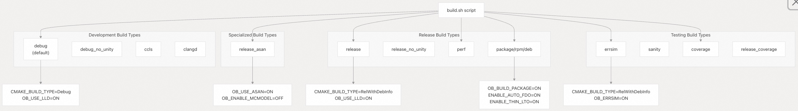
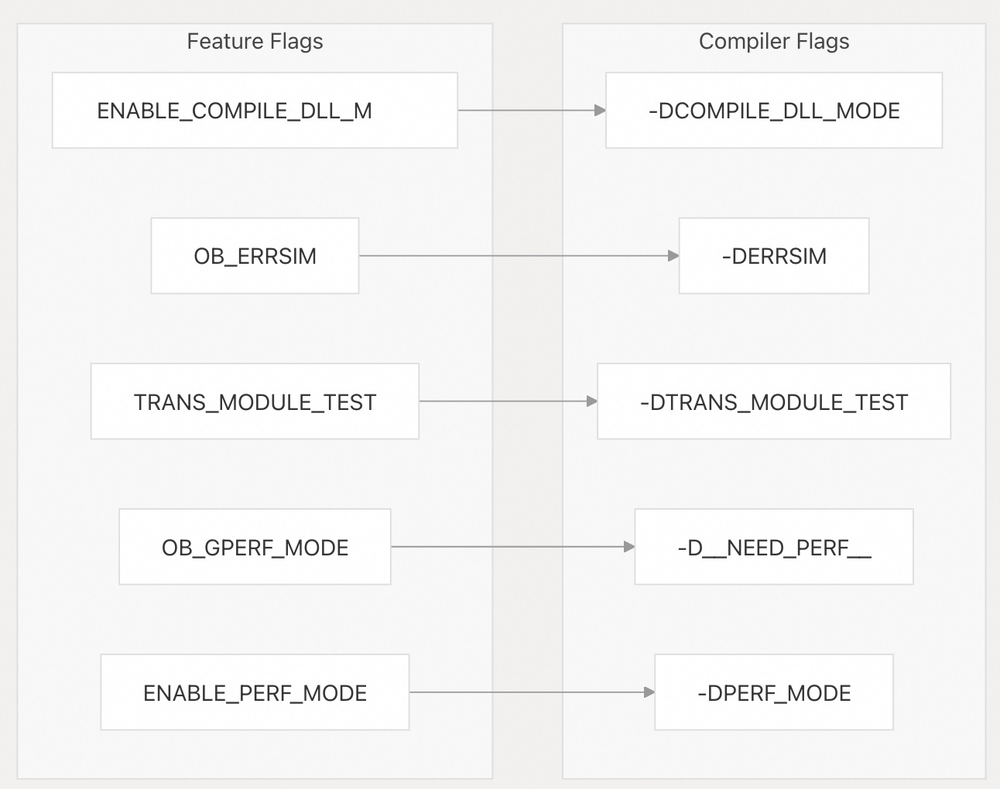
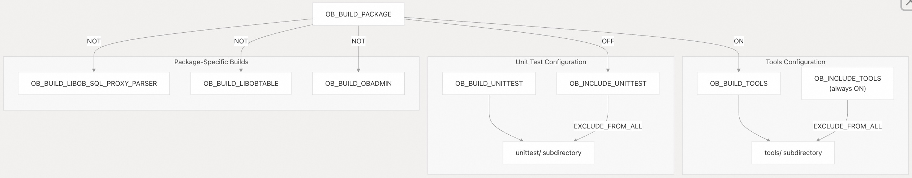
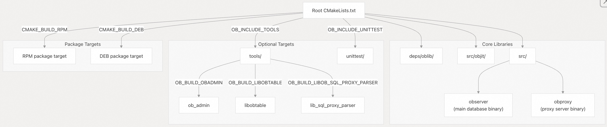
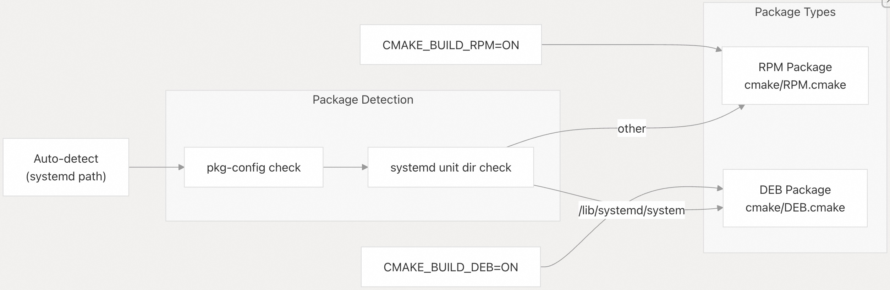
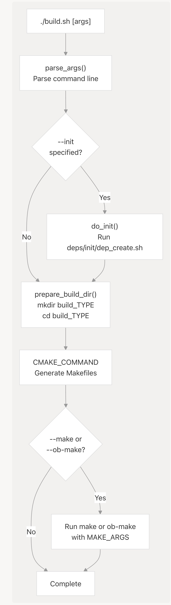

## SeekDB 源码学习: 4.2 Build Targets and Options (构建目标和选项)  
                                              
### 作者                                              
digoal                                              
                                              
### 日期                                              
2025-11-26                                              
                                              
### 标签                                              
SeekDB , OceanBase , AI Native 数据库 , 向量搜索 , 语义搜索 , 关键词搜索 , 全文检索 , 标量搜索 , 混合搜索 , AI 搜索 , AI in Database , 多模态 , 源码学习                                               
                                              
----                                              
                                              
## 背景               
本页面全面参考了 SeekDB 代码库中所有可用的 **build targets** (构建目标)、**CMake configuration options** (CMake 配置选项) 和 **build script commands** (构建脚本命令)。它为需要了解 **build configurations** (构建配置) 或 **customize their builds** (定制构建) 的开发人员提供了快速参考。  
  
## Purpose and Scope (目的与范围)  
  
本参考文档涵盖：  
  
  * 通过 `build.sh` 可用的 **Build types** (构建类型)  
  * 定义在根目录 `CMakeLists.txt` 中的 **CMake configuration options** (CMake 配置选项)  
  * 由 CMake 系统生成的 **Build targets** (构建目标)  
  * **Make commands** (Make 命令) 和 **parallel build options** (并行构建选项)  
  * 针对 **RPM** 和 **DEB** distributions (分发版) 的 **Package generation** (包生成) 选项  
  
## Build Types (构建类型)  
  
`build.sh` 脚本提供了预定义的 **build configurations** (构建配置)，它将多个 CMake 选项组合成对开发人员友好的 **build types** (构建类型)。  
  
### Build Type Overview (构建类型概览)  
  
  
  
来源:  
[`build.sh` 164-223](https://github.com/oceanbase/seekdb/blob/8c4654f1/build.sh#L164-L223)  
  
### Build Type Reference Table (构建类型参考表)  
  
| Build Type (构建类型) | CMake Configuration (CMake 配置) | Use Case (用例) |  
| :--- | :--- | :--- |  
| `debug` | `CMAKE_BUILD_TYPE=Debug`, `OB_USE_LLD=ON` | Standard development with debug symbols (带有调试符号的标准开发) |  
| `debug_no_unity` | `CMAKE_BUILD_TYPE=Debug`, `OB_USE_LLD=ON`, `OB_ENABLE_UNITY=OFF` | Debug build without unity builds (无 Unity 构建的调试版本，增量编译更快) |  
| `release` | `CMAKE_BUILD_TYPE=RelWithDebInfo`, `OB_USE_LLD=ON` | Optimized build with debug information (带有调试信息的优化版本) |  
| `release_no_unity` | `CMAKE_BUILD_TYPE=RelWithDebInfo`, `OB_USE_LLD=ON`, `OB_ENABLE_UNITY=OFF` | Release without unity builds (无 Unity 构建的发布版本) |  
| `release_asan` | `CMAKE_BUILD_TYPE=RelWithDebInfo`, `OB_USE_ASAN=ON`, `OB_ENABLE_MCMODEL=OFF` | Release build with **AddressSanitizer** (带有 AddressSanitizer 的发布版本) |  
| `release_coverage` | `CMAKE_BUILD_TYPE=RelWithDebInfo`, `WITH_COVERAGE=ON` | Release build with **code coverage** instrumentation (带有代码覆盖率 (Code Coverage) 植入的发布版本) |  
| `errsim` | `CMAKE_BUILD_TYPE=RelWithDebInfo`, `OB_ERRSIM=ON` | **Error simulation** mode for fault injection testing (用于故障注入测试的错误模拟模式) |  
| `ccls` | `CMAKE_BUILD_TYPE=Debug`, `OB_BUILD_CCLS=ON` | Generates `compile_commands.json` for **ccls language server** (为 ccls 语言服务器生成 `compile_commands.json`) |  
| `clangd` | `CMAKE_BUILD_TYPE=Debug`, `OB_ENABLE_UNITY=OFF` | Generates `compile_commands.json` for **clangd language server** (为 clangd 语言服务器生成 `compile_commands.json`) |  
| `perf` | `ENABLE_AUTO_FDO=ON`, `ENABLE_THIN_LTO=ON`, `ENABLE_HOTFUNC=ON`, `ENABLE_BOLT_AUTO=ON` | Performance-optimized build with **profile-guided optimizations** (带有配置文件引导优化 (PGO) 的性能优化版本) |  
| `coverage` | `CMAKE_BUILD_TYPE=Debug`, `WITH_COVERAGE=ON` | Debug build with code coverage instrumentation (带有代码覆盖率植入的调试版本) |  
| `sanity` | `CMAKE_BUILD_TYPE=RelWithDebInfo`, `ENABLE_SANITY=ON`, `OB_ENABLE_MCMODEL=ON` | Build with additional **sanity checks** (带有额外健全性检查的构建版本) |  
| `rpm` | `OB_BUILD_PACKAGE=ON`, `CMAKE_BUILD_RPM=ON` | Build **RPM** package (构建 RPM 包) |  
| `deb` | `OB_BUILD_PACKAGE=ON`, `CMAKE_BUILD_DEB=ON` | Build **DEB** package (构建 DEB 包) |  
| `package` | `OB_BUILD_PACKAGE=ON` | Auto-detect package format (RPM or DEB) (自动检测包格式，RPM 或 DEB) |  
  
来源:  
[`build.sh` 164-223](https://github.com/oceanbase/seekdb/blob/8c4654f1/build.sh#L164-L223)  
  
### Build Type Command Examples (构建类型命令示例)  
  
```bash  
# Debug build (default)  
./build.sh debug --make  
  
# Release build without unity  
./build.sh release_no_unity --make  
  
# Performance-optimized build  
./build.sh perf --make -j24  
  
# Build RPM package  
./build.sh rpm --init --make  
  
# Error simulation build  
./build.sh errsim --make  
```  
  
来源:  
[`build.sh` 35-55](https://github.com/oceanbase/seekdb/blob/8c4654f1/build.sh#L35-L55)  
  
## CMake Configuration Options (CMake 配置选项)  
  
根目录下的 `CMakeLists.txt` 定义了许多 **configuration options** (配置选项)，用于控制 **compilation flags** (编译标志)、**feature enablement** (功能启用) 和 **conditional builds** (条件构建)。  
  
### Compilation Mode Options (编译模式选项)  
  
  
  
来源:  
[`CMakeLists.txt` 13-50](https://github.com/oceanbase/seekdb/blob/8c4654f1/CMakeLists.txt#L13-L50)  
  
### CMake Option Reference Table (CMake 选项参考表)  
  
| CMake Option (CMake 选项) | Effect (效果) | Macro Defined (定义的宏) | Purpose (目的) |  
| :--- | :--- | :--- | :--- |  
| `ENABLE_COMPILE_DLL_MODE` | Adds `-DCOMPILE_DLL_MODE` | `COMPILE_DLL_MODE` | Enables **dynamic library compilation mode** (启用动态库编译模式) |  
| `OB_ERRSIM` | Adds `-DERRSIM` | `ERRSIM` | Enables **error simulation** for **fault injection testing** (启用错误模拟以进行故障注入测试) |  
| `TRANS_MODULE_TEST` | Adds `-DTRANS_MODULE_TEST` | `TRANS_MODULE_TEST` | Enables **transaction module testing** features (启用事务模块测试功能) |  
| `ENABLE_SERIALIZATION_CHECK` | Adds `-DENABLE_SERIALIZATION_CHECK` | `ENABLE_SERIALIZATION_CHECK` | Enables **runtime serialization validation** (启用运行时序列化验证) |  
| `OB_GPERF_MODE` | Adds `-D__NEED_PERF__` | `__NEED_PERF__` | Enables **gperf profiling** support (启用 gperf 性能分析支持) |  
| `ENABLE_PERF_MODE` | Adds `-DPERF_MODE` | `PERF_MODE` | Enables **performance mode** optimizations (启用性能模式优化) |  
| `ENABLE_OBJ_LEAK_CHECK` | Adds `-DENABLE_OBJ_LEAK_CHECK=1` | `ENABLE_OBJ_LEAK_CHECK` | Enables **object leak detection** (启用对象内存泄漏检测) |  
| `ENABLE_FATAL_ERROR_HANG` | Adds `-DFATAL_ERROR_HANG` and `-DENABLE_500_MEMORY_LIMIT` | `FATAL_ERROR_HANG`, `ENABLE_500_MEMORY_LIMIT` | Makes **fatal errors hang** instead of exit (for debugging) (使致命错误挂起而非退出，用于调试) |  
| `DETECT_RECURSION` | Adds `-DDETECT_RECURSION` | `DETECT_RECURSION` | Enables **recursion depth detection** (启用递归深度检测) |  
| `OB_USE_ASAN` | Adds `-DOB_USE_ASAN` | `OB_USE_ASAN` | Enables **AddressSanitizer** (启用 AddressSanitizer) |  
| `ENABLE_SANITY` | Adds `-DENABLE_SANITY` | `ENABLE_SANITY` | Enables additional **sanity checks** (启用额外的健全性检查) |  
| `OB_BUILD_PACKAGE` | Adds `-DOB_BUILD_PACKAGE` | `OB_BUILD_PACKAGE` | Configures build for **packaging** (配置构建以进行打包) |  
| `OB_ENABLE_MCMODEL` | Adds `-mcmodel=large` (x86\_64 only) | N/A | Enables **large memory model** for x86\_64 (为 x86\_64 启用大内存模型) |  
  
来源:  
[`CMakeLists.txt` 13-89](https://github.com/oceanbase/seekdb/blob/8c4654f1/CMakeLists.txt#L13-L89)  
  
### Conditional Build Options (条件构建选项)  
  
CMake 系统包含多个 **conditional options** (条件选项)，用于控制构建哪些 **components** (组件)：  
  
  
  
来源:  
[`CMakeLists.txt` 114-164](https://github.com/oceanbase/seekdb/blob/8c4654f1/CMakeLists.txt#L114-L164)  
  
### Conditional Build Option Reference (条件构建选项参考)  
  
| Option (选项) | Default (Package Mode) (默认值 (打包模式)) | Default (Development) (默认值 (开发模式)) | Controls (控制) |  
| :--- | :--- | :--- | :--- |  
| `OB_INCLUDE_TOOLS` | ON (开启) | ON (开启) | Whether to include `tools/` subdirectory (是否包含 `tools/` 子目录) |  
| `OB_BUILD_TOOLS` | ON (if `OB_BUILD_PACKAGE`) | OFF (关闭) | Whether to build tools by default (是否默认构建工具) |  
| `OB_INCLUDE_UNITTEST` | OFF (if `OB_BUILD_PACKAGE`) | ON (开启) | Whether to include `unittest/` subdirectory (是否包含 `unittest/` 子目录) |  
| `OB_BUILD_UNITTEST` | OFF (关闭) | OFF (关闭) | Whether to build unit tests by default (是否默认构建单元测试) |  
| `OB_INCLUDE_TEST` | OFF (if `OB_BUILD_PACKAGE`) | ON (开启) | Whether to include `test/` subdirectory (是否包含 `test/` 子目录) |  
| `OB_BUILD_TEST` | OFF (关闭) | OFF (关闭) | Whether to build tests by default (是否默认构建测试) |  
| `OB_BUILD_LIBOB_SQL_PROXY_PARSER` | ON (if `OB_BUILD_PACKAGE`) | OFF (关闭) | Whether to build **SQL proxy parser library** (是否构建 SQL 代理解析器库) |  
| `OB_BUILD_LIBOBTABLE` | ON (if `OB_BUILD_PACKAGE`) | OFF (关闭) | Whether to build **libobtable** library (是否构建 libobtable 库) |  
| `OB_BUILD_OBADMIN` | ON (if `OB_BUILD_PACKAGE`) | OFF (关闭) | Whether to build **ob\_admin** utility (是否构建 ob\_admin 工具) |  
  
来源:  
[`CMakeLists.txt` 117-151](https://github.com/oceanbase/seekdb/blob/8c4654f1/CMakeLists.txt#L117-L151)  
  
## Build Targets (构建目标)  
  
CMake 配置从各个 **subdirectories** (子目录) 生成多个 **build targets** (构建目标)。  
  
### Build Target Hierarchy (构建目标层次结构)  
  
  
  
来源:  
[`CMakeLists.txt` 110-190](https://github.com/oceanbase/seekdb/blob/8c4654f1/CMakeLists.txt#L110-L190)  
  
### Primary Build Targets (主要构建目标)  
  
| Target (目标) | Type (类型) | Description (描述) | Source Directory (源目录) |  
| :--- | :--- | :--- | :--- |  
| `observer` | Executable (可执行文件) | Main database server binary (主数据库服务器二进制文件) | [src/](https://github.com/oceanbase/seekdb/blob/8c4654f1/src/) |  
| `obproxy` | Executable (可执行文件) | Database proxy server (数据库代理服务器) | [src/](https://github.com/oceanbase/seekdb/blob/8c4654f1/src/) |  
| `oblib` | Library (库) | Core OceanBase library (核心 OceanBase 库) | [deps/oblib/](https://github.com/oceanbase/seekdb/blob/8c4654f1/deps/oblib/) |  
| `objit` | Library (库) | **JIT compilation** support (JIT 编译支持) | [src/objit/](https://github.com/oceanbase/seekdb/blob/8c4654f1/src/objit/) |  
| `ob_admin` | Executable (可执行文件) | Database administration utility (数据库管理工具) | [tools/](https://github.com/oceanbase/seekdb/blob/8c4654f1/tools/) |  
| `libobtable` | Library (库) | Table access library (表访问库) | [tools/](https://github.com/oceanbase/seekdb/blob/8c4654f1/tools/) |  
| `lib_sql_proxy_parser` | Library (库) | SQL proxy parser library (SQL 代理解析器库) | [tools/](https://github.com/oceanbase/seekdb/blob/8c4654f1/tools/) |  
  
来源:  
[`CMakeLists.txt` 110-164](https://github.com/oceanbase/seekdb/blob/8c4654f1/CMakeLists.txt#L110-L164)  
  
### Package Targets (包目标)  
  
构建系统可以生成 **distribution packages** (分发包)：  
  
  
  
来源:  
[`CMakeLists.txt` 166-190](https://github.com/oceanbase/seekdb/blob/8c4654f1/CMakeLists.txt#L166-L190)  
  
| Package Type (包类型) | CMake Option (CMake 选项) | Include File (包含文件) | Platform (平台) |  
| :--- | :--- | :--- | :--- |  
| RPM | `CMAKE_BUILD_RPM=ON` | [`cmake/RPM.cmake`](https://github.com/oceanbase/seekdb/blob/8c4654f1/cmake/RPM.cmake) | RedHat-based distributions (基于 RedHat 的分发版) |  
| DEB | `CMAKE_BUILD_DEB=ON` | [`cmake/DEB.cmake`](https://github.com/oceanbase/seekdb/blob/8c4654f1/cmake/DEB.cmake) | Debian-based distributions (基于 Debian 的分发版) |  
| Auto-detect (自动检测) | Neither option set (两个选项均未设置) | Auto-selected based on systemd path (根据 systemd 路径自动选择) | Linux (detected) (Linux (已检测到)) |  
  
来源:  
[`CMakeLists.txt` 166-190](https://github.com/oceanbase/seekdb/blob/8c4654f1/CMakeLists.txt#L166-L190)  
  
## Build Script Commands (构建脚本命令)  
  
`build.sh` 脚本提供了构建项目的 **primary interface** (主要接口)。  
  
### Build Script Syntax (构建脚本语法)  
  
```bash  
./build.sh [BuildType] [--init] [--make [MakeOptions]] [CMakeOptions]  
./build.sh [BuildType] [--init] [--ob-make [MakeOptions]] [CMakeOptions]  
```  
  
### Build Script Options (构建脚本选项)  
  
| Option (选项) | Description (描述) | Default (默认值) |  
| :--- | :--- | :--- |  
| `BuildType` | One of: debug, release, errsim, rpm, deb, etc. (其中之一：debug, release, errsim, rpm, deb 等) | `debug` (调试) |  
| `--init` | Initialize dependencies before building (在构建前初始化依赖项) | Not set (未设置) |  
| `--make [MakeOptions]` | Run **make** with specified options after CMake (在 CMake 之后运行带指定选项的 make) | Not set (未设置) |  
| `--ob-make [MakeOptions]` | Run **ob-make** instead of make (运行 ob-make 而不是 make) | Not set (未设置) |  
| `-j N` | Parallel build with N jobs (make option) (N 个作业的并行构建 (make 选项)) | `-j CPU_CORES` ( `-j CPU 核心数`) |  
  
来源:  
[`build.sh` 33-55](https://github.com/oceanbase/seekdb/blob/8c4654f1/build.sh#L33-L55)  
[`build.sh` 58-87](https://github.com/oceanbase/seekdb/blob/8c4654f1/build.sh#L58-L87)  
  
### Build Script Workflow (构建脚本工作流程)  
  
  
  
来源:  
[`build.sh` 58-96](https://github.com/oceanbase/seekdb/blob/8c4654f1/build.sh#L58-L96)  
[`build.sh` 225-247](https://github.com/oceanbase/seekdb/blob/8c4654f1/build.sh#L225-L247)  
  
### Dependency Initialization (依赖项初始化)  
  
`--init` 选项会触发 **dependency initialization** (依赖项初始化)：  
  
```bash  
# Initialize dependencies  
./build.sh init  
  
# Initialize and build in one command  
./build.sh debug --init --make  
```  
  
这将运行位于 [`deps/init/dep_create.sh`](https://github.com/oceanbase/seekdb/blob/8c4654f1/deps/init/dep_create.sh) 的 `dep_create.sh` 脚本，该脚本：  
  
  * Downloads and builds **third-party dependencies** (下载并构建第三方依赖项)  
  * Installs them to `deps/3rd/usr/local/oceanbase/` (将其安装到 `deps/3rd/usr/local/oceanbase/`)  
  * Sets up the **devtools** directory with CMake and other build tools (使用 CMake 和其他构建工具设置 devtools 目录)  
  
来源:  
[`build.sh` 115-130](https://github.com/oceanbase/seekdb/blob/8c4654f1/build.sh#L115-L130)  
  
### Build Directory Structure (构建目录结构)  
  
每种构建类型都会创建一个单独的 **build directory** (构建目录)：  
  
| Build Type (构建类型) | Build Directory (构建目录) | Purpose (目的) |  
| :--- | :--- | :--- |  
| `debug` | `build_debug/` | Debug builds (调试版本) |  
| `release` | `build_release/` | Release builds (发布版本) |  
| `errsim` | `build_errsim/` | Error simulation builds (错误模拟版本) |  
| `ccls` | `build_ccls/` | Builds for **ccls language server** (用于 ccls 语言服务器的构建) |  
| `clangd` | `build_clangd/` | Builds for **clangd language server** (用于 clangd 语言服务器的构建) |  
| `rpm` | `build_rpm/` | **RPM** package builds (RPM 包构建) |  
| `deb` | `build_deb/` | **DEB** package builds (DEB 包构建) |  
  
`clean` 命令会删除所有构建目录：  
  
```bash  
./build.sh clean  
```  
  
来源:  
[`build.sh` 108-112](https://github.com/oceanbase/seekdb/blob/8c4654f1/build.sh#L108-L112)  
[`build.sh` 150-154](https://github.com/oceanbase/seekdb/blob/8c4654f1/build.sh#L150-L154)  
  
## Make Commands and Parallel Builds (Make 命令和并行构建)  
  
### Default Make Configuration (默认 Make 配置)  
  
默认情况下，构建脚本使用所有可用 CPU 核心进行 **parallel make** (并行 make)：  
  
```  
# Default: -j CPU_CORES  
MAKE_ARGS=(-j $CPU_CORES)  
```  
  
来源:  
[`build.sh` 10-15](https://github.com/oceanbase/seekdb/blob/8c4654f1/build.sh#L10-L15)  
  
### Custom Make Options (自定义 Make 选项)  
  
您可以覆盖默认的 `make` arguments (参数)：  
  
```bash  
# Build with 24 parallel jobs  
./build.sh debug --make -j24  
  
# Build with custom make targets  
./build.sh release --make observer obproxy  
  
# Verbose make output  
./build.sh debug --make VERBOSE=1  
```  
  
来源:  
[`build.sh` 64-80](https://github.com/oceanbase/seekdb/blob/8c4654f1/build.sh#L64-L80)  
  
### ob-make vs make (ob-make 与 make 的区别)  
  
脚本支持两种 make 模式：  
  
| Mode (模式) | Command (命令) | Behavior (行为) |  
| :--- | :--- | :--- |  
| `--make` | Standard **make** (标准 make) | Uses default `-j CPU_CORES` arguments (使用默认的 `-j CPU_CORES` 参数) |  
| `--ob-make` | OceanBase **make** (OceanBase make) | Clears default arguments, allows custom configuration (清除默认参数，允许自定义配置) |  
  
```bash  
# Standard make with default parallelism  
./build.sh debug --make  
  
# ob-make with custom options  
./build.sh debug --ob-make [custom_options]  
```  
  
来源:  
[`build.sh` 64-80](https://github.com/oceanbase/seekdb/blob/8c4654f1/build.sh#L64-L80)  
  
## Advanced Build Options (高级构建选项)  
  
### LLD Linker (LLD 链接器)  
  
**LLD linker** (LLD 链接器) 在大多数系统上默认启用，但在内核版本 6 上自动禁用：  
  
```  
# Controlled by LLD_OPTION variable  
if [[ "$KERNEL_RELEASE" == "release 6" ]]; then  
    LLD_OPTION="OFF"  
fi  
```  
  
所有构建类型默认使用 `-DOB_USE_LLD=$LLD_OPTION`。  
  
来源:  
[`build.sh` 18](https://github.com/oceanbase/seekdb/blob/8c4654f1/build.sh#L18-L18)  
[`build.sh` 83-86](https://github.com/oceanbase/seekdb/blob/8c4654f1/build.sh#L83-L86)  
  
### ASAN Configuration (ASAN 配置)  
  
**AddressSanitizer** (**ASAN**) 默认启用，但可以控制：  
  
```  
ASAN_OPTION=ON  # Default  
```  
  
在 `release_asan` 构建类型中使用，并设置 `OB_ENABLE_MCMODEL=OFF`。  
  
来源:  
[`build.sh` 19](https://github.com/oceanbase/seekdb/blob/8c4654f1/build.sh#L19-L19)  
[`build.sh` 174-176](https://github.com/oceanbase/seekdb/blob/8c4654f1/build.sh#L174-L176)  
  
### Static Linking Options (静态链接选项)  
  
对于包构建，**static linking** (静态链接) **LGPL** 依赖项受到控制：  
  
```  
STATIC_LINK_LGPL_DEPS_OPTION=ON  # Default for packages  
```  
  
来源:  
[`build.sh` 20](https://github.com/oceanbase/seekdb/blob/8c4654f1/build.sh#L20-L20)  
[`build.sh` 158-160](https://github.com/oceanbase/seekdb/blob/8c4654f1/build.sh#L158-L160)  
  
### BOLT Optimization (BOLT 优化)  
  
**BOLT** (Binary Optimization and Layout Tool) 为包构建启用：  
  
```  
ENABLE_BOLT_OPTION=ON  # Default  
  
# Disabled when building CDC only  
if [[ "$i" == "-DBUILD_CDC_ONLY=ON" ]]; then  
    ENABLE_BOLT_OPTION=OFF  
fi  
```  
  
来源:  
[`build.sh` 21](https://github.com/oceanbase/seekdb/blob/8c4654f1/build.sh#L21-L21)  
[`build.sh` 71-74](https://github.com/oceanbase/seekdb/blob/8c4654f1/build.sh#L71-L74)  
  
## Package Build Configuration (包构建配置)  
  
包构建使用一套 **comprehensive set of optimizations** (全面的优化)：  
  
```  
# Package build options  
-DOB_BUILD_PACKAGE=ON  
-DCMAKE_BUILD_TYPE=RelWithDebInfo  
-DOB_USE_LLD=$LLD_OPTION  
-DENABLE_FATAL_ERROR_HANG=OFF  
-DENABLE_AUTO_FDO=ON           # Feedback-directed optimization  
-ENABLE_THIN_LTO=ON            # Thin link-time optimization  
-ENABLE_HOTFUNC=ON             # Hot function optimization  
-ENABLE_BOLT=$ENABLE_BOLT_OPTION  
-DOB_STATIC_LINK_LGPL_DEPS=$STATIC_LINK_LGPL_DEPS_OPTION  
```  
  
来源:  
[`build.sh` 156-161](https://github.com/oceanbase/seekdb/blob/8c4654f1/build.sh#L156-L161)  
  
### Performance Build Configuration (性能构建配置)  
  
`perf` 构建类型包含 **aggressive optimizations** (激进的优化)：  
  
```  
-DCMAKE_BUILD_TYPE=RelWithDebInfo  
-DENABLE_AUTO_FDO=ON           # Automatic feedback-directed optimization  
-DENABLE_THIN_LTO=ON           # Thin link-time optimization  
-DOB_USE_LLD=$LLD_OPTION  
-DENABLE_HOTFUNC=ON            # Hot function profiling  
-DENABLE_BOLT_AUTO=ON          # Automatic BOLT optimization  
-DENABLE_FATAL_ERROR_HANG=OFF  
```  
  
来源:  
[`build.sh` 196-198](https://github.com/oceanbase/seekdb/blob/8c4654f1/build.sh#L196-L198)  
  
## Common Build Patterns (常见构建模式)  
  
```bash  
# Initial setup  
./build.sh init  
  
# Standard debug build  
./build.sh debug --make  
  
# Incremental build (no unity)  
./build.sh debug_no_unity --make -j24  
  
# Language server setup  
./build.sh ccls --make  # Creates compile_commands.json symlink  
```  
  
### Development Workflow (开发工作流程)  
  
```bash  
# Initial setup  
./build.sh init  
  
# Standard debug build  
./build.sh debug --make  
  
# Incremental build (no unity)  
./build.sh debug_no_unity --make -j24  
  
# Language server setup  
./build.sh ccls --make  # Creates compile_commands.json symlink  
```  
  
### Release Testing (发布测试)  
  
```bash  
# Release build for testing  
./build.sh release --make  
  
# Release with ASAN for memory testing  
./build.sh release_asan --make  
  
# Release with coverage  
./build.sh release_coverage --make  
```  
  
### Package Generation (包生成)  
  
```bash  
# Auto-detect package type  
./build.sh package --init --make  
  
# Explicit RPM build  
./build.sh rpm --init --make  
  
# Explicit DEB build  
./build.sh deb --init --make  
```  
  
### Coverage Analysis (覆盖率分析)  
  
```bash  
# Debug build with coverage  
./build.sh coverage --make  
  
# Release build with coverage  
./build.sh release_coverage --make  
```  
  
来源:  
[`build.sh` 164-223](https://github.com/oceanbase/seekdb/blob/8c4654f1/build.sh#L164-L223)  
  
  
-----  
  
# 附录1: 开发者工作流优化与 IDE 效率 (Developer Workflow)  
  
文档列出了多种调试和开发辅助构建类型（如 `debug`、`debug_no_unity`、`ccls`、`clangd`），其中 Unity Build（统一构建）是大型 C++ 项目中优化编译时间的关键点。  
  
* **问题：** 针对 SeekDB 这种**大型代码库**的日常开发人员，在**IDE 代码导航响应速度**（依赖 `ccls`/`clangd` 生成的 `compile_commands.json`）、**增量编译速度**（受 `OB_ENABLE_UNITY=OFF` 影响）和**最终调试信息完备性**之间，应该如何权衡选择最合适的构建类型？能否提供一个推荐的**开发工作流程**来确保高效率？  
  
## 回答  
  
针对 SeekDB 大型代码库的开发，需要在 IDE 代码导航、增量编译速度和调试信息之间进行权衡。基于代码库的构建配置，我推荐以下策略：  
  
## 推荐构建类型选择  
  
| 场景 | 推荐构建类型 | 原因 |  
|------|-------------|------|  
| **日常开发 + IDE 导航** | `ccls` | 支持 unity build，IDE 响应最快，包含调试信息   |  
| **频繁增量编译** | `debug_no_unity` | 禁用 unity 提升编译速度，保留完整调试信息   |  
| **深度调试** | `debug` | 完整调试信息，unity build 不影响调试质量   |  
  
## 推荐开发工作流程  
  
```mermaid  
flowchart TD  
    Start["开始开发"] -> Init["首次初始化<br/>./build.sh ccls --init"]  
    Init -> Daily["日常开发<br/>使用 ccls 构建"]  
      
    Daily --> NeedCompile{"需要频繁<br/>增量编译?"}  
    NeedCompile -->|是| SwitchNoUnity["切换到 debug_no_unity<br/>./build.sh debug_no_unity --make"]  
    NeedCompile -->|否| KeepCcls["继续使用 ccls"]  
      
    SwitchNoUnity --> NeedDebug{"需要深度调试?"}  
    KeepCcls --> NeedDebug  
      
    NeedDebug -->|是| SwitchDebug["切换到 debug<br/>./build.sh debug --make"]  
    NeedDebug -->|否| Continue["继续当前模式"]  
      
    SwitchDebug --> Continue  
    Continue --> Daily  
      
    style Init fill:#f9f9f9  
    style Daily fill:#f9f9f9  
```  
  
### 具体实施步骤  
  
1. **环境初始化**  
   ```bash  
   ./build.sh ccls --init  
   ```  
   生成 `compile_commands.json` 并创建符号链接    
  
2. **日常开发模式**  
   - 使用 `ccls` 构建类型，获得最佳 IDE 体验  
   - ccls 配置了更大的 unity batch size (200) 和懒加载模式    
  
3. **需要快速增量编译时**  
   ```bash  
   ./build.sh debug_no_unity --make  
   ```  
   禁用 unity build (`-DOB_ENABLE_UNITY=OFF`) 提升编译速度    
  
4. **需要深度调试时**  
   ```bash  
   ./build.sh debug --make  
   ```  
   使用标准 debug 模式，确保调试信息完备性    
  
## 技术权衡说明  
  
- **Unity Build 影响**：默认开启 (`OB_ENABLE_UNITY=ON`)，可显著减少编译时间但可能影响增量编译速度    
- **ccls vs clangd**：ccls 支持 unity build 而 clangd 不支持，这是选择 ccls 的关键原因    
- **构建目录隔离**：不同构建类型使用独立目录 (`build_ccls`, `build_debug`, `build_debug_no_unity`)，可并行存在    
  
## Notes  
  
- 首次构建建议使用 `--init` 参数初始化依赖  
- 不同构建类型生成的二进制文件位于对应 `build_*` 目录下的 `bin/observer`  
- ccls 索引构建可能消耗较多内存，建议根据系统配置调整 `ccls.index.threads` 参数  
- 如需清理所有构建目录，可使用 `./build.sh clean`（会保留 `build_ccls` 目录）    
  
  
  
  
-----  
  
# 附录2: 生产环境的性能与安全权衡 (Architect/User Focus)  
  
文档提供了极致性能的 `perf` 构建和运行时安全检查的 `release_asan`/`sanity` 构建，这对于系统架构师决定生产环境的部署策略至关重要。  
  
* **问题：** 针对生产环境（Production），架构师应如何在**极致性能**的 `perf` 构建（启用了 FDO、LTO、BOLT 等激进优化）与**运行时安全**的 `release_asan` 或 `sanity` 构建之间做出选择？这些构建类型在**运行时性能惩罚**、**内存安全覆盖率**以及**故障排查的有效性**方面的具体差异和推荐应用场景分别是什么？  
  
## 回答  
  
基于代码库分析，我为您梳理了生产环境构建策略的选择指南：  
  
## 构建类型对比分析  
  
### 性能优化构建 (`perf`)  
- **优化特性**：启用 FDO (Feedback-Directed Optimization)、Thin LTO (Link-Time Optimization)、BOLT 等激进优化    
- **性能影响**：通过 `-fprofile-sample-use`、`-flto=thin`、符号重排序等优化提升运行时性能    
- **适用场景**：对性能要求极高的生产环境，如高频交易、实时分析等  
  
### 安全检查构建 (`release_asan`/`sanity`)  
- **内存安全**：启用 AddressSanitizer 进行内存错误检测    
- **运行时开销**：ASAN 会带来 20-30% 的性能惩罚和额外内存开销    
- **故障排查**：提供详细的内存错误报告和堆栈跟踪    
  
## 推荐部署策略  
  
### 生产环境选择矩阵  
  
| 场景类型 | 推荐构建 | 性能影响 | 安全覆盖 |  
|---------|---------|---------|---------|  
| 核心生产 | `perf` | 最优性能 | 基础保护 |  
| 预生产环境 | `release_asan` | 中等性能损失 | 全面内存安全 |  
| 故障排查 | `sanity` | 较高性能损失 | 增强诊断能力 |  
  
### 混合部署建议  
1. **主集群**使用 `perf` 构建确保最佳性能  
2. **测试/预发集群**使用 `release_asan` 进行安全验证  
3. **故障排查时**临时切换到 `sanity` 构建获取详细诊断信息    
  
## 技术实现细节  
  
### ASAN 配置优化  
系统支持通过 `enable_asan_for_memory_context` 参数动态控制 ASAN 分配器的使用  ，可以在运行时平衡性能和安全需求。  
  
### 性能模式控制  
`ENABLE_PERF_MODE` 宏控制系统特殊代码路径，适用于离线性能基准测试  。  
  
## Notes  
- 代码库中未找到明确的 `perf` 构建目标定义，但相关优化选项已在 `cmake/Env.cmake` 中配置  
- ASAN 构建会禁用部分信号处理优化以避免冲突    
- 建议在实际部署前进行性能基准测试以量化具体影响  
  
  
  
  
-----  
  
# 附录3: 依赖项管理与供应链安全合规 (Maintainer/User Focus)  
  
文档提到了 `build.sh --init` 步骤会通过 `dep_create.sh` 下载并构建第三方依赖，并提及了静态链接的控制，这涉及到运维和合规的痛点。  
  
* **问题：** `build.sh --init` 依赖的脚本负责下载和构建第三方依赖。出于**供应链安全**（Supply Chain Security）和**GPL/LGPL 许可证合规**（Licensing Compliance）的考虑，SeekDB 对其第三方依赖项是如何进行**版本锁定**、**安全漏洞审计**和**许可证审查**的？尤其是在执行打包构建（`rpm` / `deb`）时，如何确保符合外部依赖的**动态链接**要求（特别是针对 LGPL 依赖的控制）？  
  
## 回答  
  
SeekDB通过依赖清单文件和构建配置实现了第三方依赖的版本锁定和链接控制，但在安全审计和许可证审查方面的具体实现需要更多信息。  
  
## 版本锁定机制  
  
SeekDB使用操作系统和架构特定的依赖清单文件来实现版本锁定。`dep_create.sh`脚本根据当前系统环境选择对应的`.deps`文件，其中包含精确到构建时间戳的依赖包版本  。  
  
例如，在`oceanbase.el8.x86_64.deps`中，每个依赖包都有明确的版本号：  
```  
devdeps-gtest-1.8.0-132022101316.el8.x86_64.rpm  
devdeps-openssl-static-1.1.1u-22023100710.el8.x86_64.rpm  
```    
  
脚本通过MD5校验确保依赖文件完整性，防止意外变更  。  
  
## 静态链接控制  
  
在CMake配置中，`OB_STATIC_LINK_LGPL_DEPS`默认设置为`ON`，表明LGPL依赖采用静态链接方式  。这种配置有助于避免LGPL动态链接的合规要求。  
  
## 依赖来源和缓存  
  
依赖包从OceanBase官方镜像源下载：  
- 开发套件：`mirrors.oceanbase.com/oceanbase/development-kit/`  
- 社区版本：`mirrors.oceanbase.com/oceanbase/community/stable/`    
  
脚本支持共享缓存机制，通过`DEP_CACHE_DIR`环境变量控制  。  
  
## 限制和未明确事项  
  
当前代码中未明确体现：  
- **安全漏洞审计**：没有发现自动化安全扫描或漏洞检查的代码  
- **许可证审查**：缺少许可证合规性检查的自动化流程  
- **动态链接控制**：除了静态链接开关外，缺少针对LGPL动态链接的详细控制机制  
  
## Notes  
  
依赖管理主要通过`dep_create.sh`脚本实现，该脚本负责根据系统环境下载、解压和管理第三方依赖包。版本锁定通过精确的包名和MD5校验实现，但安全审计和许可证合规方面的具体实现需要查看其他构建脚本或文档。  
    
#### [PolarDB 学习图谱](https://www.aliyun.com/database/openpolardb/activity "8642f60e04ed0c814bf9cb9677976bd4")
  
  
#### [PostgreSQL 解决方案集合](../201706/20170601_02.md "40cff096e9ed7122c512b35d8561d9c8")
  
  
#### [德哥 / digoal's Github - 公益是一辈子的事.](https://github.com/digoal/blog/blob/master/README.md "22709685feb7cab07d30f30387f0a9ae")
  
  
#### [About 德哥](https://github.com/digoal/blog/blob/master/me/readme.md "a37735981e7704886ffd590565582dd0")
  
  

  
