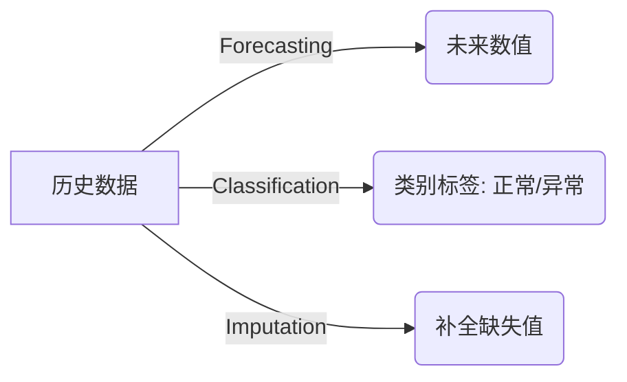
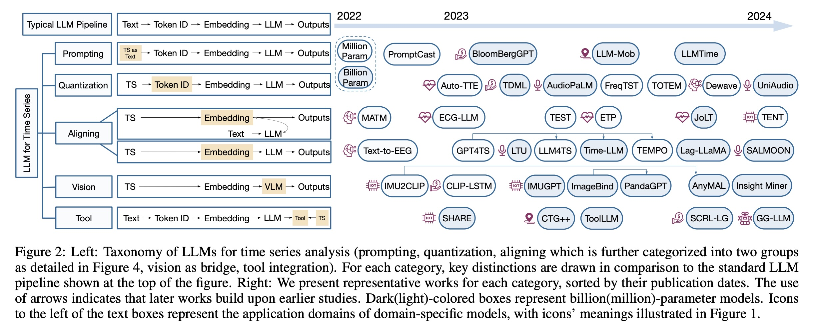
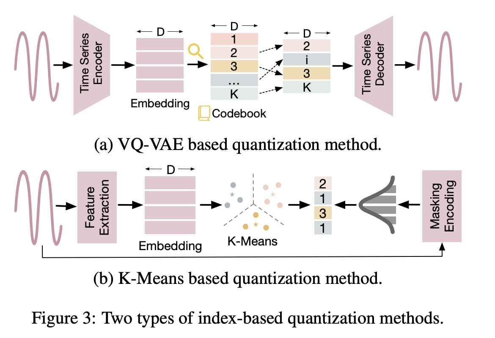
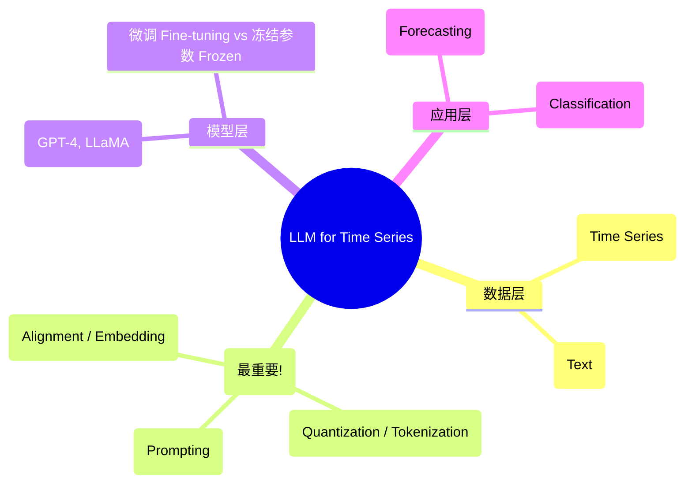
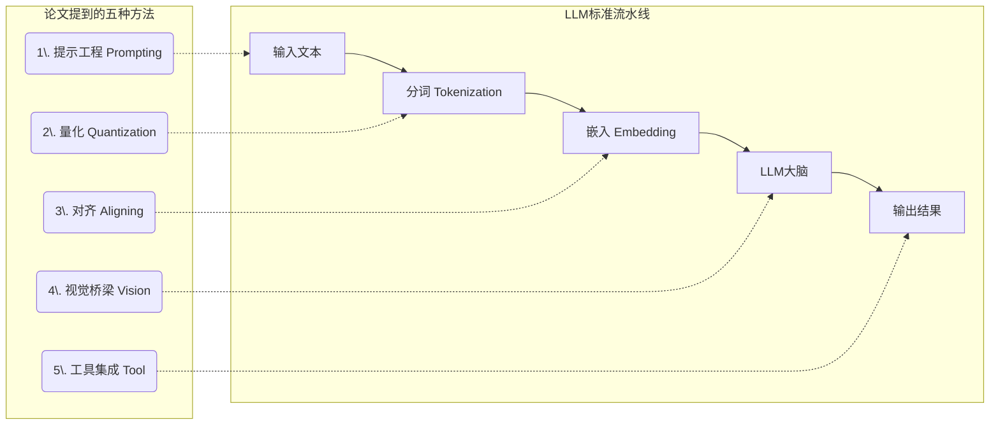
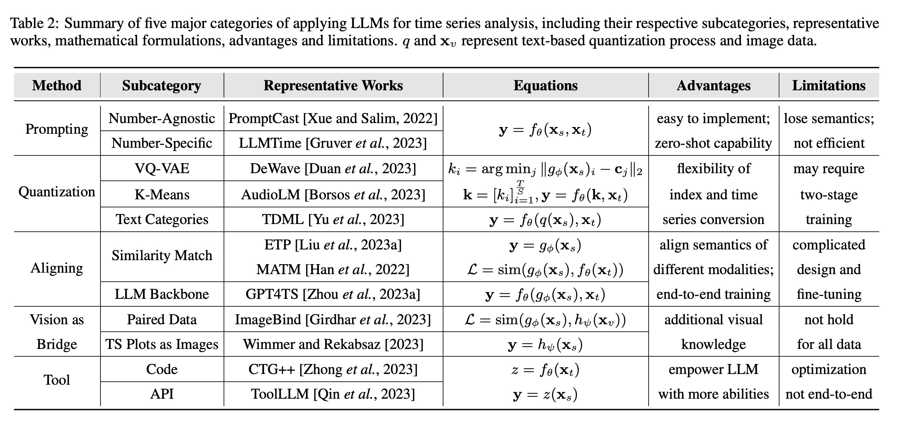
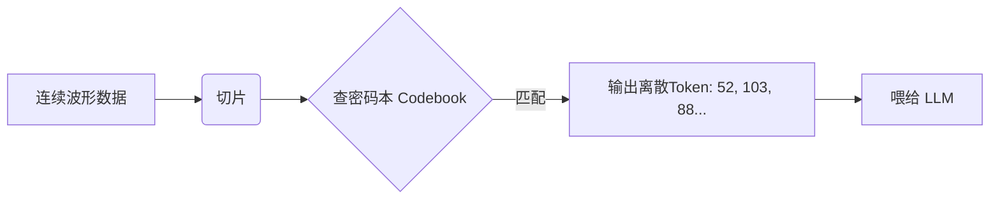

## AI论文解读 | Large Language Models for Time Series: A Survey
        
### 作者        
digoal        
        
### 日期        
2025-11-27        
        
### 标签        
PostgreSQL , PolarDB , DuckDB , AI , 论文解读        
        
----        
        
## 背景  
      
https://arxiv.org/pdf/2402.01801        
  
提示:          
```          
读懂《Large Language Models for Time Series: A Survey》这篇论文需要提前掌握哪些基础知识, 请使用中文通熟易懂的讲解这些基础知识, 可以引用论文中的图、表或使用Markdown支持的图形(text,mermaid等)增加解释性. 
  
使用中文通熟易懂的解读《Large Language Models for Time Series: A Survey》这篇论文, 其中的关键内容请着重讲解, 可以引用论文中的图、表或使用Markdown支持的图形(text,mermaid等)增加解释性. 
  
提取《Large Language Models for Time Series: A Survey》这篇论文中的重要术语, 使用中文对这些术语进行通熟易懂的讲解, 可以引用论文中的图、表或使用Markdown支持的图形(text,mermaid等)增加解释性. 
```     
  
## 1 前置知识 
  
阅读这篇综述论文《Large Language Models for Time Series: A Survey》，你需要理解“**时间序列分析**”和“ **大语言模型（LLM）** ”这两个领域的交叉点。

这篇论文的核心痛点在于： **LLM 是为了处理离散的文本（单词）而生的，但时间序列是连续的数值。** 因此，理解它们如何“强行”结合是读懂论文的关键。

以下是为你整理的通俗易懂的基础知识清单，配合论文中的概念进行图解：

-----

### 1\. 时间序列分析基础 (Time Series Analysis)

你需要知道这种数据长什么样，以及我们通常拿它做什么。

  * **什么是时间序列？**
    就是按时间顺序记录的一串数据。比如：股票价格、每天的气温、心电图（ECG）读数。
      * **连续性 (Continuity):** 数据通常是连贯的数值（如 23.5, 23.6, 24.1），而不是离散的类别（如“猫”、“狗”）。
      * **下游任务 (Downstream Tasks):** 论文中反复提到的任务类型：
          * **预测 (Forecasting):** 根据过去猜未来（比如：明天气温多少？）。
          * **分类 (Classification):** 这段数据代表什么？（比如：这段心电图是“正常”还是“心律不齐”？）。
          * **异常检测 (Anomaly Detection):** 哪里不对劲？（比如：交通流量突然归零了）。




-----

### 2\. 大语言模型的工作流 (LLM Pipeline)

论文提出了一个非常核心的分类法，是基于 LLM 的标准处理流程来的。你需要理解这 5 个步骤：

**标准流程：** `输入文本 -> Tokenization -> Embedding -> LLM处理 -> 输出`

  * **Tokenization (分词/标记化):**
    LLM 不认识整句话，它把句子切成一个个小块（Token）。
      * *难点：* 数字 `0.123` 怎么切？是切成 `0`, `.`, `1`, `2`, `3` 还是作为一个整体？这直接影响计算。
  * **Embedding (嵌入):**
    把 Token 变成计算机能懂的向量（一串数字坐标）。
      * *关键：* 意思相近的词，向量距离很近。
  * **Prompting (提示工程):**
    用自然语言告诉模型该做什么。比如：“请根据前面的数字预测下一个数字”。

**论文利用这个流程图（Figure 2）来给方法分类：**    

> 论文图示解释：
>  
>   * 如果你把时间序列直接当文本读，这是 **Prompting**（输入阶段）。  
>   * 如果你把数值压缩成特殊的“词”，这是 **Quantization**（分词阶段）。  
>   * 如果你把时间序列的特征向量强行对齐到单词向量，这是 **Aligning**（嵌入阶段）。  

-----

### 3\. 核心难点：如何把“数值”变成“语言”？

这是阅读论文时最晦涩的部分，你需要掌握以下两个转换概念：

#### A. 量化 (Quantization / Discretization)

**概念：** 把连续的曲线，变成离散的“代号”。就像把无穷多的颜色归类为“红、黄、蓝”几种。
**论文中的两种主流方法 (引用 Figure 3):**    

1.  **VQ-VAE (Vector Quantized-Variational AutoEncoder):**

      * 想象你有一本字典（Codebook）。
      * 模型把时间序列切成小段，去字典里找最像的那个“词”（Code），然后用这个词的 ID 来代替这段数据。
      * 这样，一串连续的波形就变成了一串 ID（类似文本 Token），LLM 就能读了。

    *(论文图3a: 通过 Codebook 把波形变成 1, 2, 3 这样的离散 ID)* 

2.  **K-Means 聚类:**

      * 把所有常见的数据形态聚成 K 堆。每一堆给一个编号。
      * 无论输入什么数据，看它离哪一堆最近，就给它那个编号。

#### B. 对齐 (Alignment)

**概念：** 不改变数据的形式，而是强迫模型认为“这段波形”的意思等于“这句话”。
**核心技术：对比学习 (Contrastive Learning)。**

  * 让模型看成对的数据（比如：一段心跳加速的 ECG 数据 + 文本描述“病人正在奔跑”）。
  * 通过数学公式拉近这两者在向量空间（Embedding Space）的距离。

-----

### 4\. 多模态基础 (Multimodality)

论文提到了利用“视觉”作为桥梁（Vision as Bridge）。你需要了解：

  * **CLIP 模型:** 这是一个著名的模型，它能把图片和文字映射到同一个空间。
  * **核心思想:** 如果你能把时间序列画成图（Line Plot），那你就可以直接用处理图片的 AI（如 CLIP）来提取特征，再丢给 LLM。

-----

### 5\. 总结：读这篇论文你需要的一张思维导图

在开始阅读前，请在脑海中建立这个框架：



**阅读建议：**
先看论文的 **Figure 2** ，它把整篇论文的逻辑（Prompting, Quantization, Aligning, Vision, Tool）画在了一个时间轴和流程图上。如果你理解了上述基础知识，这张图就能帮你瞬间理清论文结构。    
  
## 2 解读论文 
  
这篇论文《Large Language Models for Time Series: A Survey》系统地总结了如何将**大语言模型（LLM）的强大能力应用到时间序列分析**（如股票预测、天气预报、心电图分析）中 。

这篇论文的核心痛点在于解决 **“跨界”难题** ：LLM 是为了处理离散的**文本**而生的，而时间序列是连续的**数值**。如何跨越这道鸿沟（Modality Gap）是全文的关键 。

以下是为您提炼的通俗解读：

-----

### 一、 核心框架：五种“跨界”流派

论文提出了一个非常精彩的分类法，基于 LLM 的标准处理流水线（Pipeline），将现有的方法分成了 5 大类。

想象我们要教一个只懂“文科”（处理文本）的学霸去考“理科”（处理数值），我们可以通过以下五个阶段来“作弊”：



#### 1\. 提示工程 (Prompting) —— 直接硬聊

**策略：** 把数字直接当成文字，发给 LLM。

  * **做法：** 就像我们用 ChatGPT 一样，直接把历史数据写进提示词里。例如：“昨天的温度是 20 度，前天是 21 度，请问今天是几度？” 。
  * **技巧：** 简单的空格或逗号可能切分不准，有的方法（如 LLMTime）专门给数字加空格，保证模型能看懂每一位数字 。
  * **优缺点：** 简单粗暴，不需要训练（Zero-shot），但如果不做特殊处理，LLM 对数字的算术感觉可能并不好 。

#### 2\. 量化 (Quantization) —— 翻译成“外语”

**策略：** 把连续的曲线，变成离散的“单词”。

  * **核心逻辑：** 时间序列是连续波动的，LLM 读不懂。我们可以造一本“字典”（Codebook）。
  * **方法（VQ-VAE）：** 把一段波形匹配到字典里最像的那个“代号”（Token）。比如，心电图“扑通”一下的波形，在字典里代号是 `Token_52`。这样一整段心跳就变成了一串代号 `52, 31, 88...`，这下 LLM 就能读了，就像读文本一样 。
  * **代表作：** DeWave（脑电波转文本）、AudioLM（音频生成） 。

#### 3\. 对齐 (Aligning) —— 脑机接口

**策略：** 给 LLM 装一个能看懂时间序列的“义眼”。

  * **做法：** 保持 LLM 的大脑（参数）不变或微调，但在前面加一个专门的时间序列编码器（Encoder）。
  * **关键技术（对比学习）：** 训练这个编码器，让它把时间序列转换成向量（Embedding），并且这个向量的意思要和对应的文本向量“对齐”。例如，一段“心律不齐”的心电图数据的向量，应该和文本“心律不齐”的向量靠得很近 。
  * **代表作：** Time-LLM, GPT4TS 。这是目前研究最热的领域之一。

#### 4\. 视觉作为桥梁 (Vision as Bridge) —— 读图说话

**策略：** 把数据画成图，让多模态模型“看”图。

  * **逻辑：** 既然现在的 GPT-4V 或其他多模态模型能看懂图片，那为什么要把数据变成文本？直接把股票走势画成 K 线图（Line Plot），当成图片喂给模型 。
  * **案例：** 甚至可以把这一招用在物理模拟或动作捕捉上，把传感器数据转化成图像特征 。

#### 5\. 工具集成 (Tool) —— 呼叫外援

**策略：** LLM 不亲自算，它只负责指挥。

  * **做法：** LLM 输出的不是最终预测结果，而是代码（Code）或者 API 调用指令。
  * **场景：** 比如用户问“预测明天的交通流量”，LLM 写一段 Python 代码调用专门的预测算法库，或者调用一个天气 API，然后把运行结果告诉用户 。

-----

### 二、 这么多方法，怎么选？ (指南)

论文在第 4 章节通过对比给出了选择建议（见表 2 和图 2）：      

| 你的需求/场景 | 推荐方法 | 理由 |
| :--- | :--- | :--- |
| **没数据，想直接用 (Zero-shot)** | **Prompting** | 利用 LLM 原生能力，无需训练，上手最快 。 |
| **有训练数据，追求高性能** | **Aligning 或 Quantization** | 这两类目前研究最深，能捕捉数值的深层语义 。 |
| **数据可以画成图** | **Vision** | 利用视觉模型的强大直觉 。 |
| **任务逻辑复杂，需要精确计算** | **Tool** | LLM 算数不行，但写代码逻辑很强，让它调用专业工具最稳 。 |
| **想处理超长序列** | **Aligning 或 Quantization** | Prompting 处理长序列很慢且贵，切片/量化后效率更高 。 |

-----

### 三、 论文的数据集与未来展望

**1. 数据集 (Datasets):**
论文贴心地整理了一个“多模态时间序列+文本”的数据集列表（Table 3），涵盖了：    

  * **医疗：** 心电图+医生报告 (PTB-XL) 。
  * **IoT：** 传感器数据+人类活动描述 (Ego4D) 。
  * **金融：** 股价+财经新闻 (PIXIU) 。

**2. 未来挑战 (Future Directions):**

  * **理论缺失：** 这种“文科生做理科题”的方法虽然有效，但理论上为什么行得通？目前还是一笔糊涂账 。
  * **多模态大一统：** 未来的模型应该能同时看懂文本、听懂声音、看懂心电图，做一个真正的全能模型（Unified-IO 风格） 。
  * **隐私问题：** 医疗和家庭传感器数据很敏感，如何用大模型又保护隐私是关键 。

-----

### 总结

这就好比我们想让一个文学家（LLM）去炒股（时间序列分析）：

1.  **Prompting:** 直接把股价数字念给他听。
2.  **Quantization:** 把股价涨跌编成暗号（涨=A，跌=B）给他看。
3.  **Aligning:** 给他通过“特训”，让他建立数字直觉。
4.  **Vision:** 把K线图打印出来给他看。
5.  **Tool:** 给他配一个计算器和交易员，他负责下指令。

这就是这篇综述的核心内容。
  
## 3 术语 
  
基于论文《Large Language Models for Time Series: A Survey》，我为您提取并解读了其中的核心术语。为了让您更直观地理解，我将这些术语分为“核心概念”、“五大流派”和“关键技术”三个部分进行讲解。

-----

### 一、 核心概念：我们要解决什么问题？

#### 1\. Modality Gap (模态鸿沟)

  * **定义**：指大语言模型（LLM）擅长的“文本数据”与时间序列分析所需的“数值数据”之间的本质差异 。
  * **通俗解读**：LLM 是“文科生”，它读的是单词（离散的符号）；而时间序列（如股票、心电图）是“理科题”，由连续的数字组成。**模态鸿沟**就是指这两者语言不通，LLM 天生看不懂连续波动的数字曲线。
  * **论文的解决方案**：整篇论文都在讲如何跨越这个鸿沟，比如把数字翻译成文字，或者给 LLM 装一个能看懂数字的“翻译器” 。

#### 2\. Time Series Analysis (时间序列分析)

  * **定义**：针对随时间变化的数据进行的一系列任务，主要包括预测、分类、异常检测和补全 。
  * **通俗解读**：
      * **Forecasting (预测)** ：根据过去猜未来（比如：明天的气温）。
      * **Classification (分类)** ：判断这段数据是什么（比如：这段心电图是“正常”还是“早搏”）。
      * **Anomaly Detection (异常检测)** ：找茬，看哪里不对劲（比如：信用卡突然出现奇怪的消费记录）。

-----

### 二、 五大流派：LLM 处理时间序列的五种“招式”

论文根据处理流程的不同，将现有的方法归纳为五类 。

#### 1\. Prompting (直接提示)

  * **定义**：把时间序列数据直接看作文本字符串，输入给 LLM 。
  * **通俗解读**： **“硬聊”** 。就像你把Excel里的数字复制粘贴给 ChatGPT，问它“下一个数字是多少”。
  * **关键分类**：
      * **Number-Agnostic (数字无关)** ：把数字完全当成普通的文本字符处理 。
      * **Number-Specific (数字特定)** ：为了让 LLM 看懂数字，在数字之间加空格（如 `1 2 . 3`），防止模型乱切分 。

#### 2\. Quantization (量化 / 离散化)

  * **定义**：将连续的时间序列数值转换成离散的“代号”或“词汇” 。
  * **通俗解读**： **“造字典”** 。因为 LLM 只能读懂单词，我们就把不同的波形定义成单词。
  * **核心技术 (VQ-VAE)** ：这是一种常用的“造词”技术。它把时间序列切成小段，去一个预先训练好的“密码本（Codebook）”里找最像的那一段的编号（Token ID） 。
      * *例子*：一段上升的波形可能被标记为 `单词A`，一段平稳的波形被标记为 `单词B`。




  

*(基于论文 Figure 3a 的简化逻辑 )*

#### 3\. Aligning (对齐)

  * **定义**：训练一个专门的时间序列编码器，让它生成的特征向量（Embedding）与 LLM 理解的文本向量在语义上一致 。
  * **通俗解读**： **“脑机接口”** 。不改变 LLM 的大脑，而是在它前面装一个“义眼”。这个义眼负责把时间序列翻译成 LLM 能理解的思维向量。
  * **Contrastive Loss (对比损失)** ：一种训练方法。让“一段心电图”和“描述这段心电图的文字”在向量空间里靠得很近，从而实现“对齐” 。

#### 4\. Vision as Bridge (视觉作为桥梁)

  * **定义**：利用视觉模态（图像）作为中间人，连接时间序列和 LLM 。
  * **通俗解读**： **“看图说话”** 。既然现在的 AI 能看懂图，那我们干脆别给它看枯燥的数字，直接把数据画成折线图（Line Plot），当成图片喂给模型 。

#### 5\. Tool Integration (工具集成)

  * **定义**：LLM 不直接处理数据，而是生成代码或调用 API 来分析数据 。
  * **通俗解读**： **“指挥官”** 。LLM 承认自己算术不好，所以它不直接算。它通过写 Python 代码或者调用天气预报的 API 接口来得到结果 。

-----

### 三、 关键技术细节：如何实现？

#### 1\. Tokenization (分词/标记化)

  * **定义**：将输入数据切分成 LLM 可以处理的最小单位（Token）的过程。
  * **痛点**：传统的文本分词器（如 BPE）可能会把一个浮点数 `0.123` 切得乱七八糟，破坏数字的数学意义 。
  * **改进**： **LLMTime** 提出在数字每一位之间加空格，并用逗号分隔时间步，确保 LLM 能“看清”每一位数字 。

#### 2\. VQ-VAE (向量量化变分自编码器)

  * **定义**：一种深度学习模型，常用于将连续数据（如音频、时间序列）压缩成离散的编码 。
  * **作用**：在**量化**流派中，它是把“数值”变成“单词”的核心工具，让 DeWave、TOTEM 等模型得以工作 。

#### 3\. Contrastive Learning (对比学习)

  * **定义**：一种通过拉近相似样本、推远不相似样本来学习特征的方法 。
  * **作用**：在**对齐**流派中，用来训练编码器，确保“数据”和“文本描述”在模型看来是同一个意思 。

#### 4\. Zero-shot / Few-shot (零样本 / 少样本学习)

  * **定义**：指模型在没有见过（零样本）或只见过很少（少样本）特定任务数据的情况下，就能完成任务的能力 。
  * **重要性**： **Prompting** 方法的一个巨大优势就是 Zero-shot 能力，不需要重新训练模型就能直接拿来做预测 。
  
## 参考        
         
https://arxiv.org/pdf/2402.01801    
        
<b> 以上内容基于DeepSeek、Qwen、Gemini及诸多AI生成, 轻微人工调整, 感谢杭州深度求索人工智能、阿里云、Google等公司. </b>        
        
<b> AI 生成的内容请自行辨别正确性, 当然也多了些许踩坑的乐趣, 毕竟冒险是每个男人的天性.  </b>        
    
#### [PolarDB 学习图谱](https://www.aliyun.com/database/openpolardb/activity "8642f60e04ed0c814bf9cb9677976bd4")
  
  
#### [PostgreSQL 解决方案集合](../201706/20170601_02.md "40cff096e9ed7122c512b35d8561d9c8")
  
  
#### [德哥 / digoal's Github - 公益是一辈子的事.](https://github.com/digoal/blog/blob/master/README.md "22709685feb7cab07d30f30387f0a9ae")
  
  
#### [About 德哥](https://github.com/digoal/blog/blob/master/me/readme.md "a37735981e7704886ffd590565582dd0")
  
  

  
