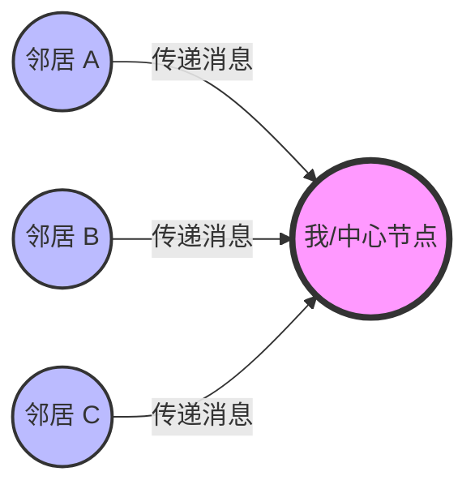
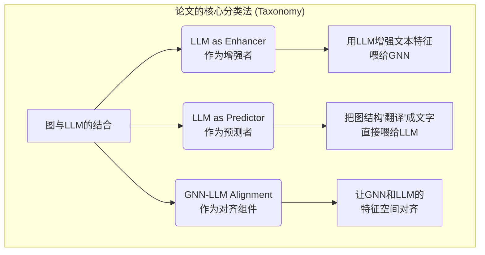
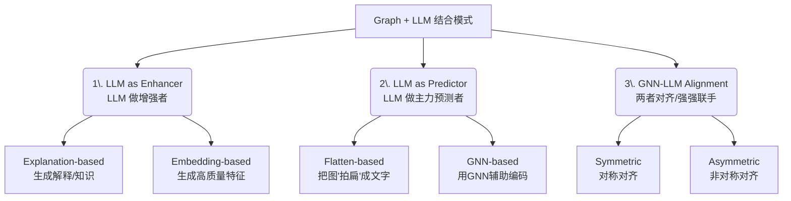
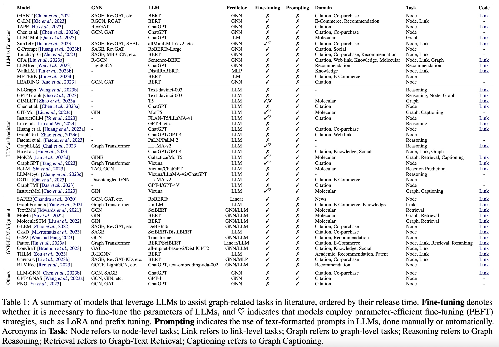
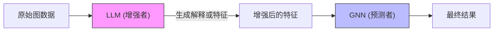
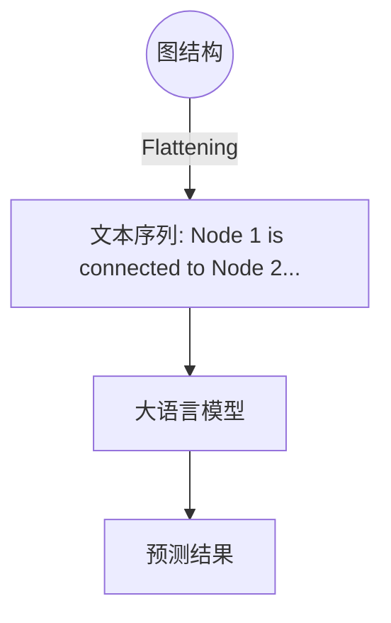

## AI论文解读 | A Survey of Graph Meets Large Language Model: Progress and Future Directions
        
### 作者        
digoal        
        
### 日期        
2025-11-27        
        
### 标签        
PostgreSQL , PolarDB , DuckDB , AI , 论文解读        
        
----        
        
## 背景  
      
https://arxiv.org/pdf/2311.12399        
  
提示:          
```          
读懂《A Survey of Graph Meets Large Language Model: Progress and Future Directions》这篇论文需要提前掌握哪些基础知识, 请使用中文通熟易懂的讲解这些基础知识, 可以引用论文中的图、表或使用Markdown支持的图形(text,mermaid等)增加解释性. 
  
使用中文通熟易懂的解读《A Survey of Graph Meets Large Language Model: Progress and Future Directions》这篇论文, 其中的关键内容请着重讲解, 可以引用论文中的图、表或使用Markdown支持的图形(text,mermaid等)增加解释性. 
  
提取《A Survey of Graph Meets Large Language Model: Progress and Future Directions》这篇论文中的重要术语, 使用中文对这些术语进行通熟易懂的讲解, 可以引用论文中的图、表或使用Markdown支持的图形(text,mermaid等)增加解释性. 
```     
  
## 1 前置知识 
  
阅读这就篇综述论文《A Survey of Graph Meets Large Language Model: Progress and Future Directions》，你需要理解它是 **图深度学习（Graph Deep Learning）** 与 **自然语言处理（NLP）** 这两个领域的交叉点。

简单来说，这篇论文讨论的是： **如何让擅长处理文本的“大脑”（大语言模型 LLMs）和擅长处理关系结构的“数学模型”（图神经网络 GNNs）强强联手** 。

为了读懂它，你需要掌握以下三大块基础知识。我将用通俗易懂的语言为你拆解，并配合图表说明。

-----

### 一、 图与图神经网络 (Graph & GNNs)

**1. 什么是图 (Graph)？**
在计算机里，“图”不是指图片，而是指**关系网络**。

  * **节点 (Node)** ：代表实体（比如：一篇论文、一个用户、一个分子原子）。
  * **边 (Edge)** ：代表关系（比如：引用关系、好友关系、化学键）。
  * **属性 (Attributes)** ：节点上附带的信息（比如：论文的标题和摘要文本）。

> **论文中的例子**：引文网络（Citation Network），论文是节点，引用是边；社交网络，人是节点，好友是边 。

**2. 什么是图神经网络 (GNN)？**
传统的神经网络（如CNN）处理网格状的数据（如图片），而GNN专门处理这种不规则的关系网络。

  * **核心机制：消息传递 (Message Passing)** 。
    想象你在一个聚会上，你想了解你自己（中心节点），你会去问你的朋友们（邻居节点）。GNN 的工作方式就是：每个节点收集周围邻居的信息，然后更新自己的状态。
  * **公式含义**：论文中提到的公式 $h_i = U(h_i, M(\{h_j\}))$ 其实就是说：
      * $M$ (Aggregate)：把邻居的信息收集起来。
      * $U$ (Update)：结合邻居的信息和自己的旧信息，算出新的特征 。




*图解：GNN 的消息聚合过程*

-----

### 二、 大语言模型 (LLMs)

**1. 什么是 LLM？**
这是指参数量巨大（十亿级别以上）的语言模型，比如 GPT-4、LLaMA 。

  * **核心能力**：理解和生成自然语言文本。
  * **基础架构**：Transformer。你需要知道它主要通过**注意力机制 (Attention)** 来捕捉文字之间的长距离依赖关系。

**2. 关键概念：**

  * **Token (词元)** ：LLM 不读整句话，而是把字切成一个个小块（token）来读。
  * **Embedding (嵌入)** ：把文字变成计算机能读懂的一长串数字向量。
  * **Pre-training (预训练)** vs **Fine-tuning (微调)** ：
      * *预训练*：像读完整个图书馆的书，学到了通用知识（比如下一词预测）。
      * *微调*：针对具体任务（比如把图转换成文本分类）进行专门训练 。

-----

### 三、 两个领域如何“相遇” (核心难点)

这篇论文的核心在于解决一个冲突： **图模型擅长处理结构（骨架），语言模型擅长处理文本（血肉）。** 如何把它们结合？你需要理解论文提出的三种结合模式 。

#### 1\. 文本属性图 (Text-Attributed Graphs, TAGs)

这是两者结合的数据基础。也就是这个图里的节点，不仅有ID，还有丰富的文本描述（比如电商网络里，商品节点有详细的商品描述）。

#### 2\. 三种结合角色的基础逻辑：

  * **LLM as Enhancer (增强者)**

      * *逻辑*：GNN 还是主力，LLM 只是打辅助。
      * *做法*：用 LLM 把节点上的文本变得更好（比如生成解释、扩充特征），然后喂给 GNN 吃 。
      * *通俗解释*：考试前（GNN训练前），学霸（LLM）帮你把复习资料（节点文本）整理得更清楚。

  * **LLM as Predictor (预测者)**

      * *逻辑*：抛弃传统的 GNN，直接让 LLM 来看图做题。
      * *做法*：把“图”变成“文字”。这叫 **Flattening (扁平化)** 。
      * *例子*：把“A连接B”这种结构，直接写成句子“节点A也是节点B的朋友”，然后问 LLM：“他们关系好吗？” 。

  * **GNN-LLM Alignment (对齐者)**

      * *逻辑*：让两者地位平等，把它们的“脑电波”（特征空间）调到一个频道上。
      * *关键技术：对比学习 (Contrastive Learning)* 。
      * *通俗解释*：如果你有一张分子的图（Graph）和一段分子的文字描述（Text），通过算法拉近它们在数学空间里的距离，让模型明白这张图就是这段话。




  

*(参考论文 Figure 2 的简化逻辑 )*

-----

### 四、 其他必须掌握的术语 (Glossary)

阅读过程中你会频繁遇到这些词，这里是“急救包”：

1.  **Encoder-Decoder / Decoder-only**:

      * LLM 的架构类型。BERT 是 Encoder-only（擅长理解），GPT 是 Decoder-only（擅长生成）。论文会讨论哪种架构适合处理图任务。

2.  **Prompting (提示工程)** :

      * 不仅仅是提问，更是为了激发 LLM 的潜能。比如 **Chain-of-Thought (思维链)** ，即让 LLM 把推理步骤一步步写出来，这在图推理任务中很重要 。

3.  **Instruction Tuning (指令微调)** :

      * 一种训练方法，教 LLM 听懂类似“请对这个分子图进行分类”这样的指令 。

4.  **Zero-shot / Few-shot (零样本/少样本学习)** :

      * LLM 的超能力。指模型在没见过（或只见过几个）图数据的例子下，依然能做对题目 。这是 LLM 相比传统 GNN 的一大优势。

5.  **Modalities (模态)** :

      * 指数据的不同形式。这里主要涉及**图模态 (Graph Modality)** 和 **文本模态 (Text Modality)** 。论文的重点就是跨模态融合 。

### 总结：阅读路线建议

1.  先看 **Introduction** ，了解为什么我们要把这两个东西结合（因为 GNN 懂结构不懂语义，LLM 懂语义不懂结构）。
2.  重点看 **Figure 2** ，这是全篇的导航图，理解那三个分类。    
3.  如果遇到具体的模型名字（如 BERT, GCN），只需要知道它们分别是代表“文本理解”和“图理解”的基石即可。
  
## 2 解读论文 
  
这篇论文《A Survey of Graph Meets Large Language Model: Progress and Future Directions》是对近年来 **图深度学习（Graph Deep Learning）** 与 **大语言模型（LLMs）** 结合领域的全面综述。

简单来说，这篇论文探讨的是： **如何让擅长处理“关系结构”的图神经网络（GNN）和擅长理解“文本语义”的大语言模型（LLM）强强联手，解决更复杂的问题。**

以下是该论文的**核心解读**，我将其整理为三个主要部分： **为什么要结合**、**三种结合模式（核心分类）** 、以及**未来的机会**。

-----

### 一、 背景：为什么要让 Graph 遇到 LLM？

论文指出，现实世界的数据通常兼具“结构”和“文本”两种属性：

  * **GNN 的痛点**：擅长处理结构（比如谁引用了谁），但对节点上的文本内容理解较浅（通常只用简单的词袋模型或浅层嵌入）。
  * **LLM 的痛点**：擅长理解复杂的文本语义，但很难直接处理图这种复杂的拓扑结构（它习惯读一行行的文字，不习惯看网状图）。

**核心目标**：结合两者，既利用 GNN 捕捉结构信息，又利用 LLM 挖掘深层语义 。

-----

### 二、 核心分类：三种结合模式 (Taxonomy)

这是论文最精华的部分。作者根据 **LLM 在任务中扮演的角色**，将现有的研究分为三大类。我们可以用下图来直观理解这个分类体系 ：



#### 1\. LLM as Enhancer（LLM 做增强者）

**核心逻辑**：GNN 依然是干活的主力，LLM 像是一个高级“家教”或“外挂”，负责优化输入给 GNN 的数据 。

  * **Explanation-based (基于解释)** ：
      * 让 LLM 阅读节点文本，生成解释、摘要或知识点。
      * **例子**：TAPE 模型。它让 LLM 为论文节点生成额外的解释文本，然后把这些解释喂给 GNN，以此提高预测准确率 。
  * **Embedding-based (基于嵌入)** ：
      * 直接用 LLM 强大的编码能力，把节点文本转换成高质量的数学向量（Embedding），作为 GNN 的初始输入特征 。
      * **例子**：SimTeG 或 GIANT。它们利用微调后的 LLM 生成更懂上下文的节点特征 。

> **总结**：这种方法成本相对较低，因为推理时主要靠 GNN，不需要每次都调用昂贵的 LLM。

#### 2\. LLM as Predictor（LLM 做主力预测者）

**核心逻辑**：抛弃传统的分类头，直接让 LLM 来回答问题。难点在于： **怎么把“图”喂给只能吃“文字”的 LLM？** 。

  * **Flatten-based (拍扁策略)** ：

      * 把图结构“翻译”成文字序列。
      * **做法**：比如把“节点A连接节点B”直接写成自然语言句子：“论文A引用了论文B”。
      * **例子**：NLGraph 或 InstructGLM。它们把图的邻居关系写在 Prompt 里，让 LLM 进行推理 。
      * *优点*：利用了 LLM 强大的推理能力（Zero-shot）。
      * *缺点*：输入长度有限制（Context Window），很难处理大图 。

  * **GNN-based (GNN 辅助)** ：

      * 用 GNN 把图结构压缩成一个“软 Token”（Soft Token/Embedding），然后告诉 LLM：“这串数字代表一张图，请阅读它”。
      * **例子**：GraphGPT 或 GraphLLM。它们用一个投影层（Projector）把 GNN 的输出对齐到 LLM 的输入空间 。

#### 3\. GNN-LLM Alignment（GNN-LLM 对齐）

**核心逻辑**：不再是谁辅助谁，而是追求两者在语义空间上的统一，通常用于多模态任务（比如图文检索、分子与描述匹配） 。

  * **Symmetric (对称对齐)** ：
      * 两个模型地位平等，通过 **对比学习（Contrastive Learning）** 拉近彼此的距离。
      * **例子**：MoleculeSTM。它让分子的图结构表示和分子的文本描述表示在数学空间上尽可能接近 。
  * **Asymmetric (非对称对齐)** ：
      * 以一方为主，另一方通过知识蒸馏（Distillation）等方式注入知识。
      * **例子**：GraphFormers。在 Transformer 的每一层中嵌入 GNN 模块，让文本模型具备感知图结构的能力 。

-----

### 三、 关键图表解读

论文中的 **Figure 2** 是理解全篇的钥匙（我在上面的 Mermaid 图中复现了它的逻辑），而 **Table 1** 则是对现有工作的详细索引。       

**重点看 Table 1**：
这张表按时间顺序列出了所有模型。你可以关注几列关键信息：

  * **Role**: 属于 Enhancer, Predictor 还是 Alignment？
  * **Domain**: 应用领域。主要是 **Citation Network (引文网络)** 、**Molecular (分子图)** 和 **Recommendation (推荐系统)**  - 这说明目前这三个领域是 Graph+LLM 结合的最前沿。

-----

### 四、 未来的研究方向 (Future Directions)

论文最后指出了目前的局限和未来的机会，这对于寻找研究灵感非常有价值：

1.  **处理非文本图 (Dealing with non-TAG)** ：
      * 目前的结合大多依赖节点上有文字（如论文网）。但对于纯数字的图（如交通流传感器网络），怎么利用 LLM 的泛化能力？这是个难题。
2.  **数据泄露 (Data Leakage)** ：
      * LLM 预训练时可能已经“读过”了那些测试用的论文数据集（如 Cora）。现在的评测可能是不准确的，需要新的 Benchmark。
3.  **效率问题 (Efficiency)** ：
      * 把图展开成文本喂给 LLM 极其消耗 Token，费用昂贵且速度慢。如何让 LLM 更高效地“看”图？
4.  **LLM 作为智能体 (LLM as Agent)** ：
      * 不仅仅是做预测，而是让 LLM 作为一个大脑，去调用 GNN 作为工具（Tool），像人类专家一样分步骤解决复杂的图任务。

### 总结

这篇综述告诉我们要打破 GNN 和 LLM 的界限。

  * 如果你追求**极致的精度**且计算资源有限，**Enhancer** 模式（LLM 增强特征 + GNN 预测）通常是目前效果最好的（SOTA）。
  * 如果你追求**通用推理能力**或**零样本能力**，**Predictor** 模式（直接用 LLM）是未来的趋势。
  
## 3 术语 
  
这篇论文探讨了图神经网络（GNN）与大语言模型（LLM）的结合。为了读懂它，我们需要理解其中几个核心术语。我将这些术语分为**基础对象**、**结合模式**和**关键技术**三类，并用通俗的语言为您解读。

### 一、 基础对象：数据长什么样？

#### 1\. Text-Attributed Graphs (TAGs, 文本属性图)

  * **学术定义**：节点拥有丰富文本信息的图数据 。
  * **通俗解读**：这就好比是一个“增强版”的社交网络。
      * **普通图**：只知道“A认识B”。
      * **文本属性图**：不仅知道“A认识B”，还知道A的“个人简介”写了什么，B发了什么“推文”。
      * 论文中提到的引文网络（Citation Network）就是典型的TAG：节点是论文（有标题、摘要等文本），边是引用关系 。

-----

### 二、 三大结合模式：它们怎么合作？

论文根据 LLM 扮演角色的不同，提出了一个核心分类法（Taxonomy）。

#### 2\. LLM as Enhancer (LLM 作为增强者)

  * **核心逻辑**： **GNN 还是主角，LLM 打辅助** 。
  * **通俗解读**：就像学生（GNN）要考试，学霸（LLM）帮忙整理复习资料。
      * **Explanation-based (基于解释)** ：学霸不只给资料，还写了详细的注释和解释 。
      * **Embedding-based (基于嵌入)** ：学霸直接把资料转化成高质量的“知识点精华”（特征向量），喂给学生吃 。
  * **目的**：解决 GNN 自身理解文本能力弱的问题 。




#### 3\. LLM as Predictor (LLM 作为预测者)

  * **核心逻辑**： **LLM 是主角，GNN 被抛弃或仅做辅助** 。
  * **通俗解读**：直接把考卷给 LLM 做。因为 LLM 通常只读得懂文字，读不懂图，所以需要把图“翻译”成文字。
  * **关键挑战**：如何把复杂的网状结构变成一行行文字？这涉及“图扁平化”（见下文术语 5）。

#### 4\. GNN-LLM Alignment (GNN-LLM 对齐)

  * **核心逻辑**： **两者地位平等，追求“心意相通”** 。
  * **通俗解读**：GNN 说的“图语言”和 LLM 说的“人类语言”往往不通。对齐就是通过训练，让它们对同一个东西（比如一个分子）的理解在数学空间上重合。
      * 常用于多模态任务，比如给一张分子图，让模型生成它的文本描述 。

-----

### 三、 关键技术：具体怎么操作？

#### 5\. Graph Flattening (图扁平化)

  * **背景**：当 LLM 作为预测者时，无法直接输入图形结构。
  * **操作**：将图中的节点和边转换成一个序列文本 。
  * **例子**：
      * **图结构**：A -\> B, B -\> C
      * **扁平化后**：`"节点A连接着节点B，节点B连接着节点C..."` 或者使用特定的符号表示 。
  * 论文中提到的 **GraphText** 和 **NLGraph** 等模型就使用了这种技术 。




#### 6\. Contrastive Learning (对比学习)

  * **背景**：用于实现 GNN 和 LLM 的“对齐” 。
  * **通俗解读**：这就好比玩“连连看”游戏。
      * 系统会给出一张图（由 GNN 编码）和一段文字（由 LLM 编码）。
      * **正样本**：如果图和文字是描述同一个东西，模型就要**拉近**它们的距离。
      * **负样本**：如果图和文字不匹配，模型就要**推开**它们的距离。
      * 通过大量这样的练习，GNN 和 LLM 就学会了互相理解 。

#### 7\. PEFT (Parameter-Efficient Fine-Tuning, 参数高效微调)

  * **背景**：LLM 太大了，重新训练（微调）所有参数非常慢且贵。
  * **操作**：冻结 LLM 的大部分参数，只训练一小部分额外的参数（比如 LoRA 或 Prefix Tuning）。
  * **在图中的应用**：为了让 LLM 适应图任务，研究者使用 PEFT 技术来降低计算成本，提高效率 。

#### 8\. Chain-of-Thought (CoT, 思维链)

  * **背景**：LLM 的一种涌现能力（Emergent Ability）。
  * **操作**：在提示（Prompt）中不直接问答案，而是要求 LLM 展示推理步骤。
  * **应用**：在图推理任务中，让 LLM 一步步写出它是如何沿着图的节点找到答案的，这比直接猜答案准确率更高 。

### 总结

这篇论文的核心就在于：

1.  **Enhancer**: LLM 帮 GNN 备课。
2.  **Predictor**: 把图拆成字，LLM 自己考。
3.  **Alignment**: GNN 和 LLM 互相“对暗号”，达成理解一致。
  
## 参考        
         
https://arxiv.org/pdf/2311.12399    
        
<b> 以上内容基于DeepSeek、Qwen、Gemini及诸多AI生成, 轻微人工调整, 感谢杭州深度求索人工智能、阿里云、Google等公司. </b>        
        
<b> AI 生成的内容请自行辨别正确性, 当然也多了些许踩坑的乐趣, 毕竟冒险是每个男人的天性.  </b>        
    
#### [PolarDB 学习图谱](https://www.aliyun.com/database/openpolardb/activity "8642f60e04ed0c814bf9cb9677976bd4")
  
  
#### [PostgreSQL 解决方案集合](../201706/20170601_02.md "40cff096e9ed7122c512b35d8561d9c8")
  
  
#### [德哥 / digoal's Github - 公益是一辈子的事.](https://github.com/digoal/blog/blob/master/README.md "22709685feb7cab07d30f30387f0a9ae")
  
  
#### [About 德哥](https://github.com/digoal/blog/blob/master/me/readme.md "a37735981e7704886ffd590565582dd0")
  
  

  
