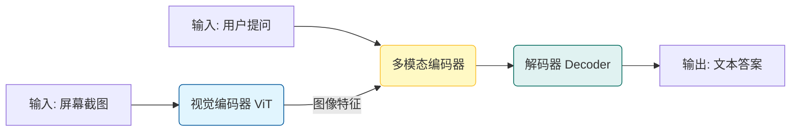
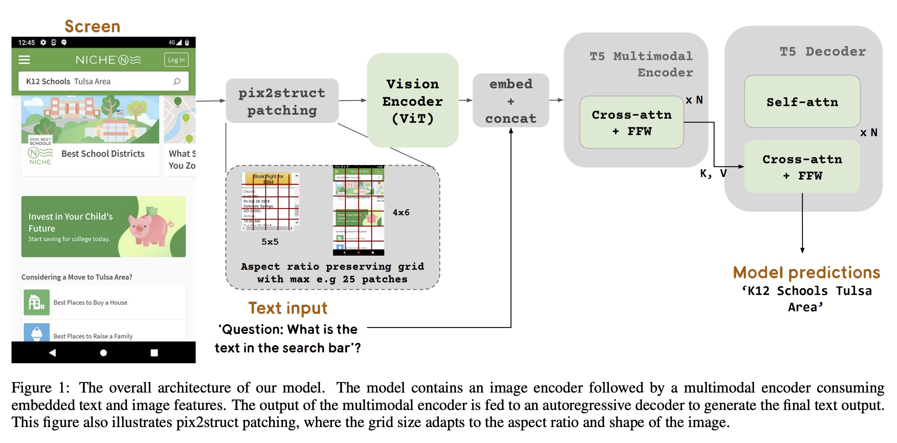
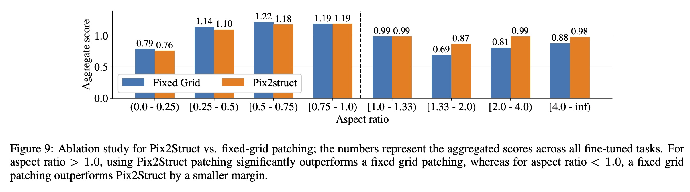
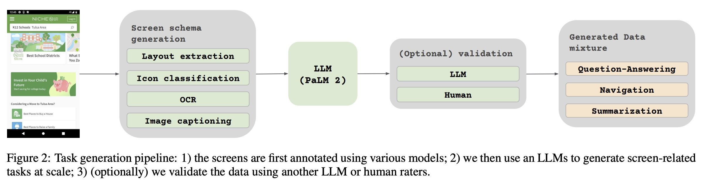
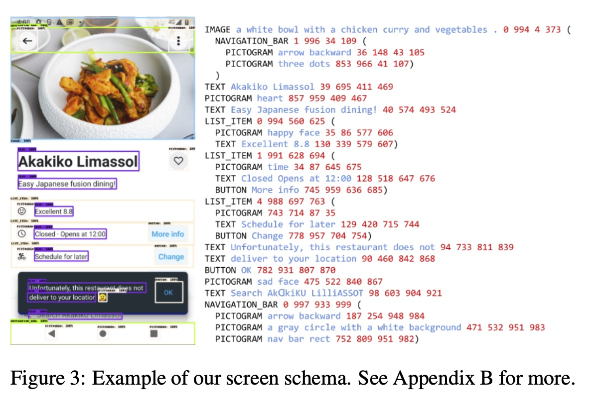
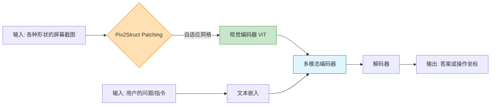
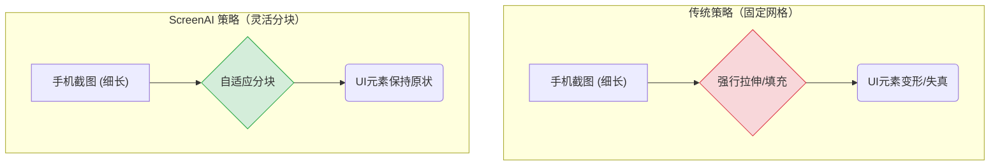

## AI论文解读 | ScreenAI: A Vision-Language Model for UI and Infographics Understanding
        
### 作者        
digoal        
        
### 日期        
2025-11-27        
        
### 标签        
PostgreSQL , PolarDB , DuckDB , AI , 论文解读        
        
----        
        
## 背景  
      
https://arxiv.org/pdf/2402.04615        
  
提示:          
```          
读懂《ScreenAI: A Vision-Language Model for UI and Infographics Understanding》这篇论文需要提前掌握哪些基础知识, 请使用中文通熟易懂的讲解这些基础知识, 可以引用论文中的图、表或使用Markdown支持的图形(text,mermaid等)增加解释性. 
  
使用中文通熟易懂的解读《ScreenAI: A Vision-Language Model for UI and Infographics Understanding》这篇论文, 其中的关键内容请着重讲解, 可以引用论文中的图、表或使用Markdown支持的图形(text,mermaid等)增加解释性. 
  
提取《ScreenAI: A Vision-Language Model for UI and Infographics Understanding》这篇论文中的重要术语, 使用中文对这些术语进行通熟易懂的讲解, 可以引用论文中的图、表或使用Markdown支持的图形(text,mermaid等)增加解释性. 
```     
  
## 1 前置知识 
  
阅读《ScreenAI: A Vision-Language Model for UI and Infographics Understanding》这篇论文，建议您提前掌握以下几个核心领域的“前置知识”。为了帮助您理解，我将用通俗的语言配合论文中的图示进行讲解。

### 1\. 视觉语言模型 (Vision-Language Models, VLM)

**核心概念**：
你要知道现在的AI不仅能“看图”（计算机视觉），也不仅能“说话”（自然语言处理），而是能把两者结合起来。VLM 就是一种既能理解图像像素，又能理解文字语义的模型。

**在论文中的应用**：
ScreenAI 本质上是一个 VLM。它的工作模式可以简单理解为： **输入（图像+文字） -\> 模型处理 -\> 输出（文字）** 。

  * **输入**：一张手机截图或图表 + 一个问题（比如“图中的按钮是什么颜色的？”）。
  * **输出**：模型生成的文本答案。

**基础架构 (PaLI)** ：
论文提到 ScreenAI 基于 **PaLI** 架构 。你需要了解 PaLI 的基本结构：它由一个**视觉编码器 (Vision Encoder)** 和一个**语言编码器-解码器 (Language Encoder-Decoder)** 组成。



*参考论文原文的架构图（Figure 1）可以看到这个流程的具体实现 。*

  

### 2\. 图像分块与 Patching 策略 (ViT & Pix2Struct)

**核心概念**：
AI 无法像人类一样一眼看全图，它需要把图片切成无数个小方块（Patches），然后一个个处理。这叫做 **Vision Transformer (ViT)** 的处理方式。

**难点与论文的解决方案**：
传统的 ViT 通常把图片强行缩放成正方形再切割，但手机屏幕（长条形）或网页（宽屏）如果被强行拉伸成正方形，字和按钮就变形了，AI 就看不懂了。

**你需要懂的知识点**：

  * **Fixed Grid (固定网格)** ：传统做法，不管图片长啥样，都切成固定数量的方块。
  * **Pix2Struct Patching (灵活网格)** ：这是论文借用的关键技术 。它允许网格根据图片的**宽高比 (Aspect Ratio)** 变形。

**通俗解释**：

  * **普通 ViT**：像切披萨，不管披萨是圆是方，最后都得装进一个正方形盒子里，甚至把披萨挤扁。
    * **ScreenAI (Pix2Struct)** ：像铺地砖。如果房间是细长的（手机屏），我就把地砖铺成细长的形状；如果房间是宽的（电脑屏），我就铺成宽的，保证地砖里的花纹（UI元素）不变形 。

*论文中的 Figure 9 展示了这种策略在处理不同长宽比图片时的优势 。*

  

### 3\. 数据生成与合成数据 (Synthetic Data Generation)

**核心概念**：
在大模型训练中，高质量的人工标注数据（比如人手写的问题和答案）非常贵且少。现在的趋势是用一个**更强的模型（大老师）去教小模型（学生）** 。

**在论文中的应用**：
ScreenAI 极度依赖“自动生成数据”。你需要理解以下流程：

1.  **标注 (Annotation)** ：先用检测模型把屏幕上的所有元素（按钮、图片、文字）都框出来 。
2.  **生成 (Generation)** ：把这些框和文字扔给一个强大的纯语言大模型（LLM，如 PaLM 2），对它说：“根据这些信息，给我编10个问答题” 。
3.  **训练**：用这些机器生成的问答题来训练 ScreenAI。

*论文 Figure 2 详细展示了这个“自产自销”的数据生成流水线 。*

  

### 4\. UI 结构与 Schema (DOM 树的概念)

**核心概念**：
不同于自然风景照，手机界面（UI）是有严格结构的。它由 **DOM (文档对象模型)** 组成，包含父子关系（例如：一个“列表”包含三个“选项”）。

**在论文中的应用**：
论文提出了一种 **Screen Schema**（屏幕图式）。你需要理解这是一种用文本描述图片的方式。

  * 它包含：UI元素名称、OCR识别出的文字、位置坐标、层级关系 。

**示例（基于论文 Figure 3）：**     
AI 看到的不仅仅是像素，而是类似代码的结构：

```text
LIST_ITEM (
   ICON (坐标: 10, 20...),
   TEXT ("设置", 坐标: 30, 40...)
)
```

*这种结构化文本让大模型更容易理解屏幕内容 。*

### 5\. 预训练与微调 (Pre-training vs. Fine-tuning)

**核心概念**：
这是现代 AI 训练的标准两步走：

1.  **预训练 (Pre-training)** ：海量数据“通识教育”。让模型看几亿张截图，学会什么是按钮、什么是菜单，学会通用的“屏幕语言” 。
2.  **微调 (Fine-tuning)** ：专业技能“职业培训”。针对具体考试（比如 ChartQA 图表问答、Screen Navigation 屏幕导航）进行专项突击训练 。

**在论文中的体现**：
论文的大部分篇幅都在对比这两个阶段的数据混合比例（Data Mixtures）和任务设置 。

-----

### 总结：下一步您可以做什么？

如果您想深入阅读此论文，建议重点关注以下部分，它们是本文的精华：

1.  **Figure 1** ：结合上面提到的 **Patching** 知识，看懂图像是如何变成 Token 进入模型的。    
2.  **Figure 3** ：看懂 **Screen Schema**，理解作者是如何把一张图“翻译”成文本结构喂给 LLM 的。   
3.  **Section 4.1** ：浏览预训练任务列表，理解模型到底学了哪些能力（如：OCR、导航、概括）。
  
## 2 解读论文 
  
这篇论文介绍了一个名为 **ScreenAI** 的视觉语言模型（Vision-Language Model, VLM）。简单来说，Google DeepMind 团队开发了一个专门用来 **“看懂”手机屏幕、网页界面（UI）和信息图表（Infographics）** 的 AI 模型 。

它的核心目标是让 AI 能够像人一样理解屏幕上的像素，回答关于屏幕内容的问题，甚至像用户一样操作界面 。

以下是对这篇论文核心内容的通俗解读：

-----

### 1\. 核心架构：像变色龙一样的“眼睛”

ScreenAI 的底座是一个叫 PaLI 的模型架构，由“视觉编码器”（负责看图）和“语言编码器”（负责读写文字）组成 。

但在处理屏幕截图时，ScreenAI 做了一个关键的改进： **灵活性**。
普通的 AI 往往要求图片是正方形的，但这对于手机截屏（细长）或网页（宽屏）来说，强行拉伸会破坏文字和按钮的形状。

**ScreenAI 的绝招：Pix2Struct Patching 策略**
它借鉴了 pix2struct 的技术，能够根据图片的 **宽高比（Aspect Ratio）** 自动调整网格形状。

  * 如果是手机屏，它就把处理网格铺成细长的。
  * 如果是电脑屏，就铺成宽的。
  * **好处**：不需要把图片强行填补（Padding）或拉伸，保证 AI 看到的界面元素不变形 。

**架构示意图（基于 Figure 1）** ：    



-----

### 2\. 独家秘籍：自动生成“教材” (Data Generation)

这是这篇论文最精彩的部分。为了训练这个模型，研究人员并没有完全依赖人工标注（因为太贵且太慢），而是发明了一套 **“AI 教 AI”的自动化流水线** 。

他们主要解决了一个问题： **哪里去找海量的、带有高质量问答的屏幕截图数据？**

**流水线步骤（对应论文 Figure 2）：**    

1.  **第一步：全能标注 (Annotation)**
    先把收集到的海量截图，用各种专用小模型进行“拆解”。

      * **物体检测**：框出所有的按钮、图片、文字区域 。
      * **图标分类**：认出这是“Wi-Fi图标”还是“返回箭头” 。
      * **OCR**：把屏幕上的所有文字读出来 。
      * **看图说话**：给屏幕里的图片写一段描述 。

2.  **第二步：生成“屏幕图式” (Screen Schema)**
    把上面识别到的所有信息，整理成一种结构化的文本格式，就像是把图片翻译成了代码 。

    > **例子**：
    > `BUTTON (坐标: 10,20, "提交")`
    > `IMAGE (坐标: 50,60, "一只猫的图片")`

3.  **第三步：大模型出题 (LLM Generation)**
    把这个“屏幕图式”喂给一个超强的纯语言大模型（比如 PaLM 2），对它说：“根据这些信息，请给我生成一些问答题、导航指令或摘要” 。

      * *PaLM 2*：好的，问题：“点击哪里可以提交？” 答案：“点击坐标 (10,20)”。

通过这种方法，Google 自动生成了数亿条高质量的训练数据，包括问答、导航和摘要任务 。

-----

### 3\. Screen Schema：连接图像与语言的桥梁

论文特别强调了 **Screen Schema**（屏幕图式）的重要性。这是一种文本表示法，用来在预训练阶段教会模型理解 UI 的结构 。

如下图（引用 Figure 3）所示，原本的像素图片（左）被转换成了带有层级关系的文本（右）：

  

  * **左边**：原始的手机截图。
  * **右边**：模型看到的文本。它包含了 UI 元素的类型（如 `TEXT`, `BUTTON`）、内容、以及归一化的坐标位置（例如 `956 34 100`） 。

这种表示法让大语言模型（LLM）能够通过“阅读文本”来理解屏幕布局，从而生成复杂的训练任务 。

-----

### 4\. ScreenAI 能干什么？（任务与能力）

经过上述训练，ScreenAI 学会了多种技能 ：

1.  **屏幕问答 (QA)** ：
      * 问：“这双鞋多少钱？”
      * 答：“\$45.99” 。
2.  **界面导航 (Navigation)** ：
      * 指令：“帮我把把亮度调低。”
      * 模型输出：目标滑块的具体坐标 。
3.  **屏幕摘要 (Summarization)** ：
      * 任务：“这句话总结这个屏幕在讲什么。”
      * 答：“这是关于某新闻应用的首页，展示了今日头条……” 。
4.  **屏幕标注 (Annotation)** ：
      * 任务：识别屏幕上所有的元素类型和位置 。

-----

### 5\. 战绩如何？（实验结果）

尽管 ScreenAI 的参数量只有 **46亿 (5B)** ，相比于动辄几千亿参数的超大模型（如 GPT-4 或 Gemini Ultra）属于“小个子” 。但它在专业领域表现极其出色：

  * **刷新纪录**：在 **WebSRC**（网页理解）、**MoTIF**（UI 导航）等任务上取得了新的 State-of-the-Art (SoTA) 成绩 。
  * **以小博大**：在信息图表问答（ChartQA, InfographicVQA）等任务上，它超越了比它大 10 倍以上的模型 。
  * **缩放潜力**：实验证明，随着模型参数从 670M 增加到 5B，性能一直在提升，说明这个架构还有变强的潜力 。

### 6\. 给社区的贡献

除了提出模型，论文作者还开源了三个新的数据集，方便后续研究者进行测试 ：

1.  **Screen Annotation**：专门用于测试模型识别 UI 布局的能力 。
2.  **ScreenQA Short**：包含简短答案的屏幕问答数据集 。
3.  **Complex ScreenQA**：包含计数、算术、比较等复杂逻辑的屏幕问答数据集 。

### 总结

ScreenAI 证明了：通过**特定的视觉策略（Pix2Struct Patching）加上高质量的合成数据（利用 LLM 生成）** ，一个中等规模的模型可以在 UI 和图表理解这种垂直领域达到顶尖水平。它是目前数字内容理解领域（UI/Infographics）的“全能选手” 。
  
## 3 术语 
  
这篇论文《ScreenAI: A Vision-Language Model for UI and Infographics Understanding》的核心价值在于它将**视觉语言模型（VLM）的能力，专门优化到了屏幕界面**和**信息图表**这两个高度结构化的领域。

以下是论文中最重要的术语及其通俗易懂的中文讲解，并配合图示说明：

-----

### 1\. Vision-Language Model (VLM) / 视觉语言模型

  * **通俗解释**：VLM 是一种“多才多艺”的 AI 模型，它不仅能 **“看懂”** 图片（视觉），还能 **“理解”** 和 **“生成”** 文字（语言）。ScreenAI 就是一个 VLM，它的工作是接收一张屏幕截图和一个文字问题（如：“这个购物车里有几件商品？”），然后输出文字答案。
  * **论文中的体现**：ScreenAI 基于 **PaLI 架构**。这意味着它由一个专门负责分析图像的 **视觉编码器（Vision Encoder）** 和一个专门负责处理文字并生成答案的 **语言编码器-解码器（Language Encoder-Decoder）** 组成，实现了图像和文本信息的融合处理。

### 2\. Flexible Patching Strategy / 灵活分块策略 (Pix2Struct)

  * **通俗解释**：传统的图像模型喜欢把所有图片都缩放成固定大小的正方形（比如 224x224 像素），这会导致细长的手机截图或宽大的网页被**拉伸变形**，从而让 AI 认错屏幕上的字或按钮。
  * **核心创新**：ScreenAI 采用了 **Pix2Struct** 的灵活分块策略。它不会强行拉伸图片。它像一个聪明的裁缝，根据截图的**宽高比**，把图片切割成形状自适应的“补丁”（Patches）。
  * **好处**：这保证了屏幕上的文字和 UI 元素不会失真，极大提高了模型对原始屏幕信息的识别准确率。




### 3\. Screen Schema / 屏幕图式

  * **通俗解释**：屏幕图式是 ScreenAI 用来连接 **像素（图片）** 和 **语义（文字）** 的桥梁。它把一张复杂的屏幕截图， **“翻译”** 成了一种结构化、像代码一样的文本描述。
  * **构成要素**：一个完整的屏幕图式包含屏幕上所有重要的 UI 元素信息，例如：
      * **元素类型**：这是一个 `BUTTON`（按钮）、`TEXT`（文本）还是 `ICON`（图标）？
      * **内容**：按钮上写着什么字？（OCR 识别结果）
      * **位置**：这个元素在屏幕的哪个坐标位置？（归一化的坐标）
      * **层级关系**：这个元素属于哪个父级容器？
  * **论文中的体现 (参考 Figure 3 概念)** ：    

| 原始图像元素 | 屏幕图式文本表示 |
| :---: | :--- |
| **一个标题**：Today's Top Story | `TEXT (content: "Today's Top Story", coordinates: 30 100 500 120)` |
| **一个搜索按钮** | `ICON (type: "search", coordinates: 900 30 950 80)` |
| **一个列表项** | `LIST_ITEM (children: [IMAGE, TEXT, BUTTON...])` |

模型通过“阅读”这种结构化文本，能快速且准确地理解屏幕布局，这是它能够进行高级推理（如导航、复杂问答）的基础。

### 4\. Automated Data Generation / 自动化数据生成

  * **通俗解释**：这是 ScreenAI 能够大规模训练的关键。人工为每一张截图编写几百个问答和操作指令非常昂贵和耗时。所以 ScreenAI 让一个**超强的大语言模型（LLM，比如 PaLM 2）来担任“老师”的角色，为自己自动编写训练教材**。
  * **工作流程（核心）** ：
    1.  **输入**：将上一步生成的 **Screen Schema（屏幕图式）** 喂给 LLM。
    2.  **LLM 提问**：LLM 基于这个结构化文本，自动生成**问题**（例如：“这个界面的目的是什么？”）和对应的**答案**（例如：“这是一个购物界面的详情页”）。
    3.  **规模化**：通过这个自动化流水线，模型在短时间内获得了数亿条高质量、高多样性的训练数据。

### 5\. UI Navigation / UI 导航

  * **通俗解释**：UI 导航是 ScreenAI 的一项关键应用能力，相当于让 AI 学会 **“代客操作”** 。它不仅仅是回答问题，更是执行指令。
  * **任务目标**：当用户给出一个**操作指令**（如：“帮我把这张图片设置为头像”）时，模型必须理解指令，并在屏幕上识别出要点击的**目标元素**，最终输出该元素在屏幕上的**精确坐标**。
  * **论文中的重要性**：ScreenAI 在 **MoTIF** 等 UI 导航基准测试中取得了最佳结果，这表明它在理解人类意图和精确执行屏幕操作方面的能力是顶尖的。
  
## 参考        
         
https://arxiv.org/pdf/2402.04615    
        
<b> 以上内容基于DeepSeek、Qwen、Gemini及诸多AI生成, 轻微人工调整, 感谢杭州深度求索人工智能、阿里云、Google等公司. </b>        
        
<b> AI 生成的内容请自行辨别正确性, 当然也多了些许踩坑的乐趣, 毕竟冒险是每个男人的天性.  </b>        
    
#### [PolarDB 学习图谱](https://www.aliyun.com/database/openpolardb/activity "8642f60e04ed0c814bf9cb9677976bd4")
  
  
#### [PostgreSQL 解决方案集合](../201706/20170601_02.md "40cff096e9ed7122c512b35d8561d9c8")
  
  
#### [德哥 / digoal's Github - 公益是一辈子的事.](https://github.com/digoal/blog/blob/master/README.md "22709685feb7cab07d30f30387f0a9ae")
  
  
#### [About 德哥](https://github.com/digoal/blog/blob/master/me/readme.md "a37735981e7704886ffd590565582dd0")
  
  

  
