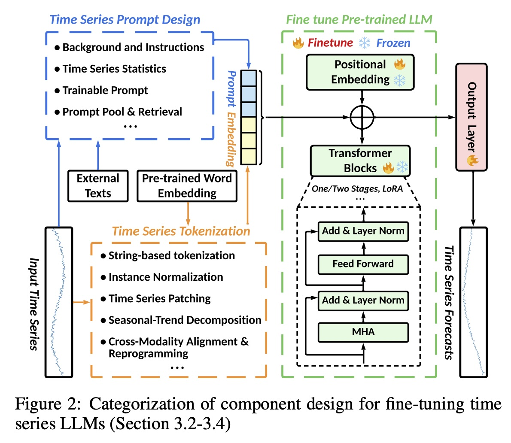
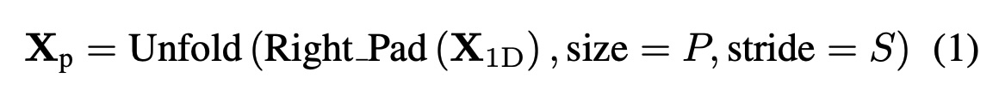
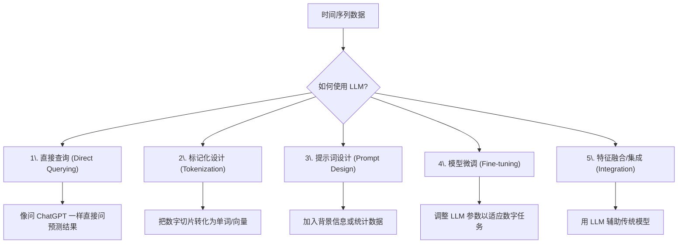
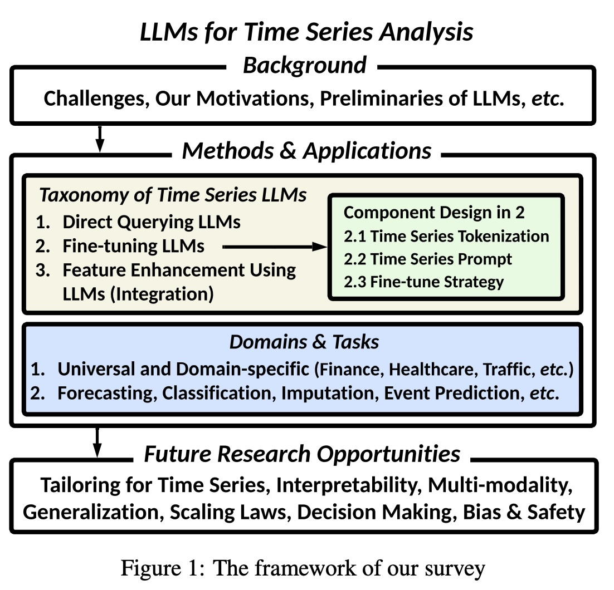
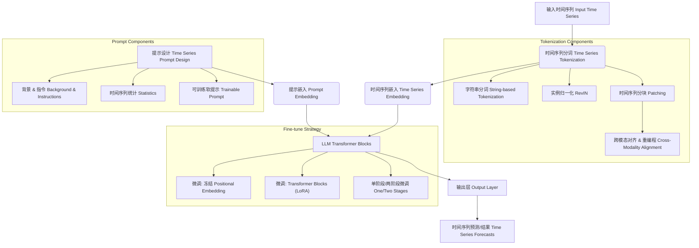

## AI论文解读 | Empowering Time Series Analysis with Large Language Models: A Survey
        
### 作者        
digoal        
        
### 日期        
2025-11-27        
        
### 标签        
PostgreSQL , PolarDB , DuckDB , AI , 论文解读        
        
----        
        
## 背景  
      
https://arxiv.org/pdf/2402.03182        
  
提示:          
```          
读懂《Empowering Time Series Analysis with Large Language Models: A Survey》这篇论文需要提前掌握哪些基础知识, 请使用中文通熟易懂的讲解这些基础知识, 可以引用论文中的图、表或使用Markdown支持的图形(text,mermaid等)增加解释性. 
  
使用中文通熟易懂的解读《Empowering Time Series Analysis with Large Language Models: A Survey》这篇论文, 其中的关键内容请着重讲解, 可以引用论文中的图、表或使用Markdown支持的图形(text,mermaid等)增加解释性. 
  
提取《Empowering Time Series Analysis with Large Language Models: A Survey》这篇论文中的重要术语, 使用中文对这些术语进行通熟易懂的讲解, 可以引用论文中的图、表或使用Markdown支持的图形(text,mermaid等)增加解释性. 
```     
  
## 1 前置知识 
  
要读懂这篇题为《Empowering Time Series Analysis with Large Language Models: A Survey》（利用大型语言模型赋能时间序列分析：综述）的论文，你不需要成为人工智能专家，但需要掌握以下三个领域的**核心基础知识**。

为了让你轻松理解，我将这些知识分为**时间序列基础**、**大模型基础**以及**两者如何结合**这三个模块来讲解。

-----

### 第一模块：时间序列分析基础 (Time Series Analysis)

这是论文试图解决的“问题领域”。你需要理解数据长什么样，以及我们在担心什么。

#### 1\. 什么是时间序列？

简单来说，就是按时间顺序排列的一组数据。比如：股票价格走势、每小时的气温、心电图数据等 。

  * **单变量 (Univariate):** 只有一个指标随时间变化（如：只看气温）。
  * **多变量 (Multivariate):** 多个相关指标随时间变化（如：同时看气温、湿度、风速）。

#### 2\. 核心挑战：非平稳性 (Non-stationarity) 与 概念漂移 (Concept Drift)

这是论文中提到的主要难点 。

  * **通俗解释：** 假设你在玩一个游戏，但游戏规则（数据的统计规律，如均值、方差）每过几分钟就会变一次。这就叫“非平稳性”。
  * **概念漂移：** 因为规则变了，你昨天训练好的模型（经验），今天可能就失效了。这导致模型很难长期保持准确 。

#### 3\. 常见任务

  * **预测 (Forecasting):** 猜明天的股价 。
  * **分类 (Classification):** 判断这段心电图是“健康”还是“有病” 。
  * **异常检测 (Anomaly Detection):** 找出哪些数据点看起来“不正常” 。

-----

### 第二模块：大语言模型基础 (LLMs Basics)

这是论文使用的“工具”。你需要理解它是如何工作的。

#### 1\. Tokenization (分词/词元化)

大模型看不懂原始文本，它只能看懂数字。

  * **通俗解释：** 就像把一句话“我喜欢AI”切分成“我”、“喜欢”、“AI”这三个积木块，每个积木块就是一个 **Token**。
  * **难点：** 时间序列是连续的数字（如 23.5, 24.1），怎么变成积木块？这是论文重点讨论的技术之一  。

#### 2\. Embedding (嵌入)

  * **通俗解释：** 给每个 Token（积木块）分配一个唯一的“身份证号”列表（向量）。在这个空间里，意思相近的词（如“猫”和“狗”）距离会很近。

#### 3\. Transformer 架构与注意力机制 (Attention)

这是所有现代 LLM（如 GPT, Llama）的底座 。

  * **核心能力：** 它能同时看到序列中的所有信息，并计算出哪些部分对当前任务最重要（即“注意力”）。对于时间序列来说，就是捕捉过去的数据如何影响未来 。

#### 4\. 预训练 (Pre-training) vs. 微调 (Fine-tuning)

  * **预训练：** 模型在海量文本上读过书，学会了通用的逻辑和语言能力 。
  * **微调：** 让这个读过书的“通才”，专门去学时间序列的知识，变成“专才” 。
      * **LoRA (Low-Rank Adaptation):** 论文中提到的高效微调技术 。想象一下，不想给整个大脑动手术（全量微调），只给大脑贴个小芯片（训练少量参数）来增加新功能。

-----

### 第三模块：核心难点——如何把“数字”喂给“读文字”的模型？

这是这篇综述的核心，也是理解论文图表（如 Figure 2）的关键。    

因为 LLM 是为了处理文本设计的，直接把股票价格丢给它，它可能看不懂。论文总结了五种策略 ，你需要理解以下核心概念：

#### 1\. Prompt (提示词) 工程

  * **概念：** 不改动模型，而是通过把时间序列数据转化成文本描述，或者在输入前加一段指令（Instruction），告诉模型“这是一段股票数据，请预测下一天的价格” 。

#### 2\. Patching (分块)

这是将时间序列转化为 Token 的最主流方法 。

  * **解释：** 不要一个数字一个数字地看。而是把一小段时间（比如连续10分钟的数据）打包成一个包（Patch）。
  * **图解逻辑：**
    ```mermaid
    graph LR
    A[原始数据: 1,2,3,4,5,6] --> B{Patching操作}
    B --> C[Patch 1: 1,2]
    B --> D[Patch 2: 3,4]
    B --> E[Patch 3: 5,6]
    C --> F((变成 Token 1))
    D --> G((变成 Token 2))
    E --> H((变成 Token 3))
    F & G & H --> I[输入给 LLM]
    ```
    *这对应论文公式(1)  和 Figure 2 左下角的 "Time Series Patching" 。*

        

#### 3\. 模态对齐 (Modality Alignment)

  * **问题：** 文本的世界和数字的世界是不通的。
  * **解决：** 需要一种“翻译”机制，让时间序列的特征（Embedding）和文本的特征在同一个空间里能对应上。论文中提到的 `TEST` 和 `Time-LLM` 就在做这件事 。

-----

### 总结：阅读路线图

当你看到论文中的 **Figure 2**  时，请按以下逻辑理解：  

1.  **左侧 Input:** 原始的时间序列数据（弯弯曲曲的线）。
2.  **左下 Tokenization:** 用 **Patching**  等技术把线变成积木块（Tokens）。
3.  **左上 Prompt Design:** 加上说明书（Prompt），告诉模型背景信息 。
4.  **中间 Transformer:** 这些积木块进入大模型的大脑。
5.  **中间 Fine-tune:** 我们可能冻结（Frozen）大脑的大部分，只训练一小部分（LoRA）。
6.  **右侧 Output:** 模型输出预测结果。

掌握了以上这些知识，你就能顺畅地理解这篇综述是如何将大语言模型的强大能力“嫁接”到时间序列分析任务上的了。
  
## 2 解读论文 
  
这篇论文《Empowering Time Series Analysis with Large Language Models: A Survey》系统地综述了如何利用**大语言模型（LLMs）来处理时间序列分析**任务。

简单来说，过去我们处理股票预测、天气预报等“时间序列”问题时，通常是从头训练一个专用数学模型。但现在，研究人员发现像 GPT 这样读过海量文本的“通才”模型，经过特定的改造，也能极其出色地理解和预测数字序列。

以下是对这篇论文核心内容的通俗解读：

-----

### 1\. 为什么要用 LLM 做时间序列分析？

传统方法面临两个大难题：

  * **数据量与多样性**：时间序列数据来源极广（金融、医疗、交通等），很难有一个模型能通吃所有领域 。
  * **非平稳性（Non-stationarity）** ：通俗讲就是“规律总在变”。例如股票市场的规律今天和明天可能完全不同，导致老模型经常失效（概念漂移）。

**LLM 的优势**：
大语言模型具有强大的模式识别和推理能力。虽然它们原本是学语言的，但如果我们把时间序列数据“翻译”成它们能听懂的语言，就能利用它们预训练好的庞大知识库来捕捉复杂的数据依赖关系 。

-----

### 2\. 核心框架：LLM 处理时间序列的五大流派

论文将现有方法归纳为一个清晰的分类体系（Taxonomy），主要分为以下五种策略 ：



#### 关键技术深度解析：

**① 时间序列的“翻译” (Tokenization)**
LLM 只能读懂文本（Token），读不懂原始数字。所以第一步必须把数字序列转换成 LLM 能理解的格式。

  * **Patching（切片化）** ：这是最主流的方法。就像把一个个字母组成单词一样，把连续的一段时间序列数据（比如连续7天的气温）打包成一个“Patch”，作为一个 Token 输入给模型 。
  * **这样做的好处**：保留了局部的数据特征，同时让模型能处理更长的历史数据 。

**② 提示词工程 (Prompt Design)**
为了让 LLM 知道它在处理什么数据，需要给它“上下文”。

  * **硬提示（Hard Prompts）** ：直接告诉模型背景，例如“这是某公司的股票数据，请预测” 。
  * **软提示（Soft Prompts）** ：不是给人看的文字，而是机器可学习的向量，通过训练让模型自动找到最适合当前任务的“潜意识”提示 。

**③ 微调策略 (Fine-tuning)**
直接用原版 GPT 可能效果不够好，需要稍加训练。

  * **冻结大部分，训练小部分**：通常会保持 LLM 的核心参数不变（Frozen），只训练输入层的“翻译器”或输出层。或者使用 LoRA（低秩适应）技术，以极小的代价调整模型注意力机制 。
  * **图解微调流程**：
    > 输入时间序列 -\> **[切片化]** -\> **[提示词增强]** -\> **[LLM (部分微调)]** -\> **[输出预测]** 。

-----

### 3\. 具体应用场景

论文列举了 LLM 在多个领域的实际“战绩” ：

| 领域 | 任务示例 | LLM 的作用 |
| :--- | :--- | :--- |
| **通用领域** | 预测、异常检测 | 在电力、天气等标准数据集上表现出色，甚至可以做零样本（Zero-shot）预测 。 |
| **金融** | 股价预测 | 结合**新闻标题**（文本）和**历史股价**（数字），LLM 能理解市场情绪并做出更合理的预测 。 |
| **医疗** | 心电图分类 | 将心电图数据（ECG）与医生的诊断报告（文本）对齐，辅助诊断心脏疾病 。 |
| **交通** | 流量预测 | 结合地理空间信息（道路拓扑结构）和时间信息，预测拥堵情况 。 |
| **人类移动** | 轨迹预测 | 根据人的历史位置记录，预测下一个要去的地方，并能给出解释 。 |

-----

### 4\. 未来机会与挑战

虽然进展迅速，但作者认为还有很多未解之谜和机会 ：

1.  **解释性 (Interpretability)** ：现在的模型像个黑盒。未来需要让 LLM 告诉我们：“我预测股价下跌是因为我也看到了这条负面新闻”，而不仅仅是给一个数字 。
2.  **多模态 (Multi-modality)** ：未来的时间序列分析应该不仅看数字，还要同时看图（如X光片）、看表、看文本，做真正的全能分析 。
3.  **LLM 作为智能体 (Agents)** ：不仅是预测，还要做决策。比如预测到交通拥堵后，LLM 直接调度红绿灯或推荐路线 。
4.  **去偏见与安全 (Bias & Safety)** ：LLM 训练数据中的偏见可能会带入预测中，特别是在医疗和金融这种高风险领域，必须确保结果可靠 。

### 总结

这篇论文表明，**将时间序列数据“文本化”并利用大语言模型处理，已成为一种极其强大的新范式**。通过巧妙的“切片（Tokenization）”和“提示（Prompting）”，我们可以唤醒沉睡在 LLM 中的通用推理能力，来解决复杂的数学预测问题。
  
## 3 术语 
  
这篇题为《Empowering Time Series Analysis with Large Language Models: A Survey》的论文系统地回顾了如何利用大语言模型（LLM）来改进时间序列分析（TSA）。以下是论文中提取的重要术语及其通俗易懂的中文解释，并引用了论文中的结构（如分类法和图示）以增强解释性。

-----

## 核心挑战与基础概念

| 术语（英文） | 术语（中文） | 通俗易懂的解释 | 引用 |
| :--- | :--- | :--- | :--- |
| **LLMs for Time Series Analysis** | **大语言模型赋能时间序列分析** | 论文的核心研究方向。利用LLM在处理自然语言序列中展现出的强大序列建模和模式识别能力，来解决数值型时间序列（如股票价格、气温、交通流量）的预测、分类、异常检测等任务。 |  |
| **Non-stationarity** | **非平稳性** | 时间序列数据的一个关键特性和挑战。指的是数据的统计特性（例如平均值、方差、自相关性）会随着时间不断变化。这使得传统的模型难以适应。 |  |
| **Concept Drift** | **概念漂移** | 由非平稳性引起的实际问题。它表示数据底层生成机制或目标变量的统计属性随时间发生变化。这使得模型难以持续适应和重新训练，是应用LLM时需要克服的主要障碍。 |  |

-----

## 时间序列LLM的五大方法论

论文根据LLM的应用方式，将其系统地分为了五大类（见图1中的**Taxonomy of Time Series LLMS**部分 ）。   

| 方法论 | 中文解释 | 核心思想与应用场景 |
| :--- | :--- | :--- |
| **1. Direct Querying LLMs** | **直接查询 LLM** | **零样本/少样本学习。** 将时间序列数据（通常是数值转换为文本形式）和任务指令（Prompt）直接输入给预训练好的、**不需微调**的LLM（如GPT-4），让它直接输出预测结果或分析。是一种简单、快速的利用方式。 |
| **2. Time Series Tokenization** | **时间序列分词** | **数据格式转换。** 由于LLM只能处理文本（Token），需要设计特定的技术将原始的数值型时间序列数据**有效地**转换为LLM能够理解的“语言”输入（Token嵌入）。这是后续微调的基础。 |
| **3. Time Series Prompt Design** | **时间序列提示设计** | **增强指令。** 设计更有效的文本或可学习的 **提示（Prompt）** 来引导LLM。包括加入背景信息、统计数据，或者使用可训练的“软提示”来更好地对齐时间序列数据与LLM的知识。 |
| 4. Fine-tuning LLMs | LLM 微调策略 | 参数适配。 在时间序列数据上对LLM进行训练，以调整其参数，使其更好地适应特定的时间序列下游任务（如预测、分类）。常见的策略包括单阶段/两阶段微调、或使用LoRA等高效微调方法。 |
| 5. Feature Enhancement Using LLMs (Integration) | LLM 特征增强（模型集成） | 作为组件。 将 **冻结（Frozen）** 的LLM作为一个强大的特征提取器或中间处理器，集成到传统的时间序列模型框架中，用以增强输入特征空间，而非直接生成最终输出。 |

-----

## 关键技术组件（ Fine-tuning 部分）

论文中的图2详细描绘了用于微调时间序列LLM的关键组件设计 。以下是对其中重要技术的解释。   

### 1\. 时间序列分词 (Time Series Tokenization) 关键技术

| 术语（英文） | 术语（中文） | 通俗易懂的解释 | 引用 |
| :--- | :--- | :--- | :--- |
| **Patching** | **分块/切片** | 一种将时间序列转换为二维表示的技术 。类似于将一篇文章切成句子或段落，它使用滑动窗口将一维的长时间序列切分成一个个小片段（Patch），从而更好地捕获局部的时间信息，并减少输入序列的长度。 |  |
| **RevIN** (Reversible Instance Normalization) | **可逆实例归一化** | **解决数据漂移。** 用于在分词前对时间序列数据进行归一化处理 。它通过移除序列中的统计特征（如均值和方差），帮助模型应对不同数据集或不同时间段之间的数据分布差异（分布漂移）。 |  |

### 2\. 提示设计 (Prompt Design) 关键技术

| 术语（英文） | 术语（中文） | 通俗易懂的解释 | 引用 |
| :--- | :--- | :--- | :--- |
| **Trainable/Soft Prompt** | **可训练/软提示** | **参数化指令。** 区别于固定的文本指令，软提示是一组**可学习**的嵌入向量（即参数），它们与时间序列的嵌入一起输入LLM 。通过训练来优化这些向量，使其能更好地引导LLM理解输入数据并执行任务。 |  |
| **Chain-of-Thoughts (COT)** | **思维链** | 一种**推理增强**的提示技术。通过要求LLM在给出最终答案之前，先生成一系列的中间推理步骤（即“思考过程”），来增强其在复杂任务中的逻辑和推理能力，这也被证明对时间序列预测的推理过程有积极作用 。 |  |

### 3\. 微调策略 (Fine-tuning Strategy) 关键技术

| 术语（英文） | 术语（中文） | 通俗易懂的解释 | 引用 |
| :--- | :--- | :--- | :--- |
| **LoRA** (Low-Rank Adaptation) | **低秩适配** | **高效微调。** 一种参数高效的微调（Parameter-Efficient Fine-tuning, PEFT）技术 。它通过在LLM的权重矩阵旁引入小的、低秩的**旁路矩阵**（Low-Rank Bypasses）并只训练这些旁路矩阵，极大地减少了训练参数的数量和计算资源，同时保持了良好的性能。 |  |

-----

## **图示解释：时间序列LLM的微调组件设计 (基于图 2)**

 

下图使用 Mermaid 流程图展示了论文中提出的，用于微调时间序列LLM（LLM-based Time Series Analysis）的主要组件流程：



**图示说明：**

1.  **输入 (Input):** 原始时间序列数据首先进入流程 。
2.  **分词 (Tokenization):** 采用**分块 (Patching)**  和 **可逆实例归一化 (RevIN)**  等技术将数值数据转化为 LLM 可处理的嵌入表示 。
3.  **提示 (Prompting):** **提示设计**  部分可包含背景知识 、统计信息 ，以及**可训练的软提示** ，这些提示被转化为嵌入并用于增强时间序列表示 。
4.  **LLM 核心 (Transformer Blocks):** 提示和时间序列嵌入被送入 LLM 的 Transformer 模块 。在微调过程中，可以采用 **LoRA**  等策略来高效更新模型参数 。
5.  **输出 (Output):** 最终通过输出层生成时间序列的预测或分析结果 。
  
## 参考        
         
https://arxiv.org/pdf/2402.03182    
        
<b> 以上内容基于DeepSeek、Qwen、Gemini及诸多AI生成, 轻微人工调整, 感谢杭州深度求索人工智能、阿里云、Google等公司. </b>        
        
<b> AI 生成的内容请自行辨别正确性, 当然也多了些许踩坑的乐趣, 毕竟冒险是每个男人的天性.  </b>        
    
#### [PolarDB 学习图谱](https://www.aliyun.com/database/openpolardb/activity "8642f60e04ed0c814bf9cb9677976bd4")
  
  
#### [PostgreSQL 解决方案集合](../201706/20170601_02.md "40cff096e9ed7122c512b35d8561d9c8")
  
  
#### [德哥 / digoal's Github - 公益是一辈子的事.](https://github.com/digoal/blog/blob/master/README.md "22709685feb7cab07d30f30387f0a9ae")
  
  
#### [About 德哥](https://github.com/digoal/blog/blob/master/me/readme.md "a37735981e7704886ffd590565582dd0")
  
  

  
