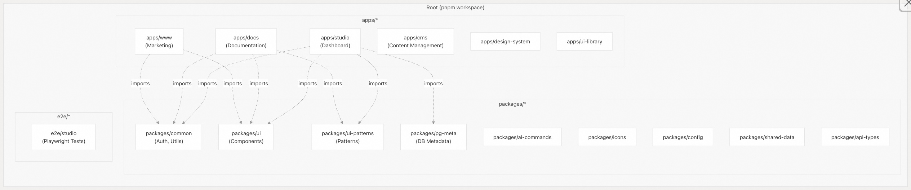
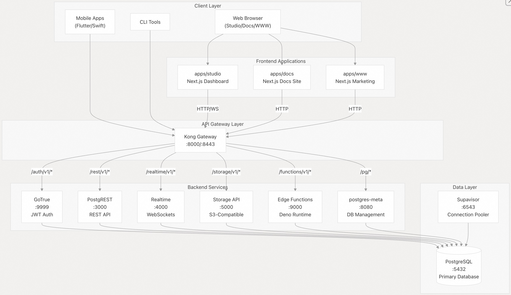
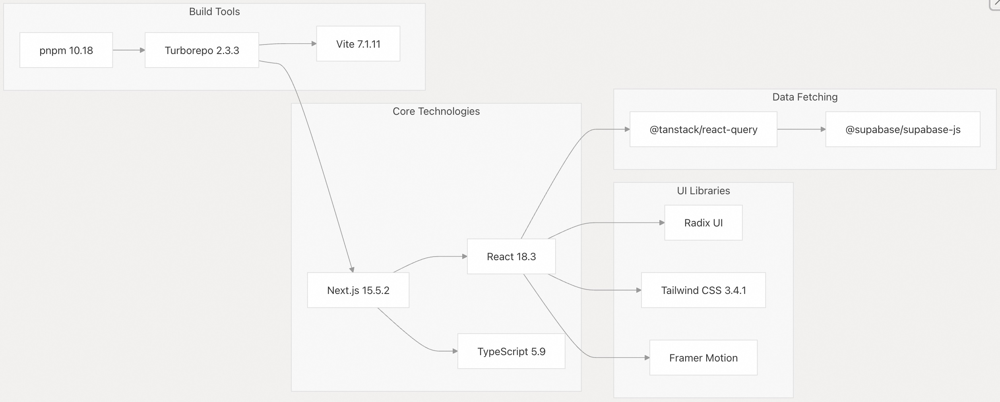
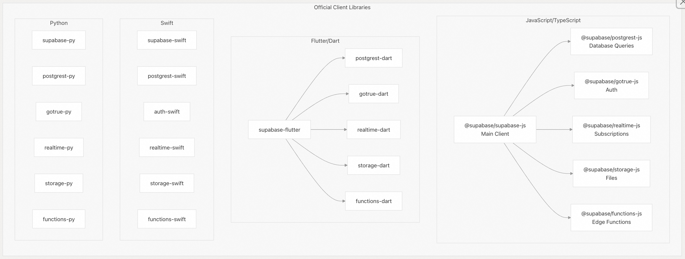
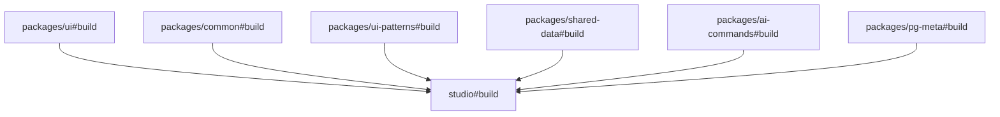

## Supabase 源码学习: 1 概览 (Overview)  
                                                
### 作者                                                
digoal                                                
                                                
### 日期                                                
2025-11-27                                                
                                                
### 标签                                                
Supabase , Firebase , 源码学习 , 后端即服务 , BaaS , backend platform , 后端平台 , 开源项目缝合 , 前端 , 后端 , 自动生成API , 数据库 , 包管理 , 日志                                                  
                                                
----                                                
                                                
## 背景      
本文档提供了对 Supabase **单一代码库** (monorepo)、其**架构** (architecture) 以及各个组件如何协同工作的高级介绍。Supabase 是一个**开源** (open-source) 的 **Firebase 替代方案** (Firebase alternative)，提供了一个基于 **PostgreSQL** 构建的完整**后端平台** (backend platform)。  
  
**范围 (Scope)** ：本页涵盖了代码库的总体结构和目的。有关特定子系统 (subsystems) 的详细信息，请参阅：  
  
  * 单一代码库 (Monorepo) 结构和构建系统 (build system)  
  * 技术栈 (Technology stack) 详情  
  * 前端应用 (Frontend applications)  
  * **自托管部署** (Self-hosted deployment)  
  * 共享包 (Shared packages)  
  
-----  
  
## 什么是 Supabase？  
  
Supabase 是一系列**开源工具** (open-source tools) 的组合，它们共同提供了类似 **Firebase** 的功能，并以企业级的 **PostgreSQL** 作为基础。该平台包括：  
  
  * **托管的 PostgreSQL 数据库** (Hosted PostgreSQL database)，提供完整的 SQL 访问  
  * 通过 **GoTrue** (**基于 JWT** (JSON Web Token) 的) 实现**认证和授权** (Authentication and authorization)  
  * **自动生成的 API** (**REST**、**GraphQL**、**实时订阅** (Realtime subscriptions))  
  * 具有 **S3 兼容接口** 的**文件存储** (File storage)  
  * 运行在 **Deno** 上的**边缘函数** (Edge Functions)  
  * 用于项目管理的**管理控制台** (Management dashboard)  
  
该系统设计为既可**托管** (**云** (cloud)) 又可**自托管** (self-hosted)，所有组件均以**开源软件** (open-source software) 的形式提供。  
  
**来源 (Sources)** :  
[`README.md` 1-61](https://github.com/supabase/supabase/blob/7490ca9e/README.md#L1-L61)  
[`apps/docs/public/humans.txt` 176-188](https://github.com/supabase/supabase/blob/7490ca9e/apps/docs/public/humans.txt#L176-L188)  
  
-----  
  
## 单一代码库 (Monorepo) 结构  
  
该仓库被组织为一个由 **Turborepo** **协调** (**orchestrated**) 的 **pnpm 工作区** (pnpm workspace) **单一代码库** (monorepo)。该工作区包含三种主要的**代码类别** (categories of code)：  
  
  
  
**关键工作区功能 (Key workspace features)** :  
  
| 功能 (Feature) | 实现 (Implementation) | 文件引用 (File Reference) |  
| :--- | :--- | :--- |  
| **包管理器** (Package manager) | pnpm 10.18+ | [`package.json` 66-70](https://github.com/supabase/supabase/blob/7490ca9e/package.json#L66-L70) |  
| **工作区定义** (Workspace definition) | `packages`、`apps`、`blocks`、`e2e` | [`pnpm-workspace.yaml` 1-5](https://github.com/supabase/supabase/blob/7490ca9e/pnpm-workspace.yaml#L1-L5) |  
| **依赖目录** (Dependency catalog) | **集中式版本管理** (Centralized version management) | [`pnpm-workspace.yaml` 7-24](https://github.com/supabase/supabase/blob/7490ca9e/pnpm-workspace.yaml#L7-L24) |  
| **构建协调** (Build orchestration) | **Turborepo 2.3.3** | [`package.json` 58](https://github.com/supabase/supabase/blob/7490ca9e/package.json#L58-L58) |  
| **单一代码库脚本** (Monorepo scripts) | **Build**、**dev**、**test**、**typecheck** | [`package.json` 8-46](https://github.com/supabase/supabase/blob/7490ca9e/package.json#L8-L46) |  
  
**来源 (Sources)** :  
[`pnpm-workspace.yaml` 1-60](https://github.com/supabase/supabase/blob/7490ca9e/pnpm-workspace.yaml#L1-L60)  
[`package.json` 1-71](https://github.com/supabase/supabase/blob/7490ca9e/package.json#L1-L71)  
[`README.md` 1-61](https://github.com/supabase/supabase/blob/7490ca9e/README.md#L1-L61)  
  
-----  
  
## 高级架构 (High-Level Architecture)  
  
Supabase 基于**客户端-服务器架构** (client-server architecture) 运行，其中**前端应用** (frontend applications) 通过 **Kong API 网关** (**Kong API Gateway**) 与**后端服务** (backend services) 进行通信。所有后端服务都连接到 **PostgreSQL**，将其作为**单一事实来源** (single source of truth)。  
  
### 系统架构图 (System Architecture Diagram)  
  
  
  
**核心架构原则 (Core architectural principles)** ：  
  
1.  **PostgreSQL 作为基础 (PostgreSQL as Foundation)** : 所有后端服务都从**单一**的 **PostgreSQL 实例** 进行读/写操作  
2.  **Kong 作为网关 (Kong as Gateway)** : 单一的**入口点** (**ingress point**) 处理**路由** (routing)、**认证** (authentication) 和**速率限制** (rate limiting)  
3.  **模块化服务 (Modular Services)** : 每个服务处理一个特定的关注点 (**认证** (auth)、**存储** (storage)、**实时** (realtime) 等)  
4.  **开源技术栈 (Open Source Stack)** : 所有组件均使用 **MIT/Apache 2 许可** 的**开源工具** (open-source tools)  
  
**来源 (Sources)** :  
[`README.md` 42-61](https://github.com/supabase/supabase/blob/7490ca9e/README.md#L42-L61)  
  
  
-----  
  
## 技术栈 (Technology Stack)  
  
### 前端技术栈 (Frontend Stack)  
  
前端应用使用现代 **JavaScript/TypeScript** 工具构建：  
  
  
  
**关键依赖 (Key dependencies)** (**通过 pnpm 目录集中管理** (centralized via pnpm catalog))：  
  
| 包 (Package) | 版本 (Version) | 目的 (Purpose) |  
| :--- | :--- | :--- |  
| `next` | ^15.5.2 | **带有 SSR/SSG** (**服务器端渲染**/**静态站点生成**) 的 **React 框架** |  
| `react` | ^18.3.0 | **UI 库** |  
| `typescript` | \~5.9.0 | **类型安全** (Type safety) |  
| `tailwindcss` | 3.4.1 | **实用至上** (**Utility-first**) 的 **CSS** |  
| `vite` | ^7.1.11 | **快速构建工具** (Fast build tool) |  
| `vitest` | ^3.2.0 | **单元测试** (Unit testing) |  
  
**来源 (Sources)** :  
[`pnpm-workspace.yaml` 7-24](https://github.com/supabase/supabase/blob/7490ca9e/pnpm-workspace.yaml#L7-L24)  
[`pnpm-lock.yaml` 7-59](https://github.com/supabase/supabase/blob/7490ca9e/pnpm-lock.yaml#L7-L59)  
  
### 后端技术栈 (Backend Stack)  
  
后端服务是**多语言** (**polyglot**) 的，针对每个任务使用最佳工具：  
  
| 服务 (Service) | 语言/运行时 (Language/Runtime) | 目的 (Purpose) | 仓库 (Repository) |  
| :--- | :--- | :--- | :--- |  
| **PostgreSQL** | **C** | **主数据库** (Primary database) | [postgresql.org](https://www.postgresql.org/) |  
| **PostgREST** | **Haskell** | **自动生成的 REST API** | [`postgrest/postgrest`](https://github.com/supabase/supabase/blob/7490ca9e/postgrest/postgrest) |  
| **GoTrue** | **Go** | **基于 JWT 的认证** | [`supabase/gotrue`](https://github.com/supabase/supabase/blob/7490ca9e/supabase/gotrue) |  
| **Realtime** | **Elixir/Phoenix** | **WebSocket 服务器** | [`supabase/realtime`](https://github.com/supabase/supabase/blob/7490ca9e/supabase/realtime) |  
| **Storage** | **Node.js** | **S3 兼容的文件存储** | [`supabase/storage-api`](https://github.com/supabase/supabase/blob/7490ca9e/supabase/storage-api) |  
| **边缘函数** (Edge Functions) | **Deno** | **无服务器函数** (Serverless functions) | [`supabase/edge-runtime`](https://github.com/supabase/supabase/blob/7490ca9e/supabase/edge-runtime) |  
| **postgres-meta** | **Node.js** | **数据库内省 API** (Database introspection API) | [`supabase/postgres-meta`](https://github.com/supabase/supabase/blob/7490ca9e/supabase/postgres-meta) |  
| **Kong** | **Lua/OpenResty** | **API 网关** (API gateway) | [`Kong/kong`](https://github.com/supabase/supabase/blob/7490ca9e/Kong/kong) |  
  
**来源 (Sources)** :  
[`README.md` 53-61](https://github.com/supabase/supabase/blob/7490ca9e/README.md#L53-L61)  
[`apps/docs/public/humans.txt` 180-187](https://github.com/supabase/supabase/blob/7490ca9e/apps/docs/public/humans.txt#L180-L187)  
  
-----  
  
## 认证流程 (Authentication Flow)  
  
Supabase 使用**两层认证系统** (two-tier authentication system)：由 **Kong** 验证的 **API 密钥** (API keys) 和由**各个服务**验证的 **JWT**。  
  
  
  
**关键认证组件 (Key authentication components)** ：  
  
  * **gotrueClient**: 在 [`packages/common/gotrue.ts` 217-227](https://github.com/supabase/supabase/blob/7490ca9e/packages/common/gotrue.ts#L217-L227) 中配置的**单例** (`Singleton`) `AuthClient` **实例** (instance)  
  * **STORAGE\_KEY**: **可配置的存储密钥** (Configurable storage key)，默认为 `"supabase.dashboard.auth.token"` [`packages/common/gotrue.ts` 3](https://github.com/supabase/supabase/blob/7490ca9e/packages/common/gotrue.ts#L3-L3)  
  * **Navigator Locks API**: 防止在**多标签页场景** (**multi-tab scenarios**) 中出现**竞态条件** (**race conditions**) [`packages/common/gotrue.ts` 31-43](https://github.com/supabase/supabase/blob/7490ca9e/packages/common/gotrue.ts#L31-L43)  
  * **调试日志** (**Debug logging**): **可选的**、**基于 IndexedDB** 的**调试日志** [`packages/common/gotrue.ts` 47-116](https://github.com/supabase/supabase/blob/7490ca9e/packages/common/gotrue.ts#L47-L116)  
  
**来源 (Sources)** :  
[`packages/common/gotrue.ts` 1-230](https://github.com/supabase/supabase/blob/7490ca9e/packages/common/gotrue.ts#L1-L230)  
[`apps/studio/lib/gotrue.ts` 1-150](https://github.com/supabase/supabase/blob/7490ca9e/apps/studio/lib/gotrue.ts#L1-L150)  
认证流程图 (Authentication diagram from prompt)  
  
-----  
  
## 客户端库 (Client Library) 架构  
  
Supabase 提供**跨多种语言**的**模块化客户端库** (modular client libraries)。每个库都遵循一致的模式，即**主客户端** (main client) 捆绑**特定功能**的**子库** (sub-libraries)。  
  
  
  
**模块化方法 (Modular approach) 的优势**：  
  
1.  **独立子库** (Standalone sub-libraries): 每个功能客户端都可以**独立**使用  
2.  **版本同步** (Version synchronization): **目录** (Catalog) 确保版本一致性 [`pnpm-workspace.yaml` 8-11](https://github.com/supabase/supabase/blob/7490ca9e/pnpm-workspace.yaml#L8-L11)  
3.  **社区支持** (Community support): 相同的模式被复制到**社区库** (**C\#**、**Go**、**Java**、**Kotlin**、**Ruby**、**Rust**)  
  
**来源 (Sources)** :  
[`README.md` 62-199](https://github.com/supabase/supabase/blob/7490ca9e/README.md#L62-L199)  
[`pnpm-workspace.yaml` 7-11](https://github.com/supabase/supabase/blob/7490ca9e/pnpm-workspace.yaml#L7-L11)  
  
-----  
  
## 包管理 (Package Management)  
  
该**单一代码库** (monorepo) 使用 **pnpm 工作区** (**pnpm workspaces**) 和**集中式依赖目录** (**centralized dependency catalog**) 来确保所有应用之间的**版本一致性** (version consistency)。  
  
  
  
**目录条目 (Catalog entries)** 位于 [`pnpm-workspace.yaml` 7-24](https://github.com/supabase/supabase/blob/7490ca9e/pnpm-workspace.yaml#L7-L24) 中：  
  
  * Supabase 客户端：`@supabase/auth-js`、`@supabase/supabase-js`、`@supabase/postgrest-js`、`@supabase/realtime-js`  
  * 核心框架：`next`、`react`、`react-dom`、`typescript`、`vite`、`vitest`  
  * 类型定义 (Type definitions)：`@types/node`、`@types/react`、`@types/react-dom`  
  * 实用工具 (Utilities)：`tailwindcss`、`tsx`、`valtio`、`zod`  
  
**Usage pattern** in package.json files:  
  
```  
{  
  "dependencies": {  
    "next": "catalog:",  
    "react": "catalog:"  
  }  
}  
```  
  
**来源 (Sources)** :  
[`pnpm-workspace.yaml` 7-24](https://github.com/supabase/supabase/blob/7490ca9e/pnpm-workspace.yaml#L7-L24)  
[`apps/studio/package.json` 102](https://github.com/supabase/supabase/blob/7490ca9e/apps/studio/package.json#L102-L102)  
[`apps/docs/package.json` 92](https://github.com/supabase/supabase/blob/7490ca9e/apps/docs/package.json#L92-L92)  
  
-----  
  
## 开发工作流 (Development Workflow)  
  
**单一代码库** (monorepo) 为常见的**开发任务** (development tasks) 提供了**统一的脚本** (unified scripts)：  
  
| 命令 (Command) | 目的 (Purpose) | Turborepo 范围 (Scope) |  
| :--- | :--- | :--- |  
| `pnpm dev` | **并行启动所有应用** | `turbo run dev --parallel` |  
| `pnpm build` | **构建所有包和应用** | `turbo run build` |  
| `pnpm typecheck` | **对所有 TypeScript 进行类型检查** | `turbo --continue typecheck` |  
| `pnpm test:*` | **运行特定应用的测试** | **通过应用名称过滤** |  
| `pnpm format` | **使用 Prettier 格式化所有代码** | **直接执行 prettier** |  
  
**每个应用的命令** (**Per-application commands**) 遵循一致的模式：  
  
  * `pnpm dev:studio` → 仅运行 `apps/studio`  
  * `pnpm build:docs` → 仅构建 `apps/docs`  
  * `pnpm test:ui` → 仅测试 `packages/ui`  
  
**构建先决条件** (**Build prerequisites**) (**代码生成** (code generation))：  
  
  * **Docs**: **GraphQL 模式** (**schema**) + **类型** (**types**)，**OpenAPI 规范** (**specs**)，**contentlayer 构建** [`apps/docs/package.json` 28-29](https://github.com/supabase/supabase/blob/7490ca9e/apps/docs/package.json#L28-L29)  
  * **Studio**: **GraphQL 类型**，**Deno 类型** [`apps/studio/package.json` 24-25](https://github.com/supabase/supabase/blob/7490ca9e/apps/studio/package.json#L24-L25)  
  
**来源 (Sources)** :  
[`package.json` 8-46](https://github.com/supabase/supabase/blob/7490ca9e/package.json#L8-L46)  
[`apps/docs/package.json` 6-42](https://github.com/supabase/supabase/blob/7490ca9e/apps/docs/package.json#L6-L42)  
[`apps/studio/package.json` 5-25](https://github.com/supabase/supabase/blob/7490ca9e/apps/studio/package.json#L5-L25)  
  
-----  
  
## 团队结构 (Team Structure)  
  
Supabase 是一个 **100% 远程办公** (**remote team**) 的团队，约有 **165 名成员**，详情记录在 [`apps/docs/public/humans.txt` 1-167](https://github.com/supabase/supabase/blob/7490ca9e/apps/docs/public/humans.txt#L1-L167) 中。该团队结构支持**开源开发** (**open-source development**)，贡献者包括**全职团队成员** (**full-time team members**) 和**更广泛的社区** (**broader community**)。  
  
**对该单一代码库 (monorepo) 的主要贡献者 (Key contributors)** ：  
  
  * 前端应用 (**Studio**、**Docs**、**WWW**)  
  * **共享包维护** (Shared package maintenance)  
  * **设计系统开发** (Design system development)  
  * **测试基础设施** (Testing infrastructure)  
  * **文档** (Documentation)  
  
对于**外部贡献者** (**external contributors**)，请参阅 Getting Started 以获取**贡献指南** (contribution guidelines)。  
  
**来源 (Sources)** :  
[`apps/docs/public/humans.txt` 1-171](https://github.com/supabase/supabase/blob/7490ca9e/apps/docs/public/humans.txt#L1-L171)  
[`README.md` 33](https://github.com/supabase/supabase/blob/7490ca9e/README.md#L33-L33)  
  
-----  
  
## 快速参考 (Quick Reference)  
  
**仓库 URL (Repository URL)** : [https://github.com/supabase/supabase](https://github.com/supabase/supabase)  
  
**使用的核心技术 (Core Technologies Used)** ：  
  
  * Next.js 15.5.2, React 18.3, TypeScript 5.9  
  * PostgreSQL, PostgREST, GoTrue, Realtime, Kong  
  * pnpm 10.18, Turborepo 2.3.3, Vite 7.1.11  
  
**主要应用 (Main Applications)** ：  
  
  * `apps/studio` - **控制台** (Dashboard) (Next.js)  
  * `apps/docs` - **文档** (Documentation) (Next.js + MDX)  
  * `apps/www` - **营销** (Marketing) (Next.js)  
  
**关键共享包 (Key Shared Packages)**：  
  
  * `packages/common` - **认证客户端** (Auth client)，**实用工具** (utilities)  
  * `packages/ui` - **核心组件库** (Core component library)  
  * `packages/ui-patterns` - **复杂 UI 模式** (Complex UI patterns)  
  
**来源 (Sources)** :  
[`README.md` 1-289](https://github.com/supabase/supabase/blob/7490ca9e/README.md#L1-L289)  
[`package.json` 1-71](https://github.com/supabase/supabase/blob/7490ca9e/package.json#L1-L71)  
[`pnpm-workspace.yaml` 1-60](https://github.com/supabase/supabase/blob/7490ca9e/pnpm-workspace.yaml#L1-L60)  
  
  
  
-----  
  
# 附录1: 【架构师/运维视角】异构服务集群的运维挑战  
  
**背景痛点：** Supabase 后端是一个复杂且**多语言的 (polyglot)** **模块化服务 (Modular Services)** 组合（GoTrue/Go、Realtime/Elixir、Storage/Node.js），并由 **Kong API 网关**统一管理。在**自托管部署 (Self-Hosted Deployment)** 场景（Section 3）中，管理这种异构系统在日常维护中会面临巨大的运维挑战。  
  
**关键问题：**  
结合 Supabase 的多语言后端技术栈和 **Docker Compose 架构**，在**自托管**环境下，如何有效实现统一的**可观察性 (Observability)** （日志、指标、追踪）？特别是，Supabase 社区或官方是如何确保这些独立服务（如 GoTrue 和 Realtime）之间的**版本兼容性**和**依赖管理**，以保证日常**组件升级**的平滑性，并解决大型分布式系统的**故障排除**痛点？  
  
## 回答  
  
## 统一可观察性实现  
  
Supabase在自托管环境中通过**Vector + Logflare**架构实现统一可观察性：  
  
### 日志收集架构  
- **Vector**作为日志管道，收集所有Docker容器的日志并通过Docker socket访问`/var/run/docker.sock`    
- **Logflare**作为分析服务器，处理日志存储和查询，支持PostgreSQL和BigQuery两种后端    
  
### 服务日志标准化  
每个服务的日志都通过Vector进行特定转换：  
- Kong日志：使用Nginx格式解析请求/响应详情  
- Auth日志：结构化JSON格式  
- Realtime日志：基于严重性级别  
- Storage日志：包含租户信息的JSON结构    
  
## 版本兼容性与依赖管理  
  
### Docker镜像版本管理  
所有服务版本在`docker-compose.yml`中明确定义：  
```yaml  
studio:  
  image: supabase/studio:2025.10.27-sha-85b84e0  
auth:  
  image: supabase/gotrue:v2.177.0  
realtime:  
  image: supabase/realtime:v2.34.47  
```    
  
### 服务依赖管理  
通过Docker Compose的`depends_on`和健康检查确保服务启动顺序：  
- Studio依赖Analytics服务健康状态    
- 每个服务都配置了健康检查机制    
  
### 升级策略  
官方建议通过以下步骤进行平滑升级：  
1. 更新`docker-compose.yml`中的镜像版本  
2. 运行`docker compose pull`获取新镜像  
3. 使用`docker compose up -d`重启服务    
  
## 故障排除机制  
  
### 统一日志查看  
所有服务日志通过Studio界面统一查看，利用Logflare的查询功能进行日志分析    
  
### 生产环境建议  
- 使用独立PostgreSQL数据库存储Logflare数据，避免影响主数据库    
- 生产环境推荐使用BigQuery后端以获得更好的性能和查询体验    
- 定期轮换加密密钥以确保安全性    
  
## Notes  
  
- Supabase的可观察性架构依赖于Vector和Logflare的集成，这在自托管环境中提供了与云平台相似的日志体验  
- 版本兼容性通过Docker镜像标签管理，但跨服务版本兼容性需要参考官方发布说明  
- 故障排除主要通过统一的日志界面实现，但分布式系统的追踪能力相对有限  
- 生产环境的可观察性配置需要额外的安全性和性能考虑  
  
  
  
-----  
  
# 附录2: 【开发者/安全视角】基于 JWT 的数据隔离机制  
  
**背景痛点：** **PostgreSQL** 是 Supabase 的**单一事实来源 (Single Source of Truth)** ，而 **GoTrue** 负责**身份验证**并颁发 **JWT**。在 BaaS (Backend-as-a-Service) 模型中，确保用户只能访问到自己的数据（**数据隔离**）是绝对核心的安全要求。  
  
**关键问题：**  
开发者通过客户端库获取 **JWT** 后，**PostgREST** 如何在访问数据库时，高效且可靠地解析和利用 **JWT** 中包含的用户或角色信息？请具体说明这与 **PostgreSQL** 的**行级安全 (RLS, Row-Level Security)** 策略是如何紧密结合并被强制执行的，以及这种机制对于保障多租户应用中**数据隐私**和**授权**的性能影响如何？  
  
## 回答  
  
## 核心机制概述  
  
PostgREST通过JWT中的`role`声明设置PostgreSQL会话角色，并利用PostgreSQL的`auth.uid()`和`auth.jwt()`函数在RLS策略中提取用户身份信息，实现数据库层面的行级访问控制  。  
  
---  
  
## JWT解析与角色映射  
  
### JWT结构  
Supabase JWT包含关键声明：  
- `role`: PostgreSQL角色（`anon`、`authenticated`、`service_role`）    
- `sub`: 用户唯一标识符  
- `exp`: 过期时间  
- 自定义声明：存储在`app_metadata`中的授权数据  
  
### PostgREST处理流程  
1. **JWT验证**：PostgREST验证JWT签名和过期时间    
2. **角色设置**：提取`role`声明并执行`SET ROLE <role_name>`  
3. **上下文注入**：将JWT内容注入PostgreSQL会话变量  
  
## RLS策略执行机制  
  
### 辅助函数  
PostgreSQL提供两个关键函数：  
- `auth.uid()`：返回当前用户UUID    
- `auth.jwt()`：返回完整JWT对象，可访问自定义声明    
  
### 策略示例  
```sql  
-- 用户数据隔离  
CREATE POLICY "用户只能访问自己的数据" ON documents   
FOR SELECT TO authenticated   
USING ((SELECT auth.uid()) = user_id);  
  
-- 多租户隔离  
CREATE POLICY "租户访问控制" ON customers   
FOR SELECT TO authenticated   
USING (tenant_id = (auth.jwt() ->> 'tenant_id')::uuid);  
```    
  
## 性能影响与优化  
  
### 性能挑战  
RLS策略对每行数据执行，可能导致：  
- 全表扫描时性能下降  
- 函数重复调用开销  
- 复杂JOIN查询性能问题    
  
### 关键优化策略  
  
#### 1. 索引优化  
为策略条件中的列创建索引：  
```sql  
CREATE INDEX idx_documents_user_id ON documents(user_id);  
CREATE INDEX idx_customers_tenant_id ON customers(tenant_id);  
```    
  
#### 2. 函数包装优化  
使用`SELECT`包装函数调用，利用PostgreSQL查询计划缓存：  
```sql  
-- 优化前  
USING (auth.uid() = user_id)  
  
-- 优化后    
USING ((SELECT auth.uid()) = user_id)  
```  
性能提升可达99.94%    
  
#### 3. 避免JOIN  
优先使用子查询而非表连接：  
```sql  
-- 推荐  
USING (team_id IN (SELECT team_id FROM user_teams WHERE user_id = auth.uid()))  
  
-- 避免  
USING (EXISTS (SELECT 1 FROM user_teams ut WHERE ut.team_id = t.team_id AND ut.user_id = auth.uid()))  
```    
  
## 多租户数据隔离实现  
  
### 基于租户ID的隔离  
```sql  
-- 启用RLS  
ALTER TABLE customers ENABLE ROW LEVEL SECURITY;  
  
-- 创建安全辅助函数  
CREATE OR REPLACE FUNCTION get_user_tenant() RETURNS uuid   
LANGUAGE sql SECURITY DEFINER STABLE AS $$  
  SELECT tenant_id FROM user_profiles WHERE auth_user_id = auth.uid();  
$$;  
REVOKE EXECUTE ON FUNCTION get_user_tenant() FROM anon, authenticated;  
  
-- 租户隔离策略  
CREATE POLICY "租户读取" ON customers FOR SELECT TO authenticated   
USING (tenant_id = get_user_tenant());  
```    
  
### 基于角色的访问控制  
利用JWT自定义声明实现RBAC：  
```sql  
-- 从JWT提取角色信息  
CREATE POLICY "管理员访问" ON sensitive_data FOR SELECT TO authenticated   
USING ((auth.jwt() ->> 'user_role') = 'admin');  
  
-- 多角色支持  
CREATE POLICY "多角色访问" ON documents FOR SELECT TO authenticated   
USING ((auth.jwt() ->> 'user_role') = ANY(ARRAY['admin','editor','viewer']));  
```    
  
## 安全保障机制  
  
### 默认拒绝策略  
启用RLS后，默认拒绝所有访问直到明确授权  。  
  
### MFA强制执行  
通过JWT中的`aal`声明强制多因素认证：  
```sql  
CREATE POLICY "强制MFA" ON sensitive_operations   
AS RESTRICTIVE TO authenticated   
USING ((SELECT auth.jwt()->>'aal') = 'aal2');  
```    
  
## Notes  
  
- PostgREST配置需要设置`PGRST_JWT_SECRET`以验证JWT签名    
- Edge Functions也可以通过传递Authorization头利用相同的RLS机制    
- Studio支持角色切换和用户模拟功能，便于测试RLS策略    
  
  
  
-----  
  
# 附录3: 【开发效率视角】大型 Monorepo 的性能与协作效率  
  
**背景痛点：** Supabase 采用 **pnpm 工作区 (pnpm workspaces)** 配合 **Turborepo**（Section 1.1, 7）来管理其大型**单体仓库 (monorepo)** 。随着代码库规模的增长，前端应用（Studio, Docs）和共享包的**构建 (build)** 和**类型检查 (typecheck)** 任务很容易成为日常开发中的**速度瓶颈**。  
  
**关键问题：**  
作为核心贡献者，Turborepo 的**远程/本地缓存 (caching)** 机制是如何在 Supabase 的**开发工作流程 (Development Workflow)** 中被精确配置和利用的？除了缓存，Supabase 如何利用 Turborepo 的**任务编排**能力来优化跨包的**依赖图 (dependency graph)** ，从而显著提升核心开发脚本（如 `pnpm build` 和 `pnpm typecheck`）的并行执行效率，解决大型 monorepo 的**构建延迟**问题？  
  
  
## 回答  
  
  
## Turborepo 在 Supabase Monorepo 中的缓存与任务编排配置  
  
Supabase 通过精确配置 Turborepo 的缓存机制和任务依赖图来优化大型 monorepo 的构建性能。  
  
### 缓存机制配置  
  
**核心缓存配置**在 `turbo.json` 中定义，针对 Studio 应用的构建任务：  
  
```json  
{  
  "studio#build": {  
    "dependsOn": ["^build"],  
    "outputs": [".next/**", "!.next/cache/**"],  
    "env": [...83个环境变量...],  
    "passThroughEnv": ["CURRENT_CLI_VERSION", "VERCEL_GIT_COMMIT_SHA"]  
  }  
}  
```  
  
**缓存策略要点**：  
- **依赖追踪**：`"dependsOn": ["^build"]` 确保所有工作区包先构建    
- **输出缓存**：缓存 `.next/**` 除缓存目录外的所有文件    
- **环境隔离**：83个环境变量确保构建可重现性    
  
### 任务依赖图优化  
  
**构建依赖链**：  

  
**并行执行配置**：  
- 根脚本使用 `--parallel` 标志最大化并行度    
- 类型检查使用 `--continue` 确保所有包都被检查    
  
### 开发工作流集成  
  
**本地开发**：  
```bash  
pnpm build        # 执行所有包的构建  
pnpm build:studio # 仅构建 Studio 应用  
pnpm typecheck    # 并行类型检查所有包  
```  
  
**CI/CD 优化**：  
- GitHub Actions 使用 `pnpm exec turbo run typecheck` 进行类型检查    
- 使用更大的 runner（blacksmith-4vcpu）减少构建时间    
  
### 性能优化策略  
  
**构建分离**：  
- TypeScript 类型检查与构建分离：`ignoreBuildErrors: true`    
- 独立的 `typecheck` 脚本运行 `tsc --noEmit`    
  
**缓存优化**：  
- CDN 资源上传：构建后自动上传静态资源到 S3    
- Docker 构建使用 `turbo prune` 优化依赖    
  
## Notes  
  
- Turborepo 版本锁定在 2.3.3    
- 所有应用都强制使用 pnpm 作为包管理器    
- Studio 应用使用 Next.js 15.5.2 的 standalone 输出模式    
  
  
    
#### [PolarDB 学习图谱](https://www.aliyun.com/database/openpolardb/activity "8642f60e04ed0c814bf9cb9677976bd4")
  
  
#### [PostgreSQL 解决方案集合](../201706/20170601_02.md "40cff096e9ed7122c512b35d8561d9c8")
  
  
#### [德哥 / digoal's Github - 公益是一辈子的事.](https://github.com/digoal/blog/blob/master/README.md "22709685feb7cab07d30f30387f0a9ae")
  
  
#### [About 德哥](https://github.com/digoal/blog/blob/master/me/readme.md "a37735981e7704886ffd590565582dd0")
  
  

  
