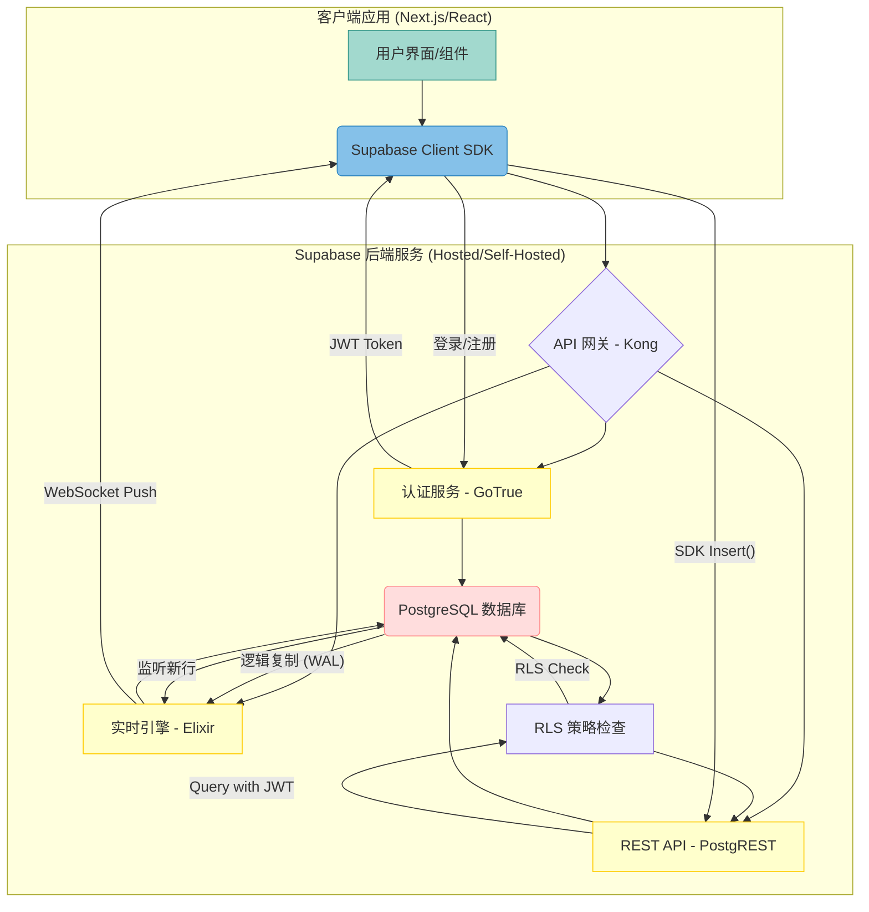

## 辩论话题: Supabase “开源大礼包”是革新, 还是自设的运维陷阱?    
                                                                  
### 作者                                                                  
digoal                                                                  
                                                                  
### 日期                                                                  
2025-11-27                                                                  
                                                                  
### 标签                                                                  
真理越辩越明 , 水越搅越浑 , 别打太极 , 辩论话题 , AI                                                                      
                                                                  
----                                                                  
                                                                  
## 背景    
Supabase “开源大礼包”是革新, 还是自设的运维陷阱?     
  
Supabase 敢于挑战 Firebase，依靠 **PostgreSQL** 作为核心，但在其**后端服务集群 (Modular Services)** 中，使用了 **Go** (GoTrue)、**Elixir** (Realtime)、**Node.js** (Storage/Meta) 等多种语言，并通过 **Kong API 网关**进行统一路由。这种**异构技术栈 (Polyglot Stack)** 是否为用户和架构师带来了无法承受的运维复杂性？  
  
这是一个极具争议的话题，它直指 Supabase 的核心设计哲学与实际运维成本之间的矛盾。  
  
## 💥 正方立场：创新之光，为功能而生！  
  
对方辩友！我们的立场旗帜鲜明：Supabase 的**多语言模块化架构是深思熟虑的工程创新！** 对方辩友总盯着那些小小的运维挑战，却忽略了这种设计带来的**巨大战略优势**！  
  
请看，Supabase 的目标是取代 Firebase，它绝不能用“一把锤子敲所有钉子”！我们的架构正是**工程的优雅体现**：  
  
1.  **性能针对性优化！** Realtime 服务用 Elixir，利用其强大的 **Erlang VM 并发性**来处理数百万 WebSocket 连接，这是 Node.js 或 Go 难以比拟的！GoTrue 用 Go 保证了 **JWT 认证的速度和安全**！这叫**用最锋利的刀，割最需要的肉！**  
2.  **核心稳定压倒一切！** 对方说复杂，我们说稳固！将认证、实时、存储等**核心关注点 (concerns)** 彻底解耦，意味着一个组件宕机不会拖垮整个平台。**PostgreSQL** 作为**单一事实来源 (SSoT)** ，更是提供了企业级的**数据完整性**和**原子性**！  
3.  **自托管是能力的体现！** 既然所有组件都是开源的，架构师就拥有**完全的自由和掌控权**！诚然，这需要更高的技术投入，但这是获得**云厂商中立**和**深度定制化能力**的必然代价！我们卖的是**全套武器库**，而不是一个只能在云端使用的黑箱！  
  
一句话总结：为了达成 Firebase 级别的**全套功能 (feature parity)** ，同时保持开源的**技术开放性**，这种异构架构是**最优解，不是妥协！** 对方辩友难道想让客户用一套性能平庸的单体应用来托管他们的未来吗？简直是开倒车！  
  
## 🔪 反方立场：运维陷阱，自托管的隐形杀手！  
  
对方辩友！请停止你们对“工程优雅”的浪漫幻想！我们必须直面残酷的**现实成本**！我们的观点很明确：**这种多语言集群是自设的运维陷阱，它将 BaaS 的简洁承诺彻底复杂化！**  
  
对方辩友只看到组件的优点，却忽略了组件之间的**摩擦和损耗**！  
  
1.  **调试地狱与人才高墙！** 想象一下，一个自托管的用户遇到认证失败。他需要具备 Go、Elixir、Node.js 的**全栈调试技能**！请求流要经过 Kong -> GoTrue -> PostgREST -> PostgreSQL，**任何一个环节出问题，都是跨语言、跨框架的灾难！** 这种**人才成本**和**故障排除难度**，完全违背了 BaaS 追求的“简易开发”初衷！  
2.  **版本同步的噩梦！** 对方声称组件独立，但它们必须严格配合！GoTrue 更新了 JWT 结构，Realtime 和 PostgREST 能立即同步兼容吗？我们在**关键问题 1** 中已指出，异构集群的**版本兼容性**和**升级难度**是巨大的**运维痛点**！**Turborepo** 只能管理代码，却管不了**生产环境中的服务同步！**  
3.  **核心优势被复杂性稀释！** Supabase 的核心价值在于 **PostgreSQL + RLS**。这种多语言的复杂性，大大提升了部署门槛，让许多本想“简单自托管”的用户望而却步，**最终只能依赖官方托管**，那它和任何云服务商又有什么区别？  
  
请正视，技术栈的**多样性 (Diversity)** 在生产环境中就等于**欠债 (Debt)** ！这种架构用理论上的“最优性能”换来了实际运维中的**最高风险和最高成本**！  
  
  
# 附录: 了解 Supabase   
  
---  
  
## 1 Supabase 的实际用户案例, 用Supabase开发了什么业务? 体现了Supabase的什么优势?  
  
### 案例一：高并发、实时协作应用  
  
| 业务/公司名称 | 实时聊天、协作工具、数据看板 |  
| :--- | :--- |  
| **实际用户** | Fixtured (体育日历应用)、Vibeo (客户视频推荐平台) 等 |  
| **开发的业务** | 需要**即时数据更新**、**多用户并发**和**实时同步**的平台。例如，一个团队协作的看板，当一位用户移动卡片时，所有其他用户需立即看到变化。 |  
| **体现的能力** | **Realtime Engine (实时引擎)** |  
| **细节与价值** | 1.  **PostgreSQL 驱动的实时性：** 利用 **PostgreSQL 的逻辑复制**功能，配合 Supabase 的 Realtime Engine (基于 Elixir)，实现对数据库表中数据变化的实时监听。  
| | 2.  **简单 API 调用：** 开发者无需部署和管理消息队列或 WebSocket 服务器，只需通过客户端 SDK 订阅表变化即可。  
| | 3.  **高并发处理：** Elixir/Phoenix 的强大并发能力保障了大量客户端同时在线时的连接稳定性和低延迟。 |  
  
### 案例二：SaaS 平台的用户安全与数据隔离  
  
| 业务/公司名称 | B2B SaaS 平台、金融服务应用 |  
| :--- | :--- |  
| **实际用户** | Replenysh (循环经济平台)、Quilia 等 |  
| **开发的业务** | 涉及敏感数据和多租户架构的 SaaS 平台，需要严格区分不同用户的访问权限，并提供企业级**身份验证**。 |  
| **体现的能力** | **Auth (GoTrue) + Row-Level Security (RLS)** |  
| **细节与价值** | 1.  **快速认证实现：** 利用 **Supabase Auth (GoTrue)** 快速实现包括邮箱/密码、OAuth (社交登录) 和 **OTP (短信/邮件一次性密码)** 等多种复杂的认证方式。Replenysh 团队在不到 24 小时内完成了短信 OTP 的实施。  
| | 2.  **无中间件安全保障：** 利用 **JWT** 将用户身份信息传递给数据库，并直接在 **PostgreSQL** 层面通过 **RLS** 策略对数据行进行访问控制。这消除了在应用层编写复杂权限逻辑的需要，极大提升了**数据隔离的严谨性**和**开发效率**（Quilia 报告节省了 75% 的开发时间）。 |  
  
### 案例三：AI 应用与后端逻辑自动化  
  
| 业务/公司名称 | AI 驱动的工具、AI 图像生成器 |  
| :--- | :--- |  
| **实际用户** | E2B (AI 驱动开发)、Bootstrapped AI 应用创始人 |  
| **开发的业务** | 需要运行轻量级后端逻辑、处理大型文件存储或与外部 AI/ML 服务集成的应用。 |  
| **体现的能力** | **Edge Functions (Deno) + Vector Embeddings** |  
| **细节与价值** | 1.  **边缘计算与集成：** 利用 **Edge Functions (基于 Deno)** 快速编写和部署无服务器函数，用于处理支付钩子 (Stripe webhooks)、数据预处理或调用外部 AI API (如 OpenAI)。  
| | 2.  **向量数据库能力：** 利用 PostgreSQL 的 **pgvector** 扩展，将数据库直接转化为**向量数据库**。这使得 AI 应用能够轻松实现**语义搜索 (Semantic Search)** 和 RAG (检索增强生成) 功能，无需引入额外的数据库组件。  
| | 3.  **统一的数据存储：** 配合 **Supabase Storage** (S3 兼容)，可以安全地存储用户上传的图片、视频和 AI 模型输出。 |  
  
  
---  
  
## 2 开发者如何使用 Supabase?  
  
对于开发者而言，使用 Supabase 的流程既高效又直观，因为它将数据库、API、认证等后端服务打包成了一个统一的平台。  
  
以下是开发者使用 Supabase 的核心步骤、工具和交互方式：  
  
### 🛠️ 第一步：环境配置与项目创建  
  
1.  **创建项目 (Setup):**  
    * 在 **Supabase Studio**（Web 控制台）上创建一个新项目。  
    * Supabase 会自动为您配置一个**托管的 PostgreSQL 数据库**和所有后端服务（Auth、Storage、Realtime 等）。  
2.  **获取凭证 (Credentials):**  
    * 从项目设置中获取 **API URL** 和 **Anon Key**（用于客户端访问的公共密钥）。  
    * 开发者将这些凭证配置到前端或客户端应用中，通常使用环境变量。  
3.  **安装 SDK (Client Library):**  
    * 在项目中安装 Supabase 提供的 SDK（例如 `supabase-js`），它是连接和操作所有服务的统一接口。  
  
### 💡 第二步：数据建模与 API 交互  
  
这是开发者日常使用 Supabase 的核心环节。  
  
#### 1. 数据建模 (Schema Management)  
* **在 Studio 中设计：** 开发者可以直接在 **Supabase Studio** 的表格编辑器中创建表、定义列、设置关系和约束，就像操作一个可视化的数据库客户端一样。  
* **使用 CLI 进行版本控制：** 对于专业的协作开发，开发者会使用 **Supabase CLI**（命令行工具）来生成和应用 **Migration Files (数据库迁移文件)** ，从而将数据库的 schema 变更纳入 Git 版本控制。  
  
#### 2. 自动 API 访问 (PostgREST)  
* 一旦表创建完成，**PostgREST** 会**自动**根据表结构生成相应的 **RESTful API 接口**。  
* 开发者无需编写任何后端代码，即可通过 HTTP 请求对数据进行 **CRUD** (创建、读取、更新、删除) 操作。  
  
#### 3. 使用 SDK 进行数据操作  
开发者使用 SDK 提供的链式调用方法来执行数据查询，这比直接使用原始 HTTP 请求更简洁：  
  
| 动作 | SDK 方法示例 | 描述 |  
| :--- | :--- | :--- |  
| **查询数据** | `supabase.from('tableName').select('*').eq('column', 'value')` | 查询特定表中的数据，并应用过滤条件。 |  
| **插入数据** | `supabase.from('tableName').insert({...})` | 插入一条或多条记录。 |  
| **实时监听** | `supabase.from('tableName').on('INSERT', payload => ...)` | 订阅表的变化，实现实时功能。 |  
  
### 🔒 第三步：安全与认证 (Auth & RLS)  
  
#### 1. 用户认证 (GoTrue)  
开发者使用 SDK 的 `auth` 模块来处理所有用户相关的操作：  
* **注册/登录：** `supabase.auth.signUp(...)` 和 `supabase.auth.signIn(...)`。  
* **会话管理：** 自动处理用户会话和 **JWT (JSON Web Token)** 的刷新。  
* **第三方登录：** 轻松集成 Google、GitHub 等 OAuth 认证。  
  
#### 2. 行级安全 (RLS)  
这是 Supabase 的安全核心，开发者必须执行以下操作：  
* **开启 RLS：** 开发者需要在每张表上手动启用 **Row-Level Security (行级安全)** 。  
* **定义策略：** 编写 SQL 策略来规定： **“哪个角色”** （通过 JWT 识别）在执行 **“哪种操作”** （SELECT/INSERT/UPDATE/DELETE）时，可以访问 **“哪些行数据”** 。这是确保多租户数据隔离的关键步骤。  
  
### ☁️ 第四步：存储与边缘函数  
  
#### 1. 对象存储 (Storage)  
* 使用 SDK 的 `.storage` 模块来管理文件（如图片、视频、文档）。  
* 开发者可以创建 **Bucket**，并像数据库表一样，为存储对象设置**访问策略**。  
  
#### 2. 边缘函数 (Edge Functions)  
* 当需要运行自定义的后端逻辑（如处理 Stripe Webhooks、发送邮件或集成 AI 模型）时，开发者可以编写基于 **Deno** 的 **Edge Functions**。  
* 使用 Supabase CLI 将这些 TypeScript/JavaScript 函数部署到全球 CDN 边缘节点。  
  
总而言之，Supabase 为开发者提供了 **“数据库为中心、API 自动化、认证即服务”** 的一站式体验，让开发者可以将精力集中在前端应用和业务逻辑上。  
  
---  
  
## 3 如何使用 Supabase 来实现一个实时聊天应用？  
  
使用 Supabase 实现实时聊天应用是一个非常经典且高效的用例，它充分利用了 Supabase 的 **PostgreSQL** 作为数据源、**GoTrue** 进行用户认证以及 **Realtime Engine** 进行即时数据同步的能力。  
  
以下是实现一个基础实时聊天应用的关键步骤和代码逻辑：  
  
### 步骤 1: 数据库与实时配置 (PostgreSQL & Realtime)  
  
首先，您需要在 Supabase Studio 中创建用于存储聊天记录的表，并确保启用实时功能。  
  
#### 1\. 创建 `messages` 表  
  
在您的 Supabase 项目中，使用 SQL 编辑器或表格编辑器创建 `messages` 表：  
  
| 列名 | 类型 | 描述 |  
| :--- | :--- | :--- |  
| `id` | `uuid` | 主键，自动生成 |  
| `created_at` | `timestamptz` | 消息创建时间 |  
| `user_id` | `uuid` | 外键，关联到 `auth.users` 表 |  
| `content` | `text` | 消息内容 |  
  
#### 2\. 启用实时广播 (Enable Realtime)  
  
进入 **Studio** -\> **Database (数据库)** -\> **Replication (复制)** 页面，找到您的 `messages` 表，确保其 **Replication Status (复制状态)** 被设置为 **"Active" (活动)** 。这将允许 Realtime Engine 监听该表的变化。  
  
### 步骤 2: 用户认证与安全 (Auth & RLS)  
  
聊天应用需要知道谁在发言，因此必须配置用户认证和数据安全。  
  
#### 1\. 开启 RLS  
  
在 `messages` 表设置中，**开启 Row-Level Security (行级安全)** 。  
  
#### 2\. 定义 RLS 策略  
  
创建一个简单的 RLS 策略，允许**任何已认证的用户**查询和发送（插入）消息：  
  
| 策略名称 | 允许动作 | 使用表达式 (USING) | 检查表达式 (CHECK) |  
| :--- | :--- | :--- | :--- |  
| `enable_auth_select` | `SELECT` | `auth.uid() is not null` | - |  
| `enable_auth_insert` | `INSERT` | - | `auth.uid() is not null` |  
  
> **关键点：** `auth.uid()` 会自动从用户的 JWT 中提取当前登录用户的 ID。这个策略确保只有登录用户才能进行操作。  
  
### 步骤 3: 客户端监听实时消息 (Realtime Listener)  
  
这是实现“实时”功能的**核心**。在前端应用加载时，立即订阅 `messages` 表的 `INSERT` 事件。  
  
```javascript  
// 示例 (使用 supabase-js SDK)  
const subscribeToMessages = () => {  
  // 监听 'messages' 表格中所有新插入的行 (INSERT事件)  
  supabase  
    .channel('room_1') // 可以定义频道名来区分聊天室  
    .on(  
      'postgres_changes',  
      { event: 'INSERT', schema: 'public', table: 'messages' },  
      (payload) => {  
        // payload.new 包含了新插入的消息数据  
        console.log('新消息到达:', payload.new);  
        // 将新消息添加到 UI 列表的顶部/底部  
        appendMessageToUI(payload.new);  
      }  
    )  
    .subscribe();  
};  
```  
  
### 步骤 4: 发送新消息 (Insertion)  
  
当用户点击发送按钮时，前端调用 Supabase SDK 将消息**插入**到数据库中。  
  
```javascript  
// 假设用户已登录，并且当前用户 ID 可获取  
const sendMessage = async (messageContent) => {  
  const { data, error } = await supabase  
    .from('messages')  
    .insert([  
      {   
        user_id: currentUserId,   
        content: messageContent   
      }  
    ]);  
  
  if (error) {  
    console.error('发送消息失败:', error);  
  } else {  
    // 成功插入。不需要手动更新 UI，因为 Realtime Listener 会自动处理。  
  }  
};  
```  
  
> **核心机制：** 当消息成功插入 PostgreSQL 数据库后，**Supabase Realtime Engine** 会立即感知到这个 `INSERT` 事件，并通过 WebSocket 将数据推送到**所有**在**步骤 3** 中订阅了该表的客户端。  
  
### 步骤 5: 加载历史记录 (Initial Load)  
  
在应用首次加载或进入聊天室时，需要从数据库获取历史聊天记录。  
  
```javascript  
const loadHistory = async () => {  
  const { data: messages, error } = await supabase  
    .from('messages')  
    .select('id, created_at, content, user_id, user_id(username)') // 还可以JOIN查询用户信息  
    .order('created_at', { ascending: true }) // 按时间升序排列  
    .limit(50); // 限制消息数量  
  
  if (error) {  
    console.error('加载历史消息失败:', error);  
  } else {  
    // 将历史消息渲染到 UI  
    renderMessagesToUI(messages);  
  }  
};  
```  
  
通过这五个步骤，您就利用 Supabase 的核心服务（数据库、API、认证、实时）构建了一个功能完善、且具备安全隔离的实时聊天应用。  
  
  
  
---  
  
## 4 使用 mermaid 图描绘整体架构图, 并提供一个基于 React/Next.js 的完整聊天应用骨架的实现思路  
  
### 🏛️ 整体架构图 (Mermaid Flowchart)  
  
下图描绘了客户端应用（React/Next.js）如何通过 Supabase 的 API 网关与后端服务（认证、数据库、实时引擎）进行交互的**三条关键数据流**：认证流、数据插入流（发送消息）和实时接收流。  
  
````

````  
  

  
  
**图例解读：**  
  
  * **认证流：** 客户端通过 SDK 向 **GoTrue** 发送登录请求，成功后获得 **JWT**。  
  * **发送消息流 (REST)：** 客户端使用 SDK 的 `insert()` 方法，通过 **PostgREST** 接口发送数据。PostgREST 在执行前会通过 **RLS 策略检查**验证 JWT 权限。  
  * **实时接收流 (Realtime)：** 当新数据写入 **PostgreSQL** 时，数据库的**逻辑复制**机制将数据变更传递给 **Realtime Engine**，Engine 立即通过 **WebSocket** 推送给所有订阅的客户端。  
  
  
### 💻 React/Next.js 聊天应用骨架实现思路  
  
我们将应用分为几个独立的 React 组件，并使用 **React Context** 或 **Zustand/Redux** 等状态管理工具来管理全局状态（如用户和消息列表）。  
  
#### 1\. 核心状态管理 (State Management)  
  
  * **目的：** 存储当前用户、认证状态和实时消息数组。  
  * **结构：** 推荐使用 React Context 或 Zustand 来创建 `AuthState` 和 `MessageState`。  
  
| 状态内容 | 存储位置 | 描述 |  
| :--- | :--- | :--- |  
| `session` / `user` | Auth Context | 存储当前登录用户的 Supabase Session/User 对象。 |  
| `messages` | Message Context | 存储所有已加载和接收到的消息数组 (`Message[]`)。 |  
| `isLoading` | Global State | 应用加载或数据获取状态。 |  
  
#### 2\. 主要组件结构  
  
| 组件名称 | 职责 | Supabase 交互 |  
| :--- | :--- | :--- |  
| **`_app.js` / `layout.js`** | **全局设置** | 初始化 Supabase 客户端，设置 Auth Context Provider。 |  
| **`AuthGuard`** | **认证守卫** | 检查 `session` 状态。如果未登录，渲染 `<AuthForm />`；如果已登录，渲染 `<ChatPage />`。 |  
| **`AuthForm`** | **登录/注册界面** | 处理用户输入，调用 `supabase.auth.signUp()` 或 `signInWithPassword()`。 |  
| **`ChatPage`** | **主聊天容器** | 1. **初始加载：** 调用 `loadMessages()` 获取历史记录。 2. 渲染其他子组件。 |  
| **`MessageListener`** | **实时监听器 (Hook)** | **核心：** 封装 `supabase.from('messages').on().subscribe()` 逻辑，并将接收到的新消息添加到 `messages` 状态中。 |  
| **`MessageList`** | **消息显示列表** | 从 `messages` 状态中读取数据，并渲染消息气泡。 |  
| **`MessageInput`** | **消息输入框** | 监听用户提交事件，调用 `supabase.from('messages').insert(...)` 发送消息。 |  
  
#### 3\. 关键代码逻辑实现思路  
  
##### A. 实时订阅 Hook (`useRealtimeMessages`)  
  
这是一个自定义 Hook，负责与 Supabase Realtime Engine 建立连接并处理数据推送。  
  
```javascript  
// /hooks/useRealtimeMessages.js  
  
import { supabase } from '../utils/supabaseClient';  
import { useMessageStore } from './store'; // 假设使用 Zustand  
  
export function useRealtimeMessages() {  
  const addMessage = useMessageStore(state => state.addMessage);  
    
  useEffect(() => {  
    const channel = supabase  
      .channel('chat-room-1') // 频道名  
      .on(  
        'postgres_changes',  
        { event: 'INSERT', schema: 'public', table: 'messages' },  
        (payload) => {  
          // 当收到 INSERT 事件时，将新消息添加到全局状态  
          addMessage(payload.new);   
        }  
      )  
      .subscribe();  
  
    // 组件卸载时取消订阅，清理连接  
    return () => {  
      supabase.removeChannel(channel);  
    };  
  }, [addMessage]);  
}  
```  
  
##### B. 消息发送逻辑 (`MessageInput` 组件内)  
  
该组件负责调用 SDK 写入数据，触发实时推送。  
  
```javascript  
// /components/MessageInput.js  
  
const handleSend = async (content) => {  
    const user = supabase.auth.user();  
    if (!user || content.trim() === '') return;  
  
    // 关键步骤：插入数据  
    const { error } = await supabase  
      .from('messages')  
      .insert({   
        user_id: user.id,   
        content: content.trim()   
      });  
  
    if (error) console.error('Error sending message:', error);  
    // 注意：无需手动更新 UI，因为 Realtime Listener 会自动接收并更新状态。  
};  
```  
  
**Next.js 优势利用：**  
  
  * **SSR/SSG：** 可以利用 Next.js 的服务器端渲染或静态生成功能，预先加载最新的 **历史消息记录**，从而提升应用的初始加载速度和 SEO 性能。  
  * **API Routes：** 可以使用 Next.js 的 API Routes 来封装一些复杂的后端逻辑，例如发送通知邮件或调用外部服务，而无需依赖 Supabase Edge Functions。  
  
    
#### [PolarDB 学习图谱](https://www.aliyun.com/database/openpolardb/activity "8642f60e04ed0c814bf9cb9677976bd4")
  
  
#### [PostgreSQL 解决方案集合](../201706/20170601_02.md "40cff096e9ed7122c512b35d8561d9c8")
  
  
#### [德哥 / digoal's Github - 公益是一辈子的事.](https://github.com/digoal/blog/blob/master/README.md "22709685feb7cab07d30f30387f0a9ae")
  
  
#### [About 德哥](https://github.com/digoal/blog/blob/master/me/readme.md "a37735981e7704886ffd590565582dd0")
  
  

  
