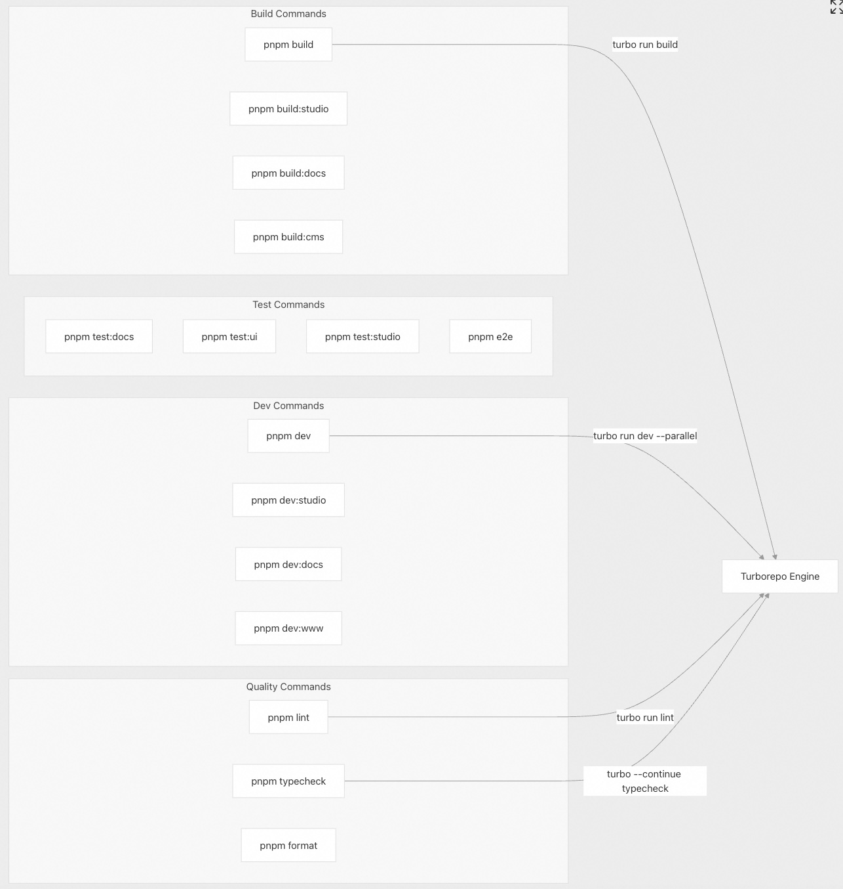
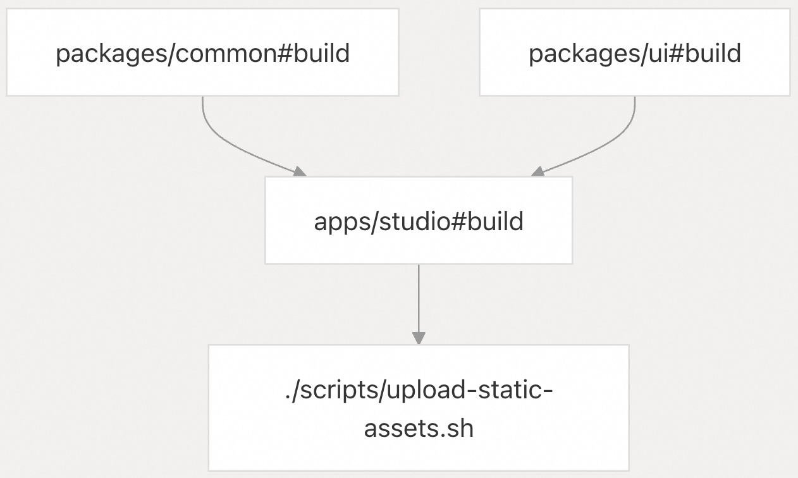
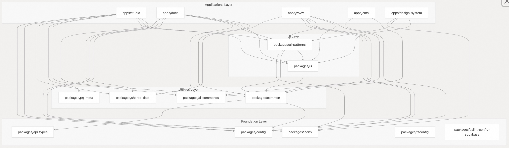
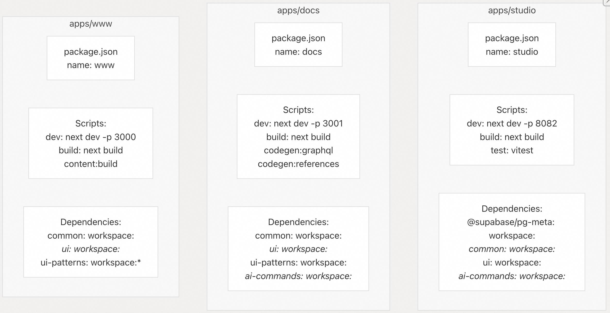
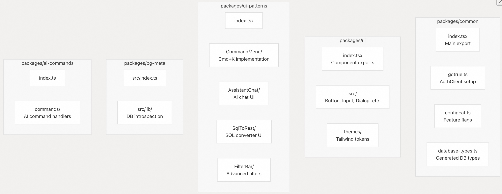
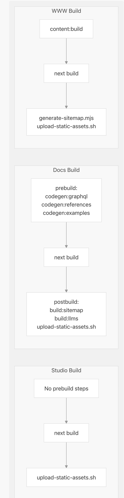
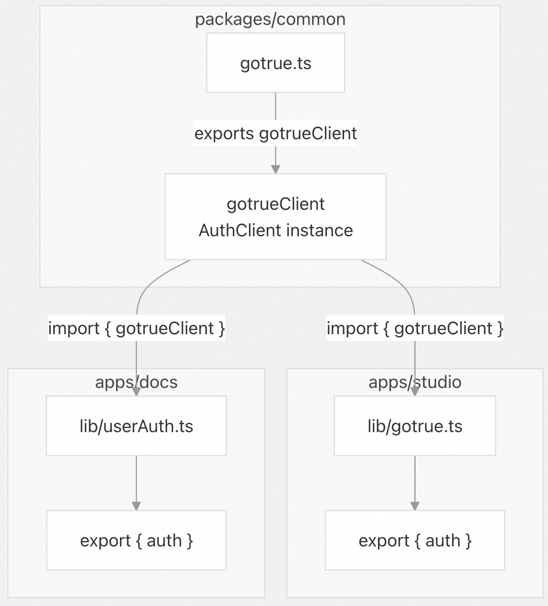

## Supabase 源码学习: 1.1 Monorepo (单体仓库) 结构  
                                                  
### 作者                                                  
digoal                                                  
                                                  
### 日期                                                  
2025-11-27                                                  
                                                  
### 标签                                                  
Supabase , Firebase , 源码学习 , 后端即服务 , BaaS , backend platform , 后端平台 , 开源项目缝合 , 前端 , 后端 , 自动生成API , 数据库 , 包管理 , 日志                                                    
                                                  
----                                                  
                                                  
## 背景        
本文档描述了 Supabase **monorepo (单体仓库)** 的组织结构，包括工作空间结构 (**workspace structure)** 、使用 **pnpm** 进行的包管理、使用 **Turborepo** 进行的构建协调，以及应用程序 (**applications)** 和共享包 (**shared packages)** 是如何组织和相互连接的。  
  
## 工作空间组织 (Workspace Organization)  
  
Supabase **monorepo (单体仓库)** 使用 **pnpm workspaces** (pnpm 工作空间) 在单个仓库中管理多个应用程序和共享包。工作空间结构在 [`pnpm-workspace.yaml` 1-5](https://github.com/supabase/supabase/blob/7490ca9e/pnpm-workspace.yaml#L1-L5) 中定义。  

```mermaid  
graph TB  
    subgraph "Workspace Root"  
        Root["pnpm-workspace.yaml"]  
    end  
      
    subgraph "apps/*"  
        Studio["apps/studio<br/>Dashboard App"]  
        Docs["apps/docs<br/>Documentation Site"]  
        WWW["apps/www<br/>Marketing Website"]  
        CMS["apps/cms<br/>Payload CMS"]  
        DesignSystem["apps/design-system<br/>Component Showcase"]  
        UILibrary["apps/ui-library<br/>shadcn Registry"]  
    end  
      
    subgraph "packages/*"  
        Common["packages/common<br/>Auth + Utils"]  
        UI["packages/ui<br/>Component Library"]  
        UIPatterns["packages/ui-patterns<br/>Complex Patterns"]  
        AICommands["packages/ai-commands<br/>AI Features"]  
        PGMeta["packages/pg-meta<br/>DB Metadata"]  
        Config["packages/config<br/>Shared Config"]  
        Icons["packages/icons<br/>Icons"]  
        SharedData["packages/shared-data<br/>Data Structures"]  
        APITypes["packages/api-types<br/>Type Definitions"]  
        ESLintConfig["packages/eslint-config-supabase<br/>Lint Config"]  
        TSConfig["packages/tsconfig<br/>TS Config"]  
    end  
      
    subgraph "Other Workspaces"  
        Blocks["blocks/*"]  
        E2E["e2e/*"]  
    end  
      
    Root --> Studio  
    Root --> Docs  
    Root --> WWW  
    Root --> CMS  
    Root --> DesignSystem  
    Root --> UILibrary  
    Root --> Common  
    Root --> UI  
    Root --> UIPatterns  
    Root --> AICommands  
    Root --> PGMeta  
    Root --> Config  
    Root --> Icons  
    Root --> SharedData  
    Root --> APITypes  
    Root --> ESLintConfig  
    Root --> TSConfig  
    Root --> Blocks  
    Root --> E2E  
```  
  

  
**来源:** [`pnpm-workspace.yaml` 1-5](https://github.com/supabase/supabase/blob/7490ca9e/pnpm-workspace.yaml#L1-L5)  
  
工作空间被组织成四个主要类别：  
  
| 类别 (Category) | 模式 (Pattern) | 目的 (Purpose) | 示例 (Examples) |  
| :--- | :--- | :--- | :--- |  
| **应用程序 (Applications)** | `apps/*` | 面向最终用户的 Next.js 应用程序 (End-user facing Next.js applications) | studio, docs, www, cms |  
| **共享包 (Shared Packages)** | `packages/*` | 应用程序使用的可复用库 (Reusable libraries consumed by apps) | ui, common, ui-patterns |  
| **区块 (Blocks)** | `blocks/*` | 实验性组件区块 (Experimental component blocks) | (various blocks) |  
| **E2E 测试 (E2E Tests)** | `e2e/*` | 端到端测试套件 (End-to-end test suites) | e2e/studio |  
  
**来源:** [`pnpm-workspace.yaml` 1-5](https://github.com/supabase/supabase/blob/7490ca9e/pnpm-workspace.yaml#L1-L5)  
  
## 包管理器: pnpm (Package Manager: pnpm)  
  
### 工作空间配置 (Workspace Configuration)  
  
**monorepo (单体仓库)** 通过 [`package.json` 9](https://github.com/supabase/supabase/blob/7490ca9e/package.json#L9-L9) 以及所有子包中的 `preinstall` 脚本强制使用 **pnpm** 作为包管理器。`engines` 字段指定了所需的版本：  
  
```  
{  
  "engines": {  
    "pnpm": "10.18",  
    "node": ">=22"  
  },  
  "packageManager": "pnpm@10.18.0"  
}  
```  
  
**来源:** [`package.json` 65-70](https://github.com/supabase/supabase/blob/7490ca9e/package.json#L65-L70)  
  
### 版本管理目录特性 (Catalog Feature for Version Management)  
  
**pnpm** 的 **catalog feature (目录特性)** 提供了集中的依赖版本管理。目录条目在 [`pnpm-workspace.yaml` 7-24](https://github.com/supabase/supabase/blob/7490ca9e/pnpm-workspace.yaml#L7-L24) 和 [`pnpm-lock.yaml` 7-59](https://github.com/supabase/supabase/blob/7490ca9e/pnpm-lock.yaml#L7-L59) 中定义，允许包使用 `catalog:` 协议引用版本。  
  
```  
catalog:  
  '@supabase/auth-js': 2.78.0  
  '@supabase/realtime-js': 2.78.0  
  '@supabase/supabase-js': 2.78.0  
  '@supabase/postgrest-js': 2.78.0  
  '@types/node': ^22.0.0  
  '@types/react': ^18.3.0  
  '@types/react-dom': ^18.3.0  
  next: ^15.5.2  
  react: ^18.3.0  
  react-dom: ^18.3.0  
  tailwindcss: 3.4.1  
  tsx: 4.20.3  
  typescript: ~5.9.0  
  valtio: ^1.12.0  
  vite: ^7.1.11  
  vitest: ^3.2.0  
  zod: ^3.25.76  
```  
  
#### 关键目录条目 (Key Catalog Entries)  
  
| 包 (Package) | 版本 (Version) | 用途 (Usage) |  
| :--- | :--- | :--- |  
| `next` | `^15.5.2` | 所有 Next.js 应用程序 (All Next.js applications) |  
| `react` / `react-dom` | `^18.3.0` | 所有 React 应用程序 (All React applications) |  
| `typescript` | `~5.9.0` | 所有 TypeScript 包 (All TypeScript packages) |  
| `vite` | `^7.1.11` | 用于测试运行器的构建工具 (Build tool for test runners) |  
| `vitest` | `^3.2.0` | 测试框架 (Test framework) |  
| `tailwindcss` | `3.4.1` | 样式（固定版本） (Styling (pinned version)) |  
| `@supabase/supabase-js` | `2.78.0` | Supabase 客户端库 (Supabase client library) |  
  
应用程序在其 `package.json` 中引用目录版本：  
  
```  
{  
  "dependencies": {  
    "next": "catalog:",  
    "react": "catalog:",  
    "typescript": "catalog:"  
  }  
}  
```  
  
**来源:** [`pnpm-workspace.yaml` 7-24](https://github.com/supabase/supabase/blob/7490ca9e/pnpm-workspace.yaml#L7-L24) [`pnpm-lock.yaml` 7-59](https://github.com/supabase/supabase/blob/7490ca9e/pnpm-lock.yaml#L7-L59) [`apps/studio/package.json` 102-107](https://github.com/supabase/supabase/blob/7490ca9e/apps/studio/package.json#L102-L107) [`apps/docs/package.json` 92-99](https://github.com/supabase/supabase/blob/7490ca9e/apps/docs/package.json#L92-L99)  
  
### 覆盖 (Overrides)  
  
工作空间使用 **pnpm overrides** (pnpm 覆盖) 来强制执行特定版本或修补 **transitive dependencies** (传递性依赖)，这些定义在 [`pnpm-workspace.yaml` 50-59](https://github.com/supabase/supabase/blob/7490ca9e/pnpm-workspace.yaml#L50-L59) 中：  
  
| 覆盖 (Override) | 版本 (Version) | 原因 (Reason) |  
| :--- | :--- | :--- |  
| `@react-router/dev>vite-node` | `3.2.4` | 与 **vitest** 的兼容性 (Compatibility with vitest) |  
| `@supabase/supabase-js>@supabase/auth-js` | `catalog:` | 确保目录版本 (Ensure catalog version) |  
| `vinxi>vite`, `@tanstack/*>vite` | `catalog:` | 一致的 **vite** 版本 (Consistent vite version) |  
| `esbuild` | `^0.25.2` | 构建工具版本 (Build tool version) |  
| `refractor>prismjs` | `^1.30.0` | 安全修复 (Security fix) |  
  
**来源:** [`pnpm-workspace.yaml` 50-59](https://github.com/supabase/supabase/blob/7490ca9e/pnpm-workspace.yaml#L50-L59) [`pnpm-lock.yaml` 61-71](https://github.com/supabase/supabase/blob/7490ca9e/pnpm-lock.yaml#L61-L71)  
  
### 构建优化标志 (Build Optimization Flags)  
  
工作空间配置在 [`pnpm-workspace.yaml` 26-48](https://github.com/supabase/supabase/blob/7490ca9e/pnpm-workspace.yaml#L26-L48) 中包含了构建优化设置：  
  
  * `ignoredBuiltDependencies`：不应构建的包（例如，`@parcel/watcher`、`sharp`、`libpg-query` 等原生模块 (**native modules**)）  
  * `onlyBuiltDependencies`：必须构建的包（例如，`supabase` CLI）  
  * `minimumReleaseAge`：10080 分钟（7 天）——防止安装过新的包  
  * `minimumReleaseAgeExclude`：从年龄限制中排除 Supabase 包和 AI SDK，以实现更快的迭代 (**faster iteration**)  
  
**来源:** [`pnpm-workspace.yaml` 26-48](https://github.com/supabase/supabase/blob/7490ca9e/pnpm-workspace.yaml#L26-L48)  
  
## 构建协调: Turborepo (Build Orchestration: Turborepo)  
  
### Turbo 配置 (Turbo Configuration)  
  
**monorepo (单体仓库)** 使用 **Turborepo** (版本 2.3.3) 来协调整个工作空间中的构建、开发服务器和其他任务。**Turbo** 提供了：  
  
1.  任务并行化 (**Task parallelization**) - 并发运行独立任务  
2.  构建缓存 (**Build caching**) - 缓存输出以避免重复工作  
3.  任务依赖 (**Task dependencies**) - 确保正确的构建顺序（例如，先包后应用）  
  
**来源:** [`package.json` 58](https://github.com/supabase/supabase/blob/7490ca9e/package.json#L58-L58)  
  
### 根级别脚本 (Root-Level Scripts)  
  
根目录下的 [`package.json` 8-46](https://github.com/supabase/supabase/blob/7490ca9e/package.json#L8-L46) 定义了协调脚本 (**orchestration scripts**):  
  
    
  
| 脚本 (Script) | 命令 (Command) | 描述 (Description) |  
| :--- | :--- | :--- |  
| `build` | `turbo run build` | 构建所有应用程序和包 (Build all apps and packages) |  
| `build:studio` | `turbo run build --filter=studio` | 仅构建 Studio 应用程序 (Build only Studio app) |  
| `dev` | `turbo run dev --parallel` | 并行运行所有开发服务器 (Run all dev servers in parallel) |  
| `dev:studio` | `turbo run dev --filter=studio --parallel` | 运行 Studio 开发服务器 (Run Studio dev server) |  
| `lint` | `turbo run lint` | 检查所有工作空间 (Lint all workspaces) |  
| `typecheck` | `turbo --continue typecheck` | 类型检查（出错时继续） (Type check (continue on error)) |  
| `format` | `prettier --write ...` | 格式化所有代码 (Format all code) |  
| `clean` | `turbo run clean --parallel && rimraf node_modules/...` | 清理构建产物 (Clean build artifacts) |  
  
**来源:** [`package.json` 8-46](https://github.com/supabase/supabase/blob/7490ca9e/package.json#L8-L46)  
  
### Turbo 过滤器 (Turbo Filters)  
  
**Turborepo** 的 `--filter` 标志用于定位特定的工作空间 (**workspaces)** 。示例：  
  
```bash  
# Build only Studio  
turbo run build --filter=studio  
  
# Run dev for docs with all its dependencies  
turbo run dev --filter=docs --parallel  
  
# Run tests for UI package  
turbo run test --filter=ui  
```  
  
**来源:** [`package.json` 11-22](https://github.com/supabase/supabase/blob/7490ca9e/package.json#L11-L22)  
  
### 任务依赖 (Task Dependencies)  
  
**Turborepo** 根据工作空间关系自动推断任务依赖。例如：  
  
    
  
运行 `turbo run build --filter=studio` 时，**Turbo** 会确保首先构建 `packages/common` 和 `packages/ui`，因为 **Studio** 通过 **workspace references** (工作空间引用) 依赖于它们。  
  
**来源:** [`apps/studio/package.json` 1-8](https://github.com/supabase/supabase/blob/7490ca9e/apps/studio/package.json#L1-L8) [`package.json` 10-14](https://github.com/supabase/supabase/blob/7490ca9e/package.json#L10-L14)  
  
## 工作空间依赖 (Workspace Dependencies)  
  
### 工作空间协议 (Workspace Protocol)  
  
包使用 `workspace:*` **protocol (协议)** 来引用其他工作空间包，这会链接到本地工作空间版本，而不是从 **npm** 获取：  
  
```  
{  
  "dependencies": {  
    "common": "workspace:*",  
    "ui": "workspace:*",  
    "ui-patterns": "workspace:*",  
    "config": "workspace:*",  
    "icons": "workspace:*"  
  }  
}  
```  
  
**来源:** [`apps/studio/package.json` 78-80](https://github.com/supabase/supabase/blob/7490ca9e/apps/studio/package.json#L78-L80) [`apps/docs/package.json` 62-66](https://github.com/supabase/supabase/blob/7490ca9e/apps/docs/package.json#L62-L66)  
  
### 依赖图 (Dependency Graph)  
  
    
  
**来源:** [`apps/studio/package.json` 76-93](https://github.com/supabase/supabase/blob/7490ca9e/apps/studio/package.json#L76-L93) [`apps/docs/package.json` 62-74](https://github.com/supabase/supabase/blob/7490ca9e/apps/docs/package.json#L62-L74) [`apps/www/package.json` 38-52](https://github.com/supabase/supabase/blob/7490ca9e/apps/www/package.json#L38-L52) [`packages/ui-patterns/package.json` 486-530](https://github.com/supabase/supabase/blob/7490ca9e/packages/ui-patterns/package.json#L486-L530)  
  
### 对等依赖 (Peer Dependencies)  
  
共享包使用 `peerDependencies` (对等依赖) 来避免捆绑 **framework code** (框架代码)：  
  
```  
{  
  "peerDependencies": {  
    "@supabase/auth-js": "catalog:",  
    "@supabase/supabase-js": "catalog:",  
    "next": "catalog:",  
    "react": "catalog:",  
    "react-dom": "catalog:"  
  }  
}  
```  
  
这确保了所有包都使用由消费应用程序提供的相同 **React** 和 **Next.js** 版本。  
  
**来源:** [`packages/common/package.json` 39-45](https://github.com/supabase/supabase/blob/7490ca9e/packages/common/package.json#L39-L45) [`packages/ui/package.json` 102-104](https://github.com/supabase/supabase/blob/7490ca9e/packages/ui/package.json#L102-L104)  
  
## 应用程序目录结构 (Applications Directory Structure)  
  
`apps/*` 中的每个应用程序都是一个独立的 **Next.js** 应用程序，具有自己的构建配置：  
  
    
  
#### 应用程序详情 (Application Details)  
  
| 应用 (App) | 端口 (Port) | 构建步骤 (Build Steps) | 关键依赖 (Key Dependencies) |  
| :--- | :--- | :--- | :--- |  
| **studio** | 8082 | `next build` → 上传资产 (upload assets) | pg-meta, common, ui, ui-patterns, ai-commands |  
| **docs** | 3001 | 代码生成 (codegen (GraphQL, OpenAPI)) → `next build` → 站点地图 (sitemap) | common, ui, ui-patterns, ai-commands, api-types |  
| **www** | 3000 | 内容构建 (content build) → `next build` → 站点地图 | common, ui, ui-patterns, ai-commands |  
| **cms** | (默认) (default) | `next build` | common, config |  
| **design-system** | 3003 | contentlayer → `next build` | ui, ui-patterns, icons |  
| **ui-library** | 3004 | contentlayer → 注册表构建 (registry build) → `next build` | ui, ui-patterns, common |  
  
**来源:** [`apps/studio/package.json` 5-26](https://github.com/supabase/supabase/blob/7490ca9e/apps/studio/package.json#L5-L26) [`apps/docs/package.json` 6-42](https://github.com/supabase/supabase/blob/7490ca9e/apps/docs/package.json#L6-L42) [`apps/www/package.json` 6-18](https://github.com/supabase/supabase/blob/7490ca9e/apps/www/package.json#L6-L18)  
  
## 共享包目录结构 (Shared Packages Directory Structure)  
  
`packages/*` 中的包导出了可供应用程序使用的可复用代码 (**reusable code)** ：  
  
    
  
#### 包详情 (Package Details)  
  
| 包 (Package) | 主要导出 (Main Export) | 目的 (Purpose) | 关键文件 (Key Files) |  
| :--- | :--- | :--- | :--- |  
| **common** | `index.tsx` | 认证客户端、工具、功能标志 (Auth client, utilities, feature flags) | `gotrue.ts`, `configcat.ts` |  
| **ui** | `index.tsx` | 核心组件库 (Radix + Tailwind) (Core component library) | 组件目录 (Component directories) |  
| **ui-patterns** | `index.tsx` | 复杂模式：命令菜单、助理聊天 (Complex patterns: CommandMenu, AssistantChat) | 命名子目录 (Named subdirectories) |  
| **ai-commands** | `index.ts` | AI 命令处理程序和工具 (AI command handlers and utilities) | `commands/` |  
| **pg-meta** | `src/index.ts` | PostgreSQL 元数据自检 (PostgreSQL metadata introspection) | `src/lib/` |  
| **config** | 各种 (various) | 共享配置文件 (Shared configuration files) | ESLint, Tailwind configs (配置) |  
| **icons** | `index.tsx` | 图标组件 (Icon components) | 图标定义 (Icon definitions) |  
| **shared-data** | 各种 (various) | 共享数据结构（定价等） (Shared data structures (pricing, etc.)) | 数据文件 (Data files) |  
| **api-types** | `index.ts` | TypeScript 类型定义 (TypeScript type definitions) | 生成的类型 (Generated types) |  
| **tsconfig** | 各种 (various) | 共享 TypeScript 配置 (Shared TypeScript configurations) | 基础配置 (Base configs) |  
| **eslint-config-supabase** | `index.js` | 共享 ESLint 规则 (Shared ESLint rules) | 配置文件 (Config file) |  
  
**来源:** [`packages/common/package.json` 1-46](https://github.com/supabase/supabase/blob/7490ca9e/packages/common/package.json#L1-L46) [`packages/ui/package.json` 1-105](https://github.com/supabase/supabase/blob/7490ca9e/packages/ui/package.json#L1-L105) [`packages/ui-patterns/package.json` 1-485](https://github.com/supabase/supabase/blob/7490ca9e/packages/ui-patterns/package.json#L1-L485) [`packages/pg-meta/package.json` 1-31](https://github.com/supabase/supabase/blob/7490ca9e/packages/pg-meta/package.json#L1-L31) [`packages/ai-commands/package.json` 1-41](https://github.com/supabase/supabase/blob/7490ca9e/packages/ai-commands/package.json#L1-L41)  
  
## 构建与开发工作流程 (Build and Development Workflows)  
  
### 常见构建模式 (Common Build Patterns)  
  
应用程序遵循具有不同之处的标准模式：  
  
    
  
**来源:** [`apps/studio/package.json` 8](https://github.com/supabase/supabase/blob/7490ca9e/apps/studio/package.json#L8-L8) [`apps/docs/package.json` 28-29](https://github.com/supabase/supabase/blob/7490ca9e/apps/docs/package.json#L28-L29) [`apps/www/package.json` 9](https://github.com/supabase/supabase/blob/7490ca9e/apps/www/package.json#L9-L9)  
  
### 代码生成步骤 (Code Generation Steps)  
  
几个应用程序包含代码生成 (**code generation)** 作为预构建步骤 (**prebuild steps)** ：  
  
| 应用 (App) | 生成类型 (Generation Type) | 脚本 (Script) | 输出 (Output) |  
| :--- | :--- | :--- | :--- |  
| **docs** | GraphQL schema + types | `codegen:graphql` | `__generated__/` |  
| **docs** | OpenAPI 引用 (references) | `codegen:references` | 引用页面 (Reference pages) |  
| **docs** | 示例文件 (Example files) | `codegen:examples` | `examples/` |  
| **www** | 静态内容 (Static content) | `content:build` | 生成的静态文件 (Generated static files) |  
| **design-system** | Contentlayer | `content:build` | `.contentlayer/` |  
| **ui-library** | 组件注册表 (Component registry) | `build:registry` | `public/r/registry.json` |  
  
**来源:** [`apps/docs/package.json` 13-14](https://github.com/supabase/supabase/blob/7490ca9e/apps/docs/package.json#L13-L14) [`apps/www/package.json` 16](https://github.com/supabase/supabase/blob/7490ca9e/apps/www/package.json#L16-L16) [`apps/design-system/package.json` 15](https://github.com/supabase/supabase/blob/7490ca9e/apps/design-system/package.json#L15-L15) [`apps/ui-library/package.json` 10](https://github.com/supabase/supabase/blob/7490ca9e/apps/ui-library/package.json#L10-L10)  
  
### 开发服务器 (Development Servers)  
  
所有 **Next.js** 应用程序在开发过程中都通过 `--turbopack` 标志支持 **Turbopack**：  
  
```bash  
# Studio  
next dev --turbopack -p 8082  
  
# Docs (with watch mode for troubleshooting)  
concurrently "next dev --port 3001" "pnpm run dev:watch:troubleshooting"  
  
# WWW  
next --port 3000  
```  
  
**来源:** [`apps/studio/package.json` 7](https://github.com/supabase/supabase/blob/7490ca9e/apps/studio/package.json#L7-L7) [`apps/docs/package.json` 16](https://github.com/supabase/supabase/blob/7490ca9e/apps/docs/package.json#L16-L16) [`apps/www/package.json` 8](https://github.com/supabase/supabase/blob/7490ca9e/apps/www/package.json#L8-L8)  
  
## 认证客户端设置 (Authentication Client Setup)  
  
`packages/common` 包提供了用于所有应用程序的集中式 **GoTrue authentication client** (GoTrue 认证客户端)：  
  
    
  
该客户端在 [`packages/common/gotrue.ts` 217-227](https://github.com/supabase/supabase/blob/7490ca9e/packages/common/gotrue.ts#L217-L227) 中配置了共享设置：  
  
```  
export const gotrueClient = new AuthClient({  
  url: process.env.NEXT_PUBLIC_GOTRUE_URL,  
  storageKey: STORAGE_KEY,  
  detectSessionInUrl: shouldDetectSessionInUrl,  
  debug: debug ? (persistedDebug ? logIndexedDB : true) : false,  
  lock: navigatorLockEnabled ? debuggableNavigatorLock : undefined,  
  fetch: fetchWithTimeout,  
  ...('localStorage' in globalThis  
    ? { storage: globalThis.localStorage, userStorage: globalThis.localStorage }  
    : null),  
})  
```  
  
#### 关键特性 (Key Features)  
  
  * 集中式配置 (**Centralized configuration**) (URL, storage key, debug mode) (URL、存储密钥、调试模式)  
  * 支持用于标签页同步的 **Navigator lock**  
  * 30 秒获取超时包装器 (**30-second fetch timeout wrapper**)  
  * 用于调试的 **IndexedDB logging** (日志记录)  
  * 在所有应用程序中共享  
  
**来源:** [`packages/common/gotrue.ts` 1-230](https://github.com/supabase/supabase/blob/7490ca9e/packages/common/gotrue.ts#L1-L230) [`apps/studio/lib/gotrue.ts` 1-5](https://github.com/supabase/supabase/blob/7490ca9e/apps/studio/lib/gotrue.ts#L1-L5) [`apps/docs/lib/userAuth.ts` 1-4](https://github.com/supabase/supabase/blob/7490ca9e/apps/docs/lib/userAuth.ts#L1-L4)  
  
## 测试基础设施 (Testing Infrastructure)  
  
### 测试框架 (Test Frameworks)  
  
**monorepo (单体仓库)** 使用 **Vitest** (版本 3.2.0) 进行单元测试 (**unit**) 和集成测试 (**integration tests)** ：  
  
| 包 (Package) | 测试命令 (Test Command) | 覆盖率 (Coverage) |  
| :--- | :--- | :--- |  
| **studio** | `vitest --run --coverage` | 是 (v8) |  
| **docs** | `vitest --exclude "**/*.smoke.test.ts"` | 否 |  
| **ui** | `vitest` | 是 (v8) |  
| **ui-patterns** | `vitest` | 是 (v8) |  
| **common** | `vitest` | 否 |  
| **pg-meta** | `vitest run --coverage` | 是 (v8) |  
  
**来源:** [`apps/studio/package.json` 12-16](https://github.com/supabase/supabase/blob/7490ca9e/apps/studio/package.json#L12-L16) [`apps/docs/package.json` 37-40](https://github.com/supabase/supabase/blob/7490ca9e/apps/docs/package.json#L37-L40) [`packages/ui/package.json` 17-19](https://github.com/supabase/supabase/blob/7490ca9e/packages/ui/package.json#L17-L19) [`packages/ui-patterns/package.json` 9-10](https://github.com/supabase/supabase/blob/7490ca9e/packages/ui-patterns/package.json#L9-L10)  
  
### 端到端测试 (E2E Testing)  
  
**End-to-end tests** (端到端测试) 使用 **Playwright**，并位于 `e2e/studio` 中：  
  
```  
# Run E2E tests against different environments  
pnpm e2e                  # Default  
pnpm e2e:dev-hosted       # Development (hosted)  
pnpm e2e:dev-selfhosted   # Development (self-hosted)  
pnpm e2e:staging          # Staging  
pnpm e2e:prod             # Production  
```  
  
**来源:** [`package.json` 32-38](https://github.com/supabase/supabase/blob/7490ca9e/package.json#L32-L38)  
  
## 总结 (Summary)  
  
Supabase **monorepo** (单体仓库) 结构提供了：  
  
1.  统一的包管理 (**Unified Package Management**): **pnpm workspaces** (pnpm 工作空间) 带有 **catalog** (目录) 以确保版本一致性  
2.  高效的构建 (**Efficient Builds**): **Turborepo** 用于并行化和缓存  
3.  清晰的分离 (**Clear Separation**): 应用程序 (**Apps**) 面向最终用户，包 (**packages**) 用于共享代码  
4.  一致的工具 (**Consistent Tooling**): 共享 **ESLint**、**TypeScript** 和 **Tailwind** 配置  
5.  集中式认证 (**Centralized Auth**): 所有应用程序共享通用的 **GoTrue** 客户端  
6.  类型安全 (**Type Safety**): **Workspace protocol** (工作空间协议) 确保本地依赖保持同步  
7.  灵活的测试 (**Flexible Testing**): **Vitest** 用于单元测试，**Playwright** 用于 **E2E** (端到端) 测试  
  
这种架构使得多个前端应用程序能够共享 **UI components** (UI 组件)、工具 (**utilities**) 和认证逻辑 (**authentication logic**)，同时保持独立的构建和部署管道 (**deployment pipelines**)。  
  
**来源:** [`pnpm-workspace.yaml` 1-60](https://github.com/supabase/supabase/blob/7490ca9e/pnpm-workspace.yaml#L1-L60) [`package.json` 1-71](https://github.com/supabase/supabase/blob/7490ca9e/package.json#L1-L71) [`pnpm-lock.yaml` 1-60](https://github.com/supabase/supabase/blob/7490ca9e/pnpm-lock.yaml#L1-L60)  
  
  
-----  
  
# 附录1: 核心依赖版本管理与维护 (Architect/Maintainer 角度)  
  
**背景痛点：** 在大型 Monorepo 中，核心依赖（如 React、Next.js、TypeScript）的版本漂移或冲突是导致构建失败和运行时错误的主要原因。  
  
**问题：**  
  
考虑到 Supabase monorepo 使用 **pnpm catalog (目录特性)** 和 **overrides (覆盖)** 来集中管理核心依赖版本，这种机制在**日常维护**中是否存在什么潜在的**痛点**或**挑战**？例如，当需要升级一个全局核心依赖版本时，**维护人员**需要遵循哪些具体的**工作流**来确保所有应用程序和共享包的**兼容性**和**稳定性**？  
  
## 回答  
  
## 潜在痛点与挑战  
  
Supabase monorepo 使用 pnpm catalog 和 overrides 集中管理依赖，虽然提供了版本一致性，但也存在一些维护挑战：  
  
### 1. 版本升级的复杂性  
- **全局影响**：修改 `pnpm-workspace.yaml` 中的 catalog 版本会影响所有引用该依赖的包    
- **覆盖规则维护**：overrides 部分需要手动维护，确保特定依赖的版本覆盖正确    
  
### 2. 兼容性测试负担  
- **全面测试需求**：每次核心依赖升级都需要在所有应用中测试，包括 studio、docs、www 等     
- **共享包风险**：packages/common 等共享包的 peerDependencies 依赖 catalog，升级可能破坏多个应用    
  
## 升级工作流  
  
维护人员升级核心依赖时需要遵循以下流程：  
  
### 1. 自动化更新流程  
使用 GitHub Actions 工作流更新 @supabase/* 库：  
```yaml  
# .github/workflows/update-js-libs.yml  
- 更新 pnpm-workspace.yaml 中的版本  
- 运行 pnpm install --no-frozen-lockfile  
- 自动创建 PR  
```    
  
### 2. 手动升级步骤  
对于非 @supabase/* 核心依赖（如 React、Next.js）：  
  
1. **修改 catalog 版本**：在 `pnpm-workspace.yaml` 中更新版本号    
2. **更新锁文件**：运行 `pnpm install` 更新 `pnpm-lock.yaml`  
3. **全面测试**：  
   - 运行 `pnpm build` 构建所有应用    
   - 运行 `pnpm typecheck` 检查类型兼容性  
   - 逐个测试应用：`pnpm dev:studio`、`pnpm dev:docs`、`pnpm dev:www`    
  
### 3. 验证清单  
- 检查所有应用的构建是否成功  
- 验证共享包的 peerDependencies 兼容性  
- 确认 overrides 规则仍然有效  
- 运行 E2E 测试（如果存在）  
  
## Notes  
  
- pnpm catalog 确实简化了版本管理，但增加了升级时的风险面  
- overrides 机制解决了特定依赖冲突，但需要持续维护  
- 自动化工作流仅覆盖 @supabase/* 库，其他核心依赖仍需手动处理  
- 建议在升级前创建分支，并在隔离环境中进行充分测试  
  
  
  
-----  
  
# 附录2: 构建协调效率与开发工作流 (Developer/Architect 角度)  
  
**背景痛点：** 无论是在本地开发还是 CI/CD 流程中，如果对 Monorepo 中的一个底层共享包进行了修改，通常会导致所有上层应用都被重新构建，造成时间浪费。  
  
**问题：**  
  
架构师如何确保 **Turborepo** 的 **build caching (构建缓存)** 和 **task dependencies (任务依赖)** 能够最大限度地发挥效率？特别是在**日常开发**中，如果一个底层的**共享包**（例如 `packages/ui` 或 `packages/common`）发生变更，**Turborepo** 如何利用其特性，仅触发**所需下游应用程序**的重建，从而优化 **CI/CD 流程**和**本地开发**启动速度？  
  
## 回答  
  
## Turborepo 构建缓存与任务依赖优化策略  
  
### 核心配置机制  
  
Turborepo 通过 `turbo.json` 中的任务依赖配置实现智能构建。在根目录的 `turbo.json` 中，`build` 任务配置了 `"dependsOn": ["^build"]`，这意味着每个包的构建任务会等待其所有上游依赖包构建完成  。  
  
### 工作区结构  
  
项目使用 `pnpm-workspace.yaml` 定义了 monorepo 结构，包含 `apps/*`、`packages/*`、`blocks/*` 和 `e2e/*`  。共享包位于 `packages/` 目录下，如 `packages/ui` 和 `packages/common`。  
  
### 缓存优化策略  
  
1. **任务依赖声明**：每个应用的构建任务都明确声明依赖上游构建  
   - `studio#build` 依赖 `^build`    
   - `www#build` 同样依赖 `^build`    
  
2. **输出路径配置**：通过 `outputs` 字段定义缓存范围  
   - 通用构建任务缓存 `dist/**` 和 `.next/**`    
   - Studio 应用排除缓存目录 `.next/cache/**`    
  
3. **环境变量隔离**：每个任务明确列出所需环境变量，确保缓存命中  
   - Studio 构建任务包含 83 个环境变量    
   - 使用 `passThroughEnv` 处理运行时变量    
  
### 实际应用场景  
  
当 `packages/ui` 发生变更时：  
1. Turbo 检测到变更，识别依赖该包的应用  
2. 仅重建直接或间接依赖 `packages/ui` 的应用  
3. 未依赖的应用直接使用缓存结果  
  
构建脚本通过 `pnpm build:studio` 等命令触发特定应用构建  ，配合 Turbo 的依赖解析实现最小化重建。  
  
## Notes  
  
- Turborepo 的缓存机制基于文件哈希和环境变量指纹  
- `^build` 语法表示依赖所有工作区中声明为依赖的包的构建任务  
- 本地开发可使用 `pnpm dev` 并行启动所有应用    
  
  
  
-----  
  
# 附录3: 集中式共享逻辑的安全与部署风险 (Architect/User 角度)  
  
**背景痛点：** 关键共享逻辑（如认证）的中心化提升了代码复用，但也带来了单点风险。一旦共享逻辑出现 Bug 或安全问题，会立即影响所有上层应用。  
  
**问题：**  
  
`packages/common` 中的集中式 **GoTrue authentication client (GoTrue 认证客户端)** 是一个关键的架构决策。从**用户角度**看，它保证了跨应用程序认证体验的**一致性**，但从**架构角度**看，当对 GoTrue 客户端的**核心逻辑**进行修改时，**开发人员**如何确保所有依赖它的应用程序（如 Studio、Docs）在不破坏各自独立部署流程的前提下，保持**安全性和同步性**？是否有专门的**测试策略**或**部署策略**来隔离和验证对这个关键共享包的改动？  
  
  
## 回答  
  
基于提供的代码上下文，我来回答关于 `packages/common` 中 GoTrue 认证客户端的架构风险和测试策略问题。  
  
## 简要回答  
  
从现有代码来看，`packages/common` 确实作为共享组件包存在  ，但代码库中未显示专门针对 GoTrue 客户端的隔离测试策略。现有的测试策略主要聚焦于应用层的集成测试和 CI/CD 流程  ，通过本地 Supabase 实例进行测试验证  。  
  
## 详细分析  
  
### 架构现状  
  
`packages/common` 在 monorepo 结构中被定义为共享的 React 组件包，在所有站点之间共享  。GoTrue 作为 Supabase 的认证服务，是一个基于 JWT 的 API 用于管理用户和颁发访问令牌  。  
  
### 测试策略  
  
现有的测试策略主要包括：  
  
1. **集成测试**：通过创建连接到本地 Supabase 实例的测试客户端进行验证    
  
2. **关键功能测试**：重点测试认证、数据库触发器和行级安全策略的协同工作    
  
3. **CI/CD 集成**：在 GitHub Actions 中运行测试，使用 `supabase start` 启动本地实例    
  
### 风险缓解策略  
  
虽然没有看到专门针对 `packages/common` 中 GoTrue 客户端的隔离策略，但文档建议：  
  
1. **测试优先级**：优先测试认证和授权失败等高成本故障领域    
  
2. **安全审计**：定期进行认证和授权审查，测试私有页面的访问控制    
  
3. **数据库安全**：实施行级安全策略确保用户数据隔离    
  
## Notes  
  
基于提供的代码片段，我无法确认 `packages/common` 目录下具体的 GoTrue 客户端实现细节，也没有找到专门针对这个共享包的版本控制或渐进式部署策略。现有信息主要展示了应用层的测试方法，而非包级别的隔离验证机制。如需了解具体的包级测试策略，可能需要查看 `packages/common` 目录下的实际代码和测试配置文件。  
  
    
#### [PolarDB 学习图谱](https://www.aliyun.com/database/openpolardb/activity "8642f60e04ed0c814bf9cb9677976bd4")
  
  
#### [PostgreSQL 解决方案集合](../201706/20170601_02.md "40cff096e9ed7122c512b35d8561d9c8")
  
  
#### [德哥 / digoal's Github - 公益是一辈子的事.](https://github.com/digoal/blog/blob/master/README.md "22709685feb7cab07d30f30387f0a9ae")
  
  
#### [About 德哥](https://github.com/digoal/blog/blob/master/me/readme.md "a37735981e7704886ffd590565582dd0")
  
  

  
