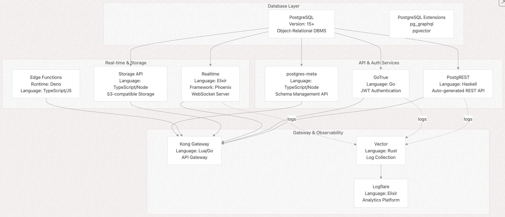
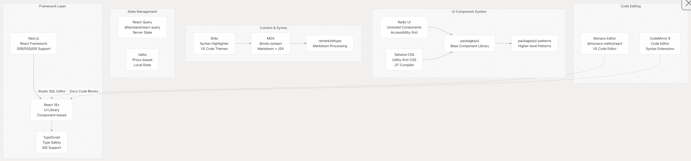
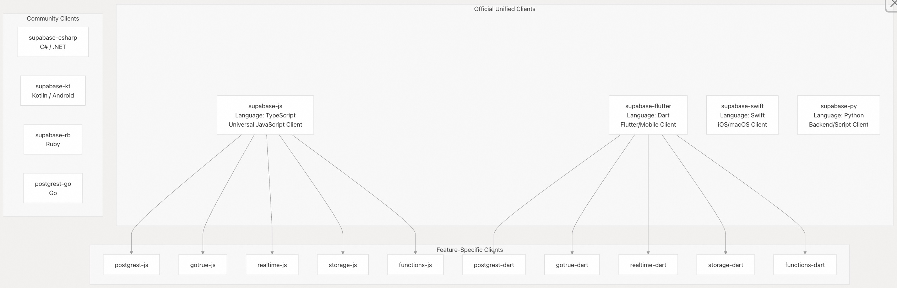
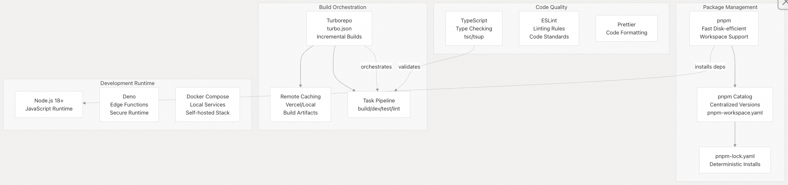

## Supabase 源码学习: 1.2 技术栈 (Technology Stack)  
                                                    
### 作者                                                    
digoal                                                    
                                                    
### 日期                                                    
2025-11-27                                                    
                                                    
### 标签                                                    
Supabase , Firebase , 源码学习 , 后端即服务 , BaaS , backend platform , 后端平台 , 开源项目缝合 , 前端 , 后端 , 自动生成API , 数据库 , 包管理 , 日志                                                      
                                                    
----                                                    
                                                    
## 背景          
本文档全面概述了 Supabase 仓库中使用的技术、框架（Frameworks）和编程语言（Programming Languages）。它涵盖了核心后端服务（Core Backend Services）、前端应用（Frontend Applications）、客户端库（Client Libraries）以及共同构成 Supabase 平台的开发工具（Development Tooling）。  
  
## 核心后端服务堆栈 (Core Backend Services Stack)  
  
构成 Supabase 平台的后端服务（Backend Services）使用了不同的编程语言和框架（Frameworks），每种选择都基于其特定的优势。  
  
### 后端服务技术图谱 (Backend Services Technology Map)  
  
  
  
**来源:**  
[`README.md` 53-60](https://github.com/supabase/supabase/blob/7490ca9e/README.md#L53-L60)  
[`apps/docs/public/humans.txt` 168-179](https://github.com/supabase/supabase/blob/7490ca9e/apps/docs/public/humans.txt#L168-L179)  
  
### 后端服务技术表 (Backend Services Technology Table)  
  
| 服务 (Service) | 主要语言 (Primary Language) | 框架/运行时 (Framework/Runtime) | 用途 (Purpose) |  
| :--- | :--- | :--- | :--- |  
| PostgreSQL | C | Native DBMS | 拥有 30 多年开发历史的主数据库 (Primary Database) |  
| PostgREST | Haskell | Standalone | 将 PostgreSQL 模式 (Schema) 转换为 REST API |  
| GoTrue | Go | Standalone | 基于 JWT 的认证服务 (Authentication Service) |  
| Realtime | Elixir | Phoenix Framework | 用于数据库变更事件的 WebSocket 服务器 |  
| Storage API | TypeScript | Node.js | 具有 Postgres 权限的 S3 兼容文件存储 |  
| Edge Functions | TypeScript/JavaScript | Deno Runtime | 无服务器函数（Serverless Function）执行环境 |  
| postgres-meta | TypeScript | Node.js | 用于数据库模式管理 (Database Schema Management) 的 RESTful API |  
| Kong | Lua/Go | Cloud-native | 用于路由和速率限制 (Rate Limiting) 的 API 网关 (API Gateway) |  
| Vector | Rust | Standalone | 日志收集和转换管道 (Pipeline) |  
  
**来源:**  
[`README.md` 53-60](https://github.com/supabase/supabase/blob/7490ca9e/README.md#L53-L60)  
[`apps/docs/public/humans.txt` 172-179](https://github.com/supabase/supabase/blob/7490ca9e/apps/docs/public/humans.txt#L172-L179)  
  
### 编程语言分布 (Programming Language Distribution)  
  
后端服务采用了多语言架构 (Polyglot Architecture)：  
  
  * **Haskell**: PostgREST 提供了直接从数据库模式生成类型安全（Type-safe）API 的能力。  
  * **Go**: GoTrue 实现了兼顾性能和并发性（Concurrency）的认证。  
  * **Elixir/Phoenix**: Realtime 利用 Erlang VM 的容错性（Fault-tolerance）进行 WebSocket 连接。  
  * **TypeScript/Node.js**: Storage API 和 `postgres-meta` 提供了现代 JavaScript 生态系统的集成。  
  * **Deno**: Edge Functions 运行时 (Runtime) 提供了安全、符合标准（Standards-compliant）的 JavaScript/TypeScript 执行。  
  * **Rust**: Vector 提供了具有内存安全（Memory Safety）的高性能日志处理。  
  * **Lua**: Kong 使用 Lua 进行灵活的基于插件（Plugin-based）的路由和中间件（Middleware）。  
  
**来源:**  
[`README.md` 53-60](https://github.com/supabase/supabase/blob/7490ca9e/README.md#L53-L60)  
[`docker/docker-compose.yml`](https://github.com/supabase/supabase/blob/7490ca9e/docker/docker-compose.yml)  
  
## 前端应用堆栈 (Frontend Application Stack)  
  
所有三个主要应用程序（Studio、Docs、WWW）共享一个共同的技术基础（Technology Foundation），但服务于不同的目的。  
  
### 前端技术架构 (Frontend Technology Architecture)  
  
  
  
**来源:**  
[`apps/docs/public/humans.txt` 175-177](https://github.com/supabase/supabase/blob/7490ca9e/apps/docs/public/humans.txt#L175-L177)  
[`package-lock.json`](https://github.com/supabase/supabase/blob/7490ca9e/package-lock.json)  
  
### 核心前端技术 (Core Frontend Technologies)  
  
**Next.js 框架 (Framework)**  
  
  * 版本: 14.x (来自单体仓库依赖)  
  * 使用的功能: 应用路由 (App Router)、服务器组件 (Server Components)、API 路由 (API Routes)、静态生成 (Static Generation)  
  * 所有三个主要应用都使用 Next.js 作为其基础  
  * 配置文件:  
    [`apps/studio/next.config.js`](https://github.com/supabase/supabase/blob/7490ca9e/apps/studio/next.config.js)  
    [`apps/docs/next.config.mjs`](https://github.com/supabase/supabase/blob/7490ca9e/apps/docs/next.config.mjs)  
    [`apps/www/next.config.mjs`](https://github.com/supabase/supabase/blob/7490ca9e/apps/www/next.config.mjs)  
  
**React 生态系统 (Ecosystem)**  
  
  * React 18+ 具有并发特性 (Concurrent Features)  
  * TypeScript 用于所有应用程序的类型安全（Type Safety）  
  * 较新的 Next.js 应用中使用 React 服务器组件 (React Server Components)  
  
**UI 组件库 (UI Component Libraries)**  
  
  * **Radix UI**: 提供无样式、可访问的组件原语 (Component Primitives)  
  * **Tailwind CSS**: 实用工具优先的样式 (Utility-first styling)，带有即时编译 (JIT Compilation)  
  * 自定义组件库位于 [`packages/ui`](https://github.com/supabase/supabase/blob/7490ca9e/packages/ui)  
  * 模式库 (Pattern library) 位于 [`packages/ui-patterns`](https://github.com/supabase/supabase/blob/7490ca9e/packages/ui-patterns)  
  
**来源:**  
[`apps/docs/public/humans.txt` 175-177](https://github.com/supabase/supabase/blob/7490ca9e/apps/docs/public/humans.txt#L175-L177)  
[`apps/studio/next.config.js`](https://github.com/supabase/supabase/blob/7490ca9e/apps/studio/next.config.js)  
  
### 应用程序特定的技术 (Application-Specific Technologies)  
  
**Studio 控制台 (Studio Dashboard)**  
  
  * **Monaco Editor**: 用于 SQL 查询的全功能代码编辑器  
  * **React Query**: 服务器状态管理 (Server State Management) 和缓存 (Caching)  
  * **Valtio**: 轻量级的基于代理 (Proxy-based) 的本地状态管理  
  * **Data Grid**: 自定义类似电子表格的表格编辑器  
  
**文档门户 (Documentation Portal)**  
  
  * **MDX**: 带有嵌入式 React 组件的 Markdown  
  * **Shiki**: 带有 VS Code 主题的语法高亮 (Syntax Highlighting)  
  * **Twoslash**: 代码块中的 TypeScript 悬停信息  
  * **remark/rehype**: Markdown 转换管道 (Pipeline)  
  
**市场营销网站 (Marketing Website) (WWW)**  
  
  * **Payload CMS**: 用于博客内容的无头 CMS (Headless CMS)  
  * **静态生成 (Static Generation)** 以获得最佳性能  
  * 使用 Deno Edge Functions 进行自定义 OG 图像生成  
  
**来源:**  
[`apps/studio/next.config.js`](https://github.com/supabase/supabase/blob/7490ca9e/apps/studio/next.config.js)  
[`apps/docs/components`](https://github.com/supabase/supabase/blob/7490ca9e/apps/docs/components)  
[`apps/www/pages`](https://github.com/supabase/supabase/blob/7490ca9e/apps/www/pages)  
  
## 客户端库生态系统 (Client Library Ecosystem)  
  
Supabase 提供了跨多种编程语言的客户端库（Client Libraries），并遵循模块化架构模式 (Modular Architecture Pattern)。  
  
### 客户端库架构 (Client Library Architecture)  
  
  
  
**来源:**  
[`README.md` 62-199](https://github.com/supabase/supabase/blob/7490ca9e/README.md#L62-L199)  
  
### 语言支持矩阵 (Language Support Matrix)  
  
| 语言 (Language) | 统一客户端 (Unified Client) | PostgREST | GoTrue | Realtime | Storage | Functions | 维护者 (Maintainer) |  
| :--- | :--- | :--- | :--- | :--- | :--- | :--- | :--- |  
| JavaScript/TypeScript | supabase-js | ✓ | ✓ | ✓ | ✓ | ✓ | 官方 (Official) |  
| Dart/Flutter | supabase-flutter | ✓ | ✓ | ✓ | ✓ | ✓ | 官方 (Official) |  
| Swift | supabase-swift | ✓ | ✓ | ✓ | ✓ | ✓ | 官方 (Official) |  
| Python | supabase-py | ✓ | ✓ | ✓ | ✓ | ✓ | 官方 (Official) |  
| Kotlin | supabase-kt | ✓ | ✓ | ✓ | ✓ | ✓ | 社区 (Community) |  
| C\# | supabase-csharp | ✓ | ✓ | ✓ | ✓ | ✓ | 社区 (Community) |  
| Go | - | ✓ | ✓ | - | ✓ | ✓ | 社区 (Community) |  
| Java | - | - | ✓ | - | ✓ | - | 社区 (Community) |  
| Ruby | supabase-rb | ✓ | - | - | - | - | 社区 (Community) |  
| Rust | - | ✓ | - | - | - | - | 社区 (Community) |  
| GDScript | supabase-gdscript | ✓ | ✓ | ✓ | ✓ | ✓ | 社区 (Community) |  
  
**来源:**  
[`README.md` 66-199](https://github.com/supabase/supabase/blob/7490ca9e/README.md#L66-L199)  
  
### 客户端架构模式 (Client Architecture Pattern)  
  
所有客户端库都遵循两层模块化架构 (Two-tier Modular Architecture)：  
  
1.  **功能客户端 (Feature Clients)** ：针对各个后端服务的独立实现  
  
      * `postgrest-*`: 用于数据库操作的 REST API 客户端  
      * `gotrue-*`: 认证和用户管理  
      * `realtime-*`: 用于实时订阅的 WebSocket 客户端  
      * `storage-*`: 文件上传/下载操作  
      * `functions-*`: 边缘函数调用  
  
2.  **统一客户端 (Unified Clients)** ：组合功能客户端的特定语言封装器 (Wrappers)  
  
      * 提供单一的初始化入口  
      * 处理服务间的认证令牌传递 (Authentication Token Passing)  
      * 在不同语言中提供一致的 API  
      * 可以独立使用，也可以与单个功能客户端一起使用  
  
**来源:**  
[`README.md` 64-65](https://github.com/supabase/supabase/blob/7490ca9e/README.md#L64-L65)  
  
## 开发与构建工具 (Development & Build Tools)  
  
Supabase 单体仓库使用现代 JavaScript 工具进行包管理 (Package Management) 和构建编排 (Build Orchestration)。  
  
### 开发工具链 (Development Toolchain)  
  
  
  
**来源:**  
[`pnpm-workspace.yaml`](https://github.com/supabase/supabase/blob/7490ca9e/pnpm-workspace.yaml)  
[`turbo.json`](https://github.com/supabase/supabase/blob/7490ca9e/turbo.json)  
[`package.json`](https://github.com/supabase/supabase/blob/7490ca9e/package.json)  
  
### 包管理：pnpm (Package Management: pnpm)  
  
**pnpm 工作区配置 (Workspace Configuration)**  
  
  * 工作区根文件: [`pnpm-workspace.yaml`](https://github.com/supabase/supabase/blob/7490ca9e/pnpm-workspace.yaml)  
  * 用于版本管理的目录系统 (Catalog System)  
  * 15+ 个包的集中式依赖版本 (Centralized Dependency Versions)  
  * 通过内容可寻址存储 (Content-addressable Storage) 实现高效的磁盘使用  
  
**工作区结构 (Workspace Structure)**  
  
```  
apps/  
  ├── studio/          # 控制台应用 (Dashboard Application)  
  ├── docs/            # 文档门户 (Documentation Portal)  
  ├── www/             # 市场营销网站 (Marketing Website)  
  └── cms/             # Payload CMS  
  
packages/  
  ├── ui/              # 基础组件库 (Base Component Library)  
  ├── ui-patterns/     # 更高层级的模式 (Higher-level Patterns)  
  ├── common/          # 共享实用工具 (Shared Utilities)  
  ├── api-types/       # TypeScript 定义  
  └── shared-data/     # 定价/计划数据 (Pricing/plan data)  
  
```  
  
**来源:**  
[`pnpm-workspace.yaml`](https://github.com/supabase/supabase/blob/7490ca9e/pnpm-workspace.yaml)  
[`README.md` 1](https://github.com/supabase/supabase/blob/7490ca9e/README.md#L1-L1)  
  
### 构建编排：Turborepo (Build Orchestration: Turborepo)  
  
**`turbo.json` 配置**  
  
  * 用于构建任务的管道定义 (Pipeline Definitions)  
  * 任务依赖和排序  
  * 具有缓存的增量构建 (Incremental Builds with Caching)  
  * 跨包的并行执行 (Parallel Execution)  
  
**任务管道 (Task Pipeline)**  
  
  * `build`: 所有应用和包的生产构建 (Production Builds)  
  * `dev`: 带有热重载 (Hot Reload) 的开发服务器  
  * `test`: 单元测试和集成测试 (Unit and Integration Tests)  
  * `lint`: 代码质量检查  
  * `type-check`: TypeScript 验证  
  
**缓存策略 (Caching Strategy)**  
  
  * 本地缓存位于 `node_modules/.cache/turbo`  
  * 远程缓存支持 (Vercel/自定义)  
  * 基于文件输入和依赖项的缓存失效 (Cache Invalidation)  
  
**来源:**  
[`turbo.json`](https://github.com/supabase/supabase/blob/7490ca9e/turbo.json)  
  
### Docker 与自托管 (Docker & Self-Hosting)  
  
**Docker Compose 堆栈 (Stack)**  
  
  * 配置: [`docker/docker-compose.yml`](https://github.com/supabase/supabase/blob/7490ca9e/docker/docker-compose.yml)  
  * 服务: 12+ 个容器化组件 (Containerized Components)  
  * 包含所有后端服务 (PostgreSQL, Kong, GoTrue 等)  
  * 用于持久化 (Persistence) 的卷挂载 (Volume Mounts)  
  * 环境变量配置 (Environment Variable Configuration)  
  
**容器服务 (Container Services)**  
  
| 服务 (Service) | 镜像基础 (Image Base) | 端口 (Port(s)) | 用途 (Purpose) |  
| :--- | :--- | :--- | :--- |  
| `db` | PostgreSQL 15 | 5432 | 主数据库 (Primary Database) |  
| `kong` | Kong 3.x | 8000, 8443 | API 网关 (API Gateway) |  
| `gotrue` | Custom Go | 9999 | 认证 (Authentication) |  
| `realtime` | Custom Elixir | 4000 | WebSocket 服务器 |  
| `rest` | PostgREST | 3000 | REST API |  
| `storage` | Custom Node | 5000 | 文件存储 |  
| `meta` | Custom Node | 8080 | 模式管理 (Schema Management) |  
  
**来源:**  
[`docker/docker-compose.yml`](https://github.com/supabase/supabase/blob/7490ca9e/docker/docker-compose.yml)  
  
## TypeScript 与类型安全 (TypeScript & Type Safety)  
  
TypeScript 在整个仓库中被广泛使用，以实现类型安全（Type Safety）和提升开发者体验（Developer Experience）。  
  
### TypeScript 配置策略 (Configuration Strategy)  
  
**基础配置 (Base Configuration)**  
  
  * 所有包都启用了严格模式 (Strict Mode)  
  * 共享 `tsconfig.json` 扩展模式  
  * 用于清晰导入的路径别名 (Path Aliases)  
  * 构建输出到 `dist/` 目录  
  
**类型定义包 (Type Definition Packages)**  
  
  * [`packages/api-types`](https://github.com/supabase/supabase/blob/7490ca9e/packages/api-types): 平台 API 和使用统计信息类型  
  * 在 Studio、Docs 和内部工具中共享  
  * 从 OpenAPI 规范生成的类型 (Generated Types)  
  * 与后端服务进行版本同步  
  
**构建工具 (Build Tools)**  
  
  * `tsc`: 仅进行类型检查，不发出文件 (Type Checking without Emitting)  
  * `tsup`: 使用 `esbuild` 的快速 TypeScript 打包器 (Bundler)  
  * `esbuild`: 用于 Next.js 和打包  
  
**来源:**  
[`packages/api-types`](https://github.com/supabase/supabase/blob/7490ca9e/packages/api-types)  
[`package.json`](https://github.com/supabase/supabase/blob/7490ca9e/package.json)  
  
## 可观测性与基础设施堆栈 (Observability & Infrastructure Stack)  
  
### 监控技术 (Monitoring Technologies)  
  
**日志记录与分析 (Logging & Analytics)**  
  
  * **Vector (Rust)** : 高性能日志收集和转换  
  * **Logflare (Elixir)** : 结构化日志分析 (Structured Log Analytics) 和查询平台  
  * 收集所有 Docker Compose 服务的日志  
  * 提供搜索和分析用户界面  
  
**功能标志与实验 (Feature Flags & Experimentation)**  
  
  * **ConfigCat**: 功能标志管理服务 (Feature Flag Management Service)  
  * **PostHog**: 产品分析和实验平台  
  * **Vercel Feature Flags**: 基于边缘 (Edge-based) 的标志解析  
  * 共享库: [`packages/common`](https://github.com/supabase/supabase/blob/7490ca9e/packages/common) 提供统一接口  
  
**基础设施即代码 (Infrastructure as Code)**  
  
  * **Docker Compose**: 服务编排 (Service Orchestration)  
  * **环境变量 (Environment Variables)** : 配置管理  
  * **卷挂载 (Volume Mounts)** : 数据持久化 (Data Persistence)  
  * **健康检查 (Health Checks)** : 服务监控  
  
**来源:**  
[`docker/docker-compose.yml`](https://github.com/supabase/supabase/blob/7490ca9e/docker/docker-compose.yml)  
[`packages/common`](https://github.com/supabase/supabase/blob/7490ca9e/packages/common)  
  
## 第三方服务集成 (Third-Party Service Integrations)  
  
### 使用的外部服务 (External Services Used)  
  
**内容与 CMS (Content & CMS)**  
  
  * **Payload CMS**: 用于博客和营销内容的无头 CMS (Headless CMS)  
  * **MDX 处理**: 带有 React 组件的内容创作  
  
**分析与监控 (Analytics & Monitoring)**  
  
  * **PostHog**: 产品分析和功能标志  
  * **ConfigCat**: 功能标志管理  
  * **Logflare**: 日志聚合和分析  
  
**基础设施 (Infrastructure)**  
  
  * **Vercel**: 用于 Studio、Docs 和 WWW 的托管平台  
  * **CDN**: 资产分发和边缘缓存 (Edge Caching)  
  * **S3 兼容存储**: 对象存储后端 (Object Storage Backend)  
  
**AI 与搜索 (AI & Search)**  
  
  * **OpenAI**: 用于文档搜索的嵌入生成 (Embedding Generation)  
  * **语义搜索 (Semantic Search)** : 基于向量的文档检索 (Vector-based Documentation Retrieval)  
  
**来源:**  
[`apps/docs/components`](https://github.com/supabase/supabase/blob/7490ca9e/apps/docs/components)  
[`packages/common`](https://github.com/supabase/supabase/blob/7490ca9e/packages/common)  
  
      
-----  
  
# 附录1: 【架构师/开发者视角 - 异构服务运维】  
  
**背景痛点：** 后端采用了 Haskell、Go、Elixir、TypeScript、Rust 等多种语言的**多语言架构（Polyglot Architecture）** ，这种异构环境虽然能最大化每种服务的优势，但也显著增加了集成、调试和运维（Operations）的复杂度。  
  
**关键问题：**  
鉴于 Supabase 后端采用了 Haskell (PostgREST)、Go (GoTrue)、Elixir (Realtime) 等多语言架构，如何有效管理和降低日常运维（Operations）和故障排除（Troubleshooting）的复杂性？  
  
具体来说，在跨服务调用（如 GoTrue 认证后调用 Storage API）发生问题时，Supabase 的可观测性堆栈（Vector 负责日志收集，Logflare 负责分析）是如何实现**分布式追踪（Distributed Tracing）和集中化日志关联**，以确保快速定位跨语言服务边界的问题，而不是仅仅依赖于服务各自的本地日志？  
  
## 回答  
  
  
Supabase通过Vector + Logflare的可观测性堆栈实现了跨语言服务的分布式追踪和集中化日志关联，有效降低了多语言架构的运维复杂度。  
  
## 核心实现机制  
  
### 1. 统一日志收集管道  
  
Vector作为日志收集器，通过Docker socket监控所有容器日志，并为不同服务提供专门的转换规则  ：  
  
- **Kong日志**: 使用Nginx格式解析，包含请求/响应详情  
- **Auth日志**: 结构化JSON格式，包含认证事件  
- **Storage日志**: JSON格式，包含租户信息  
- **Realtime日志**: 基于严重性级别的日志  
- **PostgREST日志**: 带时间戳的日志格式  
  
### 2. 集中化分析与存储  
  
Logflare作为分析引擎，支持两种后端存储  ：  
  
- **PostgreSQL后端**: 适用于开发环境，在`_analytics`模式中存储日志  
- **BigQuery后端**: 生产环境推荐，提供更好的扩展性和查询性能  
  
### 3. 跨服务日志关联  
  
通过统一的元数据字段实现关联追踪  ：  
  
- `parsed.session_id`: 会话标识符  
- `parsed.user_name`: 数据库用户名（对应不同服务）  
- `parsed.application_name`: 应用名称（如PostgREST、Supavisor）  
- `timestamp`: 统一时间戳  
  
### 4. 新一代统一日志界面  
  
最新的可观测性功能提供了跨服务的日志追踪能力  ：  
  
- 单一交织日志流，可追踪整个Supabase栈中的单个请求  
- 上下文日志视图，从函数调用日志直接跳转到执行日志  
- 支持按状态码、方法、路径、日志级别和认证用户过滤  
  
## 实际应用示例  
  
当GoTrue认证后调用Storage API出现问题时，追踪流程如下：  
  
1. **请求入口**: Kong API网关记录初始请求    
2. **认证服务**: GoTrue (Go) 处理认证，生成JWT token  
3. **存储调用**: Storage API (TypeScript) 验证token并处理文件操作  
4. **日志关联**: 通过相同的`session_id`和`user_name`在Logflare中关联所有步骤  
5. **问题定位**: 在Studio的统一日志界面中按时间顺序查看完整调用链  
  
## 运维优化建议  
  
为最大化可观测性效果，建议：  
  
1. **生产环境配置**: 使用BigQuery后端而非PostgreSQL    
2. **独立数据库**: 为Logflare使用单独的PostgreSQL实例，避免与主数据库相互影响    
3. **日志导出**: 配置Log Drains将日志导出到外部监控系统    
  
这种架构确保了在多语言环境下，开发者能够快速定位跨服务边界的问题，而无需依赖各服务的本地日志。  
  
## Notes  
  
- Supabase的多语言架构包括：Haskell (PostgREST)、Go (GoTrue)、Elixir (Realtime)、TypeScript (Storage)、Rust (Deno Edge Functions)    
- Vector配置文件位于`docker/volumes/logs/vector.yml`，定义了完整的日志转换规则  
- Logflare Endpoints提供类似PostgREST的HTTP API接口，支持参数化查询和缓存    
  
  
  
-----  
  
# 附录2: 【开发者视角 - Monorepo 效率】  
  
**背景痛点：** 采用 Monorepo 结构、包含了三个 Next.js 应用（Studio, Docs, WWW）和数十个共享包，如果没有高效的构建工具，项目规模扩大后，会极大地拖慢开发者的本地迭代速度和 CI/CD 流程。  
  
**关键问题：**  
Supabase 的单体仓库（Monorepo）中，包含了 Studio、Docs 等多个主要应用和核心共享包（例如 UI 组件库 `packages/ui`）。Turborepo 和 pnpm-workspace 如何协同工作，确保在共享组件库发生更改时，其**增量构建（Incremental Builds）和缓存失效（Cache Invalidation）策略**能够精准地仅针对**依赖了该更改**的 Next.js 应用进行重建？这种依赖图（Dependency Graph）的精确解析和缓存，为提升**本地开发热重载（Hot Reload）速度**和**降低 CI/CD 流程成本**带来了多大实际效益？  
  
## 回答  
  
## 增量构建与缓存机制概述  
  
Supabase monorepo 通过 pnpm-workspace 定义包结构，配合 Turborepo 实现精确的依赖图解析和增量构建。当 `packages/ui` 等共享包变更时，系统仅重建依赖该包的应用（如 Studio、Docs、WWW），而非全量构建。  
  
### 协同工作机制  
  
#### 1. 工作空间定义  
`pnpm-workspace.yaml` 定义了 monorepo 的包结构  ：  
```yaml  
packages:  
  - apps/*  
  - packages/*  
  - blocks/*  
  - e2e/*  
```  
  
#### 2. 依赖解析  
各应用通过 `workspace:*` 引用共享包。例如 `apps/studio` 引用 `packages/ui`  ，Turborepo 据此构建依赖图。  
  
#### 3. 增量构建实现  
根目录 `package.json` 中的 Turborepo 脚本  ：  
- `turbo run build`：智能构建仅受影响的包  
- `turbo run dev --parallel`：并行启动开发服务器  
- 支持过滤：`turbo run build --filter=studio`  
  
### 缓存失效策略  
  
#### 1. 文件级缓存  
Turborepo 基于文件哈希和依赖关系进行缓存：  
- 共享包变更时，自动失效依赖该包的应用缓存  
- 未受影响的应用直接使用缓存  
  
#### 2. Docker 构建优化  
`apps/studio/Dockerfile` 展示了生产环境的缓存策略  ：  
```dockerfile  
FROM base AS turbo  
COPY . .  
RUN pnpm dlx turbo@2.3.3 prune studio --docker  
```  
使用 `turbo prune` 仅复制必需依赖，减少构建上下文。  
  
### 实际效益  
  
#### 1. 本地开发热重载  
- 并行开发服务器：`pnpm dev` 同时启动所有应用    
- 选择性启动：`pnpm dev:studio` 仅启动 Studio    
- 共享包变更时，仅重建受影响应用  
  
#### 2. CI/CD 成本降低  
GitHub Actions 配置显示：  
- UI 包变更仅触发 UI 测试    
- Studio 变更仅触发 Studio 测试    
- 通过 `sparse-checkout` 减少检出体积    
  
### 依赖图精确性  
  
Turborepo 通过以下方式确保依赖图精确：  
1. 解析 `package.json` 中的 `dependencies` 和 `workspace:*` 引用  
2. 跟踪传递性依赖关系  
3. 结合文件变更检测，确定受影响范围  
  
这种机制确保了当 `packages/ui` 变更时，仅重建 Studio、Docs、WWW 等直接或间接依赖该包的应用，而独立包（如 config）则不受影响。  
  
## Notes  
  
- Supabase 使用 pnpm 10.18 和 Turborepo 2.3.3 作为核心工具    
- 依赖目录通过 pnpm catalog 统一管理版本    
- 开发文档提供了详细的本地开发指南    
  
  
  
  
  
-----  
  
# 附录3: 【用户/开发者视角 - 客户端生态一致性】  
  
**背景痛点：** 客户端库生态支持广泛（十多种语言），但后端服务（PostgREST/GoTrue/Realtime）的 API 契约在不断迭代。确保所有语言版本的“统一客户端”（Unified Clients）都能快速且无误地保持**功能和接口的一致性（Consistency & Parity）** 是巨大的维护挑战。  
  
**关键问题：**  
Supabase 提供了十多种语言的客户端库，并采用了“功能客户端 + 统一客户端”的两层架构。当后端服务的功能或 API 契约发生变化时，Supabase 如何利用 TypeScript 类型定义包（`packages/api-types`）以及“从 OpenAPI 规范生成的类型”这一机制，来**自动化地在所有语言的统一客户端中同步和验证这些变更**？这一自动化流程如何有效地降低跨语言客户端的**维护负担**，并保障所有客户端在功能更新时的**稳定性**？  
  
  
## 回答  
  
Supabase 通过模块化架构和自动生成的 API 规范来维护跨语言客户端的一致性，但我在当前代码上下文中没有找到 `packages/api-types` 包的具体实现。    
  
## 模块化架构设计  
  
Supabase 采用"功能客户端 + 统一客户端"的两层架构，每个功能客户端都是独立实现：    
  
- **统一客户端**：如 `supabase-js`、`supabase-flutter` 等  
- **功能客户端**：如 `postgrest-js`、`gotrue-js`、`realtime-js` 等  
  
这种设计允许每个功能客户端独立开发和维护，同时保持接口一致性。    
  
## API 自动生成机制  
  
PostgREST 作为核心组件，直接将 PostgreSQL 数据库转换为 RESTful API：    
  
```javascript  
// supabase-js 使用示例  
const supabase = createClient('SUPABASE_URL', 'SUPABASE_KEY')  
const { data } = supabase.from('countries').select('id, name')  
  
// 对应的 postgrest-js 使用  
const postgrest = new PostgrestClient('POSTGREST_URL')  
const { data } = postgrest.from('countries').select('id, name')  
```    
  
## 类型安全与一致性  
  
虽然我没有找到 `packages/api-types` 的具体实现，但 Supabase 通过以下方式确保类型安全：  
  
1. **OpenAPI 规范**：Storage API 已使用 OpenAPI 生成文档    
2. **自动生成客户端**：基于数据库模式自动生成客户端库    
3. **模块化更新**：每个功能客户端可以独立更新，降低维护负担    
  
## 维护优势  
  
这种架构提供了以下维护优势：  
  
- **独立维护**：每个功能客户端可以独立更新，不影响其他组件  
- **社区参与**：社区可以维护特定语言的客户端实现    
- **类型安全**：通过 TypeScript 和自动生成的类型确保接口一致性  
  
## Notes  
  
我在当前代码上下文中没有找到 `packages/api-types` 包的具体实现代码，也没有看到 OpenAPI 规范生成类型的详细流程。这些可能是存在于其他仓库或未在提供的代码片段中显示的关键组件。建议查看相关的客户端库仓库（如 `supabase-js`、`postgrest-js` 等）以获取更详细的类型生成和同步机制实现。  
  
    
#### [PolarDB 学习图谱](https://www.aliyun.com/database/openpolardb/activity "8642f60e04ed0c814bf9cb9677976bd4")
  
  
#### [PostgreSQL 解决方案集合](../201706/20170601_02.md "40cff096e9ed7122c512b35d8561d9c8")
  
  
#### [德哥 / digoal's Github - 公益是一辈子的事.](https://github.com/digoal/blog/blob/master/README.md "22709685feb7cab07d30f30387f0a9ae")
  
  
#### [About 德哥](https://github.com/digoal/blog/blob/master/me/readme.md "a37735981e7704886ffd590565582dd0")
  
  

  
